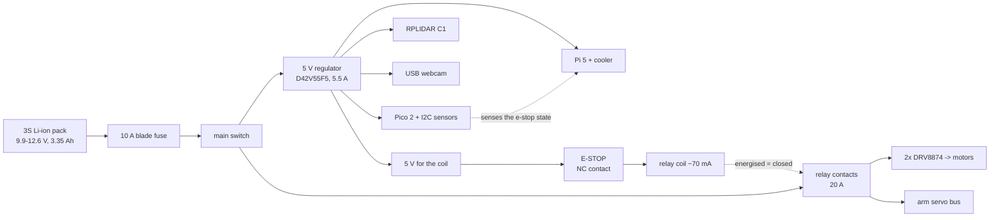

# 20.02 — Hardware integration — mounting, power v2, compute, cabling

<!-- glance:start -->
<!-- generated by tools/build.py from curriculum/syllabus.yaml — edit the syllabus, not this block -->

| | |
|---|---|
| **Track** | Main path |
| **Difficulty** | Advanced |
| **Time** | 3 h |
| **Hardware** | Stage 1 robot: Pi 5, Pico, encoder motors, driver, chassis, battery, distance sensors (stage 1), 2D LiDAR (stage 3), Camera (Raspberry Pi Camera Module 3 or USB webcam) (stage 2), Robotic arm (leader + follower kit) (stage 5) |
| **Software** | none |
| **Prerequisites** | [20.01 Final robot system architecture](20.01-final-architecture.md)<br>[02.08 From breadboard to a soldered robot board](../02-robot-electronics/02.08-from-breadboard-to-perfboard.md) |
| **Optional prerequisites** | [FP.07 Center of mass and tipping stability](../optional-foundations/physics/FP.07-center-of-mass-stability.md)<br>[F3D.05 Exercise: design a sensor mounting bracket](../optional-foundations/3d-printing-and-cad/F3D.05-mounting-bracket.md) |
| **Skip if** | Never. |

<!-- glance:end -->

## What you will learn

- Lay out the final robot's decks so the LiDAR sees, the camera sees, the arm reaches and the centre of gravity stays behind the wheel axle.
- Split the robot into two power domains — always-on compute and switched actuators — and wire the e-stop so it removes actuator energy without killing the computer.
- Size every current-carrying branch: gauge, voltage drop, fuse, relay, and the ampacity that limits them all.
- Predict the deceleration at which your robot tips forward, and move mass until it cannot.
- Build a harness you can debug: labelled, strain-relieved, with power and signal separated and a service loop everywhere something moves.

## Why it matters

Everything on karmel has been true up to now with parts on a bench and a USB cable to a laptop. The final robot carries its own power, a spinning LiDAR, a camera, a 700 g arm and an e-stop, drives at 0.3 m/s and gets picked up by the handle you did not design. Integration failures at this stage are not subtle: the robot browns out and reboots whenever both motors start, the arm reaches forward and the robot falls on its face, the LiDAR sees a cable tie as a wall in every scan, or the e-stop cuts power to the Pi mid-write and corrupts the SD card.

Each of those is one number away from being obvious in advance: a voltage drop, a centre of gravity, a sensor plane, a power domain boundary. This lesson computes all four, and the file that does it is the same one lesson [20.06](20.06-demo-and-beyond.md) uses to budget the demo — so when you change the hardware, the demo plan changes with it.

<!-- prereqs:start -->
## Prerequisites

You need these first:

- [20.01 Final robot system architecture](20.01-final-architecture.md)
- [02.08 From breadboard to a soldered robot board](../02-robot-electronics/02.08-from-breadboard-to-perfboard.md)

### Optional prerequisite links

New to any of these? Take the foundation lesson first; skip it if you already know it.

- [FP.07 Center of mass and tipping stability](../optional-foundations/physics/FP.07-center-of-mass-stability.md)
- [F3D.05 Exercise: design a sensor mounting bracket](../optional-foundations/3d-printing-and-cad/F3D.05-mounting-bracket.md)

Check your readiness: `python course.py why 20.02`
<!-- prereqs:end -->

## Concept

The final robot is not "the Stage-1 robot with more things bolted on". Three things are genuinely new, and each one has a first-principles reason.

**The robot now has two power domains, not one.** Up to now everything ran off one switched rail. The final robot must be able to remove energy from anything that moves while the computers stay alive — so the Pi can log what happened, flush the SD card and shut down cleanly, and so releasing the e-stop does not silently restart a half-finished motion. So: one always-on domain (Pi, Pico, sensors, the relay coil) and one switched domain behind the e-stop relay (motor drivers, arm servos). The boundary is a design decision you can get wrong in exactly one way — putting something that moves on the always-on side.

**Mass moved, so stability changed.** karmel touches the ground at three points: two drive wheels on the axle and one ball caster 100 mm *in front* of them. There is nothing behind. That is fine while the centre of gravity sits ahead of the axle and terrible the moment it does not, and a 700 g arm on a 2 kg robot moves the centre of gravity by centimetres. A robot that sits back on its tail when it starts, or noses over the caster when the arm reaches out with a payload, is not a software problem and cannot be fixed in software.

**The harness is now a system.** Eight or nine connections becomes thirty. The difference is not quantity: it is that you can no longer hold the wiring in your head, so it has to be written down, labelled and checked — the same reason you stopped keeping your service topology in your head.

> [!TIP]
> **Ask your teacher:** "Ask me where each of karmel's loads belongs — compute domain or actuator domain — and make me justify the two that are genuinely arguable."

## Technical explanation

### Level 1 — The floorplan, and the three things that constrain it

Before any screws, five constraints decide the layout, and four of them are geometric:

| Constraint | The rule | Why |
|---|---|---|
| **LiDAR plane** | nothing within ±2 cm of the scan plane, 360° around | a cable tie 3 cm from the scanner is an obstacle in *every* scan and a permanent phantom wall in the map |
| **Camera cone** | the arm, when parked, must not be in the camera's 1.20 rad horizontal FOV | a gripper in the corner of every frame breaks a detector you trained without it |
| **Arm base** | as far back and as low as the reach allows, bolted through the chassis plate | reach costs stability; the arm's own reaction torque tries to rotate the robot |
| **Battery** | lowest deck, between the axle and the caster (so *forward*) | the heaviest single item is your centre-of-gravity adjustment knob, and the caster is at the front |
| **Serviceability** | SD card, USB ports, the Pico's BOOTSEL button and the fuse reachable without disassembly | you will remove the SD card more often than you expect |

The LiDAR constraint is the one people discover late. karmel's LiDAR sits at z = 0.12 m; anything at that height within the chassis footprint is in the scan. Route cables below 0.10 m or above 0.14 m, and if the arm crosses the plane when parked, park it differently.

> [!NOTE]
> Holding a sensor at an exact height and angle usually means printing a bracket for it, and a bracket that
> flexes moves your extrinsic calibration every time the robot hits a doorstep. Never designed one? →
> [F3D.05 Exercise: design a sensor mounting bracket](../optional-foundations/3d-printing-and-cad/F3D.05-mounting-bracket.md).
> Skip it if you can already choose a print orientation so the bolt holes are not the weakest layer.

### Level 2 — Two power domains, one boundary

Here is the boundary, drawn as the rule that checks it: *every load that moves something lives behind the relay*. `py 20-final-robot/code/power_budget_v2.py rails` prints both sides:

```text
COMPUTE (always on: logs, shuts down cleanly)
  Raspberry Pi 5 (8 GB), full ROS 2 stack          5.0V    1.30    2.00    10.0
  Active Cooler fan                                5.0V    0.05    0.10     0.5
  RPLIDAR C1 (spin motor + scanner)                5.0V    0.30    0.40     2.0
  USB webcam C920                                  5.0V    0.20    0.35     1.8
  Pico 2 + 3.3 V sensors (via USB)                 5.0V    0.07    0.11     0.6
  INA226 + e-stop relay coil                       5.0V    0.08    0.09     0.4
  TOTAL                                                    2.00    3.05    15.2

ACTUATOR (behind the e-stop relay)
  2x drive motors (Yahboom 520, 1:56)             10.8V    1.00    5.90    63.7
  6x arm servos (SO-101, STS3215 class)           10.8V    0.60    4.20    45.4
  TOTAL                                                    1.60   10.10   109.1
```

Two entries in that table are worth arguing about, and the argument is the lesson.

The **LiDAR has a motor in it**, and it is on the compute side. That is deliberate: the LiDAR is a sensor, it cannot hurt anyone, and killing it on every e-stop means a three-second spin-up before the robot can see again. "Behind the e-stop" means *things that apply force to the world*, not *things that rotate*.

The **relay coil** is on the compute side, and it is fed **through** the e-stop's normally-closed contact. Pressing the button opens the NC contact, the coil de-energises, and the relay drops the actuator supply. The button carries tens of milliamps, not tens of amps — its contacts are rated for a coil, not for a stalled motor.

```text
Battery + ──[fuse 10 A]──[main switch]──┬──▶ 5 V regulator ──▶ Pi 5, Pico, LiDAR, camera  (ALWAYS ON)
                                        │                         │
                                        │              5 V ──[E-STOP NC]──▶ relay coil
                                        │                                      │
                                        └──────────[relay contacts]────────────┴──▶ motor drivers
                                                                                └──▶ arm servo bus
                                                            (ACTUATOR DOMAIN: dead when the button is in)
Battery − ──────────────────────────────┴──▶ single star ground point ──▶ everything
```

> [!CAUTION]
> **Safety:** the battery is disconnected — not just switched off — before you touch any of this wiring, and you check polarity with a multimeter before reconnecting. A 3S Li-ion pack with a shorted lead delivers tens of amps into whatever is closest. Fuse first, switch second, everything else after ([SAFETY.md](../SAFETY.md) rules 4, 9).

### Level 3 — Sizing the branches

Four numbers per branch, and three of them are one formula each.

**Voltage drop.** The current leaves on one conductor and returns on another, so the loop resistance is twice the one-way resistance:

$$\Delta V = 2 \, L \, \rho_{\text{AWG}} \, I$$

18 AWG copper is 20.95 mΩ/m. The 0.25 m run from the relay to the motor drivers at an 8.85 A transient is $2 \times 0.25 \times 0.02095 \times 8.85 = 0.093$ V — 0.86 % of a 10.8 V pack. Fine. The same run in 24 AWG jumper wire (84.2 mΩ/m) would drop 0.37 V, and through four Dupont contacts at 30 mΩ each another 1.06 V: a brown-out you would spend an evening blaming on the battery. This is exactly the measurement lesson [02.02](../02-robot-electronics/02.02-power-budget.md) made you take on a breadboard; the final robot is where it stops being theoretical.

**Ampacity.** How much current the wire can carry continuously, bundled, without the insulation cooking: about 8 A for 18 AWG and 13 A for 16 AWG in a chassis harness. This is not the free-air rating from a table of single suspended conductors, and it is the number that caps the fuse.

**Fuse.** Two bounds at once:

$$1.25 \, I_\text{continuous} \;\le\; I_\text{fuse} \;\le\; I_\text{ampacity}$$

Below the lower bound the fuse blows every time the motors accelerate, and a robot that dies at random is a robot whose fuse you eventually replace with a bolt. Above the upper bound the wire is the fuse. For the motor branch: $1.25 \times 5.9 = 7.4$ A, so a 7.5 A blade fuse, comfortably under the 8 A ampacity.

**Relay.** Rated above the *stall* current of everything on the switched side, with margin. Two 520 motors at the DRV8874's 2.95 A current limit plus six servos is a worst case near 10 A, so the 20 A relay from [stage 6](../hardware/stage-6-final-robot.md) is right and the ₪3.90 10 A relay is not.

`py 20-final-robot/code/power_budget_v2.py branches` does all four:

```text
branch                                        AWG     m  cont A  peak A  drop V  drop %  heat W   fuse
pack -> fuse -> main switch (everything)       16  0.15    7.61   11.81   0.047    0.43    0.55  10.0A
main switch -> 5 V regulator (compute)         18  0.20    1.71    2.23   0.019    0.17    0.04   3.0A
e-stop relay -> motor drivers                  18  0.25    5.90    8.85   0.093    0.86    0.82   7.5A
e-stop relay -> arm servo bus                  18  0.45    4.20    5.46   0.103    0.95    0.56   7.5A
```

Note the 5 V regulator's row. A switching regulator is a constant-*power* load, so it draws its **largest** current at the **lowest** pack voltage: 15.2 W at 90 % efficiency is 1.71 A at 9.9 V but only 1.34 A at 12.6 V. Size that branch at the empty-battery end, which is also when the battery's internal resistance is highest and everything else is already marginal.

### Level 4 — Where the mass ended up

> [!NOTE]
> New to centre of mass, the support polygon and what "tipping" means as a calculation rather than a feeling? →
> [FP.07 Center of mass and tipping stability](../optional-foundations/physics/FP.07-center-of-mass-stability.md).
> Skip it if you can already find the combined centre of gravity of three parts from their masses and positions
> and say why mass cancels out of the tipping condition.

karmel has a triangular support polygon: the two wheels at $x = 0$ and the ball caster at $x = +0.10$ m (`chassis.caster_offset_x_m`). There is nothing *behind* the axle. Two consequences:

**Static.** The centre of gravity must be *ahead* of the axle, full stop. Not "near", ahead. (Check which way round your own robot is before reusing any of this: the same triangle pointed the other way inverts every conclusion below, and karmel's caster was at $-0.10$ m until 2026-09 — see [11.09](../11-slam/11.09-slam-troubleshooting.md) Level 3b for what that cost.)

**Dynamic.** Accelerating makes inertia act backwards at the centre of gravity's height while gravity acts down at its horizontal position. The robot pivots about the wheel axle when

$$m\,a\,z_\text{cg} > m\,g\,x_\text{cg} \quad\Longrightarrow\quad a_\text{tip} = \frac{g\,x_\text{cg}}{z_\text{cg}}$$

Braking is the mirror image, over the caster instead of the axle, with $x_\text{caster} - x_\text{cg}$ on top. Mass cancels in both — a heavier robot is not a more stable one. Only the *geometry* of the mass matters.

`py 20-final-robot/code/power_budget_v2.py mass` for karmel as built:

```text
total mass          2.66 kg
centre of gravity   x +21 mm   y +0 mm   z 70 mm
stability margin    21 mm to the nearest support edge
rears up at         2.97 m/s^2 accelerating (karmel's configured limit is 1.0 m/s^2)
noses over at       10.95 m/s^2 braking
```

21 mm ahead of the axle, 70 mm up, rears up at 2.97 m/s² — three times the 1.0 m/s² limit configured in `karmel.yaml`, and eleven times it on the braking side. Getting there took one decision: the 0.45 kg pack sits at x = +60 mm, between the axle and the caster, not behind the axle where there is room for it. Now move the arm from the front of the deck to the rear:

```text
$ py 20-final-robot/code/power_budget_v2.py whatif arm-back
centre of gravity   x -12 mm   y +0 mm   z 74 mm
stability margin    -12 mm to the nearest support edge
rears up at         0.00 m/s^2 accelerating
PROBLEM  centre of gravity is 12 mm behind the wheel axle: nothing supports the robot there
```

Twelve millimetres. The arm did not get heavier and the robot did not get taller; 0.7 kg moved 12.5 cm backwards and the robot now rests on its tail, stationary, before anyone has written a line of code. `whatif arm-extended` — the same arm reaching out with a payload — puts the centre of gravity 53 mm *ahead* of the axle, which is fine: on this robot, extending the arm is the safe direction and parking it is the dangerous one.

The fixes, in the order you should try them: move the battery forward (it is the heaviest single item and you control its position), move the arm base forward, lower the arm base, add a second caster *behind* the axle (which changes the support polygon and is the only fix that survives a rearward-parked arm), or ramp the acceleration command instead of stepping it ([14.11](../14-robotic-arm/14.11-arm-safety.md)).

One number worth sitting with: `whatif no-arm` reports a 14 mm margin. The bare base, with the battery already moved forward, is closer to its rear tipping limit than the fully-built robot is — and the *simulated* karmel, whose URDF puts the centre of mass 1.7 mm ahead of the axle, rocks about 5.6° nose-up on a full-rate acceleration step ([`labs/TESTED.md`](../labs/TESTED.md) §3.1). This is not a margin you inherit for free.

### Level 5 — Compute: heat, USB and the one bus everyone forgets

**Thermal.** The Pi 5 throttles its clock at 80 °C and harder at 85 °C, and a robot enclosure is a box with no airflow sitting above warm motor drivers.

> [!IMPORTANT]
> **Version-sensitive** (verified 2026-09 against the Raspberry Pi 5 documentation). The throttle thresholds and the official cooling options change between board revisions: check https://www.raspberrypi.com/documentation/computers/raspberry-pi.html before designing an enclosure, and measure with `vcgencmd measure_temp` and `vcgencmd get_throttled` under your own load.

The Active Cooler is not optional on a robot: an idle Pi 5 with no cooler reaches the throttle point under a sustained ROS 2 load, and a throttled Pi misses control deadlines rather than failing visibly. Mount it with the fan's intake clear, keep it out of the motor drivers' rising heat, and check `get_throttled` after a full session — a non-zero result means your compute plan ([20.01](20.01-final-architecture.md)) was measured on a CPU that was not running at full speed.

**USB.** The Pi 5 gives you two USB 3.0 and two USB 2.0 ports and a total budget of about 1.6 A across them with a 5 A supply. karmel plugs in a LiDAR (0.3–0.4 A), a webcam (0.2–0.35 A), the Pico (0.07 A) and, if you have one, an arm bus adapter. That fits, but "fits" means the *sum*, and the failure mode of exceeding it is a device silently resetting under load — which looks exactly like a driver bug. Put the LiDAR and the camera on different controllers where you can, keep the Pico on its own port, and if you add a powered hub, power it from the 5 V rail and not from the Pi.

**The shared bus nobody models.** The I²C bus carries the IMU, the ToF sensor and the INA226. One device that holds SDA low takes down all three at once, and the symptom is three unrelated drivers failing simultaneously. Keep the pull-ups correct, keep the bus short, and when three things break together suspect the thing they share ([02.09](../02-robot-electronics/02.09-electrical-debugging-method.md)).

## Diagram

Side view, with the numbers that constrain each deck:

```text
                         LiDAR plane: z = 0.120 m,  KEEP CLEAR +/- 0.02 m, 360 deg
   ........................[ RPLIDAR C1 ].........................  z = 0.12
        arm folded, z ~ 0.14                     camera z = 0.10, FOV 1.20 rad
             \  [ SO-101 arm ]  |                 [cam]-->
   deck 2 ----+----------------+-------------------+------------  z ~ 0.09
              |  Pi 5 + Active Cooler   |  e-stop box (reachable!)
   deck 1 ----+-------------------------+---------------------  z ~ 0.06
              |  Pico + drivers                 |  3S pack (0.45 kg, x = +60 mm)
   chassis ---+---------------------------------+-------------  z = 0.03
                  (o)                                (o)
              drive wheels                       caster
              x = 0, y = +/-100 mm               x = +100 mm
   ---------------------------------------------------------------- ground
              <-------- support polygon --------->
                    CG must live in here:  x = +21 mm, z = 70 mm
                    a_tip = g*x_cg/z_cg = 2.97 m/s^2 (rearing up)
```

The two power domains, and what the e-stop actually opens:



Every connection that carries current, as a table you fill in for your own robot:

| From | To | Signal | Gauge / colour | Voltage | Fuse | Label |
|---|---|---|---|---|---|---|
| pack + | fuse holder | battery + | 16 AWG red | 9.9–12.6 V | 10 A | `BAT+` |
| fuse | main switch | battery + | 16 AWG red | 9.9–12.6 V | — | `SW-IN` |
| main switch | 5 V regulator in | battery + | 18 AWG red | 9.9–12.6 V | 3 A | `REG-IN` |
| main switch | relay common | battery + | 16 AWG red | 9.9–12.6 V | — | `RLY-C` |
| relay NO | motor driver V+ | switched + | 18 AWG red | 9.9–12.6 V | 7.5 A | `MOT+` |
| relay NO | servo bus V+ | switched + | 18 AWG red | 9.9–12.6 V | 7.5 A | `ARM+` |
| 5 V rail | e-stop NC in | coil feed | 22 AWG orange | 5 V | — | `ES-IN` |
| e-stop NC out | relay coil | coil | 22 AWG orange | 5 V | — | `ES-OUT` |
| pack − | star ground | return | 16 AWG black | 0 V | — | `GND` |

> [!CAUTION]
> **Safety:** wire the e-stop's **normally-closed** contact in series with the relay coil, never in series with the motor current, and never in the Pi's supply. Confirm with a multimeter in continuity mode, button out and button in, *before* the battery goes back on. Releasing the button must not restart motion: the software requires an explicit re-enable ([20.04](20.04-safety-case.md)).

## Code

`20-final-robot/code/power_budget_v2.py` is the whole of this lesson as numbers you can change:

```bash
py 20-final-robot/code/power_budget_v2.py rails         # the two domains, load by load
py 20-final-robot/code/power_budget_v2.py branches      # gauge, drop, heat, fuse per branch
py 20-final-robot/code/power_budget_v2.py mass          # CG, stability margin, tipping
py 20-final-robot/code/power_budget_v2.py runtime       # session power -> minutes
py 20-final-robot/code/power_budget_v2.py check         # everything, exit 1 on a problem
py 20-final-robot/code/power_budget_v2.py whatif arm-back
py 20-final-robot/code/power_budget_v2.py whatif arm-extended
py 20-final-robot/code/power_budget_v2.py whatif jetson
```

The rule that catches the domain-boundary mistake is three lines:

```python
for load in loads:
    if load.is_actuator and load.domain != ACTUATOR:
        problems.append(f"{load.name}: an actuator on the always-on domain — the e-stop cannot cut it")
```

and the tipping check is the formula from Level 4, applied to the parts table:

```python
def tipping_accel_m_s2(cg: CentreOfGravity) -> float:
    if cg.x_m <= 0.0:
        return 0.0
    return G * cg.x_m / cg.z_m
```

Edit `karmel_v2_loads()` and `karmel_v2_parts()` to describe **your** robot — every entry is marked (datasheet), (measured) or (estimate), and turning the estimates into measurements is exercise 20.02-E4.

## Exercise

### Exercise 20.02-E1 — Predict the tipping point `[predict]`

Hardware: none.

Before running anything, predict:

1. karmel's centre of gravity is 21 mm ahead of the axle and 70 mm up. At what forward acceleration does it rear up? Compute it.
2. You move the 0.70 kg arm from x = +40 mm to x = −85 mm on a 2.66 kg robot. How far does the centre of gravity move, and in which direction? Do the arithmetic before running the script.
3. Does the robot tip *while standing still* in that configuration? Justify your answer from the support polygon, not from intuition.
4. You then add a 0.5 kg counterweight at x = +150 mm. Where is the centre of gravity, and what is the new tipping acceleration — and what has it done to the *braking* limit?

Then run `py 20-final-robot/code/power_budget_v2.py mass` and `whatif arm-back`, and add your counterweight to `karmel_v2_parts()` to check part 4.

### Exercise 20.02-E2 — The integration arithmetic `[coding]`

Hardware: none.

Implement `wire_drop_v`, `fuse_rating_a`, `centre_of_gravity` and `tipping_accel` in `labs/exercises/20.02/student.py`. The tests check them against the branch and mass tables of the real robot.

Check it: `python course.py check 20.02`

### Exercise 20.02-E3 — Your floorplan `[design]`

Hardware: none (paper, or any CAD you like).

Draw your robot's two decks to scale, top view and side view, marking: the LiDAR plane and everything that must stay out of it; the camera's horizontal FOV cone with the arm parked; the arm's base position and its reach circle; the battery; the e-stop, which must be reachable from standing without bending; and the SD card, USB ports and fuse. Then write the cable table from the Diagram section for *your* connections, with a label for each.

Now answer three questions in writing: what is in the LiDAR plane that should not be? What is in the camera's frame in every image? What do you have to remove to get the SD card out?

### Exercise 20.02-E4 — Measure, do not estimate `[hardware]`

Hardware: `robot-base`, `estop`, plus `lidar`, `camera`, `arm` if you have them. A multimeter (`tools`) and the INA219/INA226.

> [!CAUTION]
> **Safety:** wheels off the ground for every current measurement that involves driving. Battery disconnected while you insert the current shunt. Never measure current by putting a meter in parallel with anything — a multimeter in current mode is a short circuit with a display ([SAFETY.md](../SAFETY.md)).

1. Measure the **idle** pack current with everything booted and nothing moving. Compare with the compute domain's 2.00 A typical at 5 V (≈1.0 A at the pack).
2. Measure the pack current while driving at 0.3 m/s on a flat floor, wheels down, robot on the floor in a clear area. Compare with the 0.5 A/motor estimate.
3. Stall one wheel by hand for **under two seconds** and watch the current. Compare with the DRV8874's 2.95 A limit.
4. Measure the voltage at the pack terminals and at the motor driver's V+ *at the same instant* during a hard start. The difference is your harness's real voltage drop; compare with the 0.093 V the model predicts and explain any factor-of-three discrepancy (hint: contacts, not wire).
5. Put all four measurements into `karmel_v2_loads()`, re-run `check` and `runtime`, and write down the new session runtime.

### Exercise 20.02-E5 — Build the e-stop and prove it `[hardware]`

Hardware: `estop` (latching mushroom button + relay), `robot-base`, multimeter.

> [!CAUTION]
> **Safety:** battery disconnected for the wiring. Before the first powered test, the robot is on a stand with the wheels in the air and your hand is on the main switch. Nothing is in front of it and nobody else is in the room ([SAFETY.md](../SAFETY.md) rules 1, 2, 8).

1. Wire the e-stop NC contact in series with the relay coil, and the relay contacts in the actuator supply only.
2. With the battery **disconnected**, verify with a continuity tester: coil circuit closed with the button out, open with the button in; actuator supply open in both states (no coil power).
3. Connect the battery, boot, and confirm the Pi and the LiDAR stay up with the button pressed.
4. Wheels in the air, drive both motors at low speed, press the button. Measure how long the wheels keep turning and log the pack current before and after.
5. Release the button. **Confirm the robot does not resume motion**; if it does, you have an interlock to write before this robot moves on the floor again ([20.04](20.04-safety-case.md)).

## Expected result

**20.02-E1.** (1) $a_\text{tip} = 9.81 \times 0.021 / 0.070 = 2.94$ m/s², matching the script's 2.97 (the script uses the unrounded centre of gravity). (2) Moving 0.70 kg by 0.125 m on a 2.66 kg robot moves the centre of gravity backwards by $0.70 \times 0.125 / 2.66 = 0.033$ m, from +21 mm to about −12 mm. (3) Yes — the centre of gravity's ground projection is now outside the support triangle, whose rear edge is the wheel axle at x = 0, so the robot rests back on whatever is behind. No acceleration required. (4) A 0.5 kg mass at +150 mm gives $x_{cg} = (2.66 \times (-0.012) + 0.5 \times 0.150) / 3.16 = +0.014$ m and $a_\text{tip} \approx 2.0$ m/s² — recovered, at the cost of 0.5 kg of payload and runtime, and the braking limit falls from 14.7 to 12.5 m/s², which still does not matter. Moving the arm forward instead costs nothing.

**20.02-E2.** 17 tests pass. Your `wire_drop_v` reproduces every row of `branches`; `fuse_rating_a(5.9, 8.0)` is 7.5 and `fuse_rating_a(12.0, 8.0)` raises; your centre of gravity matches the reference to within floating point, at 2.66 kg and +21 mm.

**20.02-E3.** No automated check — this one is graded by your own robot. The usual answers to the three questions are: a USB cable and one standoff are in the LiDAR plane; the gripper's tip is in the bottom-right of every camera frame; and the SD card needs the second deck removed, which is why people run robots for months without ever re-imaging.

**20.02-E4.** Expect roughly: idle 0.9–1.3 A at the pack (the Pi dominates); driving at 0.3 m/s, 1.5–2.5 A total; a stalled wheel pinned near 2.9 A per motor by the DRV8874's current limit, not the 4 A the motor would draw unlimited. The measured voltage drop will be **two to four times** the model's, because the model counts wire and the real path adds connectors, the switch, the fuse holder and the relay contacts — typically 30–50 mΩ each, which at 6 A is 0.2–0.3 V on its own. Your runtime will come out shorter than the 107 min the model prints, mostly because your idle current is higher than the estimate.

**20.02-E5.** Pressing the button stops the wheels within a few hundred milliseconds — the motors coast, they do not brake, because the driver has no power to brake with. The pack current drops by the motor current and stays at the compute domain's idle level. The Pi stays up, the LiDAR keeps spinning, and `dmesg` shows nothing. On release, the wheels must stay stopped. If they resume, your software treated "e-stop released" as "resume", which is the single most dangerous default in this whole module.

## Troubleshooting

### Symptom: the Pi reboots whenever both motors start

Voltage, and you can localise it in two measurements. Put the meter on the 5 V rail at the Pi's input and start the motors: if 5 V dips below about 4.7 V, the regulator is browning out. Then measure at the pack terminals during the same event: if the pack itself sags below about 9.5 V, the problem is upstream (cells, contacts, fuse holder, a thin main branch) and no regulator can fix it. If the pack holds but 5 V dips, the regulator is undersized or its input branch is too thin — recompute the constant-power current at the *empty* pack voltage, not the nominal one.

### Symptom: the LiDAR shows a wall 4 cm from the robot in every scan

Something is in the scan plane. Look at the scan in RViz and read the *angle* of the phantom return: that angle points at the offending object. Cable ties, standoffs, the arm's parked elbow and the e-stop box are the usual suspects. If the phantom is at a fixed angle and a fixed distance, it is on the robot; if it moves, it is in the room.

### Symptom: the arm makes the robot roll backwards when it reaches out

Reaction torque, mostly. The centre-of-gravity shift is in your favour here — reaching forward moves the CG *towards* the caster and away from the rear edge — so if the robot rolls backwards when the arm goes out, suspect the torque the arm exerts on the base rather than a stability problem. Measure first: with the arm extended, can you rock the robot by pressing gently on the back? If yes, the CG is still near the axle and something else is wrong (check `power_budget_v2.py mass` with your own parts table). Fixes in order of cost: reduce the arm's speed and acceleration limits (the reaction torque is $\tau = I\alpha$, so halving the acceleration halves it), move mass forward, add a rear caster.

### Symptom: three drivers fail at once and none of them share code

They share a bus. Check what: I²C (IMU, ToF, INA226), the USB controller, or the 5 V rail. `i2cdetect -y 1` with all three powered tells you in one command whether the bus is alive. A single device holding SDA low, or a missing pull-up after you rewired, takes the whole bus down and produces three plausible-looking unrelated bugs.

### Symptom: everything works on the bench and fails on the robot

The difference is motion, heat and time. Run the same test with the robot moving; run it for twenty minutes rather than two; run `vcgencmd measure_temp` and `vcgencmd get_throttled` afterwards. A non-zero throttle word explains missed deadlines that no amount of code reading will. Intermittent faults that appear only while driving are almost always a connector that a vibration opens — grab each connector in turn and wiggle it while watching the telemetry.

## Common mistakes

- **Putting anything that moves on the always-on domain.** The e-stop then does not stop the robot, which is the one thing it exists to do. Run the `check` command; that rule is in it.
- **Cutting the Pi's power with the e-stop.** The computers must survive the stop: to log what happened, to hold the arm's brake state, and so that the SD card is not written to during a power cut.
- **Sizing the fuse from the driving current.** Size it from the sustained worst case (a stalled motor at the driver's current limit), then check it against the wire's ampacity. A fuse larger than the wire protects nothing.
- **Forgetting the return conductor in a voltage-drop calculation.** Your estimate is then exactly half the truth.
- **Believing the wire table.** Measured drop is typically two to four times the calculated one, because connectors, switches and fuse holders each add tens of milliohms. Measure it once so you know your robot's real multiplier.
- **Mounting the arm where it fits rather than where it balances.** Three centimetres forward is the difference between a robot that brakes and a robot that faceplants.
- **Cable ties instead of strain relief.** A tie holds a cable; strain relief takes the force *before* it reaches the connector. Every cable that crosses a moving joint needs a service loop and a fixed anchor on both sides.
- **No labels.** Thirty unlabelled black wires is a robot you will not debug at 23:00, and 23:00 is when you will debug it.

## Knowledge check

1. The 5 V regulator supplies 15.2 W at 90 % efficiency. What current does it draw from the pack at 12.6 V and at 9.9 V, and why do you size the branch for the second one?
   <details><summary>Answer</summary>

   $P_\text{in} = 15.2 / 0.9 = 16.9$ W, so $I = 16.9 / 12.6 = 1.34$ A full and $16.9 / 9.9 = 1.71$ A empty. A switching regulator is a constant-power load: the lower the input voltage, the more current it takes. You size for the empty-pack case because that is also when the pack's internal resistance is highest and its voltage is sagging — the two effects compound, which is why robots die at the end of a session rather than the start.
   </details>

2. Why is the e-stop's normally-closed contact wired to the relay coil rather than to the motor supply directly?
   <details><summary>Answer</summary>

   Current. The motor branch carries up to ~10 A with stalls and reversal transients; a 22 mm panel button's contacts are rated for control-circuit currents, and switching 10 A inductive loads through them arcs and welds them. The coil draws about 70 mA. It is also fail-safe in the right direction: a *broken wire* in the coil circuit de-energises the relay and stops the robot, which is exactly what a cut wire should do. If the button were in series with the motor supply, a wire that fell off would leave the robot running with a dead e-stop.
   </details>

3. karmel's centre of gravity is 21 mm ahead of the axle and 70 mm up. You add a 0.30 kg Jetson at x = +20 mm, z = 75 mm. Does stability improve or worsen? Compute the new tipping acceleration.
   <details><summary>Answer</summary>

   It is **almost exactly neutral**, and that is the interesting answer. New mass 2.96 kg; $x_{cg} = (2.66 \times 0.021 + 0.30 \times 0.020)/2.96 = 0.0211$ m and $z_{cg} = (2.66 \times 0.070 + 0.30 \times 0.075)/2.96 = 0.0705$ m, so $a_\text{tip} = 9.81 \times 0.0211/0.0705 = 2.93$ m/s², against 2.97. Adding mass at the existing centre of gravity changes nothing, because traction and inertia both scale with mass — put the same Jetson at x = −50 mm and the margin drops to 14 mm. The script agrees (`whatif jetson`). It costs you runtime and a 5 V rail that no longer fits, which is the *other* problem that scenario reports.
   </details>

4. Predict: you replace the 18 AWG motor branch with 24 AWG jumper wire "just for a test". The robot drives at 0.3 m/s and then hits a chair leg. What do you see?
   <details><summary>Answer</summary>

   Driving is fine — 1 A through 24 AWG over 0.25 m drops only 42 mV. The stall is where it shows: at 5.9 A the loop drops $2 \times 0.25 \times 0.0842 \times 5.9 = 0.25$ V in the wire alone, plus the same again in the Dupont contacts, and the driver's supply sags. The motor produces less torque than commanded, the wheel-velocity PID winds up trying to reach a setpoint it cannot, and the wire gets hot: $5.9^2 \times 0.042 = 1.5$ W in a thin wire in a bundle. Best case, the robot behaves oddly for a second. Worst case, the insulation softens where the bundle is tightest.
   </details>

5. Why is a spinning LiDAR on the always-on domain while a stationary arm servo is on the switched one?
   <details><summary>Answer</summary>

   "Behind the e-stop" means *applies force to the world*, not *has a motor*. The LiDAR's motor spins a mirror inside a plastic housing and cannot hurt anybody; killing it on every stop costs a three-second spin-up before the robot can see again, which makes the recovery *less* safe. An arm servo holding position is applying torque to a link that can swing — and the fact that it is not moving right now is a property of the software, which is exactly the thing an e-stop must not trust.
   </details>

6. You measure 0.31 V of drop across the motor branch where the model predicts 0.093 V. Where is the missing 0.22 V?
   <details><summary>Answer</summary>

   In the things the model counts as zero: connectors, the switch, the fuse holder and the relay contacts. Each of those is tens of milliohms — a pair of loose Dupont contacts alone can be 60 mΩ, which at 6 A is 0.36 V. The way to find it is a four-point measurement: probe across each junction in turn while the current flows, and the one with volts across it is the culprit. This is also why the course's harness uses XT60 (0.4 mΩ) for power rather than Dupont.
   </details>

7. The compute domain draws 15.2 W peak and the actuator domain 109 W peak. Why is the runtime figure dominated by the compute domain anyway?
   <details><summary>Answer</summary>

   Duty cycle. The motors run about 35 % of a session and the arm moves about 20 %, so their *average* contribution is small: `runtime` prints 11.1 W for the always-on compute and 16.2 W for the whole mission average. The compute side is 100 % duty by definition — it is on from the moment you boot, including the twenty minutes the robot spends sitting on the bench while you read a log. Peak power sizes the wire, the fuse and the relay; average power sizes the battery.
   </details>

## Practical challenge

Integrate the final robot, and produce the evidence.

1. Build the two power domains with the e-stop and relay, and the harness from your own cable table. Every branch labelled, fused and strain-relieved.
2. Run the acceptance measurements from 20.02-E4 and put every measured number into your copy of `power_budget_v2.py`. No entry may still say (estimate) unless you can say why measuring it is impractical.
3. Run `py 20-final-robot/code/power_budget_v2.py check` on your version and make it pass — or, if it does not, write down which problem you are accepting and why.
4. Measure the centre of gravity for real: balance the robot on a straight edge under the chassis, front to back, and mark where it balances. Compare with your computed $x_{cg}$ to within a centimetre. If they disagree, your parts table is wrong, not the robot.
5. Run the robot for a full session with `vcgencmd get_throttled` before and after, and record the result. Then measure the real runtime from full charge to the low-voltage warning, and compare with `runtime`.

> [!CAUTION]
> **Safety:** the balance test happens with the battery in place and the robot supported — a 2.7 kg robot dropped on its LiDAR is an expensive lesson. The runtime test runs down to the 10.5 V warning, never to the 9.9 V cutoff, and never unattended.

Acceptance criteria: the e-stop removes actuator power and leaves the computers up, verified with a current measurement; releasing it does not restart motion; every branch has a fuse sized between 1.25× continuous and the wire's ampacity; the measured centre of gravity is behind the axle and agrees with your model; the throttle word is zero after a full session; and your measured runtime is written down next to the predicted one with an explanation of the gap.

## You can skip this if…

Answer knowledge-check questions 2, 3 and 6 correctly without looking, and you can produce — for a robot you have actually built — a power-domain diagram with the e-stop in the coil circuit, a branch table with fuses justified against ampacity, and a measured centre of gravity that sits inside the support polygon with margin.

`python course.py skip 20.02 --reason "I have integrated a two-domain robot with a hardware e-stop and measured its power and balance"`

## Go deeper

- Raspberry Pi hardware documentation (power, thermals, USB current budget): https://www.raspberrypi.com/documentation/computers/raspberry-pi.html — the throttle thresholds and the official cooling and supply requirements.
- PowerStream wire gauge and resistance table: https://www.powerstream.com/Wire_Size.htm — the ohm-per-metre numbers used in the branch calculations, with ampacity columns.
- Pololu DRV8874 motor driver carrier: https://www.pololu.com/product/4038 — the current-limit behaviour that caps karmel's stall current, and how `VREF` sets it.
- ISO 13850, emergency stop function — principles for design: https://www.iso.org/standard/59970.html — the standard behind "opens the actuator energy, latching, and release must not restart".
- Battery University, BU-304a: safety concerns with Li-ion: https://batteryuniversity.com/article/bu-304a-safety-concerns-with-li-ion — why the fuse, the BMS and the charging rules in SAFETY.md are what they are.
- Slamtec RPLIDAR C1 product page: https://www.slamtec.com/en/C1 — the power draw, spin-up time and the scan plane geometry your floorplan has to respect.

## Progress checkpoint

- [ ] I can lay out the robot's decks against the LiDAR plane, the camera cone, the arm's reach and the centre of gravity.
- [ ] I can split the robot into two power domains and wire an e-stop that stops the actuators and not the computers.
- [ ] I can size a branch end to end: gauge, drop, ampacity, fuse, relay.
- [ ] I can compute the tipping deceleration and move mass until the robot is stable with the arm extended.
- [ ] My own robot's power and mass model is measured, not estimated, and it passes its own check.

`python course.py complete 20.02` (exercises done) · `python course.py master 20.02` (challenge done) · `python course.py struggle 20.02 "what was hard"`

Next: [20.03 — Software integration: bringup, health monitoring and diagnostics](20.03-software-integration-bringup.md).
