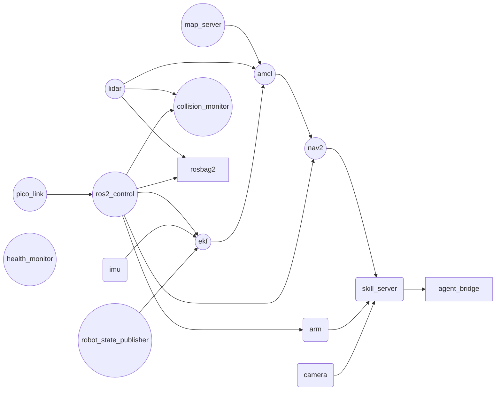

# 20.03 — Software integration — bringup, health monitoring and diagnostics

<!-- glance:start -->
<!-- generated by tools/build.py from curriculum/syllabus.yaml — edit the syllabus, not this block -->

| | |
|---|---|
| **Track** | Main path |
| **Difficulty** | Advanced |
| **Time** | 2 h |
| **Hardware** | none |
| **Software** | ros2 |
| **Prerequisites** | [20.01 Final robot system architecture](20.01-final-architecture.md) |
| **Skip if** | Never. |

<!-- glance:end -->

## What you will learn

- Turn "start the robot" into a dependency graph with a readiness condition per unit, and say who is blocked when any one of them fails.
- Publish a `diagnostic_msgs/DiagnosticStatus` from every component, aggregate it, and treat silence as a level of its own.
- Reduce the whole robot to one state — INIT, READY, DEGRADED, FAULT, ESTOP — and attach a mission policy to each.
- Design a DEGRADED mode on purpose, instead of discovering one at 23:00.
- Start the stack at boot with systemd in a way that stops cleanly and refuses to restart forever.

## Why it matters

[20.01](20.01-final-architecture.md) established which process runs where and what each interface promises. This lesson is the part that turns that design into a robot that starts — and, more importantly, into a robot that knows whether it started.

Sixteen processes with a dependency graph, started by a launch file, on a Pi with 8 % CPU headroom. Half of them take seconds to become useful: the RPLIDAR spins up for about three seconds, AMCL needs a scan and a map before it can publish `map`→`odom`, Nav2's lifecycle nodes activate in sequence. If a mission can start before all of that is true, then sooner or later a mission *does* start before all of that is true, and the robot drives on an empty costmap.

The second half is worse and more common: a driver that dies at minute twelve. Its last diagnostic message said `OK`, and unless somebody times that message out, the aggregator keeps reporting `OK` forever while the robot navigates with a frozen scan. "Is the robot healthy?" has to be a value the robot computes, with an expiry date, and every mission has to read it before it starts.

<!-- prereqs:start -->
## Prerequisites

You need these first:

- [20.01 Final robot system architecture](20.01-final-architecture.md)

### Optional prerequisite links

None.

Check your readiness: `python course.py why 20.03`
<!-- prereqs:end -->

## Concept

Two things, and they are the same thing seen from both ends.

**Bringup is a dependency graph, not a script.** A shell script that starts things with `sleep 3` between them encodes a guess about timing, and that guess is wrong on a cold SD card, on a busy CPU, or the day you add a node. The graph version says what each unit *needs* and how you *know* it is up — "`/scan` at ≥ 8 Hz for 2 s", not "we started the driver and waited". Then starting the robot becomes: compute the waves, start each wave, wait for its readiness conditions, go on. If a readiness condition never becomes true, you get a precise message instead of a robot that half works.

**Health monitoring is the same graph, running.** Each unit publishes its own status at a known rate; the aggregator takes the worst; a unit that stops publishing is `STALE`, which is worse than `ERROR` because you do not even know what is wrong. The robot's state is a pure function of those levels plus the e-stop, and every mission reads it.

The .NET analogy is exact and worth making once: this is a readiness probe and a liveness probe, an aggregated health endpoint, and a circuit breaker that refuses new work. What is different is the consequence. A service that accepts work while unhealthy returns errors; a robot that accepts a mission while unhealthy drives somewhere with a sensor it cannot trust.

One design decision runs through all of it: **DEGRADED is a state you design, not a grey area you end up in.** The camera dies. Should the robot stop entirely? No — it can still navigate, still return to its dock, still tell you what happened. Should it accept a "fetch the bottle" mission? Absolutely not. That is a policy, and it belongs in a table next to the state, not in whatever the agent decides to do.

> [!TIP]
> **Ask your teacher:** "Give me five failures on my robot one at a time and make me say which state each one produces and which missions stay allowed. Then tell me which of my answers were inconsistent with each other."

## Technical explanation

### Level 1 — What "ready" means, per unit

Every unit needs a condition you can *check*, not a duration you hope for. karmel's sixteen:

| Unit | Ready when | Criticality |
|---|---|---|
| `pico_link` | the serial hello `I <fw> <proto>` is answered within 2 s | required |
| `ros2_control` | `controller_manager` lists `diff_drive_controller` as `active` | required |
| `robot_state_publisher` | `/robot_description` latched, static transforms present | required |
| `lidar` | `/scan` at ≥ 8 Hz for 2 s | required |
| `imu` | `/imu/data` at ≥ 40 Hz | degraded |
| `camera` | `/camera/image_raw/compressed` at ≥ 10 Hz | degraded |
| `ekf` | `odom`→`base_footprint` newer than 0.2 s | required |
| `map_server` | `/map` latched | required |
| `amcl` | `map`→`odom` published, covariance below threshold | required |
| `nav2` | every lifecycle node `ACTIVE`, `navigate_to_pose` advertised | required |
| `collision_monitor` | `/cmd_vel` published (zeros count) at 20 Hz | required |
| `arm` | all six servos answer a ping, `/joint_states` at 50 Hz | degraded |
| `skill_server` | every skill action server advertised | degraded |
| `agent_bridge` | model API reachable, tool schema loaded | optional |
| `health_monitor` | `/diagnostics_agg` published | required |
| `rosbag2` | the `.mcap` file is growing | optional |

The criticality column is where the real design happens, and it has exactly three values:

- **required** — the robot does not move without it. Missing or broken means FAULT.
- **degraded** — some missions need it, none of the safety layer does. Missing means DEGRADED.
- **optional** — nothing about safety or motion depends on it. Missing means a note in the log.

Two entries are worth arguing about. `imu` is *degraded*, not required: without it `robot_localization` runs on wheel odometry alone, which drifts faster in heading but is enough to navigate a flat. `agent_bridge` is *optional*, because losing the internet means no new missions — not an unsafe robot. If you cannot defend a criticality, you have not thought about the failure.

### Level 2 — The graph, the waves and the timeline

`py 20-final-robot/code/bringup_health.py order` layers the graph into waves that can start in parallel:

```text
wave 0: camera, health_monitor, imu, lidar, map_server, pico_link, robot_state_publisher
wave 1: ros2_control
wave 2: arm, collision_monitor, ekf, rosbag2
wave 3: amcl
wave 4: nav2
wave 5: skill_server
wave 6: agent_bridge
```

Seven waves, and the critical path decides the number that matters. `timeline` adds the readiness durations:

```text
health_monitor           0.5 s    lidar                    4.0 s
map_server               1.0 s    ros2_control             5.0 s
robot_state_publisher    1.5 s    collision_monitor        6.0 s
imu                      2.0 s    amcl                     8.5 s
pico_link                2.0 s    arm                      9.0 s
camera                   3.0 s    nav2                    13.5 s
                                  skill_server            15.0 s
                                  agent_bridge            16.0 s

bringup complete at 16.0 s
```

Sixteen seconds, on the path `pico_link → ros2_control → (with lidar, map_server, ekf) amcl → nav2 → skill_server → agent_bridge`. Nothing on that path can be shortened by starting things "earlier"; they are already as early as their dependencies allow. If you want a faster bringup, attack the longest link on the path — `nav2`'s 5 s of lifecycle activation — not the LiDAR that finished at 4 s while other things were still starting.

Now kill one unit:

```text
$ py 20-final-robot/code/bringup_health.py timeline --fail lidar
bringup never completes: agent_bridge, amcl, collision_monitor, lidar, nav2, rosbag2, skill_server never become ready
robot state FAULT: no missions; stop and report (speed limit 0.00 m/s)
```

One USB device takes out seven of sixteen units. The arm, the EKF and the base are unaffected — which is exactly the kind of thing that is obvious in a graph and invisible in a launch file.

### Level 3 — Diagnostics: levels, staleness and the one state

ROS 2 already has the vocabulary, in `diagnostic_msgs`: a `DiagnosticStatus` has a `level` (`OK = 0`, `WARN = 1`, `ERROR = 2`, `STALE = 3`), a `name`, a `message` and a list of key/value pairs. A `DiagnosticArray` carries many of them with a stamp. `diagnostic_updater` gives every node a one-liner to publish them; `diagnostic_aggregator` groups them into a tree on `/diagnostics_agg`.

Three rules make that vocabulary useful:

**1. Every component reports at a known rate, and silence is a level.** This is the rule people skip and it is the one that catches real failures:

$$\text{level} = \begin{cases} \texttt{STALE} & \text{if } t_\text{now} - t_\text{last} > k \cdot T_\text{report} \\ \text{the reported level} & \text{otherwise}\end{cases}$$

with $k = 3$ reporting periods. A camera node that reports at 1 Hz and crashes at $t = 20$ s is `STALE` at $t = 23$ s — not `OK` forever, which is what its last message says. Note that $k$ multiplies the *component's own* period: a 0.2 Hz reporter may be quiet for 15 s; a 10 Hz reporter may not be quiet for half of one.

**2. The aggregate is the worst level, not the average.** Nine `OK`s and one `ERROR` is an `ERROR`. There is no such thing as a robot that is 90 % healthy.

**3. The robot's state is a function, and the order of its tests is the policy.**

```text
if estop:                              -> ESTOP     the button is a fact, not an opinion
elif bringup not complete/timed out:   -> INIT      4 s of spin-up is not a fault
elif any REQUIRED >= ERROR:            -> FAULT     however healthy everything else is
elif any REQUIRED-or-DEGRADED >= WARN: -> DEGRADED  a designed state, not a grey area
else:                                  -> READY
```

Get the order wrong and you get one of two classic bugs: a robot that reports FAULT for the first four seconds of every boot (so you learn to ignore FAULT), or a robot whose real fault is hidden behind a DEGRADED because the camera error was checked first.

And the state alone is not enough — attach the policy:

| State | Missions allowed | Speed limit |
|---|---|---|
| INIT | none; bringup in progress | 0.00 m/s |
| READY | all | 0.50 m/s |
| DEGRADED | navigation only, no manipulation; return-to-dock always allowed | 0.25 m/s |
| FAULT | none; stop and report | 0.00 m/s |
| ESTOP | none; explicit human re-enable required | 0.00 m/s |

The agent from module 19 reads this table. It does not invent policy, and "the LLM decided it was probably fine" is not a state.

Here is a session with three injected faults — `py 20-final-robot/code/bringup_health.py health`:

```text
     t  state     why
   0.0  INIT      pico_link is STALE
                    -> no missions; bringup still in progress; speed limit 0.00 m/s
  16.0  READY     everything OK
                    -> all missions; speed limit 0.50 m/s
  20.0  DEGRADED  camera is ERROR
                    -> navigation only, no manipulation; return-to-dock always allowed; speed limit 0.25 m/s
  33.0  FAULT     lidar is STALE
                    -> no missions; stop and report; speed limit 0.00 m/s
  38.0  DEGRADED  camera is ERROR
                    -> navigation only, no manipulation; return-to-dock always allowed; speed limit 0.25 m/s
```

Read the timestamps. The camera is unplugged at $t = 20$ and the state changes at $t = 20$, because the driver *reported* an error. The LiDAR stops publishing at $t = 30$ and the state changes at $t = 33$ — three reporting periods later, because nobody reported anything and the monitor had to time it out. That three-second gap is the price of detecting silence, and it is why the collision monitor has its own, much shorter, scan timeout: a health monitor is for deciding what missions may run, not for stopping the robot.

### Level 4 — Starting at boot, and stopping properly

Two launch files already exist in the course: `labs/ros2_ws/src/karmel_bringup/launch/robot.launch.py` brings up the base and controllers in simulation or on the real robot with one argument, and `navigation.launch.py` adds the map server, AMCL and Nav2. Running them by hand over ssh is fine for development and wrong for a robot that should come up when you flick the switch.

> [!IMPORTANT]
> **Version-sensitive** (verified 2026-09 against ROS 2 Jazzy on Ubuntu 24.04). Lifecycle activation, launch argument names and Nav2's bringup structure change between distros. Check https://docs.ros.org/en/jazzy/Tutorials/Intermediate/Launch/Launch-Main.html and https://docs.nav2.org/jazzy/ before copying any of this onto a different release, and compare with `curriculum/versions.yaml`.

`py 20-final-robot/code/bringup_health.py systemd` prints the unit file, and four lines in it are the lesson:

```ini
Environment=ROS_DOMAIN_ID=42
ExecStart=/bin/bash -lc 'source /opt/ros/jazzy/setup.bash && \
    source /home/karmel/ros2_ws/install/setup.bash && \
    ros2 launch karmel_bringup robot.launch.py sim:=false use_ekf:=true'
KillSignal=SIGINT
TimeoutStopSec=20
Restart=on-failure
StartLimitBurst=5
StartLimitIntervalSec=120
```

- **A systemd service has none of your shell environment.** No `~/.bashrc`, no sourced workspace, no `ROS_DOMAIN_ID`. Nearly every "it works over ssh and not at boot" story is this. Source explicitly and set the variables explicitly.
- **`KillSignal=SIGINT`.** The default `SIGTERM` gives rclpy no chance to run its shutdown path. With SIGINT the nodes get their normal Ctrl-C handling: zero the wheels, hold or park the arm, close the bag file. `TimeoutStopSec` bounds how long you wait before SIGKILL.
- **`Restart=on-failure`, not `always`.** A robot that restarts its stack in a loop while the arm is mid-trajectory is more dangerous than a robot that stays down. And `StartLimitBurst=5` in two minutes means: five failures is not a transient, it is a human's problem now.
- **Do not put the e-stop or the watchdog in here.** systemd is for convenience. Safety lives in the firmware and the relay ([20.04](20.04-safety-case.md)).

Two more integration details that cost afternoons:

**Time.** `use_sim_time` must be the same on *every* node, or tf lookups compare a wall clock with a simulated one and you get extrapolation errors that look like a tf bug. On the real robot, if the Pi has no RTC and no network at boot, its clock starts in 1970 and every stamped message is in the past — install `chrony` or accept that timestamps before the first NTP sync are meaningless.

**Logs.** `ros2 launch` writes to `~/.ros/log` and systemd captures stdout into the journal. Decide once where you look (`journalctl -u karmel -f` is a good default), and keep a rosbag of every autonomous session — `rosbag2` records MCAP by default since Iron, and [20.05](20.05-testing-strategy.md) turns those recordings into regression tests.

> [!TIP]
> **Ask your teacher:** "My robot comes up over ssh and not from systemd. Walk me through the diagnosis in the order a professional would, and do not tell me the answer until I have run the first two checks."

## Diagram

The dependency graph, generated by `py 20-final-robot/code/bringup_health.py graph` — double circles are required, single are degraded-capable, boxes are optional:



The same thing on a time axis, with the critical path marked:

```text
  t=0        2         4         6         8        10        12        14        16 s
  |----------|---------|---------|---------|---------|---------|---------|---------|
  health_monitor =|0.5
  map_server  ====|1.0
  robot_state_publisher ==|1.5
  imu         ========|2.0
  pico_link   ========|2.0   <<< critical path starts here
  camera      ============|3.0
  lidar       ================|4.0
  ros2_control        <<<<<<<<<<<<<|5.0          (waits for pico_link, then 3.0 s)
  ekf                           ===|6.0
  collision_monitor             ===|6.0
  arm                                 ========|9.0
  amcl                             <<<<<<<<<|8.5  (waits for map_server, lidar, ekf)
  nav2                                      <<<<<<<<<<<<<<<<<<|13.5
  skill_server                                                <<<<<|15.0
  agent_bridge                                                     <<<|16.0

  <<<  critical path: pico_link -> ros2_control -> amcl -> nav2 -> skill_server -> agent_bridge
```

## Code

`20-final-robot/code/bringup_health.py` is the graph, the health monitor and the state machine, runnable with no ROS:

```bash
py 20-final-robot/code/bringup_health.py order                  # the waves
py 20-final-robot/code/bringup_health.py timeline               # who is ready when
py 20-final-robot/code/bringup_health.py timeline --fail lidar  # ...and what one failure costs
py 20-final-robot/code/bringup_health.py timeline --slow nav2   # a unit that takes 10x longer
py 20-final-robot/code/bringup_health.py health                 # a 44 s session with faults
py 20-final-robot/code/bringup_health.py health --estop-at 20    # the same, with the button pressed
py 20-final-robot/code/bringup_health.py graph                  # the mermaid graph above
py 20-final-robot/code/bringup_health.py systemd                # the unit file for the Pi
```

The state machine is short enough to read in one go, and the comments are the policy:

```python
def robot_state(units, levels, *, estop=False, bringup_complete=True, bringup_timed_out=False):
    if estop:
        return RobotState.ESTOP
    if not (bringup_complete or bringup_timed_out):
        return RobotState.INIT
    by_name = {u.name: u for u in units}
    for name, level in levels.items():
        unit = by_name.get(name)
        if unit is not None and unit.criticality == "required" and level >= Level.ERROR:
            return RobotState.FAULT
    for name, level in levels.items():
        unit = by_name.get(name)
        if unit is None or unit.criticality == "optional":
            continue
        if level >= Level.WARN:
            return RobotState.DEGRADED
    return RobotState.READY
```

On the real robot the same logic lives in a `health_monitor` node subscribing to `/diagnostics`, and the launch files it supervises are:

- [`labs/ros2_ws/src/karmel_bringup/launch/robot.launch.py`](../labs/ros2_ws/src/karmel_bringup/launch/robot.launch.py) — base, controllers, sensors, optional EKF, `sim:=true|false`;
- [`labs/ros2_ws/src/karmel_bringup/launch/navigation.launch.py`](../labs/ros2_ws/src/karmel_bringup/launch/navigation.launch.py) — map server, AMCL and the Nav2 servers;
- [`labs/ros2_ws/src/karmel_bringup/launch/slam.launch.py`](../labs/ros2_ws/src/karmel_bringup/launch/slam.launch.py) — `slam_toolbox` when there is no map yet.

## Exercise

### Exercise 20.03-E1 — Predict the blast radius `[predict]`

Hardware: none.

For each of these single failures, write down **before running anything**: which other units never become ready, what state the robot ends in, and which missions stay allowed.

1. The LiDAR's USB cable is not plugged in.
2. The IMU's I²C address is wrong.
3. The arm's servo bus adapter is missing.
4. There is no internet.
5. `pico_link` never answers the hello.

Then check each with `py 20-final-robot/code/bringup_health.py timeline --fail <unit>` and explain any answer you got wrong. One of the five takes down more of the robot than the others by a wide margin — which, and why?

### Exercise 20.03-E2 — Implement the bringup and the state machine `[coding]`

Hardware: none.

Implement `start_waves`, `component_level` and `robot_state` in `labs/exercises/20.03/student.py`. The tests run them over karmel's real bringup graph and compare with the course implementation.

Check it: `python course.py check 20.03`

### Exercise 20.03-E3 — Time your own bringup `[simulation]`

Hardware: none (Docker with ROS 2 Jazzy, or the real robot if you have it).

1. Start the stack you have — in simulation, `ros2 launch karmel_bringup robot.launch.py sim:=true world:=apartment`, then `navigation.launch.py`.
2. Measure when each part becomes *useful*, not when it prints "started": `ros2 topic hz /scan` until it holds ≥ 8 Hz, `ros2 topic echo /tf --once` for `map`→`odom`, `ros2 action list | grep navigate_to_pose`, `ros2 lifecycle get /amcl`.
3. Build your own timeline. Which unit is on your critical path? Is it the same one as karmel's?
4. Write a `ready.sh` (or `ready.py`) that exits 0 only when every condition holds, and time how long it takes. That script is your bringup's readiness probe, and 20.06's demo runbook starts with it.

> [!CAUTION]
> **Safety:** if you run step 1 on the real robot, wheels off the ground. A bringup that ends with a controller active is a robot that will move the moment anything publishes a velocity ([SAFETY.md](../SAFETY.md) rule 1).

### Exercise 20.03-E4 — Classify your own components `[design]`

Hardware: none.

List every component of *your* robot and assign each one `required`, `degraded` or `optional`. For each, write one sentence: "if this is gone, the robot can still …". Then write your own mission policy table: for each state, which missions are allowed and what the speed limit is.

Two rules to hold yourself to: every `degraded` component must have at least one mission that still works without it (otherwise it is `required`), and every `optional` component must have zero effect on safety (otherwise it is `degraded`). Anything you cannot justify goes in `required` — that is the safe default and it is allowed to be the answer.

### Exercise 20.03-E5 — Diagnose from the trace alone `[debugging]`

Hardware: none.

A robot in the field produces this health trace:

```text
     t  state     why
   0.0  INIT      pico_link is STALE
  16.0  READY     everything OK
 214.0  DEGRADED  imu is WARN
 226.0  FAULT     ekf is STALE
 226.0  FAULT     amcl is STALE
```

The robot was driving a delivery route on a wooden floor when this happened. Answer, with reasoning:

1. What is the most likely single root cause? Name the physical thing.
2. Why did `ekf` go `STALE` twelve seconds *after* the IMU warning, rather than immediately?
3. Why did `amcl` follow `ekf` and not the other way around?
4. What is the *first* command you run on the robot, and what would each possible outcome tell you?
5. The robot stopped. Did anything stop it, or did it merely stop being commanded? Which mechanism, and after how long?

## Expected result

**20.03-E1.** (1) LiDAR: `amcl`, `nav2`, `collision_monitor`, `skill_server`, `agent_bridge` and `rosbag2` never come up — seven units including itself — state FAULT, no missions. This is the big one, because both localization *and* the safety layer depend on it. (2) IMU: nothing is blocked — `ekf` lists it as a dependency in the model, but on the real robot `robot_localization` runs without it; state DEGRADED. (3) Arm: `skill_server` and `agent_bridge` blocked; state DEGRADED, navigation still allowed. (4) No internet: only `agent_bridge`; state READY, but no new missions arrive. (5) `pico_link`: `ros2_control` and everything below it — the robot cannot move at all; state FAULT.

**20.03-E2.** 22 tests pass. Your `start_waves` reproduces karmel's seven waves exactly, including the alphabetical order inside each one.

**20.03-E3.** In simulation expect a faster bringup than the model's 16 s for the sensors (Gazebo's LiDAR is ready as soon as the world loads) and a *slower* one for Nav2, whose lifecycle activation is typically 5–10 s and is usually the critical path in sim. On the real robot the RPLIDAR's spin-up and the controller manager's hardware activation dominate the early waves. Your `ready.sh` should take within a few seconds of your measured timeline; if it returns instantly, you are checking that nodes exist rather than that topics flow.

**20.03-E4.** No automated check. A common mistake on a first pass is marking the camera `required` — it is not, unless every one of your missions involves perception. A second is marking the IMU `optional`: losing it degrades heading estimation, which does affect navigation quality, so it is `degraded`.

**20.03-E5.** (1) The IMU's I²C connection — a connector working loose from vibration on a hard floor is the classic version; a bus-level fault (a pull-up, or another device on the same bus holding SDA) is the alternative. (2) The EKF kept running on wheel odometry while the IMU merely *warned* (retried reads). It went `STALE` only when it stopped publishing entirely — which happens when the driver finally gives up and the EKF blocks or exits — and then the monitor needed three reporting periods to notice. (3) `amcl` consumes the `odom`→`base_footprint` transform the EKF publishes; with no odometry it cannot update, so it stops publishing `map`→`odom`. Dependencies fail downstream, which is why the graph tells you where to look. (4) `i2cdetect -y 1`: if the IMU's address is missing, it is the device or the wiring; if *all* addresses are missing, it is the bus (pull-ups, a shorted device, the 3.3 V rail); if everything is present, the problem is in the driver and you go to `journalctl`. (5) Nothing stopped it deliberately. The state went FAULT, so the mission layer refused to issue new goals — and then `controller_server` stopped publishing velocities, `collision_monitor` published zero, and the base halted within 0.5 s. If the Pi had crashed instead, the Pico's 300 ms watchdog would have been the mechanism. The health monitor never stops a robot; it only decides what may start.

## Troubleshooting

### Symptom: it works over ssh and not from systemd

Environment, nine times out of ten. Run `systemctl show -p Environment karmel` and compare with `env` in your ssh session. The four that matter are `ROS_DOMAIN_ID`, `RMW_IMPLEMENTATION`, `AMENT_PREFIX_PATH` (from sourcing the workspace) and `HOME`. Then check the ordering: a service that starts before the network or before `/dev/ttyACM0` exists fails in a way that looks random — `After=network-online.target` and a udev rule for the Pico fix that. `journalctl -u karmel -b --no-pager` shows what it actually printed.

### Symptom: a node "started" but nothing works

You checked the wrong thing. Started is not ready. Walk down the ladder: does the process exist (`ps`), is the node visible (`ros2 node list`), is the topic advertised (`ros2 topic list`), is data flowing (`ros2 topic hz`), is it at the contracted rate ([20.01](20.01-final-architecture.md)), and — for lifecycle nodes — is it actually `ACTIVE` (`ros2 lifecycle get /amcl`)? Nav2's servers all configure and activate, and a node stuck in `inactive` advertises nothing while looking perfectly alive in `ros2 node list`.

### Symptom: the diagnostics say OK and the robot is clearly broken

Something is not being timed out. Check three things in order: does the component publish a status at all (`ros2 topic echo /diagnostics | grep -A3 <name>`), does your monitor have a period for it, and is that period the component's real rate rather than an optimistic one? A component that is missing from the aggregator entirely is the worst case — it cannot be `STALE` because nobody is expecting it. Your health monitor should enumerate the *expected* components from the same list the bringup uses, not from whatever shows up.

### Symptom: the robot flaps between READY and DEGRADED

A level is oscillating around a threshold, usually a rate check or a covariance check, and the fix is hysteresis, not a different threshold. Require the condition to hold for N consecutive reports before changing state, with N larger for going *up* (to READY) than for going down. A robot that goes to DEGRADED instantly and back to READY only after three good seconds is behaving correctly; one that changes state twice a second is generating noise you will learn to ignore.

### Symptom: bringup is slow and you cannot see why

Measure, do not guess. Log a timestamp when each readiness condition first becomes true, sort, and look at the *gaps*, not the totals. A unit that finishes at 13.5 s might have been waiting 8.5 s for its dependency and taken 5 s itself — only the 5 s is yours to optimise. `ros2 launch --show-args` and the launch log's `[INFO] process started with pid` lines give you the start times for free.

## Common mistakes

- **`sleep 5` as a dependency.** It is wrong on a slow SD card, wrong when you add a node, and it fails silently. Write the readiness condition instead.
- **Treating "the node is running" as "the node works".** A driver with a disconnected sensor stays running forever.
- **No staleness rule.** The single most common cause of a robot that navigates on a frozen scan. A last message that says `OK` is not evidence that anything is alive.
- **Aggregating by averaging.** The worst level is the answer; there is no 90 %-healthy robot.
- **No DEGRADED state.** Then every fault is either ignored or fatal, and the robot with a dead camera either drives blind or refuses to come home.
- **A health monitor that stops the robot.** That is the collision monitor's job, on a 0.15 s timescale. Health gating operates on which *missions* may start, on a multi-second timescale; mixing them makes the robot stop for reasons nobody can trace.
- **`Restart=always` on the robot's stack.** A crash loop with an arm mid-trajectory is worse than a robot that stays down and tells you.
- **Mixed `use_sim_time`.** One node on the wall clock among nine on sim time produces tf extrapolation errors that look like a transform bug and are a clock bug.

## Knowledge check

1. A camera driver crashes at $t = 20$ s. It published `DiagnosticStatus` at 1 Hz with a tolerance of 3 periods. When does the robot's state change, and why not at $t = 20$?
   <details><summary>Answer</summary>

   At about $t = 23$ s. Nothing announces a crash: the process is simply gone, so the monitor has to *infer* it from silence, and it waits three reporting periods before declaring `STALE` to avoid reacting to one dropped message. That delay is the cost of detecting absence rather than presence, and it is why safety-critical timeouts (the collision monitor's 1 s scan timeout, the Pico's 300 ms watchdog) are much shorter and live elsewhere.
   </details>

2. Why is `INIT` checked before `FAULT` but after `ESTOP`?
   <details><summary>Answer</summary>

   Before `FAULT` because during bringup, components that are not up yet are legitimately missing: a LiDAR that needs 4 s to spin is not a fault for those 4 s, and a robot that reports FAULT on every boot trains you to ignore FAULT. After `ESTOP` because the e-stop is a fact about the hardware — actuator power is *already* gone — and no amount of "we are still booting" changes that. The bringup deadline exists so that "still booting" cannot hide a real failure forever.
   </details>

3. The LiDAR fails. Seven units never become ready. Which ones, and which parts of the robot still work?
   <details><summary>Answer</summary>

   `lidar` itself, plus `amcl`, `collision_monitor`, `nav2`, `skill_server`, `agent_bridge` and `rosbag2`. Still working: `pico_link`, `ros2_control`, `robot_state_publisher`, `imu`, `camera`, `ekf`, `map_server`, `arm`, `health_monitor` — so the base can be teleoperated, odometry runs, and the arm works. The state is FAULT because `lidar` is `required`, so no autonomous mission starts; this is correct, since both the localiser and the safety layer depend on that one USB device.
   </details>

4. Predict: you mark the camera `required` instead of `degraded`. The USB cable works loose during a delivery run. What does the robot do, and what should it have done?
   <details><summary>Answer</summary>

   It goes to FAULT and refuses every mission — including "return to the dock" — so it stops wherever it is and waits for a human. With `degraded` it goes to DEGRADED, refuses manipulation missions (which is right: it cannot see the object), keeps navigation at the reduced 0.25 m/s limit, and drives itself home. The difference between a robot you fetch from under the sofa and a robot that comes to you is one word in a table.
   </details>

5. `use_sim_time` is `true` on Nav2 and `false` on your camera driver. What is the symptom?
   <details><summary>Answer</summary>

   Timestamps from the two sets of nodes come from different clocks — one from Gazebo's `/clock`, one from the wall clock — and they differ by however long the machine has been up. tf2 lookups fail with `ExtrapolationException` ("requested time is in the future/past"), costmaps refuse observations as too old, and everything looks like a transform problem. The check is `ros2 param get /<node> use_sim_time` on every node, and the fix is to set it once in the launch file for all of them.
   </details>

6. Why should a health monitor never command the robot to stop?
   <details><summary>Answer</summary>

   Timescales and responsibility. It works in multi-second units (three reporting periods just to notice silence), which is far too slow to be a safety mechanism — that job belongs to the collision monitor at 0.15 s, the `cmd_vel` timeout at 0.5 s and the firmware watchdog at 0.3 s. And if the monitor can also command motion, it becomes another writer in the actuation path, which [20.01](20.01-final-architecture.md) forbids. Its job is to decide what may *start*, which is a gate, not a brake.
   </details>

7. Your bringup takes 16 s and management wants 8. Where do you look first, and what would halving the LiDAR's spin-up time buy you?
   <details><summary>Answer</summary>

   At the critical path: `pico_link (2.0) → ros2_control (3.0) → amcl (2.5) → nav2 (5.0) → skill_server (1.5) → agent_bridge (1.0)`. Nav2's 5 s of lifecycle activation is the biggest single term, so that is where the time is. Halving the LiDAR's 4 s buys **nothing**: it finishes at 4 s while `ros2_control` is still starting, so it is not on the path. Optimising off the critical path is the most common way to spend a day and change nothing — exactly the same lesson as the latency chains in 20.01.
   </details>

## Practical challenge

Give your robot a bringup it can prove and a health state it can publish.

1. Write your own unit table — every component, its dependencies, its readiness condition, its criticality — as data, not prose.
2. Implement the readiness probe: a script that checks every condition and exits non-zero with a specific message naming the first unmet one. Run it after every bringup, and put it at the top of your demo runbook.
3. Write a `health_monitor` node: subscribe to `/diagnostics`, enumerate the *expected* components from your unit table, apply the staleness rule, compute the state, and publish it on a latched topic with its reason string.
4. Gate missions on it. The skill server (module 19) refuses to accept a goal unless the state allows it, and the speed limit comes from the same table — enforced in `ros2_control`, not in a prompt.
5. Install the systemd unit, reboot the robot, and confirm from the journal alone that it came up, what its state was at $t = 30$ s, and that a `systemctl stop` left the wheels at zero and the arm parked.
6. Then break it on purpose, three times: unplug the LiDAR mid-run, kill the EKF with `pkill`, and pull the camera's USB. Record the state transition and the time from fault to detection for each.

> [!CAUTION]
> **Safety:** every "break it on purpose" test runs with the robot on a stand, or on the floor in a cleared area with a hand on the e-stop. A fault injection that starts with the robot driving is a fault injection with a moving robot ([SAFETY.md](../SAFETY.md) rules 1, 8).

Acceptance criteria: the readiness probe names the first unmet condition; the health monitor detects each of the three injected faults and reports the expected state; the detection times are recorded and match your staleness rule to within a period; missions are refused in FAULT and DEGRADED by code rather than convention; and the robot comes up from a cold boot with no keyboard.

## You can skip this if…

Answer knowledge-check questions 1, 3 and 6 correctly without looking, and you can show a robot you built that publishes an aggregated health state with a staleness rule, gates missions on it, and comes up from a cold boot under a supervisor that stops it cleanly.

`python course.py skip 20.03 --reason "My robot has a checked bringup, an aggregated health state with staleness, and mission gating"`

## Go deeper

- ROS 2 launch documentation: https://docs.ros.org/en/jazzy/Tutorials/Intermediate/Launch/Launch-Main.html — launch files, arguments, event handlers and the hierarchy the bringup uses.
- ROS 2 managed (lifecycle) nodes design article: https://design.ros2.org/articles/node_lifecycle.html — the state machine behind `configure`/`activate`, and why "running" and "active" are different questions.
- The ROS diagnostics stack (`diagnostic_updater`, `diagnostic_aggregator`): https://github.com/ros/diagnostics — the reference implementation of the levels, the updater and the aggregator tree.
- Nav2 lifecycle and bringup: https://docs.nav2.org/jazzy/getting_started/navigation_concepts/ — how the lifecycle manager sequences the navigation servers, which is the longest link in karmel's critical path.
- `systemd.service(5)` manual page: https://man7.org/linux/man-pages/man5/systemd.service.5.html — `Restart=`, `KillSignal=`, `TimeoutStopSec=` and the start-limit settings, with their exact semantics.
- rosbag2: https://github.com/ros2/rosbag2 — recording every autonomous session, and the MCAP format that [20.05](20.05-testing-strategy.md) replays.

## Progress checkpoint

- [ ] I can express a bringup as a dependency graph with a readiness condition per unit.
- [ ] I can say which units a single failure blocks, and what state the robot ends in.
- [ ] I can publish and aggregate diagnostics, and treat silence as its own level.
- [ ] I can write a robot state machine with a mission policy per state, and defend the order of its tests.
- [ ] My robot comes up from a cold boot under systemd and stops cleanly.

`python course.py complete 20.03` (exercises done) · `python course.py master 20.03` (challenge done) · `python course.py struggle 20.03 "what was hard"`

Next: [20.04 — The safety case: e-stop, watchdogs, safe shutdown and test procedures](20.04-safety-case.md).
