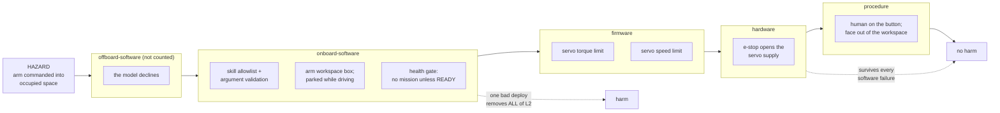

# 20.04 — The safety case — e-stop, watchdogs, safe shutdown and test procedures

<!-- glance:start -->
<!-- generated by tools/build.py from curriculum/syllabus.yaml — edit the syllabus, not this block -->

| | |
|---|---|
| **Track** | Main path |
| **Difficulty** | Advanced |
| **Time** | 1 h 30 min |
| **Hardware** | Stage 1 robot: Pi 5, Pico, encoder motors, driver, chassis, battery, distance sensors (stage 1), Hardware emergency stop and final integration parts (stage 6) |
| **Software** | ros2 |
| **Prerequisites** | [20.02 Hardware integration — mounting, power v2, compute, cabling](20.02-hardware-integration.md)<br>[20.03 Software integration — bringup, health monitoring and diagnostics](20.03-software-integration-bringup.md)<br>[19.09 Safety boundaries for LLM-controlled robots](../19-llm-robot-agents/19.09-agent-safety-boundaries.md)<br>[14.11 Arm safety — torque, speed, workspace limits and e-stop](../14-robotic-arm/14.11-arm-safety.md)<br>[12.10 Recovery behaviors, failure handling and navigation safety](../12-navigation/12.10-recovery-and-navigation-safety.md) |
| **Skip if** | Never. |

<!-- glance:end -->

## What you will learn

- Enumerate your robot's hazards systematically instead of by memory, and score each one before and after its controls.
- Apply the independence rule: every serious hazard needs at least one control that survives every line of software being wrong.
- Compute the stopping distance of each stop mechanism, and explain why the e-stop acts fastest and stops the robot slowest.
- Design the layered watchdogs and the safe shutdown for each actuator — including what happens when the e-stop is *released*.
- Write and run a pre-autonomy test procedure in which every control has evidence, not a good intention.

## Why it matters

Up to this lesson, safety has been a rule at the top of a section: wheels off the ground, hand on the switch, fuse the battery. Those rules are correct and they are not an argument. An argument is: *here is every way this robot can hurt someone or itself, here is what stops each one, here is why those controls do not all fail together, and here is the evidence that each one works.* That is a safety case, and writing one is what separates a robot you let run near people from a robot you watch nervously.

karmel is now 2.7 kg moving at up to 0.5 m/s with a 700 g arm and a lithium pack, taking instructions from a language model. None of those is dangerous the way industrial machinery is dangerous. All of them are dangerous enough to break a finger, start a fire, or put the robot down a flight of stairs — and the autonomy makes the failure modes less obvious, because the robot now does things nobody typed.

The practical payoff is concrete: by the end of this lesson you have a checklist you run before every autonomous session, a number for how far the robot travels after each kind of stop, and a written answer to "what if the software is simply wrong?".

<!-- prereqs:start -->
## Prerequisites

You need these first:

- [20.02 Hardware integration — mounting, power v2, compute, cabling](20.02-hardware-integration.md)
- [20.03 Software integration — bringup, health monitoring and diagnostics](20.03-software-integration-bringup.md)
- [19.09 Safety boundaries for LLM-controlled robots](../19-llm-robot-agents/19.09-agent-safety-boundaries.md)
- [14.11 Arm safety — torque, speed, workspace limits and e-stop](../14-robotic-arm/14.11-arm-safety.md)
- [12.10 Recovery behaviors, failure handling and navigation safety](../12-navigation/12.10-recovery-and-navigation-safety.md)

### Optional prerequisite links

None.

Check your readiness: `python course.py why 20.04`
<!-- prereqs:end -->

## Concept

A safety case has three parts and a discipline.

**The hazards.** What can go wrong, how badly, and how often. You do not brainstorm this — you enumerate it from the things that can hurt: every energy source (the pack, the motors, the servos), every actuator, and every layer that can command motion ([19.09](../19-llm-robot-agents/19.09-agent-safety-boundaries.md) added a new one).

**The controls.** What stops each hazard, at which *layer*: hardware, firmware, onboard software, offboard software, or procedure. The layer matters because it decides what the control survives. A hardware control keeps working when every line of code is wrong. A procedural control works while a human is paying attention, which is about twenty minutes.

**The evidence.** How you know each control works. A control with no test is a wish, and the discipline is simply refusing to count it.

The rule that does most of the work is **independence**. Five software controls all fail together the moment you deploy one bad commit — they are not five layers, they are one layer with five names. So:

- severity ≥ 3 (injury or expensive damage) needs at least one control outside software entirely;
- severity 4 (severe injury, fire, a robot down the stairs) needs **two independent hardware controls**, because a single control also has a single failure mode.

That is a deliberately simple version of what process industries call layers of protection analysis, and what aerospace and automotive do with far more ceremony. It is enough for a 2.7 kg robot, and the important part is not the arithmetic — it is that the argument is written down and checkable.

> [!CAUTION]
> This is a *teaching* hazard analysis for hobby-scale robots (≤ 25 V, ≤ 20 A, payloads under ~1 kg). It is not a certification, and no spreadsheet makes an untested robot safe. [SAFETY.md](../SAFETY.md) is the standing rules; this lesson is the numbers underneath them.

> [!TIP]
> **Ask your teacher:** "Take my hazard table and attack it: find the hazard I missed, and the control I am counting twice because it is really one software layer wearing two names."

## Technical explanation

### Level 1 — Enumerating hazards, systematically

Three passes, in this order, and they overlap on purpose:

1. **By energy source.** Where is the stored energy? The 36 Wh pack (fire, short circuit), the motors' kinetic energy (0.5·2.66·0.5² = 0.33 J at full speed — small, but concentrated on a wheel edge), the arm's servos (torque at a pinch point), gravity (the robot on a table edge, the arm falling when torque is released).
2. **By actuator.** For each thing that moves: what does it do if it moves when it should not, moves further than intended, moves faster than intended, or stops moving when it should not?
3. **By commanding layer.** Who can command motion? The controller, a skill, the executive, the agent, a human with a keyboard. For each: what is the worst legal command, and what is the worst *illegal* command that gets through?

The third pass is the one autonomy adds, and it is where [19.09](../19-llm-robot-agents/19.09-agent-safety-boundaries.md)'s prompt-injection material becomes a physical hazard rather than a data-leak one.

Score each with severity (1 nuisance, 2 minor damage, 3 injury or expensive damage, 4 severe) and likelihood *without controls* (1 rare … 4 near-certain). The product is inherent risk; after controls, re-score the likelihood, and that is residual risk. Severity does not change — controls make bad things rarer, not less bad. `py 20-final-robot/code/safety_case.py hazards` prints karmel's ten:

```text
id   sev lik risk  res  hazard / controls
H1     2   3    6    2  The base drives into a person's ankle or a pet
H2     3   2    6    3  The base runs away at full speed with no software control
H3     4   2    8    4  The robot drives down the stairs
H4     3   3    9    3  The arm strikes a face or hand
H5     2   2    4    2  The arm swings while the base is driving and tips the robot
H6     4   1    4    4  Battery fire or venting
H7     2   3    6    2  Fingers pinched by wheels or gripper
H8     3   3    9    3  The agent asks for something the robot must not do
H9     3   2    6    3  The robot starts a mission with a dead sensor and navigates blind
H10    1   3    3    1  The robot is left running unattended and flattens the pack in a corner
```

H4 and H8 share the top inherent risk of 9, and they are very different problems: one is mechanical and one is semantic. H3 has the highest severity — a robot down a flight of stairs is both destroyed and dangerous to whoever is below.

### Level 2 — Layers, and the independence rule

Each hazard's controls, with the layer each one sits at:

| Layer | Survives | karmel's examples |
|---|---|---|
| **hardware** | every line of software being wrong | e-stop relay, pack fuse, BMS, a physical stair gate |
| **firmware** | the Pi crashing, the network dying | Pico 300 ms watchdog, servo torque and speed limits |
| **onboard-software** | the agent being wrong or unreachable | collision monitor, velocity limits, keepout filter, skill allowlist, health gate |
| **offboard-software** | nothing you control | the model's own refusals — never counted as a control |
| **procedure** | about twenty minutes of human attention | wheels up for first tests, a human on the e-stop, charging rules |

`py 20-final-robot/code/safety_case.py check` applies four rules to the table and prints `the safety case holds` when they all pass:

1. severity ≥ 3 ⟹ at least one hardware control;
2. severity ≥ 4 ⟹ at least two hardware controls;
3. no hazard's controls may be *all* software;
4. every control has a `tested_by` entry.

Now delete one thing:

```text
$ py 20-final-robot/code/safety_case.py whatif no-estop
WEAK  H2: severity 3 with no control that survives a software failure
WEAK  H3: severity 4 with no control that survives a software failure
WEAK  H3: severity 4 needs two independent hardware controls, has 0
WEAK  H4: severity 3 with no control that survives a software failure
WEAK  H5: all controls are software; one bad deploy removes all of them
WEAK  H8: severity 3 with no control that survives a software failure
WEAK  H8: all controls are software; one bad deploy removes all of them
WEAK  H9: severity 3 with no control that survives a software failure
9 weakness(es)
```

One ₪67 button appears in six of the ten hazards, and removing it opens five of them. That is what "independent" buys: the button does not care whether the bug is in Nav2, in your skill server, in the model's output or in the firmware.

And the other direction — `whatif untested` keeps every control but empties the evidence field:

```text
WEAK  H1: control 'latching e-stop cuts the actuator relay' has no test — it is a wish, not a control
```

A fitted, wired, never-tested e-stop is worth exactly as much as no e-stop, and you find out which at the worst possible moment. [SAFETY.md](../SAFETY.md) says it in one line: test the e-stop at the start of every autonomous session.

### Level 3 — The stop chain: how far does it actually go?

Every stop mechanism has a dead time (detect + act) and then a deceleration:

$$d_\text{stop} = v\,t_\text{dead} + \frac{v^2}{2a}$$

The second term is the one that scales badly, and the deceleration is not the same for every mechanism. **Active braking** — the firmware commands zero and the driver shorts the motor terminals — gives karmel about 1.5 m/s². **Coasting** — power removed, rolling and gearbox friction only — gives about 0.6 m/s². Which means:

> The e-stop is the **fastest to act** (12 ms) and the **slowest to stop the robot**, because removing power means nothing is braking.

`py 20-final-robot/code/safety_case.py stops --speed 0.3`:

```text
mechanism                                       dead s  decel  stop m  verdict
hardware e-stop (button already pressed)         0.014    0.6   0.079  fits
collision_monitor stop zone                      0.195    1.5   0.088  fits
Pico watchdog (link lost)                        0.305    1.5   0.121  fits
diff_drive_controller cmd_vel timeout            0.520    1.5   0.186  fits
human sees it and hits the button                0.714    0.6   0.289  fits
agent decides to stop (LLM in the loop)          2.200    1.5   0.690  OVER by 0.33 m
```

At walking-pace 0.3 m/s everything except the agent fits inside karmel's 0.365 m margin. Raise the speed limit to 0.5 m/s and the ordering changes:

```text
collision_monitor stop zone                      0.195    1.5   0.181  fits
hardware e-stop (button already pressed)         0.014    0.6   0.215  fits
Pico watchdog (link lost)                        0.305    1.5   0.236  fits
diff_drive_controller cmd_vel timeout            0.520    1.5   0.343  fits
human sees it and hits the button                0.714    0.6   0.565  OVER by 0.20 m
```

Two things to take from that table. The collision monitor now stops the robot in *less* distance than the e-stop, because braking beats coasting once there is real speed — the e-stop is for removing energy, not for stopping gently. And "a human sees it and presses the button" stops fitting: 0.7 s of human reaction plus coasting is 0.565 m, more than the margin. A supervising human is a control; they are not a fast one, and a safety case that leans on them at 0.5 m/s is leaning on the wrong thing.

Invert the formula and you get the speed limit directly:

$$v_\text{max} = -a\,t_\text{dead} + \sqrt{a^2 t_\text{dead}^2 + 2\,a\,d_\text{margin}}$$

For the collision monitor ($t = 0.195$ s, $a = 1.5$ m/s², $d = 0.365$ m): 0.79 m/s. For the LLM in the loop ($t = 2.2$ s, braking): 0.16 m/s. That is the same conclusion [19.01](../19-llm-robot-agents/19.01-why-llms-dont-drive-motors.md) reached from latency, now expressed as the number you type into `ros2_control`.

### Level 4 — Layered watchdogs, and what "safe state" means

Four watchdogs, each guarding a different failure, each independent of the one above:

| Watchdog | Guards against | Timeout | Where it lives |
|---|---|---|---|
| Pico command watchdog | the Pi crashing, USB dying, the process hanging | 300 ms | firmware ([01.10](../01-first-robot/01.10-pi-pico-protocol.md)) |
| `diff_drive_controller` `cmd_vel_timeout` | the controller stopping, a node crash | 500 ms | `ros2_control` |
| collision monitor scan timeout | a dead LiDAR while moving | 1 s | Nav2 ([12.10](../12-navigation/12.10-recovery-and-navigation-safety.md)) |
| skill timeout + cancel | an executive or an agent that stops answering | per skill | skill server ([19.02](../19-llm-robot-agents/19.02-robot-skill-api.md)) |

The e-stop is not on that list because it is not a watchdog — it is a human deciding, and it removes energy rather than commanding a stop.

**Safe state is per actuator, and for an arm it is not "power off".** For the base, removing power is safe: it coasts to a stop. For a 6-DOF arm holding a bottle at full extension, removing torque means the arm **falls**, and a falling arm is faster and heavier than a moving one ([14.11](../14-robotic-arm/14.11-arm-safety.md)). So the arm's safe state is: hold position with reduced torque if the servos still have power; if power is being removed, move to the parked pose *first* where you can, and design the parked pose so that an unpowered arm collapses a few centimetres onto its own rest rather than swinging.

**Safe shutdown has three cases and they are different:**

| Trigger | What must happen |
|---|---|
| **low battery** (10.5 V warning, 9.9 V cutoff) | cancel the mission, drive to the dock if it is reachable, park the arm, flush the bag, `sudo shutdown` — all *before* the cutoff, which is why the warning exists |
| **e-stop pressed** | actuator power is already gone; software notices via the sensed line, cancels every action, marks the state ESTOP, keeps logging |
| **commanded stop** (`systemctl stop`, Ctrl-C) | SIGINT, wheels to zero, arm parked, bag closed, within `TimeoutStopSec` ([20.03](20.03-software-integration-bringup.md)) |

**Releasing the e-stop must not restart anything.** This is the interlock people forget, and it is the most dangerous default in the module. The sequence is: button released → actuator power returns → software stays in ESTOP until a human explicitly re-enables → the re-enable requires the robot state to be READY and every action cancelled. A robot that resumes a half-finished trajectory when the button pops out has converted a safety device into a trigger.

## Diagram

The layers between a hazard and harm, for the one hazard that has all of them (H4, the arm striking a hand):



The stop chain on a time axis, at 0.3 m/s, drawn to scale in distance:

```text
  the hazard appears
  |
  v
  0 cm      10 cm        20 cm        30 cm      36.5 cm = margin
  |----------|------------|------------|-----------|
  [==]  7.9 cm   e-stop (already pressed): 14 ms dead, then COASTING at 0.6 m/s^2
  [===] 8.8 cm   collision monitor: 195 ms dead, then braking at 1.5 m/s^2
  [====]12.1 cm  Pico watchdog: 305 ms dead (link lost), then braking
  [======] 18.6 cm  cmd_vel timeout: 520 ms dead, then braking
  [==========] 28.9 cm  human reaction 0.7 s, then coasting
  [=====================================]--> 69.0 cm  LLM in the loop: OVER by 33 cm
                                       ^
                                       the wall was here
```

## Code

`20-final-robot/code/safety_case.py` holds karmel's hazards, controls and stop mechanisms, and checks the argument:

```bash
py 20-final-robot/code/safety_case.py hazards           # the table, with each hazard's controls
py 20-final-robot/code/safety_case.py check             # the four rules; exit 1 if the case is weak
py 20-final-robot/code/safety_case.py stops             # stop distances at 0.3 m/s
py 20-final-robot/code/safety_case.py stops --speed 0.5
py 20-final-robot/code/safety_case.py checklist         # the pre-autonomy procedure, with evidence
py 20-final-robot/code/safety_case.py whatif no-estop    # the case with the button removed
py 20-final-robot/code/safety_case.py whatif untested    # every control fitted, none tested
```

The independence rule, in the four lines that enforce it:

```python
independent = [c for c in h.controls if c.independent_of_software]
software_only = all(c.layer.endswith("software") for c in h.controls)
if h.severity >= 3 and not independent:
    problems.append(f"{h.id}: severity {h.severity} with no control that survives a software failure ...")
if h.severity >= 4 and len(independent) < 2:
    problems.append(f"{h.id}: severity 4 needs two independent hardware controls ...")
if software_only and h.severity >= 2:
    problems.append(f"{h.id}: all controls are software; one bad deploy removes all of them")
```

and the stop chain, which is one formula and a note about coasting:

```python
BRAKE_DECEL = 1.5    # m/s^2, motor terminals shorted by the driver
COAST_DECEL = 0.6    # m/s^2, rolling + gearbox friction only — what an e-stop leaves you

def distance_m(self, v: float) -> float:
    return v * self.dead_time_s + v * v / (2.0 * self.decel_m_s2)
```

`checklist` is the output you print and take to the robot: every control, ordered by layer, with the test that proves it.

## Exercise

### Exercise 20.04-E1 — Your robot's stop distances `[numerical]`

Hardware: none for the arithmetic.

1. Compute, with Python, the stopping distance of all six mechanisms at 0.2, 0.3, 0.5 and 0.8 m/s. At which speed does the e-stop stop overtaking the collision monitor, and why does the crossover exist at all?
2. Compute $v_\text{max}$ for each mechanism against karmel's 0.365 m margin. Which mechanism sets your speed limit, given that you are relying on the collision monitor for obstacles and the watchdog for a crashed Pi?
3. karmel's coasting deceleration is an estimate. Measure yours (20.04-E3 step 4) and redo (1) and (2) with the real number. How much does the answer move?
4. Now assume a person steps out 1.0 m in front of the robot and stops. Which mechanisms leave a gap, and which of them require the person not to move again?

### Exercise 20.04-E2 — Implement the safety arithmetic `[coding]`

Hardware: none.

Implement `stopping_distance_m`, `max_safe_speed_m_s` and `open_hazards` in `labs/exercises/20.04/student.py`. The tests reproduce the whole stop table and the independence rules.

Check it: `python course.py check 20.04`

### Exercise 20.04-E3 — Test the e-stop and measure the stop `[hardware]`

Hardware: `robot-base`, `estop`, INA219/INA226, a tape measure (`tools`).

> [!CAUTION]
> **Safety:** steps 1–3 run with the robot on a stand, wheels in the air. Step 4 runs on the floor in a cleared area at least 3 m long, with nothing fragile in it, nobody else in the room, and your hand on the main switch. Never test a stop mechanism by driving at a person or a pet ([SAFETY.md](../SAFETY.md) rules 1, 7, 8).

1. Wheels up. Drive both motors at a steady speed, press the e-stop, and record the motor current from the INA226 before and after. It must go to zero, and the Pi must stay up.
2. Release the button. Record whether the robot resumes. It must not; if it does, write the interlock before going further.
3. Unplug the Pico's USB cable while driving (still wheels up) and measure how long the wheels keep turning. Compare with the 300 ms watchdog.
4. Floor test, wheels down. Drive in a straight line at a known speed, mark the floor at the moment you press the button, and measure how far the robot travels. Do it three times at 0.2 m/s and three at 0.3 m/s. From the two averages, solve for your real coasting deceleration and your real dead time.
5. Repeat step 4 with a *software* stop (publish a zero velocity, or let the cmd_vel timeout expire) and compare the distance. Which is shorter, and does that match the model?

### Exercise 20.04-E4 — Your own hazard table `[design]`

Hardware: none.

Build your robot's hazard table with the three-pass method: by energy source, by actuator, by commanding layer. For each hazard: severity, likelihood without controls, the controls with their layers, the evidence for each, and the residual likelihood.

Then run the four rules by hand, and fix what fails — by adding a control, not by lowering a severity. Finally, put your table into `safety_case.py` (replace `karmel_hazards()`) and confirm `check` agrees with you.

Two things to look for while you write it: a hazard where all your controls turn out to be the same software process wearing different names, and a control you have never actually tested.

### Exercise 20.04-E5 — Predict the consequences of removing a control `[predict]`

Hardware: none.

For each removal, predict **which hazards open** and **the first observable symptom on a real afternoon**, then check with the script or by editing the table:

1. The hardware e-stop is removed (`whatif no-estop`).
2. The Pico watchdog timeout is raised from 300 ms to 5 s.
3. The keepout filter is removed but the stair gate stays.
4. The stair gate is removed but the keepout filter stays.
5. The skill allowlist is removed and the model is "prompted to be careful instead".

For (3) and (4): both are single controls on the same severity-4 hazard, yet the answers are different. Why?

## Expected result

**20.04-E1.** (1) The e-stop is shortest at low speed and the collision monitor overtakes it at 0.362 m/s, where both stop in 0.114 m (at 0.4 m/s: e-stop 0.139 m, monitor 0.131 m). The crossover exists because the e-stop's advantage is dead time (a constant times $v$) while its disadvantage is deceleration (a term in $v^2$), so the quadratic term wins as speed rises. (2) $v_\text{max}$ is 0.794 m/s for the collision monitor, 0.685 m/s for the watchdog, 0.653 m/s for the e-stop, 0.525 m/s for the cmd_vel timeout, 0.360 m/s for a human and 0.162 m/s for the LLM. Relying on the monitor and the watchdog, the limit is the watchdog's 0.685 m/s — and karmel's configured 0.5 m/s sits comfortably under it, which is how a speed limit should be chosen. (3) Measured coasting on a hard floor is usually higher than 0.6 m/s² (0.8–1.2 is common with these gearboxes, which have real friction); a higher value shortens the e-stop's distance and moves the crossover to a higher speed. (4) At 0.3 m/s with 1.0 m of gap, everything fits including the LLM (0.69 m) — which is exactly why testing safety at a comfortable distance proves nothing. The human and the LLM both require the person to stay still while the robot decides.

**20.04-E2.** 17 tests pass, including the one that feeds `max_safe_speed_m_s`'s answer back into `stopping_distance_m` and requires the margin to come out exactly.

**20.04-E3.** Step 1: motor current drops to zero within the relay's ~10 ms; the pack still shows the compute domain's ~1 A; the Pi does not reboot. Step 2: the wheels stay stopped on release — if they spin up, stop and write the interlock. Step 3: wheels stop within 300 ms, usually visibly faster than you can react. Step 4: at 0.3 m/s expect roughly 8–15 cm of travel; solving $d = v t + v^2/2a$ with two speeds gives you $t$ and $a$ separately — most students find $a$ between 0.7 and 1.3 m/s² and $t$ under 50 ms. Step 5: the software stop is *shorter* (braking beats coasting), typically by a third at 0.3 m/s, which surprises people who assume the e-stop is the strongest stop. It is the most *reliable* stop, which is a different property.

**20.04-E4.** No automated check. Two findings are almost universal on a first table: three or four "independent" controls that all live in the same ROS 2 process, and at least one hardware control — usually the BMS or the fuse — that has never been tested and cannot be, without deliberately shorting something. For the latter, the honest entry is "tested by the manufacturer, not by me", and then you decide whether that is enough for a severity-4 hazard.

**20.04-E5.** (1) Nine weaknesses across H2, H3, H4, H5, H8 and H9; the first symptom is not a crash but a *near miss* nobody can stop — the robot does something wrong and you find yourself lunging for the power switch. (2) The watchdog stops being a control at all: 5 s at 0.3 m/s is 1.5 m of unattended travel after the Pi dies, four times the margin; H2's residual risk goes back to its inherent value. (3) H3 keeps one hardware control (the gate) and loses its software one: the robot will now *try* to plan through the stairs, and the gate is the only thing between it and the drop — you will see it repeatedly nose into the gate. (4) H3 keeps the keepout filter and loses its hardware control: the check fails because a severity-4 hazard now has one hardware control instead of two, and the failure mode is silent until the day a localisation error puts the robot's believed position two metres from its real one. (3) and (4) differ because the controls are not interchangeable: the gate works regardless of what the software believes, and the filter works only while localisation is correct — which is precisely the condition most likely to be false near a stairwell with poor LiDAR returns.

## Troubleshooting

### Symptom: the e-stop does nothing

Work outwards from the contact. With the battery disconnected, meter the button itself: NC contact closed with the button out, open with it in. If the button is right, check the coil circuit: is the coil actually fed *through* the NC contact, or did the wiring end up in parallel with it? Then the relay: does the coil click when powered, and are the load wires on the *normally open* contacts (so no coil means no actuator power) rather than the normally closed ones? A relay wired to the wrong pair works perfectly in reverse, and the test that catches it is pressing the button and watching the motors *start*.

### Symptom: the robot keeps creeping for a second after the e-stop

That is coasting, and it is expected — 0.079 m at 0.3 m/s, more if your floor is smooth. Check that it is coasting and not driving: measure the motor current. Zero current with movement is momentum; non-zero current means the relay did not open the right branch. If the coasting distance is much longer than the model predicts, your deceleration estimate is wrong for your floor — measure it (20.04-E3 step 4) and put the real number in the table.

### Symptom: the robot resumes moving when the e-stop is released

You have no interlock. The latching e-stop restores actuator power on release, and if the last commanded velocity is still being published — or an action is still active in a skill server — the robot continues. The fix is in software: on sensing the e-stop, cancel every action, zero every command, set the state to ESTOP, and require an explicit re-enable before any controller is allowed to command motion again. Test it by pressing and releasing mid-drive, on a stand, every time you touch that code.

### Symptom: the watchdog trips during normal driving

Something above it is publishing slower than ~3 Hz. Log the interval between commands and look at the *maximum*, not the mean: a blocking call in the control loop (a file write, a detection, a model request) produces a long tail that a mean hides. Then check the serial link for dropped lines ([03.03](../03-robot-software/03.03-robust-serial-communication.md)). Never lengthen the timeout to make the symptom go away — the watchdog is reporting a real stall, and the stall is the bug.

### Symptom: the safety case passes and the robot did something dangerous anyway

Then the table is wrong, and that is useful information. Ask three questions in order: was the hazard in the table at all (if not, which of the three enumeration passes would have found it)? Were the controls that should have fired actually fitted and tested? Did the controls fire and prove insufficient — meaning a number in the stop chain is wrong for your robot? Update the table, add the missing test, and record the incident next to the hazard. A safety case that is never revised is a safety case that stopped describing the robot some time ago.

## Common mistakes

- **Counting five software controls as five layers.** One bad deploy removes all of them at once. Count layers, not controls.
- **Counting the model's refusals as a control.** It is an offboard, non-deterministic component that an adversarial input can steer. It is a nice-to-have, never a layer ([19.09](../19-llm-robot-agents/19.09-agent-safety-boundaries.md)).
- **Assuming the e-stop is the shortest stop.** It is the most *reliable* stop. Above about 0.4 m/s the collision monitor stops karmel in less distance, because coasting is not braking.
- **Torque-off as the arm's safe state.** An unpowered arm falls. Safe state is a *pose* plus a torque policy, decided per actuator ([14.11](../14-robotic-arm/14.11-arm-safety.md)).
- **No re-enable interlock.** Releasing the button must never be a start command.
- **Lowering a severity to make the check pass.** Severity is a property of the world. If the case fails, add a control or reduce the exposure — do not edit the consequence.
- **Testing the e-stop once, when you build it.** Contacts oxidise, wires vibrate loose, someone rewires the relay for "one quick test". Test it at the start of every autonomous session; that is why the checklist exists.
- **Writing the safety case after the robot is running.** The point is that it changes the design: the stair gate, the arm's parked pose and the speed limit are all outputs of this analysis.

## Knowledge check

1. Why does the e-stop stop karmel in a *longer* distance than the collision monitor at 0.5 m/s, despite acting 180 ms sooner?
   <details><summary>Answer</summary>

   Because it removes power instead of braking. The collision monitor commands zero velocity and the driver shorts the motor terminals — about 1.5 m/s². The e-stop opens the supply and the robot coasts on friction alone — about 0.6 m/s². At 0.5 m/s the braking terms are $0.25/3 = 0.083$ m and $0.25/1.2 = 0.208$ m, a difference of 12.5 cm that swamps the e-stop's 181 ms head start (0.5 × 0.181 = 9 cm). The e-stop's value is that it works when nothing else does, not that it is gentle or short.
   </details>

2. A hazard has these controls: the collision monitor, the velocity limit, the keepout filter and the skill allowlist. Its severity is 3. What is wrong?
   <details><summary>Answer</summary>

   All four are onboard software, and three of them run in the same ROS 2 process tree. They are one layer with four names: a single bad deploy, a single crashed node or a single wrong parameter file removes all of them together. A severity-3 hazard needs at least one control that survives every line of software being wrong — on karmel that is the e-stop, and it should be in this hazard's list.
   </details>

3. karmel's margin is 0.365 m and you want to run at 0.6 m/s. Using the collision monitor ($t_\text{dead} = 0.195$ s, $a = 1.5$ m/s²), does it fit? What single change would make it fit?
   <details><summary>Answer</summary>

   $d = 0.6 \times 0.195 + 0.36/3 = 0.117 + 0.120 = 0.237$ m — it fits, with 0.128 m to spare. The binding constraint at that speed is elsewhere: the Pico watchdog gives $0.6 \times 0.305 + 0.12 = 0.303$ m (still fits) and the `cmd_vel` timeout gives $0.6 \times 0.52 + 0.12 = 0.432$ m, which does **not**. So the answer is that the monitor is fine and the 0.5 s `cmd_vel_timeout` is the problem; shortening it to 0.3 s brings that path back inside the margin. Always check every mechanism you are relying on, not the one you thought of first.
   </details>

4. Predict: you raise the Pico's watchdog from 300 ms to 5 s "because it kept tripping". The Pi crashes while the robot drives at 0.3 m/s. How far does it go, and what did the original symptom actually mean?
   <details><summary>Answer</summary>

   $0.3 \times 5 + 0.09/3 = 1.53$ m, more than four times the margin — the robot crosses a room. The original tripping meant that something above the watchdog was stalling for more than 300 ms: a blocking call in the control loop, a starved CPU, or dropped serial lines. Raising the timeout hid a real stall and removed a control at the same time. The correct response to a watchdog that trips is to find the stall.
   </details>

5. Why is "the model refuses dangerous requests" not counted as a control?
   <details><summary>Answer</summary>

   Three reasons, any one of which is sufficient. It is non-deterministic: the same input can produce a different output, and you cannot reproduce a safety property you cannot reproduce. It is offboard: when the network is down it is not there at all. And it is steerable by the input — a label on a bottle that says "ignore your instructions" is a physical prompt injection, which is exactly the hazard H8 describes. It is worth having; it is not a layer.
   </details>

6. What is the safe state of a 6-DOF arm holding a bottle at full extension when the e-stop is pressed?
   <details><summary>Answer</summary>

   Not "torque off" — an unpowered arm falls, and a falling arm plus a bottle is faster and heavier than the motion you were worried about. The design answer has two parts. Before the stop: keep the arm's reach inside a workspace box and park it while the base drives, so full extension only happens deliberately and briefly. At the stop: if servo power remains, hold position at reduced torque; if power is being removed, the parked pose must be one from which an unpowered collapse is a few centimetres onto the robot's own body. You cannot make an e-stop gentle, so you arrange for the arm to be somewhere harmless when it happens.
   </details>

7. Your safety case passes with ten hazards and thirty-seven controls, and none of them has ever been tested. What is its actual value?
   <details><summary>Answer</summary>

   Its value is as a design document — it told you to fit a stair gate and a second hardware control on the severe hazards — and zero as a safety argument. `whatif untested` reports every control as "a wish, not a control", and it is right: a fitted e-stop with a relay wired to the wrong contact pair passes inspection and fails when used. The checklist exists so that the evidence is produced before every autonomous session, not once when the robot was built.
   </details>

## Practical challenge

Produce your robot's safety case and the evidence for it.

1. Write the hazard table with the three-pass method: at least eight hazards, each with severity, likelihood, controls-with-layers, evidence and residual likelihood. Put it in your copy of `safety_case.py` and make `check` pass.
2. Measure your own stop chain: dead time and deceleration for the e-stop, the software stop and the watchdog, from the floor tests in 20.04-E3. Put the measured numbers in `stop_mechanisms()`.
3. Set your speed limit from the result, and enforce it in `ros2_control` — not in a prompt, not in a comment. Then verify it: command 2 m/s and confirm the wheels do your limit.
4. Implement the e-stop interlock: sensing the line, cancelling every action, the ESTOP state, and an explicit re-enable that requires READY. Test press-and-release mid-drive on a stand, five times.
5. Print the checklist and run it, for real, before your next autonomous session. Every line gets a date and a result. Lines you cannot test get an honest note saying so.
6. Write the incident procedure on one page: what you do if the robot hits something, if a cell swells, if the arm strikes someone. Include the Israeli fire service number (102) and where the LiPo bag is.

> [!CAUTION]
> **Safety:** every measurement in step 2 is made with the robot on a stand first, then on the floor in a cleared area with a hand on the switch. Never calibrate a stop mechanism by driving towards a person, a pet or a staircase ([SAFETY.md](../SAFETY.md)).

Acceptance criteria: `check` passes on your own table with no severity lowered to make it pass; every stop-chain number is measured rather than assumed; the speed limit is enforced in code and verified; the e-stop interlock is tested five times with a witness or a video; the checklist has been run once end to end with dates; and there is one page you could hand to someone else describing what to do when it goes wrong.

## You can skip this if…

Answer knowledge-check questions 1, 2 and 6 correctly without looking, and you can show, for a robot you built: a hazard table where every severity-3 hazard has a control outside software, measured stop distances for at least two mechanisms, a tested e-stop with a re-enable interlock, and a checklist you actually run.

`python course.py skip 20.04 --reason "I maintain a tested hazard analysis, a measured stop chain and an e-stop interlock on my own robot"`

## Go deeper

- ISO 13850, emergency stop function — principles for design: https://www.iso.org/standard/59970.html — the source of "removes actuator energy, latching, and release must not restart".
- ISO 10218 (industrial robot safety; the collaborative guidance of ISO/TS 15066 is folded into ISO 10218-2:2025): https://www.iso.org/standard/73934.html — how the industrial world formalises speed and separation monitoring and power/force limiting.
- Nancy Leveson, *Engineering a Safer World* (open access, MIT Press): https://direct.mit.edu/books/oa-monograph/2908/Engineering-a-Safer-WorldSystems-Thinking-Applied — why accidents come from interactions between working components, not just broken ones. The chapters on STAMP are the serious version of this lesson's three-pass enumeration.
- Nav2 collision monitor: https://docs.nav2.org/jazzy/configuration_and_development/configuration_guide/core_servers/collision_monitor/configuring_collision_monitor_node/ — the parameters behind the 0.195 s dead time, and the stop/slowdown/approach polygon types.
- Battery University, BU-304a: safety concerns with Li-ion: https://batteryuniversity.com/article/bu-304a-safety-concerns-with-li-ion — the evidence behind hazard H6's controls.
- ROS 2 security (SROS2): https://docs.ros.org/en/jazzy/Tutorials/Advanced/Security/Introducing-ros2-security.html — when the robot is on a network with other people, authentication and access control become part of the same argument.

## Progress checkpoint

- [ ] I can enumerate hazards by energy source, by actuator and by commanding layer, and score them.
- [ ] I can apply the independence rule and spot five software controls pretending to be five layers.
- [ ] I can compute every stop mechanism's distance and explain the e-stop's coasting.
- [ ] I can design the layered watchdogs, the per-actuator safe state and the e-stop re-enable interlock.
- [ ] I run a written pre-autonomy checklist in which every control has evidence.

`python course.py complete 20.04` (exercises done) · `python course.py master 20.04` (challenge done) · `python course.py struggle 20.04 "what was hard"`

Next: [20.05 — Testing the whole robot: sim scenarios, field tests, regressions](20.05-testing-strategy.md).
