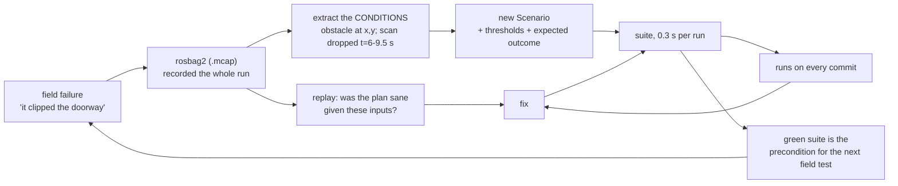

# 20.05 — Testing the whole robot — sim scenarios, field tests, regressions

<!-- glance:start -->
<!-- generated by tools/build.py from curriculum/syllabus.yaml — edit the syllabus, not this block -->

| | |
|---|---|
| **Track** | Main path |
| **Difficulty** | Advanced |
| **Time** | 1 h 15 min |
| **Hardware** | none |
| **Software** | ros2, gazebo |
| **Prerequisites** | [20.03 Software integration — bringup, health monitoring and diagnostics](20.03-software-integration-bringup.md)<br>[03.08 Testing robot software — unit, simulation and hardware-in-the-loop](../03-robot-software/03.08-testing-robot-software.md) |
| **Skip if** | Never. |

<!-- glance:end -->

## What you will learn

- Choose the right rung for a question: unit test, 2D scenario, Gazebo, or the floor — and say what each one cannot catch.
- Turn a mission into a test by adding thresholds, an expected outcome and fault injection.
- Measure invariants as well as outcomes, so a build that got away with something still fails.
- Compare two builds and produce a regression report that names the metric and the size of the change.
- Run a field-test protocol that produces evidence, and turn every field failure into a scenario you can re-run in seconds.

## Why it matters

[03.08](../03-robot-software/03.08-testing-robot-software.md) built the test ladder and taught its rungs. Everything since has added tests on the lower rungs: the odometry integrator, the PID, the costmap inflation, the skill validator. All of those still pass on a robot that drives into the kitchen table.

That is the gap this lesson closes. A whole-robot test answers a different kind of question — *did the robot get there, how close did it come to the furniture, and how often did the safety layer have to save it* — and it is the only kind of test that can catch an integration bug, because integration bugs live between the components that each have their own passing tests.

There is a second reason, and it is the one that saves your evenings. Every change you make from now on is a change to a robot, not to a function: you retune the controller, raise the speed limit, swap the planner, add a node that eats CPU. Without a suite that runs in seconds and tells you what got worse, you are testing those changes on the floor of your flat, at 0.3 m/s, one run at a time.

<!-- prereqs:start -->
## Prerequisites

You need these first:

- [20.03 Software integration — bringup, health monitoring and diagnostics](20.03-software-integration-bringup.md)
- [03.08 Testing robot software — unit, simulation and hardware-in-the-loop](../03-robot-software/03.08-testing-robot-software.md)

### Optional prerequisite links

None.

Check your readiness: `python course.py why 20.05`
<!-- prereqs:end -->

## Concept

A unit test asks "is this function right?". A whole-robot test asks "did the robot do the job, and did it do it safely?" — and those are different questions with different failure modes, different costs and different kinds of answer.

The core idea is that **a scenario is a mission plus thresholds**. "Drive from the living room to the kitchen" is a demo. "Drive from the living room to the kitchen, arrive within 60 s, never come closer than 4 cm to anything, and require no more than four safety interventions" is a test. The thresholds are the part that took thought; the mission is the easy part.

Three things follow, and each one changes what the suite catches.

**Not every scenario should succeed.** Some missions must *fail safely*: the doorway is blocked, so the correct behaviour is to stop short and not collide. A suite where every scenario is "reach the goal" cannot express the most important requirement the robot has.

**Measure invariants, not only outcomes.** "Did it arrive?" is an outcome. "How far did it drive with no sensor data?" is an invariant — a property that must hold *throughout*, regardless of how the run ended. Outcome metrics let a bad build get lucky; invariant metrics do not. This is the single highest-value idea in the lesson.

**Fault injection is how you test the failure paths.** The robot's interesting behaviour is not what it does when everything works — you have watched that. It is what it does when the LiDAR dies mid-run, when a chair is left in the doorway, when the motors are mismatched and the battery is sagging. Those are five lines of scenario configuration each, and they are the only way to exercise code paths that otherwise run for the first time in front of an audience.

> [!TIP]
> **Ask your teacher:** "Take one of my robot's requirements and turn it into a scenario with me — then make me justify every threshold number and tell me which ones I pulled out of the air."

## Technical explanation

### Level 1 — Which rung answers which question

[03.08](../03-robot-software/03.08-testing-robot-software.md)'s ladder, with the whole-robot rungs filled in and the numbers from this repository:

| Rung | Runs in | Catches | Cannot catch | Cost |
|---|---|---|---|---|
| unit (`labs/python/tests`) | ms | wrong arithmetic, wrong units, sign errors | anything about two components together | free, in CI |
| **2D scenario** (`scenario_suite.py`) | 0.3 s per run | behaviour: arrival, clearance, interventions, blind driving, regressions between builds | dynamics, 3D, real sensor noise, timing, DDS | free, in CI |
| Gazebo scenario | 10–60 s per run | physics, tipping, real ROS 2 nodes, real message flow and timing | real sensors, real motors, real Wi-Fi, real floors | minutes, CI-capable |
| hardware in the loop | real time | the serial protocol, the firmware, the watchdog | the world | needs the robot |
| **field test** | real time + setup | everything, once | nothing — but it is slow, unrepeatable and consumes battery | an afternoon |

The 2D rung is the one this lesson adds, and its value is entirely in the ratio: a full eight-scenario suite runs in **2.8 seconds**, so you can run it on every commit, on every parameter change, and for a dozen seeds. Its limits are real and you must hold them in mind — it has no dynamics, so it cannot tell you the robot tips; no 3D, so it cannot see a table the LiDAR passes under; and no ROS 2, so it cannot catch a QoS mismatch ([20.01](20.01-final-architecture.md)) or a starved control loop ([20.03](20.03-software-integration-bringup.md)).

The rule for choosing: **the lowest rung that can answer the question**. Then, whenever a higher rung catches something, ask whether you can encode it as a scenario on a lower one — that is how a suite gets good.

### Level 2 — What turns a mission into a test

karmel's acceptance suite is eight missions in the apartment world. `py 20-final-robot/code/scenario_suite.py list`:

```text
S1-kitchen   Living room to the kitchen, through the lower doorway
S2-study     Living room to the study desk, through the upper-left doorway
S3-bedroom   Living room to the bedroom, the long way through two doorways
S4-return    Kitchen back to the dock in the living room
S5-chair     The kitchen run with a chair narrowing the doorway — still passable
S6-blocked   The doorway is blocked: the robot must STOP, not arrive
S7-blind     Kitchen run with the LiDAR dead from t=6 s to t=9.5 s, chair present
S8-worn      Kitchen run on a worn robot: mismatched motors, slip, battery sag
```

Each carries five thresholds and an expected outcome:

| Field | S1-kitchen | S6-blocked | Why |
|---|---|---|---|
| `outcome` | `reach` | `stop-safely` | some missions must *not* succeed |
| `max_time_s` | 60 | 40 | a robot that arrives in ten minutes did not arrive |
| `min_clearance_m` | 0.04 | 0.04 | how close it may get to anything, ever |
| `max_interventions` | 4 | 4 | the safety layer is a backstop, not a navigation strategy |
| `max_blind_distance_m` | 0.05 | 0.05 | the invariant: how far it may drive with no scan |

`max_interventions` deserves a sentence. The collision monitor firing is not a failure — it is the system working. The collision monitor firing *thirty times* on a clean run means the planner is driving into things and the monitor is doing the navigating, which passes an arrival test and is a broken robot. A metric that counts how often the backstop was needed turns "it worked" into "it worked for the right reason".

And `stop-safely` has its own subtlety. A run that did not reach the goal and *never fired the safety layer* fails with `lucky-stop`: the robot stopped, but nothing in the design made it stop. Passing by accident is not passing.

**Fault injection** is three optional fields: `extra_obstacle` puts a chair in the world, `lidar_blackout_s` kills the scan for a window, `realistic=True` swaps in mismatched motor gains, wheel-radius errors, 2 % slip and battery sag. Each turns a happy-path mission into a failure-path test without writing any new code.

### Level 3 — Invariants: the metric that catches a build outcomes miss

Here is the whole argument, in two runs of the same scenario.

`S7-blind` kills the LiDAR from $t = 6$ s to $t = 9.5$ s while a chair narrows the doorway. The shipping build's collision monitor is **fail-closed**: no scan data means "obstacle", so the robot stops and waits.

```text
$ py 20-final-robot/code/scenario_suite.py run --only S7
scenario     seed reach    t s  dist m clear cm stops blind m  verdict
S7-blind        0  True   16.5    3.94      5.2     1    0.02  PASS
```

It takes 16.5 s instead of 13.1 — three and a half seconds standing still — and drives 2 cm with no data. Now the same scenario with a build whose monitor is **fail-open**, treating "no data" as "road clear":

```text
$ py 20-final-robot/code/scenario_suite.py run --build fail-open --only S7
S7-blind        0  True   13.0    3.92      5.2     0    1.79  FAIL: drove 1.79 m with no scan data (limit 0.05 m)
```

Look at the outcome columns: it **arrived**, it was **faster**, it did not collide, and its clearance was identical. Every outcome metric says this build is at least as good as the shipping one — and it drove 1.79 m through a doorway with a chair in it, blind. It got away with it because the chair happened not to be where it was driving. On a different day, in a different room, it does not get away with it.

The invariant metric is what catches it. `blind_distance_m` does not ask how the run ended; it asks whether a property held throughout. Good invariants for a mobile robot:

- distance travelled with stale or missing sensor data;
- time spent above the configured speed limit;
- minimum clearance, sampled continuously rather than at waypoints;
- number of control cycles that overran their period;
- time between a hazard appearing and the first non-zero response.

Write at least one invariant for every safety property you claim in [20.04](20.04-safety-case.md)'s hazard table. If you cannot measure it, you cannot claim it.

**Determinism** is what makes all this usable. Every run is seeded; the same build and seed produce byte-identical metrics, which is why a diff between two suite runs means something. For scenarios with noise (`S8-worn`), run several seeds and treat the *worst* as the result — not the mean. Robots are sized by their worst case, and a suite that averages away one bad seed out of ten is telling you the robot fails 10 % of the time and calling it a pass. When you need to say how *many* seeds, the interval arithmetic in [18.10](../18-embodied-ai/18.10-evaluating-learned-policies.md) applies unchanged.

### Level 4 — Regressions, field tests, and turning failures into scenarios

**The regression report** is the output that changes behaviour. Two suite runs in, a list of what got worse out:

```text
$ py 20-final-robot/code/scenario_suite.py compare shipping no-monitor
shipping: 8/8 passed
no-monitor: 6/8 passed

REGRESSION S6-blocked: passed before, fails now — clearance 0.1 cm (limit 4 cm); collided; stopped without the safety layer ever firing — it was luck, not design
WORSE      S6-blocked: clearance 30.2 -> 0.1 cm
REGRESSION S7-blind: passed before, fails now — drove 1.05 m with no scan data (limit 0.05 m)
```

Two report lines matter as much as the pass/fail. `REGRESSION` blocks the change. `WORSE` does not block it but demands an explanation: the clearance dropped from 30.2 cm to 0.1 cm, and even if it had stayed inside the limit, a margin that collapses by an order of magnitude is a design change, not a tuning change. A suite that only reports pass/fail lets a robot degrade one acceptable step at a time.

**Field tests** are the rung nothing replaces, and the discipline is to make them produce evidence:

1. **Before**: the full suite green, the pre-autonomy checklist from [20.04](20.04-safety-case.md) done, a charged pack, the route walked, the area cleared, `rosbag2` recording.
2. **One variable at a time.** Change the speed limit *or* the planner, never both. A field test that changes two things has told you nothing about either.
3. **A written expectation per run.** "It will take 25–30 s and clear the doorway by more than 10 cm." Then write down what happened. An unpredicted result is the finding; a predicted one is a confirmation.
4. **Three runs minimum** per configuration, because the interesting variance is between runs.
5. **After**: keep the bag, keep the notes, and — this is the important part — turn every failure into a scenario.

**Regression bags.** `rosbag2` records MCAP by default since Iron. A recorded failure is worth more than a bug report: replay it (`ros2 bag play`) against a fixed build and you have a repeatable test of the exact conditions that broke the robot, including the real sensor noise you cannot simulate. Two limits to know: replay drives your *perception and planning* honestly but cannot close the loop through the world — the robot in the bag does not react to your new commands — so a bag test verifies "did the planner produce a sane plan given these inputs", not "did the robot get there". For the closed loop, extract the *conditions* (where the obstacle was, when the sensor dropped) and encode them as a scenario. That is why `S5-chair` and `S7-blind` exist: each is a real failure, reduced to five lines.

> [!TIP]
> **Ask your teacher:** "Here is a field failure I had. Walk me through turning it into a scenario, and tell me which parts of it my 2D simulator genuinely cannot represent."

## Diagram

Where each rung sits on cost against fidelity, with what it catches:

```text
  fidelity
     ^
 real|                                          [ field test ]  an afternoon, unrepeatable
     |                                     everything, once
     |                          [ hardware in the loop ]  real time
     |                     firmware, serial, watchdog
     |            [ Gazebo scenario ]  10-60 s
     |        physics, tipping, real nodes, timing, QoS
     |  [ 2D scenario ]  0.3 s  <- this lesson
     |  behaviour, clearance, interventions, invariants, regressions
     |[ unit ]  1 ms
     | arithmetic, units, signs
     +--------------------------------------------------------> cost per run
       free                                            an afternoon

  the rule: answer every question on the LOWEST rung that can answer it,
  and push every higher-rung finding DOWN into a scenario when you can.
```

The loop a failure travels, from the floor back into CI:



## Code

`20-final-robot/code/scenario_suite.py` runs the missions in the course's 2D simulator — no ROS, no Gazebo, no hardware:

```bash
py 20-final-robot/code/scenario_suite.py list                       # the scenarios and their limits
py 20-final-robot/code/scenario_suite.py builds                     # the configurations under test
py 20-final-robot/code/scenario_suite.py run                        # the shipping build: 8/8 in 2.8 s
py 20-final-robot/code/scenario_suite.py run --build fast --seeds 3
py 20-final-robot/code/scenario_suite.py run --only S6              # one scenario
py 20-final-robot/code/scenario_suite.py compare shipping no-monitor
```

A `Build` is the thing under test — the knobs a real change would move:

```python
@dataclass(frozen=True)
class Build:
    name: str
    max_speed_m_s: float = 0.30
    stop_distance_m: float = 0.35     # collision-monitor stop zone
    control_hz: float = 10.0
    lookahead_m: float = 0.40
    heading_gain: float = 2.0
    collision_monitor: bool = True
    fail_closed: bool = True          # no scan data == an obstacle, not a clear road
```

and the line that produces the invariant is three lines in the control loop:

```python
ahead = None if blackout else front_obstacle_m(base)
blind = ahead is None
...
if blind:
    metrics.blind_distance_m += moved
```

The shipping build's suite output, which is the number to beat:

```text
scenario     seed reach    t s  dist m clear cm stops blind m  verdict
S1-kitchen      0  True   13.1    3.94     11.8     0    0.00  PASS
S2-study        0  True   11.2    3.23     13.5     0    0.00  PASS
S3-bedroom      0  True   15.9    4.65      7.1     0    0.00  PASS
S4-return       0  True   13.1    3.93     19.3     0    0.00  PASS
S5-chair        0  True   13.0    3.92      5.2     0    0.00  PASS
S6-blocked      0 False   10.7    1.60     30.2     1    0.00  PASS
S7-blind        0  True   16.5    3.94      5.2     1    0.02  PASS
S8-worn         0  True   13.1    3.94     11.3     0    0.00  PASS

8/8 runs passed
```

Note `S6-blocked`: `reach` is `False` and the verdict is `PASS`, because its expected outcome is `stop-safely`. The robot stopped 30 cm from the blockage with one safety intervention, which is exactly right.

## Exercise

### Exercise 20.05-E1 — Predict the failures `[predict]`

Hardware: none.

`py 20-final-robot/code/scenario_suite.py builds` lists six configurations. For each of `no-monitor`, `fail-open`, `fast` and `slow-loop`, predict **before running**: which scenarios fail, with which verdict, and which metric moves the most.

Then run each (`run --build <name>`) and compare. One of the four passes every scenario despite being a change you should not ship without thinking. Which, and what would you need to add to the suite to catch it? (Exercise E3 is that addition.)

### Exercise 20.05-E2 — Verdicts and the regression report `[coding]`

Hardware: none.

Implement `verdict` and `regressions` in `labs/exercises/20.05/student.py`. The tests run the real suite twice and require your report to name the regressions the course's does.

Check it: `python course.py check 20.05`

### Exercise 20.05-E3 — Write the scenario that catches `fast` `[simulation]`

Hardware: none.

The `fast` build raises the speed limit from 0.30 to 0.50 m/s and changes nothing else. It passes all eight scenarios. Make it fail, honestly — by testing a property that genuinely matters, not by lowering a threshold until something breaks.

1. Work out, from [20.04](20.04-safety-case.md)'s stop-chain arithmetic, what a higher speed *should* cost: dead-time distance grows linearly, braking distance quadratically.
2. Add a scenario to `suite()` that puts that cost under a threshold — for example a blocked doorway with a required stopping margin, or a tighter passage where the dead-time distance matters.
3. Run `compare shipping fast --only <your scenario>` and confirm it reports a regression.
4. Then run your new scenario against `shipping` and confirm it still passes. A scenario that fails for every build is not a test, it is a broken threshold.

### Exercise 20.05-E4 — A field test that produces evidence `[hardware]`

Hardware: `robot-base`, `lidar`; `camera` and `arm` if you have them.

> [!CAUTION]
> **Safety:** the full pre-autonomy checklist from [20.04](20.04-safety-case.md) before the first run, including the e-stop test. Cleared area, stairs blocked, no pets, a second person holding the e-stop while you watch the terminal. Speed limit at your configured value, not "just for this test" higher ([SAFETY.md](../SAFETY.md) rules 7, 8).

1. Pick one scenario from your suite and run it for real, three times, recording a bag each time.
2. Write your prediction before each run — duration and minimum clearance — and the outcome after.
3. Change exactly one thing (the speed limit is the easiest), run three more times, and compare the same two numbers.
4. Compute the same metrics from the bags that your simulator computes: duration is easy; clearance you can get from `/scan`'s minimum in the forward sector; interventions from `collision_monitor`'s output.
5. Compare your six field runs with the simulator's numbers for the same scenario. Where do they disagree, and is the difference in the mean or in the spread?

### Exercise 20.05-E5 — Fix a flaky scenario `[debugging]`

Hardware: none.

Make `S8-worn` flaky on purpose and then fix it properly. Run it with `--seeds 10`. With the shipped thresholds it passes for every seed; now tighten `min_clearance_m` to 0.11 and run again — some seeds pass and some fail.

1. Which seeds fail, and by how much? Is the distribution tight or long-tailed?
2. You now have three options: loosen the threshold, take the worst seed as the verdict, or change the robot. Argue for each in one sentence, then pick one and say why.
3. A colleague proposes "run it three times and pass if any run passes". Explain precisely what that policy measures, and what it hides.
4. Implement your choice and show the suite is both green and meaningful afterwards.

## Expected result

**20.05-E1.** `no-monitor`: 6/8 — `S6-blocked` fails with `collided` and `lucky-stop` (clearance 0.1 cm), `S7-blind` fails with `drove-blind` at 1.79 m. `fail-open`: 7/8 — only `S7-blind` fails, with `drove-blind` at 1.05 m; note it *arrives faster* than the shipping build, which is the point of the invariant. `slow-loop`: 8/8 — a 2 Hz control loop still gets there in this world, only 0.1–0.5 s slower per run. `fast`: **8/8** — and that is the honest, uncomfortable answer. Raising the speed limit by 67 % changes no metric the suite measures, because the simulator's braking is generous and none of the eight scenarios puts the stopping distance under a threshold. A suite catches exactly what you asked it to measure.

**20.05-E2.** 16 tests pass, including the one that runs the real suite for `shipping` and `no-monitor` and requires your report to contain `REGRESSION S6-blocked` with `collided` and `REGRESSION S7-blind` with `drove-blind`.

**20.05-E3.** A scenario with `outcome="stop-safely"` in front of a blockage and `min_clearance_m` set to something like 0.25 m separates the builds: the shipping build stops at 30.2 cm, the `fast` build at 29.4 cm, so a 0.30 m requirement catches it — but *only just*, and a threshold with 8 mm of margin is a flaky test waiting to happen. The better version puts the stopping distance under more pressure: a shorter run-up, a narrower passage, or a `stop_distance_m` reduced to make the dead-time term dominate. The lesson of the exercise is in how hard it is: the 2D simulator's dynamics are forgiving, which is exactly the limitation in the rung table, and the speed increase is a change that genuinely belongs in Gazebo or on the floor.

**20.05-E4.** Expect field durations 10–30 % longer than the simulator's for the same route, and clearances noticeably *tighter*, because real localisation error adds to real control error. The more important finding is usually the spread: three runs of the same route in simulation are identical, and three on the floor differ by seconds and by centimetres. That spread is the number to carry into your thresholds — a limit that the simulator passes with 2 mm to spare will fail on the floor about half the time.

**20.05-E5.** (1) With `min_clearance_m = 0.11` roughly a third of the seeds fail, all of them by a few millimetres — a tight distribution just below the threshold rather than a long tail, because the noise is the simulator's 2 % slip and not a rare event. (2) Loosening the threshold is right *if* 11 cm was arbitrary and the robot is genuinely fine at 10.5 cm; taking the worst seed is right if the threshold encodes a real safety margin, because that is how robots are sized; changing the robot (a wider clearance in the path, a slower doorway approach) is right if 11 cm is a requirement you cannot move. (3) "Pass if any run passes" measures the *best case* of a stochastic system, which is the one number that never happens in the field; it hides the failure rate entirely, and it is how a robot that works two times in three ships as "working". (4) Whichever you choose, the suite must still fail when the robot gets worse — the check is to nudge the build (drop `lookahead_m`, say) and confirm the scenario goes red.

## Troubleshooting

### Symptom: a scenario fails and you cannot tell why from the verdict

Get the trajectory, not the summary. Add a print of pose, command and clearance every control tick and look at the moment the metric first went wrong — the failure is nearly always ten seconds before the verdict. For `too-close`, find the minimum-clearance sample and print the pose at that instant; for `not-reached`, print the active waypoint index over time and see whether it stopped advancing. A verdict tells you *that*; the log tells you *where*.

### Symptom: the suite is green and the robot fails on the floor

Expected, and the question is which rung was missing. Classify the failure first: physics (tipping, wheel slip on a rug) belongs in Gazebo; timing, QoS or CPU starvation belongs in a ROS 2 integration test ([20.03](20.03-software-integration-bringup.md)); sensor reality (a glass door, a black sofa the LiDAR does not return from) belongs on the floor and in your hazard table. Then ask the second question: can I encode the *conditions* as a scenario anyway? A glass wall becomes "an obstacle the LiDAR cannot see", which a 2D scenario models perfectly by leaving the obstacle out of the scan.

### Symptom: results change between runs of the same build

Find the source of the non-determinism before doing anything else, because a suite you cannot reproduce cannot report regressions. Check, in order: an unseeded RNG, wall-clock time leaking into the logic, iteration over a set or a dict whose order varies, and floating-point work whose order depends on threading. In this suite everything is seeded and lockstep, so if two runs of the same seed differ, something in *your* change introduced it.

### Symptom: every scenario passes, always, for every build

Your thresholds are not binding. Check by breaking the robot on purpose: set `max_speed_m_s` to 0.05, or `lookahead_m` to 0.02, and confirm something goes red. A suite that cannot fail is documentation, not a test. Then look at the distribution: for each metric, how much margin does the shipping build have? A metric with 90 % margin is measuring nothing.

### Symptom: a field test produced a failure you cannot reproduce

You did not record enough. Next time: a bag of every topic, the git SHA of what was running, the parameter dump (`ros2 param dump`), and the battery voltage at the start and end. Most irreproducible field failures turn out to be a different build than you thought, a parameter you changed and forgot, or a pack at 10.2 V behaving differently from one at 12.4 V.

## Common mistakes

- **Testing only success.** Half the requirements are about failing safely; a suite of "reach the goal" scenarios cannot express them.
- **Only outcome metrics.** A build that arrived faster while driving blind passes every outcome test. Invariants are what catch it.
- **Averaging across seeds.** The worst case is the result. Averaging a 10 % failure rate into a pass is how you ship a robot that fails one delivery in ten.
- **Thresholds with no margin.** A limit the shipping build passes by 2 mm is a flaky test; it will fail on an unrelated change and you will learn to re-run the suite until it is green.
- **A suite that never fails.** If you cannot make it red on purpose, it is not testing anything.
- **Changing two things per field test.** You have then measured neither.
- **Keeping field failures as anecdotes.** Every one is a five-line scenario. Anecdotes do not run in CI.
- **Trusting bag replay as an end-to-end test.** The world in the bag does not react to your new commands, so replay verifies perception and planning inputs, not closed-loop behaviour.

## Knowledge check

1. A build arrives faster than the shipping build, with identical clearance, no collision, and 1.79 m of `blind_distance_m`. Should it ship?
   <details><summary>Answer</summary>

   No. Every outcome metric says it is at least as good, and it drove 1.79 m through a doorway with no sensor data — it got away with it because the chair happened to be elsewhere. This is exactly why invariants exist: they ask whether a property held *throughout*, not whether the ending was acceptable. The fix is not a threshold, it is the build: the collision monitor must fail closed.
   </details>

2. Why does `S6-blocked` pass with `reached = False`, and what would make it fail?
   <details><summary>Answer</summary>

   Its expected outcome is `stop-safely`: the doorway is blocked, so arriving is not the requirement — stopping short without collision is. It fails if it reaches the goal (`should-stop`, meaning it went somewhere it should not have been able to), if it collides, if the clearance or the time limit is breached, or if it stopped with **zero** safety interventions (`lucky-stop`) — because then nothing in the design stopped it, it merely happened not to arrive.
   </details>

3. The 2D suite runs eight scenarios in 2.8 s. Name three classes of bug it structurally cannot find, and say where each belongs.
   <details><summary>Answer</summary>

   Dynamics and mass effects — the robot tipping when the arm extends, wheel slip on a rug — belong in Gazebo or on the floor ([20.02](20.02-hardware-integration.md) computes the tipping condition). Middleware and timing — a QoS mismatch, a control loop starved to 3 Hz, a tf extrapolation error — belong in a ROS 2 integration test, because the 2D suite has no DDS and no scheduler. Sensor reality — glass, mirrors, a black sofa, sunlight in the camera — belongs on the floor, and the only thing the suite can do is model the *consequence* (an obstacle absent from the scan) rather than the cause.
   </details>

4. Predict: you raise the speed limit from 0.3 to 0.5 m/s. The suite stays 8/8. What have you learned, and what do you do next?
   <details><summary>Answer</summary>

   You have learned that none of your eight scenarios measures anything the speed change affects — not that the change is safe. The stop-chain arithmetic of [20.04](20.04-safety-case.md) says the braking term grows as $v^2$, so at 0.5 m/s the e-stop's stopping distance rises from 0.079 m to 0.215 m and "a human reacts and presses the button" stops fitting inside the margin altogether. Next steps: add a scenario that puts stopping distance under a threshold, and test the change on a rung that has dynamics. A green suite is evidence about what it measures, and nothing else.
   </details>

5. Why is "run it three times, pass if any run passes" a bad policy, and what should you do with a scenario whose result varies between seeds?
   <details><summary>Answer</summary>

   It measures the best case of a stochastic system, which is the case that never matters in the field, and it hides the failure rate completely: a robot that works one time in three passes. Take the worst seed as the verdict — robots are sized by their worst case — and if the worst seed is unacceptable, the fix is the robot or the threshold, argued explicitly. If you need to know the failure *rate* rather than the worst case, that is a sample-size question and the interval arithmetic in [18.10](../18-embodied-ai/18.10-evaluating-learned-policies.md) applies.
   </details>

6. What does a `WORSE` line in the regression report mean if the scenario still passes?
   <details><summary>Answer</summary>

   That a metric moved substantially in the bad direction while staying inside its limit: the clearance halved, or the run got 25 % slower. It does not block the change, and it demands a reason, because robots degrade one acceptable step at a time. Three consecutive "still passes, but 20 % worse" commits turn a comfortable margin into a flaky one, and a report that only prints pass/fail cannot see that happening.
   </details>

7. Your field test found a failure. You have a bag of it. What do you do with the bag, and what can it not tell you?
   <details><summary>Answer</summary>

   Two things. Replay it against a fixed build to check that perception and planning produce sane output given the real inputs — real sensor noise is the thing you cannot simulate, and this is the honest way to use it. Then extract the *conditions* — where the obstacle was, when the scan dropped, how fast the robot was going — and encode them as a scenario that runs in 0.3 s in CI forever. What the bag cannot tell you is whether the fixed robot would have *behaved* differently: the recorded world does not react to your new commands, so the loop is open. Closed-loop questions need the scenario, Gazebo, or the floor.
   </details>

## Practical challenge

Build your robot's acceptance suite and run it against a change.

1. Write at least six scenarios for *your* robot: four missions it claims it can do, one that must fail safely, and one with an injected fault. Each with an expected outcome and five thresholds, each threshold justified in a comment.
2. Add at least two invariants of your own, one of which must correspond to a safety property you claimed in [20.04](20.04-safety-case.md)'s hazard table.
3. Establish the baseline: run the suite, record the numbers, commit them. That is what "working" means from now on.
4. Make a real change — retune the controller, change the lookahead, raise a limit — and produce the regression report. If nothing moves, either the change did nothing or your suite is not measuring it; find out which.
5. Prove the suite can fail: break the robot on purpose in three different ways and confirm three different scenarios go red for three different reasons.
6. Run one scenario on the real robot three times, compute the same metrics from the bags, and write down the sim-to-real gap in each metric — as a number, not an impression.

> [!CAUTION]
> **Safety:** the field runs in step 6 happen after the pre-autonomy checklist, in a cleared area, with a second person on the e-stop. "Break the robot on purpose" in step 5 means in the simulator, never on the floor ([SAFETY.md](../SAFETY.md)).

Acceptance criteria: the suite runs in under a minute and is green on the baseline; at least one scenario expects a safe failure and at least one injects a fault; two invariant metrics exist and are tied to safety claims; a regression report exists for a real change; the suite has been proven able to fail in three distinct ways; and the sim-to-real gap is written down per metric.

## You can skip this if…

Answer knowledge-check questions 1, 3 and 5 correctly without looking, and you can show a suite for a robot you built that contains a must-fail-safely scenario, at least one invariant metric, and a regression report from a change you actually made.

`python course.py skip 20.05 --reason "I maintain a whole-robot scenario suite with invariants and regression reporting"`

## Go deeper

- ROS 2 testing overview and `launch_testing`: https://docs.ros.org/en/jazzy/Tutorials/Intermediate/Testing/Testing-Main.html — how to run a real node graph inside a test, which is the rung above this lesson's.
- rosbag2: https://github.com/ros2/rosbag2 — recording, replaying, storage plugins and the CLI you will use for every field test.
- MCAP, the default rosbag2 format since Iron: https://mcap.dev/ — the container, its indexing, and the tooling that reads it without ROS.
- Nav2 system tests: https://github.com/ros-navigation/navigation2/tree/main/nav2_system_tests — a production example of whole-stack scenario testing in simulation, worth reading for how they define success.
- Gazebo Harmonic documentation: https://gazebosim.org/docs/harmonic/getstarted/ — the physics rung, and what it buys over a 2D simulator.
- Fred Hébert, *Property-Based Testing with PropEr, Erlang and Elixir* (free online): https://propertesting.com/ — the general form of the invariant idea: state what must always hold, then let the machine hunt for the counterexample. The language is irrelevant; the chapter on choosing properties is not.

## Progress checkpoint

- [ ] I can choose the right rung for a question and say what each one cannot catch.
- [ ] I can turn a mission into a scenario with thresholds, an expected outcome and an injected fault.
- [ ] I can write an invariant metric and explain why outcome metrics alone let a bad build pass.
- [ ] I can produce a regression report and act on both its REGRESSION and its WORSE lines.
- [ ] My robot has an acceptance suite, a baseline, and a measured sim-to-real gap.

`python course.py complete 20.05` (exercises done) · `python course.py master 20.05` (challenge done) · `python course.py struggle 20.05 "what was hard"`

Next: [20.06 — The demo, and where to go next](20.06-demo-and-beyond.md).
