# 20.06 — The demo — and where to go next

<!-- glance:start -->
<!-- generated by tools/build.py from curriculum/syllabus.yaml — edit the syllabus, not this block -->

| | |
|---|---|
| **Track** | Main path |
| **Difficulty** | Advanced |
| **Time** | 1 h |
| **Hardware** | none |
| **Software** | none |
| **Prerequisites** | [20.04 The safety case — e-stop, watchdogs, safe shutdown and test procedures](20.04-safety-case.md)<br>[20.05 Testing the whole robot — sim scenarios, field tests, regressions](20.05-testing-strategy.md) |
| **Skip if** | Never. |

<!-- glance:end -->

## What you will learn

- Plan a demo as a mission: segments, a time budget, a battery budget with reserve, and a written fallback for each part.
- Choreograph the failures in advance, so the thing that goes wrong becomes the most convincing part of the demo.
- Run a rehearsal that is identical to the performance, and a runbook that two people can follow.
- Choose your next direction from six honest options, each with what it costs and what it needs.
- Keep the robot alive after the course: maintenance, spares, notes and a habit that survives the first month.

## Why it matters

The demo is not a formality. It is the first time this robot runs in front of people who did not build it, in a room it has never mapped, with someone's toddler in the test area, and with no debugger. Everything that can go wrong has already gone wrong during the course — that is what the last five lessons were about. The only genuinely new thing is that you cannot stop and investigate.

There is also a second, less obvious reason to do it properly. A demo is the hardest possible integration test: it runs every layer at once, under conditions you do not control, with a deadline. Robots that work in the lab and fail in the living room fail for reasons that a demo surfaces in ten minutes and a test suite takes weeks to find.

And then the course ends, and the interesting question is what you do on the Monday after. That is the second half of this lesson, and it is deliberately honest: six directions, each with what it actually costs, so you pick one instead of half-starting three.

<!-- prereqs:start -->
## Prerequisites

You need these first:

- [20.04 The safety case — e-stop, watchdogs, safe shutdown and test procedures](20.04-safety-case.md)
- [20.05 Testing the whole robot — sim scenarios, field tests, regressions](20.05-testing-strategy.md)

### Optional prerequisite links

None.

Check your readiness: `python course.py why 20.06`
<!-- prereqs:end -->

## Concept

Three ideas, and the first one does most of the work.

**Plan the failures, not the successes.** You already know what the robot does when everything works — you have watched it a hundred times. Plan the other branch: for every segment, the most likely failure, what you do when it happens, and what you *say*. Done well, the failure becomes the best part: a robot that refuses an illegal request, stops itself when a person steps in front of it, or reports that it cannot start because a sensor is dead is a far more convincing demonstration of engineering than a robot that glides through a rehearsed path. The things that break are the things you built controls for.

**Never debug live.** The moment you open a terminal to fix something, the demo is over and you are giving a very slow talk about YAML. Each segment gets one retry, then the fallback, then you move on. Everything you would want to investigate is in the bag you recorded.

**Rehearse the performance, not the demo.** Same room, same lighting, same battery state, same people standing in the same places, same order. A rehearsal in a different room at a different time of day proves that the robot works in that other room. Half of all demo failures are a floor, a light source or a Wi-Fi network that changed.

Then, when it is done: **the robot is a platform, not a project.** It has a URDF, a bringup, a skill API, a safety case and a test suite. Every direction in the second half of this lesson starts from it rather than from a blank repository, and that is the real output of twenty modules.

> [!TIP]
> **Ask your teacher:** "Play the audience: ask me the three questions a sceptical engineer would ask during my demo, and tell me which of my answers were hand-waving."

## Technical explanation

### Level 1 — The demo, segment by segment

The order is not the order you built things in; it is the order that lets a viewer follow. Start at the bottom of the stack where the behaviour is obvious, and add a layer at a time, so that by the time the robot is taking instructions in English the audience already knows what is underneath. `py 20-final-robot/code/demo_runbook.py plan`:

```text
segment                                  min     Wh  shows
0. Power-on and bringup                  1.0   0.19  the robot knows whether it is healthy
1. E-stop test                           0.5   0.11  the safety case, demonstrated not claimed
2. Teleop and the watchdog               1.0   0.33  the lowest layer: commands, limits, watchdog
3. Mapping a corner of the room          1.5   0.53  SLAM building a map live in RViz
4. Autonomous navigation to a goal       1.5   0.53  Nav2: plan, follow, avoid, recover
5. Detect and approach an object         1.0   0.30  vision closing the loop with motion
6. Pick and place                        1.5   0.45  the arm doing the thing the whole course was for
7. 'Bring me the bottle' in one sentence 1.5   0.55  language to a validated plan to motion
TOTAL                                    9.5   3.00
```

Two deliberate choices in that list.

**Segment 1 is the e-stop, before anything moves autonomously.** It is thirty seconds, it is the most important thing you built, and doing it first sets the frame for everything after: this robot has a hardware layer that does not care what the software thinks. It is also the one segment whose failure ends the demo ([20.04](20.04-safety-case.md)).

**Segment 0 is bringup**, because a robot that *refuses to start* when a sensor is dead is a feature, and showing the health tree takes one minute and answers the question every engineer in the room is about to ask.

Nine and a half minutes. That is not an accident: past about ten minutes an audience stops watching a robot and starts checking their phone, and `demo_runbook.py check` fails a plan longer than twelve.

### Level 2 — The two budgets

**Time** you can feel. **Battery** you cannot, and it is where demos die.

```text
pack 36.2 Wh nominal; the demo uses 8 % of it
with the actuators idle the robot survives 156 min of standing around before the demo starts
```

Three watt-hours out of thirty-six. The demo itself is nothing — and that is exactly the trap. The robot is *on* from the moment you set up, and the compute domain draws 11.1 W whether or not anything moves ([20.02](20.02-hardware-integration.md)). Two hours of setup, conversation and waiting for people to arrive is two and a half hours of Pi, LiDAR and camera, and that is most of your pack. The rules that follow:

- charge to full the night before, and **measure** it (12.4–12.6 V on a 3S pack);
- keep a second charged pack in the bag, and know how long a swap takes;
- keep the robot **off**, not idle, until ten minutes before you start;
- plan to end the demo at 30 % or above — `check` fails a plan that budgets below that, because the reserve is for the rerun, the question that turns into a second demo, and driving back to the dock.

The `RESERVE_FRACTION` is not caution, it is the third rerun you did not plan for and will be asked to do.

### Level 3 — Failure choreography

Every segment has three written fields: the most likely failure, what you do, and how you abort. `py 20-final-robot/code/demo_runbook.py risks`:

| Segment | Most likely failure | What you do |
|---|---|---|
| 0. Bringup | a unit never reaches ready (LiDAR or arm bus) | show the diagnostics tree failing — a robot that refuses to start is the feature |
| 1. E-stop | the relay chatters or the robot creeps | **stop the demo.** This is the one failure you do not work around |
| 2. Teleop | the laptop's Wi-Fi drops | that *is* the watchdog demo: narrate it — the robot stopped by itself in 300 ms |
| 3. Mapping | a glass wall or a mirror folds the map | switch to the saved map and explain why glass defeats a 2D LiDAR |
| 4. Navigation | somebody stands in the path | let it react, then step in deliberately and show the collision monitor firing |
| 5. Detect | different lighting, the detector misses | hold up the training object; if it still misses, show the confidence scores live |
| 6. Pick and place | the grasp slips or the object is 2 cm off | one retry, then place it by hand and continue |
| 7. Agent | the model is slow, or asks for a geofenced place | show the refusal — a robot that says no to an illegal request is the demo |

Read the pattern: in six of the eight, the failure is *itself* the demonstration of a control you built. That is not a rhetorical trick, it is what a layered design buys you. The two exceptions are instructive too — the e-stop failure stops everything, and the grasp failure is the one you simply work around, because manipulation is the least reliable thing on the robot and everyone in the room knows it.

The abort column is separate and always available: cancel the skill, cancel the Nav2 goal, release the dead-man key, torque off the arm, press the button. Know which one applies to the segment you are in *before* you start it.

One more thing that matters more than any of this: **two people**. One drives and talks; one stands near the robot with a hand on the e-stop and watches the robot rather than the screen. The person talking cannot also be the person watching.

### Level 4 — Where to go next

Six directions, honestly costed. Pick one for the next three months; the others do not expire.

**1. Deeper autonomy.** Custom Nav2 behavior-tree nodes, your own controller or planner plugin, multi-floor or multi-room missions, docking and recharging, dynamic obstacle prediction. *Costs*: C++ and the Nav2 plugin API; no new hardware. *Start*: write a BT node that your existing mission needs, and a costmap layer for something your robot cannot currently see.

**2. Manipulation and learned policies.** More data, better grasping, action-chunking or VLA policies fine-tuned on your own demonstrations ([18.06](../18-embodied-ai/18.06-train-first-policy-lerobot.md), [18.08](../18-embodied-ai/18.08-fine-tuning-a-vla.md)). *Costs*: a GPU for training (rented is fine), and the real cost — a few hundred teleoperated demonstrations, which is many evenings. *Start*: pick one task, collect 50 episodes, train, evaluate honestly with [18.10](../18-embodied-ai/18.10-evaluating-learned-policies.md)'s protocol, and find out how far 50 gets you.

**3. Perception in 3D.** A depth camera, point clouds, 3D obstacle avoidance, object pose from geometry rather than from a bounding box, semantic mapping. *Costs*: a depth camera and, realistically, a Jetson ([20.01](20.01-final-architecture.md)'s compute plan says why). *Start*: replace your 2D costmap's obstacle layer with a voxel layer fed by depth, and measure what it catches that the LiDAR plane missed.

**4. Real-time and embedded.** micro-ROS on the Pico, the C++ side of ros2_control, a real-time kernel, deterministic control at 1 kHz, your own motor driver board. *Costs*: C and C++, an oscilloscope eventually; cheap in money, expensive in patience. *Start*: port the wheel controller from MicroPython to micro-ROS and measure the jitter you actually get.

**5. Fleets, cloud and tooling.** Two robots, a shared map, a mission queue, an MCP server exposing your skills ([19.10](../19-llm-robot-agents/19.10-ros2-for-agents-mcp.md)), observability, over-the-air updates, a CI that runs your suite on every commit. *Costs*: almost nothing new — this is the direction where your existing distributed-systems experience is worth the most. *Start*: put [20.05](20.05-testing-strategy.md)'s suite in CI, then add remote observability for a robot you are not sitting next to.

**6. Simulation and RL at scale.** Isaac Sim and Isaac Lab, domain randomisation, sim-to-real transfer for locomotion or manipulation ([17.09](../17-reinforcement-learning/17.09-rl-sim-to-real.md)). *Costs*: an RTX-class GPU, and the honest warning that RL is a research workflow — expect weeks between "it trains" and "it transfers". *Start*: reproduce one published result in Isaac Lab before attempting your own task.

Two more things that are not directions but habits.

**Contribute.** You now have the rarest thing in open-source robotics: a working small robot and the patience to reproduce a bug. File issues with a minimal reproduction, fix documentation that misled you, answer a question on ROS Discourse about something you spent a week on. It is also, straightforwardly, how people in this field find each other.

**Keep the robot alive.** A robot that sits in a cupboard for two months comes back with a flat pack, a cracked bracket and a workspace that no longer builds. The maintenance habit is small: store the pack at storage voltage (~3.8 V/cell), run the test suite once a month, rebuild the workspace after every distro update, keep the spares you know you break (Pico, motor driver, fuses, one motor — [HARDWARE.md](../HARDWARE.md)), and keep a one-page log of what you changed. Six months from now that page is the only reason you will remember why the EKF parameters are what they are.

> [!TIP]
> **Ask your teacher:** "Given what I actually built and what I found hard, which two of the six directions fit me best — and which one am I choosing for the wrong reason?"

## Diagram

The demo as a timeline, with the layer each segment exposes:

```mermaid
flowchart LR
  S0["0 · bringup<br/>1.0 min<br/><i>health</i>"] --> S1["1 · e-stop<br/>0.5 min<br/><i>hardware layer</i>"]
  S1 --> S2["2 · teleop + watchdog<br/>1.0 min<br/><i>firmware layer</i>"]
  S2 --> S3["3 · SLAM<br/>1.5 min<br/><i>perception</i>"]
  S3 --> S4["4 · Nav2 goal<br/>1.5 min<br/><i>reactive + executive</i>"]
  S4 --> S5["5 · detect + approach<br/>1.0 min<br/><i>vision in the loop</i>"]
  S5 --> S6["6 · pick and place<br/>1.5 min<br/><i>manipulation</i>"]
  S6 --> S7["7 · 'bring me the bottle'<br/>1.5 min<br/><i>deliberation</i>"]
  S7 --> END["stop · e-stop pressed<br/>questions with the robot OFF"]
```



And the decision you make when a segment misbehaves, which you want to have made in advance:

```text
                      a segment is not going to plan
                                   |
                  +----------------+----------------+
                  |                                 |
        is anyone in danger?                   no danger
                  |                                 |
                 yes                     is it the e-stop segment?
                  |                          |             |
          PRESS THE BUTTON                  yes            no
          demo over, explain                 |              |
          what you saw                 STOP THE DEMO   have you retried once?
                                       (never work           |        |
                                        around this)        no       yes
                                                             |        |
                                                      retry ONCE   use the fallback,
                                                                   narrate it, move on
                                                                        |
                                        never: open a terminal <--------+
                                        never: change a parameter
                                        never: "it worked this morning"
```

## Code

`20-final-robot/code/demo_runbook.py` holds the demo as data and checks it, taking its power numbers from [20.02](20.02-hardware-integration.md)'s load table so that a hardware change updates the demo budget automatically:

```bash
py 20-final-robot/code/demo_runbook.py plan      # the timeline and the battery budget
py 20-final-robot/code/demo_runbook.py risks     # the failure and fallback for each segment
py 20-final-robot/code/demo_runbook.py runbook   # the printable procedure, minute by minute
py 20-final-robot/code/demo_runbook.py check     # the rules; exit 1 if the plan is not ready
```

A segment is six fields, and three of them are about failing:

```python
@dataclass(frozen=True)
class Segment:
    name: str
    shows: str                 # the capability a viewer actually sees
    minutes: float
    driving_fraction: float    # how much of the segment the motors are running
    arm_fraction: float        # how much of it the arm is moving
    failure: str               # the most likely way this segment fails
    fallback: str              # what you do, live, when it does
    abort: str                 # how you stop it safely, right now
```

and `check` refuses a plan that is not ready:

```python
if b["used_fraction"] > 1.0 - RESERVE_FRACTION:  ...   # not enough battery reserve
if b["minutes"] > 12.0:                          ...   # longer than an audience lasts
if not s.fallback:  ...                                # you will improvise in front of people
if not s.abort:     ...                                # you cannot stop it safely on demand
if not any("e-stop" in s.name.lower() for s in segments): ...   # the demo never tests the e-stop
```

`runbook` is the thing you print. Its first section is everything that happens *before* anyone arrives:

```text
Before anyone arrives:
  - charge the pack to full and measure it (12.4-12.6 V); keep the charged spare in the bag
  - run `py 20-final-robot/code/safety_case.py checklist` and do every line
  - run `py 20-final-robot/code/scenario_suite.py run` — a red suite means no demo
  - map the actual room, save it, and drive the whole route once, at demo speed
  - clear the area: no cables, no pets, stairs blocked, the audience behind a line
  - put the laptop where you can see the terminal and the robot at the same time
```

## Exercise

### Exercise 20.06-E1 — Your demo plan `[design]`

Hardware: none to plan it.

Replace `demo()` with *your* robot's segments — only capabilities you actually have, in an order that builds from the lowest layer up. For each: what a viewer sees, how long it takes, the most likely failure, your fallback, and the abort.

Then make `py 20-final-robot/code/demo_runbook.py check` pass with your data, and answer in writing: which segment are you least sure of, and what is the honest fallback if it fails twice? "Try again" is not a fallback.

### Exercise 20.06-E2 — Predict the demo `[predict]`

Hardware: none.

Before you rehearse, predict:

1. Which segment fails first, and on which attempt?
2. What is the battery voltage at the end of the demo, given your setup time? Compute it from `demo_runbook.py plan` plus your idle draw, not from a feeling.
3. Which question will the audience ask that you cannot answer?
4. Which segment will take longest compared with your plan?

Then rehearse, and compare. Most people are wrong about (1) and right about (3), which is itself worth knowing.

### Exercise 20.06-E3 — The battery budget, with your numbers `[numerical]`

Hardware: none for the arithmetic; your measured idle draw from [20.02](20.02-hardware-integration.md)-E4.

1. Compute the energy your demo consumes, using your measured idle power rather than the model's 11.1 W.
2. Compute how long the robot can be *on* before the demo while still ending above 30 % charge.
3. You are asked for a second run immediately after the first. Does it fit? At what starting charge does it stop fitting?
4. What single change buys the most demo margin: a bigger pack, keeping the robot off until the last moment, or turning the camera off between segments? Justify with numbers.

### Exercise 20.06-E4 — Rehearse it for real `[hardware]`

Hardware: whatever your demo uses — typically `robot-base`, `lidar`, `estop`, plus `camera` and `arm`.

> [!CAUTION]
> **Safety:** a rehearsal is an autonomous session. The full pre-autonomy checklist from [20.04](20.04-safety-case.md) first, including the e-stop test. Cleared area, stairs blocked, no pets or children, a second person with a hand on the button and eyes on the robot. Never demonstrate the collision monitor by driving at a person — use a box ([SAFETY.md](../SAFETY.md) rules 7, 8).

1. Run the whole demo end to end, in the demo room, with the runbook printed, twice.
2. Record it: a bag of every run and a video of at least one. The video is for you, not for the internet — watch it and count how long the silences are.
3. Record actual segment durations and compare with your plan. Update the plan, do not update your memory.
4. Deliberately trigger one failure per layer — press the e-stop mid-drive, unplug the LiDAR before bringup, put a box in the path — and practise the narration until it is one sentence.
5. Measure the battery at the start and end of each run. If the second run does not fit, that is a finding, not an inconvenience.

### Exercise 20.06-E5 — The next six months `[design]`

Hardware: none.

Pick one of the six directions and write a one-page plan: the first concrete milestone (something demonstrable in four weeks), what you need to buy or learn, the three lessons in this course you will re-read, and — most important — what you will *not* do for the next three months.

Then add the maintenance habit: what you check monthly, where the spares are, where the log lives. Put it in your robot's repository, not in a note-taking app.

## Expected result

**20.06-E1.** `check` prints `<n> segments, <m> minutes: the plan is ready` once every segment has a fallback and an abort, the total is under twelve minutes, the battery use is under 70 % of the pack, and one segment tests the e-stop. The common first-pass failures are a missing abort (you know how to *start* each segment and not how to stop it) and a plan of fifteen to twenty minutes, which is what happens when you include everything you are proud of.

**20.06-E2.** Typical results: the segment that fails first is almost never the one you predicted — perception and manipulation are the usual suspects, but bringup in an unfamiliar room with unfamiliar Wi-Fi is the quiet favourite. The battery answer is usually worse than expected, because the idle draw dominates. The unanswerable question is usually "how well does it work in a room it has not seen?" or "what happens if the model is wrong?", and you should have a two-sentence answer to both from [20.04](20.04-safety-case.md) and [20.05](20.05-testing-strategy.md).

**20.06-E3.** With the model's numbers: the demo itself uses 3.0 Wh of 36.2, and the robot idles at 11.1 W, so every hour of being switched on costs 11.1 Wh — nearly four times the whole demo. Ending above 30 % means using at most 25.3 Wh, so the budget is about **two hours** of on-time in total including the demo. Two runs fit comfortably in energy terms; what stops fitting is a pack that started at 80 % rather than 100 %. The largest single lever is keeping the robot off until ten minutes before you start: turning the camera off between segments saves about 1.8 W, a bigger pack costs money and mass, and neither compares with not being on for two hours.

**20.06-E4.** Expect the real demo to run 20–50 % longer than planned, almost entirely in the transitions between segments rather than inside them. Expect one segment to fail in both rehearsals — that is your candidate for cutting, not for fixing the night before. The video will show silences of five to fifteen seconds while the robot thinks; plan a sentence to fill each of them, because the alternative is narrating your own anxiety.

**20.06-E5.** No automated check. The test of a good plan is the "what I will not do" section: if it is empty, you have not chosen a direction, you have made a list.

## Troubleshooting

### Symptom: it worked in rehearsal and fails in the demo room

Find the difference, and there is always one. In order of likelihood: the floor (carpet changes odometry and traction), the light (a detector trained under one lighting fails under another; low sun defeats an exposure setting), the Wi-Fi (a crowded 2.4 GHz band, a captive portal, a different subnet), the map (you are using the saved map of a room whose furniture moved), and the people (bodies absorb LiDAR differently from walls and change the costmap). Rehearsing in the actual room removes four of the five.

### Symptom: the battery dies mid-demo

Almost always idle drain, not the demo. Measure how long the robot was on before you started; at 11 W the pack empties in about three hours of doing nothing. The fixes are procedural: keep it off until ten minutes before, keep a charged spare, practise the swap so it takes under a minute, and measure the pack voltage as part of the runbook rather than trusting a green LED.

### Symptom: a segment fails and the demo falls apart

You did not have a written fallback, so you improvised, and improvising costs three minutes and the room's attention. The recovery in the moment is to abort the segment, say one sentence about what should have happened and why it did not, and move to the next segment. The recovery for next time is to fill in the fallback column — and to notice that the segments with the best fallbacks are the ones where you understand the failure best.

### Symptom: the audience asks a question you cannot answer

Two kinds, and they need different answers. "How does X work?" — answer it or say you will look it up; nobody minds. "What happens if Y goes wrong?" — this one you *should* be able to answer, because it is your hazard table ([20.04](20.04-safety-case.md)) and your test suite ([20.05](20.05-testing-strategy.md)). If you cannot, the honest answer is "I do not have a control for that yet", and then you write it down, because an audience just found a hazard you missed.

### Symptom: after the demo you stop touching the robot

The most common failure mode of the whole course, and it starts with a flat pack and a workspace that no longer builds. The counter is a habit small enough to survive: the pack at storage voltage within a day; the test suite once a month; one line in the log every time you change something. Twenty minutes a month keeps the robot in a state where a free Sunday is enough to start again.

## Common mistakes

- **Demoing the thing you finished yesterday.** Demo the thing that has worked for a week. Novelty is not reliability.
- **One person driving and talking and watching.** Two people, always: one on the keyboard, one on the button with eyes on the robot.
- **Debugging live.** One retry, then the fallback. Everything you wanted to investigate is in the bag.
- **A rehearsal in a different room.** That proves the robot works in that room.
- **Forgetting the setup time in the battery budget.** The demo costs 3 Wh; being switched on for two hours costs 22.
- **Hiding the safety layer.** The e-stop test and the health check are the most credible thirty seconds of the demo. Lead with them.
- **No abort per segment.** Knowing how to start each segment is not the same as knowing how to stop it.
- **Picking three next directions.** Three directions is zero directions. Pick one, and write down what you are not doing.

## Knowledge check

1. Why is the e-stop test the second segment rather than the last?
   <details><summary>Answer</summary>

   Because it frames everything after it: the audience learns, in thirty seconds, that the robot has a hardware layer that removes actuator power regardless of what any software thinks. It is also the one demonstration whose failure must end the demo — better to discover that before the robot has driven autonomously in a room full of people than after. And practically: demonstrating it first means the button has been proven working for every segment that follows.
   </details>

2. The demo consumes 3.0 Wh of a 36.2 Wh pack. Why is the battery still the most likely thing to end your demo?
   <details><summary>Answer</summary>

   Because the compute domain draws about 11 W whether or not anything moves, and the robot is switched on for setup, conversation and waiting. Two hours of that is roughly 22 Wh — seven times the demo itself, and more than half the pack. The demo's own consumption is irrelevant; the on-time is what matters, which is why the runbook's rule is "keep it off until ten minutes before".
   </details>

3. During the navigation segment, somebody steps into the robot's path and it stops. What do you do?
   <details><summary>Answer</summary>

   Let it happen and narrate it — this is the collision monitor working, and it is more convincing than the planned behaviour. Then, if the area is safe and you rehearsed it, step in deliberately with a box and show it again on purpose. What you do *not* do is apologise for it or restart the segment: the audience just watched the robot's safety layer do its job, which is the thing you actually want them to believe.
   </details>

4. Predict: you plan a fifteen-minute demo with twelve segments. What happens?
   <details><summary>Answer</summary>

   `check` refuses it, and it is right. In practice: the real run takes twenty minutes because transitions always cost more than planned, the audience disengages somewhere around minute ten, and the last three segments — which are usually the most impressive — are performed to people looking at their phones. Cut to eight segments or fewer, and keep the cut ones as answers to questions.
   </details>

5. Your grasp fails twice in segment 6. What is the correct action, and why is it not "try a third time"?
   <details><summary>Answer</summary>

   Place the object by hand, say one sentence about what the grasp needed and did not get, and move on. A third attempt has the same probability of succeeding as the first two and costs another forty seconds of an audience watching a gripper miss — and if it does succeed, you have demonstrated a robot that works one time in three. Manipulation is the least reliable part of the stack and everyone in the room knows it; being straightforward about that is more credible than a lucky third attempt.
   </details>

6. Which of the six next directions costs the least new hardware and the least new theory, and why might it still be the most valuable for you?
   <details><summary>Answer</summary>

   Fleets, cloud and tooling. It needs nothing you do not already own, and it is the one place where twenty years of distributed systems is worth more than a robotics degree: CI running the scenario suite, observability for a robot you are not next to, over-the-air updates, a mission queue, an MCP server over the skill API. It is also the direction where the field is genuinely weakest, which is why "the robot works but the fleet does not" is a common failure in industry.
   </details>

7. What single habit most reliably keeps a course robot alive six months later?
   <details><summary>Answer</summary>

   Storing the pack correctly and writing one line in a log every time you change something. The battery is what physically dies — left flat, a Li-ion pack degrades and may become unsafe to charge — and the log is what makes the robot *restartable*, because the parameters you tuned and the reason for each one are exactly what you will not remember. Running the test suite once a month is the third, and together they are about twenty minutes a month.
   </details>

## Practical challenge

Run the demo, for real, for someone who did not build the robot.

1. Write and check your plan (`demo_runbook.py check` passes), print the runbook, and recruit your second person.
2. Rehearse twice in the demo room, at the demo time of day, with the demo battery state. Record both.
3. Run it for at least one person outside the project. Ten minutes, e-stop tested first, no live debugging.
4. Record the whole thing: a bag, a video, the actual segment times, the battery before and after, and every question you were asked.
5. Afterwards, write the postmortem in one page: what failed, what you said, which of those failures is a new hazard for [20.04](20.04-safety-case.md)'s table, and which is a new scenario for [20.05](20.05-testing-strategy.md)'s suite. Add both.
6. Then write your next-six-months plan and your maintenance habit, and commit them to the robot's repository.

> [!CAUTION]
> **Safety:** the demo is an autonomous session with spectators, which is the highest-risk configuration in this course. Checklist first. The audience stands behind a line you mark on the floor, not in the robot's workspace. Your second person holds the e-stop and watches the robot, not the screen. No children or pets in the room, stairs blocked, and the arm's speed and torque limits at their normal values — not raised "so it looks better" ([SAFETY.md](../SAFETY.md)).

Acceptance criteria: the demo ran for someone outside the project; the e-stop was tested in front of them; no segment was debugged live; the bag, the video and the timings exist; at least one new hazard or scenario came out of it and is now in the relevant file; and the next-six-months plan names one direction and the things you are not doing.

This is also the entry point to the final project: [P18 — the autonomous AI robot](../projects/P18-final-autonomous-ai-robot.md) is this demo, done as a project, with the evidence to match.

## You can skip this if…

Answer knowledge-check questions 2, 3 and 5 correctly without looking, and you have already demonstrated a robot you built to people outside your project, with a written runbook, a tested e-stop and a postmortem that changed the design afterwards.

`python course.py skip 20.06 --reason "I have demonstrated my own robot to an outside audience from a written runbook, with a postmortem"`

## Go deeper

- ROS Discourse: https://discourse.ros.org/ — where releases, design discussions and working-group announcements actually happen. Reading it for a month is the cheapest way to see what the field is doing.
- ROSCon talk archive: https://roscon.ros.org/ — recorded talks going back years; the "lessons from deploying" talks are worth more than the tutorials.
- Nav2 documentation and plugin tutorials: https://docs.nav2.org/ — the entry point for direction 1, including how to write your own behavior-tree node, controller or costmap layer.
- LeRobot: https://github.com/huggingface/lerobot — direction 2, with datasets, training recipes and the SO-101 arm this course uses.
- micro-ROS: https://micro.ros.org/ — direction 4, ROS 2 on the microcontroller you already have.
- NVIDIA Isaac Lab: https://isaac-sim.github.io/IsaacLab/ — direction 6, with the honest hardware requirements stated up front.
- Awesome Robotics Libraries: https://github.com/jslee02/awesome-robotics-libraries — a broad, maintained index for when you need a solver, a planner or a physics engine you have not met.

## Progress checkpoint

- [ ] I can plan a demo as segments with a time budget, a battery budget and a reserve.
- [ ] I can write a fallback and an abort for every segment, and narrate a failure as a feature.
- [ ] I can run a rehearsal that is identical to the performance, from a printed runbook.
- [ ] I have chosen one next direction and written what I will not do.
- [ ] I have a maintenance habit that keeps the robot restartable six months from now.

`python course.py complete 20.06` (exercises done) · `python course.py master 20.06` (challenge done) · `python course.py struggle 20.06 "what was hard"`

Next: the course's final project, [P18 — the autonomous AI robot](../projects/P18-final-autonomous-ai-robot.md). Everything in modules 00–20 exists to make that one buildable.
