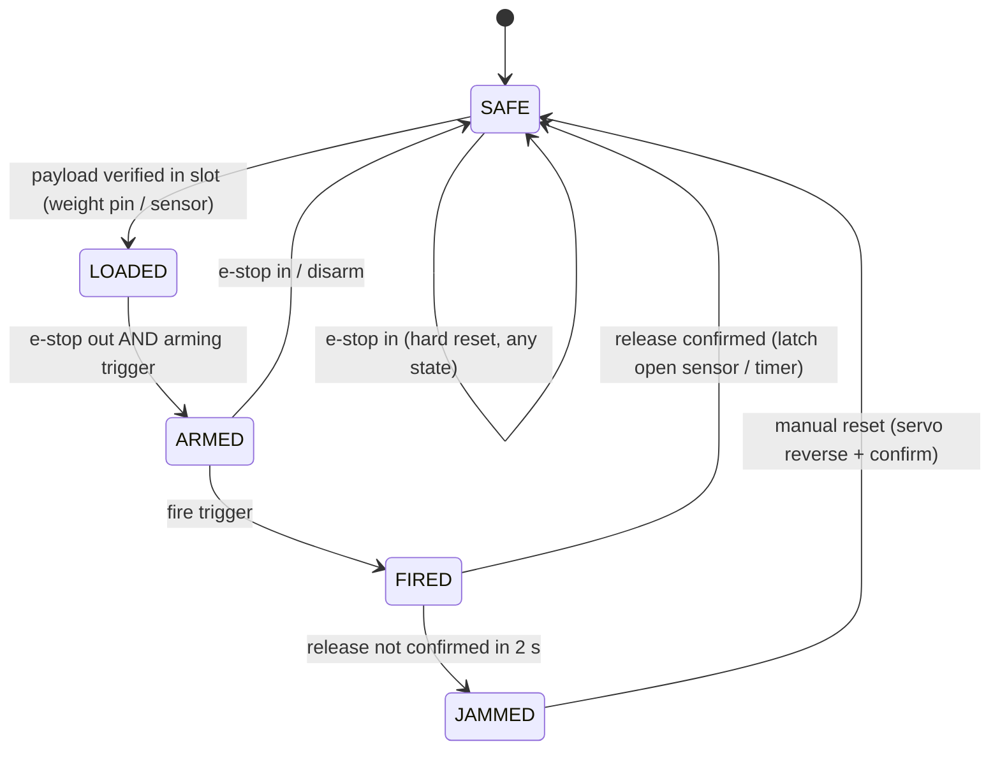
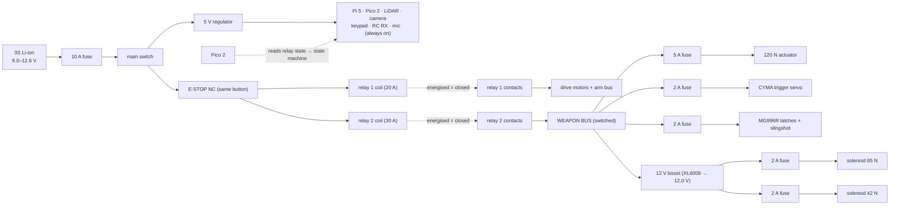

# 21.01 — War machine architecture — what changes on karmel

<!-- glance:start -->
<!-- hand-maintained: module 21 is not registered in curriculum/syllabus.yaml -->

| | |
|---|---|
| **Track** | Extension |
| **Difficulty** | Advanced |
| **Time** | 1 h 30 min |
| **Hardware** | robot-base (module 20 as built) |
| **Software** | none (you will write `war_power_budget.py` in this lesson) |
| **Prerequisites** | [20.01 Final robot system architecture](../20-final-robot/20.01-final-architecture.md)<br>[20.02 Hardware integration — mounting, power v2, compute, cabling](../20-final-robot/20.02-hardware-integration.md) |
| **Optional prerequisites** | [FP.07 Center of mass and tipping stability](../optional-foundations/physics/FP.07-center-of-mass-stability.md) |
| **Skip if** | You have added a payload rack to a two-domain robot and can predict its new centre of gravity and tipping limits. |

<!-- glance:end -->

## What you will learn

- Decompose every weapon into the same triple — **payload, releaser, trigger** — so that any new weapon is one row in a table instead of a new design.
- Add a **weapon rail** and a **weapon power rail** to karmel: one mechanical interface and one electrical domain boundary, drawn from first principles.
- Compute the **spec delta**: exactly how the robot's mass, centre of gravity, tipping limits, peak current and runtime change when the weapons go on — and write it in *this* module, not in the course files.
- Write the **weapon state machine** (safe / loaded / armed / fired / jammed) and the interlock that makes the e-stop meaningful for weapons.
- Choose your build package — **Scout, Assault or Siege** — from the BOM's mass and power budgets.

## Why it matters

Module 20 ended with a robot you could trust: 2.66 kg, centre of gravity 21 mm ahead of the axle, rearing up at 2.97 m/s², two power domains, an e-stop that removes actuator energy and nothing else. Now you are going to put a 0.8 kg linear actuator, a CO2 air magazine, servos, solenoids and a kilogram of payloads on top of it.

None of those additions is individually scary. Together, they change four numbers at once: the centre of gravity moves, the peak current on the switched rail grows by more than half, the LiDAR's 360° view acquires new furniture, and the software now has to answer a question it has never had to answer — *is it safe to fire right now?* Get any of the four wrong and the failure is not subtle: the robot noses over the caster when the cannon recoils, the solenoid fires with half the force because the pack sagged to 9.9 V, the LiDAR reports a wall 6 cm in front of the robot in every scan, or a sound trigger fires the cannon while the e-stop is in.

Each of those is one number away from being obvious in advance — the same argument as [20.02](../20-final-robot/20.02-hardware-integration.md), one level up. This lesson establishes the four numbers and the tool that keeps them honest: `21-war-machine/code/war_power_budget.py`.

<!-- prereqs:start -->
## Prerequisites

You need these first:

- [20.01 Final robot system architecture](../20-final-robot/20.01-final-architecture.md)
- [20.02 Hardware integration — mounting, power v2, compute, cabling](../20-final-robot/20.02-hardware-integration.md)

### Optional prerequisite links

New to any of these? Take the foundation lesson first; skip it if you already know it.

- [FP.07 Center of mass and tipping stability](../optional-foundations/physics/FP.07-center-of-mass-stability.md)
<!-- prereqs:end -->

## Concept

A war machine is not a robot with weapons. It is a robot with a **weapon platform**, and the platform has exactly five parts:

1. **The rail** — a 300 mm mechanical interface bolted to the deck, so every weapon mounts with the same four M3 screws and occupies a known rectangle.
2. **The weapon bus** — a switched power rail behind a *second* relay, because the weapons' peak current exceeds what the drive motors' relay was sized to carry.
3. **The 12 V tap** — a boost converter on that bus, because "12 V" parts need 12 V and your pack only has it when full.
4. **The state machine** — the software answer to "is it safe to fire": a small finite state machine with the e-stop as a hard reset.
5. **The spec delta** — the table, kept in this module, of every number that changed from module 20 and why.

Everything else — payloads, releasers, triggers — is *content* that the platform carries, and the rest of this module is that content.

> [!TIP]
> **Ask your teacher:** "Name my five platform parts and ask me which one is the only one that has to be behind the e-stop — and make me defend the other four."

## Technical explanation

### Level 1 — The (payload, releaser, trigger) triple

Every weapon in this course is one row of a three-column table:

| Weapon | Payload | Releaser | Trigger |
|---|---|---|---|
| Stink bomb drop | 100 ml aerosol (0.15 kg) | servo flap over a gravity bin | keypad key 1 |
| Paintball shot | 0.25 g paintball | CYMA CO2 magazine, servo on the trigger | 2.4 GHz RC channel 1 |
| Bouncy-ball cannon | 4 cm bouncy ball (0.05 kg) | 120 N linear actuator | vision (ArUco in frame > 0.5 s) |
| Glue stick | 50 g glue stick (0.06 kg) | servo plunger, squeeze release | sound (clap, 2×) |
| Smoke cloud | cold-smoke stick (0.03 kg) | solenoid pin withdraw, stick falls into a shielded well | manual, with 3 s audio warning |
| Heavy mine | 50×15 mm neodymium magnet (0.15 kg) | AGF arm drops it at range | manual |

Notice what the table buys you: the **releaser** column is the only one with physics in it (mass, energy, force), the **trigger** column is the only one with signal processing in it (thresholds, false-fires), and the **payload** column is just a shopping list. Lessons [21.03](21.03-releasers-i-latches.md) and [21.04](21.04-releasers-ii-launch.md) fill in the releasers, [21.05](21.05-triggers-remote.md)–[21.07](21.07-triggers-sound.md) the triggers, [21.02](21.02-payloads-and-bom.md) the payloads. The rail and the bus are the only things you design once.

### Level 2 — Power domain v3: why the weapons get their own relay

karmel already has two domains ([20.02](../20-final-robot/20.02-hardware-integration.md)): compute, always on; actuators, behind the 20 A e-stop relay. The weapons look like actuators, so the first instinct is to hang them off the same relay. Do the arithmetic and you see why that stops working:

```text
Switched rail, worst simultaneous case (Assault package)
  drive motors stalled at driver limit              8.85 A   (measured in 20.02)
  120 N linear actuator, launch stroke               5.5 A   (estimate, 12 V)
  CYMA trigger servo, shot                            2.0 A   (estimate)
  85 N solenoid, pin pulse                            1.5 A   (estimate, 12 V tap)
  MG996R latches ×2 + slingshot servo                 2.0 A   (estimate)
  --------------------------------------------------------
  TOTAL                                             19.85 A
```

19.85 A through a relay that the course sized at 20 A "with margin" — the margin is now 0.15 A, and a stalled drive motor while the cannon is firing is no longer a worst case, it is a *scenario*. The fix is the second relay: the course's 20 A relay keeps carrying exactly what it was sized for (drive motors, arm bus), and a **30 A relay** carries the weapon bus, both coils fed through the same e-stop NC contact. One button still stops everything that moves; the fuses now have something sane to protect.

The **12 V tap** is the subtler part. Your pack is 9.0–12.6 V. Most "12 V" parts tolerate 9.9 V — servos and the actuator lose a little speed, and since their force and current both scale with V, the loss is proportional and predictable. Solenoids are worse, and the reason is a square:

$$F_\text{mag} \;\propto\; \Phi^2 \;\propto\; I^2 \;\propto\; V^2$$

At 9.9 V, a 12 V solenoid delivers $(9.9/12)^2 = 68$ % of its rated force. A 42 N pin release becomes 28.6 N — maybe still enough, maybe not, and *you* do not know which until the pack has sagged to 9.9 V in the middle of the demo. A buck converter cannot fix this (it cannot output more than its input, so at an empty pack it outputs at most ~7.6 V), which is why the tap is a **boost** converter set to 12.0 V: the solenoids see 12.0 V whether the pack is at 12.6 or 9.1, and the whole force problem goes away. The actuator and servos stay on the switched rail directly, where "nominally 12 V" is good enough.

### Level 3 — The mass model, extended

The CG model from [20.02](../20-final-robot/20.02-hardware-integration.md) is a parts table. The war machine adds rows; it does not change the math:

$$x_{cg} = \frac{\sum_i m_i x_i}{\sum_i m_i} \qquad z_{cg} = \frac{\sum_i m_i z_i}{\sum_i m_i} \qquad a_\text{tip} = \frac{g\, x_{cg}}{z_{cg}}$$

`py 21-war-machine/code/war_power_budget.py mass` runs it with the weapon parts included — the robot from module 20 as built, and all three build packages on top of it:

```text
$ py 21-war-machine/code/war_power_budget.py mass

base
  total mass 2.66 kg   CG x +21 mm  z 70 mm
  margin +21 mm   rears up at 2.97 m/s^2   noses over at 10.95 m/s^2
  runtime 107 min

scout
  total mass 4.16 kg   CG x +38 mm  z 64 mm
  margin +38 mm   rears up at 5.90 m/s^2   noses over at 9.44 m/s^2
  runtime 89 min

assault
  total mass 5.51 kg   CG x +48 mm  z 63 mm
  margin +37 mm   rears up at 7.46 m/s^2   noses over at 8.05 m/s^2
  runtime 78 min

siege
  total mass 6.46 kg   CG x +53 mm  z 65 mm
  margin +34 mm   rears up at 7.88 m/s^2   noses over at 7.11 m/s^2
  runtime 71 min
```

Read that table slowly, because it contains the whole stability argument of this module:

- **Forward mass is the safe direction on this robot** — the caster is in front, so moving the CG forward *away* from the rear support edge (the axle) more than doubles the rearing-up limit. Parking a weapon on the front of the rail is structurally the right place to park it.
- **But every kilogram forward eats the braking margin** — nosing over the caster in braking fell from 10.95 to 8.05 m/s². karmel's software limit is 1.0 m/s², so you still have eight times the limit, and you would need to add about 5 kg of front mass to lose that. The margin is real, but it is now something you *own*, not something the chassis gives you.
- **The weapons lowered the CG** (70 → 63 mm) because the rail and the payload rack live below deck 2. Heavy weapons low and forward: that is the whole placement rule, and it is the same rule that put the battery forward in [20.02](../20-final-robot/20.02-hardware-integration.md).

The same script prices the firing itself, and the price is almost nothing:

```text
$ py 21-war-machine/code/war_power_budget.py power
cannon shot (120 N x 0.10 m)                 12.0 J       3.33 mWh   peak  5.5 A
solenoid pin pulse (85 N x 0.015 m + I^2R)    2.0 J       0.56 mWh   peak  1.5 A
slingshot shot (2 bands, 120 mm stretch)      4.0 J       1.11 mWh   peak  0.3 A
CYMA trigger shot (servo; CO2 is chemical)    0.5 J       0.14 mWh   peak  2.0 A

100 cannon shots: 1200 J = 0.33 Wh = 0.9 % of the 37.8 Wh pack
verdict: firing costs ~1 % of the pack per 100 shots.
        the weapons tax the robot through MASS (wheels carry it) and PEAK CURRENT (wires carry it),
        not through energy.
```

This is the counter-intuitive result to internalise: **your weapon budget is a mass and a peak-current budget, not an energy budget.** A 12 J shot is nothing to a 37.8 Wh battery; a 0.8 kg actuator that the wheels must accelerate, brake and hold against gravity is everything.

### Level 4 — The weapon state machine

The drive motors have two states (on, off) and the e-stop handles both. A weapon has more, and the extra states are where the failures live:



Three rules make the machine safe, and all three are *hardware-enforced where possible*:

1. **`ARMED` requires the e-stop to be out** — the sensor is the Pico reading the relay state. If the e-stop is in, the weapon bus has no power at all, so even a software bug that declares `ARMED` cannot fire anything: the solenoid has no voltage. The interlock is in the copper, not the code.
2. **`FIRED` goes to `SAFE`, never back to `ARMED`** — a second shot requires a new `LOADED` (the payload sensor sees the slot empty and a new payload). This is the double-fire guard: the most expensive bug in the course is a robot that fires twice when you wanted it to fire once.
3. **`JAMMED` is a real state, not an error log** — if the release is not confirmed within 2 s, the payload is *somewhere* (in the bin, half out, on the floor). Until you know where, the weapon is not `SAFE`, and the demo stops.

> [!NOTE]
> This is your first **finite state machine with a physical plant**, and the design smell is the same as a distributed system: the state you *record* can differ from the state the *hardware* is in, and the e-stop is the only event you are allowed to trust blindly. Everything else is a sensor reading, and sensor readings lie.

### Level 5 — The spec delta, written where it belongs

The course files (karmel.yaml, module 20) describe the robot *without* weapons. Your war machine differs from it in a bounded, written-down list. That list is the **spec delta**, and it lives in this module because the rule is: *your additions are documented where they were made*.

| # | Quantity (module 20) | War machine (Assault) | Why it changed |
|---|---|---|---|
| 1 | mass 2.66 kg | 5.51 kg (estimate, +2.85 kg) | rail + weapons + loaded payloads |
| 2 | CG x +21 mm, z 70 mm | x +48 mm, z 63 mm (estimate) | weapons low and forward |
| 3 | rears up 2.97 / noses over 10.95 m/s² | 7.46 / 8.05 m/s² | forward+low mass |
| 4 | switched rail peak 10.1 A, one 20 A relay | 10.1 A on the 20 A relay + 13.3 A on a 30 A relay | weapons have their own relay |
| 5 | runtime ~107 min | ~78 min (estimate) | the wheels now carry 5.51 kg |
| 6 | LiDAR plane: chassis furniture only | rail top must stay below z = 0.10 m or above 0.14 m | new furniture in the scan |
| 7 | camera FOV: arm parked out of frame | weapons parked out of the 1.20 rad cone | a cannon in every frame breaks the detector |
| 8 | e-stop removes actuator energy | e-stop removes actuator **and weapon** energy (two relays) | the weapon bus is a new domain |
| 9 | states: driving / stopped | + SAFE/LOADED/ARMED/FIRED/JAMMED per weapon | weapons are state machines |
| 10 | power: 10 A fuse, 20 A relay | + 30 A relay, 5 A/2 A branch fuses, 12 V boost tap | peak current budget |

Every row is a decision you can defend in one sentence. If you cannot defend a row, that row is a bug.

## Diagram

Side view of the war machine, with the constraints from [20.02](../20-final-robot/20.02-hardware-integration.md) still in force:

```text
                        LiDAR plane z = 0.120 m  KEEP CLEAR ±0.02 m, 360 deg
   ........................[ RPLIDAR C1 ]................................   z = 0.12
   [cannon, parked, tip below z=0.14]  [CYMA mag, vertical]   [cam]-->    z ~ 0.13
   deck 2 ---+----------------------+------------------------+----------  z ~ 0.09
             |  Pi 5 + cooler        |  e-stop (reachable)    |
   deck 1 ---+-----------------------+------------------------+---------  z ~ 0.06
             |  Pico 2 + relay coils |  3S pack (x = +60 mm)  |  weapon bus fuse block
   chassis --+-----------------------+------------------------+---------  z = 0.03
             (o)                                     (o)
         drive wheels                            caster
         x = 0                                    x = +100 mm
   --------------------------------------------------------------- ground
          weapon rail: z = 0.03–0.08 m, x = +20 … +110 mm
          CG (Assault): x = +48 mm, z = 63 mm  — inside the polygon, forward, low
          a_tip(rear) = g·x/z = 7.46 m/s^2    a_tip(brake) = g·(0.100−x)/z = 8.05 m/s^2
```

The weapon bus, end to end (the full drawing, including every fuse, is in the
[BOM](hardware/war-machine-bom.md) §F):



## Code

`21-war-machine/code/war_power_budget.py` is this lesson as a program:

```bash
py 21-war-machine/code/war_power_budget.py mass        # CG + tipping, base vs each package
py 21-war-machine/code/war_power_budget.py power       # per-shot energy, runtime tax
py 21-war-machine/code/war_power_budget.py packages    # Scout / Assault / Siege budgets
py 21-war-machine/code/war_power_budget.py delta       # the spec-delta table (Level 5)
py 21-war-machine/code/war_power_budget.py check       # everything, exit 1 on a problem
```

The parts table is the whole model — every entry is marked `(measured)`, `(datasheet)` or
`(estimate)`, exactly like `karmel_v2_parts()` in [20.02](../20-final-robot/20.02-hardware-integration.md):

```python
WAR_PARTS = [
    # name                m (kg)   x (m)    z (m)    source
    Part("weapon rail",      0.25,   0.065,  0.045,  "estimate"),
    Part("rail hardware",    0.20,   0.050,  0.045,  "estimate"),
    Part("drop bin + 2x MG996R", 0.35, 0.085, 0.055, "estimate"),
    Part("payload rack loaded", 0.45, 0.075, 0.060, "estimate"),   # 3 slots × ~0.15 kg
    Part("cannon 120N/100mm", 0.80,   0.090,  0.055,  "estimate"),  # Assault+
    Part("CYMA magazine + CO2",0.55,  0.060,  0.070,  "estimate"),  # Assault+
    Part("slingshot + bands", 0.15,   0.070,  0.050,  "estimate"),
    Part("boost + fuses + wiring", 0.10, 0.030, 0.045, "estimate"),
]
```

and the CG is the same three-line function from [20.02](../20-final-robot/20.02-hardware-integration.md), applied to the base parts plus the package's weapon parts. Edit the table to describe **your** build; turning the `(estimate)` entries into measurements is the practical challenge.

## Exercise

### Exercise 21.01-E1 — Predict the CG shift `[predict]`

Hardware: none.

Before running anything, compute by hand:

1. The base robot is 2.66 kg with CG at x = +21 mm, z = 70 mm. You bolt on a 1.0 kg cannon at x = +90 mm, z = +55 mm. Where is the new centre of gravity (x and z)?
2. What is the new rearing-up acceleration, and the new braking (nosing-over) acceleration? The caster is at x = +100 mm.
3. Did the cannon make the robot *more* or *less* stable overall? Justify with both numbers, not a feeling.
4. Now the same cannon carries a 0.05 kg payload at its tip (x = +115 mm). Recompute x_cg. How much did the *payload* move it, compared to the cannon itself?

Then run `py 21-war-machine/code/war_power_budget.py mass` to check 1–2, and add your cannon + payload to the parts table for part 4.

### Exercise 21.01-E2 — The delta function `[coding]`

Hardware: none.

Implement `cg_shift(base_mass_kg, base_cgx_m, base_cgz_m, added)` and
`spec_delta(package="assault")` in `21-war-machine/code/exercises/student.py` (the 21.01-E2
section; the docstrings are the spec — the ten row labels of Level 5 are listed there) so
that the tests check them against the `mass` and `delta` command outputs. `spec_delta`
must return the ten-row table of Level 5 as data (a list of tuples), not as printed
strings.

Check it: run `py -m pytest 21-war-machine/code/exercises -k 2101_e2` (the exercise tests
ship with the module; no hardware needed).

### Exercise 21.01-E3 — Draw your domain v3 `[design]`

Hardware: none (paper or any diagram tool).

Draw your robot's power schematic with **three** domains: compute (always on), actuator
(course relay), weapon (your relay), every fuse and the 12 V tap labelled. Then answer in
writing: which two loads on your diagram are genuinely arguable about which domain they belong
to, and what decides it? (Hint: one is the LiDAR's cousin; the other is the e-stop button
itself.)

### Exercise 21.01-E4 — Build the rail and prove the model `[hardware]`

Hardware: `robot-base` (module 20 as built), weapon rail, M3 kit, multimeter, a bathroom or
kitchen scale.

> [!CAUTION]
> **Safety:** battery disconnected for all wiring; wheels off the ground for any current
> reading; the scale test happens with the battery in (it is a load, not a live part) and the
> robot supported ([SAFETY.md](../SAFETY.md) rules 1, 2, 4).

1. Mount the rail with four M3 screws at the positions your floorplan (21.01-E3) says, and measure its real mass with the scale. Replace the `estimate` in the parts table.
2. Add each weapon part one at a time, weighing the robot after each addition. After every addition, run `mass` and record the CG the model predicts.
3. Balance-test the finished Scout package on a straight edge, front to back, as in 20.02's practical challenge. Compare the measured balance point with the model's x_cg to within a centimetre.
4. With the 12 V boost tap powered from the pack, measure its output with the pack at full charge and again after a 20-minute drive. Record both — that spread is your solenoid-force spread from Level 2, made real.

## Expected result

**21.01-E1.** (1) Total 3.66 kg; $x_{cg} = (2.66 \times 0.021 + 1.0 \times 0.090)/3.66 = +39.9$ mm, $z_{cg} = (2.66 \times 0.070 + 1.0 \times 0.055)/3.66 = 65.9$ mm. (2) Rearing up: $9.81 \times 0.0399/0.0659 = 5.94$ m/s² (up from 2.97); braking: $9.81 \times (0.100 - 0.0399)/0.0659 = 8.94$ m/s² (down from 10.95). (3) More stable for acceleration, less stable for braking — and on this robot, with a 1.0 m/s² software limit in both directions, *both* margins are still 5–9× the limit, so the net verdict is: stable, and the forward placement was the right call. (4) A 0.05 kg payload at +115 mm moves x_cg by $0.05 \times 0.115/3.71 = +1.5$ mm — about 8 % of the cannon's own 18.9 mm shift (the CG moved 21 → 39.9 mm when the cannon went on). Payloads are a rounding error; the *mechanism* is the mass you have to plan for.

**21.01-E2.** The tests pass: your `cg_shift` reproduces the `mass` output to within floating point, and `spec_delta` returns all ten rows with the right old/new values.

**21.01-E3.** No automated check. The two arguable loads: the **RC receiver / keypad / mic** (sensors — they cannot hurt anyone, so always-on, the same argument the course applies to the LiDAR's motor) and the **relay coils** (they move *nothing* — the contacts do — and they must be *fed through* the e-stop NC contact so that a broken coil wire fails safe, exactly as in [20.02](../20-final-robot/20.02-hardware-integration.md) Level 2).

**21.01-E4.** Expect the measured balance point within ±1 cm of the model's x_cg — if it is off by more, your parts table is wrong (a part's *position* is almost always the culprit, not its mass). The boost tap should hold 12.0 V at full charge and 12.0 V after the drive too — *that is the point of the boost*; if it sags, its 3 A rating is exceeded by your solenoid load and the tap needs a bigger module.

## Troubleshooting

### Symptom: the robot rears up when the cannon fires

Two effects, one direction. The CG shift from the loaded payload (Level 1 of the math above) is small; the **recoil** is not — a 0.05 kg ball leaving at 7 m/s is 0.35 kg·m/s of momentum, and the reaction impulse on a 5.51 kg Assault robot is a velocity kick of $0.35/5.51 = 0.064$ m/s, which the wheels must bleed off in about 0.5 s — an effective 0.13 m/s², well under the limit. So if the robot actually rears up, measure: is the CG where the model says it is (straight-edge test)? If yes, the cannon's *mount* is letting the recoil rotate the deck — the rail is flexing, and the fix is a gusset or a longer rail, not more battery mass.

### Symptom: 5 V dips when a solenoid fires, and the Pi drops a LiDAR packet

The solenoid is on the 12 V tap, not the 5 V rail — so the dip is upstream: the boost converter is pulling hard off the switched rail, and the switched rail shares the pack with the 5 V regulator. Check the pack voltage during the pulse (INA226 or meter): if the *pack* sags 0.3 V, your main branch or the relay contacts are the bottleneck (tens of milliohms each, at 5 A that is volts), or the solenoid's pulse is too long — 300 ms of 1.5 A is 0.45 C, and the pack's internal resistance shows it. Shorter pulses, fatter main branch, or a small 12 V capacitor (470 µF) at the boost input.

### Symptom: the e-stop is in, but the cannon still fires

The weapon relay's coil is not being de-energised. Three causes in order of likelihood: the coil is fed from the 5 V rail *behind* the e-stop NC (correct) but someone bridged it; the relay is a latching type that someone set to "remember state"; or the e-stop NC contact you wired is actually the NO contact (the Erco button has both — [20.02](../20-final-robot/20.02-hardware-integration.md) Level 2 tells you how to tell them apart with a continuity tester). The state machine's `ARMED`-requires-e-stop-out rule should have caught this in software; if it did not, the Pico is not reading the relay state and your interlock is a wish.

### Symptom: the LiDAR sees a wall 6 cm in front of the robot, only when the weapons are mounted

The rail's top edge, or a parked weapon's tip, crossed the scan plane (z = 0.12 ± 0.02 m). Read the phantom's *angle* in RViz — it points at the object — then either lower the rail by 2 cm (it was printed 2 cm too tall) or raise the LiDAR. This is the same failure the course had in [20.02](../20-final-robot/20.02-hardware-integration.md), with the weapon rail as the new suspect.

## Common mistakes

- **One relay for everything.** The drive motors' stall current plus the weapons' peak is a 20 A relay with 0.15 A of margin. Second relay, same e-stop button.
- **A buck converter on the 12 V tap.** A buck cannot output more than its input; at a 9.9 V pack it outputs 7.6 V and your solenoids lose 32 % of their force. Boost, or run the solenoids on the raw rail and accept the sag.
- **Budgeting weapons in energy.** 100 shots cost 1 % of the pack. The tax is mass (wheels) and peak current (wires).
- **Computing the CG without the loaded payloads.** The rack holds 0.45 kg of payload in normal operation; that is part of the robot, not an option.
- **`FIRED → ARMED` in the state machine.** Double-fire: the robot fires twice when you wanted once, and the second shot is aimed at whatever the robot has walked into since.
- **Mounting a weapon where it fits, not where it balances.** Forward and low is the rule for this chassis (caster in front); a heavy magazine on top of deck 2, rearward, is the single worst placement available.
- **Leaving the weapon rail in the LiDAR plane.** Six centimetres of furniture in every scan, at a fixed angle, forever.
- **Treating `JAMMED` as a log line.** A jammed payload is a physical object whose location you do not know; until you do, the weapon is not safe.
- **Documenting the spec delta in the course files.** karmel.yaml is the course robot; your additions live in this module (the "do not touch existing files" rule is a load-bearing rule, not a politeness rule).

## Knowledge check

1. Why is the 12 V tap a *boost* converter and not a *buck* converter? What is the worst-case output of a buck fed from an empty 3S pack?
   <details><summary>Answer</summary>

   Because the tap must output 12.0 V even when the pack is at 9.0–9.9 V, and a buck converter's output is always at or below its input. A buck fed from a 9.9 V pack outputs at most ~0.77 × 9.9 ≈ 7.6 V (real modules lose a few percent more). At 7.6 V a "12 V" solenoid delivers $(7.6/12)^2 ≈ 40$ % of rated force. The boost converter steps the pack *up* to 12.0 V regardless of state.
   </details>

2. The Assault package puts the CG at x = +48 mm, z = 63 mm. Compute the rearing-up and braking tipping limits, and say which one got worse and why that one getting worse does not (yet) matter.
   <details><summary>Answer</summary>

   Rearing up: $9.81 \times 0.048/0.063 \approx 7.46$ m/s² (was 2.97 — improved, because the forward mass moves the CG *away* from the rear pivot). Braking: $9.81 \times (0.100 - 0.048)/0.063 \approx 8.05$ m/s² (was 10.95 — worse, because the CG moved *toward* the front caster pivot, so less braking is needed to walk the CG past it). Both are still 7–8× the 1.0 m/s² software limit, so the margin still covers the robot's actual use; the braking limit only matters if you ever brake at 8 m/s², and karmel does not.
   </details>

3. The e-stop is pressed while the state machine says `ARMED`. What happens in hardware, and why is that safer than "software catches it"?
   <details><summary>Answer</summary>

   The e-stop's NC contact opens, the 30 A relay coil de-energises, the weapon bus loses power, and the solenoid/servo/actuator physically cannot fire — no voltage, no force. The state machine *should* also notice (it reads the relay state and drops to `SAFE`), but if the Pico is frozen, the USB cable is unplugged, or the interlock code has a bug, the copper still did the right thing. Hardware interlocks do not have release notes.
   </details>

4. A 120 N actuator moves a 0.05 kg payload 0.10 m in one launch. How many joules is that, how many Wh, and what does that imply about where the weapon's real cost lives?
   <details><summary>Answer</summary>

   $E = F \times d = 120 \times 0.10 = 12$ J = 12/3600 = 0.0033 Wh. A hundred shots is 0.33 Wh, about 1 % of the 37.8 Wh pack. The energy cost is negligible — the real costs are the 0.8 kg of mechanism the wheels must carry (stability, drag, runtime) and the ~5.5 A peak the wiring must survive (gauge, fuse, relay rating).
   </details>

5. Why does `FIRED` transition to `SAFE` rather than back to `ARMED`? What bug does that single arrow prevent?
   <details><summary>Answer</summary>

   Because "armed" means "a payload is verified in the slot and the release is cocked", and after a shot the slot is empty — the *precondition* for armed is false until a new payload is loaded and verified. Skipping `LOADED` allows **double-fire**: the release mechanism re-triggers (a held trigger, a stuck sensor, a repeated RC pulse) while the first payload is still in flight or the slot state is stale. The `FIRED → SAFE` arrow forces a fresh payload verification before any second shot.
   </details>

6. Your robot's CG is where the model says it is, but it still rears up when the cannon fires. Name the two physical effects the lesson separates here, and which one your measurement says is the culprit.
   <details><summary>Answer</summary>

   The static CG shift (loading the payload) and the dynamic recoil impulse. If the CG matches the model, the static effect is accounted for, so the culprit is the recoil: 0.075 m/s of kick over ~0.5 s is only 0.15 m/s² — under the limit — so a *visible* rear-up means the mount is flexing and converting the impulse into deck rotation. Fix the rail (gusset, longer rail, stiffer material), not the mass.
   </details>

## Practical challenge

Build the **Scout** package and produce the evidence.

1. Mount the weapon rail and the drop bin with two MG996R latches; wire the keypad and the INMP441; bring up the state machine with the e-stop interlock (21.05 will make the trigger real — for now, the keypad *is* the trigger).
2. Run the full acceptance: `py 21-war-machine/code/war_power_budget.py check` on your edited parts table (no `(estimate)` you could have measured may remain), the straight-edge CG test within 1 cm of the model, and the boost-tap voltage at full and driven pack.
3. Fire 10 payloads (any mix from the [BOM](hardware/war-machine-bom.md) drop class), and for each shot log: state machine trace, pack voltage before/during/after, and where the payload landed. Ten shots with ten traces is your first dataset.
4. Press the e-stop mid-cycle (while a servo is moving the flap) and confirm: the bus is dead within a second, the Pi is up, the state machine reports `SAFE`, and releasing the e-stop does not resume the flap.
5. Write your spec-delta table — all ten rows of Level 5, with *your* measured numbers replacing the estimates — into `21-war-machine/PROGRESS.md` or a note in this module. The course files stay untouched.

> [!CAUTION]
> **Safety:** ten shots means ten times "watch where it lands" — drop-class payloads fall *straight down in front of the caster*, so nothing and nobody is in the 0.5 m in front of the robot during a fire test. The e-stop is reachable with one hand from standing height ([SAFETY.md](../SAFETY.md) rules 1, 2, 8).

Acceptance criteria: the state machine trace of every shot exists; the measured CG agrees with the model within 1 cm; the e-stop kills the weapon bus and the computers survive; the boost tap holds 12.0 V under load; and your spec delta is written with measured numbers where you could measure them.

## You can skip this if…

You can name the five platform parts and defend which one must be behind the e-stop; you can predict, from a parts table you have not seen, where the CG moves and which tipping limit worsens when a 1 kg weapon goes on the front rail; and you can explain why the 12 V tap is a boost, why the weapons have their own relay, and which state-machine arrow prevents double-fire.

`python course.py skip 21.01 --reason "I have designed a weapon platform (rail + domain v3 + state machine + spec delta) for a two-domain robot"`

## Go deeper

- The course's own integration, which this lesson extends: [20.02 Hardware integration](../20-final-robot/20.02-hardware-integration.md) — the two-domain boundary, the branch-sizing math, and the original CG model.
- XL6009 boost converter datasheet and the inductor/input-capacitor rules that decide whether your 3 A rating is real: search "XL6009 datasheet" — the module's page at [Hackstore](https://hackstore.co.il) links the spec.
- Finite state machines for embedded systems — the "state you record vs state the plant is in" problem: any FSM chapter in an embedded systems text; the design rule here is *make the reset event the only one you trust blindly*.
- [ISO 13849-1 overview](https://www.iso.org/standard/73934.html) — categories of control systems, the industrial version of "hardware interlock over software check"; the e-stop-plus-relay arrangement is a Category 2/3 argument in miniature.
- [Pololu's distributor list](https://www.pololu.com/distributors/0J118) — the Pololu parts in the BOM (the MG996R-class servos, the relay modules) ship through the Israeli distributors named in [hardware/war-machine-bom.md](hardware/war-machine-bom.md) (4Project is the Pololu distributor).
- Momentum and impulse — the recoil calculation: $J = \Delta p = m v$, and the robot's velocity kick is $J/M$.

## Progress checkpoint

- [ ] I can decompose any weapon into payload / releaser / trigger and say which column has the physics.
- [ ] I can draw power domain v3: compute, actuator relay, weapon relay, 12 V boost tap, every fuse.
- [ ] I can predict the CG shift and both tipping limits for a given weapon mass and position.
- [ ] I can explain why the 12 V tap is a boost and why the weapons need their own relay.
- [ ] I have the weapon state machine written down with the e-stop as hard reset, and I know which arrow prevents double-fire.
- [ ] My spec-delta table exists, has ten rows, and I can defend each row in one sentence.

`python course.py complete 21.01` (exercises done) · `python course.py master 21.01` (challenge done) · `python course.py struggle 21.01 "what was hard"`

Next: [21.02 — Payloads: the BOM of things you can throw, shoot, stick and spray](21.02-payloads-and-bom.md).
