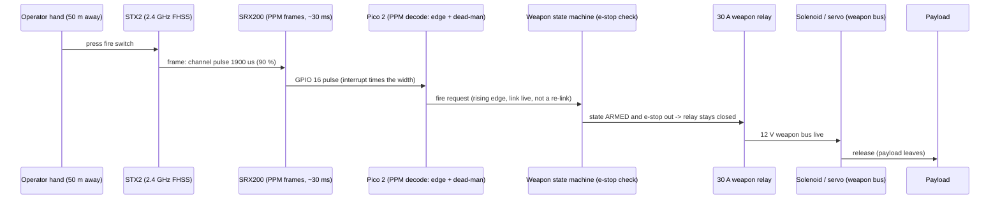

# 21.05 — Triggers I — remote control

<!-- glance:start -->
<!-- hand-maintained: module 21 is not registered in curriculum/syllabus.yaml -->

| | |
|---|---|
| **Track** | Extension |
| **Difficulty** | Advanced |
| **Time** | 2 h |
| **Hardware** | keypad, rc-link (4×4 USB keypad — Hackstore; STX2/SRX200 2.4 GHz — Maof RC; BOM §E) |
| **Software** | Python 3.10+ (`code/trigger_pipeline.py demo`, `decode_ppm_fire_edges` exercise) |
| **Prerequisites** | [21.03 Releasers I — latches, clamps and pins](21.03-releasers-i-latches.md) |
| **Optional prerequisites** | [FC.05 Interrupts, timers, PIO](../optional-foundations/cpp-and-embedded/FC.05-interrupts-timers-pio.md) |
| **Skip if** | You can choose a trigger family from latency/range/false-fire numbers, explain the sensor/switch domain split, and predict when a dead-man RC link fires after the transmitter restarts. |

<!-- glance:end -->

## What you will learn

- Choose between the three remote trigger families — **keypad, 2.4 GHz RC, IR beacon** — from a requirements table (latency, range, line-of-sight, power, false-fire rate), not from vibes.
- State the **domain rule** of [21.01](21.01-war-machine-architecture.md) and BOM §E: the *sensor* lives on the always-on compute domain, the *switch it closes* lives on the weapon bus behind the e-stop relay — and why a trigger that fires while the e-stop is in is a bug in code **and** in copper.
- Implement the keypad's **edge + debounce** logic (`ButtonTrigger`) and explain why a held key is not a machine gun.
- Decode a 2.4 GHz receiver's **PPM frames** on the Pico 2 (GPIO interrupt times each pulse; 1000–2000 µs = 0–100 %; fire threshold 1500 µs) and implement the two guards of `RcTrigger`: **edge** and **dead-man/relink**.
- Do the **dead-man arithmetic**: the link dies with the switch held, the transmitter restarts — predict the exact moment the robot may fire.
- Build an **IR beacon** that fires on a 7-pulse pattern, not on any light level.

## Why it matters

A weapon without a trigger is a loaded gun pointed at the state machine. The trigger is the
**decider** — the one subsystem of the whole war machine that a human touches directly, and the
one most likely to fire when nobody asked: a passing cloud over the IR sensor, a transmitter
whose battery died with the switch held, a keypad membrane that stuck. Every false fire costs a
payload, a state-machine cycle, and the audience's belief that you know what you are doing.

In a demo the operator is one of three kinds of person: standing **next to the robot** (keypad),
standing **50 m away** with a hand-held unit (RC), or standing **behind a low wall** with a
line of sight to the robot (IR beacon). This lesson builds all three and the guard logic that
makes each one trustworthy. [21.06](21.06-triggers-vision.md) and [21.07](21.07-triggers-sound.md)
add the two triggers the operator *doesn't* press — vision and sound — and they all run through
the same `FirePipeline` you will test today.

<!-- prereqs:start -->

## Prerequisites

You need this first:

- [21.03 Releasers I — latches, clamps and pins](21.03-releasers-i-latches.md) — the servo flap and solenoid that the trigger is closing, and its pin plan: **GPIO 8/9 are the flap servos**, which is why the RC receiver needs a different pin.

### Optional prerequisite links

New to any of these? Take the foundation lesson first; skip it if you already know it.

- [FC.05 Interrupts, timers, PIO](../optional-foundations/cpp-and-embedded/FC.05-interrupts-timers-pio.md) — the Pico 2 decodes PPM with a GPIO interrupt that measures each pulse's width; FC.05 is where that technique comes from.

<!-- prereqs:end -->

## Concept

A trigger is the decider. The payload is waiting, the releaser is cocked, the state machine is
`ARMED` — and then *something* has to say **now**. The three families differ in where the
operator is when they say it:

1. **Local keypad** — the operator stands next to the robot and presses a USB HID key. Zero
   wireless, zero range, zero excuses. It is the **fallback trigger**: when the RC battery dies
   and the IR beacon is out of line of sight, the keypad still works, because it is a USB
   device on the Pi (compute domain) and the e-stop interlock is checked in the state machine.
   A keypad fire while the e-stop is in is blocked in code *and* in copper — the weapon bus has
   no power at all.
2. **2.4 GHz RC** — the operator stands 50 m away with a hand-held transmitter. The robot hears
   a stream of frames, not a button: the real engineering is in the *decoding guards* (edge,
   dead-man) that keep a dead transmitter from firing the cannon.
3. **IR beacon** — a coded line-of-sight trigger, 10–20 m: a hand-held 940 nm LED flashes a
   pattern, the phototransistor on the robot fires only on the *full pattern*. This is the
   "operator hidden behind a wall" option.

And the domain rule from [21.01](21.01-war-machine-architecture.md) and the
[BOM](hardware/war-machine-bom.md) §E, which applies to every one of them: the **sensor**
(keypad, receiver, phototransistor) lives on the always-on **compute domain** — it cannot hurt
anyone, same argument as the LiDAR. The **switch it closes** (solenoid, servo, actuator) lives
on the **weapon bus behind the e-stop relay**. A trigger that fires a weapon while the e-stop
is in is a **bug, not a feature**.

> [!TIP]
> **Ask your teacher:** "I have a trigger that fired while the e-stop was in. Walk me through where it could have failed — copper first, code second — and make me name the sensor and the switch for each of the three families."

## Technical explanation

### Level 1 — Requirements: the three families compared

The selection question is a table, not a debate:

| Family | Operator position | Latency (press → fire request) | Range | Line of sight | Operator power | False-fire rate (design) | Cost (BOM §E) |
|---|---|---|---|---|---|---|---|
| Keypad 4×4 (USB HID) | next to the robot | ~5–15 ms | <1 m (the operator *is* the cable) | yes | none (USB, Pi) | <1/hour (stuck key) | ~₪30–50 (Hackstore) |
| 2.4 GHz RC (STX2 + SRX200) | 50 m away, hand-held | ~30–60 ms | 50+ m (2.4 GHz FHSS) | mostly no (RF) | 2× AA in the TX | <1/hour (dead link, bounce) | ~₪150–300 (Maof RC) |
| IR beacon (940 nm LED + phototransistor) | 10–20 m, behind a low wall | ~35–70 ms (the pattern must complete) | 10–20 m | yes | 3 V battery in the beacon | <1/hour (sunlight) | ~₪15 (KSP/Hackstore) |

Every entry is a design target you can test in Exercise E3. The **false-fire rate <1/hour** is
the one that matters most: a false fire costs a payload; a *missed* fire costs nothing (you
press again). Asymmetric cost, so the trigger should be conservative — which is exactly what
the guards in Levels 2–4 implement.

The keypad's special role: it must work **when everything else fails**. It is USB on the Pi —
compute domain, always powered — and the e-stop interlock is checked in the state machine
(`ARMED` requires e-stop out, [21.01](21.01-war-machine-architecture.md) Level 4), so a keypad
fire with the e-stop in is blocked in code; and the weapon bus has no power behind the dead
relay, so it is also blocked in copper. Two independent blocks, one of them a wire.

### Level 2 — The keypad: one key per weapon, edge + debounce

The hardware is a 4×4 USB membrane keypad (BOM §E, Hackstore) plugged into the Pi: USB HID, so
the Pi sees key events with no driver work. One key per weapon: key 1 = drop bin, key 2 =
cannon, … The two signal problems of *any* physical switch are already solved here — by the
code, not the hardware:

- **Debounce 20 ms.** A physical contact bounces for 5–20 ms when it closes: the "press"
  arrives as several edges. A 20 ms guard window eats the bounce.
- **Edge logic.** A *held* key is not a machine gun: only the **rising edge** (off → on)
  requests a fire. Your finger staying on the key for 30 s is one request, not 900.

This is `ButtonTrigger` from [code/trigger_pipeline.py](code/trigger_pipeline.py), the whole
class — there is not much to it, which is the point:

```python
class ButtonTrigger:
    """Local keypad key: a fire request on the RISING edge, debounced (21.05 Level 2).

    ``pressed`` is the raw switch state; the debounce eats contacts bouncing for
    ~20 ms, and the edge logic eats the human finger that stays on the key.
    """

    def __init__(self, name: str = "keypad", debounce_ms: float = 20.0) -> None:
        self.name = name
        self._debounce_ms = debounce_ms
        self._pressed = False
        self._last_edge_t: float | None = None

    def update(self, pressed: bool, t: float) -> bool:
        fire = False
        if pressed and not self._pressed:  # rising edge
            if self._last_edge_t is None or (t - self._last_edge_t) * 1000.0 >= self._debounce_ms:
                self._last_edge_t = t
                fire = True
        self._pressed = pressed
        return fire
```

### Level 3 — The 2.4 GHz RC: PPM, edge, dead-man

The STX2 transmitter + SRX200 receiver (Maof RC, verified in the BOM) is a 2-channel 2.4 GHz
FHSS link. What the receiver puts on its output wire is **not** a button — it is a stream of
**PPM frames**, one every ~30 ms. Each channel in a frame is a pulse whose **width encodes the
channel**:

$$d = \frac{w - 1000}{2000 - 1000} \qquad (w \text{ in } \mu\text{s},\ 1000 = 0\%,\ 2000 = 100\%)$$

Numerical example: a pulse of $w = 1900$ µs is $d = (1900-1000)/1000 = 90$ % — the switch is
on. The **fire threshold is 1500 µs** (50 %): anything at or above is "on", anything below is
"off". Halfway is never on the wire long enough to matter, so a hard threshold is safe.

Two guards make the stream into a trustworthy trigger, both in `RcTrigger`:

**(a) EDGE** — one fire per press. The channel's "on" state is remembered; only a rising edge
(off → on) within a live link fires. Holding the switch for a minute is one request.

**(b) DEAD-MAN / RELINK** — the receiver sends a frame every ~30 ms *while the transmitter is
alive*. If no frame arrives for `deadman_ms` (300 ms), the link is dead. The **next** frame is
a **re-link**: it resets the channel state (so the "on/off" memory matches what the
transmitter is doing *now*) but does **not** fire. Otherwise: the transmitter dies with the
switch held, the operator recharges it, restarts it — still holding the switch — and the robot
fires at the instant the link returns, before the operator has pressed anything. The very
**first frame after power-on** is also a re-link: there is no baseline yet.

```python
class RcTrigger:
    """2.4 GHz channel with dead-man (21.05 Level 3).

    The receiver emits one frame per ~30 ms while the transmitter is alive. A frame carries
    the channel pulse width (1000..2000 us; >1500 us = "on"). Two guards:

    * **dead-man / relink**: if no frame arrives for ``deadman_ms``, the next frame is a
      RE-LINK: it resets the channel state but produces no fire — otherwise a transmitter
      that died with the switch held would fire the instant it restarted;
    * **edge**: one fire per press; holding the switch down is not a machine gun.

    The very first frame after power-on is also a re-link (baseline).
    """

    def __init__(self, name: str = "rc-ch1", fire_threshold_us: int = 1500, deadman_ms: float = 300.0) -> None:
        self.name = name
        self._threshold = fire_threshold_us
        self._deadman_ms = deadman_ms
        self._last_frame_t: float | None = None
        self._on = False

    def update(self, pulse_us: int | None, t: float) -> bool:
        """``pulse_us`` is the frame's channel width; ``None`` = the frame arrived with this
        channel unused. Returns a fire request."""
        fire = False
        relink = (self._last_frame_t is None
                  or (t - self._last_frame_t) * 1000.0 > self._deadman_ms)
        self._last_frame_t = t  # any frame proves the link is alive, used or not
        if pulse_us is not None:
            on = pulse_us >= self._threshold
            if not relink and on and not self._on:  # rising edge within a live link
                fire = True
            self._on = on
        elif self._on:
            self._on = False
        return fire

    def link_alive(self, t: float) -> bool:
        return self._last_frame_t is not None and (t - self._last_frame_t) * 1000.0 <= self._deadman_ms
```

**Numerical example — the dead-man arithmetic** (this is Exercise E1): the link dies at
$t = 0$ with the switch **held** (last pulse 1900 µs). Frames resume at $t = 0.53$ s (530 ms
gap > 300 ms → **re-link**: the frame says 1900 µs, the trigger records "on", fires nothing).
The operator releases at $t = 0.56$ s (frame: 1000 µs → "off"). The operator presses at
$t = 0.59$ s (frame: 1900 µs → live link, rising edge → **FIRE at 0.59 s**). Without the
relink guard, a trigger that lost its state over the gap (fresh instance after a reboot, or a
transmitter that reset its own channel state) would have read the 0.53 s frame's held switch
as a rising edge and fired 60 ms before the operator pressed anything.

**Decoding on the Pico 2.** The SRX200 output is a single 5 V signal. You do not sample it at
a rate — you **interrupt** on it: a GPIO interrupt fires on each edge, and the timer difference
between the falling and the next rising edge *is* the pulse width (the interrupt/timer
technique of [FC.05](../optional-foundations/cpp-and-embedded/FC.05-interrupts-timers-pio.md)).
The firmware hands each width to the state machine as `RcTrigger.update(pulse_us, t)`.

**Wiring** (pin → pin; 21.03 took GPIO 8/9 for the flap servos, so the RX gets **GPIO 16**):

| From | To | Wire | Voltage |
|---|---|---|---|
| SRX200 `V+` | 5 V rail (compute domain) | red | 5 V |
| SRX200 `GND` | common GND | black | — |
| SRX200 CH1 signal | Pico 2 **GPIO 16** | white | 5 V, 3.3 V-tolerant |
| SRX200 CH2 signal | (weapon 2 / spare) | white | 5 V |
| Keypad USB | Pi 5 USB port | USB cable | 5 V |

> [!CAUTION]
> **Safety:** power off before rewiring (battery disconnected, not just the switch) and check
> polarity with the multimeter before connecting the receiver — [SAFETY.md](../SAFETY.md)
> rule 9. The e-stop stays reachable while you test — rule 2.

### Level 4 — The IR beacon: a pattern beats a level

The third family is the cheapest in the BOM: a **940 nm IR LED** (hand-held, on a 3 V battery —
or a TV remote in a pinch) and a **phototransistor** on the robot (KSP/Hackstore, BOM §E). The
hand-held unit does not send "on" — it sends a **pattern**: **5 ms on / 5 ms off, repeated 7
times** — a 35 ms code stretched over 70 ms of air. The phototransistor feeds a comparator (or
the Pico's ADC), and the robot fires **only on the full 7-pulse pattern**.

Why a pattern and not a level? Sunlight through a window, a passing cloud, another robot's IR
remote — all of them are *continuous* or random light. A level trigger ("fire when the sensor
sees IR") fires on a passing cloud. A **35 ms pattern** is not ambient: the probability that
the environment produces exactly 7 pulses at exactly 5 ms spacing, in a row, is about the
probability that the room is also running this code. Range: 10–20 m line of sight. And 940 nm
is **invisible to the robot's camera** — the beacon does not blind your own vision trigger
([21.06](21.06-triggers-vision.md)).

### Level 5 — Trigger selection: which weapon gets which trigger

| Weapon | Trigger | Why |
|---|---|---|
| Drop bin (manual class) | keypad key 1, or RC channel 1 | the operator beside the robot, or 50 m away |
| Cannon / CYMA (manual class) | RC channel 1 or 2 | the 50 m operator is the point of the cannon |
| Vision-triggered weapon | [21.06](21.06-triggers-vision.md) | the *target* is the decider (ArUco in frame > 0.5 s) |
| Sound-triggered weapon | [21.07](21.07-triggers-sound.md) | the operator's hands are full (double clap) |
| Any weapon, "operator hidden" option | IR beacon | line of sight, 10–20 m, no RF, no USB |

The rule: **manual weapons get keypad and/or RC** (the operator decides), **sensing weapons get
vision and sound** (the environment decides, the operator only arms), and the **IR beacon is
the universal "I don't want to be seen" option**. Every one of them produces the same event —
a fire request — and the `FirePipeline` decides, with the e-stop interlock, whether a request
becomes a shot.

## Diagram

End-to-end for the RC path, the full chain from fingertip to payload:



The keypad and IR paths end at the same arrow (`P ->> W`): the Pico 2 hands a fire request to
the state machine, and everything after that is 21.01. Wiring, pin → pin (RC + keypad):

| From | To | Wire | Voltage |
|---|---|---|---|
| SRX200 `V+` | 5 V rail (compute domain) | red | 5 V |
| SRX200 `GND` | common GND | black | — |
| SRX200 CH1 signal | Pico 2 GPIO 16 | white | 5 V |
| Keypad USB | Pi 5 USB port | USB cable | 5 V |
| 940 nm LED (+) | 3 V battery via 100 Ω resistor | — | 3 V |
| Phototransistor collector | Pico 2 GPIO 21 (ADC) + 10 kΩ to 3.3 V | — | 3.3 V |
| Phototransistor emitter | GND | — | — |

## Code

`21-war-machine/code/trigger_pipeline.py` is this lesson as a program. The trigger classes
above are real code from that file (no elisions); the demo runs a scripted session through the
`FirePipeline` — the state machine from 21.01 with the e-stop interlock. Demos 1–4 are this
lesson's four stories: a normal shot, the double-fire guard, an e-stop between arm and fire,
and a jam:

```bash
py 21-war-machine/code/trigger_pipeline.py demo
```

```text
=== demo 1: normal shot (RC trigger) ===
  t=0.50  rc frame (1900 us) -> fired=True   state=State.FIRED
  t=0.70  release sensor OK  -> state=State.SAFE

=== demo 2: double-fire guard ===
  t=0.80  second RC press, no reload -> fired=False
           state=State.SAFE  (a second shot needs a fresh LOADED)

=== demo 3: e-stop between arm and fire ===
  t=1.20  e-stop pressed -> state=State.SAFE
  t=1.30  RC fires anyway -> fired=False
           the bus had no power; the state machine already said SAFE

=== demo 4: jam and reset ===
  t=2.50  fired, release sensor stuck...
  t=4.60  no confirmation -> state=State.JAMMED
  t=5.00  manual reset, payload still in slot -> state=State.LOADED
```

Read demo 3 twice — it is the domain rule as a transcript. The RC trigger *asked* to fire at
t=1.30; the state machine said no because the e-stop had been pressed at t=1.20 and dropped
the weapon to `SAFE`; and even if the state machine had a bug, the weapon bus had no power.
Demos 5–6 are the vision and sound triggers — the next two lessons.

## Exercise

### Exercise 21.05-E1 — Dead-man arithmetic `[predict]`

Hardware: none.

Before touching the receiver, work this by hand (or with the demo script in your head):

1. The link dies at $t = 0$ s with the fire switch **held** (last frame: 1900 µs).
2. Frames resume at $t = 0.53$ s (the transmitter restarted, switch still held).
3. The operator releases the switch at $t = 0.56$ s.
4. The operator presses the switch at $t = 0.59$ s.

At what time does the robot fire? Frame by frame, say what `RcTrigger` does at 0.53, 0.56 and
0.59. Then answer: **why would a trigger without the relink guard have fired earlier**, and
what physical situation makes that earlier fire the *wrong* shot?

### Exercise 21.05-E2 — PPM frame decode with dead-man `[coding]`

Hardware: none.

Implement `decode_ppm_fire_edges` in [code/exercises/student.py](code/exercises/student.py) —
the stub's docstring is the spec: a chronological list of `(t_s, pulse_us_or_None)` frames in,
a list of fire times out. Rules: fire on a **rising edge** of a **live** link; a frame more
than `deadman_ms` after the previous one is a **re-link** and its edge does not fire; the first
frame is also a re-link.

Check it: `py -m pytest 21-war-machine/code/exercises -k 2105_e2`

### Exercise 21.05-E3 — RC fire test at 50 m `[hardware]`

Hardware: `rc-link` (STX2 + SRX200), Pico 2, a weapon (or a LED standing in for the solenoid),
multimeter.

> [!CAUTION]
> **Safety:** clear the test area — nobody in the payload's flight path, pets and children out
> — and keep one hand on the e-stop while the weapon is armed: [SAFETY.md](../SAFETY.md)
> rules 7 and 8. First run: weapon pointed at a paper target at 1 m, not the 50 m end.

1. Wire per the table (GPIO 16), decode PPM on the Pico 2, feed `RcTrigger` → `FirePipeline`.
2. **10 presses → 10 fires** at 50 m line of sight, one at a time, each confirmed by the
   release sensor.
3. Leave the transmitter **idle for 5 minutes** with the weapon armed → **0 false fires**.
4. Measure **end-to-end latency** (press → release sensor) with a LED you blink in the fire
   handler: 10 measurements, report the worst. Expect **< 100 ms** (30 ms frame + decode +
   state machine — the frame period is the floor).

## Expected result

**21.05-E1.** **Fire at $t = 0.59$ s.** Frame by frame: at 0.53 s the gap since the last frame
is 530 ms > 300 ms → **re-link**: the trigger records the channel as "on" (1900 µs ≥ 1500 µs)
but does not fire. At 0.56 s: 1000 µs → "off", no edge. At 0.59 s: 1900 µs, live link, rising
edge → **fire**. Without the relink guard, a trigger whose state did not survive the gap (fresh
instance after a Pico reboot, or a transmitter that reset its own state) reads the 0.53 s
frame's held switch as a rising edge and **fires at 0.53 s — 60 ms before the operator
pressed anything**, at a moment when the operator was still looking at their dead transmitter,
not at the target.

**21.05-E2.** All `2105_e2` tests pass: your decode matches the reference on the parametrized
frame streams, including the re-link cases (gap > deadman, first frame) and the `None`
channel frames that keep the link alive without touching the channel.

**21.05-E3.** 10/10 fires; 0 false fires in the 5-minute idle; worst-case latency **< 100 ms**
(typically 35–60 ms: the frame that carries your press arrives within 30 ms, decode and the
state machine add a few). If the worst case is 300+ ms, your firmware is decoding on a poll,
not an interrupt.

## Troubleshooting

### Symptom: the RC fires twice per press

The edge logic is not seeing one press — two. In order of likelihood: (1) no debounce on the
*receiver-side* state (the SRX200's PPM output can glitch at the frame boundary under a weak
link — if you see the double edge only at 50 m and not at 5 m, that is it: add a 20 ms
debounce to the fire request, exactly like `ButtonTrigger`); (2) the transmitter's own switch
is bouncing (a worn toggle switch bounces longer than a membrane key); (3) you wired the CH2
output to a second trigger and "fired twice" is actually two weapons.

### Symptom: the RC never fires

Check the mapping before the threshold. The STX2 has **two** channels; the SRX200 has **two**
outputs. If your trigger is on channel 2 but you wired CH1 (or the binding assigned your switch
to the other output), the pulse you measure never moves. Measure the pulse width with the
switch off and on: if it doesn't move at all, swap the wire or rebind the transmitter; if it
moves but stays **below 1500 µs** when "on", the transmitter's **trim** is off centre — trim
the channel until "on" is ≥ 1500 µs (or lower your threshold, but trim first: the receiver
output is the thing you can see).

### Symptom: the dead-man fires (or clears) at the wrong moments

If you see "re-links" on a *healthy* link, the RC's own frame jitter exceeds 300 ms — the
receiver is dropping frames (RF margin). **Raise `deadman_ms` to 500 ms, not 30 ms**: 30 ms is
one frame period, and one dropped frame is normal. If the opposite happens (the link dies for
seconds and you get no re-link behaviour), your firmware stopped feeding `update()` — the
interrupt is not measuring pulses, check GPIO 16 with the multimeter or an oscilloscope.

### Symptom: the keypad key sticks

Membrane wear: the rubber dome no longer springs back, so a "press" lasts forever — and with
edge logic that is one fire per re-press, which feels like a ghost. The BOM §E alt is four
**mechanical push buttons + 4 kΩ pull-downs on Pico 2 GPIO** — the same `ButtonTrigger` code,
no USB, and a key you can physically see is stuck.

### Symptom: the IR beacon fires on the sun

The pattern decoder is too permissive — it accepted 4 of the 7 pulses and called it a code.
**Require the full 7-pulse sequence** (all pulses within tolerance, in order, no gaps), and
aim the phototransistor away from windows. A level trigger ("any IR = fire") was never the
design; the pattern is the design.

## Common mistakes

- **Level logic on a switch.** "Fire when the channel is on" turns a held switch into a machine
  gun and a dead transmitter into a surprise. Edge, always.
- **No relink guard.** The classic: transmitter dies with the switch held, restarts, robot
  fires at the target the operator was no longer looking at.
- **Dead-man of 30 ms.** One dropped frame on a 30 ms link is normal; your dead-man is now the
  most jittery part of the system. 300–500 ms.
- **Sharing a pin with the flap servos.** GPIO 8/9 are 21.03's. The Pico 2 has 30 GPIOs —
  GPIO 16 for the RX, GPIO 21 for the IR phototransistor, and no one fights over 8. When
  [21.07](21.07-triggers-sound.md) adds the I²S mic on 16/17/18, the RX moves to GPIO 20
  and the phototransistor keeps 21 — the pin plan stays conflict-free.
- **Wiring the receiver to the weapon bus.** The *sensor* is compute domain (always on); the
  *switch it closes* is behind the e-stop. If the RX loses power when the e-stop is in, your
  "remote" is a local trigger with a wire in it.
- **Trusting the transmitter's "on" state after a reboot.** It is a sensor reading. Sensor
  readings lie — which is what the relink guard is for.
- **Testing the IR beacon at 50 m.** It is a 10–20 m line-of-sight device. Test at 15 m, and
  expect a window at 25.

## Knowledge check

1. The e-stop is in. The operator presses the keypad's "cannon" key. Does the cannon fire? Explain at the copper level *and* the code level.
   <details><summary>Answer</summary>

   No. Copper: the e-stop's NC contact opened, the 30 A relay de-energised, the weapon bus has no power — the solenoid has no voltage. Code: the state machine dropped the weapon to `SAFE` on e-stop (the hard reset you trust blindly), and `fire()` is only legal from `ARMED`. Even if both layers had a bug, you would need *both* to fail.
   </details>

2. RC frames: at t=0.30 s a 1000 µs pulse; at t=0.95 s a 1900 µs pulse. Does the robot fire? Why or why not?
   <details><summary>Answer</summary>

   No. The gap is 650 ms > 300 ms deadman, so the 0.95 s frame is a **re-link**: it resets the channel to "on" but produces no fire. The operator has to release and press again — the held switch that survived the link death is exactly the case the relink guard exists for.
   </details>

3. Same setup, but the 1900 µs frame arrives at t=0.55 s. Fire?
   <details><summary>Answer</summary>

   Yes. The gap is 250 ms < 300 ms: the link is live. The channel goes off (1000 µs) → on (1900 µs) = a rising edge within a live link → fire request, which becomes a shot if the state machine is `ARMED` and the e-stop is out.
   </details>

4. Why is the keypad debounce 20 ms? What breaks if you set it to 5 ms?
   <details><summary>Answer</summary>

   A mechanical contact bounces for roughly 5–20 ms as it closes, producing several off/on edges for one press. A 5 ms guard passes the bounce through: one physical press becomes two or three fire requests, and the `FIRED → SAFE` (not `→ ARMED`) rule is the only thing saving you from a double shot. 20 ms swallows the whole bounce; it costs 20 ms of latency, which is nothing next to a human finger.
   </details>

5. Your IR beacon fires every time a cloud passes in front of the sun. Which design choice is broken, and what is the fix?
   <details><summary>Answer</summary>

   A level trigger instead of a pattern: "fire when the phototransistor sees IR" is what a cloud does. The fix is to require the **full 7-pulse 5 ms/5 ms pattern** — ambient light is continuous or random, not a 7-pulse rhythm at 5 ms spacing.
   </details>

6. You built 21.03 (flap servo on GPIO 8). Why can't the RC receiver signal share GPIO 8, and which pin do you use instead?
   <details><summary>Answer</summary>

   One GPIO, one signal: a pin can be a PWM output and an input-edge interrupt, but it cannot be *two* independent inputs — the flap servo's PWM and the RC RX's PPM pulses would alias into one un-decodable mess. The RX goes to **GPIO 16** (the Pico 2 has 30 GPIOs; 8/9 are reserved by 21.03).
   </details>

7. The STX2's battery dies at the worst moment, with the fire switch held. Walk through what the robot does when the operator restarts the transmitter 5 s later — still holding the switch — and says when it finally fires.
   <details><summary>Answer</summary>

   While dead: no frames, the dead-man expires (300 ms), `link_alive()` is false. On restart, the first frame is a **re-link** (no previous frame / gap > deadman): the trigger records the channel as "on" and fires nothing. It fires on the operator's **next** press — release, then press — because only a rising edge on a live link is a fire.
   </details>

## Practical challenge

The **50 m test**, with evidence:

1. Wire the STX2/SRX200 per the table (GPIO 16); decode PPM with the interrupt technique; feed `RcTrigger` → `FirePipeline` on the cannon (or a LED + the release-sensor stub).
2. **10/10 fires** at 50 m line of sight, each confirmed by the release sensor; log every shot's state-machine trace.
3. **5 minutes idle, weapon armed, 0 false fires.**
4. **Dead-man test:** hold the switch, kill the transmitter, wait 5 s, power it back on (switch still held) → no fire; release, press → exactly one fire.
5. **Latency:** LED in the fire handler; 10 measurements at 50 m; report the worst, expect < 100 ms.

Acceptance criteria: 10/10 fires with traces; 0 false fires in 5 minutes; the dead-man test produces exactly one fire on the *new* press; worst-case latency < 100 ms; and you can say out loud, correctly, which layer (copper or state machine) stopped a fire in each of demos 1–4.

## You can skip this if…

You can pick a trigger family from the Level 1 table and defend each column; you can explain
the sensor/switch domain split and where each of the three families' sensor and switch live;
and you can predict, frame by frame, when a dead-man link fires after the transmitter restarts
with the switch held (0.59 s in the E1 scenario, and why the unguarded trigger fired at 0.53 s).

`python course.py skip 21.05 --reason "I have a working RC/keypad trigger with edge + dead-man guards and I can predict the relink timing"`

## Go deeper

- The actual link you are decoding, verified in stock at [Maof RC (STX2 + SRX200, 2.4 GHz FHSS)](https://www.maof-rc.co.il/store/stx2-2-channel-24ghz-fhss-with-srx200) (verified 2026-09-24) — the binding procedure and the channel output ordering are in the shop's manual PDF.
- [Hackstore](https://hackstore.co.il) (verified 2026-09-24) — the 4×4 USB membrane keypad and the 940 nm LED/phototransistor pair for the IR beacon (BOM §E).
- [Pulse-position modulation — Wikipedia](https://en.wikipedia.org/wiki/Pulse-position_modulation) (verified 2026-09-24) — the "PPM encoding for radio control" section is the 30-second version of Level 3: frame structure, pulse width = channel position, why the decode electronics can be so small.
- [FC.05 Interrupts, timers, PIO](../optional-foundations/cpp-and-embedded/FC.05-interrupts-timers-pio.md) — the Pico 2's interrupt-and-measure technique that makes the PPM decode.

## Progress checkpoint

- [ ] I can choose a trigger family from the latency/range/line-of-sight/false-fire table and defend the choice.
- [ ] I can state the domain rule — sensor on compute, switch on the weapon bus — and name the sensor and the switch for all three families.
- [ ] I have the keypad edge + debounce logic working, and I can say why a held key is one fire.
- [ ] I can decode PPM on the Pico 2 (interrupt times the pulse; 1000–2000 µs = 0–100 %; 1500 µs threshold).
- [ ] I can predict the dead-man arithmetic: the relink frame resets without firing, the fire happens on the next press.
- [ ] I can explain why the IR beacon fires on a pattern, not a level.

`python course.py complete 21.05` (exercises done) · `python course.py master 21.05` (challenge done) · `python course.py struggle 21.05 "what was hard"`

Next: [21.06 — Triggers II — vision detection](21.06-triggers-vision.md).
