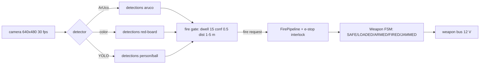

# 21.06 — Triggers II: vision detection

<!-- glance:start -->
<!-- hand-maintained: module 21 is not registered in curriculum/syllabus.yaml -->

| | |
|---|---|
| **Track** | Extension |
| **Difficulty** | Advanced |
| **Time** | 2 h |
| **Hardware** | camera (already on karmel — course Stage 2) |
| **Software** | OpenCV (course stack, `curriculum/versions.yaml`), `code/trigger_pipeline.py` |
| **Prerequisites** | [21.05 Triggers I — remote control](21.05-triggers-remote.md) · [13.07 Fiducial markers](../13-computer-vision/13.07-fiducial-markers.md) · [13.10 Object detection models](../13-computer-vision/13.10-object-detection-models.md) |
| **Optional prerequisites** | [FCV.06 Detection metrics](../optional-foundations/computer-vision/FCV.06-detection-metrics.md) · [13.05 The pinhole camera model](../13-computer-vision/13.05-pinhole-camera-model.md) |
| **Skip if** | You can run a detection stream through a dwell gate and predict its false-fire rate, and you have fired the robot at a wall marker without firing at a window. |

<!-- glance:end -->

## What you will learn

- Turn a **detection stream** (label, confidence, distance — one list per frame at ~30 fps) into a **fire decision** with a dwell + confidence + distance gate.
- Build the **ArUco path**: detect the marker, estimate its distance from its pixel size, and gate on it — the reliable trigger that needs no training data.
- Know when the **general path** (color blobs, a small YOLO detector on the Pi 5) beats the marker — and when it loses.
- Compute the **false-fire rate** of the gate (p_f^N) and choose the dwell from the asymmetry: a false fire costs a payload, a missed fire costs nothing.
- Wire the gate into the same `FirePipeline` as the RC press, so the e-stop interlock and the double-fire guard are the *same code*.

## Why it matters

The RC trigger of 21.05 needs a person with a hand-held unit; the vision trigger needs a
*target*. That is the difference between a robot that obeys and a robot that *sees* — and
it is the shot the audience remembers (21.10's runbook step 9, the "magic" shot). But vision
is also the most *opinionated* trigger in the module: the detector has a confidence score
that means "the model's guess quality", not "the target is there", and a single confident
frame of the robot's own shadow is a shot if you let it. The fire gate is the whole lesson:
a conservative filter over a stream, not a decision on a frame.

<!-- prereqs:start -->
## Prerequisites

You need these first:

- [21.05 Triggers I — remote control](21.05-triggers-remote.md) — the trigger contract (a fire *request*), the `FirePipeline`, and the e-stop interlock that the vision trigger reuses.
- [13.07 Fiducial markers](../13-computer-vision/13.07-fiducial-markers.md) — ArUco detection with OpenCV, the course's own code.
- [13.10 Object detection models](../13-computer-vision/13.10-object-detection-models.md) — what "confidence" means, and the small detectors that run on a Pi 5.

### Optional prerequisite links

New to any of these? Take the foundation lesson first; skip it if you already know it.

- [FCV.06 Detection metrics](../optional-foundations/computer-vision/FCV.06-detection-metrics.md) — precision/recall, and why a 0.9 confidence is not a 90% chance the target exists.
- [13.05 The pinhole camera model](../13-computer-vision/13.05-pinhole-camera-model.md) — the focal length in pixels, which the distance estimate needs.
<!-- prereqs:end -->

## Concept

The trigger consumes a **stream**: one frame per ~33 ms, each a list of detections
`(label, confidence, distance_m)`. A single good frame is not a shot — it is a *vote*. The
gate counts consecutive votes:

> The target must be present, confident, and in range for **15 consecutive frames** at
> 30 fps (0.5 s). Any miss resets the count. Then it fires once and cools down for 2 s.

Why so conservative? The cost is asymmetric. A false fire costs one payload, one state
machine cycle (LOADED → FIRED → SAFE, a slot re-verified), and the audience's nerve — and
in the 21.10 demo it costs the *story* ("the robot fired at a window"). A missed fire costs
nothing: the gate re-arms on the next frame and fires 0.5 s later. So the gate buys
reliability with latency, and 0.5 s is a price the demo can pay.

> [!TIP]
> **Ask your teacher:** "The ArUco detector is deterministic — same frame, same answer.
> Why does it still need a 15-frame dwell?" (Answer in Level 4: the *scene* changes between
> frames — the robot moves, the light shifts, the marker glints — and the detector's
> frame-to-frame answers are not independent votes on one fact, they are votes on 15
> different facts. The dwell is what makes the 15 facts one decision.)

## Technical explanation

### Level 1 — what a detection is

Each frame yields a list of `(label, confidence, distance_m)`. The label is what the
detector thinks ("aruco", "person", "ball"); the confidence is the model's self-rating (the
FCV.06 lesson is the honest account of what that number does and does not mean); the
distance is estimated from the bounding box and the object's known physical size. The
camera is the one already on karmel (course Stage 2): 640×480, horizontal FOV 1.20 rad
(`labs/config/karmel.yaml`), at (x = 0.10, z = 0.10) on the robot — which is why the
parked weapons must stay out of its 1.20 rad cone (21.01 spec delta, row 7).

The gate's inputs per frame: `detections: list[Detection]`. Its output: a fire *request*
(true/false) — exactly the contract of 21.05. The gate does not know what a weapon is; the
`FirePipeline` does.

### Level 2 — the ArUco path (the reliable one)

Print a 6×6-dictionary ArUco marker, A4, stick it on a wall at 2.5 m. The pipeline:
`cv2.aruco` detect (the course's `13-computer-vision/code/markers.py` does this — 13.07 —
reference it, don't rewrite it) → the marker's pixel width gives the distance.

The distance estimate is the pinhole model (13.05) in one line. The focal length in pixels:

$$f = \frac{w/2}{\tan(\text{FOV}/2)} = \frac{320}{\tan(0.60)} = \frac{320}{0.684} \approx 468 \text{ px}$$

(for the 640×480 camera at 1.20 rad horizontal FOV; the course's calibration in 13.06
refines this — use the calibrated value on the robot). Then, for a marker of real width
$s$ measured at $p$ pixels:

$$d = \frac{f \cdot s}{p}$$

Numerical example, s = 0.15 m (a 15 cm marker): at p = 200 px, d = 468 × 0.15/200 =
**0.35 m**; at p = 60 px, d = 468 × 0.15/60 = **1.17 m**; at p = 28 px, d = **2.50 m**
(the marker's real position). The gate's distance window is [1, 5] m: below 1 m the cannon's
payload would hit the *camera*, above 5 m the drop-class payloads miss the target zone and
the launch class is out of its useful range.

The gate itself (the `VisionTrigger` in `code/trigger_pipeline.py`):

```python
class VisionTrigger:
    """Detection stream -> fire gate (21.06 Level 4).

    A single good frame is NOT a shot: the target must be present, confident, and in range for
    ``dwell_frames`` CONSECUTIVE frames (any miss resets the count), then the trigger fires
    once and cools down for ``cooldown_s``.
    """

    def frame_ok(self, detections: list[Detection]) -> bool:
        """Is the target good in THIS frame?"""
        for d in detections:
            if (
                d.label == self.target_label
                and d.confidence >= self.confidence_min
                and self.d_min_m <= d.distance_m <= self.d_max_m
            ):
                return True
        return False

    def update(self, detections: list[Detection], t: float) -> bool:
        good = self.frame_ok(detections)
        self._streak = self._streak + 1 if good else 0
        if self._streak < self.dwell_frames:
            return False
        if self._last_fire_t is not None and t - self._last_fire_t < self.cooldown_s:
            return False
        self._streak = 0
        self._last_fire_t = t
        return True
```

Note the asymmetry inside `update`: a bad frame *resets the streak* (the `else 0`), while a
fire only needs the streak to *reach* the dwell — the gate is strict on the way in and
lenient on the way out (the cooldown is the only thing standing between a fired gate and an
immediate second fire).

### Level 3 — the general path (color, YOLO)

When the target is not a marker — a person, a ball, a rival robot — the marker path is out
and the options are:

1. **Color blob**: threshold the frame in HSV (FCV.03) for a known color (a red target
   board), find the largest blob, estimate distance from the blob's pixel height. Cheap (30
   fps on the Pi 5 with room to spare), lighting-fragile (a red shirt is a target), and
   blind at range (the blob is 4 px at 10 m and the threshold is noise).
2. **A small detector** (YOLOv8n-class, ONNX via OpenCV or the course's 13.10 stack):
   10-20 FPS at 640×480 on the Pi 5 (Version-sensitive — recheck the current model and
   runtime before you commit; the Pi 5's NPU is not the bottleneck, the CPU is). It beats
   the marker on real-world targets at any distance and on "the target is a *person*", and
   it loses to the marker on occlusion, backlight, and "the target looks like a background
   object" — a red board in a red room is a detection at 0.4 confidence, which the 0.5 gate
   rejects, and the gate is doing its job.

> [!IMPORTANT]
> **Version-sensitive** (verified 2026-09-24 against the course stack in
> [`curriculum/versions.yaml`](../curriculum/versions.yaml)). Before following the YOLO
> steps, check the current detector model and its Pi 5 runtime (the official project docs
> move faster than this lesson): the model name, the export format (ONNX) and the FPS you
> get on a Pi 5 4 GB. If the stack changed, update this marker's date, not the concept —
> the gate does not care which detector feeds it.

The gate is detector-agnostic by design: it consumes `(label, confidence, distance)` and
the detector is a pluggable producer. That is the lesson's architectural point — the *fire
decision* is the stable part, the *detection* is the part that ages.

### Level 4 — the gate as a state machine, and the false-fire math

```text
    COLD ──good frame──▶ TRACKING (streak 1…dwell-1)
      ▲                     │ good frames
      │                     ▼
   (cooldown) ◀──FIRE◀── READY (streak = dwell)
      ▲                     │ any bad frame
      └─────────────────────┘ (streak → 0, back to COLD)
```

The false-fire math. Let p_f be the per-frame probability that the detector reports a
"good" detection when no target is present (a false alarm — a shadow, a window, a red
shirt). For independent frames, the probability that *all* dwell frames are false alarms is
p_f^N. Numerical: p_f = 0.1, N = 15 → 0.1^15 = 10⁻¹⁵ per window; at 30 windows/second that
is one false fire per ~10⁹ seconds. Even p_f = 0.3 (a terrible detector in a terrible room)
gives 0.3^15 = 1.4×10⁻⁸ per window — one false fire per ~2 years of continuous watching.

The independence is optimistic — detections are correlated frame-to-frame (the shadow
persists), so the real false-fire rate is higher than p_f^N; that is why the dwell is 0.5 s
and not 5 frames, and why the *measured* false-fire rate (21.06-E3: 60 s idle, 0 false
fires) is the number that goes in the demo evidence, not the formula. The formula sizes the
dwell; the measurement proves it.

### Level 5 — wiring it to the weapon

The gate's fire request goes to the `FirePipeline` exactly like the RC press of 21.05:

```python
pipeline = FirePipeline(Weapon("cannon"))
# ... per frame, at 30 fps:
fired = pipeline.on_trigger(vision.update(detections, t), t)
```

The e-stop interlock and the double-fire guard are the *same code* the RC trigger uses —
the vision trigger has no special path into the weapon. And one domain point: the camera
lives in the compute domain (it cannot hurt anyone — 20.02's argument for the LiDAR), so
vision keeps *watching* while the e-stop is in. That is a feature: when the e-stop is
pressed, the robot can still see *why* (the target is still there, the payload is still
loaded) — the demo operator reads the state, not a guess.

## Diagram



The gate's state diagram is in Level 4 (COLD → TRACKING → READY → FIRE, with the cooldown
back to COLD and the streak reset on any bad frame).

## Code

Run the shipped demo (demos 5-6 are the vision and sound triggers; demo 5 is this lesson):

```bash
py 21-war-machine/code/trigger_pipeline.py demo
```

```text
=== demo 5: vision dwell (15 frames at 30 fps = 0.5 s) ===
  fired at frame 14 (t=0.47 s) after 15 good frames
```

The gate, as shipped (Level 2 shows the class; the full file is `code/trigger_pipeline.py`).
The detection producer is the course's: `13-computer-vision/code/markers.py` (13.07) prints
the ArUco id and pose per frame — the only adaptation this module needs is to emit
`Detection(label, confidence, distance_m)` tuples instead of printing them, and to feed
them to `VisionTrigger.update` at the camera's real FPS.

The gate's latency, for the record: first good frame → fire = `dwell_frames / fps` =
15/30 = 0.50 s, plus the detector's own latency (one frame of processing, ~33 ms at 30 fps)
— the 21.06-E3 measurement includes both.

## Exercise

### Exercise 21.06-E1 — The false-fire arithmetic `[predict]`

p_f = 0.05 per frame, 30 fps.

1. With a dwell of 15 frames: false fires per minute? (Per window: p_f^15; windows per
   minute: 30 × 60 / 15 — the gate re-arms every dwell frames while the false target
   persists; be explicit about the approximation you make.)
2. With a dwell of 5 frames: same question.
3. What does the ratio tell you about the dwell's role, and what does the correlation
   caveat (Level 4) mean for your answer?

### Exercise 21.06-E2 — The fire gate `[coding]`

Implement `vision_fire_frames` in `21-war-machine/code/exercises/student.py` (the 21.06-E2
section; the docstring is the spec): a frame is good if it contains the target with
confidence ≥ confidence_min and d_min ≤ distance ≤ d_max; fire on the frame where the
streak of consecutive good frames first reaches dwell; after a fire, the gate needs a fresh
streak (the cooldown is the weapon's job, not the gate's).

Check it: `py -m pytest 21-war-machine/code/exercises -k 2106_e2`

> [!CAUTION]
> **Safety:** the camera is a sensor (compute domain), but the payload is not: the drop-bin
> payload lands in the 0.5 m zone in front of the robot, so stand to the side, not in front, and
> wheels in the air for the first gate completions — [SAFETY.md](../SAFETY.md) rule 1.

### Exercise 21.06-E3 — The wall target `[hardware]`

A4 ArUco marker (6×6 dictionary) on a wall at 2.5 m, the drop-bin payload armed (the safe
class), the gate at dwell = 15, conf ≥ 0.5, [1, 5] m.

- **Hardware:** camera (the robot's), the marker, the drop bin from 21.03.
- (a) 10 gate completions: walk the robot into the marker's cone from 4 m, hold, let the
  gate fire, log each fire. (b) 60 s idle with the marker *out* of frame (cover it with a
  book — do not move it, the cover is the test): 0 false fires. (c) Measure the gate
  latency: timestamp the first good frame (the detector's log) and the fire event.

## Expected result

**21.06-E1.** Per window (15 consecutive false frames): 0.05^15 = 3.05×10⁻²⁰. The honest
approximation: while a false target persists for a stretch of M frames, the gate attempts
⌊M/15⌋ windows; the false-fire *rate* is (windows per minute) × p_f^15. If the false target
persists for a full minute (30 × 60 = 1800 frames → 120 windows): 120 × 3.05×10⁻²⁰ ≈
3.7×10⁻¹⁸ per minute — effectively zero. With dwell 5: 0.05^5 = 3.1×10⁻⁷ per window, 360
windows/minute → 1.1×10⁻⁴ per minute — one false fire per ~78 hours of a *persistent* false
target. The ratio (10⁻¹⁴) is the dwell's purchase: 10× the latency (0.5 s vs 0.17 s) for
14 orders of magnitude of false-fire suppression. The correlation caveat: the false target
*does* persist (that is what a shadow is), so the p_f^15 independence is the optimistic
bound — the real protection is the persistence itself, which the dwell exploits; the
measurement in E3 is what you cite.

**21.06-E2.** The checker passes when your function matches the reference on: 12 good frames + 1
bad + 16 good, dwell 5 → fires at frames [4, 8, 17, 22] (a fire at the end of every
completed streak, not just the last one — the streak resets after each fire).

**21.06-E3.** (a) 10/10 gate completions, each fire 0.50 s after the last good-frame streak began
(the gate's latency is the dwell — the detector is faster than the gate by design).
(b) 0 false fires in 60 s (a false fire here is a gate the *demo* has to explain — if you
get one, the detector is seeing something: the book's edge, a window, the marker's
reflection; the fix is the ROI or the confidence, not a longer dwell). (c) Gate latency:
0.50 s ± 0.05 s (the detector's frame time is inside the dwell; if you measure 1.2 s, the
detector is running at ~12 fps and the dwell is in frames, not seconds — Level 4's
troubleshooting row).

## Troubleshooting

### Symptom: the gate fires at the robot's own shadow (or the camera mount)

The ROI includes the chassis: mask the bottom 20% of the frame (the shadow lives there),
or the marker's reflection in a window is a second "target" — the distance gate rejects
the far one, the ROI rejects the near one. The test: park the robot, cover the marker,
watch the detection log for 60 s — anything that reports "aruco" with conf ≥ 0.5 is a
false target with a location, and the location is the fix.

### Symptom: no fire in low light

The detector dies before the gate: the ArUco contrast is gone at 10 lux. Add lighting
(the demo range has a lighting baseline — 21.10), or drop confidence_min to 0.4 and raise
the dwell to 20 (the gate's two knobs move together: lower confidence admits more frames,
longer dwell rejects the admitted noise). Do not lower both.

### Symptom: the gate fires at 0.4 m

The d_min gate is 1 m — the marker is inside it. The 45° cannon from 0.4 m puts the payload
through the camera mount (Level 2's geometry). Either the marker is too close (the range
layout, 21.10) or the distance estimate is off (the calibration — 13.06 — the focal length
is the input, and a 20% error in f is a 20% error in every distance the gate trusts).

### Symptom: false fires on a white wall (color detector)

The confidence gate is too low for a color detector: a white wall at 3 m is a "red board"
at 0.4 confidence on a bad day. The marker path is the fix (ArUco does not see walls), or
the confidence to 0.7 and the dwell to 20. The color detector is the *fast* path, not the
*reliable* one — the demo uses the marker for the fire and color for the "the robot is
looking at it" teleop feedback.

### Symptom: the gate latency is 1.2 s, not 0.5 s

The detector is slower than 30 fps: the dwell is in *frames*, and at 12 fps the 15-frame
dwell is 1.25 s. Measure the detector's FPS (the course's markers.py prints it) and either
fix the detector (smaller input, the ONNX export, 13.10) or set the dwell in *time*
(15 frames at 30 fps = 0.5 s → dwell = int(0.5 × measured_fps)). The gate's contract is
"0.5 s of consecutive evidence", not "15 frames" — the frames are the unit, the seconds
are the intent.

## Common mistakes

- Firing on a single confident frame (the gate's entire reason for existing is that one
  frame is a vote, not a decision).
- Lowering the confidence and the dwell at the same time (both knobs admit more; the
  confidence admits *frames*, the dwell admits *time* — move one, measure, move the other).
- Trusting the detector's distance without the calibration (the focal length is the input;
  the 13.06 calibration is the part students skip and the gate inherits).
- Letting the detector's FPS drift (thermal throttling on the Pi 5 after 20 minutes — the
  gate's latency changes mid-demo; the 21.10 baseline includes an FPS check at step 1).
- Putting the vision trigger on the *weapon* domain (the camera is a sensor — compute
  domain; the e-stop must not blind the robot, only disarm it).

## Knowledge check

1. The gate's dwell is 15 frames at 30 fps. The detector runs at 12 fps on a hot Pi 5.
   What is the gate's real latency now, and which knob do you turn?
   <details><summary>Answer</summary>
   15 frames at 12 fps = 1.25 s, not 0.5 s. Turn the dwell to int(0.5 × 12) = 6 frames —
   the gate's contract is 0.5 s of consecutive evidence, and the frames are the unit of
   sampling, not of time. (The alternative is fixing the FPS — the ONNX export, a smaller
   input — but the demo does not wait for a firmware update.)
   </details>

2. p_f = 0.3 per frame (a bad detector in a bad room), dwell 15. False fires per hour of
   a persistent false target?
   <details><summary>Answer</summary>
   0.3^15 = 1.43×10⁻⁸ per window. A persistent false target for an hour = 3600 s × 30
   fps / 15 frames = 7200 windows. 7200 × 1.43×10⁻⁸ = 1.03×10⁻⁴ per hour — one false
   fire per ~9,700 hours. Even a *terrible* detector is safe at dwell 15, which is the
   point: the dwell is exponential, the detector is linear.
   </details>

3. The ArUco marker is at 2.5 m (the real position, Level 2's 28 px). You cover half of it
   with a hand. The detector reports 0.9 confidence, p = 14 px. What distance does the gate
   see, and what happens?
   <details><summary>Answer</summary>
   d = f·s/p with the *full* width s = 0.15 m but p = 14 px (the detector measures the
   visible width) → d = 468×0.15/14 = 5.0 m — just inside the [1, 5] m window (or just
   outside, at the rounding). The gate is now deciding about a *half-marker* at a distance
   that is wrong by 2×. This is the occlusion case of Level 3: the marker path loses to
   the geometry when the marker is not the whole marker. The fix is the detector's
   occlusion handling (13.07: the marker is still detectable at 50% occlusion, but the
   *distance* is the part that lies) — or the demo rule "no hands on the target".
   </details>

4. Why does the gate reset the streak on a bad frame, instead of "14 good frames out of
   the last 15"?
   <details><summary>Answer</summary>
   Because "14 of 15" is a *rate* filter, and rate filters fire on persistence, not
   presence: a target that blinks (the marker's edge in and out, 80% of the time present)
   passes a 14-of-15 gate every frame — the robot is firing at a flicker. The consecutive
   streak is a *presence* filter: 0.5 s of *uninterrupted* evidence. The blinking target
   is the false target (a reflection, a partial occlusion, the detector's own noise), and
   the streak is what rejects it.
   </details>

5. The vision trigger fires while the e-stop is in. Is that a bug?
   <details><summary>Answer</summary>
   The *request* is not a bug (the camera is in the compute domain and keeps watching —
   Level 5); the *shot* is. The FirePipeline re-checks the e-stop at fire time (21.05's
   demo 3: "the bus had no power; the state machine already said SAFE"), so a vision fire
   with the e-stop in is a request that the pipeline blocks — the weapon bus is dead, the
   solenoid does not move. The bug is only if you wired the gate *around* the pipeline
   (directly to the solenoid) — the interlock test matrix of 21.09 catches exactly that.
   </details>

## Practical challenge

**The wall-target demo.** From 3 m, the robot drives to the marker's cone (a drive-to-
heading is enough — Nav2 is optional), the gate completes, the drop-bin payload falls into
the 0.5 m target zone in front of the robot. Acceptance: 3/3 success (the robot approaches,
gates, fires, lands in the zone), 0 false fires in 2 minutes of idle (the marker covered),
and the gate latency measured at each of the 3 runs (0.50 s ± 0.1 s — the detector's FPS
is stable across the 2 minutes, which is the part that actually failed in the field).

## You can skip this if…

- You can compute the marker distance from its pixel width (d = f·s/p, with the focal
  length derived from the FOV) and the gate's false-fire rate (p_f^N, with the window
  arithmetic).
- You can state the gate's contract (0.5 s of consecutive evidence, conf ≥ 0.5, [1, 5] m)
  and which knob moves when the detector's FPS drops.
- You can explain why the gate is in the compute domain and the fire is blocked by the
  pipeline, not by the camera.

If all three are true: `python course.py skip 21.06 --reason "vision gate computed and reasoned"`.

## Go deeper

- [Garcia-Hidalgo et al., "Automatic Generation of Fiducial Markers for Real-Time Position and Orientation Estimation" (ArUco, 2017)](https://arxiv.org/abs/1701.04191) — the marker design and the detection/pose pipeline this lesson's Level 2 runs on.
- [OpenCV ArUco documentation (4.10.0)](https://docs.opencv.org/4.10.0/d4/d17/namespacecv_1_1aruco.html) — the `detectMarkers` API and the dictionary parameters (Version-sensitive: the module layout changed between OpenCV 4.5 and 4.8 — check your version, 13.07 notes it; the `4.x` path 404s, this version-pinned one is the live one).
- [The YOLO project](https://github.com/ultralytics/ultralytics) — the current small detectors and their export formats (Version-sensitive: the model names and the Pi 5 runtime move; the gate does not).
- [13.07 — Fiducial markers](../13-computer-vision/13.07-fiducial-markers.md) and [13.10 — Object detection models](../13-computer-vision/13.10-object-detection-models.md) — the course's own detector lessons; this lesson is the *fire decision* on top of them.

## Progress checkpoint

- [ ] I can run a detection stream through the gate and predict its false-fire rate.
- [ ] I can compute the marker distance from its pixel width (and the focal length from the FOV).
- [ ] I know which knob moves when the detector's FPS drops (the dwell, in time not frames).
- [ ] I can explain why the gate is a presence filter, not a rate filter.
- [ ] The vision fire goes through the same FirePipeline as the RC press (the interlock is shared).

`python course.py complete 21.06` (exercises done) · `python course.py master 21.06` (challenge done) · `python course.py struggle 21.06 "what was hard"`

Next: [21.07 — Triggers III: sound detection](21.07-triggers-sound.md).
