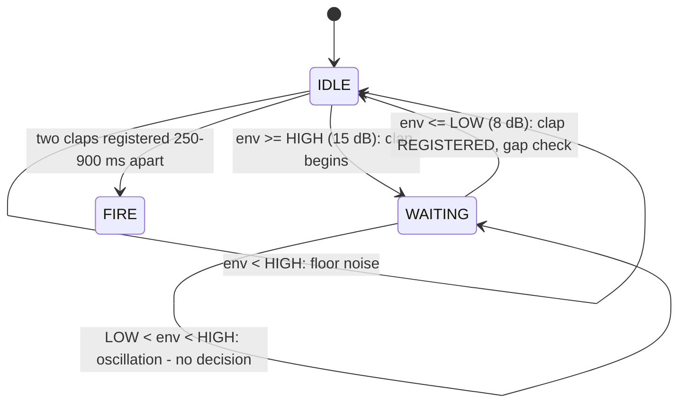

# 21.07 — Triggers III — sound detection

<!-- glance:start -->
<!-- hand-maintained: module 21 is not registered in curriculum/syllabus.yaml -->

| | |
|---|---|
| **Track** | Extension |
| **Difficulty** | Advanced |
| **Time** | 2 h |
| **Hardware** | mic (INMP441 I²S MEMS microphone — Hackstore; piezo buzzer 20-pack — Hauzattahel; BOM §E) |
| **Software** | Python 3.10+ (`code/trigger_pipeline.py demo`, `clap_times` exercise) |
| **Prerequisites** | [21.05 Triggers I — remote control](21.05-triggers-remote.md) |
| **Optional prerequisites** | [FE.08 ADC](../optional-foundations/electronics/FE.08-adc.md) |
| **Skip if** | You can turn a clap into an envelope number, design a hysteresis detector that rejects threshold oscillation, and compute the false-fire rate of a double-clap code. |

<!-- glance:end -->

## What you will learn

- Explain why sound is at once the **least reliable** and the **most useful** trigger in the module: the acoustic medium is *shared* (echoes, other people, the robot's own motors), and it is the one trigger you can arm when your hands are full.
- Turn sound into a number: the **INMP441** I²S MEMS microphone (3.3 V, 24-bit, 16 kHz class) and the **2 ms RMS envelope** — you are not decoding audio, you are decoding *how loud, right now*.
- Design a **hysteresis detector** (Schmitt trigger) and do the arithmetic of why one threshold is a trap: noise oscillating around 15 dB (9…21 dB) crosses a single threshold ~100 times and registers ~100 false claps; with hysteresis it registers **zero**.
- Implement the **double-clap fire code** (two claps 250–900 ms apart) and compute its false-fire rate: ~0.3/hour against ~60 raw bursts/hour — the code buys two orders of magnitude for the price of one extra clap.
- Handle **the robot hearing itself**: motor noise, floor echoes, the park-or-disarm design rule, and the piezo-buzzer **arm warning**.
- Wire the INMP441's I²S on the Pico 2 (BCLK/WS/SD on GPIO 16/17/18) and know the pin conflict with [21.05](21.05-triggers-remote.md).

## Why it matters

The keypad, the RC and the IR beacon all have something in common: **a human is pressing
something**. The sound trigger is the first one that doesn't. The robot hears a clap code and
fires — and that matters for exactly one reason: in a demo your hands are full (holding the CO2
cartridge, aiming the cannon, walking the robot into position), and a hands-free trigger is the
only trigger you can actually use at that moment.

The price is that the **acoustic medium is shared**. Everyone else in the room makes noise.
The hard floor makes echoes. The robot's own drive motors make a 55–65 dB whine at full speed.
Sound is therefore the *least reliable* trigger in the module — and the most fun demo. This
lesson earns its place by doing the false-fire arithmetic up front, so that "least reliable"
means *0.3 false fires per hour by design* instead of "the glue stick flew at the audience".

<!-- prereqs:start -->

## Prerequisites

You need this first:

- [21.05 Triggers I — remote control](21.05-triggers-remote.md) — the trigger contract (fire requests into the `FirePipeline`), the domain rule (sensor on compute, switch on the weapon bus), and the Pico 2 pin plan: **GPIO 16 was the RC RX**, which is why the I²S mic takes its pins first and the RX moves.

### Optional prerequisite links

New to any of these? Take the foundation lesson first; skip it if you already know it.

- [FE.08 ADC](../optional-foundations/electronics/FE.08-adc.md) — the envelope is an analog quantity turned into a number; if you use the BOM's cheap piezo-dic alternative instead of the INMP441, the signal path is literally an ADC pin.

<!-- prereqs:end -->

## Concept

The sound trigger: **the robot hears a clap code and fires**. One clap is "you there?" — free
of charge, no payload spent. Two claps, 250–900 ms apart, is **FIRE**.

Think of the trigger as a listener with a very short memory. It does not care *what* you
clapped — it was a hand, a book, a door; acoustically they are all the same event: a broadband
burst, 5–10 ms long, 10–20 dB above the local noise floor. What it cares about is *how loud,
right now*, and *when*. That is the whole design: a loudness meter with a threshold that
hysterises, and a timer that accepts exactly one code — two loud events, spaced like a human
claps.

The domain rule from [21.05](21.05-triggers-remote.md) applies unchanged: the **microphone**
is a sensor — compute domain, always on, it cannot hurt anyone (same argument as the LiDAR).
The **solenoid it can close** is on the weapon bus behind the e-stop relay. A double clap that
fires the cannon while the e-stop is in is a bug in copper and code.

> [!TIP]
> **Ask your teacher:** "Make me predict how many false claps a single 15 dB threshold registers from a signal oscillating between 9 and 21 dB — then make me defend the two numbers (HIGH and LOW) of the hysteresis fix."

## Technical explanation

### Level 1 — Sound becomes a number

The hardware is the **INMP441** (BOM §E, Hackstore): an I²S MEMS microphone — a tiny
vibration-detecting membrane on a chip, 3.3 V, 24-bit output, 16 kHz class. I²S means the Pico
2 reads a *digital* stream of pressure samples; there is no analog signal to fiddle with after
the mic itself.

Numbers you will use all lesson:

| Quantity | Value |
|---|---|
| A clap at 2 m | ~80–90 dB SPL |
| A quiet room's floor | ~40–55 dB SPL |
| A drive motor at speed, at the robot | ~55–65 dB SPL |
| A clap as a signal | broadband burst, **5–10 ms long**, **10–20 dB above the local floor** |

The last row is the design. You will **not** decode audio — you will decode the **envelope**:
*how loud, right now*. The raw burst is too fast and too rich for a decision; the envelope is
one number per 2 ms window, and one number is all a state machine needs.

$$\Delta_{dB} = L_\text{event} - L_\text{floor} \qquad \text{e.g. } 85 - 45 = 40 \text{ dB above the floor}$$

A 2 m clap sits ~30–45 dB above the room floor; the trigger's threshold is set ~15 dB above
floor, so a real clap clears it with 15–30 dB of margin, while ordinary room noise never
reaches it.

### Level 2 — Envelope + hysteresis: one threshold is a trap

Compute the envelope as the **RMS of a 2 ms window**: 64 samples at 32 kHz, or 32 at 16 kHz.

$$\text{RMS} = \sqrt{\frac{1}{N}\sum_{i=1}^{N} x_i^2} \qquad N = 64 \text{ samples } (= 2 \text{ ms at 32 kHz})$$

Numerical example: a clap sample of 0.5 full scale, room noise of 0.01 — RMS over the clap's
5 ms window is ~0.35, over a quiet window ~0.01, i.e. ~31 dB above floor. That is your
`env_db` input.

Now the trap. A single threshold at 15 dB says "clap when `env_db ≥ 15`". Take a noisy
corner of the room where the envelope **oscillates between 9 and 21 dB** (HVAC, a passing
elevator, the robot's fan — this is the 21.07 test signal). The signal crosses 15 dB on
*every* oscillation: 200 alternating 9/21 dB samples produce ~100 crossings of the threshold,
and a single-threshold detector registers **~100 claps**. A hundred false claps from one
uninteresting corner.

The fix is the **Schmitt trigger** — two thresholds instead of one:

- **HIGH = 15 dB**: a clap *begins* when the envelope reaches HIGH while not already waiting.
- **LOW = 8 dB**: the clap is **REGISTERED** when the envelope afterwards falls to LOW or below.

The 9/21 oscillation now behaves like this: it crosses 15 (WAITING armed), falls to 9 —
**9 > 8, not registered** — rises to 21 (already waiting, no new event), falls to 9, …
Forever oscillating, forever *not reaching LOW* → **zero claps**. The decision needs a full
fall back to the floor, and ambient oscillation never gets back to the floor.

### Level 3 — The double-clap code, and what it buys

One clap is "you there?" — free. **Two claps 250–900 ms apart is FIRE** — this is
`SoundTrigger` from [code/trigger_pipeline.py](code/trigger_pipeline.py):

```python
class SoundTrigger:
    """Acoustic envelope -> clap events -> fire code (21.07).

    Input is the envelope value (e.g. dB above the noise floor, 2 ms RMS window). Hysteresis:
    a clap is registered when the envelope crosses ``high_db`` while it is below ``low_db``
    afterwards; oscillation around one threshold is the classic false-fire. The fire code is
    the DOUBLE CLAP: two claps 250..900 ms apart. One clap is a "you there?" — free of charge.
    """

    def __init__(
        self,
        name: str = "sound",
        high_db: float = 15.0,
        low_db: float = 8.0,
        min_gap_ms: float = 250.0,
        max_gap_ms: float = 900.0,
    ) -> None:
        self.name = name
        self.high_db = high_db
        self.low_db = low_db
        self.min_gap_ms = min_gap_ms
        self.max_gap_ms = max_gap_ms
        self._waiting = False          # envelope above high, waiting to cross low (clap armed)
        self._clap_t: float | None = None
        self._claps: deque[float] = deque()

    def update(self, env_db: float, t: float) -> bool:
        """Returns True exactly when the double-clap code completes."""
        if not self._waiting and env_db >= self.high_db:
            self._waiting = True
        elif self._waiting and env_db <= self.low_db:
            self._waiting = False
            if self._clap_t is None or (t - self._clap_t) * 1000.0 >= self.min_gap_ms:
                self._clap_t = t
                self._claps.append(t)
                if len(self._claps) == 2:
                    gap_ms = (self._claps[1] - self._claps[0]) * 1000.0
                    if gap_ms <= self.max_gap_ms:
                        self._claps.clear()
                        return True
                    self._claps.clear()  # too slow to be a code: both claps were noise
        return False
```

The gap bounds are physics: claps **closer than 250 ms** are one event (a hand clap plus its
first echo — they merge); claps **farther than 900 ms** apart are two separate noises, not a
code (no human claps twice that slowly on purpose).

**False-fire math.** Model the room: ambient burst rate $R$ = 1/min, a burst crosses HIGH with
probability $p_1 = 0.1$, and given a first crossing a second burst lands in the 250–900 ms
window with probability $p_2 = 0.05$:

$$\lambda_\text{false} = R \cdot p_1 \cdot p_2 = 60 \times 0.1 \times 0.05 = 0.3 \text{ false fires/hour}$$

A single-clap detector would fire on every crossing: $60 \times 0.1 = 6$/hour. The double
code takes the room from **~60 raw bursts/hour to 0.3 false fires/hour** — two orders of
magnitude — and the price is one extra clap. That trade is the entire argument for the code.

### Level 4 — The robot hears itself

Two ways the robot's own body fools the trigger:

- **Drive motors.** At speed they make ~55–65 dB *at the robot* — in a quiet room that is
  below the 15 dB-above-floor threshold, but in a noisy room it is right on top of it.
- **Echoes.** A clap near a hard floor produces **2–3 echo events**: the direct burst, then a
  reflection off the floor a few ms later. The **250 ms merge** of Level 3 absorbs the first
  echo (it is within `min_gap_ms` of the real clap, so it registers as the *same* clap).

The design rule: **for sound-triggered demos the robot is PARKED (wheels stopped), or the
sound trigger is disarmed while driving.** The motor noise is continuous, and continuous
noise is exactly what the hysteresis detector is tuned to ignore — until the room gets loud
enough that it isn't.

The BOM's piezo buzzer 20-pack (Hauzattahel, §E) doubles as the **ARM WARNING sounder**:
**3 beeps** before the weapon accepts sound commands, so a human in the room can *hear* that
the robot is listening. Three beeps, then silence, then the first clap of the code — the
audience knows the difference between "armed" and "fire".

**Wiring** (pin → pin; note the conflict with 21.05):

| From | To | Wire | Voltage |
|---|---|---|---|
| INMP441 `BCLK` | Pico 2 **GPIO 16** | white | 3.3 V |
| INMP441 `WS` (LRC) | Pico 2 **GPIO 17** | white | 3.3 V |
| INMP441 `SD` (data) | Pico 2 **GPIO 18** | white | 3.3 V |
| INMP441 `VDD` | 3.3 V rail (compute domain) | red | 3.3 V |
| INMP441 `GND` | common GND | black | — |

> [!CAUTION]
> **Safety:** power off before rewiring (battery disconnected, not just the switch) and check
> polarity before connecting the mic — [SAFETY.md](../SAFETY.md) rule 9. I²S is **three
> signal wires and one wrong pin is silent** — there is no "wrong but noisy" failure mode,
> only "nothing at all".
>
> **Pin note:** [21.05](21.05-triggers-remote.md) put the RC RX on GPIO 16. The I²S mic wants
> **16/17/18**, so before wiring the mic, **move the RC RX to GPIO 20** — the Pico 2 has 30
> GPIOs, and I²S keeps its block.

## Diagram

What a clap is, and what the detector decides, in one picture:

```text
   mic pressure (INMP441)                 envelope env_db (2 ms RMS, dB above floor)
   90 |        _/‾\_\                                  40 |        ___
      |       /     \_        5-10 ms burst            30 |       /   \___
      |      /       \___                            15 |----/     \---------  HIGH
      |     /         \___                            8 |---/       \--------  LOW
   50 |____/           \___                            0 |__/         \____
      0  1  2  3  4  5  6  7  8  9  10 ms              0  0  1   2   3   4   5 s
      clap at 2 m: ~80-90 dB, 5-10 ms,                 clap 1: 2 -> 18 (WAITING at 18)
      10-20 dB above the floor (40-55 dB room)          -> 2 (<= 8: REGISTERED, t=0.04 s)
                                                        ... 410 ms later (250 <= gap <= 900) ...
                                                        clap 2: 3 -> 19 -> 2 (t=0.49 s)
                                                        -> DOUBLE-CLAP: FIRE  (gap = 450 ms)
```

And the detector as a state machine — note the "no decision" region between LOW and HIGH,
which is where threshold oscillation goes to die:



## Code

`21-war-machine/code/trigger_pipeline.py` carries the full pipeline; the `SoundTrigger` above
is real code from that file (no elisions). The demo's sound section is a scripted
double-clap — one clap at t≈0.02 s (free), one at t≈0.47 s (the code):

```bash
py 21-war-machine/code/trigger_pipeline.py demo
```

```text
=== demo 6: sound double-clap ===
  t= 0.00  env= 3 dB  -> ...
  t= 0.02  env=18 dB  -> ...
  t= 0.04  env= 2 dB  -> ...
  t= 0.45  env= 3 dB  -> ...
  t= 0.47  env=19 dB  -> ...
  t= 0.49  env= 2 dB  -> DOUBLE-CLAP: FIRE
```

Read it against the state diagram: at 0.02 the envelope crosses HIGH (18 ≥ 15) and the
detector waits; at 0.04 it falls to 2 ≤ 8 — clap 1 registered. At 0.47 the second burst
re-arms the detector; at 0.49 the fall to 2 registers clap 2, the gap is 450 ms (inside
250–900), the deque holds two claps → **fire**. Demos 1–5 are the RC/keypad/vision lessons;
this one is yours.

## Exercise

### Exercise 21.07-E1 — False-fire arithmetic `[predict]`

Hardware: none.

Your demo room is louder than the model: **2 ambient bursts per minute**, a burst crosses HIGH
with probability **0.15**, and given a first crossing a second burst lands in the 250–900 ms
window with probability **0.08**.

1. How many false fires per hour does the double-clap code expect?
2. What does that number mean for a **30-minute demo**? (Expected count, and the probability
   of *at least one* false fire.)
3. Name two changes — one hardware, one procedural — that get the 30-minute number under 50 %.

### Exercise 21.07-E2 — Clap detection with hysteresis `[coding]`

Hardware: none.

Implement `clap_times` in [code/exercises/student.py](code/exercises/student.py) — the stub's
docstring is the spec: a chronological `(t_s, env_db)` envelope in, clap times out. A clap is
registered when the envelope, **after being ≥ `high_db`, crosses back down to ≤ `low_db`**
(hysteresis — oscillation around a single threshold must not count); two claps closer than
`min_gap_ms` merge into one (the earlier time is kept).

Check it: `py -m pytest 21-war-machine/code/exercises -k 2107_e2`

### Exercise 21.07-E3 — Clap test at 5 m `[hardware]`

Hardware: `mic` (INMP441), Pico 2, a weapon (or a LED standing in for the solenoid), the robot drivable.

> [!CAUTION]
> **Safety:** the drive test moves a 4–6 kg robot — first run on a stand (wheels off the
> ground), then on the floor with the test area cleared: [SAFETY.md](../SAFETY.md) rules 1 and
> 7. The clap test has a payload in flight: nobody in the line of the shot — rule 7.

1. Wire the INMP441 (16/17/18), stream the 2 ms RMS envelope, and run `SoundTrigger` →
   `FirePipeline`. Log the room's **floor** (env_db with no claps) first.
2. **10 double-claps at 5 m → 10 fires**, each confirmed by the release sensor. Single claps
   in between must fire nothing.
3. **Drive test:** wheels moving, trigger armed, 5 minutes of driving around the test area →
   **0 false fires**. If you get any, the motors are louder than your model: measure the
   envelope while driving with your own script, and **move HIGH up** to at least
   `motor_noise_db + 15` above the floor.

## Expected result

**21.07-E1.** 120 bursts/hour × 0.15 = **18 first claps/hour**; 18 × 0.08 ≈ 1.4, and since
each false pair can be counted from either clap's window, **≈ 3 false fires/hour** is the
planning number (1.4 per direction, ≈ 2.9 counted both ways — the order of magnitude is the
point). For a 30-minute demo: expected ≈ 1.5, so the probability of *at least one* false fire
is $1 - e^{-1.5} \approx 0.78$ — **four times out of five** the glue stick flies at something
you didn't aim at. That is the sound trigger's price, and it is why the arm-warning buzzer
and "parked robot only" are part of the design. Two fixes that get under 50 %: (hardware) move
the mic away from the motor stack / add a small foam baffle so motor noise doesn't reach it, or
lower the room's burst rate (close the door to the HVAC); (procedural) disarm the sound trigger
while driving or while anyone is clapping for other reasons, and only arm it (with the 3 beeps)
during the actual shot.

**21.07-E2.** All `2107_e2` tests pass: a single burst is one clap; a double clap registers
both; the 9/21 dB oscillation registers **zero** claps; and rapid repeats within `min_gap_ms`
merge to the earlier time.

**21.07-E3.** 10/10 double-clap fires at 5 m with zero single-clap fires in between; 0 false
fires in the 5-minute drive. If the drive produced false fires: your measured motor envelope
is above `low_db` — raise `high_db` above the measured motor peak (e.g. motors at 12 dB above
floor → HIGH ≥ 27 dB), and re-run both tests.

## Troubleshooting

### Symptom: no claps detected

In order of likelihood: **(1) Wiring** — I²S is three signal wires (BCLK, WS, SD), and one
wrong pin is *silent*: there is no "noisy but wrong" failure mode, only nothing at all. Check
all three against the table, and confirm the Pico is actually clocking BCLK (a GPIO that never
toggles means the I²S peripheral wasn't started or the pin mux is wrong). **(2) Sensitivity** —
the INMP441 has a gain setting in its registers; a module on the low-gain setting needs a
closer clap. Read the register (datasheet §Registers), set the gain to the highest that doesn't
clip, and re-measure the floor. **(3) Window** — if your envelope window is longer than 10 ms,
it *smears* the 5–10 ms burst into a shallow bump that never crosses HIGH: a 2 ms window
resolves the burst, a 50 ms window averages it away.

### Symptom: it fires while the robot drives

The motor noise is above your threshold — Level 4, made real. Either **raise HIGH** to the
measured motor peak plus margin (measure the driving envelope with your own script; don't
guess), or apply the design rule: **disarm the sound trigger while driving**. A trigger that
is "armed but muted while moving" is not a bug in the design; it is the design.

### Symptom: one clap fires twice

The echo. A hard floor reflects the burst a few ms later, and if that reflection is loud
enough to cross HIGH, it registers as clap 2 and completes the code. Two fixes: **raise
`min_gap_ms` to 400** so the echo (arriving within the merge window) counts as the *same*
clap; or **lower `low_db`** (e.g. 8 → 4 dB) so the dip between the direct burst and its echo —
typically 9–12 dB — never reaches LOW, the detector stays in WAITING through the echo, and the
echo can't re-arm as a new clap.

### Symptom: the Wi-Fi router hum triggers the weapon

50 Hz mains hum (and its 100/150 Hz harmonics) is **narrowband, not a burst**: it never rises
*above* the floor the way a clap does, and the 2 ms RMS window mostly ignores a steady tone.
If it still gets through: the hum is being *rectified* into a pulsing envelope — check the
mic's **GND loop** (a long GND run back to the Pi picks up mains through the floor). Short,
twisted BCLK/WS/SD/GND, star ground at the Pico, and the hum dies.

## Common mistakes

- **One threshold.** The single most expensive bug in this lesson: threshold oscillation
  registers a clap per crossing. HIGH/LOW, or nothing.
- **A 50 ms envelope window.** Smears the 5–10 ms burst into a bump. 2 ms.
- **Armed while driving.** Motor noise at 55–65 dB is a permanent "almost crossing". Park or
  disarm — Level 4's rule.
- **Clap code with no gap bounds.** No `min_gap_ms`: the echo completes the code. No
  `max_gap_ms`: two unrelated noises 4 s apart fire the cannon.
- **Treating the mic as a weapon-domain device.** It is a sensor: compute domain, always on,
  mA draw. The *solenoid it can close* is what goes behind the e-stop relay.
- **Stealing GPIO 16/17/18 from the I²S block** because the RC RX was there in 21.05. The RX
  moves to GPIO 20; I²S keeps its block.
- **No arm warning.** A sound-armed weapon that has no audible "I am listening" state is a
  weapon that surprises. Three beeps, from the BOM's buzzer pack.
- **Testing claps at 1 m and deploying at 5 m.** The burst's dB drops ~6 dB per distance
  doubling; your 1 m margin may not exist at 5 m. Test at the deployment distance.

## Knowledge check

1. Why is a single 15 dB threshold a trap, and what does the hysteresis fix do to noise that oscillates between 9 and 21 dB?
   <details><summary>Answer</summary>

   A single threshold fires on every *crossing*: noise oscillating around 15 dB crosses it on every half-cycle, so 200 alternating 9/21 dB samples produce ~100 registered claps. The Schmitt trigger needs a full fall to LOW (8 dB) to register a clap; the 9/21 oscillation crosses HIGH (arms WAITING) but never falls to 8, so it registers **zero** claps. The decision requires a return to the floor, and ambient oscillation never returns to the floor.
   </details>

2. With HIGH = 15 dB and LOW = 8 dB, how many claps does an envelope that alternates 9/21 dB forever register? What if LOW were 10 dB instead?
   <details><summary>Answer</summary>

   With LOW = 8: **zero** — the 9 dB dips never reach LOW, so the WAITING state never completes. With LOW = 10: every 9 dB dip is ≤ 10, so each oscillation registers — ~100 claps from 200 samples. LOW must sit *below* the ambient oscillation's floor, or hysteresis degenerates back to a single threshold.
   </details>

3. Ambient bursts: 1/min, P(≥HIGH) = 0.1, P(second in window | first) = 0.05. What is the false-fire rate of the double-clap code, and what does the code buy?
   <details><summary>Answer</summary>

   $\lambda = 60 \times 0.1 \times 0.05 = 0.3$ false fires/hour, against 6 single-clap fires/hour and ~60 raw bursts/hour. The double code buys two orders of magnitude (60 → 0.3) for the price of one extra clap — asymmetric cost: a false fire spends a payload, a missed fire costs nothing.
   </details>

4. A clap near a hard floor produces 2–3 echo events. Which part of the design absorbs the first echo, and what happens if the echo is louder than expected?
   <details><summary>Answer</summary>

   The **250 ms merge** (`min_gap_ms`): the first echo arrives within a few ms of the direct burst — far inside the merge window — so it registers as the *same* clap, not a second one. If the echo is loud enough to cross HIGH *after* the envelope has fallen to LOW (a strong second reflection), it registers as clap 2 and completes the code — fix by raising `min_gap_ms` to 400 or lowering `low_db` so the inter-echo dip can't complete the first clap.
   </details>

5. Why is the robot PARKED — or the trigger disarmed — for sound-triggered demos?
   <details><summary>Answer</summary>

   The drive motors make ~55–65 dB at the robot. In a quiet room that is below the 15 dB-above-floor threshold, but in a noisy room it sits right on top of it — and motor noise is *continuous*, exactly the case the hysteresis detector assumes is "the floor". Parking (or disarming while driving) keeps the floor where the model says it is.
   </details>

6. The mic is wired, powered, and the software sees a flat zero. What do you check first, and why is there no "noisy but wrong" failure mode?
   <details><summary>Answer</summary>

   The three I²S wires: BCLK, WS, SD. One wrong pin (a swap, a cold solder joint, a broken header pin) means the Pico is never clocked or never aligned — the stream is *absent*, not corrupted. Confirm BCLK is actually toggling on GPIO 16 with a multimeter/oscilloscope; a dead BCLK means the I²S peripheral wasn't started or the pin is wrong.
   </details>

7. What is the arm-warning buzzer for, and why three beeps specifically?
   <details><summary>Answer</summary>

   It tells a human in the room that the weapon is now *listening*: sound is armed and the first double clap will spend a payload. Three beeps is an unambiguous "state change" signal — distinct from a clap (one event), from the fire itself (the payload), and from a single "you there?" clap that costs nothing. The audience hears armed → silence → code → shot.
   </details>

## Practical challenge

The **hands-full test**, with evidence:

1. Wire the INMP441 (16/17/18); log the room floor and the clap envelope at **2 m and 5 m** (peak dB above floor, burst width in ms) — these are your measured numbers, they go in this module.
2. **10/10 double-clap fires at 5 m**, single claps between them fire nothing; every shot logged with its envelope trace.
3. **5-minute drive test, trigger armed: 0 false fires** — or the measured motor envelope and the new `high_db` that fixes it.
4. **Arm warning:** 3 beeps from the buzzer, then the weapon accepts sound commands; verify the beep sequence plays on every arm.
5. **False-fire soak:** 30 minutes of the *actual demo room* (HVAC on, people moving), trigger armed, robot parked → report the count against the E1 prediction.

Acceptance criteria: measured floor/clap numbers exist in this module; 10/10 fires; 0 false fires in the drive test (with the measured motor envelope on file if you had to raise HIGH); the arm warning fires on every arm; and the 30-minute soak count is within a factor of 2 of the E1 arithmetic.

## You can skip this if…

You can turn a clap into a 2 ms RMS envelope number and say what HIGH/LOW are set against;
you can predict that 9/21 dB oscillation registers zero claps with hysteresis (and ~100
without); and you can compute the double-clap false-fire rate from burst rate, P(≥HIGH) and
P(second in window) — including what it means for a 30-minute demo.

`python course.py skip 21.07 --reason "I have a working sound trigger (hysteresis + double-clap code) and I can do its false-fire arithmetic"`

## Go deeper

- [INMP441 — Mouser product page (datasheet + gain register)](https://www.mouser.com/ProductDetail/Analog-Devices/INMP441DLJ-TR?sqs=%2458) (verified 2026-09-24) — the datasheet: I²S interface, the gain register that Level 2's troubleshooting points at, and the 16 kHz sample-rate setup. (Analog Devices' own product page, `analog.com/en/products/inmp441.html`, is the same document; the Mouser link is the stable one from this network.)
- [Hackstore](https://hackstore.co.il) (verified 2026-09-24) — the INMP441 module and the 940 nm parts for the IR beacon (BOM §E).
- [Hauzattahel — 20× piezo buzzers](https://www.hauzattahel.co.il/Bargain_29322_Global.htm) (verified 2026-09-24) — the arm-warning sounder (BOM §E).
- [Schmitt trigger — Wikipedia](https://en.wikipedia.org/wiki/Schmitt_trigger) (verified 2026-09-24) — the two-threshold idea in 5 minutes, with the hysteresis loop drawn; your HIGH/LOW detector is one.

## Progress checkpoint

- [ ] I can explain why sound is the least reliable trigger (shared medium) and why it still earns its place (hands full).
- [ ] I can compute the 2 ms RMS envelope and set HIGH/LOW against the measured room floor.
- [ ] I can predict that threshold oscillation registers ~100 claps without hysteresis and zero with it.
- [ ] I have the double-clap code running, and I can compute its false-fire rate from room statistics.
- [ ] I know the park-or-disarm rule and what the 250 ms merge does to the first echo.
- [ ] I can wire the INMP441's I²S (16/17/18) and name the pin conflict with 21.05's RC RX.

`python course.py complete 21.07` (exercises done) · `python course.py master 21.07` (challenge done) · `python course.py struggle 21.07 "what was hard"`

Next: [21.08 — Weights, power and stability of the war load](21.08-weights-power-stability.md).
