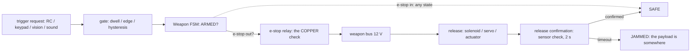

# 21.09 — What can go wrong: failure modes and safety

<!-- glance:start -->
<!-- hand-maintained: module 21 is not registered in curriculum/syllabus.yaml -->

| | |
|---|---|
| **Track** | Extension |
| **Difficulty** | Advanced |
| **Time** | 1 h 30 min |
| **Hardware** | robot-base, estop (the interlock test matrix of E3 needs the full build) |
| **Software** | `code/war_power_budget.py` (check), `code/trigger_pipeline.py` (demo) |
| **Prerequisites** | [21.08 Weights, power and stability of the war load](21.08-weights-power-stability.md) |
| **Optional prerequisites** | [20.04 Safety case](../20-final-robot/20.04-safety-case.md) |
| **Skip if** | You can extend the course's safety case with the weapon rows, defend the FMEA's top-3 RPN fixes, and run the e-stop interlock matrix in front of a witness. |

<!-- glance:end -->

## What you will learn

- Build the **FMEA table** for the war machine: failure × severity × occurrence × detection × mitigation, scored RPN = S×O×D, with the top rows fixed before the demo.
- Reason about the **big three** — double-fire, dry-fire, jam — and for each say what the state machine catches and what it does *not* catch (and the hardware backstop that covers the gap).
- Handle the **CO2 cartridge** — the only pressurized part in the build — with the rolling-cartridge rule and the vent-outside rule.
- Set the **range clearings** from the model's dragged ranges (slingshot 15 m, cannon 25 m, CO2 50 m) and the smoke-at-eye-level rule.
- Run the **e-stop interlock test matrix** (10 tests) and know which row proves the e-stop is copper, not a wish.

## Why it matters

The course robot of module 20 had a known failure set: it could stop moving, it could
brown-out, it could drive off a stair — all failures of *the robot*. The war machine adds
a new failure class: it can release energy **at something**. A jammed payload is a physical
object whose location you do not know; a half-fired solenoid is a pin that is 8 mm out of
15; a rolling CO2 cartridge is a 60-bar missile with a mind of its own. This lesson is the
FMEA — the table that makes every one of those a *row with a mitigation* instead of a
surprise — and the interlock matrix that proves the e-stop still means what 20.04 said it
meant.

<!-- prereqs:start -->
## Prerequisites

You need this first:

- [21.08 Weights, power and stability of the war load](21.08-weights-power-stability.md) — the sag model (the "solenoid half-fires" row is a voltage row) and the runtime (the "operator fatigue" row is a time row).

### Optional prerequisite links

- [20.04 Safety case](../20-final-robot/20.04-safety-case.md) — the course robot's safety case; this lesson extends it with the weapon rows instead of replacing it.
<!-- prereqs:end -->

## Concept

A war machine is a robot that can hurt something, and the FMEA method is the honest way to
say *where* before the demo says it for you. For every subsystem you list: the failure,
how bad it is if it happens (severity, S), how often it happens (occurrence, O), how likely
you are to catch it before it hurts (detection, D — high D is *bad*: a failure that is hard
to detect scores high), and the mitigation. The score is RPN = S × O × D (each 1-10), and
the top rows get fixed before the demo, not after.

The table below is the starting point for *your* build — the Scout/Assault/Siege rows are
the same for everyone, and 21.09-E1 is where your specific payloads and package add their
rows. The point is not the table's completeness (no table is complete); the point is that
every failure that *can* happen on the range has a row, a score, and a named mitigation —
and that the top-3 RPNs are fixed with evidence, not with a shrug.

> [!TIP]
> **Ask your teacher:** "The state machine catches double-fire, dry-fire, and jam. Why do
> we still need a hardware backstop for each?" (Answer in Level 2: the state machine
> catches the failure *as reported by a sensor*. The sensor is the weak link — a stuck
> weight pin reports LOADED when the slot is empty, a miswired release switch reports
> SAFE when the pin is half out. The backstop is the thing that works when the sensor
> lies.)

## Technical explanation

### Level 1 — the FMEA table (the core of the lesson)

Scores: S/O/D on 1-10 (10 = worst). RPN = S×O×D; the top-3 RPNs of your build get fixed
before 21.10. "Mitigation" names the lesson that builds the fix.

| # | Subsystem | Failure | S | O | D | RPN | Mitigation |
|---|---|---|---|---|---|---|---|
| 1 | Power | Fuse mis-blow on a launch spike (stall current) | 5 | 3 | 4 | 60 | 21.08: time-current fuse, the 5 A cannon branch sized for the stall; E3 matrix row 6 |
| 2 | Power | Relay contacts weld (the e-stop is a wish) | 8 | 2 | 6 | 96 | 20.02: the relay's 30 A rating has headroom; bench-test the contact resistance (21.08-E3); the 21.09-E3 matrix row 10 proves it |
| 3 | Power | Voltage sag stalls a servo mid-release | 4 | 6 | 5 | 120 | 21.08 Level 3: the 470 µF bulk cap at the 5 V tap; the 2 s confirm timeout sized for the slow case |
| 4 | Releaser | Solenoid half-fire (pin 8 mm of 15 mm out) | 5 | 4 | 5 | 100 | 21.03 Level 3: the V² law, the 85 N margin, the 200 ms pulse at low voltage; 21.08's boost tap |
| 5 | Releaser | Latch servo drift under heat (the flap opens 5° less) | 4 | 3 | 5 | 60 | 21.03: the 2.77× torque margin absorbs the drift; the 21.10 baseline (a flap-open angle check at step 3) |
| 6 | Releaser | Rubber band fatigue (the slingshot loses 40% of its range) | 3 | 5 | 4 | 60 | 21.04: the spring-scale k as the acceptance test for a new pack; two rotating sets |
| 7 | Releaser | Actuator channel rubbing (the ball deflects) | 4 | 3 | 4 | 48 | 21.04 Troubleshooting: the channel print tolerance, the concentric push plate |
| 8 | Trigger | RC link loss with the switch held | 6 | 3 | 3 | 54 | 21.05 Level 3: the relink guard (the first frame after the gap does not fire) |
| 9 | Trigger | Vision false fire (the shadow, the window) | 4 | 3 | 3 | 36 | 21.06: the 15-frame dwell, the ROI, the 60 s idle test (E3) |
| 10 | Trigger | Sound false fire (the crowd claps early) | 4 | 4 | 3 | 48 | 21.07: the double-clap code, the min-gap merge, the 3-beep arm warning |
| 11 | Trigger | Keypad key sticks (a held key, no machine gun — but a held *arm*) | 3 | 2 | 3 | 18 | 21.05 Level 2: the edge logic; the mechanical-button alt in the BOM |
| 12 | Payload | Balloon leaks on the way to the range | 3 | 6 | 3 | 54 | 21.02: the gel-filled alt (reusable, no leak); the 21.10 step 4 load check is 30 min before the demo |
| 13 | Payload | Magnet sticks to the deck (phantom LiDAR obstacle) | 4 | 3 | 5 | 60 | 21.02 Level 3: the deck is the magnet's enemy; the 21.10 step 3 rail check includes a magnet sweep |
| 14 | Payload | Stink bomb aerosol in the camera cone | 4 | 3 | 4 | 48 | 21.02 Level 3: the drip tray; the demo order (the stink bomb fires *last* — 21.10 runbook) |
| 15 | Structure | Rail flex under cannon recoil | 4 | 4 | 5 | 80 | 21.01 Troubleshooting: the gusset at the actuator mount; the 21.10 step 3 "no loose M3" |
| 16 | Structure | LiDAR plane furniture (the phantom wall) | 3 | 5 | 4 | 60 | 21.01 spec delta row 6: the rail top < z 0.10 m; the 21.10 step 3 rail check |
| 17 | Structure | Camera blind spot (a parked weapon in the 1.20 rad cone) | 3 | 3 | 5 | 45 | 21.01 spec delta row 7: the weapons park out of frame |
| 18 | Operator | Standing in the firing line | 7 | 3 | 5 | 105 | 21.10: the spectator line at 15 m, the firing line is a line not a point |
| 19 | Operator | E-stop reach > 2 s | 6 | 2 | 4 | 48 | SAFETY.md rule 8: one hand for the stop; the 21.10 runbook's firing position |
| 20 | Operator | Fatigue on shot 30 (the e-stop test skipped) | 5 | 3 | 6 | 90 | 21.10: the 12-step runbook *is* the fatigue countermeasure — every shot, the same 12 steps |
| 21 | Environment | Wind on a 15 m/s ball (the range moves) | 4 | 5 | 4 | 80 | 21.10: the windsock, the CO2 day's 50 m clearing, the 2× margin on the model's range |
| 22 | Environment | Smoke blinds the LiDAR and the camera at once | 5 | 4 | 5 | 100 | 21.10: the smoke is the last payload; the e-stop is the backup when both eyes are gone |
| 23 | Environment | Heat (an Israeli summer car is 60 °C) | 4 | 4 | 4 | 64 | 21.04: the bands in the shadow, not the boot; the 20.02 battery rule (never in the hot car) |

The top-3 RPNs for the generic build: **row 3 (sag, 120)**, **row 22 (smoke, 100)**,
**row 4 (half-fire, 100)**, then **row 18 (firing line, 105)** — four rows, and your E1
adds the five that are specific to *your* payloads and package. The pattern: the top rows
are the *system* failures (sag, smoke, the half-fire that is really a voltage failure), not
the *part* failures — which is where the course's safety case (20.04) and this lesson
agree.

### Level 2 — the big three

**Double-fire.** Two shots for one trigger. The state machine catches it by the arrow:
FIRED → SAFE, never FIRED → ARMED (21.01 rule 2 — the second shot needs a fresh LOADED).
What it does *not* catch: the release sensor lying. If the "payload gone" check reports
gone when the payload is still in the slot (a miswired switch, a payload that fell *behind*
the sensor), the state machine goes SAFE with the payload still there, and the next fire
is a double-fire with two payloads. The backstop: the payload-gone check is a *physical*
sensor (a gap switch or a weight change) that you bench-test with a known payload (21.03's
E3 log is the bench test), and the demo rule "one payload per slot, verified at step 4"
(21.10) means a double payload is caught at load, not at fire.

**Dry-fire.** A fire command with an empty slot: the pin ejects, nothing falls, the
confirmation never comes, and the state machine waits 2 s and declares JAMMED — a dry-fire
is a *jam* in the state machine's vocabulary, and that is the right vocabulary (the payload
is somewhere, you do not know where). What the state machine does not catch: the weight
pin *stuck closed* — the slot is empty but reports LOADED. The backstop: the weight pin is
a switch you can bench-test (close it with a known 0.15 kg payload, open it without — the
21.03-E3 log again), and a dry solenoid pulse just heats the coil (0.5 J, Level 2's
number — the dry-fire is a wasted pulse, not a broken solenoid, which is why the BOM gives
the solenoid its own 2 A branch: the dry-fire's heat is the branch's, not the bus's).

**Jam.** The release was commanded, the confirmation did not come in 2 s: the payload is
*somewhere* — in the slot (the flap did not open), in flight (the sensor is miswired), on
the deck (it landed on the robot). The state machine catches the *absence* of the
confirmation (the timeout → JAMMED, 21.01 rule 3). What it does not catch: the payload
that landed in the bin but the sensor is miswired (the state machine says JAMMED, the
payload is safely in the bin — the jam is a *false* jam, and the demo stops for nothing).
The backstop: the JAMMED state stops the demo (21.01: "the demo stops until you know where
the payload is"), and the 21.09-E3 matrix row 7 (the release sensor, bench-tested) is the
test that separates a true jam from a false one. The jam is the only big-three failure
that is a *physical* mystery — the other two are sensor lies, and the jam is a payload.

### Level 3 — the CO2 cartridge

The CYMA magazine's 12 g paintball cartridge is the only part of the whole build under
real gas pressure: ~60-75 bar (the BOM §C: Fox Paintball 12 g CGS inserts; the 95 g
disposable at Perfectreef is the Siege-grade option, same rules × 8). The failure is the
*rolling* cartridge: a 12 g object at 60 bar, if it rolls off the stand and its valve
points at the floor, is a de Laval nozzle — the gas jet turns it into a missile that
crosses the room (the same physics as a rocket, and the same reason a dropped rocket fuel
tank is a range emergency). The rules:

1. **Upright in a cage** (a printed holder with a 5 mm lip, BOM §D) — never a spare on the
   deck (the deck is where things roll).
2. **Vent outside.** The spent cartridge is *cold* CO2 (the gas expands and chills — frost
   on your hand, and a cloud of CO2 in a closed room that the audience breathes before the
   smoke does).
3. **The 95 g is the same rules × 8.** A 95 g disposable at 60 bar rolling across a
   concrete floor is not a "it probably stops" event.
4. **The magazine is caged too** — the CYMA's own magazine is a 25-round store of 6 mm BBs
   at 100 m/s; a dropped magazine is a BB fountain, and the fountain's direction is the
   valve's direction.

### Level 4 — the range safety (the numbers from the model)

```bash
py 21-war-machine/code/projectile_range.py cannon
py 21-war-machine/code/projectile_range.py slingshot
py 21-war-machine/code/projectile_range.py coga
```

The dragged ranges (the model, with the BOM's drag factors — *your* refit factors from
21.04-E3 replace them in 21.10): slingshot ≈ 9.2 m, cannon ≈ 11.0 m, CO2 BB ≈ 51 m. The
clearing is the model's range × 2 (the margin for your drag-factor error, the wind, the
bounce — the bouncy ball is named for a reason):

| Launcher | Model range | Clearing | Notes |
|---|---|---|---|
| Slingshot (5 mm steel) | 9.2 m | **15 m** | the eye-protection row (0.60 J at 17.4 m/s — a firm pinch) |
| Cannon (bouncy ball) | 11.0 m | **25 m** | the bounce extends the range; the 21.10 net for the 45° arc |
| CO2 (BB, 100 m/s) | 51 m | **50 m** | the weather-dependent one; the windsock, the CO2 day |
| Drop class | 0.3 m | the 0.5 m zone in front of the robot | the payload lands where the robot is pointing, not where it is aiming |

And the two rules that are not numbers: **smoke at eye level means safety glasses for
everyone in the room** (the smoke is at the audience's eyes, not the robot's — the 21.10
runbook's smoke shot is the one the audience leans in for, and it is the one that gets in
their eyes); and **the e-stop is reachable in ≤ 2 s from the firing position** (SAFETY.md
rule 8, "one hand for the stop" — the 21.10 runbook's firing position is chosen so the
e-stop is in the operator's reach, not across the range).

## Diagram



The checkpoints are the lesson: the gate is the *logic* check (21.05-21.07), the FSM is
the *state* check (21.01), the relay is the *copper* check (20.02 — the e-stop removes the
bus's energy, not the code's belief in it), and the confirmation is the *sensor* check
(21.03 — the payload gone, or the 2 s timeout). The big three (Level 2) are the failures
that reach the *sensor* checkpoint with a lie in them.

## Code

The two commands this lesson runs (the FMEA's "detection" column is what these prove):

```bash
py 21-war-machine/code/war_power_budget.py check
```

```text
check (assault): 9 problem(s)
  PROBLEM  heavy part still (estimate): chassis plate + motors + wheels (0.90 kg) -> weigh it
  PROBLEM  heavy part still (estimate): 3S battery pack (0.45 kg) -> weigh it
  ...
```

The `check` output is the FMEA's *detection* column made executable: every (estimate) part
is a row whose D score is "you have not weighed it". Weigh them (21.08's sag campaign, or
the 21.01-E4 bench) and the `check` is the demo's go/no-go (21.10 step 1).

```bash
py 21-war-machine/code/trigger_pipeline.py demo
```

Demos 3-4 are this lesson's content (quoted in full in 21.05's Code section — the e-stop
between arm and fire, and the jam and reset). Run them again here: the e-stop is the hard
reset from *any* state (the FSM row in the diagram), and the jam is the 2 s timeout (the
confirmation row).

## Exercise

### Exercise 21.09-E1 — Your FMEA rows `[design]`

Extend the Level 1 table with ≥ 5 rows for *your* build (your package, your payloads, your
range): the failures that are specific to what you are actually firing, from your 21.02
payload audit and your 21.04 range day.

For each row: the failure, S/O/D scores (defend each score in one clause — "S=7 because a
0.2 kg steel ball at 17 m/s is a rivet gun, not a pinch"), and the mitigation with the
lesson that builds it. Then: your top-3 RPNs and the fix for each (evidence, not a shrug).

### Exercise 21.09-E2 — The failure the state machine misses `[predict]`

Which failure in the Level 1 table does the Weapon FSM *not* catch, and what hardware
backstop covers it?

Defend the answer: name the sensor the FSM trusts, the way that sensor lies, and the
backstop that works when the sensor lies. (There is more than one right answer — the
stuck weight pin is the cleanest; the welded relay is the scariest.)

> [!CAUTION]
> **Safety:** tests 4-6 run with live payloads (a half-ejected pin is a 2 mm steel rod), and
> the multimeter leads are part of the circuit: hold the leads as if they are live, because they
> are — [SAFETY.md](../SAFETY.md) rules 7 and 9.

### Exercise 21.09-E3 — The e-stop interlock matrix `[hardware]`

The 10 tests (run each, log pass/fail, the witness signs):

1. E-stop pressed in SAFE: the bus is dead (multimeter on the 12 V tap), the Pi is up.
2. E-stop pressed in LOADED: same, and the weapon is SAFE (the FSM's hard reset).
3. E-stop pressed in ARMED: same, and a trigger request does not fire (21.05 demo 3).
4. E-stop pressed in FIRED (mid-confirmation): same, and the confirmation times out to
   JAMMED (the payload is somewhere — the matrix's *only* "find the payload" row).
5. E-stop pressed mid-servo-flap: the flap stops mid-travel (the 5 V tap dies with the
   bus), the payload is in the slot (the flap is a latch, not a driver — 21.03).
6. E-stop pressed mid-solenoid-pulse: the pin is *partly* out (the 12 V tap dies mid-stroke
   — the pin's position is the measurement, and it is the 21.03 Troubleshooting's
   "half-eject" case with a known cause).
7. E-stop pressed with the boost tap loaded (a solenoid held — the 470 µF discharging):
   the tap's output sags but the bus is dead (the capacitor is the local store, FE.15).
8. E-stop released without re-arm: no motion (the FSM is SAFE, not ARMED — the e-stop out
   is not an arm).
9. E-stop pressed and held for 60 s: no heating on the relay (the 30 A relay is not a
   heater at 0 A — the contact resistance test, 21.08-E3's b).
10. The relay, bench: the contact resistance is < 50 mΩ (the 20 mΩ datasheet with the
    wear margin — the welded-relay row, #2, is the one this test exists for).

- **Hardware:** the full build (the e-stop, the relays, the multimeter, the witness).

## Expected result

**21.09-E1.** Five rows with defensible scores; your top-3 RPNs named and fixed. The pass
criterion is the *defense*: each score in one clause, each fix with evidence (a measurement
or a test result, not "we will be careful"). The usual student top-3: the sag row (your
measured R_total from 21.08-E3 is the evidence), a payload-specific row (your 21.02 audit's
fragilest payload — the fix is the BOM's alt column), and the range row (your refit drag
factor from 21.04-E3 is the evidence for the clearing).

**21.09-E2.** The stuck weight pin (the dry-fire's sensor lie): the FSM trusts the LOADED
precondition, the pin lies closed on an empty slot, the fire is a dry-fire that the FSM
calls a jam. The backstop: the bench-test of the pin (21.03-E3's method) and the 21.10 step
4 load check (the payload is *verified* at load, not at fire). The scariest variant: the
welded relay (row #2) — the e-stop is a wish, the bus is live, and the FSM's "e-stop out"
check is a *software* reading of a *hardware* state that is wrong. The backstop is the
multimeter (test 10) and the 30 A rating's headroom (the relay welds at *overcurrent*, not
at 15 A).

**21.09-E3.** 10/10 pass. The expected findings: test 4's payload is in the slot (the
confirmation timed out, the payload never left — the flap's latch held, the 21.03 row);
test 6's pin is 5-10 mm out (the half-eject with a known cause — the pulse died mid-stroke,
and the 21.03 fix is the 200 ms pulse at low voltage); test 9's relay is cool (the 30 A
relay at 0 A is a switch, not a heater). A fail on test 3 or 8 is the e-stop wiring (the
NC contact is on the wrong side of the relay — the 20.02 domain split, re-check the
schematic); a fail on test 10 is the relay (replace it — the row #2 mitigation is a new
relay, not a prayer).

## Troubleshooting

### Symptom: the solenoid half-fires in the demo (not at the bench)

The voltage case (21.08): the pack is lower than the bench test, and the V² law is doing
its work (21.03's first troubleshooting row, in order: V² at empty pack → friction →
pulse width). The bench was at 100%, the demo is at 60% — the 21.08-E3 measurement is the
evidence, and the fix is the boost tap (or the 85 N solenoid, or the 200 ms pulse — the
BOM's 85 N alt exists for exactly this row).

### Symptom: a phantom wall in the LiDAR, every scan, 6 cm ahead

The rail or a weapon in the scan plane (z = 0.12 ± 0.02 m) — 21.01 Troubleshooting, the
same failure. The zip tie loop, the dangling cable, the magnet's printed holder: the usual
culprits. The 21.10 step 3 rail check (the LiDAR scan, 360°, no new furniture) is the
catch; the fix is the z < 0.10 m rule (spec delta row 6).

### Symptom: the robot won't arm (the FSM says LOADED, the arm fails)

The e-stop interlock is a *wish*: the Pico is not reading the relay state (the wiring of
the e-stop's NC contact to the Pico's GPIO — the 21.01 Level 4's "the e-stop is a hard
reset, trusted blindly" is the *relay's* row, and the Pico's reading of it is the *code's*
row, and the code's row is the one that is wrong). The 21.09-E3 test 1 (the bus is dead
when the e-stop is pressed) proves the *copper*; the "won't arm" is the *code* not seeing
the copper — check the GPIO, the pull-up, the NC vs NO wiring.

### Symptom: the smoke kills both eyes (the LiDAR and the camera, at once)

The medium is shared (Level 1 row 22): the smoke is at the sensor plane, and both sensors
see the same cloud. The demo continues *blind* — the LiDAR reports a wall 2 m ahead (the
smoke), the camera sees white. The e-stop is the backup (the 21.10 runbook's smoke shot is
the last payload, and the e-stop is the operator's hand on the stop while the robot is
blind). The fix for the *next* demo: the smoke is the last payload (the runbook's order),
and the audience's glasses are the smoke's mitigation (Level 4's rule).

## Common mistakes

- Fixing the *part* row and leaving the *system* row (the half-fire is a solenoid row on
  the surface and a voltage row underneath — 21.08's sag is the fix, not the 85 N solenoid
  alone).
- Trusting the state machine's sensor (the big three, Level 2: the FSM catches the failure
  as *reported* — the sensor is the weak link, and the backstop is the thing that works
  when the sensor lies).
- Letting the CO2 cartridge onto the deck (the deck is where things roll — Level 3's rule 1
  is the cage, not the hope).
- Setting the clearing from the *ideal* range (the 1019 m of the BB's vacuum — the dragged
  range is the number, and the ×2 margin is the drag-factor error, not a luxury).
- Skipping the e-stop matrix because "it worked yesterday" (the relay is a *wear* part —
  row #2, the 21.08-E3's contact resistance is the measurement, and the 21.09-E3's test 10
  is the one that catches the weld before the demo).

## Knowledge check

1. RPN = S×O×D, and a high D is *bad*. Why is "hard to detect" worse than "easy to
   detect", given the same S and O?
   <details><summary>Answer</summary>
   Because the detection is the *last* line before the failure hurts: a failure that is
   easy to detect (D=2) is caught at the confirmation checkpoint (the 21.09 diagram's last
   row) and the demo stops *before* the payload is in flight; a failure that is hard to
   detect (D=8) passes the confirmation (the sensor says SAFE) and the payload is in
   flight before anyone knows. The D score is the *time* between the failure and the
   catch, and the time is what the mitigation buys (the 2 s confirm timeout is a D score
   of 3 for the jam — the catch is 2 s after the fire, not 2 s after the *harm*).
   </details>

2. The big three: for the dry-fire, name the sensor the FSM trusts, the way it lies, and
   the backstop.
   <details><summary>Answer</summary>
   The weight pin (the LOADED precondition). The lie: the pin is stuck closed on an empty
   slot (the slot is empty, the pin reports LOADED — the 21.02 Level 4's "LOADED is a
   verified fact" is the rule, and the stuck pin is the violation). The backstop: the
   bench test of the pin (21.03-E3's method — close it with a known 0.15 kg, open it
   without) and the 21.10 step 4 load check (the payload is verified at *load*, not at
   fire — the stuck pin is caught at load, where a human is looking at the slot, not at
   fire, where the FSM is the only one looking).
   </details>

3. The CO2 cartridge rolls off the stand, valve down, at 60 bar. Describe the next 5
   seconds (the physics, not the horror).
   <details><summary>Answer</summary>
   The gas exits the valve at ~60 bar (the cartridge's pressure) through the valve's orifice
   — the flow is choked (the de Laval condition: the orifice is the throat, and the
   downstream pressure is the room's 1 bar, far below the critical ratio). The reaction
   force on the 12 g cartridge is the mass flow × the exit velocity — for a 12 g CGS
   insert at 60 bar, the initial acceleration is on the order of 1000 m/s² (the force is
   ~10-20 N on a 0.012 kg object), and the cartridge crosses a 5 m room in under a second,
   spinning (the valve is off-centre, the torque is real). The 5 seconds: it is on the
   other wall, it is empty, it is cold (the gas expanded), and the room has a 12 g missile's
   worth of CO2 in it. The cage (Level 3 rule 1) is the 5 mm lip that stops the roll at
   millisecond 1.
   </details>

4. The e-stop matrix test 3 fails: the e-stop is pressed in ARMED, and the trigger fires
   anyway. What is the wiring error, and which other test would have caught it earlier?
   <details><summary>Answer</summary>
   The e-stop's NC contact is on the *wrong side* of the relay: the e-stop opens the *Pico's*
   reading (the FSM's "e-stop out" check) but not the *bus* (the relay is still energised —
   the NC contact is in the Pico's signal path, not in the relay's coil path). The bus is
   live, the solenoid fires, and the FSM's check is a software reading of a hardware state
   that is wrong. Test 1 would have caught it earlier (the multimeter on the 12 V tap: if
   the tap is live when the e-stop is pressed, the NC is on the wrong side — test 1 is the
   copper, test 3 is the code, and the copper is where the error lives).
   </details>

5. Why is the smoke shot the *last* payload in the 21.10 runbook, and what is the backup
   when the smoke is in the air?
   <details><summary>Answer</summary>
   Because the smoke blinds both sensors at once (Level 1 row 22 — the shared medium), and
   a blind robot with a live weapon is the demo's worst state. The smoke last means the
   robot is *armed and aiming* when the smoke starts (the vision trigger's shot is the
   smoke's trigger — the robot sees the target, fires, and the smoke is the *result*, not
   the condition). The backup is the e-stop (the operator's hand on the stop while the
   robot is blind — SAFETY.md rule 8, and the 21.10 runbook's step 10 is the smoke shot
   with the e-stop in reach). The audience's glasses are the smoke's *audience* mitigation
   (Level 4), and the e-stop is the smoke's *robot* mitigation.
   </details>

## Practical challenge

**The interlock day.** Run the full 21.09-E3 matrix (10 tests, the witness signs) on your
build, then run the 21.08-E3 sag campaign (the pack's R_int, the branch's R, the tap's
dropout) and the 21.04-E3 range refit (your drag factors). Deliverable: the three logs
(matrix pass/fail, the measured R_total, the refit drag factors), the top-3 RPNs of *your*
FMEA (E1) fixed with the evidence from the three logs, and the one-sentence verdict: the
e-stop is copper / the e-stop is a wish (and which test proved it).

## You can skip this if…

- You can extend the course's safety case (20.04) with ≥ 5 weapon rows, each with a
  defensible S/O/D and a named mitigation.
- You can name the big three, and for each the sensor the FSM trusts, the lie, and the
  backstop.
- You can run the e-stop matrix's test 3 (the ARMED case) and explain what a fail means
  (the NC on the wrong side — the copper, not the code).

If all three are true: `python course.py skip 21.09 --reason "FMEA extended and interlock reasoned"`.

## Go deeper

- [ISO 13849-1 overview](https://www.iso.org/standard/73934.html) — the standard for safety-related parts of control systems: the e-stop interlock of 20.02/21.01 is, in spirit, a SIL-rated function (the course is not certified, but the standard is the vocabulary for "the e-stop is copper, not a wish").
- [FEMA's FMEA method (Failure Mode and Effects Analysis)](https://www.fema.gov/evacuation-and-sheltering/fema-failure-mode-and-effects-analysis-fmea) — the method's origin (the military, then the civilian infrastructure) and the RPN's limits (the score is a *priority*, not a probability — the top-3 is the fix list, not the risk).
- [Fox Paintball](https://www.foxpaintball.co.il) (verified 2026-09-24) — the 12 g CGS cartridges: the fuel, the pressure, and the rolling-cartridge row.
- [Perfectreef](https://perfectreef.co.il) (verified 2026-09-24) — the 95 g disposable: the Siege-grade option, same rules × 8.

## Progress checkpoint

- [ ] I have the FMEA table with ≥ 5 rows for my build, and the top-3 RPNs named and fixed.
- [ ] I can name the big three, and for each the sensor, the lie, and the backstop.
- [ ] The CO2 cartridge is caged, vented outside, and the 95 g is the same rules × 8.
- [ ] The range clearings are set (15/25/50 m) and the smoke rule is the glasses.
- [ ] The e-stop matrix is 10/10, the witness signed, and test 10's contact resistance is logged.

`python course.py complete 21.09` (exercises done) · `python course.py master 21.09` (challenge done) · `python course.py struggle 21.09 "what was hard"`

Next: [21.10 — Integration, test range and the war demo](21.10-integration-and-demo.md).
