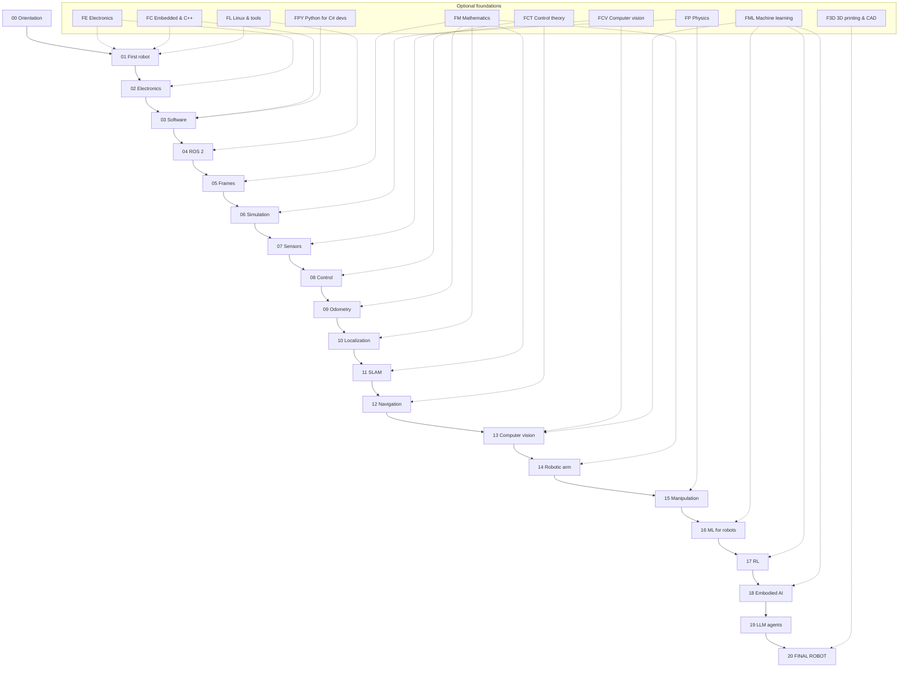

# Course map

The whole course on one page: the roadmap, which optional foundations feed each stage, what
hardware each stage needs, and — at the bottom — every lesson with its prerequisites.
For the lesson-level dependency graphs see [curriculum/dependency-graph.md](curriculum/dependency-graph.md).

## The roadmap

```text
 Programming (you already have it)
      │
      ├──── Electronics foundations (FE) ──┐
      ├──── Math foundations (FM) ─────────┤   take only what a lesson points you to
      ├──── Linux & Python (FL, FPY) ──────┤
      │                                    │
      ▼                                    ▼
 00 Orientation — what robotics is, the stack, safety mindset
      ▼
 01 FIRST ROBOT ◀── FE (power, PWM, motors, batteries), FC (MicroPython), FP (torque)
      ▼
 02 Robot electronics in practice ◀── FE
      ▼
 03 Software engineering for robots ◀── FPY, FL, FC (C++)
      ▼
 04 ROS 2 ◀── FL (Ubuntu, Docker)
      ▼
 05 Coordinate frames & transforms ◀── FM (trig, vectors, matrices, rotations, quaternions)
      ▼
 06 Simulation ◀── FP (forces, friction, inertia), FM (numerical integration)
      ▼
 07 Sensors ◀── FM (probability, noise, statistics), FCV (image formation)
      ▼
 08 Control ◀── FCT (feedback, stability, sampling), FM (derivatives, integrals)
      ▼
 09 Odometry ◀── FM (trig, integration, error propagation)
      ▼
 10 Localization ◀── FM (Gaussians, covariance, Bayes, matrices)
      ▼
 11 SLAM ◀── FM (least squares, optimization)
      ▼
 12 Navigation ◀── FCT (MPC intro)
      ▼
 13 Computer vision ◀── FCV, FML (CNNs, embeddings, transformers)
      ▼
 14 Robotic arm ◀── FM (transforms, rotations, Jacobians, optimization), FE (servos)
      ▼
 15 Manipulation ◀── FP (friction, center of mass)
      ▼
 16 Machine learning for robots ◀── FML
      ▼
 17 Reinforcement learning ◀── FML (gradient descent, networks), FM (probability)
      ▼
 18 Embodied AI ◀── FML (transformers, diffusion)
      ▼
 19 LLM robot agents
      ▼
 20 FINAL ROBOT — ROS 2 + sensors + camera + localization + mapping + navigation
                  + vision + arm + manipulation + LLM agent + safety
```



The main path is drawn in order, but the real dependency graph is finer-grained: for example
**13 Computer vision** only needs 03 and 05 for its first lessons, so you can start it in
parallel with navigation. `python course.py next` always follows the real graph.

## Phases, hardware stages and milestones

| Phase | Modules | Hardware stage | You can… | Projects |
|---|---|---|---|---|
| **A. First contact** | 00–01 | Stage 1: robot base + tools | drive a robot you built, measure distance with encoders, stop at obstacles, monitor the battery | P01, P02, P03 |
| **B. Professional foundations** | 02–05 | Stage 1 | build robust electronics and software; run your robot as a ROS 2 system; reason with frames | P06 |
| **C. Simulation and state** | 06–09 | Stage 2: IMU (+ camera) | simulate the robot; control speed and heading precisely; trust your odometry | P04, P05, P07, P08 |
| **D. Autonomy** | 10–12 | Stage 3: LiDAR | localize, map your home, navigate to named places | P09, P10, P11 |
| **E. Perception** | 13 | Stage 2 camera (Stage 4 optional: Jetson, depth camera) | detect, segment, track and locate objects in the map | P12, P13 |
| **F. Manipulation** | 14–15 | Stage 5: robotic arm | move an arm to Cartesian goals; pick and place with vision | P14, P15, P16 |
| **G. Learning robots** | 16–18 | Stage 5 (+ optional GPU) | fine-tune perception, train RL policies in sim, train imitation policies and VLAs on your arm | — |
| **H. AI agents & integration** | 19–20 | Stage 6: e-stop, integration parts | let an LLM direct the robot safely; ship the final robot | P17, Final |

## Paths through the course

| If you… | Do this |
|---|---|
| know nothing about robotics or electronics | Follow `python course.py next`, take every optional foundation a lesson links when the topic is new. |
| are strong in math (linear algebra, probability) | Skip the FM track with `course.py skip`; take the skip tests in 05, 10, 11 lessons. |
| have used ROS 2 before | Take the skip tests of 04.01–04.15; don't skip 04.16 (your robot's ROS interface). |
| want AI results early | You still need 01–05 and 13.01–13.10; then you can do 16 and 19.01–19.05 in simulation before navigation is finished. |
| have no hardware yet | Modules 00, 03 (mostly), 04, 05, 06, and the simulation variants of 08–12 run on a laptop. See the *sim-only path* in [HARDWARE.md](HARDWARE.md). |

## Time

Totals are generated below. Realistically, at 6–8 focused hours per week the main path and
projects take about 18–24 months; the course is designed so that each lesson is one sitting
and every module ends in something that works.

<!-- lessons:start -->
<!-- generated by tools/build.py -->

## Main path — every lesson

### 00 · Orientation — what robotics actually is

The vocabulary and the mental map of the whole robotics stack, plus how to study this course with an AI teacher. *(7 lessons, ≈ 4 h)*

| Id | Lesson | Level | Time | Needs | Hardware |
|---|---|---|---|---|---|
| 00.01 | [What is a robot? The sense–think–act loop](00-orientation/00.01-what-is-a-robot.md) | beginner | 30 min | — | — |
| 00.02 | [The robotics stack from AI down to motors](00-orientation/00.02-the-robotics-stack.md) | beginner | 45 min | 00.01 | — |
| 00.03 | [Field guide: motors, servos, encoders, IMUs, cameras, LiDAR, ToF, ultrasonic](00-orientation/00.03-actuators-and-sensors-field-guide.md) | beginner | 45 min | 00.02 | — |
| 00.04 | [Robot computers: microcontrollers, single-board computers and GPUs](00-orientation/00.04-robot-computers.md) | beginner | 35 min | 00.03 | — |
| 00.05 | [ROS 2 and robot middleware in one page](00-orientation/00.05-ros2-in-one-page.md) | beginner | 30 min | 00.02 | — |
| 00.06 | [The safety mindset for home robotics](00-orientation/00.06-safety-mindset.md) | beginner | 30 min | 00.03 | — |
| 00.07 | [How to study this course with an AI teacher and the progress tool](00-orientation/00.07-how-to-use-this-course.md) | beginner | 25 min | — | — |

### 01 · Your first physical robot

Buy, assemble, power and program a small differential-drive robot — motors, encoders, distance sensors and battery monitoring. *(15 lessons, ≈ 16 h 55 min)*

| Id | Lesson | Level | Time | Needs | Hardware |
|---|---|---|---|---|---|
| 01.01 | [Plan the build — the architecture of your first robot](01-first-robot/01.01-plan-the-build.md) | beginner | 40 min | 00.04 | — |
| 01.02 | [Stage 1 shopping list: buying the parts in Israel](01-first-robot/01.02-buying-hardware-in-israel.md) | beginner | 45 min | 01.01 | — |
| 01.03 | [Your workbench: tools, multimeter and first soldering](01-first-robot/01.03-workbench-and-tools.md) | beginner | 1 h | 01.02 | tools |
| 01.04 | [Set up the Raspberry Pi 5 headless (OS, SSH, updates)](01-first-robot/01.04-raspberry-pi-setup.md) | beginner | 1 h | 01.02 | robot-base |
| 01.05 | [Set up the Pico microcontroller and talk to it over USB](01-first-robot/01.05-pico-microcontroller-setup.md) | beginner | 45 min | 01.04 | robot-base |
| 01.06 | [Mechanical assembly — chassis, motors, wheels, caster](01-first-robot/01.06-mechanical-assembly.md) | beginner | 1 h 30 min | 01.03 | robot-base, tools |
| 01.07 | [Power it safely — battery, fuse, switch, buck converter, common ground](01-first-robot/01.07-power-system.md) | beginner | 1 h 30 min | 01.06 | robot-base, tools |
| 01.08 | [Wire the motor driver and spin a motor (PWM and direction)](01-first-robot/01.08-first-motor-spin.md) | beginner | 1 h 15 min | 01.05, 01.07 | robot-base |
| 01.09 | [Read the wheel encoders — ticks, direction, counts per revolution](01-first-robot/01.09-reading-encoders.md) | beginner | 1 h 15 min | 01.08 | robot-base |
| 01.10 | [Design the Pi ↔ Pico serial protocol (with a watchdog)](01-first-robot/01.10-pi-pico-protocol.md) | intermediate | 1 h 30 min | 01.09 | robot-base |
| 01.11 | [Drive forward, backward and rotate in place (open loop)](01-first-robot/01.11-drive-and-rotate.md) | beginner | 1 h | 01.10 | robot-base |
| 01.12 | [Use encoders to drive exact distances and angles — drive a square](01-first-robot/01.12-encoder-distance-and-square.md) | intermediate | 1 h 30 min | 01.11 | robot-base |
| 01.13 | [Ultrasonic and ToF sensors — stop before hitting things](01-first-robot/01.13-distance-sensors-stop.md) | beginner | 1 h 15 min | 01.11 | robot-base |
| 01.14 | [Measure and report battery state; low-battery shutdown](01-first-robot/01.14-battery-monitoring.md) | beginner | 1 h | 01.10 | robot-base |
| 01.15 | [Drive it from your laptop — keyboard teleop over the network](01-first-robot/01.15-teleop-from-laptop.md) | intermediate | 1 h | 01.11 | robot-base |

### 02 · Robot electronics in practice

From a breadboard that works to a robot that keeps working — power budgets, drivers, buses, noise, wiring and systematic electrical debugging. *(10 lessons, ≈ 10 h 25 min)*

| Id | Lesson | Level | Time | Needs | Hardware |
|---|---|---|---|---|---|
| 02.01 | [Reading datasheets and pinouts without drowning](02-robot-electronics/02.01-datasheets-and-pinouts.md) | beginner | 45 min | 01.08 | — |
| 02.02 | [Power budgets and power architecture (why the Pi reboots when motors start)](02-robot-electronics/02.02-power-budget.md) | intermediate | 1 h | 01.07, 02.01 | robot-base |
| 02.03 | [Motor drivers in depth — H-bridges, PWM frequency, current, braking](02-robot-electronics/02.03-motor-drivers-in-depth.md) | intermediate | 1 h | 01.08, 02.01 | robot-base |
| 02.04 | [Buses in practice: I²C scanning, SPI, UART](02-robot-electronics/02.04-buses-i2c-spi-uart.md) | intermediate | 1 h 15 min | 01.13 | robot-base |
| 02.05 | [Logic levels, level shifting and protecting GPIO pins](02-robot-electronics/02.05-logic-levels-and-protection.md) | beginner | 45 min | 02.04 | robot-base |
| 02.06 | [Noise, grounding, decoupling and motor EMI](02-robot-electronics/02.06-noise-grounding-emi.md) | intermediate | 1 h | 02.03 | robot-base |
| 02.07 | [Connectors, crimping and a wiring harness that survives vibration](02-robot-electronics/02.07-wiring-harness.md) | beginner | 1 h | 01.07 | robot-base, tools |
| 02.08 | [From breadboard to a soldered robot board](02-robot-electronics/02.08-from-breadboard-to-perfboard.md) | intermediate | 2 h | 02.07, 02.06 | robot-base, tools |
| 02.09 | [Systematic electrical debugging: the motor doesn't move](02-robot-electronics/02.09-electrical-debugging-method.md) | intermediate | 1 h | 02.03, 02.05 | robot-base, tools |
| 02.10 | [CAN bus and smart actuators — when bigger robots need them](02-robot-electronics/02.10-can-bus-and-smart-actuators.md) | intermediate | 40 min | 02.04 | — |

### 03 · Software engineering for robots

Python ecosystem, serial links, concurrency, hardware abstraction, config, logging, testing, C++ and networking — robotics software written professionally. *(11 lessons, ≈ 10 h 30 min)*

| Id | Lesson | Level | Time | Needs | Hardware |
|---|---|---|---|---|---|
| 03.01 | [The Python robotics ecosystem (a map for C# developers)](03-robot-software/03.01-python-robotics-ecosystem.md) | beginner | 40 min | 01.11 | — |
| 03.02 | [Project layout, environments and version pinning on Ubuntu](03-robot-software/03.02-environments-and-pinning.md) | beginner | 50 min | 03.01 | — |
| 03.03 | [Robust serial communication — framing, timeouts, reconnection](03-robot-software/03.03-robust-serial-communication.md) | intermediate | 1 h | 01.10, 03.02 | robot-base |
| 03.04 | [Loops, timing and concurrency — threads, asyncio, processes](03-robot-software/03.04-timing-and-concurrency.md) | intermediate | 1 h 15 min | 03.03 | — |
| 03.05 | [Hardware abstraction — interfaces, drivers and fakes](03-robot-software/03.05-hardware-abstraction.md) | intermediate | 1 h | 03.04 | — |
| 03.06 | [Configuration and calibration data](03-robot-software/03.06-configuration-and-calibration.md) | beginner | 40 min | 03.05 | — |
| 03.07 | [Logging, telemetry and plotting what the robot did](03-robot-software/03.07-logging-and-telemetry.md) | intermediate | 1 h | 03.05 | — |
| 03.08 | [Testing robot software — unit, simulation and hardware-in-the-loop](03-robot-software/03.08-testing-robot-software.md) | intermediate | 1 h | 03.05 | — |
| 03.09 | [Where C and C++ are used in robotics — and enough C++ to read it](03-robot-software/03.09-where-cpp-is-used.md) | intermediate | 1 h 15 min | 03.04 | — |
| 03.10 | [Networking for robots — Wi-Fi, latency, discovery, time sync](03-robot-software/03.10-networking-for-robots.md) | intermediate | 1 h | 01.15 | robot-base |
| 03.11 | [Git workflow, CI and reproducibility for a robot repo](03-robot-software/03.11-ci-and-reproducibility.md) | intermediate | 50 min | 03.08 | — |

### 04 · ROS 2

ROS 2 from zero, explained through distributed-systems concepts — ending with your physical robot as a ROS 2 system. *(16 lessons, ≈ 14 h 55 min)*

| Id | Lesson | Level | Time | Needs | Hardware |
|---|---|---|---|---|---|
| 04.01 | [Why middleware? ROS 2 through a distributed-systems lens](04-ros2/04.01-why-middleware.md) | beginner | 45 min | 00.05, 03.04 | — |
| 04.02 | [Installing ROS 2 — native Ubuntu, Docker on Windows, and the Pi](04-ros2/04.02-installing-ros2.md) | beginner | 1 h 30 min | 04.01 | — |
| 04.03 | [Nodes and the ros2 command line](04-ros2/04.03-nodes-and-cli.md) | beginner | 45 min | 04.02 | — |
| 04.04 | [Topics — writing publishers and subscribers in Python](04-ros2/04.04-topics-publishers-subscribers.md) | beginner | 1 h | 04.03 | — |
| 04.05 | [Packages, workspaces and colcon](04-ros2/04.05-packages-and-workspaces.md) | beginner | 50 min | 04.04 | — |
| 04.06 | [Messages, interfaces and custom messages](04-ros2/04.06-messages-and-custom-interfaces.md) | beginner | 50 min | 04.05 | — |
| 04.07 | [Services — request/response](04-ros2/04.07-services.md) | beginner | 45 min | 04.06 | — |
| 04.08 | [Actions — long-running goals with feedback and cancellation](04-ros2/04.08-actions.md) | intermediate | 1 h | 04.07 | — |
| 04.09 | [Parameters — configuring nodes at runtime](04-ros2/04.09-parameters.md) | beginner | 40 min | 04.05 | — |
| 04.10 | [Launch files — starting a system](04-ros2/04.10-launch-files.md) | intermediate | 50 min | 04.09 | — |
| 04.11 | [Quality of Service — reliability, durability, history](04-ros2/04.11-qos.md) | intermediate | 50 min | 04.04 | — |
| 04.12 | [Executors, callback groups and timing](04-ros2/04.12-executors-and-callbacks.md) | intermediate | 55 min | 04.07 | — |
| 04.13 | [Logging, debugging and introspection](04-ros2/04.13-debugging-and-introspection.md) | intermediate | 50 min | 04.10, 04.11 | — |
| 04.14 | [rosbag2 — record, replay and inspect](04-ros2/04.14-rosbag2.md) | beginner | 40 min | 04.13 | — |
| 04.15 | [Lifecycle (managed) nodes](04-ros2/04.15-lifecycle-nodes.md) | intermediate | 45 min | 04.12 | — |
| 04.16 | [Your physical robot in ROS 2 — cmd_vel in, telemetry out](04-ros2/04.16-your-robot-as-ros2-node.md) | intermediate | 2 h | 04.10, 04.08, 03.05 | robot-base |

### 05 · Coordinate frames and transformations

The single most important geometric skill in robotics: where is that thing relative to me? Frames, transforms, TF2, URDF and RViz. *(11 lessons, ≈ 10 h 35 min)*

| Id | Lesson | Level | Time | Needs | Hardware |
|---|---|---|---|---|---|
| 05.01 | [Why frames? "The camera sees a bottle — where is it relative to the robot?"](05-frames-and-transforms/05.01-why-frames.md) | beginner | 35 min | 04.04 | — |
| 05.02 | [Position, orientation and pose in 2D (x, y, θ)](05-frames-and-transforms/05.02-pose-in-2d.md) | beginner | 45 min | 05.01 | — |
| 05.03 | [2D rigid transforms — rotate, translate, compose, invert](05-frames-and-transforms/05.03-rigid-transforms-2d.md) | intermediate | 1 h | 05.02 | — |
| 05.04 | [Homogeneous transforms in 2D and 3D](05-frames-and-transforms/05.04-homogeneous-transforms.md) | intermediate | 1 h | 05.03 | — |
| 05.05 | [3D rotations in practice — matrices, roll-pitch-yaw and quaternions](05-frames-and-transforms/05.05-rotations-in-3d.md) | intermediate | 1 h 15 min | 05.04 | — |
| 05.06 | [Robot frame conventions: REP-103 and REP-105 (map, odom, base_link, optical frames)](05-frames-and-transforms/05.06-frame-conventions-rep103-rep105.md) | intermediate | 45 min | 05.05 | — |
| 05.07 | [TF2 — broadcasting and listening to transforms](05-frames-and-transforms/05.07-tf2-broadcast-listen.md) | intermediate | 1 h 15 min | 05.06, 04.10 | — |
| 05.08 | [URDF and xacro — describing your robot](05-frames-and-transforms/05.08-urdf-and-xacro.md) | intermediate | 1 h 30 min | 05.07 | — |
| 05.09 | [RViz — seeing frames, the robot model and sensor data](05-frames-and-transforms/05.09-rviz.md) | beginner | 45 min | 05.08 | — |
| 05.10 | [Worked example: an object seen by the camera, expressed in base_link and map](05-frames-and-transforms/05.10-object-from-camera-to-map.md) | intermediate | 1 h | 05.07, 05.06 | — |
| 05.11 | [Debugging TF — missing frames, extrapolation, timestamps](05-frames-and-transforms/05.11-debugging-tf.md) | intermediate | 45 min | 05.09, 05.10 | — |

### 06 · Simulation

Simulate before things get complicated — a tiny Python simulator, then Gazebo with ros2_control, simulated sensors and the sim-to-real gap. *(10 lessons, ≈ 10 h)*

| Id | Lesson | Level | Time | Needs | Hardware |
|---|---|---|---|---|---|
| 06.01 | [Why simulate, and choosing a simulator](06-simulation/06.01-why-simulate.md) | beginner | 35 min | 04.10 | — |
| 06.02 | [The course mini-simulator — physics in 100 lines of Python](06-simulation/06.02-course-mini-simulator.md) | intermediate | 1 h | 06.01, 03.05 | — |
| 06.03 | [Gazebo basics — worlds, models, SDF and the gz tools](06-simulation/06.03-gazebo-basics.md) | beginner | 1 h | 06.01, 04.02 | — |
| 06.04 | [Bridging Gazebo and ROS 2 (ros_gz, clock, use_sim_time)](06-simulation/06.04-bridging-gazebo-ros2.md) | intermediate | 50 min | 06.03 | — |
| 06.05 | [Your robot in Gazebo — spawning a URDF with inertia, collision and friction](06-simulation/06.05-robot-in-gazebo.md) | intermediate | 1 h 15 min | 06.04, 05.08 | — |
| 06.06 | [ros2_control — the same controllers in simulation and on the real robot](06-simulation/06.06-ros2-control.md) | advanced | 1 h 30 min | 06.05 | — |
| 06.07 | [Simulated LiDAR, camera, depth and IMU — with realistic noise](06-simulation/06.07-simulated-sensors-and-noise.md) | intermediate | 1 h 15 min | 06.06 | — |
| 06.08 | [Building worlds for mapping and navigation labs](06-simulation/06.08-building-worlds.md) | beginner | 50 min | 06.03 | — |
| 06.09 | [One codebase for simulation and the real robot](06-simulation/06.09-same-code-sim-and-real.md) | intermediate | 1 h | 06.06, 04.16 | robot-base |
| 06.10 | [The sim-to-real gap — what transfers and what doesn't](06-simulation/06.10-sim-to-real-gap.md) | intermediate | 45 min | 06.07 | — |

### 07 · Sensors

Encoders, ultrasonic, ToF, IMU, LiDAR, RGB and depth cameras — physics, noise, failure modes, latency, and real experiments. *(11 lessons, ≈ 10 h 35 min)*

| Id | Lesson | Level | Time | Needs | Hardware |
|---|---|---|---|---|---|
| 07.01 | [Sensor fundamentals: accuracy, precision, noise, bias, latency, rate](07-sensors/07.01-sensor-fundamentals.md) | beginner | 1 h | 01.13 | robot-base |
| 07.02 | [Wheel encoders in depth — resolution, slip, velocity estimation](07-sensors/07.02-wheel-encoders-in-depth.md) | intermediate | 50 min | 07.01, 01.12 | robot-base |
| 07.03 | [Ultrasonic sensors — sound, cones and ghost echoes](07-sensors/07.03-ultrasonic-sensors.md) | beginner | 45 min | 07.01 | robot-base |
| 07.04 | [Optical time-of-flight sensors (VL53L1X)](07-sensors/07.04-tof-sensors.md) | beginner | 45 min | 07.01 | robot-base |
| 07.05 | [IMU — accelerometer, gyroscope, magnetometer, bias and drift](07-sensors/07.05-imu-fundamentals.md) | intermediate | 1 h 15 min | 07.01, 05.05 | imu |
| 07.06 | [The IMU in ROS 2 — sensor_msgs/Imu, covariance and orientation filters](07-sensors/07.06-imu-in-ros2.md) | intermediate | 1 h | 07.05, 04.16 | imu |
| 07.07 | [2D LiDAR — how it works, LaserScan data, and a ROS 2 driver](07-sensors/07.07-2d-lidar.md) | intermediate | 1 h 15 min | 07.01, 05.07 | lidar |
| 07.08 | [RGB cameras on the robot — exposure, rolling shutter, ROS image topics](07-sensors/07.08-rgb-cameras.md) | intermediate | 1 h 15 min | 07.01, 04.11 | camera |
| 07.09 | [Depth cameras and point clouds — stereo, structured light, ToF](07-sensors/07.09-depth-cameras-and-point-clouds.md) | intermediate | 1 h | 07.08 | — |
| 07.10 | [Sensor data done right in ROS 2 — timestamps, frame_ids, covariance, synchronization](07-sensors/07.10-sensor-data-in-ros2.md) | intermediate | 50 min | 07.06, 07.07 | — |
| 07.11 | [Sensor troubleshooting — a systematic method](07-sensors/07.11-sensor-troubleshooting.md) | intermediate | 40 min | 07.10 | — |

### 08 · Control

Feedback control through experiments — observe the error, add P, then I, then D, then the math. Exact speed, straight lines and 90° turns. *(12 lessons, ≈ 11 h 40 min)*

| Id | Lesson | Level | Time | Needs | Hardware |
|---|---|---|---|---|---|
| 08.01 | [Open loop vs closed loop — why your robot doesn't drive straight](08-control/08.01-open-vs-closed-loop.md) | beginner | 45 min | 01.12, 06.02 | robot-base |
| 08.02 | [Measuring a motor — step response, deadband and time constant](08-control/08.02-motor-step-response.md) | intermediate | 1 h | 08.01, 03.07 | robot-base |
| 08.03 | [Estimating wheel speed from encoders — and filtering it](08-control/08.03-wheel-speed-estimation.md) | intermediate | 50 min | 08.02, 07.02 | robot-base |
| 08.04 | [Proportional control — hold a wheel speed](08-control/08.04-proportional-control.md) | intermediate | 1 h | 08.03 | robot-base |
| 08.05 | [Integral control — killing steady-state error (and integral windup)](08-control/08.05-integral-control.md) | intermediate | 1 h | 08.04 | robot-base |
| 08.06 | [Derivative control — damping, noise and derivative kick](08-control/08.06-derivative-control.md) | intermediate | 50 min | 08.05 | robot-base |
| 08.07 | [PID mathematically — continuous, discrete, and what stability means](08-control/08.07-pid-mathematics.md) | intermediate | 1 h | 08.06 | — |
| 08.08 | [Tuning PID systematically](08-control/08.08-tuning-pid.md) | intermediate | 1 h 15 min | 08.07 | robot-base |
| 08.09 | [Feedforward + PID: drive at exactly 0.5 m/s](08-control/08.09-feedforward-exact-speed.md) | intermediate | 1 h | 08.08 | robot-base |
| 08.10 | [Hold a straight line — cascaded heading control](08-control/08.10-straight-line-heading-control.md) | intermediate | 1 h | 08.09 | robot-base |
| 08.11 | [Rotate exactly 90° — motion profiles and IMU feedback](08-control/08.11-rotate-exactly-90.md) | intermediate | 1 h | 08.10, 07.05 | robot-base, imu |
| 08.12 | [Control in ROS 2 — where loops run, rates, limits and ros2_control](08-control/08.12-control-in-ros2.md) | advanced | 1 h | 08.09, 06.06 | robot-base |

### 09 · Odometry

From wheel ticks to pose — differential-drive kinematics, integration, calibration and drift, built from scratch then compared with ROS 2. *(7 lessons, ≈ 7 h 30 min)*

| Id | Lesson | Level | Time | Needs | Hardware |
|---|---|---|---|---|---|
| 09.01 | [Differential-drive kinematics — wheel speeds to robot motion](09-odometry/09.01-diff-drive-kinematics.md) | intermediate | 1 h | 05.02, 01.12 | — |
| 09.02 | [The other way — cmd_vel to wheel speeds (with saturation)](09-odometry/09.02-inverse-kinematics-cmd-vel.md) | intermediate | 40 min | 09.01 | — |
| 09.03 | [Dead reckoning — integrating motion (Euler, midpoint, exact arcs)](09-odometry/09.03-dead-reckoning-integration.md) | intermediate | 1 h | 09.01 | — |
| 09.04 | [Build an odometry system from scratch (tested against the simulator)](09-odometry/09.04-odometry-from-scratch.md) | intermediate | 1 h 30 min | 09.02, 09.03, 06.02 | — |
| 09.05 | [Calibrating odometry — wheel radius, wheelbase and UMBmark](09-odometry/09.05-calibrating-odometry.md) | intermediate | 1 h 15 min | 09.04 | robot-base |
| 09.06 | [Accumulated error — why odometry always drifts](09-odometry/09.06-accumulated-error.md) | intermediate | 50 min | 09.05 | — |
| 09.07 | [Odometry in ROS 2 — nav_msgs/Odometry, odom→base_link, comparing implementations](09-odometry/09.07-odometry-in-ros2.md) | intermediate | 1 h 15 min | 09.04, 05.07, 04.16 | robot-base |

### 10 · Localization

Knowing where you are despite noise — belief, Bayes filters, Kalman and Extended Kalman filters, sensor fusion, particle filters and AMCL. *(10 lessons, ≈ 11 h 10 min)*

| Id | Lesson | Level | Time | Needs | Hardware |
|---|---|---|---|---|---|
| 10.01 | [Localization — belief instead of certainty](10-localization/10.01-what-is-localization.md) | intermediate | 40 min | 09.06 | — |
| 10.02 | [Representing uncertainty — Gaussians and covariance ellipses](10-localization/10.02-uncertainty-gaussians.md) | intermediate | 1 h | 10.01 | — |
| 10.03 | [The Bayes filter — predict and update on a 1D grid](10-localization/10.03-bayes-filter.md) | intermediate | 1 h | 10.02 | — |
| 10.04 | [The Kalman filter in 1D — numbers first](10-localization/10.04-kalman-filter-1d.md) | intermediate | 1 h | 10.03 | — |
| 10.05 | [The multivariate Kalman filter](10-localization/10.05-kalman-filter-multivariate.md) | advanced | 1 h 15 min | 10.04 | — |
| 10.06 | [The Extended Kalman Filter for a differential-drive robot](10-localization/10.06-extended-kalman-filter.md) | advanced | 1 h 30 min | 10.05, 09.04 | — |
| 10.07 | [Sensor fusion — IMU + wheel odometry with robot_localization](10-localization/10.07-fusing-imu-and-odometry.md) | intermediate | 1 h 15 min | 10.06, 07.06, 09.07 | robot-base, imu |
| 10.08 | [Particle filters and Monte Carlo localization](10-localization/10.08-particle-filter-mcl.md) | advanced | 1 h 30 min | 10.03, 07.07 | — |
| 10.09 | [AMCL in ROS 2 — localizing on a known map](10-localization/10.09-amcl-in-ros2.md) | intermediate | 1 h | 10.08, 06.07 | — |
| 10.10 | [Landmarks you can print — AprilTags for localization](10-localization/10.10-fiducial-landmarks.md) | intermediate | 1 h | 10.06, 13.07 | camera |

### 11 · Mapping and SLAM

Explore a room, build a map, save it, localize on it — occupancy grids, scan matching, pose graphs, loop closure, slam_toolbox and visual SLAM. *(9 lessons, ≈ 10 h 10 min)*

| Id | Lesson | Level | Time | Needs | Hardware |
|---|---|---|---|---|---|
| 11.01 | [Map representations — occupancy grids, features, point clouds, voxels, graphs](11-slam/11.01-map-representations.md) | intermediate | 40 min | 10.01, 07.07 | — |
| 11.02 | [Occupancy grid mapping with known poses (log-odds and ray casting)](11-slam/11.02-occupancy-grid-mapping.md) | intermediate | 1 h 15 min | 11.01, 05.04 | — |
| 11.03 | [The SLAM problem — front end, back end, and why it is hard](11-slam/11.03-the-slam-problem.md) | intermediate | 45 min | 11.02, 10.06 | — |
| 11.04 | [Scan matching with ICP](11-slam/11.04-scan-matching-icp.md) | advanced | 1 h 15 min | 11.03 | — |
| 11.05 | [Pose graphs and loop closure](11-slam/11.05-pose-graphs-loop-closure.md) | advanced | 1 h 15 min | 11.04 | — |
| 11.06 | [LiDAR SLAM with slam_toolbox in simulation](11-slam/11.06-slam-toolbox-simulation.md) | intermediate | 1 h 15 min | 11.03, 06.08, 09.07 | — |
| 11.07 | [Map your real room: explore → map → save → localize](11-slam/11.07-mapping-your-room.md) | advanced | 2 h | 11.06, 10.07 | robot-base, lidar |
| 11.08 | [Visual SLAM — ORB-SLAM3, RTAB-Map and friends](11-slam/11.08-visual-slam.md) | advanced | 1 h | 11.05, 07.09, 13.04 | — |
| 11.09 | [SLAM troubleshooting — when maps smear, double or drift](11-slam/11.09-slam-troubleshooting.md) | intermediate | 45 min | 11.07 | — |

### 12 · Navigation

"Go to the kitchen." Path planning, costmaps, local planners, Nav2, waypoints and recovery behaviors — in simulation and on the real robot. *(10 lessons, ≈ 11 h 5 min)*

| Id | Lesson | Level | Time | Needs | Hardware |
|---|---|---|---|---|---|
| 12.01 | [The navigation problem — goals, waypoints, global and local planning](12-navigation/12.01-the-navigation-problem.md) | beginner | 35 min | 11.01 | — |
| 12.02 | [Grid path planning — BFS, Dijkstra and A*](12-navigation/12.02-grid-path-planning.md) | intermediate | 1 h 15 min | 12.01 | — |
| 12.03 | [Sampling-based planning — RRT and friends](12-navigation/12.03-sampling-based-planning.md) | intermediate | 50 min | 12.02 | — |
| 12.04 | [Costmaps, inflation and the robot footprint](12-navigation/12.04-costmaps.md) | intermediate | 50 min | 12.02 | — |
| 12.05 | [Local planning — pure pursuit, DWB, MPPI and obstacle avoidance](12-navigation/12.05-local-planning-obstacle-avoidance.md) | advanced | 1 h 15 min | 12.04, 09.02 | — |
| 12.06 | [Nav2 architecture — servers, lifecycle and behavior trees](12-navigation/12.06-nav2-architecture.md) | intermediate | 50 min | 12.05, 04.15 | — |
| 12.07 | [Nav2 in simulation — go to pose](12-navigation/12.07-nav2-in-simulation.md) | intermediate | 1 h 30 min | 12.06, 10.09, 11.06 | — |
| 12.08 | [Nav2 on the real robot — tuning for a small, slow robot](12-navigation/12.08-nav2-on-the-real-robot.md) | advanced | 2 h | 12.07, 11.07 | robot-base, lidar |
| 12.09 | [Waypoints and missions with the Nav2 Simple Commander API](12-navigation/12.09-waypoints-and-missions.md) | intermediate | 1 h | 12.07 | — |
| 12.10 | [Recovery behaviors, failure handling and navigation safety](12-navigation/12.10-recovery-and-navigation-safety.md) | intermediate | 1 h | 12.08 | — |

### 13 · Computer vision

From pixels and OpenCV through camera geometry and calibration to modern detection, segmentation, tracking, embeddings and vision-language models on a robot. *(16 lessons, ≈ 17 h 30 min)*

| Id | Lesson | Level | Time | Needs | Hardware |
|---|---|---|---|---|---|
| 13.01 | [Images as data — pixels, channels, RGB, grayscale, HSV](13-computer-vision/13.01-images-as-data.md) | beginner | 45 min | 03.01 | — |
| 13.02 | [OpenCV fundamentals and preprocessing](13-computer-vision/13.02-opencv-preprocessing.md) | beginner | 1 h | 13.01 | — |
| 13.03 | [Classical detection — color segmentation and contours (find the ball)](13-computer-vision/13.03-classical-detection.md) | beginner | 1 h | 13.02 | — |
| 13.04 | [Features — edges, corners, ORB and matching](13-computer-vision/13.04-features-and-matching.md) | intermediate | 1 h | 13.02 | — |
| 13.05 | [The pinhole camera model — projecting 3D to pixels and back](13-computer-vision/13.05-pinhole-camera-model.md) | intermediate | 1 h 15 min | 13.01, 05.04 | — |
| 13.06 | [Lenses, distortion and camera calibration](13-computer-vision/13.06-lens-distortion-calibration.md) | intermediate | 1 h 15 min | 13.05 | camera |
| 13.07 | [Fiducial markers — ArUco and AprilTag pose estimation](13-computer-vision/13.07-fiducial-markers.md) | intermediate | 1 h | 13.06 | camera |
| 13.08 | [Depth and 3D vision — stereo, depth images and point clouds](13-computer-vision/13.08-depth-and-3d-vision.md) | intermediate | 1 h 15 min | 13.05, 07.09 | — |
| 13.09 | [CNNs for robot vision — using pretrained networks](13-computer-vision/13.09-cnns-for-robot-vision.md) | intermediate | 1 h | 13.02 | — |
| 13.10 | [Object detection with modern models](13-computer-vision/13.10-object-detection-models.md) | intermediate | 1 h 15 min | 13.09 | — |
| 13.11 | [Segmentation — semantic, instance and promptable (SAM)](13-computer-vision/13.11-segmentation.md) | intermediate | 1 h | 13.10 | — |
| 13.12 | [Tracking objects over time](13-computer-vision/13.12-tracking.md) | intermediate | 1 h | 13.10, 10.04 | — |
| 13.13 | [Embeddings and open-vocabulary detection (CLIP, OWLv2, Grounding DINO)](13-computer-vision/13.13-embeddings-open-vocabulary.md) | advanced | 1 h | 13.10 | — |
| 13.14 | [Vision-language models on a robot — describing and questioning the scene](13-computer-vision/13.14-vision-language-models.md) | advanced | 1 h | 13.13 | — |
| 13.15 | [Vision in ROS 2 — cv_bridge, vision_msgs and performance on the robot](13-computer-vision/13.15-vision-in-ros2.md) | intermediate | 1 h 15 min | 13.10, 07.08 | camera |
| 13.16 | [From detection to a 3D position in the map frame](13-computer-vision/13.16-detection-to-map-position.md) | advanced | 1 h 30 min | 13.15, 13.08, 05.10 | camera |

### 14 · The robotic arm

Joints, links, forward and inverse kinematics, Jacobians, trajectories and MoveIt 2 — on a real low-cost arm. *(11 lessons, ≈ 14 h 55 min)*

| Id | Lesson | Level | Time | Needs | Hardware |
|---|---|---|---|---|---|
| 14.01 | [Arm anatomy — joints, links, DOF, workspace, end effector](14-robotic-arm/14.01-arm-anatomy.md) | beginner | 40 min | 05.06 | — |
| 14.02 | [Buying and assembling the arm; servo setup and calibration](14-robotic-arm/14.02-buying-and-assembling-the-arm.md) | intermediate | 3 h | 14.01, 02.10 | arm, tools |
| 14.03 | [Controlling the arm's servos — positions, speeds, torque and limits](14-robotic-arm/14.03-controlling-servos.md) | intermediate | 1 h | 14.02 | arm |
| 14.04 | [Forward kinematics — from joint angles to gripper pose](14-robotic-arm/14.04-forward-kinematics.md) | intermediate | 1 h 15 min | 14.01, 05.04 | — |
| 14.05 | [Inverse kinematics — analytic and numerical](14-robotic-arm/14.05-inverse-kinematics.md) | advanced | 1 h 30 min | 14.04 | — |
| 14.06 | [The Jacobian — velocities, singularities and resolved-rate control](14-robotic-arm/14.06-jacobian.md) | advanced | 1 h 15 min | 14.05 | — |
| 14.07 | [Trajectories — joint vs Cartesian, trapezoidal and cubic profiles](14-robotic-arm/14.07-trajectories.md) | intermediate | 1 h | 14.05 | — |
| 14.08 | [The arm in ROS 2 — URDF, joint states and ros2_control](14-robotic-arm/14.08-arm-urdf-and-ros2-control.md) | advanced | 1 h 30 min | 14.03, 05.08, 06.06 | arm |
| 14.09 | [MoveIt 2 — motion planning and collision checking](14-robotic-arm/14.09-moveit2-motion-planning.md) | advanced | 2 h | 14.08, 12.03 | — |
| 14.10 | [Exercise lesson: move the gripper to a specified position](14-robotic-arm/14.10-move-gripper-to-position.md) | intermediate | 1 h | 14.09, 14.06 | arm |
| 14.11 | [Arm safety — torque, speed, workspace limits and e-stop](14-robotic-arm/14.11-arm-safety.md) | intermediate | 45 min | 14.03 | arm |

### 15 · Manipulation

Grasping physics, grippers, object pose, grasp planning, hand–eye calibration, visual servoing and a complete pick-and-place system. *(10 lessons, ≈ 12 h 15 min)*

| Id | Lesson | Level | Time | Needs | Hardware |
|---|---|---|---|---|---|
| 15.01 | [The physics of grasping — force, friction and friction cones](15-manipulation/15.01-physics-of-grasping.md) | intermediate | 50 min | 14.01 | — |
| 15.02 | [Grippers — parallel jaw, compliant, suction](15-manipulation/15.02-grippers.md) | beginner | 40 min | 15.01 | — |
| 15.03 | [Hand–eye calibration — eye-in-hand and eye-to-hand](15-manipulation/15.03-hand-eye-calibration.md) | advanced | 1 h 30 min | 14.04, 13.07 | arm, camera |
| 15.04 | [Object pose for grasping — from detections and depth to a 3D pose](15-manipulation/15.04-object-pose-estimation.md) | advanced | 1 h 15 min | 15.03, 13.16 | camera |
| 15.05 | [Grasp planning — heuristics first, learned grasps second](15-manipulation/15.05-grasp-planning.md) | advanced | 1 h | 15.04, 15.02 | — |
| 15.06 | [Visual servoing — closing the loop through the camera](15-manipulation/15.06-visual-servoing.md) | advanced | 1 h | 15.03, 14.06 | arm, camera |
| 15.07 | [Exercise lesson: detect an object and move the gripper toward it](15-manipulation/15.07-detect-and-approach.md) | advanced | 1 h 30 min | 15.04, 14.10 | arm, camera |
| 15.08 | [A pick-and-place pipeline with a state machine](15-manipulation/15.08-pick-and-place-pipeline.md) | advanced | 2 h | 15.07, 15.05 | arm, camera |
| 15.09 | [Collision avoidance, the planning scene and failure recovery](15-manipulation/15.09-collision-avoidance-and-recovery.md) | advanced | 1 h | 15.08 | — |
| 15.10 | [Mobile manipulation — the arm on the moving base](15-manipulation/15.10-mobile-manipulation.md) | advanced | 1 h 30 min | 15.08, 12.09 | robot-base, arm, camera |

### 16 · Machine learning for robots

Where ML actually earns its place on a robot — data, fine-tuning, edge deployment, learned models of dynamics, and evaluating ML inside a physical system. *(6 lessons, ≈ 6 h 45 min)*

| Id | Lesson | Level | Time | Needs | Hardware |
|---|---|---|---|---|---|
| 16.01 | [Where ML actually helps robots (and where classical methods win)](16-machine-learning/16.01-where-ml-helps-robots.md) | beginner | 40 min | 13.10 | — |
| 16.02 | [Data for robots — collecting, labeling, datasets from rosbags](16-machine-learning/16.02-robot-data.md) | intermediate | 1 h | 16.01, 04.14 | — |
| 16.03 | [Fine-tuning a detector on your own objects](16-machine-learning/16.03-fine-tuning-a-detector.md) | intermediate | 2 h | 16.02 | — |
| 16.04 | [Running models on robot compute — ONNX, TensorRT and quantization](16-machine-learning/16.04-models-on-edge-compute.md) | advanced | 1 h 15 min | 16.03 | — |
| 16.05 | [Learning a motor model — regression and system identification](16-machine-learning/16.05-learning-dynamics.md) | intermediate | 1 h | 16.01, 08.02 | — |
| 16.06 | [Evaluating ML components inside a robot](16-machine-learning/16.06-evaluating-ml-in-robots.md) | intermediate | 50 min | 16.03 | — |

### 17 · Reinforcement learning

RL in simulation first — states, actions, rewards, Q-learning, policy gradients, actor-critic, reward design and sim-to-real. *(9 lessons, ≈ 10 h 5 min)*

| Id | Lesson | Level | Time | Needs | Hardware |
|---|---|---|---|---|---|
| 17.01 | [The RL framing — environment, state, action, reward, policy](17-reinforcement-learning/17.01-rl-framing.md) | intermediate | 45 min | 16.01, 06.02 | — |
| 17.02 | [Value, return, exploration and exploitation](17-reinforcement-learning/17.02-value-exploration.md) | intermediate | 50 min | 17.01 | — |
| 17.03 | [Q-learning on a gridworld robot](17-reinforcement-learning/17.03-q-learning-gridworld.md) | intermediate | 1 h 15 min | 17.02 | — |
| 17.04 | [From tables to networks — DQN](17-reinforcement-learning/17.04-deep-q-networks.md) | advanced | 1 h | 17.03 | — |
| 17.05 | [Policy gradients — REINFORCE intuitively and mathematically](17-reinforcement-learning/17.05-policy-gradients.md) | advanced | 1 h 15 min | 17.03 | — |
| 17.06 | [Actor-critic, PPO and SAC with Stable-Baselines3](17-reinforcement-learning/17.06-actor-critic-ppo-sac.md) | advanced | 1 h 15 min | 17.05, 17.04 | — |
| 17.07 | [Wrap the course simulator as a Gymnasium environment and train go-to-goal](17-reinforcement-learning/17.07-robot-gym-environment.md) | advanced | 2 h | 17.06 | — |
| 17.08 | [Reward design and reward hacking](17-reinforcement-learning/17.08-reward-design.md) | intermediate | 45 min | 17.07 | — |
| 17.09 | [Sim-to-real for RL — domain randomization, GPU simulators, safety](17-reinforcement-learning/17.09-rl-sim-to-real.md) | advanced | 1 h | 17.08, 06.10 | — |

### 18 · Modern embodied AI

Imitation learning, ACT, diffusion policies, VLAs and robot foundation models — what is mature, what is research, and what you can run at home. *(10 lessons, ≈ 16 h 20 min)*

| Id | Lesson | Level | Time | Needs | Hardware |
|---|---|---|---|---|---|
| 18.01 | [The embodied AI landscape — mature vs research (dated)](18-embodied-ai/18.01-embodied-ai-landscape.md) | intermediate | 45 min | 16.01 | — |
| 18.02 | [Imitation learning and behavior cloning](18-embodied-ai/18.02-imitation-learning-behavior-cloning.md) | intermediate | 1 h | 18.01 | — |
| 18.03 | [Teleoperation and demonstration data with a leader–follower arm (LeRobot)](18-embodied-ai/18.03-teleop-data-collection.md) | intermediate | 2 h | 18.02, 14.03 | arm, camera |
| 18.04 | [ACT — action chunking with transformers](18-embodied-ai/18.04-action-chunking-transformers.md) | advanced | 1 h | 18.02 | — |
| 18.05 | [Diffusion policies](18-embodied-ai/18.05-diffusion-policies.md) | advanced | 1 h | 18.02 | — |
| 18.06 | [Train and deploy your first policy with LeRobot](18-embodied-ai/18.06-train-first-policy-lerobot.md) | advanced | 4 h | 18.03, 18.04 | arm, camera |
| 18.07 | [Vision-language-action models (VLAs)](18-embodied-ai/18.07-vision-language-action-models.md) | advanced | 1 h | 18.04, 13.14 | — |
| 18.08 | [Fine-tuning a small VLA on your own demonstrations](18-embodied-ai/18.08-fine-tuning-a-vla.md) | advanced | 4 h | 18.07, 18.06 | arm, camera |
| 18.09 | [Robot foundation models, world models and cross-embodiment data](18-embodied-ai/18.09-foundation-models-world-models.md) | advanced | 50 min | 18.07 | — |
| 18.10 | [Evaluating and safely deploying learned policies](18-embodied-ai/18.10-evaluating-learned-policies.md) | advanced | 45 min | 18.06 | — |

### 19 · LLMs and robot agents

"Find the bottle and put it on the table." LLMs operating robots safely through tools, planners, behavior trees and deterministic controllers. *(11 lessons, ≈ 11 h 15 min)*

| Id | Lesson | Level | Time | Needs | Hardware |
|---|---|---|---|---|---|
| 19.01 | [Why the LLM should not drive the motors — the layered agent architecture](19-llm-robot-agents/19.01-why-llms-dont-drive-motors.md) | intermediate | 40 min | 12.01, 08.01 | — |
| 19.02 | [Designing the robot's skill API — the tools an LLM may call](19-llm-robot-agents/19.02-robot-skill-api.md) | intermediate | 1 h | 19.01, 04.08 | — |
| 19.03 | [Tool calling — an LLM operating the simulated robot](19-llm-robot-agents/19.03-tool-calling-sim-robot.md) | intermediate | 1 h 30 min | 19.02, 12.09 | — |
| 19.04 | [State machines for robot tasks](19-llm-robot-agents/19.04-state-machines.md) | intermediate | 50 min | 19.01 | — |
| 19.05 | [Behavior trees](19-llm-robot-agents/19.05-behavior-trees.md) | intermediate | 1 h 15 min | 19.04, 12.06 | — |
| 19.06 | [Task planning and decomposition — LLM plans, validated execution](19-llm-robot-agents/19.06-task-planning-decomposition.md) | advanced | 1 h 15 min | 19.03, 19.05 | — |
| 19.07 | [Perception–action loops — verifying every step](19-llm-robot-agents/19.07-perception-action-loops.md) | advanced | 1 h | 19.06, 13.16 | — |
| 19.08 | [Memory and the agent's world model — semantic maps and object memory](19-llm-robot-agents/19.08-memory-and-world-model.md) | advanced | 1 h | 19.07 | — |
| 19.09 | [Safety boundaries for LLM-controlled robots](19-llm-robot-agents/19.09-agent-safety-boundaries.md) | advanced | 1 h | 19.06 | — |
| 19.10 | [Exposing ROS 2 to agents — MCP servers and evaluation](19-llm-robot-agents/19.10-ros2-for-agents-mcp.md) | advanced | 1 h | 19.09 | — |
| 19.11 | [Talking to the robot — speech in, speech out](19-llm-robot-agents/19.11-voice-interface.md) | intermediate | 45 min | 19.03 | — |

### 20 · The final robot — integration

Putting it all together into one autonomous AI robot, with architecture, integration, a safety case, testing and the final demo. *(6 lessons, ≈ 9 h 45 min)*

| Id | Lesson | Level | Time | Needs | Hardware |
|---|---|---|---|---|---|
| 20.01 | [Final robot system architecture](20-final-robot/20.01-final-architecture.md) | advanced | 1 h | 19.07, 15.10 | — |
| 20.02 | [Hardware integration — mounting, power v2, compute, cabling](20-final-robot/20.02-hardware-integration.md) | advanced | 3 h | 20.01, 02.08 | robot-base, lidar, camera, arm |
| 20.03 | [Software integration — bringup, health monitoring and diagnostics](20-final-robot/20.03-software-integration-bringup.md) | advanced | 2 h | 20.01 | — |
| 20.04 | [The safety case — e-stop, watchdogs, safe shutdown and test procedures](20-final-robot/20.04-safety-case.md) | advanced | 1 h 30 min | 20.02, 20.03, 19.09, 14.11, 12.10 | robot-base, estop |
| 20.05 | [Testing the whole robot — sim scenarios, field tests, regressions](20-final-robot/20.05-testing-strategy.md) | advanced | 1 h 15 min | 20.03, 03.08 | — |
| 20.06 | [The demo — and where to go next](20-final-robot/20.06-demo-and-beyond.md) | advanced | 1 h | 20.04, 20.05 | — |

## Optional foundations — every lesson

### FM · Foundations: mathematics

Exactly the math robotics uses, each concept tied to a robot example — trig, vectors, matrices, rotations, probability, calculus and optimization. *(21 lessons, ≈ 18 h 55 min)*

| Id | Lesson | Level | Time | Needs | Hardware |
|---|---|---|---|---|---|
| FM.01 | [Algebra refresher for robotics formulas](optional-foundations/mathematics/FM.01-algebra-refresher.md) | beginner | 40 min | — | — |
| FM.02 | [Angles](optional-foundations/mathematics/FM.02-angles-and-radians.md) | beginner | 30 min | — | — |
| FM.03 | [Trigonometry: sin, cos, tan and atan2](optional-foundations/mathematics/FM.03-trigonometry.md) | beginner | 50 min | FM.02 | — |
| FM.04 | [Cartesian and polar coordinates](optional-foundations/mathematics/FM.04-coordinate-systems.md) | beginner | 40 min | FM.03 | — |
| FM.05 | [Vectors from zero](optional-foundations/mathematics/FM.05-vectors.md) | beginner | 50 min | FM.04 | — |
| FM.06 | [Dot product and cross product](optional-foundations/mathematics/FM.06-dot-and-cross-product.md) | beginner | 50 min | FM.05 | — |
| FM.07 | [Matrices and matrix multiplication](optional-foundations/mathematics/FM.07-matrices.md) | beginner | 1 h | FM.05 | — |
| FM.08 | [Matrices as transformations and basis vectors](optional-foundations/mathematics/FM.08-matrices-as-transformations.md) | intermediate | 1 h | FM.07, FM.06 | — |
| FM.09 | [2D/3D transformations and homogeneous coordinates](optional-foundations/mathematics/FM.09-homogeneous-coordinates.md) | intermediate | 1 h | FM.08 | — |
| FM.10 | [Rotation matrices](optional-foundations/mathematics/FM.10-rotation-matrices.md) | intermediate | 1 h | FM.08, FM.03 | — |
| FM.11 | [Euler angles](optional-foundations/mathematics/FM.11-euler-angles.md) | intermediate | 50 min | FM.10 | — |
| FM.12 | [Quaternions without the mysticism](optional-foundations/mathematics/FM.12-quaternions.md) | intermediate | 1 h 15 min | FM.11 | — |
| FM.13 | [Probability from zero](optional-foundations/mathematics/FM.13-probability-basics.md) | beginner | 50 min | — | — |
| FM.14 | [Distributions, Gaussians, uncertainty and noise](optional-foundations/mathematics/FM.14-distributions-gaussians-noise.md) | beginner | 1 h | FM.13 | — |
| FM.15 | [Covariance and multivariate Gaussians](optional-foundations/mathematics/FM.15-covariance-multivariate-gaussians.md) | intermediate | 1 h | FM.14, FM.07 | — |
| FM.16 | [Bayes' rule — updating beliefs with evidence](optional-foundations/mathematics/FM.16-bayes-rule.md) | intermediate | 50 min | FM.13 | — |
| FM.17 | [Calculus for robots: derivatives, rates and partial derivatives](optional-foundations/mathematics/FM.17-derivatives.md) | intermediate | 1 h | FM.01 | — |
| FM.18 | [Integrals and numerical integration (how simulators move time forward)](optional-foundations/mathematics/FM.18-integrals-numerical-integration.md) | intermediate | 50 min | FM.17 | — |
| FM.19 | [Linear systems and least squares](optional-foundations/mathematics/FM.19-linear-systems-least-squares.md) | intermediate | 1 h | FM.07 | — |
| FM.20 | [Optimization for robotics and ML: gradient descent to nonlinear least squares](optional-foundations/mathematics/FM.20-optimization-basics.md) | intermediate | 1 h 15 min | FM.19, FM.17 | — |
| FM.21 | [Statistics for robot experiments: mean, spread, RMSE, outliers](optional-foundations/mathematics/FM.21-statistics-for-experiments.md) | beginner | 45 min | FM.14 | — |

### FE · Foundations: electronics

Only the electronics needed to build robots safely, with a practical experiment in almost every lesson. *(19 lessons, ≈ 14 h 35 min)*

| Id | Lesson | Level | Time | Needs | Hardware |
|---|---|---|---|---|---|
| FE.01 | [Voltage, current, resistance and power](optional-foundations/electronics/FE.01-voltage-current-resistance-power.md) | beginner | 45 min | — | — |
| FE.02 | [Ohm's law, series and parallel, voltage dividers](optional-foundations/electronics/FE.02-ohms-law-series-parallel.md) | beginner | 50 min | FE.01 | — |
| FE.03 | [Using a multimeter safely](optional-foundations/electronics/FE.03-multimeter.md) | beginner | 45 min | FE.02 | tools |
| FE.04 | [Breadboards, jumpers and connectors](optional-foundations/electronics/FE.04-breadboards-and-connectors.md) | beginner | 40 min | FE.01 | tools |
| FE.05 | [Digital vs analog signals and GPIO](optional-foundations/electronics/FE.05-digital-analog-gpio.md) | beginner | 45 min | FE.02 | — |
| FE.06 | [Pull-up and pull-down resistors (and why inputs float)](optional-foundations/electronics/FE.06-pull-up-pull-down.md) | beginner | 35 min | FE.05 | — |
| FE.07 | [PWM — pulse-width modulation](optional-foundations/electronics/FE.07-pwm.md) | beginner | 40 min | FE.05 | — |
| FE.08 | [ADC — reading analog voltages](optional-foundations/electronics/FE.08-adc.md) | beginner | 40 min | FE.05, FE.02 | — |
| FE.09 | [Serial buses: UART, I²C and SPI](optional-foundations/electronics/FE.09-uart-i2c-spi.md) | beginner | 1 h | FE.06 | — |
| FE.10 | [DC motors: brushed vs brushless, gearboxes, stall current](optional-foundations/electronics/FE.10-dc-motors.md) | beginner | 50 min | FE.01 | — |
| FE.11 | [Servo motors and stepper motors](optional-foundations/electronics/FE.11-servos-and-steppers.md) | beginner | 45 min | FE.07, FE.10 | — |
| FE.12 | [H-bridges and motor drivers](optional-foundations/electronics/FE.12-h-bridges-motor-drivers.md) | beginner | 45 min | FE.10, FE.07 | — |
| FE.13 | [Batteries: chemistry, voltage, capacity, C-rating](optional-foundations/electronics/FE.13-batteries.md) | beginner | 50 min | FE.01 | — |
| FE.14 | [Li-ion and LiPo safety and charging](optional-foundations/electronics/FE.14-lithium-battery-safety.md) | beginner | 40 min | FE.13 | — |
| FE.15 | [Voltage regulators: linear, buck and boost](optional-foundations/electronics/FE.15-voltage-regulators.md) | beginner | 40 min | FE.02 | — |
| FE.16 | [Ground, common ground and why it matters](optional-foundations/electronics/FE.16-grounding.md) | beginner | 35 min | FE.02 | — |
| FE.17 | [Soldering from zero](optional-foundations/electronics/FE.17-soldering.md) | beginner | 1 h 30 min | FE.04 | tools |
| FE.18 | [Capacitors, diodes and flyback protection — just enough](optional-foundations/electronics/FE.18-capacitors-diodes.md) | intermediate | 45 min | FE.02 | — |
| FE.19 | [CAN bus concepts](optional-foundations/electronics/FE.19-can-bus-concepts.md) | intermediate | 35 min | FE.09 | — |

### FP · Foundations: physics

Motion, forces, friction, torque, energy and stability — the physics a robot builder trips over. *(7 lessons, ≈ 5 h 30 min)*

| Id | Lesson | Level | Time | Needs | Hardware |
|---|---|---|---|---|---|
| FP.01 | [Units, position, velocity and acceleration](optional-foundations/physics/FP.01-kinematics-units.md) | beginner | 45 min | — | — |
| FP.02 | [Forces, mass, weight and Newton's laws](optional-foundations/physics/FP.02-forces-newton.md) | beginner | 45 min | FP.01 | — |
| FP.03 | [Friction and traction](optional-foundations/physics/FP.03-friction-traction.md) | beginner | 40 min | FP.02 | — |
| FP.04 | [Torque, gears and wheels — sizing motors](optional-foundations/physics/FP.04-torque-gears-wheels.md) | beginner | 1 h | FP.02 | — |
| FP.05 | [Energy, power and efficiency — how long will the battery last?](optional-foundations/physics/FP.05-energy-power-efficiency.md) | beginner | 45 min | FP.04 | — |
| FP.06 | [Rotational motion and moment of inertia](optional-foundations/physics/FP.06-rotational-motion-inertia.md) | intermediate | 50 min | FP.04 | — |
| FP.07 | [Center of mass and tipping stability](optional-foundations/physics/FP.07-center-of-mass-stability.md) | intermediate | 45 min | FP.02 | — |

### FL · Foundations: Linux and the development environment

A complete beginner track for Ubuntu, the shell, permissions, processes, SSH, networking, packages, Python environments, Git and Docker. *(13 lessons, ≈ 10 h 35 min)*

| Id | Lesson | Level | Time | Needs | Hardware |
|---|---|---|---|---|---|
| FL.01 | [Why Linux runs robots — Ubuntu versions and LTS](optional-foundations/linux-and-tools/FL.01-why-linux.md) | beginner | 30 min | — | — |
| FL.02 | [Getting Ubuntu: dual boot, VM or WSL2](optional-foundations/linux-and-tools/FL.02-installing-ubuntu.md) | beginner | 1 h 30 min | FL.01 | — |
| FL.03 | [The shell for Windows developers](optional-foundations/linux-and-tools/FL.03-shell-basics.md) | beginner | 1 h | FL.02 | — |
| FL.04 | [The Linux filesystem and paths](optional-foundations/linux-and-tools/FL.04-filesystem.md) | beginner | 40 min | FL.03 | — |
| FL.05 | [Permissions, users, groups and sudo (dialout, gpio, video)](optional-foundations/linux-and-tools/FL.05-permissions-users-groups.md) | beginner | 45 min | FL.04 | — |
| FL.06 | [Processes, signals and systemd services](optional-foundations/linux-and-tools/FL.06-processes-systemd.md) | beginner | 50 min | FL.03 | — |
| FL.07 | [Package management: apt, keys and repositories](optional-foundations/linux-and-tools/FL.07-package-management.md) | beginner | 40 min | FL.03 | — |
| FL.08 | [SSH and remote development](optional-foundations/linux-and-tools/FL.08-ssh-remote-dev.md) | beginner | 50 min | FL.03 | — |
| FL.09 | [Networking basics: IP, Wi-Fi, ports, mDNS, ping](optional-foundations/linux-and-tools/FL.09-networking-basics.md) | beginner | 1 h | FL.03 | — |
| FL.10 | [Python environments on Ubuntu: apt, venv, uv and PEP 668](optional-foundations/linux-and-tools/FL.10-python-environments-ubuntu.md) | beginner | 45 min | FL.07 | — |
| FL.11 | [Git for robotics: large files, bags and models](optional-foundations/linux-and-tools/FL.11-git-for-robotics.md) | beginner | 35 min | FL.03 | — |
| FL.12 | [Docker for robotics: devices, GUIs and host networking](optional-foundations/linux-and-tools/FL.12-docker-for-robotics.md) | intermediate | 1 h | FL.06 | — |
| FL.13 | [Working headless: tmux and resilient remote sessions](optional-foundations/linux-and-tools/FL.13-tmux-headless.md) | beginner | 30 min | FL.08 | — |

### FPY · Foundations: Python for C# developers

A fast, respectful Python track for an experienced C# engineer — the idioms, numpy, plotting, typing and asyncio that robotics code uses. *(6 lessons, ≈ 5 h 5 min)*

| Id | Lesson | Level | Time | Needs | Hardware |
|---|---|---|---|---|---|
| FPY.01 | [Python for C# developers — the fast tour](optional-foundations/python/FPY.01-python-for-csharp-devs.md) | beginner | 1 h | — | — |
| FPY.02 | [numpy essentials for robotics](optional-foundations/python/FPY.02-numpy-essentials.md) | beginner | 1 h | FPY.01 | — |
| FPY.03 | [Plotting robot data with matplotlib](optional-foundations/python/FPY.03-plotting-matplotlib.md) | beginner | 40 min | FPY.02 | — |
| FPY.04 | [Typing, dataclasses, protocols and packaging](optional-foundations/python/FPY.04-typing-dataclasses-packaging.md) | intermediate | 50 min | FPY.01 | — |
| FPY.05 | [asyncio for people who know async/await in C#](optional-foundations/python/FPY.05-asyncio-for-csharp-devs.md) | intermediate | 50 min | FPY.01 | — |
| FPY.06 | [Python performance: vectorization, profiling and when to leave Python](optional-foundations/python/FPY.06-python-performance.md) | intermediate | 45 min | FPY.02 | — |

### FC · Foundations: embedded systems and C/C++

Microcontrollers, MicroPython, interrupts, PIO, real-time concepts, C++ for C# developers, CMake and micro-ROS. *(8 lessons, ≈ 8 h 30 min)*

| Id | Lesson | Level | Time | Needs | Hardware |
|---|---|---|---|---|---|
| FC.01 | [Embedded systems 101 — life without an operating system](optional-foundations/cpp-and-embedded/FC.01-embedded-systems-101.md) | beginner | 45 min | — | — |
| FC.02 | [MicroPython on the Raspberry Pi Pico](optional-foundations/cpp-and-embedded/FC.02-micropython-on-pico.md) | beginner | 1 h | FC.01 | robot-base |
| FC.03 | [C++ for C# developers: memory, RAII, headers, templates](optional-foundations/cpp-and-embedded/FC.03-cpp-for-csharp-devs.md) | intermediate | 1 h 30 min | — | — |
| FC.04 | [Building C++ with CMake](optional-foundations/cpp-and-embedded/FC.04-cmake-builds.md) | intermediate | 45 min | FC.03 | — |
| FC.05 | [Interrupts, timers and the Pico's PIO](optional-foundations/cpp-and-embedded/FC.05-interrupts-timers-pio.md) | intermediate | 1 h | FC.02 | robot-base |
| FC.06 | [Moving firmware to C/C++ — the Pico SDK](optional-foundations/cpp-and-embedded/FC.06-pico-c-sdk.md) | advanced | 1 h 30 min | FC.04, FC.05 | robot-base |
| FC.07 | [Real-time concepts: determinism, latency, jitter and watchdogs](optional-foundations/cpp-and-embedded/FC.07-real-time-concepts.md) | intermediate | 45 min | FC.01 | — |
| FC.08 | [micro-ROS: ROS 2 on microcontrollers](optional-foundations/cpp-and-embedded/FC.08-micro-ros.md) | advanced | 1 h 15 min | FC.06 | robot-base |

### FCT · Foundations: control theory

Just enough control theory to understand what the control module does and to read Nav2/MPC documentation. *(6 lessons, ≈ 5 h 30 min)*

| Id | Lesson | Level | Time | Needs | Hardware |
|---|---|---|---|---|---|
| FCT.01 | [Systems, signals and feedback — block diagrams](optional-foundations/control-theory/FCT.01-systems-signals-feedback.md) | beginner | 40 min | — | — |
| FCT.02 | [First- and second-order systems](optional-foundations/control-theory/FCT.02-first-second-order-systems.md) | intermediate | 1 h | FCT.01 | — |
| FCT.03 | [Differential equations just enough — simulate them numerically](optional-foundations/control-theory/FCT.03-differential-equations-simulation.md) | intermediate | 50 min | FCT.02 | — |
| FCT.04 | [Stability: poles without the pain](optional-foundations/control-theory/FCT.04-stability-intuition.md) | intermediate | 1 h | FCT.03 | — |
| FCT.05 | [Discrete time: sampling rates, delay and aliasing](optional-foundations/control-theory/FCT.05-discrete-time-sampling.md) | intermediate | 45 min | FCT.01 | — |
| FCT.06 | [State space, LQR and MPC — an introduction](optional-foundations/control-theory/FCT.06-state-space-lqr-mpc.md) | advanced | 1 h 15 min | FCT.04 | — |

### FML · Foundations: machine learning

ML from absolute zero to transformers and diffusion — each topic ending with "why would a robot need this?" *(12 lessons, ≈ 11 h)*

| Id | Lesson | Level | Time | Needs | Hardware |
|---|---|---|---|---|---|
| FML.01 | [What machine learning is — and isn't](optional-foundations/machine-learning/FML.01-what-is-ml.md) | beginner | 40 min | — | — |
| FML.02 | [Supervised learning: regression and classification](optional-foundations/machine-learning/FML.02-supervised-learning.md) | beginner | 1 h | FML.01 | — |
| FML.03 | [Training, validation and test sets; overfitting](optional-foundations/machine-learning/FML.03-train-validation-test.md) | beginner | 45 min | FML.02 | — |
| FML.04 | [Loss functions](optional-foundations/machine-learning/FML.04-loss-functions.md) | beginner | 40 min | FML.02 | — |
| FML.05 | [Gradient descent](optional-foundations/machine-learning/FML.05-gradient-descent.md) | intermediate | 50 min | FML.04 | — |
| FML.06 | [Neural networks from zero](optional-foundations/machine-learning/FML.06-neural-networks.md) | intermediate | 1 h | FML.05 | — |
| FML.07 | [Backpropagation and PyTorch basics](optional-foundations/machine-learning/FML.07-backprop-pytorch.md) | intermediate | 1 h 15 min | FML.06 | — |
| FML.08 | [Convolutional neural networks](optional-foundations/machine-learning/FML.08-cnns.md) | intermediate | 1 h | FML.07 | — |
| FML.09 | [Embeddings](optional-foundations/machine-learning/FML.09-embeddings.md) | intermediate | 45 min | FML.06 | — |
| FML.10 | [Transformers and attention](optional-foundations/machine-learning/FML.10-transformers-attention.md) | intermediate | 1 h 15 min | FML.09 | — |
| FML.11 | [Unsupervised learning: clustering, PCA, autoencoders](optional-foundations/machine-learning/FML.11-unsupervised-learning.md) | intermediate | 50 min | FML.06 | — |
| FML.12 | [Generative models: VAEs, diffusion and flow matching (intuition)](optional-foundations/machine-learning/FML.12-generative-models-diffusion.md) | advanced | 1 h | FML.10, FML.11 | — |

### FCV · Foundations: computer vision

How cameras form images, convolution, color, projective geometry, stereo and detection metrics. *(6 lessons, ≈ 4 h 40 min)*

| Id | Lesson | Level | Time | Needs | Hardware |
|---|---|---|---|---|---|
| FCV.01 | [How cameras form images: light, sensors, Bayer filters, exposure](optional-foundations/computer-vision/FCV.01-how-cameras-form-images.md) | beginner | 45 min | — | — |
| FCV.02 | [Image processing as array math: convolution and kernels](optional-foundations/computer-vision/FCV.02-convolution-kernels.md) | beginner | 50 min | FCV.01 | — |
| FCV.03 | [Color spaces: RGB, HSV, Lab](optional-foundations/computer-vision/FCV.03-color-spaces.md) | beginner | 35 min | FCV.01 | — |
| FCV.04 | [Projective geometry lite: homogeneous points, homographies](optional-foundations/computer-vision/FCV.04-projective-geometry.md) | intermediate | 1 h | FCV.02 | — |
| FCV.05 | [Stereo vision and epipolar geometry intuition](optional-foundations/computer-vision/FCV.05-stereo-epipolar.md) | intermediate | 50 min | FCV.04 | — |
| FCV.06 | [Detection metrics: IoU, precision, recall, mAP](optional-foundations/computer-vision/FCV.06-detection-metrics.md) | beginner | 40 min | — | — |

### F3D · Foundations: 3D printing and CAD

When 3D printing becomes worth it, basic CAD, file formats, tolerances, brackets, gears and ordering prints in Israel. *(7 lessons, ≈ 6 h 15 min)*

| Id | Lesson | Level | Time | Needs | Hardware |
|---|---|---|---|---|---|
| F3D.01 | [Why 3D printing matters in robotics — and when to buy a printer](optional-foundations/3d-printing-and-cad/F3D.01-why-3d-printing.md) | beginner | 30 min | — | — |
| F3D.02 | [CAD basics with Onshape or FreeCAD](optional-foundations/3d-printing-and-cad/F3D.02-cad-basics.md) | beginner | 1 h 30 min | F3D.01 | — |
| F3D.03 | [STL, 3MF, STEP and slicers](optional-foundations/3d-printing-and-cad/F3D.03-file-formats-slicers.md) | beginner | 40 min | F3D.02 | — |
| F3D.04 | [Tolerances, clearances and fits](optional-foundations/3d-printing-and-cad/F3D.04-tolerances-fits.md) | beginner | 40 min | F3D.03 | — |
| F3D.05 | [Exercise: design a sensor mounting bracket](optional-foundations/3d-printing-and-cad/F3D.05-mounting-bracket.md) | intermediate | 1 h 30 min | F3D.04 | — |
| F3D.06 | [Gears, heat-set inserts and fasteners](optional-foundations/3d-printing-and-cad/F3D.06-gears-inserts-fasteners.md) | intermediate | 45 min | F3D.04 | — |
| F3D.07 | [Materials, chassis parts and ordering prints in Israel](optional-foundations/3d-printing-and-cad/F3D.07-materials-chassis-ordering.md) | beginner | 40 min | F3D.03 | — |

## Projects

| Id | Project | Level | Time | Needs | Hardware |
|---|---|---|---|---|---|
| P01 | [Project 1 — Robot drives manually](projects/P01-manual-drive.md) | beginner | 2 h | 01.15 | robot-base |
| P02 | [Project 2 — Obstacle avoidance](projects/P02-obstacle-avoidance.md) | beginner | 3 h | 01.13, P01 | robot-base |
| P03 | [Project 3 — Encoder-based movement](projects/P03-encoder-movement.md) | beginner | 3 h | 01.12 | robot-base |
| P04 | [Project 4 — PID-controlled movement](projects/P04-pid-movement.md) | intermediate | 4 h | 08.10, P03 | robot-base |
| P05 | [Project 5 — Autonomous square and path following](projects/P05-autonomous-square-path.md) | intermediate | 4 h | 08.11, 09.04, P04 | robot-base, imu |
| P06 | [Project 6 — Your robot on ROS 2](projects/P06-ros2-robot.md) | intermediate | 5 h | 04.16 | robot-base |
| P07 | [Project 7 — The simulated twin](projects/P07-simulated-robot.md) | intermediate | 5 h | 06.09, P06 | — |
| P08 | [Project 8 — Odometry you can trust](projects/P08-odometry.md) | intermediate | 4 h | 09.07, P06 | robot-base |
| P09 | [Project 9 — Map your home](projects/P09-mapping.md) | advanced | 6 h | 11.07, P08 | robot-base, lidar |
| P10 | [Project 10 — Localize on your map](projects/P10-localization.md) | advanced | 5 h | 10.09, 10.07, P09 | robot-base, lidar, imu |
| P11 | [Project 11 — Go to the kitchen: autonomous navigation](projects/P11-autonomous-navigation.md) | advanced | 8 h | 12.10, P10 | robot-base, lidar |
| P12 | [Project 12 — Camera object detection](projects/P12-camera-object-detection.md) | intermediate | 5 h | 13.15 | camera |
| P13 | [Project 13 — Find objects and put them on the map](projects/P13-robot-plus-vision.md) | advanced | 8 h | 13.16, P11, P12 | robot-base, lidar, camera |
| P14 | [Project 14 — The arm moves where you tell it](projects/P14-robotic-arm.md) | advanced | 8 h | 14.10, 14.11 | arm |
| P15 | [Project 15 — Vision-guided reaching](projects/P15-vision-guided-arm.md) | advanced | 8 h | 15.07, P14 | arm, camera |
| P16 | [Project 16 — Pick and place](projects/P16-pick-and-place.md) | advanced | 10 h | 15.09, P15 | arm, camera |
| P17 | [Project 17 — The LLM-directed robot](projects/P17-llm-controlled-robot.md) | advanced | 10 h | 19.09, P13 | robot-base, lidar, camera |
| P18 | [Final project — the autonomous AI robot](projects/P18-final-autonomous-ai-robot.md) | advanced | 40 h | 20.06, P16, P17 | robot-base, lidar, camera, imu, arm, estop |

## Totals

- Main path: 218 lessons, ≈ 238 hours
- Optional foundations: 105 lessons, ≈ 90 hours (take only what you need)
- Projects: 18, ≈ 138 hours

<!-- lessons:end -->
