# Dependency graph

<!-- generated by tools/build.py from curriculum/syllabus.yaml — do not edit -->

The course is a directed acyclic graph. **Solid arrows** are hard prerequisites; **dotted arrows** are optional foundation lessons that help if the topic is new.
The same data is in [`graph.json`](graph.json) for tools and AI agents. From the command line:

```bash
python course.py why 11.07      # everything 11.07 depends on, with your status
python course.py learn quaternions  # which lesson teaches a concept, and what it needs
```

## Module-level roadmap

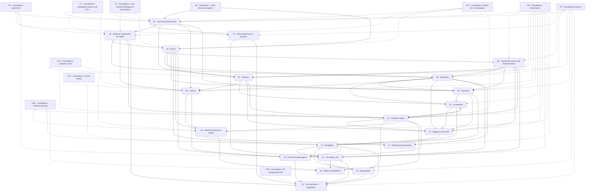

## 00 · Orientation — what robotics actually is

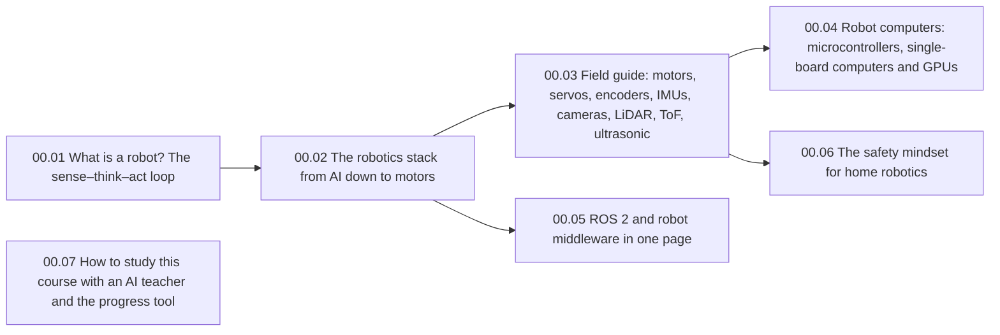

| Lesson | Requires | Optional | Unlocks |
|---|---|---|---|
| 00.01 What is a robot? The sense–think–act loop | — | — | 00.02 |
| 00.02 The robotics stack from AI down to motors | 00.01 | — | 00.03, 00.05 |
| 00.03 Field guide: motors, servos, encoders, IMUs, cameras, LiDAR, ToF, ultrasonic | 00.02 | — | 00.04, 00.06 |
| 00.04 Robot computers: microcontrollers, single-board computers and GPUs | 00.03 | — | 01.01 |
| 00.05 ROS 2 and robot middleware in one page | 00.02 | — | 04.01 |
| 00.06 The safety mindset for home robotics | 00.03 | — | — |
| 00.07 How to study this course with an AI teacher and the progress tool | — | — | — |

## 01 · Your first physical robot

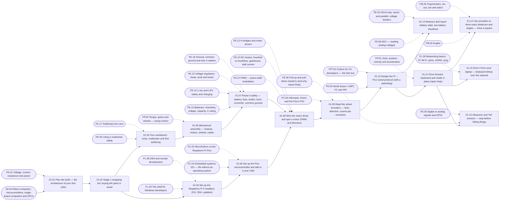

| Lesson | Requires | Optional | Unlocks |
|---|---|---|---|
| 01.01 Plan the build — the architecture of your first robot | 00.04 | FE.01 | 01.02 |
| 01.02 Stage 1 shopping list: buying the parts in Israel | 01.01 | — | 01.03, 01.04 |
| 01.03 Your workbench: tools, multimeter and first soldering | 01.02 | FE.03, FE.17 | 01.06 |
| 01.04 Set up the Raspberry Pi 5 headless (OS, SSH, updates) | 01.02 | FL.03, FL.08 | 01.05 |
| 01.05 Set up the Pico microcontroller and talk to it over USB | 01.04 | FC.01, FC.02 | 01.08 |
| 01.06 Mechanical assembly — chassis, motors, wheels, caster | 01.03 | FP.04 | 01.07 |
| 01.07 Power it safely — battery, fuse, switch, buck converter, common ground | 01.06 | FE.13, FE.14, FE.15, FE.16 | 01.08, 02.02, 02.07 |
| 01.08 Wire the motor driver and spin a motor (PWM and direction) | 01.05, 01.07 | FE.07, FE.10, FE.12 | 01.09, 02.01, 02.03 |
| 01.09 Read the wheel encoders — ticks, direction, counts per revolution | 01.08 | FC.05, FE.06 | 01.10 |
| 01.10 Design the Pi ↔ Pico serial protocol (with a watchdog) | 01.09 | FE.09, FPY.01 | 01.11, 01.14, 03.03 |
| 01.11 Drive forward, backward and rotate in place (open loop) | 01.10 | FP.01 | 01.12, 01.13, 01.15, 03.01 |
| 01.12 Use encoders to drive exact distances and angles — drive a square | 01.11 | FM.02, FM.03 | 07.02, 08.01, 09.01, P03 |
| 01.13 Ultrasonic and ToF sensors — stop before hitting things | 01.11 | FE.09, FE.05 | 02.04, 07.01, P02 |
| 01.14 Measure and report battery state; low-battery shutdown | 01.10 | FE.08, FE.02 | — |
| 01.15 Drive it from your laptop — keyboard teleop over the network | 01.11 | FL.09 | 03.10, P01 |

## 02 · Robot electronics in practice

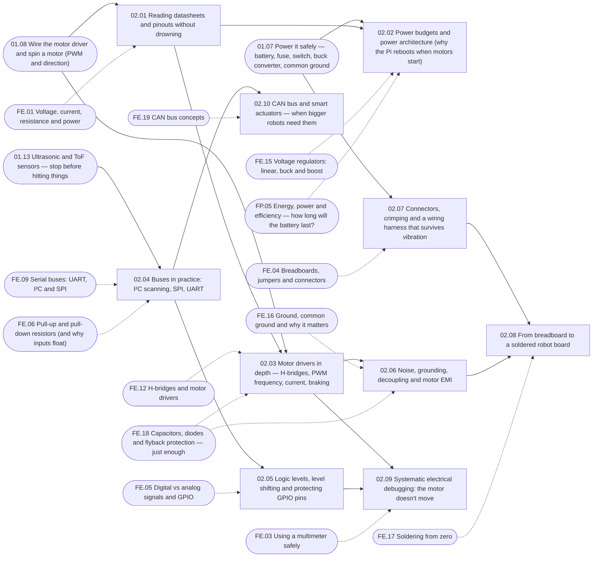

| Lesson | Requires | Optional | Unlocks |
|---|---|---|---|
| 02.01 Reading datasheets and pinouts without drowning | 01.08 | FE.01 | 02.02, 02.03 |
| 02.02 Power budgets and power architecture (why the Pi reboots when motors start) | 01.07, 02.01 | FE.15, FP.05 | — |
| 02.03 Motor drivers in depth — H-bridges, PWM frequency, current, braking | 01.08, 02.01 | FE.12, FE.18 | 02.06, 02.09 |
| 02.04 Buses in practice: I²C scanning, SPI, UART | 01.13 | FE.09, FE.06 | 02.05, 02.10 |
| 02.05 Logic levels, level shifting and protecting GPIO pins | 02.04 | FE.05 | 02.09 |
| 02.06 Noise, grounding, decoupling and motor EMI | 02.03 | FE.16, FE.18 | 02.08 |
| 02.07 Connectors, crimping and a wiring harness that survives vibration | 01.07 | FE.04 | 02.08 |
| 02.08 From breadboard to a soldered robot board | 02.07, 02.06 | FE.17 | 20.02 |
| 02.09 Systematic electrical debugging: the motor doesn't move | 02.03, 02.05 | FE.03 | — |
| 02.10 CAN bus and smart actuators — when bigger robots need them | 02.04 | FE.19 | 14.02 |

## 03 · Software engineering for robots

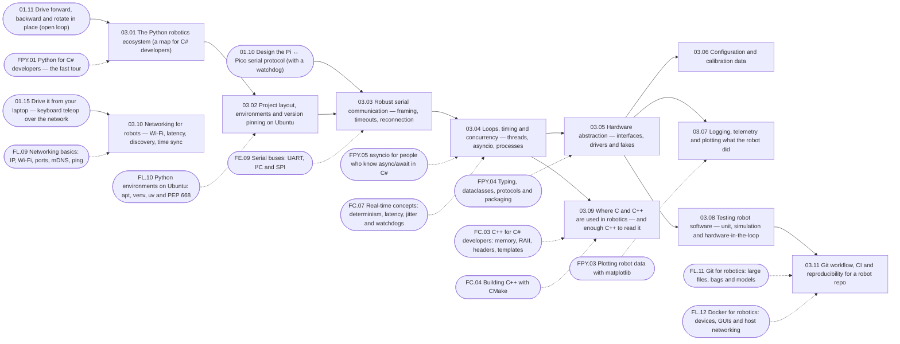

| Lesson | Requires | Optional | Unlocks |
|---|---|---|---|
| 03.01 The Python robotics ecosystem (a map for C# developers) | 01.11 | FPY.01 | 03.02, 13.01 |
| 03.02 Project layout, environments and version pinning on Ubuntu | 03.01 | FL.10 | 03.03 |
| 03.03 Robust serial communication — framing, timeouts, reconnection | 01.10, 03.02 | FE.09 | 03.04 |
| 03.04 Loops, timing and concurrency — threads, asyncio, processes | 03.03 | FPY.05, FC.07 | 03.05, 03.09, 04.01 |
| 03.05 Hardware abstraction — interfaces, drivers and fakes | 03.04 | FPY.04 | 03.06, 03.07, 03.08, 04.16, 06.02 |
| 03.06 Configuration and calibration data | 03.05 | — | — |
| 03.07 Logging, telemetry and plotting what the robot did | 03.05 | FPY.03 | 08.02 |
| 03.08 Testing robot software — unit, simulation and hardware-in-the-loop | 03.05 | — | 03.11, 20.05 |
| 03.09 Where C and C++ are used in robotics — and enough C++ to read it | 03.04 | FC.03, FC.04 | — |
| 03.10 Networking for robots — Wi-Fi, latency, discovery, time sync | 01.15 | FL.09 | — |
| 03.11 Git workflow, CI and reproducibility for a robot repo | 03.08 | FL.11, FL.12 | — |

## 04 · ROS 2

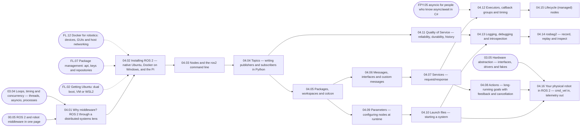

| Lesson | Requires | Optional | Unlocks |
|---|---|---|---|
| 04.01 Why middleware? ROS 2 through a distributed-systems lens | 00.05, 03.04 | — | 04.02 |
| 04.02 Installing ROS 2 — native Ubuntu, Docker on Windows, and the Pi | 04.01 | FL.02, FL.07, FL.12 | 04.03, 06.03 |
| 04.03 Nodes and the ros2 command line | 04.02 | — | 04.04 |
| 04.04 Topics — writing publishers and subscribers in Python | 04.03 | — | 04.05, 04.11, 05.01 |
| 04.05 Packages, workspaces and colcon | 04.04 | — | 04.06, 04.09 |
| 04.06 Messages, interfaces and custom messages | 04.05 | — | 04.07 |
| 04.07 Services — request/response | 04.06 | — | 04.08, 04.12 |
| 04.08 Actions — long-running goals with feedback and cancellation | 04.07 | — | 04.16, 19.02 |
| 04.09 Parameters — configuring nodes at runtime | 04.05 | — | 04.10 |
| 04.10 Launch files — starting a system | 04.09 | — | 04.13, 04.16, 05.07, 06.01 |
| 04.11 Quality of Service — reliability, durability, history | 04.04 | — | 04.13, 07.08 |
| 04.12 Executors, callback groups and timing | 04.07 | FPY.05 | 04.15 |
| 04.13 Logging, debugging and introspection | 04.10, 04.11 | — | 04.14 |
| 04.14 rosbag2 — record, replay and inspect | 04.13 | — | 16.02 |
| 04.15 Lifecycle (managed) nodes | 04.12 | — | 12.06 |
| 04.16 Your physical robot in ROS 2 — cmd_vel in, telemetry out | 04.10, 04.08, 03.05 | — | 06.09, 07.06, 09.07, P06 |

## 05 · Coordinate frames and transformations

```mermaid
flowchart LR
  n_05_01["05.01 Why frames? 'The camera sees a bottle — where is it relative to the robot?'"]
  n_05_02["05.02 Position, orientation and pose in 2D (x, y, θ)"]
  n_05_03["05.03 2D rigid transforms — rotate, translate, compose, invert"]
  n_05_04["05.04 Homogeneous transforms in 2D and 3D"]
  n_05_05["05.05 3D rotations in practice — matrices, roll-pitch-yaw and quaternions"]
  n_05_06["05.06 Robot frame conventions: REP-103 and REP-105 (map, odom, base_link, optical frames)"]
  n_05_07["05.07 TF2 — broadcasting and listening to transforms"]
  n_05_08["05.08 URDF and xacro — describing your robot"]
  n_05_09["05.09 RViz — seeing frames, the robot model and sensor data"]
  n_05_10["05.10 Worked example: an object seen by the camera, expressed in base_link and map"]
  n_05_11["05.11 Debugging TF — missing frames, extrapolation, timestamps"]
  n_04_04 --> n_05_01
  n_FM_04 -.-> n_05_01
  n_FM_05 -.-> n_05_01
  n_05_01 --> n_05_02
  n_FM_02 -.-> n_05_02
  n_FM_03 -.-> n_05_02
  n_FM_04 -.-> n_05_02
  n_05_02 --> n_05_03
  n_FM_07 -.-> n_05_03
  n_FM_08 -.-> n_05_03
  n_05_03 --> n_05_04
  n_FM_09 -.-> n_05_04
  n_05_04 --> n_05_05
  n_FM_10 -.-> n_05_05
  n_FM_11 -.-> n_05_05
  n_FM_12 -.-> n_05_05
  n_05_05 --> n_05_06
  n_05_06 --> n_05_07
  n_04_10 --> n_05_07
  n_05_07 --> n_05_08
  n_FP_06 -.-> n_05_08
  n_05_08 --> n_05_09
  n_05_07 --> n_05_10
  n_05_06 --> n_05_10
  n_05_09 --> n_05_11
  n_05_10 --> n_05_11
  n_04_04(["04.04 Topics — writing publishers and subscribers in Python"])
  n_04_10(["04.10 Launch files — starting a system"])
  n_FM_02(["FM.02 Angles"])
  n_FM_03(["FM.03 Trigonometry: sin, cos, tan and atan2"])
  n_FM_04(["FM.04 Cartesian and polar coordinates"])
  n_FM_05(["FM.05 Vectors from zero"])
  n_FM_07(["FM.07 Matrices and matrix multiplication"])
  n_FM_08(["FM.08 Matrices as transformations and basis vectors"])
  n_FM_09(["FM.09 2D/3D transformations and homogeneous coordinates"])
  n_FM_10(["FM.10 Rotation matrices"])
  n_FM_11(["FM.11 Euler angles"])
  n_FM_12(["FM.12 Quaternions without the mysticism"])
  n_FP_06(["FP.06 Rotational motion and moment of inertia"])
```

| Lesson | Requires | Optional | Unlocks |
|---|---|---|---|
| 05.01 Why frames? "The camera sees a bottle — where is it relative to the robot?" | 04.04 | FM.04, FM.05 | 05.02 |
| 05.02 Position, orientation and pose in 2D (x, y, θ) | 05.01 | FM.02, FM.03, FM.04 | 05.03, 09.01 |
| 05.03 2D rigid transforms — rotate, translate, compose, invert | 05.02 | FM.07, FM.08 | 05.04 |
| 05.04 Homogeneous transforms in 2D and 3D | 05.03 | FM.09 | 05.05, 11.02, 13.05, 14.04 |
| 05.05 3D rotations in practice — matrices, roll-pitch-yaw and quaternions | 05.04 | FM.10, FM.11, FM.12 | 05.06, 07.05 |
| 05.06 Robot frame conventions: REP-103 and REP-105 (map, odom, base_link, optical frames) | 05.05 | — | 05.07, 05.10, 14.01 |
| 05.07 TF2 — broadcasting and listening to transforms | 05.06, 04.10 | — | 05.08, 05.10, 07.07, 09.07 |
| 05.08 URDF and xacro — describing your robot | 05.07 | FP.06 | 05.09, 06.05, 14.08 |
| 05.09 RViz — seeing frames, the robot model and sensor data | 05.08 | — | 05.11 |
| 05.10 Worked example: an object seen by the camera, expressed in base_link and map | 05.07, 05.06 | — | 05.11, 13.16 |
| 05.11 Debugging TF — missing frames, extrapolation, timestamps | 05.09, 05.10 | — | — |

## 06 · Simulation

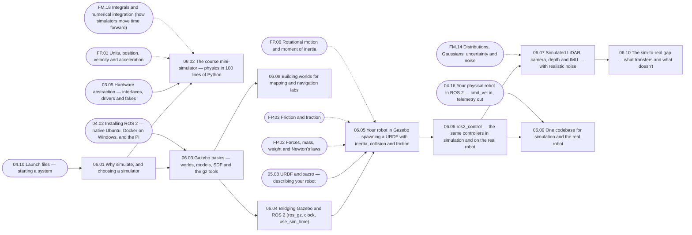

| Lesson | Requires | Optional | Unlocks |
|---|---|---|---|
| 06.01 Why simulate, and choosing a simulator | 04.10 | — | 06.02, 06.03 |
| 06.02 The course mini-simulator — physics in 100 lines of Python | 06.01, 03.05 | FP.01, FM.18 | 08.01, 09.04, 17.01 |
| 06.03 Gazebo basics — worlds, models, SDF and the gz tools | 06.01, 04.02 | — | 06.04, 06.08 |
| 06.04 Bridging Gazebo and ROS 2 (ros_gz, clock, use_sim_time) | 06.03 | — | 06.05 |
| 06.05 Your robot in Gazebo — spawning a URDF with inertia, collision and friction | 06.04, 05.08 | FP.02, FP.03, FP.06 | 06.06 |
| 06.06 ros2_control — the same controllers in simulation and on the real robot | 06.05 | — | 06.07, 06.09, 08.12, 14.08 |
| 06.07 Simulated LiDAR, camera, depth and IMU — with realistic noise | 06.06 | FM.14 | 06.10, 10.09 |
| 06.08 Building worlds for mapping and navigation labs | 06.03 | — | 11.06 |
| 06.09 One codebase for simulation and the real robot | 06.06, 04.16 | — | P07 |
| 06.10 The sim-to-real gap — what transfers and what doesn't | 06.07 | — | 17.09 |

## 07 · Sensors

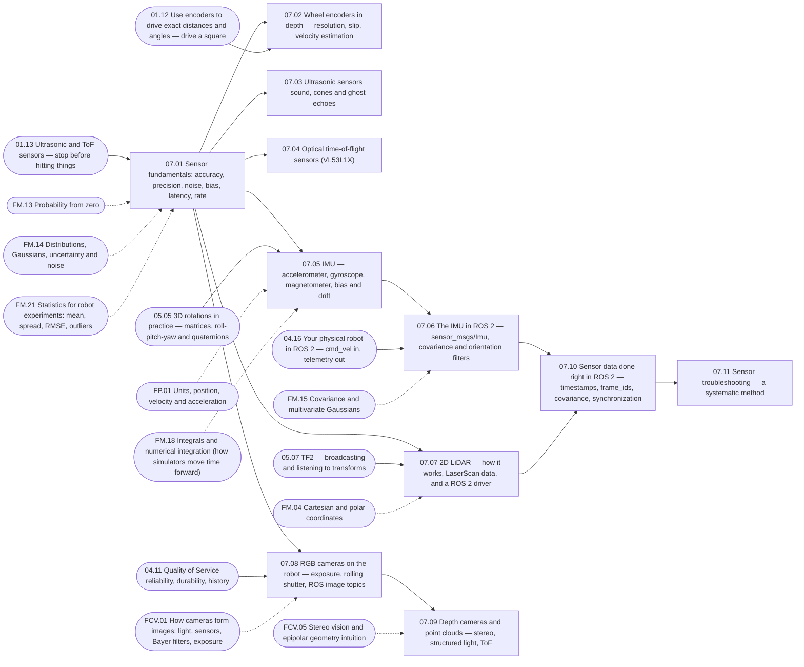

| Lesson | Requires | Optional | Unlocks |
|---|---|---|---|
| 07.01 Sensor fundamentals: accuracy, precision, noise, bias, latency, rate | 01.13 | FM.13, FM.14, FM.21 | 07.02, 07.03, 07.04, 07.05, 07.07, 07.08 |
| 07.02 Wheel encoders in depth — resolution, slip, velocity estimation | 07.01, 01.12 | — | 08.03 |
| 07.03 Ultrasonic sensors — sound, cones and ghost echoes | 07.01 | — | — |
| 07.04 Optical time-of-flight sensors (VL53L1X) | 07.01 | — | — |
| 07.05 IMU — accelerometer, gyroscope, magnetometer, bias and drift | 07.01, 05.05 | FP.01, FM.18 | 07.06, 08.11 |
| 07.06 The IMU in ROS 2 — sensor_msgs/Imu, covariance and orientation filters | 07.05, 04.16 | FM.15 | 07.10, 10.07 |
| 07.07 2D LiDAR — how it works, LaserScan data, and a ROS 2 driver | 07.01, 05.07 | FM.04 | 07.10, 10.08, 11.01 |
| 07.08 RGB cameras on the robot — exposure, rolling shutter, ROS image topics | 07.01, 04.11 | FCV.01 | 07.09, 13.15 |
| 07.09 Depth cameras and point clouds — stereo, structured light, ToF | 07.08 | FCV.05 | 11.08, 13.08 |
| 07.10 Sensor data done right in ROS 2 — timestamps, frame_ids, covariance, synchronization | 07.06, 07.07 | — | 07.11 |
| 07.11 Sensor troubleshooting — a systematic method | 07.10 | — | — |

## 08 · Control

```mermaid
flowchart LR
  n_08_01["08.01 Open loop vs closed loop — why your robot doesn't drive straight"]
  n_08_02["08.02 Measuring a motor — step response, deadband and time constant"]
  n_08_03["08.03 Estimating wheel speed from encoders — and filtering it"]
  n_08_04["08.04 Proportional control — hold a wheel speed"]
  n_08_05["08.05 Integral control — killing steady-state error (and integral windup)"]
  n_08_06["08.06 Derivative control — damping, noise and derivative kick"]
  n_08_07["08.07 PID mathematically — continuous, discrete, and what stability means"]
  n_08_08["08.08 Tuning PID systematically"]
  n_08_09["08.09 Feedforward + PID: drive at exactly 0.5 m/s"]
  n_08_10["08.10 Hold a straight line — cascaded heading control"]
  n_08_11["08.11 Rotate exactly 90° — motion profiles and IMU feedback"]
  n_08_12["08.12 Control in ROS 2 — where loops run, rates, limits and ros2_control"]
  n_01_12 --> n_08_01
  n_06_02 --> n_08_01
  n_FCT_01 -.-> n_08_01
  n_08_01 --> n_08_02
  n_03_07 --> n_08_02
  n_FCT_02 -.-> n_08_02
  n_08_02 --> n_08_03
  n_07_02 --> n_08_03
  n_FM_17 -.-> n_08_03
  n_08_03 --> n_08_04
  n_08_04 --> n_08_05
  n_FM_18 -.-> n_08_05
  n_08_05 --> n_08_06
  n_FM_17 -.-> n_08_06
  n_08_06 --> n_08_07
  n_FCT_03 -.-> n_08_07
  n_FCT_04 -.-> n_08_07
  n_FCT_05 -.-> n_08_07
  n_08_07 --> n_08_08
  n_08_08 --> n_08_09
  n_08_09 --> n_08_10
  n_08_10 --> n_08_11
  n_07_05 --> n_08_11
  n_08_09 --> n_08_12
  n_06_06 --> n_08_12
  n_FC_07 -.-> n_08_12
  n_01_12(["01.12 Use encoders to drive exact distances and angles — drive a square"])
  n_03_07(["03.07 Logging, telemetry and plotting what the robot did"])
  n_06_02(["06.02 The course mini-simulator — physics in 100 lines of Python"])
  n_06_06(["06.06 ros2_control — the same controllers in simulation and on the real robot"])
  n_07_02(["07.02 Wheel encoders in depth — resolution, slip, velocity estimation"])
  n_07_05(["07.05 IMU — accelerometer, gyroscope, magnetometer, bias and drift"])
  n_FM_17(["FM.17 Calculus for robots: derivatives, rates and partial derivatives"])
  n_FM_18(["FM.18 Integrals and numerical integration (how simulators move time forward)"])
  n_FC_07(["FC.07 Real-time concepts: determinism, latency, jitter and watchdogs"])
  n_FCT_01(["FCT.01 Systems, signals and feedback — block diagrams"])
  n_FCT_02(["FCT.02 First- and second-order systems"])
  n_FCT_03(["FCT.03 Differential equations just enough — simulate them numerically"])
  n_FCT_04(["FCT.04 Stability: poles without the pain"])
  n_FCT_05(["FCT.05 Discrete time: sampling rates, delay and aliasing"])
```

| Lesson | Requires | Optional | Unlocks |
|---|---|---|---|
| 08.01 Open loop vs closed loop — why your robot doesn't drive straight | 01.12, 06.02 | FCT.01 | 08.02, 19.01 |
| 08.02 Measuring a motor — step response, deadband and time constant | 08.01, 03.07 | FCT.02 | 08.03, 16.05 |
| 08.03 Estimating wheel speed from encoders — and filtering it | 08.02, 07.02 | FM.17 | 08.04 |
| 08.04 Proportional control — hold a wheel speed | 08.03 | — | 08.05 |
| 08.05 Integral control — killing steady-state error (and integral windup) | 08.04 | FM.18 | 08.06 |
| 08.06 Derivative control — damping, noise and derivative kick | 08.05 | FM.17 | 08.07 |
| 08.07 PID mathematically — continuous, discrete, and what stability means | 08.06 | FCT.03, FCT.04, FCT.05 | 08.08 |
| 08.08 Tuning PID systematically | 08.07 | — | 08.09 |
| 08.09 Feedforward + PID: drive at exactly 0.5 m/s | 08.08 | — | 08.10, 08.12 |
| 08.10 Hold a straight line — cascaded heading control | 08.09 | — | 08.11, P04 |
| 08.11 Rotate exactly 90° — motion profiles and IMU feedback | 08.10, 07.05 | — | P05 |
| 08.12 Control in ROS 2 — where loops run, rates, limits and ros2_control | 08.09, 06.06 | FC.07 | — |

## 09 · Odometry

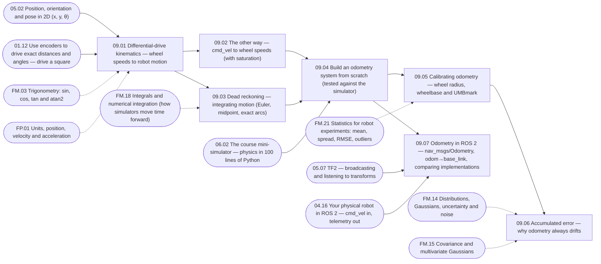

| Lesson | Requires | Optional | Unlocks |
|---|---|---|---|
| 09.01 Differential-drive kinematics — wheel speeds to robot motion | 05.02, 01.12 | FM.03, FP.01 | 09.02, 09.03 |
| 09.02 The other way — cmd_vel to wheel speeds (with saturation) | 09.01 | — | 09.04, 12.05 |
| 09.03 Dead reckoning — integrating motion (Euler, midpoint, exact arcs) | 09.01 | FM.18 | 09.04 |
| 09.04 Build an odometry system from scratch (tested against the simulator) | 09.02, 09.03, 06.02 | — | 09.05, 09.07, 10.06, P05 |
| 09.05 Calibrating odometry — wheel radius, wheelbase and UMBmark | 09.04 | FM.21 | 09.06 |
| 09.06 Accumulated error — why odometry always drifts | 09.05 | FM.14, FM.15 | 10.01 |
| 09.07 Odometry in ROS 2 — nav_msgs/Odometry, odom→base_link, comparing implementations | 09.04, 05.07, 04.16 | — | 10.07, 11.06, P08 |

## 10 · Localization

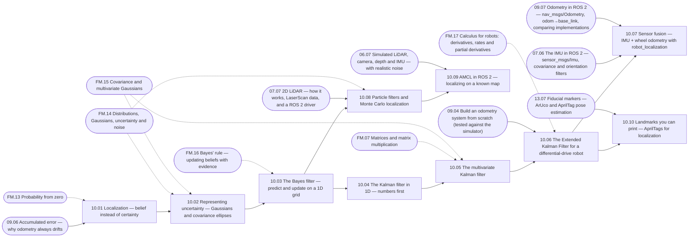

| Lesson | Requires | Optional | Unlocks |
|---|---|---|---|
| 10.01 Localization — belief instead of certainty | 09.06 | FM.13 | 10.02, 11.01 |
| 10.02 Representing uncertainty — Gaussians and covariance ellipses | 10.01 | FM.14, FM.15 | 10.03 |
| 10.03 The Bayes filter — predict and update on a 1D grid | 10.02 | FM.16 | 10.04, 10.08 |
| 10.04 The Kalman filter in 1D — numbers first | 10.03 | — | 10.05, 13.12 |
| 10.05 The multivariate Kalman filter | 10.04 | FM.07, FM.15 | 10.06 |
| 10.06 The Extended Kalman Filter for a differential-drive robot | 10.05, 09.04 | FM.17 | 10.07, 10.10, 11.03 |
| 10.07 Sensor fusion — IMU + wheel odometry with robot_localization | 10.06, 07.06, 09.07 | — | 11.07, P10 |
| 10.08 Particle filters and Monte Carlo localization | 10.03, 07.07 | FM.14 | 10.09 |
| 10.09 AMCL in ROS 2 — localizing on a known map | 10.08, 06.07 | — | 12.07, P10 |
| 10.10 Landmarks you can print — AprilTags for localization | 10.06, 13.07 | — | — |

## 11 · Mapping and SLAM

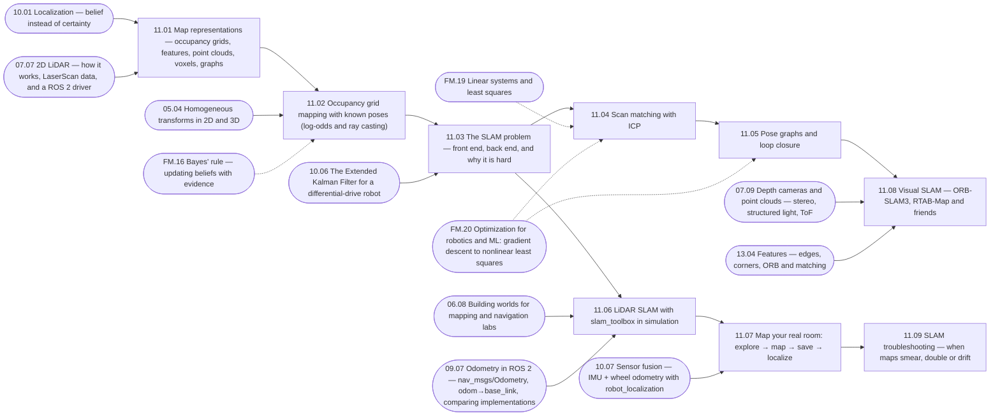

| Lesson | Requires | Optional | Unlocks |
|---|---|---|---|
| 11.01 Map representations — occupancy grids, features, point clouds, voxels, graphs | 10.01, 07.07 | — | 11.02, 12.01 |
| 11.02 Occupancy grid mapping with known poses (log-odds and ray casting) | 11.01, 05.04 | FM.16 | 11.03 |
| 11.03 The SLAM problem — front end, back end, and why it is hard | 11.02, 10.06 | — | 11.04, 11.06 |
| 11.04 Scan matching with ICP | 11.03 | FM.19, FM.20 | 11.05 |
| 11.05 Pose graphs and loop closure | 11.04 | FM.20 | 11.08 |
| 11.06 LiDAR SLAM with slam_toolbox in simulation | 11.03, 06.08, 09.07 | — | 11.07, 12.07 |
| 11.07 Map your real room: explore → map → save → localize | 11.06, 10.07 | — | 11.09, 12.08, P09 |
| 11.08 Visual SLAM — ORB-SLAM3, RTAB-Map and friends | 11.05, 07.09, 13.04 | — | — |
| 11.09 SLAM troubleshooting — when maps smear, double or drift | 11.07 | — | — |

## 12 · Navigation

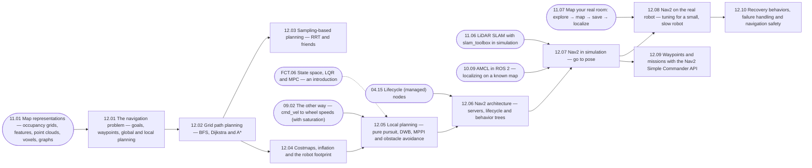

| Lesson | Requires | Optional | Unlocks |
|---|---|---|---|
| 12.01 The navigation problem — goals, waypoints, global and local planning | 11.01 | — | 12.02, 19.01 |
| 12.02 Grid path planning — BFS, Dijkstra and A* | 12.01 | — | 12.03, 12.04 |
| 12.03 Sampling-based planning — RRT and friends | 12.02 | — | 14.09 |
| 12.04 Costmaps, inflation and the robot footprint | 12.02 | — | 12.05 |
| 12.05 Local planning — pure pursuit, DWB, MPPI and obstacle avoidance | 12.04, 09.02 | FCT.06 | 12.06 |
| 12.06 Nav2 architecture — servers, lifecycle and behavior trees | 12.05, 04.15 | — | 12.07, 19.05 |
| 12.07 Nav2 in simulation — go to pose | 12.06, 10.09, 11.06 | — | 12.08, 12.09 |
| 12.08 Nav2 on the real robot — tuning for a small, slow robot | 12.07, 11.07 | — | 12.10 |
| 12.09 Waypoints and missions with the Nav2 Simple Commander API | 12.07 | — | 15.10, 19.03 |
| 12.10 Recovery behaviors, failure handling and navigation safety | 12.08 | — | 20.04, P11 |

## 13 · Computer vision

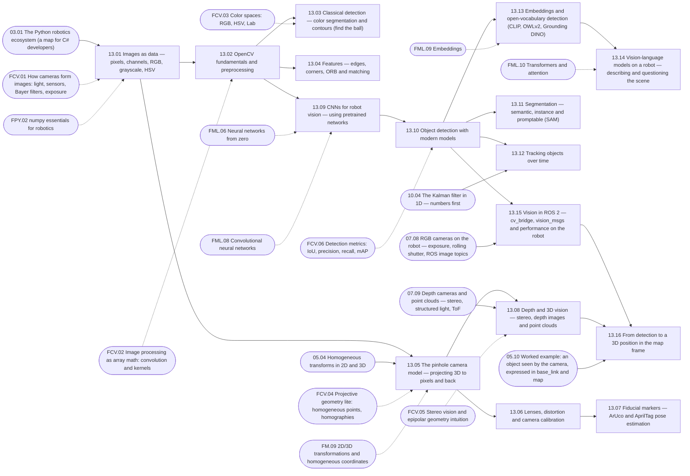

| Lesson | Requires | Optional | Unlocks |
|---|---|---|---|
| 13.01 Images as data — pixels, channels, RGB, grayscale, HSV | 03.01 | FCV.01, FPY.02 | 13.02, 13.05 |
| 13.02 OpenCV fundamentals and preprocessing | 13.01 | FCV.02 | 13.03, 13.04, 13.09 |
| 13.03 Classical detection — color segmentation and contours (find the ball) | 13.02 | FCV.03 | — |
| 13.04 Features — edges, corners, ORB and matching | 13.02 | — | 11.08 |
| 13.05 The pinhole camera model — projecting 3D to pixels and back | 13.01, 05.04 | FCV.04, FM.09 | 13.06, 13.08 |
| 13.06 Lenses, distortion and camera calibration | 13.05 | — | 13.07 |
| 13.07 Fiducial markers — ArUco and AprilTag pose estimation | 13.06 | — | 10.10, 15.03 |
| 13.08 Depth and 3D vision — stereo, depth images and point clouds | 13.05, 07.09 | FCV.05 | 13.16 |
| 13.09 CNNs for robot vision — using pretrained networks | 13.02 | FML.06, FML.08 | 13.10 |
| 13.10 Object detection with modern models | 13.09 | FCV.06 | 13.11, 13.12, 13.13, 13.15, 16.01 |
| 13.11 Segmentation — semantic, instance and promptable (SAM) | 13.10 | — | — |
| 13.12 Tracking objects over time | 13.10, 10.04 | — | — |
| 13.13 Embeddings and open-vocabulary detection (CLIP, OWLv2, Grounding DINO) | 13.10 | FML.09 | 13.14 |
| 13.14 Vision-language models on a robot — describing and questioning the scene | 13.13 | FML.10 | 18.07 |
| 13.15 Vision in ROS 2 — cv_bridge, vision_msgs and performance on the robot | 13.10, 07.08 | — | 13.16, P12 |
| 13.16 From detection to a 3D position in the map frame | 13.15, 13.08, 05.10 | — | 15.04, 19.07, P13 |

## 14 · The robotic arm

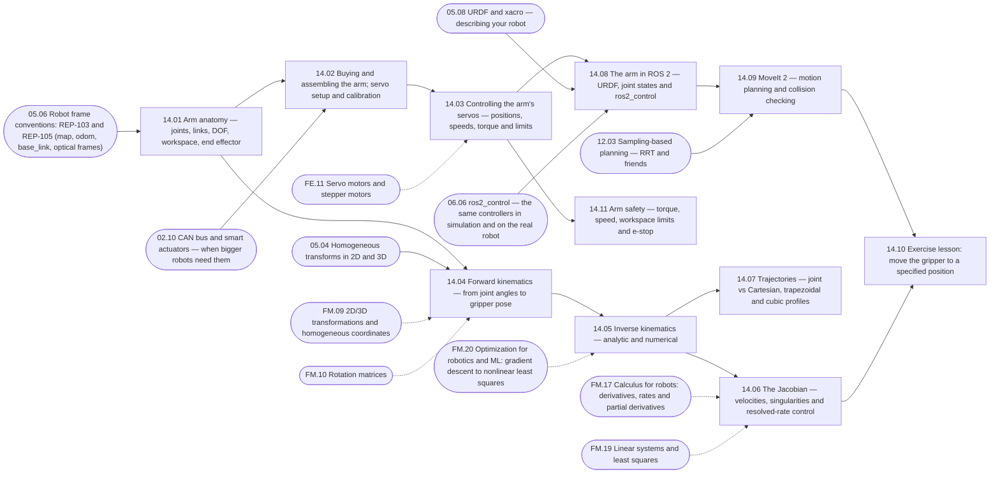

| Lesson | Requires | Optional | Unlocks |
|---|---|---|---|
| 14.01 Arm anatomy — joints, links, DOF, workspace, end effector | 05.06 | — | 14.02, 14.04, 15.01 |
| 14.02 Buying and assembling the arm; servo setup and calibration | 14.01, 02.10 | — | 14.03 |
| 14.03 Controlling the arm's servos — positions, speeds, torque and limits | 14.02 | FE.11 | 14.08, 14.11, 18.03 |
| 14.04 Forward kinematics — from joint angles to gripper pose | 14.01, 05.04 | FM.09, FM.10 | 14.05, 15.03 |
| 14.05 Inverse kinematics — analytic and numerical | 14.04 | FM.20 | 14.06, 14.07 |
| 14.06 The Jacobian — velocities, singularities and resolved-rate control | 14.05 | FM.17, FM.19 | 14.10, 15.06 |
| 14.07 Trajectories — joint vs Cartesian, trapezoidal and cubic profiles | 14.05 | — | — |
| 14.08 The arm in ROS 2 — URDF, joint states and ros2_control | 14.03, 05.08, 06.06 | — | 14.09 |
| 14.09 MoveIt 2 — motion planning and collision checking | 14.08, 12.03 | — | 14.10 |
| 14.10 Exercise lesson: move the gripper to a specified position | 14.09, 14.06 | — | 15.07, P14 |
| 14.11 Arm safety — torque, speed, workspace limits and e-stop | 14.03 | — | 20.04, P14 |

## 15 · Manipulation

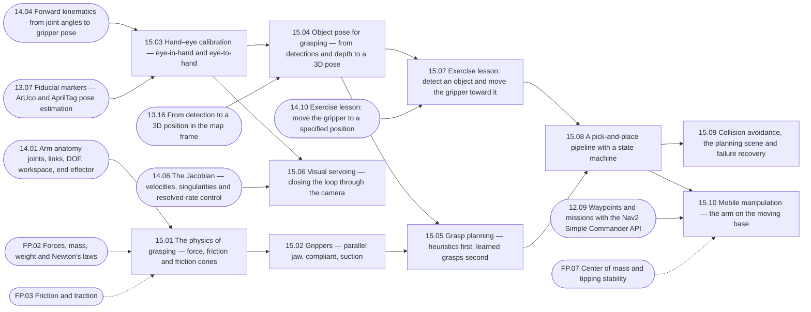

| Lesson | Requires | Optional | Unlocks |
|---|---|---|---|
| 15.01 The physics of grasping — force, friction and friction cones | 14.01 | FP.02, FP.03 | 15.02 |
| 15.02 Grippers — parallel jaw, compliant, suction | 15.01 | — | 15.05 |
| 15.03 Hand–eye calibration — eye-in-hand and eye-to-hand | 14.04, 13.07 | — | 15.04, 15.06 |
| 15.04 Object pose for grasping — from detections and depth to a 3D pose | 15.03, 13.16 | — | 15.05, 15.07 |
| 15.05 Grasp planning — heuristics first, learned grasps second | 15.04, 15.02 | — | 15.08 |
| 15.06 Visual servoing — closing the loop through the camera | 15.03, 14.06 | — | — |
| 15.07 Exercise lesson: detect an object and move the gripper toward it | 15.04, 14.10 | — | 15.08, P15 |
| 15.08 A pick-and-place pipeline with a state machine | 15.07, 15.05 | — | 15.09, 15.10 |
| 15.09 Collision avoidance, the planning scene and failure recovery | 15.08 | — | P16 |
| 15.10 Mobile manipulation — the arm on the moving base | 15.08, 12.09 | FP.07 | 20.01 |

## 16 · Machine learning for robots

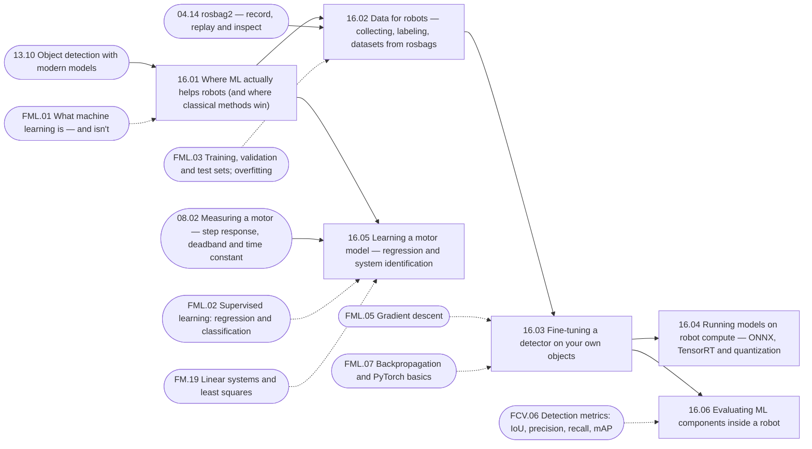

| Lesson | Requires | Optional | Unlocks |
|---|---|---|---|
| 16.01 Where ML actually helps robots (and where classical methods win) | 13.10 | FML.01 | 16.02, 16.05, 17.01, 18.01 |
| 16.02 Data for robots — collecting, labeling, datasets from rosbags | 16.01, 04.14 | FML.03 | 16.03 |
| 16.03 Fine-tuning a detector on your own objects | 16.02 | FML.05, FML.07 | 16.04, 16.06 |
| 16.04 Running models on robot compute — ONNX, TensorRT and quantization | 16.03 | — | — |
| 16.05 Learning a motor model — regression and system identification | 16.01, 08.02 | FML.02, FM.19 | — |
| 16.06 Evaluating ML components inside a robot | 16.03 | FCV.06 | — |

## 17 · Reinforcement learning

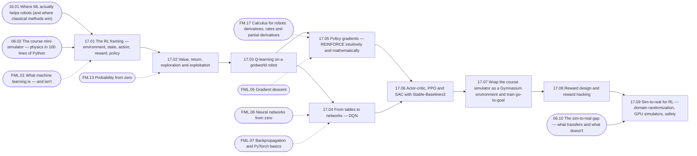

| Lesson | Requires | Optional | Unlocks |
|---|---|---|---|
| 17.01 The RL framing — environment, state, action, reward, policy | 16.01, 06.02 | FML.01 | 17.02 |
| 17.02 Value, return, exploration and exploitation | 17.01 | FM.13 | 17.03 |
| 17.03 Q-learning on a gridworld robot | 17.02 | — | 17.04, 17.05 |
| 17.04 From tables to networks — DQN | 17.03 | FML.06, FML.07 | 17.06 |
| 17.05 Policy gradients — REINFORCE intuitively and mathematically | 17.03 | FM.17, FML.05 | 17.06 |
| 17.06 Actor-critic, PPO and SAC with Stable-Baselines3 | 17.05, 17.04 | — | 17.07 |
| 17.07 Wrap the course simulator as a Gymnasium environment and train go-to-goal | 17.06 | — | 17.08 |
| 17.08 Reward design and reward hacking | 17.07 | — | 17.09 |
| 17.09 Sim-to-real for RL — domain randomization, GPU simulators, safety | 17.08, 06.10 | — | — |

## 18 · Modern embodied AI

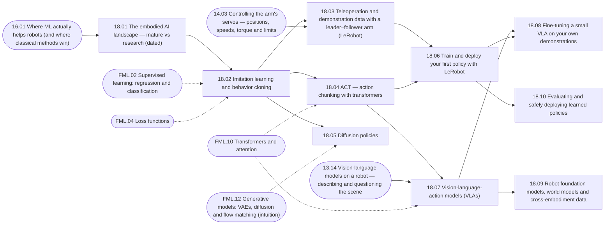

| Lesson | Requires | Optional | Unlocks |
|---|---|---|---|
| 18.01 The embodied AI landscape — mature vs research (dated) | 16.01 | — | 18.02 |
| 18.02 Imitation learning and behavior cloning | 18.01 | FML.02, FML.04 | 18.03, 18.04, 18.05 |
| 18.03 Teleoperation and demonstration data with a leader–follower arm (LeRobot) | 18.02, 14.03 | — | 18.06 |
| 18.04 ACT — action chunking with transformers | 18.02 | FML.10 | 18.06, 18.07 |
| 18.05 Diffusion policies | 18.02 | FML.12 | — |
| 18.06 Train and deploy your first policy with LeRobot | 18.03, 18.04 | — | 18.08, 18.10 |
| 18.07 Vision-language-action models (VLAs) | 18.04, 13.14 | FML.10 | 18.08, 18.09 |
| 18.08 Fine-tuning a small VLA on your own demonstrations | 18.07, 18.06 | — | — |
| 18.09 Robot foundation models, world models and cross-embodiment data | 18.07 | — | — |
| 18.10 Evaluating and safely deploying learned policies | 18.06 | — | — |

## 19 · LLMs and robot agents

```mermaid
flowchart LR
  n_19_01["19.01 Why the LLM should not drive the motors — the layered agent architecture"]
  n_19_02["19.02 Designing the robot's skill API — the tools an LLM may call"]
  n_19_03["19.03 Tool calling — an LLM operating the simulated robot"]
  n_19_04["19.04 State machines for robot tasks"]
  n_19_05["19.05 Behavior trees"]
  n_19_06["19.06 Task planning and decomposition — LLM plans, validated execution"]
  n_19_07["19.07 Perception–action loops — verifying every step"]
  n_19_08["19.08 Memory and the agent's world model — semantic maps and object memory"]
  n_19_09["19.09 Safety boundaries for LLM-controlled robots"]
  n_19_10["19.10 Exposing ROS 2 to agents — MCP servers and evaluation"]
  n_19_11["19.11 Talking to the robot — speech in, speech out"]
  n_12_01 --> n_19_01
  n_08_01 --> n_19_01
  n_19_01 --> n_19_02
  n_04_08 --> n_19_02
  n_19_02 --> n_19_03
  n_12_09 --> n_19_03
  n_19_01 --> n_19_04
  n_19_04 --> n_19_05
  n_12_06 --> n_19_05
  n_19_03 --> n_19_06
  n_19_05 --> n_19_06
  n_19_06 --> n_19_07
  n_13_16 --> n_19_07
  n_19_07 --> n_19_08
  n_19_06 --> n_19_09
  n_19_09 --> n_19_10
  n_19_03 --> n_19_11
  n_04_08(["04.08 Actions — long-running goals with feedback and cancellation"])
  n_08_01(["08.01 Open loop vs closed loop — why your robot doesn't drive straight"])
  n_12_01(["12.01 The navigation problem — goals, waypoints, global and local planning"])
  n_12_06(["12.06 Nav2 architecture — servers, lifecycle and behavior trees"])
  n_12_09(["12.09 Waypoints and missions with the Nav2 Simple Commander API"])
  n_13_16(["13.16 From detection to a 3D position in the map frame"])
```

| Lesson | Requires | Optional | Unlocks |
|---|---|---|---|
| 19.01 Why the LLM should not drive the motors — the layered agent architecture | 12.01, 08.01 | — | 19.02, 19.04 |
| 19.02 Designing the robot's skill API — the tools an LLM may call | 19.01, 04.08 | — | 19.03 |
| 19.03 Tool calling — an LLM operating the simulated robot | 19.02, 12.09 | — | 19.06, 19.11 |
| 19.04 State machines for robot tasks | 19.01 | — | 19.05 |
| 19.05 Behavior trees | 19.04, 12.06 | — | 19.06 |
| 19.06 Task planning and decomposition — LLM plans, validated execution | 19.03, 19.05 | — | 19.07, 19.09 |
| 19.07 Perception–action loops — verifying every step | 19.06, 13.16 | — | 19.08, 20.01 |
| 19.08 Memory and the agent's world model — semantic maps and object memory | 19.07 | — | — |
| 19.09 Safety boundaries for LLM-controlled robots | 19.06 | — | 19.10, 20.04, P17 |
| 19.10 Exposing ROS 2 to agents — MCP servers and evaluation | 19.09 | — | — |
| 19.11 Talking to the robot — speech in, speech out | 19.03 | — | — |

## 20 · The final robot — integration

```mermaid
flowchart LR
  n_20_01["20.01 Final robot system architecture"]
  n_20_02["20.02 Hardware integration — mounting, power v2, compute, cabling"]
  n_20_03["20.03 Software integration — bringup, health monitoring and diagnostics"]
  n_20_04["20.04 The safety case — e-stop, watchdogs, safe shutdown and test procedures"]
  n_20_05["20.05 Testing the whole robot — sim scenarios, field tests, regressions"]
  n_20_06["20.06 The demo — and where to go next"]
  n_19_07 --> n_20_01
  n_15_10 --> n_20_01
  n_20_01 --> n_20_02
  n_02_08 --> n_20_02
  n_FP_07 -.-> n_20_02
  n_F3D_05 -.-> n_20_02
  n_20_01 --> n_20_03
  n_20_02 --> n_20_04
  n_20_03 --> n_20_04
  n_19_09 --> n_20_04
  n_14_11 --> n_20_04
  n_12_10 --> n_20_04
  n_20_03 --> n_20_05
  n_03_08 --> n_20_05
  n_20_04 --> n_20_06
  n_20_05 --> n_20_06
  n_02_08(["02.08 From breadboard to a soldered robot board"])
  n_03_08(["03.08 Testing robot software — unit, simulation and hardware-in-the-loop"])
  n_12_10(["12.10 Recovery behaviors, failure handling and navigation safety"])
  n_14_11(["14.11 Arm safety — torque, speed, workspace limits and e-stop"])
  n_15_10(["15.10 Mobile manipulation — the arm on the moving base"])
  n_19_07(["19.07 Perception–action loops — verifying every step"])
  n_19_09(["19.09 Safety boundaries for LLM-controlled robots"])
  n_FP_07(["FP.07 Center of mass and tipping stability"])
  n_F3D_05(["F3D.05 Exercise: design a sensor mounting bracket"])
```

| Lesson | Requires | Optional | Unlocks |
|---|---|---|---|
| 20.01 Final robot system architecture | 19.07, 15.10 | — | 20.02, 20.03 |
| 20.02 Hardware integration — mounting, power v2, compute, cabling | 20.01, 02.08 | FP.07, F3D.05 | 20.04 |
| 20.03 Software integration — bringup, health monitoring and diagnostics | 20.01 | — | 20.04, 20.05 |
| 20.04 The safety case — e-stop, watchdogs, safe shutdown and test procedures | 20.02, 20.03, 19.09, 14.11, 12.10 | — | 20.06 |
| 20.05 Testing the whole robot — sim scenarios, field tests, regressions | 20.03, 03.08 | — | 20.06 |
| 20.06 The demo — and where to go next | 20.04, 20.05 | — | P18 |

## FM · Foundations: mathematics

```mermaid
flowchart LR
  n_FM_01["FM.01 Algebra refresher for robotics formulas"]
  n_FM_02["FM.02 Angles"]
  n_FM_03["FM.03 Trigonometry: sin, cos, tan and atan2"]
  n_FM_04["FM.04 Cartesian and polar coordinates"]
  n_FM_05["FM.05 Vectors from zero"]
  n_FM_06["FM.06 Dot product and cross product"]
  n_FM_07["FM.07 Matrices and matrix multiplication"]
  n_FM_08["FM.08 Matrices as transformations and basis vectors"]
  n_FM_09["FM.09 2D/3D transformations and homogeneous coordinates"]
  n_FM_10["FM.10 Rotation matrices"]
  n_FM_11["FM.11 Euler angles"]
  n_FM_12["FM.12 Quaternions without the mysticism"]
  n_FM_13["FM.13 Probability from zero"]
  n_FM_14["FM.14 Distributions, Gaussians, uncertainty and noise"]
  n_FM_15["FM.15 Covariance and multivariate Gaussians"]
  n_FM_16["FM.16 Bayes' rule — updating beliefs with evidence"]
  n_FM_17["FM.17 Calculus for robots: derivatives, rates and partial derivatives"]
  n_FM_18["FM.18 Integrals and numerical integration (how simulators move time forward)"]
  n_FM_19["FM.19 Linear systems and least squares"]
  n_FM_20["FM.20 Optimization for robotics and ML: gradient descent to nonlinear least squares"]
  n_FM_21["FM.21 Statistics for robot experiments: mean, spread, RMSE, outliers"]
  n_FM_02 --> n_FM_03
  n_FM_03 --> n_FM_04
  n_FM_04 --> n_FM_05
  n_FM_05 --> n_FM_06
  n_FM_05 --> n_FM_07
  n_FM_07 --> n_FM_08
  n_FM_06 --> n_FM_08
  n_FM_08 --> n_FM_09
  n_FM_08 --> n_FM_10
  n_FM_03 --> n_FM_10
  n_FM_10 --> n_FM_11
  n_FM_11 --> n_FM_12
  n_FM_13 --> n_FM_14
  n_FM_14 --> n_FM_15
  n_FM_07 --> n_FM_15
  n_FM_13 --> n_FM_16
  n_FM_01 --> n_FM_17
  n_FM_17 --> n_FM_18
  n_FM_07 --> n_FM_19
  n_FM_19 --> n_FM_20
  n_FM_17 --> n_FM_20
  n_FM_14 --> n_FM_21
```

| Lesson | Requires | Optional | Unlocks |
|---|---|---|---|
| FM.01 Algebra refresher for robotics formulas | — | — | FM.17 |
| FM.02 Angles | — | — | FM.03 |
| FM.03 Trigonometry: sin, cos, tan and atan2 | FM.02 | — | FM.04, FM.10 |
| FM.04 Cartesian and polar coordinates | FM.03 | — | FM.05 |
| FM.05 Vectors from zero | FM.04 | — | FM.06, FM.07 |
| FM.06 Dot product and cross product | FM.05 | — | FM.08 |
| FM.07 Matrices and matrix multiplication | FM.05 | — | FM.08, FM.15, FM.19 |
| FM.08 Matrices as transformations and basis vectors | FM.07, FM.06 | — | FM.09, FM.10 |
| FM.09 2D/3D transformations and homogeneous coordinates | FM.08 | — | — |
| FM.10 Rotation matrices | FM.08, FM.03 | — | FM.11 |
| FM.11 Euler angles | FM.10 | — | FM.12 |
| FM.12 Quaternions without the mysticism | FM.11 | — | — |
| FM.13 Probability from zero | — | — | FM.14, FM.16 |
| FM.14 Distributions, Gaussians, uncertainty and noise | FM.13 | — | FM.15, FM.21 |
| FM.15 Covariance and multivariate Gaussians | FM.14, FM.07 | — | — |
| FM.16 Bayes' rule — updating beliefs with evidence | FM.13 | — | — |
| FM.17 Calculus for robots: derivatives, rates and partial derivatives | FM.01 | — | FM.18, FM.20 |
| FM.18 Integrals and numerical integration (how simulators move time forward) | FM.17 | — | — |
| FM.19 Linear systems and least squares | FM.07 | — | FM.20 |
| FM.20 Optimization for robotics and ML: gradient descent to nonlinear least squares | FM.19, FM.17 | — | — |
| FM.21 Statistics for robot experiments: mean, spread, RMSE, outliers | FM.14 | — | — |

## FE · Foundations: electronics

```mermaid
flowchart LR
  n_FE_01["FE.01 Voltage, current, resistance and power"]
  n_FE_02["FE.02 Ohm's law, series and parallel, voltage dividers"]
  n_FE_03["FE.03 Using a multimeter safely"]
  n_FE_04["FE.04 Breadboards, jumpers and connectors"]
  n_FE_05["FE.05 Digital vs analog signals and GPIO"]
  n_FE_06["FE.06 Pull-up and pull-down resistors (and why inputs float)"]
  n_FE_07["FE.07 PWM — pulse-width modulation"]
  n_FE_08["FE.08 ADC — reading analog voltages"]
  n_FE_09["FE.09 Serial buses: UART, I²C and SPI"]
  n_FE_10["FE.10 DC motors: brushed vs brushless, gearboxes, stall current"]
  n_FE_11["FE.11 Servo motors and stepper motors"]
  n_FE_12["FE.12 H-bridges and motor drivers"]
  n_FE_13["FE.13 Batteries: chemistry, voltage, capacity, C-rating"]
  n_FE_14["FE.14 Li-ion and LiPo safety and charging"]
  n_FE_15["FE.15 Voltage regulators: linear, buck and boost"]
  n_FE_16["FE.16 Ground, common ground and why it matters"]
  n_FE_17["FE.17 Soldering from zero"]
  n_FE_18["FE.18 Capacitors, diodes and flyback protection — just enough"]
  n_FE_19["FE.19 CAN bus concepts"]
  n_FE_01 --> n_FE_02
  n_FE_02 --> n_FE_03
  n_FE_01 --> n_FE_04
  n_FE_02 --> n_FE_05
  n_FE_05 --> n_FE_06
  n_FE_05 --> n_FE_07
  n_FE_05 --> n_FE_08
  n_FE_02 --> n_FE_08
  n_FE_06 --> n_FE_09
  n_FE_01 --> n_FE_10
  n_FP_04 -.-> n_FE_10
  n_FE_07 --> n_FE_11
  n_FE_10 --> n_FE_11
  n_FE_10 --> n_FE_12
  n_FE_07 --> n_FE_12
  n_FE_01 --> n_FE_13
  n_FE_13 --> n_FE_14
  n_FE_02 --> n_FE_15
  n_FE_02 --> n_FE_16
  n_FE_04 --> n_FE_17
  n_FE_02 --> n_FE_18
  n_FE_09 --> n_FE_19
  n_FP_04(["FP.04 Torque, gears and wheels — sizing motors"])
```

| Lesson | Requires | Optional | Unlocks |
|---|---|---|---|
| FE.01 Voltage, current, resistance and power | — | — | FE.02, FE.04, FE.10, FE.13 |
| FE.02 Ohm's law, series and parallel, voltage dividers | FE.01 | — | FE.03, FE.05, FE.08, FE.15, FE.16, FE.18 |
| FE.03 Using a multimeter safely | FE.02 | — | — |
| FE.04 Breadboards, jumpers and connectors | FE.01 | — | FE.17 |
| FE.05 Digital vs analog signals and GPIO | FE.02 | — | FE.06, FE.07, FE.08 |
| FE.06 Pull-up and pull-down resistors (and why inputs float) | FE.05 | — | FE.09 |
| FE.07 PWM — pulse-width modulation | FE.05 | — | FE.11, FE.12 |
| FE.08 ADC — reading analog voltages | FE.05, FE.02 | — | — |
| FE.09 Serial buses: UART, I²C and SPI | FE.06 | — | FE.19 |
| FE.10 DC motors: brushed vs brushless, gearboxes, stall current | FE.01 | FP.04 | FE.11, FE.12 |
| FE.11 Servo motors and stepper motors | FE.07, FE.10 | — | — |
| FE.12 H-bridges and motor drivers | FE.10, FE.07 | — | — |
| FE.13 Batteries: chemistry, voltage, capacity, C-rating | FE.01 | — | FE.14 |
| FE.14 Li-ion and LiPo safety and charging | FE.13 | — | — |
| FE.15 Voltage regulators: linear, buck and boost | FE.02 | — | — |
| FE.16 Ground, common ground and why it matters | FE.02 | — | — |
| FE.17 Soldering from zero | FE.04 | — | — |
| FE.18 Capacitors, diodes and flyback protection — just enough | FE.02 | — | — |
| FE.19 CAN bus concepts | FE.09 | — | — |

## FP · Foundations: physics

```mermaid
flowchart LR
  n_FP_01["FP.01 Units, position, velocity and acceleration"]
  n_FP_02["FP.02 Forces, mass, weight and Newton's laws"]
  n_FP_03["FP.03 Friction and traction"]
  n_FP_04["FP.04 Torque, gears and wheels — sizing motors"]
  n_FP_05["FP.05 Energy, power and efficiency — how long will the battery last?"]
  n_FP_06["FP.06 Rotational motion and moment of inertia"]
  n_FP_07["FP.07 Center of mass and tipping stability"]
  n_FM_17 -.-> n_FP_01
  n_FP_01 --> n_FP_02
  n_FM_05 -.-> n_FP_02
  n_FP_02 --> n_FP_03
  n_FP_02 --> n_FP_04
  n_FM_06 -.-> n_FP_04
  n_FP_04 --> n_FP_05
  n_FE_01 -.-> n_FP_05
  n_FP_04 --> n_FP_06
  n_FP_02 --> n_FP_07
  n_FM_05(["FM.05 Vectors from zero"])
  n_FM_06(["FM.06 Dot product and cross product"])
  n_FM_17(["FM.17 Calculus for robots: derivatives, rates and partial derivatives"])
  n_FE_01(["FE.01 Voltage, current, resistance and power"])
```

| Lesson | Requires | Optional | Unlocks |
|---|---|---|---|
| FP.01 Units, position, velocity and acceleration | — | FM.17 | FP.02 |
| FP.02 Forces, mass, weight and Newton's laws | FP.01 | FM.05 | FP.03, FP.04, FP.07 |
| FP.03 Friction and traction | FP.02 | — | — |
| FP.04 Torque, gears and wheels — sizing motors | FP.02 | FM.06 | FP.05, FP.06 |
| FP.05 Energy, power and efficiency — how long will the battery last? | FP.04 | FE.01 | — |
| FP.06 Rotational motion and moment of inertia | FP.04 | — | — |
| FP.07 Center of mass and tipping stability | FP.02 | — | — |

## FL · Foundations: Linux and the development environment

```mermaid
flowchart LR
  n_FL_01["FL.01 Why Linux runs robots — Ubuntu versions and LTS"]
  n_FL_02["FL.02 Getting Ubuntu: dual boot, VM or WSL2"]
  n_FL_03["FL.03 The shell for Windows developers"]
  n_FL_04["FL.04 The Linux filesystem and paths"]
  n_FL_05["FL.05 Permissions, users, groups and sudo (dialout, gpio, video)"]
  n_FL_06["FL.06 Processes, signals and systemd services"]
  n_FL_07["FL.07 Package management: apt, keys and repositories"]
  n_FL_08["FL.08 SSH and remote development"]
  n_FL_09["FL.09 Networking basics: IP, Wi-Fi, ports, mDNS, ping"]
  n_FL_10["FL.10 Python environments on Ubuntu: apt, venv, uv and PEP 668"]
  n_FL_11["FL.11 Git for robotics: large files, bags and models"]
  n_FL_12["FL.12 Docker for robotics: devices, GUIs and host networking"]
  n_FL_13["FL.13 Working headless: tmux and resilient remote sessions"]
  n_FL_01 --> n_FL_02
  n_FL_02 --> n_FL_03
  n_FL_03 --> n_FL_04
  n_FL_04 --> n_FL_05
  n_FL_03 --> n_FL_06
  n_FL_03 --> n_FL_07
  n_FL_03 --> n_FL_08
  n_FL_03 --> n_FL_09
  n_FL_07 --> n_FL_10
  n_FL_03 --> n_FL_11
  n_FL_06 --> n_FL_12
  n_FL_08 --> n_FL_13
```

| Lesson | Requires | Optional | Unlocks |
|---|---|---|---|
| FL.01 Why Linux runs robots — Ubuntu versions and LTS | — | — | FL.02 |
| FL.02 Getting Ubuntu: dual boot, VM or WSL2 | FL.01 | — | FL.03 |
| FL.03 The shell for Windows developers | FL.02 | — | FL.04, FL.06, FL.07, FL.08, FL.09, FL.11 |
| FL.04 The Linux filesystem and paths | FL.03 | — | FL.05 |
| FL.05 Permissions, users, groups and sudo (dialout, gpio, video) | FL.04 | — | — |
| FL.06 Processes, signals and systemd services | FL.03 | — | FL.12 |
| FL.07 Package management: apt, keys and repositories | FL.03 | — | FL.10 |
| FL.08 SSH and remote development | FL.03 | — | FL.13 |
| FL.09 Networking basics: IP, Wi-Fi, ports, mDNS, ping | FL.03 | — | — |
| FL.10 Python environments on Ubuntu: apt, venv, uv and PEP 668 | FL.07 | — | — |
| FL.11 Git for robotics: large files, bags and models | FL.03 | — | — |
| FL.12 Docker for robotics: devices, GUIs and host networking | FL.06 | — | — |
| FL.13 Working headless: tmux and resilient remote sessions | FL.08 | — | — |

## FPY · Foundations: Python for C# developers

```mermaid
flowchart LR
  n_FPY_01["FPY.01 Python for C# developers — the fast tour"]
  n_FPY_02["FPY.02 numpy essentials for robotics"]
  n_FPY_03["FPY.03 Plotting robot data with matplotlib"]
  n_FPY_04["FPY.04 Typing, dataclasses, protocols and packaging"]
  n_FPY_05["FPY.05 asyncio for people who know async/await in C#"]
  n_FPY_06["FPY.06 Python performance: vectorization, profiling and when to leave Python"]
  n_FPY_01 --> n_FPY_02
  n_FPY_02 --> n_FPY_03
  n_FPY_01 --> n_FPY_04
  n_FPY_01 --> n_FPY_05
  n_FPY_02 --> n_FPY_06
```

| Lesson | Requires | Optional | Unlocks |
|---|---|---|---|
| FPY.01 Python for C# developers — the fast tour | — | — | FPY.02, FPY.04, FPY.05 |
| FPY.02 numpy essentials for robotics | FPY.01 | — | FPY.03, FPY.06 |
| FPY.03 Plotting robot data with matplotlib | FPY.02 | — | — |
| FPY.04 Typing, dataclasses, protocols and packaging | FPY.01 | — | — |
| FPY.05 asyncio for people who know async/await in C# | FPY.01 | — | — |
| FPY.06 Python performance: vectorization, profiling and when to leave Python | FPY.02 | — | — |

## FC · Foundations: embedded systems and C/C++

```mermaid
flowchart LR
  n_FC_01["FC.01 Embedded systems 101 — life without an operating system"]
  n_FC_02["FC.02 MicroPython on the Raspberry Pi Pico"]
  n_FC_03["FC.03 C++ for C# developers: memory, RAII, headers, templates"]
  n_FC_04["FC.04 Building C++ with CMake"]
  n_FC_05["FC.05 Interrupts, timers and the Pico's PIO"]
  n_FC_06["FC.06 Moving firmware to C/C++ — the Pico SDK"]
  n_FC_07["FC.07 Real-time concepts: determinism, latency, jitter and watchdogs"]
  n_FC_08["FC.08 micro-ROS: ROS 2 on microcontrollers"]
  n_FC_01 --> n_FC_02
  n_FPY_01 -.-> n_FC_02
  n_FC_03 --> n_FC_04
  n_FC_02 --> n_FC_05
  n_FC_04 --> n_FC_06
  n_FC_05 --> n_FC_06
  n_FC_01 --> n_FC_07
  n_FC_06 --> n_FC_08
  n_FPY_01(["FPY.01 Python for C# developers — the fast tour"])
```

| Lesson | Requires | Optional | Unlocks |
|---|---|---|---|
| FC.01 Embedded systems 101 — life without an operating system | — | — | FC.02, FC.07 |
| FC.02 MicroPython on the Raspberry Pi Pico | FC.01 | FPY.01 | FC.05 |
| FC.03 C++ for C# developers: memory, RAII, headers, templates | — | — | FC.04 |
| FC.04 Building C++ with CMake | FC.03 | — | FC.06 |
| FC.05 Interrupts, timers and the Pico's PIO | FC.02 | — | FC.06 |
| FC.06 Moving firmware to C/C++ — the Pico SDK | FC.04, FC.05 | — | FC.08 |
| FC.07 Real-time concepts: determinism, latency, jitter and watchdogs | FC.01 | — | — |
| FC.08 micro-ROS: ROS 2 on microcontrollers | FC.06 | — | — |

## FCT · Foundations: control theory

```mermaid
flowchart LR
  n_FCT_01["FCT.01 Systems, signals and feedback — block diagrams"]
  n_FCT_02["FCT.02 First- and second-order systems"]
  n_FCT_03["FCT.03 Differential equations just enough — simulate them numerically"]
  n_FCT_04["FCT.04 Stability: poles without the pain"]
  n_FCT_05["FCT.05 Discrete time: sampling rates, delay and aliasing"]
  n_FCT_06["FCT.06 State space, LQR and MPC — an introduction"]
  n_FCT_01 --> n_FCT_02
  n_FM_17 -.-> n_FCT_02
  n_FCT_02 --> n_FCT_03
  n_FM_18 -.-> n_FCT_03
  n_FCT_03 --> n_FCT_04
  n_FCT_01 --> n_FCT_05
  n_FCT_04 --> n_FCT_06
  n_FM_20 -.-> n_FCT_06
  n_FM_17(["FM.17 Calculus for robots: derivatives, rates and partial derivatives"])
  n_FM_18(["FM.18 Integrals and numerical integration (how simulators move time forward)"])
  n_FM_20(["FM.20 Optimization for robotics and ML: gradient descent to nonlinear least squares"])
```

| Lesson | Requires | Optional | Unlocks |
|---|---|---|---|
| FCT.01 Systems, signals and feedback — block diagrams | — | — | FCT.02, FCT.05 |
| FCT.02 First- and second-order systems | FCT.01 | FM.17 | FCT.03 |
| FCT.03 Differential equations just enough — simulate them numerically | FCT.02 | FM.18 | FCT.04 |
| FCT.04 Stability: poles without the pain | FCT.03 | — | FCT.06 |
| FCT.05 Discrete time: sampling rates, delay and aliasing | FCT.01 | — | — |
| FCT.06 State space, LQR and MPC — an introduction | FCT.04 | FM.20 | — |

## FML · Foundations: machine learning

```mermaid
flowchart LR
  n_FML_01["FML.01 What machine learning is — and isn't"]
  n_FML_02["FML.02 Supervised learning: regression and classification"]
  n_FML_03["FML.03 Training, validation and test sets; overfitting"]
  n_FML_04["FML.04 Loss functions"]
  n_FML_05["FML.05 Gradient descent"]
  n_FML_06["FML.06 Neural networks from zero"]
  n_FML_07["FML.07 Backpropagation and PyTorch basics"]
  n_FML_08["FML.08 Convolutional neural networks"]
  n_FML_09["FML.09 Embeddings"]
  n_FML_10["FML.10 Transformers and attention"]
  n_FML_11["FML.11 Unsupervised learning: clustering, PCA, autoencoders"]
  n_FML_12["FML.12 Generative models: VAEs, diffusion and flow matching (intuition)"]
  n_FML_01 --> n_FML_02
  n_FM_19 -.-> n_FML_02
  n_FML_02 --> n_FML_03
  n_FML_02 --> n_FML_04
  n_FML_04 --> n_FML_05
  n_FM_17 -.-> n_FML_05
  n_FML_05 --> n_FML_06
  n_FM_07 -.-> n_FML_06
  n_FML_06 --> n_FML_07
  n_FML_07 --> n_FML_08
  n_FCV_02 -.-> n_FML_08
  n_FML_06 --> n_FML_09
  n_FM_06 -.-> n_FML_09
  n_FML_09 --> n_FML_10
  n_FML_06 --> n_FML_11
  n_FM_19 -.-> n_FML_11
  n_FML_10 --> n_FML_12
  n_FML_11 --> n_FML_12
  n_FM_14 -.-> n_FML_12
  n_FM_06(["FM.06 Dot product and cross product"])
  n_FM_07(["FM.07 Matrices and matrix multiplication"])
  n_FM_14(["FM.14 Distributions, Gaussians, uncertainty and noise"])
  n_FM_17(["FM.17 Calculus for robots: derivatives, rates and partial derivatives"])
  n_FM_19(["FM.19 Linear systems and least squares"])
  n_FCV_02(["FCV.02 Image processing as array math: convolution and kernels"])
```

| Lesson | Requires | Optional | Unlocks |
|---|---|---|---|
| FML.01 What machine learning is — and isn't | — | — | FML.02 |
| FML.02 Supervised learning: regression and classification | FML.01 | FM.19 | FML.03, FML.04 |
| FML.03 Training, validation and test sets; overfitting | FML.02 | — | — |
| FML.04 Loss functions | FML.02 | — | FML.05 |
| FML.05 Gradient descent | FML.04 | FM.17 | FML.06 |
| FML.06 Neural networks from zero | FML.05 | FM.07 | FML.07, FML.09, FML.11 |
| FML.07 Backpropagation and PyTorch basics | FML.06 | — | FML.08 |
| FML.08 Convolutional neural networks | FML.07 | FCV.02 | — |
| FML.09 Embeddings | FML.06 | FM.06 | FML.10 |
| FML.10 Transformers and attention | FML.09 | — | FML.12 |
| FML.11 Unsupervised learning: clustering, PCA, autoencoders | FML.06 | FM.19 | FML.12 |
| FML.12 Generative models: VAEs, diffusion and flow matching (intuition) | FML.10, FML.11 | FM.14 | — |

## FCV · Foundations: computer vision

```mermaid
flowchart LR
  n_FCV_01["FCV.01 How cameras form images: light, sensors, Bayer filters, exposure"]
  n_FCV_02["FCV.02 Image processing as array math: convolution and kernels"]
  n_FCV_03["FCV.03 Color spaces: RGB, HSV, Lab"]
  n_FCV_04["FCV.04 Projective geometry lite: homogeneous points, homographies"]
  n_FCV_05["FCV.05 Stereo vision and epipolar geometry intuition"]
  n_FCV_06["FCV.06 Detection metrics: IoU, precision, recall, mAP"]
  n_FCV_01 --> n_FCV_02
  n_FPY_02 -.-> n_FCV_02
  n_FCV_01 --> n_FCV_03
  n_FCV_02 --> n_FCV_04
  n_FM_09 -.-> n_FCV_04
  n_FCV_04 --> n_FCV_05
  n_FM_09(["FM.09 2D/3D transformations and homogeneous coordinates"])
  n_FPY_02(["FPY.02 numpy essentials for robotics"])
```

| Lesson | Requires | Optional | Unlocks |
|---|---|---|---|
| FCV.01 How cameras form images: light, sensors, Bayer filters, exposure | — | — | FCV.02, FCV.03 |
| FCV.02 Image processing as array math: convolution and kernels | FCV.01 | FPY.02 | FCV.04 |
| FCV.03 Color spaces: RGB, HSV, Lab | FCV.01 | — | — |
| FCV.04 Projective geometry lite: homogeneous points, homographies | FCV.02 | FM.09 | FCV.05 |
| FCV.05 Stereo vision and epipolar geometry intuition | FCV.04 | — | — |
| FCV.06 Detection metrics: IoU, precision, recall, mAP | — | — | — |

## F3D · Foundations: 3D printing and CAD

```mermaid
flowchart LR
  n_F3D_01["F3D.01 Why 3D printing matters in robotics — and when to buy a printer"]
  n_F3D_02["F3D.02 CAD basics with Onshape or FreeCAD"]
  n_F3D_03["F3D.03 STL, 3MF, STEP and slicers"]
  n_F3D_04["F3D.04 Tolerances, clearances and fits"]
  n_F3D_05["F3D.05 Exercise: design a sensor mounting bracket"]
  n_F3D_06["F3D.06 Gears, heat-set inserts and fasteners"]
  n_F3D_07["F3D.07 Materials, chassis parts and ordering prints in Israel"]
  n_F3D_01 --> n_F3D_02
  n_F3D_02 --> n_F3D_03
  n_F3D_03 --> n_F3D_04
  n_F3D_04 --> n_F3D_05
  n_F3D_04 --> n_F3D_06
  n_FP_04 -.-> n_F3D_06
  n_F3D_03 --> n_F3D_07
  n_FP_04(["FP.04 Torque, gears and wheels — sizing motors"])
```

| Lesson | Requires | Optional | Unlocks |
|---|---|---|---|
| F3D.01 Why 3D printing matters in robotics — and when to buy a printer | — | — | F3D.02 |
| F3D.02 CAD basics with Onshape or FreeCAD | F3D.01 | — | F3D.03 |
| F3D.03 STL, 3MF, STEP and slicers | F3D.02 | — | F3D.04, F3D.07 |
| F3D.04 Tolerances, clearances and fits | F3D.03 | — | F3D.05, F3D.06 |
| F3D.05 Exercise: design a sensor mounting bracket | F3D.04 | — | — |
| F3D.06 Gears, heat-set inserts and fasteners | F3D.04 | FP.04 | — |
| F3D.07 Materials, chassis parts and ordering prints in Israel | F3D.03 | — | — |

