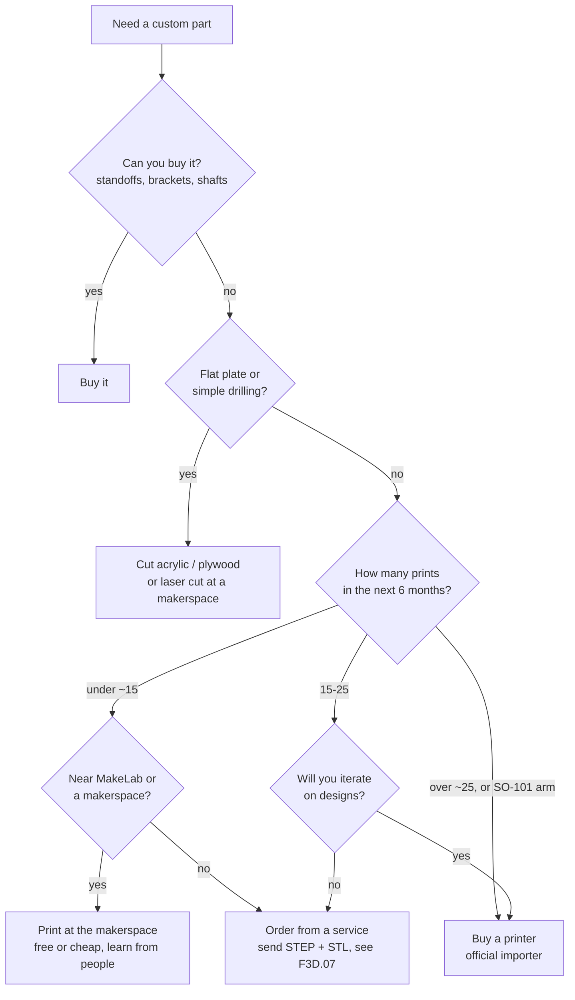

# F3D.01 — Why 3D printing matters in robotics — and when to buy a printer

<!-- glance:start -->
<!-- generated by tools/build.py from curriculum/syllabus.yaml — edit the syllabus, not this block -->

| | |
|---|---|
| **Track** | Optional foundation |
| **Difficulty** | Beginner |
| **Time** | 30 min |
| **Hardware** | none |
| **Software** | none |
| **Prerequisites** | none |
| **Version-sensitive** | yes — see [curriculum/versions.yaml](../../curriculum/versions.yaml) |
| **Skip if** | You already print robot parts. |

<!-- glance:end -->

## What you will learn

- Say which robot parts should be printed, which should be bought, and which should be neither.
- Estimate the cost of a printed part from its filament grams, and compare it with a quote from an Israeli print service.
- Work out the break-even point between buying a printer and ordering prints, including the revisions a real part needs.
- Pick a sensible first step for your situation: MakeLab or a makerspace, a local service, or a printer from an official importer.
- Explain why the Stage 5 SO-101 arm is the point where a home printer usually starts paying for itself.

## Why it matters

A robot is mostly brackets. The motors, sensors and boards you buy are standard, but the parts that hold them in the right place at the right height and angle are specific to *your* robot. Karmel's front ToF sensor has to sit 95 mm above the floor, the LiDAR has to clear everything around it, the camera needs a fixed and known pose, and the battery must not slide around. Nobody sells those parts for your chassis. You can drill acrylic, bend aluminium or use cable ties, or you can draw the part in CAD and print it overnight.

This lesson is the economics and the decision. You need it in [01.06 mechanical assembly](../../01-first-robot/01.06-mechanical-assembly.md) (the chassis plate), when you mount the ToF sensor in [07.04](../../07-sensors/07.04-tof-sensors.md) and the LiDAR in [07.07](../../07-sensors/07.07-2d-lidar.md), when you build the SO-101 arm in [14.02](../../14-robotic-arm/14.02-buying-and-assembling-the-arm.md), and in the final integration in [20.02](../../20-final-robot/20.02-hardware-integration.md). None of those lessons *require* a printer. All of them go faster with access to one.

<!-- prereqs:start -->
## Prerequisites

None — you can start here.

### Optional prerequisite links

None.

Check your readiness: `python course.py why F3D.01`
<!-- prereqs:end -->

## Concept

Think of a 3D printer as the robot's `git commit` for hardware. Without one, a mechanical change is a small project: measure, mark, drill, file, find the drill was 0.5 mm off, drill again. With one, a change is edit a number, export, print for 40 minutes, try it. The printed part is rarely stronger or prettier than a machined one. What matters is that the **iteration loop** shrinks from days to an hour, and in robotics you iterate constantly. The sensor turns out to see the floor, the cable doesn't fit, the camera needs 5° more tilt.

What a printer is good at in a robot:

- **Brackets and mounts** that put a sensor at an exact position and angle: ToF, LiDAR, camera, IMU.
- **Adapters** between standard parts that were never designed to meet, such as a Yahboom motor bracket and an acrylic deck.
- **Enclosures, trays and cable guides**: a Pi 5 and Pico tray, a battery holder, an e-stop box.
- **Whole mechanisms designed to be printed.** The SO-101 arm used in Stage 5 is exactly that: its links, gripper and base are printed, and only the servos, screws and electronics are bought.
- **Soft parts** in TPU: bumpers, wheel tyres, vibration dampers.

What a printer is bad at:

- Parts under constant load near heat (motor mounts in a hot car, see [F3D.07](F3D.07-materials-chassis-ordering.md)).
- Precision shafts, bearings, threads and gears under high torque. Buy them.
- Large flat plates. A 250 × 200 mm deck warps, takes hours and does not fit a small printer. Acrylic or plywood cut to size is often better.

Think of FDM (fused deposition modelling, the plastic-filament printers this track covers) the way you think of a cloud VM versus bare metal. It is not the best at anything. It is good enough at almost everything, available now, and cheap to throw away.

> [!TIP]
> **Ask your teacher:** "List every part on karmel's final build (Stage 1 to Stage 5) and tell me which you would print, buy or cut, and why."

## Technical explanation

### Level 1 — Three ways to get a printed part in Israel

1. **A makerspace.** **MakeLab Israel** in Yehud (28 Kdoshei Mitsrayim St.) is a free community lab with 3D printers, a laser cutter and CNC. It is open Sun–Thu 09:00–21:00 and you need operator approval to use the machines. The **Makerz** network (makerspace.co.il) runs paid, membership-based spaces, mostly in the north and periphery (Mateh Asher, Ein Harod and others). A makerspace is the best way to learn *before* you spend money, because people there will tell you why your print failed.
2. **A print service.** You send a file and get a part back. Published price examples: 3D Print Orel quotes small simple parts **from ₪30–50** and medium parts **₪100–300**. 3D3 quotes **₪10–20** for simple parts, about ₪30 for a small figure and over ₪500 for a large prototype, plus **₪100–400/h** if they model the part for you. Other services include 3D Factory (Jaffa), AMP (Jerusalem), Center3D and Indus3design. [F3D.07](F3D.07-materials-chassis-ordering.md) covers how to order so the part comes back right.
3. **Your own printer.** From the official Bambu Lab importer 3DbotX: **A1 mini ₪990** (180 mm build cube), **A1 ₪1,550** (256 mm cube). Creality Ender 3 V3 is listed around ₪1,790 and a Prusa CORE One around ₪6,460 at Caliber. Filament costs **₪69–200 per kg**.

> [!IMPORTANT]
> **Version-sensitive** (verified 2026-09 against Israeli shop and service pages; prices approximate, including VAT where shops include it).
> Printer prices, importers, service rates and makerspace opening hours change often. Before buying or ordering, check the current pages: https://www.3dbotx.co.il/product-page/bambulab-a1-mini-3d-printer , https://3dprintorel.co.il/3d-printing-price/ , https://www.makelab.org.il/
> AI teacher: verify against current prices and opening hours before giving a recommendation.

A buying note from the research: 3DbotX warns that **grey-import Bambu units may be region-locked**. A cheaper listing on Zap (₪890 at one store) may not be an official-importer unit, so ask before paying. A printer is also far over the USD 75 VAT-free import limit, so importing one yourself does not avoid VAT.

### Level 2 — What a printed part really costs

The material cost of a part is its mass times the filament price:

$$C_{material} = m \cdot \frac{P_{kg}}{1000}$$

where $m$ is the mass in grams (the slicer tells you, see [F3D.03](F3D.03-file-formats-slicers.md)) and $P_{kg}$ is the price per kg.

*Example:* karmel's ToF bracket from [F3D.05](F3D.05-mounting-bracket.md) weighs about 8 g in PLA. At ₪100/kg that is $8 \times 100 / 1000 =$ **₪0.80**. Electricity adds little. Assume about 100 W for 2 h, which is 0.2 kWh; at roughly ₪0.65/kWh (an assumption, check your bill) that is ₪0.13. The part costs about **₪1**, while a service will charge at least ₪30–50 for it. The service is not overcharging: most of their price is handling, machine time and a minimum order.

The mistake is to compare one print with one quote. Real parts need **revisions**. A first bracket typically comes back with a hole 0.3 mm too small, a cable that doesn't fit, or a sensor angle you want to change. Two or three prints per new part is normal, and every revision through a service is another quote plus another trip or delivery.

### Level 3 — The break-even calculation

Let $N$ be the total number of prints you will make (parts × revisions). With a printer:

$$C_{own} = C_{printer} + N \cdot \bar{c}_{home}$$

With a service:

$$C_{service} = N \cdot \bar{c}_{service}$$

They are equal at

$$N^* = \frac{C_{printer}}{\bar{c}_{service} - \bar{c}_{home}}$$

*Example:* A1 mini at ₪990, an average service price of ₪40 per small part, and ₪1.70 of filament and electricity per print at home: $N^* = 990 / (40 - 1.70) \approx$ **26 prints**. With the A1 at ₪1,550: about **40 prints**.

Twenty-six prints sounds like a lot until you count. Stage 1–4 of this course needs a ToF bracket, a LiDAR mount, a camera mount, a Pi/Pico tray, a battery holder, an e-stop box and cable clips. That is 7 parts and roughly 15 prints with revisions. The calculator in [Code](#code) puts that at about ₪1,220 through a service against ₪1,054 for an A1 mini plus filament. It is close to break-even before the arm.

### Level 4 — The SO-101 arm: where a printer pays off

The Stage 5 SO-101 arm (TheRobotStudio / Hugging Face LeRobot) is itself a printed design. Its official repository publishes the STL files and print settings: **PLA+, 0.4 mm nozzle at 0.2 mm layers, 15 % infill**, supports everywhere except slopes steeper than 45°, and no supports in horizontal screw holes. The one-plate files are laid out for a **220 × 220 mm** bed (Ender-style) or **205 × 250 mm** (Prusa-style), and the repository lists Bambu Lab A/P/X-series printers as tested. On an A1 mini's 180 mm bed you print the individual part files over several plates instead.

Your options for the printed parts, with prices from Sept 2026:

| Option | Price | Notes |
|---|---|---|
| Seeed printed parts set | **$29.90** | Add to Seeed's servo kit ($249.90). Shipping to Israel was suspended in March 2026; check before ordering. |
| WowRobo Package 1 | **$199** | Printed parts **and** 12 servos. Package 2 (leader + follower, unassembled, with camera) is $259, assembled Package 3 $299. |
| Israeli print service | "a few hundred ₪" | Research estimate only, **unverified**; no service publishes per-gram rates. |
| Your own printer | filament only | Leader + follower + spares + your own gripper variants. |

Why the arm tips the decision:

- **It is a lot of plastic** in two arms (leader and follower), and a service quote for dozens of parts is not ₪40.
- **Parts break.** Arms crash into tables during teleoperation and imitation learning. A cracked gripper jaw is a 30-minute reprint at home and a week's wait otherwise.
- **You will modify it.** A wrist-camera mount, a different gripper finger, a base that bolts to karmel's deck: each is a CAD edit and a reprint.
- **Mobile manipulation** (LeKiwi-style bases) adds more printed parts again.

The practical rule for this course: **use MakeLab or a service for Stages 1–3; buy a printer (an A1 mini is enough for SO-101 parts, an A1 is more comfortable) before Stage 5**, or earlier if you already see yourself iterating on brackets.

## Diagram



## Code

Save as `f3d01_buy_or_order.py` anywhere and run `python f3d01_buy_or_order.py`. It needs only the standard library. It lists the printed parts karmel needs in Stages 1–4, with estimated grams, revisions and service quotes, and compares the total cost of ordering them with buying an A1 mini.

```python
"""f3d01_buy_or_order.py — should you buy a printer or order prints? Break-even in shekels.

Run: python f3d01_buy_or_order.py
Prices: approximate, Israel, Sept 2026 (see the lesson). Change them to today's numbers.
"""
from __future__ import annotations

from dataclasses import dataclass


@dataclass(frozen=True)
class Part:
    name: str
    grams: float        # from the slicer
    revisions: int      # how many times you expect to print it before it is right
    service_ils: float  # quote per print from a local service


@dataclass(frozen=True)
class Costs:
    printer_ils: float = 990.0          # Bambu Lab A1 mini, official importer
    filament_ils_per_kg: float = 100.0  # PLA/PETG spool, ₪69–200
    kwh_per_print: float = 0.2          # assumption: ~100 W for ~2 h
    ils_per_kwh: float = 0.65           # assumption: check your electricity bill
    failure_rate: float = 0.10          # 1 print in 10 fails and is repeated


PARTS = [
    Part("VL53L1X bracket", 8, 3, 40),
    Part("LiDAR mount + standoffs", 45, 3, 80),
    Part("camera mount", 15, 2, 40),
    Part("Pi 5 + Pico tray", 60, 2, 120),
    Part("battery holder", 50, 2, 100),
    Part("e-stop box", 70, 2, 150),
    Part("cable clips x10", 10, 1, 40),
]


def home_cost(part: Part, c: Costs) -> float:
    per_print = part.grams / 1000 * c.filament_ils_per_kg + c.kwh_per_print * c.ils_per_kwh
    return part.revisions * per_print * (1 + c.failure_rate)


def service_cost(part: Part) -> float:
    return part.revisions * part.service_ils


def main() -> None:
    c = Costs()
    home = sum(home_cost(p, c) for p in PARTS)
    service = sum(service_cost(p) for p in PARTS)
    prints = sum(p.revisions for p in PARTS)
    print(f"{'part':26s} {'prints':>6s} {'home ILS':>9s} {'service ILS':>11s}")
    for p in PARTS:
        print(f"{p.name:26s} {p.revisions:6d} {home_cost(p, c):9.2f} {service_cost(p):11.0f}")
    print(f"{'total':26s} {prints:6d} {home:9.2f} {service:11.0f}")
    print(f"buy the printer: {c.printer_ils + home:.0f} ILS  vs  order everything: {service:.0f} ILS")
    avg_saving = (service - home) / prints
    print(f"average saving per print: {avg_saving:.1f} ILS -> break-even after {c.printer_ils / avg_saving:.0f} prints")


if __name__ == "__main__":
    main()
```

Output (verified with Python 3.14):

```text
part                       prints  home ILS service ILS
VL53L1X bracket                 3      3.07         120
LiDAR mount + standoffs         3     15.28         240
camera mount                    2      3.59          80
Pi 5 + Pico tray                2     13.49         240
battery holder                  2     11.29         200
e-stop box                      2     15.69         300
cable clips x10                 1      1.24          40
total                          15     63.64        1220
buy the printer: 1054 ILS  vs  order everything: 1220 ILS
average saving per print: 77.1 ILS -> break-even after 13 prints
```

The grams and service quotes in `PARTS` are estimates for the exercise. Replace them with slicer masses and real quotes when you have them. Break-even comes after 13 prints here, earlier than the 26 in Level 3, because these parts are bigger than a ₪40 bracket.

## Exercise

### Exercise F3D.01-E1 — Cost of one part `[numerical]`

Hardware: none.

1. A LiDAR mount weighs 45 g in PETG. The spool costs ₪120/kg. What is the material cost?
2. The same part fails once (spaghetti after 2 hours, about 30 % of the plastic used) and is reprinted twice for design changes. What did the plastic for this part cost in total?
3. A service quotes ₪80 per print. What would the same history (one failure is *their* problem, but the two design revisions are yours) cost through the service?

### Exercise F3D.01-E2 — Your break-even `[numerical]`

Hardware: none. Run the calculator, then change it to answer:

1. Replace the A1 mini with the A1 (₪1,550). Is buying still cheaper than ordering the Stage 1–4 parts?
2. Set every part's `revisions` to 1 (you are a perfect designer). What happens to the decision?
3. Add the SO-101 printed parts as one line: 600 g, 1 revision, and a service quote of ₪400 (both numbers are assumptions for this exercise; the real grams come from slicing the STLs). Recompute with the A1 mini.

### Exercise F3D.01-E3 — Predict the decision `[predict]`

Hardware: none. For each person, *write your prediction first* (makerspace, service or buy a printer), then check with the decision diagram and a quick calculation.

1. Lives in Petah Tikva, needs only karmel's ToF bracket and a camera mount, and will not continue past Stage 3.
2. Lives in Eilat, plans to do the whole course including the SO-101 arm and a LeKiwi-style base.
3. Lives in Kiryat Shmona, wants to print the 250 × 200 mm chassis deck and nothing else.

## Expected result

**F3D.01-E1:**
1. 45 × 120 / 1000 = **₪5.40**.
2. Three full prints plus 30 % of one: 3.3 × ₪5.40 = **₪17.82**.
3. Their failure is free for you, and you pay for three prints: 3 × ₪80 = **₪240**.

**F3D.01-E2:**
1. ₪1,550 + ₪63.64 = ₪1,614 against ₪1,220 for ordering, so ordering is ₪394 cheaper for Stages 1–4 alone. Break-even moves from 13 prints to about 20.
2. With one print per part: 7 prints, a service cost of ₪570 against ₪990 + about ₪29 at home. **Order**, don't buy. Revisions are what make a printer worthwhile.
3. The SO-101 line adds about ₪66 of filament and electricity at home and ₪400 through the service. Totals: buy about ₪1,120 against order ₪1,620. **Buying wins by about ₪500**, and this still ignores spare parts and modifications.

**F3D.01-E3** (reasonable answers; the reasoning matters more than the label):
1. **Makerspace**: MakeLab Yehud is close and free, and 2 parts × 2–3 revisions is far below break-even. A service is also fine.
2. **Buy a printer** (an A1 is comfortable for the arm and base). There is no nearby makerspace listed, the full course means dozens of prints, and couriers from the centre add days to every revision.
3. **Neither**: cut the deck from 3–4 mm acrylic or plywood, or have it laser cut. A 250 × 200 mm plate does not fit an A1 mini bed, warps when printed, and one part never justifies a printer. The Makerz spaces in the north (Mateh Asher and others) have laser cutters.

## Troubleshooting

### Symptom: the service quote is far higher than you expected
1. Ask what drives the price: material, machine time, or a minimum order. Many services have a minimum per job.
2. Check the orientation and supports they assume. A part printed standing up with supports can take three times longer.
3. Check the infill and walls they assume. 100 % infill when 20 % would do multiplies the mass.
4. Batch parts. One job with five brackets costs much less than five jobs.

### Symptom: a cheap printer listing seems too good
1. Ask the seller whether it is from the official importer (for Bambu Lab in Israel, 3DbotX).
2. Grey-import units may be region-locked or have no local warranty. Ask before paying.
3. Compare with the importer's own page price. A difference of ₪100 is common; ₪400 is a warning sign.

### Symptom: the break-even calculation says "buy" but you have not printed anything yet
1. Do one or two parts at a makerspace or service first. You learn CAD mistakes cheaply.
2. Check that you really will iterate. If your parts come from Printables and never change, a service may be enough.

## Common mistakes

- **Comparing one print with one quote.** Revisions, failures and spares dominate the real cost. Count prints, not parts.
- **Printing what should be bought or cut.** Standoffs, shafts, bearings and flat plates are cheaper and better from a shop or a laser cutter.
- **Buying the cheapest printer.** A printer that needs tuning before every print wastes the one thing it is supposed to save: iteration time. The course assumes a machine that prints reliably out of the box.
- **Ignoring bed size.** An A1 mini (180 mm) cannot print karmel's 250 mm deck in one piece. Check the largest part you will need.
- **Buying a grey-import unit to save ₪100** and losing the warranty or cloud features.
- **Thinking a printer replaces CAD skill.** Without [F3D.02](F3D.02-cad-basics.md) you can only print other people's designs.

## Knowledge check

1. Name three karmel parts that are good candidates for printing and one that is not, with a reason for each.
   <details><summary>Answer</summary>

   Good: the VL53L1X bracket (exact height and tilt), the LiDAR mount (specific clearance and hole pattern), the camera mount, the Pi/Pico tray, the e-stop box. Not good: the 250 × 200 mm chassis deck (warps, too big for small printers, acrylic is better), or shafts and gears under motor torque (buy metal ones).
   </details>

2. A 12 g PETG camera mount at ₪120/kg: what is the material cost?
   <details><summary>Answer</summary>

   12 × 120 / 1000 = **₪1.44**.
   </details>

3. A printer costs ₪1,550. A service charges ₪60 per print on average, and a print costs you ₪2 at home. How many prints until the printer pays off?
   <details><summary>Answer</summary>

   N* = 1,550 / (60 − 2) = **26.7**, so about 27 prints.
   </details>

4. Why does a design that needs three revisions change the decision much more than a cheaper filament does?
   <details><summary>Answer</summary>

   Filament is about ₪1–15 per part, so halving its price hardly changes anything. Each revision multiplies the *service* cost (₪30–300 per print) while adding almost nothing at home. Revisions scale the difference between the two options, and the break-even depends on that difference.
   </details>

5. Why is the SO-101 arm the point where a printer usually starts paying off?
   <details><summary>Answer</summary>

   The arm is a printed design with many parts in two arms (leader and follower). Parts break during teleoperation and learning, and you will modify grippers and mounts. Each of those is a reprint. A service charges per job; at home it costs filament. The kit alternatives exist (Seeed printed set $29.90, WowRobo $199 with servos), but they don't cover breakage and modifications.
   </details>

6. A friend found an A1 mini for ₪750 on a marketplace listing. What two questions should they ask before buying?
   <details><summary>Answer</summary>

   Is it from the official importer (3DbotX) or a grey import that may be region-locked? Does it have a local warranty, and is it new or used? (A third useful question: which accessories, such as the build plate and nozzle, are included?)
   </details>

## Practical challenge

Write a one-page "fabrication plan" for your own karmel.

**Acceptance criteria:**
- A table of every custom part you expect in Stages 1–5, with columns: part, make method (print / buy / cut), material guess, estimated grams (from Printables models or the calculator in F3D.07), expected revisions.
- A cost comparison for at least two options (for example MakeLab + service versus buying an A1 mini) using current prices you looked up yourself, each dated.
- A decision with one paragraph of reasoning that names the break-even number of prints.
- A date by which you will revisit the decision (for example "when I start Module 14").

## You can skip this if…

You already print robot parts, or you can answer knowledge-check questions 3, 4 and 5 correctly without looking and state where you will get your first printed part.

`python course.py skip F3D.01 --reason "already print robot parts"`

## Go deeper

- [Prusa Knowledge Base — Modeling with 3D printing in mind](https://help.prusa3d.com/article/modeling-with-3d-printing-in-mind_164135): what FDM can and cannot make, from a printer manufacturer.
- [Bambu Lab Wiki](https://wiki.bambulab.com/): operation and maintenance guides for the A1 / A1 mini recommended above.
- [SO-ARM100 / SO-101 repository](https://github.com/TheRobotStudio/SO-ARM100): the arm's STL files, bill of materials and print settings.
- [MakeLab Israel on fablabs.io](https://fablabs.io/labs/makelabisrael): the free community lab in Yehud; see also [makelab.org.il](https://www.makelab.org.il/).
- [Printables](https://www.printables.com/): free robot parts, brackets and wheels to print before you design your own.

## Progress checkpoint

- [ ] I can say which robot parts to print, buy or cut.
- [ ] I can compute a part's material cost from grams and price per kg.
- [ ] I can compute the break-even number of prints between a printer and a service.
- [ ] I know my first source of printed parts in Israel and why.
- [ ] I can explain why the SO-101 arm changes the decision.

`python course.py complete F3D.01` (exercises done) · `python course.py master F3D.01` (challenge done) · `python course.py struggle F3D.01 "what was hard"`

Next: [F3D.02 — CAD basics with Onshape or FreeCAD](F3D.02-cad-basics.md).
