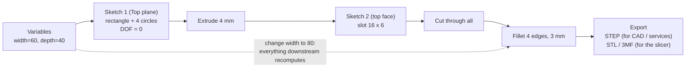

# F3D.02 — CAD basics with Onshape or FreeCAD

<!-- glance:start -->
<!-- generated by tools/build.py from curriculum/syllabus.yaml — edit the syllabus, not this block -->

| | |
|---|---|
| **Track** | Optional foundation |
| **Difficulty** | Beginner |
| **Time** | 1 h 30 min |
| **Hardware** | none |
| **Software** | cad |
| **Prerequisites** | [F3D.01 Why 3D printing matters in robotics — and when to buy a printer](F3D.01-why-3d-printing.md) |
| **Skip if** | You design parametric parts in a CAD tool. |

<!-- glance:end -->

## What you will learn

- Choose between Onshape (free plan), FreeCAD and Fusion for robot parts, knowing what each costs you.
- Draw a 2D sketch and constrain it fully, and count its degrees of freedom to prove it.
- Turn sketches into solids with extrude, cut, hole and fillet, and read the feature tree.
- Make a part parametric: change one variable and have every dependent feature follow.
- Export STEP and STL, and write the same part as code in CadQuery.

## Why it matters

Every printed robot part starts as a CAD model. Printables has thousands of models, but none of them knows that karmel's ToF sensor sits 125 mm forward of `base_link` and 95 mm above the floor, or that your deck holes are 3 mm off from the drawing. The moment you need a part for *your* robot you need CAD.

CAD also connects to the software side of the course. The URDF you write in [05.08](../../05-frames-and-transforms/05.08-urdf-and-xacro.md) describes links with sizes, positions and meshes. Those numbers and STL meshes come from CAD, and tools like `onshape-to-robot` generate a URDF straight from an Onshape assembly. The bracket exercise in [F3D.05](F3D.05-mounting-bracket.md), the insert bosses in [F3D.06](F3D.06-gears-inserts-fasteners.md) and the mechanical integration in [20.02](../../20-final-robot/20.02-hardware-integration.md) all build on this lesson.

<!-- prereqs:start -->
## Prerequisites

You need these first:

- [F3D.01 Why 3D printing matters in robotics — and when to buy a printer](F3D.01-why-3d-printing.md)

### Optional prerequisite links

None.

Check your readiness: `python course.py why F3D.02`
<!-- prereqs:end -->

## Concept

Parametric CAD will feel familiar once you see it the right way. You are not drawing a picture. You are writing a **build script with a GUI**.

- A **sketch** is a 2D drawing on a plane: lines, arcs, circles. At first their positions are approximate.
- **Constraints** are declarative rules on the sketch: "this line is horizontal", "these two circles have equal radius", "this hole is 5 mm from that edge", "this width is 60 mm". A solver moves the geometry until every rule holds. It is closer to CSS layout or a SQL query than to drawing pixels: you state relationships, and the engine works out the coordinates.
- A **feature** turns sketches into 3D: *extrude* (pull a sketch into a solid), *cut/pocket* (remove material), *hole*, *fillet* (round an edge), *chamfer* (bevel an edge).
- The **feature tree** (Onshape) or model tree (FreeCAD) is the ordered history of features. The part is what you get by replaying it. That is event sourcing: change an early event (the sketch width) and every later feature is recomputed from it.
- **Parameters** (variables) are named values like `width = 60 mm` that dimensions refer to. They are the configuration of the build.

The skill that separates a useful model from a fragile one is **design intent**. Ask what the numbers *mean*. The two M2 holes of a VL53L1X carrier are 12.7 mm apart because the sensor board says so. That spacing must stay 12.7 mm when you make the bracket wider, so dimension the holes from the centre line, not from the left edge. A model that captures intent survives changes. A model that only looks right breaks the first time you edit it, much like code with magic numbers.

> [!TIP]
> **Ask your teacher:** "I will describe a part in words. Ask me what should stay fixed when the part gets bigger, then tell me how to dimension it so it does."

## Technical explanation

### Level 1 — Choosing a CAD tool

| Tool | Cost | Runs on | Strengths | Catch |
|---|---|---|---|---|
| **Onshape Free** | Free | Browser (Windows, macOS, Linux, even a Chromebook) | Nothing to install, version history built in (like Git branches), excellent free Learning Center, `onshape-to-robot` exports URDF | Free plan is for non-commercial work, and documents are **public**. Do not model anything confidential. |
| **FreeCAD** | Free, open source | Windows, macOS, Linux, offline | Fully open, scriptable in Python, no account, files are yours | Steeper learning curve and a less polished UI. Older versions had a "topological naming" problem, where editing an early sketch broke later features. FreeCAD 1.0 greatly reduced it. |
| **Fusion (personal use)** | Free for qualifying users | Windows, macOS | Very capable, huge tutorial base, `fusion360-urdf-ros2` exporter | Home non-commercial use only, under US$1,000/yr revenue, 3-year renewable licence with reduced features. Terms change. |
| **CadQuery / OpenSCAD** | Free, open source | Python / own language | Parts as code: diffable, testable, parameters in a dataclass | No interactive sketching; complex organic shapes are hard. |

The course recommends **Onshape** for most students, because it works on any OS and connects to ROS through `onshape-to-robot`. Choose **FreeCAD** if you want everything offline and open. Choose **CadQuery** in addition, not instead, if you like models in Git. This lesson shows the Onshape and FreeCAD steps side by side, plus the CadQuery version of the same part.

### Level 2 — The workflow, click by click

The example part is a 60 × 40 × 4 mm mounting plate with rounded corners, four M3 clearance holes 5 mm from the edges, and a cable slot in the middle. It is the kind of adapter plate you screw a Pi or a sensor board to.

| Step | Onshape | FreeCAD (Part Design workbench) |
|---|---|---|
| 1. Start | Create a document; you land in a **Part Studio** | New file, switch to **Part Design**, **Create body** |
| 2. Parameters | Add a **Variable** feature: `width = 60 mm`, `depth = 40 mm` | Add a **Spreadsheet**, name cells `width`, `depth` (aliases) |
| 3. Sketch | New **Sketch** on the *Top* plane | **Create sketch** on the XY plane |
| 4. Rectangle | **Center point rectangle**, centre on the origin | Centred rectangle, centre on the origin |
| 5. Dimensions | Dimension the sides as `#width` and `#depth` | Constrain the lengths with the expressions `Spreadsheet.width` and `Spreadsheet.depth` |
| 6. Holes | 4 circles; **Equal** constraint between them; one diameter 3.4 mm; distance 5 mm from the edges | 4 circles; **Equal**; one radius 1.7 mm; distance 5 mm from the edges |
| 7. Check | Every line should turn **black** (fully defined); blue means still free | The solver message should say **Fully constrained** |
| 8. Solid | **Extrude** the region 4 mm (holes excluded) | **Pad** 4 mm |
| 9. Slot | New sketch on the top face, **Slot** 16 × 6 mm, **Extrude → Remove** through all | New sketch, slot, **Pocket → Through all** |
| 10. Corners | **Fillet** the 4 vertical edges, 3 mm | **Fillet** 3 mm |
| 11. Export | Right-click the part → **Export** → STEP and STL | Select the body → **File → Export** → STEP / STL |

Then **test the intent**: change `width` to 80 mm. The holes must move with the edges, the slot must stay centred and the fillets must survive. If a hole stays at its old place, it was not constrained to the edge. If a feature fails, it referenced something that no longer exists. Fix the model now, while it is small.

Two habits save hours:

- **Sketch near the real size.** A solver that has to move geometry a long way can flip it into an unexpected solution, such as an arc on the wrong side.
- **Constrain to the origin and the default planes**, not to the edges of earlier features, when you can. Features built on features create a chain that breaks when an early feature changes.

### Level 3 — Degrees of freedom: when is a sketch "done"?

Each piece of sketch geometry has degrees of freedom (DOF), the independent numbers needed to place it:

| Geometry | DOF | Why |
|---|---|---|
| Point | 2 | x, y |
| Line segment | 4 | two endpoints |
| Circle | 3 | centre x, y and radius |
| Arc | 5 | centre, radius, start angle, end angle |

Each constraint removes some:

| Constraint | Removes |
|---|---|
| Coincident (point on point) | 2 |
| Horizontal / vertical | 1 |
| Length, distance, radius, angle | 1 |
| Equal (radius or length) | 1 |
| Fix / lock a point | 2 |

A sketch is **fully constrained** when

$$\text{DOF}_{free} = \sum \text{DOF}_{geometry} - \sum \text{DOF}_{removed} = 0$$

*Example, the rectangle:* 4 lines give $4 \times 4 = 16$ DOF. Four corners where lines meet are 4 coincident constraints, $-8$, leaving 8. Two horizontal and two vertical constraints, $-4$, leaving 4. Width and height dimensions, $-2$, leaving 2. The last 2 DOF are *where the rectangle is*: make its centre coincident with the origin ($-2$) and you reach **0**.

Why care? A sketch with free DOF still extrudes, and it looks right. But when a parameter changes, the solver may move the unconstrained geometry in ways you did not intend. An under-constrained sketch is like an unpinned dependency version: it works today.

Over-constraining is the opposite error. Adding a dimension that is already implied (a third side of a fixed rectangle) makes the solver report a conflict or a redundant constraint. Delete the redundant one; don't try to make them agree.

### Level 4 — The same part as code

CAD-as-code tools give you what software engineers expect: diffs, code review, tests and parameters in one place. **CadQuery** is a Python library on top of the OpenCascade kernel, the same geometry kernel FreeCAD uses. It produces real B-rep solids and exports STEP and STL. A CadQuery model mixes sketch-and-extrude with selectors like `faces(">Z")` ("the face with the highest Z"), which play the role of clicking on a face in the GUI.

The limits are real. Organic shapes, complex fillets and assemblies are much easier interactively, and a selector that picks "the top face" can pick a different face after a change, which is the code version of the topological naming problem. Use code for families of simple parts (plates, brackets, spacers) and a GUI for everything else.

## Diagram



```text
      Sketch 1 on the Top plane (mm), origin at the centre
      y
      ^
  20  +-----------------------------------------------+
      |  (o)-25,15                            25,15(o) |      (o) = 3.4 mm hole
      |                                               |
      |                  ( ======== )                 |      slot 16 x 6
   0  +- - - - - - - - - - - -+- - - - - - - - - - - -+--> x
      |                                               |
      |  (o)-25,-15                          25,-15(o) |
 -20  +-----------------------------------------------+
     -30                      0                       30
      holes are 5 mm from each edge: x = ±(width/2 − 5), y = ±(depth/2 − 5)
```

## Code

Save as `f3d02_plate.py` and run `python f3d02_plate.py`. It needs CadQuery (`pip install cadquery`, in a virtual environment). It builds the plate from the table above, reports its size, volume and hole centres, exports STEP and STL, and then rebuilds it with `width=80` to show the holes follow the edges.

```python
"""f3d02_plate.py — a parametric mounting plate in CadQuery: sketch, constrain, extrude, cut.

Run:  python f3d02_plate.py        (pip install cadquery; tested with CadQuery 2.8, Python 3.14)
Writes plate_60x40.step / .stl and plate_80x40.step / .stl
"""
from __future__ import annotations

from dataclasses import dataclass

import cadquery as cq


@dataclass(frozen=True)
class PlateParams:
    width: float = 60.0          # x, mm
    depth: float = 40.0          # y, mm
    thickness: float = 4.0       # z, mm
    hole_d: float = 3.4          # M3 clearance, ISO 273 medium series
    edge_margin: float = 5.0     # hole centre to plate edge
    slot_len: float = 16.0       # cable slot in the middle
    slot_w: float = 6.0
    corner_r: float = 3.0


def build(p: PlateParams) -> cq.Workplane:
    # The "sketch": a rectangle centred on the origin. Centring it is a constraint too:
    # it removes the two degrees of freedom that say where the rectangle is.
    plate = cq.Workplane("XY").rect(p.width, p.depth).extrude(p.thickness)
    plate = plate.edges("|Z").fillet(p.corner_r)
    # Holes are dimensioned from the plate edges, so they follow when width changes:
    # that is the design intent written as code.
    dx = p.width / 2 - p.edge_margin
    dy = p.depth / 2 - p.edge_margin
    plate = (
        plate.faces(">Z").workplane()
        .pushPoints([(-dx, -dy), (dx, -dy), (dx, dy), (-dx, dy)])
        .hole(p.hole_d)
    )
    plate = plate.faces(">Z").workplane().slot2D(p.slot_len, p.slot_w).cutThruAll()
    return plate


def report(name: str, p: PlateParams) -> None:
    part = build(p)
    solid = part.val()
    bb = solid.BoundingBox()
    holes = sorted({(round(e.Center().x, 2), round(e.Center().y, 2))
                    for e in part.faces("<Z").edges("%CIRCLE").vals() if abs(e.radius() - p.hole_d / 2) < 1e-6})
    print(f"{name}: {bb.xlen:.1f} x {bb.ylen:.1f} x {bb.zlen:.1f} mm, volume {solid.Volume() / 1000:.3f} cm^3")
    print(f"  hole centres: {holes}")
    cq.exporters.export(part, f"{name}.step")
    cq.exporters.export(part, f"{name}.stl", tolerance=0.01, angularTolerance=0.1)


def main() -> None:
    report("plate_60x40", PlateParams())
    report("plate_80x40", PlateParams(width=80.0))   # change ONE parameter, everything follows


if __name__ == "__main__":
    main()
```

Output (verified with CadQuery 2.8.0 on Python 3.14):

```text
plate_60x40: 60.0 x 40.0 x 4.0 mm, volume 9.071 cm^3
  hole centres: [(-25.0, -15.0), (-25.0, 15.0), (25.0, -15.0), (25.0, 15.0)]
plate_80x40: 80.0 x 40.0 x 4.0 mm, volume 12.271 cm^3
  hole centres: [(-35.0, -15.0), (-35.0, 15.0), (35.0, -15.0), (35.0, 15.0)]
```

You can check the volume by hand. The block is 60 × 40 × 4 = 9,600 mm³. The four rounded corners remove 4 × (3² − π·3²/4) × 4 = 30.9 mm³, the holes 4 × π × 1.7² × 4 = 145.3 mm³, and the slot ((16 − 6) × 6 + π × 3²) × 4 = 353.1 mm³. That leaves **9,070.7 mm³ = 9.071 cm³**.

## Exercise

### Exercise F3D.02-E1 — Count the degrees of freedom `[numerical]`

Hardware: none. The plate sketch has the rectangle (already fully constrained, 0 DOF) plus 4 circles.

1. How many DOF do the 4 circles add?
2. You add 3 **Equal** constraints (circle 1 = 2, 1 = 3, 1 = 4) and one diameter dimension. How many DOF remain?
3. List the smallest set of further constraints that fully constrains the sketch while keeping every hole 5 mm from its two nearest edges.

### Exercise F3D.02-E2 — Model the plate in your CAD tool `[coding]`

Hardware: none. Software: Onshape (free account) or FreeCAD.

1. Model the 60 × 40 × 4 mm plate from the Level 2 table, with `width` and `depth` as variables.
2. Confirm the sketch is fully constrained (black lines in Onshape, "Fully constrained" in FreeCAD).
3. Change `width` to 80 mm, then to 30 mm. Write down what happens each time.
4. Export STEP and STL. Note both file sizes.

### Exercise F3D.02-E3 — Predict the broken model `[predict]`

Hardware: none. A colleague modelled the plate with the hole circles dimensioned **from the left edge and the bottom edge** of the rectangle (for example: hole 4 is 55 mm from the left edge). The rectangle's centre is on the origin. *Before changing anything*, predict where each of the four holes will be when `width` goes from 60 to 80 mm. Then do it in CAD, or reason it through with coordinates, and compare.

### Exercise F3D.02-E4 — Parametric in code `[coding]`

Hardware: none. Software: Python with CadQuery (`pip install cadquery` in a venv; if it won't install, do this exercise in Onshape with a second Variable).

Extend `f3d02_plate.py` with a `hole_pattern_x` parameter. When it is set (for example 49.0 mm, one of the Raspberry Pi hole-pattern spacings), the hole spacing uses it instead of `width − 2 × edge_margin`. Add a check that raises `ValueError` when a hole would come closer than 3 mm to the plate edge, measured from the hole's *edge*, not its centre.

## Expected result

**F3D.02-E1:**
1. 4 × 3 = **12 DOF**.
2. 12 − 3 − 1 = **8 DOF**: the x and y position of each centre.
3. 8 constraints: for each circle, one horizontal distance (5 mm) to its nearest vertical edge and one vertical distance (5 mm) to its nearest horizontal edge. Using symmetry constraints about the axes is an equally valid alternative. The DOF count ends at 0 and the tool reports the sketch as fully constrained.

**F3D.02-E2:** At 80 mm, the plate is 80 × 40, the holes are at x = ±35 mm, the slot is still centred and the corners are still filleted. At 30 mm, the holes are at x = ±10 mm (6.6 mm between hole edges and the slot's 16 mm length still fits between them: the slot ends at x = ±8, the holes' inner edges at ±8.3). The model rebuilds without errors. File sizes depend on the tool and export resolution; for comparison, the CadQuery version gives a 65 kB STEP and a 154 kB STL at 0.01 mm tolerance.

**F3D.02-E3:** The rectangle grows 10 mm to each side, so its left edge moves from x = −30 to x = −40. The left holes, being 5 mm from the left edge, move to x = −35: correct by luck. The right holes, being **55 mm from the left edge**, move to x = −40 + 55 = **+15 mm**, which is 25 mm from the new right edge instead of 5 mm. The y positions are unchanged. The part still builds without an error: that is what makes this bug dangerous.

**F3D.02-E4:** With `hole_pattern_x=49.0`, the hole centres are at x = ±24.5 mm whatever the plate width. `PlateParams(width=50.0, hole_pattern_x=49.0)` raises `ValueError`, because the hole edge would be 25 − 24.5 − 1.7 = −1.2 mm from the plate edge (the hole breaks out). A width of 60 mm passes: 30 − 24.5 − 1.7 = 3.8 mm.

## Troubleshooting

### Symptom: the sketch won't extrude, or extrudes only part of the shape
1. Look for an open profile. Zoom into every corner: two endpoints that *look* joined but are not coincident leave the region open.
2. Look for overlapping or duplicate lines. They create tiny zero-area regions.
3. In Onshape, click inside the region you want in the Extrude dialog; in FreeCAD, run the Sketcher's validation tool.

### Symptom: a change to one dimension moves things you didn't expect
1. Check whether the sketch is fully constrained. Free geometry moves wherever the solver finds convenient.
2. Look at what the moved feature is dimensioned *from*. Re-dimension it from the geometry that carries the intent (the centre line, the sensor hole, the origin).
3. If features jump to the wrong face after an early edit (common in older FreeCAD), rebuild the feature on a datum plane or the base planes rather than on a generated face.

### Symptom: "over-constrained" or "conflicting constraints"
1. The last constraint you added duplicates information. Undo it.
2. Look for implied constraints: a symmetric rectangle does not also need both half-widths dimensioned.
3. Delete the redundant constraint. Never "fix" a conflict by changing a value until the numbers happen to agree.

### Symptom: CadQuery won't install
1. Use a virtual environment and an up-to-date `pip`. CadQuery depends on a large OpenCascade wheel (`cadquery-ocp`) and needs a wheel for your Python version and OS.
2. If pip cannot find a wheel, follow the conda instructions on the CadQuery installation page.
3. If it still fails, do the code exercises in Onshape with Variables. The ideas are the same.

## Common mistakes

- **Leaving sketches under-constrained.** They work until a parameter changes. Treat blue lines as warnings you must fix.
- **Dimensioning from the wrong reference.** Holes placed relative to an arbitrary edge instead of the feature that defines them (sensor pattern, centre line) break design intent.
- **Hard-coding numbers that belong together.** If the hole spacing and the plate width depend on one sensor, make that dependency a variable.
- **Modelling at the wrong scale or in inches.** Set the document units to millimetres before you start. STL files carry no units ([F3D.03](F3D.03-file-formats-slicers.md)).
- **Putting confidential designs in Onshape Free.** Documents on the free plan are public.
- **Designing without the printer in mind.** A perfect CAD model can still be unprintable. Holes shrink, overhangs sag and layers split ([F3D.04](F3D.04-tolerances-fits.md)).

## Knowledge check

1. What is the difference between a sketch constraint and a dimension?
   <details><summary>Answer</summary>

   A constraint states a geometric relationship with no number (horizontal, coincident, equal, tangent). A dimension fixes a value (60 mm, 3.4 mm diameter). Both remove degrees of freedom, and most tools treat dimensions as a kind of constraint.
   </details>

2. A sketch has two circles (not yet constrained) and a line. How many DOF does it have? What minimum constraints fix everything if the line is horizontal, 30 mm long, starts at the origin, and each circle is centred on one endpoint with diameter 3.4 mm?
   <details><summary>Answer</summary>

   2 × 3 + 4 = **10 DOF**. Line start coincident with origin (−2), horizontal (−1), length 30 (−1) → 6. Circle 1 centre coincident with the start (−2), circle 2 centre coincident with the end (−2) → 2. Diameter 3.4 on one circle (−1), Equal between them (−1) → **0**.
   </details>

3. Predict: you extrude an under-constrained sketch and then change a dimension in it. Will CAD report an error?
   <details><summary>Answer</summary>

   Usually not. The solver finds *some* solution and the part rebuilds. Unconstrained geometry simply moves wherever the solver puts it, which is why under-constrained sketches produce silent bugs rather than errors.
   </details>

4. Why is the feature tree like event sourcing, and what practical consequence does that have?
   <details><summary>Answer</summary>

   The part is not stored as final geometry but as an ordered list of operations replayed from the start. Changing an early feature recomputes everything after it. Consequence: later features that referenced geometry created by earlier ones (a face, an edge) can break or attach to a different face when the earlier feature changes, so reference stable geometry (origin, base planes, variables) where possible.
   </details>

5. Name one reason to choose Onshape Free and one reason not to.
   <details><summary>Answer</summary>

   For: runs in a browser on any OS with nothing to install, has built-in versioning, and `onshape-to-robot` can generate a URDF from assemblies. Against: the free plan is for non-commercial use and documents are public, and it needs an internet connection.
   </details>

6. Debugging: after changing the plate width, one fillet feature shows an error. What most likely happened and how do you fix it?
   <details><summary>Answer</summary>

   The fillet referenced specific edges by their identity. After the rebuild, those edges changed or no longer exist (for example because a hole now intersects a corner), so the reference broke. Edit the fillet and reselect the edges; better, select edges in a way that survives changes (all vertical edges of the body, or edges of the base sketch) or check that the parameter range doesn't create a different topology.
   </details>

## Practical challenge

Model a **Raspberry Pi 5 mounting tray** for karmel's deck in Onshape, FreeCAD or CadQuery.

**Acceptance criteria:**
- The Pi mounting holes are placed from the official Raspberry Pi 5 mechanical drawing (look it up; do not measure a photo). They are M2.5 clearance holes, 2.9 mm (ISO 273 medium), with 5 mm tall standoff bosses.
- The tray mounts to the deck with 4 M3 clearance holes (3.4 mm) on a pattern that is a **separate variable** from the Pi pattern.
- Every sketch is fully constrained.
- Changing the tray thickness from 3 to 5 mm and the deck-hole spacing by ±10 mm rebuilds without errors, and the Pi holes do not move relative to each other.
- STEP and STL exports exist, and a screenshot of the feature tree shows named variables.

## You can skip this if…

You design parametric parts in a CAD tool. Check yourself: answer knowledge-check questions 2, 3 and 6 correctly without looking, and model the 60 × 40 mm plate fully constrained in under 15 minutes.

`python course.py skip F3D.02 --reason "I design parametric parts in CAD"`

## Go deeper

- [Onshape Learning Center — CAD Fundamentals](https://learn.onshape.com/learn/course/fundamentals-cad): the free, structured course for everything in this lesson.
- [Onshape Free plan](https://www.onshape.com/en/products/free): the terms, including non-commercial and public documents.
- [FreeCAD — Getting started](https://wiki.freecad.org/Getting_started): the official introduction to the Part Design and Sketcher workflow.
- [CadQuery documentation](https://cadquery.readthedocs.io/en/latest/): the code-CAD library used in this track, with installation options.
- [Autodesk Fusion for personal use](https://www.autodesk.com/products/fusion-360/personal): the terms of the free personal licence.
- [onshape-to-robot](https://onshape-to-robot.readthedocs.io/): turn an Onshape assembly into a URDF, SDF or MuJoCo model for [05.08](../../05-frames-and-transforms/05.08-urdf-and-xacro.md).

## Progress checkpoint

- [ ] I can pick a CAD tool and explain what it costs me.
- [ ] I can fully constrain a sketch and count its degrees of freedom.
- [ ] I can build a part with extrude, cut, hole and fillet and read its feature tree.
- [ ] I can make a part parametric and test that the design intent survives a change.
- [ ] I can export STEP and STL, and write a simple part in CadQuery.

`python course.py complete F3D.02` (exercises done) · `python course.py master F3D.02` (challenge done) · `python course.py struggle F3D.02 "what was hard"`

Next: [F3D.03 — STL, 3MF, STEP and slicers](F3D.03-file-formats-slicers.md).
