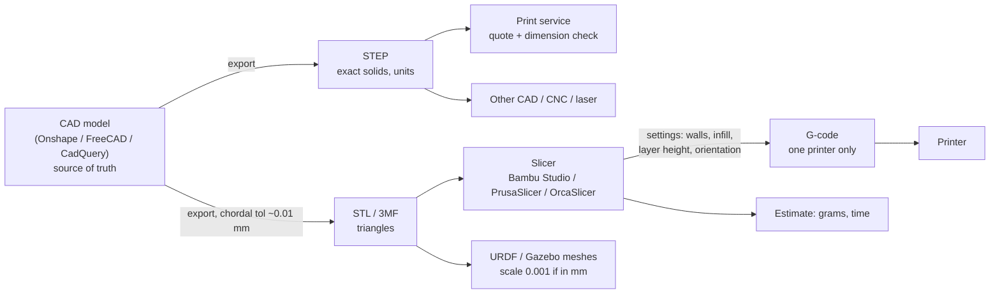

# F3D.03 — STL, 3MF, STEP and slicers

<!-- glance:start -->
<!-- generated by tools/build.py from curriculum/syllabus.yaml — edit the syllabus, not this block -->

| | |
|---|---|
| **Track** | Optional foundation |
| **Difficulty** | Beginner |
| **Time** | 40 min |
| **Hardware** | none |
| **Software** | slicer |
| **Prerequisites** | [F3D.02 CAD basics with Onshape or FreeCAD](F3D.02-cad-basics.md) |
| **Skip if** | You know which format to send where and how slicer settings affect strength. |

<!-- glance:end -->

## What you will learn

- Say what STL, 3MF, STEP and G-code contain, and which one to send to a slicer, a print service, a colleague or a URDF.
- Export a mesh at a resolution that keeps small holes round, and compute the error a coarse export introduces.
- Read an STL programmatically: triangle count, bounding box, volume, and a units sanity check.
- Explain what a slicer does, and predict how walls, infill, layer height and orientation change a part's mass, time and strength.
- Slice a robot bracket and read the estimated grams and time.

## Why it matters

A CAD model is not something a printer understands. Between the model and the plastic are two translations: CAD exports a **file format**, and a **slicer** turns that file into machine moves. Both steps can silently ruin a part. An STL exported in inches comes out 25.4 times too small. A coarse mesh turns a 3.4 mm hole into a polygon a screw won't pass through. A bracket printed standing up snaps along a layer line the first time the robot bumps a table.

The same formats come back in the software half of the course. URDF visual and collision meshes in [05.08](../../05-frames-and-transforms/05.08-urdf-and-xacro.md) are STL or DAE files, and the arm's URDF in [14.08](../../14-robotic-arm/14.08-arm-urdf-and-ros2-control.md) uses meshes exported from CAD. Ordering prints in [F3D.07](F3D.07-materials-chassis-ordering.md) depends on sending the right file with the right settings.

<!-- prereqs:start -->
## Prerequisites

You need these first:

- [F3D.02 CAD basics with Onshape or FreeCAD](F3D.02-cad-basics.md)

### Optional prerequisite links

None.

Check your readiness: `python course.py why F3D.03`
<!-- prereqs:end -->

## Concept

A useful analogy is source code, compiled output and a binary.

- **STEP** is the *source code*. It stores exact geometry: a hole is a mathematical cylinder with a 1.7 mm radius, a fillet is a true arc. Any CAD tool can open it and keep editing, although the feature history is not included.
- **STL** and **3MF** are *compiled output*. The surface is approximated by flat triangles. A cylinder becomes a prism with N sides. You can't change a hole diameter cleanly; you can only cut, scale or merge triangles.
- **G-code** is the *binary for one machine*. It is a list of moves (`G1 X10 Y20 E0.5`) for one printer, one nozzle, one material and one set of settings. It is useless on a different printer.

The **slicer** is the compiler. It cuts the mesh into horizontal layers (hence the name), and inside each layer it decides where to lay **walls** (perimeters around every outline), **top and bottom** solid layers, sparse **infill** inside, and **supports** under overhangs. Then it plans the nozzle path and writes G-code, and on the way it tells you how many grams and minutes the part will take.

The slicer's settings matter as much as the CAD. The same STL can come out as a 6 g part that snaps or a 10 g part that holds a LiDAR through a crash. The key fact is counter-intuitive: **strength comes mostly from walls, not infill**. A layered part is also like a stack of paper glued together: strong along the sheets and weak when you try to peel them apart.

> [!TIP]
> **Ask your teacher:** "Show me a bracket and ask me which way to orient it on the bed. Then tell me where it would break if I got it wrong."

## Technical explanation

### Level 1 — Which file goes where

| Format | What is inside | Units | Use it for | Don't use it for |
|---|---|---|---|---|
| **STEP** (`.step`, `.stp`, ISO 10303) | Exact B-rep solids: faces, edges, analytic surfaces | Yes (mm, in) | Sending a part to another CAD tool, to a print service for quoting, to a colleague to modify, to CNC or laser shops | Loading directly into most hobby slicers (some can import it, but they mesh it for you) |
| **STL** (`.stl`) | A bag of triangles: 3 vertices + a normal each. No units, no colour, one object per file in practice | **None** | Slicers, URDF meshes, model repositories | Editing, and anything where the size must be unambiguous |
| **3MF** (`.3mf`, ISO/IEC 25422:2025) | A ZIP of XML: meshes **with units**, multiple objects, colours and materials, and slicer project settings | Yes | Slicer projects (Bambu Studio and PrusaSlicer save projects as 3MF), sending a service a part *with* your settings | CAD editing (still a mesh) |
| **OBJ / DAE** | Meshes with materials/textures | Not reliable | Visual meshes with colour in RViz and Gazebo | Printing |
| **G-code / .gcode.3mf** | Machine moves for one printer | mm | Only the printer it was sliced for | Anything else |

Rules of thumb for this course:

- **Keep the CAD file as your source of truth.** Everything else is generated from it, like build artefacts.
- **Send a service STEP plus STL (or 3MF)**. STEP lets them check dimensions; the mesh is what they slice.
- **Use 3MF for your own slicing** where you can: it keeps units and settings together.
- **For URDF meshes use STL** (or DAE for colour), exported in metres *or* scaled in the URDF (`scale="0.001 0.001 0.001"` for millimetre STLs).

### Level 2 — Exporting meshes: resolution

When CAD turns exact surfaces into triangles, two settings control quality. The **chordal tolerance** (sometimes "deviation" or "linear tolerance") is the maximum distance between the true surface and a triangle. The **angular tolerance** is the maximum angle between neighbouring facets. Onshape offers coarse/medium/fine; FreeCAD's Mesh Design workbench and CadQuery take numeric tolerances.

For a circle of radius $r$ approximated by $n$ straight segments, the largest gap between the true arc and a chord (the **sagitta**) is

$$s = r\left(1 - \cos\frac{\pi}{n}\right)$$

and the polygon's flat-to-flat width is $2r\cos(\pi/n)$, smaller than the true diameter.

*Example:* an M3 clearance hole, $d = 3.4$ mm ($r = 1.7$ mm).

| Segments $n$ | Sagitta $s$ | Flat-to-flat width |
|---|---|---|
| 8 | 0.129 mm | 3.14 mm |
| 16 | 0.033 mm | 3.33 mm |
| 32 | 0.008 mm | 3.38 mm |
| 64 | 0.002 mm | 3.40 mm |

With an 8-sided export, the "3.4 mm" hole is only 3.14 mm across its flats and an M3 screw (3.0 mm) barely clears it before any printing error ([F3D.04](F3D.04-tolerances-fits.md) shows printed holes lose another ~0.25 mm). Solving $s \le 0.01$ mm for $r = 1.7$ mm gives $n \ge 29$ segments; for a 22 mm bearing seat ($r = 11$ mm) it gives $n \ge 74$. A chordal tolerance of about 0.01 mm is a good default for small robot parts. The cost is file size: a binary STL is $84 + 50 \times$ triangles bytes, so 3,080 triangles is 154 kB.

### Level 3 — What an STL file tells you

A binary STL has an 80-byte header, a 4-byte triangle count, and 50 bytes per triangle (12 float32 numbers: normal + 3 vertices, and a 2-byte attribute). From the triangles alone you can compute:

- **The bounding box**, which is your first unit check. A karmel bracket should be tens of mm; if the box says 1.57 × 0.79 × 0.39, it was exported in inches.
- **The volume**, using the divergence theorem. Each triangle $(a, b, c)$ forms a tetrahedron with the origin whose signed volume is

$$V_{tri} = \frac{a \cdot (b \times c)}{6}$$

Summed over a closed, consistently oriented mesh, the triangles outside cancel and you get the enclosed volume. *Example:* the triangle $a=(10,0,0)$, $b=(0,10,0)$, $c=(0,0,10)$ mm gives $10 \cdot (10 \cdot 10)/6 = 166.7$ mm³, the volume of that corner tetrahedron. A negative total means the triangle winding is inverted (normals point inward).

- **The mass if printed solid**: volume × density. PLA is about 1.24 g/cm³.

Printed parts are not solid, so the slicer's estimate is lower. A rough model splits the part into a **shell** of thickness $t$ over the surface area $A$, which is always solid, and a **core** filled at infill fraction $f$:

$$m \approx \rho\left[\min(V, A t) + f\,\big(V - \min(V, A t)\big)\right]$$

*Example:* the ToF bracket from [F3D.05](F3D.05-mounting-bracket.md) has $V = 8.40$ cm³ and $A = 49.6$ cm². With 3 walls ($t \approx 1.2$ mm), 15 % infill and PLA: shell $= 49.6 \times 0.12 = 5.95$ cm³, core $= 2.45$ cm³, so $m = 1.24 \times (5.95 + 0.15 \times 2.45) = $ **7.8 g**. The model is good to about ±30 %; the slicer is the real answer.

### Level 4 — Slicer settings that matter for robot parts

| Setting | Typical default (0.4 mm nozzle) | Effect | Robot-part guidance |
|---|---|---|---|
| **Layer height** | 0.2 mm | Thinner layers look better and take longer; they barely change strength | 0.2 mm for brackets; 0.12–0.16 mm only when a detail needs it |
| **Walls / perimeters** | 2–3 | **The main driver of strength** (Prusa: strength is "mostly defined by the number of perimeters") | 3–4 for brackets and mounts; ≥4 around screw holes and inserts |
| **Top / bottom layers** | 3–5 | Solid skin; too few gives sagging, pillowed tops | At least 3 top layers; 5 at 0.2 mm is ~1 mm of skin |
| **Infill density** | 15–20 % | Stiffness of thick sections, mass, time | 15–25 % for most parts; the SO-101 is printed at 15 % |
| **Infill pattern** | Grid / gyroid / cubic | Gyroid and cubic are strong in all directions | Gyroid or cubic for load-bearing parts |
| **Supports** | Off / auto | Hold up overhangs (FDM prints overhangs of about 45–60° without them) | Design them out where you can; never inside screw holes |
| **Orientation** | You choose | **Layers are the weak direction** | Orient so loads run *along* the layers, not across them |
| **Brim** | Off | Extra first-layer area against warping and lifting | On for tall thin parts, PETG/ASA corners, and small feet |

Orientation deserves its own example. An L-shaped bracket printed standing (the upright vertical) has its bend made of stacked layers. A load that pushes the upright back tries to peel those layers apart: it breaks at the corner. The same bracket printed **lying on its side** has every layer containing a complete "L", so the bend is continuous plastic. It also prints faster: a 46.7 mm tall bracket is 233 layers at 0.2 mm standing, but only 130 layers lying on its 26 mm side.

Slicers in common use (all free):

- **Bambu Studio**: made for Bambu Lab printers (the A1 / A1 mini recommended in [F3D.01](F3D.01-why-3d-printing.md)).
- **PrusaSlicer**: made for Prusa printers, with good profiles for many others; Windows, macOS, Linux.
- **OrcaSlicer**: open-source fork used for many brands, including Bambu, Prusa, Creality and Voron.
- **UltiMaker Cura**: common with Creality and older printers.

They share the same concepts and most setting names. Start from your printer's built-in profile for your filament and change only what the part needs.

## Diagram



```text
 One layer of a bracket, seen from above in the slicer preview

   +-----------------------------------------+   <- wall 1 (outer perimeter)
   | +-------------------------------------+ |   <- wall 2
   | | +---------------------------------+ | |   <- wall 3
   | | |  /\  /\  /\  /\  /\  /\  /\  /\ | | |
   | | | /  \/  \/  \/  \/  \/  \/  \/  \| | |   <- sparse infill (15 %)
   | | | \  /\  /  (O)  \  /\  /\  /\  / | | |
   | | +------------/---\----------------+ | |
   | +-------------( 3 walls )-------------+ |   <- walls also wrap every hole
   +-----------------------------------------+

 Side view: why orientation matters

   printed standing                    printed lying on its side
   |=|  layers ----                    ______________
   |=|  stacked across the bend         |  L-shape   |  every layer contains
   |=|__________                        |  in every  |  the whole bend
   |===========|  <- breaks here        |  layer     |
```

## Code

Save as `stl_inspect.py` and run `python stl_inspect.py --demo`, or `python stl_inspect.py your_part.stl`. It needs `numpy`. It reads binary and ASCII STL, reports the triangle count, bounding box, volume and surface area, estimates the solid mass, and warns about inch/metre exports and inverted normals. `--demo` writes and inspects a 40 × 20 × 10 mm box.

```python
"""stl_inspect.py — read a binary or ASCII STL, report size, volume and estimated mass.

Usage:
    python stl_inspect.py part.stl [--density 1.24]
    python stl_inspect.py --demo            # writes and inspects a 40 x 20 x 10 mm box
"""
from __future__ import annotations

import argparse
import struct
from dataclasses import dataclass
from pathlib import Path

import numpy as np


@dataclass(frozen=True)
class MeshReport:
    triangles: int
    size_mm: tuple[float, float, float]
    volume_cm3: float
    area_cm2: float


def read_stl(path: Path) -> np.ndarray:
    """Return an (n, 3, 3) array of triangle vertices. Units are whatever the file used."""
    data = path.read_bytes()
    if len(data) >= 84:
        n = struct.unpack_from("<I", data, 80)[0]
        if 84 + 50 * n == len(data):  # binary STL: 80-byte header, count, 50 bytes per triangle
            rec = np.dtype([("normal", "<f4", 3), ("v", "<f4", (3, 3)), ("attr", "<u2")])
            return np.frombuffer(data, dtype=rec, count=n, offset=84)["v"].astype(np.float64)
    verts = [
        [float(x) for x in line.split()[1:4]]
        for line in data.decode("ascii", errors="replace").splitlines()
        if line.strip().startswith("vertex")
    ]
    return np.asarray(verts, dtype=np.float64).reshape(-1, 3, 3)


def write_binary_stl(path: Path, tris: np.ndarray) -> None:
    a, b, c = tris[:, 0], tris[:, 1], tris[:, 2]
    normals = np.cross(b - a, c - a)
    normals /= np.linalg.norm(normals, axis=1, keepdims=True)
    with path.open("wb") as f:
        f.write(b"stl_inspect demo".ljust(80, b" "))
        f.write(struct.pack("<I", len(tris)))
        for nrm, tri in zip(normals, tris):
            f.write(struct.pack("<3f", *nrm))
            f.write(struct.pack("<9f", *tri.reshape(9)))
            f.write(b"\x00\x00")


def box_triangles(sx: float, sy: float, sz: float) -> np.ndarray:
    """12 outward-facing triangles of an axis-aligned box with one corner at the origin."""
    p = np.array([[x, y, z] for z in (0, sz) for y in (0, sy) for x in (0, sx)], dtype=float)
    faces = [(0, 2, 3, 1), (4, 5, 7, 6), (0, 1, 5, 4), (2, 6, 7, 3), (0, 4, 6, 2), (1, 3, 7, 5)]
    tris = []
    for i, j, k, m in faces:
        tris += [[p[i], p[j], p[k]], [p[i], p[k], p[m]]]
    return np.array(tris)


def analyse(tris: np.ndarray) -> MeshReport:
    a, b, c = tris[:, 0], tris[:, 1], tris[:, 2]
    # Divergence theorem: sum of signed tetrahedron volumes (origin, a, b, c).
    volume_mm3 = float(np.einsum("ij,ij->i", a, np.cross(b, c)).sum() / 6.0)
    area_mm2 = float(0.5 * np.linalg.norm(np.cross(b - a, c - a), axis=1).sum())
    pts = tris.reshape(-1, 3)
    size = pts.max(axis=0) - pts.min(axis=0)
    return MeshReport(len(tris), (float(size[0]), float(size[1]), float(size[2])),
                      volume_mm3 / 1000.0, area_mm2 / 100.0)


def main() -> None:
    ap = argparse.ArgumentParser()
    ap.add_argument("stl", nargs="?", type=Path)
    ap.add_argument("--density", type=float, default=1.24, help="g/cm^3 (PLA ≈ 1.24)")
    ap.add_argument("--demo", action="store_true")
    args = ap.parse_args()
    path = args.stl
    if args.demo:
        path = Path("demo_box.stl")
        write_binary_stl(path, box_triangles(40.0, 20.0, 10.0))
    if path is None:
        ap.error("give an STL file or --demo")
    r = analyse(read_stl(path))
    print(f"file            : {path}")
    print(f"triangles       : {r.triangles}")
    print(f"bounding box    : {r.size_mm[0]:.2f} x {r.size_mm[1]:.2f} x {r.size_mm[2]:.2f} (file units)")
    if max(r.size_mm) < 10:
        print("WARNING         : largest side < 10 units: was this exported in inches or metres?")
    print(f"solid volume    : {r.volume_cm3:.3f} cm^3 (if units are mm)")
    print(f"surface area    : {r.area_cm2:.2f} cm^2")
    print(f"mass if 100% solid at {args.density} g/cm^3: {r.volume_cm3 * args.density:.1f} g")
    if r.volume_cm3 < 0:
        print("WARNING         : negative volume: triangle winding is inverted")


if __name__ == "__main__":
    main()
```

Output of `python stl_inspect.py --demo` (verified with Python 3.14, numpy):

```text
file            : demo_box.stl
triangles       : 12
bounding box    : 40.00 x 20.00 x 10.00 (file units)
solid volume    : 8.000 cm^3 (if units are mm)
surface area    : 28.00 cm^2
mass if 100% solid at 1.24 g/cm^3: 9.9 g
```

Output for the ToF bracket STL exported by `tof_bracket.py` in [F3D.05](F3D.05-mounting-bracket.md) (chordal tolerance 0.01 mm):

```text
file            : tof_bracket.stl
triangles       : 3080
bounding box    : 22.21 x 26.00 x 46.67 (file units)
solid volume    : 8.403 cm^3 (if units are mm)
surface area    : 49.56 cm^2
mass if 100% solid at 1.24 g/cm^3: 10.4 g
```

## Exercise

### Exercise F3D.03-E1 — How coarse is too coarse? `[numerical]`

Hardware: none.

1. A 608 bearing seat has a 22.0 mm diameter. It is exported with 16 segments. Compute the sagitta and the flat-to-flat width.
2. How many segments keep the sagitta at or below 0.01 mm for that seat?
3. A binary STL of karmel's LiDAR mount has 12,000 triangles. How large is the file in kB?

### Exercise F3D.03-E2 — Catch the unit bug `[coding]`

Hardware: none. Software: Python with numpy.

1. Run `python stl_inspect.py --demo`.
2. Using `write_binary_stl` and `box_triangles`, write `inch_box.stl`: the same 40 × 20 × 10 mm box but with every coordinate in inches. Run the inspector on it.
3. Add a `--scale` option that multiplies all vertices before analysis, and use it to recover the correct volume.
4. Reverse the winding of every triangle (swap `b` and `c`) and confirm the inspector warns.

### Exercise F3D.03-E3 — Walls or infill? `[predict]`

Hardware: none. The ToF bracket has $V = 8.40$ cm³ and $A = 49.6$ cm². The baseline is 3 walls ($t = 1.2$ mm), 15 % infill, PLA ≈ 7.8 g.

*Predict first* which change adds more mass, then compute each with the shell/core model:

1. 15 % → 40 % infill, 3 walls.
2. 3 walls → 2 walls ($t = 0.9$ mm), 15 % infill.
3. 3 walls → 4–5 walls ($t = 1.8$ mm), 15 % infill.
4. Which of these changes do you expect to make the bracket *stronger*, and why does the thin bracket respond so little to infill?

### Exercise F3D.03-E4 — Slice a bracket `[simulation]`

Hardware: none (no printer needed). Software: a slicer (Bambu Studio, PrusaSlicer or OrcaSlicer) with any printer profile.

1. Load `tof_bracket.stl` (from F3D.05's code) or any small bracket from Printables.
2. Slice it standing up and lying on its side. Record the estimated grams, print time and whether supports are needed.
3. Change walls 2 → 4 and infill 15 % → 40 % one at a time, recording grams and time each time.
4. Look at a layer in the preview that cuts through a screw hole and count the walls around it.

## Expected result

**F3D.03-E1:**
1. $s = 11(1 - \cos(\pi/16)) =$ **0.211 mm**; flat-to-flat $22\cos(\pi/16) =$ **21.58 mm**. A bearing will not go in, and a press fit designed on 22.0 mm becomes a hammer fit.
2. **74 segments** (solving $11(1-\cos(\pi/n)) \le 0.01$).
3. $84 + 50 \times 12{,}000 = 600{,}084$ bytes ≈ **600 kB**.

**F3D.03-E2:** The inch file reports a bounding box of 1.57 × 0.79 × 0.39, the `WARNING: largest side < 10 units` line, and a volume of 0.000 cm³. With `--scale 25.4` you get back 40.00 × 20.00 × 10.00 and 8.000 cm³. With reversed winding the volume is −8.000 cm³ and the "winding is inverted" warning appears.

**F3D.03-E3:**
1. 40 % infill: **8.6 g** (+0.75 g).
2. 2 walls: **6.3 g** (−1.6 g).
3. 1.8 mm shell: the shell already exceeds the part's volume ($49.6 \times 0.18 = 8.9 > 8.4$ cm³), so the part is effectively solid: **10.4 g**.
4. More walls make it stronger; infill barely matters. The bracket's sections are only 3–7 mm thick, so walls from both sides meet in the middle and there is little core left for infill to fill. Strength of thin parts is all walls. Prediction check: most people guess that 40 % infill adds the most mass, but the wall change is larger here.

**F3D.03-E4:** Grams around 7–10 g and times of roughly 20–45 minutes depending on the printer. The side orientation needs no or few supports, while standing may need supports under the tilted upright or the ribs, and takes longer because it has more layers. 2 → 4 walls adds more grams than 15 → 40 % infill. The preview shows the chosen number of perimeters wrapping each hole.

## Troubleshooting

### Symptom: the part appears tiny (or huge) in the slicer
1. Compare the bounding box with the CAD dimensions. A factor of 25.4 means inches; 1000 means metres.
2. Re-export from CAD in millimetres rather than scaling in the slicer, so the next export is right too.
3. Prefer 3MF, which stores units.

### Symptom: holes and round features look faceted, or screws don't fit
1. Zoom in on a hole in the slicer. If you can count the sides, the export was coarse.
2. Re-export with a chordal tolerance around 0.01 mm (Onshape "fine", CadQuery `tolerance=0.01`).
3. If the hole is round but still tight, it is the printing tolerance, not the export: see [F3D.04](F3D.04-tolerances-fits.md).

### Symptom: the slicer says the mesh has errors or the part slices with holes in it
1. The mesh is not closed (non-manifold) or has flipped normals. Exports from proper CAD solids rarely do this; meshes downloaded or edited by hand often do.
2. Use the slicer's repair function, or re-export from the CAD solid.
3. A negative volume from `stl_inspect.py` confirms inverted normals.

### Symptom: the part broke along a layer line
1. Check the orientation. The break plane is parallel to the bed, so the load was pulling layers apart.
2. Re-orient so the load runs along the layers, add walls, and check the print temperature (too cold gives weak layer bonding).

## Common mistakes

- **Sending a service only an STL.** They cannot check dimensions or re-mesh it; send STEP too.
- **Editing STL files instead of the CAD model.** Every later change must be repeated by hand. Change the source and re-export.
- **Exporting at default coarse resolution** and blaming the printer for tight holes.
- **Raising infill to make a part stronger.** Walls and orientation do far more for thin robot parts.
- **Printing brackets in the orientation they are installed in.** The installed orientation is rarely the strong one.
- **Sharing G-code instead of a 3MF project.** G-code only works on one printer with one set of settings.

## Knowledge check

1. A print service asks for your bracket. Which files do you send and why?
   <details><summary>Answer</summary>

   **STEP** so they can check exact dimensions and re-mesh at their own resolution, and **STL or 3MF** for slicing (3MF also carries units and your settings). Include the material, walls, infill and orientation you want ([F3D.07](F3D.07-materials-chassis-ordering.md)).
   </details>

2. Why can't you reliably change a hole diameter in an STL?
   <details><summary>Answer</summary>

   An STL has no hole, only triangles approximating a cylinder. There is no "diameter" parameter to edit, so you would have to move vertices by hand and keep the mesh closed. Change it in CAD and re-export.
   </details>

3. A 6 mm shaft hole is exported with 12 segments. What is the sagitta and the flat-to-flat width?
   <details><summary>Answer</summary>

   $s = 3(1-\cos(\pi/12)) = 3 \times 0.0341 =$ **0.102 mm**; flat-to-flat $6\cos(15°) =$ **5.80 mm**. A 6 mm shaft will not enter.
   </details>

4. Predict: an L-bracket is printed standing, with its upright vertical. A LiDAR on top gets knocked sideways. Where does it break?
   <details><summary>Answer</summary>

   At the inside corner of the bend, along a layer line parallel to the bed. The knock bends the upright, which puts the layers at the corner in tension across their bond, the weakest direction of an FDM part.
   </details>

5. The volume computed from an STL comes out negative. What does that mean?
   <details><summary>Answer</summary>

   The triangle winding is inverted: normals point into the solid, so every signed tetrahedron volume has the wrong sign. The mesh is inside-out; repair it or re-export.
   </details>

6. Why does raising infill from 15 % to 40 % change a 3 mm-thick bracket so little?
   <details><summary>Answer</summary>

   With 3 walls (≈1.2 mm) from each side plus top and bottom skins, a 3 mm section is almost all solid shell. There is hardly any interior for infill to fill, so neither mass nor strength changes much. Walls and orientation matter more.
   </details>

7. You put an STL exported in millimetres into a URDF `<mesh>` without a scale. What do you see in RViz?
   <details><summary>Answer</summary>

   ROS uses metres, so a 46 mm bracket appears as a 46 m object: the robot model is a thousand times too big. Add `scale="0.001 0.001 0.001"` to the mesh element or export in metres.
   </details>

## Practical challenge

Build a **print report** tool around `stl_inspect.py`.

**Acceptance criteria:**
- Given an STL and settings (walls, line width, top/bottom layers, layer height, infill, material), it prints the bounding box, a unit warning, the solid volume, and an estimated printed mass and filament cost (₪/kg as a parameter).
- It reports whether the part fits a given bed (A1 mini 180 × 180 × 180 mm, A1 256 × 256 × 256 mm) in any of the 6 axis-aligned orientations.
- `pytest` tests cover: the demo box volume (8.000 cm³ ± 0.001), the inch warning, the inverted-winding warning, and the bed-fit check.
- For two real parts sliced in your slicer, your mass estimate is within ±30 % of the slicer's number, and you explain the larger error.

## You can skip this if…

You know which format to send where and how slicer settings affect strength. Check: answer knowledge-check questions 1, 4 and 6 correctly without looking, and state the chordal tolerance you export with.

`python course.py skip F3D.03 --reason "I know file formats and slicer settings"`

## Go deeper

- [3MF Consortium](https://3mf.io/): what 3MF stores and the [specification](https://3mf.io/spec/).
- [Prusa Knowledge Base — Layers and perimeters](https://help.prusa3d.com/article/layers-and-perimeters_1748): why walls give strength and how many top layers you need.
- [Prusa Knowledge Base — Modeling with 3D printing in mind](https://help.prusa3d.com/article/modeling-with-3d-printing-in-mind_164135): overhangs, wall thickness and orientation.
- [PrusaSlicer download](https://www.prusa3d.com/page/prusaslicer_424/): a free slicer for Windows, macOS and Linux.
- [OrcaSlicer](https://github.com/OrcaSlicer/OrcaSlicer): open-source multi-brand slicer.
- [Bambu Lab Wiki](https://wiki.bambulab.com/): Bambu Studio and printer guides for the A1 series.

## Progress checkpoint

- [ ] I know what STEP, STL, 3MF and G-code contain and where each one goes.
- [ ] I can pick an export resolution and compute the error of a coarse one.
- [ ] I can read an STL in Python and catch unit and winding problems.
- [ ] I can predict how walls, infill, layer height and orientation affect mass, time and strength.
- [ ] I have sliced a bracket and read its grams and print time.

`python course.py complete F3D.03` (exercises done) · `python course.py master F3D.03` (challenge done) · `python course.py struggle F3D.03 "what was hard"`

Next: [F3D.04 — Tolerances, clearances and fits](F3D.04-tolerances-fits.md).
