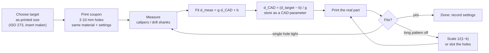

# F3D.04 — Tolerances, clearances and fits

<!-- glance:start -->
<!-- generated by tools/build.py from curriculum/syllabus.yaml — edit the syllabus, not this block -->

| | |
|---|---|
| **Track** | Optional foundation |
| **Difficulty** | Beginner |
| **Time** | 40 min |
| **Hardware** | none |
| **Software** | none |
| **Prerequisites** | [F3D.03 STL, 3MF, STEP and slicers](F3D.03-file-formats-slicers.md) |
| **Skip if** | Your printed parts fit on the first try. |

<!-- glance:end -->

## What you will learn

- Pick clearance holes for M2, M2.5 and M3 screws from ISO 273, and explain close, normal and loose fits.
- Explain why FDM holes print undersize and parts grow or shrink, and how big those errors typically are.
- Measure a printed test coupon and fit a compensation model, then compute the CAD size for any hole.
- Check whether a hole pattern will line up, using the fixed- and floating-fastener rules.
- Design clearance, sliding and press fits and fix the common first-layer and horizontal-hole problems.

## Why it matters

The most common first experience with a printed robot part: the model is perfect, the print looks great, and the screw won't go in. Or the sensor board's holes don't line up with the bracket's. Or the bearing falls out. FDM printing is accurate to a few tenths of a millimetre, and a few tenths is exactly the gap between "slides in" and "doesn't fit".

This lesson turns that into numbers you design with. Every bracket in [F3D.05](F3D.05-mounting-bracket.md), every heat-set insert hole and gear bore in [F3D.06](F3D.06-gears-inserts-fasteners.md), and every part you order from a service in [F3D.07](F3D.07-materials-chassis-ordering.md) uses them. It also matters in the main path: the LiDAR, camera and arm mounts in [20.02](../../20-final-robot/20.02-hardware-integration.md) have to put sensors where the URDF says they are, and a mount that only fits with force is rarely where the URDF says.

<!-- prereqs:start -->
## Prerequisites

You need these first:

- [F3D.03 STL, 3MF, STEP and slicers](F3D.03-file-formats-slicers.md)

### Optional prerequisite links

None.

Check your readiness: `python course.py why F3D.04`
<!-- prereqs:end -->

## Concept

Every manufacturing process has **tolerance**: the range a real dimension can land in. A laser-cut acrylic plate might be ±0.1 mm, a cheap 3D print ±0.2–0.3 mm, a CNC-machined aluminium part ±0.02 mm. Engineers don't fight tolerance; they design **fits** that work anywhere inside it. The analogy is timeouts in a distributed system: the network latency is not a fixed number, so you design for the range, with margin.

Three kinds of fit cover almost every robot part:

- **Clearance fit.** The hole is always bigger than the shaft or screw: a screw through a bracket, a shaft that must turn. You choose how much gap.
- **Press (interference) fit.** The hole is slightly *smaller* than the part going in, so it is held by friction: a bearing in a printed hub, a magnet in a pocket.
- **Transition fit.** Somewhere in between; may be slightly loose or slightly tight. Printed parts are too variable to use it on purpose.

FDM adds its own systematic errors on top of random scatter, and the good news is that systematic errors can be measured and compensated:

- **Holes print small.** The nozzle pushes plastic slightly outward from each line. On an outer wall that makes the part a little bigger; on the wall of a hole it makes the hole smaller. Small holes also lose area to the polygon approximation ([F3D.03](F3D.03-file-formats-slicers.md)). CNC Kitchen measured their printed holes at about **0.25 mm smaller** than in CAD.
- **The part shrinks as it cools.** Plastic contracts. Over short distances it disappears in the noise; over a 150 mm hole pattern it can be most of a millimetre.
- **The first layer flares out** ("elephant's foot"), because the first layer is squashed onto the bed.
- **Horizontal holes sag at the top**, because the top of the hole is a bridge printed over air.

> [!TIP]
> **Ask your teacher:** "Give me a list of 5 parts that must fit together on karmel, and for each ask me whether it needs a clearance or a press fit and how much. Then correct me."

## Technical explanation

### Level 1 — Clearance holes for metric screws (ISO 273)

ISO 273 gives three series of clearance holes. Use **medium** by default.

| Screw | Fine (close) | **Medium (normal)** | Coarse (loose) | Robot use |
|---|---|---|---|---|
| M2 | 2.2 mm | **2.4 mm** | 2.6 mm | VL53L1X carrier, small sensor boards |
| M2.5 | 2.7 mm | **2.9 mm** | 3.1 mm | Raspberry Pi, RPLIDAR C1 base screws |
| M3 | 3.2 mm | **3.4 mm** | 3.6 mm | Brackets, motor mounts, most robot hardware |

These are the **as-printed** diameters you want. Because FDM holes come out small, the number you *draw* in CAD is larger (Level 3).

What the Prusa Knowledge Base gives as starting points for FDM: printers are accurate to **at least 0.2 mm**, and parts that must move against each other should start with **at least 0.3 mm** of gap. Treat both as starting points for your own test prints, not guarantees.

### Level 2 — Will the hole pattern line up?

A screw passes through a hole of diameter $H$ if the screw (diameter $F$) is not offset from the hole's centre by more than the radial gap. Two cases matter.

**Fixed fastener**: the screw is fixed in one part (a tapped hole, a heat-set insert, a nut glued in) and passes through a clearance hole in the other. All the positional error must fit in one radial gap:

$$e_{max} = \frac{H - F}{2}$$

**Floating fastener**: both parts have clearance holes and a nut is on the far side. Each part can shift the other way, so the allowed offset between the two hole centres doubles:

$$e_{max} = H - F$$

*Example:* M3 screw ($F = 3.0$ mm) through a 3.4 mm hole. Fixed: $e_{max} = 0.2$ mm. Floating: $e_{max} = 0.4$ mm. The LiDAR screws into its own threaded base, so a LiDAR mount is a fixed-fastener case: your hole centres must be within 0.2 mm of the true pattern.

**Shrinkage** is the error that grows with distance. A part that shrinks by a fraction $k$ changes a length $L$ by

$$\Delta L = k L$$

*Example:* a PLA part shrinks by $k = 0.5\,\%$ (the real value depends on material, printer and part; measure yours). Two holes 150 mm apart end up $0.005 \times 150 = 0.75$ mm closer. Measured from the pattern's centre, each end hole is off by 0.375 mm. That is almost twice the 0.2 mm a fixed fastener allows: the screws won't both go in, even though each hole is the right size. The fix is a slicer **scale** of $1/(1 - k) = 100.5\,\%$, or slotted holes for long patterns, or both.

On a 12.7 mm VL53L1X pattern the same shrinkage is only 0.06 mm. Shrinkage matters for long patterns; hole size matters everywhere.

### Level 3 — Measure, then compensate

Guessing a compensation value works until you change printer, filament or nozzle. The reliable method is the one you'd use for any sensor: **calibrate**.

1. Print a **test coupon**: a plate with holes drawn at 2, 3, 4, 5, 6, 8 and 10 mm, in the material and settings you will use, holes vertical (axis perpendicular to the bed).
2. Measure each hole. Calipers' inside jaws work; drill-bit shanks or gauge pins are better for small holes ("the 3.7 mm drill shank goes in, 3.8 mm doesn't").
3. Fit a straight line to measured vs CAD diameter:

$$d_{measured} = g \cdot d_{CAD} + b$$

The offset $b$ is the constant error from line width and polygonisation; the gain $g$ captures scaling (shrinkage). Then invert it to get what to draw:

$$d_{CAD} = \frac{d_{target} - b}{g}$$

*Example* (the data in [Code](#code)): the fit gives $g = 0.9963$, $b = -0.241$ mm. For an M3 clearance hole of 3.4 mm as printed: $d_{CAD} = (3.4 + 0.241)/0.9963 = $ **3.65 mm**. For an M3 heat-set insert, where the insert maker recommends a 4.0 mm hole: **4.26 mm**. CNC Kitchen found 4.2 mm in CAD to be the sweet spot on their printer, so the method and their measurement agree.

Most slicers also have a **hole compensation** or **XY hole compensation** setting that grows every hole by a fixed amount. It is convenient, but it applies to *every* hole, including ones you wanted tight. Compensating in CAD, with a named parameter like `hole_comp`, keeps the intent in the model.

A cheap, very reliable alternative: print holes 0.2–0.3 mm under size and **drill them** to the final size with a hand drill bit. A drilled hole in plastic is round and on size.

### Level 4 — Designing fits and fixing the known defects

**Fit starting points for FDM** (as-printed gap per diameter; then test):

| Fit | Gap (hole − shaft) | Example |
|---|---|---|
| Loose clearance | 0.4–0.6 mm | Screw through a bracket where alignment is not critical |
| Normal clearance | ISO 273 medium | M3 through 3.4 mm |
| Running / sliding | ≥ 0.3 mm | A printed hinge pin, a 6 mm shaft that must turn freely in a printed bushing (6.3 mm) |
| Light press | −0.05 to −0.1 mm | A 608 bearing (22 mm) in a 21.9–21.95 mm seat |
| Heat-set insert | Per the insert maker | M3 × 5.7 mm insert in a 4.0 mm hole |

Printed press fits are less forgiving than metal ones. Plastic creeps (slowly relaxes under constant stress), a thin wall around a press fit cracks, and the next print may be 0.05 mm different. For anything that must stay put, prefer a mechanical lock: a set screw, a clamp screw, a lip, or glue.

**Elephant's foot.** The first layer flares by a few tenths of a millimetre, which makes the bottom of a part too big and the bottom of a hole too small. Use the slicer's *elephant foot compensation*, and add a **0.4–0.5 mm chamfer** to bottom edges in CAD, which hides whatever is left.

**Horizontal holes.** A hole whose axis is parallel to the bed has a roof that is printed as a bridge, and it sags. The hole comes out oval and short in Z. Options, in order of preference: orient the part so the hole is vertical; draw the hole as a **teardrop** (a circle with a 45° pointed roof, which prints without bridging); print it undersize and drill it.

**Mating printed parts.** When two printed parts fit together (a lid on a box, a sensor in a pocket), both have errors in opposite directions: the pocket prints small and the tab prints big. Give the pair the gap you want **plus** the error of both surfaces, which is why Prusa's starting point for moving parts is at least 0.3 mm.

## Diagram

```text
  Fits, drawn as hole (outer circle) and shaft/screw (inner)

   CLEARANCE                 PRESS (interference)          FIXED vs FLOATING FASTENER
   hole > shaft              hole < part                   e = offset of hole centres

     .-----.                   .---.                        fixed (insert / tapped):
    /  .-.  \                 / ### \                         |<-- H -->|
   |  ( F )  |  gap = H - F  | #(F)# |  interference          |  (screw)|  e_max = (H - F) / 2
    \  '-'  /                 \ ### /   = F - H > 0           ------------  = 0.2 mm for M3 in 3.4
     '-----'                   '---'
                                                            floating (nut on the far side):
   M3 in 3.4 mm: gap 0.4       608 bearing 22.0 in           both holes can shift:
   radial gap 0.2 per side     21.95 seat: 0.05 mm           e_max = H - F = 0.4 mm


  Why FDM holes print small (top view of one layer around a hole)

        CAD hole edge ->  :  <- extruded line is ~0.45 mm wide and bulges
                          :#####
                     #####:#####     the line's centre follows the CAD edge offset
                    ######:          by half a line width, but squish pushes plastic
                     #####:#####     into the hole: measured d ≈ CAD d − 0.25 mm
                          :#####
```



## Code

Save as `hole_comp.py` and run `python hole_comp.py`. It needs `numpy`. It fits a straight line to coupon measurements and prints the CAD diameter to draw for common robot holes. The example measurements are illustrative numbers typical of a PLA coupon on a 0.4 mm nozzle; replace them with yours.

```python
"""hole_comp.py — fit a printer's hole error from a test coupon and compute CAD sizes.

Print a coupon with holes of known CAD diameters, measure each with calipers (or with gauge
pins/drill shanks), paste the numbers below, and let a straight-line fit tell you what to draw.
"""
from __future__ import annotations

import numpy as np

# CAD diameter (mm) -> measured diameter (mm). Illustrative numbers typical of a PLA coupon
# on a 0.4 mm nozzle: replace them with your own measurements.
CAD_MM = np.array([2.0, 3.0, 4.0, 5.0, 6.0, 8.0, 10.0])
MEASURED_MM = np.array([1.76, 2.74, 3.75, 4.73, 5.74, 7.72, 9.73])


def fit(cad: np.ndarray, measured: np.ndarray) -> tuple[float, float]:
    """Least-squares line measured = gain * cad + offset."""
    gain, offset = np.polyfit(cad, measured, 1)
    return float(gain), float(offset)


def cad_for(target_mm: float, gain: float, offset: float) -> float:
    """Invert the model: which CAD diameter prints as target_mm?"""
    return (target_mm - offset) / gain


def main() -> None:
    gain, offset = fit(CAD_MM, MEASURED_MM)
    resid = MEASURED_MM - (gain * CAD_MM + offset)
    print(f"measured = {gain:.4f} * cad {offset:+.3f} mm   (max residual {np.abs(resid).max():.3f} mm)")
    targets = {
        "M3 clearance, ISO 273 medium (3.4)": 3.4,
        "M3 heat-set insert (4.0 as printed)": 4.0,
        "M2 clearance, ISO 273 medium (2.4)": 2.4,
        "6 mm shaft, 0.3 mm running clearance": 6.3,
        "608 bearing seat, 22 mm, light press": 21.95,
    }
    for name, t in targets.items():
        print(f"{name:40s}: draw {cad_for(t, gain, offset):.2f} mm")


if __name__ == "__main__":
    main()
```

Output (verified with Python 3.14, numpy):

```text
measured = 0.9963 * cad -0.241 mm   (max residual 0.010 mm)
M3 clearance, ISO 273 medium (3.4)      : draw 3.65 mm
M3 heat-set insert (4.0 as printed)     : draw 4.26 mm
M2 clearance, ISO 273 medium (2.4)      : draw 2.65 mm
6 mm shaft, 0.3 mm running clearance    : draw 6.57 mm
608 bearing seat, 22 mm, light press    : draw 22.27 mm
```

The 22.27 mm bearing seat is an extrapolation: the coupon only went to 10 mm. Add a 22 mm hole to your coupon before trusting it.

## Exercise

### Exercise F3D.04-E1 — Screws and patterns `[numerical]`

Hardware: none.

1. The Raspberry Pi 5 sits on M2.5 brass standoffs whose threaded studs pass through your printed tray and are held by nuts underneath. What as-printed hole diameter do you use in the tray? Is this a fixed or a floating fastener case, and what is $e_{max}$?
2. In a variant of karmel's ToF bracket, the VL53L1X carrier is held by M2 screws into M2 heat-set inserts in the bracket. Which fastener case is that, and what is $e_{max}$ if the carrier's holes are 2.4 mm?
3. A printed LiDAR plate has four M2.5 holes (2.9 mm) on a pattern whose far corners are 60 mm apart. With 0.5 % shrinkage and the pattern centred, is the error inside $e_{max}$ for screwing into the LiDAR's threaded base?

### Exercise F3D.04-E2 — Shrinkage and scale `[numerical]`

Hardware: none. A PETG battery tray has two M3 holes 180 mm apart that must screw into inserts in the chassis (fixed fastener, 3.4 mm as-printed holes). The first print measures 178.9 mm between hole centres.

1. What is the shrinkage fraction $k$?
2. How far is each hole from where it should be (pattern centred)? Will the screws go in?
3. What slicer scale fixes it?
4. Name a design change that makes the part tolerate this shrinkage without rescaling.

### Exercise F3D.04-E3 — Fit your own coupon `[coding]`

Hardware: none needed; optionally access to a 3D printer, makerspace or service (not a course catalog item) to print a real coupon.

A PETG coupon on a different printer measured:

| CAD (mm) | 3.0 | 4.0 | 5.0 | 6.0 | 8.0 | 10.0 |
|---|---|---|---|---|---|---|
| Measured (mm) | 2.62 | 3.63 | 4.66 | 5.67 | 7.70 | 9.72 |

1. Put the data into `hole_comp.py` and run it.
2. What should you draw for an M3 clearance hole, an M3 insert hole (4.0 mm), an M2 clearance hole and the 6.3 mm shaft hole?
3. Compare with the PLA data. Which printer/material has the larger constant error?
4. If you can print: design the coupon in CAD (10 × 70 × 4 mm plate, 7 holes), print it, measure it and use your own data.

### Exercise F3D.04-E4 — Predict the horizontal hole `[predict]`

Hardware: none. The F3D.05 bracket is printed lying on its side, so the two M2 sensor holes in the upright end up **horizontal** (axis parallel to the bed). They are drawn at 2.65 mm, which printed vertically gives 2.4 mm.

*Predict before reading on:* will the horizontal holes be the same, rounder, larger or out of round, and in which direction? What are two ways to get an M2 screw through reliably?

## Expected result

**F3D.04-E1:**
1. The tray holes are **2.9 mm** (ISO 273 medium) as printed. Each stud can shift inside its tray hole before the nut is tightened, and the Pi's own holes are clearance holes too, so nothing is threaded into a fixed position: treat it as a **floating fastener** case, $e_{max} = 2.9 - 2.5 =$ **0.4 mm**.
2. A **fixed fastener** case: the screw is located by the insert. With 2.4 mm holes, $e_{max} = (2.4 - 2.0)/2 =$ **0.2 mm**.
3. Each far corner moves $0.005 \times 60 / 2 = 0.15$ mm toward the centre. Fixed fastener $e_{max} = (2.9 - 2.5)/2 = 0.2$ mm. **Yes, it fits**, with 0.05 mm to spare before any other error. It is marginal; a 3.1 mm coarse hole would give 0.3 mm.

**F3D.04-E2:**
1. $k = (180 - 178.9)/180 = $ **0.61 %**.
2. Each hole is $1.1/2 = $ **0.55 mm** off, far more than the fixed-fastener $e_{max} = 0.2$ mm. The screws will not both go in.
3. Scale $180/178.9 = $ **100.61 %** (the same as $1/(1-k)$).
4. Make one hole a **slot** along the long axis (for example 3.4 × 5 mm), or locate the part with one hole and a slot, which is standard practice for long patterns. Alternatives: 3.6 mm coarse holes help a little but not enough on their own (0.3 mm).

**F3D.04-E3:**
1. The fit is `measured = 1.0147 * cad -0.422 mm` with a max residual of about 0.008 mm.
2. Draw **3.77 mm** (M3 clearance), **4.36 mm** (M3 insert), **2.78 mm** (M2 clearance) and **6.62 mm** (6.3 mm shaft hole).
3. The PETG printer has the larger constant error (−0.42 mm against −0.24 mm), partly offset by a gain slightly above 1. PETG is often printed with more squish and oozes more, which closes holes further.
4. Your own numbers will differ; a residual under about 0.05 mm means the straight-line model is adequate.

**F3D.04-E4:** **Out of round.** The top of the hole is a bridge that sags, so the hole is shorter in Z (vertical) than across. It is typically noticeably under size in that direction, while the horizontal width is close to the vertical-hole value. Two fixes: draw the holes as **teardrops** (45° roof), or print them slightly under size and **drill** them to 2.4 mm. (Re-orienting the bracket so the holes are vertical would put the bend's layers in the weak direction, which is why F3D.05 accepts horizontal holes and drills them.)

## Troubleshooting

### Symptom: the screw doesn't go through a printed hole
1. Measure the hole with a drill shank or calipers. If it is under the ISO 273 value, it's hole size: compensate in CAD or drill it.
2. If the hole is on size but the screw still binds, check the *position*: does the screw go through each hole on its own? Then it's the pattern (Level 2).
3. Check the bottom of the hole for elephant's foot. A tight ring at the bottom only is first-layer squish: chamfer it or use the slicer's compensation.
4. For a horizontal hole, check roundness; a sagging roof needs a teardrop or a drill.

### Symptom: each screw fits alone but not all at once
1. Measure the distance between the outermost holes and compare with CAD. A consistent short measurement is shrinkage: scale.
2. If the error is in one direction only (X but not Y), check the printer's belt tension or steps/mm calibration; that is a printer problem, not a design problem.
3. For long patterns, slot all but one hole.

### Symptom: a press-fit part is loose after a few days
1. Plastic creeps under constant stress, especially PLA in a warm place.
2. Add a mechanical lock (a set screw, a clamp, a lip) or a drop of glue; don't rely on friction alone.
3. Thicken the wall around the press fit; a thin wall stretches.

### Symptom: parts that fit on one printer don't fit on another
1. Hole compensation is printer-, material- and settings-specific.
2. Print the coupon on the new printer and refit. Keep the compensation as a named CAD parameter so changing it is one edit.

## Common mistakes

- **Drawing holes at the screw's nominal size.** A 3.0 mm hole for an M3 screw prints at about 2.75 mm. Start from ISO 273, then compensate.
- **Compensating by guessing** instead of printing a coupon. Ten minutes of printing replaces many failed parts.
- **Using a global slicer hole compensation** and then wondering why a press fit is loose.
- **Ignoring shrinkage on long patterns.** It is invisible on a sensor board and decisive on a 180 mm tray.
- **Printing precise holes horizontally.** Rotate the part or use teardrops.
- **Relying on printed press fits for anything that carries load for months.** Plastic creeps.
- **Calibrating with PLA and printing the real part in PETG** (or at a different wall count, or on a different printer).

## Knowledge check

1. What as-printed hole diameters do you use for M2, M2.5 and M3 screws at the ISO 273 medium series?
   <details><summary>Answer</summary>

   **2.4 mm, 2.9 mm and 3.4 mm.** Then compensate for the printer to get the CAD size.
   </details>

2. An M3 screw goes into a heat-set insert through a 3.4 mm hole in a printed bracket. How far can the hole centre be from the insert's centre?
   <details><summary>Answer</summary>

   Fixed fastener: $e_{max} = (3.4 - 3.0)/2 =$ **0.2 mm**.
   </details>

3. A coupon gives $d_{meas} = 0.99 \, d_{CAD} - 0.30$. What do you draw for a 4.0 mm as-printed insert hole?
   <details><summary>Answer</summary>

   $(4.0 + 0.30) / 0.99 =$ **4.34 mm**.
   </details>

4. Why do printed holes come out smaller than drawn, while outer dimensions tend to come out slightly bigger?
   <details><summary>Answer</summary>

   The extruded line is squashed and bulges sideways. On an outer wall the bulge points outward (part grows); on a hole wall it points into the hole (hole shrinks). Small holes also lose area to the polygon approximation of the mesh.
   </details>

5. Predict: a 200 mm-long deck printed in PLA with 0.5 % shrinkage has M3 holes at both ends that must match a metal chassis with tapped holes. Will it fit?
   <details><summary>Answer</summary>

   Shrinkage is $0.005 \times 200 = 1.0$ mm; each end is 0.5 mm off. Fixed fastener $e_{max} = 0.2$ mm for 3.4 mm holes. **No.** Scale by 100.5 %, slot the holes, or both.
   </details>

6. Debugging: the bottom 0.5 mm of every vertical hole is tight and the rest is fine. What is it and what do you change?
   <details><summary>Answer</summary>

   **Elephant's foot**: the squashed first layer flares into the hole. Turn on elephant-foot compensation in the slicer and add a 0.4–0.5 mm chamfer to the hole's bottom edge in CAD (or reduce first-layer squish).
   </details>

7. Why is a 0.3 mm gap a sensible starting point for two printed parts that slide against each other, when a 0.2 mm accuracy figure is quoted for the printer?
   <details><summary>Answer</summary>

   Both surfaces have errors, and they often go in opposite directions (the slot prints small, the tab prints big). The gap has to absorb both errors plus leave real clearance for motion.
   </details>

## Practical challenge

Build a **tolerance gauge** for your printer and material, and prove it works on a real fit.

**Acceptance criteria:**
- A parametric coupon in CAD with vertical holes from 2 to 10 mm and a 22 mm hole, plus pins of 3.0, 6.0 and 8.0 mm with clearance holes of +0.1, +0.2, +0.3 and +0.4 mm next to them, and a horizontal 3.4 mm hole drawn both round and as a teardrop.
- Printed (at home, at a makerspace, or by a service), measured, and fitted with `hole_comp.py`. The residual is below 0.05 mm.
- A one-line **printer profile** saved with your CAD parameters: material, printer, walls, `hole_gain`, `hole_offset`, sliding gap that works, horizontal-hole method.
- One real part (an M3 bracket or a 608 bearing hub) designed with those parameters fits on the first print.

If you have no access to printing at all, do the CAD and the analysis with the E3 data and state which step you could not do.

## You can skip this if…

Your printed parts fit on the first try. Check: answer knowledge-check questions 2, 3 and 5 correctly without looking, and state your printer's hole compensation from a real coupon.

`python course.py skip F3D.04 --reason "my printed parts fit first time; I have measured hole compensation"`

## Go deeper

- [Prusa Knowledge Base — Modeling with 3D printing in mind](https://help.prusa3d.com/article/modeling-with-3d-printing-in-mind_164135): accuracy, gaps for moving parts, elephant's foot and overhangs.
- [CNC Kitchen — Are our heat-set insert datasheets wrong?](https://www.cnckitchen.com/blog/are-our-heat-set-insert-datasheets-wrong): a measured example of printed holes coming out about 0.25 mm under size.
- [ISO 273 — Clearance holes for bolts and screws](https://www.iso.org/standard/4183.html): the standard behind the fine/medium/coarse series.
- [Prusa Knowledge Base — Layers and perimeters](https://help.prusa3d.com/article/layers-and-perimeters_1748): how perimeters and first-layer settings shape dimensions.

## Progress checkpoint

- [ ] I can pick ISO 273 clearance holes for M2, M2.5 and M3.
- [ ] I can explain why FDM holes print small and how large the errors are.
- [ ] I can fit hole compensation from a coupon and compute CAD sizes.
- [ ] I can check a hole pattern with the fixed- and floating-fastener rules, including shrinkage.
- [ ] I can design clearance, sliding and press fits and deal with elephant's foot and horizontal holes.

`python course.py complete F3D.04` (exercises done) · `python course.py master F3D.04` (challenge done) · `python course.py struggle F3D.04 "what was hard"`

Next: [F3D.05 — Exercise: design a sensor mounting bracket](F3D.05-mounting-bracket.md).
