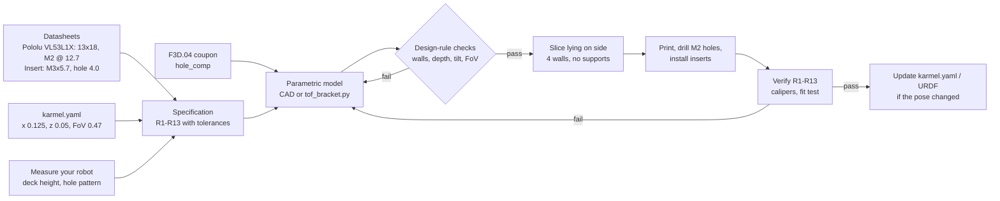

# F3D.05 — Exercise: design a sensor mounting bracket

<!-- glance:start -->
<!-- generated by tools/build.py from curriculum/syllabus.yaml — edit the syllabus, not this block -->

| | |
|---|---|
| **Track** | Optional foundation |
| **Difficulty** | Intermediate |
| **Time** | 1 h 30 min |
| **Hardware** | none |
| **Software** | cad |
| **Prerequisites** | [F3D.04 Tolerances, clearances and fits](F3D.04-tolerances-fits.md) |
| **Skip if** | You have designed and printed robot brackets. |

<!-- glance:end -->

## What you will learn

- Turn a sensor's datasheet and the robot's `karmel.yaml` pose into a written, testable bracket specification.
- Size holes, standoffs, walls and heat-set insert bosses from the rules of F3D.04 and the insert maker's numbers.
- Check that a sensor's field of view is not blocked and compute where its cone meets the floor.
- Choose a print orientation that puts the layers where the load is, and design out supports.
- Build the bracket in CAD or as parametric CadQuery code, with automated design-rule checks.

## Why it matters

A sensor is only as good as its mount. Karmel's configuration file says the front VL53L1X time-of-flight sensor sits at $x = 0.125$ m, $z = 0.05$ m in `base_link`, and every range reading is transformed into the robot frame using exactly those numbers ([05.08 URDF](../../05-frames-and-transforms/05.08-urdf-and-xacro.md)). If the real sensor is 8 mm lower and tilted 4° down, the robot sees the floor as an obstacle at 40 cm and the software team spends a day "fixing" a filter. The LiDAR in [07.07](../../07-sensors/07.07-2d-lidar.md) has the same problem in 360°: any screw head or cable above its scan plane shows up as a permanent obstacle in every map.

This lesson is one complete design exercise that uses [F3D.02](F3D.02-cad-basics.md) (parametric CAD), [F3D.03](F3D.03-file-formats-slicers.md) (orientation and slicing) and [F3D.04](F3D.04-tolerances-fits.md) (holes and fits). The same process gives you the camera mount, the LiDAR mount and the arm base plate in [20.02](../../20-final-robot/20.02-hardware-integration.md). The ToF sensor itself is covered in [07.04](../../07-sensors/07.04-tof-sensors.md).

<!-- prereqs:start -->
## Prerequisites

You need these first:

- [F3D.04 Tolerances, clearances and fits](F3D.04-tolerances-fits.md)

### Optional prerequisite links

None.

Check your readiness: `python course.py why F3D.05`
<!-- prereqs:end -->

## Concept

Design a bracket the way you would design an API: **write the contract first, then implement it, then test it against the contract.**

The contract has four kinds of requirement:

1. **Interfaces.** What does the bracket bolt to on each side? The sensor board's hole pattern on one side, the robot's deck on the other. These come from datasheets and from measuring your robot, never from a photo.
2. **Pose.** Where must the sensor end up, in the robot frame, and pointing which way? This comes from `labs/config/karmel.yaml`, or you change the YAML to match what you build. Either way they must agree.
3. **Function.** What must the bracket *not* do? Not block the sensor's field of view, not flex so the reading shakes when the motors start, not touch components on the back of the board.
4. **Manufacturing.** Printable without supports, strong in the direction of the load, holes that fit on the first print, screws you can actually reach with a screwdriver.

Then write each requirement as a number with a tolerance, so "done" is checkable. "Sensor at about the right height" is not a requirement; "optical centre 95 ± 2 mm above the floor" is.

The bracket in this lesson is a simple L-shape: a vertical **upright** the sensor board screws to, and a horizontal **base** that screws to the deck, with two triangular **ribs** stiffening the corner. It looks trivial, and yet it contains almost every decision a larger robot part needs.

> [!TIP]
> **Ask your teacher:** "Review my bracket specification line by line. For each requirement, ask me how I will verify it on the printed part."

## Technical explanation

### Level 1 — Collect the interface numbers

**The sensor.** The course uses a VL53L1X carrier. This exercise uses the **Pololu VL53L1X carrier** (4project, ≈ ₪108), because its mechanical data is published: the board is **13 × 18 × 2 mm**, with **two mounting holes 0.5″ (12.7 mm) apart for M2 or #2 screws**, and weighs 0.5 g. If you have the Adafruit VL53L1X (PiiTel, ≈ ₪80), it is 25.5 × 17.5 × 4.6 mm; measure its hole spacing with calipers and change one parameter. The sensor emits 940 nm infrared light from a Class 1 laser, which is eye-safe.

**The pose.** From [`labs/config/karmel.yaml`](../../labs/config/karmel.yaml):

```text
sensors.range_front:  x_m 0.125   y_m 0.0   z_m 0.05   fov_rad 0.47   max_range_m 4.0
drive.wheel_radius_m: 0.045        base_link is on the wheel axis, 45 mm above the floor
chassis: length 0.25 m, width 0.20 m
```

So the sensor's optical centre must be **45 + 50 = 95 mm above the floor**, on the robot's centre line ($y = 0$), at the front of the 250 mm chassis ($x = 125$ mm).

**The deck.** Measure the height of the top of your front deck above the floor. This lesson uses **60 mm** as the example; your robot will differ, and the design takes it as a parameter. The bracket screws to the deck from below with M3 screws into brass heat-set inserts in the bracket's base ([F3D.06](F3D.06-gears-inserts-fasteners.md) covers inserts in detail).

**The insert.** A standard M3 heat-set insert (CNC Kitchen or ruthex type) is **5.7 mm long**, its knurl is about **4.6 mm** in outer diameter, and CNC Kitchen recommends a **4.0 mm hole**. For blind holes they recommend a hole about **1 mm deeper** than the insert. Their own measurements found printed holes about 0.25 mm under size, so 4.2 mm in CAD worked best on their printer; your coupon from F3D.04 gives your number.

### Level 2 — The specification (the acceptance criteria)

This is the contract. The Expected result section checks every line.

| # | Requirement | Value | Source |
|---|---|---|---|
| R1 | Optical centre height above the floor | **95 ± 2 mm** | karmel.yaml |
| R2 | Optical centre lateral position | on the centre line, ±1 mm | karmel.yaml |
| R3 | Front of sensor at the chassis front edge | ±3 mm | karmel.yaml, $x = 0.125$ m |
| R4 | Sensor holes: spacing / as-printed diameter | **12.7 mm / 2.4 mm** (ISO 273 medium for M2) | Pololu, ISO 273 |
| R5 | Standoffs under the board | ≥ 2 mm tall, 5 mm OD | keeps solder joints off the plastic |
| R6 | Deck fixing: 2 × M3 heat-set inserts, M3 × 5.7 mm | as-printed hole **4.0 mm**; depth ≥ 5.7 mm (≥ 6.7 mm if blind) | CNC Kitchen |
| R7 | Plastic around each insert (beyond the 4.6 mm knurl) | **≥ 1.8 mm** = 4 perimeters of a 0.45 mm line | Prusa wall table |
| R8 | Upright thickness | ≥ 3 mm (≥ 4 perimeters, stiff enough not to vibrate) | design rule |
| R9 | Upward tilt of the sensor face | **5 ± 1°**, and less than half the FoV (13.5°) | Level 3 |
| R10 | Nothing in the field-of-view cone within 1 m except the floor beyond 600 mm | — | Level 3 |
| R11 | Print orientation | lying on its side, no supports | F3D.03 |
| R12 | Size / mass | fits in a 50 mm cube; ≤ 15 g in PLA or PETG | budget |
| R13 | Screws reachable | M2 nuts on the back of the upright, M3 screws from under the deck | assembly |

### Level 3 — The geometry: height, tilt and the floor

The VL53L1X has a field of view of $\theta_{FoV} = 0.47$ rad (27°), so the cone opens $\theta_{FoV}/2 = 13.46°$ above and below its axis. A sensor at height $h$ above the floor, tilted up by $\alpha$, has its lower cone edge pointing down by $(\theta_{FoV}/2 - \alpha)$. That edge meets the floor at a distance

$$d_{floor} = \frac{h}{\tan(\theta_{FoV}/2 - \alpha)}$$

*Example:* $h = 95$ mm and no tilt: $d_{floor} = 95 / \tan(13.46°) = $ **397 mm**. The sensor reports "something at 40 cm" on an empty floor, which is exactly the problem that looks like a software bug. Tilting up by $\alpha = 5°$: $d_{floor} = 95 / \tan(8.46°) = $ **638 mm**. At 10°, it is 1,569 mm.

Why not tilt more? Because the upper edge of the cone rises: at 5° tilt it points up at 18.46°, so at 1 m it is already $95 + 1000 \tan(18.46°) = 429$ mm above the floor, over a low obstacle like a shoe or a cable. And a tilt larger than the half-FoV (13.46°) means the cone's lower edge points *up*: the sensor would no longer see objects at its own height directly ahead. 5° is a compromise: the floor echo moves beyond the robot's stopping distance (0.275 m at full speed, from [FP.01](../physics/FP.01-kinematics-units.md)) while low obstacles are still seen. The real sensor also has software ROI settings that narrow the cone; [07.04](../../07-sensors/07.04-tof-sensors.md) uses them.

Tilting also changes the vertical position of the sensor centre slightly: a point 35 mm up a 5°-tilted upright is $35 \cos 5° = 34.87$ mm high, a 0.13 mm change, well inside R1's ±2 mm.

If the tilt changes, update `karmel.yaml` and the URDF with the pitch too. A mount that is tilted but described as level produces range readings in the wrong place.

### Level 4 — Strength, orientation and screws

**Where is the load?** The bracket carries almost no weight (0.5 g), but a robot hits things. A bump on the sensor pushes the upright backwards and bends the corner. That makes the corner the critical section, and it decides orientation:

- **Printed standing** (base on the bed), the corner is made of stacked layers, and a push peels them apart. It breaks along a layer line.
- **Printed lying on its side** (one rib face on the bed), every layer contains the complete L, ribs included. The corner is continuous plastic. The part also has flat sides, so it needs no supports.

The cost of that orientation: the M2 holes in the upright and the insert holes in the base become **horizontal** holes, which print slightly oval ([F3D.04](F3D.04-tolerances-fits.md)). For a bracket, strength wins: drill the M2 holes to 2.4 mm after printing, and the soldering iron re-forms the insert holes as the inserts go in.

**Ribs** add stiffness where the bending moment is largest. An 18 mm tall rib on each side makes the section at the corner several times deeper than the 3.6 mm upright alone. Bending stiffness grows with the cube of section depth, so the ribs matter far more than infill or a thicker upright.

**Screw lengths.**

- Deck: a 3 mm acrylic deck + up to 5.7 mm of insert: M3 × **8** gives 5 mm of thread in the insert without bottoming. (M3 × 10 would reach 7 mm, beyond the insert, but the insert holes are through holes, so it would only poke out of the top of the base. Avoid it anyway.)
- Sensor: board 2 mm + standoff 2.5 mm + upright 3.6 mm + M2 nut 1.6 mm = 9.7 mm, plus one or two threads showing: M2 × **12**.

**Why inserts instead of screwing into plastic?** The bracket will be taken off every time the deck is rebuilt. Threads cut directly into PLA wear out after a few cycles; a brass insert survives hundreds.

## Diagram

```text
  Side view (y out of the page). x forward, z up. Dimensions in mm, deck top = 60 above floor.

                    tilt 5°
                     |<->|
            ______   :
           |      |  :                         _ _ _ _ upper cone edge, +18.5°
           |  (o)=|==:=[##]  <- M2 x 12,          _ _ _
           |      |  :  ^   standoff 2.5,             _ _ _
           |      |  :  |   board 2                         _ _
    upright|  (o)=|==:=[##]-- sensor axis, +5° ---------------------->
     3.6   |      |  :  |  optical centre 35 above deck = 95 above floor
       ____|      |  :  |   _ _ _
      |\  rib 18  |  :  |         _ _ _ _  lower cone edge, -8.5°
      |  \        |  :  |                  _ _ _ _ _ _ _ _   meets floor
  base|____\______|  :  |                                  _ _ _ _ _ 638 mm ahead
   7  |[ins]      |  :  |
  ====|===========|==:==|==== front deck (60 above floor) ===|
      |<-- 22 --->|     |                                     deck edge = chassis front, x = 125
        M3 x 8 from below into the insert
```

```text
  Print orientation: lying on its side (view from above the bed)

      +-------------------+
      |      upright      |\
      |                   |  \      every layer contains the whole L-shape
      |                   | rib\    -> the corner cannot peel apart
      +-------------------+------\
      |          base            |
      +--------------------------+
      ^ bed contact = one side face (rib face flush with it), no supports needed
```



## Code

The reference implementation is parametric CadQuery code. Save it as `tof_bracket.py` and run `python tof_bracket.py` in a virtual environment with `pip install cadquery`. It builds the bracket, prints its size, volume, sensor height and floor-intercept distance, runs the design-rule checks from the specification, and exports `tof_bracket.step` and `tof_bracket.stl`.

```python
"""tof_bracket.py — parametric L-bracket for a Pololu VL53L1X carrier on karmel's front deck.

Frame: x forward, y left, z up (REP-103), millimetres, origin at the bracket's front-bottom
edge on the deck. Run:  python tof_bracket.py   -> tof_bracket.step, tof_bracket.stl
Requires: pip install cadquery   (tested with CadQuery 2.8 on Python 3.14)
"""
from __future__ import annotations

import math
from dataclasses import dataclass

import cadquery as cq


@dataclass(frozen=True)
class BracketParams:
    # --- printer calibration (F3D.04): CAD = wanted + hole_comp -------------------------
    hole_comp: float = 0.25
    # --- sensor: Pololu VL53L1X carrier, 13 x 18 mm, 2 x M2 holes 12.7 mm apart ---------
    sensor_hole_spacing: float = 12.7
    m2_clearance: float = 2.4          # ISO 273 medium series
    standoff_od: float = 5.0
    standoff_h: float = 2.5            # lifts the board so its solder joints clear the plate
    deck_top_above_floor: float = 60.0 # MEASURE YOUR ROBOT: top of karmel's front deck above the floor
    sensor_center_h: float = 35.0      # sensor centre above the deck -> 95 mm above the floor
    tilt_deg: float = 5.0              # face tilted up so the cone meets the floor further away
    # --- upright ----------------------------------------------------------------------
    upright_w: float = 26.0
    upright_t: float = 3.6             # 8 perimeters of a 0.45 mm line
    # --- base, mounted from below the deck with M3 screws into heat-set inserts --------
    base_len: float = 22.0
    base_t: float = 7.0
    m3_insert_hole: float = 4.0        # wanted as-printed diameter for a CNC Kitchen/ruthex M3x5.7
    insert_len: float = 5.7
    m3_spacing_y: float = 12.0
    rib_t: float = 3.0
    rib_h: float = 18.0


def build(p: BracketParams = BracketParams()) -> cq.Workplane:
    top_hole = p.sensor_center_h + p.sensor_hole_spacing / 2
    upright_h = top_hole + p.standoff_od / 2 + 3.0   # 3 mm of plastic above the top hole

    # Upright: a plate in front of the base, its front face on x = 0.
    upright = cq.Workplane("XY").box(p.upright_t, p.upright_w, upright_h, centered=(False, True, False))
    upright = upright.translate((-p.upright_t, 0, 0))
    hole_zs = [p.sensor_center_h - p.sensor_hole_spacing / 2, top_hole]
    standoffs = (
        cq.Workplane("YZ").pushPoints([(0, z) for z in hole_zs])
        .circle(p.standoff_od / 2).extrude(p.standoff_h)
    )
    upright = upright.union(standoffs)
    holes = (
        cq.Workplane("YZ").workplane(offset=-p.upright_t - 1)
        .pushPoints([(0, z) for z in hole_zs])
        .circle((p.m2_clearance + p.hole_comp) / 2)
        .extrude(p.upright_t + p.standoff_h + 2)
    )
    upright = upright.cut(holes)
    # Tilt the upright back about its front-bottom edge (the y axis through the origin).
    upright = upright.rotate((0, 0, 0), (0, 1, 0), -p.tilt_deg)

    base = cq.Workplane("XY").box(p.base_len, p.upright_w, p.base_t, centered=(False, True, False))
    base = base.translate((-p.base_len, 0, 0))
    x_insert = -(p.upright_t + p.base_len) / 2
    insert_holes = (
        cq.Workplane("XY").workplane(offset=-1)
        .pushPoints([(x_insert, -p.m3_spacing_y / 2), (x_insert, p.m3_spacing_y / 2)])
        .circle((p.m3_insert_hole + p.hole_comp) / 2)
        .extrude(p.base_t + 2)
    )
    base = base.cut(insert_holes)

    # Two triangular ribs along the outer edges stiffen the bend.
    rib_profile = [(0.0, 0.0), (-(p.base_len - p.upright_t), 0.0), (0.0, p.rib_h)]
    ribs = None
    for y in (p.upright_w / 2 - p.rib_t, -p.upright_w / 2):
        rib = (
            cq.Workplane("XZ").polyline(rib_profile).close().extrude(-p.rib_t)
            .translate((-p.upright_t, y, p.base_t))
        )
        ribs = rib if ribs is None else ribs.union(rib)

    part = base.union(upright).union(ribs)
    # The tilted upright dips a fraction of a millimetre below z = 0: trim it flat.
    keep = cq.Workplane("XY").box(200, 200, 200, centered=(True, True, False))
    return part.intersect(keep)


def check(p: BracketParams) -> list[str]:
    """Design-rule checks from F3D.04-F3D.06. Returns a list of violations."""
    problems = []
    knurl_od = 4.6
    wall_to_edge = p.upright_w / 2 - (p.m3_spacing_y / 2 + knurl_od / 2)
    wall_between = p.m3_spacing_y - knurl_od
    if min(wall_to_edge, wall_between) < 1.8:
        problems.append(f"wall around insert {min(wall_to_edge, wall_between):.2f} mm < 1.8 mm (4 perimeters)")
    if p.base_t < p.insert_len + 1.0:
        problems.append(f"base {p.base_t} mm too thin for a {p.insert_len} mm insert (+1 mm)")
    if p.upright_t < 4 * 0.45:
        problems.append("upright thinner than 4 perimeters")
    half_fov = math.degrees(0.47 / 2)
    if p.tilt_deg > half_fov:
        problems.append("tilt larger than half the field of view: sensor no longer sees its own height")
    return problems


def floor_hit_mm(p: BracketParams, fov_rad: float = 0.47) -> float | None:
    """Distance ahead at which the lower edge of the sensor's cone reaches the floor."""
    height = p.deck_top_above_floor + p.sensor_center_h
    down = fov_rad / 2 - math.radians(p.tilt_deg)
    return height / math.tan(down) if down > 0 else None


def main() -> None:
    p = BracketParams()
    part = build(p)
    solid = part.val()
    bb = solid.BoundingBox()
    print(f"bounding box: {bb.xlen:.1f} x {bb.ylen:.1f} x {bb.zlen:.1f} mm")
    print(f"volume: {solid.Volume() / 1000:.2f} cm^3, area: {solid.Area() / 100:.1f} cm^2, valid: {solid.isValid()}")
    print(f"sensor centre above floor: {p.deck_top_above_floor + p.sensor_center_h:.0f} mm "
          f"(karmel.yaml: base_link 45 mm + z 50 mm = 95 mm)")
    hit = floor_hit_mm(p)
    print(f"cone meets the floor {hit:.0f} mm ahead" if hit else "cone never meets the floor")
    print("design-rule problems:", check(p) or "none")
    cq.exporters.export(part, "tof_bracket.step")
    cq.exporters.export(part, "tof_bracket.stl", tolerance=0.01, angularTolerance=0.1)
    print("wrote tof_bracket.step and tof_bracket.stl")


if __name__ == "__main__":
    main()
```

Output (verified with CadQuery 2.8.0 on Python 3.14):

```text
bounding box: 22.2 x 26.0 x 46.7 mm
volume: 8.40 cm^3, area: 49.6 cm^2, valid: True
sensor centre above floor: 95 mm (karmel.yaml: base_link 45 mm + z 50 mm = 95 mm)
cone meets the floor 638 mm ahead
design-rule problems: none
wrote tof_bracket.step and tof_bracket.stl
```

The `hole_comp` of 0.25 mm is CNC Kitchen's measured undersize. Replace it with your coupon's result from F3D.04. `check()` is deliberately simple: it encodes R6–R9 so a parameter change that breaks them fails loudly, like a unit test.

**For OpenSCAD users**, the same bracket without the ribs and standoffs, as a starting point. This OpenSCAD version was written for the lesson but **not executed** by the course authors; open it in OpenSCAD and press F6 to check it renders.

```text
// tof_bracket.scad — simplified VL53L1X bracket (no ribs, no standoffs). Not executed by the course authors.
hole_comp = 0.25;
sensor_hole_spacing = 12.7;
m2_clearance = 2.4;
sensor_center_h = 35;
tilt_deg = 5;
upright_w = 26;
upright_t = 3.6;
base_len = 22;
base_t = 7;
insert_hole = 4.0;
m3_spacing_y = 12;
upright_h = sensor_center_h + sensor_hole_spacing / 2 + 5.5;
$fn = 64;

module upright() {
  difference() {
    translate([-upright_t, -upright_w / 2, 0]) cube([upright_t, upright_w, upright_h]);
    for (z = [sensor_center_h - sensor_hole_spacing / 2, sensor_center_h + sensor_hole_spacing / 2])
      translate([-upright_t - 1, 0, z]) rotate([0, 90, 0]) cylinder(d = m2_clearance + hole_comp, h = upright_t + 2);
  }
}

module base() {
  difference() {
    translate([-base_len, -upright_w / 2, 0]) cube([base_len, upright_w, base_t]);
    for (y = [-m3_spacing_y / 2, m3_spacing_y / 2])
      translate([-(upright_t + base_len) / 2, y, -1]) cylinder(d = insert_hole + hole_comp, h = base_t + 2);
  }
}

intersection() {
  union() {
    base();
    rotate([0, -tilt_deg, 0]) upright();
  }
  translate([-100, -100, 0]) cube([200, 200, 200]);
}
```

## Exercise

### Exercise F3D.05-E1 — Write the numbers for your robot `[numerical]`

Hardware: none (a tape measure if you have built karmel; otherwise use the example numbers).

1. Your front deck top is 52 mm above the floor instead of 60 mm. What must `sensor_center_h` be to meet R1?
2. With that deck height, the sensor at 95 mm and no tilt, where does the cone meet the floor? And at 5°?
3. Karmel stops within 0.275 m from full speed. What is the smallest tilt that puts the floor echo at least 2× that distance ahead?
4. Your deck is 4 mm plywood. Which M3 screw length do you buy for the insert fixing, and how many mm of thread end up in the 5.7 mm insert?

### Exercise F3D.05-E2 — Design the bracket `[coding]`

Hardware: none. Software: Onshape, FreeCAD, or Python with CadQuery.

1. Build the bracket to specification R1–R13, either by modelling it in CAD with named variables or by running and adapting `tof_bracket.py`.
2. Set `deck_top_above_floor` (and anything that depends on it) to your robot's value, or keep 60 mm.
3. Export STEP and STL. Run `stl_inspect.py` from F3D.03 on the STL.
4. Slice it lying on its side with 4 walls and 20 % infill. Record grams, time, and whether the slicer adds supports.

### Exercise F3D.05-E3 — Break the rules on purpose `[predict]`

Hardware: none. Software: Python with CadQuery (or reason it through with the formulas).

For each change, *predict first* which requirement fails and what `check()` reports; then run it with `dataclasses.replace(BracketParams(), ...)`:

1. `m3_spacing_y=20`
2. `base_t=6`
3. `tilt_deg=15`
4. `upright_w=18` (with the default 12 mm insert spacing)
5. `hole_comp=0.0`: which requirement fails, and why does `check()` not catch it?

### Exercise F3D.05-E4 — Print and fit test (optional) `[hardware]`

Hardware: `robot-base` (the VL53L1X and deck from Stage 1). Also needs access to a printer, makerspace or service. No-hardware alternative: complete E2 and have your AI teacher review the STEP file's dimensions.

> [!CAUTION]
> **Safety:** Heat-set inserts are installed with a soldering iron at about 225 °C for PLA or 245 °C for PETG. Use a stand, work on a heat-proof surface, keep the tip away from cables, and don't touch the insert or the plastic around it for a minute afterwards. Ventilate: hot plastic gives off fumes. Unplug the robot's battery before screwing anything to the deck.

1. Print the bracket, drill the M2 holes to 2.4 mm, install the two M3 inserts ([F3D.06](F3D.06-gears-inserts-fasteners.md)).
2. Mount the sensor with M2 × 12 screws and nuts, and the bracket with M3 × 8 screws from under the deck.
3. Measure R1, R3 and R9 with calipers and a phone inclinometer app.
4. On an empty floor, log the sensor's reading for 10 s. Then place a box 300 mm ahead and log again.

## Expected result

**F3D.05-E1:**
1. $95 - 52 = $ **43 mm**.
2. $h = 95$ mm either way, so the same as the lesson: **397 mm** at 0°, **638 mm** at 5°. The deck height changes the bracket, not the geometry of the cone.
3. Need $d_{floor} \ge 550$ mm: $\tan(13.46° - \alpha) \le 95/550$, so $13.46° - \alpha \le 9.80°$, $\alpha \ge$ **3.7°**. The 5° design meets it.
4. 4 mm deck + 5.7 mm insert: M3 × 8 gives **4 mm** of thread in the insert (M3 × 10 gives 6 mm, slightly longer than the insert, still acceptable for a through hole). Choose M3 × 8 or M3 × 10.

**F3D.05-E2:** A valid solid of roughly 22 × 26 × 47 mm and 8.4 cm³ (±10 % if you modelled it differently). `stl_inspect.py` agrees with CAD on the bounding box and volume. The slicer estimates about **8–10 g** and roughly half an hour, with no supports needed lying on its side. The acceptance criteria met in CAD: R1 (95 mm), R2, R3, R4 (12.7 mm, 2.4 + 0.25 mm drawn), R5 (2.5 mm), R6 (4.0 + 0.25 mm drawn, 7 mm deep through hole), R7 (4.7 mm to the edge, 7.4 mm between inserts), R8 (3.6 mm), R9 (5°), R10 (floor at 638 mm), R11, R12 (≤ 50 mm, ≈ 8 g), R13.

**F3D.05-E3:**
1. R7: `wall around insert 0.70 mm < 1.8 mm (4 perimeters)`. The inserts are 2.3 + 0.7 mm from the side edges and would bulge or crack the wall.
2. R6: `base 6 mm too thin for a 5.7 mm insert (+1 mm)`. (For a through hole 6 mm would technically hold the insert, but the check uses the conservative blind-hole rule.)
3. R9: `tilt larger than half the field of view: sensor no longer sees its own height`.
4. R7 again: with a 13 mm half-width replaced by 9 mm, the wall to the edge is $9 - 6 - 2.3 = 0.7$ mm.
5. R4/R6 fail on the printed part, not in CAD: the M2 holes print at about 2.15 mm and the insert holes at 3.75 mm. `check()` only knows the *drawn* geometry; it cannot know the printer's error. That is why the F3D.04 coupon exists.

**F3D.05-E4:** The bracket prints without supports and the inserts sit flush. R1 measures 93–97 mm, R3 within ±3 mm, R9 4–6°. On an empty floor the reading is steady at the sensor's maximum or "out of range" rather than a floor echo at about 0.4 m; with the box it reads 300 mm ± 20 mm (the ToF sensor's own accuracy, see 07.04). If the empty-floor reading shows about 400 mm, the sensor is not tilted: check that the bracket was not mounted backwards and that the board is not tilted on its standoffs.

## Troubleshooting

### Symptom: the sensor reports an obstacle 300–500 mm ahead on an empty floor
1. Measure the tilt. A level or downward-tilted sensor sees the floor at about 400 mm from 95 mm high.
2. Measure the height. A lower sensor sees the floor sooner: at 60 mm high with no tilt the floor is at 250 mm.
3. Check whether anything in front of the board (a screw head, the deck edge, a cable) is inside the 27° cone: slide a sheet of paper in from each side and watch the reading.
4. Only then look at software ROI settings (07.04).

### Symptom: the board's holes don't line up with the bracket's holes
1. Measure the board's hole spacing yourself. Different vendors' VL53L1X boards differ; the 12.7 mm value is for the Pololu carrier.
2. Check whether the printed holes are round and on size (drill them).
3. Check that the upright face is flat: a warped upright tilts the standoffs.

### Symptom: the bracket snapped at the corner
1. Look at the fracture surface. A clean flat break parallel to the layers means it was printed standing: reprint lying on its side.
2. If it was printed on its side, add walls (5–6) or make the ribs taller, and consider PETG, which is tougher than PLA.

### Symptom: the insert pulled out or spins
1. The hole was too large or the insert was too cold when installed. Check the as-printed hole against 4.0 mm.
2. The wall around it is too thin, so the plastic yielded: check R7.
3. Use the next insert size up only as a last resort; redesign the boss first.

## Common mistakes

- **Designing from a photo** instead of the datasheet or calipers. Board hole patterns differ between vendors of the "same" sensor.
- **Forgetting that the YAML and URDF must match the bracket.** Change the pose in `karmel.yaml` if the design changes it, including the pitch.
- **Printing the bracket the way it is installed.** The corner breaks along a layer.
- **Putting insert holes too close to an edge.** Inserts expand the plastic around them as they melt in.
- **No clearance for components on the back of the board.** Without standoffs the board sits on its solder joints and tilts.
- **Making the bracket thick instead of ribbed.** Mass and print time grow faster than stiffness.
- **Screws you can't reach.** Check that a screwdriver fits after the neighbouring parts are installed.

## Knowledge check

1. Why must `sensor_center_h` be a derived value rather than a fixed number in the model?
   <details><summary>Answer</summary>

   The requirement is the height above the **floor** (95 mm, from `karmel.yaml`), but the bracket sits on the deck, whose height differs between robots. The design parameter is `95 − deck_top_above_floor`. Hard-coding 35 mm only works for a 60 mm deck.
   </details>

2. A VL53L1X at 80 mm above the floor, tilted up 3°. Where does its cone reach the floor?
   <details><summary>Answer</summary>

   $80 / \tan(13.46° - 3°) = 80 / \tan(10.46°) = 80 / 0.1846 =$ **433 mm**.
   </details>

3. Predict: you double the insert spacing from 12 to 24 mm on a 26 mm-wide base. What happens?
   <details><summary>Answer</summary>

   Each insert centre is 12 mm from the centre line, and its 4.6 mm knurl reaches 14.3 mm, beyond the 13 mm edge. The insert breaks out of the side wall. R7 requires ≥ 1.8 mm of plastic, so the maximum spacing is $2 \times (13 - 2.3 - 1.8) = 17.8$ mm.
   </details>

4. Why is the bracket printed lying on its side even though that makes its holes horizontal?
   <details><summary>Answer</summary>

   The critical load (a bump) bends the corner. On its side, every layer contains the whole L, so the corner is continuous plastic. Standing up, the corner is a stack of layers that peel apart. Horizontal holes print slightly oval, but that is fixed with a drill; a weak corner is not.
   </details>

5. The board is 2 mm thick, the standoff 2.5 mm, the upright 3.6 mm and the nut 1.6 mm. Which M2 screw length do you buy, and why not the exact sum?
   <details><summary>Answer</summary>

   The sum is 9.7 mm. Buy **M2 × 12**: the screw must pass fully through the nut with a thread or two showing to be secure. M2 × 10 would leave the nut barely engaged.
   </details>

6. Debugging: after mounting, the sensor's reading on an empty floor is a steady 250 mm. The bracket was designed for a 60 mm deck with a 5° tilt. What do you check first?
   <details><summary>Answer</summary>

   250 mm matches a level sensor at about 60 mm height ($60/\tan 13.46° = 250$ mm). Check that the optical centre is really 95 mm above the floor (was the bracket mounted on a lower surface, or `sensor_center_h` computed for a different deck?) and that the tilt is up, not down (bracket mounted backwards). Measure before touching any filter parameters.
   </details>

## Practical challenge

Design the **RPLIDAR C1 mount** for karmel.

Known data: the C1 is 55.6 × 55.6 × 41.3 mm, weighs 110 g, and is fixed from underneath with **4 × M2.5 screws**; Slamtec's datasheet says the screws must go **no deeper than 4 mm** into the unit and gives the hole pattern in its Mechanical Dimensions figure (tolerance ±0.2 mm). It is a Class 1 laser product, eye-safe. `karmel.yaml` puts the LiDAR at $x = 0$, $y = 0$, $z = 0.12$ m in `base_link`.

**Acceptance criteria:**
- The hole pattern is taken from the official datasheet figure (or the vendor's 3D model), not from a photo, and the source is cited in a comment in your model.
- The plate's M2.5 holes are 2.9 mm as printed, and the screws you specify engage the LiDAR by **≥ 2.5 mm and ≤ 4 mm** (compute: screw length = plate thickness + engagement).
- The LiDAR mounting surface is at the height that puts its scan plane at the `karmel.yaml` value; if you cannot find the scan-plane height in the datasheet, you measure it and write down how.
- Nothing on the robot rises above the scan plane within 360° (camera, Pi, cables, standoffs), shown with a side-view sketch with heights.
- The mount is fixed to the deck with M3 inserts meeting the F3D.05 wall and depth rules, and a design-rule `check()` function (or a written checklist) covers them.
- STEP + STL exported, and a slicer screenshot shows the chosen orientation without supports under the LiDAR seat.

## You can skip this if…

You have designed and printed robot brackets that fit and put the sensor where the software thinks it is. Check: answer knowledge-check questions 2, 3 and 6 correctly without looking.

`python course.py skip F3D.05 --reason "I have designed and printed robot sensor brackets"`

## Go deeper

- [Pololu VL53L1X carrier](https://www.pololu.com/product/3415): dimensions, hole spacing and pinout used in this exercise.
- [RPLIDAR C1 datasheet (PDF)](https://static.generation-robots.com/media/slamtec-rplidar-c1-datasheet.pdf): mechanical dimensions and mounting-screw depth for the challenge.
- [CNC Kitchen — Tips and tricks for heat-set inserts](https://www.cnckitchen.com/blog/tips-and-tricks-for-heat-set-inserts): hole depth, installation temperatures and technique.
- [CadQuery documentation](https://cadquery.readthedocs.io/en/latest/): selectors, workplanes and export options used in `tof_bracket.py`.
- [OpenSCAD documentation](https://openscad.org/documentation.html): the manual and cheat sheet for the OpenSCAD version.
- [Prusa Knowledge Base — Modeling with 3D printing in mind](https://help.prusa3d.com/article/modeling-with-3d-printing-in-mind_164135): walls, overhangs and orientation.

## Progress checkpoint

- [ ] I can turn datasheets and `karmel.yaml` into a numbered bracket specification.
- [ ] I can size sensor holes, standoffs, walls and insert bosses from the rules.
- [ ] I can compute where a sensor's cone meets the floor and choose a tilt.
- [ ] I can pick a print orientation from the load direction.
- [ ] I have built the bracket in CAD or code with design-rule checks.

`python course.py complete F3D.05` (exercises done) · `python course.py master F3D.05` (challenge done) · `python course.py struggle F3D.05 "what was hard"`

Next: [F3D.06 — Gears, heat-set inserts and fasteners](F3D.06-gears-inserts-fasteners.md).
