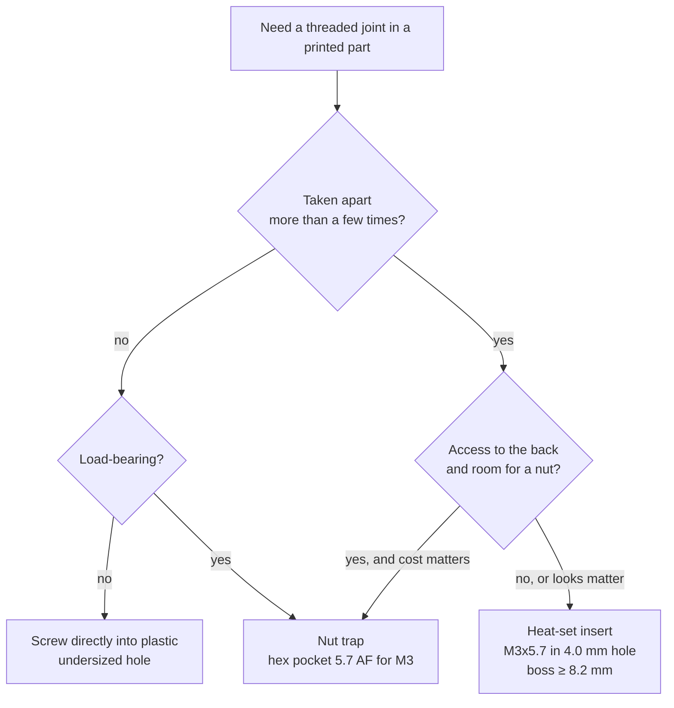

# F3D.06 — Gears, heat-set inserts and fasteners

<!-- glance:start -->
<!-- generated by tools/build.py from curriculum/syllabus.yaml — edit the syllabus, not this block -->

| | |
|---|---|
| **Track** | Optional foundation |
| **Difficulty** | Intermediate |
| **Time** | 45 min |
| **Hardware** | none |
| **Software** | cad |
| **Prerequisites** | [F3D.04 Tolerances, clearances and fits](F3D.04-tolerances-fits.md) |
| **Optional prerequisites** | [FP.04 Torque, gears and wheels — sizing motors](../physics/FP.04-torque-gears-wheels.md) |
| **Skip if** | You use heat-set inserts and print functional gears. |

<!-- glance:end -->

## What you will learn

- Read and specify metric screws (M3 × 0.5 × 10, ISO 4762, ISO 7380…) and design counterbores, nut traps and screw lengths for them.
- Choose between screwing into plastic, a captive nut and a heat-set insert, and design the hole for each.
- Install brass heat-set inserts safely and correctly.
- Compute spur-gear geometry (module, pitch diameter, centre distance, ratio) and the force on a tooth.
- Decide when a printed gear is good enough and when to buy a metal one.

## Why it matters

Everything on a robot is held together by screws, and printed plastic is a poor place to put a thread. Karmel's deck gets rebuilt at every stage: the LiDAR arrives in [07.07](../../07-sensors/07.07-2d-lidar.md), the Jetson and depth camera later, the arm in [14.02](../../14-robotic-arm/14.02-buying-and-assembling-the-arm.md), and the final integration in [20.02](../../20-final-robot/20.02-hardware-integration.md). A bracket that loses its thread after the third reassembly costs you a reprint and an evening. Heat-set inserts, captive nuts and the right screw lengths prevent that.

Gears are the other mechanical element robot builders print, for pan-tilt heads, grippers, turntables and small reductions. They connect directly to torque and gear ratios in [FP.04](../physics/FP.04-torque-gears-wheels.md): a gear pair multiplies torque, and the force on each tooth decides whether plastic survives. Knowing the numbers tells you when to print a gear and when to buy one.

<!-- prereqs:start -->
## Prerequisites

You need these first:

- [F3D.04 Tolerances, clearances and fits](F3D.04-tolerances-fits.md)

### Optional prerequisite links

New to any of these? Take the foundation lesson first; skip it if you already know it.

- [FP.04 Torque, gears and wheels — sizing motors](../physics/FP.04-torque-gears-wheels.md)

Check your readiness: `python course.py why F3D.06`
<!-- prereqs:end -->

## Concept

A screw joint works by stretching the screw slightly so it clamps two parts together. The screw's thread has to hold against that tension in whatever material it is screwed into. Metal holds a thread well. Printed plastic doesn't: its threads are made of layers, they wear every time the screw goes in and out, and plastic slowly relaxes under constant load (creep), so the clamp loosens.

So in printed parts the thread usually goes somewhere else:

- **Into the plastic directly.** A screw cuts its own thread into a slightly undersized hole. Fine for parts assembled once or twice, like a cable-clip cover.
- **Into a nut** that sits in a hexagonal pocket in the part, a "nut trap". Strong and cheap, but you need access to the pocket, and the nut can fall out during assembly.
- **Into a brass heat-set insert** melted into the plastic with a soldering iron. The insert has a metal thread and knurls that lock into the plastic. It survives many assembly cycles and looks professional. It is the default for robot parts that come apart.

The software analogy: screwing into plastic is a quick script, a nut trap is a library you vendor in, and an insert is a proper interface with a stable contract. Pick by how often the joint will change.

Gears follow the same "is plastic enough?" reasoning. A gear pair is a lever system: the small gear (pinion) turns faster, the big one (wheel) turns slower with more torque, and all of that torque passes through a few millimetres of tooth. At low torque, printed gears are quiet, cheap and custom. At motor-stall torque, they strip.

> [!TIP]
> **Ask your teacher:** "For each joint on karmel's LiDAR mount and Pi tray, ask me whether I'd use a self-tapped hole, a nut trap or an insert, and challenge my answer."

## Technical explanation

### Level 1 — Reading a metric screw

`M3 × 0.5 × 10 ISO 4762 A2` means:

| Part | Meaning |
|---|---|
| `M3` | Metric thread, 3 mm nominal outside diameter |
| `0.5` | Pitch 0.5 mm per turn. This is the standard *coarse* pitch for M3 and is usually omitted |
| `10` | Length in mm **under the head** (for countersunk screws: overall length) |
| `ISO 4762` | Head style: socket head cap screw |
| `A2` | Stainless steel grade (A2 = 304-type). Steel screws are marked with property classes like 8.8 or 12.9 |

Standard coarse pitches: M2 = 0.4 mm, M2.5 = 0.45 mm, M3 = 0.5 mm, M4 = 0.7 mm, M5 = 0.8 mm.

The dimensions you design pockets around:

| Item | M2 | M2.5 | M3 | Design use |
|---|---|---|---|---|
| Socket head cap screw, ISO 4762: head Ø × height, hex key | 3.8 × 2.0, 1.5 mm | 4.5 × 2.5, 2 mm | **5.5 × 3.0, 2.5 mm** | Counterbore: head Ø + 0.5, depth = head + 0.2 |
| Button head, ISO 7380: head Ø × height, hex key | — | — | 5.7 × 1.65, 2 mm | Low profile, no counterbore needed |
| Hex nut, ISO 4032: across flats × thickness | 4.0 × 1.6 | 5.0 × 2.0 | **5.5 × 2.4** | Nut trap |
| Washer, ISO 7089: ID × OD × thickness | — | — | 3.2 × 7.0 × 0.5 | Spread load on plastic |

*Example — a counterbore for an M3 socket head in a printed part:* head Ø 5.5 mm + 0.5 mm clearance = 6.0 mm as printed, depth 3.0 + 0.2 = 3.2 mm. Using the F3D.04 coupon fit ($g = 0.9963$, $b = -0.241$), draw it at $(6.0 + 0.241)/0.9963 = $ **6.26 mm**.

A button head (ISO 7380) is handy on robots: it sits 1.65 mm proud instead of needing a 3 mm counterbore, and it takes a smaller key. Socket heads are stronger and easier to drive at an angle.

### Level 2 — Three ways to put a thread into a printed part

| Method | Hole in the part | Strength | Reassembly cycles | Use for |
|---|---|---|---|---|
| **Screw into plastic** | Slightly under the screw's major diameter; for M3 start near 2.5–2.8 mm as printed and test | Low–medium, creeps | A handful | Covers, clips, one-off prototypes |
| **Nut trap** | Clearance hole (3.4 mm) + hex pocket | High (steel nut) | Many | Load-bearing joints with access from the back |
| **Heat-set insert** | Insert maker's hole (M3 × 5.7 mm: **4.0 mm**) | High | Many | Anything taken apart repeatedly: deck mounts, sensor brackets |

**Nut trap geometry.** A hexagon's corner-to-corner width is

$$e = \frac{s}{\cos 30°}$$

where $s$ is the across-flats width. *Example:* an M3 nut has $s = 5.5$ mm, so $e = 5.5 / 0.866 = $ **6.35 mm**. Draw the pocket as a hexagon with 5.5 + 0.2 mm across flats (then add your hole compensation) and 2.4 + 0.2 mm deep. Orient it so a *flat*, not a corner, faces the direction you'll slide the nut in from. For a pocket in a horizontal face, a thin sacrificial bridge layer over the screw hole lets the printer bridge cleanly; poke it through afterwards.

### Level 3 — Heat-set inserts in detail

A heat-set insert is a brass sleeve with an internal thread and knurled outside. You heat it with a soldering iron and press it into a slightly smaller hole; the plastic melts, flows into the knurls, and freezes around them.

**Sizes.** CNC Kitchen's standard M3 insert is **5.7 mm** long with a knurl diameter of about **4.6 mm**; a short M3 is **3 mm** long. Their M4 standard is 8.1 mm long and M5 standard 9.5 mm. For M3 standard they recommend a **4.0 mm** hole. For other sizes and brands, use that manufacturer's chart, because hole sizes differ between insert designs.

**Hole rules** (CNC Kitchen):

- Make blind holes about **1 mm deeper** than the insert, so displaced plastic has somewhere to go and the screw does not bottom on melted plastic.
- Use **straight** holes, not tapered, and normally no chamfer at the entrance.
- Printed holes come out small. CNC Kitchen measured their printed holes about 0.25 mm under size and found **4.2 mm in CAD** best on their printer. Use your own coupon ([F3D.04](F3D.04-tolerances-fits.md)).

**Walls.** The insert pushes plastic outward as it goes in. Leave at least **4 perimeters** of plastic beyond the knurl: with a 0.45 mm line, that is 1.8 mm, so an M3 standard insert needs a boss of at least $4.6 + 2 \times 1.8 = $ **8.2 mm** outer diameter. Slice the part with enough walls that the boss is solid perimeters, not infill.

**Screw length with an insert.** The screw passes through the clamped part (thickness $t$) and into the insert (length $L_i$). It must engage enough of the insert to hold, and in a blind hole it must not bottom out:

$$L_{screw} \le t + L_i - 0.5\text{ mm}$$

*Example:* a 3 mm acrylic deck plus a 2 mm spacer ($t = 5$ mm) into a 5.7 mm insert: $L \le 5 + 5.7 - 0.5 = 10.2$ mm, so **M3 × 10**, with 5 mm of thread in the insert.

**Installation temperature.** CNC Kitchen suggests the iron **10–20 °C above the printing temperature**: about **225 °C for PLA**, **245 °C for PETG** and **265 °C for ABS**. Too hot and the plastic turns to liquid and the insert sinks crooked; too cold and it won't go in without force that cracks the part.

> [!CAUTION]
> **Safety:** A soldering iron at 225–265 °C causes serious burns and melts cable insulation. Always return it to its stand, work on a heat-proof mat, keep the power cable away from the tip, and let the part cool before touching the insert. Melting plastic gives off fumes: work in a ventilated room and don't lean over the part. Never install inserts in a part that is already mounted on the robot with the battery connected.

**Procedure:**

1. Fit a dedicated insert tip to the iron if you have one (a conical tip works but slips). Set the temperature for your material.
2. Place the insert on the hole, straight, with the small (tapered) end down.
3. Let the iron heat the insert for a few seconds, then press gently and vertically. Let the heat do the work; do not push hard.
4. Stop when the insert is about 0.2–0.5 mm above flush. Remove the iron.
5. Immediately press the insert flush with a flat metal object (the side of a pair of pliers, a steel ruler) and hold it for a few seconds while it cools. This also sets it square.
6. When cool, check with a screw: it should go in straight by hand.

### Level 4 — Spur gears

A **spur gear** has straight teeth parallel to its axis. Its size is set by the **module** $m$ (in mm) and the tooth count $z$:

$$d = m\,z \qquad d_a = m\,(z + 2) \qquad d_f = m\,(z - 2.5) \qquad p = \pi m$$

where $d$ is the **pitch diameter** (the circle on which two gears effectively roll), $d_a$ the outside diameter, $d_f$ the root diameter, and $p$ the tooth-to-tooth distance along the pitch circle. **Two gears mesh only if they share the module and the pressure angle** (20° is standard).

The **centre distance** and **ratio** of a pair:

$$a = \frac{m\,(z_1 + z_2)}{2} \qquad i = \frac{z_2}{z_1} = \frac{\omega_1}{\omega_2} \approx \frac{T_2}{T_1}$$

*Example:* a 15-tooth pinion driving a 45-tooth wheel, module 1: $d_1 = 15$ mm, $d_2 = 45$ mm, $a = 30$ mm, ratio **3:1**. The wheel turns 3× slower with (ignoring friction) 3× the torque.

**Undercut.** With a 20° pressure angle, the cutting process (and CAD generators that imitate it) removes material at the tooth root when

$$z < z_{min} = \frac{2}{\sin^2 20°} = 17.1$$

A 15-tooth pinion is slightly undercut, which weakens its teeth. Generators handle it; a *profile shift* option avoids it; or use 17+ teeth.

**Force on a tooth.** Torque $T$ on a gear of pitch diameter $d$ pushes its teeth with a tangential force

$$F_t = \frac{2T}{d}$$

*Example:* 0.5 N·m on the 15 mm pinion: $F_t = 2 \times 0.5 / 0.015 = $ **67 N**, about the weight of 7 kg on a tooth 1.57 mm thick. The Lewis formula gives an approximate bending stress at the tooth root:

$$\sigma \approx \frac{F_t}{b\,m\,Y}$$

with face width $b$ and a form factor $Y \approx 0.29$ for a 15-tooth, 20° gear (from standard Lewis tables). For $b = 8$ mm: $\sigma = 67 / (8 \times 1 \times 0.29) \approx$ **29 MPa**. That is in the same range as the strength of printed plastic, and teeth see that load again on every revolution (fatigue), plus creep. At that torque a module-1 printed pinion will not last. Going to module 2 (a 30 mm pinion) halves the force and doubles the tooth size in the formula: $\sigma \approx 7$ MPa.

**Printed-gear rules of thumb:**

- **Module ≥ 1** with a 0.4 mm nozzle. At module 1, a tooth is only about 1.57 mm thick at the pitch circle, three to four extrusion lines.
- **Make the face wider** before making the module smaller; stress falls in proportion to face width.
- **Add backlash** by printing at a slightly larger centre distance, for example +0.1 to +0.2 mm, then test. Printed teeth are slightly fat (F3D.04), and gears with no backlash bind.
- **PETG or nylon** outlast PLA for gears; PLA is brittle and creeps ([F3D.07](F3D.07-materials-chassis-ordering.md)).
- **Print gears flat** (axis vertical), so each tooth is made of complete layers.
- **Fix the gear to the shaft mechanically.** The Yahboom 520 motors on karmel have a 6 mm D-shaped shaft: model a D-bore (a 6 mm circle cut flat at 5.5 mm) plus an M3 set screw through a nut trap onto the flat.
- **Don't draw involute teeth by hand.** Use a generator: Onshape's Spur Gear feature, FreeCAD's Gear workbench, or `spur_gear()` in the BOSL2 OpenSCAD library.
- **Buy metal gears for the drivetrain.** Karmel's drive motors come with metal gearboxes. Printed gears belong in low-torque mechanisms: a pan-tilt head, a sensor turntable, a demonstration gripper.

## Diagram

```text
  Section through a heat-set insert boss (M3 standard insert)

             screw M3 x 10
                 ||
     ============||============   3 mm deck + 2 mm spacer (clamped, t = 5 mm)
     ------------||------------
          |  [#||#]  |   <- insert 5.7 mm long, knurl ~4.6 mm
          |  [#||#]  |      hole 4.0 mm as printed (≈ 4.2 mm drawn)
          |  [#||#]  |
          |   |  |   |   <- +1 mm extra depth for melted plastic (blind hole)
          |___|__|___|
          |<------->|    boss ≥ 4.6 + 2 × 1.8 = 8.2 mm (4 perimeters each side)

  Nut trap for M3 (hex nut 5.5 across flats, 2.4 thick)

        ___________           across flats s = 5.5 (+0.2)      corner to corner
       /           \          ___                              e = s / cos 30°
      /     (o)     \   <-    |   |  flat faces the slide-in       = 6.35 mm
      \   3.4 hole  /         |___|  direction
       \___________/
```

```text
  Spur gear pair, module 1

        pinion z1 = 15                    wheel z2 = 45
          d1 = 15                          d2 = 45
           ___                        _____________
          / ^ \  pitch circles       /             \
         | (+)|)(   touch here      |      (+)      |
          \___/                      \_____________/
           |<--------- a = m (z1 + z2) / 2 = 30 mm -------->|
                       print at 30.1–30.2 mm for backlash

   F_t = 2T / d1        ratio i = z2 / z1 = 3      speed ÷ 3, torque × 3
```



## Code

Save as `gear_fastener_calc.py` and run `python gear_fastener_calc.py`. It uses only the standard library. It computes spur-gear geometry, the undercut limit, centre distance with backlash, tooth force and approximate root stress, nut-trap corner width and the longest screw for an insert.

```python
"""gear_fastener_calc.py — spur-gear geometry and screw-length checks for printed parts.

Run: python gear_fastener_calc.py
"""
from __future__ import annotations

import math
from dataclasses import dataclass


@dataclass(frozen=True)
class SpurGear:
    module_mm: float
    teeth: int
    pressure_angle_deg: float = 20.0

    @property
    def pitch_d(self) -> float:
        return self.module_mm * self.teeth

    @property
    def outside_d(self) -> float:          # addendum = 1 module
        return self.module_mm * (self.teeth + 2)

    @property
    def root_d(self) -> float:             # dedendum = 1.25 modules
        return self.module_mm * (self.teeth - 2.5)

    @property
    def circular_pitch(self) -> float:
        return math.pi * self.module_mm


def min_teeth_no_undercut(pressure_angle_deg: float = 20.0) -> float:
    return 2.0 / math.sin(math.radians(pressure_angle_deg)) ** 2


def center_distance(g1: SpurGear, g2: SpurGear, backlash_gap_mm: float = 0.0) -> float:
    assert g1.module_mm == g2.module_mm, "meshing gears must share the module"
    return (g1.pitch_d + g2.pitch_d) / 2 + backlash_gap_mm


def tangential_force_n(torque_nm: float, gear: SpurGear) -> float:
    return 2.0 * torque_nm / (gear.pitch_d / 1000.0)


def lewis_root_stress_mpa(force_n: float, face_width_mm: float, gear: SpurGear, lewis_y: float) -> float:
    """Approximate tooth-root bending stress (Lewis): sigma = F / (b * m * Y). N/mm^2 = MPa."""
    return force_n / (face_width_mm * gear.module_mm * lewis_y)


def max_screw_length(clamped_part_mm: float, insert_len_mm: float, margin_mm: float = 0.5) -> float:
    """Longest screw (under the head) that still ends inside a heat-set insert without bottoming."""
    return clamped_part_mm + insert_len_mm - margin_mm


def hex_corner_to_corner(across_flats_mm: float) -> float:
    return across_flats_mm / math.cos(math.radians(30))


def main() -> None:
    pinion, wheel = SpurGear(1.0, 15), SpurGear(1.0, 45)
    print(f"min teeth without undercut (20 deg): {min_teeth_no_undercut():.1f}")
    for g in (pinion, wheel):
        print(f"m={g.module_mm} z={g.teeth}: pitch {g.pitch_d:.1f} mm, outside {g.outside_d:.1f} mm, "
              f"root {g.root_d:.2f} mm, tooth pitch {g.circular_pitch:.3f} mm")
    print(f"ratio {wheel.teeth / pinion.teeth:.1f}:1, center distance {center_distance(pinion, wheel):.2f} mm "
          f"(print at {center_distance(pinion, wheel, 0.15):.2f} mm with a 0.15 mm gap)")
    stall_torque_nm = 0.5  # example: a small gearmotor output, see FP.04 for real sizing
    force = tangential_force_n(stall_torque_nm, pinion)
    print(f"tooth force on the 15 T pinion at {stall_torque_nm} N*m: {force:.0f} N")
    # Lewis form factor Y ~ 0.29 for a 15-tooth, 20 deg full-depth gear (standard tables)
    print(f"root stress, 8 mm face: {lewis_root_stress_mpa(force, 8.0, pinion, 0.29):.0f} MPa")
    print(f"M3 nut 5.5 mm across flats -> {hex_corner_to_corner(5.5):.2f} mm corner to corner")
    print(f"3 mm deck + 2 mm spacer clamped, 5.7 mm insert: screw <= {max_screw_length(5.0, 5.7):.1f} mm -> buy M3x10")


if __name__ == "__main__":
    main()
```

Output (verified with Python 3.14):

```text
min teeth without undercut (20 deg): 17.1
m=1.0 z=15: pitch 15.0 mm, outside 17.0 mm, root 12.50 mm, tooth pitch 3.142 mm
m=1.0 z=45: pitch 45.0 mm, outside 47.0 mm, root 42.50 mm, tooth pitch 3.142 mm
ratio 3.0:1, center distance 30.00 mm (print at 30.15 mm with a 0.15 mm gap)
tooth force on the 15 T pinion at 0.5 N*m: 67 N
root stress, 8 mm face: 29 MPa
M3 nut 5.5 mm across flats -> 6.35 mm corner to corner
3 mm deck + 2 mm spacer clamped, 5.7 mm insert: screw <= 10.2 mm -> buy M3x10
```

To generate the teeth themselves in OpenSCAD, the [BOSL2 library](https://github.com/BelfrySCAD/BOSL2/wiki/gears.scad) provides `spur_gear()` with module, tooth count, thickness and bore parameters.

## Exercise

### Exercise F3D.06-E1 — Specify the screws `[numerical]`

Hardware: none.

1. A 4 mm printed LiDAR plate is fixed to karmel's deck with M3 screws into inserts in the *deck riser* (a printed part with M3 × 5.7 inserts in blind holes). What is the longest screw, and which standard length do you buy (standard lengths: 6, 8, 10, 12, 16 mm)?
2. What hole depth do you draw for those inserts?
3. The same plate uses M3 socket heads in counterbores. Give the as-printed counterbore diameter and depth.
4. An M2.5 nut is 5.0 mm across flats. What is its corner-to-corner width, and what across-flats size do you draw for its pocket before hole compensation?

### Exercise F3D.06-E2 — Size a pan gear pair `[numerical]`

Hardware: none. A small servo turns a camera pan platform through a 12-tooth pinion and a 36-tooth ring, module 1.

1. Compute both pitch and outside diameters, the centre distance and the ratio.
2. Is either gear undercut?
3. The servo delivers 0.2 N·m. Compute the tangential force on the pinion's teeth and the approximate root stress for a 6 mm face width (use $Y \approx 0.25$ for 12 teeth).
4. The servo can move 180°. How far does the camera pan?

### Exercise F3D.06-E3 — Extend the calculator `[coding]`

Hardware: none. Add to `gear_fastener_calc.py`:

1. `counterbore(screw: str) -> tuple[float, float]` returning the as-printed diameter and depth for `"M2"`, `"M2.5"` and `"M3"` socket heads from the table in Level 1.
2. `insert_boss_od(knurl_od_mm, line_width_mm=0.45, perimeters=4)` and `insert_hole_depth(insert_len_mm, blind=True)`.
3. `min_module_for_stress(torque_nm, teeth, face_width_mm, lewis_y, allowable_mpa)` that returns the smallest standard module (0.5, 0.8, 1, 1.25, 1.5, 2, 2.5, 3) meeting the stress limit.
4. `pytest` tests for all three.

### Exercise F3D.06-E4 — Predict the failure `[predict]`

Hardware: none. For each design, *predict first* how and where it fails, then explain with this lesson's numbers:

1. An M3 insert boss that is 6 mm in outer diameter, printed with 2 walls and 15 % infill.
2. A PLA module-0.8 pinion, 15 teeth, 5 mm wide, pressed onto a 6 mm D shaft with no set screw, driving a turntable with 0.3 N·m.
3. A nut trap whose hexagon was drawn with 5.5 mm across *corners*.

### Exercise F3D.06-E5 — Install inserts in a test block (optional) `[hardware]`

Hardware: `tools` (soldering iron, calipers, screwdriver). Also: a few M3 × 5.7 inserts and a printed test block. No-hardware alternative: none; skip it and do E1–E4.

> [!CAUTION]
> **Safety:** Soldering iron at 225–245 °C: use the stand, a heat-proof mat and ventilation, and let parts cool before touching them.

Print a 30 × 12 × 10 mm block with four 7 mm-deep holes drawn at 3.9, 4.0, 4.2 and 4.4 mm. Install an insert in each with the procedure from Level 3. Record which went in straight and flush, which sank, and which bulged the wall. Screw an M3 screw in and out of each five times.

## Expected result

**F3D.06-E1:**
1. $L \le 4 + 5.7 - 0.5 = 9.2$ mm → buy **M3 × 8** (4 mm of thread in the insert). M3 × 10 would bottom in a blind hole.
2. $5.7 + 1 = $ **6.7 mm** (then compensate the diameter, not the depth).
3. Diameter $5.5 + 0.5 = $ **6.0 mm**, depth $3.0 + 0.2 = $ **3.2 mm** as printed. With the F3D.04 coupon fit, draw about 6.26 mm.
4. $e = 5.0 / 0.866 = $ **5.77 mm**. Draw the pocket at **5.2 mm** across flats (5.0 + 0.2) before compensation.

**F3D.06-E2:**
1. Pinion: $d = 12$ mm, $d_a = 14$ mm. Ring: $d = 36$ mm, $d_a = 38$ mm. Centre distance **24 mm** (print at about 24.1–24.2 mm). Ratio **3:1**.
2. The 12-tooth pinion is undercut ($12 < 17.1$). Use a profile shift, accept it at this low load, or use 17 teeth (module 1: $a = 34$ mm with a 51-tooth ring).
3. $F_t = 2 \times 0.2 / 0.012 = $ **33.3 N**. $\sigma \approx 33.3 / (6 \times 1 \times 0.25) = $ **22 MPa**. That is high for printed plastic under fatigue: widen the face or increase the module. At 0.2 N·m a camera needs far less torque in practice, so limit the servo's torque in software too.
4. The ring turns 3× less: **60°**.

**F3D.06-E3:** Tests pass. `counterbore("M3")` returns `(6.0, 3.2)`, `counterbore("M2")` returns `(4.3, 2.2)`. `insert_boss_od(4.6)` returns 8.2. `insert_hole_depth(5.7)` returns 6.7 (5.7 when `blind=False`). `min_module_for_stress(0.5, 15, 8, 0.29, 10)` returns **2**: module 1.5 gives 12.8 MPa, module 2 gives 7.2 MPa.

**F3D.06-E4:**
1. The boss wall is $(6 - 4.6)/2 = 0.7$ mm, less than 2 lines, and it is not even solid perimeters. The insert splits the boss or bulges it as it goes in, or it pulls out under torque. Rule: ≥ 8.2 mm OD and enough walls to make it solid.
2. It fails twice. The pressed D-bore slips or cracks the thin hub (no set screw), and the teeth strip: $F_t = 2 \times 0.3 / 0.012 = 50$ N, $\sigma \approx 50/(5 \times 0.8 \times 0.29) \approx 43$ MPa, far too high for a small PLA tooth under repeated load, especially with an undercut 15-tooth pinion.
3. 5.5 mm across corners is only $5.5 \times 0.866 = 4.76$ mm across flats: the 5.5 mm nut does not fit at all. Always dimension hexagons across flats.

**F3D.06-E5:** Typically the 3.9 and 4.0 mm (drawn) holes take the insert with a visible ring of pushed-up plastic or a slight wall bulge, 4.2 mm goes in straight and flush, and 4.4 mm lets the insert sink or tilt easily and spin under screw torque. Exact results depend on your printer; the 4.2 mm result should match CNC Kitchen's finding within one step. All flush inserts survive five screw cycles.

## Troubleshooting

### Symptom: the insert goes in crooked
1. The iron pushed at an angle, or the part was not on a flat surface. Use a dedicated insert tip and a guide (a drill press or a printed jig) if it keeps happening.
2. While it is still hot, press it square with a flat metal object; if it has cooled, reheat it gently and re-press.
3. Check that the hole itself is straight (a horizontal hole prints oval).

### Symptom: the insert spins when the screw is tightened
1. The hole was too big, or the plastic did not flow into the knurls (iron too cold, pushed too fast).
2. The boss is too thin and yielded.
3. Remove the insert with the iron, reprint with a smaller hole or thicker boss. A drop of glue is a stopgap, not a fix.

### Symptom: a screw into plastic strips after a few cycles
1. Expected: printed threads wear. Switch that joint to an insert or a nut trap.
2. If it must stay a direct thread, use a thread-forming screw for plastics and don't overtighten.

### Symptom: gears skip, bind or wear quickly
1. Binding: increase centre distance by 0.1 mm, check the teeth for elephant's foot on the first layer, and chamfer the gear's bottom edge.
2. Skipping: the shafts are flexing apart, or the centre distance is too large. Stiffen the mount; reduce the gap.
3. Fast wear or broken teeth: compute $F_t$ and the Lewis stress. Widen the face, increase the module, switch to PETG or nylon, or buy metal gears.

## Common mistakes

- **Screw length measured including the head** for socket and button heads. Length is under the head (except countersunk).
- **Hexagons dimensioned across corners.** Nuts are specified across flats.
- **Insert holes drawn at the insert's outer diameter.** The hole must be smaller than the knurl, per the maker's chart.
- **Thin bosses around inserts** and too few perimeters, so the insert cracks the part.
- **Pushing hard with the iron.** Let it melt in; force tilts it and pushes plastic ahead of it.
- **Printed gears in the drivetrain.** Plastic teeth at motor-stall torque strip; buy metal.
- **Module-0.5 printed gears** with a 0.4 mm nozzle. The teeth are barely two lines wide.
- **Gears held on a shaft by friction.** Use a D-bore with a set screw, a clamp, or a keyed hub.

## Knowledge check

1. What does `M2.5 × 6 ISO 7380` describe?
   <details><summary>Answer</summary>

   A metric 2.5 mm thread (coarse pitch 0.45 mm), 6 mm long under the head, with a button head (ISO 7380).
   </details>

2. Why is a heat-set insert better than screwing directly into a printed hole for a sensor bracket that you will remove 20 times?
   <details><summary>Answer</summary>

   Printed plastic threads wear and loosen with each cycle and creep under constant clamp load. A brass insert has a metal thread and is locked into the plastic by its knurls, so it survives many cycles and keeps its clamp force.
   </details>

3. A 3 mm bracket is screwed into a 5.7 mm insert in a blind hole. What is the longest screw, and what do you buy?
   <details><summary>Answer</summary>

   $3 + 5.7 - 0.5 = 8.2$ mm → **M3 × 8**.
   </details>

4. Two module-1.5 gears have 20 and 40 teeth. What are their pitch diameters, the centre distance and the ratio?
   <details><summary>Answer</summary>

   30 mm and 60 mm; $a = 1.5 \times 60 / 2 = $ **45 mm**; ratio **2:1**.
   </details>

5. A 1 N·m torque is applied to a 20 mm pitch-diameter gear. What is the tangential tooth force?
   <details><summary>Answer</summary>

   $F_t = 2 \times 1 / 0.020 = $ **100 N**.
   </details>

6. Predict: you print a pair of gears at exactly the theoretical centre distance with no backlash. What happens when you turn them?
   <details><summary>Answer</summary>

   They bind or turn stiffly and noisily. Printed teeth come out slightly oversize (and the first layer flares), so at zero gap they interfere. Add 0.1–0.2 mm to the centre distance and chamfer the bottom edges.
   </details>

7. Debugging: an insert went in flush but sits 0.5 mm below the surface after the part cooled, and the screw clamps loosely. What happened?
   <details><summary>Answer</summary>

   The iron was too hot or it was pushed too far, so it sank past flush into soft plastic, or the hole was too large. Next time stop slightly above flush and press it level with a flat metal tool while it cools; check the hole size against the maker's recommendation.
   </details>

## Practical challenge

Design and print (or fully specify for a service) a **pan platform** for a small camera or sensor, driven by a hobby servo through a printed gear pair.

**Acceptance criteria:**
- Gear pair with a ratio between 2:1 and 3:1, module ≥ 1, generated with a gear tool (not hand-drawn), with the centre distance and backlash gap written down.
- A written load check: servo torque → $F_t$ → Lewis stress, with the face width chosen so the stress is ≤ 10 MPa.
- The output gear runs on an M3 or M4 screw as an axle through a clearance hole with ≥ 0.3 mm running gap, or on a bought bearing with a press fit from your F3D.04 coupon.
- The platform mounts to karmel's deck with M3 heat-set inserts meeting the boss (≥ 8.2 mm OD) and depth (insert + 1 mm) rules, and every screw length is computed.
- The servo's full travel produces the pan range you calculated, ±5°.

## You can skip this if…

You use heat-set inserts and print functional gears. Check: answer knowledge-check questions 3, 5 and 6 correctly without looking, and state the hole size and installation temperature you use for M3 inserts in PETG.

`python course.py skip F3D.06 --reason "I use heat-set inserts and design printed gears"`

## Go deeper

- [CNC Kitchen — Tips and tricks for heat-set inserts](https://www.cnckitchen.com/blog/tips-and-tricks-for-heat-set-inserts): installation temperatures, hole depth and technique from the insert maker.
- [CNC Kitchen — Are our heat-set insert datasheets wrong?](https://www.cnckitchen.com/blog/are-our-heat-set-insert-datasheets-wrong): measured hole sizes and pull-out tests for M3 inserts.
- [Prusa — Heat set inserts M3 standard](https://www.prusa3d.com/product/heat-set-inserts-m3-standard-100-pcs/): the insert range (lengths for M2 to M8) sold by Prusa.
- [KHK Gears — Gear technical reference](https://khkgears.net/new/gear_knowledge/gear_technical_reference/): module, involute geometry, undercut, profile shift and strength from a gear manufacturer.
- [BOSL2 gears.scad](https://github.com/BelfrySCAD/BOSL2/wiki/gears.scad): parametric involute gears for OpenSCAD.
- [ISO 273 clearance holes](https://www.iso.org/standard/4183.html): the standard behind the clearance-hole sizes used with these fasteners.

## Progress checkpoint

- [ ] I can read and specify metric screws and design counterbores and nut traps for them.
- [ ] I can choose between a self-tapped hole, a nut trap and an insert for a joint.
- [ ] I can design an insert hole and boss and install an insert safely.
- [ ] I can compute gear geometry, ratio and tooth force.
- [ ] I can decide whether a printed gear is strong enough or should be bought.

`python course.py complete F3D.06` (exercises done) · `python course.py master F3D.06` (challenge done) · `python course.py struggle F3D.06 "what was hard"`

Next: [F3D.07 — Materials, chassis parts and ordering prints in Israel](F3D.07-materials-chassis-ordering.md).
