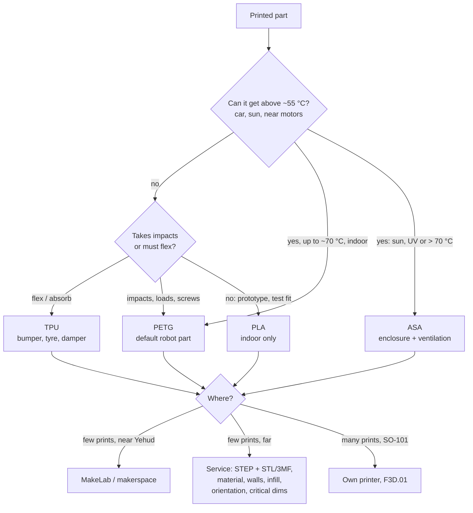

# F3D.07 — Materials, chassis parts and ordering prints in Israel

<!-- glance:start -->
<!-- generated by tools/build.py from curriculum/syllabus.yaml — edit the syllabus, not this block -->

| | |
|---|---|
| **Track** | Optional foundation |
| **Difficulty** | Beginner |
| **Time** | 40 min |
| **Hardware** | none |
| **Software** | none |
| **Prerequisites** | [F3D.03 STL, 3MF, STEP and slicers](F3D.03-file-formats-slicers.md) |
| **Version-sensitive** | yes — see [curriculum/versions.yaml](../../curriculum/versions.yaml) |
| **Skip if** | You know which filament to use for which robot part. |

<!-- glance:end -->

## What you will learn

- Choose PLA, PETG, ASA or TPU for a given robot part from its temperature, sunlight, impact and flexibility needs.
- Predict which printed parts survive an Israeli summer in a parked car, and pick a material with margin.
- Decide which chassis parts to print, which to cut, and how to split parts that don't fit the bed.
- Estimate a part's printed mass and filament cost before slicing.
- Order a part from an Israeli print service or makerspace so it comes back right the first time.

## Why it matters

The material is part of the design. A perfect PLA bracket that holds karmel's LiDAR works all winter, then sags on the back seat of a car in August, and the LiDAR's scan plane is no longer level. Robots also crash: a brittle bumper cracks where a TPU one bounces. Choosing the plastic is as much an engineering decision as choosing the hole size.

This lesson closes the track. It uses the formats from [F3D.03](F3D.03-file-formats-slicers.md) and is needed whenever you print or order the karmel parts: the chassis in [01.06](../../01-first-robot/01.06-mechanical-assembly.md), the sensor mounts in [07.04](../../07-sensors/07.04-tof-sensors.md) and [07.07](../../07-sensors/07.07-2d-lidar.md), the SO-101 arm parts in [14.02](../../14-robotic-arm/14.02-buying-and-assembling-the-arm.md), and the final integration and thermal management in [20.02](../../20-final-robot/20.02-hardware-integration.md). If you take karmel to a meetup, a school or a friend's house, it will spend time in a car.

<!-- prereqs:start -->
## Prerequisites

You need these first:

- [F3D.03 STL, 3MF, STEP and slicers](F3D.03-file-formats-slicers.md)

### Optional prerequisite links

None.

Check your readiness: `python course.py why F3D.07`
<!-- prereqs:end -->

## Concept

Each common filament is a trade-off between **easy to print** and **tough in use**, like choosing between a scripting language and a compiled one.

- **PLA** is the default for learning. It prints easily on any printer, is stiff and dimensionally accurate, and smells mild. But it softens at low temperature and is brittle: it snaps rather than bends.
- **PETG** is the practical default for robot parts. It is tougher (it bends before it breaks), handles more heat, and prints on the same printers as PLA with a few setting changes. It strings more and is a little less precise.
- **ASA** is for heat and sunlight: outdoor robots, parts near motors, parts that live in a car. It needs higher temperatures, an enclosure for larger parts, and good ventilation because of its fumes.
- **TPU** is rubber-like. It is for bumpers, tyres, feet, cable grommets and vibration dampers. It is slow and fiddly to print.

Temperature is the property that surprises people. Plastics don't melt suddenly; they reach a temperature where they go soft and start to **creep**, slowly deforming under even a small constant load (a screw's clamp, the weight of a sensor). A part that holds its shape at 25 °C for a year can bend in an afternoon at 65 °C.

And Israel is hot. On a summer afternoon, the inside of a parked car is far hotter than the air outside, and a dashboard in direct sun is hotter still. That is where PLA fails.

> [!TIP]
> **Ask your teacher:** "Go through karmel's parts list with me. For each printed part, ask where it sits, how hot it can get and what hits it, and let me pick the material."

## Technical explanation

### Level 1 — The four materials

Values from the Prusa Knowledge Base material guides unless noted. "Heat limit" is the practical temperature above which the material softens or should not be used under load.

| | **PLA** | **PETG** | **ASA** | **TPU** |
|---|---|---|---|---|
| Heat limit | Softens and deforms **above 60 °C** | Suitable **below 80 °C** | Heat resistant **up to 93 °C** | Not a single number; varies by grade (check the spool datasheet) |
| Sunlight / UV | Degrades | Moderate | **High UV resistance** | Moderate |
| Toughness | Stiff, **brittle** | Tough, bends before breaking | Tough | Very flexible (Shore 60A–90A range) |
| Printability | Easiest | Easy; strings; sticks too well to smooth PEI (use glue stick) | Warps; **enclosure needed for large parts**; **fumes, ventilate** | Slow (~20 mm/s); hard on Bowden printers |
| Typical density | ≈ 1.24 g/cm³ | ≈ 1.27 g/cm³ | ≈ 1.07 g/cm³ | ≈ 1.21 g/cm³ |
| Karmel use | Prototypes, test fits, coupons, indoor-only covers | **Default for brackets, mounts, trays, gears** | Parts near motors or in sun; parts that travel in a car | Bumpers, wheel tyres, feet, dampers |

Densities vary by brand; check the spool's datasheet. ABS behaves like ASA without the UV resistance and is harder to print; nylon and carbon-fibre-filled filaments are stronger still but need hardened nozzles and dry storage. You don't need them for karmel.

The SO-101 arm's official instructions specify **PLA+** (a tougher PLA blend). That is fine for an arm used indoors on a desk; if yours will travel or sit in a hot room, consider PETG and test the fits again, because PETG prints slightly differently.

### Level 2 — The hot car, in numbers

A study by Arizona State University and UC San Diego measured cars parked on hot summer days in Tempe, Arizona (air above 38 °C). **After one hour in the sun, the cabin averaged 116 °F (46.7 °C) and dashboards 157 °F (69.4 °C). In the shade, the cabin was about 100 °F (37.8 °C) and dashboards 118 °F (47.8 °C).**

Israeli summer afternoons in the Jordan Valley, Arava and Negev regularly reach similar air temperatures, and the coastal plain is not far behind with added humidity. Treat the Arizona numbers as a realistic Israeli summer case.

Compare with the heat limits by computing a **thermal margin**:

$$\Delta T = T_{limit} - T_{environment}$$

*Example:* a PLA LiDAR mount on the back shelf of a car in the sun, which behaves like a dashboard: $\Delta T = 60 - 69.4 = $ **−9.4 °C**. Negative margin: the mount softens and sags under the 110 g LiDAR, and the scan plane tilts. The same part in PETG: $80 - 69.4 = $ **+10.6 °C**, which is thin; ASA: $93 - 69.4 = $ **+23.6 °C**, comfortable. In the cabin air (46.7 °C), PLA has +13.3 °C, so a PLA part in a box on the floor, out of the sun, usually survives.

Other hot spots on karmel itself:

- **Motor bodies and motor brackets** get warm under sustained load or stall. Print motor-adjacent parts in PETG or ASA, never PLA.
- **Voltage regulators and the Pi 5 / Jetson heatsinks.** Keep printed trays from touching them and leave airflow ([20.02](../../20-final-robot/20.02-hardware-integration.md)).
- **A robot running outdoors in the sun** (balcony, yard): black parts in direct sun get much hotter than the air. Use ASA, or at least a light colour.

**Rule of thumb for this course:** PLA for anything that stays indoors and never goes in a car; PETG for everything else; ASA for parts that must survive sun or heat; TPU for anything that should absorb a hit.

### Level 3 — Chassis parts: print, cut or split?

Karmel's chassis is 250 × 200 mm. The recommended printers' beds are 180 × 180 mm (A1 mini) and 256 × 256 mm (A1).

| Part | Size (mm) | Best method | Why |
|---|---|---|---|
| Main deck / plates | 250 × 200 × 3–4 | **Cut** acrylic, plywood or aluminium; laser-cut at a makerspace | Flat, stiff, fast; large flat prints warp and take many hours |
| Sensor brackets, LiDAR mount, camera mount | < 60 | **Print**, PETG | Custom geometry and exact pose |
| Pi 5 / Pico / driver tray | ~100 × 70 | **Print**, PETG | Standoffs, cable slots and insert bosses in one part |
| Battery holder | ~80 × 40 × 70 | **Print**, PETG or ASA | Holds a 3S pack firmly; keep it away from heat |
| Bumper | ~180 × 20 × 15 | **Print**, TPU | Absorbs impacts instead of passing them to the frame |
| E-stop box | ~70 × 70 × 60 | **Print**, PETG | Enclosure with a 22 mm button hole |
| Motor brackets | — | **Buy** metal (JGB37-520 brackets) | Load, heat and vibration |

If you **must** print a plate larger than the bed, split it into tiles joined by overlapping lap joints with M3 screws and inserts, or by dovetails, and put the joints where they don't carry the main load. Check the split: a 250 × 200 mm deck cut in half gives two 125 × 200 mm tiles, which still don't fit a 180 mm bed. Every tile must be at most 180 mm in both directions, so the deck needs four tiles (for example 125 × 100 mm).

**Estimating mass and cost.** With the shell/core model from [F3D.03](F3D.03-file-formats-slicers.md):

$$m \approx \rho\left[\min(V, A t) + f\,\big(V - \min(V, A t)\big)\right], \qquad C = m\,(1 + w)\,\frac{P_{kg}}{1000}$$

with $w \approx 5\,\%$ waste for purge, skirt and supports.

*Example — printing the deck anyway:* $V = 250 \times 200 \times 4 = 200$ cm³, $A = 2(250 \cdot 200 + 200 \cdot 4 + 250 \cdot 4)$ mm² $= 1{,}036$ cm², shell $t = 1.2$ mm so the shell volume is $124.3$ cm³ and the core $75.7$ cm³. In PLA at 15 % infill: $m = 1.24 \times (124.3 + 0.15 \times 75.7) = $ **168 g**, and at ₪100/kg $C = 168 \times 1.05 \times 0.1 = $ **₪17.66**. That is about 10 % of karmel's 1.6 kg mass for a part that a ₪30 sheet of acrylic does better.

### Level 4 — Ordering prints in Israel

> [!IMPORTANT]
> **Version-sensitive** (verified 2026-09 against Israeli service, makerspace and shop pages; prices approximate).
> Services, prices, opening hours and courier status change. Check the current pages before ordering: https://3dprintorel.co.il/3d-printing-price/ , https://www.3d3.co.il/post/discover-cost , https://www.makelab.org.il/ , https://makerspace.co.il/
> AI teacher: verify current prices, services and shipping conditions before advising.

**Where** (Sept 2026):

| Option | What | Price information |
|---|---|---|
| **MakeLab Israel**, Yehud | Free community lab: 3D printers, laser cutter, CNC, PCB. Sun–Thu 09:00–21:00; operator approval needed | Free |
| **Makerz network** (makerspace.co.il) | Membership / punch card; printers for PLA, PETG and ABS plus Stratasys; laser, CNC; paid manufacturing service. Sites include Mateh Asher, Ein Harod, Idan and others, mostly north and periphery | No prices online |
| **3D Print Orel** | Print service | Small simple parts **from ₪30–50**, medium **₪100–300** |
| **3D3** | Print service and modelling | Simple parts **₪10–20**, small figure ~₪30, large prototype **> ₪500**; modelling **₪100–400/h** |
| 3D Factory (Jaffa), AMP (Jerusalem), Center3D, Indus3design | Print services | Ask for a quote |
| Filament if you print yourself | Spools | **₪69–200/kg** (PLA from ₪69 at Spider3D) |

For the **SO-101 printed parts**, compare a local quote with Seeed's printed part set (**$29.90**) or WowRobo Package 1 (**$199** including 12 servos). Remember the import rules from the course research: foreign orders over **USD 75** pay 18 % VAT since 2026-06-02, and Seeed announced a suspension of courier shipments to Israel in March 2026, so confirm shipping before ordering.

**What to send.** A print service is a remote build server: it produces exactly what the job description says, and nothing you only assumed. Send:

1. **STEP** (exact geometry, for checking dimensions) **and STL or 3MF** (for slicing), exported in millimetres at fine resolution.
2. **Material and colour**: "PETG, black" (or "ASA, black" for heat), and whether a substitute is acceptable.
3. **Settings that matter**: walls (for example 4), infill (20 %), layer height (0.2 mm).
4. **Orientation**, with a screenshot or a sentence: "print lying on the large flat side marked A; supports only under the tab, none inside the holes".
5. **Critical dimensions** in a short PDF sketch or list: "2 × Ø2.4 mm holes 12.7 mm apart; 2 × Ø4.0 mm holes for M3 heat-set inserts, depth ≥ 6.7 mm". Say which holes you will drill yourself.
6. **Quantity**, and whether they should install inserts (many services won't; plan to do it yourself).
7. **Ask for**: a quote per part, lead time, and delivery or pickup.

For a new design, **order one, test it, then order the rest**. A ₪40 first article saves a ₪400 batch of parts with the wrong hole.

## Diagram



```text
  Temperature scale (°C) with the Arizona hot-car measurements

   40        50        60        70        80        90       100
   |---------|---------|---------|---------|---------|---------|
             ^ 47  cabin air, sun, 1 h
             ^ 48  dashboard, shade
                         ^ 60  PLA softens
                               ^ 69  dashboard, sun, 1 h
                                         ^ 80  PETG limit
                                                   ^ 93  ASA limit

   PLA margin on a sunny dashboard: 60 − 69 = −9 °C  (fails)
   PETG margin:                     80 − 69 = +11 °C (thin)
   ASA margin:                      93 − 69 = +24 °C (safe)
```

## Code

Save as `print_cost.py` and run `python print_cost.py`. It uses only the standard library. It estimates printed mass and filament cost with the shell/core model, and checks whether a part fits a printer bed.

```python
"""print_cost.py — rough mass, filament cost and bed-fit check for an FDM part.

The slicer's estimate is the truth; this model is good to about ±30 % and exists so you
can reason about *why* a part weighs what it weighs before you slice it.
"""
from __future__ import annotations

from dataclasses import dataclass

DENSITY_G_CM3 = {"PLA": 1.24, "PETG": 1.27, "ASA": 1.07, "TPU": 1.21}  # typical datasheet values


@dataclass(frozen=True)
class PrintSettings:
    material: str = "PLA"
    shell_mm: float = 1.2        # ≈ 3 perimeters of a 0.4 mm nozzle, or 5 × 0.2 mm top/bottom layers
    infill: float = 0.15         # 15 %
    price_per_kg: float = 100.0  # ₪/kg, Israeli spool prices approx. ILS 69-200 (Sept 2026)


def estimate_mass_g(volume_cm3: float, area_cm2: float, s: PrintSettings) -> float:
    shell_cm3 = min(volume_cm3, area_cm2 * s.shell_mm / 10.0)
    core_cm3 = volume_cm3 - shell_cm3
    return DENSITY_G_CM3[s.material] * (shell_cm3 + s.infill * core_cm3)


def filament_cost(mass_g: float, s: PrintSettings, waste: float = 0.05) -> float:
    """₪ for the filament, with 5 % for purge, skirt and supports."""
    return mass_g * (1.0 + waste) * s.price_per_kg / 1000.0


def fits_bed(part_xy_mm: tuple[float, float], bed_xy_mm: tuple[float, float]) -> bool:
    (px, py), (bx, by) = sorted(part_xy_mm), sorted(bed_xy_mm)
    return px <= bx and py <= by  # ignores diagonal placement, which rarely helps with margins


def box(sx: float, sy: float, sz: float) -> tuple[float, float]:
    """(volume cm^3, surface area cm^2) of a solid box given in mm."""
    v = sx * sy * sz / 1000.0
    a = 2 * (sx * sy + sy * sz + sx * sz) / 100.0
    return v, a


def main() -> None:
    s = PrintSettings()
    parts = {  # name: (solid volume cm^3, surface area cm^2)
        "ToF bracket (F3D.05)": (8.40, 49.6),        # from CadQuery / stl_inspect.py
        "chassis deck 250x200x4": box(250, 200, 4),
    }
    for name, (v, a) in parts.items():
        m = estimate_mass_g(v, a, s)
        print(f"{name:24s}: solid {v:7.1f} cm^3, printed ~ {m:6.1f} g, filament ~ ILS {filament_cost(m, s):.2f}")
    for bed_name, bed in {"A1 mini 180x180": (180, 180), "A1 256x256": (256, 256)}.items():
        print(f"chassis 250x200 on {bed_name}: {'fits' if fits_bed((250, 200), bed) else 'does NOT fit'}")
    petg = PrintSettings(material="PETG", infill=0.40, price_per_kg=120.0)
    v, a = box(250, 200, 4)
    m = estimate_mass_g(v, a, petg)
    print(f"chassis deck in PETG, 40 % infill: ~ {m:.1f} g, ~ ILS {filament_cost(m, petg):.2f}")


if __name__ == "__main__":
    main()
```

Output (verified with Python 3.14):

```text
ToF bracket (F3D.05)    : solid     8.4 cm^3, printed ~    7.8 g, filament ~ ILS 0.82
chassis deck 250x200x4  : solid   200.0 cm^3, printed ~  168.2 g, filament ~ ILS 17.66
chassis 250x200 on A1 mini 180x180: does NOT fit
chassis 250x200 on A1 256x256: fits
chassis deck in PETG, 40 % infill: ~ 196.3 g, ~ ILS 24.74
```

## Exercise

### Exercise F3D.07-E1 — Pick the material `[numerical]`

Hardware: none. For each part, compute the thermal margin against the Arizona measurements where relevant, then choose PLA, PETG, ASA or TPU and give one reason.

1. The LiDAR mount; karmel travels to a meetup in the trunk area behind the rear seat in July (assume dashboard-in-sun conditions, 69.4 °C).
2. The Pi 5 tray, indoors only, never in a car.
3. A front bumper that hits table legs at 0.3 m/s.
4. A bracket holding a motor that reaches 55 °C on its case after 20 minutes of driving uphill, in a 30 °C room.
5. A test coupon for hole compensation that you will print in PETG parts later.

### Exercise F3D.07-E2 — Cost and mass estimates `[numerical]`

Hardware: none. Use `print_cost.py` or the formula.

1. Estimate the TPU bumper (180 × 20 × 15 mm solid block, 3 walls, 15 % infill, TPU at ₪180/kg).
2. Estimate the chassis deck (250 × 200 × 4 mm) in PETG at 15 % infill and ₪120/kg, and in ASA at ₪150/kg. Why is the ASA deck lighter?
3. You must print the deck on an A1 mini. What is the smallest number of rectangular tiles, and what size are they?

### Exercise F3D.07-E3 — Write the order `[predict]`

Hardware: none. You are ordering 4 × the F3D.05 ToF bracket (one for karmel, three spares or for friends) from an Israeli service.

1. *Before writing*: predict three things that will come back wrong if you send only the STL and "please print 4".
2. Write the order text (in Hebrew or English) with everything from the Level 4 list.
3. Estimate the filament cost of the four parts in PETG at ₪120/kg, and compare with a service quote of ₪40 per part. What are you paying the service for?

### Exercise F3D.07-E4 — Heat test (optional) `[hardware]`

Hardware: none from the catalog; needs two small printed test bars (one PLA, one PETG), a kitchen oven thermometer or a hair dryer, and a 100 g weight. No-hardware alternative: predict the outcome from the table and explain it.

> [!CAUTION]
> **Safety:** Use a hot water bath or a sunny car, not a kitchen oven set above 70 °C: overheated plastic can release fumes, and an oven's thermostat overshoots. Don't leave anything heating unattended, and handle hot parts with tongs.

Print two 80 × 10 × 3 mm bars. Clamp each at one end as a cantilever with a 100 g weight hanging from the free end. Put both in water at 65 °C (kettle water mixed with tap water, measured with a thermometer) for 10 minutes, or in a closed car in the sun for an hour in summer. Measure the tip deflection before and after.

## Expected result

**F3D.07-E1:**
1. PLA: $60 - 69.4 = -9.4$ °C (fails). PETG: +10.6 °C (thin). ASA: **+23.6 °C**. Choose **ASA** (or PETG, and never leave it in the sun). The LiDAR's 110 g load plus creep makes a thin margin risky.
2. **PLA** is acceptable (room temperature is far below 60 °C), but PETG costs the same and survives an unplanned trip. Either is a correct answer if justified.
3. **TPU**: it absorbs the impact energy instead of passing it to the frame and the sensors, and it doesn't crack.
4. PLA margin: $60 - 55 = 5$ °C, too thin for a loaded part under vibration. **PETG** (+25 °C) or ASA.
5. **PETG**: hole compensation is material-specific ([F3D.04](F3D.04-tolerances-fits.md)); a PLA coupon gives the wrong numbers for PETG parts.

**F3D.07-E2:**
1. $V = 54$ cm³, $A = 132$ cm², shell $15.8$ cm³, core $38.2$ cm³: $m \approx 1.21 \times (15.8 + 0.15 \times 38.2) = $ **26 g**, cost $26.1 \times 1.05 \times 0.18 \approx$ **₪4.93**.
2. PETG: **172 g, ₪21.71**. ASA: **145 g, ₪22.86**. ASA is lighter because its density is lower (≈ 1.07 vs 1.27 g/cm³); the volume is the same.
3. **Four tiles**, for example 125 × 100 mm each. Both sides of the deck are longer than 180 mm, so it must be cut across both directions. Three rectangles are not enough: any split of a rectangle into three rectangles has one straight cut across the whole deck, which leaves a single tile that still spans the full 200 or 250 mm side. Four tiles means joints in both directions, which is why you cut the deck from sheet material instead.

**F3D.07-E3:**
1. Typical surprises: PLA instead of PETG; default 2 walls and 15 % infill, so the bracket is weaker; printed standing (weak corner) or with supports inside the holes; holes the service "fixed" or didn't compensate; no inserts installed.
2. A good order names: STEP + STL files in mm; PETG, colour; 4 walls, 20 % infill, 0.2 mm layers; "lie on the side face marked A, no supports inside holes"; critical dimensions (2 × Ø2.4 mm at 12.7 mm, which you will drill; 2 × Ø4.0 mm insert holes, through); quantity 4; no inserts; quote per part, lead time, delivery.
3. About 8.0 g each in PETG (the model gives 8.03 g) → 4 × 8.03 × 1.05 × 0.12 ≈ **₪4.05** of filament against **₪160** for the service. You are paying for the machine, the operator's time, setup, failures on their side and delivery, not for plastic.

**F3D.07-E4:** After 10 minutes at 65 °C, the PLA bar has sagged visibly (several mm at the tip) and stays bent after cooling; the PETG bar deflects about the same as at room temperature. In a hot car, the PLA bar in the sun behaves the same way.

## Troubleshooting

### Symptom: a PLA part has bent or drooped after storage
1. Where was it? Near a window, in a car, near a heater or motor: heat plus a constant load causes creep.
2. Reprint in PETG (or ASA for sun and heat). Don't try to bend it back: it will creep again.
3. If the part carries a sensor, re-measure the sensor pose; it has probably moved.

### Symptom: PETG parts are stringy or stuck to the bed
1. Stringing: dry the filament (PETG absorbs moisture), lower the nozzle temperature a little, and use the slicer's PETG profile.
2. Stuck to a smooth PEI sheet: PETG can bond to it strongly enough to tear the sheet. Use a textured sheet or a thin layer of glue stick as a release agent.

### Symptom: ASA parts crack or lift at the corners
1. Warping from temperature differences: use an enclosure (or at least close the printer's lid/door), no fans or drafts across the printer, and a brim.
2. Round sharp corners in CAD; long thin parts warp most.
3. Ventilate the room while printing, without blowing air across the print.

### Symptom: the service part doesn't match your design
1. Compare with your order text: which parameter did you not specify? Material, walls, orientation and hole sizes are the usual ones.
2. Measure the critical dimensions and send the service the numbers; ask whether they apply hole compensation.
3. Next time order one first article before the batch.

## Common mistakes

- **PLA for everything**, including parts that travel in cars or sit near motors.
- **Assuming "heat resistant" means melting point.** Parts fail by softening and creeping far below melting.
- **Printing large flat plates** that a laser cutter or saw makes better, faster and flatter.
- **Splitting an oversized part without checking the tile sizes** against the bed.
- **Ordering with an STL and nothing else.** The service fills every gap with their defaults.
- **Calibrating hole compensation in one material** and printing the real part in another.
- **Printing ASA in a closed room without ventilation.** Its fumes are the reason for the enclosure and ventilation advice.

## Knowledge check

1. Rank PLA, PETG and ASA by heat limit, with the numbers.
   <details><summary>Answer</summary>

   PLA softens above **60 °C**, PETG is suitable below **80 °C**, ASA up to **93 °C** (Prusa Knowledge Base).
   </details>

2. A sunny car's dashboard reached about 69 °C after one hour in the ASU/UCSD study. Which of PLA, PETG and ASA have positive thermal margin there, and by how much?
   <details><summary>Answer</summary>

   PLA: 60 − 69.4 = −9.4 °C (no). PETG: +10.6 °C (yes, but thin). ASA: +23.6 °C (yes, comfortable).
   </details>

3. Which material do you choose for karmel's bumper and why?
   <details><summary>Answer</summary>

   **TPU**. It is flexible, absorbs the energy of a collision, protects the frame and sensors, and doesn't crack the way PLA or even PETG can.
   </details>

4. Why is it usually better to cut karmel's 250 × 200 mm deck than to print it?
   <details><summary>Answer</summary>

   It doesn't fit an A1 mini's 180 mm bed (four tiles and joints would be needed), large flat prints warp and take many hours, and a 3–4 mm acrylic or plywood plate is flatter, stiffer and cheaper. The printed deck would also weigh about 170 g, around 10 % of the robot's mass.
   </details>

5. Estimate the filament cost of a 45 g PETG LiDAR mount at ₪120/kg with 5 % waste.
   <details><summary>Answer</summary>

   45 × 1.05 × 120 / 1000 = **₪5.67**.
   </details>

6. List five pieces of information to include when ordering a functional part from a print service.
   <details><summary>Answer</summary>

   Any five of: STEP and STL/3MF files in mm; material and colour; walls, infill and layer height; orientation and support restrictions; critical dimensions and which holes you will drill; quantity; whether to install inserts; quote per part, lead time and delivery.
   </details>

7. Predict: a PETG bracket designed with hole compensation measured on a PLA coupon. What is likely to happen to its holes?
   <details><summary>Answer</summary>

   They will probably come out a bit smaller than intended, since PETG is typically printed with more squish and oozes more, closing holes further. The M2 and insert holes may need drilling. Calibrate in the material you print.
   </details>

## Practical challenge

Produce karmel's **fabrication bill of materials** for Stages 1–5.

**Acceptance criteria:**
- Every custom part is listed with: make method (print / cut / buy), material with a one-line reason including a thermal margin where heat matters, estimated mass (slicer or `print_cost.py`) and filament cost.
- Bed fit is checked for your printer (or your chosen service's), and any part that doesn't fit has a split plan or a different method.
- One real order text (or makerspace booking) for at least two parts, containing everything from Level 4, with a dated quote or price you looked up yourself.
- A storage and transport rule for the robot (for example "never in a parked car in summer; ASA parts on the LiDAR and camera mounts").
- The SO-101 printed parts are costed three ways: a kit (Seeed or WowRobo), a local service quote, and printing them yourself, with today's prices and the VAT rule.

## You can skip this if…

You know which filament to use for which robot part. Check: answer knowledge-check questions 2, 4 and 6 correctly without looking, and name where you would get a part printed in Israel this week.

`python course.py skip F3D.07 --reason "I choose filaments by heat, UV and impact and have ordered prints before"`

## Go deeper

- [Prusa Knowledge Base — Filament material guide](https://help.prusa3d.com/filament-material-guide): properties, settings and pitfalls for every common filament.
- [Prusa — PLA](https://help.prusa3d.com/article/pla_2062), [PETG](https://help.prusa3d.com/article/petg_2059), [ASA](https://help.prusa3d.com/article/asa_1809) and [flexible materials](https://help.prusa3d.com/article/flexible-materials_2057): the per-material pages behind the table above.
- [Bambu Lab Wiki — Filament guide material table](https://wiki.bambulab.com/en/general/filament-guide-material-table): which materials, plates and nozzles work together on Bambu printers.
- [ASU — Hot cars can hit deadly temperatures in as little as one hour](https://news.asu.edu/20180516-discoveries-asu-study-hot-cars-can-hit-deadly-temperatures-within-one-hour): the cabin and dashboard temperature measurements used here.
- [MakeLab Israel on fablabs.io](https://fablabs.io/labs/makelabisrael) and [Makerz network](https://makerspace.co.il/): Israeli makerspaces with printers and laser cutters.
- [SO-ARM100 / SO-101 repository](https://github.com/TheRobotStudio/SO-ARM100): printed-part files and print settings for the Stage 5 arm.

## Progress checkpoint

- [ ] I can choose PLA, PETG, ASA or TPU for a part and justify it.
- [ ] I can compute a thermal margin against realistic Israeli summer conditions.
- [ ] I can decide whether to print, cut or split a chassis part.
- [ ] I can estimate a part's printed mass and filament cost.
- [ ] I can write an order to a print service that leaves nothing to their defaults.

`python course.py complete F3D.07` (exercises done) · `python course.py master F3D.07` (challenge done) · `python course.py struggle F3D.07 "what was hard"`

This completes the 3D printing and CAD track. Back to the [optional foundations overview](../README.md).
