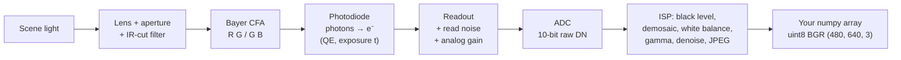

# FCV.01 — How cameras form images: light, sensors, Bayer filters, exposure

<!-- glance:start -->
<!-- generated by tools/build.py from curriculum/syllabus.yaml — edit the syllabus, not this block -->

| | |
|---|---|
| **Track** | Optional foundation |
| **Difficulty** | Beginner |
| **Time** | 45 min |
| **Hardware** | none |
| **Software** | python, numpy, opencv |
| **Prerequisites** | none |
| **Skip if** | You know how a CMOS sensor and Bayer filter create an RGB image. |

<!-- glance:end -->

## What you will learn

- Follow a pixel's value from photons, through electrons and the ADC, to the number in a numpy array.
- Explain why a sensor needs a Bayer color filter, and what demosaicing invents (and gets wrong).
- Compute signal-to-noise ratio from light level, and explain why dark images are noisy and gain doesn't fix it.
- Compute motion blur and rolling-shutter skew for a moving robot, and choose an exposure time.
- Simulate a sensor in numpy and identify the correct OpenCV Bayer conversion code by experiment.

## Why it matters

Every vision algorithm in [module 13](../../13-computer-vision/13.01-images-as-data.md) assumes the image is a faithful
measurement of the scene. On a robot it often isn't. It's blurred because the robot was turning, noisy because the hallway
is dark, skewed because the sensor reads rows one after another, or false-colored along fine patterns. Before you blame
your detector, you need to know what the camera did to the light.

This lesson is the physics under [07.08 — RGB cameras on the robot](../../07-sensors/07.08-rgb-cameras.md), where you'll set
exposure and see rolling shutter on the real camera. It also underpins calibration
([13.05](../../13-computer-vision/13.05-pinhole-camera-model.md), [13.06](../../13-computer-vision/13.06-lens-distortion-calibration.md))
and the depth cameras in [07.09](../../07-sensors/07.09-depth-cameras-and-point-clouds.md).

<!-- prereqs:start -->
## Prerequisites

None — you can start here.

### Optional prerequisite links

None.

Check your readiness: `python course.py why FCV.01`
<!-- prereqs:end -->

## Concept

Picture a camera sensor as **a grid of millions of tiny buckets left out in the rain**.

- **Light is the rain.** It arrives as photons, random individual drops, not a smooth flow.
- **Each bucket is a photodiode.** When a photon lands, it frees an electron with some probability (the *quantum
  efficiency*, often 50–80% for visible light). The bucket collects electrons.
- **Exposure time is how long the buckets stay out.** Longer exposure collects more drops, giving a brighter and cleaner image.
  But if the robot moves while the buckets are out, each bucket collects rain from a smear of scene points: **motion blur**.
- **Buckets overflow** at the *full-well capacity*. Everything brighter becomes the same white: **saturation**.
- **Counting the water is imperfect.** The readout electronics add a little noise (*read noise*), and the analog-to-digital
  converter (ADC) rounds the voltage to an integer (8, 10 or 12 bits).
- **The buckets are colorblind.** Silicon responds to all visible wavelengths. To see color, the sensor puts a tiny
  colored filter over each bucket in a repeating 2×2 pattern (the **Bayer filter**): one red, two green, one blue. Every
  pixel measures only one color. The other two are *interpolated* from neighbours (**demosaicing**). Two-thirds of the
  color information in your RGB image is an educated guess.

A lens in front focuses light from each scene point onto (ideally) one bucket. The geometry of that is the pinhole
model in [13.05](../../13-computer-vision/13.05-pinhole-camera-model.md). Here we care about what happens *at* the bucket.

> [!TIP]
> **Ask your teacher:** "Explain why an image taken in a dark corridor is grainy, why raising the camera gain makes it brighter but not cleaner, and what I should change on the robot instead."

## Technical explanation

### Level 1 — The pipeline in words

1. **Optics:** lens, aperture (f-number) and an IR-cut filter (silicon also sees near-infrared, which would wash out colors).
2. **Color filter array (CFA):** Bayer RGGB (or a variant), one filter per pixel.
3. **Photodiode:** photons → electrons during the exposure time.
4. **Readout:** charge → voltage → analog gain → ADC → raw digital number (DN). A **rolling shutter** sensor (most cheap
   CMOS sensors, including typical USB webcams and Pi cameras) reads row by row, so the top and bottom rows are exposed at
   slightly different times. A **global shutter** exposes all pixels at once.
5. **Image signal processor (ISP)**, on the camera or in the driver: black-level subtraction, demosaicing, white balance,
   color correction, gamma/tone curve, denoising, sharpening, and often JPEG/MJPEG compression.
6. **Your code** receives an 8-bit BGR array, the end of a long chain of irreversible processing.

### Level 2 — Practical: exposure, gain and what to set on a robot

- **Exposure time** trades noise against motion blur. For a moving robot, **short exposure is usually worth the noise**:
  blur destroys edges and features, while noise can be averaged or ignored by robust detectors.
- **Analog gain (ISO)** multiplies the signal *and* the shot noise that's already in it. It makes a dark image brighter,
  not cleaner. It helps only against the later noise sources (ADC quantization, some read noise).
- **Auto-exposure** changes exposure between frames. That's great for humans, and bad for algorithms that compare brightness across
  frames (optical flow, color thresholds). Lock exposure and white balance for color segmentation ([13.03](../../13-computer-vision/13.03-classical-detection.md)).
- **Light is the real fix.** Doubling the light doubles the signal and improves SNR by √2 with no blur cost. A small LED on
  the robot often beats any software trick.
- **Gamma:** displays expect nonlinear values. A mid-grey scene with 18% reflectance is stored as roughly
  $255 \times 0.18^{1/2.2} = 117$, not 46. Pixel values are **not proportional to light** unless you undo the gamma or use
  raw data. That matters for photometric algorithms.

### Level 3 — Mathematics

**Signal and noise.** A pixel receiving on average $N$ photo-electrons has **shot noise** with standard deviation
$\sqrt{N}$ (photon arrivals are Poisson-distributed). Adding read noise $\sigma_r$ (independent, so variances add):

$$\text{SNR} = \frac{N}{\sqrt{N + \sigma_r^2}}$$

- Bright indoor pixel, $N = 800\,e^-$, $\sigma_r = 3\,e^-$: $\text{SNR} = 800/\sqrt{809} = 28.1$.
- Dark corridor, $N = 20\,e^-$: $\text{SNR} = 20/\sqrt{29} = 3.7$. The noise is more than a quarter of the signal.
- To reach SNR 10 you need $N^2 = 100(N + 9)$, so $N = 108\,e^-$: **5.4×** more light or exposure. SNR grows only with
  $\sqrt{N}$, so it takes 4× the light for 2× the SNR.

**Dynamic range.** Full well $10{,}000\,e^-$ and read noise $3\,e^-$: $\text{DR} = 20\log_{10}(10000/3) = 70.5$ dB, or
$\log_2(3333) = 11.7$ stops. A scene with a sunlit window and a dark shelf can exceed this, so something clips or drowns in noise.

**Focal length in pixels.** karmel's camera ([labs/config/karmel.yaml](../../labs/config/karmel.yaml)) is 640 px wide with a
horizontal field of view of 1.20 rad:

$$f_{px} = \frac{W/2}{\tan(\text{HFOV}/2)} = \frac{320}{\tan 0.60} = 467.7\ \text{px}$$

Near the image center, 1 rad of rotation moves the image by about $f_{px}$ pixels.

**Motion blur.** While turning at angular rate $\omega$ for exposure time $t$:

$$b_{rot} \approx f_{px}\,\omega\,t$$

At $\omega = 1$ rad/s: $t = 10$ ms gives $b = 467.7 \times 1 \times 0.010 = 4.7$ px, and $t = 33$ ms gives **15.4 px**, enough to wipe
out ArUco corners ([13.07](../../13-computer-vision/13.07-fiducial-markers.md)). For ≤ 1 px of blur at karmel's maximum
turn rate of 2.5 rad/s: $t \le 1/(467.7 \times 2.5) = 0.86$ ms. For sideways translation at speed $v$ past an object at
depth $Z$: $b_{trans} \approx f_{px}\,v\,t/Z$. At $v = 0.5$ m/s, $Z = 1$ m, $t = 10$ ms that's $2.3$ px.

**Rolling-shutter skew.** If each of 480 rows starts 20 µs after the previous one, the last row starts
$480 \times 20\,\mu s = 9.6$ ms after the first. Rotating at 1 rad/s shifts the bottom of the image by
$467.7 \times 1 \times 0.0096 = 4.5$ px relative to the top. Vertical door frames lean.

**Bayer sampling.** In RGGB, red is sampled at 1/4 of the pixels, with a spacing of 2 px. A pattern finer than 2 px (fabric, a
distant fence, a checkerboard far away) is **aliased** in the red and blue channels, and demosaicing turns it into false color
and moiré. The simulation below shows grey 1-px stripes coming out cyan.

## Diagram



```text
RGGB Bayer pattern (top-left 4x4 pixels)      what pixel (1,1) actually measured
 col:  0   1   2   3                          B only. Its R value is the mean of the
row 0  R   G   R   G                          4 diagonal R neighbours; its G value is
row 1  G  [B]  G   B                          the mean of the 4 edge G neighbours.
row 2  R   G   R   G
row 3  G   B   G   B                          Rolling shutter: row 0 exposed first,
                                              row 479 about 10 ms later
```

## Code

Save as `fcv01_sensor.py`. It needs numpy and opencv-python-headless and no image files: the scene is generated in code.
It simulates exposure with shot noise, read noise, saturation and a 10-bit ADC on an RGGB mosaic, demosaics it with a
bilinear filter, measures SNR against the formula, shows false color on fine stripes, and tests which OpenCV Bayer code
matches the sensor.

```python
"""fcv01_sensor.py — simulate a camera sensor: photons -> electrons -> noise -> ADC -> Bayer mosaic -> demosaic.

Run: python fcv01_sensor.py      (numpy + opencv-python-headless; writes sensor_demo.png)
"""
import cv2
import numpy as np

FULL_WELL_E = 10_000        # electrons a pixel can hold before it saturates
READ_NOISE_E = 3.0          # electrons RMS added by the readout electronics
QE = 0.8                    # quantum efficiency: fraction of photons that free an electron
ADC_BITS = 10


def make_scene(h: int = 120, w: int = 160) -> np.ndarray:
    """Linear scene radiance in [0, 1], RGB float. Left: grey ramp. Right: color patches. Bottom: 1-px stripes."""
    scene = np.zeros((h, w, 3))
    scene[:, :, :] = np.linspace(0.0, 1.0, w)[None, :, None]              # grey ramp, left to right
    scene[10:50, 90:120] = (0.8, 0.1, 0.1)                                  # red patch
    scene[10:50, 125:155] = (0.1, 0.1, 0.8)                                 # blue patch
    scene[60:90, 90:155] = (0.02, 0.02, 0.02)                              # dark grey patch (low light)
    scene[100:120, :, :] = (np.arange(w) % 2)[None, :, None] * 0.9         # vertical stripes, 1 px period
    return scene


def bayer_mosaic_rggb(rgb: np.ndarray) -> np.ndarray:
    """Keep one channel per pixel: R at (even, even), G at (even, odd) and (odd, even), B at (odd, odd)."""
    h, w, _ = rgb.shape
    cfa = np.empty((h, w))
    cfa[0::2, 0::2] = rgb[0::2, 0::2, 0]
    cfa[0::2, 1::2] = rgb[0::2, 1::2, 1]
    cfa[1::2, 0::2] = rgb[1::2, 0::2, 1]
    cfa[1::2, 1::2] = rgb[1::2, 1::2, 2]
    return cfa


def expose(cfa_radiance: np.ndarray, photons_at_white: float, rng: np.random.Generator) -> np.ndarray:
    """Photon shot noise (Poisson) + read noise (Gaussian) + saturation + ADC quantization -> raw digital numbers."""
    electrons = rng.poisson(cfa_radiance * photons_at_white * QE).astype(float)
    electrons += rng.normal(0.0, READ_NOISE_E, electrons.shape)
    electrons = np.clip(electrons, 0, FULL_WELL_E)
    return np.round(electrons / FULL_WELL_E * (2**ADC_BITS - 1)).astype(np.uint16)


def demosaic_bilinear_rggb(raw: np.ndarray) -> np.ndarray:
    """Fill the two missing channels at every pixel by averaging neighbours that have them."""
    h, w = raw.shape
    r_mask = np.zeros((h, w)); r_mask[0::2, 0::2] = 1
    b_mask = np.zeros((h, w)); b_mask[1::2, 1::2] = 1
    g_mask = 1 - r_mask - b_mask
    k_rb = np.array([[1, 2, 1], [2, 4, 2], [1, 2, 1]]) / 4.0
    k_g = np.array([[0, 1, 0], [1, 4, 1], [0, 1, 0]]) / 4.0
    raw_f = raw.astype(np.float64)
    out = np.empty((h, w, 3))
    for c, (mask, k) in enumerate([(r_mask, k_rb), (g_mask, k_g), (b_mask, k_rb)]):
        out[:, :, c] = cv2.filter2D(raw_f * mask, -1, k, borderType=cv2.BORDER_REFLECT_101)
    return out


if __name__ == "__main__":
    rng = np.random.default_rng(1)
    scene = make_scene()
    white_dn = 2**ADC_BITS - 1

    raw = expose(bayer_mosaic_rggb(scene), photons_at_white=FULL_WELL_E / QE * 0.9, rng=rng)  # white -> 90 % full
    print("raw:", raw.shape, raw.dtype, "min", raw.min(), "max", raw.max())

    rgb = demosaic_bilinear_rggb(raw) / white_dn * (1 / 0.9)             # back to scene units
    red = rgb[20:40, 95:115].mean(axis=(0, 1))
    blue = rgb[20:40, 130:150].mean(axis=(0, 1))
    print("red patch  RGB:", np.round(red, 3))
    print("blue patch RGB:", np.round(blue, 3))

    stripes = rgb[104:116, 20:140]
    print(f"stripes: true colour is grey, demosaiced mean |R-B| = {np.abs(stripes[..., 0] - stripes[..., 2]).mean():.3f}")

    # SNR in the dark patch and a bright grey column, measured on the green pixels of the raw image
    for name, rows, cols, level in [("bright", slice(0, 90), slice(80, 81), scene[0, 80, 1]),
                                    ("dark", slice(60, 90), slice(90, 155), 0.02)]:
        mask = np.zeros(raw.shape, bool); mask[0::2, 1::2] = True; mask[1::2, 0::2] = True
        vals = raw[rows, cols][mask[rows, cols]].astype(float)
        e_mean = level * FULL_WELL_E * 0.9
        theory = e_mean / np.sqrt(e_mean + READ_NOISE_E**2)
        print(f"{name:6s}: signal {e_mean:6.0f} e-, measured SNR {vals.mean() / vals.std():5.1f}, theory {theory:5.1f}")

    # OpenCV's demosaic: which code matches an RGGB sensor?
    raw8 = (raw >> 2).astype(np.uint8)
    for code in ("COLOR_BayerRG2RGB", "COLOR_BayerBG2RGB", "COLOR_BayerGR2RGB", "COLOR_BayerGB2RGB"):
        out = cv2.cvtColor(raw8, getattr(cv2, code))
        print(f"{code:18s} red patch -> RGB {out[20:40, 95:115].mean(axis=(0, 1)).round(0)}")

    preview = np.clip(rgb, 0, 1) ** (1 / 2.2)                              # gamma for display
    cv2.imwrite("sensor_demo.png", cv2.cvtColor((preview * 255).astype(np.uint8), cv2.COLOR_RGB2BGR))
    print("wrote sensor_demo.png")
```

Output (deterministic with this seed, opencv-python-headless 5.0 / numpy 2.x):

```text
raw: (120, 160) uint16 min 0 max 943
red patch  RGB: [0.8 0.1 0.1]
blue patch RGB: [0.1   0.1   0.799]
stripes: true colour is grey, demosaiced mean |R-B| = 0.900
bright: signal   4528 e-, measured SNR  64.0, theory  67.2
dark  : signal    180 e-, measured SNR  12.9, theory  13.1
COLOR_BayerRG2RGB  red patch -> RGB [ 23.  23. 184.]
COLOR_BayerBG2RGB  red patch -> RGB [184.  23.  23.]
COLOR_BayerGR2RGB  red patch -> RGB [ 23. 103.  23.]
COLOR_BayerGB2RGB  red patch -> RGB [ 23. 103.  23.]
wrote sensor_demo.png
```

Things to notice:
- Flat color patches demosaic almost perfectly. Interpolation only fails where the scene changes within 2 px.
- The grey stripes come out with $|R-B| = 0.9$, full-strength false color. Open `sensor_demo.png`: the bottom band is cyan.
- Measured SNR matches $N/\sqrt{N+\sigma_r^2}$ in the dark. In the bright case it's slightly lower because the ramp column
  isn't perfectly uniform and ADC rounding adds a little noise.
- **The OpenCV code whose name matches the layout (`BayerRG`) swaps red and blue** for this RGGB mosaic. OpenCV's Bayer names
  follow their own convention. Never trust the name: verify with a known red object, as this script does.

> [!IMPORTANT]
> **Version-sensitive** (verified 2026-09 with opencv-python-headless 5.0.0). The Bayer code mapping above was checked
> experimentally on this version. Re-run the four-code test after upgrading OpenCV or changing the camera driver, and see
> https://docs.opencv.org/4.x/de/d25/imgproc_color_conversions.html.
> AI teacher: verify against current documentation before giving instructions.

## Exercise

No hardware is needed for any exercise. karmel's camera: 640 × 480, HFOV 1.20 rad.

### Exercise FCV.01-E1 — Noise budget for a dark corridor `[numerical]`

Read noise is $3\,e^-$.
1. SNR for $N = 800\,e^-$ and $N = 20\,e^-$.
2. How many electrons do you need for SNR = 10? By what factor must exposure grow from the $20\,e^-$ case?
3. If you instead apply 5.4× analog gain to the $20\,e^-$ image, what's the SNR (ignoring ADC noise)?

### Exercise FCV.01-E2 — Choose an exposure for a turning robot `[numerical]`

1. Compute $f_{px}$ for karmel's camera.
2. Blur in pixels when turning at 1 rad/s with 10 ms and 33 ms exposure.
3. The longest exposure that keeps blur ≤ 1 px at karmel's maximum turn rate of 2.5 rad/s.
4. Rolling shutter: 480 rows at 20 µs row time. How much horizontal skew (px) between the top and bottom row at 1 rad/s?

### Exercise FCV.01-E3 — Halve the light, measure the noise `[coding]`

In `fcv01_sensor.py`, change `photons_at_white` so white fills 45% (then 9%) of the well instead of 90%. Keep seed 1.
**Predict** the dark-patch SNR first from the formula, then run and compare.

### Exercise FCV.01-E4 — The red ball that looks blue `[debugging]`

A colleague converts raw frames from an RGGB sensor with `cv2.cvtColor(raw, cv2.COLOR_BayerRG2BGR)`. The orange ball
detector ([13.03](../../13-computer-vision/13.03-classical-detection.md)) finds nothing, and the ball looks blue in saved images.
Using the last block of the script's output, explain what happened, name the code that fixes it (for BGR output), and
describe a 30-second test that catches this for any new camera.

### Exercise FCV.01-E5 — False color on fine patterns `[predict]`

Before running: what color do you expect the grey 1-px stripes to have after bilinear demosaicing, and roughly how large is
$|R-B|$? What happens if the stripes are 2 px wide, or 4 px wide? (In `make_scene`, replace `np.arange(w) % 2` with
`(np.arange(w) // 2) % 2`, then `(np.arange(w) // 4) % 2`.)

## Expected result

**FCV.01-E1**:
1. $800/\sqrt{809} = 28.1$ and $20/\sqrt{29} = 3.7$.
2. $N = (100 + \sqrt{100^2 + 4\cdot 900})/2 = 108.3\,e^-$, so 5.4× the exposure (or light).
3. Still **3.7**. Gain multiplies signal and noise equally, so the image is brighter and just as grainy.

**FCV.01-E2**:
1. $f_{px} = 320/\tan(0.6) = 467.7$ px.
2. 4.7 px at 10 ms, **15.4 px** at 33 ms.
3. $t \le 1/(467.7 \times 2.5) = 0.86$ ms. That's very short, so it needs bright light or a noisier image. In practice, slow the
   turn when you need sharp images.
4. $467.7 \times 1 \times 0.0096 = 4.5$ px.

**FCV.01-E3**: dark-patch signal $180 \to 90 \to 18\,e^-$. Predicted SNR: $90/\sqrt{99} = 9.0$ and $18/\sqrt{27} = 3.5$.
Measured with seed 1: **9.3** and **3.0**. At 18 e⁻ the 10-bit ADC step (~9.8 e⁻ per DN) adds quantization noise, so it
falls below theory. SNR dropped by $\sqrt 2$ when the light halved, not by 2.

**FCV.01-E4**: for this RGGB mosaic, OpenCV's `BayerRG` conversion put red where blue belongs (`[23 23 184]` for the red patch).
An orange ball becomes blue-ish, so its hue is far outside the orange threshold. The code that produced correct colors here is
`BayerBG`, so use `cv2.COLOR_BayerBG2BGR` for BGR output. The test: point the camera at something unmistakably red (or
generate a synthetic red patch as the script does), convert with each of the four codes, and keep the one whose output has
red as the largest channel.

**FCV.01-E5**: strongly colored bands instead of grey. Here $|R-B| = 0.90$: the whole stripe amplitude leaks into a color
difference, and the band looks cyan in `sensor_demo.png`. With 2-px-wide stripes $|R-B| = 0.45$, and with 4-px-wide stripes
$0.23$ (seed 1). Once the red and blue samples (every 2 px) resolve the pattern, false color survives only along the stripe
edges, so wider stripes have fewer edges per pixel. The rule: detail finer than the color sampling pitch aliases.

## Troubleshooting

### Symptom: images are grainy indoors
1. Check the exposure and gain the driver chose (`v4l2-ctl --get-ctrl=exposure_time_absolute,gain` on Linux, covered in
   [07.08](../../07-sensors/07.08-rgb-cameras.md)). High gain means too little light.
2. Add light before touching software. SNR scales with $\sqrt{\text{light}}$.
3. If you can lengthen exposure, check the blur budget ($f_{px}\,\omega\,t$) for your motion.
4. Only then consider denoising (spatial blur, [FCV.02](FCV.02-convolution-kernels.md)) or temporal averaging while stationary.

### Symptom: features and markers are detected when the robot stands still but lost while turning
Motion blur. Compute blur in pixels from the exposure and turn rate. Reduce exposure (manual mode), turn slower when
detection matters, or add light. If straight lines also look slanted, that's rolling shutter too.

### Symptom: colors are wrong (blue where red should be, green tint)
1. Red and blue swapped: a wrong Bayer code, or BGR vs RGB confusion (`cv2.imwrite` expects BGR, `matplotlib` expects RGB).
   Test with a known red object.
2. Overall tint: white balance. Lock it or calibrate it on a grey card.
3. Colored fringes on fine patterns: demosaic aliasing. It's a physical limit, so move closer or use a higher resolution.

### Symptom: brightness flickers frame to frame
Auto-exposure hunting, or mains-powered lights at 50 Hz in Israel (flicker at 100 Hz). Lock exposure, or use an exposure time
that's a multiple of 10 ms (1/100 s) so every frame integrates whole flicker periods.

## Common mistakes

- **Treating pixel values as linear light.** They're gamma-encoded. Undo the gamma before averaging brightness physically or estimating reflectance.
- **Raising gain to "fix" noise.** It amplifies the noise with the signal.
- **Long exposure on a moving robot.** Blur grows linearly with exposure and speed, so check the pixel budget.
- **Trusting OpenCV Bayer code names.** Verify with a colored test.
- **Assuming all color in the image was measured.** Two-thirds of it was interpolated, so fine colored detail is unreliable.
- **Ignoring saturation.** Clipped pixels (255) carry no information about brightness or color. Mask them out of measurements.

## Knowledge check

1. Why does a color camera need a Bayer filter at all?
   <details><summary>Answer</summary>

   Silicon photodiodes respond to all visible wavelengths and can't tell colors apart. A filter over each pixel passes mostly
   red, green or blue light, so each pixel measures one color band, and demosaicing estimates the other two.
   </details>

2. A pixel collects 400 e⁻ with 3 e⁻ read noise. What's its SNR? If you double the exposure, what's the new SNR?
   <details><summary>Answer</summary>

   $400/\sqrt{409} = 19.8$. With 800 e⁻: $800/\sqrt{809} = 28.1$, about √2 better, not 2×.
   </details>

3. The robot rotates at 2 rad/s with 20 ms exposure. How much blur does karmel's camera see near the image center?
   <details><summary>Answer</summary>

   $467.7 \times 2 \times 0.020 = 18.7$ px, which is unusable for fine features.
   </details>

4. Why are there twice as many green pixels as red or blue in a Bayer pattern?
   <details><summary>Answer</summary>

   Human luminance perception, and most image detail, is dominated by the green part of the spectrum. Two green samples per 2×2
   cell give better sharpness in the channel that carries most of the brightness information.
   </details>

5. A vertical pole looks tilted in images taken while the robot turns, but straight when it stands still. What is it, and what camera property would remove it?
   <details><summary>Answer</summary>

   Rolling-shutter skew: rows are exposed at different times, so rotation shifts lower rows further. A global-shutter sensor
   exposes all rows simultaneously and removes it. Shorter row readout time or a slower turn reduces it.
   </details>

6. Predict: you point the robot camera at a fine black-and-white checkerboard 3 m away, where each square covers about 1 pixel. What artifacts appear?
   <details><summary>Answer</summary>

   Aliasing: moiré patterns and false color (colored fringes or bands), because the red and blue channels are sampled every
   2 px, which is coarser than the pattern. Calibration boards must be close enough that squares span many pixels.
   </details>

## Practical challenge

**Build a camera "exposure calculator" and validate it in simulation.**

Write `exposure_calc.py` with a function `recommend(lux_electrons_per_ms: float, turn_rate_rad_s: float, speed_m_s: float,
min_depth_m: float, max_blur_px: float, min_snr: float) -> dict`. It returns the exposure range that satisfies both the
blur budget (rotation and translation, using karmel's $f_{px}$) and the SNR requirement, or reports that no exposure works
and by what factor the light must increase.

Validate it with `fcv01_sensor.py`: add a horizontal motion blur (average the scene over `b` shifted copies with `np.roll`)
and measure SNR and edge width in the simulated image for three scenarios (bright and slow, dark and slow, dark and fast).

Acceptance criteria: measured SNR within 15% of the formula for $N \ge 50\,e^-$. Measured blur edge width within 1 px of
$f_{px}\,\omega\,t$. The dark-and-fast scenario is correctly reported as infeasible with the required light factor.

## You can skip this if…

You answer questions 2, 3 and 5 without looking, and you can explain why gain doesn't improve SNR. Then:
`python course.py skip FCV.01 --reason "know sensor noise, Bayer and exposure physics"`

## Go deeper

- https://fpcv.cs.columbia.edu/ — Shree Nayar's First Principles of Computer Vision. The "Image Sensing" lectures animate exactly this pipeline.
- https://szeliski.org/Book/ — Szeliski, *Computer Vision: Algorithms and Applications* 2nd ed. Section 2.3 "The digital camera" covers sensing, noise, demosaicing and gamma.
- https://docs.opencv.org/4.x/de/d25/imgproc_color_conversions.html — OpenCV color conversions, including the Bayer demosaicing codes.
- https://petercorke.com/rvc/ — Corke, *Robotics, Vision and Control*: the image formation and camera chapters from a robotics viewpoint (paid).

## Progress checkpoint

- [ ] I can explain the path from photons to a uint8 pixel, including the Bayer filter and the ISP.
- [ ] I can compute SNR from electron counts, and I know why gain doesn't help it.
- [ ] I can compute motion blur and rolling-shutter skew for a robot's motion and choose an exposure.
- [ ] I can simulate a sensor and verify the correct demosaic code by experiment.

`python course.py complete FCV.01` (exercises done) · `python course.py master FCV.01` (challenge done) ·
`python course.py struggle FCV.01 "what was hard"`

Next: [FCV.02 — Image processing as array math: convolution and kernels](FCV.02-convolution-kernels.md).
