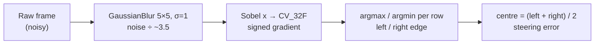

# FCV.02 — Image processing as array math: convolution and kernels

<!-- glance:start -->
<!-- generated by tools/build.py from curriculum/syllabus.yaml — edit the syllabus, not this block -->

| | |
|---|---|
| **Track** | Optional foundation |
| **Difficulty** | Beginner |
| **Time** | 50 min |
| **Hardware** | none |
| **Software** | python, numpy |
| **Prerequisites** | [FCV.01 How cameras form images: light, sensors, Bayer filters, exposure](FCV.01-how-cameras-form-images.md) |
| **Optional prerequisites** | [FPY.02 numpy essentials for robotics](../python/FPY.02-numpy-essentials.md) |
| **Skip if** | You can hand-compute a convolution. |

<!-- glance:end -->

## What you will learn

- Hand-compute a 3×3 filter response at a pixel, and explain the difference between correlation and convolution (and which one OpenCV runs).
- Design kernels for smoothing (box, Gaussian) and derivatives (Sobel), and predict their effect on noise and edges.
- Implement 2D filtering in numpy with a sliding-window view, and verify it against `cv2.filter2D`.
- Find the edges and center of a tape line on a noisy floor image, and avoid the uint8 clipping trap.
- Relate kernels to separability, borders and the convolution layers of a CNN.

## Why it matters

Almost every classical vision step on the robot is a convolution: blur before thresholding
([13.02](../../13-computer-vision/13.02-opencv-preprocessing.md)), edge and corner detectors
([13.04](../../13-computer-vision/13.04-features-and-matching.md)), noise removal from a grainy sensor
([FCV.01](FCV.01-how-cameras-form-images.md)), and the first layers of every CNN you'll deploy
([FML.08](../machine-learning/FML.08-cnns.md), [13.09](../../13-computer-vision/13.09-cnns-for-robot-vision.md)).
If you understand "slide a small weight grid over the image and take a weighted sum", you can read OpenCV's
filtering docs, debug why an edge disappeared, and understand what a CNN's first layer learned.

It's also array math in its purest form, and the best exercise for thinking in numpy
([FPY.02](../python/FPY.02-numpy-essentials.md)).

<!-- prereqs:start -->
## Prerequisites

You need these first:

- [FCV.01 How cameras form images: light, sensors, Bayer filters, exposure](FCV.01-how-cameras-form-images.md)

### Optional prerequisite links

New to any of these? Take the foundation lesson first; skip it if you already know it.

- [FPY.02 numpy essentials for robotics](../python/FPY.02-numpy-essentials.md)

Check your readiness: `python course.py why FCV.02`
<!-- prereqs:end -->

## Concept

A **kernel** is a tiny image of weights, typically 3×3 or 5×5. **Filtering** places the kernel's center on a pixel, multiplies
each kernel weight by the image pixel under it, sums the products, and writes the sum to the output at that pixel. Then it
moves one pixel and repeats, everywhere.

The weights decide what the filter "looks for":
- **All weights equal and positive (summing to 1):** the output is a local average. Noise (random pixel-to-pixel variation)
  averages out, and fine detail blurs. That's a *low-pass* filter.
- **Negative weights on one side, positive on the other (summing to 0):** flat regions give 0 and a brightness step gives a
  big number, positive or negative depending on direction. That's a derivative, or *edge detector*.
- **A pattern of weights:** the output is large where the image locally *looks like* the pattern. That's template matching,
  and it's exactly what a CNN's learned filters do.

A robot example: a camera looking down at the floor sees a bright tape line on a dark floor. Blur to kill sensor noise,
then apply a horizontal-derivative kernel. The output is a strong positive spike at the tape's left edge and a strong
negative spike at its right edge. The midpoint is the line center you steer toward.

> [!TIP]
> **Ask your teacher:** "Give me a 5×5 image patch and a 3×3 kernel, let me compute the output at the center by hand, then show me what changes if the kernel is flipped (convolution vs correlation)."

## Technical explanation

### Level 2 — Practical: the kernels you'll meet

| Kernel | Weights | Sum | Use |
|---|---|---|---|
| Box 3×3 | all $1/9$ | 1 | Fast blur. Blocky frequency response. |
| Gaussian $\sigma$ | $\propto e^{-(x^2+y^2)/2\sigma^2}$ | 1 | Smooth blur. The standard pre-step before thresholds and edges. Size ≈ $6\sigma$ rounded up to odd. |
| Sobel x | $\begin{smallmatrix}-1&0&1\\-2&0&2\\-1&0&1\end{smallmatrix}$ | 0 | Horizontal gradient $\partial I/\partial x$ (responds to *vertical* edges), with built-in smoothing along y. |
| Sobel y | transpose of Sobel x | 0 | Vertical gradient (horizontal edges). |
| Laplacian | $\begin{smallmatrix}0&1&0\\1&-4&1\\0&1&0\end{smallmatrix}$ | 0 | Second derivative: blobs and edges, very noise-sensitive. |
| Sharpen | identity + k·(−Laplacian) | 1 | Emphasizes edges. Amplifies noise too. |
| Median (not a kernel) | middle value of the window | — | Removes salt-and-pepper (dead/hot pixels). Nonlinear, so it can't be written as weights. |

Practical rules:
- **Weights sum to 1** preserve brightness (blurs). **Weights sum to 0** give 0 on flat regions (derivatives).
- **Output depth matters.** Derivatives are negative on half the edges. With `cv2.CV_8U` output, negatives clip to 0 and values
  above 255 clip to 255. Use `cv2.CV_32F` or `cv2.CV_16S`, then `cv2.convertScaleAbs` only for display.
- **Borders.** At the image edge the kernel hangs outside. OpenCV's default is `BORDER_REFLECT_101` (mirror). Zero padding
  (`BORDER_CONSTANT`) creates fake edges at the frame boundary. Ignore a border of `k//2` pixels in measurements.
- **Blur before differentiating.** A derivative amplifies pixel noise. Sobel includes a little smoothing, and a Gaussian first adds more.

### Level 3 — Mathematics

**Correlation** (what `cv2.filter2D` computes) for a kernel $K$ of size $(2a+1)\times(2b+1)$:

$$G(x, y) = \sum_{i=-a}^{a}\sum_{j=-b}^{b} K(i, j)\; I(x + i,\ y + j)$$

**Convolution** flips the kernel:

$$G(x, y) = \sum_{i=-a}^{a}\sum_{j=-b}^{b} K(i, j)\; I(x - i,\ y - j)$$

For symmetric kernels (box, Gaussian, Laplacian) they're identical. For Sobel they differ in sign. Mathematicians and CNN papers
say "convolution", while OpenCV and PyTorch's `Conv2d` actually compute correlation. The learned weights just absorb the flip.

**Worked example.** Take the 3×3 patch at the left edge of the tape:

$$P = \begin{bmatrix} 10 & 10 & 200 \\ 10 & 200 & 200 \\ 200 & 200 & 200 \end{bmatrix}$$

Sobel x (correlation), row by row: $(-10 + 0 + 200) + (-20 + 0 + 400) + (-200 + 0 + 200) = 190 + 380 + 0 = 570$.
A positive value means brightness increases to the right. True convolution flips the kernel horizontally and vertically,
which negates Sobel x, giving $-570$. The 3×3 box filter gives $(10\cdot 3 + 200\cdot 6)/9 = 1230/9 = 136.7$.

**Noise reduction.** If pixel noise is independent with standard deviation $\sigma_n$, a linear filter with weights
$w$ outputs noise with standard deviation $\sigma_n\sqrt{\sum w^2}$.
- Box 3×3: $\sqrt{9 \cdot (1/9)^2} = 1/3$. With $\sigma_n = 8$, the result is $2.67$.
- Gaussian 5×5 with $\sigma = 1$ (1D weights $0.0545, 0.2442, 0.4026, 0.2442, 0.0545$): $\sqrt{\sum w^2} = 0.287$, giving $2.30$.

The Code measures 2.70 and 2.37, which agrees (neighbouring outputs share pixels, and the sample is finite).

**Separability.** Sobel x is an outer product $\begin{bmatrix}1\\2\\1\end{bmatrix}\begin{bmatrix}-1&0&1\end{bmatrix}$: smooth
vertically, differentiate horizontally. A Gaussian is also separable. Filtering with a $k\times k$ separable kernel as two 1D
passes costs $2k$ multiplications per pixel instead of $k^2$. For $k = 15$ that's 30 vs 225, 7.5× less work.

**Gradient magnitude and direction** from $G_x$ and $G_y$: $|\nabla I| = \sqrt{G_x^2 + G_y^2}$, and $\theta = \operatorname{atan2}(G_y, G_x)$.
Example: $G_x = 570, G_y = 190$ gives $|\nabla I| = 600.8$ and $\theta = 18.4°$. The edge normal points mostly right and a
little down (image y grows downward).

## Diagram

```text
Correlation at pixel (x, y) with a 3x3 kernel

   image I (around x, y)            kernel K                output G
 ┌─────┬─────┬─────┐          ┌────┬────┬────┐
 │ 10  │ 10  │ 200 │          │ -1 │  0 │  1 │        G(x,y) = Σ K ⊙ patch
 ├─────┼─────┼─────┤    ⊙     ├────┼────┼────┤   →           = 190 + 380 + 0
 │ 10  │[200]│ 200 │          │ -2 │  0 │  2 │               = 570
 ├─────┼─────┼─────┤          ├────┼────┼────┤
 │ 200 │ 200 │ 200 │          │ -1 │  0 │  1 │        then slide one pixel right
 └─────┴─────┴─────┘          └────┴────┴────┘        and repeat for every pixel

 1-D intensity across the tape (row 30):    40 40 40 ▁▁▁ 200 200 ... 200 ▁▁▁ 40 40
 Sobel x response:                            0  0  +417 (col 28) ...    -423 (col 36)  0
```



## Code

Save as `fcv02_convolution.py` (numpy + opencv-python-headless). The image is generated in code: a 60 × 64 float32 floor
(value 40) with a tape stripe (value 200) in columns 28–35 and Gaussian noise with σ = 8.

```python
"""fcv02_convolution.py — convolution from scratch on a synthetic "tape on the floor" image, checked against OpenCV.

Run: python fcv02_convolution.py
"""
import time

import cv2
import numpy as np
from numpy.lib.stride_tricks import sliding_window_view


def make_floor(rng: np.random.Generator, h: int = 60, w: int = 64) -> np.ndarray:
    """Dark floor (40) with a bright tape stripe (200) in columns 28..35, plus sensor noise. float32."""
    img = np.full((h, w), 40.0, dtype=np.float32)
    img[:, 28:36] = 200.0
    img += rng.normal(0.0, 8.0, img.shape).astype(np.float32)
    return img


def correlate_loop(img: np.ndarray, k: np.ndarray) -> np.ndarray:
    """Textbook version: slide the kernel, multiply, sum. Zero padding. This is what cv2.filter2D computes."""
    kh, kw = k.shape
    pad = np.pad(img, ((kh // 2, kh // 2), (kw // 2, kw // 2)))
    out = np.zeros_like(img)
    for y in range(img.shape[0]):
        for x in range(img.shape[1]):
            out[y, x] = np.sum(pad[y:y + kh, x:x + kw] * k)
    return out


def correlate_windows(img: np.ndarray, k: np.ndarray) -> np.ndarray:
    """Vectorized: a (H, W, kh, kw) view of every window, then one einsum. No copies of the windows."""
    kh, kw = k.shape
    pad = np.pad(img, ((kh // 2, kh // 2), (kw // 2, kw // 2)))
    windows = sliding_window_view(pad, (kh, kw))                  # (H, W, kh, kw), a view
    return np.einsum("hwij,ij->hw", windows, k)


def _timed(fn, *args) -> float:
    t0 = time.perf_counter()
    fn(*args)
    return (time.perf_counter() - t0) * 1000


BOX3 = np.ones((3, 3), np.float32) / 9
SOBEL_X = np.array([[-1, 0, 1], [-2, 0, 2], [-1, 0, 1]], np.float32)   # d/dx: responds to vertical edges


if __name__ == "__main__":
    rng = np.random.default_rng(0)
    img = make_floor(rng)

    a = correlate_loop(img, SOBEL_X)
    b = correlate_windows(img, SOBEL_X)
    c = cv2.filter2D(img, cv2.CV_32F, SOBEL_X, borderType=cv2.BORDER_CONSTANT)
    print(f"loop vs windows max diff {np.abs(a - b).max():.2e}, windows vs OpenCV {np.abs(b - c).max():.2e}")
    for name, fn in [("loop", correlate_loop), ("windows", correlate_windows),
                     ("OpenCV", lambda i, k: cv2.filter2D(i, cv2.CV_32F, k, borderType=cv2.BORDER_CONSTANT))]:
        best = min(_timed(fn, img, SOBEL_X) for _ in range(3))
        print(f"  {name:8s} {best:8.3f} ms")

    # Noise before and after blurring (measured on the flat floor, columns 2..19)
    blurred = cv2.GaussianBlur(img, (5, 5), sigmaX=1.0)
    print(f"floor noise std: raw {img[5:-5, 2:20].std():.2f}, 3x3 box {cv2.blur(img, (3, 3))[5:-5, 2:20].std():.2f}, "
          f"Gaussian 5x5 s=1 {blurred[5:-5, 2:20].std():.2f}")

    # Edges: Sobel on the blurred image, keep the sign (float output!)
    gx = cv2.Sobel(blurred, cv2.CV_32F, dx=1, dy=0, ksize=3)
    row = gx[30]
    print("strongest + edge at column", int(np.argmax(row)), "value", round(float(row.max())))
    print("strongest - edge at column", int(np.argmin(row)), "value", round(float(row.min())))

    # Tape centre in every row = midpoint between the rising and falling edge (integer edge columns: +-0.5 px)
    left = np.argmax(gx, axis=1)
    right = np.argmin(gx, axis=1)
    centre = (left + right) / 2
    print(f"tape centre over {len(centre)} rows: mean {centre.mean():.2f} px, std {centre.std():.2f} px")

    # The uint8 trap: negative gradients are clipped to 0
    gx_u8 = cv2.Sobel(np.clip(blurred, 0, 255).astype(np.uint8), cv2.CV_8U, 1, 0, ksize=3)
    print("uint8 Sobel at row 30, columns 26..37:", gx_u8[30, 26:38].tolist())
```

Output (deterministic except the timings):

```text
loop vs windows max diff 1.22e-04, windows vs OpenCV 1.22e-04
  loop       20.731 ms
  windows     0.253 ms
  OpenCV      0.013 ms
floor noise std: raw 8.18, 3x3 box 2.70, Gaussian 5x5 s=1 2.37
strongest + edge at column 28 value 417
strongest - edge at column 36 value -423
tape centre over 60 rows: mean 31.35 px, std 0.35 px
uint8 Sobel at row 30, columns 26..37: [183, 255, 255, 207, 55, 10, 0, 0, 0, 0, 0, 0]
```

Reading it:
- The three implementations agree to float32 rounding (1e-4 on values in the hundreds). OpenCV is ~20× faster than the
  sliding-window version and ~1500× faster than the loop on this tiny image. Use your own implementation to *understand*,
  and OpenCV to *run*.
- The true edges lie *between* columns 27|28 and 35|36, so the true center is 31.5. The integer argmax/argmin estimate is within
  ±0.5 px, and averaged over rows it gives 31.35.
- In the uint8 version the left edge saturates at 255, and the right (negative) edge is **gone**: all zeros.

## Exercise

No hardware is needed. Put `fcv02_convolution.py` in the same folder for E3–E5.

### Exercise FCV.02-E1 — Filter a patch by hand `[numerical]`

For patch $P$ from Level 3, compute by hand: (a) Sobel x as correlation, (b) Sobel x as true convolution, (c) the 3×3 box
filter, (d) Sobel y as correlation ($K_y = K_x^{\mathsf T}$), and (e) the gradient magnitude and direction from (a) and (d).
Check (a) with `cv2.filter2D(P, -1, K, borderType=cv2.BORDER_CONSTANT)[1, 1]`.

### Exercise FCV.02-E2 — Is `filter2D` convolution or correlation? `[predict]`

Predict the 3×3 block around the center of the output before running:

```python
import cv2
import numpy as np

impulse = np.zeros((5, 5), np.float32)
impulse[2, 2] = 1.0
kernel = np.array([[1, 2, 3], [4, 5, 6], [7, 8, 9]], np.float32)
out = cv2.filter2D(impulse, -1, kernel, borderType=cv2.BORDER_CONSTANT)
print(out[1:4, 1:4])
```

### Exercise FCV.02-E3 — Implement filtering without loops `[coding]`

Write `correlate_windows(img, k)` yourself (cover the version above) using `np.pad`, `sliding_window_view` and
`np.einsum` or `np.tensordot`. Test it on `make_floor(np.random.default_rng(0))` with `BOX3`, `SOBEL_X` and a 5×5 Gaussian
(`g = cv2.getGaussianKernel(5, 1.0); K = g @ g.T`) against `cv2.filter2D(..., borderType=cv2.BORDER_CONSTANT)`.

### Exercise FCV.02-E4 — The disappearing right edge `[debugging]`

Explain the last output line of the Code (`[183, 255, 255, 207, 55, 10, 0, 0, …]`). Then fix it two ways: (a) float output
`cv2.CV_32F`, (b) `cv2.CV_16S` followed by `cv2.convertScaleAbs` for display. Print row 30, columns 26–37 for both.

### Exercise FCV.02-E5 — How much does blur buy? `[numerical]`

With pixel noise σ = 8 gray levels: predict the output noise for a 3×3 box, a 5×5 box, and a 5×5 Gaussian with σ = 1 using
$\sigma_n\sqrt{\sum w^2}$. Then measure with `cv2.blur` / `cv2.GaussianBlur` on the flat floor region `img[5:-5, 2:20]`. Also
state the multiplications per pixel for a 15×15 Gaussian done directly vs separably.

## Expected result

**FCV.02-E1**: (a) **570**. (b) **−570**. (c) **136.7**. (d) Sobel y: row 0 × −1: $-(10 + 20 + 200) = -230$; row 2 × +1:
$200 + 400 + 200 = 800$; total **570**. (e) $|\nabla I| = \sqrt{570^2 + 570^2} = 806.1$, $\theta = \operatorname{atan2}(570, 570) = 45°$.
The patch is a diagonal edge, brightening toward the bottom-right. `filter2D` prints `570.0`.

**FCV.02-E2**:

```text
[[9. 8. 7.]
 [6. 5. 4.]
 [3. 2. 1.]]
```

The kernel comes out **rotated 180°**, so `filter2D` is correlation. A true convolution of an impulse reproduces the kernel
unflipped. To convolve with OpenCV, pass `cv2.flip(kernel, -1)`.

**FCV.02-E3**: max absolute difference vs OpenCV ≤ 1e-3 for all three kernels (about 5e-05 for box and Gaussian, 1.2e-04 for Sobel). If you get large
differences only in the outer 1–2 pixels, your padding doesn't match `BORDER_CONSTANT`.

**FCV.02-E4**: the uint8 image was blurred and clipped. The rising edge gives gradients up to ~417, which **saturate at 255**
(columns 27–28). The falling edge gives about −423, and **negative values clip to 0**, so the right edge is invisible.
(a) `CV_32F` on the float blurred image: `[183, 402, 417, 209, 56, 10, -7, -43, -192, -416, -423, -198]` (rounded).
(b) `CV_16S` + `convertScaleAbs`: `[183, 255, 255, 207, 55, 10, 5, 42, 193, 255, 255, 198]`, where both edges appear as
magnitudes, clipped to 255 for display only. The steering code must use the signed version (a).

**FCV.02-E5**: predicted 2.67 (3×3 box), 1.60 (5×5 box), 2.30 (Gaussian). Measured 2.70, 1.73, 2.37 (±0.15; wider kernels deviate more because neighbouring outputs share pixels and the region is small).
A 15×15 Gaussian costs 225 multiplications per pixel directly and 30 separably.

## Troubleshooting

### Symptom: edges are missing or only one side of a line is detected
1. Check the output dtype of the derivative. `CV_8U` clips negatives. Use `CV_32F`/`CV_16S`.
2. Check the direction: Sobel x finds *vertical* edges, and Sobel y horizontal ones.
3. Check the input: a saturated (255) region has no gradient inside it.

### Symptom: the blurred image is darker/brighter than the original
The kernel doesn't sum to 1. Normalize it (`k / k.sum()`) or use `cv2.blur`/`cv2.GaussianBlur`, which normalize for you.
With integer kernels on uint8 images, the output also saturates.

### Symptom: strange bright or dark frames around the image border
Zero padding creates artificial edges. Use the default `BORDER_REFLECT_101` for real images, and exclude `k//2` pixels at
the border from statistics and detections.

### Symptom: your own implementation disagrees with OpenCV
1. Compare on an **impulse** image. That reveals kernel flips and anchor offsets immediately (E2).
2. Match the border mode exactly.
3. Check the dtype: `uint8` arithmetic in numpy wraps (250 + 10 = 4), while OpenCV saturates.

### Symptom: filtering is too slow on the Pi
1. Don't loop in Python. Use OpenCV.
2. Downscale first (a 320×240 image is 4× fewer pixels).
3. Use separable filters (`cv2.sepFilter2D`) or box filters for large kernels.

## Common mistakes

- **Assuming "convolution" in docs means flipped weights.** OpenCV and most deep-learning frameworks compute correlation.
- **Differentiating a noisy image without smoothing.** Derivatives amplify noise, so blur (or use Sobel's built-in smoothing) first.
- **Saving signed gradients as uint8** for "later processing" and losing half the edges.
- **Choosing a Gaussian size unrelated to σ.** A 3×3 kernel truncates a σ = 2 Gaussian badly. Use size ≈ 6σ (odd).
- **Using a mean blur on salt-and-pepper noise.** One 255 pixel smears into a gray blob. A median filter removes it.
- **Forgetting that blur moves edges** when the kernel is asymmetric or the anchor is off-center. It shows up as systematic bias in line position.

## Knowledge check

1. What do a blur kernel's weights sum to, and a derivative kernel's? Why?
   <details><summary>Answer</summary>

   Blur: 1, so a flat region keeps its brightness. Derivative: 0, so a flat region gives 0 response and only changes produce output.
   </details>

2. Compute the 3×3 box-filter output at a pixel whose 3×3 neighbourhood is all 40 except one 255 (a hot pixel). What would a 3×3 median give?
   <details><summary>Answer</summary>

   Mean: $(8 \cdot 40 + 255)/9 = 63.9$. The hot pixel smears into its neighbours. Median: 40. The outlier is removed completely.
   </details>

3. You apply `cv2.Sobel(img_u8, cv2.CV_8U, 1, 0)` to a white line on a black floor. What do you see and why?
   <details><summary>Answer</summary>

   Only the left edge (dark to bright gives positive gradients). The right edge has negative gradients, which are clipped to 0 in uint8.
   Strong edges also saturate at 255.
   </details>

4. Noise σ = 12. What's the noise after a 5×5 box filter, and after a 7×7 box filter?
   <details><summary>Answer</summary>

   $12/5 = 2.4$ and $12/7 = 1.71$. A box of $n$ pixels divides σ by $\sqrt{n}$.
   </details>

5. Why is a 31×31 Gaussian blur cheap despite 961 weights?
   <details><summary>Answer</summary>

   It's separable: a 1D 31-tap filter along x, then along y, is 62 multiplications per pixel instead of 961. OpenCV does this automatically.
   </details>

6. A CNN's first layer learned a 3×3 filter close to Sobel x. What does its feature map highlight, and what's the connection to this lesson?
   <details><summary>Answer</summary>

   Vertical edges, with sign indicating dark-to-bright or bright-to-dark. A convolution layer is exactly this sliding weighted
   sum (correlation) with learned weights, a bias and a nonlinearity. See [FML.08](../machine-learning/FML.08-cnns.md).
   </details>

## Practical challenge

**A line-follower perception function, validated in simulation.**

Write `line_offset(frame_bgr: np.ndarray) -> tuple[float, float] | None` that returns the tape's lateral offset from the image
center (in pixels) and its angle (in radians) for a downward-looking camera, or `None` if no line is found.

1. Generate test frames in code: a 120×160 floor with texture noise, a tape 10 px wide at a known offset (−40…+40 px) and angle
   (−30°…+30°, draw with `cv2.line` using `thickness=10`), random brightness gain 0.5–1.5, and σ = 10 noise.
2. Pipeline: grayscale → Gaussian blur → Sobel x (float) → per-row edge pair → row centers → least-squares line fit
   (`np.polyfit`) → offset at the bottom row and angle.
3. Reject frames without a valid edge pair in at least 50% of rows.

Acceptance criteria over 200 random frames: offset error ≤ 1.5 px (95th percentile), angle error ≤ 2° (95th percentile),
no false detections on 50 frames without tape, and under 2 ms per frame on a laptop. No Python loops over pixels (a loop over
rows is allowed but not required).

## You can skip this if…

You answer questions 2, 3 and 5 without looking and get E2 right before running it. Then:
`python course.py skip FCV.02 --reason "can hand-compute convolution and know filter2D semantics"`

## Go deeper

- https://docs.opencv.org/4.x/d4/d13/tutorial_py_filtering.html — OpenCV smoothing tutorial: `filter2D`, box, Gaussian, median and bilateral filters.
- https://docs.opencv.org/4.x/d2/d2c/tutorial_sobel_derivatives.html — Sobel/Scharr derivatives and why output depth matters.
- https://numpy.org/doc/stable/reference/generated/numpy.lib.stride_tricks.sliding_window_view.html — the window view used in the Code.
- https://fpcv.cs.columbia.edu/ — Nayar's lectures on image processing (linear filters, edge detection) with clear visual intuition.
- https://szeliski.org/Book/ — Szeliski 2nd ed., chapter 3 "Image processing": linear filtering, separability and band-pass filters.
- https://cs231n.github.io/convolutional-networks/ — CS231n notes connecting convolution to CNN layers.

## Progress checkpoint

- [ ] I can hand-compute correlation and convolution at a pixel and know which one OpenCV runs.
- [ ] I can pick blur and derivative kernels and predict their effect on noise and edges.
- [ ] I can implement 2D filtering in numpy without pixel loops and verify it against OpenCV.
- [ ] I keep gradients signed and handle borders deliberately.

`python course.py complete FCV.02` (exercises done) · `python course.py master FCV.02` (challenge done) ·
`python course.py struggle FCV.02 "what was hard"`

Next: [FCV.03 — Color spaces: RGB, HSV, Lab](FCV.03-color-spaces.md).
