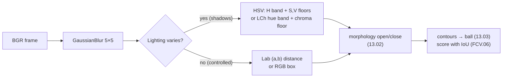

# FCV.03 — Color spaces: RGB, HSV, Lab

<!-- glance:start -->
<!-- generated by tools/build.py from curriculum/syllabus.yaml — edit the syllabus, not this block -->

| | |
|---|---|
| **Track** | Optional foundation |
| **Difficulty** | Beginner |
| **Time** | 35 min |
| **Hardware** | none |
| **Software** | python, opencv |
| **Prerequisites** | [FCV.01 How cameras form images: light, sensors, Bayer filters, exposure](FCV.01-how-cameras-form-images.md) |
| **Skip if** | You pick color spaces for segmentation knowingly. |

<!-- glance:end -->

## What you will learn

- Explain why RGB thresholds break under shadows, and what HSV and Lab separate that RGB mixes.
- Convert a color between RGB, HSV and Lab by hand and with OpenCV, including OpenCV's 8-bit ranges (H in 0–179).
- Handle hue wrap-around for red and meaningless hue for grey and dark pixels.
- Segment a shaded orange ball in four color spaces and compare them quantitatively with IoU.
- Choose a color space (and its thresholds) for a robot's color segmentation task on purpose.

## Why it matters

"Find the orange ball" is the first perception task in the course ([13.03](../../13-computer-vision/13.03-classical-detection.md)),
and it's harder than it looks. Drive the robot from a sunny spot into the shadow under a table, and every RGB value of the ball
changes. A threshold tuned in the morning fails in the afternoon. The fix isn't more tuning. It's choosing a representation in
which "orange" stays roughly constant while brightness changes.

The same idea appears in lane and tape detection, in picking colored blocks with the arm, and in camera streams themselves:
YUV formats separate brightness from color to save bandwidth ([07.08](../../07-sensors/07.08-rgb-cameras.md)). Images as arrays
and OpenCV's BGR order are introduced in [13.01](../../13-computer-vision/13.01-images-as-data.md). This lesson explains the
theory behind the color part.

<!-- prereqs:start -->
## Prerequisites

You need these first:

- [FCV.01 How cameras form images: light, sensors, Bayer filters, exposure](FCV.01-how-cameras-form-images.md)

### Optional prerequisite links

None.

Check your readiness: `python course.py why FCV.03`
<!-- prereqs:end -->

## Concept

**RGB** describes how much red, green and blue light a pixel has. It's how sensors measure ([FCV.01](FCV.01-how-cameras-form-images.md))
and how screens display. The problem: **brightness is smeared across all three numbers.** An orange ball is (255, 128, 0) in the
sun and (128, 64, 0) in shadow. Every channel changed, so a box threshold on R, G and B that includes both also includes a lot of
things that aren't orange.

**HSV** re-describes the same color as three human-meaningful quantities:
- **Hue:** *which* color, as an angle around a color wheel (red 0°, yellow 60°, green 120°, blue 240°).
- **Saturation:** *how pure*: 0 is grey, full is a vivid color.
- **Value:** *how bright*: the largest of R, G, B.

In shadow, orange keeps its hue and saturation, and only value drops. A threshold on hue with loose limits on value survives
lighting changes. The cost: hue is an angle (red wraps around 0°/360°), and hue is **undefined** for grey and very dark
pixels, where noise makes it jump randomly.

**Lab (CIE L\*a\*b\*)** was designed so that equal distances look like equal color differences to humans. **L** is lightness,
**a** runs green (−) to red (+), and **b** runs blue (−) to yellow (+). Lightness is separated like V in HSV, but the (a, b)
plane is continuous (no wrap-around) and perceptually uniform, so "distance to the reference color" is meaningful. A subtlety that
matters under shadows: the *distance from the grey center* in (a, b) (the **chroma**) also shrinks when the light dims, but the
*angle* (the Lab hue, used in the cylindrical form **LCh**) stays nearly constant.

> [!TIP]
> **Ask your teacher:** "Draw the HSV cone and the Lab (a, b) plane in words, place 'orange in sun', 'orange in shadow', 'grey floor' and 'red tape' on both, and explain which thresholds separate them."

## Technical explanation

### Level 2 — Practical: OpenCV's conventions (the source of most bugs)

| Space | OpenCV code (from BGR) | 8-bit ranges | Notes |
|---|---|---|---|
| BGR | — (what `imread` / cameras give) | 0–255 each | **Blue first.** matplotlib and most ML models expect RGB. |
| HSV | `cv2.COLOR_BGR2HSV` | H **0–179** (degrees ÷ 2), S 0–255, V 0–255 | `COLOR_BGR2HSV_FULL` maps H to 0–255 instead. |
| Lab | `cv2.COLOR_BGR2LAB` | L = L\*·255/100, a = a\*+128, b = b\*+128 | For float32 input in 0–1, you get real L\* (0–100), a\*, b\*. |
| YCrCb | `cv2.COLOR_BGR2YCrCb` | 0–255 each | Luma + two color differences, close to what JPEG/video use. |
| Gray | `cv2.COLOR_BGR2GRAY` | 0–255 | $Y = 0.299R + 0.587G + 0.114B$, a weighted sum, not a mean. |

Rules for segmentation on a robot:
1. **Lock auto white balance and exposure** if you can. Color spaces compensate for brightness, not for the camera re-tinting the scene.
2. **Blur first** (Gaussian 5×5, [FCV.02](FCV.02-convolution-kernels.md)). Per-pixel hue is noisy.
3. **HSV:** a hue band plus **minimum S and V** thresholds. The floors reject grey and dark pixels, whose hue is meaningless.
4. **Red wraps:** combine two ranges, `inRange(0..10) | inRange(170..179)`.
5. **Lab/LCh:** use a hue-angle band plus a chroma floor for shadow robustness, or Euclidean distance in (a, b) when lighting is controlled.
6. **Tune on data from the robot**, in the lighting where it runs, and score the thresholds with IoU against hand-labelled masks ([FCV.06](FCV.06-detection-metrics.md)).

### Level 3 — Mathematics

**RGB → HSV** (with R, G, B scaled to 0–1, $M = \max$, $m = \min$, $C = M - m$):

$$V = M,\qquad S = \frac{C}{M}\ (0 \text{ if } M = 0),\qquad
H = 60° \times \begin{cases} \frac{G - B}{C} \bmod 6 & M = R \\ \frac{B - R}{C} + 2 & M = G \\ \frac{R - G}{C} + 4 & M = B \end{cases}$$

Orange (R, G, B) = (255, 128, 0) → (1, 0.502, 0): $M = 1$, $m = 0$, $C = 1$, $V = 1$, $S = 1$, $H = 60° \times 0.502 = 30.1°$.
OpenCV 8-bit: **H = 15, S = 255, V = 255**. Shadowed orange (128, 64, 0) → (0.502, 0.251, 0): $C = 0.502$, $S = 1$,
$H = 60° \times 0.251/0.502 = 30°$, $V = 0.502$. OpenCV: **(15, 255, 128)**. Hue and saturation are unchanged, and only V halved.

**RGB → Lab** (sketch; OpenCV does it for you):
1. Undo the sRGB gamma: $c_{lin} = \left(\frac{c + 0.055}{1.055}\right)^{2.4}$ for $c > 0.04045$, else $c/12.92$.
2. Linear RGB → XYZ with a fixed 3×3 matrix (D65 white).
3. $L^* = 116 f(Y/Y_n) - 16$, $a^* = 500\,[f(X/X_n) - f(Y/Y_n)]$, $b^* = 200\,[f(Y/Y_n) - f(Z/Z_n)]$, with $f(t) = t^{1/3}$ (linear near 0).

OpenCV (float input) gives orange = (L\*, a\*, b\*) = (67.1, 42.8, 74.0) and shadowed orange = (34.5, 24.1, 44.8).

**Color difference** ΔE\*76 is Euclidean distance in Lab: orange vs shadowed orange is
$\sqrt{32.6^2 + 18.7^2 + 29.2^2} = 47.6$, a big difference, mostly lightness. Orange (255, 128, 0) vs a redder orange
(255, 100, 0) is only 14.5. So *raw* ΔE says "shadow changes the color more than a different orange does". That's why you drop L
and compare chroma or hue for segmentation.

**LCh hue.** $h = \operatorname{atan2}(b^*, a^*)$ and chroma $C^* = \sqrt{a^{*2} + b^{*2}}$.
Lit: $h = \operatorname{atan2}(74.0, 42.8) = 59.8°$, $C^* = 85.5$. Shadowed: $h = \operatorname{atan2}(44.8, 24.1) = 61.9°$, $C^* = 51$.
The hue angle moved 2°, while chroma dropped 40%. A fixed (a, b) distance threshold of 25 around the lit color misses the
shadowed ball (distance 34.7), and a hue-angle band doesn't.

## Diagram

```text
HSV (OpenCV 8-bit hue scale)                       Lab (a, b) plane, looking down the L axis

 H:  0     15    30      60      90     120  150  179       b* (yellow +)
     |red |orange|yellow| green  | cyan | blue|mag |red|          ▲       · lit orange (42.8, 74.0)  h = 59.8°
     └── wraps: 179 is next to 0 ──────────────────┘              │      ·
                                                                  │   · shadow orange (24.1, 44.8) h = 61.9°
 S = 0 → grey (hue meaningless)                                   │ ·        same direction, shorter
 V = 0 → black (hue meaningless)                     green (−) ───●──────────▶ a* (red +)
                                                                  │ grey floor: near the center (low chroma)
                                                                  ▼ blue (−)
```



## Code

Save as `fcv03_color.py` (numpy + opencv-python-headless). It renders a 320×240 scene: a green floor, an orange ball with sphere
shading, and a shadow over the right half of the image (and of the ball). Then it segments the ball four ways and reports IoU
against the true mask, split into the lit and shadowed halves.

```python
"""fcv03_color.py — segment an orange ball under a shadow in RGB, HSV and Lab; score each against ground truth.

Run: python fcv03_color.py      (numpy + opencv-python-headless; writes color_scene.png)
"""
import cv2
import numpy as np

H, W = 240, 320
BALL_BGR = np.array([0, 128, 255], np.float32)          # orange, as OpenCV stores it (B, G, R)
FLOOR_BGR = np.array([60, 110, 70], np.float32)         # greenish floor


def make_scene(rng: np.random.Generator) -> tuple[np.ndarray, np.ndarray]:
    """Uint8 BGR image and the true ball mask. Lambertian shading on the ball, a hard shadow over the right half."""
    yy, xx = np.mgrid[0:H, 0:W].astype(np.float32)
    cx, cy, r = 170.0, 120.0, 55.0
    d2 = (xx - cx) ** 2 + (yy - cy) ** 2
    mask = d2 <= r * r
    # sphere normal z-component -> brightness, light from the upper left
    nz = np.sqrt(np.clip(1 - d2 / (r * r), 0, 1))
    nx, ny = (xx - cx) / r, (yy - cy) / r
    shade = np.clip(0.35 + 0.65 * (nz * 0.8 - nx * 0.35 - ny * 0.35), 0.25, 1.0)
    img = np.where(mask[..., None], BALL_BGR * shade[..., None], FLOOR_BGR)
    img[:, 170:] *= 0.45                                  # shadow of a table leg over the right half
    img += rng.normal(0, 4.0, img.shape)
    return np.clip(img, 0, 255).astype(np.uint8), mask


def iou(a: np.ndarray, b: np.ndarray) -> float:
    return float(np.logical_and(a, b).sum() / np.logical_or(a, b).sum())


if __name__ == "__main__":
    rng = np.random.default_rng(2)
    bgr, truth = make_scene(rng)
    cv2.imwrite("color_scene.png", bgr)

    # 1) RGB box threshold tuned on the sunlit side: R high, G medium, B low
    b, g, r = cv2.split(bgr.astype(np.int16))
    m_rgb = (r > 150) & (g > 60) & (g < 170) & (b < 60)

    # 2) HSV: hue band for orange; S and V floors reject the floor and deep shadow noise
    hsv = cv2.cvtColor(bgr, cv2.COLOR_BGR2HSV)
    m_hsv = cv2.inRange(hsv, (8, 120, 40), (22, 255, 255)) > 0

    # 3) Lab: distance in the (a, b) chroma plane only, ignoring L (lightness)
    lab = cv2.cvtColor(bgr, cv2.COLOR_BGR2LAB).astype(np.float32)
    ref_ab = cv2.cvtColor(BALL_BGR.astype(np.uint8).reshape(1, 1, 3), cv2.COLOR_BGR2LAB)[0, 0, 1:].astype(np.float32)
    m_lab = np.linalg.norm(lab[..., 1:] - ref_ab, axis=2) < 25

    # 4) Lab as LCh: hue angle in the (a, b) plane + a chroma floor. The angle survives shadows; |ab| does not.
    a0, b0 = lab[..., 1] - 128, lab[..., 2] - 128
    hue_deg = np.degrees(np.arctan2(b0, a0))
    ref_hue = np.degrees(np.arctan2(ref_ab[1] - 128, ref_ab[0] - 128))
    m_lch = (np.abs(hue_deg - ref_hue) < 12) & (np.hypot(a0, b0) > 25)

    for name, m in [("RGB", m_rgb), ("HSV", m_hsv), ("Lab ab", m_lab), ("LCh h", m_lch)]:
        lit, shaded = truth[:, :170], truth[:, 170:]
        print(f"{name:6s} IoU {iou(m, truth):.3f}   found {m[:, :170][lit].mean():5.1%} of lit ball, "
              f"{m[:, 170:][shaded].mean():5.1%} of shadowed ball, false pixels {np.count_nonzero(m & ~truth)}")

    px = np.uint8([[[0, 128, 255], [0, 64, 128], [255, 128, 0]]])      # orange, shaded orange, "orange" read as RGB
    print("HSV of orange, shaded orange, swapped channels:", cv2.cvtColor(px, cv2.COLOR_BGR2HSV)[0].tolist())
    print("Lab (8-bit) of the same three:", cv2.cvtColor(px, cv2.COLOR_BGR2LAB)[0].tolist())
    red = np.uint8([[[0, 0, 255], [30, 20, 230], [20, 30, 230]]])       # pure red, slightly bluish red, slightly yellowish red
    print("HSV hue of three reds:", cv2.cvtColor(red, cv2.COLOR_BGR2HSV)[0, :, 0].tolist())
```

Output (deterministic, opencv-python-headless 5.0):

```text
RGB    IoU 0.434   found 87.9% of lit ball,  0.0% of shadowed ball, false pixels 0
HSV    IoU 0.930   found 100.0% of lit ball, 86.2% of shadowed ball, false pixels 0
Lab ab IoU 0.413   found 83.7% of lit ball,  0.0% of shadowed ball, false pixels 0
LCh h  IoU 0.816   found 99.9% of lit ball, 63.7% of shadowed ball, false pixels 0
HSV of orange, shaded orange, swapped channels: [[15, 255, 255], [15, 255, 128], [105, 255, 255]]
Lab (8-bit) of the same three: [[171, 171, 202], [88, 152, 173], [140, 147, 57]]
HSV hue of three reds: [0, 179, 1]
```

Interpretation:
- **RGB** and **Lab (a, b) distance** lose the entire shadowed half. Both encode "how much color", which scales with light.
- **HSV** keeps 86% of the shadowed ball. The misses are the darkest, most noisy pixels (V < 40, or hue scattered by noise).
- **LCh hue** is also robust, but noisier in deep shadow here, because 8-bit a/b values near the gray point quantize the angle coarsely.
- None produced false pixels on this clean green floor. Real floors (wood, cardboard) are orange-ish, and that's where the S/chroma floors earn their keep.

## Exercise

No hardware is needed. Put `fcv03_color.py` in the same folder.

### Exercise FCV.03-E1 — Convert by hand `[numerical]`

1. Convert (R, G, B) = (255, 128, 0) and (128, 64, 0) to HSV by hand, then to OpenCV 8-bit ranges.
2. With `cv2.cvtColor` on **float32** BGR input in 0–1, get L\*, a\*, b\* for both, and compute ΔE\*76 between them, the LCh hue angles, and the chromas.
3. Compute ΔE\*76 between (255, 128, 0) and (255, 100, 0). Which pair is "more different" in raw Lab, and why does that matter for segmentation?

### Exercise FCV.03-E2 — Red wraps around `[predict]`

The script prints OpenCV hues for pure red, a slightly bluish red and a slightly yellowish red. **Before running**, predict the three
numbers. Then: which of them does `cv2.inRange(hsv, (0, 120, 70), (10, 255, 255))` keep? Write the mask that keeps all three.

### Exercise FCV.03-E3 — Tune and compare `[coding]`

Run `fcv03_color.py`, then:
1. Replace the RGB rule with the looser `(r > 50) & (g > 20) & (g < 170) & (b < 60) & (r > g + 15)`. Report IoU, shadowed-ball recall and false pixels.
2. Lower the HSV V floor from 40 to 15. Report the same three numbers.
3. Now make the floor wood-colored: `FLOOR_BGR = np.array([40, 90, 150], np.float32)`. Rerun the loose RGB rule and the HSV rule
   (V floor 40) with S floors of 120, 200 and 220. Before running, compute the floor's OpenCV HSV value and predict what happens.

### Exercise FCV.03-E4 — The blue orange `[debugging]`

A teammate reads frames with `cv2.imread`, converts them to RGB for a matplotlib preview, then calls `cv2.cvtColor(rgb, cv2.COLOR_BGR2HSV)`
and thresholds hue 8–22. Nothing is found. Using the third pixel in the script's output, explain what happened, what hue the ball gets,
and the fix.

## Expected result

**FCV.03-E1**:
1. (255, 128, 0): H = 30.1°, S = 1, V = 1, so OpenCV **(15, 255, 255)**. (128, 64, 0): H = 30°, S = 1, V = 0.502, so OpenCV **(15, 255, 128)**.
2. L\*a\*b\* = (67.05, 42.83, 74.02) and (34.45, 24.11, 44.78). ΔE\*76 = **47.6**. Hue angles **59.8°** and **61.9°**. Chroma **85.5** and **51.0**.
3. ΔE\*76 = **14.5** for the two oranges. In raw Lab, the *same* ball in shadow differs more (47.6) than a *different* orange does
   (14.5). Segmentation must ignore lightness (and, under shadows, chroma magnitude) and compare hue.

**FCV.03-E2**: `[0, 179, 1]`. The bluish red lands at **179**, the other end of the hue circle. The range 0–10 keeps only 0 and 1.
Fix: `cv2.inRange(hsv, (0, 120, 70), (10, 255, 255)) | cv2.inRange(hsv, (170, 120, 70), (179, 255, 255))`.

**FCV.03-E3** (seed 2):
1. Loose RGB: IoU **0.880**, shadowed recall **76.3%**, **0** false pixels. It looks fine, but only because the floor is green (G > R).
2. HSV with V ≥ 15: IoU **0.990**, shadowed recall **98.1%**, **0** false pixels.
3. The wood floor is HSV **(14, 187, 150)**: its hue is inside the orange band. Loose RGB: IoU **0.110** with **66,660** false pixels.
   HSV with S ≥ 120: IoU **0.116**, 66,601 false pixels. S ≥ 200: IoU 0.472, 9,209 false pixels (noise in the shadowed floor
   pushes some floor pixels above 200). S ≥ 220: IoU **0.860**, 715 false pixels, with shadowed recall still 85%. Hue alone can't
   separate "orange ball" from "orange-ish floor". Saturation is the discriminating feature here, and you only discover that by
   testing on the robot's actual floor.

**FCV.03-E4**: the frame was already RGB, but `COLOR_BGR2HSV` treats channel 0 as blue. Orange (R=255, G=128, B=0), read with its
channels swapped, becomes a blue-ish color with **H = 105**, far outside 8–22. Fix: `cv2.COLOR_RGB2HSV` for RGB input, or keep
the BGR frame for all OpenCV calls and convert to RGB only for display.

## Troubleshooting

### Symptom: the mask flickers or is full of speckles
1. Hue of low-saturation or dark pixels is noise. Raise the S and V floors.
2. Blur before converting (Gaussian 5×5).
3. Clean the mask with morphology (`cv2.morphologyEx` open, then close) as in [13.02](../../13-computer-vision/13.02-opencv-preprocessing.md).
4. Check that auto white balance isn't hunting between frames. Lock it.

### Symptom: thresholds that worked yesterday fail today
1. Save a frame from the failure and plot its H, S, V histograms inside the object (hand-mask it).
2. Hue shifted: white balance or light source changed (daylight vs LED). Lock WB or widen the hue band slightly.
3. V/S dropped: a shadow or dimmer light. Lower the floors and add light.
4. Evaluate thresholds on a *set* of frames from different times of day, not one.

### Symptom: red objects detected only partially
Hue wrap-around. Use two ranges (E2), or rotate hue by 90 before thresholding: `(h.astype(int) + 90) % 180`.

### Symptom: colors look right on screen but thresholds never match
Channel order. Print one known pixel: `frame[y, x]` for something red must be `[low, low, high]` in BGR. Check whether any step
(ROS `cv_bridge` with `rgb8` encoding, PIL, a model preprocessor) handed you RGB.

## Common mistakes

- **Using 0–360 hue values with OpenCV's 8-bit HSV.** OpenCV halves hue: orange is 15, not 30.
- **Thresholding hue without S and V floors.** Grey walls and black shadows get random hues.
- **Mixing up `COLOR_BGR2*` and `COLOR_RGB2*`.** It's silent and produces plausible-looking wrong colors.
- **Comparing 8-bit Lab values as if they were L\*a\*b\*.** 8-bit L is scaled to 0–255, and a/b are offset by 128. Convert before using textbook thresholds.
- **Believing any color space removes shadows completely.** They reduce the effect. Controlled light and locked camera settings do the rest.
- **Tuning thresholds on a single photo.** Use a labelled set of frames and a metric (IoU).

## Knowledge check

1. Why does an RGB box threshold fail when the ball moves into shadow, and what changes in HSV?
   <details><summary>Answer</summary>

   Dimming scales all three RGB channels, so the ball's point moves far out of the box. In HSV, dimming mainly lowers V, while H and S
   stay nearly constant, so a hue band with a low V floor still matches.
   </details>

2. What OpenCV 8-bit HSV value does pure yellow (R=255, G=255, B=0) have?
   <details><summary>Answer</summary>

   H = 60°, which is **30** in OpenCV. S = 255, V = 255. So **(30, 255, 255)**.
   </details>

3. A white wall has pixels (200, 201, 199). What is its hue, and why must you care?
   <details><summary>Answer</summary>

   Saturation is ~1%, so hue is essentially undefined. Tiny noise flips it between any values. Without a saturation floor, the wall
   randomly passes an orange hue test.
   </details>

4. You segment a red ball with H in 0–10. Half of it disappears in some frames. Diagnose and fix.
   <details><summary>Answer</summary>

   Red pixels whose hue falls just below 0° wrap to 170–179 (bluish red). Combine a second range 170–179, or rotate hue before thresholding.
   </details>

5. When would you prefer Lab (a, b) distance over HSV?
   <details><summary>Answer</summary>

   When lighting is controlled (a fixed lamp over a sorting table) and you need to distinguish *similar* colors perceptually (two shades
   of blue blocks). Lab distances are perceptually uniform and have no wrap-around. Under strong lighting changes, use hue (HSV or LCh) instead.
   </details>

6. OpenCV gives 8-bit Lab (171, 171, 202). What are L\*, a\*, b\*?
   <details><summary>Answer</summary>

   $L^* = 171 \times 100/255 = 67.1$, $a^* = 171 - 128 = 43$, $b^* = 202 - 128 = 74$.
   </details>

## Practical challenge

**A lighting-robust ball segmenter with an evaluation harness.**
1. Extend `make_scene` to randomize the ball position and radius, the shadow position and strength (0.3–1.0), a global
   illumination gain (0.5–1.3), a slight white-balance tint (±10% on R or B), and a floor texture (noise plus an orange-ish wood
   tone on 30% of frames).
2. Implement `segment_ball(bgr) -> mask` in the color space of your choice, with blur and morphology.
3. Evaluate on 300 generated frames: mean IoU, 10th-percentile IoU, and the fraction of frames with IoU < 0.5.

Acceptance criteria: mean IoU ≥ 0.85, 10th percentile ≥ 0.70, under 3 ms per frame at 320×240. A short written justification of the
color space and every threshold, referencing the histograms you plotted.

## You can skip this if…

You answer questions 2, 4 and 6 correctly without looking, and you can explain when HSV, Lab distance and LCh hue each fail. Then:
`python course.py skip FCV.03 --reason "choose color spaces for segmentation knowingly"`

## Go deeper

- https://docs.opencv.org/4.x/df/d9d/tutorial_py_colorspaces.html — OpenCV "Changing Colorspaces": `cvtColor`, `inRange` and object tracking by color.
- https://docs.opencv.org/4.x/de/d25/imgproc_color_conversions.html — the exact formulas and 8-bit ranges OpenCV uses for HSV, Lab and YCrCb.
- https://szeliski.org/Book/ — Szeliski 2nd ed., section 2.3.2 "Color": color spaces, gamma and white balance.
- https://fpcv.cs.columbia.edu/ — Nayar's lectures on color and radiometry for the physics behind "why shadows change RGB".

## Progress checkpoint

- [ ] I can convert colors between RGB, HSV and Lab by hand and with OpenCV's 8-bit conventions.
- [ ] I handle hue wrap-around and undefined hue for grey and dark pixels.
- [ ] I can compare segmentation in several color spaces with IoU instead of eyeballing.
- [ ] I choose a color space based on how the lighting varies.

`python course.py complete FCV.03` (exercises done) · `python course.py master FCV.03` (challenge done) ·
`python course.py struggle FCV.03 "what was hard"`

Next: [FCV.04 — Projective geometry lite: homogeneous points, homographies](FCV.04-projective-geometry.md).
