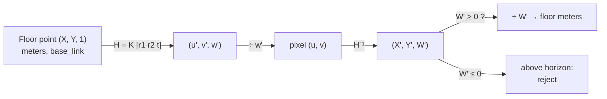

# FCV.04 — Projective geometry lite: homogeneous points, homographies

<!-- glance:start -->
<!-- generated by tools/build.py from curriculum/syllabus.yaml — edit the syllabus, not this block -->

| | |
|---|---|
| **Track** | Optional foundation |
| **Difficulty** | Intermediate |
| **Time** | 1 h |
| **Hardware** | none |
| **Software** | python, numpy |
| **Prerequisites** | [FCV.02 Image processing as array math: convolution and kernels](FCV.02-convolution-kernels.md) |
| **Optional prerequisites** | [FM.09 2D/3D transformations and homogeneous coordinates](../mathematics/FM.09-homogeneous-coordinates.md) |
| **Skip if** | You compute and apply homographies. |

<!-- glance:end -->

## What you will learn

- Represent image points and lines in homogeneous coordinates, and intersect or join them with a cross product.
- Explain vanishing points and the horizon as images of points at infinity, and compute them for karmel's camera.
- Apply a 3×3 homography, including the divide-by-w step, and recognise points that land at infinity or behind the camera.
- Estimate a homography from four or more correspondences with the DLT (SVD), and check it against OpenCV.
- Map a floor pixel to meters in the robot frame, and warp the camera image into a bird's-eye view.

## Why it matters

The camera flattens a 3D world onto a 2D sensor, and parallel floor lines meet at a vanishing point. Ordinary Cartesian
math makes that awkward. Projective geometry makes it a matrix multiplication.

On the robot, a **homography** is the tool whenever the world is (locally) a plane:
- The **floor**: turn a pixel where a detected object touches the ground into meters ahead of the robot
  ([13.16](../../13-computer-vision/13.16-detection-to-map-position.md)), or produce a bird's-eye view for line following.
- A **fiducial marker** or a calibration checkerboard: its four corners define a homography, the first step of pose estimation
  ([13.07](../../13-computer-vision/13.07-fiducial-markers.md), [13.06](../../13-computer-vision/13.06-lens-distortion-calibration.md)).
- **Image stitching** and feature matching with RANSAC ([13.04](../../13-computer-vision/13.04-features-and-matching.md)).

It also sets up the pinhole camera model ([13.05](../../13-computer-vision/13.05-pinhole-camera-model.md)) and stereo
([FCV.05](FCV.05-stereo-epipolar.md)).

<!-- prereqs:start -->
## Prerequisites

You need these first:

- [FCV.02 Image processing as array math: convolution and kernels](FCV.02-convolution-kernels.md)

### Optional prerequisite links

New to any of these? Take the foundation lesson first; skip it if you already know it.

- [FM.09 2D/3D transformations and homogeneous coordinates](../mathematics/FM.09-homogeneous-coordinates.md)

Check your readiness: `python course.py why FCV.04`
<!-- prereqs:end -->

## Concept

**The problem with ordinary coordinates.** A camera divides by depth: a point twice as far appears half as far from the image
center. Translation isn't a matrix multiplication either. Every projection formula ends up with fractions and special cases.

**The trick: add one coordinate and ignore scale.** Write the image point (u, v) as (u, v, 1), and declare that
(u, v, 1), (2u, 2v, 2) and (wu, wv, w) are *the same point*. To get back to pixels, divide by the last coordinate. Now:
- **Division becomes multiplication.** Projection, perspective and translation are all 3×3 (or 3×4) matrices.
- **Infinity becomes an ordinary value.** (x, y, 0) can't be divided, so it's a *point at infinity* in direction (x, y). Parallel
  lines really do meet there, which is why railway tracks appear to converge in a photo. The image of such a point is the
  **vanishing point**, and all vanishing points of the floor's directions lie on one line: the **horizon**.
- **Lines are vectors too.** The line $au + bv + c = 0$ is (a, b, c). A point lies on a line when their dot product is 0.
  The line through two points is their cross product, and the intersection of two lines is also their cross product.

**A homography** is any invertible 3×3 matrix acting on homogeneous points. It maps straight lines to straight lines, but not
parallel lines to parallel lines, and not lengths to lengths. It has 8 degrees of freedom (9 entries minus the irrelevant
scale), so **4 point correspondences** (2 equations each) determine it. The key fact for robots: **any plane in the world and its
image are related by exactly one homography.** The floor seen by karmel's camera is such a plane.

(New to homogeneous coordinates for 2D/3D transforms? [FM.09](../mathematics/FM.09-homogeneous-coordinates.md) covers the
affine case, where the last row is (0, 0, 1). Projective geometry lets that last row be anything.)

> [!TIP]
> **Ask your teacher:** "Explain with a railway-track photo why parallel lines meet in an image, then show me the cross-product computation of that vanishing point with actual numbers."

## Technical explanation

### Level 2 — Practical

- **Apply H to N points:** `ph = np.hstack([pts, ones]) @ H.T`, then `pts2 = ph[:, :2] / ph[:, 2:3]`. Forgetting the division
  is the #1 bug. `cv2.perspectiveTransform(pts.reshape(-1, 1, 2), H)` does both.
- **Estimate H:** `cv2.getPerspectiveTransform(src4, dst4)` for exactly 4 float32 points, `cv2.findHomography(src, dst, cv2.RANSAC, 3.0)` for
  many noisy points with outliers.
- **Warp an image:** `cv2.warpPerspective(img, H, (w, h))`, where `H` maps *source* pixels to *destination* pixels.
- **Scale is arbitrary.** Compare homographies only after normalizing (for example `H / H[2, 2]`).
- **Check w before dividing.** If $w \le 0$ after mapping an image pixel to the floor, the ray never hits the floor in front of the
  camera (the pixel is at or above the horizon). Reject it instead of reporting a floor point behind the robot.
- **Lens distortion breaks straight lines**, and homographies assume straight lines. Undistort first ([13.06](../../13-computer-vision/13.06-lens-distortion-calibration.md)).

### Level 3 — Mathematics

**Points and lines.** Point $\mathbf{p} = (x, y, 1)^{\mathsf T}$, line $\mathbf{l} = (a, b, c)^{\mathsf T}$ with $\mathbf{l}^{\mathsf T}\mathbf{p} = 0$.

$$\mathbf{l} = \mathbf{p} \times \mathbf{q}, \qquad \mathbf{x} = \mathbf{l}_1 \times \mathbf{l}_2$$

Example. Line 1 through (0, 0) and (4, 2): $(0,0,1)\times(4,2,1) = (-2, 4, 0)$, i.e. $-2x + 4y = 0$, or $y = x/2$.
Line 2 through (0, 4) and (4, 3): $(0,4,1)\times(4,3,1) = (1, 4, -16)$, i.e. $x + 4y = 16$.
Intersection: $(-2,4,0)\times(1,4,-16) = (-64, -32, -12)$, which divided by $-12$ gives $(5.333, 2.667)$.
Check: $5.333/2 = 2.667$ ✔, and $5.333 + 4\cdot 2.667 = 16$ ✔.
A line parallel to line 1, through (0, 1) and (4, 3), is $(-2, 4, -4)$. Its intersection with line 1 is $(-16, -8, 0)$: $w = 0$, the point at
infinity in direction (2, 1), the lines' common direction.

**Homography.** $\mathbf{p}' \sim H\mathbf{p}$ ("equal up to scale"):

$$\begin{bmatrix}u'\\v'\\w'\end{bmatrix} = \begin{bmatrix}h_{11}&h_{12}&h_{13}\\h_{21}&h_{22}&h_{23}\\h_{31}&h_{32}&h_{33}\end{bmatrix}\begin{bmatrix}x\\y\\1\end{bmatrix}, \qquad (u, v) = \left(\frac{u'}{w'}, \frac{v'}{w'}\right)$$

Example with $H = \begin{bmatrix}1&0&2\\0&1&1\\0.5&0&1\end{bmatrix}$: the point (2, 4) maps to $(2+2,\ 4+1,\ 1+1) = (4, 5, 2)$, i.e. **(2, 2.5)**.
The point (−2, 0) maps to $(0, 1, 0)$, a point at infinity. The bottom row $(h_{31}, h_{32})$ is what makes a homography
"perspective". With $(0, 0, 1)$ it's merely affine.

**DLT (Direct Linear Transform).** Each correspondence $(x, y) \to (u, v)$ gives two linear equations in the 9 unknowns of $\mathbf{h}$.
They come from $\mathbf{p}' \times H\mathbf{p} = 0$:

$$\begin{bmatrix} -x & -y & -1 & 0&0&0 & ux & uy & u \\ 0&0&0 & -x & -y & -1 & vx & vy & v \end{bmatrix}\mathbf{h} = \mathbf{0}$$

Stack $n \ge 4$ pairs into $A\mathbf{h} = 0$ ($2n \times 9$). The solution with $\|\mathbf{h}\| = 1$ that minimises $\|A\mathbf{h}\|$ is
the last right-singular vector of $A$ (the SVD). With noisy points, normalise coordinates first (Hartley normalisation)
or use `cv2.findHomography`, which does.

**The floor homography.** A camera with intrinsics $K$ and pose $(R, \mathbf{t})$ (world→camera) projects a world point
$(X, Y, Z)$ as $\mathbf{p} \sim K(R\,[X, Y, Z]^{\mathsf T} + \mathbf{t})$. On the floor $Z = 0$, so the third column of $R$ drops out:

$$\mathbf{p} \sim \underbrace{K\,[\,\mathbf{r}_1\ \ \mathbf{r}_2\ \ \mathbf{t}\,]}_{H_{floor}}\begin{bmatrix}X\\Y\\1\end{bmatrix}$$

For karmel: $f = 320/\tan 0.6 = 467.7$ px, principal point (320, 240), camera at (0.10, 0, 0.10) m in `base_link`, pitched 20° down.

- **Horizon row:** $v_h = c_y - f\tan(\text{pitch}) = 240 - 467.7 \times 0.364 = 69.8$. Floor pixels are all **below** row 69.8.
  The vanishing point of "straight ahead" is $H_{floor}(1, 0, 0)^{\mathsf T}$, which is (320, 69.8).
- **Pixel (320, 400) → floor:** the ray is $\arctan(160/467.7) = 18.9°$ below the optical axis, so $38.9°$ below horizontal. It hits
  the floor $0.10/\tan 38.9° = 0.124$ m in front of the camera, which is **0.224 m** in front of `base_link`. The code gets the same
  number by applying $H_{floor}^{-1}$.
- **Resolution falls with distance.** Near 2 m, one pixel row spans several centimeters of floor (see the blurry far rows of the bird's-eye image).

## Diagram

```text
Side view (robot frame: x forward, z up)                Image (640 x 480)
                                                          v=0  ┌───────────────────────┐
      camera (0.10, 0, 0.10) m                           69.8 ─┼─ ─ ─ horizon ─ ─ ─ ─ ─┼─ vanishing point (320, 69.8)
         ●─────────────► optical axis, 20° down               │        / \            │
          \  ╲ 38.9°                                          │       /   \  floor    │
           \   ╲                                              │      /     \ lines    │
            \    ╲                                        400 ┼─────/───●───\─────────┼─ pixel (320, 400)
  ───────────\─────●────────────── floor (z = 0)              │    /  0.224 m \       │
   base_link  0.10  0.224 m                               480  └───────────────────────┘
```



## Code

Save as `fcv04_homography.py` (numpy + opencv-python-headless). It computes the line examples, builds karmel's floor homography,
maps pixels to meters, renders a synthetic checkerboard floor as the camera sees it, estimates the homography from four tile corners
with its own DLT, and warps the view back to a bird's-eye image.

```python
"""fcv04_homography.py — homogeneous points and lines, a DLT homography, and a bird's-eye view of karmel's floor.

Run: python fcv04_homography.py      (numpy + opencv-python-headless; writes camera_view.png, birdseye.png)
"""
import math

import cv2
import numpy as np

# karmel's camera (labs/config/karmel.yaml): 640x480, HFOV 1.20 rad, mounted 0.10 m forward and 0.10 m up
W, H_IMG = 640, 480
FX = (W / 2) / math.tan(1.20 / 2)
K = np.array([[FX, 0, W / 2], [0, FX, H_IMG / 2], [0, 0, 1]])
CAM_POS = np.array([0.10, 0.0, 0.10])          # in base_link: x forward, y left, z up
PITCH = math.radians(20)                        # tilted down


def to_h(p: np.ndarray) -> np.ndarray:
    """(N, 2) Euclidean -> (N, 3) homogeneous with w = 1."""
    return np.hstack([p, np.ones((len(p), 1))])


def from_h(p: np.ndarray) -> np.ndarray:
    """(N, 3) homogeneous -> (N, 2) Euclidean: divide by w."""
    return p[:, :2] / p[:, 2:3]


def floor_to_image_homography() -> np.ndarray:
    """H maps floor points (X, Y, 1) in base_link meters to pixels (u, v, 1), up to scale: H = K [r1 r2 t]."""
    c, s = math.cos(PITCH), math.sin(PITCH)
    right = np.array([0.0, -1.0, 0.0])           # camera x axis expressed in base_link
    down = np.array([-s, 0.0, -c])               # camera y axis
    fwd = np.array([c, 0.0, -s])                 # camera z axis (optical axis)
    R = np.vstack([right, down, fwd])            # base_link -> camera rotation
    t = -R @ CAM_POS
    return K @ np.column_stack([R[:, 0], R[:, 1], t])   # the floor has Z = 0, so column r3 drops out


def dlt_homography(src: np.ndarray, dst: np.ndarray) -> np.ndarray:
    """Direct Linear Transform from >= 4 point pairs. Returns H with H[2, 2] = 1."""
    rows = []
    for (x, y), (u, v) in zip(src, dst):
        rows.append([-x, -y, -1, 0, 0, 0, u * x, u * y, u])
        rows.append([0, 0, 0, -x, -y, -1, v * x, v * y, v])
    _, _, vt = np.linalg.svd(np.array(rows))
    h = vt[-1].reshape(3, 3)                     # the right singular vector of the smallest singular value
    return h / h[2, 2]


if __name__ == "__main__":
    # 1) Lines and intersections with cross products
    p, q = np.array([0, 0, 1.0]), np.array([4, 2, 1.0])
    r, s = np.array([0, 4, 1.0]), np.array([4, 3, 1.0])
    l1, l2 = np.cross(p, q), np.cross(r, s)
    x = np.cross(l1, l2)
    print("l1 =", l1, " l2 =", l2, " intersection =", x, "->", x[:2] / x[2])
    l3 = np.cross(np.array([0, 1, 1.0]), np.array([4, 3, 1.0]))        # parallel to l1
    print("parallel lines meet at", np.cross(l1, l3), "(w = 0: a point at infinity)")

    # 2) Floor -> image homography for karmel's camera
    Hf = floor_to_image_homography()
    floor_pts = np.array([[0.3, 0.0], [0.5, 0.2], [1.0, -0.3], [2.0, 0.0]])
    print("floor (m) -> pixels:\n", np.round(from_h(to_h(floor_pts) @ Hf.T), 1))
    horizon_v = H_IMG / 2 - FX * math.tan(PITCH)
    vp = Hf @ np.array([1.0, 0.0, 0.0])                                # direction "forward", w = 0
    print(f"vanishing point of forward lines: {np.round(vp[:2] / vp[2], 1)}, horizon row {horizon_v:.1f}")

    Hinv = np.linalg.inv(Hf)
    for px in ([320, 400], [100, 300], [320, 60]):
        g = Hinv @ np.array([*px, 1.0])
        print(f"pixel {px} -> floor {np.round(g[:2] / g[2], 3)} m, w = {g[2]:+.4f}")

    # 3) Render a camera view of a checkerboard floor, then undo it into a bird's-eye view
    MM = 0.0025                                                        # bird's-eye: 2.5 mm per pixel, 400 x 400
    S_bird = np.array([[0, -MM, 1.2], [-MM, 0, 0.5], [0, 0, 1]])       # (col, row, 1) -> (X, Y, 1)
    rows, cols = np.mgrid[0:400, 0:400]
    X, Y = 1.2 - rows * MM, 0.5 - cols * MM
    tiles = ((np.floor(X / 0.1) + np.floor(Y / 0.1)) % 2).astype(np.uint8) * 180 + 40
    camera_view = cv2.warpPerspective(tiles, Hf @ S_bird, (W, H_IMG))
    cv2.imwrite("camera_view.png", camera_view)

    # Estimate the homography from 4 tile corners seen in the image, as you would with a real calibration mat
    corners_floor = np.array([[0.3, 0.2], [0.3, -0.2], [0.9, -0.2], [0.9, 0.2]])
    corners_px = from_h(to_h(corners_floor) @ Hf.T)
    H_dlt = dlt_homography(corners_floor, corners_px)
    H_cv = cv2.getPerspectiveTransform(corners_floor.astype(np.float32), corners_px.astype(np.float32))
    print("DLT vs true H (both scaled to H[2,2]=1), max abs diff:", f"{np.abs(H_dlt - Hf / Hf[2, 2]).max():.2e}")
    print("DLT vs cv2.getPerspectiveTransform, max abs diff:     ", f"{np.abs(H_dlt - H_cv).max():.2e}")

    birdseye = cv2.warpPerspective(camera_view, np.linalg.inv(H_dlt @ S_bird), (400, 400))
    valid = birdseye > 0
    print(f"bird's-eye reconstruction: {valid.mean():.0%} of pixels visible, "
          f"mean abs error on visible pixels {np.abs(birdseye.astype(int) - tiles)[valid].mean():.1f} gray levels")
    cv2.imwrite("birdseye.png", birdseye)
```

Output:

```text
l1 = [-2.  4.  0.]  l2 = [  1.   4. -16.]  intersection = [-64. -32. -12.] -> [5.33333333 2.66666667]
parallel lines meet at [-16.  -8.   0.] (w = 0: a point at infinity)
floor (m) -> pixels:
 [[320.  293.8]
 [ 91.9 191.1]
 [479.5 126.3]
 [320.   97.1]]
vanishing point of forward lines: [320.   69.8], horizon row 69.8
pixel [320, 400] -> floor [0.224 0.   ] m, w = +6.6346
pixel [100, 300] -> floor [0.294 0.102] m, w = +4.6256
pixel [320, 60] -> floor [-5.366 -0.   ] m, w = -0.1960
DLT vs true H (both scaled to H[2,2]=1), max abs diff: 6.55e-09
DLT vs cv2.getPerspectiveTransform, max abs diff:      3.78e-03
bird's-eye reconstruction: 74% of pixels visible, mean abs error on visible pixels 9.0 gray levels
```

Notes:
- A floor point 0.2 m to the **left** (+y) appears at u = 91.9, on the **left** of the image. Getting that sign right is the whole point of writing `R` carefully.
- Pixel (320, 60) is above the horizon. Blind division would claim a floor point 5.4 m **behind** the robot. `w < 0` is the tell.
- The 3.8e-3 difference to OpenCV comes from the float32 inputs `getPerspectiveTransform` requires. The entries of H are in the hundreds,
  so it's a relative difference of ~1e-5.
- The bird's-eye image loses the triangles outside the camera's field of view (26% invisible), and far rows are blurry: each image row
  there covers many bird's-eye rows.

## Exercise

No hardware is needed. Put `fcv04_homography.py` in the same folder for E4.

### Exercise FCV.04-E1 — Lines by cross products `[numerical]`

By hand: (a) the line through (1, 1) and (3, 5), (b) the line through (0, 6) and (6, 0), (c) their intersection, and (d) the
intersection of line (a) with the line through (0, 0) and (1, 2). Interpret (d).

### Exercise FCV.04-E2 — Apply a homography `[numerical]`

With $H = \begin{bmatrix}1&0&2\\0&1&1\\0.5&0&1\end{bmatrix}$, map (0, 0), (2, 4) and (−2, 0) by hand. Which result isn't a finite
point, and what does that mean geometrically? Verify with `cv2.perspectiveTransform`.

### Exercise FCV.04-E3 — How far ahead is that pixel? `[numerical]`

For karmel's camera (f = 467.7 px, principal point (320, 240), height 0.10 m, 0.10 m ahead of `base_link`):
1. The horizon row and the floor distance of pixel (320, 400) at 20° pitch (check against the Code output).
2. The same two numbers at 30° pitch. What changes about which pixels see the floor?
3. The distance of the bottom-center pixel (320, 479) at 20° pitch, which is the closest floor point visible.

### Exercise FCV.04-E4 — How many correspondences? `[coding]`

Write `e4.py`: for each of three point sets on the floor, (a) 4 corners of a 0.2 × 0.4 m square near the robot
(`[[0.3, 0.2], [0.3, -0.2], [0.5, -0.2], [0.5, 0.2]]`), (b) 4 corners spread to 1.2 m (`[[0.3, 0.3], [0.3, -0.3], [1.2, -0.3], [1.2, 0.3]]`),
and (c) a 4 × 3 grid with x in {0.3, 0.6, 0.9, 1.2} and y in {−0.3, 0, 0.3}, run 200 trials with `np.random.default_rng(0)`. In each,
project the points with the true floor homography, add 1 px Gaussian noise, estimate H with `dlt_homography`, and map the true pixels
of floor points (0.5, 0), (1.0, 0) and (2.0, 0) back to the floor. Print the median error in mm at each distance.

### Exercise FCV.04-E5 — The detection behind the robot `[predict]`

A person detector returns a bounding box whose bottom edge (the feet) is at row 50 in karmel's image, at 20° pitch. Your node applies
`H⁻¹` and divides by w without checks. **Predict** what position it publishes. Then state the check you add and what the node should
publish instead.

## Expected result

**FCV.04-E1**: (a) $(1,1,1)\times(3,5,1) = (-4, 2, 2)$, i.e. $-4x + 2y + 2 = 0$, or $y = 2x - 1$. (b) $(0,6,1)\times(6,0,1) = (6, 6, -36)$,
i.e. $x + y = 6$. (c) $(-4,2,2)\times(6,6,-36) = (-84, -132, -36)$, which gives **(2.333, 3.667)**. Check: $2\cdot 2.333 - 1 = 3.667$ ✔.
(d) The line through (0, 0) and (1, 2) is $(-2, 1, 0)$ ($y = 2x$), and $(-4,2,2)\times(-2,1,0) = (-2, -4, 0)$: $w = 0$. The lines are
**parallel** (both have slope 2), and they meet at the point at infinity in direction (1, 2).

**FCV.04-E2**: (0, 0) → (2, 1, 1) = **(2, 1)**. (2, 4) → (4, 5, 2) = **(2, 2.5)**. (−2, 0) → **(0, 1, 0)**, a point at infinity:
the source point lies on the line $0.5x + 1 = 0$, which this homography sends to the "line at infinity". Any finite image of it
would need division by zero. `cv2.perspectiveTransform` **silently returns (0, 0)** for it (OpenCV 5.0), which looks like a valid
point. Check the denominator yourself.

**FCV.04-E3**:
1. Horizon **69.8**, distance **0.224 m**.
2. Horizon $240 - 467.7\tan 30° = $ **−30.1**, above the top of the image, so every pixel sees the floor (no sky). Pixel (320, 400)
   is at **0.187 m**.
3. $\arctan(239/467.7) = 27.1°$, plus 20° is 47.1°. $0.10/\tan 47.1° = 0.093$ m, so **0.193 m** from `base_link`. The robot is blind to the
   floor closer than about 19 cm, so a small obstacle right in front of the bumper is invisible to this camera.

**FCV.04-E4** (median errors, seed 0):

```text
4 near corners    floor error (median over 200 trials) at 0.5 m:   2.5 mm, 1.0 m:   15.8 mm, 2.0 m:   80.1 mm
4 spread corners  floor error (median over 200 trials) at 0.5 m:   4.0 mm, 1.0 m:    8.6 mm, 2.0 m:   38.6 mm
12 spread points  floor error (median over 200 trials) at 0.5 m:   1.0 mm, 1.0 m:    4.9 mm, 2.0 m:   26.7 mm
```

Lessons: extrapolating beyond the calibration points amplifies error (a square calibrated near the robot is 5× worse at 2 m than at
0.5 m). Spreading the points helps far away, and more points help everywhere. Error grows fast with distance because a pixel covers more
floor. Calibrate with a large mat, many points and `cv2.findHomography`.

**FCV.04-E5**: row 50 is above the horizon (69.8), so $w < 0$, and the naive node publishes a position several meters **behind** the robot
(row 60 gives −5.4 m). Add `if w <= 0: reject`. Better, reject rows within a margin of the horizon, where distance explodes. The node
should publish nothing for that detection, or a bearing-only measurement (the direction is still valid, the distance isn't). Feet above the
horizon also mean the "on the floor plane" assumption is wrong: the person is on stairs, or the pitch estimate is off.

## Troubleshooting

### Symptom: warped image is empty or a thin sliver
1. Direction of `H`: `warpPerspective(src, H, size)` needs H mapping **source → destination**. Try `np.linalg.inv(H)`.
2. Units: a floor homography in meters warps a 400 px image into a region of 0.4 "pixels". Include the scale matrix (`S_bird`).
3. Output size: points may map outside `(w, h)`. Transform the four source corners first to see where they land.

### Symptom: floor distances are wildly wrong
1. Check the **division by w** in your own code.
2. Check the axis conventions: image v grows **down**, the robot's y is **left**. Test with a point to the left and a point far ahead, as in the Code.
3. Check the pitch sign and value. 2° of pitch error moves the horizon by $467.7\tan 2° \approx 16$ px and changes far distances a lot.
4. Was the image undistorted? Wide-angle distortion bends the floor lines the homography assumes are straight.

### Symptom: `findHomography` returns `None` or a nonsense matrix
1. Fewer than 4 points, or 3 or more of them collinear: the problem is degenerate.
2. Mismatched correspondences (the order of corners differs): use RANSAC and inspect the inlier mask.
3. Points given as int or float64 where float32 is expected: convert with `.astype(np.float32)`.

## Common mistakes

- **Treating homogeneous (x, y, w) as if w were always 1** after a multiplication.
- **Comparing homographies entry by entry without normalising scale.**
- **Using a floor homography for points that aren't on the floor.** The top of a box, a person's head or a table edge will be placed
  much too far away. Use the object's ground contact point (its bottom edge).
- **Extrapolating far beyond the calibration points.** Error grows quickly with distance (E4).
- **Forgetting that a homography assumes a perfect pinhole.** Undistort first.
- **Swapping (row, col) and (x, y)** when building correspondences from numpy indices.

## Knowledge check

1. How do you get the intersection of two image lines in homogeneous coordinates, and how do you recognise parallel lines?
   <details><summary>Answer</summary>

   Cross product of the two line vectors. If the result has $w = 0$, the lines are parallel and meet at a point at infinity in direction $(x, y)$.
   </details>

2. Why does a homography have 8 degrees of freedom, and how many point correspondences determine it?
   <details><summary>Answer</summary>

   9 entries, but multiplying H by any nonzero scalar gives the same mapping, so 8 remain. Each correspondence gives 2 equations, so 4 points,
   no 3 of them collinear, determine it.
   </details>

3. Where is the horizon row for a camera with f = 500 px, principal point row 240, pitched 10° down?
   <details><summary>Answer</summary>

   $240 - 500\tan 10° = 240 - 88.2 = 151.8$. Floor pixels are below it.
   </details>

4. Apply $H = \begin{bmatrix}2&0&0\\0&2&0\\0&0.01&1\end{bmatrix}$ to (100, 100).
   <details><summary>Answer</summary>

   $(200, 200, 0.01\cdot 100 + 1) = (200, 200, 2)$, which gives **(100, 100)**. The perspective row scales the result back down: this point is a fixed point.
   </details>

5. A floor homography places a detected mug 3 m away, but it's on a table 1 m away. Why?
   <details><summary>Answer</summary>

   The homography assumes the pixel lies on the floor plane. The mug's bottom edge is on the table, above the floor, and a ray through that
   pixel hits the floor much farther away. Use depth ([07.09](../../07-sensors/07.09-depth-cameras-and-point-clouds.md)) or the table plane's own homography.
   </details>

6. Why is the error of a pixel-to-floor mapping much larger at 2 m than at 0.5 m for the same 1 px error?
   <details><summary>Answer</summary>

   The floor distance changes nonlinearly with the ray angle. Near the horizon, a one-pixel change in row corresponds to a large change
   in distance ($\partial d/\partial v$ grows roughly with $d^2$). The same effect limits stereo depth ([FCV.05](FCV.05-stereo-epipolar.md)).
   </details>

## Practical challenge

**Floor calibration from a printed mat, and a bird's-eye line follower view.**
1. Simulate a calibration mat: a 0.6 × 0.8 m checkerboard of 0.1 m squares starting 0.25 m ahead of the robot. Render it with
   `floor_to_image_homography()` at an **unknown** pitch drawn uniformly from 15°–25°. Add 0.5 px corner noise.
2. Detect the inner corners with `cv2.findChessboardCornersSB` on your rendered image (or use the known projected corners plus
   noise if detection fails at low resolution), estimate H with `cv2.findHomography`, and recover the pitch from the horizon row.
3. Produce a 1 cm/px bird's-eye image of the area 0.2–1.5 m ahead and ±0.5 m wide. Draw a tape line on the floor texture and
   measure its lateral offset in the bird's-eye image.

Acceptance criteria: recovered pitch within 0.5°. Floor-point error ≤ 10 mm at 1 m. The tape offset measured in the bird's-eye view
within 1 cm of the truth. The code rejects pixels above the horizon.

## You can skip this if…

You answer questions 1, 3 and 5 without looking, and you can write the DLT equations for one correspondence from memory. Then:
`python course.py skip FCV.04 --reason "compute and apply homographies"`

## Go deeper

- https://docs.opencv.org/4.x/d9/dab/tutorial_homography.html — OpenCV's "Basic concepts of the homography explained with code": planar pose, perspective correction and panoramas.
- https://www.robots.ox.ac.uk/~vgg/hzbook/ — Hartley & Zisserman, *Multiple View Geometry* (paid). Chapters 2 and 4 are the definitive treatment of the projective plane and DLT with normalisation.
- https://szeliski.org/Book/ — Szeliski 2nd ed., sections 2.1 (geometric primitives and transformations) and 8.1 (planar alignment).
- https://fpcv.cs.columbia.edu/ — Nayar's lectures on image formation and homography with clear geometric animations.

## Progress checkpoint

- [ ] I can join points and intersect lines with cross products and recognise points at infinity.
- [ ] I can apply a homography correctly, including division by w and checking its sign.
- [ ] I can estimate a homography with the DLT and know why more, spread-out points help.
- [ ] I can map floor pixels to meters for the robot's camera and produce a bird's-eye view.

`python course.py complete FCV.04` (exercises done) · `python course.py master FCV.04` (challenge done) ·
`python course.py struggle FCV.04 "what was hard"`

Next: [FCV.05 — Stereo vision and epipolar geometry intuition](FCV.05-stereo-epipolar.md).
