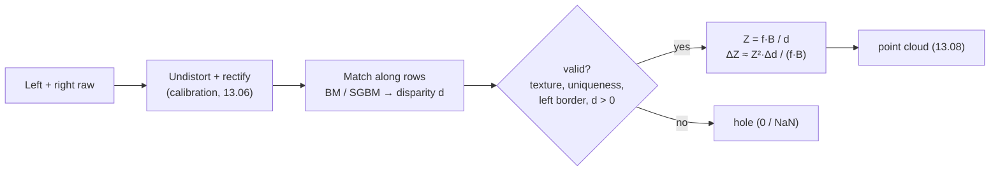

# FCV.05 — Stereo vision and epipolar geometry intuition

<!-- glance:start -->
<!-- generated by tools/build.py from curriculum/syllabus.yaml — edit the syllabus, not this block -->

| | |
|---|---|
| **Track** | Optional foundation |
| **Difficulty** | Intermediate |
| **Time** | 50 min |
| **Hardware** | none |
| **Software** | python |
| **Prerequisites** | [FCV.04 Projective geometry lite: homogeneous points, homographies](FCV.04-projective-geometry.md) |
| **Skip if** | You relate disparity, baseline and depth error. |

<!-- glance:end -->

## What you will learn

- Compute depth from disparity with $Z = fB/d$, and predict how depth error grows with distance.
- Choose a baseline, resolution and disparity range for a required working distance and accuracy.
- Explain the epipolar constraint and why rectification turns stereo matching into a 1D search along image rows.
- Implement block matching in numpy, compare it with OpenCV's `StereoBM`, and recognise its failure modes (textureless regions, occlusions, borders).
- Verify $\mathbf{x}_2^{\mathsf T} F \mathbf{x}_1 = 0$ numerically for a non-rectified camera pair.

## Why it matters

A single camera loses depth: a small box nearby and a big box far away can produce the same image. Robots recover depth with a
second viewpoint, which is how the stereo depth cameras in [07.09](../../07-sensors/07.09-depth-cameras-and-point-clouds.md) work
and what the depth pipeline in [13.08](../../13-computer-vision/13.08-depth-and-3d-vision.md) consumes. Understanding the geometry
answers practical questions before you buy or mount anything:

- Why does the depth image turn into noise beyond 3–4 m?
- Why does a white wall have holes in the depth map, and why does an IR projector fix it?
- Why can't the camera see an object 15 cm in front of it?
- How far apart must two cameras be to measure a doorway 3 m away to ±1 cm?

The same epipolar geometry underlies visual odometry and visual SLAM ([11.08](../../11-slam/11.08-visual-slam.md)), where the "second
camera" is the same camera a moment later.

<!-- prereqs:start -->
## Prerequisites

You need these first:

- [FCV.04 Projective geometry lite: homogeneous points, homographies](FCV.04-projective-geometry.md)

### Optional prerequisite links

None.

Check your readiness: `python course.py why FCV.05`
<!-- prereqs:end -->

## Concept

Hold a finger in front of your face and close each eye in turn. The finger jumps sideways a lot, and the far wall barely moves. That
sideways jump is **disparity**. Near objects have large disparity, far ones small, and infinitely far ones zero. Measure the jump and you
know the distance.

A stereo camera is two identical cameras side by side, a **baseline** $B$ apart. For each pixel in the left image you look for the
same scene point in the right image. If the cameras are perfectly aligned (**rectified**: same orientation, image rows at the same
height), the match lies **on the same row**, shifted left by the disparity $d$. Finding it is a 1D search along one row: slide a
small patch, and keep the position where it matches best.

Three things make it hard:
1. **No texture, no match.** A blank white wall looks identical at every shift, so the best match is arbitrary. Active depth cameras
   project an infrared dot pattern to paint texture onto such surfaces.
2. **Occlusion.** Some background pixels are visible to one camera but hidden behind a foreground object for the other. They have no
   correct match at all.
3. **Small disparities far away.** At 5 m the shift may be a few pixels. Being off by a fraction of a pixel changes the depth a lot.

**Epipolar geometry** is the general version for cameras that aren't aligned. A pixel in the left image corresponds to a *ray* in 3D.
That ray, seen from the right camera, is a *line* in the right image: the **epipolar line**. The match must lie on it. A 3×3 matrix,
the **fundamental matrix** $F$, encodes this for every pixel at once. **Rectification** warps both images with homographies
([FCV.04](FCV.04-projective-geometry.md)) so that all epipolar lines become horizontal rows, which is the easy case above.

> [!TIP]
> **Ask your teacher:** "Using the depth-error formula, explain why doubling the baseline helps far objects but hurts the minimum distance, and help me pick a stereo camera for detecting chair legs 0.3–3 m away."

## Technical explanation

### Level 2 — Practical

- **Calibrate and rectify first.** Stereo matchers (`cv2.StereoBM`, `cv2.StereoSGBM`, and the ones inside depth cameras) assume
  rectified images. A vertical misalignment of even 1 px degrades matching visibly. Calibration is covered in [13.06](../../13-computer-vision/13.06-lens-distortion-calibration.md).
- **Disparity range** (`numDisparities`) sets the **minimum depth**: $Z_{min} = fB/d_{max}$. Objects closer than that produce
  garbage or holes.
- **Block size** trades detail for robustness. Small blocks give sharp edges but noise. Large blocks give smooth but blurred boundaries ("fattening").
- **Left border band.** The leftmost `numDisparities` columns of the left image have no possible match in the right image, so OpenCV marks
  them invalid.
- **Sub-pixel interpolation** matters far away. Integer disparities quantize depth into coarse steps.
- **StereoSGBM** (semi-global matching) adds smoothness constraints along several directions. It's usually much better than
  plain block matching, and slower. Depth cameras run a similar algorithm in hardware.
- **Invalid is a value.** Depth maps contain 0/NaN holes. Never average them in as zeros.

### Level 3 — Mathematics

**Depth from disparity.** For rectified cameras with focal length $f$ (pixels) and baseline $B$ (meters), similar triangles give

$$Z = \frac{f\,B}{d}$$

With $f = 467.7$ px (karmel's camera optics at 640 px) and $B = 0.05$ m, $fB = 23.39$ px·m:
- at $Z = 1$ m, $d = 23.4$ px; at 3 m, $d = 7.8$ px; at 5 m, $d = 4.7$ px.

**Depth error.** Differentiate: $\left|\frac{\partial Z}{\partial d}\right| = \frac{fB}{d^2} = \frac{Z^2}{fB}$, so

$$\Delta Z \approx \frac{Z^2}{f\,B}\,\Delta d$$

Error grows with the **square** of distance. With sub-pixel matching accuracy $\Delta d = 0.1$ px:
1 m gives **4.3 mm**, 3 m **38 mm**, 5 m **107 mm**. With integer disparities ($\Delta d \approx 1$ px), multiply by 10: **0.39 m** at 3 m.

**Minimum depth.** With `numDisparities = 64`: $Z_{min} = 23.39/64 = 0.37$ m. A chair leg at 0.3 m is invisible.

**Design example.** Required: ±1 cm at 3 m with $\Delta d = 0.1$ px, same camera. $B = \frac{Z^2\,\Delta d}{f\,\Delta Z} = \frac{9 \times 0.1}{467.7 \times 0.01} = 0.19$ m.
The camera pair must be about 19 cm apart, and then $Z_{min}$ at 64 disparities rises to $467.7 \times 0.19/64 = 1.4$ m. Every stereo design is
this trade-off.

**Epipolar constraint.** With camera 2 related to camera 1 by rotation $R$ and translation $\mathbf{t}$ ($\mathbf{X}_2 = R\mathbf{X}_1 + \mathbf{t}$),
the **essential matrix** $E = [\mathbf{t}]_\times R$ satisfies, for normalized image coordinates $\hat{\mathbf{x}} = K^{-1}\mathbf{x}$,

$$\hat{\mathbf{x}}_2^{\mathsf T} E\, \hat{\mathbf{x}}_1 = 0, \qquad \text{and in pixels}\quad \mathbf{x}_2^{\mathsf T} F\, \mathbf{x}_1 = 0,\quad F = K_2^{-\mathsf T} E K_1^{-1}$$

$\mathbf{l}_2 = F\mathbf{x}_1$ is the epipolar line in image 2. The constraint says $\mathbf{x}_2$ lies on it (a line-point dot product of 0, as in FCV.04).
$F$ has 7 degrees of freedom and can be estimated from 8 (or 7) matches without knowing $R$, $\mathbf{t}$ or $K$.

**Rectified special case.** Pure translation along x: $R = I$, $\mathbf{t} = (-B, 0, 0)$, so
$E = [\mathbf{t}]_\times = \begin{bmatrix}0&0&0\\0&0&B\\0&-B&0\end{bmatrix}$.
For $\hat{\mathbf{x}}_1 = (x_1, y_1, 1)$: $E\hat{\mathbf{x}}_1 = (0,\ B,\ -B y_1)$, and the constraint becomes $B\,y_2 - B\,y_1 = 0$, so **$y_2 = y_1$**.
Matches lie on the same row, which is exactly why rectified stereo is a 1D search.

## Diagram

```text
Rectified stereo, top view                          Epipolar geometry (general case)

        P (X, Z)                                                    P
         ●                                                         ╱●╲
        ╱ ╲                                                       ╱   ╲
       ╱   ╲        Z = f·B / d                                  ╱     ╲
      ╱     ╲                                          image 1  ╱       ╲  image 2
 ────x_l─────x_r───  image plane (f)                  ┌──────x1─┐     ┌─x2──────┐
    ╱         ╲                                       │   ╲     │     │    ╱ ─ ─│─ epipolar line l2 = F x1
   ●───────────●     d = x_l − x_r                    └────╲────┘     └───╱─────┘
  C_left   B   C_right                                      C1 ─────────── C2
                                                              baseline; the plane (C1, C2, P)
                                                              cuts both images in epipolar lines
```



## Code

Save as `fcv05_stereo.py` (numpy + opencv-python-headless). To keep block matching fast, it renders a half-resolution 320×240
rectified pair ($f = 233.9$ px, $B = 5$ cm): a random-texture wall at 3 m with a blank poster on it, and a textured box at 1 m. It
matches with its own SAD block matcher (with a uniqueness test) and with `cv2.StereoBM`, converts to depth, and then checks the
epipolar constraint for a non-rectified pair.

```python
"""fcv05_stereo.py — a synthetic rectified stereo pair, block matching from scratch vs OpenCV, depth from disparity,
and a check of the epipolar constraint for a non-rectified pair.

Run: python fcv05_stereo.py      (numpy + opencv-python-headless; writes disparity.png)
"""
import math

import cv2
import numpy as np

W, H = 320, 240
F_PX = 233.9          # half-resolution version of karmel's 640 px / 1.20 rad camera (467.7 / 2)
BASELINE_M = 0.05     # 5 cm, similar to compact depth cameras
Z_BG, Z_BOX = 3.0, 1.0


def texture(rng: np.random.Generator, sigma: float) -> np.ndarray:
    noise = rng.uniform(0, 255, (H, W)).astype(np.float32)
    return cv2.GaussianBlur(noise, (0, 0), sigma)


def render_pair(rng: np.random.Generator) -> tuple[np.ndarray, np.ndarray, np.ndarray]:
    """Left and right uint8 images of a textured wall at 3 m with a textured box at 1 m and a blank poster on the wall."""
    bg, fg = texture(rng, 1.2), texture(rng, 1.2)
    bg = cv2.normalize(bg, None, 0, 255, cv2.NORM_MINMAX)
    fg = cv2.normalize(fg, None, 0, 255, cv2.NORM_MINMAX)
    bg[30:90, 200:290] = 200.0                             # blank poster: no texture at all
    box = np.zeros((H, W), np.float32); box[80:180, 90:170] = 1.0

    d_bg, d_box = F_PX * BASELINE_M / Z_BG, F_PX * BASELINE_M / Z_BOX
    xs, ys = np.meshgrid(np.arange(W, dtype=np.float32), np.arange(H, dtype=np.float32))

    def sample(img: np.ndarray, dx: float) -> np.ndarray:  # right image sees the left-image content at x + d
        return cv2.remap(img, xs + dx, ys, cv2.INTER_LINEAR, borderMode=cv2.BORDER_REFLECT)

    left = np.where(box > 0.5, fg, bg)
    box_r = sample(box, d_box)
    right = np.where(box_r > 0.5, sample(fg, d_box), sample(bg, d_bg))
    truth = np.where(box > 0.5, d_box, d_bg)
    return left.astype(np.uint8), right.astype(np.uint8), truth


def block_match(left: np.ndarray, right: np.ndarray, max_d: int = 32, block: int = 9,
                uniqueness: float = 0.15) -> np.ndarray:
    """SAD over block x block windows for every integer disparity; winner takes all; -1 where the winner is not unique."""
    L, R = left.astype(np.float32), right.astype(np.float32)
    costs = np.empty((max_d, H, W), np.float32)
    for d in range(max_d):                                  # one vectorized pass per candidate disparity
        shifted = np.full_like(R, 255.0)
        shifted[:, d:] = R[:, :W - d]                       # right image moved d px to the right
        costs[d] = cv2.blur(np.abs(L - shifted), (block, block))
    best = np.argmin(costs, axis=0)
    best_cost = np.take_along_axis(costs, best[None], axis=0)[0]
    far = np.abs(np.arange(max_d)[:, None, None] - best[None]) > 1          # ignore the winner's neighbours
    second = np.where(far, costs, np.inf).min(axis=0)
    disparity = best.astype(np.float32)
    disparity[second < best_cost * (1 + uniqueness) + 1.0] = -1.0           # ambiguous: flat or repetitive cost
    return disparity


def fundamental_from_pose(K: np.ndarray, R: np.ndarray, t: np.ndarray) -> np.ndarray:
    tx = np.array([[0, -t[2], t[1]], [t[2], 0, -t[0]], [-t[1], t[0], 0]])
    E = tx @ R                                              # essential matrix
    Kinv = np.linalg.inv(K)
    return Kinv.T @ E @ Kinv


if __name__ == "__main__":
    rng = np.random.default_rng(4)
    left, right, truth = render_pair(rng)
    print(f"true disparity: wall {F_PX * BASELINE_M / Z_BG:.2f} px, box {F_PX * BASELINE_M / Z_BOX:.2f} px")

    d_ours = block_match(left, right)
    sbm = cv2.StereoBM_create(numDisparities=32, blockSize=9)
    d_cv = sbm.compute(left, right).astype(np.float32) / 16.0            # OpenCV returns fixed-point x16

    regions = {"box (1 m)": (slice(95, 165), slice(105, 155)), "wall (3 m)": (slice(190, 230), slice(20, 80)),
               "blank poster": (slice(40, 80), slice(215, 275))}
    for name, (ry, rx) in regions.items():
        for label, d in (("ours", d_ours), ("StereoBM", d_cv)):
            patch = d[ry, rx]
            valid = patch > 0.5
            z = F_PX * BASELINE_M / patch[valid] if valid.any() else np.array([np.nan])
            print(f"{name:13s} {label:8s} median disparity {np.median(patch[valid]) if valid.any() else float('nan'):5.2f} px, "
                  f"median depth {np.median(z):5.2f} m, valid {valid.mean():4.0%}, disparity spread (IQR) "
                  f"{np.subtract(*np.percentile(patch[valid], [75, 25])) if valid.any() else float('nan'):5.2f} px")

    vis = cv2.normalize(np.clip(d_cv, 0, None), None, 0, 255, cv2.NORM_MINMAX).astype(np.uint8)
    cv2.imwrite("disparity.png", np.hstack([left, right, vis]))

    # Epipolar geometry for a NON-rectified pair: second camera 5 cm to the right and yawed 5 degrees inward
    K = np.array([[F_PX, 0, W / 2], [0, F_PX, H / 2], [0, 0, 1]])
    yaw = math.radians(-5)
    R = np.array([[math.cos(yaw), 0, math.sin(yaw)], [0, 1, 0], [-math.sin(yaw), 0, math.cos(yaw)]])
    t = -R @ np.array([BASELINE_M, 0, 0])                   # camera-2 center at x = +5 cm in camera-1 coordinates
    P = np.column_stack([rng.uniform(-1, 1, 20), rng.uniform(-0.6, 0.6, 20), rng.uniform(1, 4, 20)])
    x1 = P @ K.T; x1 /= x1[:, 2:]
    x2 = (P @ R.T + t) @ K.T; x2 /= x2[:, 2:]
    Fm = fundamental_from_pose(K, R, t)
    residual = np.abs(np.sum(x2 * (x1 @ Fm.T), axis=1))
    lines = x1 @ Fm.T                                        # epipolar lines in image 2
    dist = np.abs(np.sum(x2 * lines, axis=1)) / np.hypot(lines[:, 0], lines[:, 1])
    print(f"x2^T F x1 max {residual.max():.1e}; point-to-epipolar-line distance max {dist.max():.1e} px")
    print(f"row difference between matches (not rectified): up to {np.abs(x1[:, 1] - x2[:, 1]).max():.1f} px")
    F_est, _ = cv2.findFundamentalMat(x1[:, :2], x2[:, :2] + rng.normal(0, 0.3, (20, 2)), cv2.FM_8POINT)
    lines_e = x1 @ F_est.T
    dist_e = np.abs(np.sum(x2 * lines_e, axis=1)) / np.hypot(lines_e[:, 0], lines_e[:, 1])
    print(f"F estimated from 20 noisy matches (0.3 px): median distance to epipolar line {np.median(dist_e):.2f} px")
```

Output (seed 4, opencv-python-headless 5.0):

```text
true disparity: wall 3.90 px, box 11.70 px
box (1 m)     ours     median disparity 12.00 px, median depth  0.97 m, valid 100%, disparity spread (IQR)  0.00 px
box (1 m)     StereoBM median disparity 11.75 px, median depth  1.00 m, valid 100%, disparity spread (IQR)  0.12 px
wall (3 m)    ours     median disparity  4.00 px, median depth  2.92 m, valid 100%, disparity spread (IQR)  0.00 px
wall (3 m)    StereoBM median disparity  3.94 px, median depth  2.97 m, valid  75%, disparity spread (IQR)  0.06 px
blank poster  ours     median disparity   nan px, median depth   nan m, valid   0%, disparity spread (IQR)   nan px
blank poster  StereoBM median disparity   nan px, median depth   nan m, valid   0%, disparity spread (IQR)   nan px
x2^T F x1 max 1.4e-17; point-to-epipolar-line distance max 6.5e-14 px
row difference between matches (not rectified): up to 6.9 px
F estimated from 20 noisy matches (0.3 px): median distance to epipolar line 0.21 px
```

Reading it:
- **Integer disparity quantizes depth.** The wall's true disparity is 3.90 px. Our matcher says 4, which is 2.92 m. The next possible
  value, 3, would be 3.90 m. At this distance one pixel of disparity is a **one-meter** step. StereoBM interpolates to 1/16 px and gets 2.97 m.
- **The blank poster has no valid depth** in either matcher: the uniqueness test and OpenCV's texture threshold refuse to guess.
  That's correct behaviour, and it's also why depth cameras have holes on white walls.
- **StereoBM's 75% valid on the wall** is the left border band: our region starts at x = 20, inside the first `numDisparities = 32` columns.
- `disparity.png` shows the left image, the right image and the disparity map. Look for noisy pixels along the box's left edge: that's the occlusion region.
- For the rotated second camera, matches are up to 6.9 px apart in row, so a row search would fail. They still lie exactly on the epipolar
  lines, and $F$ estimated from 20 noisy matches predicts those lines to 0.2 px.

> [!IMPORTANT]
> **Version-sensitive** (verified 2026-09 with opencv-python-headless 5.0.0). OpenCV 5 reorganised the old `calib3d` module; the Python
> factory functions `cv2.StereoBM_create`, `cv2.StereoSGBM_create` and `cv2.findFundamentalMat` used here still exist. If an attribute is
> missing in your version, check https://docs.opencv.org/4.x/dd/d53/tutorial_py_depthmap.html and the docs for your installed version.
> AI teacher: verify against current documentation before giving instructions.

## Exercise

No hardware is needed. Put `fcv05_stereo.py` in the same folder for E3.

### Exercise FCV.05-E1 — Depth accuracy table `[numerical]`

For $f = 467.7$ px and $B = 0.05$ m, fill in disparity and depth error for $Z$ = 0.5, 1, 2, 3 and 5 m, with $\Delta d = 0.1$ px and $\Delta d = 1$ px.
Up to what distance is the error below 2 cm with sub-pixel matching?

### Exercise FCV.05-E2 — Design a stereo pair `[numerical]`

1. Minimum depth with `numDisparities = 64` for the camera in E1.
2. The baseline needed for ±1 cm at 3 m ($\Delta d = 0.1$ px), and the new minimum depth with 64 disparities.
3. You need to see chair legs from 0.25 m to 3 m. Which is more practical, and why: a wider baseline, more disparities, or a second, short-baseline sensor?

### Exercise FCV.05-E3 — Sub-pixel disparity `[coding]`

Write `block_match_subpixel` in a new file `fcv05_e3.py`: after picking the integer minimum $d^*$ with costs $c_-, c_0, c_+$ at $d^*-1, d^*, d^*+1$, fit a parabola
and add the vertex offset $\delta = \frac{c_- - c_+}{2(c_- - 2c_0 + c_+)}$ (clipped to ±0.5). Print the median disparity and depth for the box and wall regions.

### Exercise FCV.05-E4 — Where stereo fails `[predict]`

**Predict** what the disparity map shows for: (a) a plain white wall, (b) a wall covered in identical vertical stripes 8 px apart, (c) the thin
strip of background immediately left of the box, (d) a glass door. Then test (a) and (b) by editing `render_pair` (stripes: `bg[:] = ((np.arange(W) % 8) < 4) * 200`).

### Exercise FCV.05-E5 — Rectified epipolar constraint `[numerical]`

With $E = [\mathbf{t}]_\times$ for $\mathbf{t} = (-B, 0, 0)$, show by multiplying out that $\hat{\mathbf{x}}_2^{\mathsf T}E\hat{\mathbf{x}}_1 = B(y_2 - y_1)$. Then, for
$B = 0.05$, evaluate it for the normalized points $\hat{\mathbf{x}}_1 = (0.2, 0.1, 1)$ and $\hat{\mathbf{x}}_2 = (0.15, 0.1, 1)$, and again with $\hat{\mathbf{x}}_2 = (0.15, 0.12, 1)$.

## Expected result

**FCV.05-E1**:

| Z (m) | d (px) | ΔZ at 0.1 px | ΔZ at 1 px |
|---|---|---|---|
| 0.5 | 46.8 | 1.1 mm | 11 mm |
| 1 | 23.4 | 4.3 mm | 43 mm |
| 2 | 11.7 | 17.1 mm | 171 mm |
| 3 | 7.8 | 38.5 mm | 385 mm |
| 5 | 4.7 | 106.9 mm | 1069 mm |

Error below 2 cm up to $Z = \sqrt{0.02 \times 23.39/0.1} = 2.16$ m.

**FCV.05-E2**: 1. $23.39/64 = 0.37$ m. 2. $B = 0.19$ m, and $Z_{min} = 467.7 \times 0.19/64 = 1.39$ m. 3. Neither baseline nor range alone covers
0.25–3 m at that accuracy. More disparities cost compute and increase false matches. The practical answer is usually a short-baseline depth
camera for near range (or lowering accuracy expectations far away), plus LiDAR for the long range. That's why robots combine sensors.

**FCV.05-E3** (seed 4):

```text
box: median disparity 11.80 px, median depth 0.991 m (true 1.0 m)
wall: median disparity 3.96 px, median depth 2.956 m (true 3.0 m)
```

Integer matching gave 0.97 m and 2.92 m. The wall is still ~0.06 px biased toward the integer, a known "pixel-locking" effect of SAD with parabola
fitting. SGBM-style matchers reduce it.

**FCV.05-E4**: (a) invalid or holes over the whole wall: every shift matches equally. (b) **wrong but confident** disparities: shifts of 0, 8, 16, … px
all match perfectly, so the matcher may pick any of them, giving depths off by factors. A uniqueness test flags part of it, and the rest is silent error.
(c) noise or invalid: those background pixels are occluded in the right image. (d) holes or the depth of whatever is behind or reflected in the
glass. Stereo measures textured surfaces, not transparent ones. Measured on the wall region (rows 190–229, columns 40–299): (a) **0% valid** for both
matchers. (b) Also **0% valid** for both: the costs at 4, 12, 20 and 28 px are equal, and the uniqueness tests catch it. Call
`block_match(..., uniqueness=-5)` to disable the test and every pixel returns **4 px**. That's right only because the true 3.9 px happens to be
the smallest candidate. A stripe pattern with true disparity 12 would get the same confident answer, which would be wrong.

**FCV.05-E5**: $E\hat{\mathbf{x}}_1 = (0,\ B,\ -By_1)$, so $\hat{\mathbf{x}}_2^{\mathsf T}E\hat{\mathbf{x}}_1 = By_2 - By_1$. First pair: $0.05 \times (0.1 - 0.1) = $ **0**, a valid match
(disparity in normalized units 0.05, which at $f = 467.7$ px is 23.4 px, so Z = 1 m). Second pair: $0.05 \times 0.02 = $ **0.001 ≠ 0**, not a valid match. They're on
different rows.

## Troubleshooting

### Symptom: the disparity map is mostly noise
1. Are the images rectified? Pick a distinctive feature and check that it's on the same row in both images (±0.5 px).
2. Left and right swapped? Disparity would be negative and the matcher finds nothing sensible.
3. Is `numDisparities` large enough for the closest objects? Compute $fB/Z_{min}$.
4. Too little texture or too dark (noise dominates)? Add light or an IR pattern, or increase block size.

### Symptom: depth is right up close but far objects "stair-step" or jump
Integer disparity quantization. Enable sub-pixel output (StereoBM/SGBM return 1/16 px). Filter over time, and don't expect accuracy beyond the $Z^2$ law allows.

### Symptom: holes along the left edge of the image and beside objects
The left band is the `numDisparities` columns with no possible match. Holes beside objects are occlusions. Both are expected, so mask them. Don't interpolate across object boundaries.

### Symptom: depth is consistently off by a few percent at all ranges
Wrong $f$ or $B$ (for example $f$ from full resolution used on a downscaled image, or a baseline in mm used as m). Depth scales linearly with both, so check units
and the image size the calibration was done at.

## Common mistakes

- **Treating depth accuracy as constant.** It degrades with $Z^2$. A camera "accurate to 2%" at 1 m isn't at 4 m.
- **Averaging depth images including zeros/NaN holes.**
- **Using intrinsics from one resolution at another.** $f$ in pixels scales with image width.
- **Matching unrectified images row by row.** Rectify, or search along epipolar lines.
- **Expecting stereo to see glass, mirrors, shiny floors or blank walls.**
- **Mounting a stereo camera so its minimum depth hides the bumper zone.** Check $Z_{min}$ against where obstacles appear.

## Knowledge check

1. A stereo camera has $f = 600$ px and $B = 0.08$ m. What is the disparity of a point 2.4 m away?
   <details><summary>Answer</summary>

   $d = fB/Z = 48/2.4 = 20$ px.
   </details>

2. If depth error at 1 m is 5 mm, what do you expect at 4 m (same matching accuracy)?
   <details><summary>Answer</summary>

   Error scales with $Z^2$: $5 \times 16 = 80$ mm.
   </details>

3. Why is stereo matching a 1D search after rectification?
   <details><summary>Answer</summary>

   The epipolar constraint confines a match to a line. Rectification warps both images so all epipolar lines are horizontal and on the
   same row, so the match of pixel $(x, y)$ is at $(x - d, y)$ for some disparity $d$.
   </details>

4. Why does an active IR projector improve depth on a white wall but not on a glass door?
   <details><summary>Answer</summary>

   The projector adds texture to diffusely reflecting surfaces, so the matcher finds unique correspondences. Glass transmits or reflects the
   pattern specularly, so the cameras see through it or see reflections, not a pattern on the glass surface.
   </details>

5. What does $\mathbf{x}_2^{\mathsf T}F\mathbf{x}_1 \ne 0$ tell you about a candidate match?
   <details><summary>Answer</summary>

   $\mathbf{x}_2$ doesn't lie on the epipolar line of $\mathbf{x}_1$, so (within noise tolerance) it can't be an image of the same 3D point. RANSAC uses
   this test to reject wrong feature matches.
   </details>

6. You double the baseline. What happens to depth error at 3 m and to minimum depth?
   <details><summary>Answer</summary>

   Error halves ($\Delta Z \propto 1/B$). Minimum depth doubles ($Z_{min} = fB/d_{max}$), and more of the near scene becomes unmatched or occluded.
   </details>

## Practical challenge

**Evaluate a stereo configuration for karmel's navigation.**
1. Extend `render_pair` to a tilted floor plane (disparity varying linearly with row), two obstacles at random depths 0.3–4 m, a blank
   region, and a repetitive-texture region. Output ground-truth disparity per pixel.
2. Run `cv2.StereoSGBM_create` (tune `blockSize`, `P1`, `P2`, `uniquenessRatio`) and your block matcher with sub-pixel refinement.
3. Report, per depth bin (0.25–0.5, 0.5–1, 1–2, 2–4 m): valid fraction, median absolute depth error, and 95th-percentile error. Compare with $Z^2\Delta d/(fB)$.
4. Recommend `numDisparities` and baseline for "detect obstacles 0.3–3 m with ≤ 5 cm error".

Acceptance criteria: the table is produced by code. The measured errors follow the $Z^2$ trend. The repetitive region is reported as a failure
case with its error, not hidden. The recommendation is justified with the formulas.

## You can skip this if…

You answer questions 1, 2 and 6 without looking, and you can explain why rectified matches share a row. Then:
`python course.py skip FCV.05 --reason "relate disparity, baseline and depth error"`

## Go deeper

- https://docs.opencv.org/4.x/dd/d53/tutorial_py_depthmap.html — OpenCV "Depth Map from Stereo Images" with StereoBM.
- https://docs.opencv.org/4.x/da/de9/tutorial_py_epipolar_geometry.html — OpenCV epipolar geometry: finding F and drawing epilines.
- https://www.robots.ox.ac.uk/~vgg/hzbook/ — Hartley & Zisserman (paid), chapters 9–11: the fundamental matrix and its estimation.
- https://szeliski.org/Book/ — Szeliski 2nd ed., chapter 12 "Depth estimation": rectification, matching costs and SGM.
- https://fpcv.cs.columbia.edu/ — Nayar's "Stereo" and "Uncalibrated stereo" lectures, the clearest visual explanation of epipolar geometry.

## Progress checkpoint

- [ ] I can compute depth and depth error from disparity, baseline and focal length.
- [ ] I can choose baseline and disparity range for a working distance and accuracy.
- [ ] I can explain epipolar lines, F and E, and why rectification makes matching 1D.
- [ ] I can run block matching and recognise textureless, repetitive, occluded and border failures.

`python course.py complete FCV.05` (exercises done) · `python course.py master FCV.05` (challenge done) ·
`python course.py struggle FCV.05 "what was hard"`

Next: [FCV.06 — Detection metrics: IoU, precision, recall, mAP](FCV.06-detection-metrics.md).
