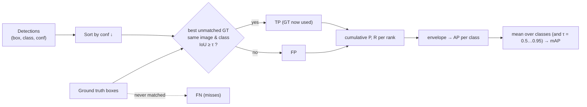

# FCV.06 — Detection metrics: IoU, precision, recall, mAP

<!-- glance:start -->
<!-- generated by tools/build.py from curriculum/syllabus.yaml — edit the syllabus, not this block -->

| | |
|---|---|
| **Track** | Optional foundation |
| **Difficulty** | Beginner |
| **Time** | 40 min |
| **Hardware** | none |
| **Software** | python |
| **Prerequisites** | none |
| **Skip if** | You compute IoU and interpret mAP. |

<!-- glance:end -->

## What you will learn

- Compute Intersection over Union (IoU) for bounding boxes by hand and vectorized, and know which box format you're holding.
- Match detections to ground truth, count TP/FP/FN at a confidence threshold, and compute precision, recall and F1.
- Build a precision–recall curve and compute Average Precision (all-point and COCO 101-point) for a worked example.
- Read mAP@0.5, mAP@0.5:0.95 and a detection confusion matrix, and explain what they hide about a robot's behaviour.
- Choose a confidence threshold from the trade-off your robot actually cares about.

## Why it matters

Every detector you'll use ([13.10](../../13-computer-vision/13.10-object-detection-models.md)) comes with a model card that says something like
"mAP 37.3". Every fine-tuning run prints precision, recall, mAP50 and mAP50-95 per epoch. The tracking lesson matches boxes by IoU
([13.12](../../13-computer-vision/13.12-tracking.md)), and evaluating ML inside the robot ([16.06](../../16-machine-learning/16.06-evaluating-ml-in-robots.md))
starts from these numbers before asking harder questions.

For a robot the numbers turn into behaviour. Low recall on "person" means the robot drives toward someone it didn't see. Low precision on
"obstacle" means it brakes for shadows and never reaches its goal. A good mAP can hide either. You need to compute these metrics yourself
at least once so that the model card, the training log and your own evaluation mean the same thing to you.

<!-- prereqs:start -->
## Prerequisites

None — you can start here.

### Optional prerequisite links

None.

Check your readiness: `python course.py why FCV.06`
<!-- prereqs:end -->

## Concept

A detector outputs **boxes with a class and a confidence**. Ground truth (GT) is a set of labelled boxes. Evaluation asks three questions.

1. **Is this detection on a real object?** Measure overlap with **IoU**: area of intersection divided by area of union. 1 is a perfect
   overlap, and 0 means the boxes don't touch. A detection "hits" a GT box when IoU ≥ a threshold (commonly 0.5). Each GT box can be claimed
   by **one** detection. A second detection on the same object is a false positive (a duplicate).
2. **How many were right?** At a chosen confidence threshold:
   - **True positive (TP):** a detection matched to a GT box.
   - **False positive (FP):** a detection with no match (background, a duplicate, poorly placed, or the wrong class).
   - **False negative (FN):** a GT box nobody matched: a miss.
   - **Precision** = of the things I reported, how many were real. **Recall** = of the real things, how many I reported.
3. **How good is it across all thresholds?** Lowering the threshold reports more boxes, so recall rises and precision usually falls. Plotting
   precision against recall gives the **PR curve**, and its area is **Average Precision (AP)** for one class. **mAP** averages AP over classes,
   and COCO-style mAP also averages over IoU thresholds from 0.5 to 0.95, rewarding tight boxes.

The analogy you know: precision and recall are exactly the terms from search and classification. A detector is a search engine for objects in
the image, and IoU decides whether a "result" points at the right place.

> [!TIP]
> **Ask your teacher:** "My person detector has mAP50 = 0.72 on COCO. Walk me through what else I need to measure before trusting it to stop the robot near people in my apartment."

## Technical explanation

### Level 2 — Practical

- **Box formats.** `xyxy` = (x1, y1, x2, y2) corners. `xywh` = (x1, y1, width, height), as in COCO JSON. `cxcywh` = (center x, center y, w, h),
  as in YOLO label files, often normalized to 0–1. Mixing them silently gives IoU ≈ 0 (Exercise E4). Convert at the boundary and assert `x2 > x1`.
- **Matching rules (COCO/VOC style):** process detections from highest to lowest confidence. Each takes the unmatched GT box in the same image
  and class with the highest IoU if it's ≥ threshold. Otherwise it's a FP.
- **One number doesn't choose a threshold.** AP summarises all thresholds. On the robot you must pick **one** confidence threshold. Choose it on
  the PR curve from the costs of each error (see question 6), and verify on data from the robot's environment.
- **mAP50 vs mAP50:95.** mAP50 rewards finding objects. mAP50:95 also rewards precise boxes. For grasping or measuring distance from box
  edges ([13.16](../../13-computer-vision/13.16-detection-to-map-position.md)), localization quality matters, so look at AP75 too.
- **Small objects** get lower AP at strict IoU: a 3-pixel offset on a 20-pixel ball costs far more IoU than on a 200-pixel person.
- **Tooling:** `pycocotools`, `torchmetrics.detection.MeanAveragePrecision` and Ultralytics' validator all implement these rules, with small
  differences (interpolation, area ranges, max detections per image). Compare numbers only from the same tool.

### Level 3 — Mathematics

**IoU** for boxes $A$ and $B$ in xyxy format:

$$w_\cap = \max(0,\ \min(x_2^A, x_2^B) - \max(x_1^A, x_1^B)),\quad h_\cap = \max(0,\ \min(y_2^A, y_2^B) - \max(y_1^A, y_1^B))$$
$$\text{IoU} = \frac{w_\cap h_\cap}{|A| + |B| - w_\cap h_\cap}$$

Example: $A = (10, 10, 50, 50)$, $B = (30, 30, 70, 70)$. Intersection $20 \times 20 = 400$. Union $1600 + 1600 - 400 = 2800$. **IoU = 0.143**.
Two 40-pixel boxes offset by half their size diagonally barely overlap by this measure. A 100-pixel box shifted by 10 px in both x and y:
$(0,0,100,100)$ vs $(10,10,110,110)$ gives $8100/11900 = $ **0.681**.

**Precision, recall, F1:**

$$P = \frac{TP}{TP + FP},\qquad R = \frac{TP}{TP + FN},\qquad F_1 = \frac{2PR}{P + R}$$

**Worked example** (the Code's `worked_example`: 2 images, 5 GT balls, 8 detections, IoU threshold 0.5). Sorted by confidence:

| rank | conf | result | why | cumulative P | cumulative R |
|---|---|---|---|---|---|
| 1 | 0.95 | TP | IoU 0.86 with ball 1 | 1/1 = 1.000 | 1/5 = 0.20 |
| 2 | 0.90 | TP | IoU 0.88 with ball 4 | 2/2 = 1.000 | 0.40 |
| 3 | 0.85 | FP | nothing there | 2/3 = 0.667 | 0.40 |
| 4 | 0.80 | TP | IoU 0.62 with ball 2 | 3/4 = 0.750 | 0.60 |
| 5 | 0.70 | FP | duplicate: ball 1 already taken | 3/5 = 0.600 | 0.60 |
| 6 | 0.60 | TP | IoU 0.62 with ball 5 | 4/6 = 0.667 | 0.80 |
| 7 | 0.50 | FP | IoU 0.25 with ball 4 (too small) | 4/7 = 0.571 | 0.80 |
| 8 | 0.40 | FP | IoU 0.14 with ball 3 | 4/8 = 0.500 | 0.80 |

At confidence ≥ 0.65 (ranks 1–5): TP = 3, FP = 2, FN = 2, so $P = 0.60$, $R = 0.60$, $F_1 = 0.60$.

**Average Precision.** Make precision monotone by taking, at each recall, the best precision at that recall *or higher* (the envelope $p_{interp}$).
Then integrate over recall.
- **All-point** (PASCAL VOC 2010+): $AP = \sum_k (r_k - r_{k-1})\,p_{interp}(r_k)$. Recall steps of 0.2 at precisions 1, 1, 0.75, 0.667 give
  $0.2(1 + 1 + 0.75 + 0.667) = $ **0.6833**. Recall never exceeds 0.8 (ball 3 was never found), so the last 0.2 contributes 0.
- **COCO 101-point:** average $p_{interp}$ at recall $0, 0.01, \dots, 1$: 41 points at 1.0 (recall 0–0.40), 20 at 0.75, 20 at 0.667, and 20 at 0 (above 0.80):
  $(41 + 15 + 13.33)/101 = $ **0.6865**.

**mAP.** $\text{mAP} = \frac{1}{|C|}\sum_{c} AP_c$. COCO's headline "AP" is also averaged over IoU thresholds $\{0.50, 0.55, \dots, 0.95\}$.

## Diagram

```text
IoU                                       Precision-recall curve (worked example) and its envelope

 A (10,10)──────┐                          P
 │              │                        1.0 ●━━━━━━━━━●┓
 │     B (30,30)┼──────┐                     ┃         ┃┃  ○ = measured points
 │      │ 400   │      │                 0.75┃         ┃┗━━━━━●┓
 └──────┼───────┘(50,50)                     ┃         ○       ┃ ●┓
        │              │                 0.67┃                 ┗━━┛ ○
        └──────────────┘(70,70)          0.5 ┃                      ○   AP = shaded area
 IoU = 400 / (1600+1600-400) = 0.143         0 ──────────────────────────────────── R
                                               0    0.2    0.4    0.6    0.8   1.0
```



## Code

Save as `fcv06_metrics.py` (numpy only). It checks vectorized IoU against pixel masks, reproduces the worked example, then evaluates a simulated
detector (persons found 90% of the time with tight boxes, balls 70% with loose boxes, 5% class confusion, random false positives) over 200 images,
with per-class AP, mAP and a confusion matrix.

```python
"""fcv06_metrics.py — IoU, greedy matching, precision/recall, AP (all-point and COCO 101-point), mAP and a confusion matrix.

Run: python fcv06_metrics.py      (numpy only)
"""
import numpy as np

CLASSES = ["person", "ball"]


def box_iou(a: np.ndarray, b: np.ndarray) -> np.ndarray:
    """Pairwise IoU of boxes in (x1, y1, x2, y2) pixel coordinates. a: (N, 4), b: (M, 4) -> (N, M)."""
    tl = np.maximum(a[:, None, :2], b[None, :, :2])                 # top-left of the intersection
    br = np.minimum(a[:, None, 2:], b[None, :, 2:])                 # bottom-right
    inter = np.prod(np.clip(br - tl, 0, None), axis=2)
    area_a = np.prod(a[:, 2:] - a[:, :2], axis=1)
    area_b = np.prod(b[:, 2:] - b[:, :2], axis=1)
    return inter / (area_a[:, None] + area_b[None, :] - inter)


def match(dets: list[dict], gts: list[dict], iou_thr: float) -> tuple[np.ndarray, np.ndarray, int]:
    """One class. Greedy by confidence: each detection takes the best unmatched GT in its image with IoU >= thr.
    Returns (confidences sorted high->low, TP flags in that order, number of GT boxes)."""
    order = sorted(range(len(dets)), key=lambda i: -dets[i]["conf"])
    used: set[int] = set()
    tp = np.zeros(len(dets), bool)
    for rank, i in enumerate(order):
        d = dets[i]
        cands = [j for j, g in enumerate(gts) if g["img"] == d["img"] and j not in used]
        if not cands:
            continue
        ious = box_iou(np.array([d["box"]], float), np.array([gts[j]["box"] for j in cands], float))[0]
        k = int(np.argmax(ious))
        if ious[k] >= iou_thr:
            tp[rank] = True
            used.add(cands[k])
    return np.array([dets[i]["conf"] for i in order]), tp, len(gts)


def precision_recall(tp: np.ndarray, n_gt: int) -> tuple[np.ndarray, np.ndarray]:
    ctp = np.cumsum(tp)
    cfp = np.cumsum(~tp)
    return ctp / np.maximum(ctp + cfp, 1), ctp / max(n_gt, 1)


def average_precision(tp: np.ndarray, n_gt: int, method: str = "all") -> float:
    """'all': area under the interpolated PR curve (VOC 2010+). 'coco': mean interpolated precision at 101 recall points."""
    if len(tp) == 0 or n_gt == 0:
        return 0.0
    p, r = precision_recall(tp, n_gt)
    p_interp = np.maximum.accumulate(p[::-1])[::-1]                 # precision envelope: best precision at recall >= r
    if method == "coco":
        idx = np.searchsorted(r, np.linspace(0, 1, 101), side="left")
        return float(np.mean(np.where(idx < len(r), p_interp[np.minimum(idx, len(r) - 1)], 0.0)))
    r_prev = np.concatenate(([0.0], r[:-1]))
    return float(np.sum((r - r_prev) * p_interp))


def worked_example() -> None:
    """Two images, 5 ground-truth balls, 8 detections: small enough to check by hand."""
    gts = [{"img": 0, "box": [10, 10, 50, 50]}, {"img": 0, "box": [100, 20, 140, 60]}, {"img": 0, "box": [200, 50, 260, 110]},
           {"img": 1, "box": [30, 30, 90, 90]}, {"img": 1, "box": [150, 40, 190, 80]}]
    dets = [{"img": 0, "conf": 0.95, "box": [12, 11, 52, 49]},      # good match
            {"img": 1, "conf": 0.90, "box": [32, 28, 92, 88]},      # good match
            {"img": 0, "conf": 0.85, "box": [300, 300, 340, 340]},  # nothing there
            {"img": 0, "conf": 0.80, "box": [105, 25, 145, 65]},    # decent match
            {"img": 0, "conf": 0.70, "box": [14, 14, 54, 54]},      # duplicate of the first ball
            {"img": 1, "conf": 0.60, "box": [155, 45, 195, 85]},    # decent match
            {"img": 1, "conf": 0.50, "box": [30, 30, 60, 60]},      # too small: IoU 0.25 with ball 4
            {"img": 0, "conf": 0.40, "box": [230, 80, 290, 140]}]   # poorly localized: IoU 0.14 with ball 3
    conf, tp, n_gt = match(dets, gts, 0.5)
    p, r = precision_recall(tp, n_gt)
    print("rank conf  TP/FP precision recall")
    for k in range(len(tp)):
        print(f"{k + 1:4d} {conf[k]:.2f}  {'TP' if tp[k] else 'FP':>3s}  {p[k]:9.3f} {r[k]:6.2f}")
    print(f"AP@0.5 all-point = {average_precision(tp, n_gt):.4f}, COCO 101-point = {average_precision(tp, n_gt, 'coco'):.4f}")
    keep = conf >= 0.65
    tps, fps = int(tp[keep].sum()), int((~tp[keep]).sum())
    print(f"at confidence >= 0.65: TP={tps} FP={fps} FN={n_gt - tps} precision={tps / (tps + fps):.2f} recall={tps / n_gt:.2f}")


def synthetic_dataset(rng: np.random.Generator, n_img: int = 200):
    """A fake detector: finds persons 90 % / balls 70 % of the time, jitters boxes, adds false positives and class confusions."""
    gts = {c: [] for c in CLASSES}
    dets = {c: [] for c in CLASSES}
    for img in range(n_img):
        for _ in range(rng.integers(0, 4)):
            c = CLASSES[rng.integers(0, 2)]
            if c == "person":
                w, h = rng.uniform(40, 120), rng.uniform(100, 250)
            else:
                w = h = rng.uniform(15, 50)
            x, y = rng.uniform(0, 640 - w), rng.uniform(0, 480 - h)
            box = np.array([x, y, x + w, y + h])
            gts[c].append({"img": img, "box": box})
            if rng.random() < (0.9 if c == "person" else 0.7):
                rel = 0.08 if c == "person" else 0.15                                     # small objects localize worse
                jitter = rng.normal(0, rel, 4) * np.array([w, h, w, h])
                conf = float(np.clip(rng.uniform(0.55, 0.95) - 2 * np.abs(jitter / np.array([w, h, w, h])).mean(), 0.05, 1))
                label = c if rng.random() > 0.05 else CLASSES[1 - CLASSES.index(c)]       # 5 % class confusion
                dets[label].append({"img": img, "box": box + jitter, "conf": conf})
        for _ in range(rng.poisson(0.6)):                                                  # false positives on background
            x, y, s = rng.uniform(0, 600), rng.uniform(0, 400), rng.uniform(15, 60)
            c = CLASSES[rng.integers(0, 2)]
            dets[c].append({"img": img, "box": np.array([x, y, x + s, y + s * (2 if c == "person" else 1)]),
                            "conf": float(rng.uniform(0.05, 0.7))})
    return gts, dets


def confusion_matrix(gts: dict, dets: dict, conf_thr: float = 0.5, iou_thr: float = 0.5) -> np.ndarray:
    """Rows = truth (person, ball, background), cols = prediction. Detections may match GT of ANY class."""
    names = CLASSES + ["background"]
    all_gt = [(c, g) for c in CLASSES for g in gts[c]]
    all_det = sorted([(c, d) for c in CLASSES for d in dets[c] if d["conf"] >= conf_thr], key=lambda cd: -cd[1]["conf"])
    cm = np.zeros((3, 3), int)
    matched: set[int] = set()
    for pred_c, d in all_det:
        cands = [k for k, (_, g) in enumerate(all_gt) if g["img"] == d["img"] and k not in matched]
        best = None
        if cands:
            ious = box_iou(np.array([d["box"]]), np.array([all_gt[k][1]["box"] for k in cands]))[0]
            if ious.max() >= iou_thr:
                best = cands[int(np.argmax(ious))]
        if best is None:
            cm[2, names.index(pred_c)] += 1                  # background predicted as an object: false positive
        else:
            matched.add(best)
            cm[names.index(all_gt[best][0]), names.index(pred_c)] += 1
    for k, (c, _) in enumerate(all_gt):
        if k not in matched:
            cm[names.index(c), 2] += 1                       # object predicted as background: missed
    return cm


if __name__ == "__main__":
    a = np.array([[10, 10, 50, 50]], float)
    b = np.array([[30, 30, 70, 70], [10, 10, 50, 50], [60, 60, 90, 90], [0, 0, 100, 100]], float)
    mask_a = np.zeros((100, 100), bool); mask_a[10:50, 10:50] = True                      # brute-force check with pixel masks
    mask_b = np.zeros((100, 100), bool); mask_b[30:70, 30:70] = True
    print("IoU:", np.round(box_iou(a, b)[0], 4), "| pixel-mask check of the first:",
          round(float((mask_a & mask_b).sum() / (mask_a | mask_b).sum()), 4))

    worked_example()

    rng = np.random.default_rng(6)
    gts, dets = synthetic_dataset(rng)
    print(f"\nsynthetic set: {sum(len(v) for v in gts.values())} GT boxes, {sum(len(v) for v in dets.values())} detections")
    thresholds = np.linspace(0.5, 0.95, 10)
    per_class = {}
    for c in CLASSES:
        aps = [average_precision(match(dets[c], gts[c], t)[1], len(gts[c]), "coco") for t in thresholds]
        per_class[c] = aps
        print(f"{c:7s} AP50 {aps[0]:.3f}  AP75 {aps[5]:.3f}  AP50:95 {np.mean(aps):.3f}")
    print(f"mAP50 {np.mean([v[0] for v in per_class.values()]):.3f}   mAP50:95 {np.mean([np.mean(v) for v in per_class.values()]):.3f}")

    cm = confusion_matrix(gts, dets)
    print("\nconfusion matrix at conf >= 0.5, IoU >= 0.5 (rows = truth, cols = prediction)")
    print(" " * 11 + "".join(f"{n:>11s}" for n in CLASSES + ["background"]))
    for name, row in zip(CLASSES + ["background"], cm):
        print(f"{name:>11s}" + "".join(f"{v:11d}" for v in row))
```

Output (deterministic):

```text
IoU: [0.1429 1.     0.     0.16  ] | pixel-mask check of the first: 0.1429
rank conf  TP/FP precision recall
   1 0.95   TP      1.000   0.20
   2 0.90   TP      1.000   0.40
   3 0.85   FP      0.667   0.40
   4 0.80   TP      0.750   0.60
   5 0.70   FP      0.600   0.60
   6 0.60   TP      0.667   0.80
   7 0.50   FP      0.571   0.80
   8 0.40   FP      0.500   0.80
AP@0.5 all-point = 0.6833, COCO 101-point = 0.6865
at confidence >= 0.65: TP=3 FP=2 FN=2 precision=0.60 recall=0.60

synthetic set: 313 GT boxes, 378 detections
person  AP50 0.758  AP75 0.464  AP50:95 0.446
ball    AP50 0.336  AP75 0.045  AP50:95 0.124
mAP50 0.547   mAP50:95 0.285

confusion matrix at conf >= 0.5, IoU >= 0.5 (rows = truth, cols = prediction)
                person       ball background
     person        108          8         54
       ball          3         43         97
 background         19         29          0
```

Reading the synthetic results the way you'd read a real model card:
- **The ball is the weak class.** AP50 is 0.336, and at IoU 0.75 it collapses to 0.045 because small boxes jittered by 15% rarely overlap that
  tightly. A single mAP50:95 of 0.285 hides that one class is nearly unusable for precise localization.
- **The confusion matrix names the errors.** 97 balls were missed (row "ball", column "background"). 29 background regions were called "ball". 8 persons
  were labelled "ball" (class confusion). The bottom-right cell is empty by definition: nobody labels "nothing detected where nothing exists".
- **The chosen threshold changes all of these counts, but not AP.** AP describes the detector. The confusion matrix describes the detector *plus your threshold*.

## Exercise

No hardware is needed. Put `fcv06_metrics.py` in the same folder.

### Exercise FCV.06-E1 — IoU by hand `[numerical]`

Compute IoU for: (a) (10, 10, 50, 50) vs (30, 30, 70, 70), (b) (0, 0, 100, 100) vs (10, 10, 110, 110), (c) (10, 10, 50, 50) vs (0, 0, 100, 100),
(d) (10, 10, 50, 50) vs (60, 60, 90, 90). For (b), how many pixels may a 100-px box be shifted diagonally and still pass IoU ≥ 0.5?

### Exercise FCV.06-E2 — Precision and recall at two thresholds `[numerical]`

From the worked-example table, compute TP, FP, FN, precision, recall and F1 at confidence ≥ 0.65 and at confidence ≥ 0.55.
Which threshold would you deploy for a robot that must not miss balls, and which for one that must never chase a phantom?

### Exercise FCV.06-E3 — Implement AP `[coding]`

Without looking at `average_precision`, write `ap_all_point(tp_flags, n_gt)` and `ap_coco(tp_flags, n_gt)` using only numpy. Test them on the
worked example's TP sequence `[T, T, F, T, F, T, F, F]` with `n_gt = 5`. Then append a 9th detection that is a TP and recompute.

### Exercise FCV.06-E4 — The format bug `[debugging]`

A model returns boxes in `xywh`. A GT box in `xyxy` is (100, 50, 160, 170), and the model's detection is (102, 52, 60, 118) in `xywh`. Your
evaluation code passes it straight into `box_iou`. What IoU do you get, what IoU should you get, and what does this do to AP? Add an assertion that
catches it.

### Exercise FCV.06-E5 — Stricter IoU and small objects `[predict]`

**Before looking at the synthetic output**, predict for each class whether AP drops a little or a lot between IoU 0.5 and 0.75, and why. Then check,
and compute how many pixels of offset a 30×30 ball box can tolerate at IoU 0.75 (shift along one axis only).

## Expected result

**FCV.06-E1**: (a) **0.143**. (b) **0.681**. (c) $1600/10000 = $ **0.16** (the small box is fully inside, so IoU equals the area ratio). (d) **0**.
For a diagonal shift $s$ of a 100-px box: $\frac{(100-s)^2}{20000 - (100-s)^2} \ge 0.5$ gives $(100-s)^2 \ge 6667$, so $s \le$ **18.4 px**.

**FCV.06-E2**: ≥ 0.65: TP 3, FP 2, FN 2, P = 0.60, R = 0.60, F1 = 0.60. ≥ 0.55 (ranks 1–6): TP 4, FP 2, FN 1, P = 0.667, R = 0.80, F1 = 0.727.
Here the lower threshold is better on both (the rank-6 detection is a TP). "Must not miss" wants the lower threshold (or lower still, accepting FP).
"Never chase a phantom" wants ≥ 0.90, which keeps only ranks 1–2: P = 1.0, R = 0.4.

**FCV.06-E3**: all-point **0.6833**, COCO **0.6865**. With a 9th TP (recall 1.0 at precision 5/9 = 0.556): all-point $0.6833 + 0.2 \times 0.556 = $ **0.7944**.
COCO: the last 20 recall points now get 0.556, so $(41 + 15 + 13.33 + 11.11)/101 = $ **0.7965**.

**FCV.06-E4**: interpreted as xyxy, (102, 52, 60, 118) has $x_2 < x_1$ (negative width). The intersection clips to 0, so **IoU = 0**. The correct
conversion is (102, 52, 162, 170), with **IoU = 0.920**. Every detection becomes a FP and every GT box a FN, so **AP ≈ 0** for a detector that is actually
excellent. Assertion: `assert np.all(boxes[:, 2] > boxes[:, 0]) and np.all(boxes[:, 3] > boxes[:, 1])` right after conversion, plus a unit test on one known box.

**FCV.06-E5**: person AP50 0.758 → AP75 0.464, a large drop but still usable. Ball 0.336 → 0.045, which collapses. Balls are small and jittered by 15%
of their size. For a 30×30 box shifted by $s$ along x: $\frac{30(30-s)}{1800 - 30(30-s)} \ge 0.75$ gives $30 - s \ge 25.7$, so $s \le$ **4.3 px**. A person box
200 px tall tolerates ~29 px vertically.

## Troubleshooting

### Symptom: mAP is near zero, but the boxes look right when drawn
1. Box format mismatch (xywh vs xyxy vs normalized cxcywh). Draw GT and detections on the **same** image with the **same** conversion code.
2. Image id or class id mismatch between predictions and GT (off-by-one class index, file-name keys). Print one matched pair.
3. Coordinates scaled to a different image size (the model input was resized to 640, the GT is in original pixels).

### Symptom: our mAP differs from the model card or from another tool
1. Same IoU thresholds? (mAP50 vs mAP50:95.)
2. Same interpolation (all-point vs 101-point) and same max detections per image (COCO uses 100)?
3. Same dataset split and the same "crowd"/ignore handling?
4. Compare on a tiny hand-made case (like the worked example) in both tools first.

### Symptom: high mAP offline, poor behaviour on the robot
1. Distribution shift: a different camera, lighting, viewpoint (low robot camera) or object sizes. Evaluate on frames recorded by the robot ([16.06](../../16-machine-learning/16.06-evaluating-ml-in-robots.md)).
2. Wrong operating threshold: AP is threshold-free, but the robot isn't. Pick the threshold from the PR curve on robot data.
3. Temporal effects: a detection that flickers on/off at 30 Hz can have decent per-frame recall and still break tracking. Measure per-track metrics ([13.12](../../13-computer-vision/13.12-tracking.md)).

## Common mistakes

- **Letting two detections claim the same GT box.** Duplicates must be FPs. That's the job of NMS in the detector, and evaluation must penalise failures of NMS.
- **Averaging precision and recall over images instead of over all detections.** Rankings must be global per class.
- **Reporting precision without the threshold or IoU used.** "Precision 0.9" is meaningless alone.
- **Comparing AP across datasets.** AP depends on the data's difficulty. Compare models on the same test set.
- **Tuning the threshold on the test set.** Choose it on a validation split, and report on test.
- **Treating mAP as the robot's success rate.** It's a component metric. The system metric is "did the robot do the task safely".

## Knowledge check

1. Boxes (0, 0, 40, 40) and (20, 0, 60, 40): what's the IoU?
   <details><summary>Answer</summary>

   Intersection $20 \times 40 = 800$. Union $1600 + 1600 - 800 = 2400$. IoU = **0.333**. A half-width horizontal shift fails IoU 0.5.
   </details>

2. A detector reports 40 boxes on a test set with 50 objects, and 30 of the boxes are correct. What are precision and recall?
   <details><summary>Answer</summary>

   $P = 30/40 = 0.75$. $R = 30/50 = 0.60$. (FP = 10, FN = 20.)
   </details>

3. Why does a second detection on an already-matched object count as a false positive?
   <details><summary>Answer</summary>

   Downstream consumers (a tracker, a counter, a planner) would see two objects where there is one. Evaluation enforces one-to-one matching, so
   duplicates that NMS failed to suppress lower precision.
   </details>

4. What's the difference between mAP50 and mAP50:95, and when does a robot care about the second?
   <details><summary>Answer</summary>

   mAP50 counts a detection correct at IoU ≥ 0.5. mAP50:95 averages AP over IoU thresholds 0.5–0.95, rewarding precise boxes. A robot cares when it
   uses box geometry: grasp points, distance from the box bottom edge, or fitting a marker. Finding "something is there" is fine at 0.5.
   </details>

5. Lowering the confidence threshold from 0.5 to 0.2: predict the effect on precision, recall and AP.
   <details><summary>Answer</summary>

   Recall rises (or stays the same), precision usually falls, and **AP doesn't change**: it's computed over all thresholds from the ranked list. (Unless the tool
   discarded detections below the old threshold before computing AP, in which case AP can only rise.)
   </details>

6. A delivery robot's person detector: missing a person may cause a collision, and a false person makes the robot pause for 2 s. How do you choose the threshold?
   <details><summary>Answer</summary>

   Missing a person is far more costly, so operate at **high recall**: pick the threshold on robot validation data where person recall meets a target
   (for example ≥ 0.99 within 3 m), and accept the resulting precision. Measure the pause rate it causes, and back it up with non-ML safety (bumpers, LiDAR stop zones, [20.04](../../20-final-robot/20.04-safety-case.md)).
   </details>

## Practical challenge

**Evaluate a detector the way the robot will use it.**
1. Extend `synthetic_dataset` with per-object **distance** (box size shrinks with distance) and a "near zone" flag (≤ 1.5 m).
2. Report AP50, AP75, and precision/recall at a chosen threshold **per distance bin** (0–1.5, 1.5–3, 3–6 m) for both classes.
3. Plot PR curves per class ([FPY.03](../python/FPY.03-plotting-matplotlib.md)) and mark your chosen operating point.
4. Choose the confidence threshold that gives person recall ≥ 0.95 in the near zone, and report the precision and false-positive rate per image it implies.
5. Validate `box_iou`, `match` and `average_precision` against a second implementation (for example `torchmetrics` or `pycocotools`, if installed) on the
   worked example and on the synthetic set, and explain any difference.

Acceptance criteria: all numbers come from code. The near-zone threshold is justified in two sentences. Differences to the reference tool are either zero
or explained (interpolation, max detections). The worked example reproduces 0.6833 / 0.6865 exactly.

## You can skip this if…

You answer questions 1, 5 and 6 correctly without looking, and you can compute AP for the worked example by hand. Then:
`python course.py skip FCV.06 --reason "compute IoU and interpret mAP"`

## Go deeper

- https://cocodataset.org/#detection-eval — the COCO detection evaluation definitions: AP, AP50, AP75, and small/medium/large areas.
- https://docs.ultralytics.com/guides/yolo-performance-metrics/ — how Ultralytics reports precision, recall, mAP50 and mAP50-95, and how to interpret them in practice.
- https://github.com/rafaelpadilla/review_object_detection_metrics — a careful comparison of detection metric variants, with a reference implementation.
- https://link.springer.com/article/10.1007/s11263-009-0275-4 — Everingham et al., "The PASCAL Visual Object Classes (VOC) Challenge" (IJCV 2010): the original AP protocol.
- https://cs231n.stanford.edu/ — Stanford CS231n: detection lectures that put these metrics in context.

## Progress checkpoint

- [ ] I can compute IoU by hand and convert between box formats safely.
- [ ] I can match detections to ground truth and compute precision, recall and F1 at a threshold.
- [ ] I can compute AP (all-point and COCO) and explain mAP50 vs mAP50:95.
- [ ] I can read a detection confusion matrix and choose an operating threshold from the robot's error costs.

`python course.py complete FCV.06` (exercises done) · `python course.py master FCV.06` (challenge done) ·
`python course.py struggle FCV.06 "what was hard"`

Next: back to the main path, [13.10 — Object detection with modern models](../../13-computer-vision/13.10-object-detection-models.md).
