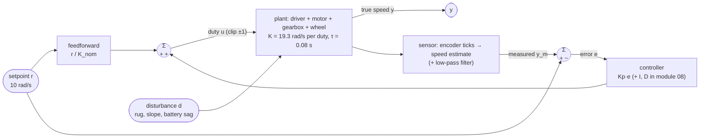

# FCT.01 — Systems, signals and feedback — block diagrams

<!-- glance:start -->
<!-- generated by tools/build.py from curriculum/syllabus.yaml — edit the syllabus, not this block -->

| | |
|---|---|
| **Track** | Optional foundation |
| **Difficulty** | Beginner |
| **Time** | 40 min |
| **Hardware** | none |
| **Software** | none |
| **Prerequisites** | none |
| **Skip if** | You read block diagrams. |

<!-- glance:end -->

## What you will learn

- Describe any part of a robot as a *system* with input and output *signals*, and name the standard test signals.
- Read and draw block diagrams: series, parallel and feedback connections, with setpoint, error, controller, plant, sensor and disturbance.
- Compute a feedback loop's steady-state output from its loop gain, and explain why feedback cuts sensitivity to battery sag and load changes by $1/(1+L)$.
- Tell open-loop, feedback and feedforward-plus-feedback control apart, and know what each can and cannot fix.
- Recognize the two classic feedback bugs: a wrong sign, and a biased sensor.

## Why it matters

Module 08 starts with a robot that does not drive straight ([08.01](../../08-control/08.01-open-vs-closed-loop.md)) and fixes it with feedback: speed loops, heading loops, cascades ([08.10](../../08-control/08.10-straight-line-heading-control.md)). Nav2's controller, the IMU filter and the arm's servo loops all use the same vocabulary. Every control paper, datasheet and ROS 2 control diagram is drawn as a block diagram.

This lesson gives you that language, and one quantitative idea you will use constantly: feedback shrinks the effect of everything you did not model by a factor $1 + L$. Here $L$ is the loop gain. Karmel's battery drops from 12.6 V to 9.9 V over a run, and without feedback its speed drops 21% with it.

<!-- prereqs:start -->
## Prerequisites

None — you can start here.

### Optional prerequisite links

None.

Check your readiness: `python course.py why FCT.01`
<!-- prereqs:end -->

## Concept

A **system** is anything that turns an input signal into an output signal over time. A motor turns duty cycle into wheel speed. An encoder turns wheel angle into ticks. A PID turns error into a command. Your web service turns request rate into latency. A **signal** is a quantity that changes over time: a setpoint, a voltage, a measured speed.

Engineers probe systems with a few standard **test signals**, because the response reveals the system's character:

- **step:** jump from 0 to a value and hold, such as "drive at 10 rad/s now";
- **ramp:** increase steadily, such as a trapezoidal velocity profile's acceleration phase;
- **impulse:** a short kick, like a bump in the floor;
- **sinusoid:** a steady wiggle at a frequency, like a wobbly wheel;
- **noise:** random fluctuation, like encoder quantization.

A **block diagram** draws systems as boxes and signals as arrows. Boxes in a row multiply their effects (series). Arrows meeting at a circle with + and − signs add or subtract (a summing junction). The most important shape is the **loop**: measure the output, compare it with what you wanted, and let the difference drive the input.

- **Open loop:** compute the command from a model and send it. "Duty 0.52 gives 10 rad/s." It works exactly as well as the model. When the battery sags or the wheel meets a rug, nobody notices.
- **Feedback (closed loop):** measure the speed, subtract it from the **setpoint** to get the **error**, and let a **controller** turn the error into a command. It corrects for things you never modelled, but it needs an error to act on, and a sensor to trust.
- **Feedforward + feedback:** send the model's best-guess command *and* correct the leftover error with feedback. This is what real robots do ([08.09](../../08-control/08.09-feedforward-exact-speed.md)). The Pico firmware in `labs/firmware/pico/velocity.py` uses exactly this structure.

For a distributed-systems engineer this is familiar. An autoscaler with a fixed schedule is open loop. One that watches queue depth and adds workers is feedback. One that pre-scales for the 9:00 traffic spike *and* watches the queue is feedforward plus feedback. Feedback also brings the failure modes you know from autoscalers: oscillation when it reacts too hard or too late, and runaway when the metric is wired backwards.

> [!TIP]
> **Ask your teacher:** "Draw karmel's wheel-speed loop as a block diagram, then point to each block in `labs/firmware/pico/velocity.py` and `main.py`."

## Technical explanation

### Level 1 — The vocabulary on one loop

| Term | Symbol | Karmel's wheel-speed loop |
|---|---|---|
| Setpoint (reference) | $r$ | desired wheel speed, 10 rad/s |
| Measurement | $y_m$ | speed estimated from encoder ticks |
| Error | $e = r - y_m$ | 10 − measured |
| Controller | $C$ | PID (module 08), here P with gain $K_p$ |
| Command (control input) | $u$ | PWM duty, −1…1 |
| Actuator + plant | $G$ | motor driver, motor, gearbox, wheel |
| Output | $y$ | true wheel speed |
| Disturbance | $d$ | rug, slope, battery sag |
| Sensor | $H$ | encoder + speed estimator (+ filter) |

### Level 2 — Block diagram algebra with gains

When each block is just a number, a **gain** (output = gain × input), the rules are:

- **Series:** $y = G_2 G_1 u$. Gains multiply.
- **Parallel:** $y = (G_1 + G_2) u$. Gains add.
- **Negative feedback** with controller $C$, plant $G$ and a perfect sensor:

$$y = G\,C\,(r - y) \;\Rightarrow\; \frac{y}{r} = \frac{GC}{1 + GC} = \frac{L}{1+L}, \qquad L = GC\ \ \text{(the loop gain)}$$

Real plants take time to respond. [FCT.02](FCT.02-first-second-order-systems.md) adds the dynamics. But after the response settles (the **steady state**), a stable loop obeys exactly these gain formulas. That already answers "how accurate?" and "how sensitive?".

**Karmel's plant gain.** Per `karmel.yaml`, full duty gives about 17 rad/s, and nothing happens below 12% duty (the deadband). Above the deadband, the gain is $K = 17/0.88 = 19.3$ rad/s per unit duty. We treat the deadband as compensated here; [FCT.03](FCT.03-differential-equations-simulation.md) simulates it. With $K_p = 0.15$ duty per rad/s, the loop gain is $L = 19.3 \times 0.15 = 2.90$.

### Level 3 — Sensitivity: what feedback buys

**P only.** $y/r = L/(1+L) = 2.90/3.90 = 0.743$. At a 10 rad/s setpoint the wheel settles at **7.43 rad/s**. A P-only loop always leaves a steady-state error $e = r/(1+L)$, here 2.57 rad/s. Removing it is what the integral term is for ([08.05](../../08-control/08.05-integral-control.md)).

**Sensitivity to the plant changing.** The pack sags from 12.6 V to 9.9 V, so the motor gain drops by $9.9/12.6 = 0.786$:

- **Open loop**, where the command was computed for the full battery: the speed falls 21.4%, from 10 to 7.86 rad/s.
- **P only:** $L$ drops to 2.28, and $y = 10 \times 2.28/3.28 = 6.95$ rad/s. A 6.5% change instead of 21%.

**Feedforward + P** sends $u = r/K_{nom} + K_p e$. Its steady state is

$$y = r\,\frac{K/K_{nom} + L}{1 + L}$$

- **Full battery:** exactly 10.00 rad/s. The feedforward does the work and the error is zero.
- **Sagged battery:** $10 \times (0.786 + 2.28)/3.28 = 9.35$ rad/s, a 6.5% error instead of open loop's 21%.

The general rule: **feedback divides the effect of a plant change or disturbance by $1 + L$.** $S = 1/(1+L)$ is called the **sensitivity**. Here $S = 1/3.90 = 0.257$: feedback leaves about a quarter of any disturbance's effect.

**A disturbance.** A rug acts like losing 0.10 duty. Open loop loses $K \times 0.786 \times 0.10 = 1.52$ rad/s, while feedforward + P loses only $1.52/3.28 = 0.46$ rad/s (9.35 → 8.88).

Why not make $L$ huge? Because real loops have lag: motor inertia, speed filtering, communication delay. Too much gain around a lagging loop oscillates and then goes unstable. That trade-off is the whole of [FCT.04](FCT.04-stability-intuition.md). Karmel's firmware uses a small $K_p = 0.02$ plus integral and feedforward for exactly that reason.

### Level 3b — What feedback cannot fix

- **A biased sensor.** Feedback makes the *measurement* match the setpoint. If the speed estimate reads 10% high, the loop happily drives the true speed to about 9.3 rad/s ($r(1+L)/(1+1.1L)$ with feedforward + P) and reports success. Open loop would not even have been affected.
- **A sign error.** If the error is computed as $y - r$, the loop pushes *away* from the setpoint: positive feedback. The command saturates and the wheel runs to full speed, usually in the wrong direction.
- **Saturation.** If $u$ hits ±1, the loop is effectively open. No gain can command more than 100% duty.

### Level 4 — Loops inside loops

Real robots **cascade** loops. The inner loop is fast and simple, the outer loop slower and smarter, and each outer loop's command is the next inner loop's setpoint.

- Nav2 (≈ 20 Hz) sends `cmd_vel`.
- The base converts it to wheel speeds (09.02).
- The Pico's wheel-speed PID (100 Hz) produces duty.
- PWM (kHz) drives the motor.

The heading loop in [08.10](../../08-control/08.10-straight-line-heading-control.md) sits between Nav2 and the wheel loop. The rule of thumb is that each inner loop should settle several times faster than the loop around it. Then the outer loop can treat the inner loop as "does what it is told". [FCT.05](FCT.05-discrete-time-sampling.md) turns that into loop-rate numbers.

## Diagram

Karmel's wheel-speed loop with feedforward, as implemented on the Pico:



The three connection rules, with gains:

```text
 series:      u ──►[ G1 ]──►[ G2 ]──► y          y = G2·G1·u

 parallel:        ┌─►[ G1 ]─┐
              u ──┤         (+)──► y             y = (G1 + G2)·u
                  └─►[ G2 ]─┘

 feedback:   r ──►(+)──►[ C ]──►[ G ]──┬──► y    y/r = C·G / (1 + C·G)
                  −▲                   │
                   └───────────────────┘         sensitivity S = 1 / (1 + C·G)
```

## Code

Save as `fct01_feedback.py` and run `python fct01_feedback.py`. It simulates karmel's wheel under three controllers for 3 s at a 10 rad/s setpoint. At t = 1 s the battery sags to 9.9 V, and at t = 2 s the wheel meets a rug. It prints each controller's settled speed next to the closed-form steady state.

```python
"""FCT.01 — open loop vs feedback on karmel's wheel speed, with battery sag and a load disturbance.

Run: python fct01_feedback.py   (needs numpy + matplotlib)
"""
from __future__ import annotations

from dataclasses import dataclass

import matplotlib

matplotlib.use("Agg")
import matplotlib.pyplot as plt
import numpy as np


@dataclass(frozen=True)
class Wheel:
    """First-order wheel: tau * dw/dt = -w + K * battery_factor * (u + disturbance)."""
    gain_rad_s_per_duty: float = 17.0 / 0.88   # karmel.yaml: 17 rad/s at full duty, above the 0.12 deadband
    tau_s: float = 0.08                          # karmel.yaml motor_time_constant_s


def battery_factor(t: float) -> float:
    return 1.0 if t < 1.0 else 9.9 / 12.6       # the pack sags from full to cutoff voltage at t = 1 s


def disturbance(t: float) -> float:
    return 0.0 if t < 2.0 else -0.10            # the wheel meets a rug at t = 2 s: like losing 0.10 duty


def simulate(controller: str, setpoint: float = 10.0, kp: float = 0.15, t_end: float = 3.0,
             dt: float = 0.001, wheel: Wheel = Wheel()):
    n = int(round(t_end / dt))
    t = np.arange(n) * dt
    w = np.zeros(n)
    u = np.zeros(n)
    feedforward = setpoint / wheel.gain_rad_s_per_duty   # calibrated once, on a full battery
    for k in range(n - 1):
        error = setpoint - w[k]                          # measurement assumed perfect here
        if controller == "open loop":
            u[k] = feedforward
        elif controller == "P only":
            u[k] = kp * error
        elif controller == "feedforward + P":
            u[k] = feedforward + kp * error
        else:
            raise ValueError(controller)
        u[k] = float(np.clip(u[k], -1.0, 1.0))           # a duty cycle cannot exceed 100 %
        k_now = wheel.gain_rad_s_per_duty * battery_factor(t[k])
        dw = (-w[k] + k_now * (u[k] + disturbance(t[k]))) / wheel.tau_s
        w[k + 1] = w[k] + dw * dt
    return t, w, u


def steady_state(controller: str, g: float, d: float, r: float = 10.0, kp: float = 0.15,
                 K: float = 17.0 / 0.88) -> float:
    """Closed-form steady state: set dw/dt = 0 and solve for w."""
    Kg = K * g
    if controller == "open loop":
        return Kg * (r / K + d)
    if controller == "P only":
        return Kg * (kp * r + d) / (1 + Kg * kp)
    return Kg * (r / K + kp * r + d) / (1 + Kg * kp)


def main() -> None:
    controllers = ["open loop", "P only", "feedforward + P"]
    windows = [("full battery", 0.9, 1.0, 0.0), ("sagged battery", 1.9, 9.9 / 12.6, 0.0),
               ("sagged + rug", 2.9, 9.9 / 12.6, -0.10)]
    print("loop gain L = K*Kp:", f"{17.0 / 0.88 * 0.15:.3f} (full)", f"{17.0 / 0.88 * 0.15 * 9.9 / 12.6:.3f} (sagged)")
    fig, ax = plt.subplots(figsize=(8, 4.5))
    for c in controllers:
        t, w, _ = simulate(c)
        cells = []
        for label, t_s, g, d in windows:
            cells.append(f"{label}: sim {w[int(t_s / 0.001)]:5.2f} / formula {steady_state(c, g, d):5.2f}")
        print(f"{c:16s} | " + " | ".join(cells))
        ax.plot(t, w, label=c)
    ax.axhline(10.0, color="k", ls=":", lw=1, label="setpoint 10 rad/s")
    ax.axvline(1.0, color="grey", lw=0.8)
    ax.axvline(2.0, color="grey", lw=0.8)
    ax.text(1.02, 1.0, "battery sags", color="grey")
    ax.text(2.02, 1.0, "rug", color="grey")
    ax.set_xlabel("time [s]")
    ax.set_ylabel("wheel speed [rad/s]")
    ax.set_ylim(0, 11)
    ax.grid(True)
    ax.legend(loc="lower left")
    fig.tight_layout()
    fig.savefig("fct01_feedback.png", dpi=120)
    print("saved fct01_feedback.png")


if __name__ == "__main__":
    main()
```

Output:

```text
loop gain L = K*Kp: 2.898 (full) 2.277 (sagged)
open loop        | full battery: sim 10.00 / formula 10.00 | sagged battery: sim  7.86 / formula  7.86 | sagged + rug: sim  6.34 / formula  6.34
P only           | full battery: sim  7.43 / formula  7.43 | sagged battery: sim  6.95 / formula  6.95 | sagged + rug: sim  6.49 / formula  6.49
feedforward + P  | full battery: sim 10.00 / formula 10.00 | sagged battery: sim  9.35 / formula  9.35 | sagged + rug: sim  8.88 / formula  8.88
saved fct01_feedback.png
```

**The plot `fct01_feedback.png`** shows wheel speed over 3 s for the three controllers, with a dotted line at 10 rad/s and grey markers at 1 s and 2 s.

- **Open loop:** rises smoothly to 10.0, drops to 7.86 after the sag, then to 6.34 after the rug. Two clear steps down.
- **P only:** rises faster but settles too low at 7.43, then steps down to 6.95 and 6.49.
- **Feedforward + P:** reaches 10.0 fastest, with only small dips to 9.35 and 8.88.

Feedback responds within a few tens of milliseconds, while open loop never recovers.

## Exercise

### Exercise FCT.01-E1 — Loop gain arithmetic `[numerical]`

Hardware: none. Double the gain to $K_p = 0.30$ duty per rad/s ($K = 19.3$, setpoint 10 rad/s). Compute:

1. The loop gain $L$ and sensitivity $S$ on a full battery.
2. The P-only steady-state speed on a full battery.
3. The feedforward + P steady state after the sag ($g = 0.786$).
4. The feedforward + P steady state after the sag and the rug (−0.10 duty).

Check against `steady_state(..., kp=0.3)`.

### Exercise FCT.01-E2 — Add an integrator `[coding]`

Hardware: none. Add a controller `"feedforward + PI"` to `simulate`: $u = r/K_{nom} + K_p e + K_i \int e\,dt$ with $K_p = 0.15$ and $K_i = 1.0$ duty per rad. Accumulate the integral as `integral += error * dt`. Plot it with the others. Measure how long after each event (sag at 1 s, rug at 2 s) the speed returns to within 0.1 rad/s of 10 and stays there.

### Exercise FCT.01-E3 — Predict: a sensor that lies `[predict]`

Hardware: none. The wheel radius in the speed estimator is 10% too large, so the measured speed reads 1.1× the true speed. With feedforward + P ($K_p = 0.15$, full battery), predict whether the **true** wheel speed ends up above, below or at 10 rad/s. Then modify the simulation (`error = setpoint - 1.1 * w[k]`) and compare with the formula $y = r(1+L)/(1+1.1L)$.

### Exercise FCT.01-E4 — The sign bug `[debugging]`

Hardware: none. A teammate writes `error = w[k] - setpoint` in the feedforward + P controller. Before running it, predict what the wheel does in the first second: speed, direction, and final value. Then run it, and write a one-line unit test that would have caught the bug. Hint: after a small positive error, the command should increase.

## Expected result

**FCT.01-E1:**
1. $L = 5.80$ and $S = 0.147$.
2. $10 \times 5.80/6.80 = $ **8.53 rad/s**.
3. **9.61 rad/s**.
4. **9.34 rad/s**.

Doubling the gain roughly halves the remaining errors. It does not remove them.

**FCT.01-E2:** The PI speed returns within 0.1 rad/s of 10 about **0.41 s after the sag** (by t ≈ 1.41 s) and about **0.35 s after the rug** (by t ≈ 2.35 s). It reads 10.02, 9.99 and 10.00 at t = 0.9, 1.9 and 2.9 s. The integrator removes the steady-state error that P leaves. [08.05](../../08-control/08.05-integral-control.md) adds the windup protection you need in practice.

**FCT.01-E3:** **Below.** True speed = 10 × 3.898/4.188 = **9.31 rad/s**, while the measured speed shows about 10.2 and the error looks small. Feedback trusts its sensor, so calibration ([09.05](../../09-odometry/09.05-calibrating-odometry.md)) is a control problem too.

**FCT.01-E4:** At t = 0 the error is −10, so the command is 0.518 − 1.5 < 0. The wheel spins **backwards**, the "correction" pushes further backwards, and the duty saturates at −1. The speed runs away to about **−19.3 rad/s** (full reverse) within about 0.3 s: −13.9 rad/s at 0.1 s and −19.28 at 0.5 s. The test: `assert controller(setpoint=10, measured=9) > controller(setpoint=10, measured=10)`.

## Troubleshooting

### Symptom: the closed loop settles at a speed that is steadily too low
1. Compute $r/(1+L)$. If the error matches, it is the expected P-only steady-state error. Add feedforward or an integral term.
2. If the error is larger, check for saturation: is $u$ pinned at ±1? Then the setpoint is unreachable at the current battery voltage.
3. Check the sensor calibration (E3). Feedback hides a biased sensor.

### Symptom: the wheel accelerates to full speed and ignores the setpoint
1. Check the sign of the error, and the motor and encoder polarity. A motor wired backwards with correct code is also positive feedback.
2. Command a small positive duty open loop and confirm that the measured speed is positive. Fix polarity in one place, the HAL or the config, never with a sign flip in the controller.

### Symptom: the speed oscillates around the setpoint
1. The loop gain is too high for the loop's lag. Halve $K_p$ and see if it calms.
2. Look for added lag: a heavier speed filter, a slower loop rate, or a USB round-trip inside the loop. [FCT.04](FCT.04-stability-intuition.md) and [FCT.05](FCT.05-discrete-time-sampling.md) quantify it.

## Common mistakes

- **Thinking feedback makes the model irrelevant.** Feedforward from a model does most of the work. Feedback cleans up what is left.
- **Expecting P control to reach the setpoint exactly.** P needs an error to produce a command. It always leaves $r/(1+L)$ unless something else supplies the steady command.
- **Cranking up the gain to kill error.** Lag makes high-gain loops oscillate.
- **Trusting a loop whose sensor is uncalibrated.** Feedback makes the measurement right, not the truth.
- **Fixing a polarity problem inside the controller.** It spreads sign conventions everywhere. Fix it at the hardware boundary.
- **Nesting loops at the same speed.** An outer loop must be several times slower than the inner loop it commands.

## Knowledge check

1. In karmel's wheel-speed loop, name the setpoint, measurement, error, controller output, plant and one disturbance.
   <details><summary>Answer</summary>

   Setpoint: desired wheel speed (rad/s). Measurement: speed estimated from encoder ticks. Error: setpoint − measurement. Controller output: PWM duty. Plant: driver + motor + gearbox + wheel. Disturbance: rug, slope or battery sag.
   </details>

2. A P-only loop has $L = 4$. What fraction of the setpoint does it reach, and what is the sensitivity?
   <details><summary>Answer</summary>

   y/r = 4/5 = **0.8**. S = 1/5 = **0.2**: disturbances have 20% of their open-loop effect.
   </details>

3. Two blocks with gains 2 and 5 in series sit inside a negative feedback loop with a unity sensor. What is the closed-loop gain?
   <details><summary>Answer</summary>

   L = 10, so y/r = 10/11 = **0.909**.
   </details>

4. Predict: the battery sags 21%. By roughly how much does the speed change open loop, and with feedforward + P at $L = 2.9$?
   <details><summary>Answer</summary>

   Open loop: −21%. With feedback the effect is divided by about (1 + L') ≈ 3.3, giving about −6.5% (10 → 9.35 rad/s).
   </details>

5. Why can't you remove all error by making $K_p$ very large?
   <details><summary>Answer</summary>

   Real loops have lag (motor time constant, filters, sampling, communication delay). With high gain, the controller over-corrects based on stale information, oscillates, and eventually goes unstable. Also, the command saturates at ±100% duty.
   </details>

6. Debugging: after replacing a motor, the robot's wheel speeds to maximum reverse whenever the speed loop is enabled. The code has not changed. What happened and where do you fix it?
   <details><summary>Answer</summary>

   The new motor, or its encoder, is wired with the opposite polarity, which creates positive feedback. Fix it in the hardware abstraction or config (motor or encoder direction flag), not by flipping the controller's sign.
   </details>

7. Why does karmel run the wheel-speed loop on the Pico and the path-following loop on the Pi?
   <details><summary>Answer</summary>

   Cascade design. The inner loop must be fast and regular (100 Hz, low jitter, no USB delay in the loop), so it runs on the microcontroller next to the encoders. The outer loop is slower and needs maps and sensors, so it runs on the Pi and just sends speed setpoints.
   </details>

## Practical challenge

Draw, as Mermaid block diagrams, the complete control architecture of karmel at stage 3. Include Nav2's controller, the `cmd_vel` → wheel speed conversion, the Pico speed loops, the motors, the encoders, the odometry path back to Nav2, and the IMU if used. Label every arrow with its signal, unit and rate. Then write a 1-page note.

**Acceptance criteria:**
- Every loop is visible, with its setpoint, error, controller, plant, sensor and rate (Hz).
- The note identifies the innermost loop and states why it must be faster than the one around it, citing the rule "several times faster".
- The note lists three disturbances and says which loop rejects each.
- The note names one place where a biased sensor would go undetected by feedback, and how you would detect it: an independent measurement such as a tape measure, LiDAR, or a second sensor.

## You can skip this if…

You get knowledge-check questions 2, 4 and 6 right without looking, and you can draw a feedforward-plus-feedback loop and derive $y/r = L/(1+L)$.

`python course.py skip FCT.01 --reason "I read block diagrams and understand loop gain and sensitivity"`

## Go deeper

- [Feedback Systems, 2nd ed. (Åström & Murray)](https://www.cds.caltech.edu/~murray/FBS/Second_Edition.html): chapter 1, "Introduction", and chapter 2, "System Modeling", are the clearest free explanation of feedback, block diagrams and why feedback reduces sensitivity.
- [MATLAB Tech Talks, Control Systems in Practice (Brian Douglas)](https://www.youtube.com/playlist?list=PLn8PRpmsu08pFBqgd_6Bi7msgkWFKL33b): short videos on feedforward, feedback and cascaded loops in real products.
- [Brian Douglas, Control System Lectures: Classical Control Theory](https://www.youtube.com/playlist?list=PLUMWjy5jgHK1NC52DXXrriwihVrYZKqjk): the early lectures on block diagram algebra and closed-loop transfer functions.
- [Python Control Systems Library](https://python-control.readthedocs.io/): when you want `feedback()`, `series()` and `step_response()` as library calls instead of hand-written simulations.

## Progress checkpoint

- [ ] I describe robot parts as systems with input and output signals and use standard test signals.
- [ ] I read and draw block diagrams with series, parallel and feedback connections.
- [ ] I compute steady-state output and sensitivity from loop gain.
- [ ] I know what feedforward and feedback each fix, and the sign and sensor-bias pitfalls.

`python course.py complete FCT.01` (exercises done) · `python course.py master FCT.01` (challenge done) · `python course.py struggle FCT.01 "what was hard"`

Next: [FCT.02 — First- and second-order systems](FCT.02-first-second-order-systems.md).
