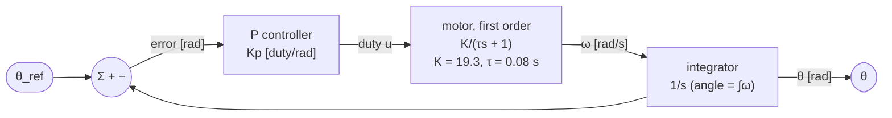

# FCT.02 — First- and second-order systems

<!-- glance:start -->
<!-- generated by tools/build.py from curriculum/syllabus.yaml — edit the syllabus, not this block -->

| | |
|---|---|
| **Track** | Optional foundation |
| **Difficulty** | Intermediate |
| **Time** | 1 h |
| **Hardware** | none |
| **Software** | python |
| **Prerequisites** | [FCT.01 Systems, signals and feedback — block diagrams](FCT.01-systems-signals-feedback.md) |
| **Optional prerequisites** | [FM.17 Calculus for robots: derivatives, rates and partial derivatives](../mathematics/FM.17-derivatives.md) |
| **Skip if** | You know time constants and damping ratios. |

<!-- glance:end -->

## What you will learn

- Recognize a first-order system from its step response and read its gain and time constant off a plot.
- Fit a time constant to noisy logged data with `scipy.optimize.curve_fit`, as you will for the real motor in 08.02.
- Explain why feedback makes a first-order loop faster, and compute the closed-loop time constant.
- Recognize a second-order system and relate its damping ratio ζ and natural frequency ω_n to overshoot, peak time and settling time.
- Choose a gain for a target damping on karmel's wheel-position loop, and predict what raising it does.

## Why it matters

Almost everything in a small robot behaves, to a useful approximation, like one of two shapes. A motor's speed after a duty step rises like a **first-order** system: fast at first, then easing into its final value. Put a proportional controller around the wheel's *angle*, a robot's heading, or a servo joint, and you get a **second-order** system that can overshoot and ring.

Lesson [08.02](../../08-control/08.02-motor-step-response.md) measures karmel's motor time constant. Lessons [08.04](../../08-control/08.04-proportional-control.md)–[08.08](../../08-control/08.08-tuning-pid.md) meet overshoot and oscillation experimentally. [08.11](../../08-control/08.11-rotate-exactly-90.md) turns karmel 90° without overshooting. This lesson gives you the two formulas that predict all of that: $\tau$ for first order, and $\zeta$ and $\omega_n$ for second order.

<!-- prereqs:start -->
## Prerequisites

You need these first:

- [FCT.01 Systems, signals and feedback — block diagrams](FCT.01-systems-signals-feedback.md)

### Optional prerequisite links

New to any of these? Take the foundation lesson first; skip it if you already know it.

- [FM.17 Calculus for robots: derivatives, rates and partial derivatives](../mathematics/FM.17-derivatives.md)

Check your readiness: `python course.py why FCT.02`
<!-- prereqs:end -->

## Concept

**First order: a bucket filling through a narrow pipe.** Command karmel's motor to a new duty. At first the speed rises quickly, because the gap between the current and final speed is large and so is the net torque. As the speed approaches its final value, the gap shrinks and so does the push. The curve eases in and never quite "arrives". One number describes how fast: the **time constant** τ, the time to cover 63.2% of the gap. After 3τ you are at 95%, after 4τ at 98%. Karmel's config says τ = 0.08 s, so the wheel is essentially at speed after a third of a second. First-order systems **never overshoot**.

The pattern is everywhere: a cup of coffee cooling, a capacitor charging, an exponentially smoothed metric ("EWMA") following a jump in latency. That last one *is* a first-order system; its smoothing factor sets τ.

**Second order: a mass on a spring with a damper.** Add a second "storage", position on top of velocity, and the system can overshoot. Picture an arm joint on a springy servo, or karmel told by a P controller to turn its wheel to an angle. The controller pushes towards the target in proportion to the remaining distance, like a spring. The motor's friction and back-EMF resist motion like a damper. With a weak spring and strong damper it creeps in without overshoot. With a strong spring it rushes, overshoots and rings before settling.

Two numbers describe it:
- **ω_n (natural frequency):** how fast it wants to move.
- **ζ (damping ratio):** how much it is held back. ζ ≥ 1 means no overshoot; ζ ≈ 0.7 means a small overshoot (about 5%) and is a popular compromise; ζ ≈ 0.2 rings noticeably.

> [!TIP]
> **Ask your teacher:** "Show me why a P controller on wheel *speed* gives a first-order loop, but a P controller on wheel *angle* gives a second-order loop."

## Technical explanation

### Level 1 — The first-order step response

A first-order system with gain $K$ and time constant $\tau$ obeys

$$\tau \frac{dy}{dt} + y = K u$$

In words: the rate of change is proportional to how far $y$ is from its target $Ku$. After a step of size $u_0$ at $t = 0$:

$$y(t) = K u_0 \left(1 - e^{-t/\tau}\right)$$

| Time | Fraction of final value |
|---|---|
| τ | 63.2% |
| 2τ | 86.5% |
| 3τ | 95.0% |
| 4τ | 98.2% |
| 5τ | 99.3% |

The initial slope is $K u_0/\tau$: if the system kept its starting rate, it would arrive in exactly τ. The 10–90% rise time is $\ln 9 \cdot \tau = 2.2\tau$.

*Karmel example:* duty 0.5, after the 0.12 deadband, gives an effective 0.432. With $K = 19.3$ rad/s per duty, the final speed is 8.34 rad/s. After τ = 0.08 s the wheel reaches $0.632 \times 8.34 = 5.27$ rad/s, and after 0.24 s it reaches 7.92 rad/s. The 10–90% rise time is 176 ms.

> [!NOTE]
> The derivative notation is explained in [FM.17 Derivatives](../mathematics/FM.17-derivatives.md). Here you only need "rate of change". [FCT.03](FCT.03-differential-equations-simulation.md) shows how to simulate such equations step by step.

### Level 2 — Fitting τ from a log, and closing a speed loop

**Fitting.** Logged step data is noisy and quantized, so fit the model instead of reading one point off the plot. Minimize the squared error between $K u_0(1 - e^{-(t-t_0)/\tau})$ and the samples over $K u_0$, $\tau$ and the step time $t_0$ ([FM.19](../mathematics/FM.19-linear-systems-least-squares.md) explains least squares). On the simulated 50 Hz log below, the fit recovers τ = 80.2 ms and a final speed of 8.34 rad/s.

It places the step at 0.110 s instead of 0.100 s. That 10 ms offset is not a bug in the fit: a speed computed from two samples 20 ms apart describes the *middle* of that interval. That half-sample delay reappears in [FCT.05](FCT.05-discrete-time-sampling.md).

**P speed loop.** Put a P controller around the first-order wheel, $u = K_p(r - y)$:

$$\tau \dot y + y = K K_p (r - y) \;\Rightarrow\; \frac{\tau}{1+L}\dot y + y = \frac{L}{1+L} r, \qquad L = K K_p$$

The closed loop is still first order, with **time constant $\tau/(1+L)$** and gain $L/(1+L)$. Feedback makes it faster and slightly less accurate ([FCT.01](FCT.01-systems-signals-feedback.md)).

*Example:* $K_p = 0.15$, $L = 2.90$: $\tau_{cl} = 0.08/3.90 = 20.5$ ms, reaching 74.3% of the setpoint.

On paper you could make it arbitrarily fast. In reality, delays and filters stop you ([FCT.04](FCT.04-stability-intuition.md)).

### Level 3 — The second-order system

The standard form, with natural frequency $\omega_n$ and damping ratio $\zeta$:

$$\ddot y + 2\zeta\omega_n \dot y + \omega_n^2 y = \omega_n^2 u$$

For $0 < \zeta < 1$ the step response overshoots and rings:

- **Overshoot:** $M_p = e^{-\zeta\pi/\sqrt{1-\zeta^2}}$ (e.g. ζ = 0.7 gives 4.6%, ζ = 0.5 gives 16.3%, ζ = 0.4 gives 25%).
- **Peak time:** $t_p = \dfrac{\pi}{\omega_n\sqrt{1-\zeta^2}}$.
- **Settling time (2%), approximately:** $t_s \approx \dfrac{4}{\zeta\omega_n}$.
- **Oscillation frequency while ringing:** $\omega_d = \omega_n\sqrt{1-\zeta^2}$.

**Karmel's wheel-angle loop.** The wheel speed is first order ($\tau\dot\omega + \omega = K u$), and angle is the integral of speed ($\dot\theta = \omega$). A P controller on angle, $u = K_p(\theta_r - \theta)$, gives

$$\tau\ddot\theta + \dot\theta + K K_p\,\theta = K K_p\,\theta_r$$

Divide by τ and match the standard form:

$$\omega_n = \sqrt{\frac{K K_p}{\tau}}, \qquad \zeta = \frac{1}{2\sqrt{\tau K K_p}}, \qquad \zeta\omega_n = \frac{1}{2\tau}$$

*Worked example, $K_p = 1.0$ duty per rad:*
- $\omega_n = \sqrt{19.3/0.08} = 15.54$ rad/s.
- $\zeta = 1/(2\sqrt{0.08 \times 19.3}) = 0.402$.
- Overshoot $e^{-0.402\pi/0.916} = 25.2\%$.
- Peak at $\pi/(15.54 \times 0.916) = 0.221$ s.

Command a 1 rad turn and the wheel swings to 1.25 rad at 0.22 s, then rings back.

**Design the other way:** for a target ζ, set $K_p = 1/(4\tau K \zeta^2)$.
- ζ = 1: $K_p = 0.162$, no overshoot, slow.
- ζ = 0.7: $K_p = 0.330$, 4.6% overshoot.
- ζ = 0.5: $K_p = 0.647$, 16.3% overshoot, peak at 0.290 s.

### Level 4 — What the formulas tell you about tuning

Look at $\zeta\omega_n = 1/(2\tau)$: for this loop it **does not depend on $K_p$**. The decay envelope of the ringing is fixed by the motor. Raising the gain makes the response faster to *first reach* the target, but increases overshoot, and **does not settle it sooner**. The simulation settles in 0.54 s at $K_p = 1$ and 0.62 s at $K_p = 3$.

To settle faster you need more damping. That is the derivative term ([08.06](../../08-control/08.06-derivative-control.md)), or a faster inner speed loop (cascade, [08.10](../../08-control/08.10-straight-line-heading-control.md)). This is the mathematical reason behind the experiments in module 08.

The same structure appears in:
- **Heading control** (08.10–08.11): yaw rate is roughly first order in wheel-speed difference, and heading is its integral.
- **Arm joints with position servos** (14.03): a high gain rings visibly when the arm carries a load.
- **Suspension, cable sag, a camera on a flexible mast:** mechanical springs and dampers.

## Diagram

The two shapes and what sets them:

```text
 first order (speed after a duty step)          second order (angle under P control)
 y                                               y
 1.00 ┤            ___________________          1.25 ┤     ╭╮  ← overshoot Mp = e^(−ζπ/√(1−ζ²))
 0.95 ┤      ___---                              1.00 ┤───/──╲──╭──────────  ±2 % band
 0.63 ┤   _-´ ← 63.2 % at t = τ                       │  /    ╰─╯
      │  /                                            │ /   ← peak at tp = π/(ωn√(1−ζ²))
      │ /  initial slope K·u0/τ                       │/
 0.00 ┼/──┬─────┬─────┬─────► t                  0.00 ┼──────────────────► t
      0   τ    3τ    4τ                                 settles ≈ 4/(ζωn)
       no overshoot, ever                               ζ ≥ 1: no overshoot   ζ ≈ 0.7: ~5 %
```

How karmel's second-order angle loop is built from a first-order motor and an integrator:



## Code

Save as `fct02_orders.py` and run `python fct02_orders.py` (needs `numpy`, `scipy`, `matplotlib`). It prints the first-order milestones, simulates the kind of encoder log 08.02 records, and fits τ to it. It then computes closed-loop time constants for a P speed loop and, for the wheel-angle loop at four gains, compares the overshoot formula with a `scipy.signal` step response.

```python
"""FCT.02 — first-order wheel speed and second-order wheel position on karmel.

Run: python fct02_orders.py   (needs numpy, scipy, matplotlib)
"""
from __future__ import annotations

import math

import matplotlib

matplotlib.use("Agg")
import matplotlib.pyplot as plt
import numpy as np
from scipy import signal
from scipy.optimize import curve_fit

K = 17.0 / 0.88      # rad/s per unit duty above the deadband (karmel.yaml)
TAU = 0.08           # s, motor time constant (karmel.yaml)
TICK_RAD = 2 * math.pi / 2464


def first_order_step(t: np.ndarray, gain: float, tau: float, t0: float) -> np.ndarray:
    return np.where(t < t0, 0.0, gain * (1.0 - np.exp(-(t - t0) / tau)))


def fake_step_log(duty: float = 0.5, fs: float = 50.0, seed: int = 3):
    """What 08.02 records: a duty step at t0 = 0.1 s, speed from encoder ticks at 50 Hz."""
    rng = np.random.default_rng(seed)
    t = np.arange(0.0, 1.0, 1 / fs)
    effective = (duty - 0.12) / 0.88                           # the deadband eats the first 12 %
    fine_t = np.arange(0.0, 1.0 + 1e-4, 1e-4)
    angle = np.cumsum(first_order_step(fine_t, K * effective, TAU, 0.1)) * 1e-4
    angle = angle + rng.normal(0.0, 0.3 * TICK_RAD, angle.size)  # encoder edge jitter
    ticks = np.floor(np.interp(t, fine_t, angle) / TICK_RAD)
    speed = np.diff(ticks, prepend=ticks[0]) * TICK_RAD * fs   # backward difference, like the firmware
    return t, speed, K * effective


def second_order_metrics(kp: float) -> dict[str, float]:
    """P control of wheel ANGLE: tau*θ'' + θ' = K*u, u = kp*(θ_ref - θ)."""
    wn = math.sqrt(K * kp / TAU)
    zeta = 1.0 / (2.0 * math.sqrt(TAU * K * kp))
    sys = signal.lti([K * kp / TAU], [1.0, 1.0 / TAU, K * kp / TAU])
    t = np.linspace(0, 1.5, 15001)
    _, y = sys.step(T=t)
    overshoot = max(0.0, y.max() - 1.0) * 100
    outside = np.where(np.abs(y - 1.0) > 0.02)[0]
    settle = t[outside[-1] + 1] if outside.size else 0.0
    formula_os = 100 * math.exp(-zeta * math.pi / math.sqrt(1 - zeta**2)) if zeta < 1 else 0.0
    t_peak = math.pi / (wn * math.sqrt(1 - zeta**2)) if zeta < 1 else float("nan")
    return {"kp": kp, "wn": wn, "zeta": zeta, "os_formula": formula_os, "os_sim": overshoot,
            "t_peak": t_peak, "settle_2pct": settle, "t": t, "y": y}


def main() -> None:
    print("first-order step: fraction of final value reached")
    for n in (1, 2, 3, 4, 5):
        print(f"  t = {n} tau = {n * TAU:.2f} s: {100 * (1 - math.exp(-n)):.1f} %")
    print(f"  10-90 % rise time = ln(9) tau = {math.log(9) * TAU * 1000:.0f} ms")

    t, speed, true_final = fake_step_log()
    (gain, tau, t0), _ = curve_fit(first_order_step, t, speed, p0=[5.0, 0.05, 0.08])
    print(f"fit of a noisy 50 Hz log (duty 0.5): final {gain:.2f} rad/s (true {true_final:.2f}), "
          f"tau {tau * 1000:.1f} ms (true 80.0), step at {t0:.3f} s (true 0.100)")

    for kp in (0.05, 0.15):
        L = K * kp
        print(f"P speed loop kp={kp}: closed-loop tau = {TAU / (1 + L) * 1000:.1f} ms, "
              f"reaches {L / (1 + L) * 100:.1f} % of the setpoint")

    print("\nP position loop (wheel angle): kp [duty/rad] -> wn, zeta, overshoot, peak time, 2 % settling")
    results = []
    for kp in (1 / (4 * TAU * K), 1 / (4 * TAU * K * 0.7**2), 1.0, 3.0):
        m = second_order_metrics(kp)
        results.append(m)
        print(f"  kp={kp:5.3f}: wn={m['wn']:5.2f} rad/s  zeta={m['zeta']:.3f}  overshoot {m['os_formula']:4.1f} % "
              f"(sim {m['os_sim']:4.1f} %)  t_peak {m['t_peak']:.3f} s  settle {m['settle_2pct']:.3f} s")

    fig, ax = plt.subplots(1, 2, figsize=(11, 4))
    ax[0].plot(t, speed, ".", label="50 Hz encoder speed")
    tt = np.linspace(0, 1, 500)
    ax[0].plot(tt, first_order_step(tt, gain, tau, t0), label=f"fit: {gain:.2f}·(1−e^(−t/{tau * 1000:.0f} ms))")
    ax[0].axvline(t0 + tau, color="grey", ls=":", label="t0 + τ (63.2 %)")
    ax[0].set_xlabel("time [s]")
    ax[0].set_ylabel("wheel speed [rad/s]")
    ax[0].legend()
    ax[0].grid(True)
    for m in results:
        ax[1].plot(m["t"], m["y"], label=f"Kp={m['kp']:.3f}, ζ={m['zeta']:.2f}")
    ax[1].axhline(1.0, color="k", lw=0.8)
    ax[1].set_xlabel("time [s]")
    ax[1].set_ylabel("wheel angle / target")
    ax[1].legend()
    ax[1].grid(True)
    fig.tight_layout()
    fig.savefig("fct02_orders.png", dpi=120)
    print("saved fct02_orders.png")


if __name__ == "__main__":
    main()
```

Output:

```text
first-order step: fraction of final value reached
  t = 1 tau = 0.08 s: 63.2 %
  t = 2 tau = 0.16 s: 86.5 %
  t = 3 tau = 0.24 s: 95.0 %
  t = 4 tau = 0.32 s: 98.2 %
  t = 5 tau = 0.40 s: 99.3 %
  10-90 % rise time = ln(9) tau = 176 ms
fit of a noisy 50 Hz log (duty 0.5): final 8.34 rad/s (true 8.34), tau 80.2 ms (true 80.0), step at 0.110 s (true 0.100)
P speed loop kp=0.05: closed-loop tau = 40.7 ms, reaches 49.1 % of the setpoint
P speed loop kp=0.15: closed-loop tau = 20.5 ms, reaches 74.3 % of the setpoint

P position loop (wheel angle): kp [duty/rad] -> wn, zeta, overshoot, peak time, 2 % settling
  kp=0.162: wn= 6.25 rad/s  zeta=1.000  overshoot  0.0 % (sim  0.0 %)  t_peak nan s  settle 0.933 s
  kp=0.330: wn= 8.93 rad/s  zeta=0.700  overshoot  4.6 % (sim  4.6 %)  t_peak 0.493 s  settle 0.670 s
  kp=1.000: wn=15.54 rad/s  zeta=0.402  overshoot 25.2 % (sim 25.2 %)  t_peak 0.221 s  settle 0.541 s
  kp=3.000: wn=26.92 rad/s  zeta=0.232  overshoot 47.2 % (sim 47.2 %)  t_peak 0.120 s  settle 0.622 s
saved fct02_orders.png
```

**The plot `fct02_orders.png`** has two panels.

- **Left:** 50 Hz speed samples (dots) rise from 0 after t ≈ 0.1 s to about 8.3 rad/s with small quantization scatter. The fitted exponential passes through them, and a dotted vertical line at t0 + τ ≈ 0.19 s marks where the curve crosses 63% (about 5.3 rad/s).
- **Right:** four step responses of wheel angle against target over 1.5 s.
  - ζ = 1.00 creeps up and reaches 0.98 at about 0.9 s.
  - ζ = 0.70 has a gentle 4.6% bump around 0.5 s.
  - ζ = 0.40 peaks at 1.25 at 0.22 s and rings once.
  - ζ = 0.23 shoots to 1.47 at 0.12 s and rings several times.

The last two decay inside the same envelope.

## Exercise

### Exercise FCT.02-E1 — First-order numbers `[numerical]`

Hardware: none. A different gear motor has τ = 0.12 s and settles at 10 rad/s after a duty step.

1. When does it reach 95%?
2. What speed does it have 0.1 s after the step?
3. A P speed loop around it has loop gain $L = 4$. What is the closed-loop time constant, and what fraction of the setpoint does it reach?

### Exercise FCT.02-E2 — Design for ζ = 0.5 `[numerical]`

Hardware: none. For karmel's wheel-angle loop ($K = 19.3$, τ = 0.08 s), compute the $K_p$ that gives ζ = 0.5. Then compute ω_n, overshoot, peak time and the approximate 2% settling time. Check them with `second_order_metrics`.

### Exercise FCT.02-E3 — Fit at two sample rates `[coding]`

Hardware: none. Call `fake_step_log(duty=0.8, fs=200.0, seed=7)` and `fake_step_log(duty=0.8, fs=50.0, seed=7)`. Fit both with `curve_fit`. Report the final speed, τ and the step time $t_0$. Explain the difference in $t_0$ using the half-sample delay of a backward-difference speed estimate.

### Exercise FCT.02-E4 — Predict: more gain `[predict]`

Hardware: none. Karmel's wheel-angle loop runs at $K_p = 1.0$. You triple it to 3.0. Before running anything, predict whether each of these goes up, down or stays the same: (a) overshoot, (b) time to first peak, (c) 2% settling time, (d) the frequency of the ringing. Then check with the script output.

### Exercise FCT.02-E5 — Measure your motor (optional) `[hardware]`

Hardware: `robot-base`. No-hardware alternative: E3.

> [!CAUTION]
> **Safety:** Wheels in the air on a stand, fingers and cables clear, watchdog on, hand on the power switch.

Follow [08.02](../../08-control/08.02-motor-step-response.md) to log a duty step from 0 to 0.5 at 50 Hz. Fit the first-order model with this lesson's code, and put your τ into `karmel.yaml`.

## Expected result

**FCT.02-E1:**
1. 3τ = **0.36 s**.
2. 10 × (1 − e^(−0.1/0.12)) = **5.65 rad/s**.
3. τ_cl = 0.12/5 = **24 ms**, reaching 4/5 = **80%** of the setpoint.

**FCT.02-E2:**
- $K_p = 1/(4 \times 0.08 \times 19.3 \times 0.25) = $ **0.647** duty per rad.
- ω_n = **12.5 rad/s**, overshoot **16.3%**, peak at **0.290 s**.
- Settling ≈ 4/(0.5 × 12.5) = **0.64 s**; the simulation gives 0.646 s.

**FCT.02-E3:**
- **200 Hz:** final 14.92 rad/s (true 14.93), τ ≈ 79.4 ms, $t_0$ ≈ 0.103 s.
- **50 Hz:** final 14.92 rad/s, τ ≈ 79.4 ms, $t_0$ ≈ 0.111 s.

A backward difference over one sample period T reports the average speed over that period, which lags by T/2: 2.5 ms at 200 Hz, 10 ms at 50 Hz. Allow ±3 ms for noise.

**FCT.02-E4:**
- (a) Overshoot goes **up**: 25.2% → 47.2%.
- (b) Time to first peak goes **down**: 0.221 s → 0.120 s.
- (c) Settling time **does not improve**: 0.54 s → 0.62 s, because ζω_n = 1/(2τ) = 6.25 s⁻¹ is fixed.
- (d) Ringing frequency goes **up**: ω_d = 14.2 → 26.2 rad/s.

**FCT.02-E5:** Expect τ between 0.05 and 0.12 s for a Yahboom 520 1:56 with the wheel in the air. The fitted curve should pass through the samples with a residual scatter about the size of one tick-per-sample step, 0.13 rad/s at 50 Hz. The two wheels' τ values typically differ by 10–20%.

## Troubleshooting

### Symptom: the fitted τ changes a lot between runs
1. Check the sample rate. At 50 Hz with τ = 0.08 s there are only four samples on the rising edge. Log at 100–200 Hz, or repeat the step five times and fit all runs.
2. Fit $t_0$ as a free parameter, or trigger logging on the command. An uncertain step time trades off directly against τ.
3. Exclude the deadband: step from a duty already above 0.12 (for example 0.2 → 0.6) and fit the change.

### Symptom: the measured response overshoots, although a motor "should" be first order
1. Is the loop already closed? A PID on the Pico makes the response second order or higher. Measure open loop with duty commands (`M`, not `V`).
2. A heavy speed filter plus control creates overshoot. Log the raw tick-based speed.
3. Mechanical compliance: a loose hub or a rubber coupling can ring. Tighten it and repeat.

### Symptom: overshoot does not match the formula
1. The formula assumes an exact second-order system. Added lags (filters, delay, sampling) add overshoot. Compare against a simulation that includes them ([FCT.04](FCT.04-stability-intuition.md)).
2. Saturation: if the duty hits ±1 during the move, the response is slower and differently shaped. Use a smaller step to stay linear.

## Common mistakes

- **Reading τ from the 50% point.** τ is the 63.2% point; 50% is at 0.69τ.
- **Fitting without removing the deadband and step time.** Both bias τ.
- **Expecting more P gain to settle a second-order loop faster.** For karmel's angle loop, the ringing envelope is fixed by the motor; more gain only means more overshoot.
- **Calling any overshoot "instability".** A decaying ring is stable but underdamped. Instability means growing oscillation ([FCT.04](FCT.04-stability-intuition.md)).
- **Forgetting that a closed speed loop is also first order,** just faster. Its τ_cl is what the next loop out sees.

## Knowledge check

1. A first-order system settles at 6 rad/s. What does it read after 2τ?
   <details><summary>Answer</summary>

   6 × 0.865 = **5.19 rad/s**.
   </details>

2. Why can a first-order system never overshoot?
   <details><summary>Answer</summary>

   Its rate of change is proportional to the remaining gap, so it slows down as it approaches and reaches zero rate exactly at the target. It has only one energy storage (for example rotor speed) and nothing that can carry it past the target.
   </details>

3. What damping ratio gives about 5% overshoot, and what is the overshoot at ζ = 0.4?
   <details><summary>Answer</summary>

   ζ ≈ **0.7** (4.6%). At ζ = 0.4: e^(−0.4π/√0.84) = **25%**.
   </details>

4. For karmel's wheel-angle P loop, what $K_p$ gives critical damping (ζ = 1)?
   <details><summary>Answer</summary>

   K_p = 1/(4τK) = 1/(4 × 0.08 × 19.3) = **0.162** duty per rad.
   </details>

5. Predict: you replace the motor with one whose τ is half as large (0.04 s), same K, same $K_p = 1$. What happens to ζ and to the settling time?
   <details><summary>Answer</summary>

   ζ = 1/(2√(τKK_p)) rises by √2, from 0.40 to 0.57. ζω_n = 1/(2τ) doubles to 12.5 s⁻¹, so settling time roughly halves, to about 0.32 s. A faster motor gives a better-damped, faster-settling position loop.
   </details>

6. Debugging: your logged "step response" of a wheel rises to 12 rad/s, dips to 9, and settles at 10. You think the motor is second order. What should you check first?
   <details><summary>Answer</summary>

   Whether you actually measured open loop. The Pico's velocity PID may have been active (a `V` command), or a filter plus control made it underdamped. Repeat with an open-loop duty step (`M`) and raw speed.
   </details>

7. A P speed loop has plant τ = 0.08 s and loop gain 2.9. What time constant does an outer heading loop "see" for this inner loop?
   <details><summary>Answer</summary>

   τ/(1 + L) = 0.08/3.9 = **20.5 ms**, if you ignore delays and filters.
   </details>

## Practical challenge

Write `fit_step.py`, a command-line tool that reads a CSV step log (`t, command, speed`) as produced in [03.07](../../03-robot-software/03.07-logging-and-telemetry.md) and [08.02](../../08-control/08.02-motor-step-response.md). It detects the step automatically, removes the deadband, and fits $K$ (rad/s per duty above the deadband), τ and $t_0$. It reports 95% confidence intervals from `curve_fit`'s covariance and saves a plot with the fit.

**Acceptance criteria:**
- On three simulated logs (`fake_step_log` with seeds 1, 2 and 3, 50 Hz, duty 0.5) it recovers τ within ±5 ms of 80 ms and $K$ within ±3% of 19.3.
- It warns when fewer than 5 samples lie on the rising edge (between $t_0$ and $t_0 + 3\tau$).
- It prints the ζ and $K_p$ for a ζ = 0.7 wheel-angle loop using the fitted values.
- It has pytest tests with a noise-free synthetic log, where it must recover the exact values to 1%.

## You can skip this if…

You get knowledge-check questions 4, 5 and 6 right without looking, and you can read τ, ζ and ω_n off step responses and relate them to overshoot and settling.

`python course.py skip FCT.02 --reason "I know time constants and damping ratios"`

## Go deeper

- [Feedback Systems, 2nd ed. (Åström & Murray)](https://www.cds.caltech.edu/~murray/FBS/Second_Edition.html): chapter 6, "Linear Systems", covers first- and second-order step responses and the overshoot and settling formulas.
- [Brian Douglas, Control System Lectures: Classical Control Theory](https://www.youtube.com/playlist?list=PLUMWjy5jgHK1NC52DXXrriwihVrYZKqjk): lectures on time-domain specifications and second-order systems, with good sketches.
- [SciPy signal reference](https://docs.scipy.org/doc/scipy/reference/signal.html): `lti`, `step` and `lsim` for simulating these systems.
- [MATLAB Tech Talks, Understanding PID Control (Brian Douglas)](https://www.youtube.com/playlist?list=PLn8PRpmsu08pQBgjxYFXSsODEF3Jqmm-y): connects the second-order picture to P, I and D experiments in module 08.

## Progress checkpoint

- [ ] I read gain and τ from a first-order step response and fit τ from noisy data.
- [ ] I compute the closed-loop time constant of a P speed loop.
- [ ] I relate ζ and ω_n to overshoot, peak time and settling time.
- [ ] I can design $K_p$ for a target damping on karmel's wheel-angle loop and predict the effect of more gain.

`python course.py complete FCT.02` (exercises done) · `python course.py master FCT.02` (challenge done) · `python course.py struggle FCT.02 "what was hard"`

Next: [FCT.03 — Differential equations just enough](FCT.03-differential-equations-simulation.md).
