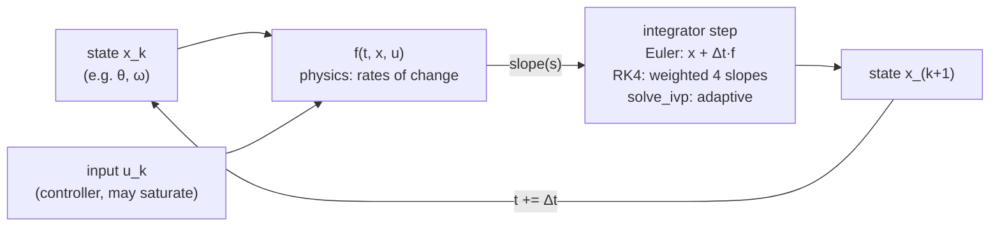

# FCT.03 — Differential equations just enough — simulate them numerically

<!-- glance:start -->
<!-- generated by tools/build.py from curriculum/syllabus.yaml — edit the syllabus, not this block -->

| | |
|---|---|
| **Track** | Optional foundation |
| **Difficulty** | Intermediate |
| **Time** | 50 min |
| **Hardware** | none |
| **Software** | python |
| **Prerequisites** | [FCT.02 First- and second-order systems](FCT.02-first-second-order-systems.md) |
| **Optional prerequisites** | [FM.18 Integrals and numerical integration (how simulators move time forward)](../mathematics/FM.18-integrals-numerical-integration.md) |
| **Skip if** | You simulate ODEs numerically. |

<!-- glance:end -->

## What you will learn

- Read an ordinary differential equation (ODE) as "the state's rate of change as a function of the state and the input".
- Turn higher-order equations into a first-order **state-space** form with state variables.
- Simulate ODEs with forward Euler, RK4 and `scipy.integrate.solve_ivp`, and choose a step size that is accurate and stable.
- Add the nonlinearities that linear formulas ignore, such as deadband and saturation, and see what they change.
- Recognize a *stiff* system and pick an implicit solver for it.

## Why it matters

Formulas like "overshoot = 25%" ([FCT.02](FCT.02-first-second-order-systems.md)) only hold for idealized linear systems. Karmel's motor has a deadband, a duty cycle that saturates at 100%, a battery that sags, and a controller that runs in discrete steps. The practical way to answer "what will it actually do?" is to write the physics as ODEs and **simulate** them.

That is what the course mini-simulator does ([06.02](../../06-simulation/06.02-course-mini-simulator.md), `labs/python/robotlab/sim`), what Gazebo does at a larger scale, and what you will do to test controllers before risking hardware in module [08](../../08-control/08.07-pid-mathematics.md). Integration also appears in dead reckoning ([09.03](../../09-odometry/09.03-dead-reckoning-integration.md)), where the same step-size trade-offs show up as odometry error.

<!-- prereqs:start -->
## Prerequisites

You need these first:

- [FCT.02 First- and second-order systems](FCT.02-first-second-order-systems.md)

### Optional prerequisite links

New to any of these? Take the foundation lesson first; skip it if you already know it.

- [FM.18 Integrals and numerical integration (how simulators move time forward)](../mathematics/FM.18-integrals-numerical-integration.md)

Check your readiness: `python course.py why FCT.03`
<!-- prereqs:end -->

## Concept

A differential equation does not tell you *where* a system is. It tells you **how fast it is changing right now**, given where it is and what you are doing to it:

> "The wheel speed changes at a rate proportional to how far it is from the speed this duty would eventually give."

That sentence *is* the first-order motor model. To get the actual trajectory, start from a known state and repeatedly take a small time step: look at the current rate, move a little in that direction, look again. That is **numerical integration**, and it is how every simulator moves time forward ([FM.18](../mathematics/FM.18-integrals-numerical-integration.md)). You already do it when you update a counter with `count += rate * dt` in a loop.

The **state** is the smallest set of numbers that, together with future inputs, determines the future. For a spinning wheel it is the speed. For a wheel under position control it is angle *and* speed, because angle alone does not tell you whether it is about to overshoot. For a robot on the floor it is x, y and heading. Choosing the state is like choosing which fields an event-sourced aggregate must store to replay the future from any point.

Two things can go wrong. With a step that is too big, **Euler's method** overshoots its own target, like a controller with too much gain: the simulation oscillates or explodes although the physics is perfectly calm. And some systems mix a very fast process with a slow one, such as a motor's current (milliseconds) and its speed (tenths of a second). Those are **stiff**: a simple method needs tiny steps for the fast part even when you only care about the slow part. Better methods (RK4, adaptive and implicit solvers) handle both.

> [!TIP]
> **Ask your teacher:** "Show me forward Euler going unstable on a first-order system with one number: the factor (1 − dt/τ). Why does the simulation oscillate even though the real motor never does?"

## Technical explanation

### Level 1 — ODEs as code

A first-order ODE for state $x$ and input $u$:

$$\dot x = f(x, u, t)$$

Karmel's wheel: $\dot\omega = \dfrac{K u - \omega}{\tau}$. In Python, `f(t, x)` returns the derivative:

```python
def f(t, x):              # x = [w]
    return np.array([(K * duty(t) - x[0]) / TAU])
```

**Forward Euler** steps with the slope at the start of the step:

$$x_{k+1} = x_k + \Delta t\, f(x_k, u_k, t_k)$$

*Numerical example:* $K = 19.3$, τ = 0.08 s, duty 0.5, so the target is 9.66 rad/s, and $\Delta t$ = 0.02 s. From ω = 0:
- Step 1: $0 + 0.02 \times (9.66 - 0)/0.08 = 2.41$.
- Step 2: $2.41 + 0.25 \times (9.66 - 2.41) = 4.23$.
- The exact solution at 0.04 s is $9.66(1 - e^{-0.5}) = 3.80$. Euler runs ahead, and the error shrinks as $\Delta t$ shrinks.

### Level 2 — Accuracy and stability of the step

For the linear wheel, one Euler step is

$$\omega_{k+1} - \omega_\infty = \left(1 - \frac{\Delta t}{\tau}\right)(\omega_k - \omega_\infty)$$

The gap to the target is multiplied by $a = 1 - \Delta t/\tau$ every step:

| Δt (τ = 0.08 s) | factor $a$ | behaviour | ω(0.4 s), exact 9.594 |
|---|---|---|---|
| 0.005 s | +0.938 | smooth, 0.1% error | 9.604 |
| 0.020 s | +0.750 | smooth, 0.4% error | 9.629 |
| 0.100 s | −0.250 | **alternates sign**, a numerical oscillation | 9.621 |
| 0.200 s | −1.500 | **diverges** | −12.07 |

**Stability rule for Euler:** $|1 - \Delta t/\tau| < 1$, which means $\Delta t < 2\tau$. For no artificial oscillation, $\Delta t < \tau$. For about 1% accuracy, $\Delta t \lesssim \tau/10$.

**RK4** evaluates the slope four times per step (start, two midpoints, end) and combines them. Its error falls as $\Delta t^4$: at Δt = 0.02 s it matches the exact 9.5940 to four decimals. It is stable to about $\Delta t < 2.8\tau$ on this problem: at 0.1 s it is still close (9.573), and at 0.2 s it is inaccurate (5.60) but no longer explodes.

**`solve_ivp`** (default RK45) chooses its own steps to meet a tolerance. It is the right default for offline analysis. Use a fixed-step method when the simulation must run in lockstep with a controller, as the course simulator does.

> [!NOTE]
> The *exact* discrete update for a first-order system, $\omega_{k+1} = \omega_\infty + e^{-\Delta t/\tau}(\omega_k - \omega_\infty)$, is stable for any Δt. `robotlab.sim` uses it (`first_order_alpha` in `labs/python/robotlab/sim/components.py`), and [FCT.05](FCT.05-discrete-time-sampling.md) explains why.

### Level 3 — State variables for higher-order systems

Solvers want first-order systems. Any $n$-th order ODE becomes $n$ first-order ones by naming the derivatives as states.

**Karmel's wheel-angle P loop** (FCT.02): $\tau\ddot\theta + \dot\theta = K u$ with $u = K_p(\theta_r - \theta)$. Choose $x = [\theta,\ \omega]$:

$$\dot x = \begin{bmatrix}\omega \\ \dfrac{K\,\mathrm{sat}(K_p(\theta_r - \theta)) - \omega}{\tau}\end{bmatrix}$$

The saturation `sat` clips the duty to ±1. The linear formula cannot contain it, but the simulation includes it with one line. With a 3 rad target and $K_p = 1$, the unsaturated model overshoots 25.2%. With saturation the duty is pinned at 1 for the first part of the move, and the overshoot drops to 15.4%. Adding the deadband makes the wheel stop anywhere within ±0.12 rad of the target, because a P command smaller than 0.12 does nothing. That is a steady-state error no linear analysis predicts, and one reason integral action exists ([08.05](../../08-control/08.05-integral-control.md)).

**A robot's pose** is a nonlinear state-space system (unicycle model, [09.01](../../09-odometry/09.01-diff-drive-kinematics.md)):

$$\dot x = v\cos\theta,\qquad \dot y = v\sin\theta,\qquad \dot\theta = \omega$$

### Level 4 — Stiff systems: the motor's current

The full brushed-DC motor model has two states, current $i$ and speed ω (referred to the gearbox output):

$$L\frac{di}{dt} = V - R i - k_e\omega, \qquad J\frac{d\omega}{dt} = k_t i$$

With the FP.05/FP.06 numbers ($R = 3.0\ \Omega$, $k_e = 0.559$ V·s/rad, $k_t = 0.2035$ N·m/A, $J = 3.03\times10^{-3}$ kg·m²) and an **assumed** $L = 2$ mH (not on the datasheet), the linear system's eigenvalues are about −1487 and −12.6 s⁻¹. That means two time constants: **0.67 ms** for current and **79 ms** for speed. [FCT.04](FCT.04-stability-intuition.md) explains eigenvalues as "poles".

Euler must respect the *fastest* one: stable only if $\Delta t < 2/1487 = 1.34$ ms. At 1.0 ms it works. At 1.5 ms it explodes to $10^{29}$. An adaptive explicit solver (RK45) survives by taking many small steps (1676 evaluations over 0.5 s). The implicit solver `Radau` handles stiffness and needs 782. When you see `solve_ivp` crawling, try `method="Radau"` or `"BDF"`.

The engineering shortcut: when you only care about speed, **drop the fast state**. Setting $L = 0$ makes current algebraic, $i = (V - k_e\omega)/R$, and gives back the first-order model with $\tau = JR/(k_t k_e) = 0.08$ s. Model reduction like this is how karmel's "first-order motor" is justified.

## Diagram

The simulation loop every integrator shares:



Why a too-large Euler step oscillates (gap to the target multiplied by 1 − Δt/τ each step):

```text
 ω
 target ┤─────────────────────────────────────────────
        │        ●               ●                      Δt = 0.1 s = 1.25 τ
        │    exact                                      factor −0.25: jumps past the
        │   ___-----                                    target, then back, shrinking
        │  /             ●                ●
        │ /
 0      ●──────────────────────────────────────────► t
        Δt = 0.2 s = 2.5 τ: factor −1.5 → each jump 1.5× larger → diverges
```

## Code

Save as `fct03_ode.py` and run `python fct03_ode.py` (needs `numpy`, `scipy`, `matplotlib`). It compares Euler, RK4 and `solve_ivp` on the wheel, simulates a duty ramp with and without deadband and saturation, and solves the stiff two-state motor with explicit and implicit solvers.

```python
"""FCT.03 — simulate karmel's motor ODEs: Euler, RK4, solve_ivp, nonlinearities and stiffness.

Run: python fct03_ode.py   (needs numpy, scipy, matplotlib)
"""
from __future__ import annotations

import math
from collections.abc import Callable

import matplotlib

matplotlib.use("Agg")
import matplotlib.pyplot as plt
import numpy as np
from scipy.integrate import solve_ivp

K, TAU, DEADBAND, W_MAX = 17.0 / 0.88, 0.08, 0.12, 17.0
State = np.ndarray
Deriv = Callable[[float, State], State]


def euler(f: Deriv, x0: State, dt: float, t_end: float) -> tuple[np.ndarray, np.ndarray]:
    n = int(round(t_end / dt))
    xs = [np.asarray(x0, dtype=float)]
    for k in range(n):
        xs.append(xs[-1] + dt * f(k * dt, xs[-1]))
    return np.arange(n + 1) * dt, np.array(xs)


def rk4(f: Deriv, x0: State, dt: float, t_end: float) -> tuple[np.ndarray, np.ndarray]:
    n = int(round(t_end / dt))
    xs = [np.asarray(x0, dtype=float)]
    for k in range(n):
        t, x = k * dt, xs[-1]
        k1 = f(t, x)
        k2 = f(t + dt / 2, x + dt / 2 * k1)
        k3 = f(t + dt / 2, x + dt / 2 * k2)
        k4 = f(t + dt, x + dt * k3)
        xs.append(x + dt / 6 * (k1 + 2 * k2 + 2 * k3 + k4))
    return np.arange(n + 1) * dt, np.array(xs)


def linear_wheel(duty: Callable[[float], float]) -> Deriv:
    """tau * dw/dt = -w + K * u   (state x = [w])"""
    return lambda t, x: np.array([(-x[0] + K * duty(t)) / TAU])


def nonlinear_wheel(duty: Callable[[float], float]) -> Deriv:
    """Same motor, but with the deadband and saturation of labs/python/robotlab/sim."""
    def f(t: float, x: State) -> State:
        u = max(-1.0, min(1.0, duty(t)))
        target = math.copysign(max(abs(u) - DEADBAND, 0.0) / (1 - DEADBAND) * W_MAX, u)
        return np.array([(target - x[0]) / TAU])
    return f


def dc_motor(volts: float, L: float = 2e-3) -> Deriv:
    """Electrical + mechanical motor, referred to the gearbox output. State x = [current A, speed rad/s].

    L di/dt = V - R i - k_e w        J dw/dt = k_t i
    R, k_e, k_t from the Yahboom 520 1:56 datasheet (FP.05); J from tau = 0.08 s (FP.06); L assumed.
    """
    R, k_e, k_t, J = 3.0, 12.0 / (205 * 2 * math.pi / 60), 8.3 * 0.0980665 / 4.0, 3.03e-3
    A = np.array([[-R / L, -k_e / L], [k_t / J, 0.0]])
    b = np.array([volts / L, 0.0])
    return lambda t, x: A @ x + b


def main() -> None:
    step = lambda t: 0.5                                  # noqa: E731  (duty step at t = 0)
    final = K * 0.5
    exact = lambda t: final * (1 - math.exp(-t / TAU))    # noqa: E731
    print(f"linear wheel, duty step 0.5, exact w(0.4 s) = {exact(0.4):.4f} rad/s")
    for dt in (0.005, 0.02, 0.1, 0.2):
        _, xe = euler(linear_wheel(step), [0.0], dt, 0.4)
        _, xr = rk4(linear_wheel(step), [0.0], dt, 0.4)
        print(f"  dt={dt:5.3f} s  factor (1 - dt/tau) = {1 - dt / TAU:+.3f}  "
              f"Euler {xe[-1, 0]:9.4f}  RK4 {xr[-1, 0]:9.4f}")

    sol = solve_ivp(linear_wheel(step), (0, 0.4), [0.0], rtol=1e-8, atol=1e-10)
    print(f"  solve_ivp RK45: {sol.y[0, -1]:.4f} rad/s with {sol.nfev} function evaluations")

    ramp = lambda t: min(t / 2.0, 1.0)                    # noqa: E731  duty ramps 0 -> 1 in 2 s
    t_eval = np.linspace(0, 2.5, 2501)
    lin = solve_ivp(linear_wheel(ramp), (0, 2.5), [0.0], t_eval=t_eval, max_step=0.01)
    non = solve_ivp(nonlinear_wheel(ramp), (0, 2.5), [0.0], t_eval=t_eval, max_step=0.01)
    start = t_eval[np.argmax(non.y[0] > 0.05)]
    print(f"duty ramp: nonlinear wheel starts turning at t = {start:.2f} s; "
          f"at t = 2.5 s linear {lin.y[0, -1]:.2f} rad/s vs nonlinear {non.y[0, -1]:.2f} rad/s")

    motor = dc_motor(10.8)   # labs/config/karmel.yaml: battery.nominal_v
    A = np.array([[-3.0 / 2e-3, -0.559 / 2e-3], [0.2035 / 3.03e-3, 0.0]])
    print(f"DC motor eigenvalues (approx.): {np.round(np.linalg.eigvals(A), 1)} 1/s")
    for method in ("RK45", "Radau"):
        s = solve_ivp(motor, (0, 0.5), [0.0, 0.0], method=method, rtol=1e-6, atol=1e-8)
        print(f"  {method:5s}: w(0.5 s) = {s.y[1, -1]:.3f} rad/s, peak current {s.y[0].max():.2f} A, nfev {s.nfev}")
    for dt in (0.001, 0.0015):
        _, xe = euler(motor, [0.0, 0.0], dt, 0.5)
        print(f"  Euler dt={dt * 1000:.1f} ms: w(0.5 s) = {xe[-1, 1]:.4g} rad/s")

    fig, ax = plt.subplots(1, 3, figsize=(13, 3.8))
    tt = np.linspace(0, 0.4, 200)
    ax[0].plot(tt, [exact(x) for x in tt], "k", label="exact")
    for dt in (0.02, 0.1):
        te, xe = euler(linear_wheel(step), [0.0], dt, 0.4)
        ax[0].plot(te, xe[:, 0], "o-", label=f"Euler dt={dt}")
    ax[0].set_title("Euler step size")
    ax[0].set_xlabel("time [s]")
    ax[0].set_ylabel("w [rad/s]")
    ax[0].legend()
    ax[1].plot(t_eval, lin.y[0], label="linear model")
    ax[1].plot(t_eval, non.y[0], label="deadband + saturation")
    ax[1].set_title("duty ramp 0 → 1 over 2 s")
    ax[1].set_xlabel("time [s]")
    ax[1].legend()
    s = solve_ivp(motor, (0, 0.5), [0.0, 0.0], method="Radau", rtol=1e-6, atol=1e-8, dense_output=True)
    tm = np.linspace(0, 0.5, 1000)
    ax[2].plot(tm, s.sol(tm)[0], label="current [A]")
    ax[2].plot(tm, s.sol(tm)[1] / 10, label="speed / 10 [rad/s]")
    ax[2].set_title("DC motor at 10.8 V (stiff)")
    ax[2].set_xlabel("time [s]")
    ax[2].legend()
    for a in ax:
        a.grid(True)
    fig.tight_layout()
    fig.savefig("fct03_ode.png", dpi=120)
    print("saved fct03_ode.png")


if __name__ == "__main__":
    main()
```

Output:

```text
linear wheel, duty step 0.5, exact w(0.4 s) = 9.5940 rad/s
  dt=0.005 s  factor (1 - dt/tau) = +0.938  Euler    9.6038  RK4    9.5940
  dt=0.020 s  factor (1 - dt/tau) = +0.750  Euler    9.6285  RK4    9.5940
  dt=0.100 s  factor (1 - dt/tau) = -0.250  Euler    9.6214  RK4    9.5728
  dt=0.200 s  factor (1 - dt/tau) = -1.500  Euler  -12.0739  RK4    5.5977
  solve_ivp RK45: 9.5940 rad/s with 254 function evaluations
duty ramp: nonlinear wheel starts turning at t = 0.27 s; at t = 2.5 s linear 19.32 rad/s vs nonlinear 17.00 rad/s
DC motor eigenvalues (approx.): [-1487.4+0.j   -12.6+0.j] 1/s
  RK45 : w(0.5 s) = 19.285 rad/s, peak current 3.48 A, nfev 1676
  Radau: w(0.5 s) = 19.285 rad/s, peak current 3.49 A, nfev 782
  Euler dt=1.0 ms: w(0.5 s) = 19.29 rad/s
  Euler dt=1.5 ms: w(0.5 s) = -1.917e+29 rad/s
saved fct03_ode.png
```

**The plot `fct03_ode.png`** has three panels.

- **Left:** the exact exponential rise to 9.66 rad/s, the Euler points at Δt = 0.02 s hugging it slightly ahead, and the Euler points at Δt = 0.1 s zig-zagging above and below the target before settling.
- **Middle:** during a 2 s duty ramp, the linear model's speed rises immediately and ends at 19.3 rad/s. The nonlinear model stays at zero until about 0.27 s, when the deadband is crossed, then rises. It flattens at 17 rad/s, the saturation value.
- **Right:** the stiff motor at 10.8 V. Current spikes to about 3.5 A within a few milliseconds, like a near-stall inrush, then decays as speed builds. Speed/10 rises smoothly to about 1.93, which is 19.3 rad/s.

> [!NOTE]
> On some Windows machines, the first `import scipy.integrate` takes many seconds (antivirus scanning). It is not your code.

## Exercise

### Exercise FCT.03-E1 — Euler by hand `[numerical]`

Hardware: none. Karmel's wheel ($K = 19.3$, τ = 0.08 s) gets a duty step of 0.5 at t = 0 from rest. With forward Euler and Δt = 0.05 s:

1. What is the per-step factor $a$?
2. What is ω after 3 steps (t = 0.15 s)? Use $\omega_k = \omega_\infty(1 - a^k)$.
3. Compare with the exact value.
4. What is the largest Δt that is still stable?

### Exercise FCT.03-E2 — Saturation and deadband in the position loop `[coding]`

Hardware: none. Implement the wheel-angle P loop ($K_p = 1$) as a state-space function for `solve_ivp`. Use `max_step=0.001` and simulate 3 s. Report the peak angle, the overshoot (%) and the final angle for:
- (a) a linear model with a 1 rad target;
- (b) a linear model with a 3 rad target;
- (c) duty saturated at ±1, 3 rad target;
- (d) saturation plus the 0.12 deadband (use the `nonlinear_wheel` logic), 3 rad target.

### Exercise FCT.03-E3 — Predict: solver step and stiffness `[predict]`

Hardware: none. Before running anything, predict:

1. Euler with Δt = 0.1 s on the first-order wheel: smooth, oscillating, or divergent?
2. Euler with Δt = 1.5 ms on the two-state motor model: fine or divergent?
3. Which of RK45 and Radau needs fewer function evaluations on the motor model?

Check each against the script output.

### Exercise FCT.03-E4 — A simulation that "explodes" `[debugging]`

Hardware: none. A teammate adds the motor's electrical dynamics ($L = 2$ mH) to a fixed-step simulator running at 500 Hz (Δt = 2 ms). The wheel speed goes to ±10³⁰ within 0.1 s. Explain why, using eigenvalues. Propose two fixes and implement one: a smaller step, an implicit or exact discretization, or dropping $L$.

## Expected result

**FCT.03-E1:**
1. $a = 1 - 0.05/0.08 = 0.375$.
2. $9.66 \times (1 - 0.375^3) = $ **9.15 rad/s**.
3. The exact value is $9.66(1 - e^{-1.875}) = $ **8.18 rad/s**. Euler runs about 12% ahead.
4. The largest stable Δt is **0.16 s** (2τ); to avoid oscillation, stay below 0.08 s.

**FCT.03-E2:**
- (a) Peak 1.252 rad, **25.2%** at 0.221 s, final 1.000.
- (b) Peak 3.755 rad, **25.2%**: a linear system scales, so overshoot does not depend on step size.
- (c) Peak 3.463 rad, **15.4%** at 0.320 s, final 3.000.
- (d) Peak 3.420 rad, **14.0%**, final **2.964**: stopped 0.036 rad short, inside the ±0.12 rad band where the P command is below the deadband. With a 1 rad target the same model stops at 1.065.

Exact final values inside the band depend on the path taken.

**FCT.03-E3:**
1. **Oscillating** but converging (factor −0.25): 9.621 against an exact 9.594 at 0.4 s.
2. **Divergent** (about −2×10²⁹): 1.5 ms > 2/1487 = 1.34 ms.
3. **Radau**: 782 evaluations against 1676 for RK45.

**FCT.03-E4:** The fast eigenvalue is about −1487 s⁻¹. Euler is stable only for Δt < 1.34 ms, and 2 ms gives a per-step factor of 1 − 2.97 = −1.97 on that mode, which grows exponentially. Fixes:
- run the electrical part with sub-steps of 0.5 ms;
- use an exact discretization, $x_{k+1} = e^{A\Delta t}x_k + \dots$, via `scipy.linalg.expm` ([FCT.05](FCT.05-discrete-time-sampling.md));
- drop L, since the current settles in under 3 ms and a first-order speed model with τ = 0.08 s is enough.

After the fix, the speed settles near 19.3 rad/s at 10.8 V.

## Troubleshooting

### Symptom: the simulated speed oscillates or explodes, but the physics should be calm
1. Compute Δt/τ for the fastest time constant in the model. Above 1, Euler oscillates; above 2, it diverges.
2. Halve Δt. If the behaviour changes qualitatively, it was numerical.
3. Use RK4, `solve_ivp`, or the exact discrete update for linear parts.

### Symptom: `solve_ivp` takes forever or reports too many steps
1. The system is probably stiff. Try `method="Radau"` or `"BDF"`.
2. Look for discontinuities: a `sign()` or deadband switching every step makes adaptive solvers crawl. Set `max_step`, or use a fixed-step loop with the controller's own period.
3. Loosen `rtol` if you do not need 8 digits.

### Symptom: the simulation and the real robot disagree most at small commands
1. The linear model has no deadband, no static friction and no minimum duty. Add them (Level 3).
2. Check saturation: if the real duty pins at 1.0, the linear model's overshoot and timing are wrong.

### Symptom: results change when you change `t_eval`
1. `t_eval` only selects output points, not accuracy. If results change, the solver was stepping over a fast input change. Set `max_step` smaller than the input's fastest feature.

## Common mistakes

- **Using forward Euler with Δt near τ** and blaming the physics for the oscillation.
- **Picking the step size from the slow dynamics** when a fast state, such as current, is in the model.
- **Leaving out saturation and deadband** and trusting linear formulas for large or small commands.
- **Choosing too few states.** Angle alone cannot predict overshoot; you need angle and speed.
- **Integrating with a fixed Δt that differs from the real controller's period** when testing a discrete controller. Match the period ([FCT.05](FCT.05-discrete-time-sampling.md)).
- **Forgetting that `solve_ivp` expects `f(t, x)`** (time first) and returns states as rows in `sol.y`, one row per state.

## Knowledge check

1. What is a system's "state", and what is the state of karmel's wheel under position control?
   <details><summary>Answer</summary>

   The smallest set of variables that, with future inputs, determines the future behaviour. For the wheel-angle loop it is **angle θ and speed ω**.
   </details>

2. Write $\tau\ddot\theta + \dot\theta = Ku$ as a first-order state-space system.
   <details><summary>Answer</summary>

   With x = [θ, ω]: θ̇ = ω, and ω̇ = (Ku − ω)/τ.
   </details>

3. What is the Euler stability limit for a first-order system with τ = 0.02 s?
   <details><summary>Answer</summary>

   Δt < 2τ = **0.04 s**, and below 0.02 s to avoid numerical oscillation.
   </details>

4. Predict: you double a linear system's step input. Does the overshoot percentage change? And with duty saturation?
   <details><summary>Answer</summary>

   Linear: no, everything scales, so the percentage is the same. With saturation: yes. Larger steps saturate longer, which changes the shape; here overshoot fell from 25% to 15% for a 3 rad step.
   </details>

5. What makes an ODE system stiff, and what solver do you reach for?
   <details><summary>Answer</summary>

   Widely separated time scales, such as a 0.7 ms current and a 79 ms speed. Explicit methods must use steps smaller than the fastest scale. Use an implicit solver (`Radau`, `BDF`), or eliminate the fast state.
   </details>

6. Debugging: in simulation a P position loop settles exactly on target, but the real wheel always stops a little short and the error never goes away. What did the model miss?
   <details><summary>Answer</summary>

   The deadband and static friction. When $K_p \cdot$error is below the minimum duty that moves the motor (0.12), the wheel stops. Add the deadband to the model; fix it with integral action or deadband compensation.
   </details>

7. Why does the course simulator use $1 - e^{-\Delta t/\tau}$ instead of $\Delta t/\tau$ for the motor update?
   <details><summary>Answer</summary>

   It is the exact solution of the first-order ODE over one step with the input held constant. It is stable and accurate for any Δt, while Euler's Δt/τ overshoots or diverges for large steps.
   </details>

## Practical challenge

Build a small, reusable `simulate_loop(plant_f, controller, x0, dt_control, t_end, substeps)` harness. It runs a discrete controller at `dt_control` (for example 10 ms, like the Pico's 100 Hz loop), holds its output constant between updates, and integrates the continuous plant with RK4 using `substeps` per control period.

**Acceptance criteria:**
- With the linear wheel, a P speed controller ($K_p = 0.15$, feedforward $r/K$) and a 10 rad/s setpoint, it reproduces FCT.01's feedforward + P steady state (10.00 rad/s) within 0.01 rad/s.
- Changing `substeps` from 10 to 100 changes the result by less than 0.1%, which shows the plant integration has converged.
- With the wheel-angle P loop ($K_p = 1$) at `dt_control` = 1 ms, the overshoot matches 25.2% ± 0.5%. At `dt_control` = 20 ms it is visibly larger. Report the value; it becomes the starting point of [FCT.05](FCT.05-discrete-time-sampling.md).
- Tests run in under 2 s and include a deadband case with a non-zero final error.

## You can skip this if…

You get knowledge-check questions 3, 5 and 6 right without looking, and you routinely simulate nonlinear ODE models with `solve_ivp` or fixed-step RK4 and know how to pick a stable step.

`python course.py skip FCT.03 --reason "I simulate ODEs numerically"`

## Go deeper

- [SciPy `solve_ivp` documentation](https://docs.scipy.org/doc/scipy/reference/generated/scipy.integrate.solve_ivp.html): methods (RK45, Radau, BDF, LSODA), events, dense output, and the advice on stiff problems.
- [Feedback Systems, 2nd ed. (Åström & Murray)](https://www.cds.caltech.edu/~murray/FBS/Second_Edition.html): chapter 3, "Examples", and chapter 5, "Dynamic Behavior", on state models and simulation.
- [MIT Underactuated Robotics (Tedrake)](https://underactuated.csail.mit.edu/): the early chapters simulate pendulums and robots as state-space ODEs with code, a good next step towards arm dynamics.
- [3Blue1Brown, Essence of Calculus](https://www.youtube.com/playlist?list=PLZHQObOWTQDMsr9K-rj53DwVRMYO3t5Yr): the intuition of derivatives as rates and integrals as accumulation, behind every integrator.

## Progress checkpoint

- [ ] I read ODEs as "rate of change of the state" and write them as Python functions.
- [ ] I convert higher-order equations to state-space form.
- [ ] I choose between Euler, RK4 and `solve_ivp`, and a stable step size.
- [ ] I add deadband and saturation to models and explain what they change.
- [ ] I recognize stiffness and handle it.

`python course.py complete FCT.03` (exercises done) · `python course.py master FCT.03` (challenge done) · `python course.py struggle FCT.03 "what was hard"`

Next: [FCT.04 — Stability: poles without the pain](FCT.04-stability-intuition.md).
