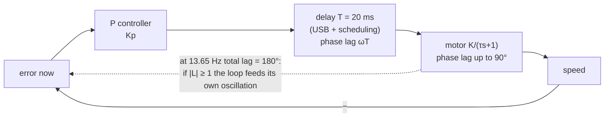

# FCT.04 — Stability: poles without the pain

<!-- glance:start -->
<!-- generated by tools/build.py from curriculum/syllabus.yaml — edit the syllabus, not this block -->

| | |
|---|---|
| **Track** | Optional foundation |
| **Difficulty** | Intermediate |
| **Time** | 1 h |
| **Hardware** | none |
| **Software** | python |
| **Prerequisites** | [FCT.03 Differential equations just enough — simulate them numerically](FCT.03-differential-equations-simulation.md) |
| **Skip if** | You can relate pole locations and delay to oscillation. |

<!-- glance:end -->

## What you will learn

- Explain what "stable" means for a feedback loop, and tell decaying, sustained and growing oscillation apart.
- Find a linear system's poles from its characteristic polynomial with `numpy.roots`, and read decay rate and oscillation frequency off each pole.
- Predict from pole positions how a loop responds, and find the gain at which it goes unstable.
- Explain with phase lag why delays and filters destabilize loops, and compute the critical gain and oscillation frequency for a delayed loop.
- Use gain margin and phase margin as safety numbers when tuning.

## Why it matters

Turn a gain up too far on karmel and the wheel starts to buzz, the robot shakes, and eventually the motors slam between full forward and full reverse. Lesson [08.04](../../08-control/08.04-proportional-control.md) shows it happening. [08.07](../../08-control/08.07-pid-mathematics.md) asks what stability means mathematically. [08.12](../../08-control/08.12-control-in-ros2.md) explains why the wheel-speed loop runs on the Pico and not across USB on the Pi.

The answer to all three is here, with numbers. A P speed loop that is comfortably stable on the Pico becomes **unstable at a gain only 2.4× higher** once you add a 20 ms communication delay. You will be able to compute that limit before touching hardware.

<!-- prereqs:start -->
## Prerequisites

You need these first:

- [FCT.03 Differential equations just enough — simulate them numerically](FCT.03-differential-equations-simulation.md)

### Optional prerequisite links

None.

Check your readiness: `python course.py why FCT.04`
<!-- prereqs:end -->

## Concept

A loop is **stable** if, after a disturbance or setpoint change, the error dies away. It is **unstable** if the error grows, usually as an oscillation whose swings get bigger until something saturates. In between sits **marginal stability**: an oscillation that neither grows nor shrinks.

Where does oscillation come from? Consider a controller that pushes against the error. If it acts on *stale* information, it keeps pushing after the error has already reversed. Think of adjusting a shower whose hot water takes three seconds to arrive: turn the tap, feel nothing, turn more, get scalded, turn back hard, freeze. The more aggressively you turn (**gain**) and the longer the pipe (**delay**), the worse it gets. Every lag in a loop does this: motor inertia, a filter on the speed estimate, the sampling period, USB transport. Autoscalers with long metric windows show the same pattern, flapping between too many and too few instances.

**Poles** are the numbers that summarize a linear system's natural behaviour. Left alone, the output is a sum of terms $e^{p t}$, one for each pole $p$:

- A **negative real** pole, such as −12.5, is a decay with time constant $1/12.5 = 80$ ms.
- A **complex pair** $\sigma \pm j\omega$ is an oscillation at $\omega$ rad/s whose envelope behaves like $e^{\sigma t}$.
- Any pole with a **positive real part** means growth: unstable.

So stability is a question with a picture: **are all poles in the left half of the complex plane?** Feedback moves the poles. Raising gain slides them around, sometimes straight across the imaginary axis.

Delay is special: it adds lag that grows with frequency without adding a finite set of poles. For delays, the easier view is **frequency response**. Put a sine wave around the loop. If it comes back 180° late and at least as large as it went in, it reinforces itself. That is oscillation.

> [!TIP]
> **Ask your teacher:** "Explain why a pure delay of T seconds adds a phase lag of ωT radians, using a sine wave and a clock."

## Technical explanation

### Level 1 — Poles from the characteristic polynomial

For a linear ODE like $a_2\ddot y + a_1\dot y + a_0 y = \dots$, try $y = e^{st}$. Every derivative multiplies by $s$, which gives the **characteristic polynomial**

$$a_2 s^2 + a_1 s + a_0 = 0$$

Its roots are the poles.

*Example:* $s^2 + 4s + 13 = 0$ gives $s = -2 \pm 3j$. That is an oscillation at 3 rad/s (0.48 Hz) decaying with $e^{-2t}$, halving every 0.35 s. Stable. By contrast, $s^2 - s + 1$ gives $0.5 \pm 0.87j$: a growing oscillation, unstable.

For a feedback loop with controller $C$, plant $G$ and sensor $H$, the closed-loop poles are the roots of

$$1 + C\,G\,H = 0 \quad(\text{after clearing denominators})$$

*Karmel's P speed loop:* $G = K/(\tau s + 1)$ with $C = K_p$ and $H = 1$ gives $\tau s + 1 + K K_p = 0$, so

$$p = -\frac{1 + KK_p}{\tau}$$

For $K_p = 0.15$: $p = -(1 + 2.90)/0.08 = -48.7$ s⁻¹, a closed-loop time constant of 20.5 ms. This pole only moves further left with more gain, so an ideal first-order loop can never go unstable. Real ones do, because they are not ideal.

### Level 2 — Poles moving with gain

*Karmel's wheel-angle P loop* ([FCT.02](FCT.02-first-second-order-systems.md)): $\tau s^2 + s + KK_p = 0$ gives

$$p = -\frac{1}{2\tau} \pm j\sqrt{\frac{KK_p}{\tau} - \frac{1}{4\tau^2}}$$

The real part is always $-1/(2\tau) = -6.25$ s⁻¹. More gain moves the poles *vertically*: faster oscillation, same decay envelope. At $K_p = 0.162$ the poles meet on the real axis (critical damping). At $K_p = 10$ they sit at $-6.25 \pm 48.7j$. The model still claims "stable".

**Add one realistic lag.** The speed estimate is low-pass filtered with $\tau_f = 0.02$ s ([08.03](../../08-control/08.03-wheel-speed-estimation.md)). Suppose the angle loop acts through that filtered path. The characteristic polynomial becomes third order:

$$\tau\tau_f\, s^3 + (\tau + \tau_f)\, s^2 + s + KK_p = 0$$

For a cubic $a_3s^3 + a_2s^2 + a_1s + a_0$ with positive coefficients, the **Routh–Hurwitz** test says it is stable if and only if $a_2 a_1 > a_3 a_0$:

$$(\tau + \tau_f) \cdot 1 > \tau\tau_f\,KK_p \;\Rightarrow\; K_p < \frac{\tau + \tau_f}{\tau\tau_f K} = \frac{0.10}{0.0016 \times 19.3} = 3.235$$

At the limit, the poles sit on the imaginary axis at $\pm j/\sqrt{\tau\tau_f} = \pm 25$ rad/s: a sustained oscillation with a period of 0.251 s. The script prints the pole march: at $K_p = 1$ the rightmost pole is $-3.68 + 14.3j$, at 3.0 it is $-0.32 + 24.2j$, at 3.235 it is $0.00 + 25.0j$, and at 4.0 it is $+0.97 + 27.4j$, growing.

### Level 3 — Delay and phase lag: the frequency-response view

Feed a sinusoid $\sin\omega t$ into a linear system. After transients, the output is a sinusoid at the same frequency, scaled by $|G(j\omega)|$ and shifted by $\angle G(j\omega)$:

- **First-order lag** $K/(\tau s + 1)$: gain $K/\sqrt{1 + (\omega\tau)^2}$, phase $-\arctan(\omega\tau)$, never beyond −90°.
- **Pure delay** $e^{-sT}$: gain 1, phase $-\omega T$ radians. It grows without limit as frequency rises.

For the loop $L(j\omega) = C\,G\,H$, the **oscillation condition** (the Nyquist criterion's practical core) is:

> If at the frequency where the loop's phase reaches −180° its gain $|L|$ is ≥ 1, the loop oscillates with growing amplitude.

**Karmel's P speed loop with a 20 ms delay** (for example the loop closed on the Pi over USB):

$$\arctan(\omega \times 0.08) + 0.02\,\omega = \pi \;\Rightarrow\; \omega_{180} = 85.8\ \text{rad/s}\ (13.65\ \text{Hz})$$

$$|L(j\omega_{180})| = \frac{K K_p}{\sqrt{1 + (0.08 \times 85.8)^2}} = 1 \;\Rightarrow\; K_{p,crit} = \frac{\sqrt{1 + 6.86^2}}{19.3} = 0.359$$

| Total loop delay | 180° lag at | Critical $K_p$ |
|---|---|---|
| 5 ms | 51.2 Hz | 1.334 |
| 10 ms | 26.2 Hz | 0.684 |
| 20 ms | 13.65 Hz | 0.359 |
| 30 ms | 9.44 Hz | 0.251 |

Delay cuts the usable gain almost in proportion. The time simulation agrees:
- $K_p = 0.30$ decays.
- $K_p = 0.36$ grows slowly, ringing at 13.55 Hz, matching the predicted 13.65 Hz.
- $K_p = 0.40$ grows until the duty saturates, then settles into a full-amplitude **limit cycle**, the "buzzing" you hear.

### Level 3b — Margins: how far from the edge

- **Gain margin:** how much you could multiply the gain before instability. Here $0.359/0.15 = 2.39\times$ (7.6 dB).
- **Phase margin:** at the crossover frequency where $|L| = 1$, how much extra lag the loop could tolerate before reaching −180°. For $K_p = 0.15$ and 20 ms: crossover at 34.0 rad/s, phase $-\arctan(2.72) - 0.68$ rad = −109°, so the phase margin is **71°**.

Rules of thumb: gain margin ≥ 2 (6 dB) and phase margin ≥ 45°. Phase margin also hints at overshoot. For a classic second-order loop, 45° gives roughly 20–25% and 65° under 5%. Loops dominated by delay overshoot more: this one, tuned to 45°, overshoots its final value by about 52%. To reach exactly 45° at 20 ms of delay you can raise $K_p$ to 0.218. At 10 ms, to 0.385.

An extra 20 ms of delay at 34 rad/s costs a further $34 \times 0.02 = 0.68$ rad = 39° of margin. That is why moving a loop from the Pico (under 10 ms) to the Pi (20–30 ms plus jitter) forces you to detune it.

### Level 4 — Connecting to the real robot

- **Every lag counts:** motor time constant, speed filter, sampling and hold (about half a sample, [FCT.05](FCT.05-discrete-time-sampling.md)), computation, transport. Sum the delays; filters add lag that grows with frequency.
- **Integral action adds 90° of lag** at low frequency, so PI loops have less margin than P loops. Derivative action adds phase lead, which is why D can stabilize ([08.06](../../08-control/08.06-derivative-control.md)).
- **The karmel firmware** (`labs/firmware/pico/config.py`) uses $K_p = 0.02$, $K_i = 0.3$ and feedforward at 100 Hz: a deliberately conservative loop, with most of the work done by feedforward.
- **Nonlinear systems** (saturation, deadband) do not have poles in this sense. Linear analysis around an operating point still predicts *where* trouble starts; saturation then usually turns growth into a limit cycle.

## Diagram

The complex plane: where poles live and what each region means:

```text
                    imaginary (oscillation frequency, rad/s)
                         ▲
   ×  fast decay,        │         ×  growing
      fast oscillation   │            oscillation
                         │
          ×              │                          ← karmel angle loop + filter:
       ringing, decays   │  × Kp=3.235 (+25j)          Kp 1 → 3 → 3.235 → 4
                         │     marginal                 walks right and up across the axis
 ───×────────×───────────┼──────────×──────────► real (decay rate, 1/s)
   fast      slow        │       growth
   decay     decay       │       (unstable)
                         │
          STABLE         │        UNSTABLE
     (left half-plane)   │   (right half-plane)
```

How delay turns a stable loop into an oscillator:



## Code

Save as `fct04_stability.py` and run `python fct04_stability.py` (needs `numpy`, `scipy`, `matplotlib`). It computes poles for karmel's speed and angle loops, finds the Routh limit with a speed filter, computes critical gains and margins for delayed loops, and confirms them with a time-domain simulation that uses a delay buffer.

```python
"""FCT.04 — poles, delay and phase lag on karmel's wheel loops.

Run: python fct04_stability.py   (needs numpy, scipy, matplotlib)
"""
from __future__ import annotations

import math
from collections import deque

import matplotlib

matplotlib.use("Agg")
import matplotlib.pyplot as plt
import numpy as np
from scipy.optimize import brentq

K, TAU = 17.0 / 0.88, 0.08     # wheel: rad/s per duty, time constant (karmel.yaml)
TAU_F = 0.02                   # first-order low-pass on the speed estimate [s]


def describe(poles: np.ndarray) -> str:
    worst = max(poles, key=lambda p: p.real)
    verdict = "UNSTABLE" if worst.real > 1e-9 else ("marginal" if abs(worst.real) <= 1e-9 else "stable")
    return f"{verdict:8s} slowest/rightmost pole {worst.real:+8.3f}{worst.imag:+8.3f}j"


def angle_loop_poles(kp: float, with_filter: bool) -> np.ndarray:
    """P control of wheel angle. Characteristic polynomial from 1 + C·G·H = 0."""
    if with_filter:   # τ τf s^3 + (τ + τf) s^2 + s + K kp
        return np.roots([TAU * TAU_F, TAU + TAU_F, 1.0, K * kp])
    return np.roots([TAU, 1.0, K * kp])


def loop_response(kp: float, w: np.ndarray, delay: float) -> np.ndarray:
    """Open-loop frequency response L(jw) = kp · K/(jwτ + 1) · e^(−jwT) of the speed loop."""
    return kp * K / (1j * w * TAU + 1) * np.exp(-1j * w * delay)


def margins(kp: float, delay: float) -> tuple[float, float, float, float]:
    w180 = brentq(lambda w: math.atan(w * TAU) + w * delay - math.pi, 1e-3, 1e4)
    kp_crit = math.sqrt(1 + (w180 * TAU) ** 2) / K
    L0 = kp * K
    wc = math.sqrt(L0**2 - 1) / TAU if L0 > 1 else float("nan")   # |L(jwc)| = 1
    pm = 180 - math.degrees(math.atan(wc * TAU) + wc * delay)
    return w180, kp_crit, wc, pm


def simulate_delayed_speed_loop(kp: float, delay: float, t_end: float = 1.5, dt: float = 5e-4,
                                setpoint: float = 1.0) -> tuple[np.ndarray, np.ndarray, np.ndarray]:
    n = int(round(t_end / dt))
    buf: deque[float] = deque([0.0] * max(1, int(round(delay / dt))))
    w = np.zeros(n)
    duty = np.zeros(n)
    for k in range(n - 1):
        buf.append(kp * (setpoint - w[k]))          # command computed now ...
        u = buf.popleft()                           # ... reaches the motor `delay` seconds later
        u = max(-1.0, min(1.0, u))                  # duty saturates at ±100 %
        duty[k] = u
        w[k + 1] = w[k] + dt * (K * u - w[k]) / TAU
    return np.arange(n) * dt, w, duty


def main() -> None:
    print("P speed loop, no delay: pole = -(1 + K kp)/tau")
    for kp in (0.05, 0.15, 1.0):
        print(f"  kp={kp:4.2f}: pole {-(1 + K * kp) / TAU:8.2f} 1/s -> time constant {TAU / (1 + K * kp) * 1000:5.1f} ms")

    print("\nP angle loop, ideal (2nd order):")
    for kp in (0.162, 1.0, 3.0, 10.0):
        print(f"  kp={kp:5.3f}: poles {np.round(angle_loop_poles(kp, False), 2)}  {describe(angle_loop_poles(kp, False))}")
    kp_crit_f = (TAU + TAU_F) / (TAU * TAU_F * K)
    print(f"\nP angle loop + {TAU_F * 1000:.0f} ms speed filter (3rd order): Routh limit kp < {kp_crit_f:.3f}, "
          f"oscillation at {1 / math.sqrt(TAU * TAU_F):.1f} rad/s")
    for kp in (1.0, 3.0, kp_crit_f, 4.0):
        print(f"  kp={kp:5.3f}: {describe(angle_loop_poles(kp, True))}")

    print("\nP speed loop with a pure delay (frequency-response view):")
    for delay in (0.005, 0.010, 0.020, 0.030):
        w180, kp_c, _, _ = margins(0.15, delay)
        print(f"  delay {delay * 1000:4.0f} ms: 180 deg lag at {w180:6.1f} rad/s ({w180 / (2 * math.pi):5.2f} Hz), "
              f"kp_crit = {kp_c:.3f}")
    w180, kp_c, wc, pm = margins(0.15, 0.020)
    print(f"  kp=0.15, delay 20 ms: crossover {wc:.1f} rad/s, phase margin {pm:.0f} deg, gain margin {kp_c / 0.15:.2f}x")

    print("\ntime simulation, 20 ms delay, setpoint 1 rad/s: oscillation amplitude early vs late")
    fig, ax = plt.subplots(1, 3, figsize=(14, 4))
    for kp in (0.15, 0.30, 0.36, 0.40):
        t, w, duty = simulate_delayed_speed_loop(kp, 0.020)
        early = np.ptp(w[(t > 0.2) & (t < 0.5)])
        late = np.ptp(w[(t > 1.2) & (t < 1.5)])
        trend = "decaying" if late < 0.8 * early else ("growing" if late > 1.2 * early else "sustained")
        if np.any(np.abs(duty[t > 0.2]) >= 1.0):
            first = t[(t > 0.2) & (np.abs(duty) >= 1.0)][0]
            trend += f", duty saturates from t = {first:.2f} s (limit cycle)"
        print(f"  kp={kp:.2f}: peak-to-peak {early:7.3f} (0.2-0.5 s) -> {late:7.3f} (1.2-1.5 s) rad/s: {trend}")
        ax[0].plot(t, w, label=f"Kp={kp}")
    ax[0].set_title("speed loop with 20 ms delay")
    ax[0].set_xlabel("time [s]")
    ax[0].set_ylabel("wheel speed [rad/s]")
    ax[0].set_ylim(-3, 5)
    ax[0].legend()

    for kp, mk in ((1.0, "o"), (3.0, "s"), (kp_crit_f, "^"), (4.0, "x")):
        p = angle_loop_poles(kp, True)
        ax[1].plot(p.real, p.imag, mk, label=f"Kp={kp:.2f}")
    ax[1].axvline(0, color="k", lw=0.8)
    ax[1].set_title("poles: angle loop + speed filter")
    ax[1].set_xlabel("real part [1/s]")
    ax[1].set_ylabel("imaginary part [rad/s]")
    ax[1].legend()

    ws = np.logspace(0, 3, 400)
    L = loop_response(0.15, ws, 0.020)
    ax[2].semilogx(ws, np.abs(L), label="|L(jω)|")
    ax[2].axhline(1, color="k", lw=0.8)
    ax2 = ax[2].twinx()
    ax2.semilogx(ws, np.degrees(np.unwrap(np.angle(L))), "r", label="phase [deg]")
    ax2.axhline(-180, color="r", ls=":", lw=0.8)
    ax[2].set_title("loop frequency response, Kp=0.15, 20 ms")
    ax[2].set_xlabel("ω [rad/s]")
    for a in ax:
        a.grid(True)
    fig.tight_layout()
    fig.savefig("fct04_stability.png", dpi=120)
    print("saved fct04_stability.png")


if __name__ == "__main__":
    main()
```

Output:

```text
P speed loop, no delay: pole = -(1 + K kp)/tau
  kp=0.05: pole   -24.57 1/s -> time constant  40.7 ms
  kp=0.15: pole   -48.72 1/s -> time constant  20.5 ms
  kp=1.00: pole  -253.98 1/s -> time constant   3.9 ms

P angle loop, ideal (2nd order):
  kp=0.162: poles [-6.25+0.24j -6.25-0.24j]  stable   slowest/rightmost pole   -6.250  +0.238j
  kp=1.000: poles [-6.25+14.23j -6.25-14.23j]  stable   slowest/rightmost pole   -6.250 +14.227j
  kp=3.000: poles [-6.25+26.18j -6.25-26.18j]  stable   slowest/rightmost pole   -6.250 +26.180j
  kp=10.000: poles [-6.25+48.74j -6.25-48.74j]  stable   slowest/rightmost pole   -6.250 +48.741j

P angle loop + 20 ms speed filter (3rd order): Routh limit kp < 3.235, oscillation at 25.0 rad/s
  kp=1.000: stable   slowest/rightmost pole   -3.682 +14.333j
  kp=3.000: stable   slowest/rightmost pole   -0.319 +24.195j
  kp=3.235: marginal slowest/rightmost pole   +0.000 +25.000j
  kp=4.000: UNSTABLE slowest/rightmost pole   +0.966 +27.361j

P speed loop with a pure delay (frequency-response view):
  delay    5 ms: 180 deg lag at  321.9 rad/s (51.24 Hz), kp_crit = 1.334
  delay   10 ms: 180 deg lag at  164.7 rad/s (26.21 Hz), kp_crit = 0.684
  delay   20 ms: 180 deg lag at   85.8 rad/s (13.65 Hz), kp_crit = 0.359
  delay   30 ms: 180 deg lag at   59.3 rad/s ( 9.44 Hz), kp_crit = 0.251
  kp=0.15, delay 20 ms: crossover 34.0 rad/s, phase margin 71 deg, gain margin 2.39x

time simulation, 20 ms delay, setpoint 1 rad/s: oscillation amplitude early vs late
  kp=0.15: peak-to-peak   0.003 (0.2-0.5 s) ->   0.000 (1.2-1.5 s) rad/s: decaying
  kp=0.30: peak-to-peak   0.535 (0.2-0.5 s) ->   0.001 (1.2-1.5 s) rad/s: decaying
  kp=0.36: peak-to-peak   2.524 (0.2-0.5 s) ->   4.625 (1.2-1.5 s) rad/s: growing
  kp=0.40: peak-to-peak   6.347 (0.2-0.5 s) ->   6.347 (1.2-1.5 s) rad/s: sustained, duty saturates from t = 0.25 s (limit cycle)
saved fct04_stability.png
```

**The plot `fct04_stability.png`** has three panels.

- **Left:** the delayed speed loop's response to a 1 rad/s setpoint for four gains.
  - $K_p = 0.15$ overshoots once, by about a quarter, and settles at 0.74 rad/s (P-only steady-state error).
  - $K_p = 0.30$ overshoots and rings for about half a second.
  - $K_p = 0.36$ rings at about 13.6 Hz with slowly *growing* swings.
  - $K_p = 0.40$ grows within 0.25 s into a large, constant-amplitude oscillation clipped by duty saturation.
- **Middle:** pole positions of the angle loop with a speed filter. For each gain, a complex pair moves towards and across the vertical axis: $K_p = 1$ at −3.7 ± 14.3j, 3.235 exactly on the axis at ±25j, and 4 in the right half-plane. A third real pole sits far left.
- **Right:** $|L(j\omega)|$ on a log axis, flat at 2.9 at low frequency and falling past 1 near 34 rad/s. The red phase curve starts at 0°, bends down through −90°, and keeps falling because of the delay, crossing −180° near 86 rad/s, where $|L|$ is already below 1.

## Exercise

### Exercise FCT.04-E1 — Read poles `[numerical]`

Hardware: none.

1. Find the poles of $s^2 + 4s + 13$ and of $s^2 - s + 1$. For each, state stable or unstable, the oscillation frequency in Hz, and the time for the envelope to halve (or double).
2. For karmel's wheel-angle loop with a *lighter* speed filter, $\tau_f = 0.01$ s, compute the critical $K_p$ and the oscillation frequency at that gain.

### Exercise FCT.04-E2 — Tune for phase margin `[coding]`

Hardware: none. Using `margins`, find with `brentq` the $K_p$ that gives exactly 45° of phase margin for loop delays of 10, 20 and 30 ms. For each, also report the gain margin. Then simulate the 20 ms case with `simulate_delayed_speed_loop` and measure the overshoot on a 1 rad/s step. Note: a P-only loop settles below the setpoint, so measure overshoot relative to the final value.

### Exercise FCT.04-E3 — Predict: moving the loop to the Pi `[predict]`

Hardware: none. A teammate runs a P speed loop with $K_p = 0.30$. Predict *before computing* whether it is stable in each case:

- (a) on the Pico with about 5 ms of total delay;
- (b) on the Pi over USB with 15 ms;
- (c) on the Pi with 30 ms.

Then compute the critical gains, and simulate (c).

### Exercise FCT.04-E4 — Diagnose a buzzing wheel `[debugging]`

Hardware: none, or `robot-base` if you want to reproduce it with the wheels in the air.

> [!CAUTION]
> **Safety:** If you reproduce this on hardware, wheels in the air, low setpoint (≤ 2 rad/s), watchdog on, hand on the power switch. A limit cycle slams the gearbox between directions; stop within a few seconds.

After a refactor, karmel's wheel oscillates at about 9–10 Hz with the same gains as before. The old code ran the loop on the Pico; the new code runs it on the Pi. Using the delay table, estimate the new total loop delay from the oscillation frequency. Propose three fixes in order of preference.

## Expected result

**FCT.04-E1:**
1. $s^2 + 4s + 13$: $-2 \pm 3j$. **Stable**, 0.477 Hz, the envelope halves every $\ln 2/2 = 0.35$ s. $s^2 - s + 1$: $0.5 \pm 0.866j$. **Unstable**, 0.138 Hz, the envelope doubles every $\ln 2/0.5 = 1.39$ s.
2. $K_{p,crit} = 0.09/(0.08 \times 0.01 \times 19.3) = $ **5.82**, oscillating at $1/\sqrt{0.0008} = $ **35.4 rad/s** (5.6 Hz). A lighter filter allows almost twice the gain.

**FCT.04-E2:**

| Delay | $K_p$ for 45° | Gain margin |
|---|---|---|
| 10 ms | **0.385** | 0.684/0.385 = 1.78 |
| 20 ms | **0.218** | 0.359/0.218 = 1.64 |
| 30 ms | **0.162** | 0.251/0.162 = 1.55 |

The 20 ms simulation settles at 0.81 rad/s and overshoots that value by about **52%**, ringing for several cycles. Delay-dominated loops overshoot more than the second-order rule of thumb suggests, which is why 45° is a *minimum*.

**FCT.04-E3:**
- (a) **Stable**: the critical gain at 5 ms is 1.33.
- (b) **Stable, but close**: the critical gain at 15 ms is 0.467, so the gain margin is 1.56 and the phase margin 39°. It rings.
- (c) **Unstable**: the critical gain at 30 ms is 0.251 < 0.30. The simulation grows into a saturated limit cycle, about 9.3 rad/s peak-to-peak.

**FCT.04-E4:** 9–10 Hz corresponds to about **30 ms** of total delay (9.44 Hz in the table). Fixes:
1. Move the velocity loop back to the Pico and send setpoints from the Pi ([08.12](../../08-control/08.12-control-in-ros2.md)).
2. If it must stay on the Pi, lower $K_p$ below about 0.16 for 45° of margin and rely on feedforward.
3. Reduce delay and jitter: a lighter filter, a higher telemetry rate, and avoiding non-real-time threads.

## Troubleshooting

### Symptom: the loop oscillates at a steady frequency after a code or hardware change
1. Measure the frequency from logs (count zero crossings). High-frequency buzzing (tens of Hz) suggests added delay or filtering; slow wandering (under 1 Hz) suggests integral gain or an outer loop.
2. List every lag added: filter changes, a slower loop rate, the loop moved across a communication link, logging inside the loop.
3. Halve the gain. If the oscillation stops, you were beyond the margin. Recompute the critical gain with the new delay.

### Symptom: the model says stable, the robot oscillates
1. The model is missing a lag: sensor filter, sampling (T/2), computation time, motor driver PWM filtering, or mechanical compliance (a flexible coupling adds a resonance).
2. Measure the actual loop delay: timestamp the command and the first encoder response.
3. Deadband and backlash cause small limit cycles near zero speed that no linear model predicts. They appear at low setpoints only.

### Symptom: the oscillation grows and then stays at a fixed large amplitude
1. That is a saturation limit cycle: the loop is linearly unstable. Reducing the setpoint will not fix it; reduce the gain or the delay.

## Common mistakes

- **Treating "overshoots" as "unstable".** Decaying rings are stable; growth is the problem.
- **Forgetting that delay has no gain, only phase.** It does not change $|L|$ but eats phase margin in proportion to frequency.
- **Analysing the loop without the speed filter or sample delay** and trusting the result.
- **Tuning on a fast loop and then moving it across USB or Wi-Fi** without detuning.
- **Using the Routh condition for a cubic with a negative coefficient.** All coefficients must be positive first; any negative one already means instability.
- **Believing saturation "stabilized" a loop** because the oscillation stopped growing. It is a limit cycle.

## Knowledge check

1. A pole sits at −40 s⁻¹. What does its response look like, and what is its time constant?
   <details><summary>Answer</summary>

   A pure exponential decay $e^{-40t}$ with no oscillation. Time constant 1/40 = **25 ms**.
   </details>

2. A pair of poles sits at $-1 \pm 20j$. Describe the response.
   <details><summary>Answer</summary>

   An oscillation at 20 rad/s (3.2 Hz) whose envelope decays slowly as $e^{-t}$ (time constant 1 s). Stable but lightly damped: ζ ≈ 1/√(1² + 20²) ≈ 0.05, so it rings for many cycles.
   </details>

3. Why can't an ideal first-order plant under P control go unstable, while the real wheel can?
   <details><summary>Answer</summary>

   Its single closed-loop pole, −(1 + KK_p)/τ, only moves left with gain, and its phase lag never exceeds 90°. The real loop adds filters, sampling and delays, whose extra lag reaches 180° at some frequency. There, high gain means oscillation.
   </details>

4. How much phase lag does a 20 ms delay add at 50 rad/s?
   <details><summary>Answer</summary>

   ωT = 50 × 0.02 = **1.0 rad = 57°**.
   </details>

5. Predict: you add a 10 ms filter to the speed measurement of a loop that had 60° of phase margin at a crossover of 40 rad/s. Roughly how much margin remains?
   <details><summary>Answer</summary>

   The filter adds arctan(40 × 0.01) = arctan(0.4) = 22° of lag at crossover, so about **38°** remain (a little different, because the crossover shifts slightly). It will ring noticeably.
   </details>

6. Debugging: a wheel loop oscillates at 13–14 Hz on the robot but not in simulation. The simulation has no delay. What delay would explain it, and how do you confirm?
   <details><summary>Answer</summary>

   About **20 ms** (the 180° frequency at 20 ms is 13.65 Hz for this plant). Confirm by timestamping command and response in logs, or by adding a 20 ms delay buffer in the simulation and seeing the same frequency appear at the same gain.
   </details>

7. What are sensible minimum gain and phase margins, and why keep margin at all?
   <details><summary>Answer</summary>

   About **2× (6 dB) and 45°**. Model errors (battery voltage, load, wear, temperature, delay jitter) change the loop. Margin keeps it stable and not excessively oscillatory when reality differs from the model.
   </details>

## Practical challenge

Write `loop_check.py`. It takes a plant (K, τ), a controller (P or PI gains), a list of lags (filters as time constants, and delays in seconds) and a sample rate. It reports the crossover frequency, phase margin, gain margin, critical proportional gain and predicted oscillation frequency, and it verifies them with a time-domain simulation.

**Acceptance criteria:**
- For P, K = 19.3, τ = 0.08 and a 20 ms delay it reproduces $K_{p,crit}$ = 0.359 ± 0.002 and 13.65 ± 0.1 Hz. The simulation at $1.05 K_{p,crit}$ grows and at $0.95 K_{p,crit}$ decays.
- For the angle loop with a 20 ms filter it reproduces the Routh limit 3.235 ± 0.01.
- It treats sampling as an extra delay of T/2 plus one computation period ([FCT.05](FCT.05-discrete-time-sampling.md)) and prints how the margins change between 100 Hz and 50 Hz.
- It includes a PI option and shows that $K_i$ reduces phase margin at crossover.

## You can skip this if…

You get knowledge-check questions 3, 5 and 6 right without looking, and you can relate pole locations to responses and compute a critical gain for a delayed loop.

`python course.py skip FCT.04 --reason "I relate poles and delay to oscillation"`

## Go deeper

- [Feedback Systems, 2nd ed. (Åström & Murray)](https://www.cds.caltech.edu/~murray/FBS/Second_Edition.html): chapter 9, "Frequency Domain Analysis", covers the Nyquist criterion, stability margins and time delay. Chapter 4 covers stability of linear systems.
- [Brian Douglas, Control System Lectures: Classical Control Theory](https://www.youtube.com/playlist?list=PLUMWjy5jgHK1NC52DXXrriwihVrYZKqjk): the root locus, Bode plot and Nyquist lectures give the graphical intuition behind this lesson.
- [NumPy `roots`](https://numpy.org/doc/stable/reference/generated/numpy.roots.html): the one-line pole finder used here.
- [Python Control Systems Library](https://python-control.readthedocs.io/): `pole()`, `margin()`, `bode_plot()` and `pade()` for delay approximation, once you want library tools.

## Progress checkpoint

- [ ] I can tell stable, marginal and unstable responses apart and relate them to pole positions.
- [ ] I find poles with `numpy.roots` and read decay and oscillation from them.
- [ ] I compute the critical gain of a loop with a filter (Routh) or with a delay (phase crossover).
- [ ] I use gain and phase margins to choose safe gains.

`python course.py complete FCT.04` (exercises done) · `python course.py master FCT.04` (challenge done) · `python course.py struggle FCT.04 "what was hard"`

Next: [FCT.05 — Discrete time: sampling rates, delay and aliasing](FCT.05-discrete-time-sampling.md).
