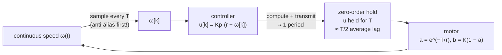

# FCT.05 — Discrete time: sampling rates, delay and aliasing

<!-- glance:start -->
<!-- generated by tools/build.py from curriculum/syllabus.yaml — edit the syllabus, not this block -->

| | |
|---|---|
| **Track** | Optional foundation |
| **Difficulty** | Intermediate |
| **Time** | 45 min |
| **Hardware** | none |
| **Software** | python |
| **Prerequisites** | [FCT.01 Systems, signals and feedback — block diagrams](FCT.01-systems-signals-feedback.md) |
| **Skip if** | You choose loop rates with aliasing and delay in mind. |

<!-- glance:end -->

## What you will learn

- Explain what sampling does to a signal, and compute where an alias of a vibration will appear.
- Explain the zero-order hold and why a sampled controller behaves as if it had extra delay (about 1.5 sample periods).
- Discretize a first-order plant exactly, and compute the largest stable gain of a sampled P loop at a given rate.
- Choose loop rates from closed-loop bandwidth, delay, sensor resolution and compute budget.
- Avoid aliasing with filtering, averaging, or sensors that integrate.

## Why it matters

Everything karmel computes happens at discrete instants:
- the Pico's control loop at 100 Hz (`CONTROL_HZ` in `labs/firmware/pico/config.py`);
- telemetry to the Pi at 50 Hz;
- the LiDAR at 10 Hz;
- Nav2's controller at around 20 Hz.

The rates are not arbitrary. A loop that is fine at 100 Hz can ring or go unstable at 50 Hz with the same gains. Sampling faster makes the encoder speed estimate *coarser*. A motor vibration can show up in IMU data as a slow fake wobble that no filter after the sampling can remove.

This lesson explains why the wheel loop lives on the Pico ([08.12](../../08-control/08.12-control-in-ros2.md)), why the PID must use the real Δt ([08.07](../../08-control/08.07-pid-mathematics.md)), and how to pick the rates of your own nodes ([08.03](../../08-control/08.03-wheel-speed-estimation.md), [07.05](../../07-sensors/07.05-imu-fundamentals.md)).

<!-- prereqs:start -->
## Prerequisites

You need these first:

- [FCT.01 Systems, signals and feedback — block diagrams](FCT.01-systems-signals-feedback.md)

### Optional prerequisite links

None.

Check your readiness: `python course.py why FCT.05`
<!-- prereqs:end -->

## Concept

A computer never sees a continuous signal, only **samples**: values taken every $T$ seconds, at a **sample rate** $f_s = 1/T$. Between samples it knows nothing. Two consequences follow.

**Aliasing.** If a signal wiggles faster than half the sample rate, the samples cannot tell it apart from a *slower* wiggle. A film of a car wheel at 24 frames per second shows the wheel turning slowly backwards; that is aliasing. On karmel, the motor shaft at 0.5 m/s turns at 99 Hz. An IMU sampled at 100 Hz sees that vibration as a **1 Hz** oscillation, which looks exactly like the robot rocking. Once sampled, the fake 1 Hz signal is indistinguishable from a real one, so it must be removed *before* sampling: an analog or on-chip low-pass filter, or averaging many fast samples. The limit $f_s/2$ is called the **Nyquist frequency**.

**Hold and delay.** A controller computes a command and **holds** it until the next sample: the **zero-order hold** (ZOH). The motor therefore sees a staircase, which on average lags the ideal smooth command by half a period. Add the time to read sensors, compute and send, often a full period, because the result goes out at the next tick. In total, a sampled loop acts as if it had about **1.5 sample periods of delay**. [FCT.04](FCT.04-stability-intuition.md) showed that delay eats stability margin, so slower loops tolerate less gain.

There is a third, robot-specific twist: **faster is not automatically better**. An encoder speed estimate counts ticks per period. At a higher rate each period holds fewer ticks, so the estimate becomes coarser: one tick in 1 ms means 2.55 rad/s of apparent speed on karmel. Loop rate is a trade-off between delay, measurement quality and CPU time. Engineers who have tuned metrics-scrape intervals know the pattern: scrape too rarely and you react late; scrape too often and you see noisy counters.

> [!TIP]
> **Ask your teacher:** "Draw a 99 Hz sine sampled at 100 Hz on paper and show me the 1 Hz sine the dots trace out."

## Technical explanation

### Level 1 — Sampling and aliasing

A sinusoid at frequency $f$ sampled at $f_s$ looks like one at

$$f_{alias} = \left| f - f_s \cdot \mathrm{round}\!\left(\frac{f}{f_s}\right) \right|$$

Only frequencies below the Nyquist frequency $f_s/2$ are represented faithfully.

*Karmel example.* Motor shaft frequency at speed $v$: $\frac{v}{r}\cdot\frac{56}{2\pi}$. At 0.5 m/s that is $11.11 \times 56/6.283 = 99.0$ Hz.

| IMU sample rate | Apparent frequency |
|---|---|
| 50 Hz | 1.0 Hz |
| 100 Hz | 1.0 Hz |
| 200 Hz | 99.0 Hz (below Nyquist 100 Hz, faithful) |

A heading filter fed with 50 Hz gyro data could therefore wobble at 1 Hz whenever the robot cruises at 0.5 m/s.

**Anti-aliasing.**
- **Low-pass before sampling.** IMUs have configurable digital low-pass filters (DLPF) running at their internal kHz rate ([07.05](../../07-sensors/07.05-imu-fundamentals.md)).
- **Oversample and average.** Read 10 samples at 1 kHz and average them into one at 100 Hz.
- **Integrating sensors.** An encoder *counts* every tick. Speed = ticks per period is the average speed over the period, which is a built-in anti-aliasing filter. That is why encoder speed estimates do not alias the way point samples do.

### Level 2 — Resolution against rate

An encoder speed estimate from counts has a resolution of one tick per period:

$$\Delta\omega_{min} = \frac{2\pi}{N_{ticks}} f_s$$

| Rate | Resolution | At the rim |
|---|---|---|
| 50 Hz | 0.127 rad/s | 5.7 mm/s |
| 100 Hz | 0.255 rad/s | 11.5 mm/s |
| 200 Hz | 0.510 rad/s | 22.9 mm/s |
| 1000 Hz | 2.55 rad/s | 115 mm/s |

At 1 kHz the raw estimate jumps by 23% of karmel's cruise wheel speed with every tick. Faster loops therefore need filtering, which adds lag ([08.03](../../08-control/08.03-wheel-speed-estimation.md)), or the time-between-ticks method, which works well at low speed.

### Level 3 — Exact discretization and the sampled loop

With the input held constant over one period (ZOH), the first-order wheel $\tau\dot\omega = -\omega + Ku$ has an **exact** discrete solution:

$$\omega_{k+1} = a\,\omega_k + b\,u_k, \qquad a = e^{-T/\tau},\quad b = K(1 - a)$$

*Example:* at 100 Hz, $a = e^{-0.01/0.08} = 0.8825$ and $b = 19.3 \times 0.1175 = 2.270$. Forward Euler would use $a = 1 - T/\tau = 0.875$: close at 100 Hz, badly wrong at 20 Hz (0.375 against 0.535). The course simulator uses the exact form ([FCT.03](FCT.03-differential-equations-simulation.md)).

In discrete time, a pole $z$ makes terms like $z^k$. It is stable if $|z| < 1$: inside the **unit circle**, the discrete twin of the left half-plane. A continuous pole $p$ maps to $z = e^{pT}$.

**P speed loop, command applied immediately** (an idealization): $\omega_{k+1} = a\omega_k + bK_p(r - \omega_k)$, with pole $z = a - bK_p$. It is stable if $|a - bK_p| < 1$, so

$$K_p < \frac{1+a}{b}$$

**Realistic: the command goes out one period after the measurement.** Then $\omega_{k+1} = a\omega_k + bK_p(r - \omega_{k-1})$, and the characteristic polynomial is $z^2 - az + bK_p = 0$. For a quadratic $z^2 + c_1 z + c_0$, stability requires $|c_0| < 1$ and $1 \pm c_1 + c_0 > 0$. That gives

$$K_p < \frac{1}{b} = \frac{1}{K\left(1 - e^{-T/\tau}\right)}$$

| Loop rate | a | b | $K_{p,crit}$, no delay | $K_{p,crit}$, 1-sample delay |
|---|---|---|---|---|
| 20 Hz | 0.5353 | 8.978 | 0.171 | **0.111** |
| 50 Hz | 0.7788 | 4.273 | 0.416 | **0.234** |
| 100 Hz | 0.8825 | 2.270 | 0.829 | **0.441** |
| 200 Hz | 0.9394 | 1.170 | 1.657 | **0.854** |
| 1000 Hz | 0.9876 | 0.240 | 8.282 | **4.167** |

For small $T$, $b \approx KT/\tau$, so **the critical gain grows roughly in proportion to the loop rate**. Compare with FCT.04's continuous delay table: 50 Hz means 1.5 × 20 ms = 30 ms of effective delay, which predicted 0.251; the exact discrete answer is 0.234. The "1.5 periods of delay" rule is a good approximation.

*Simulation at $K_p = 0.20$:*
- **100 Hz:** stable, 26% overshoot.
- **50 Hz:** 92% overshoot and still ringing after 0.8 s. Stable, but only just: $K_{p,crit}$ = 0.234.
- **40 Hz:** **unstable** ($K_{p,crit}$ = 0.193). It grows into a saturated oscillation.

Same code, same gains, different rate.

### Level 4 — Choosing loop rates

Practical rules, from inner to outer:

1. **Start from the closed-loop speed you need.** A closed-loop time constant $\tau_{cl}$ corresponds to a bandwidth of about $f_{bw} = 1/(2\pi\tau_{cl})$.
2. **Sample 10–30× the bandwidth.** Then the 1.5-period delay costs only a few degrees of phase margin at crossover.
   - *Karmel's wheel loop:* $\tau_{cl} \approx 25$ ms, so $f_{bw} \approx 6.4$ Hz and the loop should run at **64–190 Hz**. The firmware's 100 Hz fits.
3. **Check the measurement at that rate.** Encoder resolution per period, and IMU noise and aliasing. Filter where needed and add the filter's lag to the budget.
4. **Nest loops at clearly separated rates,** each outer loop at least 3–5× slower than the inner one:
   - wheel speed at 100 Hz on the Pico;
   - heading at 50 Hz;
   - Nav2 controller at 20 Hz (its `model_dt` of 0.05 s must match, [FCT.06](FCT.06-state-space-lqr-mpc.md));
   - global planner at about 1 Hz.
5. **Keep timing deterministic.** A loop with 5 ms of jitter behaves like one with varying delay. Always compute with the *measured* Δt, and put hard-timed loops on the microcontroller ([FC.07](../cpp-and-embedded/FC.07-real-time-concepts.md)).
6. **Budget compute.** At 1 kHz the Pico has 1 ms for encoders, estimation, PID and serial. MicroPython may not make that reliably, so 100 Hz leaves headroom.

## Diagram

What sampling, holding and delay do to a loop:



Aliasing of karmel's 99 Hz motor vibration sampled at 100 Hz:

```text
 true 99 Hz:  ╱╲╱╲╱╲╱╲╱╲╱╲╱╲╱╲╱╲╱╲╱╲╱╲╱╲╱╲╱╲╱╲╱╲╱╲╱╲╱╲╱╲╱╲╱╲╱╲╱╲╱╲╱╲╱╲╱╲╱╲╱╲   (99 cycles per second)
 samples:     •    •    •    •    •    •    •    •    •    •    •    •    •    •    (every 10 ms)
 what the     •
 computer          •    •
 "sees":                     •    •    •                              •    •
                                            •    •    •    •    •  •          ← a slow 1 Hz wave
```

## Code

Save as `fct05_sampling.py` and run `python fct05_sampling.py` (needs `numpy` and `matplotlib`). It computes aliases of the motor vibration, encoder speed resolution per rate, the exact discrete plant and critical gains, and simulates a continuous wheel under a sampled P controller with ZOH and a one-period delay.

```python
"""FCT.05 — sampling, aliasing, zero-order hold, delay and loop-rate selection on karmel.

Run: python fct05_sampling.py   (needs numpy + matplotlib)
"""
from __future__ import annotations

import math

import matplotlib

matplotlib.use("Agg")
import matplotlib.pyplot as plt
import numpy as np

K, TAU = 17.0 / 0.88, 0.08
GEAR, R_WHEEL, TICKS = 56.0, 0.045, 2464


def alias_frequency(f: float, fs: float) -> float:
    """Apparent frequency of a sinusoid at f when sampled at fs."""
    return abs(f - fs * round(f / fs))


def discrete_plant(T: float) -> tuple[float, float]:
    """Exact zero-order-hold discretization of tau*dw/dt = -w + K*u: w[k+1] = a*w[k] + b*u[k]."""
    a = math.exp(-T / TAU)
    return a, K * (1 - a)


def kp_critical(T: float, compute_delay: bool) -> float:
    """Largest stable P gain of the sampled speed loop.

    no delay:        w[k+1] = a w[k] + b kp (r - w[k])      -> |a - b kp| < 1  -> kp < (1 + a)/b
    one-sample delay: u applied one period after measuring -> z^2 - a z + b kp = 0 -> kp < 1/b
    """
    a, b = discrete_plant(T)
    return 1.0 / b if compute_delay else (1.0 + a) / b


def simulate_sampled_loop(kp: float, fs: float, t_end: float = 1.0, setpoint: float = 1.0,
                          substeps: int = 20) -> tuple[np.ndarray, np.ndarray]:
    """Continuous wheel, controller sampled at fs, output held (ZOH), applied one period late."""
    T = 1.0 / fs
    dt = T / substeps
    n = int(round(t_end / T))
    w, pending, applied = 0.0, 0.0, 0.0
    ts, ws = [], []
    for k in range(n):
        measured = w                              # sample
        applied, pending = pending, kp * (setpoint - measured)   # last period's result goes out now
        applied = max(-1.0, min(1.0, applied))
        for j in range(substeps):                 # hold the duty constant for one period
            ts.append(k * T + j * dt)
            ws.append(w)
            w += dt * (K * applied - w) / TAU
    return np.array(ts), np.array(ws)


def main() -> None:
    speed = 0.5                                                   # m/s
    motor_hz = speed / R_WHEEL * GEAR / (2 * math.pi)
    print(f"motor shaft at {speed} m/s: {motor_hz:.1f} Hz (vibration source)")
    for fs in (50, 100, 200, 400):
        print(f"  sampled at {fs:3d} Hz -> appears at {alias_frequency(motor_hz, fs):5.1f} Hz")

    print("\nencoder speed resolution (one tick per period):")
    for fs in (50, 100, 200, 1000):
        print(f"  {fs:4d} Hz: {2 * math.pi / TICKS * fs:6.3f} rad/s = {2 * math.pi / TICKS * fs * R_WHEEL * 1000:6.1f} mm/s")

    print("\nsampled P speed loop (exact ZOH model): a = exp(-T/tau), b = K(1 - a)")
    for fs in (20, 50, 100, 200, 1000):
        T = 1 / fs
        a, b = discrete_plant(T)
        print(f"  {fs:4d} Hz: a={a:.4f} b={b:6.3f}  kp_crit no delay {kp_critical(T, False):6.3f}, "
              f"with 1-sample delay {kp_critical(T, True):6.3f}  (Euler would use a={1 - T / TAU:+.3f})")

    fig, ax = plt.subplots(1, 3, figsize=(14, 4))
    t_fine = np.linspace(0, 1, 5000)
    ax[0].plot(t_fine, np.sin(2 * math.pi * motor_hz * t_fine), lw=0.3, label=f"{motor_hz:.1f} Hz vibration")
    t_s = np.arange(0, 1, 1 / 100)
    ax[0].plot(t_s, np.sin(2 * math.pi * motor_hz * t_s), "o-", ms=3, label="sampled at 100 Hz")
    ax[0].set_title("aliasing")
    ax[0].set_xlabel("time [s]")
    ax[0].legend(loc="lower left", fontsize=8)

    print("\nsimulation, kp = 0.20, setpoint 1 rad/s (1-sample delay):")
    for fs, style in ((100, "-"), (50, "--"), (40, ":")):
        t, w = simulate_sampled_loop(0.20, fs)
        final = w[t > 0.8].mean()
        swing = np.ptp(w[t > 0.8])
        print(f"  {fs:3d} Hz: overshoot {(w.max() - final) / final * 100:5.1f} %, "
              f"peak-to-peak after 0.8 s {swing:.4f} rad/s (kp_crit {kp_critical(1 / fs, True):.3f})")
        ax[1].plot(t, w, style, label=f"{fs} Hz")
    ax[1].set_ylim(-1, 3)
    ax[1].set_title("P speed loop, Kp = 0.20")
    ax[1].set_xlabel("time [s]")
    ax[1].set_ylabel("wheel speed [rad/s]")
    ax[1].legend()

    rates = np.logspace(np.log10(10), np.log10(2000), 60)
    ax[2].loglog(rates, [kp_critical(1 / f, True) for f in rates], label="with 1-sample delay")
    ax[2].loglog(rates, [kp_critical(1 / f, False) for f in rates], "--", label="no computation delay")
    ax[2].axhline(0.02, color="grey", ls=":", label="firmware Kp = 0.02")
    ax[2].set_title("critical P gain vs loop rate")
    ax[2].set_xlabel("loop rate [Hz]")
    ax[2].set_ylabel("Kp_crit [duty per rad/s]")
    ax[2].legend(fontsize=8)
    for a_ in ax:
        a_.grid(True, which="both")
    fig.tight_layout()
    fig.savefig("fct05_sampling.png", dpi=120)
    print("saved fct05_sampling.png")


if __name__ == "__main__":
    main()
```

Output:

```text
motor shaft at 0.5 m/s: 99.0 Hz (vibration source)
  sampled at  50 Hz -> appears at   1.0 Hz
  sampled at 100 Hz -> appears at   1.0 Hz
  sampled at 200 Hz -> appears at  99.0 Hz
  sampled at 400 Hz -> appears at  99.0 Hz

encoder speed resolution (one tick per period):
    50 Hz:  0.127 rad/s =    5.7 mm/s
   100 Hz:  0.255 rad/s =   11.5 mm/s
   200 Hz:  0.510 rad/s =   22.9 mm/s
  1000 Hz:  2.550 rad/s =  114.7 mm/s

sampled P speed loop (exact ZOH model): a = exp(-T/tau), b = K(1 - a)
    20 Hz: a=0.5353 b= 8.978  kp_crit no delay  0.171, with 1-sample delay  0.111  (Euler would use a=+0.375)
    50 Hz: a=0.7788 b= 4.273  kp_crit no delay  0.416, with 1-sample delay  0.234  (Euler would use a=+0.750)
   100 Hz: a=0.8825 b= 2.270  kp_crit no delay  0.829, with 1-sample delay  0.441  (Euler would use a=+0.875)
   200 Hz: a=0.9394 b= 1.170  kp_crit no delay  1.657, with 1-sample delay  0.854  (Euler would use a=+0.938)
  1000 Hz: a=0.9876 b= 0.240  kp_crit no delay  8.282, with 1-sample delay  4.167  (Euler would use a=+0.988)

simulation, kp = 0.20, setpoint 1 rad/s (1-sample delay):
  100 Hz: overshoot  26.4 %, peak-to-peak after 0.8 s 0.0000 rad/s (kp_crit 0.441)
   50 Hz: overshoot  91.5 %, peak-to-peak after 0.8 s 0.0715 rad/s (kp_crit 0.234)
   40 Hz: overshoot 184.6 %, peak-to-peak after 0.8 s 4.0643 rad/s (kp_crit 0.193)
saved fct05_sampling.png
```

**The plot `fct05_sampling.png`** has three panels.

- **Left:** over one second, the 99 Hz vibration is a dense band. The 100 Hz samples connected by lines trace one slow sine wave: exactly one cycle, 1 Hz.
- **Middle:** the sampled P loop at $K_p = 0.20$.
  - 100 Hz rises with a moderate overshoot and settles near 0.8 rad/s.
  - 50 Hz overshoots to almost double its final value and rings for most of the second.
  - 40 Hz rings with *growing* swings that hit the plot limits.
- **Right:** critical gain against loop rate on log-log axes. Two nearly straight parallel lines rise with rate; the one-sample-delay line sits about half a decade below. A dotted horizontal line at 0.02 marks the firmware's conservative $K_p$, far below both lines at every practical rate.

## Exercise

### Exercise FCT.05-E1 — Aliases and resolution `[numerical]`

Hardware: none. Karmel cruises at 0.3 m/s.

1. At what frequency does the motor shaft turn?
2. Where does that vibration appear in gyro data sampled at 50, 100 and 200 Hz?
3. A ROS node computes wheel speed from encoder counts at 20 Hz. What is its speed resolution, and roughly how much effective delay does a controller at 20 Hz add?

### Exercise FCT.05-E2 — Find the critical gain by simulation `[coding]`

Hardware: none. Using `simulate_sampled_loop`, write a bisection that finds the smallest $K_p$ at which the oscillation between 2.5 and 3.0 s is not smaller than between 1.0 and 1.5 s, at 50 Hz with `t_end=3.0`. Compare with `kp_critical(1/50, True)`. Then compute, with `numpy.roots`, the critical gain when the command is applied **two** periods late ($z^3 - az^2 + bK_p = 0$) at 50 Hz and 100 Hz.

### Exercise FCT.05-E3 — Predict: faster loop, same gains `[predict]`

Hardware: none. Before computing, predict:

1. You move the wheel loop from 50 Hz to 100 Hz with the same $K_p = 0.20$. Is it more or less stable, and roughly by what factor does the critical gain change?
2. You go to 1000 Hz using raw one-period tick counts for speed. What happens to the noise in the measured speed at a steady 5 rad/s?
3. Your IMU runs at 100 Hz with its low-pass filter disabled while karmel cruises at 0.5 m/s. What might the heading estimate show?

### Exercise FCT.05-E4 — Measure your loop timing (optional) `[hardware]`

Hardware: `robot-base`. No-hardware alternative: run `labs/python/robotlab/fake_pico.py` and log its telemetry timestamps.

> [!CAUTION]
> **Safety:** Wheels in the air, watchdog on, hand on the power switch.

Log the Pico's telemetry timestamps (`T <ms> …` lines) on the Pi for 60 s while driving the wheels at a constant speed. Compute the mean period, the standard deviation (jitter) and the maximum gap. Then log the Pi's own receive times and compare.

## Expected result

**FCT.05-E1:**
1. $0.3/0.045 \times 56/(2\pi) = $ **59.4 Hz**.
2. At 50 Hz: **9.4 Hz**. At 100 Hz: **40.6 Hz**. At 200 Hz: **59.4 Hz** (faithful).
3. Resolution $2\pi/2464 \times 20 = $ **0.051 rad/s** (2.3 mm/s). Effective delay ≈ 1.5 × 50 ms = **75 ms**, which makes a 20 Hz wheel-speed loop impractical.

**FCT.05-E2:**
- The bisection gives **0.233** (± 0.002), matching the theory's 0.234.
- With two periods of delay: **0.160** at 50 Hz and **0.287** at 100 Hz, against 0.234 and 0.441 with one period. Every extra period of latency costs gain.

**FCT.05-E3:**
1. **More stable.** The critical gain roughly doubles (0.234 → 0.441): the overshoot drops from 92% to 26% and the ringing disappears.
2. **Much noisier.** One tick per period is 2.55 rad/s, so the raw estimate mostly reads 2 ticks (5.10 rad/s) with an occasional 1 tick (2.55 rad/s) to average 5 rad/s. Those 50% dips are noise that a P or D term amplifies. You would need a filter or tick-timing instead.
3. The 99 Hz motor vibration aliases to **1 Hz**. The gyro shows a fake 1 Hz oscillation, and the heading estimate wobbles by a small, speed-dependent amount. Enable the IMU's DLPF, or sample at 200 Hz or more with filtering.

**FCT.05-E4:**
- **Pico timestamps:** the mean period is 20.0 ms at 50 Hz telemetry, with jitter under 1 ms and no gaps above 25 ms.
- **Pi receive times:** the same mean, with jitter of 1–5 ms and occasional gaps of 10–40 ms during CPU load, such as starting a ROS launch file.

That difference is the reason fast loops run on the microcontroller.

## Troubleshooting

### Symptom: a loop that was stable becomes oscillatory after a "harmless" change
1. Check the actual loop period. Logging, a slower serial rate or an extra computation may have lowered it.
2. Recompute $K_{p,crit} = 1/(K(1 - e^{-T/\tau}))$ for the new period and compare with your gain.
3. Check for an extra period of latency. A command now sent after the next sensor read adds one full period.

### Symptom: a slow wobble in IMU data that changes with driving speed
1. Compute the motor shaft and wheel frequencies at that speed and their aliases at your sample rate. A match means aliasing.
2. Enable or tighten the sensor's internal low-pass filter, raise the sample rate, or mechanically isolate the IMU with foam or rubber standoffs.

### Symptom: the PID behaves differently every run on the Pi
1. Log the measured Δt. Jitter makes the integral and derivative terms inconsistent when the code assumes a nominal Δt.
2. Use the measured Δt in the PID, and move time-critical loops to the Pico.

### Symptom: the speed estimate is too noisy at a high loop rate
1. Compare the noise step with $2\pi f_s/N_{ticks}$.
2. Estimate speed over a longer window (for example the last 5 periods), use time-between-ticks at low speed, or filter, and account for the added lag.

## Common mistakes

- **Assuming faster sampling is always better.** Encoder resolution per period gets worse, and the CPU budget shrinks.
- **Filtering *after* sampling to remove aliases.** Once aliased, the fake signal is in-band. Filter before or during sampling.
- **Forgetting the computation delay** in stability estimates. A one-period delay roughly halves the critical gain.
- **Using Euler's $1 - T/\tau$ for slow loops.** Use $e^{-T/\tau}$.
- **Nesting loops at similar rates.** Outer loops must be clearly slower.
- **Hard-coding Δt** in a loop that does not run at a guaranteed rate.

## Knowledge check

1. What is the Nyquist frequency for a 200 Hz IMU, and where does a 130 Hz vibration appear?
   <details><summary>Answer</summary>

   Nyquist = **100 Hz**. 130 Hz aliases to |130 − 200| = **70 Hz**.
   </details>

2. Why does a sampled controller behave as if it had extra delay, and roughly how much?
   <details><summary>Answer</summary>

   The zero-order hold keeps each command constant for a period, lagging a smooth signal by T/2 on average. Computing and sending usually adds about one more period. Together that is about **1.5 T**.
   </details>

3. Compute the exact discrete $a$ and $b$ for karmel's wheel at 50 Hz.
   <details><summary>Answer</summary>

   a = e^(−0.02/0.08) = **0.7788**, and b = 19.3 × (1 − 0.7788) = **4.27** rad/s per duty per step.
   </details>

4. Predict: with a one-period computation delay, what is the largest stable P gain at 100 Hz, and what happens if you halve the rate?
   <details><summary>Answer</summary>

   K_p,crit = 1/b = 1/2.27 = **0.441**. At 50 Hz it drops to about 0.234, roughly halved.
   </details>

5. Why do encoder counts not alias the way sampled IMU readings do?
   <details><summary>Answer</summary>

   The encoder counts every tick continuously. The count over a period is the integral of speed, so the estimate is an average over the period, a built-in low-pass filter. A point sample of a vibrating signal has no such averaging.
   </details>

6. Debugging: karmel's heading controller, running at 50 Hz on the Pi, oscillates at about 1 Hz only when driving at 0.5 m/s. What could cause it, and how do you test your hypothesis?
   <details><summary>Answer</summary>

   Aliasing: the motor's 99 Hz vibration sampled at 50 Hz appears at 1 Hz in the gyro signal and drives the controller. Test by driving at 0.4 m/s, where the vibration is 79.2 Hz and the alias moves to 20.8 Hz. The 1 Hz oscillation should disappear or change frequency. Also try the IMU's low-pass filter.
   </details>

7. You want a closed-loop time constant of 50 ms for a heading loop. What loop rate range is reasonable, and what inner loop must be faster?
   <details><summary>Answer</summary>

   f_bw ≈ 1/(2π × 0.05) = 3.2 Hz, so run at **30–100 Hz**. The wheel-speed loop inside it should be clearly faster (karmel's is 100 Hz with τ_cl ≈ 20–25 ms), so the heading loop can treat it as "does what it is told".
   </details>

## Practical challenge

Write `rate_planner.py`. For each loop in karmel's stack (wheel speed, heading, Nav2 controller) it takes the desired closed-loop time constant, the plant model, the sensor (ticks per revolution or IMU noise) and the extra transport delay. It recommends a loop rate and reports:
- the encoder resolution at that rate;
- the effective delay, 1.5T plus transport;
- the critical P gain from the exact discrete model;
- the phase margin at a chosen gain.

**Acceptance criteria:**
- For the wheel loop ($\tau_{cl}$ = 25 ms, no transport delay) it recommends 64–190 Hz. At 100 Hz it reports a critical gain of 0.441 ± 0.005 and a resolution of 0.255 rad/s.
- It flags a Pi-side wheel loop at 50 Hz with 10 ms of USB delay as "gain limited below 0.2", with a computed value.
- It rejects a nesting in which an outer loop's rate is less than 3× below its inner loop.
- It has pytest tests for `alias_frequency` (including exact multiples of $f_s$) and for the discrete critical gains.

## You can skip this if…

You get knowledge-check questions 2, 4 and 6 right without looking, and you routinely choose loop rates using bandwidth, delay, sensor resolution and aliasing.

`python course.py skip FCT.05 --reason "I choose loop rates with aliasing and delay in mind"`

## Go deeper

- [Wikipedia, Nyquist–Shannon sampling theorem](https://en.wikipedia.org/wiki/Nyquist%E2%80%93Shannon_sampling_theorem): the formal statement and why band-limiting before sampling is required.
- [Wikipedia, Aliasing](https://en.wikipedia.org/wiki/Aliasing): wagon-wheel and spectral examples, and anti-aliasing filters.
- [Feedback Systems, 2nd ed. (Åström & Murray)](https://www.cds.caltech.edu/~murray/FBS/Second_Edition.html): chapter 8 on output feedback includes computer implementation of controllers, sampling and choosing the sampling period.
- [SciPy `cont2discrete`](https://docs.scipy.org/doc/scipy/reference/generated/scipy.signal.cont2discrete.html): exact ZOH discretization of any linear model, used again in FCT.06.
- [MATLAB Tech Talks, Understanding PID Control (Brian Douglas)](https://www.youtube.com/playlist?list=PLn8PRpmsu08pQBgjxYFXSsODEF3Jqmm-y): short videos on practical PID issues such as noise filtering and anti-windup, which interact with the loop rate and filter lag discussed here.

## Progress checkpoint

- [ ] I compute aliases and know how to prevent them.
- [ ] I explain the zero-order hold and the 1.5-period effective delay.
- [ ] I discretize a first-order plant exactly and compute the critical gain of a sampled loop.
- [ ] I choose loop rates from bandwidth, delay, sensor resolution and compute budget.

`python course.py complete FCT.05` (exercises done) · `python course.py master FCT.05` (challenge done) · `python course.py struggle FCT.05 "what was hard"`

Next: [FCT.06 — State space, LQR and MPC](FCT.06-state-space-lqr-mpc.md).
