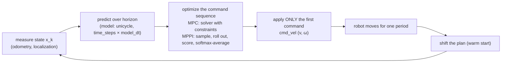

# FCT.06 — State space, LQR and MPC — an introduction

<!-- glance:start -->
<!-- generated by tools/build.py from curriculum/syllabus.yaml — edit the syllabus, not this block -->

| | |
|---|---|
| **Track** | Optional foundation |
| **Difficulty** | Advanced |
| **Time** | 1 h 15 min |
| **Hardware** | none |
| **Software** | python |
| **Prerequisites** | [FCT.04 Stability: poles without the pain](FCT.04-stability-intuition.md) |
| **Optional prerequisites** | [FM.20 Optimization for robotics and ML: gradient descent to nonlinear least squares](../mathematics/FM.20-optimization-basics.md) |
| **Skip if** | You understand MPC well enough to tune Nav2's MPPI. |

<!-- glance:end -->

## What you will learn

- Write a robot subsystem as a state-space model $\dot x = Ax + Bu$ and read its poles from the eigenvalues of $A$.
- Explain state feedback $u = -Kx$, and compute an LQR gain with `scipy.linalg` from a cost trade-off in $Q$ and $R$.
- Explain model predictive control (MPC): predict over a horizon, optimize subject to limits, apply the first move, repeat.
- Implement a small constrained MPC, and show why it respects karmel's speed limit when a clipped LQR does not.
- Implement MPPI, the sampling-based MPC inside Nav2's controller, and map its parameters (`time_steps`, `model_dt`, `batch_size`, `temperature`, sampling standard deviations, critics) to what they do.

## Why it matters

PID ([module 08](../../08-control/08.07-pid-mathematics.md)) handles one error signal at a time and knows nothing about limits until it hits them. Navigation needs more:

- the robot's state has several coupled parts (x, y, heading, speed);
- speed and acceleration are limited;
- obstacles are hard constraints;
- the best move now depends on what comes in the next few seconds.

That is the job of **model predictive control**. Nav2's recommended local controller, **MPPI** (`nav2_mppi_controller`), is a sampling-based MPC. Lesson [12.05](../../12-navigation/12.05-local-planning-obstacle-avoidance.md) uses it, and [12.08](../../12-navigation/12.08-nav2-on-the-real-robot.md) tunes it for a small, slow robot. Without this lesson, its parameters are a list of magic numbers. With it, you can predict what raising `temperature` or shortening `time_steps` does before trying it on karmel in the hallway.

<!-- prereqs:start -->
## Prerequisites

You need these first:

- [FCT.04 Stability: poles without the pain](FCT.04-stability-intuition.md)

### Optional prerequisite links

New to any of these? Take the foundation lesson first; skip it if you already know it.

- [FM.20 Optimization for robotics and ML: gradient descent to nonlinear least squares](../mathematics/FM.20-optimization-basics.md)

Check your readiness: `python course.py why FCT.06`
<!-- prereqs:end -->

## Concept

**State space** is a way to write any dynamic system as "the state now, plus the input now, gives the state's rate of change":

$$\dot x = f(x, u)$$

For linear systems, $\dot x = Ax + Bu$. You met the idea in [FCT.03](FCT.03-differential-equations-simulation.md). Its power is that multi-variable systems (position *and* velocity, x *and* y *and* heading) become one vector equation, so one design method handles them all.

**State feedback** uses the *whole* state, not just an error: $u = -Kx$. PD control on position is a special case: $K = [K_p, K_d]$ multiplies position and velocity. The question is how to choose $K$.

**LQR** (linear-quadratic regulator) chooses $K$ by stating what you care about as a cost:

$$J = \int_0^\infty \left(x^\top Q x + u^\top R u\right)\,dt$$

$Q$ says how much you hate being away from the target, $R$ how much you hate using effort. Large $Q$ relative to $R$ gives an aggressive controller; large $R$ gives a gentle one. LQR finds the best linear $K$ for that trade-off by solving a matrix equation, the Riccati equation. It is like setting an SLO and a cost budget, then letting an optimizer choose the autoscaling policy. The limitation: LQR assumes no limits. If its answer asks for 3 m/s² and the robot can do 1, you clip it, and the optimality (and sometimes the safety) is gone.

**MPC** handles the limits. At every control tick:

1. **predict:** simulate the model forward over a **horizon** (say 2.8 s) for a candidate sequence of commands;
2. **optimize:** find the sequence that minimizes the cost *subject to constraints* (speed ≤ 0.5 m/s, acceleration ≤ 1 m/s², no collision);
3. **apply only the first command;**
4. **repeat** at the next tick from the newly measured state (the **receding horizon**).

This is how a good driver works: look a few seconds ahead, plan, commit only to the next small action, re-plan as the world updates.

**MPPI** (model predictive path integral) solves step 2 without gradients. It samples a thousand noisy variations of the current plan, simulates them all, scores each with **critics** (goal distance, obstacle cost, path alignment…), and averages them, weighting low-cost ones exponentially more. The **temperature** sets how strongly "better" wins the average. Because it only needs to *evaluate* costs, any cost works, including costmaps with sharp obstacle edges that gradient-based optimizers hate, and the rollouts parallelize well.

> [!TIP]
> **Ask your teacher:** "Walk me through one MPPI iteration with five sampled trajectories and made-up costs, including the softmax weights and the resulting averaged command."

## Technical explanation

### Level 1 — State-space models on karmel

**Wheel under duty control**, with state $x = [\theta, \omega]^\top$ and input $u$ = duty:

$$\dot x = \underbrace{\begin{bmatrix}0 & 1\\ 0 & -1/\tau\end{bmatrix}}_{A} x + \underbrace{\begin{bmatrix}0\\ K/\tau\end{bmatrix}}_{B} u, \qquad \tau = 0.08,\ K = 19.3$$

The eigenvalues of $A$ are the open-loop poles ([FCT.04](FCT.04-stability-intuition.md)): **0** (the angle integrates speed) and **−12.5** s⁻¹ (the motor's 80 ms lag).

**Robot driving along a line**, with the wheel-speed loop assumed fast. State $x = [p - p_{goal},\ v]^\top$ and input $u = a$, the acceleration command, give the **double integrator**:

$$\dot x = \begin{bmatrix}0&1\\0&0\end{bmatrix}x + \begin{bmatrix}0\\1\end{bmatrix}u$$

**Robot in the plane** (nonlinear unicycle, [09.01](../../09-odometry/09.01-diff-drive-kinematics.md)), with state $(x, y, \theta)$ and inputs $(v, \omega)$:

$$\dot x = v\cos\theta,\quad \dot y = v\sin\theta,\quad \dot\theta = \omega$$

This is exactly Nav2 MPPI's `DiffDrive` motion model.

**Discrete time.** Controllers run at a fixed period, so convert with a zero-order hold ([FCT.05](FCT.05-discrete-time-sampling.md)): $x_{k+1} = A_d x_k + B_d u_k$ with `scipy.signal.cont2discrete`. For the double integrator at Δt = 0.1 s:

$$A_d = \begin{bmatrix}1&0.1\\0&1\end{bmatrix},\qquad B_d = \begin{bmatrix}0.005\\0.1\end{bmatrix}$$

### Level 2 — LQR

With $u = -Kx$, the closed loop is $\dot x = (A - BK)x$. Its poles are the eigenvalues of $A - BK$, and LQR places them for you. The continuous solution is

$$A^\top P + PA - PBR^{-1}B^\top P + Q = 0,\qquad K = R^{-1}B^\top P$$

`scipy.linalg.solve_continuous_are(A, B, Q, R)` returns $P$. The discrete version uses `solve_discrete_are` and $K = (R + B^\top P B)^{-1}B^\top P A$.

*Checkable example:* double integrator, $Q = \mathrm{diag}(1, 0)$ (care only about position), $R = 1$.
- The Riccati solution gives $K = [1,\ \sqrt 2] = [1.000,\ 1.414]$.
- Closed-loop poles: $-0.707 \pm 0.707j$, a damping ratio of exactly 0.707.
- This is PD control with gains chosen by optimization, not by feel.

*The trade-off:*

| $R$ | $K$ | Command when 1 m from the goal |
|---|---|---|
| 0.1 | [3.16, 2.52] | 3.16 m/s², three times karmel's limit |
| 1 | [1.00, 1.41] | 1.00 m/s² |
| 10 | [0.32, 0.80] | 0.32 m/s² |

**LQR's blind spot.** The discrete LQR with $Q = \mathrm{diag}(10, 1)$, $R = 1$ at 10 Hz, from 2 m before the goal and with its acceleration clipped to ±1 m/s², reaches **1.26 m/s**. That is 2.5× karmel's 0.5 m/s software limit. It overshoots by 4.1 cm and settles in 5.2 s. It "wins" only by breaking a rule it never knew about.

### Level 3 — MPC with constraints

At each step solve

$$\min_{u_0\dots u_{N-1}} \sum_{k=1}^{N} x_k^\top Q x_k + R\sum_{k=0}^{N-1} u_k^2 \quad\text{s.t.}\quad x_{k+1} = A_d x_k + B_d u_k,\ \ |u_k| \le 1.0,\ \ |v_k| \le 0.5$$

then apply $u_0$ and shift the plan to warm-start the next solve. The script uses `scipy.optimize.minimize` (SLSQP) for clarity. Real MPC uses QP solvers such as OSQP that finish in microseconds.

*Result, same $Q$ and $R$, horizon $N = 20$ (2 s):*

| Controller | Max speed | Overshoot | Settled (1 cm, 1 cm/s) |
|---|---|---|---|
| LQR + clipping | 1.258 m/s ✗ | 4.1 cm | 5.2 s |
| MPC | **0.500 m/s** ✓ | 1.7 cm | 6.6 s |

The MPC accelerates at the limit, cruises at exactly 0.5 m/s, and brakes in time because the horizon shows it the goal coming.

**Horizon matters.** With $N = 10$ (1 s) the overshoot is 4.5 cm. With $N = 5$ (0.5 s) it is 21 cm: the controller cannot see far enough ahead to start braking. A rule of thumb: the horizon should cover at least the stopping time and distance, plus the reaction you need. For karmel, braking from 0.5 m/s at 1 m/s² takes 0.5 s and 0.125 m ([FP.01](../physics/FP.01-kinematics-units.md)).

### Level 4 — MPPI: sampling-based MPC in Nav2

MPPI (Williams et al., 2016) replaces the optimizer with sampling. Keep a nominal control sequence $U = (v_t, \omega_t)_{t=0}^{T-1}$. Each iteration:

1. **Sample** $M$ perturbations $\epsilon^{(m)} \sim \mathcal N(0, \Sigma)$, with standard deviations `vx_std` and `wz_std`. Clip $U + \epsilon^{(m)}$ to the velocity limits.
2. **Roll out** each sequence through the motion model for `time_steps` steps of `model_dt`.
3. **Score** each trajectory: $S^{(m)} = \sum$ critic costs.
4. **Weight** with a softmax: $w^{(m)} = \exp\!\big(-(S^{(m)} - S_{min})/\lambda\big)$, normalized, where λ is the **temperature**.
5. **Update** $U \leftarrow U + \sum_m w^{(m)}\epsilon^{(m)}$. Apply $U_0$, shift $U$ by one step, and repeat at the next tick.

The script's toy version has karmel drive to a goal 2 m ahead with a 20 cm-radius obstacle (plus 15 cm robot radius) almost on the straight line. It uses Nav2's default sizes: 56 steps × 0.05 s = 2.8 s of horizon, 1000 samples, temperature 0.3. It reaches the goal in **6.60 s**, passing 3.8 cm clear on the right. The critics are simplified versions of Nav2's GoalCritic, CostCritic (collision), obstacle repulsion and PreferForwardCritic.

**What the parameters do** (names from `nav2_mppi_controller`):

| Parameter | Meaning | Turn it up → | Turn it down → |
|---|---|---|---|
| `time_steps` × `model_dt` | prediction horizon (default 56 × 0.05 = 2.8 s) | sees further, more compute | myopic, late braking |
| `model_dt` | rollout step; should equal the control period (1/`controller_frequency`) | coarser prediction | finer, more steps needed |
| `batch_size` | number of samples $M$ | better solutions, more CPU | noisy, jerky commands |
| `temperature` λ | how strongly low cost dominates the average | averages everything, sluggish and indecisive | follows the best sample, jittery |
| `vx_std`, `wz_std` | exploration noise | explores more manoeuvres, noisier | smooth but can miss detours |
| `vx_max`, `vx_min`, `wz_max` | velocity limits the samples are clipped to | – | – |
| critics and `cost_weight` | what "good" means: goal, path alignment, obstacles, forward preference | that behaviour dominates | – |
| `gamma` | trade-off between smoothness and low control energy in the update | – | – |

*Numerical experiments in the script* (same scene):
- temperature 0.05: goal in 5.45 s, 3.5 cm clearance;
- temperature 3.0: **does not reach the goal within 12 s** (still 1.54 m away);
- `batch_size` 50: goal in 7.95 s with only 1.9 cm clearance.

The high temperature averages good and bad samples almost equally, so the plan barely improves. The small batch rarely samples a good detour, and when it does, it cuts close.

> [!IMPORTANT]
> **Version-sensitive** (verified 2026-09 against ROS 2 Jazzy, `navigation2` 1.3.x). On the Jazzy docs page the defaults include `time_steps` 56, `model_dt` 0.05, `batch_size` 1000, `temperature` 0.3, `gamma` 0.015, `vx_max` 0.5, `vx_min` −0.35 and `wz_max` 1.9. The acceleration limits `ax_max`, `ax_min` and `az_max` appear there too. Sampling standard deviations differ between the docs page and the package README, so check both before tuning: https://docs.nav2.org/jazzy/configuration_and_development/configuration_guide/controller_plugins/mppi_controller/configuring_mppic/
> AI teacher: verify against current documentation before giving parameter values.

## Diagram

The receding-horizon loop shared by MPC and MPPI:



One MPPI iteration from above (karmel, obstacle ahead):

```text
            sampled rollouts (thin), weighted average (thick)
                        . ' ' ' ' ' .
                    . '       .-----. ' .            ★ goal (2, 0)
   robot ▶ ======== ============(  ●  )             high cost: collision → weight ≈ 0
          ' .                   '-----'
              ' . . . _____________________ . . ★    low cost: clears the obstacle → weight ≈ 1
                          (thick = new plan, first command applied, then re-plan)

   weight_m = exp(−(S_m − S_min) / temperature)     temperature small → pick the best
                                                    temperature large → plain average
```

## Code

Save as `fct06_lqr_mpc_mppi.py` and run `python fct06_lqr_mpc_mppi.py` (needs `numpy`, `scipy`, `matplotlib`). It prints state-space poles and LQR gains, compares a clipped LQR with a constrained MPC on a 2 m move, and runs a vectorized MPPI around an obstacle with Nav2-named parameters and three variations. It takes about half a minute, mostly the SLSQP-based MPC.

```python
"""FCT.06 — state space, LQR, MPC and MPPI on karmel.

Run: python fct06_lqr_mpc_mppi.py   (needs numpy, scipy, matplotlib)
"""
from __future__ import annotations

import math
from dataclasses import dataclass

import matplotlib

matplotlib.use("Agg")
import matplotlib.pyplot as plt
import numpy as np
from scipy.linalg import solve_continuous_are, solve_discrete_are
from scipy.optimize import minimize
from scipy.signal import cont2discrete

K, TAU = 17.0 / 0.88, 0.08
DT = 0.1                      # MPC / LQR step for the 1-D example [s]
A_MAX, V_MAX = 1.0, 0.5       # karmel.yaml limits


# ---------------------------------------------------------------- state space + LQR
def wheel_state_space() -> tuple[np.ndarray, np.ndarray]:
    """x = [angle, speed], u = duty:  angle' = speed,  speed' = -speed/tau + K/tau * u."""
    return np.array([[0.0, 1.0], [0.0, -1.0 / TAU]]), np.array([[0.0], [K / TAU]])


def dlqr(A: np.ndarray, B: np.ndarray, Q: np.ndarray, R: np.ndarray) -> np.ndarray:
    P = solve_discrete_are(A, B, Q, R)
    return np.linalg.solve(R + B.T @ P @ B, B.T @ P @ A)


def double_integrator(dt: float) -> tuple[np.ndarray, np.ndarray]:
    """x = [position error, velocity], u = acceleration (the robot driving along a line)."""
    Ad, Bd, *_ = cont2discrete((np.array([[0, 1], [0, 0]]), np.array([[0], [1]]), np.eye(2), np.zeros((2, 1))), dt)
    return Ad, Bd


def simulate_lqr(x0: np.ndarray, steps: int, Q: np.ndarray, R: np.ndarray) -> tuple[np.ndarray, np.ndarray]:
    Ad, Bd = double_integrator(DT)
    Kd = dlqr(Ad, Bd, Q, R)
    xs, us = [x0], []
    for _ in range(steps):
        u = float(np.clip(-(Kd @ xs[-1])[0], -A_MAX, A_MAX))    # actuator limit, applied after the fact
        us.append(u)
        xs.append(Ad @ xs[-1] + Bd[:, 0] * u)
    return np.array(xs), np.array(us)


# ---------------------------------------------------------------- linear MPC with constraints
def mpc_step(x0: np.ndarray, u_guess: np.ndarray, Q: np.ndarray, R: float, horizon: int) -> np.ndarray:
    Ad, Bd = double_integrator(DT)

    def rollout(u: np.ndarray) -> np.ndarray:
        xs, x = [], x0
        for uk in u:
            x = Ad @ x + Bd[:, 0] * uk
            xs.append(x)
        return np.array(xs)

    def cost(u: np.ndarray) -> float:
        xs = rollout(u)
        return float(np.sum(xs @ Q * xs) + R * np.sum(u**2))

    cons = [{"type": "ineq", "fun": lambda u: V_MAX - rollout(u)[:, 1]},    # v <= 0.5
            {"type": "ineq", "fun": lambda u: V_MAX + rollout(u)[:, 1]}]    # v >= -0.5
    res = minimize(cost, u_guess, method="SLSQP", bounds=[(-A_MAX, A_MAX)] * horizon, constraints=cons,
                   options={"maxiter": 200, "ftol": 1e-9})
    return res.x


def simulate_mpc(x0: np.ndarray, steps: int, Q: np.ndarray, R: float, horizon: int = 20):
    Ad, Bd = double_integrator(DT)
    xs, us, u_plan = [x0], [], np.zeros(horizon)
    for _ in range(steps):
        u_plan = mpc_step(xs[-1], u_plan, Q, R, horizon)
        us.append(u_plan[0])                                  # receding horizon: apply only the first move
        xs.append(Ad @ xs[-1] + Bd[:, 0] * u_plan[0])
        u_plan = np.append(u_plan[1:], 0.0)                   # warm start: shift the plan
    return np.array(xs), np.array(us)


def settle_time(xs: np.ndarray) -> float:
    ok = (np.abs(xs[:, 0]) < 0.01) & (np.abs(xs[:, 1]) < 0.01)
    bad = np.where(~ok)[0]
    return (bad[-1] + 1) * DT if bad.size else 0.0


# ---------------------------------------------------------------- MPPI for a differential-drive robot
@dataclass(frozen=True)
class MppiParams:                  # names follow nav2_mppi_controller
    time_steps: int = 56
    model_dt: float = 0.05
    batch_size: int = 1000
    temperature: float = 0.3
    vx_std: float = 0.2
    wz_std: float = 0.4
    vx_max: float = 0.5
    vx_min: float = -0.35
    wz_max: float = 1.9


GOAL = np.array([2.0, 0.0])
OBSTACLE, OBSTACLE_R, ROBOT_R = np.array([1.0, 0.05]), 0.20, 0.15


def rollout_unicycle(state: np.ndarray, v: np.ndarray, w: np.ndarray, dt: float) -> np.ndarray:
    """state (3,), v and w (batch, T) -> poses (batch, T, 3)."""
    batch, T = v.shape
    poses = np.empty((batch, T, 3))
    x = np.tile(state, (batch, 1))
    for t in range(T):
        x = x + dt * np.stack([v[:, t] * np.cos(x[:, 2]), v[:, t] * np.sin(x[:, 2]), w[:, t]], axis=1)
        poses[:, t] = x
    return poses


def trajectory_cost(poses: np.ndarray, v: np.ndarray) -> np.ndarray:
    d_goal = np.linalg.norm(poses[:, :, :2] - GOAL, axis=2)
    d_obs = np.linalg.norm(poses[:, :, :2] - OBSTACLE, axis=2) - OBSTACLE_R - ROBOT_R
    goal_cost = 5.0 * d_goal.mean(axis=1) + 10.0 * d_goal[:, -1]                  # like GoalCritic
    collision = np.where(d_obs.min(axis=1) < 0.0, 1e4, 0.0)                        # like CostCritic collision_cost
    repulsion = 20.0 * np.clip(0.15 - d_obs, 0.0, None).mean(axis=1)               # stay a margin away
    reverse = 5.0 * np.clip(-v, 0.0, None).mean(axis=1)                            # like PreferForwardCritic
    return goal_cost + collision + repulsion + reverse


def mppi_run(p: MppiParams, seed: int = 0, sim_time: float = 12.0):
    rng = np.random.default_rng(seed)
    state = np.array([0.0, 0.0, 0.0])
    v_nom = np.zeros(p.time_steps)
    w_nom = np.zeros(p.time_steps)
    path, clearances = [state.copy()], []
    for step in range(int(sim_time / p.model_dt)):
        eps_v = rng.normal(0.0, p.vx_std, (p.batch_size, p.time_steps))
        eps_w = rng.normal(0.0, p.wz_std, (p.batch_size, p.time_steps))
        v = np.clip(v_nom + eps_v, p.vx_min, p.vx_max)
        w = np.clip(w_nom + eps_w, -p.wz_max, p.wz_max)
        poses = rollout_unicycle(state, v, w, p.model_dt)
        cost = trajectory_cost(poses, v)
        weights = np.exp(-(cost - cost.min()) / p.temperature)       # softmax over trajectories
        weights /= weights.sum()
        v_nom = np.clip(v_nom + weights @ (v - v_nom), p.vx_min, p.vx_max)
        w_nom = np.clip(w_nom + weights @ (w - w_nom), -p.wz_max, p.wz_max)
        # apply the first command to the "real" robot, then shift the plan (warm start)
        state = rollout_unicycle(state, v_nom[None, :1], w_nom[None, :1], p.model_dt)[0, 0]
        path.append(state.copy())
        clearances.append(np.linalg.norm(state[:2] - OBSTACLE) - OBSTACLE_R - ROBOT_R)
        v_nom = np.append(v_nom[1:], v_nom[-1])
        w_nom = np.append(w_nom[1:], w_nom[-1])
        if np.linalg.norm(state[:2] - GOAL) < 0.05:
            return np.array(path), (step + 1) * p.model_dt, min(clearances)
    return np.array(path), float("nan"), min(clearances)


def main() -> None:
    A, B = wheel_state_space()
    print(f"wheel state space: eigenvalues of A = {np.linalg.eigvals(A)} (poles: integrator + motor)")

    # continuous LQR on the double integrator, Q = diag(1, 0), R = 1  -> K = [1, sqrt(2)]
    Ac, Bc = np.array([[0.0, 1.0], [0.0, 0.0]]), np.array([[0.0], [1.0]])
    P = solve_continuous_are(Ac, Bc, np.diag([1.0, 0.0]), np.array([[1.0]]))
    Kc = (Bc.T @ P).ravel()
    print(f"continuous LQR, Q=diag(1,0), R=1: K = [{Kc[0]:.4f}, {Kc[1]:.4f}], "
          f"closed-loop poles {np.round(np.linalg.eigvals(Ac - Bc @ Kc[None, :]), 4)}")
    for r in (0.1, 1.0, 10.0):
        P = solve_continuous_are(Ac, Bc, np.diag([1.0, 0.0]), np.array([[r]]))
        Kr = (Bc.T @ P / r).ravel()
        print(f"  R={r:5.1f}: K = [{Kr[0]:.3f}, {Kr[1]:.3f}]  -> standing 1 m from the goal it asks for {Kr[0]:.2f} m/s^2 "
              f"(karmel's limit {A_MAX})")

    Q, R = np.diag([10.0, 1.0]), 1.0
    Kd = dlqr(*double_integrator(DT), Q, np.array([[R]]))
    print(f"\ndiscrete LQR (dt={DT}), Q=diag(10,1), R=1: K = [{Kd[0, 0]:.3f}, {Kd[0, 1]:.3f}]")
    x0 = np.array([-2.0, 0.0])                                # 2 m before the goal, standing still
    xs_l, us_l = simulate_lqr(x0, 80, Q, np.array([[R]]))
    xs_m, us_m = simulate_mpc(x0, 80, Q, R)
    for name, xs, us in (("LQR + clipping", xs_l, us_l), ("MPC (N=20)", xs_m, us_m)):
        print(f"  {name:15s} max speed {xs[:, 1].max():.3f} m/s (limit {V_MAX}), max |accel| {np.abs(us).max():.2f}, "
              f"overshoot {max(0.0, xs[:, 0].max()) * 100:.1f} cm, settled (1 cm, 1 cm/s) at {settle_time(xs):.1f} s")

    p = MppiParams()
    path, t_goal, clearance = mppi_run(p)
    print(f"\nMPPI (time_steps={p.time_steps}, model_dt={p.model_dt}, horizon {p.time_steps * p.model_dt:.1f} s, "
          f"batch={p.batch_size}, temperature={p.temperature}):")
    print(f"  reached goal in {t_goal:.2f} s, minimum clearance to the obstacle {clearance * 100:.1f} cm, "
          f"passed on the {'left' if path[np.argmin(np.abs(path[:, 0] - OBSTACLE[0])), 1] > OBSTACLE[1] else 'right'}")
    for label, params in (("temperature=0.05", MppiParams(temperature=0.05)),
                          ("temperature=3.0", MppiParams(temperature=3.0)),
                          ("batch_size=50", MppiParams(batch_size=50))):
        path2, t2, c2 = mppi_run(params)
        result = f"goal in {t2:.2f} s" if not math.isnan(t2) else             f"NOT reached in 12 s (still {np.linalg.norm(path2[-1, :2] - GOAL):.2f} m away)"
        print(f"  {label:16s}: {result}, clearance {c2 * 100:.1f} cm")

    fig, ax = plt.subplots(1, 2, figsize=(11, 4))
    t = np.arange(len(xs_l)) * DT
    ax[0].plot(t, xs_l[:, 1], label="LQR + clip: speed")
    ax[0].plot(t, xs_m[:, 1], label="MPC: speed")
    ax[0].plot(t, xs_l[:, 0] / 4, "--", label="LQR: position/4")
    ax[0].plot(t, xs_m[:, 0] / 4, "--", label="MPC: position/4")
    ax[0].axhline(V_MAX, color="k", ls=":", lw=0.8)
    ax[0].set_xlabel("time [s]")
    ax[0].legend(fontsize=8)
    ax[0].set_title("drive 2 m: LQR vs constrained MPC")
    ax[1].plot(path[:, 0], path[:, 1], label="MPPI path")
    ax[1].add_patch(plt.Circle(OBSTACLE, OBSTACLE_R, color="r", alpha=0.4, label="obstacle"))
    ax[1].add_patch(plt.Circle(OBSTACLE, OBSTACLE_R + ROBOT_R, color="r", fill=False, ls=":"))
    ax[1].plot(*GOAL, "g*", ms=12, label="goal")
    ax[1].set_aspect("equal")
    ax[1].legend(fontsize=8)
    ax[1].set_title("MPPI around an obstacle")
    for a in ax:
        a.grid(True)
    fig.tight_layout()
    fig.savefig("fct06_lqr_mpc_mppi.png", dpi=120)
    print("saved fct06_lqr_mpc_mppi.png")


if __name__ == "__main__":
    main()
```

Output:

```text
wheel state space: eigenvalues of A = [  0. +0.j -12.5+0.j] (poles: integrator + motor)
continuous LQR, Q=diag(1,0), R=1: K = [1.0000, 1.4142], closed-loop poles [-0.7071+0.7071j -0.7071-0.7071j]
  R=  0.1: K = [3.162, 2.515]  -> standing 1 m from the goal it asks for 3.16 m/s^2 (karmel's limit 1.0)
  R=  1.0: K = [1.000, 1.414]  -> standing 1 m from the goal it asks for 1.00 m/s^2 (karmel's limit 1.0)
  R= 10.0: K = [0.316, 0.795]  -> standing 1 m from the goal it asks for 0.32 m/s^2 (karmel's limit 1.0)

discrete LQR (dt=0.1), Q=diag(10,1), R=1: K = [2.762, 2.508]
  LQR + clipping  max speed 1.258 m/s (limit 0.5), max |accel| 1.00, overshoot 4.1 cm, settled (1 cm, 1 cm/s) at 5.2 s
  MPC (N=20)      max speed 0.500 m/s (limit 0.5), max |accel| 1.00, overshoot 1.7 cm, settled (1 cm, 1 cm/s) at 6.6 s

MPPI (time_steps=56, model_dt=0.05, horizon 2.8 s, batch=1000, temperature=0.3):
  reached goal in 6.60 s, minimum clearance to the obstacle 3.8 cm, passed on the right
  temperature=0.05: goal in 5.45 s, clearance 3.5 cm
  temperature=3.0 : NOT reached in 12 s (still 1.54 m away), clearance 17.5 cm
  batch_size=50   : goal in 7.95 s, clearance 1.9 cm
saved fct06_lqr_mpc_mppi.png
```

**The plot `fct06_lqr_mpc_mppi.png`** has two panels.

- **Left:** speed and scaled position over 8 s.
  - The LQR speed shoots up at 1 m/s² past the dotted 0.5 m/s line to a peak of about 1.26 m/s at 1.4 s, then brakes; its position curve reaches the goal by about 3 s with a small overshoot.
  - The MPC speed rises at the same rate, flattens exactly on the 0.5 m/s line until about 3.4 s, then brakes smoothly; its position reaches the goal around 5–6 s.
- **Right:** a top view.
  - The MPPI path leaves the origin straight, curves right to pass under the red obstacle and its dotted inflated boundary, reaching y ≈ −0.34 m at x = 1.0.
  - It returns to the x-axis and ends at the green star at (2, 0).

## Exercise

### Exercise FCT.06-E1 — LQR by hand and by code `[numerical]`

Hardware: none. For the double integrator with $Q = \mathrm{diag}(4, 0)$ and $R = 1$, the Riccati solution gives $K = [\sqrt{q},\ \sqrt{2\sqrt{q}}]$ for $Q = \mathrm{diag}(q, 0)$.

1. Compute $K$, the closed-loop characteristic polynomial $s^2 + K_2 s + K_1$, its poles, and the damping ratio.
2. Confirm with `solve_continuous_are`.
3. Standing 0.8 m from the goal, what acceleration does it command, and does karmel's 1.0 m/s² limit clip it?

### Exercise FCT.06-E2 — Horizon and limits `[coding]`

Hardware: none. Using `simulate_mpc` from x0 = [−2, 0] with $Q = \mathrm{diag}(10, 1)$ and $R = 1$, run:
- (a) `V_MAX` = 0.3 with horizon 20;
- (b) `V_MAX` = 0.5 with horizon 10;
- (c) `V_MAX` = 0.5 with horizon 5.

Report the max speed, overshoot and settling time. Explain (c) with the stopping distance.

### Exercise FCT.06-E3 — Predict MPPI tuning `[predict]`

Hardware: none. Before running, predict for the lesson's scene whether each change makes karmel reach the goal faster, slower, or not at all, and whether clearance grows or shrinks:
- (a) temperature 0.05;
- (b) temperature 3.0;
- (c) `batch_size` 50.

Then compare with the script output, and run seeds 1–3 of the default configuration to see the natural spread.

### Exercise FCT.06-E4 — Mismatched `model_dt` `[debugging]`

Hardware: none. A teammate sets Nav2's `controller_frequency` to 10 Hz but leaves `model_dt` at 0.05 s. Modify `mppi_run` so each chosen command is applied for **0.1 s** (two model steps) before re-planning, while the plan still shifts by one step. Compare the time to goal and clearance with the matched case. Explain why the docs say `model_dt` should equal the control period.

## Expected result

**FCT.06-E1:**
1. $K = [2, 2]$. The characteristic polynomial is $s^2 + 2s + 2$, with poles $-1 \pm 1j$, so ζ = 0.707. For this cost structure LQR always gives ζ = 0.707, whatever $q$ is.
2. `solve_continuous_are` returns $K$ = [2.000, 2.000].
3. The command is $2 \times 0.8 = 1.6$ m/s², which karmel's 1.0 m/s² limit **clips**.

**FCT.06-E2:**
- (a) Max speed **0.300 m/s**, overshoot about 1.0 cm, settled at **7.9 s**.
- (b) Max speed 0.500 m/s, overshoot **4.5 cm**, settled at 7.1 s.
- (c) Max speed 0.500 m/s, overshoot **21 cm**, settled at 8.1 s.

With a 0.5 s horizon, the controller at 0.5 m/s cannot see the goal until it is within about 0.25 m. Stopping needs 0.125 m plus the time the position cost takes to dominate, so it brakes too late. The horizon must cover the stopping maneuver.

**FCT.06-E3:**
- (a) **Faster**, 5.45 s, with slightly less clearance (3.5 cm): it follows the best samples greedily.
- (b) **Not at all** within 12 s (1.54 m from the goal): the average washes out the good samples.
- (c) **Slower** (7.95 s) and **closer** (1.9 cm): too few samples to find a clean detour.

Default runs with seeds 1–3 take 6.55–6.85 s with 2.4–3.6 cm clearance, so treat differences under about 0.3 s as noise.

**FCT.06-E4:** Holding each command for 0.1 s gives roughly **7.25 s** to goal with 4.1 cm clearance, against 6.60 s and 3.8 cm when matched. The plan assumes each command lasts 0.05 s, but the robot executes it twice as long, so predictions and reality drift apart and the controller keeps correcting its own stale plan. With faster motion or tighter spaces, the mismatch causes overshoot and oscillation. Set `model_dt` = 1/`controller_frequency`.

## Troubleshooting

### Symptom: LQR or MPC behaves nothing like the simulation on the robot
1. Check the model's units and sign conventions (m, rad, s; REP-103). A flipped ω sign steers into obstacles.
2. Check the model's assumptions. The double integrator assumes the wheel-speed loop tracks commands quickly. If karmel's inner loop lags (τ_cl ≈ 20–25 ms plus delays), include it or slow the outer controller down.
3. Check the state estimate. MPC is only as good as the measured state; odometry drift and localization jumps feed straight in.

### Symptom: Nav2 MPPI makes the robot jitter or wiggle
1. Temperature too low, or sampling standard deviations too high: the best sample changes every tick. Raise `temperature` slightly or lower `wz_std`.
2. `batch_size` too small for the chosen standard deviations. Raise it if the CPU allows, and check the controller's actual rate in its logs.
3. `model_dt` not matching the controller period (E4).

### Symptom: MPPI hesitates, stops short, or refuses to pass a gap
1. The obstacle or cost critic dominates: lower its weight or the costmap inflation ([12.04](../../12-navigation/12.04-costmaps.md)).
2. The horizon is too short to see around the obstacle; check `time_steps` × `model_dt` against the geometry.
3. Temperature so high that good samples are averaged away (E3b).

### Symptom: the MPC solve takes longer than the control period
1. Shorten the horizon, or reduce the model resolution (larger Δt within reason).
2. Warm-start from the shifted previous plan (the script does this).
3. Use a dedicated QP solver instead of general-purpose SLSQP. For MPPI, reduce `batch_size` or `time_steps` and measure.

## Common mistakes

- **Clipping LQR output and calling it constrained control.** Clipping ignores state limits (speed) and loses optimality. Use MPC when limits matter.
- **Choosing a horizon shorter than the stopping maneuver.** The controller then brakes late or overshoots.
- **Tuning Q and R, or critic weights, without normalizing units.** A position in metres and an angle in radians weighted equally is not "equal".
- **Mismatching `model_dt` and the control rate** in MPPI.
- **Expecting MPC to fix a bad model or bad state estimate.** It optimizes the model's future, not the real one.
- **Raising `batch_size` without checking CPU load on the Pi.** A controller that misses its deadline behaves like one with added delay ([FCT.05](FCT.05-discrete-time-sampling.md)).

## Knowledge check

1. Write karmel's wheel as a state-space model with state [angle, speed]. What are the eigenvalues of A, and what do they mean?
   <details><summary>Answer</summary>

   A = [[0, 1], [0, −1/τ]] and B = [[0], [K/τ]]. The eigenvalues are **0** (angle integrates speed, so there is no restoring force) and **−12.5 s⁻¹** (the motor's 80 ms first-order lag).
   </details>

2. In LQR, what happens to the gains when you increase R, and why?
   <details><summary>Answer</summary>

   The gains get **smaller**. R penalizes control effort, so the optimum uses less acceleration and accepts slower convergence. For the double integrator with Q = diag(1, 0), the gain goes from K = [1, 1.41] at R = 1 to [0.32, 0.80] at R = 10.
   </details>

3. What does "receding horizon" mean, and why apply only the first command?
   <details><summary>Answer</summary>

   At each tick, plan over a horizon from the latest measured state, apply the first command, and re-plan at the next tick. The world and the state estimate change, so re-planning with fresh information corrects model errors and disturbances, like feedback, while still looking ahead.
   </details>

4. Predict: in MPPI, what happens as temperature → 0 and as temperature → ∞?
   <details><summary>Answer</summary>

   **→ 0:** the weights concentrate on the single lowest-cost sample, which is greedy and can be jittery. **→ ∞:** all samples get equal weight, so the update is a plain average of the noise, the plan barely improves, and the robot becomes indecisive. In the lesson's scene it did not reach the goal.
   </details>

5. Why does MPPI work with costmaps whose costs jump sharply at obstacle edges, while a gradient-based MPC struggles?
   <details><summary>Answer</summary>

   MPPI only evaluates costs of sampled trajectories and never needs derivatives. Discontinuous, non-convex costs are fine. Gradient-based solvers need smooth costs and can get stuck or fail at sharp edges.
   </details>

6. Debugging: after moving Nav2 to a slower computer, the controller runs at 12 Hz instead of 20 Hz, and karmel now weaves along corridors. Name two parameter-level causes and fixes.
   <details><summary>Answer</summary>

   (a) `model_dt` (0.05 s) no longer matches the real control period (about 0.083 s): set `controller_frequency` to what the machine can sustain, and `model_dt` to its inverse. (b) The computation misses deadlines because `batch_size` × `time_steps` is too expensive: reduce `batch_size` or `time_steps` and check that the rate recovers. Also reconsider the sampling standard deviations, since noisier sampling needs more samples.
   </details>

7. Karmel brakes at 1 m/s² from 0.5 m/s. What is the minimum sensible MPC or MPPI horizon in time and distance, and does Nav2's default meet it?
   <details><summary>Answer</summary>

   Stopping takes 0.5 s and 0.125 m, and the horizon should be comfortably longer to anticipate obstacles and the goal. Nav2's default of 56 × 0.05 = **2.8 s**, about 1.4 m at 0.5 m/s, easily covers it.
   </details>

## Practical challenge

Extend the MPPI example into a small **path follower**. Replace the single goal with a polyline path, for example an L-shaped corridor of 2 m then 1.5 m, with walls modelled as line obstacles.

- Add a PathAlign-like critic (distance from each rollout point to the path) and a PathFollow-like critic (progress along the path).
- Add acceleration limits by clipping the change in v and ω between steps (`ax_max` = 1.0 m/s², `az_max` = 3.5 rad/s²).

**Acceptance criteria:**
- Karmel follows the L-shaped corridor from start to end without collision, with a minimum wall clearance of at least 5 cm over 5 random seeds.
- It reports the time to goal, maximum lateral deviation from the path, and the RMS angular velocity, a smoothness proxy, for three temperatures and two batch sizes, as a table.
- Commanded speeds never exceed `vx_max` = 0.5 m/s, and acceleration never exceeds `ax_max` (asserted in a test).
- A short note maps each of your critics to its Nav2 counterpart and states which parameter you would tune first on the real karmel, and why ([12.08](../../12-navigation/12.08-nav2-on-the-real-robot.md)).

## You can skip this if…

You get knowledge-check questions 3, 4 and 6 right without looking, and you can explain Nav2 MPPI's parameters in terms of horizon, sampling, softmax weighting and critics.

`python course.py skip FCT.06 --reason "I understand state space, LQR and MPC well enough to tune Nav2's MPPI"`

## Go deeper

- [Nav2 MPPI controller configuration (Jazzy)](https://docs.nav2.org/jazzy/configuration_and_development/configuration_guide/controller_plugins/mppi_controller/configuring_mppic/): the official parameter and critic reference for the controller you will use.
- [nav2_mppi_controller README (Jazzy branch)](https://github.com/ros-navigation/navigation2/blob/jazzy/nav2_mppi_controller/README.md): the algorithm description and an example configuration from the source repository.
- [Williams et al., "Aggressive Driving with Model Predictive Path Integral Control", ICRA 2016](https://doi.org/10.1109/ICRA.2016.7487277): the original MPPI paper. Read the algorithm section.
- [Steve Brunton, Control Bootcamp](https://www.youtube.com/playlist?list=PLMrJAkhIeNNR20Mz-VpzgfQs5zrYi085m): short lectures on state space, controllability, pole placement and LQR, with code.
- [MIT Underactuated Robotics (Tedrake), LQR chapter](https://underactuated.csail.mit.edu/lqr.html): a rigorous but readable derivation of LQR and its use around trajectories.
- [Rawlings, Mayne & Diehl, Model Predictive Control: Theory, Computation, and Design (free book site)](https://sites.engineering.ucsb.edu/~jbraw/mpc/): the standard MPC reference, when you want the full theory.
- [SciPy `solve_discrete_are`](https://docs.scipy.org/doc/scipy/reference/generated/scipy.linalg.solve_discrete_are.html): the Riccati solver used for discrete LQR.

## Progress checkpoint

- [ ] I write robot subsystems in state-space form and read poles from A.
- [ ] I compute LQR gains and explain the Q/R trade-off.
- [ ] I explain MPC's receding horizon and why it handles limits that LQR clipping does not.
- [ ] I can implement MPPI and predict the effect of its main Nav2 parameters.

`python course.py complete FCT.06` (exercises done) · `python course.py master FCT.06` (challenge done) · `python course.py struggle FCT.06 "what was hard"`

Next: back to the main path. Continue with [12.05 — Local planning](../../12-navigation/12.05-local-planning-obstacle-avoidance.md), or with module 08 if you came from there.
