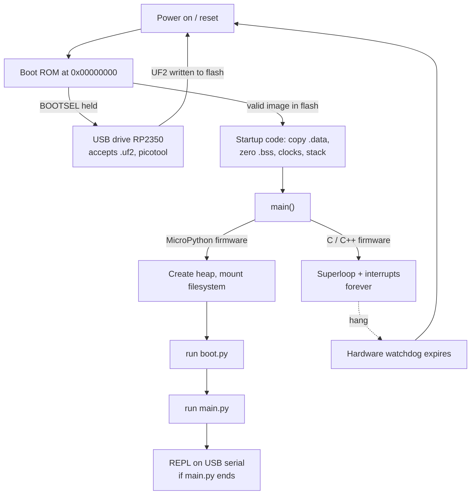

# FC.01 — Embedded systems 101 — life without an operating system

<!-- glance:start -->
<!-- generated by tools/build.py from curriculum/syllabus.yaml — edit the syllabus, not this block -->

| | |
|---|---|
| **Track** | Optional foundation |
| **Difficulty** | Beginner |
| **Time** | 45 min |
| **Hardware** | none |
| **Software** | none |
| **Prerequisites** | none |
| **Skip if** | You have written firmware for a microcontroller. |

<!-- glance:end -->

## What you will learn

- Explain what a microcontroller is, and why karmel has both a Pico 2 (microcontroller) and a Pi 5 (computer).
- Read a microcontroller's memory map: where the program (flash), the variables (SRAM) and the peripherals live.
- Explain "memory-mapped I/O": turn an LED on by writing a number to an address.
- Describe the firmware lifecycle (edit → build → flash → run → debug) and what happens between power-on and your first line of code.
- Budget flash and RAM for a firmware feature with real numbers.

## Why it matters

Half of karmel's software runs on a ₪35 Raspberry Pi Pico 2 with 520 kB of RAM and no operating system. It
drives the motors, counts encoder ticks, runs the wheel-speed PID and stops everything when the Pi goes silent. When
you flash it in [01.05](../../01-first-robot/01.05-pico-microcontroller-setup.md), spin a motor in
[01.08](../../01-first-robot/01.08-first-motor-spin.md), count ticks in [01.09](../../01-first-robot/01.09-reading-encoders.md)
or design the serial protocol in [01.10](../../01-first-robot/01.10-pi-pico-protocol.md), you work in a world with
no processes, no virtual memory, no `apt install` and no log files. Things that are free on a server cost
something there, and things that are hard on a server (hitting a 10 ms deadline every time) are easy there.
[08.12](../../08-control/08.12-control-in-ros2.md) decides which loops run where based on the ideas in this lesson.

This lesson is the map. [FC.02](FC.02-micropython-on-pico.md) puts MicroPython on the board, [FC.05](FC.05-interrupts-timers-pio.md)
handles interrupts and PIO, [FC.06](FC.06-pico-c-sdk.md) builds the same firmware in C, and
[FC.07](FC.07-real-time-concepts.md) makes "on time" precise.

<!-- prereqs:start -->
## Prerequisites

None — you can start here.

### Optional prerequisite links

None.

Check your readiness: `python course.py why FC.01`
<!-- prereqs:end -->

## Concept

A Raspberry Pi 5 is a small **server**. An operating system shares the CPU between hundreds of processes, gives
each one its own virtual address space, loads programs from a disk, and hides the hardware behind drivers and
files like `/dev/ttyACM0`. Your program is a guest.

A Raspberry Pi Pico 2 is a **microcontroller** (MCU): CPU, memory and I/O hardware on one chip, running exactly
one program that you burned into its flash. There is no OS underneath. When power arrives, the chip jumps into
your firmware and your firmware *is* the whole system. If it has an infinite loop, nothing else runs. If it
writes the wrong number to the wrong address, a pin changes, and no kernel stops it.

The .NET analogy: the Pi is IIS hosting many apps with a runtime, a GC and process isolation. The Pico is a single
`static void Main()` compiled for bare metal, with `Main` never returning, and with the hardware's control
registers visible as fields at fixed addresses.

Why would a robot want the second kind? Because of what it's good at:

| | Raspberry Pi Pico 2 (MCU) | Raspberry Pi 5 (single-board computer) |
|---|---|---|
| CPU | RP2350: 2× Cortex-M33 at 150 MHz | BCM2712: 4× Cortex-A76 |
| RAM | 520 kB | 4 or 8 GB (≈ 16,000× more) |
| Storage | 4 MB flash | microSD / NVMe, tens of GB |
| OS | none (bare metal, or MicroPython's runtime) | Ubuntu 24.04 + ROS 2 Jazzy |
| Boot to your code | about a second | tens of seconds |
| Timing | predictable to microseconds | usually fine, sometimes milliseconds late |
| Power | tens of mW (datasheet: ≈ 30–70 mW typical) | watts |
| Cost | ≈ ₪35 (Piitel, Sept 2026) | ≈ ₪500–800 |
| On karmel | PWM, encoders, PID, watchdog, sensors | ROS 2, SLAM, Nav2, camera, networking |

The Pico is weak at *thinking* and excellent at *reacting on time*. The Pi is the reverse. karmel uses both and
connects them with a serial protocol ([labs/README.md](../../labs/README.md)). A mobile robot, a drone flight
controller, a 3D printer and a car's ABS all use the same split.

> [!TIP]
> **Ask your teacher:** "Explain the Pi + Pico split as a distributed system: which one is the control plane, which is
> the data plane, and what happens to each when the link between them fails?"

## Technical explanation

### Level 1 — What is inside the chip

A microcontroller has five kinds of things on one piece of silicon:

1. **CPU cores.** The RP2350 has two Arm Cortex-M33 cores (or two RISC-V Hazard3 cores; the same chip boots either).
   No MMU (memory management unit), so no virtual memory: an address is a physical address.
2. **Flash** — non-volatile, keeps the program when power is off. On the Pico 2 it's a separate 4 MB chip next to the
   RP2350, read through a fast QSPI bus. The CPU runs code *directly from flash* ("execute in place", XIP).
3. **SRAM** — volatile working memory for variables, the stack and the heap. 520 kB, lost at every reset.
4. **Peripherals** — dedicated hardware that does I/O without the CPU doing every step: GPIO, PWM, ADC, UART, I²C,
   SPI, USB, timers, a watchdog, and on RP2350 three **PIO** blocks (12 tiny programmable state machines). A PWM
   peripheral keeps toggling a pin 20,000 times per second while the CPU does something else
   ([FE.07](../electronics/FE.07-pwm.md)).
5. **Clocks, reset and interrupt controller** — a crystal-derived clock that makes timing precise, and the NVIC that
   lets a peripheral interrupt the CPU when something happens ([FC.05](FC.05-interrupts-timers-pio.md)).

**SBC vs MCU in one sentence:** an SBC (single-board computer) puts an application processor with an MMU, gigabytes of
external RAM and storage on a board so it can run a general-purpose OS; an MCU puts a small CPU, its memory and its
peripherals on one chip so it can run one program deterministically on milliwatts.

### Level 2 — The memory map and memory-mapped I/O

Everything the CPU can touch has an address in one 32-bit space (0x00000000–0xFFFFFFFF). The RP2350 datasheet
(Table "Address Map Summary") divides it like this:

| Address | What lives there | Size on Pico 2 |
|---|---|---|
| `0x00000000` | Boot ROM (code burned into the chip at the factory) | 32 kB |
| `0x10000000` | XIP flash: your firmware and, for MicroPython, the filesystem | 4 MB |
| `0x20000000` | SRAM: variables, stack, heap (ends at `0x20082000`) | 520 kB |
| `0x40000000` | APB peripherals (UART, I²C, SPI, PWM, ADC, timers, watchdog…) | — |
| `0x50000000` | AHB peripherals (PIO, USB, DMA…) | — |
| `0xd0000000` | SIO: fast GPIO registers local to each core | — |
| `0xe0000000` | Cortex-M33 private registers (NVIC, SysTick) | — |

A peripheral is a set of **registers**: 32-bit locations that look like memory but are wired to hardware. Writing a
bit *does* something; reading a bit *reports* something. That is **memory-mapped I/O**, and it's how every driver on
every microcontroller works underneath `Pin(25).on()`.

Example, from the RP2350 datasheet's SIO register list:

| Register | Address | Effect of writing value `v` |
|---|---|---|
| `GPIO_OUT_SET` | `0xd0000018` | pins whose bit is 1 in `v` go high |
| `GPIO_OUT_CLR` | `0xd0000020` | pins whose bit is 1 in `v` go low |
| `GPIO_OUT_XOR` | `0xd0000028` | pins whose bit is 1 in `v` toggle |
| `GPIO_IN` | `0xd0000004` | (read) bit n = level on GPIO n |

The on-board LED is GPIO 25, so `v = 1 << 25 = 0x02000000`. Writing `0x02000000` to `0xd0000028` toggles the LED —
that single write is all `led.toggle()` ultimately does. The separate SET/CLR/XOR registers exist so that changing
one pin never needs a read-modify-write that could race with an interrupt changing another pin (lesson learned in
[FC.05](FC.05-interrupts-timers-pio.md)).

> [!NOTE]
> Addresses are chip-specific. On the older RP2040 (Pico 1) `GPIO_OUT_XOR` is at `0xd000001c`. Drivers and SDKs exist
> so you don't hard-code these — but you should know they are there when a datasheet says "set bit 3 of register X".

### Level 3 — Where a program's pieces go, with numbers

A compiled firmware image has **sections**. The linker places them:

| Section | Contains | Lives in | At boot |
|---|---|---|---|
| `.text` | machine code | flash | executed in place |
| `.rodata` | constants, string literals, lookup tables | flash | read in place |
| `.data` | globals with an initial value (`int speed = 5;`) | flash *and* RAM | copied flash → RAM |
| `.bss` | globals starting at zero | RAM | zeroed |
| stack | local variables, return addresses | RAM (fixed size) | — |
| heap | `new`, `malloc`, and all MicroPython objects | RAM (the rest) | — |

The `blink` program from [FC.06](FC.06-pico-c-sdk.md), built with Pico SDK 2.3.1, reports
(`arm-none-eabi-size blink.elf`):

```text
   text    data     bss     dec     hex filename
  31904       0    2640   34544    86f0 blink.elf
```

- Flash: ≈ 31.9 kB of 4,096 kB → **0.8 %** of the flash (a USB serial stack is most of it).
- RAM: 2.6 kB of 520 kB of statics → **0.5 %**; the rest is stack and heap.

MicroPython itself takes about 1 MB of the Pico 2's flash; its board configuration gives the remaining **3 MB** to a
filesystem where your `.py` files live. All of karmel's MicroPython firmware (`labs/firmware/pico/*.py`) is
≈ 66 kB of source — plenty of room in flash. **RAM is the tight resource**, because every Python object lives in the
heap.

Budget example — "log every telemetry line to RAM so I can dump it later": 50 lines/s × 60 bytes/line × 60 s
= **176 kB per minute**. One minute of logging eats a third of all RAM; ten minutes (1.7 MB) is impossible. On a
microcontroller you send telemetry *out* (to the Pi, which has gigabytes) instead of keeping it.

> [!TIP]
> **Ask your teacher:** "Walk me through where `static float history[1000];` and a local `float x = 1.0f;` inside a function
> end up in memory, and what happens to each at reset."

### Level 4 — Bare metal, the firmware lifecycle and boot

**Program structure without an OS.** Three patterns, from simple to complex:

1. **Superloop** — `while (true) { read_inputs(); compute(); write_outputs(); }`. Timing is whatever one pass takes.
2. **Superloop + interrupts** — hardware events (a timer tick, a byte arrived, an encoder edge) run short handlers
   that set flags or update counters; the loop does the real work. Most hobby and much industrial firmware.
3. **RTOS** — a small scheduler (FreeRTOS, Zephyr) runs several tasks with priorities and deadlines
   ([FC.07](FC.07-real-time-concepts.md)). Still one program, no process isolation.

karmel's `labs/firmware/pico/main.py` is pattern 2 with a twist: MicroPython's `asyncio` runs cooperative tasks (commands,
100 Hz control, 50 Hz telemetry, 10 Hz sensors), and the encoders are counted by PIO hardware so the CPU never sees
individual edges.

**The firmware lifecycle.** On a server you deploy by copying files and restarting a process. On a microcontroller:

1. **Write** code on your laptop or the Pi.
2. **Build** — for C/C++, *cross-compile* for the Cortex-M33 and link into one image (`.elf`, `.bin`, `.uf2`). For
   MicroPython, the interpreter was built once; your `.py` files are compiled to bytecode on the board.
3. **Flash** — write the image into the chip's flash: drag a `.uf2` file onto the USB drive the Pico shows in
   BOOTSEL mode, use `picotool`, or use a debug probe over SWD. MicroPython scripts are copied with `mpremote`.
4. **Run** — reset; the new code starts.
5. **Debug** — `print` over USB serial, blink an LED, measure pins with a multimeter or logic analyser, or use a
   debug probe (SWD) to set breakpoints. There's no core dump: if it crashes, it resets or hangs.

**What happens at power-on (RP2350):**

1. Power stabilises; reset releases; the CPU starts executing the **boot ROM** at address 0.
2. The boot ROM checks the **BOOTSEL** button. Held → it becomes a USB drive named `RP2350` that accepts UF2 files
   (and a USB interface `picotool` talks to). You can't brick the Pico by flashing garbage: this ROM can't be erased.
3. Otherwise the boot ROM looks in flash for a valid image (on RP2350 it searches for a small metadata block that marks
   a bootable binary) and jumps to it.
4. The image's startup code (`crt0`) copies `.data` from flash to RAM, zeroes `.bss`, sets up clocks and the stack,
   and calls `main()`.
5. For MicroPython, `main()` is the interpreter: it creates the heap, mounts the flash filesystem, runs `boot.py`
   then `main.py` if they exist, and otherwise waits at the REPL on USB serial.

That last step is why you "deploy" karmel's firmware by copying `main.py` to the board: it runs on every power-up
([FC.02](FC.02-micropython-on-pico.md)).

**Failure modes without an OS.** A C bug that writes past an array overwrites whatever lives next in RAM — maybe the
PID's integral. An unhandled exception in MicroPython stops `main.py` and leaves the pins as they were — maybe a motor
at 40 % duty. That's why karmel's firmware brakes in a `finally:` block, why it has a command watchdog, and why a
hardware watchdog can reset the whole chip ([FC.07](FC.07-real-time-concepts.md)). After any reset, GPIOs return to
inputs, so the DRV8874 inputs are pulled low and the motors coast.

## Diagram



```text
RP2350 address space (not to scale)

0xFFFFFFFF ┌──────────────────────────────┐
           │ Cortex-M33 private (NVIC…)   │ 0xe0000000
           │ SIO: fast GPIO               │ 0xd0000000  ← GPIO_OUT_XOR = 0xd0000028
           │ …                            │
           │ AHB peripherals (PIO, USB)   │ 0x50000000
           │ APB peripherals (PWM, ADC…)  │ 0x40000000
           │ …                            │
           │ SRAM 520 kB                  │ 0x20000000 .. 0x20082000  .data .bss heap stack
           │ …                            │
           │ XIP flash 4 MB               │ 0x10000000  .text .rodata (+ MicroPython filesystem)
0x00000000 │ Boot ROM 32 kB               │
           └──────────────────────────────┘
```

## Code

Two short programs. The first runs on your PC and needs nothing; the second runs on a Pico 2 with MicroPython
([FC.02](FC.02-micropython-on-pico.md) shows how to install it and run scripts with `mpremote run`).

**`fc01_budget.py`** — the numbers from Level 3, so you can change them (PC, `py fc01_budget.py` or `python3`):

```python
"""FC.01 - flash and RAM budget for a microcontroller feature."""

SRAM_KB = 520
FLASH_KB = 4096

def ram_fraction(kb: float) -> float:
    return 100.0 * kb / SRAM_KB

# 1) blink.elf from the Pico SDK (arm-none-eabi-size): text / data / bss in bytes
text, data, bss = 31904, 0, 2640
print(f"blink: flash {(text + data) / 1024:.1f} kB ({100 * (text + data) / 1024 / FLASH_KB:.1f} % of flash), "
      f"static RAM {(data + bss) / 1024:.1f} kB ({ram_fraction((data + bss) / 1024):.1f} % of SRAM)")

# 2) keeping telemetry in RAM instead of sending it to the Pi
rate_hz, line_bytes = 50, 60
per_minute_kb = rate_hz * line_bytes * 60 / 1024
print(f"telemetry log: {per_minute_kb:.0f} kB per minute = {ram_fraction(per_minute_kb):.0f} % of SRAM; "
      f"minutes until SRAM is full: {SRAM_KB / per_minute_kb:.1f}")

# 3) Pi 5 (8 GB) vs Pico 2 RAM
print(f"Pi 5 8 GB has {8 * 1024 * 1024 / SRAM_KB:,.0f} times the RAM of a Pico 2")
```

Output:

```text
blink: flash 31.2 kB (0.8 % of flash), static RAM 2.6 kB (0.5 % of SRAM)
telemetry log: 176 kB per minute = 34 % of SRAM; minutes until SRAM is full: 3.0
Pi 5 8 GB has 16,132 times the RAM of a Pico 2
```

**`fc01_register_blink.py`** — memory-mapped I/O by hand (Pico 2 with MicroPython; `mpremote run fc01_register_blink.py`):

```python
# FC.01 - toggle the on-board LED by writing to a GPIO register directly.
# Pico 2 (RP2350) only: the RP2040 has GPIO_OUT_XOR at 0xd000001c instead.
import time
from machine import Pin, mem32

LED_GPIO = 25
SIO_BASE = 0xD0000000
GPIO_IN = SIO_BASE + 0x004
GPIO_OUT_XOR = SIO_BASE + 0x028

led = Pin(LED_GPIO, Pin.OUT)          # let MicroPython select the GPIO function and enable the output
mask = 1 << LED_GPIO
print("mask = 0x%08X" % mask)

for i in range(10):
    mem32[GPIO_OUT_XOR] = mask        # one write to one address: the pin toggles
    level = (mem32[GPIO_IN] >> LED_GPIO) & 1
    print("toggle %d -> GPIO_IN bit 25 = %d, Pin.value() = %d" % (i, level, led.value()))
    time.sleep_ms(300)
led.off()
```

It's not dangerous (it only touches GPIO 25), but writing random values to random registers can reconfigure pins that
drive motors. Don't experiment with register writes while the motor drivers are powered.

## Exercise

### Exercise FC.01-E1 — Budget a feature `[numerical]`

Hardware: none. Extend `fc01_budget.py` or compute by hand.

1. You want the Pico to store the last 2 seconds of encoder counts for both wheels at the 100 Hz control rate, as
   32-bit integers in a C array. How many bytes? What fraction of SRAM?
2. Now store the two wheel *speeds* (rad/s) for the same 2 seconds in MicroPython as a `list` of Python `float`s. On the
   Pico 2 each float is a separate heap object that occupies one 16-byte heap block, plus a 4-byte slot in the list.
   How many kB? ([FC.02](FC.02-micropython-on-pico.md) measures this and shows the `array` alternative.)
3. A student proposes buffering 60 s of 50 Hz telemetry lines (60 bytes each) on the Pico "in case the USB cable drops".
   Is it possible? Propose a better design.

### Exercise FC.01-E2 — Predict the boot `[predict]`

Hardware: none. For each scenario, predict what the Pico does and what the motors do, **then** check the expected result.

1. You press BOOTSEL while plugging in USB.
2. `main.py` has a typo on its first line (`improt config`).
3. `main.py` set the left motor to 40 % duty, then raised an exception in a function without `try/finally`.
4. The same, but the firmware had enabled `machine.WDT(timeout=2000)` and fed it in the control loop.
5. You drag a `.uf2` built for the RP2040 onto a Pico 2 in BOOTSEL mode.

### Exercise FC.01-E3 — Memory-mapped I/O by hand `[hardware]`

Hardware: `robot-base` (only the Pico 2 and a USB cable; motors and battery disconnected).
No-hardware alternative: do steps 1–2 on paper and read the expected result.

1. Compute the mask for GPIO 25 and for GPIO 2 + GPIO 3 together (karmel's left motor inputs).
2. Predict what `mem32[0xd0000028] = 0x02000000` does twice in a row.
3. Run `fc01_register_blink.py`. Check that `GPIO_IN` bit 25 follows each toggle.

### Exercise FC.01-E4 — Where does each job belong? `[design]`

Hardware: none. Assign each job to the **Pico** or the **Pi**, with a one-line reason: (a) count encoder edges at 8 kHz;
(b) build a map with SLAM; (c) stop the motors 300 ms after the last command; (d) run a 100 Hz wheel-speed PID;
(e) decode a 640×480 camera frame; (f) log a 10-minute run to disk; (g) generate 20 kHz PWM; (h) plan a path.

## Expected result

**FC.01-E1:**
1. 2 s × 100 Hz = 200 samples × 2 wheels × 4 bytes = **1,600 bytes** ≈ 1.6 kB ≈ **0.3 %** of 520 kB.
2. 400 values × (16 + 4) bytes = 8,000 bytes ≈ **7.8 kB** — five times the 1.6 kB of the C array, still fine here. The
   lesson: the same data costs several times more as Python objects, and every one of them is work for the garbage
   collector.
3. 50 × 60 × 60 = 180,000 bytes ≈ **176 kB**, a third of SRAM on top of MicroPython's own needs: not realistic. Better:
   the Pi records telemetry (gigabytes, a disk); the Pico keeps only what it needs to act safely (latest command, a small
   counter of dropped lines) and the command watchdog stops the robot when the link drops.

**FC.01-E2:**
1. A USB drive named **`RP2350`** appears; nothing runs; motors are off (pins are inputs after reset).
2. MicroPython prints a `SyntaxError`/`ImportError` traceback on the USB serial port and drops to the **REPL**; the motors
   never started.
3. The exception ends `main.py`; the REPL starts, but **PWM keeps running**: the peripheral doesn't know the program died.
   The motor keeps turning at 40 % — the reason for `try/finally: motors.brake()` in `main.py`.
4. Once the loop stops feeding it, the **watchdog resets the chip** within 2 s; pins become inputs and the motors coast.
   (MicroPython then runs `main.py` again from the top.)
5. The drive accepts the file but the **Pico 2 doesn't run it**: UF2 files carry a family ID (`rp2040` vs
   `rp2350-arm-s`), and the RP2350 boot ROM ignores blocks for another family. Rebuild with `PICO_BOARD=pico2`.

**FC.01-E3:** GPIO 25 → `0x02000000`; GPIO 2 + 3 → `(1<<2)|(1<<3)` = **`0x0000000C`**. Two XOR writes = LED back where it
started. The script prints `mask = 0x02000000` and ten lines with the bit alternating 1, 0, 1, 0… (starting from 1
if the LED was off), and `Pin.value()` agreeing with `GPIO_IN`. The LED blinks five times.

**FC.01-E4:** Pico: (a) needs microsecond reaction and must never miss an edge — PIO; (c) must work even if the Pi crashed;
(d) needs steady 10 ms timing close to the encoders; (g) a hardware PWM peripheral. Pi: (b), (e), (h) need RAM and CPU
(megabytes of map, image processing, search); (f) needs storage. If you put (c) on the Pi, a crashed Pi can't stop the
robot — the whole point of the watchdog.

## Troubleshooting

### Symptom: the Pico "does nothing" after you flashed it

1. **Is it powered and enumerated?** On the Pi: `ls /dev/ttyACM*` (MicroPython or a C program with USB stdio) or `lsblk`
   (a drive named `RP2350` = it's in BOOTSEL mode, waiting for firmware). Nothing at all → cable (many micro-USB cables
   are charge-only), port, or board.
2. **Is it running the firmware you think?** MicroPython: `mpremote exec "import sys; print(sys.implementation)"`.
   C: the program must print something at start.
3. **Did your program start and then stop?** Connect a serial terminal (`mpremote repl`) and press Ctrl-D (MicroPython soft
   reset) to see the traceback from `main.py`.
4. **Is it running but stuck?** The LED pattern in karmel's `main.py` (slow blink idle, fast blink driving) tells you the
   `asyncio` loop is alive. No blink → blocked or crashed.

### Symptom: the program works on USB power and resets when the motors start

1. This is usually **power**, not code. Motor inrush pulls the supply down; the RP2350 browns out and resets.
2. Measure 3V3 and VSYS with a multimeter while starting a motor (or watch for the USB serial port disappearing).
3. Check common ground and the separate motor supply ([FE.16](../electronics/FE.16-grounding.md)); add the bulk capacitor near
   the drivers.
4. If it's the watchdog instead: `machine.reset_cause()` (MicroPython) or `watchdog_caused_reboot()` (C) tells you.

## Common mistakes

- **Treating the Pico like a small Linux box.** There's no scheduler protecting you: one blocking call (`time.sleep(1)`
  in the control loop, a `while` waiting for a sensor) freezes everything, including the safety stop.
- **Assuming a crash stops the hardware.** Peripherals keep doing the last thing they were told. Always brake in `finally`,
  and use watchdogs.
- **Storing data on the MCU that belongs on the computer.** RAM is 520 kB; logs, maps and images go to the Pi.
- **Hard-coding register addresses from a tutorial for a different chip.** RP2040 and RP2350 differ; use the SDK or check
  the datasheet for *your* chip.
- **Forgetting RAM is volatile.** Calibration that must survive a reset goes in flash (a file on MicroPython's filesystem)
  or, better for karmel, in `labs/config/karmel.yaml` on the Pi.

## Knowledge check

1. Name three things a microcontroller does better than a Raspberry Pi 5, and two things it can't do.
   <details><summary>Answer</summary>

   Better: predictable timing (microseconds), instant boot, very low power, hardware peripherals that react without an OS
   (PWM, PIO, ADC), survives the host crashing. Can't: run ROS 2 / SLAM / vision (needs GBs of RAM and a fast CPU), store
   large data, run many independent programs with isolation.
   </details>
2. What is at address `0x10000000` and at `0x20000000` on the RP2350, and which one survives a power cycle?
   <details><summary>Answer</summary>

   `0x10000000` is the XIP-mapped **flash** (program, MicroPython filesystem) — survives. `0x20000000` is **SRAM**
   (variables, stack, heap) — lost at every reset.
   </details>
3. Compute: what value toggles GPIO 6 and GPIO 7 (karmel's right motor inputs) when written to `GPIO_OUT_XOR`?
   <details><summary>Answer</summary>

   `(1 << 6) | (1 << 7)` = 64 + 128 = 192 = **`0x000000C0`**.
   </details>
4. Why does the chip have separate `GPIO_OUT_SET` / `GPIO_OUT_CLR` registers instead of only `GPIO_OUT`?
   <details><summary>Answer</summary>

   To change some pins in **one atomic write**. With only `GPIO_OUT` you'd read, modify, write back — and an interrupt
   between the read and the write could change another pin that your write then silently reverts.
   </details>
5. Predict: MicroPython `main.py` sets a motor to 50 % and then hits an uncaught exception. What does the motor do?
   <details><summary>Answer</summary>

   **Keeps turning at 50 %.** The PWM peripheral keeps generating the signal; the program is gone and nothing stops it.
   The REPL starts. Fix: `try/finally` that brakes, plus a watchdog.
   </details>
6. A C firmware's `arm-none-eabi-size` reports `text 120000, data 4000, bss 60000`. How much flash and how much static RAM does it use?
   <details><summary>Answer</summary>

   Flash = text + data = **124,000 bytes** (`.data` initial values are stored in flash). Static RAM = data + bss =
   **64,000 bytes** ≈ 62.5 kB ≈ 12 % of 520 kB, before stack and heap.
   </details>
7. Debugging: the Pico's USB serial port disappears every time the robot starts driving. Code bug or power problem? What do you measure first?
   <details><summary>Answer</summary>

   Most likely **power** (brown-out reset from motor inrush or a missing common ground). Measure the Pico's 3V3/VSYS
   with a multimeter while starting the motor, and check `machine.reset_cause()` after it reconnects.
   </details>

## Practical challenge

Write a one-page **"karmel firmware budget"** for the Pico 2, as a Markdown table plus a short script that computes it:

- Flash: MicroPython (≈ 1 MB), filesystem (3 MB), the size of every file in `labs/firmware/pico/` (measure with `ls -l`
  or Python), headroom.
- RAM: estimate the objects `main.py` keeps alive (two PIDs, two estimators, the command buffer of 120 characters, the
  telemetry line) — then measure the real free heap on the board with `import gc; gc.collect(); print(gc.mem_free())`
  before and after `import main` ([FC.02](FC.02-micropython-on-pico.md) shows how).
- Link: measure the length of a typical `T …` telemetry line from `labs/firmware/pico/protocol.py` and compute how many
  bytes per second 50 Hz telemetry sends to the Pi.

Acceptance criteria: the script runs and prints every number; the measured free heap is within the same order of
magnitude as your estimate, or you explain the difference; one sentence says what you would move to the Pi first if RAM
ran out.

## You can skip this if…

You answer questions 2, 4 and 6 without looking and you have written firmware for any microcontroller (Arduino, STM32,
ESP32, Pico). Then: `python course.py skip FC.01 --reason "I have written microcontroller firmware"`.

## Go deeper

- https://datasheets.raspberrypi.com/rp2350/rp2350-datasheet.pdf — RP2350 datasheet: address map (chapter 2), SIO registers, boot ROM and boot sequence (chapter 5).
- https://datasheets.raspberrypi.com/pico/pico-2-datasheet.pdf — Pico 2 board datasheet: pinout, power, typical power consumption.
- https://docs.micropython.org/en/latest/reference/constrained.html — MicroPython on microcontrollers: flash, RAM and the heap.
- https://www.oreilly.com/library/view/making-embedded-systems/9781098151539/ — Elecia White, *Making Embedded Systems*, 2nd ed. (paid): architecture, memory, debugging.
- https://interrupt.memfault.com/blog/ — Memfault's Interrupt blog: deep, practical articles on firmware, linker scripts, boot and debugging.

## Progress checkpoint

- [ ] I can explain the MCU vs SBC split on karmel and what each is good at.
- [ ] I can read the RP2350 memory map and say where code, variables and peripherals live.
- [ ] I can toggle a pin by writing to a register, and explain why SET/CLR/XOR registers exist.
- [ ] I can describe what happens from power-on to `main.py`, and what a crash does to the motors.
- [ ] I can budget flash and RAM for a feature with numbers.

`python course.py complete FC.01` (exercises done) · `python course.py master FC.01` (challenge done) ·
`python course.py struggle FC.01 "what was hard"`.

Next: [FC.02 — MicroPython on the Raspberry Pi Pico](FC.02-micropython-on-pico.md).
