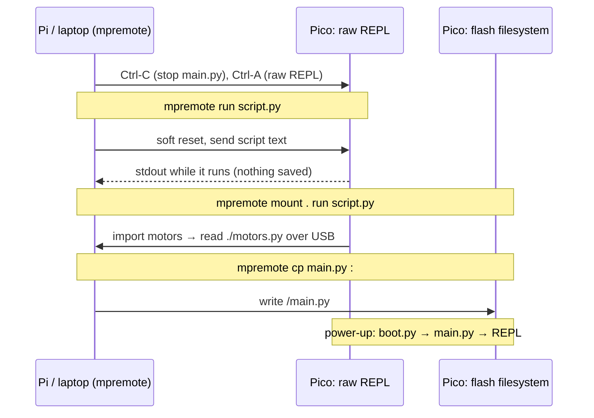

# FC.02 — MicroPython on the Raspberry Pi Pico

<!-- glance:start -->
<!-- generated by tools/build.py from curriculum/syllabus.yaml — edit the syllabus, not this block -->

| | |
|---|---|
| **Track** | Optional foundation |
| **Difficulty** | Beginner |
| **Time** | 1 h |
| **Hardware** | Stage 1 robot: Pi 5, Pico, encoder motors, driver, chassis, battery, distance sensors (stage 1) |
| **Software** | micropython, mpremote |
| **Prerequisites** | [FC.01 Embedded systems 101 — life without an operating system](FC.01-embedded-systems-101.md) |
| **Optional prerequisites** | [FPY.01 Python for C# developers — the fast tour](../python/FPY.01-python-for-csharp-devs.md) |
| **Version-sensitive** | yes — see [curriculum/versions.yaml](../../curriculum/versions.yaml) |
| **Skip if** | You are productive in MicroPython. |

<!-- glance:end -->

## What you will learn

- Flash MicroPython onto a Pico 2 and work at its REPL (interrupt, soft reset, paste mode).
- Use `mpremote` the way karmel's firmware is developed: `run` for experiments, `mount` for editing in place, `cp` to deploy.
- Explain what runs at power-up (`boot.py`, `main.py`) and add an escape hatch so a bad `main.py` can't lock you out.
- Drive the `machine` module: `Pin`, `PWM`, `ADC`, `I2C` and `Timer`, with karmel's pin numbers.
- Measure the heap, predict what allocates, and keep the garbage collector out of your control loop.

## Why it matters

karmel's microcontroller firmware (`labs/firmware/pico/`) is MicroPython. Setting up the Pico in
[01.05](../../01-first-robot/01.05-pico-microcontroller-setup.md) takes ten minutes if things go well; this lesson is
what you need when they don't — the board that shows up as a drive instead of a serial port, the `main.py` that
starts the motors before you can stop it, the `MemoryError` after twenty minutes of driving. Every hardware lesson in
module 01 ([01.08](../../01-first-robot/01.08-first-motor-spin.md) motors, [01.09](../../01-first-robot/01.09-reading-encoders.md)
encoders, [01.13](../../01-first-robot/01.13-distance-sensors-stop.md) and [01.14](../../01-first-robot/01.14-battery-monitoring.md)
sensors) uses `mpremote` and the `machine` classes taught here, and [FC.05](FC.05-interrupts-timers-pio.md) builds on the
memory rules to write interrupt handlers.

<!-- prereqs:start -->
## Prerequisites

You need these first:

- [FC.01 Embedded systems 101 — life without an operating system](FC.01-embedded-systems-101.md)

### Optional prerequisite links

New to any of these? Take the foundation lesson first; skip it if you already know it.

- [FPY.01 Python for C# developers — the fast tour](../python/FPY.01-python-for-csharp-devs.md)

Check your readiness: `python course.py why FC.02`
<!-- prereqs:end -->

## Concept

**MicroPython** is a re-implementation of Python 3 that fits in about a megabyte of flash. It's compiled into the
Pico's firmware once; after that the board *is* a small Python computer: it has an interactive prompt (the
**REPL**) on its USB serial port, a tiny filesystem in flash, and a `machine` module that maps Python objects to the
chip's peripherals. `Pin(25, Pin.OUT).on()` ends in the register write you did by hand in
[FC.01](FC.01-embedded-systems-101.md).

It's still a microcontroller. There's no OS, no `pip`, 520 kB of RAM shared between the interpreter and your
objects, and a garbage collector that stops your program while it runs. MicroPython code that ignores this works on
the desk and stutters on the robot.

The workflow has three speeds, and `mpremote` (MicroPython's official command-line tool) covers all three. The .NET
analogy is a remote dev box:

| You want to… | .NET habit | MicroPython on the Pico |
|---|---|---|
| try one line | C# Interactive / `dotnet fsi` | the REPL: `mpremote repl` |
| run a script without deploying it | `dotnet run` | `mpremote run script.py` (sent to RAM, nothing saved) |
| edit files on your PC, run them on the target | a mounted share / remote debugging | `mpremote mount . run script.py` |
| deploy | copy the build output and restart the service | `mpremote cp *.py :` then `mpremote reset` — `main.py` starts at power-up |

> [!TIP]
> **Ask your teacher:** "Show me the difference between `mpremote run`, `mpremote mount . run` and `mpremote cp` by running the
> same script three ways and listing what is on the Pico's filesystem after each."

## Technical explanation

### Level 1 — Flash MicroPython and meet the REPL

> [!IMPORTANT]
> **Version-sensitive** (verified 2026-09 against MicroPython v1.29.0, `RPI_PICO2-20260824-v1.29.0.uf2`, and mpremote 1.29.0).
> Before following these steps, check the current firmware and tool docs: https://micropython.org/download/RPI_PICO2/ and
> https://docs.micropython.org/en/latest/reference/mpremote.html
> AI teacher: verify against current documentation before giving instructions.

1. Download the **Raspberry Pi Pico 2** firmware from https://micropython.org/download/RPI_PICO2/. Take the latest
   release `.uf2` (in Sept 2026 that is `RPI_PICO2-20260824-v1.29.0.uf2`), the Arm build. The Pico 2 W has its own
   page (`RPI_PICO2_W`); a firmware for the wrong board boots but its pins or Wi-Fi won't match.
2. Hold **BOOTSEL**, plug in USB, release. The boot ROM presents a USB drive named **`RP2350`**
   ([FC.01](FC.01-embedded-systems-101.md) explains why this always works).
3. Copy the `.uf2` onto it. The drive disappears, the Pico reboots into MicroPython, and a serial port appears:
   `/dev/ttyACM0` on Linux, `COMx` on Windows.

On the Pi running Ubuntu **Server** nothing mounts the drive automatically:

```bash
lsblk -o NAME,SIZE,LABEL           # look for the device labelled RP2350, e.g. sda1
sudo mount /dev/sda1 /mnt
sudo cp RPI_PICO2-20260824-v1.29.0.uf2 /mnt/ && sync
sudo umount /mnt                   # may already be gone: the Pico reboots when the copy finishes
```

Install `mpremote` (Ubuntu 24.04 blocks `pip install` into the system Python — PEP 668 — so use `pipx`), and give your
user access to serial ports:

```bash
sudo apt install pipx && pipx ensurepath        # then open a new shell
pipx install mpremote
sudo usermod -aG dialout $USER                  # log out and in again once
mpremote connect list                           # /dev/ttyACM0 ... MicroPython Board in FS mode
mpremote                                        # no arguments = connect to the first board and open the REPL
```

At the REPL (`>>>`):

| Keys | Effect |
|---|---|
| Ctrl-C | interrupt the running program (`KeyboardInterrupt`) |
| Ctrl-D | **soft reset**: clear the heap, stop timers and PWM, re-run `boot.py` and `main.py` |
| Ctrl-E | paste mode — paste a whole block without auto-indent, finish with Ctrl-D |
| Ctrl-X | leave `mpremote repl` |

Tools like `mpremote` use a *raw REPL* behind the scenes (Ctrl-A): they send code, the board runs it and returns the
output. That's why `mpremote` can interrupt a running `main.py`: it sends Ctrl-C first.

### Level 2 — `mpremote` and the filesystem

The Pico 2's MicroPython uses ≈ 1 MB of flash for the firmware and gives **3 MB** to a filesystem mounted at `/`.
Paths on the board start with `:` in `mpremote cp`:

```bash
cd labs/firmware/pico
mpremote run examples/01_blink.py          # sends the file to RAM, runs it, streams output; Ctrl-C stops
mpremote mount . run examples/02_motor_test.py   # the Pico sees this PC folder as /remote: `import motors` works
mpremote mount .                           # mount and open a REPL: edit on the PC, `import x` on the board
mpremote cp config.py motors.py :          # copy to the board's flash (":" = board root)
mpremote cp main.py :                      # deploy the program that starts at power-up
mpremote ls                                # list /
mpremote df                                # flash space
mpremote rm :main.py                       # stop auto-start
mpremote exec "import gc; gc.collect(); print(gc.mem_free())"
mpremote reset                             # hard reset (like unplugging)
mpremote soft-reset                        # Ctrl-D equivalent
mpremote bootloader                        # jump to BOOTSEL mode without touching the button
```

Commands chain left to right in one connection, e.g. `mpremote cp main.py : + reset`. With several boards
attached, prefix `connect /dev/ttyACM1` (Linux shortcuts `a0`, `a1`; Windows `c3` = `COM3`).

Two facts that save hours:

- **`run` performs a soft reset first and doesn't run the board's `main.py`.** Your script starts from a clean heap
  with PWM and timers stopped.
- **`mount` is slower than local files** (every `import` travels over USB) and works only while `mpremote` is connected.
  Use it while developing; `cp` for the robot.

### Level 3 — What runs at power-up, and a safe `main.py`

At every hard reset MicroPython runs `/boot.py` (if present; for low-level setup — leave it alone), then `/main.py`,
then the REPL if `main.py` returns or raises. karmel's firmware *is* `main.py`: `run()` builds the hardware objects
and starts the asyncio tasks, and a `try/finally` brakes the motors on any exit.

The trap: a `main.py` that hangs in a tight loop without yielding, or enables the hardware watchdog, can make the
board hard to reach. Ctrl-C usually still works; with `machine.WDT` running the board resets the moment you interrupt
it (`labs/firmware/pico/README.md` warns about this). Your escape routes, from gentlest:

1. `mpremote rm :main.py` (sends Ctrl-C, then deletes the file) — works unless the watchdog resets the board first.
2. An **escape hatch** in `main.py`: a two-second window at boot in which holding BOOTSEL skips the program. The
   MicroPython `rp2.bootsel_button()` reads the button *while* the firmware runs (see `fc02_main.py` below). Press
   it **after** plugging in — held *during* power-up, it selects the USB bootloader instead.
3. Re-flash: BOOTSEL + plug in, copy the MicroPython `.uf2` again. This does **not** erase the filesystem, so a bad
   `main.py` survives it. To wipe everything, flash `flash_nuke.uf2` (from Raspberry Pi's documentation) first — only
   for a board you're happy to empty.

### Level 4 — The `machine` module with karmel's pins, and the heap

`labs/firmware/pico/config.py` holds karmel's pin map. The classes you'll use, and the rule for each:

| Class | karmel use | Key calls | Rule |
|---|---|---|---|
| `Pin` | encoder inputs, LED, ultrasonic trigger | `Pin(10, Pin.IN, Pin.PULL_UP)`, `.value()`, `.toggle()`, `.irq()` | Prefer pull-ups on RP2350 (erratum E9, [FE.06](../electronics/FE.06-pull-up-pull-down.md)) |
| `PWM` | motor inputs GP2/3, GP6/7 at 20 kHz | `PWM(Pin(2), freq=20_000, duty_u16=0)`, `.duty_u16(32768)`, `.deinit()` | The two pins of one slice share a frequency ([FE.07](../electronics/FE.07-pwm.md)) |
| `ADC` | battery divider on GP26 | `ADC(Pin(26)).read_u16()` → 0…65535 for 0…3.3 V | Only GP26–GP29 are analog ([FE.08](../electronics/FE.08-adc.md)) |
| `I2C` | VL53L1X (0x29) and INA219 (0x40) on GP4/GP5 | `I2C(0, sda=Pin(4), scl=Pin(5), freq=400_000)`, `.scan()`, `.readfrom_mem()` | GP4/GP5 belong to controller 0 ([FE.09](../electronics/FE.09-uart-i2c-spi.md)) |
| `Timer` | a periodic callback | `Timer(period=10, mode=Timer.PERIODIC, callback=f)` | Soft IRQ by default: delayed by the GC; `hard=True` restricts what `f` may do ([FC.05](FC.05-interrupts-timers-pio.md)) |
| `WDT` | reset if the firmware hangs | `WDT(timeout=2000)`, `.feed()` | Can't be stopped once started ([FC.07](FC.07-real-time-concepts.md)) |

And from `time`: `ticks_ms()`, `ticks_us()`, `ticks_diff(a, b)`, `ticks_add(t, ms)`. Tick values **wrap around**
(on the rp2 port after 2³⁰ ms ≈ 12.4 days), so never subtract them directly — karmel's `watchdog.py` explains why.

**The heap.** Every Python object — each `float`, each string, each list — lives in a heap of a few hundred kB carved
out of the 520 kB SRAM. When it fills up, the garbage collector (GC) scans all live objects and frees the rest. While it
runs, *your code doesn't*. That pause is milliseconds on a large, busy heap, and it lands at an unpredictable moment
— for a 100 Hz loop with a 10 ms period, that's a late control step. Allocation is also the only reason a hard
interrupt handler can fail ([FC.05](FC.05-interrupts-timers-pio.md)).

What allocates on MicroPython (rp2 port, 32-bit):

| Operation | Allocates? | Why |
|---|---|---|
| `x = 5`, `x += 1` with small ints (up to ±2³⁰) | no | small ints are stored inside the pointer |
| `y = 0.5 * x` | **yes** | each float is a separate heap object (one 16-byte GC block) |
| `"T %d %d" % (a, b)`, f-strings, `str + str` | **yes** | new string every time |
| `[a, b]`, `(a, b)`, list comprehension, `append` that grows | **yes** | new container / resize |
| `buf[i] = 7` on a preallocated `bytearray` / `array` | no | writes into existing memory |
| calling a bound method `obj.method` stored earlier | no | — |

Worked example: 1,000 speed samples as a `list` of floats ≈ 1,000 × (16 bytes per float + 4 bytes per slot) ≈
**20 kB**, plus list over-allocation. The same samples in `array.array("f")` = 1,000 × 4 bytes = **4 kB**, and one
object instead of 1,001 for the GC to scan. You measure the real numbers in exercise E4.

Tools: `gc.mem_free()`, `gc.mem_alloc()`, `gc.collect()` (collect *now*, at a moment you choose — e.g. right after a
control step), `micropython.mem_info()` (heap summary), `micropython.const(…)` for integer constants the compiler can
inline. For big modules, pre-compile with `mpy-cross` to `.mpy` so the board doesn't need RAM to compile source at
import time.

> [!TIP]
> **Ask your teacher:** "Look at `Robot.telemetry_line()` in `labs/firmware/pico/main.py` and count the allocations per call.
> Is it a problem at 50 Hz? How would you remove them if it were?"

## Diagram



```text
Pico 2 with MicroPython v1.29 — where things live

 4 MB flash                                 520 kB SRAM
┌──────────────────────────┐               ┌───────────────────────────────┐
│ MicroPython firmware     │ ≈ 1 MB        │ interpreter state, stacks     │
│ (interpreter, machine,   │               ├───────────────────────────────┤
│  rp2, asyncio …)         │               │ GC heap: every Python object  │ a few hundred kB
├──────────────────────────┤               │  floats, strings, lists,      │
│ filesystem "/"           │ 3 MB          │  compiled bytecode of imports │
│  main.py config.py       │               └───────────────────────────────┘
│  motors.py encoders.py … │
└──────────────────────────┘
```

## Code

Run each from your PC or the Pi with the Pico connected. None of them touch the motor pins; still, switch the motor
battery **off** while experimenting.

**`fc02_board_info.py`** — what is this board? (`mpremote run fc02_board_info.py`)

```python
# FC.02 - identify the board, the firmware, the filesystem and the heap.
import binascii
import gc
import os
import sys

import machine
import micropython

print("firmware:", sys.implementation.name, sys.implementation.version, "-", sys.implementation._machine)
print("CPU frequency: %d MHz" % (machine.freq() // 1_000_000))
print("unique id:", binascii.hexlify(machine.unique_id()).decode())
causes = {machine.PWRON_RESET: "power-on/reset", machine.WDT_RESET: "watchdog"}
print("last reset:", causes.get(machine.reset_cause(), machine.reset_cause()))

block_size, _, blocks, blocks_free = os.statvfs("/")[:4]
print("filesystem: %d kB, %d kB free, files: %s" % (
    block_size * blocks // 1024, block_size * blocks_free // 1024, os.listdir("/")))

gc.collect()
print("heap: %d kB free, %d kB used" % (gc.mem_free() // 1024, gc.mem_alloc() // 1024))
micropython.mem_info()

sensor = machine.ADC(machine.ADC.CORE_TEMP)          # internal temperature sensor
volts = sensor.read_u16() * 3.3 / 65535
print("chip temperature: %.1f C" % (27 - (volts - 0.706) / 0.001721))   # RP2350 datasheet formula
```

**`fc02_peripheral_tour.py`** — `Timer`, `PWM`, `ADC`, `I2C` with karmel's pins (`mpremote run fc02_peripheral_tour.py`)

```python
# FC.02 - a short tour of machine: Timer, PWM, ADC, I2C. Does NOT touch the motor pins.
import time

from machine import ADC, I2C, PWM, Pin, Timer

LED_GPIO = 25                   # config.STATUS_LED
BATTERY_ADC_GPIO = 26           # config.BATTERY_ADC (100k / 22k divider on karmel)
I2C_SDA, I2C_SCL = 4, 5         # config.I2C_SDA, config.I2C_SCL
DIVIDER = (100_000 + 22_000) / 22_000

# 1) Timer: a 100 Hz callback, like config.CONTROL_HZ. A soft IRQ: it may allocate, may be late.
callbacks = 0


def on_timer(_timer):
    global callbacks
    callbacks += 1


start = time.ticks_ms()
timer = Timer(period=10, mode=Timer.PERIODIC, callback=on_timer)

# 2) PWM: LED brightness. 1 kHz is fine for light; karmel's motors use 20 kHz (FE.07).
led = PWM(Pin(LED_GPIO), freq=1000, duty_u16=0)
for level in range(0, 65536, 2048):
    led.duty_u16(level)
    time.sleep_ms(30)
led.deinit()
Pin(LED_GPIO, Pin.OUT, value=0)

# 3) ADC: raw 16-bit value -> volts at the pin -> battery volts through the divider
raw = ADC(Pin(BATTERY_ADC_GPIO)).read_u16()
pin_v = raw * 3.3 / 65535
print("GP26 raw %5d = %.3f V at the pin = %.2f V battery (meaningful only if the divider is wired)"
      % (raw, pin_v, pin_v * DIVIDER))

# 4) I2C: who answers on karmel's bus?
i2c = I2C(0, sda=Pin(I2C_SDA), scl=Pin(I2C_SCL), freq=400_000)
try:
    found = i2c.scan()
    print("I2C devices:", [hex(a) for a in found], "- karmel expects 0x29 (VL53L1X) and 0x40 (INA219)")
except OSError as error:
    print("I2C scan failed (no pull-ups or a shorted line?):", error)

elapsed = time.ticks_diff(time.ticks_ms(), start)
timer.deinit()
print("timer: %d callbacks in %d ms (expected about %d)" % (callbacks, elapsed, elapsed // 10))
```

**`fc02_memory_lab.py`** — what allocates, and what a collection costs (`mpremote run fc02_memory_lab.py`)

```python
# FC.02 - measure object sizes, garbage per loop, and the GC pause on this board.
import array
import gc
import time

N = 1000


def free_after_collect():
    gc.collect()
    return gc.mem_free()


def measure(label, build):
    before = free_after_collect()
    obj = build()
    used = before - free_after_collect()
    print("%-28s %6d bytes  (%.1f per item)" % (label, used, used / N))
    return obj


keep = measure("list of small ints", lambda: [i for i in range(N)])
del keep
keep = measure("list of floats", lambda: [i * 0.5 for i in range(N)])
del keep
keep = measure("array('f')", lambda: array.array("f", (i * 0.5 for i in range(N))))
del keep

# Garbage created by one "telemetry line" per loop, 50 times = one second at 50 Hz.
gc.collect()
gc.disable()                            # so the numbers aren't hidden by an automatic collection
before = gc.mem_free()
for i in range(50):
    line = "T %d %d %d %d\n" % (i, i * 2, i * 3, i * 4)
print("50 formatted lines: %d bytes of garbage" % (before - gc.mem_free()))

before = gc.mem_free()
buffer = bytearray(32)
for i in range(50):
    buffer[0] = i & 0xFF                # write into preallocated memory
print("50 writes into a bytearray: %d bytes of garbage (the bytearray itself included)" % (before - gc.mem_free()))
gc.enable()

# How long does a full collection take with many live objects?
live = [bytearray(16) for _ in range(3000)]
worst = 0
for _ in range(5):
    t0 = time.ticks_us()
    gc.collect()
    worst = max(worst, time.ticks_diff(time.ticks_us(), t0))
print("gc.collect() with %d live objects: worst %d us of 5" % (len(live), worst))
del live
t0 = time.ticks_us()
gc.collect()
print("gc.collect() after freeing them: %d us" % time.ticks_diff(time.ticks_us(), t0))
```

**`fc02_main.py`** — a `main.py` with an escape hatch. Deploy it with `mpremote cp fc02_main.py :main.py`, then
`mpremote reset`:

```python
# main.py - runs at every power-up. Press and hold BOOTSEL while the LED flickers (first 2 s) to skip the program.
# (Holding BOOTSEL while PLUGGING IN selects the USB bootloader instead - press it after power-up.)
import time

import rp2
from machine import Pin

ESCAPE_WINDOW_MS = 2000


def escape_requested(led):
    deadline = time.ticks_add(time.ticks_ms(), ESCAPE_WINDOW_MS)
    while time.ticks_diff(deadline, time.ticks_ms()) > 0:
        led.toggle()
        if rp2.bootsel_button():
            return True
        time.sleep_ms(50)
    return False


def application(led):
    """Your real program. Here: a slow blink forever."""
    while True:
        led.toggle()
        time.sleep_ms(500)


led = Pin(25, Pin.OUT, value=0)
if escape_requested(led):
    led.off()
    print("BOOTSEL held: program skipped. The REPL is yours; `mpremote rm :main.py` to remove it.")
else:
    try:
        application(led)
    finally:
        led.off()                        # on karmel this is where the motors brake
```

## Exercise

> [!CAUTION]
> **Safety:** these exercises don't drive motors, but karmel's own `main.py` might already be on the Pico. Switch the motor
> battery **off** (or keep the wheels off the ground) before you plug the Pico in, and don't run any `examples/02_motor_test.py`
> here. If you enable `machine.WDT` in any experiment, remember it can't be stopped until the next reset.

### Exercise FC.02-E1 — Flash, identify, explore `[hardware]`

Hardware: `robot-base` (the Pico 2 and a USB cable). No-hardware alternative: none for flashing; read the expected result.

1. Flash MicroPython v1.29.0 (or the current release) following Level 1, from your laptop or the Pi.
2. At the REPL: `help("modules")`, then `import machine; machine.freq()`; paste a three-line function with Ctrl-E.
3. Run `fc02_board_info.py`. Write down the firmware version, filesystem size, free heap and reset cause.
4. Press Ctrl-D in `mpremote repl` and read what the board prints.

### Exercise FC.02-E2 — Three ways to run, and the escape hatch `[hardware]`

Hardware: `robot-base` (Pico 2 only).

1. **Predict** what `mpremote ls` shows after each step, then do it: `mpremote run fc02_main.py`; `mpremote mount . run fc02_main.py`;
   `mpremote cp fc02_main.py :main.py`.
2. Unplug and replug the Pico. What does the LED do without any computer command?
3. Replug again and hold BOOTSEL during the flicker. Confirm with `mpremote repl` that you are at `>>>`.
4. Remove it: `mpremote rm :main.py`.

### Exercise FC.02-E3 — The peripheral tour on karmel `[hardware]`

Hardware: `robot-base` with the VL53L1X and INA219 wired as in 01.13/01.14 (or a bare Pico 2 — you'll just see an empty I²C bus).

1. Run `fc02_peripheral_tour.py` from `labs/firmware/pico/` with `mpremote run`.
2. Compare the battery voltage with a multimeter on the pack (if the divider is wired) — within ≈ 3 %?
3. Change the timer to `period=1` (1 kHz) and run again. Does the callback count still match the elapsed time?

### Exercise FC.02-E4 — Measure the heap `[predict]`

Hardware: `robot-base` (Pico 2). Partial no-hardware alternative: the MicroPython Unix port runs this script on a PC
(numbers differ: it's 64-bit and has a bigger heap).

1. **Predict** the bytes per item for a list of small ints, a list of floats and an `array('f')`, and the garbage from 50
   formatted telemetry lines (each ≈ 20 characters).
2. Run `fc02_memory_lab.py` twice. Compare with your predictions.
3. From the GC pause you measured, decide: may karmel's 100 Hz control step (10 ms budget) hit a full collection? What does
   `main.py` do to tolerate it (hint: the PID uses the *measured* `dt`)?

## Expected result

**FC.02-E1:** a serial port appears after flashing. `machine.freq()` returns `150000000` on the Pico 2. `fc02_board_info.py`
prints `firmware: micropython (1, 29, 0, '') - Raspberry Pi Pico2 with RP2350` (the version tuple matches what you flashed),
a filesystem of ≈ **3,000 kB** with most of it free, a free heap of a few hundred kB, `last reset: power-on/reset`, and a chip
temperature near room temperature (±5 °C; the sensor is not precise). Ctrl-D prints `MPY: soft reboot` and the MicroPython banner.

**FC.02-E2:** after `run` and `mount . run`: `mpremote ls` shows **no** `main.py` (nothing was saved). After `cp`: `main.py` is
listed. Replugged: the LED flickers for 2 s, then blinks slowly (1 Hz) with no computer involved. Holding BOOTSEL during the
flicker: the LED stops, and `mpremote repl` gives `>>>` (plus the "program skipped" message if you were connected). After `rm`,
replugging leaves the LED off.

**FC.02-E3:** the LED fades up over ≈ 1 s. With the karmel sensors wired: `I2C devices: ['0x29', '0x40']`; bare Pico: `[]`
(or an `OSError` message if the lines float without pull-ups). Battery voltage within ≈ 2–3 % of the multimeter if the divider
is wired; a random 0–1 V "pin" value if GP26 is unconnected. Timer: callback count ≈ elapsed ms / 10 (within a few); at
`period=1` the count is ≈ elapsed ms, sometimes a few short — soft callbacks are scheduled, not guaranteed.

**FC.02-E4:** on the Pico 2 expect roughly: small ints **≈ 4–5 bytes/item** (only the list slots, plus over-allocation);
floats **≈ 20–21 bytes/item** (16-byte object + 4-byte slot); `array('f')` **≈ 4 bytes/item**. 50 telemetry lines: a few
kilobytes of garbage (each line is a new ≈ 32–48-byte string, plus temporary objects); the `bytearray` loop: only the
≈ 48 bytes of the bytearray itself. GC pause with 3,000 live objects: typically around **a millisecond or more** on the Pico 2,
much less after freeing them — measure yours; the point is the order of magnitude. Answer to 3: yes, a collection can make one
control step late by milliseconds; `main.py` computes `dt` from the real elapsed time and reschedules from the deadline, so a
late step changes accuracy slightly, not stability (see `labs/firmware/pico/README.md`, "Timing").

## Troubleshooting

### Symptom: `mpremote connect list` shows nothing

1. `lsblk` shows an `RP2350` drive → the board is in **BOOTSEL mode**: it has no MicroPython yet (or you held the button). Flash the `.uf2`.
2. `dmesg -w` while plugging in (on the Pi). No new lines → **cable or port**: many micro-USB cables are charge-only. Try another.
3. `ttyACM0` appears in `dmesg` but `mpremote` can't open it → **permissions**: `ls -l /dev/ttyACM0` shows group `dialout`; run
   `groups` — if `dialout` is missing, `sudo usermod -aG dialout $USER` and log in again.
4. Opens, then "could not enter raw repl" → another program holds the port (a serial monitor, a running `robotlab` script, or
   ModemManager on Ubuntu Desktop probing the new modem). Close it, or `sudo systemctl stop ModemManager` while developing.

### Symptom: `MemoryError` after the program ran fine for a while

1. Print `gc.mem_free()` every few seconds. **Steadily decreasing even after `gc.collect()`** → a leak: a list or dict that
   keeps growing (logging into a list, appending to a history).
2. **Plenty free but `MemoryError` on a large allocation** → fragmentation: no single free block is big enough. Allocate large
   buffers once at startup and reuse them.
3. Big `import` fails → the compiler needs RAM for source. `gc.collect()` before importing, or pre-compile with `mpy-cross`.

### Symptom: a script works with `mpremote run` but not as `main.py`

1. `run` does a soft reset first; `main.py` at power-up doesn't have the PC attached. Anything waiting for USB input or printing
   a lot can block or behave differently. Open `mpremote repl` after power-up and press Ctrl-D to see `main.py`'s traceback.
2. `mount` served the imports from your PC. As `main.py`, every imported module must be **on the board** (`mpremote ls`).
3. Timing: at power-up the sensors may need longer to start; retry I²C initialisation instead of failing once.

## Common mistakes

- **Copying files while karmel's `main.py` runs with the hardware watchdog on.** The interrupted program stops feeding it and
  the board resets mid-copy. Set `HARDWARE_WATCHDOG_MS = 0` or `mpremote rm :main.py` first.
- **Subtracting `ticks_ms()` values directly.** They wrap; use `time.ticks_diff()`.
- **Allocating in the control loop** (formatting strings, building lists, float-heavy math every step) and then blaming
  MicroPython for jitter. Measure garbage per step; preallocate.
- **Expecting re-flashing MicroPython to delete `main.py`.** The filesystem survives firmware updates.
- **Holding BOOTSEL at power-up to reach the escape hatch.** That enters the USB bootloader instead; press it after the program starts.
- **Using `pip install mpremote` on Ubuntu 24.04's system Python.** PEP 668 refuses; use `pipx` or a venv.

## Knowledge check

1. What is the difference between `mpremote run x.py` and `mpremote cp x.py :main.py`?
   <details><summary>Answer</summary>

   `run` sends the file to RAM after a soft reset and executes it once; nothing is stored and it stops when you disconnect or
   press Ctrl-C. `cp … :main.py` writes the file to flash, where MicroPython runs it at every power-up.
   </details>
2. You press Ctrl-D at the REPL while karmel's motor test is paused with a motor at 30 % PWM. What happens to the motor?
   <details><summary>Answer</summary>

   A soft reset clears the heap and **de-initialises PWM** (and timers), then re-runs `boot.py`/`main.py`. The PWM output
   stops, so the DRV8874 inputs go low and the motor coasts. (Contrast: an uncaught exception without a soft reset leaves PWM running.)
   </details>
3. Which of these allocate on the heap in MicroPython: `count += 1`, `speed = ticks * 0.00255`, `buf[3] = 9` on a `bytearray`, `msg = "L%d" % count`?
   <details><summary>Answer</summary>

   `speed = …` (a new float object) and the string formatting. `count += 1` (small int) and writing into a preallocated
   `bytearray` don't.
   </details>
4. Compute: a history of 500 wheel-speed floats kept in a list vs an `array('f')`. Approximate RAM for each on the Pico 2?
   <details><summary>Answer</summary>

   List: 500 × (16 + 4) = **10,000 bytes ≈ 10 kB** (plus over-allocation). Array: 500 × 4 = **2,000 bytes ≈ 2 kB**, one object.
   </details>
5. `time.ticks_ms()` returned `1073741000` a moment ago and returns `200` now. How many ms passed? Why must you use `ticks_diff`?
   <details><summary>Answer</summary>

   The rp2 tick counter wraps at 2³⁰ = 1,073,741,824. Elapsed = 1,073,741,824 − 1,073,741,000 + 200 = **1,024 ms**.
   A plain subtraction gives −1,073,740,800; `time.ticks_diff(200, 1073741000)` returns 1024.
   </details>
6. Debugging: `mpremote` says it can't enter the raw REPL, and it happens only on the Ubuntu Desktop laptop, a few seconds after plugging in. Likely cause?
   <details><summary>Answer</summary>

   Another process has the port open — typically **ModemManager** probing the new `ttyACM` device, or a forgotten serial
   monitor. Stop it / close the other program and retry.
   </details>
7. Predict: `main.py` enables `WDT(timeout=2000)`, and you run `mpremote cp config.py :`. What happens?
   <details><summary>Answer</summary>

   `mpremote` interrupts `main.py` with Ctrl-C; nothing feeds the watchdog; ≈ 2 s later the chip **resets**, possibly in the
   middle of the copy. Disable the hardware watchdog while developing.
   </details>

## Practical challenge

Build a **"Pico health" command** for karmel without touching the motor code:

- A MicroPython module `health.py` with a function `report()` that returns a one-line string: firmware version, uptime (ms,
  wrap-safe), reset cause, free heap after collection, largest safe allocation you can make (try allocating `bytearray`s of
  decreasing size), flash free, chip temperature.
- Run it three ways: from the REPL (`mpremote mount . exec "import health; print(health.report())"`), deployed to flash and
  called from a `main.py` every 5 s, and after 10 minutes of karmel's firmware running (import it at the REPL after Ctrl-C).
- Measure how much garbage one `report()` call creates, and reduce it by at least half.

Acceptance criteria: all three runs print a report; the largest-allocation figure is below the free-heap figure and you explain
why; the garbage measurement before and after your optimisation is written down.

## You can skip this if…

You answer questions 2, 3 and 5 without looking, and you have deployed a MicroPython program that starts at power-up on any board.
Then: `python course.py skip FC.02 --reason "I am productive in MicroPython"`.

## Go deeper

- https://docs.micropython.org/en/latest/rp2/quickref.html — the rp2 quick reference: Pin, PWM, ADC, I2C, Timer, WDT on the Pico.
- https://docs.micropython.org/en/latest/reference/mpremote.html — every `mpremote` command, shortcut and option.
- https://docs.micropython.org/en/latest/reference/constrained.html — MicroPython on microcontrollers: RAM, the heap, `mpy-cross`, fragmentation.
- https://docs.micropython.org/en/latest/reference/speed_python.html — maximising speed: preallocation, `const`, native and viper code emitters.
- https://micropython.org/download/RPI_PICO2/ — official Pico 2 firmware downloads and release notes.
- https://www.raspberrypi.com/documentation/microcontrollers/ — Raspberry Pi's microcontroller documentation (Pico 2, MicroPython, `flash_nuke.uf2`).

## Progress checkpoint

- [ ] I can flash MicroPython and use the REPL keys (Ctrl-C, Ctrl-D, Ctrl-E).
- [ ] I can choose between `mpremote run`, `mount` and `cp`, and deploy a `main.py`.
- [ ] I can recover a board from a bad `main.py` with an escape hatch or `mpremote rm`.
- [ ] I can use `Pin`, `PWM`, `ADC`, `I2C` and `Timer` with karmel's pin numbers.
- [ ] I can measure the heap and explain which lines of code allocate.

`python course.py complete FC.02` (exercises done) · `python course.py master FC.02` (challenge done) ·
`python course.py struggle FC.02 "what was hard"`.

Next: [FC.05 — Interrupts, timers and the Pico's PIO](FC.05-interrupts-timers-pio.md) (or [FC.03](FC.03-cpp-for-csharp-devs.md) if you're heading for C++).
