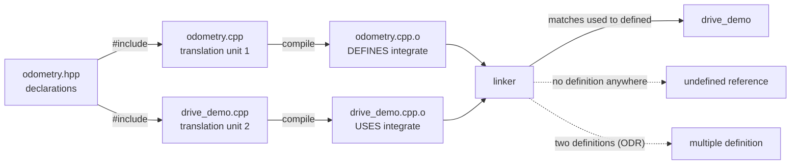

# FC.03 — C++ for C# developers: memory, RAII, headers, templates

<!-- glance:start -->
<!-- generated by tools/build.py from curriculum/syllabus.yaml — edit the syllabus, not this block -->

| | |
|---|---|
| **Track** | Optional foundation |
| **Difficulty** | Intermediate |
| **Time** | 1 h 30 min |
| **Hardware** | none |
| **Software** | cpp-compiler |
| **Prerequisites** | none |
| **Skip if** | You write modern C++. |

<!-- glance:end -->

## What you will learn

- Say where any C++ object lives — stack, heap or static storage — and what destroys it.
- Choose between a value, a reference, a `const` reference, a raw pointer and a smart pointer, and say who owns the memory.
- Write a class whose destructor puts hardware in a safe state, and explain why that is where "stop the motors" belongs.
- Read and write headers: declaration vs definition, translation units, the one-definition rule, and why a header change rebuilds the world.
- Recognise the four kinds of undefined behaviour that bite robotics code, and catch them with the address and undefined-behaviour sanitizers.
- Read the templates and `std::` types that Eigen, the STL and ros2_control put in front of you.

## Why it matters

[03.09](../../03-robot-software/03.09-where-cpp-is-used.md) makes the case that you will *read* C++
long before you write it, and teaches the ten idioms that get you through
[`karmel_hardware`](../../labs/ros2_ws/src/karmel_hardware/src/karmel_system.cpp). This lesson is the
other half: the model underneath those idioms, so that when the compiler says
`error: use of deleted function` or the robot drives into a wall after a `std::string_view` outlived
its buffer, you know what actually happened.

Everything downstream in this track assumes it. [FC.04](FC.04-cmake-builds.md) builds the project
this lesson's code lives in. [FC.06](FC.06-pico-c-sdk.md) writes the same C++ for a chip with
520 kB of RAM, where "the heap" is a resource you can exhaust in one line.
[FC.08](FC.08-micro-ros.md) links against 14 MB of static library and cares exactly how much of it
ends up in flash. And if you ever write a Nav2 plugin or a `ros2_control` controller
([08.12](../../08-control/08.12-control-in-ros2.md)), this is the language you will write it in.

You already know how to program. What is genuinely new coming from C# is that **objects have
locations and lifetimes that you choose**, and the compiler will happily let you use one after it
is gone.

<!-- prereqs:start -->
## Prerequisites

None — you can start here.

### Optional prerequisite links

None.

Check your readiness: `python course.py why FC.03`
<!-- prereqs:end -->

## Concept

Here is the whole difference in two lines.

```csharp
// C#
var pose = new Pose();     // `pose` is a reference. The Pose lives on the GC heap.
```

```cpp
// C++
Pose pose;                 // `pose` IS the Pose. It lives right here, in this stack frame.
```

In C# every `class` instance lives on the garbage-collected heap and every variable of a class type
is a handle to it. Copying the variable copies the handle. The object dies when the collector
notices that nobody can reach it, at some time it chooses.

In C++ a variable of type `Pose` *is* a `Pose` — 24 bytes of this function's stack frame, or 24 bytes
inside a bigger object, or 24 bytes of a `std::vector`'s buffer. Copying it copies 24 bytes.
It is destroyed at a moment written in the source code: the closing brace of its scope. There is no
collector; there is no "at some point".

That single change produces the three things this lesson is about:

1. **Value semantics.** Assignment copies. If the object owns a megabyte, assignment copies a
   megabyte — unless you say `std::move`, which transfers ownership instead.
2. **Deterministic destruction, which is a feature.** Because the destructor runs at a point you
   can put your finger on, you can put "release the mutex", "close the serial port" and "stop the
   motors" in it and they are guaranteed. This is RAII, and it is C++'s best idea.
3. **No safety net.** A reference to an object whose scope ended is not an exception, not a null
   reference, not anything. It is *undefined behaviour*: the compiler was allowed to assume it
   could not happen, and it optimised accordingly.

C# has one construct that rhymes with RAII: `using` / `IDisposable`. The difference matters. In C#
the *call site* must remember to write `using`; in C++ the *type* guarantees it, and the guarantee
holds even while an exception is unwinding the stack. A robot is a machine that must be put in a safe
state on every path out of every function, including the paths you did not think about.

> [!TIP]
> **Ask your teacher:** "Take one 20-line C# method that opens a serial port, reads, and closes it, and
> write the equivalent C++ three ways: with a raw pointer and `delete`, with `try/catch`, and with RAII.
> Then break each one with an early `return` in the middle."

## Technical explanation

### Level 1 — Where objects live, and who destroys them

Every C++ object has a **storage duration**. There are four, and three matter here.

| Storage | Declared as | Lives from … to … | Destroyed by | On karmel's Pico |
|---|---|---|---|---|
| automatic ("stack") | a local variable | entering its scope → leaving it | the compiler, automatically | the 8 kB core-0 stack |
| static | a global, or a `static` local | before `main` → after `main` | the runtime | `.data` / `.bss` ([FC.01](FC.01-embedded-systems-101.md)) |
| dynamic ("heap") | `new` / `make_unique` / inside `std::vector` | the allocation → the matching free | **you**, or a smart pointer | the heap, what is left of 520 kB |
| thread-local | `thread_local` | thread start → thread end | the runtime | rare on an MCU |

The word "stack" is doing a lot of work here. The stack is a region that grows and shrinks as
functions are called and return; an automatic object is simply a slice of the current frame. That is
why it is free to create (moving a pointer) and free to destroy — and why returning a reference or
pointer to one is a bug that costs nothing to write.

`std::vector<double> v(1000);` is the case that confuses people. The `vector` *object* — three
pointers, 24 bytes — is automatic, on the stack. The 8,000 bytes of `double` it manages are on the
heap. When `v` leaves scope, `~vector()` frees them. One object, two locations.

Run `fc03_memory_and_ownership.cpp` (the [Code](#code) section) and part 1 prints exactly this:

```text
  int g_initialised      -> static (.data/.bss)
  int local              -> stack
  *make_unique<int>()    -> heap
  std::vector object     -> stack, but its 1000 doubles -> heap
```

### Level 2 — Pointers, references and `const`

Four ways to pass a `Telemetry` to a function. Pick by *ownership*, not by taste.

| Signature | Means | Cost | Use when |
|---|---|---|---|
| `void f(Telemetry t)` | you get your own copy | `sizeof(Telemetry)` bytes | the type is small (≤ ~16 bytes) or you need a copy anyway |
| `void f(const Telemetry & t)` | you borrow it and will not change it | one pointer | **the default** for anything bigger than a machine word |
| `void f(Telemetry & t)` | you borrow it and will change it | one pointer | an out-parameter; prefer returning a value instead |
| `void f(Telemetry * t)` | you borrow it, and it may be null | one pointer | optional, C APIs |
| `void f(std::unique_ptr<Telemetry> t)` | you now **own** it | one pointer | transferring ownership |

A **reference** (`&`) is an alias for an existing object: it can never be null, can never be
re-seated to a different object, and needs no `->`. A **pointer** (`*`) is a variable holding an
address: it can be null, can be reassigned, and can be arithmetic'd. The rule of thumb in robotics
code is *references for "this exists", pointers for "this might not"*, and `std::optional<T>` when
you can express "might not" by value.

`const` has no C# equivalent that does this job (`readonly` is about fields, not about a view of an
object). `const Telemetry & t` means: through this name, the object will not be modified. It is
checked at compile time, it propagates (a `const` object only lets you call its `const` methods), and
it is *load-bearing* in a way C# programmers underestimate: `const` is how a C++ API says "I am not
going to touch your data", so the caller can pass a reference instead of a copy without fear.

One trap with a C# name: `const std::vector<int> & v` does not mean the caller cannot change the
vector. It means *you* cannot, through `v`. Someone else holding a non-const reference still can,
and if they do while you are iterating, your iterator is dangling. C# has the same hazard with
collections; C++ just will not throw `InvalidOperationException` to tell you.

**Numbers for the "copy or borrow?" decision.** Part 2 of the demo program measures struct layout,
and part 3 measures copies. From a real run in `gcc:14`:

```text
  sizeof(TelemetryPadded) = 24, alignof = 4
  sizeof(TelemetryPacked) = 16, alignof = 4  (same 6 fields, reordered)
  payload actually used   = 16 bytes; wasted by the bad order = 8
  offsets (padded): flags 0, ms 4, protocol_version 8, left_ticks 12
```

Six fields — one `uint32`, two `int32`, one `int16`, two `uint8` — are 16 bytes of data. Declared in
the order a human would say them, they occupy 24: the compiler must put `ms` at an offset divisible
by 4, so it inserts three padding bytes after `flags`. Widest-first ordering costs nothing and saves
33 %. On a 520 kB microcontroller ([FC.06](FC.06-pico-c-sdk.md)) and in a message published at 1 kHz,
this is not pedantry.

$$\text{wasted} = \text{sizeof(struct)} - \sum_i \text{sizeof(field}_i) = 24 - 16 = 8 \text{ bytes } (33\%)$$

And the copy:

```text
  allocate + copy 1000 doubles: 0.117 us
  allocate + move 1000 doubles: 0.091 us   (a move copies no elements)
  so copying the 8000 bytes costs about 26 ns; the allocation costs the rest.
```

Copying 8,000 bytes costs ~26 ns on a desktop — about 300 GB/s, i.e. it is all in L1 cache. The
*allocation* costs three times more. That is the real lesson of C++ performance work: `new` is the
expensive thing, not `memcpy`. It is also why real-time code preallocates and never allocates inside
the loop ([FC.07](FC.07-real-time-concepts.md)).

### Level 3 — Ownership: RAII, `unique_ptr`, `shared_ptr`, and the rule of zero

**RAII** — Resource Acquisition Is Initialization — is one sentence: *a resource's lifetime is an
object's lifetime.* Acquire it in the constructor, release it in the destructor, and then the
language's scope rules do the rest.

```cpp
class MotorGuard {
 public:
  explicit MotorGuard(const char * who) : who_(who) { /* enable the drivers */ }
  ~MotorGuard() { /* SEND STOP - runs on every path out */ }
  MotorGuard(const MotorGuard &) = delete;              // two guards would stop one robot twice
  MotorGuard & operator=(const MotorGuard &) = delete;
 private:
  const char * who_;
};
```

`= delete` is C++ for "this operation is forbidden, say so at compile time". A serial port, a file
descriptor, a mutex lock, a GPIO claim and a motor enable are all *unique* resources: copying the
object that owns one would mean releasing it twice. Deleting the copy constructor turns a runtime
disaster into a compile error.

Run part 4 of the demo and watch the destructor fire while an exception is unwinding:

```text
  [MotorGuard plan] motors enabled
  [MotorGuard plan] STOP sent (destructor)
  caught: path blocked   (the guard already stopped the motors)
```

Nobody called `stop()`. There is no `finally`. `throw` unwound the stack, and unwinding runs
destructors. This is why `karmel_hardware`'s `SerialPort` has no cleanup code at any call site
([03.09](../../03-robot-software/03.09-where-cpp-is-used.md) shows the real class).

**Smart pointers** apply RAII to heap memory:

| Type | Ownership | Cost | Use for |
|---|---|---|---|
| `std::unique_ptr<T>` | exactly one owner; moves, never copies | zero — same as a raw pointer | almost everything you allocate |
| `std::shared_ptr<T>` | many owners, reference-counted | an extra allocation + atomic counter per copy | genuinely shared lifetime (rclcpp hands you these) |
| `std::weak_ptr<T>` | observes a `shared_ptr` without keeping it alive | — | breaking reference cycles |
| a raw `T *` | **no** ownership — a non-owning observer | zero | a parameter that does not take ownership |

The demo prints the whole story:

```text
  unique_ptr holds /dev/ttyACM0
  after std::move: original is empty, new owner holds /dev/ttyACM0
  close(/dev/ttyACM0)
  shared_ptr use_count = 1
  inside the inner scope use_count = 2
  back outside use_count = 1 (nothing closed yet)
  close(/dev/ttyACM1)
```

`shared_ptr` is the one that feels like C# — and that is the trap. It is not free (an atomic
increment on every copy, a control block on the heap), and shared ownership is usually a design you
have not finished. ROS 2's `rclcpp` uses it heavily because node lifetimes genuinely are shared; your
own code usually should not.

**The rule of zero.** If your class owns nothing directly — its members are `std::vector`,
`std::string`, `std::unique_ptr` — write no destructor, no copy constructor, no assignment operator.
The compiler generates correct ones from the members. The moment you write a destructor, you are
claiming to own a resource, and then you owe the *rule of five*: destructor, copy constructor, copy
assignment, move constructor, move assignment — or `= delete` for the ones that make no sense.

### Level 4 — Headers, translation units, and undefined behaviour

**The build model.** C++ has no modules in practice yet (C++20 modules exist; ROS 2 does not use
them). Instead:

1. The **preprocessor** textually pastes every `#include` into the `.cpp` file. The result — your
   file plus tens of thousands of lines of headers — is one **translation unit**.
2. The **compiler** turns each translation unit into one object file, independently. It never sees
   the others.
3. The **linker** matches every symbol a translation unit *used* with the one translation unit that
   *defined* it.

Two consequences you will meet on day one:

- A **header** declares what exists (`double metres_per_tick(const DriveGeometry &);`); a **source**
  defines what it does. A missing definition is not a compile error, it is a link error —
  `undefined reference to wheelodom::metres_per_tick(...)` ([FC.04](FC.04-cmake-builds.md) shows
  exactly this).
- The **one-definition rule** (ODR): each non-inline function or variable may be defined in exactly
  one translation unit. Put a function *body* in a header, include it twice, and the linker reports
  `multiple definition`. The escapes are `inline`, `constexpr`, templates (which are implicitly
  inline), and an anonymous `namespace { }`, which gives a name internal linkage — the C++ spelling
  of "private to this file".

Every header needs an **include guard** (`#ifndef X_HPP_ / #define X_HPP_ / #endif`) or
`#pragma once`, or including it twice re-declares its types. ROS 2 headers use the explicit guard;
learn to read it and use whichever your project uses.

**Undefined behaviour.** This is the one genuinely dangerous idea for someone arriving from a managed
language. In C# every operation either works or throws. In C++ a set of operations are simply
*undefined*: the standard imposes no requirement, so the compiler assumes they do not occur and
optimises on that assumption. "Undefined" does not mean "crashes" — it means *anything*, including
working perfectly on your laptop and producing a wrong number on the robot.

The four that actually happen in robotics code, all demonstrated by
`fc03_undefined_behaviour.cpp`:

| Bug | How it looks | What the sanitizer says |
|---|---|---|
| reference/pointer to a destroyed object | `return w;` where `w` is a local | `runtime error: reference binding to null pointer` then `SEGV` |
| out-of-bounds `operator[]` | `buffer[7]` on a `vector` of 4 | `AddressSanitizer: heap-buffer-overflow ... WRITE of size 4` |
| a `string_view` outliving its buffer | parsing a temporary `std::string` | `AddressSanitizer: heap-use-after-free ... READ of size 1` |
| signed integer overflow | an encoder counter crossing `INT32_MAX` | `runtime error: signed integer overflow: 2147483600 + 100` |

That last one is worth a moment. Signed overflow is undefined; **unsigned** overflow is defined to
wrap. So `int32_t` tick counters are a real hazard: karmel makes 2,464 ticks per wheel revolution, so
`INT32_MAX` is about 871,000 wheel revolutions — far away, but a Pico that restarts its counters, or
a 64-bit accumulation done in 32 bits, gets there. `karmel_hardware` handles exactly this by keeping
a separate tick offset when the Pico reboots ([03.09](../../03-robot-software/03.09-where-cpp-is-used.md)).

**The tools.** Two compiler flags find most of it, and you should build every debug build with them:

```bash
g++ -std=c++17 -g -O1 -fsanitize=address,undefined -fno-omit-frame-pointer ...
```

AddressSanitizer instruments every memory access (about 2× slower, 3× more memory);
UndefinedBehaviorSanitizer checks overflow, bad casts, null dereferences. They are not a debugger —
they are a build mode that turns silent corruption into a report with a stack trace, at the first
access. Add `-Wall -Wextra -Wpedantic` for the compile-time half; GCC catches the dangling-local case
by itself:

```text
warning: reference to local variable 'w' returned [-Wreturn-local-addr]
```

> [!TIP]
> **Ask your teacher:** "Take the `oob` case, change `buffer[7]` to `buffer.at(7)`, and rebuild without
> the sanitizers. Explain the difference in what happens, and why robotics code often still uses
> `operator[]` in the hot loop."

## Diagram

```text
One C++ program's memory, and who destroys what

           +---------------------------------------------+
  static   | .data  int g_initialised = 7;               |  created before main()
  storage  | .bss   int g_zero;                          |  destroyed after main()
           +---------------------------------------------+
           | .text  machine code   .rodata  constants    |  read-only
           +---------------------------------------------+
                          ^
                          |
  heap     +---------------------------------------------+
  (grows   | new / make_unique / vector's buffer         |  YOU destroy it
   up)     |   8000 bytes of double  <---------------+   |  (or a smart pointer does)
           +----------------------------------------|----+
                                                    |
                            ... unused address space|...
                                                    |
  stack    +----------------------------------------|----+
  (grows   | frame of main():                       |    |  the compiler destroys it
   down)   |   int local;                           |    |  at the closing brace,
           |   vector<double> v;  {ptr, size, cap} -+    |  in reverse order of creation,
           |   MotorGuard guard;  ~MotorGuard() ---> STOP |  INCLUDING while an exception
           +---------------------------------------------+  is unwinding
```



## Code

Both programs are self-contained and need no libraries. You do not need a compiler installed: run
them in a container.

> [!CAUTION]
> **Docker hygiene:** name your containers (`--name fc-cpp03`) and always use `--rm --network none`.
> Other agents and simulations may be running on this machine — never `docker system prune`, and never
> remove a container or image you did not create.

**[`optional-foundations/cpp-and-embedded/code/fc03_memory_and_ownership.cpp`](code/fc03_memory_and_ownership.cpp)**
— six numbered experiments: where objects live, struct padding, copy vs move, RAII through an
exception, `unique_ptr`/`shared_ptr`, and one template.

```bash
docker run --rm --network none --name fc-cpp03 \
  -v "$PWD/optional-foundations/cpp-and-embedded/code:/src:ro" -w /tmp gcc:14 \
  bash -c "g++ -std=c++17 -Wall -Wextra -Wpedantic -O2 /src/fc03_memory_and_ownership.cpp -o m && ./m"
```

The part worth reading before you run it:

```cpp
class MotorGuard {
 public:
  explicit MotorGuard(const char * who) : who_(who) {
    std::printf("  [MotorGuard %s] motors enabled\n", who_);
  }
  ~MotorGuard() { std::printf("  [MotorGuard %s] STOP sent (destructor)\n", who_); }
  MotorGuard(const MotorGuard &) = delete;
  MotorGuard & operator=(const MotorGuard &) = delete;
 private:
  const char * who_;
};

void drive_until_it_fails() {
  MotorGuard guard("plan");
  throw std::runtime_error("path blocked");   // the destructor still runs
}
```

**[`optional-foundations/cpp-and-embedded/code/fc03_undefined_behaviour.cpp`](code/fc03_undefined_behaviour.cpp)**
— five modes: `ok`, `dangle`, `oob`, `view`, `overflow`. A sanitizer stops at the first report, so
each is a separate run.

```bash
docker run --rm --network none --name fc-cpp03ub \
  -v "$PWD/optional-foundations/cpp-and-embedded/code:/src:ro" -w /tmp gcc:14 \
  bash -c 'g++ -std=c++17 -g -O1 -fsanitize=address,undefined -fno-omit-frame-pointer \
           /src/fc03_undefined_behaviour.cpp -o ub && for m in ok dangle oob view overflow; \
           do echo "=== $m ==="; ./ub $m; done'
```

The `view` case is the one that looks most innocent:

```cpp
std::string_view payload_of(const std::string & line) {
  const auto star = line.rfind('*');
  return std::string_view(line).substr(0, star);   // borrows line's bytes
}

std::string_view payload_broken() {
  return payload_of(std::string("T 320 0 0 0 0 12240 -1 1*4B"));  // the temporary dies here
}
```

`payload_of` is correct. `payload_broken` is not: the temporary `std::string` is destroyed at the end
of the return statement, and the view it returns points into freed memory. Nothing in the types says
so. This is exactly how a telemetry parser corrupts a wheel command.

## Exercise

### Exercise FC.03-E1 — Predict the lifetimes `[predict]`

Hardware: none. For each snippet, predict *before* running: does it compile, does it run, is it
correct, and where does each object live?

1. `const Wheel & w = left_wheel_broken();` then `w.radius_m` (the `dangle` mode).
2. `std::vector<int> v{1,2,3}; int & first = v[0]; v.push_back(4); first = 9;`
3. `std::unique_ptr<SerialPort> a = make_unique<SerialPort>("/dev/ttyACM0"); auto b = a;`
4. `std::shared_ptr<SerialPort> a = ...; auto b = a;` — how many `close()` calls?
5. A function returning `std::string_view` built from a `const std::string &` parameter — safe or not, and on what does the answer depend?

### Exercise FC.03-E2 — Run the two programs `[coding]`

Hardware: none (Docker). No-Docker alternative: any C++17 compiler.

1. Run `fc03_memory_and_ownership.cpp` and record the six sections.
2. Reorder `TelemetryPadded`'s fields yourself, widest first, and confirm you reach 16 bytes.
3. Run the five modes of `fc03_undefined_behaviour.cpp` with the sanitizers, then rebuild **without**
   `-fsanitize=...` at `-O2` and run them again. Write down which of the five still misbehave visibly.

### Exercise FC.03-E3 — Make an unsafe API safe `[coding]`

Hardware: none. Start from this (it compiles, it is wrong):

```cpp
struct Pico {
  int fd;
};
Pico * open_pico(const char * device);   // calls ::open
void close_pico(Pico * p);               // calls ::close, then delete
void drive(Pico * p, double left, double right);
```

1. Wrap it in an RAII class `PicoLink` with a constructor, a destructor, deleted copy operations, and
   a move constructor that leaves the moved-from object harmless.
2. Add a `DriveSession` guard whose destructor calls `drive(p, 0, 0)`.
3. Write a `main` that throws in the middle of a drive and prove, by output order, that the stop
   happens before the port closes.

### Exercise FC.03-E4 — Size a message by hand `[numerical]`

Hardware: none. A ROS 2-style struct:

```cpp
struct WheelState { bool valid; double position_rad; float velocity_rad_s; std::int16_t temperature_c; };
```

1. Compute `sizeof` and `alignof` on a 64-bit Linux target, showing each field's offset and every
   padding byte. (`double` needs 8-byte alignment.)
2. Reorder to the minimum, and state the saving in bytes and per cent.
3. An array of 1,000 of these is published at 100 Hz. How many MB/s does the bad order cost?
4. Check your answer by adding `offsetof` prints to the demo program.

## Expected result

**FC.03-E1:**
1. Compiles with `-Wreturn-local-addr`; UBSan reports `reference binding to null pointer` and the
   program segfaults. GCC turned the returned address of a dead local into `nullptr`, which is a legal
   consequence of undefined behaviour.
2. Compiles, runs, is **wrong**: `push_back` may reallocate the buffer, and `first` then refers to
   freed memory. ASan reports `heap-use-after-free`. This is iterator/reference invalidation — the C++
   version of modifying a collection while enumerating it, without the exception.
3. Does **not compile**: `unique_ptr`'s copy constructor is deleted. `auto b = std::move(a);` is the fix.
4. Exactly **one** `close()`, when the last `shared_ptr` is destroyed. `use_count` goes 1 → 2 → 1 → 0.
5. Safe **only while the caller's string outlives the view**. The parameter is a reference, so the view
   borrows whatever the caller owns; pass a temporary and it dangles. That is the `view` mode.

**FC.03-E2:** section 1 prints static/stack/heap exactly as in Level 1; section 2 prints
`sizeof(TelemetryPadded) = 24`, `sizeof(TelemetryPacked) = 16`, wasted 8; section 3 prints roughly
0.10–0.15 µs for the copy and 0.07–0.10 µs for the move on a modern desktop (your numbers will differ;
the *difference* of ~20–40 ns is the 8,000-byte copy); section 4 shows both `STOP sent` lines, the
second before `caught: path blocked`; section 5 shows `use_count` 1 → 2 → 1 and exactly one `close`
per port; section 6 clamps 17.5 → 12.0 and 1400 → 1000.
Without sanitizers at `-O2`: `dangle` usually still crashes, `overflow` prints wrapped negative
numbers, and **`oob` and `view` often print plausible-looking garbage and exit 0** — which is the
entire point of the exercise.

**FC.03-E3:** the output order must be `... STOP sent ...` then `close(/dev/ttyACM0)` then the
`catch`. Destructors run in reverse order of construction, so the `DriveSession` declared after the
`PicoLink` is destroyed first. If your move constructor does not set the moved-from `fd` to `-1`, you
will see `close()` twice — the bug `= delete` exists to prevent.

**FC.03-E4:**
1. `bool valid` at 0 (1 byte), 7 padding bytes, `double position_rad` at 8, `float velocity_rad_s` at
   16, `int16_t temperature_c` at 20, 2 trailing padding bytes → **`sizeof` 24, `alignof` 8**. Data
   actually used: 1 + 8 + 4 + 2 = 15 bytes.
2. Best order `double, float, int16_t, bool` → 8 + 4 + 2 + 1 = 15, rounded up to the 8-byte alignment
   → **16 bytes**. Saving 8 bytes = **33 %**.
3. 1,000 × 24 × 100 = 2.4 MB/s versus 1,000 × 16 × 100 = 1.6 MB/s → the padding costs **0.8 MB/s**.
4. `offsetof` must print 0, 8, 16, 20.

## Troubleshooting

### Symptom: `error: use of deleted function ...`

1. Read *which* function. `SerialPort(const SerialPort &)` → you tried to **copy** something that
   owns a unique resource.
2. Find the copy. It is often invisible: passing by value, `auto b = a;`, `push_back(x)` instead of
   `push_back(std::move(x))`, or storing in a container that must copy to grow.
3. Decide what you meant. Transferring ownership → `std::move`. Just reading → take a
   `const &`. Genuinely shared → `shared_ptr`, and justify it.

### Symptom: the program works in Debug and misbehaves in Release

Almost always undefined behaviour that the optimiser exploited. Work in this order:

1. Rebuild with `-Wall -Wextra -Wpedantic` and fix **every** warning. Half the causes are here.
2. Rebuild `-O1 -g -fsanitize=address,undefined` and run your normal tests. The first report is
   usually the bug; later ones are often consequences.
3. Still nothing? Run with `-fsanitize=thread` if threads are involved (do not combine it with
   ASan), and check for uninitialised reads with `-fsanitize=memory` (Clang) or Valgrind.
4. Only then look at the optimiser. It is not the bug; it is the messenger.

### Symptom: `undefined reference to ...` at link time

1. The symbol is **declared** (a header was included) but not **defined**. Did you write the `.cpp`?
   Is it in the build ([FC.04](FC.04-cmake-builds.md))? Is the library linked?
2. The name in the error is mangled or demangled — `_ZN9wheelodom9integrateE...`. Check the exact
   signature: a `const` mismatch or a missing namespace makes a *different* symbol.
3. `nm -C build/libwheelodom.a | grep integrate` tells you whether the definition is really in there
   (`T` = defined, `U` = undefined/needed).

### Symptom: `multiple definition of ...`

You defined a non-inline function or a variable in a header that is included more than once. Move the
body to a `.cpp`, or mark it `inline` / `constexpr`, or put it in an anonymous namespace if it is
meant to be file-local.

## Common mistakes

- **Treating a C++ reference like a C# reference.** `Pose & p = get();` does not keep anything alive.
  Lifetime is decided by the *object*, not by who is looking at it.
- **Returning a reference or `string_view` to a local or a temporary.** The single most common
  memory bug in code written by people arriving from managed languages.
- **Reaching for `shared_ptr` by default** because it feels like C#. Start with a value, then
  `unique_ptr`, and use `shared_ptr` only when the lifetime really is shared.
- **Writing a destructor and nothing else.** That triggers the rule of five: you now need (or must
  `= delete`) the copy and move operations, or the compiler will generate a wrong copy.
- **Holding a reference or iterator across a `push_back`.** Growing a vector reallocates and
  invalidates everything pointing into it.
- **Assuming a test suite that passes proves there is no UB.** Undefined behaviour is happy to pass
  tests. Run the sanitizers in CI.
- **Using `operator[]` on a `map` to look something up.** It *inserts* a default-constructed value
  when the key is missing. Use `.at()` or `.find()`.

## Knowledge check

1. `std::vector<double> v(1000);` — where does the `vector` object live, where do the 1,000 doubles
   live, and what destroys each?
   <details><summary>Answer</summary>

   If `v` is a local, the `vector` object (three pointers, 24 bytes) is on the **stack** and is
   destroyed by the compiler at the closing brace. The 8,000 bytes of `double` are on the **heap**,
   and `~vector()` frees them as part of that destruction. One object, two locations, one lifetime.
   </details>
2. Why does `MotorGuard` delete its copy constructor?
   <details><summary>Answer</summary>

   Because it owns a unique resource. If it could be copied, both copies' destructors would run and
   the "stop" would be issued twice — and, in the `SerialPort` version, one file descriptor would be
   closed twice, possibly after the number was reused by another `open()`. `= delete` turns that into
   a compile error.
   </details>
3. Compute: `struct { std::uint8_t flags; std::uint32_t ms; std::uint8_t version; std::int32_t ticks; };`
   on a 32-bit MCU. What are the offsets and `sizeof`?
   <details><summary>Answer</summary>

   `flags` at 0, 3 padding bytes, `ms` at 4, `version` at 8, 3 padding bytes, `ticks` at 12 →
   **`sizeof` = 16**, of which 6 bytes are padding. Reordered widest-first
   (`ms`, `ticks`, `flags`, `version`) it is **10 bytes** rounded to **12** by the 4-byte alignment.
   </details>
4. Predict: a function returns `std::string_view` built from a `const std::string &` parameter. The
   caller writes `auto v = payload_of(read_line());` where `read_line()` returns `std::string` by
   value. Safe?
   <details><summary>Answer</summary>

   **Not safe.** The temporary returned by `read_line()` is destroyed at the end of that full
   expression, and `v` points into its freed buffer. Fix: `const std::string line = read_line();
   auto v = payload_of(line);`, or return a `std::string`.
   </details>
5. What exactly is the difference between "undefined behaviour" and "an exception"?
   <details><summary>Answer</summary>

   An exception is a defined outcome: the standard says what happens and you can catch it. Undefined
   behaviour imposes **no requirement at all** — the compiler is allowed to assume it never occurs and
   optimise on that assumption, so the program may crash, may produce a wrong number, or may work
   until you change an unrelated line. That is why you use sanitizers rather than `try/catch`.
   </details>
6. Debugging: a 100 Hz `ros2_control` loop occasionally writes a wheel velocity of 3.7e38 rad/s. Where
   do you look, and with which tool?
   <details><summary>Answer</summary>

   An uninitialised or dangling read, or a bad cast — 3.7e38 is close to `FLT_MAX`, the signature of
   reading garbage as a `float`. Rebuild with `-O1 -g -fsanitize=address,undefined` and run; check
   whether a buffer is written past its end, whether a `string_view` or reference outlives its storage,
   and whether ros2_control's "no command yet" `NaN` is being cast rather than checked with
   `std::isfinite` ([03.09](../../03-robot-software/03.09-where-cpp-is-used.md) passage 2).
   </details>
7. When should a robotics function take `const std::vector<double> &` rather than `std::vector<double>`?
   <details><summary>Answer</summary>

   Almost always: by value copies the whole buffer (an allocation plus a `memcpy`). Take it by value
   only when you are going to keep your own copy anyway — and then the caller can `std::move` into it,
   which costs nothing.
   </details>
8. You write `~Logger()` on a class that has a `std::ofstream` member. What else do you now owe?
   <details><summary>Answer</summary>

   The rest of the **rule of five**: copy constructor, copy assignment, move constructor, move
   assignment — or `= delete` the ones that make no sense. Better still, delete the destructor too:
   `std::ofstream` already closes itself, so the **rule of zero** applies and you should write none of
   the five.
   </details>

## Practical challenge

Write a **protocol-v1 telemetry parser in C++17** that matches
[`labs/python/robotlab/protocol.py`](../../labs/python/robotlab/protocol.py) line for line, and prove
it is memory-clean.

- A `struct Telemetry` with the eight fields of the `T` line
  ([labs/README.md](../../labs/README.md#the-pi--pico-protocol-v1)), ordered for minimum `sizeof`,
  with a static assertion on that size.
- `std::optional<Telemetry> parse(std::string_view line)` — returns nothing on a bad checksum, a bad
  field count or an out-of-range value. It must not allocate.
- A `MotorGuard`-style RAII type around a fake link, with copies deleted and a move constructor.
- A `main` that parses at least 20 lines, including three deliberately corrupted ones, and a run that
  throws halfway through to prove the guard fires.

Acceptance criteria: builds with `-Wall -Wextra -Wpedantic -Wconversion` and **zero** warnings; runs
clean under `-fsanitize=address,undefined`; the `static_assert` on `sizeof(Telemetry)` passes; and you
can state, for every `string_view` in the program, which object owns the bytes it points at.

## You can skip this if…

You answer questions 1, 3, 4 and 8 without looking, and you can explain out loud why
`std::unique_ptr` costs nothing while `std::shared_ptr` does not. Then:
`python course.py skip FC.03 --reason "I write modern C++"`.

If you only need to *read* the C++ in this course, [03.09](../../03-robot-software/03.09-where-cpp-is-used.md)
alone is enough — come back here when you want to write it.

## Go deeper

- https://www.learncpp.com/ — the best free modern-C++ course; chapters 12 (compound types), 15 (classes), 19 (dynamic allocation) and 22 (smart pointers) cover this lesson properly.
- https://en.cppreference.com/ — the authoritative reference for every type and function mentioned here; read the "Notes" sections, they document the traps.
- https://isocpp.github.io/CppCoreGuidelines/CppCoreGuidelines — the C++ Core Guidelines: sections R (resource management) and F (functions) are the rules this lesson summarises.
- https://github.com/google/sanitizers/wiki/AddressSanitizer — what AddressSanitizer detects, what it costs, and how to read its reports.
- https://www.ipb.uni-bonn.de/teaching/cpp-2020/index.html — Cyrill Stachniss, *Modern C++ for Computer Vision*: C++ taught to robotics engineers, with Eigen and tooling.
- https://en.cppreference.com/w/cpp/language/ub — the standard's own list of what is undefined, if you want the exhaustive version.

## Progress checkpoint

- [ ] I can say where any object lives and what destroys it, including a `vector`'s buffer.
- [ ] I can choose between a value, a `const &`, a raw pointer and a smart pointer, and justify it by ownership.
- [ ] I can write an RAII class that stops the motors on every path out, including an exception.
- [ ] I can explain translation units, the ODR, and why a header change rebuilds everything.
- [ ] I can recognise the four common undefined behaviours and catch them with the sanitizers.

`python course.py complete FC.03` (exercises done) · `python course.py master FC.03` (challenge done) ·
`python course.py struggle FC.03 "what was hard"`.

Next: [FC.04 — Building C++ with CMake](FC.04-cmake-builds.md).
