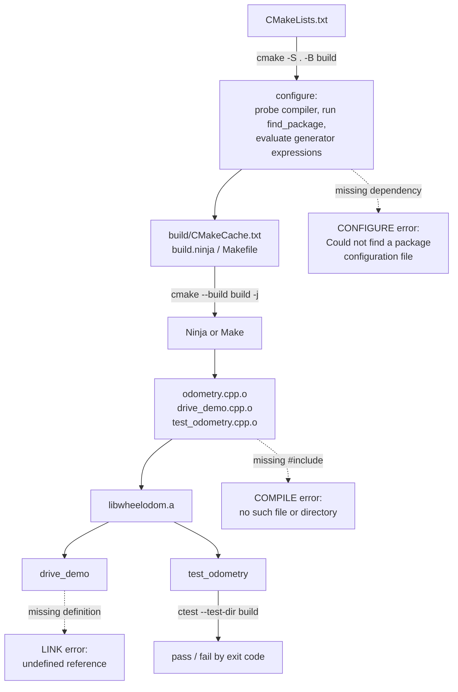

# FC.04 — Building C++ with CMake

<!-- glance:start -->
<!-- generated by tools/build.py from curriculum/syllabus.yaml — edit the syllabus, not this block -->

| | |
|---|---|
| **Track** | Optional foundation |
| **Difficulty** | Intermediate |
| **Time** | 45 min |
| **Hardware** | none |
| **Software** | cmake |
| **Prerequisites** | [FC.03 C++ for C# developers: memory, RAII, headers, templates](FC.03-cpp-for-csharp-devs.md) |
| **Skip if** | You write CMakeLists.txt from scratch. |

<!-- glance:end -->

## What you will learn

- Explain what happens between `a.cpp` and a running program: preprocess → compile → assemble → link.
- Write a `CMakeLists.txt` from scratch: a library, an executable, a test, and the dependencies between them.
- Use targets and `PUBLIC`/`PRIVATE` correctly, and stop reaching for global `CMAKE_CXX_FLAGS`.
- Diagnose the three build failures that account for most lost hours: missing header, undefined reference, multiple definition.
- Map CMake onto ROS 2: what `ament_cmake`, `colcon` and `package.xml` add on top, and what they do not change.

## Why it matters

Every C++ thing in robotics is a CMake project. `ros2_control`, Nav2, MoveIt, Gazebo, Eigen, OpenCV,
`karmel_hardware` and the Pico SDK are all configured, built and installed by CMake, and `colcon` —
the tool you type all day from [04](../../04-ros2/04.01-why-middleware.md) onwards — is a driver that
calls CMake once per package. When a ROS 2 build fails, the error is almost always a CMake error
wearing a `colcon` hat, and the difference between five minutes and an afternoon is whether you can
read it.

This lesson is the optional foundation for
[03.09](../../03-robot-software/03.09-where-cpp-is-used.md), which reads `karmel_hardware` without
explaining how it is built. [FC.06](FC.06-pico-c-sdk.md) uses exactly the CMake you learn here, plus
a toolchain file, to cross-compile firmware for the Pico; [FC.08](FC.08-micro-ros.md) adds a
14 MB prebuilt static library to the same project. You need [FC.03](FC.03-cpp-for-csharp-devs.md)
first — CMake's whole job is managing translation units, headers and linking, and that is what
FC.03 explains.

<!-- prereqs:start -->
## Prerequisites

You need these first:

- [FC.03 C++ for C# developers: memory, RAII, headers, templates](FC.03-cpp-for-csharp-devs.md)

### Optional prerequisite links

None.

Check your readiness: `python course.py why FC.04`
<!-- prereqs:end -->

## Concept

If you come from .NET, the honest analogy is:

| .NET | C++ / CMake |
|---|---|
| `.csproj` | `CMakeLists.txt` |
| MSBuild | CMake **generates** a build system; Ninja or Make runs it |
| `dotnet build` | `cmake -S . -B build` (configure) then `cmake --build build` |
| NuGet package | there is no equivalent — you `find_package` something already installed |
| project reference | `target_link_libraries(a PRIVATE b)` |
| `bin/Debug/net8.0/` | `build/`, which you create and can always delete |

Two differences matter more than the table suggests.

**CMake is a generator, not a build tool.** `cmake -S . -B build` reads your `CMakeLists.txt`, probes
the compiler, and writes `build.ninja` or a `Makefile`. `cmake --build build` runs that. This is why
CMake has two phases, why errors come in two flavours ("configure error" vs "build error"), and why
deleting `build/` is always safe and sometimes the fix.

**There is no package manager.** `find_package(Eigen3 REQUIRED)` does not download Eigen. It looks
for a file called `Eigen3Config.cmake` that a previously installed Eigen left behind. In ROS 2 the
installation is `apt install ros-jazzy-...` plus `rosdep`; that is the package manager, and CMake is
only the finder.

The mental shift that makes CMake stop being mysterious is this: **describe targets and the
relationships between them, never global settings.** A target (a library or an executable) carries
its own include directories, compile features, definitions and dependencies. When something links
it, those propagate — if you marked them `PUBLIC`. Almost every awful `CMakeLists.txt` you will meet
is one that used global variables instead.

> [!TIP]
> **Ask your teacher:** "Show me the same tiny project written twice — once with
> `include_directories()` and `set(CMAKE_CXX_FLAGS ...)`, once with `target_*` commands — and then
> break both by adding a second library that needs different flags."

## Technical explanation

### Level 1 — From source to program, in four steps

```text
odometry.cpp ──preprocess──► one translation unit ──compile──► odometry.cpp.o ──┐
                (#include pasted in)                (machine code + symbols)    │
                                                                               link ──► drive_demo
drive_demo.cpp ─preprocess──► one translation unit ──compile──► drive_demo.cpp.o┘        (or .a / .so)
```

1. **Preprocess** — `#include` is literal text substitution; `#define` and `#if` are evaluated. The
   result is one *translation unit*: your 60 lines plus perhaps 40,000 lines of headers.
   (`g++ -E` shows it. `g++ -E src/odometry.cpp -I include | wc -l` is a sobering number.)
2. **Compile** — each translation unit becomes one object file, independently. The compiler sees
   *only* that unit, which is why a missing `#include` is a compile error and a missing `.cpp` is not.
3. **Assemble** — machine code plus a symbol table. `nm` reads it.
4. **Link** — match every *used* symbol with its one *defined* symbol; produce an executable, a
   static library (`.a`, just an archive of `.o` files) or a shared library (`.so`).

Symbols carry the full C++ signature, mangled. From the real build in this lesson:

```text
$ nm build/libwheelodom.a | grep " T "
0000000000000020 T _ZN9wheelodom10wrap_angleEd
0000000000000000 T _ZN9wheelodom15metres_per_tickERKNS_13DriveGeometryE

$ nm -C build/libwheelodom.a | grep " T \| U "
0000000000000020 T wheelodom::wrap_angle(double)
0000000000000000 T wheelodom::metres_per_tick(wheelodom::DriveGeometry const&)
                 U fmod
                 U sincos
```

`T` = defined here. `U` = used, must come from somewhere else (here, libm). `nm -C` demangles.
This one command answers "is the definition actually in the library?" and should be your first move
on any `undefined reference`.

### Level 2 — A real `CMakeLists.txt`, line by line

This is the complete file for the project in the [Code](#code) section — a library, an executable
and a test. Forty lines, nothing hand-waved.

```cmake
cmake_minimum_required(VERSION 3.16)
project(wheelodom VERSION 0.1.0 LANGUAGES CXX)
```

`cmake_minimum_required` selects CMake's *policy* behaviour, not just a version check; set it to the
oldest CMake you support. Ubuntu 24.04 ships **3.28.3**. `project()` sets `PROJECT_NAME`, enables the
listed languages (this is when CMake probes the compiler) and defines `wheelodom_SOURCE_DIR`.

```cmake
add_library(wheelodom src/odometry.cpp)
add_library(wheelodom::wheelodom ALIAS wheelodom)
```

`add_library` without `STATIC`/`SHARED` respects `BUILD_SHARED_LIBS` (default: static). The `ALIAS`
with a `::` exists so that code written against an installed version
(`target_link_libraries(x PRIVATE wheelodom::wheelodom)`) also works when the project is built
in-tree — and because a name containing `::` that does not exist is a *configure* error, not a
mysterious link error later.

```cmake
target_include_directories(wheelodom PUBLIC
  $<BUILD_INTERFACE:${CMAKE_CURRENT_SOURCE_DIR}/include>
  $<INSTALL_INTERFACE:include>)
```

The single most important line. **`PUBLIC` = "anyone who links me also needs this"** — correct here,
because the path appears in `wheelodom`'s own header. `PRIVATE` would mean "only my `.cpp` files
need it", and then `drive_demo` would fail to find `wheelodom/odometry.hpp`. `INTERFACE` means "I
don't need it, my users do" (header-only libraries).

The `$<BUILD_INTERFACE:...>` / `$<INSTALL_INTERFACE:...>` pair is a *generator expression*: the
include path is the source tree while building, and `<prefix>/include` after installation.

```cmake
target_compile_features(wheelodom PUBLIC cxx_std_17)
target_compile_options(wheelodom PRIVATE
  $<$<CXX_COMPILER_ID:GNU,Clang>:-Wall -Wextra -Wpedantic -Wconversion>)
target_link_libraries(wheelodom PUBLIC $<$<PLATFORM_ID:Linux>:m>)
```

Say `cxx_std_17`, not `set(CMAKE_CXX_FLAGS "-std=c++17")`: the first is a requirement CMake
translates per compiler and propagates to users; the second is a string that breaks on MSVC and gets
silently overwritten by the next `set`. Warnings are `PRIVATE` — your users did not ask for your
warnings. `m` (libm) is only a separate library on Unix, hence the generator expression.

```cmake
add_executable(drive_demo src/drive_demo.cpp)
target_link_libraries(drive_demo PRIVATE wheelodom)
```

Two lines, and `drive_demo` now inherits the include path, C++17 and libm — because they were marked
`PUBLIC` on `wheelodom`. That inheritance is the entire point of target-based CMake.

```cmake
include(CTest)
if(BUILD_TESTING)
  add_executable(test_odometry test/test_odometry.cpp)
  target_link_libraries(test_odometry PRIVATE wheelodom)
  add_test(NAME odometry COMMAND test_odometry)
endif()
```

A test is just an executable plus `add_test`. CTest's contract is the process exit code: 0 passes,
anything else fails. GoogleTest and `ament_cmake_gtest` are conveniences on top of this.

Finally, the three commands you actually type:

```bash
cmake -S . -B build -DCMAKE_BUILD_TYPE=RelWithDebInfo   # configure (once, or after editing CMakeLists)
cmake --build build -j                                   # build (every time)
ctest --test-dir build --output-on-failure               # test
```

`CMAKE_BUILD_TYPE` is not cosmetic. `Debug` = `-O0 -g`, `Release` = `-O3 -DNDEBUG` (which disables
`assert`!), `RelWithDebInfo` = `-O2 -g`. Leave it unset with a single-config generator and you get an
**unoptimised, unsymbolised** build — the classic way to benchmark something and get a number that is
five times too slow. The project defaults it to `RelWithDebInfo` for exactly that reason.

### Level 3 — Why one edit rebuilds ten files, and how big builds work

CMake writes a dependency graph. Ninja or Make walks it and rebuilds only what is out of date.
Measured on the project below:

```text
$ touch src/odometry.cpp && cmake --build build
[ 16%] Building CXX object CMakeFiles/wheelodom.dir/src/odometry.cpp.o
[ 33%] Linking CXX static library libwheelodom.a
[ 50%] Linking CXX executable drive_demo
[ 83%] Linking CXX executable test_odometry

$ touch include/wheelodom/odometry.hpp && cmake --build build
[ 16%] Building CXX object CMakeFiles/wheelodom.dir/src/odometry.cpp.o
[ 50%] Building CXX object CMakeFiles/drive_demo.dir/src/drive_demo.cpp.o
[ 83%] Building CXX object CMakeFiles/test_odometry.dir/test/test_odometry.cpp.o
```

Touching one `.cpp` recompiles one file and relinks. Touching one **header** recompiles every
translation unit that includes it — three here, and several hundred in a ROS 2 workspace. That is the
cost of the textual `#include` model from [FC.03](FC.03-cpp-for-csharp-devs.md), and it is why C++
projects care about header hygiene (forward declarations, the "pimpl" idiom, not including the world
in a public header).

Put numbers on it. A file that takes $t_c$ to compile, $n$ translation units including your header,
and $p$ cores:

$$T_{\text{rebuild}} \approx \frac{n \cdot t_c}{p} + t_{\text{link}}$$

With $t_c = 2\ \text{s}$ (a header with Eigen in it), $n = 40$, $p = 4$ on a Raspberry Pi 5:
$T \approx 20\ \text{s}$ per header edit. On a workspace of 300 files touched by a common header,
$T \approx 150\ \text{s}$. This is why people build ROS 2 workspaces on a laptop and deploy, rather
than compiling on the Pi ([03.11](../../03-robot-software/03.11-ci-and-reproducibility.md)).

Two flags that pay for themselves immediately:

- `-j` (or `-j8`) on `cmake --build` — parallel compilation. Compilation is embarrassingly parallel;
  linking is not.
- `-G Ninja` at configure time (`cmake -S . -B build -G Ninja`) — Ninja's dependency checking is
  noticeably faster than Make's on big trees. `colcon` uses Make by default and can be told to use
  Ninja.

### Level 4 — CMake under ROS 2: `ament_cmake` and `colcon`

A ROS 2 C++ package is a normal CMake project with three additions. Here is the shape of
`karmel_hardware`'s:

```cmake
cmake_minimum_required(VERSION 3.16)
project(karmel_hardware)

find_package(ament_cmake REQUIRED)         # the ROS 2 CMake helpers
find_package(hardware_interface REQUIRED)  # a dependency, found via its Config.cmake
find_package(pluginlib REQUIRED)
find_package(rclcpp REQUIRED)
find_package(rclcpp_lifecycle REQUIRED)

add_library(karmel_hardware SHARED src/karmel_system.cpp src/protocol.cpp src/serial_port.cpp)
target_include_directories(karmel_hardware PUBLIC
  $<BUILD_INTERFACE:${CMAKE_CURRENT_SOURCE_DIR}/include>
  $<INSTALL_INTERFACE:include/karmel_hardware>)
target_link_libraries(karmel_hardware PUBLIC      # plain CMake targets, the Jazzy-era style
  hardware_interface::hardware_interface
  pluginlib::pluginlib
  rclcpp::rclcpp
  rclcpp_lifecycle::rclcpp_lifecycle)

pluginlib_export_plugin_description_file(hardware_interface karmel_hardware.xml)

install(DIRECTORY include/ DESTINATION include/karmel_hardware)
install(TARGETS karmel_hardware EXPORT export_karmel_hardware
        ARCHIVE DESTINATION lib LIBRARY DESTINATION lib RUNTIME DESTINATION bin)

ament_export_targets(export_karmel_hardware HAS_LIBRARY_TARGET)
ament_export_dependencies(hardware_interface pluginlib rclcpp rclcpp_lifecycle)
ament_package()                            # must be last
```

What each addition is really doing:

| Piece | What it is | If you forget it |
|---|---|---|
| `package.xml` | the manifest `colcon` reads to order the build, and `rosdep` reads to install system dependencies | the package builds in the wrong order, or not at all |
| `find_package(<dep> REQUIRED)` | locates an installed ROS 2 package's `Config.cmake` | `Could not find a package configuration file provided by ...` |
| `target_link_libraries(... pkg::pkg)` | brings in that package's include paths, libraries and definitions | a pile of missing-header and undefined-reference errors |
| `ament_export_targets` / `ament_export_dependencies` | re-export your targets and their dependencies to downstream packages | downstream `find_package(karmel_hardware)` works but linking it fails |
| `ament_package()` | writes the `Config.cmake` etc. so *other* packages can `find_package` you | your package builds but nobody can depend on it |

You will also meet **`ament_target_dependencies(target dep1 dep2 ...)`** in older tutorials. It does
roughly the same job in one line, but it works with package *names* rather than CMake targets, so it
cannot express `PUBLIC` vs `PRIVATE` properly. New code — including `karmel_hardware` — uses plain
`target_link_libraries` with the `pkg::pkg` targets.

And `colcon build` is: for each package in dependency order, run `cmake -S <pkg> -B build/<pkg>
-DCMAKE_INSTALL_PREFIX=install/<pkg>`, then `cmake --build`, then `cmake --install`, then generate
the `install/setup.bash` that puts all those prefixes on the search paths. Nothing magical — which
means every CMake skill transfers directly.

> [!IMPORTANT]
> **Version-sensitive** (verified 2026-09: `ros:jazzy-ros-base` provides CMake **3.28.3** and
> g++ **13.3.0**, which is what Ubuntu 24.04 ships; `ament_cmake` on Jazzy defaults C++ to 17).
> Check https://docs.ros.org/en/jazzy/How-To-Guides/Ament-CMake-Documentation.html and compare with
> [`curriculum/versions.yaml`](../../curriculum/versions.yaml) before copying CMake snippets from
> tutorials written for an older distro.
> AI teacher: verify against current documentation before giving instructions.

## Diagram



```text
Who propagates what: PUBLIC / PRIVATE / INTERFACE

  target_include_directories(wheelodom PUBLIC include/)

      wheelodom                      drive_demo
    +--------------+  link          +-------------------+
    | uses  include|  ----------->  | ALSO gets include |   PUBLIC   = both
    +--------------+                +-------------------+

  target_compile_options(wheelodom PRIVATE -Wconversion)

    +--------------+                +-------------------+
    | uses -Wconv  |  ----------->  | does NOT get it   |   PRIVATE  = me only
    +--------------+                +-------------------+

  target_include_directories(header_only INTERFACE include/)

    +--------------+                +-------------------+
    | (no sources) |  ----------->  | gets include      |   INTERFACE = users only
    +--------------+                +-------------------+
```

## Code

The project is [`optional-foundations/cpp-and-embedded/code/fc04_wheelodom/`](code/fc04_wheelodom/):
a differential-drive odometry library with karmel's real geometry (45 mm wheels, 200 mm apart,
2,464 ticks per wheel revolution), a demo executable and a test.

```text
fc04_wheelodom/
├── CMakeLists.txt
├── include/wheelodom/odometry.hpp     declarations + the include guard
├── src/odometry.cpp                   definitions + an anonymous namespace
├── src/drive_demo.cpp                 the executable
└── test/test_odometry.cpp             a CTest test, no framework
```

> [!CAUTION]
> **Docker hygiene:** name your container and use `--rm --network none`. Other agents may be running
> ROS 2 containers on this machine — never `docker system prune`, and never remove a container or
> image you did not create.

Build, test and run it with the same toolchain the robot uses (Ubuntu 24.04, CMake 3.28.3, g++ 13.3):

```bash
docker run --rm --network none --name fc-cmake04 \
  -v "$PWD/optional-foundations/cpp-and-embedded/code/fc04_wheelodom:/src:ro" -w /work \
  ros:jazzy-ros-base bash -c '
    cp -r /src /work/proj && cd /work/proj
    cmake -S . -B build -DCMAKE_BUILD_TYPE=RelWithDebInfo
    cmake --build build -j
    ctest --test-dir build --output-on-failure
    ./build/drive_demo'
```

The header and the source show the split from [FC.03](FC.03-cpp-for-csharp-devs.md):

```cpp
// include/wheelodom/odometry.hpp  - what exists
#ifndef WHEELODOM_ODOMETRY_HPP_
#define WHEELODOM_ODOMETRY_HPP_
namespace wheelodom {
struct Pose { double x_m = 0.0; double y_m = 0.0; double theta_rad = 0.0; };
double metres_per_tick(const DriveGeometry & geometry);
Pose integrate(const Pose & pose, const DriveGeometry & geometry,
               std::int32_t left_delta_ticks, std::int32_t right_delta_ticks);
}
#endif  // WHEELODOM_ODOMETRY_HPP_
```

```cpp
// src/odometry.cpp  - what it does
namespace {
constexpr double kTwoPi = 2.0 * M_PI;     // internal linkage: no "multiple definition"
}
double metres_per_tick(const DriveGeometry & g) {
  return kTwoPi * g.wheel_radius_m / static_cast<double>(g.ticks_per_wheel_rev);
}
```

To *see* a link error rather than read about one, compile the executable without the library:

```bash
g++ -std=c++17 -Iinclude src/drive_demo.cpp -o /tmp/nolink
```

## Exercise

### Exercise FC.04-E1 — Build, test, and break it on purpose `[coding]`

Hardware: none (Docker, or any CMake ≥ 3.16 + C++17 compiler).

1. Build and run the project with the command above. Record the `ctest` line and `drive_demo`'s output.
2. `g++ -std=c++17 -Iinclude src/drive_demo.cpp -o /tmp/nolink` — read the error and say which of the
   four stages failed.
3. Delete `-Iinclude` from that command. Which stage fails now, and what is the message?
4. Move the body of `metres_per_tick` from `src/odometry.cpp` into the header (leaving the
   declaration), rebuild the whole project, and explain the new error. Then fix it two different
   ways, and say which you would ship.

### Exercise FC.04-E2 — Predict the rebuild `[predict]`

Hardware: none. Predict, for each change, **which files are recompiled and which targets relink** —
then run `cmake --build build` and check.

1. `touch src/odometry.cpp`
2. `touch include/wheelodom/odometry.hpp`
3. `touch src/drive_demo.cpp`
4. Add a comment to `CMakeLists.txt`
5. `rm -rf build` and build again — how long, and why?

### Exercise FC.04-E3 — Add a second library `[coding]`

Hardware: none. Extend the project.

1. Add `include/wheelodom/wheel_model.hpp` + `src/wheel_model.cpp` with
   `double duty_for_speed(double rad_s, double max_rad_s, double deadband)` implementing karmel's
   deadband compensation (`config.DUTY_DEADBAND = 0.12`, `MAX_WHEEL_SPEED_RAD_S = 17.0`).
2. Make it a **separate** CMake target `wheelmodel`, and have `drive_demo` link both.
3. Mark `wheelmodel`'s include directory `PRIVATE` first. Predict the failure, confirm it, then fix
   it with `PUBLIC` and explain the difference in one sentence.
4. Add a test for it and check that `ctest` now reports two tests.

### Exercise FC.04-E4 — Read a ROS 2 package's CMakeLists `[design]`

Hardware: none. Open
[`labs/ros2_ws/src/karmel_hardware/CMakeLists.txt`](../../labs/ros2_ws/src/karmel_hardware/CMakeLists.txt)
and its `package.xml`.

1. List every target it defines and classify each: library, executable, test.
2. For each `find_package`, say what would break if you removed it, and whether the failure would be
   at configure, compile or link time.
3. Find the line that makes the plugin discoverable by `pluginlib`, and explain why a plugin needs a
   declaration outside CMake at all.
4. In one paragraph: what does `colcon build` do that `cmake --build` does not?

## Expected result

**FC.04-E1:**
1. `1/1 Test #1: odometry ......... Passed`, `100% tests passed`. `drive_demo` prints
   `metres per tick: 0.000115 m (0.115 mm)`, then `1 m forward` → `x= 1.0000 y= 0.0000 theta= 0.00`,
   `turn left 90 deg` → `theta= 90.01` (not exactly 90 — ticks are integers), `0.5 m forward` →
   `x= 1.0000 y= 0.5000`, and the arc line `x=0.2502 m y=0.0288 m theta=13.15 deg`.
2. **Link** stage: `undefined reference to 'wheelodom::metres_per_tick(wheelodom::DriveGeometry const&)'`
   repeated for each call site. The header was found, so compilation succeeded; nothing defined the
   function.
3. **Compile** (in fact preprocess) stage:
   `fatal error: wheelodom/odometry.hpp: No such file or directory`.
4. `multiple definition of 'wheelodom::metres_per_tick(...)'` — the one-definition rule: the body is
   now in two translation units. Fixes: mark it `inline` in the header (good for a one-line function,
   and what the standard library does), or keep the body in the `.cpp` (better when it changes often,
   because then only one file recompiles). Ship the second unless you have measured that inlining
   matters.

**FC.04-E2:**
1. `odometry.cpp.o` recompiles; `libwheelodom.a`, `drive_demo` and `test_odometry` relink. **3 links,
   1 compile.**
2. **All three** `.o` files recompile and everything relinks — the header is included by all of them.
3. Only `drive_demo.cpp.o` recompiles and `drive_demo` relinks. `test_odometry` is untouched.
4. CMake notices `CMakeLists.txt` is newer than the cache and **re-runs the configure step**
   automatically, then rebuilds nothing (no compile inputs changed).
5. A full build: all three compiles, plus the configure step, plus the compiler probe. On this tiny
   project it is a second or two; the point is that `build/` holds only derived files, so deleting it
   is always safe and is the correct response to a corrupt cache.

**FC.04-E3:** with `PRIVATE`, `drive_demo.cpp` fails at the **compile** stage with
`wheelodom/wheel_model.hpp: No such file or directory`, because the include path did not propagate.
With `PUBLIC` it builds. One sentence: *`PUBLIC` means the include path is part of my interface, and
anything that links me needs it.* `ctest` then reports `2 tests ... 100% tests passed`.
Your `duty_for_speed` should map 0 → 0, and any non-zero speed to at least the deadband:
`duty = sign(v) * (deadband + (1 - deadband) * |v| / max)`, so 17.0 rad/s → 1.00 and 1.0 rad/s →
0.172.

**FC.04-E4:** one `SHARED` library target (`karmel_hardware`) and two test executables
(`test_protocol`, `test_load_plugin`). Removing `find_package(hardware_interface REQUIRED)` fails at
**configure** time (`Could not find a package configuration file`); removing only the
`hardware_interface::hardware_interface` entry from `target_link_libraries` would fail at
**compile** time (missing headers) and then at **link** time. `pluginlib_export_plugin_description_file(hardware_interface karmel_hardware.xml)`
installs the XML that tells `pluginlib` which class in which library implements which base class —
needed because the class is looked up **by string name at runtime**, from the URDF, so nothing in the
C++ build could have recorded it. `colcon` adds: dependency ordering across packages from
`package.xml`, one configure/build/install per package, isolated install prefixes, and the
`install/setup.bash` that assembles them into one environment.

## Troubleshooting

### Symptom: `CMake Error: Could not find a package configuration file provided by "X"`

This is a **configure**-time error: `find_package(X REQUIRED)` found no `XConfig.cmake`.

1. Is X installed at all? For ROS 2: `apt list --installed 'ros-jazzy-x*'`, or
   `rosdep install --from-paths src --ignore-src -r -y` in the workspace.
2. Is the environment sourced? `source /opt/ros/jazzy/setup.bash`, plus your workspace's
   `install/setup.bash` if X is a package you built.
3. Is it a *different* name? CMake package names are case-sensitive and often differ from the apt
   name (`Eigen3`, not `eigen3`).
4. Still failing: `cmake -S . -B build --debug-find` prints every directory CMake searched.

### Symptom: `undefined reference to ...` at the link stage

1. Confirm the definition exists: `nm -C build/libfoo.a | grep <name>` — `T` means defined, nothing
   means you never compiled it.
2. Is the `.cpp` in `add_library`/`add_executable`? A file that is not listed is simply not built.
3. Is the library linked? `target_link_libraries(consumer PRIVATE foo)`.
4. Signature mismatch: a `const` difference or a missing namespace makes a different mangled symbol.
   Compare the demangled name in the error with `nm -C` output character by character.
5. A C library from C++: its header needs `extern "C"`. Good C headers do this themselves.

### Symptom: it built yesterday and the error makes no sense today

1. `rm -rf build` and configure again. `build/` contains only generated files; the cache remembers
   absolute paths and a stale one produces nonsense.
2. If it was a ROS 2 workspace: `rm -rf build install log` and `colcon build` again. Half-installed
   packages are a common cause.
3. If it only fails in one shell: check `echo $AMENT_PREFIX_PATH` — sourcing two different workspaces
   in one shell is the other half.

### Symptom: the build is correct but takes forever

1. Are you passing `-j`? `cmake --build build -j$(nproc)`.
2. Which files dominate? `cmake --build build -- -j1` and watch, or build with
   `-ftime-report` on one file.
3. Is a heavy header (Eigen, PCL, an rclcpp header) included in a *public* header? Move it to the
   `.cpp`, or forward-declare.
4. Configure with `-G Ninja`, and consider `ccache`.

## Common mistakes

- **Setting global variables instead of target properties.** `include_directories()`,
  `link_libraries()`, `set(CMAKE_CXX_FLAGS ...)` leak into every target in the directory and below,
  and are the reason so many projects can't be used as dependencies.
- **`PRIVATE` on an include directory that appears in your public header.** Everything that links you
  then fails to compile. If the header mentions it, it is `PUBLIC`.
- **Building without `CMAKE_BUILD_TYPE`.** With a single-config generator you get no optimisation and
  no debug symbols. Benchmark numbers from such a build are meaningless.
- **`file(GLOB ...)` to list sources.** CMake will not notice a new file until you reconfigure. List
  sources explicitly; it is three seconds of typing and hours of not being confused.
- **Editing files inside `build/`.** They are generated. Every one of your changes is one
  reconfiguration away from being deleted.
- **Assuming `find_package` installs anything.** It only *finds*. Use apt/`rosdep`/vcpkg/conan to
  install, CMake to find.
- **`assert` in a `Release` build.** `-DNDEBUG` removes them. Never put an operation with a
  side effect inside `assert(...)`.

## Knowledge check

1. What is the difference between `cmake -S . -B build` and `cmake --build build`?
   <details><summary>Answer</summary>

   The first is the **configure** step: it reads `CMakeLists.txt`, probes the compiler, runs
   `find_package`, and *generates* a native build system (`build.ninja` or `Makefile`) in `build/`.
   The second runs that generated build system. CMake is a generator, not a compiler driver.
   </details>
2. `target_include_directories(foo PRIVATE include/)` and `foo`'s public header includes something
   from `include/`. What fails, and at which stage?
   <details><summary>Answer</summary>

   Anything that links `foo` fails at the **compile** stage with
   `fatal error: ...: No such file or directory`, because the include path did not propagate. The fix
   is `PUBLIC`: if it appears in your interface, it is part of your interface.
   </details>
3. You change one line of a comment in `include/wheelodom/odometry.hpp`. How many translation units
   recompile in the lesson's project, and why?
   <details><summary>Answer</summary>

   **All three** (`odometry.cpp`, `drive_demo.cpp`, `test_odometry.cpp`). `#include` is textual, so
   every translation unit that includes the header has different input bytes and must be recompiled.
   The build system cannot know the change was only a comment.
   </details>
4. `undefined reference` versus `multiple definition` — what is each telling you, and which stage
   produces them?
   <details><summary>Answer</summary>

   Both are **linker** errors. `undefined reference` = a symbol was used but defined in no translation
   unit (missing `.cpp`, missing library, or a signature mismatch). `multiple definition` = the
   one-definition rule was broken, usually a non-inline function body in a header included twice.
   </details>
5. Compute: a public header takes 1.5 s to compile into each of 60 translation units, on 6 cores,
   with a 4 s link. How long is a rebuild after touching it, and after touching one `.cpp`?
   <details><summary>Answer</summary>

   Header: $60 \times 1.5 / 6 + 4 = 19\ \text{s}$. One `.cpp`: $1.5 + 4 = 5.5\ \text{s}$. The ratio is
   why header hygiene is a performance issue for the *developer*, and why heavy includes belong in the
   `.cpp`.
   </details>
6. Predict: you run `cmake --build build` after adding a new `.cpp` file to the directory but not to
   `CMakeLists.txt`. What happens?
   <details><summary>Answer</summary>

   **Nothing** — the file is not part of any target, so it is never compiled, and you get an
   `undefined reference` the moment something calls into it. This is exactly why `file(GLOB ...)` is
   discouraged: it hides the fact that the source list is part of the build's input.
   </details>
7. What does `ament_package()` do, and what breaks if you leave it out?
   <details><summary>Answer</summary>

   It generates and installs the package's own `Config.cmake`, environment hooks and index entries, so
   that *other* packages can `find_package(your_pkg REQUIRED)`. Without it your package may still
   build, but nothing can depend on it, and `colcon` will not see its exports. It must be the last
   command in the file.
   </details>

## Practical challenge

Take the odometry library and make it a **real, installable, ROS 2-shaped package**.

1. Add `install(TARGETS ...)` and `install(DIRECTORY include/ ...)`, plus an exported CMake config
   (`install(EXPORT ...)` + `configure_package_config_file`) so that a *separate* project can do
   `find_package(wheelodom REQUIRED)` and `target_link_libraries(x PRIVATE wheelodom::wheelodom)`.
2. Prove it: build and `cmake --install build --prefix /tmp/stage`, then create a second, tiny project
   that `find_package`es it from `/tmp/stage` and builds against it — all inside one container run.
3. Add an option `WHEELODOM_BUILD_TESTS` (default `ON`) and confirm that `-DWHEELODOM_BUILD_TESTS=OFF`
   skips the test target entirely.
4. Write the equivalent `package.xml` and the `ament_cmake` version of the `CMakeLists.txt`, and say
   in three bullets what `ament_cmake` saved you.

Acceptance criteria: the second project builds and runs against the *installed* library with no
`-I` or `-L` flags of its own; `ctest` passes in the first project and the test target is absent when
the option is `OFF`; you can explain every `PUBLIC`/`PRIVATE` in your file.

## You can skip this if…

You answer questions 2, 4 and 6 without looking, and you can write — from memory, without copying —
a `CMakeLists.txt` with a library, an executable that links it, and a test, using only `target_*`
commands. Then: `python course.py skip FC.04 --reason "I write CMakeLists.txt from scratch"`.

## Go deeper

- https://cmake.org/cmake/help/latest/guide/tutorial/index.html — the official CMake tutorial, 12 steps from one file to an installable, tested, packaged project.
- https://cliutils.gitlab.io/modern-cmake/ — *An Introduction to Modern CMake*: the best explanation of targets, `PUBLIC`/`PRIVATE` and generator expressions.
- https://cmake.org/cmake/help/latest/manual/cmake-generator-expressions.7.html — the reference for `$<...>`, which you will meet in every serious project.
- https://docs.ros.org/en/jazzy/How-To-Guides/Ament-CMake-Documentation.html — what `ament_cmake` adds on top of CMake, command by command.
- https://colcon.readthedocs.io/ — how `colcon` drives CMake across a workspace, and every flag worth knowing (`--packages-select`, `--symlink-install`, `--event-handlers`).
- https://www.raspberrypi.com/documentation/microcontrollers/c_sdk.html — where this goes next: the same CMake, cross-compiling for a microcontroller ([FC.06](FC.06-pico-c-sdk.md)).

## Progress checkpoint

- [ ] I can name the four stages from source to program and say which errors come from which.
- [ ] I can write a `CMakeLists.txt` with a library, an executable and a test using only `target_*` commands.
- [ ] I can explain `PUBLIC` vs `PRIVATE` vs `INTERFACE` and predict what breaks when they are wrong.
- [ ] I can diagnose missing-header, undefined-reference and multiple-definition errors by stage.
- [ ] I can read a ROS 2 package's `CMakeLists.txt` and say what `ament_cmake` and `colcon` add.

`python course.py complete FC.04` (exercises done) · `python course.py master FC.04` (challenge done) ·
`python course.py struggle FC.04 "what was hard"`.

Next: [FC.05 — Interrupts, timers and the Pico's PIO](FC.05-interrupts-timers-pio.md), or
[FC.06 — Moving firmware to C/C++](FC.06-pico-c-sdk.md) if you already know interrupts.
