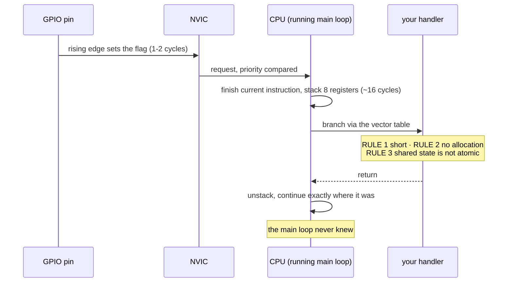

# FC.05 — Interrupts, timers and the Pico's PIO

<!-- glance:start -->
<!-- generated by tools/build.py from curriculum/syllabus.yaml — edit the syllabus, not this block -->

| | |
|---|---|
| **Track** | Optional foundation |
| **Difficulty** | Intermediate |
| **Time** | 1 h |
| **Hardware** | Stage 1 robot: Pi 5, Pico, encoder motors, driver, chassis, battery, distance sensors (stage 1) |
| **Software** | micropython |
| **Prerequisites** | [FC.02 MicroPython on the Raspberry Pi Pico](FC.02-micropython-on-pico.md) |
| **Skip if** | You write short, safe interrupt handlers and know when PIO is better. |

<!-- glance:end -->

## What you will learn

- Explain what happens, cycle by cycle, when a pin changes and an interrupt fires — and what "interrupt latency" is made of.
- Write an interrupt handler that obeys the three rules: short, allocation-free, and careful with shared state.
- Choose between polling, a soft IRQ, a hard IRQ, a hardware timer and PIO, using an edge rate and a CPU-load number rather than taste.
- Debounce a mechanical contact correctly, in the time domain, and say why a bumper without it fires four times.
- Read a PIO program, say what its four instructions do, and explain why PIO — not interrupts — counts karmel's encoders.

## Why it matters

karmel's two wheels produce about 16,000 encoder edges per second at full speed. A MicroPython
interrupt handler takes tens of microseconds. Multiply those two numbers and the robot spends more
than 100 % of its CPU counting edges — which is why
[01.09](../../01-first-robot/01.09-reading-encoders.md) puts the encoders on PIO, why
[07.02](../../07-sensors/07.02-wheel-encoders-in-depth.md) spends a whole level on the arithmetic of
losing edges, and why the firmware's status LED, watchdog and control tick are all driven by timers
rather than by `time.sleep`.

This lesson is the mechanism underneath all of that. It is the optional foundation for
[01.09](../../01-first-robot/01.09-reading-encoders.md), and the vocabulary
[FC.06](FC.06-pico-c-sdk.md) uses when the same handlers are written in C and
[FC.07](FC.07-real-time-concepts.md) uses when "on time" becomes a measurable property. If you have
only ever written code that runs when it is called, interrupts are the genuinely new idea: code that
runs *between two machine instructions of your program*, without your program knowing.

<!-- prereqs:start -->
## Prerequisites

You need these first:

- [FC.02 MicroPython on the Raspberry Pi Pico](FC.02-micropython-on-pico.md)

### Optional prerequisite links

None.

Check your readiness: `python course.py why FC.05`
<!-- prereqs:end -->

## Concept

Your microcontroller program is a single `while True:` loop. A wheel turns and an encoder pin goes
high. How does the loop find out?

**Polling** — the loop asks. `if pin.value() != last: ...`. Simple, and the latency is "whenever the
loop gets round to it". If one pass of the loop takes 10 ms, you will miss every edge shorter than
that, and you will miss *all but one* of the edges that arrive in the same pass.

**An interrupt** — the hardware tells you. The pin change sets a flag in a peripheral; the
peripheral raises a request to the NVIC (the Cortex-M interrupt controller); the NVIC compares its
priority with whatever the CPU is doing; if it wins, the CPU finishes the current instruction,
pushes eight registers onto the stack, and jumps to your handler. When the handler returns, the CPU
pops the registers and continues **exactly where it was**, with no idea anything happened.

The distributed-systems analogy that actually helps: polling is a client that re-reads an endpoint on
a timer; an interrupt is a webhook. And like a webhook, the handler must be fast, must not block, must
be idempotent about state it shares with the main flow, and must survive arriving at an inconvenient
moment — because there is no "inconvenient moment" it will politely avoid.

The comparison with .NET is worth making precisely, because the words are misleading. An `async`
callback in C# runs on a thread, scheduled by a runtime, and can do anything a thread can do. An
interrupt handler is not scheduled by anything: it *preempts* your code, it runs on your stack, it
cannot wait for anything (there is nothing to wait for — your program is not running), and on
MicroPython it may not even allocate memory. It is closer to a signal handler than to a task.

There is a third option that exists on the RP2350 and almost nowhere else, and it is the reason this
chip is in the robot: **PIO**, eight tiny programmable state machines that do I/O with cycle-exact
timing and never involve the CPU at all. When the edge rate gets high enough that even a C interrupt
handler would be silly, you write four instructions of PIO assembly and the CPU does nothing.

> [!TIP]
> **Ask your teacher:** "Draw the timeline of one encoder edge three ways — polled at 100 Hz, handled
> by a hard IRQ, and counted by PIO — and mark where the CPU is at each microsecond."

## Technical explanation

### Level 1 — What an interrupt actually costs

Interrupt **latency** is the time from the electrical event to the first instruction of your handler.
On a Cortex-M33 it is made of four pieces:

| Piece | RP2350 at 150 MHz | Why |
|---|---|---|
| peripheral detects the edge, sets its flag | 1–2 clock cycles | synchronisers on the GPIO input |
| NVIC arbitration + the CPU finishing its instruction | ~4 cycles typical, longer if a multi-cycle instruction or a higher-priority handler is running | the core cannot be interrupted mid-instruction |
| stacking 8 registers (16 with the FPU) | ~12 cycles | hardware does it, so the handler looks like a normal function |
| vector fetch and branch | ~4 cycles | read the handler address from the vector table |
| **total, in C** | **≈ 20–25 cycles ≈ 0.15 µs** | |
| **total, in MicroPython** | **tens of microseconds** | the interpreter must set up a Python frame and run bytecode |

That last row is the whole story of this lesson. A C handler that increments a counter costs
about 0.2 µs. The *same* handler in MicroPython costs 20–70 µs, because a Python-level callback means
dispatching into the interpreter. Both are "an interrupt"; they are two orders of magnitude apart.

Turn it into a load number. With an edge rate $f$ and a handler that takes $t_h$:

$$\text{CPU load} = f \cdot t_h$$

karmel at full speed, both wheels, $f = 16{,}000\ \text{s}^{-1}$:

| Handler | $t_h$ | Load | Verdict |
|---|---|---|---|
| C, increment a counter | 0.2 µs | 0.3 % | fine |
| C, full quadrature decode | 1.0 µs | 1.6 % | fine |
| MicroPython hard IRQ, minimal | 25 µs | **40 %** | works, but nothing else gets a decent deadline |
| MicroPython hard IRQ, realistic | 70 µs | **112 %** | impossible — edges are lost |
| PIO | 0 | **0 %** | the CPU never sees an edge |

And the maximum edge rate a handler can sustain at all is $1/t_h$: 40 kHz for a 25 µs handler,
14.3 kHz for a 70 µs one. The exercise makes you compute both and then simulate what "losing edges"
actually looks like.

### Level 2 — The three rules for an interrupt handler

**Rule 1: be short.** Whatever the handler does, the main program is not running. The standard shape
is *record and return*: update a counter, stash a timestamp, set a flag, push a byte into a
preallocated buffer. Decide, log, format and compute in the main loop.

**Rule 2 (MicroPython): do not allocate.** A hard IRQ may fire while the garbage collector is running
or while the heap is in an inconsistent state, so MicroPython forbids allocation inside one. What
allocates was the table in [FC.02](FC.02-micropython-on-pico.md), and it is more than you think:

```python
def handler(pin):
    global count
    count += 1                 # OK: small ints live inside the pointer
    speed = count * 0.01       # NO: every float is a heap object
    log.append(count)          # NO: list growth
    print("edge", count)       # NO: string formatting, and it is slow
```

Violating it raises `MemoryError` **inside the interrupt**, where there is nowhere to print it.
`micropython.alloc_emergency_exception_buf(100)` reserves a buffer so you at least get a traceback;
put it at the top of every file that uses `irq(..., hard=True)`.

`hard=False` (the default) sidesteps the rule: MicroPython *schedules* your callback to run soon,
between bytecodes, so it may allocate — at the price of being delayed by whatever is running,
including a GC pause of milliseconds. Soft for buttons, hard for anything with a deadline.

**Rule 3: shared state is not atomic.** The handler and the main loop share variables, and the
handler can fire between any two machine instructions. Three specific hazards:

- **Read-modify-write.** `count += 1` in the *main loop* is a read, an add and a store. An interrupt
  between the read and the store loses its increment. (In the handler this is safe, because the
  handler cannot interrupt itself.)
- **Torn multi-word reads.** Reading a 64-bit timestamp, or a `(count, timestamp)` pair, can catch
  half of an update. Copy it in one statement, or disable interrupts around the read
  (`machine.disable_irq()` / `enable_irq(state)`), or use the "read, read again, retry if it changed"
  pattern.
- **The compiler/interpreter caching a value.** In C this is what `volatile` is for: it tells the
  compiler that a variable can change behind its back, so it must reload it every time. Forget it and
  `while (!flag) { }` becomes an infinite loop at `-O2`. (`volatile` is *not* a synchronisation
  primitive — for anything more than a single word, use `std::atomic` or a critical section.)

This is why the RP2350 has separate `GPIO_OUT_SET` / `GPIO_OUT_CLR` / `GPIO_OUT_XOR` registers
([FC.01](FC.01-embedded-systems-101.md)): they make "change these pins" one atomic write instead of a
read-modify-write that an interrupt could corrupt.

### Level 3 — Debouncing, in the time domain

A mechanical contact does not close once. The metal bounces, and for 1–20 ms the signal is a burst of
edges. A bumper switch wired to an interrupt therefore reports "hit" four to twenty times.

```text
      press                                   release
        |                                        |
raw  ___|‾|_|‾‾|_|‾‾‾‾‾‾‾‾‾‾‾‾‾‾‾‾‾‾‾‾‾‾‾‾‾|_|‾|_|______
        <-- bounce -->                      <-bounce->
        |<-- 20 ms -->|                          |<-- 20 ms -->|
clean ______________|‾‾‾‾‾‾‾‾‾‾‾‾‾‾‾‾‾‾‾‾‾‾‾‾‾‾‾‾‾‾‾‾‾|________
                    ^ accepted                       ^ accepted
```

The rule: **a new level is accepted only after it has held steady for `stable_ms`.** Anything shorter
is bounce and is discarded — the candidate is *forgotten*, not re-timed.

Choosing `stable_ms` is a trade-off you can put numbers on. Let $t_b$ be the worst bounce duration
and $t_r$ the fastest real event you must not miss:

$$t_b < \texttt{stable\_ms} < t_r$$

For a tactile switch $t_b \approx 5\ \text{ms}$; a human cannot press twice within 100 ms; so 20 ms is
comfortable. For a bumper on a robot moving at 0.5 m/s, 20 ms of delay is **10 mm** of extra travel —
acceptable. For an emergency stop, compute it: 20 ms at 0.5 m/s plus the watchdog and braking time is
the number that matters ([FC.07](FC.07-real-time-concepts.md)), not the 20 ms alone.

Hardware alternatives exist and are sometimes better: an RC filter plus a Schmitt-trigger input
removes bounce before the pin ever sees it, at the cost of two components
([FE.06](../electronics/FE.06-pull-up-pull-down.md)). Software is free and adjustable; hardware is
immune to a busy CPU. Robots usually use both.

### Level 4 — Hardware timers and PIO

**Timers.** A hardware timer counts clock pulses and raises an interrupt when it reaches a value. It
does not drift with your code, it does not care what the CPU is doing, and it costs no CPU between
ticks. This is how you get a 100 Hz control loop that is still 100 Hz when the loop body gets slower.

| Mechanism | Accuracy | May allocate | Use for |
|---|---|---|---|
| `time.sleep_ms(10)` in a loop | drifts by the loop body's duration, every iteration | yes | nothing with a rate |
| `machine.Timer(period=10, mode=PERIODIC, callback=f)` (soft) | scheduled: on time unless the GC is running | yes | LEDs, telemetry, housekeeping |
| `machine.Timer(..., hard=True)` | microseconds | **no** | a real control tick |
| `asyncio.sleep_until(deadline)` | as good as the loop's other tasks allow | yes | karmel's firmware — cooperative, and good enough at 100 Hz |
| a PIO state machine's own clock divider | cycle-exact | n/a | waveform generation, bit-banged protocols |

karmel's firmware uses the `asyncio` row and computes `dt` from the measured elapsed time, so a late
tick changes accuracy slightly rather than destabilising the PID
(`labs/firmware/pico/README.md`, "Timing").

**PIO** — Programmable I/O — is the RP2350's answer to "this is too fast for the CPU and too specific
for a peripheral". Eight state machines (two blocks of four) each run a program of at most 32
instructions, at up to the system clock, with their own clock divider, two 4-deep FIFOs to talk to
the CPU or DMA, and two scratch registers, X and Y.

There are only nine instructions — `jmp`, `wait`, `in`, `out`, `push`, `pull`, `mov`, `irq`, `set` —
and every one takes exactly one clock cycle (plus an optional delay of up to 31 cycles). That is what
"cycle-exact" means: you can *count* the timing of a PIO program by reading it.

Here is a complete, useful PIO program — count rising edges on a pin:

```python
@rp2.asm_pio(in_shiftdir=rp2.PIO.SHIFT_LEFT)
def edge_counter():
    wrap_target()
    wait(1, pin, 0)         # block until the pin is high  (1 cycle once it is)
    wait(0, pin, 0)         # block until it is low again
    jmp(y_dec, "publish")   # y = y - 1   (PIO can only decrement)
    label("publish")
    mov(isr, y)             # copy the count into the input shift register
    push(noblock)           # publish it to the RX FIFO; drop it if the FIFO is full
    wrap()
```

Five instructions, no CPU. The CPU reads the newest value out of the FIFO whenever it wants it.
Two idioms worth recognising because every PIO program uses them:

- **Counting up by counting down.** PIO has `jmp(y_dec, ...)` and no `inc`. To count up you either
  negate on the Python side (as above) or use the trick in
  [`labs/firmware/pico/encoders.py`](../../labs/firmware/pico/encoders.py): `~(~y - 1) = y + 1`.
- **`push(noblock)`.** A blocking `push` stalls the state machine when the FIFO is full, which would
  make it miss edges. `noblock` throws the value away instead — correct here, because the CPU only
  ever wants the *latest* count.

The quadrature decoder in `encoders.py` is the same idea with a 16-entry jump table, and its comments
explain why it must be loaded at PIO address 0. Read it after this lesson; the mechanism will be
obvious.

**When is PIO the right answer?** When the timing requirement is tighter than an interrupt can meet,
when the protocol is simple and repetitive, or when you need several identical channels. karmel uses
it for encoders; the same technique drives WS2812 LEDs, reads DHT sensors, generates stepper pulses
and implements extra UARTs. When the logic needs real arithmetic or decisions, it is the wrong
answer — 32 instructions and two registers is not much.

> [!TIP]
> **Ask your teacher:** "Walk me through `labs/firmware/pico/encoders.py`'s PIO program one
> instruction at a time, and show me why the 16-entry jump table has to start at address 0."

## Diagram



```text
Three ways to count the same 16,000 edges/s

polling at 100 Hz        |----10 ms----|----10 ms----|      CPU: busy in the loop
  edges arriving         ||||||||||||||||||||||||||||       counted: ~2 of 160  (one per pass)

interrupt, 25 us handler ##  ##  ##  ##  ##  ##  ##         CPU: 40 % in handlers
  edges arriving         ||||||||||||||||||||||||||||       counted: all, at 40 % CPU
                         ^^ each ## is one handler run

PIO                      (state machine runs on its own)    CPU: 0 %
  edges arriving         ||||||||||||||||||||||||||||       counted: all
  CPU reads the count       ^            ^           ^      whenever it feels like it
```

## Code

Three programs. The first two need a Pico 2 and **one jumper wire**; the third runs on your PC.

> [!CAUTION]
> **Safety:** these programs use GP16 and GP17 only and never touch the motor pins — but karmel's
> `main.py` may already be on the board. Switch the **motor battery off** (or keep the wheels off the
> ground) before plugging the Pico into USB, and `mpremote rm :main.py` if the firmware's hardware
> watchdog is enabled, or it will reset the board while you work.

```text
GP16 (output, "signal generator")  ------ one jumper wire ------  GP17 (input, interrupt source)
```

**[`code/fc05_isr_lab.py`](code/fc05_isr_lab.py)** — soft vs hard IRQ, whether allocation is allowed,
how long the handler takes, and the edge rate at which it starts losing. Run with
`mpremote run fc05_isr_lab.py`.

```python
micropython.alloc_emergency_exception_buf(100)   # so a crash inside a hard IRQ can print

count = 0
last_us = 0
worst_gap_us = 0

def on_edge_hard(_pin):
    """A hard IRQ: runs immediately, inside the interrupt, and MUST NOT allocate."""
    global count, last_us, worst_gap_us
    now = time.ticks_us()
    gap = time.ticks_diff(now, last_us)
    if gap > worst_gap_us:
        worst_gap_us = gap
    last_us = now
    count += 1

def on_edge_allocating(_pin):
    """The same handler with one innocent-looking line that allocates a float and a string."""
    global count
    count += 1
    _ = "edge %d at %.3f" % (count, time.ticks_us() / 1000.0)   # <- allocates
```

**[`code/fc05_pio_counter.py`](code/fc05_pio_counter.py)** — the same counting job in PIO, with a
second state machine generating the test signal at 1 kHz, 10 kHz, 100 kHz and 1 MHz. Run with
`mpremote run fc05_pio_counter.py`. It uses state machines 0 and 1 (PIO block 0), so it does not
disturb karmel's encoders on 4 and 5 (block 1).

**[`labs/exercises/FC.05/`](../../labs/exercises/FC.05/)** — the auto-graded exercise: a quadrature
decoder, a `ticks_diff` that survives the 2³⁰ ms wrap, a debouncer, and a simulator of an interrupt
handler with one pending flag. All pure logic, so it runs on your PC.

```bash
python course.py check FC.05
```

## Exercise

### Exercise FC.05-E1 — Implement the logic `[coding]`

Hardware: none. `labs/exercises/FC.05/student.py`, then `python course.py check FC.05`.

Implement `QuadratureDecoder`, `ticks_diff`, `Debouncer`, `simulate_isr`, `max_sustainable_rate_hz`
and `cpu_load_fraction`. The state machine for `simulate_isr` is written out line by line in its
docstring — implement it exactly, including the flush at the end.

### Exercise FC.05-E2 — Predict the interrupt experiments `[predict]`

Hardware: none for the prediction; `robot-base` (a Pico 2 and one jumper) to check it.
**Write your predictions down first.**

1. `fc05_isr_lab.py` part 1: a *soft* IRQ with an allocating handler, 200 edges at 2.5 kHz. How many
   are counted?
2. Part 2: the same handler as a *hard* IRQ. What is printed, and what does the count become?
3. Part 3: an allocation-free hard IRQ. Count, and rough "worst gap"?
4. Part 4 generates 1,000 edges with delays of 200, 50, 20, 10, 5 and 0 µs between transitions. At
   which row do you expect losses to start, and why that row?
5. What would the same table look like for the PIO version?

### Exercise FC.05-E3 — Debounce a real contact `[hardware]`

Hardware: `robot-base` plus any switch or a jumper you touch to a pin (the `tools` kit's jumper wires
are enough). No-hardware alternative: exercise FC.05-E1's `Debouncer` tests.

1. Wire a switch between GP18 and GND, with `Pin(18, Pin.IN, Pin.PULL_UP)`.
2. Count raw falling-edge interrupts for ten presses. Record the total.
3. Add your `Debouncer` with `stable_ms = 20` and repeat. Record the total.
4. Find the smallest `stable_ms` that still gives exactly ten, and say what that number tells you
   about your switch.
5. Compute how much distance a robot at 0.5 m/s travels during that delay.

### Exercise FC.05-E4 — Race PIO against the CPU `[hardware]`

Hardware: `robot-base` (Pico 2, one jumper GP16 → GP17).

1. Run `fc05_pio_counter.py` and record the four rows.
2. Predict the result at 1 MHz *before* looking, given the CPU is running MicroPython the whole time.
3. Modify `fc05_isr_lab.py` to count the *same* 1 MHz signal with a hard IRQ. What happens to the
   board, and why?
4. In two sentences, state the rule you would give a colleague for choosing between IRQ and PIO.

## Expected result

**FC.05-E1:** `23 passed`. If `simulate_isr` fails `test_the_pending_flag_saves_exactly_one_edge`,
you are probably dropping the latched edge instead of servicing it when the handler returns.

**FC.05-E2:**
1. **200 of 200.** A soft IRQ is scheduled between bytecodes, so allocation is legal; at 2.5 kHz
   there is plenty of time.
2. Either 200 with no complaint, or a `MemoryError` traceback from inside the handler and a count
   below 200 — it depends on the heap state when the interrupt lands. That uncertainty *is* the
   result: allocation in a hard IRQ is not "slow", it is "works until it doesn't".
3. **200 of 200**, worst gap ≈ 400 µs (the generator's two 200 µs sleeps), plus one much larger first
   gap because `last_us` starts at the reset time.
4. Losses start where the generated period approaches the handler time. With a 25–70 µs MicroPython
   handler and a period of $2 \times \text{delay}$ plus loop overhead, expect clean rows at 200 and
   50 µs, the first losses somewhere around 20–10 µs, and heavy losses at 5 and 0 µs. Your exact
   crossover is your handler's $t_h$ — write it down.
5. Zero loss on every row, because the state machine's loop is a few PIO cycles (tens of
   nanoseconds), not microseconds.

**FC.05-E3:** step 2 typically gives **20–60** interrupts for ten presses (two to six bounces each);
a really bad switch gives more. Step 3 gives exactly **10**. Step 4 usually lands between 2 ms and
10 ms — that number is your switch's worst bounce duration $t_b$. Step 5: at 0.5 m/s, 20 ms is
**10 mm**; if you found 5 ms is enough, 2.5 mm.

**FC.05-E4:**
1. Expect the error column to be small (a few per cent) at every rate, with the error coming from the
   Python-side timing of the 200 ms window rather than from lost edges. At 1 MHz the counted value
   should be ≈ 200,000.
2. Still correct. The CPU's activity is irrelevant: the state machine has its own clock.
3. A hard IRQ at 1 MHz means an interrupt every microsecond and a handler that needs tens — the board
   becomes unresponsive, the count is far below the generated number, and `mpremote` may need Ctrl-C
   (or a reset) to get in. This is an interrupt storm, and it is a real failure mode: a noisy,
   floating input pin can do the same thing to a robot ([FE.06](../electronics/FE.06-pull-up-pull-down.md)).
4. Something like: *"Estimate $f \cdot t_h$. Under a few per cent, use an interrupt. Above ~20 %, or
   if the signal is a repetitive protocol, use PIO (or a peripheral)."*

## Troubleshooting

### Symptom: `MemoryError` with no traceback, or the board resets, when a signal is active

1. Do you have `micropython.alloc_emergency_exception_buf(100)` at the top of the file? Without it a
   failure inside a hard IRQ has nowhere to report itself.
2. Read the handler line by line against the allocation table in
   [FC.02](FC.02-micropython-on-pico.md). The usual culprits are a float, an f-string, a `list.append`
   and `print`.
3. Move everything except "record and return" into the main loop.
4. Still failing? Switch to `hard=False` to confirm the diagnosis — if the error disappears,
   it was allocation.

### Symptom: the count is right at low speed and too low at high speed

This is the single most common encoder complaint, and the cause is almost always edges lost while the
handler was busy.

1. Measure, don't guess: compute $f \cdot t_h$. Time the handler by toggling a spare pin high at the
   start and low at the end and watching it with a logic analyser or an oscilloscope — or time
   100,000 calls to the handler *body* as a normal function.
2. If the load is above ~20 %, no amount of tuning will save it. Move to PIO
   ([01.09](../../01-first-robot/01.09-reading-encoders.md)) or to C ([FC.06](FC.06-pico-c-sdk.md)).
3. If the load is low but counts still drift, suspect electrical noise rather than software: a
   floating input, a missing pull-up, or motor noise coupling into the encoder wires
   ([FE.16](../electronics/FE.16-grounding.md)).

### Symptom: a variable updated in the handler never changes in the main loop

1. In C: is it `volatile`? Without it the compiler may cache it in a register and your `while (!flag)`
   never terminates.
2. In MicroPython: did you write `global`? Assigning without it creates a local in the handler.
3. Is the handler running at all? Increment a second counter unconditionally and print that.
4. Is the IRQ still registered? `pin.irq(None)` anywhere — including a soft reset — removes it.

### Symptom: one switch press produces several events

Bounce. Add a debouncer, and measure $t_b$ before choosing `stable_ms` (exercise E3). If the event
must also be fast, filter in hardware with an RC + Schmitt input instead.

### Symptom: the board is unresponsive and `mpremote` cannot get in

An interrupt storm — a fast or floating signal on an IRQ pin. Unplug the signal, or hold BOOTSEL while
plugging in to reach the bootloader, then re-flash or delete `main.py`
([FC.02](FC.02-micropython-on-pico.md) Level 3).

## Common mistakes

- **Doing work in the handler.** Formatting a string, computing a speed, writing to I²C. Record and
  return; the main loop decides.
- **Allocating in a hard IRQ.** It usually works in testing and fails on the robot, because the heap
  state is different.
- **Reading a multi-field snapshot without protecting it.** `c = count; t = last_us` can catch an
  update between the two lines. Copy them in one statement, or bracket with
  `machine.disable_irq()` / `enable_irq(state)` — and keep that bracket to a few lines.
- **`count += 1` in the main loop on a variable the handler also increments.** Read-modify-write is
  not atomic; the handler's increment vanishes.
- **Forgetting `volatile` in C.** The optimiser is allowed to assume nothing changes behind its back.
- **Using `time.sleep()` to make a rate.** The period becomes `sleep + work`, and it drifts forever
  ([FC.07](FC.07-real-time-concepts.md), [03.04](../../03-robot-software/03.04-timing-and-concurrency.md)).
- **Reaching for PIO first.** It is the right tool for fast repetitive I/O and the wrong one for
  anything needing arithmetic or decisions — 32 instructions, two registers, no maths.
- **Leaving an IRQ registered on a pin you then reconfigure.** Call `pin.irq(None)` when you are done.

## Knowledge check

1. What exactly happens between the electrical edge and the first line of a C interrupt handler, and
   roughly how long is it on a 150 MHz Cortex-M33?
   <details><summary>Answer</summary>

   The GPIO peripheral latches the edge (1–2 cycles), the NVIC arbitrates and the CPU finishes its
   current instruction (~4 cycles), the hardware stacks 8 registers (~12 cycles), and the core fetches
   the handler's address from the vector table and branches (~4 cycles). About **20–25 cycles ≈ 0.15 µs**.
   In MicroPython add tens of microseconds for the interpreter.
   </details>
2. Which of these are legal inside a MicroPython **hard** IRQ: `count += 1`, `t = time.ticks_us()`,
   `speed = ticks * 0.01`, `buf[i] = 7` on a preallocated `bytearray`, `print(count)`?
   <details><summary>Answer</summary>

   Legal: `count += 1` (small int), `t = time.ticks_us()` (small int), and the `bytearray` write.
   Illegal: `speed = ticks * 0.01` (allocates a float) and `print` (allocates a string, and is slow).
   </details>
3. Compute: a handler takes 40 µs. What is the highest edge rate it can sustain, and what CPU load
   does karmel's 16,000 edges/s put on it?
   <details><summary>Answer</summary>

   $1/40\,\mu s = \mathbf{25{,}000}$ edges/s. Load at 16,000 edges/s is
   $16{,}000 \times 40 \times 10^{-6} = \mathbf{0.64 = 64\%}$ — it keeps up, but two thirds of the CPU
   is gone and every other deadline is at risk.
   </details>
4. Predict: the main loop does `count += 1` on the same variable a hard IRQ increments, and the IRQ
   fires 1,000 times per second for an hour. What is wrong with the total?
   <details><summary>Answer</summary>

   It is **too low**. The main loop's read-modify-write is not atomic: any interrupt that lands between
   its read and its store is overwritten and that increment is lost. Fix: only the handler writes the
   counter, or bracket the main loop's update with `disable_irq`/`enable_irq`.
   </details>
5. Why does a PIO program that counts edges use `push(noblock)` rather than a plain `push`?
   <details><summary>Answer</summary>

   A blocking `push` stalls the state machine when the 4-deep RX FIFO is full, and a stalled state
   machine misses edges. `noblock` discards the value instead — which is correct here because the CPU
   only ever wants the newest count, and the program publishes one on every loop.
   </details>
6. Debugging: your bumper's interrupt handler sets `hit = True`, the main loop checks it, and the robot
   stops four times per bump. What is happening and what are two fixes?
   <details><summary>Answer</summary>

   Contact bounce: one physical press produces several edges over a few milliseconds. Fixes: a software
   debouncer that accepts a level only after it has held for `stable_ms` (20 ms is typical), or an RC
   filter plus a Schmitt-trigger input so the pin never sees the bounce. Best practice is to debounce
   *and* to make the main loop's reaction idempotent.
   </details>
7. When would you choose a hardware timer over an `asyncio` task for a 100 Hz control loop, and what do
   you give up?
   <details><summary>Answer</summary>

   Choose the timer when the tick must not be delayed by anything else on the board — a hard timer
   callback preempts. You give up the ability to do anything interesting inside it: it is an interrupt,
   so no allocation, nothing blocking, and no `await`. karmel uses `asyncio` and computes `dt` from the
   measured elapsed time, which is good enough at 10 ms and far easier to read.
   </details>
8. Both PIO blocks are busy and you still need to count a 200 kHz signal. What are your options?
   <details><summary>Answer</summary>

   Free a state machine (karmel uses only 2 of 8, in block 1), use a hardware counter peripheral if the
   chip has one, use the second CPU core as a dedicated poller, move to a C interrupt handler
   (0.2 µs × 200,000 = 4 % load — comfortable, see [FC.06](FC.06-pico-c-sdk.md)), or divide the signal
   in hardware before it reaches the pin.
   </details>

## Practical challenge

Build an **interrupt-load profiler** for the Pico and use it to make a decision with evidence.

1. A MicroPython module that, for a given handler function, measures: its own execution time
   (toggle a spare pin and measure with a second pin's PIO timestamp, or time 10,000 direct calls),
   the achieved count versus the generated count at 1, 5, 10, 20, 50 and 100 kHz, and the percentage
   of CPU left for the main loop (count main-loop iterations with and without the signal running).
2. Run it for three handlers: an empty one, karmel's `QuadratureEncoderIRQ._on_edge` from
   [`labs/firmware/pico/encoders.py`](../../labs/firmware/pico/encoders.py), and the same with one
   float operation added.
3. Produce a table and a one-paragraph recommendation: at what wheel speed does each version start
   losing ticks, and what does that mean in wheel rad/s and robot m/s for karmel
   (2,464 ticks per wheel revolution, 45 mm wheels)?

Acceptance criteria: the table has measured numbers, not estimates; the loss threshold you predict
from $f \cdot t_h$ is within a factor of two of the one you measured, or you explain the difference;
and you state the wheel speed in rad/s at which the IRQ version becomes unsafe, compared with the
17 rad/s the robot actually commands.

## You can skip this if…

You answer questions 2, 3 and 4 without looking, and you can state — without checking — the three
rules for an interrupt handler and one concrete number for when to stop using interrupts. Then:
`python course.py skip FC.05 --reason "I write short, safe interrupt handlers and know when PIO is better"`.

## Go deeper

- https://docs.micropython.org/en/latest/reference/isr_rules.html — MicroPython's own "writing interrupt handlers": the allocation rule, `micropython.schedule`, and the emergency exception buffer. Read it twice.
- https://docs.micropython.org/en/latest/rp2/quickref.html — `Pin.irq`, `Timer`, and the `rp2` PIO API with runnable examples.
- https://datasheets.raspberrypi.com/rp2350/rp2350-datasheet.pdf — chapter 11 is the PIO reference (instruction set, FIFOs, clock dividers); chapter 3 covers the NVIC and interrupt handling.
- https://github.com/raspberrypi/pico-examples/tree/master/pio — the official PIO examples in C, including `quadrature_encoder`, WS2812 and a bit-banged UART.
- https://interrupt.memfault.com/blog/arm-cortex-m-exceptions-and-nvic — "A Practical Guide to ARM Cortex-M Exception Handling": entry, stacking, priorities and tail-chaining, with GDB sessions on real hardware.
- https://www.oreilly.com/library/view/making-embedded-systems/9781098151539/ — Elecia White, *Making Embedded Systems*, 2nd ed. (paid): the interrupt and debouncing chapters are the practical standard.

## Progress checkpoint

- [ ] I can describe interrupt entry and exit, and estimate the latency on a Cortex-M33.
- [ ] I can write a handler that is short, allocation-free, and safe about shared state.
- [ ] I can compute $f \cdot t_h$ and choose between polling, IRQ, a timer and PIO from the number.
- [ ] I can debounce a contact and justify my `stable_ms` from a measured bounce time.
- [ ] I can read a PIO program and say why karmel's encoders are counted there and not in an ISR.

`python course.py complete FC.05` (exercises done) · `python course.py master FC.05` (challenge done) ·
`python course.py struggle FC.05 "what was hard"`.

Next: [FC.06 — Moving firmware to C/C++ — the Pico SDK](FC.06-pico-c-sdk.md), or
[01.09 Reading the wheel encoders](../../01-first-robot/01.09-reading-encoders.md) if you came from there.
