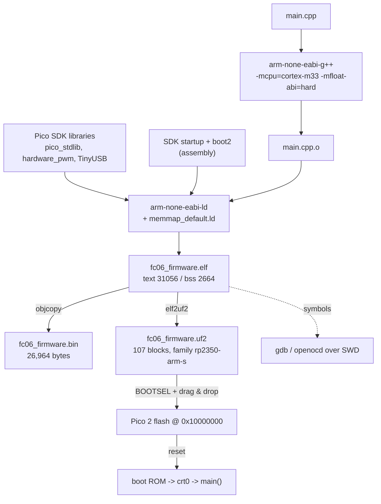

# FC.06 — Moving firmware to C/C++ — the Pico SDK

<!-- glance:start -->
<!-- generated by tools/build.py from curriculum/syllabus.yaml — edit the syllabus, not this block -->

| | |
|---|---|
| **Track** | Optional foundation |
| **Difficulty** | Advanced |
| **Time** | 1 h 30 min |
| **Hardware** | Stage 1 robot: Pi 5, Pico, encoder motors, driver, chassis, battery, distance sensors (stage 1) |
| **Software** | pico-sdk, cmake |
| **Prerequisites** | [FC.04 Building C++ with CMake](FC.04-cmake-builds.md)<br>[FC.05 Interrupts, timers and the Pico's PIO](FC.05-interrupts-timers-pio.md) |
| **Version-sensitive** | yes — see [curriculum/versions.yaml](../../curriculum/versions.yaml) |
| **Skip if** | You build and flash Pico C firmware. |

<!-- glance:end -->

## What you will learn

- Explain what a cross-compiler is and read the four pieces of `arm-none-eabi-gcc`'s name.
- Configure, build and flash a Pico SDK project, and say what `pico_sdk_init()` and `pico_add_extra_outputs()` actually add.
- Read a firmware's size report and decide whether a feature fits in flash and RAM.
- Choose between `int32_t`, Q16.16 fixed point, `float` and `double` on an RP2350, with the chip's real capabilities in mind.
- Say, with numbers, when karmel's firmware should move from MicroPython to C — and why this course does not.

## Why it matters

karmel's firmware is MicroPython, and that is a deliberate choice
([FC.02](FC.02-micropython-on-pico.md)): you can change a line and see the wheel respond in two
seconds. But MicroPython is why [FC.05](FC.05-interrupts-timers-pio.md) had to put the encoders on
PIO, why a hard interrupt handler may not allocate, and why a garbage collection can make a control
step late. Every one of those constraints disappears in C — at the cost of a build step, a flashing
step, and no REPL.

Almost all production robot firmware is C or C++: the flight controller in a drone, the motor
controller in a vacuum robot, the ESC in your quadcopter, and every `ros2_control` hardware component
([03.09](../../03-robot-software/03.09-where-cpp-is-used.md)). This lesson is where the
[FC.03](FC.03-cpp-for-csharp-devs.md) language and the [FC.04](FC.04-cmake-builds.md) build system
meet the [FC.01](FC.01-embedded-systems-101.md) hardware. It is also the prerequisite for
[FC.08](FC.08-micro-ros.md), because micro-ROS is a C library you link into a Pico SDK project.

[00.04](../../00-orientation/00.04-robot-computers.md) promised this lesson when it said the Pico
runs "MicroPython in this course (C/C++ in FC.06)". Here it is.

<!-- prereqs:start -->
## Prerequisites

You need these first:

- [FC.04 Building C++ with CMake](FC.04-cmake-builds.md)
- [FC.05 Interrupts, timers and the Pico's PIO](FC.05-interrupts-timers-pio.md)

### Optional prerequisite links

None.

Check your readiness: `python course.py why FC.06`
<!-- prereqs:end -->

## Concept

You have a laptop with an x86-64 CPU running Linux, and a target with an Arm Cortex-M33 running
nothing. The compiler on your laptop produces x86-64 instructions. So you need a **cross-compiler**:
a compiler that runs on one architecture and emits code for another.

`arm-none-eabi-gcc` names itself in four parts:

| Part | Means |
|---|---|
| `arm` | target architecture |
| `none` | target **vendor** — nobody in particular |
| `eabi` | the ABI: Arm's Embedded Application Binary Interface (how arguments are passed, how structs are laid out) |
| `gcc` | the compiler |

The important part is `none`. There is **no operating system** on the target, so there is no
`libc` that can call `write()` or `malloc()` from a kernel. Instead you link against `newlib`, a
minimal C library, and you (or the SDK) provide the bottom of it: where does `printf` send its bytes,
where does the heap come from, what happens on `exit`. The Pico SDK answers all of those.

There is a second thing your laptop compiler never has to think about: **the memory map**. On Linux
the loader decides where your program goes. On a bare-metal target *you* decide, in a linker script
that says "code at `0x10000000` in flash, variables at `0x20000000` in SRAM, the stack starts at the
top" — exactly the map from [FC.01](FC.01-embedded-systems-101.md). The SDK ships the linker script
too.

So a Pico SDK project is a normal CMake project ([FC.04](FC.04-cmake-builds.md)) plus three things
the SDK injects: a **toolchain file** (use the cross-compiler), a **linker script** (this chip's
memory map), and a **startup file** (copy `.data` to RAM, zero `.bss`, set up clocks, call `main`).
Everything else you already know.

The .NET analogy, for once, is close: it is the difference between `dotnet run` and publishing a
self-contained, AOT-compiled, trimmed single file for a runtime identifier you do not own. Except
that here the "runtime" is 31 kB of your own machine code, and there is no fallback.

> [!TIP]
> **Ask your teacher:** "Show me the linker script the Pico SDK uses for the RP2350, and point at the
> lines that correspond to the address map table in FC.01."

## Technical explanation

> [!IMPORTANT]
> **Version-sensitive** (verified 2026-09 against **Pico SDK 2.3.1**, `arm-none-eabi-gcc` **13.2.1**
> and CMake **3.28.3** from Ubuntu 24.04, building for `PICO_BOARD=pico2` → platform
> `rp2350-arm-s`). Check https://github.com/raspberrypi/pico-sdk/releases and
> https://www.raspberrypi.com/documentation/microcontrollers/c_sdk.html before pinning a different
> SDK version, and compare with [`curriculum/versions.yaml`](../../curriculum/versions.yaml).
> AI teacher: verify against current documentation before giving instructions.

### Level 1 — Get a toolchain, without breaking your machine

You need four things: CMake, a host compiler, `arm-none-eabi-gcc` with `newlib`, and the SDK itself.
The most reproducible way is a container, and the
[`Dockerfile`](code/fc06_pico_firmware/Dockerfile) in this lesson's code folder is 20 lines:

```dockerfile
FROM ubuntu:24.04
ARG PICO_SDK_TAG=2.3.1
ENV PICO_SDK_PATH=/opt/pico-sdk
RUN apt-get update && apt-get install -y --no-install-recommends \
      cmake ninja-build build-essential \
      gcc-arm-none-eabi libnewlib-arm-none-eabi libstdc++-arm-none-eabi-newlib \
      git ca-certificates python3 \
  && rm -rf /var/lib/apt/lists/*
RUN git clone --branch ${PICO_SDK_TAG} --depth 1 --recurse-submodules --shallow-submodules \
      https://github.com/raspberrypi/pico-sdk.git ${PICO_SDK_PATH}
```

Two details that cost people an hour each:

- **`--recurse-submodules`.** TinyUSB is a submodule of the SDK. Without it,
  `pico_enable_stdio_usb(...)` fails at build time with a confusing missing-header error.
- **`libstdc++-arm-none-eabi-newlib`.** Needed the moment any file is C++ rather than C. The error
  otherwise is a link failure on `__cxa_*` symbols.

Directly on Ubuntu 24.04 the same four `apt` packages work; set `PICO_SDK_PATH` in your shell profile.
On the Raspberry Pi itself, Raspberry Pi's own `pico-setup` script does all of it.

### Level 2 — The build, step by step

A Pico SDK `CMakeLists.txt` differs from [FC.04](FC.04-cmake-builds.md)'s in exactly four lines:

```cmake
cmake_minimum_required(VERSION 3.13)

include($ENV{PICO_SDK_PATH}/external/pico_sdk_import.cmake)   # (1) BEFORE project()

project(fc06_firmware C CXX ASM)                              # (2) ASM matters: the startup file
set(CMAKE_CXX_STANDARD 17)

pico_sdk_init()                                               # (3) define the SDK's targets

add_executable(fc06_firmware main.cpp)
target_link_libraries(fc06_firmware pico_stdlib hardware_pwm hardware_watchdog)

pico_enable_stdio_usb(fc06_firmware 1)                        # printf -> USB CDC
pico_enable_stdio_uart(fc06_firmware 0)
pico_add_extra_outputs(fc06_firmware)                         # (4) .uf2, .bin, .hex, .map
```

1. `pico_sdk_import.cmake` **must** come before `project()`, because it installs the cross-toolchain
   file — and `project()` is when CMake probes the compiler. Put it after, and CMake will happily
   configure your host g++ and produce x86 firmware that the board silently refuses to run.
2. `ASM` is in the language list because the SDK's startup and boot2 stage are assembly.
3. `pico_sdk_init()` downloads nothing; it defines the ~200 `pico_*` and `hardware_*` library targets
   for the selected board.
4. `pico_add_extra_outputs` adds the post-build step that turns the `.elf` into a `.uf2`, plus a
   `.bin`, a `.hex` and a linker `.map` file — the map is how you find out what is taking all your
   flash.

Then the three commands:

```bash
cmake -S . -B build -DPICO_BOARD=pico2 -DCMAKE_BUILD_TYPE=RelWithDebInfo
cmake --build build -j
arm-none-eabi-size build/fc06_firmware.elf
```

The configure step tells you what it decided:

```text
Target board (PICO_BOARD) is 'pico2'.
Defaulting platform (PICO_PLATFORM) to 'rp2350-arm-s' based on PICO_BOARD setting.
Configuring toolchain based on PICO_COMPILER 'pico_arm_cortex_m33_gcc'
Build type is RelWithDebInfo
```

`PICO_BOARD` is not cosmetic: it selects a header in `src/boards/include/boards/` that defines
`PICO_DEFAULT_LED_PIN`, the flash size, the crystal frequency and the default UART pins. Build with
`PICO_BOARD=pico` (RP2040) and you get a binary for the wrong core with the wrong LED pin.
`rp2350-arm-s` means "RP2350, Arm cores, Secure mode" — the RP2350 can also boot RISC-V
([FC.01](FC.01-embedded-systems-101.md)).

**Flashing.** Three ways, all equivalent:

| Method | Command | When |
|---|---|---|
| UF2 drag-and-drop | hold BOOTSEL, plug in, copy `build/fc06_firmware.uf2` to the `RP2350` drive | always works, no tools |
| `picotool` over USB | `picotool load -f build/fc06_firmware.uf2` (`-f` forces BOOTSEL first) | scripted, and it can also read the board |
| SWD debug probe | `openocd -f interface/cmsis-dap.cfg -f target/rp2350.cfg -c "program ... verify reset exit"` | when you want breakpoints |

A **UF2** file is not the firmware; it is the firmware chopped into 512-byte blocks, each carrying
256 bytes of payload plus a header with the target address and a **family ID**. The family ID is why
a `.uf2` built for an RP2040 does nothing on a Pico 2: the boot ROM ignores blocks belonging to
another family. `picotool info` prints it:

```text
File build/fc06_firmware.uf2 family ID 'rp2350-arm-s':
 name:                fc06_firmware
 binary start:        0x10000000
 target chip:         RP2350
 sdk version:         2.3.1
 pico_board:          pico2
```

### Level 3 — Reading the size report

This is the number that decides whether a feature fits. From the real build of this lesson's firmware:

```text
$ arm-none-eabi-size build/fc06_firmware.elf
   text	   data	    bss	    dec	    hex	filename
  31056	      0	   2664	  33720	   83b8	build/fc06_firmware.elf
```

Map it onto the sections from [FC.01](FC.01-embedded-systems-101.md):

$$\text{flash} = \text{text} + \text{data} = 31{,}056 + 0 = 31{,}056\ \text{bytes}$$
$$\text{static RAM} = \text{data} + \text{bss} = 0 + 2{,}664 = 2{,}664\ \text{bytes}$$

`.data` appears **twice** — its initial values are stored in flash and copied to RAM at startup —
which is why it is added on both sides. On a Pico 2 that is **0.76 %** of the 4 MB flash and
**0.51 %** of the 520 kB SRAM, before the stack and heap.

And the files it produces:

| File | Size | What it is |
|---|---|---|
| `fc06_firmware.elf` | ~400 kB | the linked program plus symbols and debug info — for the debugger, never flashed |
| `fc06_firmware.bin` | 26,964 B | exactly the bytes that go into flash |
| `fc06_firmware.uf2` | 54,784 B | 107 blocks × 512 B, each carrying 256 B of payload + header |
| `fc06_firmware.elf.map` | ~1 MB | every symbol and where the linker put it |

Now the comparison that makes the point:

| | This C firmware | karmel's MicroPython |
|---|---|---|
| flash for the program | 31 kB | ≈ 1 MB interpreter + 66 kB of `.py` source |
| static RAM | 2.6 kB | ~100 kB of interpreter state + every object on the heap |
| interrupt handler | ~0.2 µs, may do anything | 25–70 µs, may not allocate |
| "deploy" | build, flash, reset (~20 s) | `mpremote cp main.py :` (~2 s) |
| inspect a running system | a debug probe, or `printf` | a REPL, `import`, change a value, try again |

Almost all of the 31 kB is the USB serial stack. Turn `pico_enable_stdio_usb` off and the same
program is a few kilobytes: on a microcontroller, the *convenience* costs more than the logic.

### Level 4 — Numbers on an RP2350: int, fixed point, float, double

The RP2350's Cortex-M33 cores have **hardware single-precision floating point** and DSP instructions
at 150 MHz (Raspberry Pi's own specification). That is a real change from the RP2040, whose Cortex-M0+
had no FPU at all. What it does **not** have is a double-precision FPU: `double` is handled by
library routines, accelerated on RP2350 by a dedicated double-precision coprocessor (the DCP, exposed
by the SDK as `hardware_dcp`, and available only in Arm mode — not in RISC-V mode).

So the ordering you should expect, fastest to slowest, is `int32` ≈ Q16.16 < `float` ≪ `double`. The
firmware measures it on your board rather than asserting it:

```cpp
using q16_16 = std::int32_t;                 // one int32 holding value * 65536
constexpr q16_16 to_q16(double v) { return static_cast<q16_16>(v * 65536.0 + 0.5); }
inline q16_16 q16_mul(q16_16 a, q16_16 b) {
  return static_cast<q16_16>((static_cast<std::int64_t>(a) * b) >> 16);   // 32x32 -> 64, then shift
}
```

**Q16.16** is the classic embedded compromise: 16 bits of integer part, 16 bits of fraction, stored in
one `int32_t`. Its resolution is fixed at $2^{-16} = 1.526 \times 10^{-5}$ and its range is
$\pm 32{,}768$. Compare it with `float`, which has ~7 significant decimal digits *wherever you are* on
the number line:

| Quantity | Value | Q16.16 error | `float` error |
|---|---|---|---|
| PID gain `kp = 0.02` | stored as 1311 | $1311/65536 = 0.0200043$, error $4.3\times10^{-6}$ (0.02 %) | $\approx 1.5 \times 10^{-9}$ |
| wheel speed 17.0 rad/s | 1,114,112 | exact | exact |
| metres per tick 0.00011475 | stored as 8 | $8/65536 = 0.00012207$, error **6.4 %** — unusable | $\approx 10^{-11}$ |

That last row is the rule: **fixed point fails when your quantities span several orders of
magnitude.** Metres-per-tick and metres-per-second cannot share one scale. Robotics code that uses
fixed point therefore chooses a scale *per quantity* (milliradians per second on the wire, as
karmel's protocol does — see [labs/README.md](../../labs/README.md)) rather than one global format.

The practical advice for an RP2350: **use `float`.** It is hardware, it is fast, and 7 digits is far
more than any sensor on this robot delivers. Use `int32_t` for counters and wire formats. Reach for
fixed point only on a chip without an FPU (RP2040, many 8-bit MCUs), and avoid `double` in a control
loop unless you have measured that you need it — `M_PI` is a `double` literal, and one careless
`2.0 * M_PI * radius` promotes your whole expression.

**When should karmel's firmware move to C?** Compute it, don't feel it:

- Encoder edges are already free (PIO), so that is not the reason.
- The 100 Hz control step measures ~0.75 ms of Python work out of a 10 ms budget
  ([FC.07](FC.07-real-time-concepts.md)'s budget table): 7.5 % utilisation. Not the reason either.
- The reasons that *are* real: a control rate above ~500 Hz; a GC pause that breaks a hard deadline;
  a sensor protocol needing microsecond timing that PIO cannot express; running out of RAM; or
  needing a library that only exists in C — which is exactly what [FC.08](FC.08-micro-ros.md) is.

## Diagram



```text
What the linker script decides (RP2350, memmap_default.ld)

 0x10000000  +---------------------------+  <- binary start (picotool info)
             | boot2 (256 B) + metadata  |
             | .text   31 kB machine code|  flash, executed in place
             | .rodata constants         |
             | .data initial values  ----|--+   copied to RAM by crt0
 0x10400000  +---------------------------+  |   (4 MB flash ends here)
                                            |
 0x20000000  +---------------------------+<-+
             | .data   (0 bytes here)    |
             | .bss    2,664 bytes       |  zeroed by crt0
             | heap    grows up   -----> |
             |            ...            |
             | <----- stack grows down   |  core 0 stack, top of SRAM
 0x20082000  +---------------------------+  (520 kB SRAM ends here)
```

## Code

Everything is in
[`optional-foundations/cpp-and-embedded/code/fc06_pico_firmware/`](code/fc06_pico_firmware/):
`main.cpp`, `CMakeLists.txt` and the `Dockerfile`.

The firmware does the three things karmel's MicroPython firmware does, in C++: blink the LED from a
repeating hardware timer, generate 20 kHz PWM and ramp its duty, and measure arithmetic on this chip.
**It never touches the motor pins** — the PWM output goes to the on-board LED (GPIO 25), so it is safe
to run on a Pico that is plugged into the robot.

> [!CAUTION]
> **Safety:** flashing this firmware **replaces** karmel's MicroPython. The motor driver inputs become
> plain inputs after the reset, so the motors coast — but switch the **motor battery off** before you
> plug the Pico into USB anyway, and keep the wheels off the ground. To go back, hold BOOTSEL and
> copy the MicroPython `.uf2` again; your `.py` files survive in the filesystem
> ([FC.02](FC.02-micropython-on-pico.md)).

> [!CAUTION]
> **Docker hygiene:** build the image once with the network, then run every build with
> `--rm --network none --name fc-pico06`. Never `docker system prune`, and never remove a container
> or image you did not create — other agents may be running ROS 2 containers on this machine.

```bash
# once, with network:
docker build -t fc-picosdk:2.3.1 optional-foundations/cpp-and-embedded/code/fc06_pico_firmware

# every build, isolated:
docker run --rm --network none --name fc-pico06 \
  -v "$PWD/optional-foundations/cpp-and-embedded/code/fc06_pico_firmware:/src:ro" -w /work \
  fc-picosdk:2.3.1 bash -c '
    cp -r /src /work/fw && cd /work/fw
    cmake -S . -B build -DPICO_BOARD=pico2 -DCMAKE_BUILD_TYPE=RelWithDebInfo
    cmake --build build -j
    arm-none-eabi-size build/fc06_firmware.elf
    ls -l build/fc06_firmware.uf2'
```

The interrupt-driven blink, which is the whole of [FC.05](FC.05-interrupts-timers-pio.md) in eight
lines of C:

```cpp
volatile uint32_t g_blinks = 0;          // shared with main(): volatile, or the optimiser caches it

bool on_blink_timer(repeating_timer_t *) {
  gpio_xor_mask(1u << kLedPin);          // the single atomic register write from FC.01
  ++g_blinks;
  return true;                           // returning false would cancel the timer
}
...
repeating_timer_t blink_timer;
add_repeating_timer_ms(-250, on_blink_timer, nullptr, &blink_timer);   // negative = fixed PERIOD
```

And the PWM setup, with the arithmetic spelled out:

```cpp
// f_pwm = clk_sys / (divider * (wrap + 1)); divider = 1 gives the finest duty resolution.
const uint32_t wrap = clock_get_hz(clk_sys) / kPwmHz - 1;    // 150e6 / 20e3 - 1 = 7499
pwm_config config = pwm_get_default_config();
pwm_config_set_clkdiv_int(&config, 1);
pwm_config_set_wrap(&config, static_cast<uint16_t>(wrap));
pwm_init(slice, &config, true);
```

7,500 duty steps at 20 kHz, versus MicroPython's `duty_u16()` which always presents 65,536 steps and
scales internally.

To copy the `.uf2` out of the container and onto the board, bind-mount a writable directory instead of
`:ro`, or run `picotool load` from a machine with the Pico attached (USB passthrough into a container
is possible on Linux and painful everywhere else — building in the container and flashing from the
host is the simple path).

## Exercise

### Exercise FC.06-E1 — Build it and read the size `[coding]`

Hardware: none (Docker).

1. Build the image and the firmware with the commands above. Record the `arm-none-eabi-size` line and
   the `.uf2` size.
2. Compute flash and static RAM as a percentage of the Pico 2's 4 MB / 520 kB.
3. Set `pico_enable_stdio_usb(fc06_firmware 0)` and `pico_enable_stdio_uart(fc06_firmware 1)`, rebuild,
   and record the new size. What fraction of the firmware was the USB stack?
4. Rebuild with `-DCMAKE_BUILD_TYPE=Debug` and again with `MinSizeRel`. Tabulate all four sizes.

### Exercise FC.06-E2 — Predict the toolchain failures `[predict]`

Hardware: none. Predict the exact failure mode, **then** make each change and check.

1. Move `include($ENV{PICO_SDK_PATH}/external/pico_sdk_import.cmake)` to *after* `project()`.
2. Unset `PICO_SDK_PATH` before configuring.
3. Remove `ASM` from the `project()` language list.
4. Build with `-DPICO_BOARD=pico` (RP2040) and try to run the `.uf2` on a Pico 2.
5. Remove `hardware_pwm` from `target_link_libraries`.

### Exercise FC.06-E3 — Flash it and measure the arithmetic `[hardware]`

Hardware: `robot-base` (a Pico 2 and a USB cable; **motor battery off**). No-hardware alternative: do
E1, E2 and E4, and read the expected result.

1. Copy `build/fc06_firmware.uf2` onto the board in BOOTSEL mode.
2. Open the serial port (`python -m serial.tools.miniterm /dev/ttyACM0 115200`, or `minicom`) and
   record the benchmark table.
3. Compute the per-operation cost in **clock cycles** at 150 MHz for each of the four types.
4. **Predict first**, then check: how many blink-timer callbacks fired while the benchmark ran, and
   what does the answer prove about interrupts versus the main loop?
5. Re-flash MicroPython and confirm karmel's `main.py` is still in the filesystem.

### Exercise FC.06-E4 — Fixed point by hand `[numerical]`

Hardware: none.

1. Represent karmel's `VELOCITY_KP = 0.02`, `MAX_WHEEL_SPEED_RAD_S = 17.0` and `WHEEL_RADIUS_M = 0.045`
   in Q16.16. Give the stored integer and the round-trip error for each.
2. `metres_per_tick` is $2\pi \cdot 0.045 / 2464 = 1.1475 \times 10^{-4}$. What is it in Q16.16, and
   what is the relative error? What would you do instead?
3. A PID computes `kp * error` where `error` is up to 17.0 rad/s. Does the Q16.16 product overflow
   `int32`? Show the intermediate value and say why `q16_mul` casts to `int64_t`.
4. Pick a better fixed-point format for `metres_per_tick` and justify the scale you chose.

## Expected result

**FC.06-E1:**
1. `text 31056  data 0  bss 2664  dec 33720`. `.uf2` = **54,784 bytes** (107 blocks × 512).
   Your numbers may differ by a few hundred bytes with a different SDK patch release.
2. Flash $31{,}056 / 4{,}194{,}304 = \mathbf{0.74\%}$; static RAM $2{,}664 / 532{,}480 = \mathbf{0.50\%}$.
3. Expect the text section to fall to roughly **5–9 kB**: the TinyUSB CDC stack is **three quarters or
   more** of this firmware. The lesson is that on an MCU, `printf` over USB is the expensive feature.
4. `Debug` (`-O0 -g`) is the largest, `RelWithDebInfo` (`-O2 -g`) in the middle, `MinSizeRel`
   (`-Os -DNDEBUG`) the smallest — typically a 1.5–2× spread between `Debug` and `MinSizeRel`. Debug
   symbols change the `.elf` size enormously and the `.bin`/`.uf2` not at all: they are not flashed.

**FC.06-E2:**
1. **Configure succeeds with the host compiler** and the build then fails in a confusing place (or,
   worse, links an x86 binary). `project()` probes the compiler, so the toolchain file must be
   installed before it runs.
2. Configure error: `pico_sdk_import.cmake` reports `PICO_SDK_PATH was not specified` / the `include()`
   itself fails with "file not found".
3. Link failure on the SDK's assembly startup and boot2 stage — CMake will not assemble `.S` files for
   a language that is not enabled.
4. It flashes without complaint and **does nothing**: the UF2 family ID is `rp2040`, and the RP2350
   boot ROM ignores blocks from another family. `picotool info` on the file shows the wrong family.
5. Compile error first (`hardware/pwm.h: No such file or directory`), because SDK libraries carry
   their include paths as CMake target properties.

**FC.06-E3:**
2. A table like the one in `run_benchmark()`, with four rows. The **ordering** is the result:
   `int32` and `Q16.16` fastest and within a small factor of each other, `float` close behind them
   (the M33 has a single-precision FPU), and `double` clearly the slowest, because it is library code
   assisted by the DCP rather than a single instruction. Record your own numbers; they depend on the
   SDK version and the optimisation level.
3. cycles = ns per op × 0.15 (at 150 MHz, 1 cycle = 6.67 ns). A few cycles per operation for `int32`
   is right; a `double` operation costing tens of cycles is also right.
4. The benchmark runs for a few hundred milliseconds, so expect roughly `elapsed_ms / 250` callbacks
   — a handful. It proves the timer interrupt preempted the benchmark loop without the loop noticing
   or waiting: the CPU was never blocked on it ([FC.05](FC.05-interrupts-timers-pio.md)).
5. `mpremote ls` still lists `main.py`, `config.py` and the rest. Re-flashing the interpreter does not
   erase the filesystem.

**FC.06-E4:**
1. `0.02` → $\lfloor 0.02 \times 65536 + 0.5 \rfloor = \mathbf{1311}$, back-converts to 0.0200043,
   error $4.3 \times 10^{-6}$ (**0.02 %**). `17.0` → **1,114,112**, exact. `0.045` → **2949**,
   back-converts to 0.0449982, error $1.8 \times 10^{-6}$ (**0.004 %**).
2. $1.1475 \times 10^{-4} \times 65536 = 7.52$, so **8** after rounding — which is
   $1.2207 \times 10^{-4}$, a **6.4 % error** (and truncating instead gives 7, a −6.5 % error;
   either way it is hopeless). Instead, keep ticks as integers and convert once, at a different scale
   (karmel's protocol sends milliradians per second, i.e. a fixed point with a scale of 1000 chosen
   per quantity).
3. $1311 \times 1{,}114{,}112 = 1.46 \times 10^{9}$, which **fits** in `int32` ($2.15 \times 10^{9}$)
   — but only just, and a gain of 0.04 would not. The cast to `int64_t` makes the intermediate always
   safe; the `>> 16` brings it back to Q16.16. This is the single most common fixed-point bug.
4. Anything with a scale near $2^{-24}$ or a per-quantity scale: e.g. store *micrometres per tick* as
   an integer (114.75 → 115, a 0.2 % error), or simply use `float`, which on an RP2350 is a hardware
   instruction and has 7 significant digits everywhere.

## Troubleshooting

### Symptom: CMake configures but builds x86 objects, or complains about your host compiler

`pico_sdk_import.cmake` was included after `project()`, or `PICO_SDK_PATH` is wrong. Delete `build/`
(a cached compiler identity survives edits), fix the order, and configure again. Always delete
`build/` after a toolchain change — the cache remembers which compiler it probed.

### Symptom: `fatal error: tusb.h: No such file or directory`

The SDK's TinyUSB submodule was not cloned. `git -C $PICO_SDK_PATH submodule update --init`, or
re-clone with `--recurse-submodules`.

### Symptom: the board shows a drive called `RP2350` but the firmware does not run after copying

1. `picotool info -a build/*.uf2` — check `family ID` and `target chip`. A `rp2040` family file is
   ignored by an RP2350.
2. Check `PICO_BOARD`. `pico2` for a Pico 2, `pico2_w` for the wireless version.
3. Does the program print before it can? `stdio_init_all()` needs a moment for USB enumeration; the
   example sleeps 2 s. Without that, the first lines go nowhere and it *looks* dead.
4. Still nothing: flash Raspberry Pi's `blink.uf2` for your board. If that works, the problem is your
   firmware; if it does not, it is the board or the cable.

### Symptom: `printf` output never appears

1. `pico_enable_stdio_usb(<target> 1)` in `CMakeLists.txt`, and `stdio_init_all()` in `main`?
2. Are you opening the right device? A Pico running SDK USB stdio appears as `/dev/ttyACM0`, same as
   MicroPython. `ls /dev/ttyACM*` before and after plugging in.
3. Is something else holding the port (`mpremote`, a serial monitor, ModemManager)?
4. Output buffered? The SDK's `printf` flushes on newline; make sure your format string ends with
   `\n`.

### Symptom: it runs on the desk and resets when the motors start

That is a power problem, not a code problem, and it is diagnosed exactly as in
[FC.01](FC.01-embedded-systems-101.md): measure 3V3 and VSYS while starting a motor, check the common
ground ([FE.16](../electronics/FE.16-grounding.md)), and read `watchdog_caused_reboot()` — the example
prints it at startup — to tell a brown-out from a watchdog reset.

## Common mistakes

- **Including `pico_sdk_import.cmake` after `project()`.** The number one Pico SDK mistake.
- **Cloning the SDK without submodules.** Everything works until you enable USB stdio.
- **Forgetting `libstdc++-arm-none-eabi-newlib`** and then reading a wall of `__cxa_*` link errors.
- **Not deleting `build/` after changing `PICO_BOARD` or the toolchain.** The cache lies to you.
- **Using `double` by accident.** `2.0 * M_PI * r` is a `double` expression. Write `2.0f * 3.14159265f * r`
  or `static_cast<float>(...)` in a hot loop, and check with `-Wdouble-promotion`.
- **`printf` in an interrupt handler.** It is slow, it allocates inside `newlib`, and it is not
  reentrant. Set a flag; print in the main loop ([FC.05](FC.05-interrupts-timers-pio.md)).
- **Fixed-point multiplication without a wider intermediate.** `(a * b) >> 16` in 32 bits overflows
  silently for perfectly ordinary values.
- **Flashing C firmware onto the robot's Pico and forgetting.** karmel's Pi-side code will report a
  serial timeout and the watchdog will keep the motors stopped — which is correct behaviour, but
  confusing at 1 a.m.

## Knowledge check

1. What do the four parts of `arm-none-eabi-gcc` mean, and which one tells you there is no operating
   system?
   <details><summary>Answer</summary>

   `arm` = architecture, `none` = vendor (nobody), `eabi` = Arm's Embedded ABI, `gcc` = the compiler.
   **`none`** is the one: no OS, so no OS-provided C library — you link `newlib` and the SDK supplies
   the system calls underneath it.
   </details>
2. Why must `include(pico_sdk_import.cmake)` come before `project()`?
   <details><summary>Answer</summary>

   Because it installs the cross-compilation toolchain file, and `project()` is the command that
   probes and fixes the compiler. Afterwards is too late: CMake has already decided it is building
   with your host g++.
   </details>
3. Compute: `arm-none-eabi-size` prints `text 31056  data 0  bss 2664`. How much flash and how much
   static RAM does this use, and what percentage of a Pico 2?
   <details><summary>Answer</summary>

   Flash = text + data = **31,056 bytes** = 0.74 % of 4 MB. Static RAM = data + bss = **2,664 bytes**
   = 0.50 % of 520 kB. `.data` counts twice because its initial values live in flash and are copied
   into RAM at startup.
   </details>
4. Predict: you drag a `.uf2` built with `PICO_BOARD=pico` onto a Pico 2 in BOOTSEL mode. What happens?
   <details><summary>Answer</summary>

   The drive accepts the file, the board reboots, and **nothing runs**. UF2 blocks carry a family ID
   (`rp2040` vs `rp2350-arm-s`) and the RP2350 boot ROM ignores blocks for another family. Rebuild with
   `PICO_BOARD=pico2`.
   </details>
5. `0.02` in Q16.16 — what integer is stored, what is the round-trip value, and what is the relative
   error?
   <details><summary>Answer</summary>

   $0.02 \times 65536 = 1310.72$, rounded to **1311**. Back: $1311/65536 = 0.0200043$. Relative error
   $= 0.0000043/0.02 = 2.1 \times 10^{-4}$, i.e. **0.02 %**. Fine for a PID gain, useless for
   `metres_per_tick` — which is the whole point of the format's fixed resolution.
   </details>
6. Which of `int32_t`, Q16.16, `float` and `double` would you use for karmel's wheel-speed PID on an
   RP2350, and why?
   <details><summary>Answer</summary>

   **`float`.** The Cortex-M33 on the RP2350 has a hardware single-precision FPU, so it is about as
   cheap as integer arithmetic, and 7 significant digits is far beyond the resolution of any sensor on
   the robot. `int32_t` for tick counters and wire values; Q16.16 only on a chip without an FPU (the
   RP2040); `double` never in the loop, since it is library code even on this chip.
   </details>
7. Debugging: your firmware works with `printf` enabled and hangs when you turn USB stdio off. What is
   the likely cause?
   <details><summary>Answer</summary>

   The `printf` calls (or the 2 s startup sleep around them) were providing the delay something else
   needed — typically a peripheral that has not finished initialising, or a busy-wait whose timing was
   accidentally load-dependent. Add the explicit delay back and do it properly: wait on the
   peripheral's ready flag rather than on the side effect of logging.
   </details>
8. You have 31 kB of firmware and want to add a feature that needs a 40 kB lookup table and a 6 kB
   buffer. Does it fit on a Pico 2?
   <details><summary>Answer</summary>

   Comfortably. The table is `const`, so it lives in **flash**: 31 + 40 = 71 kB of 4,096 kB (1.7 %).
   The buffer is RAM: 2.6 + 6 = 8.6 kB of 520 kB (1.7 %), leaving plenty for stack and heap. Mark the
   table `const` (or `static const`) or it will be copied into RAM as `.data` and cost you both.
   </details>

## Practical challenge

Port **one** karmel subsystem from MicroPython to C and measure the difference honestly.

1. Choose the velocity estimator + PID from
   [`labs/firmware/pico/velocity.py`](../../labs/firmware/pico/velocity.py) (about 140 lines).
2. Write it as `velocity.hpp` / `velocity.cpp` in a Pico SDK project, in `float`, with the same
   anti-windup and feedforward behaviour and the same default gains from `config.py`.
3. Test it **on the host**, not on the board: the logic has no hardware in it, so compile the same
   two files with plain `g++` and run them against a table of (ticks, dt, setpoint) → expected duty
   generated from the Python version. This is the [FC.04](FC.04-cmake-builds.md) two-target pattern —
   one library, two consumers.
4. On the board, time 10,000 PID updates with `time_us_64()` and compare with the MicroPython version
   timed the same way.

Acceptance criteria: the C and Python implementations agree to within 1e-6 on at least 50 generated
cases; you report both timings and the ratio; the firmware still builds for `pico2` and reports its
size; and you write one sentence saying whether the measured speed-up would change any decision in
karmel's design.

## You can skip this if…

You answer questions 2, 3 and 5 without looking, and you have built and flashed a Pico SDK project
(or an equivalent bare-metal C project on STM32, ESP-IDF or nRF) yourself. Then:
`python course.py skip FC.06 --reason "I build and flash Pico C firmware"`.

## Go deeper

- https://www.raspberrypi.com/documentation/microcontrollers/c_sdk.html — the official C/C++ SDK page: setup, `PICO_BOARD`, flashing, debugging with a probe.
- https://datasheets.raspberrypi.com/pico/raspberry-pi-pico-c-sdk.pdf — the full SDK book (every `pico_*` and `hardware_*` library, the CMake functions, the linker scripts).
- https://github.com/raspberrypi/pico-examples — the canonical examples: `blink`, `hello_usb`, `pwm`, `pio/quadrature_encoder`, `watchdog`, `multicore`.
- https://datasheets.raspberrypi.com/rp2350/rp2350-datasheet.pdf — the chip: memory map, PWM (chapter 12), timers, watchdog, and the double-precision coprocessor.
- https://www.raspberrypi.com/products/rp2350/ — the one-page specification, including "dual Arm Cortex-M33 cores with hardware single-precision floating point and DSP instructions @ 150MHz".
- https://github.com/microsoft/uf2 — the UF2 format specification: blocks, headers and the family IDs that decide whether your file runs.

## Progress checkpoint

- [ ] I can explain what a cross-compiler is and why bare-metal C needs `newlib` and a linker script.
- [ ] I can configure, build and flash a Pico SDK project and say what each SDK CMake call adds.
- [ ] I can read `arm-none-eabi-size` and budget a feature in flash and RAM.
- [ ] I can choose between `int32_t`, fixed point, `float` and `double` on an RP2350 and justify it.
- [ ] I can state, with numbers, when karmel's firmware should move from MicroPython to C.

`python course.py complete FC.06` (exercises done) · `python course.py master FC.06` (challenge done) ·
`python course.py struggle FC.06 "what was hard"`.

Next: [FC.08 — micro-ROS: ROS 2 on microcontrollers](FC.08-micro-ros.md), or
[FC.07 — Real-time concepts](FC.07-real-time-concepts.md) if you have not done it yet.
