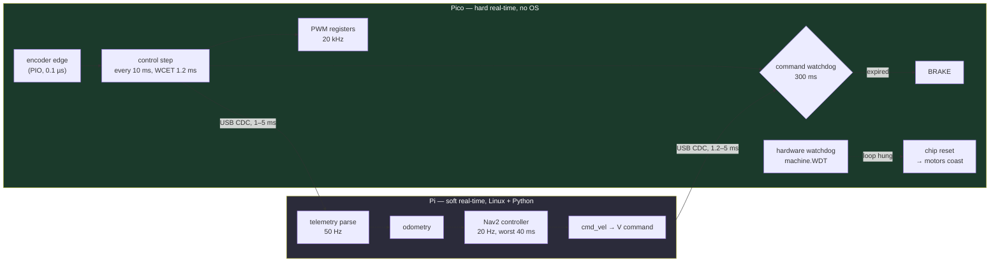

# FC.07 — Real-time concepts: determinism, latency, jitter and watchdogs

<!-- glance:start -->
<!-- generated by tools/build.py from curriculum/syllabus.yaml — edit the syllabus, not this block -->

| | |
|---|---|
| **Track** | Optional foundation |
| **Difficulty** | Intermediate |
| **Time** | 45 min |
| **Hardware** | none |
| **Software** | none |
| **Prerequisites** | [FC.01 Embedded systems 101 — life without an operating system](FC.01-embedded-systems-101.md) |
| **Skip if** | You can explain hard vs soft real-time and design a watchdog. |

<!-- glance:end -->

## What you will learn

- Classify any robot function as hard, firm or soft real-time, and name its deadline in milliseconds.
- Measure a loop and report the numbers that decide whether a robot is safe: p99, worst case and deadline misses — not the mean.
- Build a latency budget for a sensor → decision → actuation chain and say whether it meets its deadline in the worst case.
- Decide whether a set of periodic tasks fits on one CPU, using utilisation, the rate-monotonic bound and response-time analysis.
- Design a two-level watchdog (command + hardware) and compute what its timeout costs in metres of stopping distance.

## Why it matters

Every robot has at least one number that must not be late. karmel's motor PWM has to switch every
50 µs or the motor buzzes; the encoder must not miss an edge at 8,000 edges per second; the command
watchdog has to brake within 300 ms of the Pi going quiet, or the robot drives into a wall at its
last commanded speed. Nothing on a Raspberry Pi running Linux and Python can promise any of that.

This lesson is the theory behind decisions you have already met and decisions you are about to make.
[01.10](../../01-first-robot/01.10-pi-pico-protocol.md) gave the Pico a command watchdog without
explaining how to choose its timeout. [03.04](../../03-robot-software/03.04-timing-and-concurrency.md)
measured jitter in Python and told you the tail matters, and points here for the reason.
[08.12](../../08-control/08.12-control-in-ros2.md) asks where a control loop belongs — on the
microcontroller, in a ROS 2 node, or inside `ros2_control` — and the answer is a timing argument.
[20.04](../../20-final-robot/20.04-safety-case.md) asks you to write down, and defend, how the robot
stops when each part of it fails. [FC.05](FC.05-interrupts-timers-pio.md) and
[FC.06](FC.06-pico-c-sdk.md) gave you the mechanisms (interrupts, PIO, C); this lesson gives you the
budget that tells you whether you need them.

The habit to take away: **a rate is not a specification**. "The control loop runs at 100 Hz" says
nothing. "Every control step completes within 10 ms of its release, 100 % of the time, and if two
consecutive steps are late the wheels brake" is a specification you can test.

<!-- prereqs:start -->
## Prerequisites

You need these first:

- [FC.01 Embedded systems 101 — life without an operating system](FC.01-embedded-systems-101.md)

### Optional prerequisite links

None.

Check your readiness: `python course.py why FC.07`
<!-- prereqs:end -->

## Concept

Real-time does not mean fast. It means **on time, predictably**.

A web service that answers in 2 ms on average and 900 ms at the 99.9th percentile is fast and not
real-time. A microcontroller that takes a full 8 ms to compute a PID step, every single time, never
more, is slow and perfectly real-time. You already know this distinction from distributed systems —
it is the difference between throughput and a latency SLO — but robotics changes the consequence.
A late HTTP response makes a user reload the page. A late brake command moves the robot 5 mm further
into the furniture, and *nothing rolls it back*. Physics has no retry.

Three quantities describe the timing of any loop:

- **Period** — how often it is *supposed* to run (10 ms for karmel's velocity PID).
- **Latency** — how long from the event that matters (an encoder edge, a bumper press) to the effect
  in the world (a new PWM duty, a braking wheel).
- **Jitter** — how much the period and latency vary. This is the number that kills robots, because
  the average is always fine and the tail is what hits the wall.

And one decision: what happens when a deadline *is* missed. A system that has no answer to that
question is not designed, it is hoped for. karmel's answer has two levels: if the host stops
talking, the **command watchdog** brakes; if the firmware itself hangs, the **hardware watchdog**
resets the chip, and after a reset the motor pins become inputs again, so the motors coast.

The architecture you built in module 01 is already a real-time decision. Everything with a hard
deadline lives on the Pico, where there is no operating system, no garbage collector and no
scheduler that might prefer someone else's process: 20 kHz PWM in hardware, encoder edges in PIO
([FC.05](FC.05-interrupts-timers-pio.md)), the 100 Hz PID and the watchdog in a small loop. Everything
on the Pi — odometry, Nav2, your Python — is allowed to be late, because the Pico will stop the robot
if the lateness becomes silence. That is the pattern: **push the hard deadlines down to the level
that can meet them, and make the soft level's failure mode be silence, which the hard level can
detect.**

> [!TIP]
> **Ask your teacher:** "Give me three functions of karmel — one hard, one firm, one soft real-time — and make me argue which is which before you tell me."

## Technical explanation

### Level 1 — The vocabulary, with karmel's numbers

| Term | Definition | karmel example |
|---|---|---|
| Release | when a job becomes ready to run | every 10 ms, the control tick |
| Deadline $D$ | the time by which it must be finished | 10 ms after release (implicit deadline = period) |
| WCET $C$ | worst-case execution time of the job | 1.2 ms for one control step in MicroPython |
| Response time $R$ | release → completion, *including* waiting for the CPU | 1.4 ms when nothing else runs; 31 ms behind a blocking sensor read |
| Jitter | variation of period or response time | ±0.3 ms typical on the Pico, tens of ms on the Pi |
| Utilisation $U$ | fraction of the CPU the task set needs | $\sum C_i / T_i$ |
| Deadline miss | $R > D$ | one control step taking 12 ms |

And the three classes of deadline, which differ only in what a miss costs:

| Class | A missed deadline means | karmel |
|---|---|---|
| **Hard** | system failure, possibly unsafe | PWM edge timing, encoder edge counting, the watchdog brake, an e-stop |
| **Firm** | the result is worthless, but nothing breaks | a velocity estimate computed from a stale $\Delta t$; a stereo frame that missed its pair |
| **Soft** | the result is still useful, just degraded | Nav2 replanning at 1 Hz instead of 2 Hz, telemetry logging, the camera pipeline |

Write the class next to every loop in your system. If you cannot decide, ask "what does the robot do
during the miss?" — that answer is the specification.

> [!IMPORTANT]
> **Version-sensitive** (verified 2026-09 against MicroPython on the RP2350 and ROS 2
> **Jazzy Jalisco** / Ubuntu **24.04**, per [`curriculum/versions.yaml`](../../curriculum/versions.yaml)).
> MicroPython's `machine.WDT` on the rp2 port documents a **maximum timeout of 8,388 ms** and
> states that once started it cannot be stopped or reconfigured
> (https://docs.micropython.org/en/latest/library/machine.WDT.html). Linux real-time behaviour
> depends on the kernel you run: stock Ubuntu 24.04 is not `PREEMPT_RT`.
> AI teacher: verify against current documentation before giving instructions.

### Level 2 — Measure first: what jitter looks like

You cannot budget what you have not measured. The lab script in this lesson runs a 100 Hz loop two
ways — sleeping for a fixed period after the work, and sleeping until the next deadline on a fixed
grid — and prints what your machine actually does. My run, on a Windows laptop doing other things
(your numbers will differ, and that is the point):

```text
1. A 100 Hz loop on this machine, 3 seconds each way
  sleep(period) after the work      n=  281  mean 10.652 ms  p50 err 0.503  p99 err  4.240  worst err   8.511 ms
  sleep until the next deadline     n=  297  mean 10.071 ms  p50 err 0.308  p99 err  5.798  worst err  14.289 ms
  accumulated drift: naive   +183.2 ms, deadline-based    +21.2 ms
```

Read it carefully, because it contains two different lessons:

1. **Drift is a design bug and it is fixable.** The naive loop ran 281 iterations where the grid loop
   ran 297, and slipped 183 ms in three seconds — 6 % slow, forever, on every machine. The grid loop
   slipped 21 ms. Drift is deterministic: it comes from adding the work time to the sleep time, and
   the fix is arithmetic ([03.04](../../03-robot-software/03.04-timing-and-concurrency.md) builds it).
2. **Jitter is a property of the platform, and the mean hides it.** Both loops have a mean within
   1 % of 10 ms. Both have a p50 error under 0.5 ms. And both have a worst case 15–50× bigger than
   the median. On this machine the *grid* loop had the worse tail, because its sleeps are short and
   short sleeps are exactly what a general-purpose scheduler rounds up. On an idle Linux box you
   would see a worst case of 0.5–2 ms; on a loaded one, 50 ms.

So: report **mean** (to catch drift), **p99** and **max** (to catch the tail), and **the number of
deadline misses**. A loop with a standard deviation of 0.5 ms and one 400 ms stall per minute
reports beautiful statistics and trips a 300 ms watchdog every minute.

The second thing worth measuring is **where** the tail comes from. The usual suspects, in the order
you should suspect them:

| Cause | Typical size | How you confirm it |
|---|---|---|
| A blocking call inside the loop | the call's full duration (30 ms for a US-100 ultrasonic ping) | time each section, not just the loop |
| Garbage collection / allocation | 1–15 ms on MicroPython, 1–50 ms on CPython | `gc.collect()` deliberately; watch the spikes move |
| Scheduler preemption (another process, another thread) | 1–100 ms | run the loop at `SCHED_FIFO` or on an isolated core and re-measure |
| Interrupt storms | microseconds each, but thousands per second | count ISR entries ([FC.05](FC.05-interrupts-timers-pio.md)) |
| Logging and I/O flushes | 1–20 ms | log to a ring buffer, flush outside the loop |
| USB / serial transfer | 1–5 ms per hop | timestamp on both sides (the Pico's `ms` field in telemetry) |

### Level 3 — The mathematics: budgets, utilisation and what a timeout costs

**A latency budget is a sum, and you write down two of them.** For each stage, the typical time and
the worst-case time; then compare the *worst-case total* against the deadline. From the lab, for
karmel's wheel-velocity loop on the Pico:

```text
3a. karmel wheel-velocity loop, on the Pico   (deadline 10.0 ms)
  encoder edge -> PIO register             0.1 us     0.2 us   Pico hardware
  control tick wakes up (asyncio)        200.0 us  3000.0 us   Pico, MicroPython
  read counts, estimate speed            300.0 us   600.0 us   Pico, MicroPython
  PID + feedforward                      250.0 us   500.0 us   Pico, MicroPython
  write PWM duty registers                20.0 us    40.0 us   Pico hardware
  motor current reaches the new value    500.0 us   800.0 us   electrical, L/R
  TOTAL                                  1.270 ms   4.940 ms
  utilisation: typical  12.7 %, worst case  49.4 %  -> MEETS the deadline
```

and for the same question asked of the whole robot, sensor to decision to actuation, through the Pi:

```text
3b. sensor -> decision -> actuation, through the Pi   (deadline 50.0 ms)
  TOTAL                                 12.700 ms  53.400 ms
  utilisation: typical  25.4 %, worst case 106.8 %  -> MISSES the deadline in the worst case
```

That is not a bug in the lesson; it is karmel's actual architecture stated honestly. The Pi chain
**can** miss its 50 ms deadline, which is precisely why no hard deadline is allowed to live there,
and why the Pico brakes when the Pi is late enough to go quiet.

**Utilisation and the rate-monotonic bound.** For $n$ periodic tasks with worst-case execution times
$C_i$ and periods $T_i$:

$$U = \sum_{i=1}^{n} \frac{C_i}{T_i}$$

$U > 1$ means no scheduler can help you: the work does not fit. $U \le 1$ is necessary, not
sufficient. Liu and Layland (1973) proved that with **rate-monotonic** priorities (shorter period =
higher priority) and preemption, any task set is schedulable if

$$U \le n\left(2^{1/n} - 1\right)$$

| $n$ | 1 | 2 | 3 | 4 | 5 | 10 | $\to \infty$ |
|---|---|---|---|---|---|---|---|
| bound | 1.000 | 0.828 | 0.780 | 0.757 | 0.744 | 0.718 | $\ln 2 = 0.693$ |

**karmel's Pico, with real numbers.** Three periodic jobs (`labs/firmware/pico/main.py`):

| Task | Period $T$ | WCET $C$ | $C/T$ |
|---|---|---|---|
| control (encoders + PID + watchdog) | 10 ms | 1.2 ms | 0.12 |
| telemetry line out | 20 ms | 1.0 ms | 0.05 |
| sensors (range + battery) | 100 ms | 30 ms | 0.30 |

$U = 0.12 + 0.05 + 0.30 = 0.47$, and the bound for $n=3$ is $3(2^{1/3}-1) = 0.780$. Since
$0.47 \le 0.780$, this task set is **guaranteed** schedulable — under rate-monotonic priorities,
**with preemption**.

Now the trap, and it is karmel's trap. MicroPython's `asyncio` is **cooperative**: a task runs until
it awaits. There is no preemption. That 30 ms ultrasonic read (`config.US100_TIMEOUT_US = 30_000`)
does not interleave with the control task — it *blocks* it:

$$\text{missed control steps} = \left\lceil \frac{30\ \text{ms}}{10\ \text{ms}} \right\rceil = 3$$

Three PID steps in a row skipped, every second, on a system whose utilisation says it is only 47 %
busy. Utilisation is about capacity; **blocking is about structure**. This is why karmel's default
range sensor is the I²C VL53L1X (`config.RANGE_SENSOR = "vl53l1x"`, a short transaction you can
await) rather than the US-100, and why FC.05 puts edge counting in PIO instead of in a handler.

When $U$ sits between the bound and 1.0, the bound cannot answer and you compute the **response
time** of each task, largest-period (lowest-priority) first:

$$R_i = C_i + \sum_{j \in hp(i)} \left\lceil \frac{R_i}{T_j} \right\rceil C_j$$

Iterate from $R_i = C_i$ until it stops changing. For karmel's sensor task:

$$R = 30 + \lceil 30/10 \rceil \cdot 1.2 + \lceil 30/20 \rceil \cdot 1.0 = 35.6 \to 36.8 \to 36.8\ \text{ms}$$

converged at **36.8 ms**, well inside its 100 ms deadline. The telemetry task converges at 2.2 ms.
Both fit — *if* the platform preempts.

**What a watchdog timeout costs, in metres.** The robot keeps its last command until the watchdog
notices, and the watchdog is only checked once per control step:

$$d = v\,(T_{\text{watchdog}} + T_{\text{control}}) + \frac{v^2}{2a}$$

At $v = 0.5$ m/s, $T_{wd} = 300$ ms, $T_{ctl} = 10$ ms and braking at $a = 2$ m/s²:

$$d = 0.5 \times 0.310 + \frac{0.25}{4} = 0.155 + 0.0625 = \mathbf{0.2175\ \text{m}}$$

Two thirds of that distance is *not knowing yet*. Halving the timeout to 150 ms gives 0.1425 m;
100 ms gives 0.1175 m. At 1.0 m/s with the same 300 ms timeout it is 0.56 m — more than half a metre
of blind travel, which is the argument for making the timeout small. The argument for making it
large is that a timeout shorter than the host's worst-case command gap gives you a robot that
stutters. Choose it from the *measured* p99.9 of your command interval, not from a round number:
karmel's host repeats its command at 20 Hz, so 300 ms is fifteen missed commands — pessimistic, and
a reasonable first value to tighten once you have measured.

### Level 4 — Where determinism comes from

Four platforms, in increasing order of what they promise:

| Platform | Promise | Cost | karmel |
|---|---|---|---|
| Bare-metal superloop + ISRs | microsecond, bounded if you keep ISRs short | you write the scheduling yourself | the Pico ([FC.01](FC.01-embedded-systems-101.md), [FC.06](FC.06-pico-c-sdk.md)) |
| RTOS (FreeRTOS, Zephyr) | fixed-priority preemption, bounded context switch (µs) | tasks, stacks, priorities, mutexes, and their bugs | what micro-ROS runs on ([FC.08](FC.08-micro-ros.md)) |
| Linux + `PREEMPT_RT` | tens of µs worst-case wakeup, with tuning | kernel build/subscription, CPU isolation, `mlockall`, no page faults | not used in this course |
| Stock Linux + Python | none | free | the Pi: odometry, Nav2, your code |

The RTOS row introduces the classic failure and the classic fix. **Priority inversion**: a
low-priority task holds a mutex that a high-priority task needs; a medium-priority task, which needs
no mutex at all, preempts the low-priority one; the high-priority task now waits for a task it
outranks, indefinitely. This is not a textbook curiosity — it is what repeatedly reset Mars
Pathfinder on the surface of Mars in 1997, and the fix uploaded to the spacecraft was to turn on
**priority inheritance** on the offending mutex, so that the low-priority holder temporarily runs at
the priority of whoever is waiting for it.

The same shape appears in code with no mutexes at all, and this is the part to internalise: **any
unbounded wait inside a bounded job is a priority inversion**. A `print()` to a full USB buffer, a
`malloc` that triggers a garbage collection, an I²C transaction that retries, a log flush to a
microSD card that decides now is a good moment to erase a block. On the Pico, `gc.collect()` in
MicroPython is the one you will meet: it is why hard interrupt handlers may not allocate
([FC.05](FC.05-interrupts-timers-pio.md)) and why C firmware has a worst case where MicroPython has a
distribution ([FC.06](FC.06-pico-c-sdk.md)).

**The two watchdogs, and why you need both.** They catch different failures:

| | Command watchdog | Hardware watchdog |
|---|---|---|
| Catches | the *host* went silent (crash, unplugged USB, Wi-Fi drop) | the *firmware* hung (infinite loop, deadlock, corrupted state) |
| Implemented as | a timestamp compared every control step (`labs/firmware/pico/watchdog.py`) | `machine.WDT` — a hardware counter the chip resets from |
| Action | brake the motors, set the flag in telemetry | reset the whole chip; motor pins become inputs, motors coast |
| Timeout | 300 ms (`config.WATCHDOG_MS`) | 2,000 ms typical; **8,388 ms maximum** in MicroPython's rp2 port |
| Recovery | automatic on the next valid command | reboot, then the command watchdog holds the motors until the host reappears |

Two rules that are easy to get wrong. First, **the hardware watchdog must be fed from the loop whose
health it proves** — feeding it from a timer interrupt is the classic mistake: the interrupt keeps
firing happily while your main loop is deadlocked, and the watchdog dutifully reports that everything
is fine. Second, a watchdog **reports once**: `CommandWatchdog.check()` returns `True` on the step
where it trips and `False` afterwards, because you brake on the edge, not on the level, and
re-braking every 10 ms hides the event in your log.

Finally, a caution about how these interact with debugging: `config.HARDWARE_WATCHDOG_MS = 0` by
default in this course, because a watchdog you cannot stop resets the board a moment after you press
Ctrl-C to reach the REPL. Turn it on when the firmware is stable — and put `watchdog_caused_reboot()`
(C) or the reset-cause register (MicroPython) in your boot message, or you will never know whether
that mysterious restart was a watchdog or a brown-out ([FE.15](../electronics/FE.15-voltage-regulators.md)).

## Diagram



```text
Watchdog timeline: timeout 300 ms, checked on the 10 ms control grid
(the lab prints exactly this)

 commands   ↓50   ↓120  ↓190  ↓260                                ↓900
 time ms  0    100   200   300   400   500  560   700   800   900  ...  1200
          |----|-----|-----|-----|-----|-----|▼----|-----|-----|----|-----|▼
 state    STOP | driving (last command 260) ......| STOPPED ......| drive |STOP
                                                  ^                       ^
                                       trips at 560 = 260 + 300   trips at 1200
 blind travel at 0.5 m/s:  0.5 × (0.300 + 0.010) = 0.155 m
 braking at 2 m/s²:        0.25 / 4              = 0.0625 m
 total stopping distance                           0.2175 m
```

## Code

The lab is [`optional-foundations/cpp-and-embedded/code/fc07_jitter_lab.py`](code/fc07_jitter_lab.py).
Standard library only; it runs on your PC and on the Pi.

```bash
py optional-foundations/cpp-and-embedded/code/fc07_jitter_lab.py      # Windows
python3 optional-foundations/cpp-and-embedded/code/fc07_jitter_lab.py # Pi / Linux
```

It has four parts: the measured 100 Hz loop (naive vs deadline-based), the same loop with 4 ms of
work per step, the two latency budgets printed above, and a watchdog timeline. The part worth reading
before you run it is the loop itself, because the overrun handling is where fixed-rate loops usually
go wrong:

```python
if deadline_based:
    sleep_for = next_deadline - time.perf_counter()
    if sleep_for > 0:
        time.sleep(sleep_for)
    # Keep the grid even after an overrun: never `next = now + period`.
    missed = math.floor((time.perf_counter() - next_deadline) / period)
    next_deadline += period * (1 + max(missed, 0))
else:
    time.sleep(period)          # drifts by (work + oversleep) every iteration
```

`next_deadline += period * (1 + missed)` skips the steps that are already gone and keeps the phase of
the grid. The alternative — catching up by running the missed steps back to back — is actively
dangerous in control: you would run three PID updates in a microsecond, all computed from the same
stale measurement, and the integral term would wind up.

The firmware's own version of the watchdog rule is fourteen lines in
[`labs/firmware/pico/watchdog.py`](../../labs/firmware/pico/watchdog.py), and it is worth noticing
what it does *not* do:

```python
def check(self, now_ms):
    if self.tripped:
        return False                        # report once, on the edge
    if self.elapsed_ms(now_ms) >= self.timeout_ms:
        self.tripped = True
        return True
    return False
```

`elapsed_ms` uses `time.ticks_diff`, never plain subtraction, because MicroPython's `ticks_ms()`
counter wraps (at $2^{30}$ ms on the rp2 port, about 12 days). Subtracting across the wrap gives a
huge negative elapsed time, and a watchdog that will never trip again — a bug that appears twelve
days into an installation and nowhere in your tests.

## Exercise

### Exercise FC.07-E1 — Is this loop real-time? `[coding]`

Hardware: none. Implement `labs/exercises/FC.07/student.py`: the percentile and deadline-miss
analysis, the utilisation and rate-monotonic tests, the `ticks_diff`/`CommandWatchdog` rule from its
specification, and `stopping_distance_m`.

Check it: `python course.py check FC.07` (and `python course.py check FC.07 --solution` to watch the
reference pass). Read [`labs/exercises/FC.07/README.md`](../../labs/exercises/FC.07/README.md) first —
the string formats are compared exactly.

### Exercise FC.07-E2 — Measure your own machine `[numerical]`

Hardware: none (a Raspberry Pi if you have one — `robot-base` — makes it more interesting).

1. Run the lab. Record, for both loops: mean period, p50 error, p99 error, worst error, and the
   accumulated drift.
2. Compute the naive loop's effective frequency from its mean period. How many control steps per
   minute did it lose?
3. Run it again while something heavy runs in the background (a build, a video call). Which of the
   five numbers changed most?
4. If you have a Pi: run it there, idle, and compare the worst case with your PC's.

### Exercise FC.07-E3 — Predict the budget, then compute it `[predict]`

Hardware: none. Write your prediction down **first**, then compute with the numbers from Level 3.

1. Telemetry goes from 50 Hz to 200 Hz, WCET unchanged at 1.0 ms. New utilisation? Still under the
   $n=3$ bound?
2. You add a 10 Hz task that writes a log line to flash, WCET 25 ms. Utilisation? Verdict?
3. You keep the US-100 ultrasonic sensor (30 ms blocking read, 10 Hz) on a cooperative scheduler.
   How many 100 Hz control steps are skipped per second, and what does the velocity estimate do on
   the step *after* the gap?
4. You move the control loop to 500 Hz and the WCET stays 1.2 ms. What is the utilisation, what is
   the verdict, and what would you have to change to make it real?

### Exercise FC.07-E4 — Choose a watchdog timeout `[design]`

Hardware: none. Produce a table and a recommendation, with numbers.

1. For $v \in \{0.3, 0.5, 1.0\}$ m/s and $T_{wd} \in \{100, 200, 300, 500\}$ ms, tabulate the
   stopping distance (control period 10 ms, $a = 2$ m/s²).
2. karmel's host repeats commands at 20 Hz. What is the smallest timeout you would dare to use, and
   what would you measure before committing to it?
3. Which failures does the command watchdog *not* catch? For each, name the mechanism that does.
4. Write the safety chain as a table: failure → detector → detection time → action → worst-case
   travel. Keep it; [20.04](../../20-final-robot/20.04-safety-case.md) asks for exactly this.

### Exercise FC.07-E5 — Measure the robot's own loop `[hardware]`

Hardware: `robot-base` (Pi + Pico, wheels **off the ground**). No-hardware alternative: do E2 on
your PC and read the expected result below.

> [!CAUTION]
> **Safety:** wheels off the ground, motor battery switch within reach. This exercise sends drive
> commands. Before you start, confirm the watchdog works: drive at 20 %, kill the host program, and
> confirm the wheels stop within half a second.

1. Log 60 seconds of telemetry and extract the Pico's `ms` field
   ([labs/README.md](../../labs/README.md) has the protocol). Feed the timestamps to your
   `analyse_loop` from E1 with `nominal_hz=50`.
2. Report mean, p99, worst and the miss count. Is the Pico's telemetry loop hard, firm or soft?
3. Repeat while driving at 50 % duty. What changed, and why?
4. Repeat with the range sensor set to `"us100"` in `config.py` if you have one, and confirm (or
   refute) the three-skipped-steps prediction from E3.

## Expected result

**FC.07-E1:** 24 tests pass. `python course.py check FC.07` prints `24 passed` and marks the lesson
practiced. The karmel task set returns `guaranteed: U = 0.470 <= bound 0.780`; the watchdog fires
exactly once, at 400 ms after a feed at 100 ms; `stopping_distance_m(0.5, 300, 10, 2.0) = 0.2175 m`.

**FC.07-E2:**
1. Both loops have a mean within ~1 % of 10 ms and a p50 error well under 1 ms. The *drift* numbers
   differ by roughly an order of magnitude — mine were +183 ms (naive) vs +21 ms (grid) over three
   seconds. That ratio is the reliable result; the absolute jitter is not.
2. Mine: mean 10.652 ms → $1/0.010652 = 93.9$ Hz, so $(100 - 93.9) \times 60 \approx 366$ lost steps
   per minute. Any naive loop loses (work + oversleep)/period of its steps, permanently.
3. The **worst error** and the p99, by a large factor; the mean and p50 barely move. Expect tens of
   milliseconds on a loaded desktop. This is the whole argument for reporting tails.
4. An idle Raspberry Pi 5 is usually *better* than a busy laptop for the tail (fewer processes, no
   desktop compositor), and still not real-time: expect a worst case of a few milliseconds, and
   occasional tens of milliseconds.

**FC.07-E3:**
1. 200 Hz is a 5 ms period, so $U = 0.12 + 1.0/5 + 0.30 = \mathbf{0.62}$. Still below the $n=3$
   bound of 0.780, so still `guaranteed`. Quadrupling a task's rate cost 15 points of utilisation —
   rates are cheap only while the WCET is small.
2. $U = 0.62 + 25/100 = 0.87$ with $n = 4$ (bound 0.757). Above the bound, below 1.0 → `possible`,
   needs response-time analysis — and on a cooperative scheduler a 25 ms flash write blocks two and a
   half control steps, so the real answer is "move it off the control core or make it asynchronous".
3. $\lceil 30/10 \rceil = 3$ steps skipped, ten times a second — 30 % of all control steps.
   The step after the gap sees $\Delta t \approx 40$ ms and a tick count that grew for 40 ms; if it
   divides by the *nominal* 10 ms it reports four times the true speed and the PID slams the duty
   down. Always divide by the measured $\Delta t$ (this is the 03.04 result, with teeth).
4. $U = 1.2/2 + 0.05 + 0.30 = 0.95$ with the 2 ms period — under 1.0, over the bound, and
   **fantasy** on MicroPython, whose per-step overhead is a large part of that 1.2 ms. To make it
   real: C firmware ([FC.06](FC.06-pico-c-sdk.md)), and move the sensor work to the second core or
   to a DMA/PIO path.

**FC.07-E4:**
1. At 0.5 m/s: 0.1175 m (100 ms), 0.1675 m (200 ms), 0.2175 m (300 ms), 0.3175 m (500 ms). At
   1.0 m/s the same timeouts give 0.360, 0.460, 0.560, 0.760 m. Distance grows linearly with the
   timeout and *quadratically* with speed through the braking term.
2. Around **150–200 ms**: three to four missed commands at 20 Hz. Before committing, measure the
   p99.9 of the actual interval between commands arriving at the Pico over an hour, including a Nav2
   replan and a full CPU load, and leave at least 3× headroom over that.
3. It does not catch: the firmware hanging (→ hardware watchdog), a motor driver latching on (→
   hardware e-stop cutting motor power, `estop`), a wheel stalling (→ current sense / encoder
   disagreement), the robot being lifted (→ IMU), or a command that is *arriving* and wrong (→
   nothing on the Pico; that is a Pi-side plausibility check).
4. A five-column table. The point of it is that every row's "detection time" is a number you can
   defend, and every "action" leaves the robot safe.

**FC.07-E5:**
2. Expect a mean of 20.0 ± 0.2 ms, a p99 within 1–3 ms of nominal, and a worst case of 5–30 ms
   dominated by MicroPython garbage collection. Telemetry is **soft** real-time: a late line costs
   you a slightly stale odometry update, not safety. (The *control* step inside the same firmware is
   hard; you cannot see it from outside, which is why the lesson budgets it instead.)
3. Driving usually widens the tail: more interrupts, more serial traffic, more allocation. If your
   worst case crosses ~10 ms, the velocity estimate's $\Delta t$ noise is what you will see as
   jerky wheel speed.
4. With the US-100 you should see a clear 30–40 ms period every 100 ms. If you do not, check that
   the sensor is actually timing out (an echo that returns promptly takes only as long as the
   flight time: 3 ms for 0.5 m).

## Troubleshooting

### Symptom: the loop's mean rate is right, but the robot moves jerkily

1. Print the p99 and the maximum period, not the mean. If max ≫ mean, you have a tail, not a rate
   problem.
2. Time each *section* of the loop body separately for 1,000 iterations and compare maxima. The
   offender is usually a single call: a sensor read, a log flush, a serialisation.
3. If no section stands out but the loop as a whole stalls, the time is being spent *between*
   iterations: garbage collection, the scheduler, or another process. On the Pi, run the loop with
   `chrt -f 80` (SCHED_FIFO) and re-measure; on MicroPython, call `gc.collect()` at a chosen moment
   and see if the spikes move to where you put it.
4. Only then change the code. Measuring first is not a ritual; it is the difference between fixing
   the problem and moving it.

### Symptom: the command watchdog trips although the host "sends at 20 Hz"

1. Measure the interval at the **receiver**, not the sender: add the Pico's `ms` of the last command
   to your telemetry, or log arrival times on the Pi.
2. Check for bursts: a host that sends 20 commands in 50 ms and then nothing for 950 ms averages
   20 Hz and trips every watchdog you own.
3. Check the serial buffer: if the Pico is not reading fast enough, commands queue and arrive old.
   A full input buffer is a latency of unbounded size ([03.03](../../03-robot-software/03.03-robust-serial-communication.md)).
4. Check the host for blocking calls in the send loop — an image write, a `print` to a slow terminal,
   a lock held by the planner.

### Symptom: the Pico resets at random, and you do not know why

1. Print the reset cause at boot. In C, `watchdog_caused_reboot()`; in MicroPython,
   `machine.reset_cause()`. Without this, every diagnosis is a guess.
2. Watchdog reset → your loop stopped feeding it. Find the blocking call; add a per-section timer
   before the feed.
3. Brown-out (resets correlate with motor starts) → a power problem, not a software one. Measure
   3V3 and VSYS while a motor starts ([FE.15](../electronics/FE.15-voltage-regulators.md)).
4. Neither → check the USB cable and the common ground before you rewrite any code.

### Symptom: "we need real-time, so let us put Linux in real-time mode"

Measure before you buy a kernel. In order: (a) what is the deadline, exactly? (b) what is the
measured worst case today? (c) is the gap caused by the kernel, or by Python, allocation, logging or
a blocking driver? In nine cases out of ten on a hobby robot the answer is (c), and the fix is to
move the hard part to the microcontroller — which costs nothing and is already in your build.

## Common mistakes

- **Reporting the mean.** The mean is for drift. Deadlines are about the tail; publish p99 and max.
- **Calling a rate a specification.** "100 Hz" has no deadline, no tolerance and no failure action.
- **Catching up after an overrun** by running the skipped iterations back to back. Several control
  updates from one measurement wind the integrator up and jerk the robot. Skip and keep the phase.
- **Assuming preemption.** Rate-monotonic analysis assumes a preemptive scheduler. `asyncio` on
  MicroPython or on CPython is cooperative: a blocking call is a scheduler-wide stall.
- **Feeding the hardware watchdog from a timer interrupt.** It then proves only that the timer works.
  Feed it from the loop whose liveness you are claiming.
- **Subtracting tick counters.** `now - last` breaks on wrap-around. Use `ticks_diff` (MicroPython)
  or unsigned arithmetic with a defined width (C).
- **Re-reporting a tripped watchdog every step.** Act on the edge; keep the state; log once.
- **A watchdog timeout chosen for comfort.** Compute the stopping distance it implies, then decide.
- **Putting a hard deadline on the Pi** "because it is only 20 Hz". The 50 ms budget in Level 3 is
  already over 100 % in the worst case.

## Knowledge check

1. A loop has mean period 20.0 ms, standard deviation 0.4 ms, p99 21 ms and one 350 ms stall per
   hour. Is it suitable for karmel's telemetry? For the wheel PID?
   <details><summary>Answer</summary>

   Telemetry: **yes** — a 350 ms gap costs one stale odometry update, and the host repeats commands.
   Wheel PID: **no**. The stall is longer than the 300 ms command watchdog, so it would brake the
   robot once an hour, and 35 missed 10 ms control steps is an eternity for a velocity loop. The mean
   and the standard deviation are identical in both verdicts; only the tail decides.
   </details>
2. Compute: three tasks, (10 ms, 2.0 ms), (25 ms, 4.0 ms), (50 ms, 12 ms). What is $U$, what is the
   rate-monotonic bound, and what is the verdict?
   <details><summary>Answer</summary>

   $U = 0.20 + 0.16 + 0.24 = 0.60$. Bound for $n=3$ is $3(2^{1/3}-1) = 0.780$. $0.60 \le 0.780$, so
   **guaranteed** schedulable under rate-monotonic priorities with preemption. Note what the verdict
   does *not* say: nothing about jitter, and nothing about a cooperative scheduler.
   </details>
3. Predict: karmel drives at 0.6 m/s, the Pi's program is killed. Where does the robot stop, relative
   to the moment of the kill? (300 ms watchdog, 10 ms control step, braking at 2 m/s².)
   <details><summary>Answer</summary>

   $d = 0.6 \times 0.310 + 0.36/4 = 0.186 + 0.09 = \mathbf{0.276\ \text{m}}$. Note that the blind
   part (0.186 m) is twice the braking part, so shortening the timeout buys more than improving the
   brakes.
   </details>
4. Why does `CommandWatchdog.check()` return `True` only once?
   <details><summary>Answer</summary>

   Because braking is an **edge** action. The motors are already stopped on subsequent steps, so a
   repeated `True` would re-issue the same command 100 times a second, flood the log and hide the one
   moment that matters. The `tripped` flag carries the state; `check()` reports the transition.
   </details>
5. Debugging: your MicroPython control loop shows a 12 ms spike about once a second, always on the
   iteration that publishes a telemetry line. Two hypotheses and how you would separate them?
   <details><summary>Answer</summary>

   (a) The string formatting allocates and triggers a garbage collection; (b) the USB write blocks
   because the host is not reading. Separate them by calling `gc.collect()` deliberately at a fixed
   point and watching where the spike moves (hypothesis a), and by timing the write call alone with
   the host disconnected vs connected (hypothesis b). Fix (a) with preallocated buffers, (b) by
   dropping telemetry rather than blocking on it.
   </details>
6. What is priority inversion, and what is the non-mutex version of it that you will actually meet on
   a Pico?
   <details><summary>Answer</summary>

   A high-priority task waits on a resource held by a low-priority task, which is itself preempted by
   an unrelated medium-priority task — so the high-priority task is blocked by a task it outranks
   (Mars Pathfinder, 1997; fixed by enabling priority inheritance). The version you meet without any
   mutex: **any unbounded operation inside a bounded job** — a garbage collection, an allocation, a
   blocking `print`, an I²C retry, a flash write.
   </details>
7. Both watchdogs are enabled: command 300 ms, hardware 2,000 ms. The firmware enters an infinite
   loop in the control step. What happens, and when?
   <details><summary>Answer</summary>

   The command watchdog **never fires** — it is checked from the control step that is now stuck. The
   motors keep their last duty. At 2,000 ms the hardware watchdog resets the chip; the GPIOs become
   inputs, the motor driver inputs float low and the motors coast; after reboot the command watchdog
   starts tripped, so the motors stay stopped until the host sends a fresh command. Worst-case travel
   at 0.5 m/s: about 1 m plus the coast. This is the argument for a *shorter* hardware timeout, and
   for an independent e-stop that cuts motor power.
   </details>
8. Your task set has $U = 0.82$ with four tasks. Is it schedulable?
   <details><summary>Answer</summary>

   The bound for $n=4$ is 0.757, so the *sufficient* test fails — but $U \le 1$, so the answer is
   **maybe**: compute each task's response time $R_i = C_i + \sum_{j \in hp(i)} \lceil R_i/T_j
   \rceil C_j$ and compare with its deadline. The Liu–Layland bound is conservative; failing it is
   not a proof of failure.
   </details>

## Practical challenge

Write karmel's **timing contract** — one page, all numbers measured or derived, no adjectives.

1. Instrument: log 10 minutes of telemetry while the robot drives a figure of eight, with the Pico's
   `ms` timestamps and the arrival times on the Pi.
2. Measure, with your `analyse_loop` from E1: the telemetry period (mean, p99, max, misses) and the
   command interval seen at the Pico. Report the p99.9 of the command interval.
3. Budget: a stage-by-stage latency table for "range sensor sees an obstacle → wheels braking",
   typical and worst case, with the source of each number (measured, datasheet, or estimated).
4. Decide: a watchdog timeout justified by (2) and (3), the stopping distance it implies at the
   robot's top speed, and a hardware watchdog timeout justified by the control loop's measured
   worst case.
5. State, for each loop in the system, its class (hard/firm/soft), its deadline, its measured worst
   case and what happens on a miss.

Acceptance criteria: every number in the document is either measured by you or traceable to a
datasheet or a lesson; the stopping distance is computed, not asserted; at least one number surprised
you and you say which; and the document would let a stranger reproduce your measurements. This page
is the input to [20.04](../../20-final-robot/20.04-safety-case.md).

## You can skip this if…

You can answer knowledge-check questions 2, 3 and 7 without looking, and you have at some point
computed a latency budget or a utilisation bound for a system you shipped. Then:
`python course.py skip FC.07 --reason "I can classify deadlines, budget latency and design a watchdog"`.

If you can do the analysis but have never chosen a watchdog timeout from a stopping distance, do
E4 anyway — it is fifteen minutes and it is the exercise that shows up again in
[20.04](../../20-final-robot/20.04-safety-case.md).

## Go deeper

- https://design.ros2.org/articles/realtime_background.html — "Introduction to Real-time Systems", the ROS 2 design article: determinism, hard/soft/firm, memory locking, `cyclictest`, and what ROS 2 does and does not promise.
- https://dl.acm.org/doi/10.1145/321738.321743 — Liu & Layland, "Scheduling Algorithms for Multiprogramming in a Hard-Real-Time Environment" (1973): the source of the $n(2^{1/n}-1)$ bound. Short, readable, still correct.
- https://www.rapitasystems.com/blog/what-really-happened-software-mars-pathfinder-spacecraft — the Mars Pathfinder priority-inversion story, with the actual task priorities and the fix that was uploaded.
- https://www.freertos.org/Documentation/01-FreeRTOS-quick-start/01-Beginners-guide/01-RTOS-fundamentals — FreeRTOS's own explanation of preemptive fixed-priority scheduling, tasks and priorities: the next platform up from a superloop.
- https://docs.kernel.org/scheduler/sched-rt-group.html and https://wiki.linuxfoundation.org/realtime/start — what `PREEMPT_RT` actually changes in Linux, and how to test it with `cyclictest`.
- https://docs.ros.org/en/jazzy/Tutorials/Demos/Real-Time-Programming.html — the ROS 2 Jazzy real-time demo: `mlockall`, preallocated messages, and a real measurement loop.
- https://datasheets.raspberrypi.com/rp2350/rp2350-datasheet.pdf — the RP2350 datasheet: the watchdog chapter (tick source, maximum timeout, reset reasons) and the timers.
- https://docs.micropython.org/en/latest/library/machine.WDT.html — `machine.WDT`: construction, `feed()`, and the note that it cannot be stopped once started.

## Progress checkpoint

- [ ] I can classify a robot function as hard, firm or soft real-time and state its deadline.
- [ ] I can measure a loop and report p99, worst case and deadline misses, and explain why not the mean.
- [ ] I can build a latency budget and say whether a chain meets its deadline in the worst case.
- [ ] I can compute utilisation and the rate-monotonic bound, and say when they do not apply.
- [ ] I can design a two-level watchdog and compute the stopping distance its timeout implies.

`python course.py complete FC.07` (exercises done) · `python course.py master FC.07` (challenge done) ·
`python course.py struggle FC.07 "what was hard"`.

Next: [FC.08 — micro-ROS: ROS 2 on microcontrollers](FC.08-micro-ros.md), where these budgets decide
whether ROS 2 belongs on the Pico at all.
