# FC.08 — micro-ROS: ROS 2 on microcontrollers

<!-- glance:start -->
<!-- generated by tools/build.py from curriculum/syllabus.yaml — edit the syllabus, not this block -->

| | |
|---|---|
| **Track** | Optional foundation |
| **Difficulty** | Advanced |
| **Time** | 1 h 15 min |
| **Hardware** | Stage 1 robot: Pi 5, Pico, encoder motors, driver, chassis, battery, distance sensors (stage 1) |
| **Software** | micro-ros, ros2 |
| **Prerequisites** | [FC.06 Moving firmware to C/C++ — the Pico SDK](FC.06-pico-c-sdk.md) |
| **Version-sensitive** | yes — see [curriculum/versions.yaml](../../curriculum/versions.yaml) |
| **Skip if** | You have run a micro-ROS node on a microcontroller. |

<!-- glance:end -->

## What you will learn

- Explain what micro-ROS is, what the **agent** does, and where XRCE-DDS differs from the DDS that ROS 2 normally uses.
- Build a micro-ROS firmware for the Pico from the official repository, for both the RP2040 and the Pico 2, and run the agent on the Pi.
- Size a micro-ROS node before you write it: flash, static RAM, the fixed entity pool and the bytes it puts on the wire — with measured numbers.
- Write the agent-connection state machine so that the robot brakes when ROS 2 disappears, instead of driving on with its last command.
- Decide, with numbers rather than taste, whether karmel should use micro-ROS or keep its ASCII protocol.

## Why it matters

karmel talks to ROS 2 through a translator: the Pico speaks a line-based ASCII protocol over USB,
and a Python node on the Pi turns those lines into topics
([01.10](../../01-first-robot/01.10-pi-pico-protocol.md),
[04.16](../../04-ros2/04.16-your-robot-as-ros2-node.md)). That translator is code you wrote, that you
maintain, and that has to be updated every time the firmware grows a new field.

micro-ROS is the other answer: put a real ROS 2 client **on the microcontroller**, so the Pico
publishes `sensor_msgs/msg/JointState` and subscribes to `geometry_msgs/msg/Twist` directly, and
`ros2 topic echo` sees it with no translator at all.
[00.05](../../00-orientation/00.05-ros2-in-one-page.md) mentioned it,
[01.01](../../01-first-robot/01.01-plan-the-build.md) listed it as the road not taken,
[08.12](../../08-control/08.12-control-in-ros2.md) named it as the third answer to "where does the
control loop live", and [20.06](../../20-final-robot/20.06-demo-and-beyond.md) suggests it as a
direction to grow into. This lesson is where you actually build it, measure what it costs, and decide.

It is also the reason [FC.06](FC.06-pico-c-sdk.md) exists: micro-ROS is a C library you link into a
Pico SDK project. Everything you learned there — the cross-compiler, `pico_sdk_import.cmake` before
`project()`, reading `arm-none-eabi-size` — is the tooling this lesson uses. And everything in
[FC.07](FC.07-real-time-concepts.md) is the analysis: adding middleware to a microcontroller is
exactly the kind of decision that needs a budget, not an opinion.

<!-- prereqs:start -->
## Prerequisites

You need these first:

- [FC.06 Moving firmware to C/C++ — the Pico SDK](FC.06-pico-c-sdk.md)

### Optional prerequisite links

None.

Check your readiness: `python course.py why FC.08`
<!-- prereqs:end -->

## Concept

ROS 2 normally talks over **DDS**, a peer-to-peer publish/subscribe middleware that discovers other
participants by multicast, negotiates QoS, and keeps history buffers per topic. A Fast DDS
participant is a multi-megabyte, multi-threaded process. The Pico 2 has 520 kB of RAM and no
operating system. DDS does not fit, and no amount of optimisation makes it fit.

micro-ROS solves this by splitting the client in two:

- On the microcontroller runs a **tiny XRCE-DDS client** ("eXtremely Resource Constrained
  Environment"), plus a small ROS client library (`rclc`) with static memory pools and a
  single-threaded executor.
- On a normal computer — karmel's Pi — runs the **micro-ROS agent**, a process that holds the real
  DDS participant. The client tells the agent "create me a publisher on `/karmel/joint_states` with
  this type", and the agent creates it in the DDS graph and forwards data both ways.

The .NET analogy that actually fits is a **gateway with a session**: the microcontroller is a thin
client speaking a compact binary protocol to a gateway that owns the expensive connection pool and
translates to the real protocol. The important consequence is the same as for any gateway: **it is
one more process that can die**, and the thin client must have an opinion about what to do when it
does. On a web backend that opinion is "retry with backoff". On a robot moving at 0.5 m/s, that
opinion has to include "stop the wheels".

The second consequence is that entities are **remote**. When your firmware calls
`rclc_publisher_init_default`, it does not allocate a publisher locally — it sends a `CREATE` request
to the agent and waits for a reply. Nothing you publish exists in the ROS graph until the session is
established. That is why every micro-ROS program is structured around a connection state machine,
and why the naive "initialise everything in `main`, then loop forever" version stops working the
moment someone restarts the agent.

> [!TIP]
> **Ask your teacher:** "Draw the sequence of messages between the Pico, the agent and a `ros2 topic echo`, from power-on to the first sample — and tell me which of those steps can fail silently."

## Technical explanation

> [!IMPORTANT]
> **Version-sensitive** (verified 2026-09). micro-ROS supports ROS 2 **Jazzy Jalisco**
> ([`curriculum/versions.yaml`](../../curriculum/versions.yaml)): `micro_ros_setup`,
> `micro_ros_raspberrypi_pico_sdk` and `micro_ros_espidf_component` all have `jazzy` branches, and
> the agent image `microros/micro-ros-agent:jazzy` exists; there is **no `lyrical` branch** of
> `micro_ros_setup`. There is **no apt binary** of `micro-ros-agent` for any distro — build it with
> `micro_ros_setup` or run the Docker image. The documentation home moved from micro.ros.org to
> **https://micro.vulcanexus.org/**. The builds in this lesson used Pico SDK **2.3.1** and
> `arm-none-eabi-gcc` **13.2.1** from Ubuntu 24.04.
> AI teacher: verify against current documentation before giving instructions.

### Level 1 — The stack, and what each layer replaces

| Normal ROS 2 (on the Pi) | micro-ROS (on the Pico) | What changes for you |
|---|---|---|
| `rclcpp` / `rclpy` | **`rclc`** | C API; you build the executor and pass it handles by hand |
| `rcl` | `rcl` (same code, trimmed) | unchanged concepts: nodes, publishers, timers |
| `rmw_fastrtps_cpp` | **`rmw_microxrcedds`** | entities live in a **fixed pool** decided at build time |
| Fast DDS | **Micro XRCE-DDS client** + agent | no discovery on the chip; a session with one agent |
| UDP multicast | serial / UDP / Wi-Fi **custom transport** | you supply four functions: open, close, write, read |
| Threads, `MultiThreadedExecutor` | one **`rclc_executor`** in your loop | no threads, no preemption — [FC.07](FC.07-real-time-concepts.md) applies |
| `malloc` whenever | static pools, allocate at init | no allocation in a callback, ever |

Two of those rows do most of the damage in practice. The **fixed pool** means that a program which
compiles, links and flashes can still fail at run time with `RCL_RET_ERROR` because you asked for a
sixth subscription and the library was built for five. And the **single executor** means micro-ROS
inherits every conclusion from FC.07 about cooperative scheduling: a long callback delays everything,
including the ping that detects a dead agent.

### Level 2 — Build it, for a Pico and for a Pico 2

micro-ROS ships a ready-made Pico SDK project with a **precompiled** `libmicroros.a`, so you do not
have to build ROS 2 for an Arm microcontroller before you can say hello:

```bash
git clone -b jazzy --depth 1 https://github.com/micro-ROS/micro_ros_raspberrypi_pico_sdk.git
```

30 MB, of which 14 MB is `libmicroros/libmicroros.a` and the rest is headers for the 268 interface
types listed in the repository's `available_ros2_types` (219 messages, 38 services, 11 actions). Two facts about that archive are worth
knowing before you trust it:

- It is compiled for **`-mcpu=cortex-m0plus -march=armv6-m`** (its
  `microros_static_library/library_generation/toolchain.cmake`), i.e. for the RP2040.
- It was configured with a **fixed entity pool** (`colcon.meta`): 1 node, 10 publishers, 5
  subscriptions, 1 service, 1 client, history 4, and `RMW_UXRCE_TRANSPORT=custom`.

The first fact raises the obvious question for this course, whose board is a Pico 2 (RP2350,
Cortex-M33). The answer, measured rather than assumed:

```text
$ cmake -S . -B build -DPICO_BOARD=pico2 -DCMAKE_BUILD_TYPE=RelWithDebInfo && cmake --build build -j
...
Configuring toolchain based on PICO_COMPILER 'pico_arm_cortex_m33_gcc'
[100%] Built target pico_micro_ros_example

$ arm-none-eabi-size build/pico_micro_ros_example.elf
   text    data     bss     dec     hex filename
  99932       0   22272  122204   1dd5c build/pico_micro_ros_example.elf

$ picotool info -a build/pico_micro_ros_example.uf2
File ... family ID 'rp2350-arm-s':   target chip: RP2350   sdk version: 2.3.1   pico_board: pico2
```

It **builds and links cleanly for `pico2`**: Armv6-M code is a subset the Cortex-M33 executes, and
the SDK's default ABI for `rp2350-arm-s` links against it without complaint. The only warning in the
whole build is that the upstream example still calls `rclc_timer_init_default`, which is deprecated
in favour of `rclc_timer_init_default2` (the example in this lesson uses the new one). Treat
"it builds" as what it is: this course verified the toolchain, not a long soak test on hardware. If
you want the library itself compiled for the M33, regenerate it with the repository's
`microros_static_library/library_generation` Docker flow and a Cortex-M33 toolchain file.

The agent side needs no compilation at all if you have Docker:

```bash
# on the Pi, with the Pico plugged in:
docker run -it --rm -v /dev:/dev --privileged --net=host \
  microros/micro-ros-agent:jazzy serial --dev /dev/ttyACM0 -b 115200 -v4
```

`--net=host` is not optional here: the agent must be a full DDS participant on the same network
interfaces as the rest of your ROS 2 graph. The alternative is to build the agent from source with
`micro_ros_setup` (`create_agent_ws.sh` → `build_agent.sh` →
`ros2 run micro_ros_agent micro_ros_agent serial --dev /dev/ttyACM0`), which is what you do on a Pi
that is not running Docker.

### Level 3 — The budget: flash, RAM, entities, bytes

**Flash and RAM.** All three builds below are the same toolchain, the same board (`pico2`) and the
same `RelWithDebInfo` optimisation, so the differences are real:

| Firmware | flash (`text`) | static RAM (`bss`) | `.uf2` |
|---|---|---|---|
| [FC.06](FC.06-pico-c-sdk.md) plain C: blink + PWM + benchmark | 31,056 B (0.74 %) | 2,664 B (0.50 %) | 54,784 B |
| micro-ROS upstream example: one `Int32` publisher | 99,932 B (2.38 %) | 22,272 B (4.18 %) | 192,512 B |
| This lesson's `karmel_wheels`: `Twist` in, `JointState` out | 120,620 B (2.88 %) | 23,104 B (4.34 %) | 233,984 B |

Percentages are of the Pico 2's 4 MB flash and 520 kB SRAM. The headline: **micro-ROS costs about
90 kB of flash and 20 kB of static RAM** before your application does anything, and each message
type you use adds its serialisation code — the step from an `Int32` publisher to a
`Twist` + `JointState` node cost another 20 kB of flash. On a 4 MB Pico 2 that is comfortable. On a
256 kB-flash microcontroller it is the whole budget, which is why micro-ROS's typical targets are
ESP32s and STM32s with a megabyte or more.

**The wire.** karmel's telemetry as a ROS 2 message, computed by
[`code/fc08_wire_budget.py`](code/fc08_wire_budget.py) with CDR's alignment rules:

| Field of `sensor_msgs/msg/JointState` | offset | bytes |
|---|---|---|
| `header.stamp` — int32 sec + uint32 nanosec | 0 → 8 | 8 |
| `header.frame_id` — `"base_link"` (uint32 length incl. NUL, then 10 bytes) | 8 → 22 | 14 |
| `name` sequence count (2 bytes of padding to the 4-byte boundary first) | 22 → 28 | 6 |
| `name[0]` — `"left_wheel_joint"` | 28 → 49 | 21 |
| `name[1]` — `"right_wheel_joint"` (3 bytes of padding first) | 49 → 74 | 25 |
| `position` — count + 2 × float64 (padded to 8) | 74 → 96 | 22 |
| `velocity` — count + 2 × float64 | 96 → 120 | 24 |
| `effort` — empty, but the count is still there | 120 → 124 | 4 |
| **total body** | | **124** |

Eleven of those 124 bytes are alignment padding, and 43 are joint *names* that never change. CDR
pays for being self-describing and cheap to deserialise on the other side. Then add 23 bytes of framing (XRCE submessage 4, WRITE_DATA 4, session header 8, serial framing
`FLAG|SADD|RADD|LEN|…|CRC` 7) = **147 bytes**, against **47 bytes** for the equivalent ASCII line
`T 123456 -20481 20477 8500 8500 11480 742 8*42\n`. That is 3.1× more bytes for the same
information — the price of self-describing, type-checked, tooling-visible messages.

What that costs on a link, at 10 bits per byte (8N1):

| Rate | micro-ROS | of 115200 baud | ASCII protocol | of 115200 baud |
|---|---|---|---|---|
| 20 Hz | 2,940 B/s | 25.5 % | 940 B/s | 8.2 % |
| 50 Hz | 7,350 B/s | **63.8 %** | 2,350 B/s | 20.4 % |
| 100 Hz | 14,700 B/s | **127.6 %** — impossible | 4,700 B/s | 40.8 % |

With one caveat that changes the conclusion: over **USB CDC the baud rate is fiction**. The Pico's
`/dev/ttyACM0` is a USB endpoint, not a UART; full-speed USB moves 12 Mbit/s in 1 ms frames and
ignores the `-b 115200` you pass to the agent. So on karmel's USB cable, 50 Hz of `JointState` is
nothing. The table matters the day you move the link to real UART pins, an RS-485 pair or a radio —
and it matters *immediately* if you were thinking of an ESP32 over Wi-Fi, where the framing is
different but the "self-describing messages are 3× bigger" conclusion is not.

**Entities.** The pool is fixed at library build time. karmel's node (1 node, 1 publisher, 1
subscription, 2 timers) fits the defaults with room to spare. "One node per sensor", the habit you
bring from the Pi, does **not**: `RMW_UXRCE_MAX_NODES` is 1. Changing it means rebuilding
`libmicroros.a` with a different `colcon.meta` — a 20-minute Docker build, not a `#define`.

And a rule that catches everyone once: the **executor** must be sized for
`subscriptions + services + clients + timers`. Publishers are not handles — nothing waits on them:

```c
// 1 subscription + 1 timer = 2 handles. Passing 1 here fails at add-time with RCL_RET_ERROR.
rclc_executor_init(&executor, &support.context, 2, &allocator);
```

**Time.** The Pico's clock starts at zero on every reset, so a `header.stamp` from it is meaningless
on the Pi. micro-ROS offers a session-level time sync: `rmw_uros_sync_session(timeout_ms)` asks the
agent for the ROS 2 epoch, and afterwards `rmw_uros_epoch_nanos()` returns a properly offset
timestamp (`rmw_uros_epoch_synchronized()` tells you whether it worked). Without it, every TF and
every `message_filters` sync on the Pi will quietly do the wrong thing.

### Level 4 — When the agent dies, and other reliability questions

The single most important thing in a micro-ROS firmware is not the publisher; it is the state
machine around it:

```text
WAITING_AGENT  --ping ok-->  AGENT_AVAILABLE  --entities created-->  AGENT_CONNECTED
     ^                                                                    |
     |                                                          ping fails|
     +------- brake, destroy entities -------  AGENT_DISCONNECTED  <-------+
```

`rmw_uros_ping_agent(timeout_ms, attempts)` is a round trip to the agent; it is how you learn that
the Pi rebooted, the cable came out, or somebody pressed Ctrl-C in the agent's terminal. Three design
rules follow, and they are all FC.07 arguments:

1. **Brake before you tidy up.** `destroy_entities()` does I/O and can block for as long as the
   session-destroy timeout. The wheels must stop first. That ordering is tested in this lesson's
   exercise for a reason.
2. **Keep the control loop out of the executor.** In
   [`karmel_wheels.c`](code/fc08_micro_ros_pico/karmel_wheels.c) the 100 Hz control step and the
   command watchdog run in the superloop, *before* the ROS 2 switch. If they ran as an `rclc` timer,
   they would stop running exactly when the middleware failed — which is the moment they matter most.
3. **Budget the blind time.** With a 200 ms ping interval, a 100 ms ping timeout and a 10 ms control
   step, the worst case between "the agent died" and "the wheels are braking" is
   $0.5 \times (0.200 + 0.100 + 0.010) = 0.155$ m at 0.5 m/s. That is on top of the command watchdog,
   not instead of it: a stale `cmd_vel` subscription is caught by the 300 ms command watchdog even
   while the session is perfectly healthy.

**QoS on a serial line.** micro-ROS supports reliable and best-effort streams. Reliable means the
client retransmits until the agent acknowledges, on a link where the acknowledgement shares the
bandwidth with your data — a 50 Hz reliable stream that hits congestion can block the client's
buffers and turn a data-rate problem into a latency problem. The usual choice for high-rate sensor
data is **best effort** (lose a sample, publish the next one), and **reliable** for commands and
configuration, which is the same reasoning as anywhere else in ROS 2
([04.11](../../04-ros2/04.11-qos.md)) with less bandwidth to hide mistakes in.

**So should karmel use micro-ROS?** The honest table:

| Argument | For micro-ROS | For karmel's ASCII protocol |
|---|---|---|
| Translator node | none — the Pico is in the graph | one Python node to write and maintain |
| Message types | standard, tooling works (`ros2 topic echo`, rosbag, RViz) | your own, plus a mapping to standard types |
| Debuggability | a binary protocol and an agent between you and the wire | a human-readable line you can read in `miniterm` |
| Moving parts | firmware + agent + DDS on the Pi | firmware + one node |
| Flash / RAM | +90 kB / +20 kB | negligible |
| Bytes on the wire | 147 B per sample | 47 B |
| Failure modes | agent death, session loss, pool exhaustion | serial timeout |
| Where it wins big | an ESP32 over Wi-Fi with no Pi at all; many topics; a team that already speaks ROS 2 | a first robot, where you must be able to see everything |

For this course the ASCII protocol stays on the main path, because you learn more from a wire you
can read and because the Pico's job is to be the part of the robot that cannot fail. micro-ROS is
the right answer when the microcontroller **is** the robot's computer (a drone's ESP32, a sensor pod
on CAN) or when you have five boards and no appetite for five translators.

## Diagram

```mermaid
flowchart LR
    subgraph PICO["Raspberry Pi Pico 2 — karmel_wheels.uf2, 120 kB"]
        APP["your code<br/>control step 100 Hz + watchdog"]
        RCLC["rclc<br/>executor, 2 handles"]
        RCL["rcl / rmw_microxrcedds<br/>fixed pool: 1 node, 10 pub, 5 sub"]
        UXR["Micro XRCE-DDS client<br/>session, streams, CDR"]
        TR["custom transport<br/>open / close / write / read"]
        APP --> RCLC --> RCL --> UXR --> TR
    end
    subgraph PI["Raspberry Pi 5 — Ubuntu 24.04 + ROS 2 Jazzy"]
        AG["micro_ros_agent<br/>serial --dev /dev/ttyACM0"]
        DDS["Fast DDS participant"]
        NODES["Nav2 · RViz · ros2 topic echo"]
        AG --> DDS --> NODES
    end
    TR <-->|"USB CDC, XRCE frames"| AG
    style PICO fill:#1b3a2b,color:#fff
    style PI fill:#2b2b3a,color:#fff
```



```text
Session establishment, and the two ways it fails

 Pico                                   agent                       ROS 2 graph
  |  ping (rmw_uros_ping_agent) ------->  |
  |  <------------------------- pong      |
  |  CREATE_SESSION ------------------->  |
  |  <--------------------- STATUS ok     |
  |  CREATE participant/topic/publisher>  |---- DDS publisher created --->  /karmel/joint_states
  |  <--------------------- STATUS ok     |                                  appears in `ros2 topic list`
  |  WRITE_DATA (147 B) --------------->  |---- sample ------------------>  echo prints it
  |                                       |
  |  X agent killed                       X
  |  ping ------------------------------> (nothing)
  |  ... timeout: AGENT_DISCONNECTED
  |  brake -> destroy_entities -> WAITING_AGENT

 Failure 1: no pong, ever            -> wrong /dev, CR/LF translation on, or stdio_usb fighting
                                        the transport for the port.
 Failure 2: pong, but CREATE fails   -> the entity pool is full (RMW_UXRCE_MAX_*), or the message
                                        type is not in libmicroros (`available_ros2_types`).
```

## Code

Two files live in this lesson's folder, and they are meant to be read in this order.

**1. The budget, before you write firmware.**
[`code/fc08_wire_budget.py`](code/fc08_wire_budget.py) — standard library only:

```bash
py optional-foundations/cpp-and-embedded/code/fc08_wire_budget.py
```

It prints the CDR size of karmel's `JointState`, the framing, the link utilisation table, the
measured flash/RAM comparison and which entity pools a given design would exhaust. Every number in
Level 3 comes from it.

**2. The firmware.**
[`code/fc08_micro_ros_pico/karmel_wheels.c`](code/fc08_micro_ros_pico/karmel_wheels.c) and its
[`CMakeLists.txt`](code/fc08_micro_ros_pico/CMakeLists.txt) — a micro-ROS node that subscribes to
`karmel/cmd_vel` (`geometry_msgs/msg/Twist`), converts it to wheel speeds with karmel's real
geometry, publishes `karmel/joint_states` at 50 Hz, and brakes when the agent disappears.

> [!CAUTION]
> **Safety:** this firmware **never touches the motor driver pins** — `motors_set_duty()` drives the
> on-board LED through PWM — so it is safe to flash onto a Pico that is bolted to the robot. It does
> replace karmel's MicroPython: switch the **motor battery off** before plugging in USB, keep the
> wheels off the ground, and re-flash the MicroPython `.uf2` to go back (your `.py` files survive,
> [FC.02](FC.02-micropython-on-pico.md)).

The safety-critical shape of `main()` is the superloop, with ROS 2 *second*:

```c
while (true) {
  const uint32_t now_ms = (uint32_t)(time_us_64() / 1000);

  // 1. Safety first: the control step and the watchdog never depend on the middleware.
  if ((int32_t)(now_ms - next_control_ms) >= 0) {
    control_step(now_ms);
    next_control_ms += CONTROL_PERIOD_MS;        // keep the grid, do not drift (FC.07)
    if ((int32_t)(now_ms - next_control_ms) >= 0) next_control_ms = now_ms + CONTROL_PERIOD_MS;
  }

  // 2. Then the ROS 2 session.
  switch (state) {
    case WAITING_AGENT:
      EXECUTE_EVERY_N_MS(500, state = (RMW_RET_OK == rmw_uros_ping_agent(100, 1))
                                          ? AGENT_AVAILABLE : WAITING_AGENT;);
      break;
    case AGENT_AVAILABLE:
      state = create_entities() ? AGENT_CONNECTED : WAITING_AGENT;
      if (state == WAITING_AGENT) destroy_entities();
      break;
    case AGENT_CONNECTED:
      EXECUTE_EVERY_N_MS(200, state = (RMW_RET_OK == rmw_uros_ping_agent(100, 1))
                                          ? AGENT_CONNECTED : AGENT_DISCONNECTED;);
      if (state == AGENT_CONNECTED) rclc_executor_spin_some(&executor, RCL_MS_TO_NS(5));
      break;
    case AGENT_DISCONNECTED:
      motors_brake();            // the robot stops BEFORE we spend time tearing entities down
      watchdog_tripped = true;
      destroy_entities();
      state = WAITING_AGENT;
      break;
  }
}
```

and the allocation rule, which is the other half of why this is C and not Python:

```c
// All message memory is allocated ONCE, in create_entities(). Nothing allocates in a callback.
rosidl_runtime_c__String__assign(&joint_msg.header.frame_id, "base_link");
rosidl_runtime_c__String__assign(&joint_names[0], "left_wheel_joint");
joint_msg.name.data = joint_names;     joint_msg.name.size = joint_msg.name.capacity = 2;
joint_msg.position.data = joint_position; joint_msg.position.size = joint_msg.position.capacity = 2;
```

**Building it.** The firmware is an *overlay* on micro-ROS's repository — that repository provides
`libmicroros/` and the transport, and this course does not vendor a copy of it:

> [!CAUTION]
> **Docker hygiene:** clone with the network once, then build with `--rm --network none` and a name
> of your own. Never `docker system prune`, and never remove an image or container you did not
> create — other people and other agents have containers running on this machine.

```bash
# once, with the network (30 MB):
git clone -b jazzy --depth 1 \
  https://github.com/micro-ROS/micro_ros_raspberrypi_pico_sdk.git /tmp/mr_pico

# every build, isolated; fc-picosdk:2.3.1 is the image from FC.06:
docker run --rm --network none --name fc08-build \
  -v /tmp/mr_pico:/src:ro \
  -v "$PWD/optional-foundations/cpp-and-embedded/code/fc08_micro_ros_pico:/overlay:ro" \
  -w /work fc-picosdk:2.3.1 bash -c '
    cp -r /src /work/fw && cp /overlay/karmel_wheels.c /overlay/CMakeLists.txt /work/fw/
    cd /work/fw
    cmake -S . -B build -DPICO_BOARD=pico2 -DCMAKE_BUILD_TYPE=RelWithDebInfo
    cmake --build build -j
    arm-none-eabi-size build/karmel_wheels.elf
    ls -l build/karmel_wheels.uf2'
```

## Exercise

### Exercise FC.08-E1 — Does ROS 2 fit on this microcontroller? `[coding]`

Hardware: none. Implement [`labs/exercises/FC.08/student.py`](../../labs/exercises/FC.08/student.py):
CDR sizing, the XRCE framing, link utilisation and the largest rate that fits, the entity-pool check,
the executor-handle rule, the agent-link state machine, and the blind-travel distance.

Check it: `python course.py check FC.08` (`--solution` shows the reference passing).

### Exercise FC.08-E2 — Build it and weigh it `[coding]`

Hardware: none (Docker). Use the commands in the Code section.

1. Build the **upstream** example (`pico_micro_ros_example`) for `PICO_BOARD=pico` and for
   `PICO_BOARD=pico2`. Record `arm-none-eabi-size` for both.
2. Build this lesson's `karmel_wheels` for `pico2`, in `RelWithDebInfo` and in `MinSizeRel`.
   Record both.
3. Express each as a percentage of the Pico 2's flash and SRAM, and compute what micro-ROS costs
   over [FC.06](FC.06-pico-c-sdk.md)'s plain C firmware (31,056 B / 2,664 B).
4. Run `picotool info -a` on the `.uf2` and record the family ID and target chip.
5. Find where the RAM went: `arm-none-eabi-nm --size-sort -S --radix=d build/karmel_wheels.elf`,
   and list the five largest `.bss` symbols. Which of them are the entity pool, and how many bytes
   does one publisher slot cost?

### Exercise FC.08-E3 — Predict the failures `[predict]`

Hardware: none. Write your prediction for each **before** reading the expected result.

1. You flash the firmware and never start the agent. What do the LED and the wheels do? For how long?
2. You start the agent, `ros2 topic echo /karmel/joint_states` works, and then you Ctrl-C the agent
   while the robot is driving at 0.4 m/s. How far does it travel before braking, and what does the
   firmware do next?
3. You add a sixth subscription to the node. Where does it fail: compile, link, flash or run — and
   with what symptom?
4. You raise the `JointState` rate to 100 Hz on a 115200-baud **UART** transport (not USB). What
   happens?
5. You forget `rmw_uros_sync_session` and use the Pico's own clock for `header.stamp`. What breaks on
   the Pi, and when will you notice?

### Exercise FC.08-E4 — Run it on the robot `[hardware]`

Hardware: `robot-base` (Pi + Pico 2 + USB cable). No-hardware alternative: do E1–E3 and E5 and read
the expected result.

> [!CAUTION]
> **Safety:** motor battery **off**, wheels off the ground, and re-read the safety note in the Code
> section. This firmware replaces karmel's MicroPython until you flash it back.

1. Build, flash (BOOTSEL + drag the `.uf2`), and start the agent in Docker on the Pi.
2. `ros2 topic list`, then `ros2 topic echo /karmel/joint_states`. Record the rate with
   `ros2 topic hz /karmel/joint_states`.
3. `ros2 topic pub --rate 20 /karmel/cmd_vel geometry_msgs/msg/Twist '{linear: {x: 0.2}}'` and watch
   the LED brightness and the `velocity` field. Compute the expected wheel speed by hand and compare.
4. Stop publishing. Confirm the 300 ms command watchdog zeroes the velocity. Then kill the agent and
   confirm the firmware returns to `WAITING_AGENT` and reconnects when you restart it.
5. Re-flash MicroPython and confirm karmel's `main.py` still runs.

### Exercise FC.08-E5 — micro-ROS or the ASCII protocol? `[design]`

Hardware: none. One page, numbers only, no adjectives.

1. Fill in the comparison table from Level 4 with **your** measured numbers from E2 and the wire
   budget script.
2. Pick a second robot — an ESP32-based sensor pod with no Pi, or a four-board arm — and redo the
   decision for it. What changed?
3. Design the migration you would actually do for karmel: which topics first, what stays on the
   ASCII protocol, and what you would measure to prove it was not a regression.
4. State the failure mode you are most worried about and the test that would catch it.

## Expected result

**FC.08-E1:** 27 tests pass. `python course.py check FC.08` prints `27 passed` and marks the lesson
practiced. Key values: karmel's `JointState` body is **124 bytes**, framed **147**;
`max_rate_hz(147, 115200, 0.5)` is **39 Hz**; a sixth subscription produces
`"subscriptions: 6 > 5 (RMW_UXRCE_MAX_SUBSCRIPTIONS)"`; the agent link brakes **before** it destroys
entities.

**FC.08-E2:**
1. Upstream example, `RelWithDebInfo`: `pico` → `text 100724  bss 22916`; `pico2` →
   `text 99932  bss 22272`. Both build cleanly; the only warning is the deprecated
   `rclc_timer_init_default`. Your numbers may differ by a few hundred bytes with another SDK patch
   release.
2. `karmel_wheels` on `pico2`: `RelWithDebInfo` → `text 120620  bss 23104`, `.uf2` 233,984 B;
   `MinSizeRel` → `text 118076  bss 23088`, `.bin` 113,984 B. `MinSizeRel` saves about 2 %: almost
   all of this firmware is library code that was already built with `-O2`.
3. Flash 120,620 / 4,194,304 = **2.88 %**; static RAM 23,104 / 532,480 = **4.34 %**. Over FC.06's
   firmware that is **+89.6 kB flash and +20.0 kB RAM** — the price of the middleware.
4. `family ID 'rp2350-arm-s'`, `target chip: RP2350`, `sdk version: 2.3.1`, `pico_board: pico2`.
5. The five biggest `.bss` symbols are micro-ROS's **static pools**, not your variables:
   `custom_static_buffers` 8,448 B, `custom_sessions` 5,544 B, `custom_publishers` 2,160 B,
   `custom_subscriptions` 1,080 B, `custom_topics` 420 B — about 17.6 kB of the 23.1 kB total.
   2,160 B / 10 publishers = **216 bytes per publisher slot**, allocated whether you use it or not,
   which is exactly what "the pool is a build-time decision" costs. Building the library with
   `RMW_UXRCE_MAX_PUBLISHERS=2` would give you about 1.7 kB of RAM back.

**FC.08-E3:**
1. The LED stays dark and the wheels never move: the firmware sits in `WAITING_AGENT`, pinging every
   500 ms, **forever**, and `watchdog_tripped` starts true. Correct behaviour, and the reason a
   micro-ROS robot must never boot into motion.
2. The next ping fails within 200 ms and the ping itself may take up to 100 ms, so the brake lands at
   most 310 ms later: $0.4 \times 0.310 \approx \mathbf{0.124\ m}$ of travel, plus braking distance.
   The firmware then destroys its entities and returns to `WAITING_AGENT`; restart the agent and it
   reconnects on its own, without a reset.
3. **At run time**, and silently unless you check return codes: `rclc_subscription_init_default`
   returns an error (the pool is `RMW_UXRCE_MAX_SUBSCRIPTIONS=5`), `create_entities()` returns false,
   and the firmware bounces back to `WAITING_AGENT` — looking exactly like a missing agent. This is
   why `RCCHECK` exists and why the entity check in E1 is worth doing on paper first.
4. 100 Hz × 147 B = 14,700 B/s = **127.6 %** of a 115200-baud link. It cannot work: with best-effort
   QoS you silently lose samples, with reliable QoS the client's buffers fill and everything —
   including the pings — gets late. Either drop to ≤ 39 Hz (50 % budget), raise the baud rate, or
   publish less (one `JointState` instead of separate topics per wheel).
5. The stamps start at zero every reset, so on the Pi TF says your data is from 1970, `message_filters`
   never matches anything, RViz shows nothing and rosbag timestamps are useless. You notice the day
   you try to fuse it with anything else — which is far too late. `rmw_uros_epoch_synchronized()` is
   two lines of defence.

**FC.08-E4:**
2. `/karmel/joint_states` and `/karmel/cmd_vel` appear in `ros2 topic list`; `ros2 topic hz` reports
   **≈ 50 Hz** with a small standard deviation. If it reports 20–30 Hz, the agent is at a lower `-v`
   verbosity than your terminal can keep up with, or the executor timeout is starving the timer.
3. At $v = 0.2$ m/s and $\omega = 0$: $\omega_{wheel} = v / r = 0.2 / 0.045 = \mathbf{4.44}$ rad/s on
   both wheels, and the LED sits at $4.44/17.0 = 26$ % brightness. The `velocity` field should read
   4.44 ± 0.01.
4. Within one control step after 300 ms, `velocity` goes to zero and the LED goes dark. Killing the
   agent makes `ros2 topic list` lose both topics within a second; restarting it brings them back
   within about a second, with no reset and no re-flash.
5. `mpremote ls` lists `main.py`, `config.py` and the rest: re-flashing the interpreter does not
   erase the filesystem ([FC.02](FC.02-micropython-on-pico.md)).

**FC.08-E5:** A table where every row has a number, and a recommendation that follows from it. For
karmel on a Pi over USB the honest answer is "keep the ASCII protocol, because the link is not the
constraint and readability is worth more than the translator node costs". For the ESP32 sensor pod
with no Pi the answer flips, because there is no translator to write on the other side and Wi-Fi
transport is where micro-ROS is strongest. A good migration plan starts with **telemetry only**
(publish `JointState` from micro-ROS while commands still arrive over the old protocol), because it
is the half that cannot make the robot move.

## Troubleshooting

### Symptom: the agent prints nothing when the Pico is plugged in

1. Is the device right? `ls /dev/ttyACM*` before and after plugging in. Inside Docker you need
   `-v /dev:/dev --privileged`.
2. Is something else holding the port — `mpremote`, a serial monitor, ModemManager? One reader at a
   time.
3. Is CR/LF translation off? The `add_compile_definitions(PICO_STDIO_DEFAULT_CRLF=0)` lines in the
   `CMakeLists.txt` are not cosmetic: a 0x0A rewritten to 0x0D 0x0A corrupts a binary frame, and the
   agent simply never sees a valid CRC.
4. Run the agent with `-v6`. If you see frames arriving but no session, you have a transport that
   works and a protocol version or CRC problem; if you see nothing at all, it is the wire, the port
   or the CR/LF.

### Symptom: the session establishes, but the topic never appears

1. Check the return code of every `rclc_*_init_*` call — that is what `RCCHECK` is for. A full entity
   pool fails here and only here.
2. Is your message type in the library? `grep JointState available_ros2_types` in the repository. A
   type that is not in the precompiled `libmicroros.a` needs a library rebuild.
3. `ros2 topic list` from the same machine as the agent, then from another machine. If it is visible
   locally and not remotely, the problem is DDS on the Pi (`--net=host`, `ROS_DOMAIN_ID`), not
   micro-ROS.
4. `ros2 topic info -v /karmel/joint_states` and compare QoS: a best-effort publisher and a reliable
   subscriber never match ([04.11](../../04-ros2/04.11-qos.md)).

### Symptom: it works for a while and then stops publishing

1. Watch the LED: if the firmware returned to `WAITING_AGENT`, the ping failed — the agent died, or
   the USB link reset.
2. If the firmware is still in `AGENT_CONNECTED` but nothing arrives, suspect a callback that blocks:
   the executor is single-threaded, so one slow callback stops the timer, the pings and everything
   else ([FC.07](FC.07-real-time-concepts.md)).
3. Suspect memory: `rcl` returning `RCL_RET_BAD_ALLOC`, or a hard fault, means the static pool or the
   stack ran out. Shrink the message (fewer joints, shorter `frame_id`) and check again.
4. Suspect the wire: 100 Hz of `JointState` over a real UART is over budget; measure the rate the
   agent actually receives, not the rate you asked for.

### Symptom: the build fails with `undefined reference to rcl_*` or a VFP/architecture error

1. `link_directories(libmicroros)` and `target_link_libraries(... microros)` must both be there, and
   `libmicroros/include` on the include path.
2. Did you copy the overlay files into a clone of the micro-ROS repository? `libmicroros.a` and
   `pico_uart_transport.c` come from there; this course does not vendor them.
3. Delete `build/` after changing `PICO_BOARD` — a cached compiler identity survives edits
   ([FC.06](FC.06-pico-c-sdk.md)).
4. If you regenerated `libmicroros.a` yourself, check the toolchain file's `-mcpu`: the shipped
   archive is `cortex-m0plus`, and mixing float ABIs is what produces the VFP errors.

## Common mistakes

- **Initialising entities once in `main` and looping forever.** The first agent restart kills your
  robot's ROS 2 side permanently. Use the state machine.
- **Running the control loop inside the executor.** It then stops exactly when the middleware fails.
- **Destroying entities before braking.** Teardown does I/O; the wheels keep turning while it happens.
- **Ignoring return codes.** Almost every micro-ROS failure is a non-`RCL_RET_OK` you did not check.
- **Sizing the executor by counting publishers.** Handles are subscriptions + services + clients +
  timers; publishers are not handles.
- **Allocating in a callback** (`rosidl_runtime_c__String__assign`, `sprintf` into a new buffer,
  growing a sequence). Allocate in `create_entities`, once.
- **Assuming the pool is configurable at run time.** `RMW_UXRCE_MAX_*` is baked into
  `libmicroros.a`.
- **Trusting the baud rate over USB CDC.** It is ignored; the real limits are USB frames and the
  agent's throughput.
- **Forgetting time sync.** Stamps from a chip that boots at zero are worse than no stamps.
- **Expecting a Pico 2 soak test from this lesson.** The build is verified; the long-run behaviour on
  RP2350 hardware with the armv6-m library is not — measure it before you depend on it.

## Knowledge check

1. What does the micro-ROS agent do, and what breaks if it is not running?
   <details><summary>Answer</summary>

   It holds the real DDS participant and proxies between the XRCE-DDS session on the microcontroller
   and the ROS 2 graph. Without it, the firmware cannot create *any* entity: publishers, subscriptions
   and timers are created **remotely**, so the node simply does not exist in the graph. A correctly
   written firmware sits in `WAITING_AGENT` with the motors stopped and keeps pinging.
   </details>
2. Why is a `sensor_msgs/msg/JointState` with two joints 124 bytes, when the same information fits in
   a 47-byte ASCII line?
   <details><summary>Answer</summary>

   CDR is self-describing at the type level and aligned: a timestamp (8), a `frame_id` string with a
   length prefix and NUL (14), a sequence of two joint-name strings (4 + 21 + 22), two sequences of
   float64 with 4-byte counts and 8-byte alignment (20 + 24), the empty effort sequence (4), plus
   padding. You pay bytes for type safety and tooling. With framing it is 147 bytes — 3.1× the ASCII
   line.
   </details>
3. Compute: you want `JointState` at 100 Hz over a 115200-baud UART. Does it fit, and what is the
   highest rate that uses at most half the link?
   <details><summary>Answer</summary>

   $100 \times 147 = 14{,}700$ B/s $\times 10$ bits $= 147{,}000$ bit/s $= 127.6\ \%$ of 115200 — it
   does **not** fit. Half the link is $0.5 \times 115200 / (147 \times 10) = 39.2$, so **39 Hz**.
   Over USB CDC none of this applies: the baud rate is ignored.
   </details>
4. Your node needs 1 node, 3 publishers, 6 subscriptions and 1 timer. What fails, where, and what is
   the fix?
   <details><summary>Answer</summary>

   The sixth subscription fails **at run time** in `rclc_subscription_init_default`, because the Pico
   port's `colcon.meta` sets `RMW_UXRCE_MAX_SUBSCRIPTIONS=5`. The fix is to rebuild `libmicroros.a`
   with a larger pool (or to merge topics). Separately, the executor must be sized for
   $6 + 1 = 7$ handles — publishers do not count.
   </details>
5. Predict: the agent is killed while the robot drives at 0.5 m/s, with a 200 ms ping interval, a
   100 ms ping timeout and a 10 ms control step. When do the wheels stop, and how far has the robot
   travelled?
   <details><summary>Answer</summary>

   Worst case the agent dies just after a good ping: 200 ms until the next ping, 100 ms for it to time
   out, up to 10 ms until the control step acts — 310 ms, so $0.5 \times 0.310 = \mathbf{0.155\ m}$ of
   blind travel plus the braking distance. Note that the **command watchdog** (300 ms of no `cmd_vel`)
   usually fires first; the two are independent, and that redundancy is the design.
   </details>
6. Why does this lesson's firmware run the control step in the superloop instead of an `rclc` timer?
   <details><summary>Answer</summary>

   Because an `rclc` timer only runs inside `rclc_executor_spin_some`, which only runs while the
   session is alive. The control step and the command watchdog must keep running precisely when the
   middleware is broken. Safety-critical work never depends on the layer that is allowed to fail.
   </details>
7. Debugging: the agent shows frames arriving, but `ros2 topic list` from another machine does not
   show the topic, while the Pi itself sees it. Where is the problem?
   <details><summary>Answer</summary>

   Not in micro-ROS at all — the session works and the entity exists. This is ordinary ROS 2
   networking: the agent container needs `--net=host`, both machines need the same `ROS_DOMAIN_ID`,
   and multicast must work between them. Debug it as a DDS problem
   ([03.10](../../03-robot-software/03.10-networking-for-robots.md)).
   </details>
8. You have a Pico 2, 4 MB of flash and 520 kB of RAM. micro-ROS costs 90 kB of flash and 20 kB of
   RAM. Is memory the reason not to use it here?
   <details><summary>Answer</summary>

   **No.** That is 2.2 % of flash and 3.9 % of RAM. The real arguments are elsewhere: one more process
   that can die (the agent), a binary protocol you cannot read in a terminal, a fixed entity pool, and
   3× the bytes on a link that may not be USB. Decide on those, not on memory — and on a 256 kB part,
   decide on memory.
   </details>

## Practical challenge

Run karmel's telemetry through micro-ROS and prove, with measurements, whether it is as good as the
ASCII protocol.

1. Extend `karmel_wheels.c` to publish a `sensor_msgs/msg/Range` from the front distance sensor at
   10 Hz alongside the 50 Hz `JointState`, with time sync enabled. Keep the entity count inside the
   default pool and size the executor correctly.
2. Measure on the Pi, for 10 minutes: `ros2 topic hz` mean and standard deviation for both topics,
   and the end-to-end latency from a `cmd_vel` publication to the first `JointState` that reflects it
   (use the synced stamps).
3. Measure the same two numbers for the existing ASCII path
   ([04.16](../../04-ros2/04.16-your-robot-as-ros2-node.md)) and put them side by side.
4. Kill the agent 20 times at random moments while the robot drives on a stand, and record the
   distribution of "time from kill to wheels stopped". Compare with the 310 ms worst case you
   computed.
5. Write the verdict in five lines: which path you would ship for karmel, and which measurement
   decided it.

Acceptance criteria: both paths measured with the same method; the reconnection test run at least 20
times with no case where the wheels kept turning; the entity pool and executor sizing justified in
one sentence each; flash and RAM reported for the final firmware; and a verdict that names a number,
not a preference. Safety: wheels off the ground for the whole exercise.

## You can skip this if…

You answer knowledge-check questions 1, 4 and 6 without looking, and you have run a micro-ROS node on
a microcontroller yourself — created entities against a real agent, survived an agent restart, and
know why the entity pool is a build-time decision. Then:
`python course.py skip FC.08 --reason "I have run a micro-ROS node on a microcontroller"`.

If you have used micro-ROS but never lost an agent while the robot was moving, do E3 and E4 anyway;
that is the part this lesson exists for.

## Go deeper

- https://micro.vulcanexus.org/ — the current micro-ROS documentation home (micro.ros.org now redirects here): concepts, tutorials, the client API and the transports.
- https://github.com/micro-ROS/micro_ros_raspberrypi_pico_sdk — the Pico port used in this lesson: the precompiled `libmicroros`, the UART/USB transport, `available_ros2_types` and the library-regeneration flow.
- https://github.com/micro-ROS/micro_ros_setup — building the agent and firmware from source, the supported RTOS/board table, and the `colcon.meta` entity-pool parameters.
- https://micro-xrce-dds.docs.eprosima.com/en/latest/ — eProsima's Micro XRCE-DDS: the wire protocol, the session, the streams, and the serial framing (`FLAG`, `SADD`, `RADD`, `LEN`, `CRC`, byte stuffing).
- https://hub.docker.com/r/microros/micro-ros-agent — the agent image and its tags (`jazzy` among them); the fastest way to get an agent onto a Pi.
- https://github.com/micro-ROS/micro_ros_espidf_component — the ESP32 component, for the case where micro-ROS wins outright: a microcontroller with Wi-Fi and no Linux computer beside it.
- https://design.ros2.org/articles/ros_on_dds.html — the ROS 2 design article on why ROS 2 sits on DDS at all: read it to understand exactly which of those properties XRCE-DDS keeps and which it delegates to the agent.

## Progress checkpoint

- [ ] I can explain what the micro-ROS agent does and why entities are created remotely.
- [ ] I can build a micro-ROS firmware for a Pico or Pico 2 and run the agent against it.
- [ ] I can budget a micro-ROS node: flash, RAM, entity pool, executor handles and bytes on the wire.
- [ ] I can write the agent-connection state machine so the robot brakes when ROS 2 disappears.
- [ ] I can argue, with numbers, whether a given robot should use micro-ROS or a custom protocol.

`python course.py complete FC.08` (exercises done) · `python course.py master FC.08` (challenge done) ·
`python course.py struggle FC.08 "what was hard"`.

Next: you have finished the C and embedded foundation track — back to the main path at
[08.12 Control in ROS 2](../../08-control/08.12-control-in-ros2.md), or
[20.06](../../20-final-robot/20.06-demo-and-beyond.md) for where to take it.
