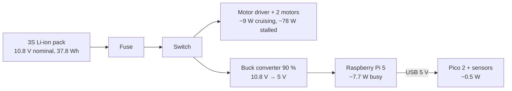

# FE.01 — Voltage, current, resistance and power

<!-- glance:start -->
<!-- generated by tools/build.py from curriculum/syllabus.yaml — edit the syllabus, not this block -->

| | |
|---|---|
| **Track** | Optional foundation |
| **Difficulty** | Beginner |
| **Time** | 45 min |
| **Hardware** | none |
| **Software** | none |
| **Prerequisites** | none |
| **Skip if** | You can explain voltage vs current with a correct analogy and compute power. |

<!-- glance:end -->

## What you will learn

- Explain voltage, current and resistance with an analogy that doesn't break when you use it.
- Say which one a battery "pushes", which one a wire "carries" and which one a fuse "limits".
- Compute electrical power ($P = VI$) and energy (Wh) for real robot parts.
- Estimate how much current the course robot draws from its battery and how long it runs.
- Recognize the two numbers that make a Li-ion pack dangerous: its voltage is low, but its short-circuit current is huge.

## Why it matters

Every electrical decision on the robot comes down to these four quantities. Can the Pico's pin light
this LED? (current). Will this buck converter feed the Raspberry Pi 5? (power). Why does the Pi reboot
when the motors start? (current causes a voltage drop). How long will the 3S pack last? (energy). Why does
the course insist on a fuse next to a "harmless" 12 V battery? (short-circuit current).

The main path uses this vocabulary from the first build lesson:
[01.01 Plan the build](../../01-first-robot/01.01-plan-the-build.md) sketches the power architecture,
[02.01 Datasheets](../../02-robot-electronics/02.01-datasheets-and-pinouts.md) reads voltage and current
ratings, and [FP.05 Energy, power and efficiency](../physics/FP.05-energy-power-efficiency.md) turns
watts into battery runtime. The later electronics foundations (Ohm's law, motors, batteries) all build
on this lesson.

<!-- prereqs:start -->
## Prerequisites

None — you can start here.

### Optional prerequisite links

None.

Check your readiness: `python course.py why FE.01`
<!-- prereqs:end -->

## Concept

### The water analogy — used carefully

Picture a closed loop of pipe filled with water, with a pump somewhere in the loop.

- **Voltage** is the *pressure difference* the pump creates between its outlet and its inlet. It is
  always measured *between two points*. "The battery is 12 V" means the + terminal is 12 V higher
  than the − terminal. A single point has no voltage by itself; we pick one point as the reference and
  call it **ground** (0 V). On the robot, ground is the battery's − terminal and every board's GND pin
  connected to it ([FE.16](FE.16-grounding.md) explains why they must all be connected).
- **Current** is the *flow rate*: how much charge passes a point per second. It is measured *through*
  a wire. The same current flows through every part of a single loop — water doesn't pile up in a pipe.
- **Resistance** is how *narrow* the pipe is. A narrow pipe lets less water through for the same
  pressure. Resistors, motor windings, LEDs and even wires have resistance.
- **Power** is how much *work per second* the flow does: pressure × flow rate. A lot of pressure with no
  flow does no work; a lot of flow with no pressure does no work either.

Where the analogy breaks: water pressure pushes water out of an open pipe; voltage does not push
current out of an open wire. **No closed loop, no current.** That's why a disconnected GND wire makes a
sensor silently fail: its loop is open.

### The distributed-systems version

If analogies to software help: voltage is like the *backlog pressure* between a producer and a consumer,
current is *throughput* (requests per second through a link), resistance is a *rate limiter*, and power
is *work done per second*. Throughput is the same at every hop of a single chain; pressure drops across
each rate limiter in the chain. Both statements are exactly true for current and voltage in a series
circuit, which you will use in [FE.02](FE.02-ohms-law-series-parallel.md).

### What the parts of the robot "are"

| Robot part | Electrical role | Typical numbers on karmel |
|---|---|---|
| 3S Li-ion pack | voltage source | 9.0 V empty … 10.8 V nominal … 12.6 V full |
| Buck converter | converts battery voltage to 5.0 V for the Pi | delivers up to 5 A |
| Raspberry Pi 5 | load | about 5.1 V × 1–2 A while busy |
| Motor (Yahboom 520, 12 V) | load, current varies with torque | a few hundred mA cruising, 3–4 A stalled |
| Pico 2 GPIO pin | a very weak voltage source (3.3 V) | designed for about 4 mA |
| LED + resistor | load | 2–5 mA |

Keep this table in mind: a Pico pin can supply milliamps; a stalled motor wants amps — about **a thousand
times more**. That single ratio is why motor drivers exist ([FE.12](FE.12-h-bridges-motor-drivers.md)).

> [!TIP]
> **Ask your teacher:** "Give me three everyday electrical situations and ask me which quantity —
> voltage, current, resistance or power — explains each one."

## Technical explanation

### Level 1 — Units and prefixes

| Quantity | Symbol | Unit | What 1 unit means |
|---|---|---|---|
| Voltage | $V$ (or $U$) | volt, V | 1 joule of energy per coulomb of charge |
| Current | $I$ | ampere, A | 1 coulomb of charge per second |
| Resistance | $R$ | ohm, Ω | 1 V needed per 1 A of current |
| Power | $P$ | watt, W | 1 joule per second |
| Charge / capacity | $Q$ | coulomb, C; battery ampere-hour, Ah | 1 Ah = 3,600 C |
| Energy | $E$ | joule, J; watt-hour, Wh | 1 Wh = 3,600 J |

Prefixes you will meet daily: µ (micro, $10^{-6}$), m (milli, $10^{-3}$), k (kilo, $10^{3}$),
M (mega, $10^{6}$). So 100 µA = 0.0001 A, 22 kΩ = 22,000 Ω, 4 mA = 0.004 A.

Example: karmel's battery is 3.5 Ah ([`labs/config/karmel.yaml`](../../labs/config/karmel.yaml),
`battery.capacity_ah`). In coulombs that is 3.5 × 3,600 = **12,600 C** — the pack can deliver 3.5 A for
one hour, or 1 A for 3.5 hours (in theory; [FE.13](FE.13-batteries.md) covers why reality is less).

### Level 2 — Resistance defines how voltage and current relate

For a resistor, current is proportional to voltage. Resistance is the constant of proportionality:

$$R = \frac{V}{I}$$

Example: a resistor has 1.3 V across it and 3.94 mA through it → $R = 1.3 / 0.00394 ≈ 330\ \Omega$.
Rearranging that one relation for $V$ or $I$ is Ohm's law, and [FE.02](FE.02-ohms-law-series-parallel.md)
spends a whole lesson using it. For now remember the direction of cause and effect in a robot: **the
source sets the voltage, the load decides the current.** A 12.6 V pack doesn't "send 3 A" to a motor;
the motor *draws* 3 A because of its resistance and load.

Not everything is a resistor. An LED keeps an almost constant voltage across itself (about 1.8–2.2 V
for red, about 2.8–3.2 V for blue or white) and lets current rise very steeply above that. That's why an
LED always needs a series resistor to set its current.

### Level 3 — Power and energy

$$P = V \cdot I$$

For a resistor you can substitute $V = IR$:

$$P = I^2 R = \frac{V^2}{R}$$

Worked examples with karmel's parts:

1. **Raspberry Pi 5 while busy**: 5.1 V × 1.5 A = **7.65 W**.
2. **Motor stalled** (wheel blocked; the Yahboom 520 stalls at about 3–4 A): 10.8 V × 3.5 A = **37.8 W**
   per motor. Two stalled motors ≈ 76 W — about ten times the Pi. Stall current decides fuse, wire
   and driver sizes ([02.02 Power budget](../../02-robot-electronics/02.02-power-budget.md)).
3. **LED resistor**: a 330 Ω resistor with 1.3 V across it: $P = V^2/R = 1.3^2 / 330 = 0.0051$ W =
   **5.1 mW**. A standard ¼ W (250 mW) resistor won't even get warm.
4. **Current from power**: a 10 W load on the 10.8 V battery draws $I = P/V = 10/10.8 ≈$ **0.93 A**.
   The same 10 W at 5 V draws 2 A. Lower voltage → more current for the same power → thicker wires.

**Energy** is power × time: $E = P \cdot t$. A battery's energy is $E = V_{nominal} \cdot Q$.

Example: karmel's pack stores 10.8 V × 3.5 Ah = **37.8 Wh**. If the whole robot averages 18 W,
runtime ≈ 37.8 / 18 ≈ **2.1 h** (upper bound: you shouldn't drain the pack to empty, and converters
waste some power — the code below includes a 90 % efficient buck converter).

### Level 4 — Why a 12 V battery is dangerous

People assume low voltage = safe. 12.6 V can't push dangerous current through your dry skin (skin is
thousands of ohms), so it won't shock you. The danger is a **short circuit**: a wire, a screwdriver or a
multimeter probe connecting + to − with almost zero resistance. Then the only thing limiting current is
the pack's own internal resistance plus the wire — a few tens of milliohms per cell.

Example: three cells at about 30 mΩ each plus a 20 mΩ wire:

$$I = \frac{V}{R} = \frac{12.6}{3 \times 0.030 + 0.020} = \frac{12.6}{0.11} ≈ 115\ \text{A}$$

The wire alone then dissipates $I^2R = 115^2 \times 0.02 ≈ 262$ W. Thin wires glow and melt their
insulation in seconds; cells vent and can catch fire. That's why [SAFETY.md](../../SAFETY.md) requires a
fuse at the battery's + terminal, and why [FE.14](FE.14-lithium-battery-safety.md) is a "never skip"
lesson.

> [!CAUTION]
> **Safety:** Never connect the battery's + and − together, even "for a moment", and never let loose
> battery leads touch. Cover exposed connectors, cut and insulate one wire at a time, and don't touch
> the Li-ion pack in this lesson's experiment: everything here runs from the Pico's USB power.

## Diagram

```text
      Water analogy                              The same circuit, electrically

   ┌──── pipe (wire) ────┐                     +3.3 V (Pico 3V3 pin)
   │                     │                        │
 [pump]              [narrow pipe]                ├──[ 330 Ω ]──┐     voltage drops 1.3 V here
 pressure            (resistance)                 │             │
 difference              │                        │           ─┴─  LED (drops ~2.0 V)
   │                     │                        │           \ /
   └──── pipe (wire) ────┘                        │           ─┬─
                                                  │             │
 flow rate = same everywhere in the loop       GND (0 V) ───────┘     same ~3.9 mA through every part
```



## Code

A power and runtime budget is just arithmetic, but writing it as code makes it easy to change one
assumption and see the result. Save as `fe01_power_budget.py` anywhere on your PC and run
`py fe01_power_budget.py` (Windows) or `python3 fe01_power_budget.py`.

```python
"""FE.01 - power and current budget for karmel (run on your PC)."""
from dataclasses import dataclass


@dataclass(frozen=True)
class Load:
    name: str
    volts: float   # voltage across the load (V)
    amps: float    # current through the load (A)

    @property
    def watts(self) -> float:
        return self.volts * self.amps


BATTERY_NOMINAL_V = 10.8   # labs/config/karmel.yaml: battery.nominal_v (3 x 3.6 V, Samsung 35E)
BATTERY_CAPACITY_AH = 3.5  # labs/config/karmel.yaml: battery.capacity_ah
BUCK_EFFICIENCY = 0.90     # assumption: a decent buck converter (FE.15)

loads_5v = [
    Load("Raspberry Pi 5 (busy)", 5.1, 1.5),
    Load("Pico 2 + sensors", 5.0, 0.1),
]
loads_battery = [
    Load("left motor (cruising)", 10.8, 0.4),
    Load("right motor (cruising)", 10.8, 0.4),
]

p_5v = sum(l.watts for l in loads_5v)
p_buck_in = p_5v / BUCK_EFFICIENCY
p_motors = sum(l.watts for l in loads_battery)
p_total = p_buck_in + p_motors
i_battery = p_total / BATTERY_NOMINAL_V
energy_wh = BATTERY_NOMINAL_V * BATTERY_CAPACITY_AH

for l in loads_5v + loads_battery:
    print(f"{l.name:26s} {l.volts:5.1f} V x {l.amps:4.2f} A = {l.watts:5.2f} W")
print(f"5 V rail total             {p_5v:5.2f} W -> buck input {p_buck_in:5.2f} W")
print(f"Total from battery         {p_total:5.2f} W = {i_battery:4.2f} A at {BATTERY_NOMINAL_V} V")
print(f"Battery energy             {energy_wh:5.2f} Wh -> runtime ~ {energy_wh / p_total:4.2f} h")
```

Output:

```text
Raspberry Pi 5 (busy)        5.1 V x 1.50 A =  7.65 W
Pico 2 + sensors             5.0 V x 0.10 A =  0.50 W
left motor (cruising)       10.8 V x 0.40 A =  4.32 W
right motor (cruising)      10.8 V x 0.40 A =  4.32 W
5 V rail total              8.15 W -> buck input  9.06 W
Total from battery         17.70 W = 1.64 A at 10.8 V
Battery energy             37.80 Wh -> runtime ~ 2.14 h
```

The load currents are illustrative assumptions, not measurements. In [FE.03](FE.03-multimeter.md) you
learn to measure them, and [02.02](../../02-robot-electronics/02.02-power-budget.md) does the real budget.

## Exercise

### Exercise FE.01-E1 — Robot numbers `[numerical]`

Hardware: none. Compute (by hand first, then check with Python):

1. The Pico 2's 3.3 V pin powers a sensor that draws 20 mA. What power does the sensor use?
2. A buck converter delivers 5.0 V at 3.0 A to the Pi. It is 90 % efficient. How much power does it take
   from the battery, and what current is that at 10.8 V?
3. A 22 kΩ resistor has 2.27 V across it. What current flows, and what power does it dissipate?
4. How many times more current does one stalled motor (3.5 A) need than a Pico GPIO pin's 4 mA design
   current?
5. The battery is full (12.6 V). You measure 0.8 A flowing out of it. What power is the robot using?

### Exercise FE.01-E2 — Predict, then look: an LED with three resistors `[predict]`

Hardware: `robot-base` (Pico 2 + USB cable) and `tools` (breadboard, jumpers, one red LED, 220 Ω, 1 kΩ
and 10 kΩ resistors). No-hardware alternative: do only the prediction and the calculation.

The Pico 2 is powered from your PC over USB; its pin 36 (3V3) supplies 3.3 V and pin 38 is GND.
[FE.04](FE.04-breadboards-and-connectors.md) shows breadboard layout if you haven't used one.

1. **Predict** the LED current for each resistor, assuming the red LED holds 2.0 V: the resistor gets the
   remaining 1.3 V. Rank the three brightnesses.
2. Unplug USB. Build: 3V3 (pin 36) → resistor → LED long leg (anode); LED short leg (cathode) → GND
   (pin 38).
3. Plug USB in and observe. Unplug, swap the resistor, repeat for all three.
4. Would it be OK to skip the resistor? Explain using the LED's behavior described in Level 2.

### Exercise FE.01-E3 — Change the budget `[coding]`

Hardware: none. Modify `fe01_power_budget.py`:

1. Add a `stalled` scenario where both motors draw 3.5 A. Print total battery current and runtime.
2. Add a USB LiDAR on the 5 V rail at 5.0 V × 0.5 A (a Stage-3 part). What happens to runtime while cruising?
3. Print the battery current for the cruising scenario at 12.6 V (full) and 9.9 V (cutoff) — same power,
   different voltage.

## Expected result

**FE.01-E1:**
1. $P = 3.3 \times 0.020 = 0.066$ W = **66 mW**.
2. Output 15.0 W → input $15.0/0.9 ≈$ **16.7 W** → $16.7/10.8 ≈$ **1.54 A** from the battery.
3. $I = 2.27/22{,}000 ≈$ **103 µA**; $P = V^2/R = 2.27^2/22{,}000 ≈$ **0.23 mW**.
4. $3.5 / 0.004 =$ **875 times**.
5. $12.6 \times 0.8 =$ **10.1 W**.

**FE.01-E2:** predicted currents $1.3/R$: 220 Ω → **5.9 mA** (brightest), 1 kΩ → **1.3 mA** (clearly
dimmer), 10 kΩ → **0.13 mA** (faint but usually visible in a dim room). Brightness order matches the
current order. Without a resistor nothing sets the current: 3.3 V is well above the red LED's ~2 V, and its steep
curve lets the current climb to tens of mA or more, limited only by the regulator and the LED's small
internal resistance. The LED overheats and fails. Always use a resistor.

**FE.01-E3:** stalled: motors 2 × 10.8 × 3.5 = 75.6 W, total ≈ **84.7 W**, ≈ **7.8 A** from the battery,
"runtime" ≈ 0.45 h (a stall that long would overheat the motors and trip the fuse — the number shows why
stall is an emergency, not a scenario). With the LiDAR: 5 V rail 10.65 W → buck input ≈ 11.83 W → total
≈ 20.47 W, runtime ≈ **1.85 h**. At 17.70 W: 12.6 V → **1.40 A**; 9.9 V → **1.79 A** — as the battery
empties, the same power needs more current.

## Troubleshooting

### Symptom: the LED in FE.01-E2 doesn't light

1. Is the Pico powered? Its on-board LED doesn't light by default, so check that the PC recognizes the USB
   device (or that the Pico's MicroPython REPL answers — [01.05](../../01-first-robot/01.05-pico-microcontroller-setup.md)).
2. Is the loop closed? Trace it with your finger: 3V3 → resistor → LED → GND → back to the Pico. A missing
   GND wire is the most common cause.
3. Is the LED backwards? The long leg (anode) must face the + side. A reversed LED blocks current; it isn't
   damaged at 3.3 V. Flip it.
4. Are both resistor legs in the same breadboard strip? Then the resistor is shorted out… and the LED would
   be *brighter*, not dark. If it's dark, look instead for a leg in the wrong row.
5. Still dark: measure with a multimeter ([FE.03](FE.03-multimeter.md)) — 3.3 V between pin 36 and GND?

### Symptom: my runtime estimate is far better than the real robot

Check the assumptions, cheapest first: (a) you used nominal, not average, current — motors draw far more
when accelerating or turning in place; (b) converter efficiency wasn't included; (c) you counted the full
capacity, but the course stops at `cutoff_v` = 9.9 V, well before empty; (d) the battery's real capacity
is below the label, especially when old or cold. [FP.05](../physics/FP.05-energy-power-efficiency.md)
turns this into a proper estimate.

## Common mistakes

- **"The battery sends 3 A."** The source sets voltage; the load draws current. A 5 A-rated buck converter
  doesn't force 5 A into the Pi; the Pi takes what it needs.
- **Talking about "the voltage at a point"** without a reference. Always "between X and GND" — or between
  two named points. Probing a pin with the meter's black lead not on GND gives nonsense.
- **Confusing Ah (charge) with Wh (energy).** A 3.5 Ah pack at 10.8 V and a 3.5 Ah phone cell at 3.7 V
  are very different: 37.8 Wh vs 12.95 Wh.
- **Believing low voltage means no danger.** The shock risk is low; the fire risk from a short circuit is
  high. Fuse and insulate.
- **Sizing wires and fuses for average current.** Size for the worst realistic case (stall, startup
  surge). Average current sets runtime; peak current sets wires, fuses and drivers.

## Knowledge check

1. Voltage is measured *across* or *through* a component? Current?
   <details><summary>Answer</summary>

   Voltage is a difference *between two points*, so you measure *across* a component (probes on both
   sides). Current is flow *through* a point, so the meter must be part of the loop — the current flows
   *through* the meter. [FE.03](FE.03-multimeter.md) turns this into a safety rule.
   </details>
2. The Pi 5 uses 7.65 W at 5.1 V. What current does it draw?
   <details><summary>Answer</summary>

   $I = P/V = 7.65 / 5.1 =$ **1.5 A**.
   </details>
3. A robot uses 20 W on average. Its battery is 10.8 V, 3.5 Ah. Ignoring losses and reserve, how long does it
   run?
   <details><summary>Answer</summary>

   Energy = 10.8 × 3.5 = 37.8 Wh; 37.8 / 20 ≈ **1.89 h**. Real runtime will be shorter: you stop at the
   cutoff voltage and converters waste power.
   </details>
4. Why does a short circuit on a 12.6 V Li-ion pack cause a fire risk while touching both terminals with
   dry fingers is harmless?
   <details><summary>Answer</summary>

   Current = V / R. Through your body R is thousands of ohms → milliamps, harmless. Through a wire R is
   milliohms → around 100 A. Power in the wire is $I^2R$ — hundreds of watts in a thin conductor.
   </details>
5. Predict: you replace a 1 kΩ LED resistor with a 100 kΩ one. What happens to current and brightness?
   <details><summary>Answer</summary>

   Current drops about 100× (1.3 mA → 0.013 mA). The LED is essentially off. More resistance, less
   current for the same voltage.
   </details>
6. Debugging: a sensor works on your desk when powered from the Pico, but on the robot it reads nothing. Its
   VCC wire goes to the 3.3 V pin, and its signal wire to a GPIO. What wire is most likely missing, and why
   does that stop everything?
   <details><summary>Answer</summary>

   **GND.** Without a return path there's no closed loop, so no current flows through the sensor, and its
   signal has no shared reference with the Pico. On the desk the USB cable or breadboard rail may have
   provided the common ground by accident.
   </details>
7. Which needs thicker wires: 60 W at 12 V, or 60 W at 5 V?
   <details><summary>Answer</summary>

   60 W at 5 V draws 12 A; at 12 V it draws 5 A. Wire heating grows with $I^2R$, so **5 V** needs thicker
   wire. That's one reason robots distribute power at battery voltage and convert down near the load.
   </details>

## Practical challenge

Build a "power sheet" for your own robot plan (or karmel's defaults) as a small Python program:

- List every part you intend to buy with its supply voltage, typical current and worst-case current (take
  worst-case numbers from datasheets or product pages — [02.01](../../02-robot-electronics/02.01-datasheets-and-pinouts.md)).
- Compute per rail (battery, 5 V, 3.3 V): typical and worst-case power and current, including converter
  efficiency.
- Compute runtime from typical power and energy above `cutoff_v`, assuming you use 80 % of the capacity.
- Acceptance criteria: the sheet runs, prints both typical and worst-case battery current, names the largest
  consumer, and states which fuse rating you'd choose and why (just above worst-case *normal* current, below
  what the wiring tolerates). Show it to your teacher and defend each number.

## You can skip this if…

You answer knowledge-check questions 3, 4 and 7 correctly without looking and can explain, in one sentence
each, voltage vs current and Ah vs Wh. Then:
`python course.py skip FE.01 --reason "I already know V, I, R and power"`.

## Go deeper

- https://learn.sparkfun.com/tutorials/voltage-current-resistance-and-ohms-law — SparkFun's gentle first-principles tutorial with the water analogy.
- https://learn.sparkfun.com/tutorials/electric-power — power, energy and the $I^2R$ heating that burns wires.
- https://www.allaboutcircuits.com/textbook/ — *Lessons in Electric Circuits*, Vol. I (DC), when you want the textbook version.
- https://learn.adafruit.com/li-ion-and-lipoly-batteries — Adafruit on Li-ion voltages, protection and handling.

## Progress checkpoint

- [ ] I can explain voltage, current and resistance with an analogy, including where it breaks.
- [ ] I can compute power from voltage and current, and current from power.
- [ ] I can compute a battery's energy in Wh and a rough runtime.
- [ ] I can explain why a Li-ion short circuit is dangerous at "only" 12 V.

`python course.py complete FE.01` (exercises done) · `python course.py master FE.01` (challenge done) ·
`python course.py struggle FE.01 "what was hard"`.

Next: [FE.02 — Ohm's law, series and parallel, voltage dividers](FE.02-ohms-law-series-parallel.md).
