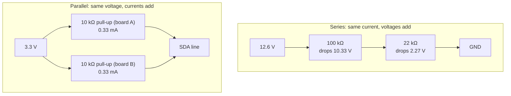

# FE.02 — Ohm's law, series and parallel, voltage dividers

<!-- glance:start -->
<!-- generated by tools/build.py from curriculum/syllabus.yaml — edit the syllabus, not this block -->

| | |
|---|---|
| **Track** | Optional foundation |
| **Difficulty** | Beginner |
| **Time** | 50 min |
| **Hardware** | none |
| **Software** | none |
| **Prerequisites** | [FE.01 Voltage, current, resistance and power](FE.01-voltage-current-resistance-power.md) |
| **Skip if** | You can design a voltage divider for an ADC input. |

<!-- glance:end -->

## What you will learn

- Use Ohm's law to compute any one of voltage, current or resistance from the other two.
- Combine resistors in series and in parallel and predict what happens to voltage and current in each.
- Choose an LED series resistor from a target current.
- Design a voltage divider that lets the Pico's 3.3 V ADC read karmel's 12.6 V battery with a safety margin.
- Check a divider for the things that bite later: power drain, loading by the input, and resistor tolerance.

## Why it matters

The course robot's battery reaches 12.6 V; the Pico 2's analog input must never see more than about
3.3 V. The bridge between them is two resistors — a voltage divider — and
[01.14 Battery monitoring](../../01-first-robot/01.14-battery-monitoring.md) wires exactly that on GP26.
The same two-resistor trick turns an HC-SR04 ultrasonic sensor's 5 V echo into a safe 3.3 V signal
([01.13](../../01-first-robot/01.13-distance-sensors-stop.md)), and parallel resistance explains why two I²C
breakout boards change the bus pull-up strength ([FE.06](FE.06-pull-up-pull-down.md)).

Later foundations use this lesson directly: the ADC ([FE.08](FE.08-adc.md)), GPIO logic levels
([FE.05](FE.05-digital-analog-gpio.md)), regulators ([FE.15](FE.15-voltage-regulators.md)), grounding
([FE.16](FE.16-grounding.md)) and capacitors ([FE.18](FE.18-capacitors-diodes.md)).

<!-- prereqs:start -->
## Prerequisites

You need these first:

- [FE.01 Voltage, current, resistance and power](FE.01-voltage-current-resistance-power.md)

### Optional prerequisite links

None.

Check your readiness: `python course.py why FE.02`
<!-- prereqs:end -->

## Concept

In [FE.01](FE.01-voltage-current-resistance-power.md) you met resistance as $R = V/I$. Ohm's law is
that same relation used as a tool: know two, get the third.

Two ways to connect parts cover almost every circuit you will build:

- **Series** — one after another, a single path. Like two rate limiters in one pipeline: every request
  passes both, the *throughput* (current) is the same through both, and the *pressure* (voltage) is shared
  between them. The bigger limiter takes the bigger share.
- **Parallel** — side by side, both connected across the same two points. Like two replicas behind a
  load balancer: both see the same *pressure* (voltage), and the total throughput is the sum. Adding a
  path, even a narrow one, always makes the combination pass *more* current — lower total resistance.

A **voltage divider** is two resistors in series. Since the current is the same through both, each takes a
share of the voltage proportional to its resistance. Tap the point between them and you get a fixed
fraction of the input voltage. That's how a 12.6 V battery becomes a 2.27 V signal the Pico can read.

> [!TIP]
> **Ask your teacher:** "Draw me a voltage divider in ASCII, then ask me what happens to the output if the
> bottom resistor breaks open, and if it shorts."

## Technical explanation

### Level 1 — Ohm's law

$$V = I \cdot R \qquad I = \frac{V}{R} \qquad R = \frac{V}{I}$$

Examples:
- 12.6 V across 122 kΩ: $I = 12.6 / 122{,}000 = 0.000103$ A = **103 µA**.
- 1.67 mA through 3 kΩ: $V = 0.00167 \times 3{,}000 =$ **5.0 V**.
- A motor winding draws 3.4 A when stalled at 10.8 V: $R = 10.8 / 3.4 ≈$ **3.2 Ω**. (When the motor
  turns, it generates a back-voltage and draws far less — [FE.10](FE.10-dc-motors.md).)

### Level 2 — Series and parallel

**Series:** same current, voltages add, resistances add.

$$R_{series} = R_1 + R_2 + \dots$$

Example: 100 kΩ + 22 kΩ = **122 kΩ**.

**Parallel:** same voltage, currents add, conductances ($1/R$) add.

$$\frac{1}{R_{parallel}} = \frac{1}{R_1} + \frac{1}{R_2} + \dots \qquad \text{two resistors: } R_{parallel} = \frac{R_1 R_2}{R_1 + R_2}$$

Examples:
- Two breakouts each with a 10 kΩ pull-up on the same I²C line: $10 \times 10 / 20 =$ **5 kΩ**.
- Three such boards: 10 / 3 ≈ **3.33 kΩ**. The result is always smaller than the smallest resistor.
- 10 kΩ ∥ 4.7 kΩ ≈ **3.20 kΩ**.

**Series LED resistor.** The LED holds its forward voltage $V_F$ (red ≈ 2.0 V); the resistor takes the rest.

$$R = \frac{V_{supply} - V_F}{I_{LED}}$$

Example: a status LED on a Pico pin (3.3 V) at 2 mA: $R = (3.3 - 2.0) / 0.002 = 650\ \Omega$. 650 Ω isn't a
standard value; the next standard value up is **680 Ω**, giving $1.3/680 ≈$ **1.91 mA**. Round *up* so the
current stays at or below the target.

Standard values come in series: E12 (10, 12, 15, 18, 22, 27, 33, 39, 47, 56, 68, 82 × powers of ten, ±10 %
in the original series, today usually ±5 %) and E24 (twice as many steps, ±1 % or ±5 % parts). A cheap
resistor kit is usually E12 or a subset of E24.

### Level 3 — The voltage divider

```text
 V_in ──┬──
        │
      [R_top]          I = V_in / (R_top + R_bottom)     (same current through both)
        │
        ├────── V_out = V_in · R_bottom / (R_top + R_bottom)
        │
     [R_bottom]
        │
 GND ───┴──
```

$$V_{out} = V_{in} \cdot \frac{R_{bottom}}{R_{top} + R_{bottom}}$$

**karmel's battery divider** ([`labs/config/karmel.yaml`](../../labs/config/karmel.yaml): `battery_adc: 26`,
100 k / 22 k):

| Battery | $V_{out} = V_{in} \times 22/122$ |
|---|---|
| 12.6 V (full) | **2.272 V** |
| 10.8 V (nominal) | 1.948 V |
| 9.9 V (course cutoff) | 1.785 V |
| 9.0 V (empty) | 1.623 V |

### Level 4 — Designing a divider properly

A divider design is five checks, not one formula. Using the battery divider as the example:

**1. Ratio with margin.** The ADC pin's safe maximum is 3.3 V (GP26–GP29 are *not* 5 V tolerant — they
have a diode to the 3.3 V rail, per the Pico 2 datasheet). Don't design for exactly 12.6 V → 3.3 V: a
charger fault, a 4S pack plugged in by mistake, or resistor tolerance would push the pin over. Choose a
worst-case input you want to survive, e.g. 15 V → at most 3.0 V:

$$k = \frac{R_{bottom}}{R_{top}+R_{bottom}} \le \frac{3.0}{15} = 0.20$$

100 k / 22 k gives $k = 0.180$: the pin reaches 3.3 V only when the input reaches $3.3 / 0.180 ≈$ **18.3 V**.
Plenty of margin, while 12.6 V still uses 69 % of the ADC range.

**2. Current drain.** The divider is connected to the battery all the time (after the switch, it drains
only when the robot is on — still, check). $I = 12.6 / 122{,}000 ≈$ **103 µA**, i.e. 2.5 mAh per day:
negligible against 3,500 mAh. A 1 k / 220 Ω divider would have the same ratio but waste 10.3 mA.

**3. Source resistance and loading.** Whatever you connect to $V_{out}$ is in parallel with $R_{bottom}$.
Looking back into the divider, the input sees the Thevenin resistance $R_{top} \parallel R_{bottom}$:
100 k ∥ 22 k ≈ **18.0 kΩ**. The RP2350 datasheet guarantees an ADC input impedance of *at least* 100 kΩ.
In that absolute worst case, $R_{bottom}$ effectively becomes 22 k ∥ 100 k = 18.0 kΩ and the 12.6 V reading
would be $12.6 \times 18.0/(100+18.0) ≈ 1.93$ V instead of 2.27 V — 15 % low. In practice the error is much
smaller, and you remove what remains by calibrating against a multimeter ([FE.08](FE.08-adc.md)). A 100 nF
capacitor from the pin to GND gives the ADC a low-impedance charge reservoir and filters motor noise. The
lesson: very high divider resistances (MΩ) save microamps but make readings slow and load-sensitive.

**4. Tolerance.** With ±1 % resistors, the worst cases at 12.6 V are 101 k / 21.78 k → **2.235 V** and
99 k / 22.22 k → **2.310 V**: ±1.7 %, about ±0.2 V at the battery. Calibration fixes this too.

**5. Power rating.** $P = V^2/R = 12.6^2 / 122{,}000 ≈ 1.3$ mW. Any resistor is fine.

**The HC-SR04 echo divider.** The HC-SR04 is a 5 V sensor; its echo output swings to 5 V. The course's
recommended ultrasonic is a US-100 powered at 3.3 V, which needs no divider, but if you use an HC-SR04, a
1 kΩ (top) / 2 kΩ (bottom) divider gives $5 \times 2/3 =$ **3.33 V** and draws $5/3{,}000 ≈$ **1.67 mA**
from the echo pin while high. 3.33 V reads as a solid logic 1 (the input threshold is at most 2.0 V —
[FE.05](FE.05-digital-analog-gpio.md)). Low values (kΩ, not 100 kΩ) keep the edges fast for the timing
measurement. [02.05](../../02-robot-electronics/02.05-logic-levels-and-protection.md) compares dividers
with proper level shifters.

> [!CAUTION]
> **Safety:** A divider connected to the battery is only safe while $R_{bottom}$ is connected. If the bottom
> resistor or its GND wire comes loose, the pin sees the battery through $R_{top}$. Build and test the
> divider on the bench with a low voltage first (the Pico's own 3.3 V or USB 5 V), solder it for the robot,
> and always wire GND first. Never probe battery wiring with bare metal tools near both terminals.

## Diagram



Battery divider wiring (bench version, before the robot):

```text
   Battery + (after fuse & switch) ──[ R_top 100 kΩ ]──┬──[ R_bottom 22 kΩ ]── GND (battery −, Pico GND)
                                                       │
                                                       ├──[ 100 nF ]── GND        (optional filter)
                                                       │
                                                       └──────────────── Pico 2 GP26 / ADC0 (pin 31)
```

| From | To | Wire color | Voltage |
|---|---|---|---|
| Battery + (after fuse and switch) | R_top (100 kΩ) | red | 9.0–12.6 V |
| R_top / R_bottom junction | Pico 2 GP26 (pin 31) | yellow | 1.62–2.27 V |
| R_bottom (22 kΩ) other end | GND rail | black | 0 V |
| GND rail | Pico 2 GND (pin 33 AGND or 38) | black | 0 V |
| GND rail | Battery − | black | 0 V |

## Code

A small design helper: it evaluates the course divider and searches E24 values for a new design. Save as
`fe02_divider_design.py` and run `py fe02_divider_design.py`.

```python
"""FE.02 - design a resistor divider from standard E24 values (run on your PC)."""
from dataclasses import dataclass

E24 = [1.0, 1.1, 1.2, 1.3, 1.5, 1.6, 1.8, 2.0, 2.2, 2.4, 2.7, 3.0,
       3.3, 3.6, 3.9, 4.3, 4.7, 5.1, 5.6, 6.2, 6.8, 7.5, 8.2, 9.1]


@dataclass(frozen=True)
class Divider:
    r_top: float     # ohms, from the input to the output node
    r_bottom: float  # ohms, from the output node to GND

    @property
    def ratio(self) -> float:
        return self.r_bottom / (self.r_top + self.r_bottom)

    def v_out(self, v_in: float) -> float:
        return v_in * self.ratio

    def current(self, v_in: float) -> float:
        return v_in / (self.r_top + self.r_bottom)

    @property
    def source_resistance(self) -> float:
        """What the ADC 'sees' looking back into the divider (Thevenin resistance)."""
        return self.r_top * self.r_bottom / (self.r_top + self.r_bottom)


def standard_values(decades: tuple[int, ...] = (3, 4, 5)) -> list[float]:
    """E24 values from 1 kOhm to 910 kOhm."""
    return [round(v * 10**d) for d in decades for v in E24]


def design(v_in_max: float, v_out_max: float, i_max: float,
           r_source_max: float = 25_000) -> Divider:
    """Largest ratio with v_out <= v_out_max at v_in_max, current <= i_max and
    source resistance <= r_source_max (keeps ADC loading small)."""
    best: Divider | None = None
    for r_top in standard_values():
        for r_bottom in standard_values():
            d = Divider(r_top, r_bottom)
            if (d.v_out(v_in_max) > v_out_max or d.current(v_in_max) > i_max
                    or d.source_resistance > r_source_max):
                continue
            if best is None or d.ratio > best.ratio or (
                d.ratio == best.ratio and d.source_resistance < best.source_resistance
            ):
                best = d
    if best is None:
        raise ValueError("no E24 pair satisfies the constraints")
    return best


if __name__ == "__main__":
    course = Divider(100_000, 22_000)  # labs/config/karmel.yaml: battery_adc
    for v in (12.6, 10.8, 9.9, 9.0):
        print(f"battery {v:5.2f} V -> ADC pin {course.v_out(v):.3f} V")
    print(f"current at 12.6 V: {course.current(12.6) * 1e6:.0f} uA, "
          f"source resistance {course.source_resistance / 1e3:.1f} kOhm, "
          f"pin reaches 3.3 V at {3.3 / course.ratio:.1f} V")

    # Design for a 15 V worst case (charger fault, wrong pack) -> at most 3.0 V, <= 150 uA.
    d = design(v_in_max=15.0, v_out_max=3.0, i_max=150e-6)
    print(f"designed: top {d.r_top / 1e3:g} k, bottom {d.r_bottom / 1e3:g} k, "
          f"12.6 V -> {d.v_out(12.6):.3f} V, 15 V -> {d.v_out(15.0):.3f} V")

    echo = Divider(1_000, 2_000)  # HC-SR04 echo (5 V) into a 3.3 V pin
    print(f"HC-SR04 echo 5 V -> {echo.v_out(5.0):.3f} V, {echo.current(5.0) * 1e3:.2f} mA")
```

Output:

```text
battery 12.60 V -> ADC pin 2.272 V
battery 10.80 V -> ADC pin 1.948 V
battery  9.90 V -> ADC pin 1.785 V
battery  9.00 V -> ADC pin 1.623 V
current at 12.6 V: 103 uA, source resistance 18.0 kOhm, pin reaches 3.3 V at 18.3 V
designed: top 120 k, bottom 30 k, 12.6 V -> 2.520 V, 15 V -> 3.000 V
HC-SR04 echo 5 V -> 3.333 V, 1.67 mA
```

The search maximizes resolution (largest ratio) under the voltage, current and source-resistance limits. It lands exactly on
the 3.0 V limit — in a real design you'd take one step more margin, or accept that resistor tolerance can
push it 1–2 % over. The course's 100 k / 22 k trades a little resolution for more margin.

## Exercise

### Exercise FE.02-E1 — Ohm's law and combinations `[numerical]`

Hardware: none.

1. What current flows through a 4.7 kΩ resistor with 3.3 V across it?
2. Two 10 kΩ and one 4.7 kΩ pull-up resistors end up in parallel on one I²C line. Total resistance?
3. 330 Ω and 680 Ω in series across 3.3 V. Current? Voltage across each?
4. Choose an E12 series resistor for a *green* LED ($V_F ≈ 2.2$ V) at no more than 3 mA from a 3.3 V pin. What
   current do you actually get?

### Exercise FE.02-E2 — Design a divider for a different pack `[numerical]`

Hardware: none. A friend's robot uses a 4S Li-ion pack (16.8 V full). Using `fe02_divider_design.py` or by
hand, design a divider for a Pico ADC pin: worst-case input 20 V → at most 3.0 V, current ≤ 200 µA at 16.8 V.
Report the resistors, the output at 16.8 V, the current, and the source resistance.

### Exercise FE.02-E3 — Build and measure a divider `[hardware]`

Hardware: `robot-base` (Pico 2 + USB cable), `tools` (breadboard, jumpers, 10 kΩ ×2, 22 kΩ, 100 kΩ
resistors, multimeter). No-hardware alternative: predict the numbers only.

A multimeter in **DC volts** mode is safe to use across anything in this experiment; [FE.03](FE.03-multimeter.md)
covers meters in detail. Put the black probe on GND and the red probe on the point you measure.

1. Power source: the Pico's 3V3 pin (pin 36) with USB plugged in; GND on pin 38.
2. **Predict**, then build and measure the output of: (a) 10 k / 10 k, (b) top 22 k / bottom 10 k,
   (c) top 100 k / bottom 22 k. Also measure the 3V3 pin itself.
3. For (c), put a 22 kΩ resistor in parallel with the bottom resistor (the "load"). Predict and measure again.

### Exercise FE.02-E4 — What if it breaks? `[predict]`

Hardware: none. For the battery divider (100 k / 22 k, full battery 12.6 V), predict the voltage on GP26
when: (a) R_bottom is disconnected; (b) R_top is disconnected; (c) R_bottom is accidentally 2.2 k instead of
22 k; (d) R_top is accidentally 10 k instead of 100 k. Which cases can damage the Pico?

## Expected result

**FE.02-E1:**
1. $3.3/4{,}700 ≈$ **0.70 mA**.
2. 10 k ∥ 10 k = 5 k; 5 k ∥ 4.7 k ≈ **2.42 kΩ**.
3. Total 1,010 Ω → **3.27 mA**; 330 Ω drops **1.08 V**, 680 Ω drops **2.22 V** (sum 3.3 V).
4. $R ≥ (3.3-2.2)/0.003 ≈ 367\ \Omega$ → next E12 value **390 Ω** → **2.82 mA**.

**FE.02-E2:** `design(v_in_max=20.0, v_out_max=3.0, i_max=200e-6)` returns top **91 k** / bottom **16 k**
($k ≈ 0.1495$): 20 V → **2.99 V**, 16.8 V → **2.51 V**, **157 µA** at 16.8 V, source resistance ≈ **13.6 kΩ**.
By hand you may land on another valid pair, e.g. 130 k / 22 k (20 V → 2.89 V, 16.8 V → 2.43 V, 111 µA,
18.8 kΩ). Reject pairs like 150 k / 27 k: 20 V → 3.05 V breaks the limit. Any pair meeting all three limits
with a ratio near 0.15 is correct.

**FE.02-E3** (your 3V3 pin will read about 3.28–3.32 V; scale these with your measurement; ±5 % resistors
add up to ±5 %): (a) **1.65 V**; (b) $3.3 \times 10/32 ≈$ **1.03 V**; (c) $3.3 \times 22/122 ≈$ **0.595 V**.
With the extra 22 k in parallel, the bottom becomes 11 k: $3.3 \times 11/111 ≈$ **0.327 V** — the load
halved the output. That is loading.

**FE.02-E4:** (a) no current flows through R_top, so the pin is pulled toward **12.6 V** through 100 kΩ — the
pin's internal diode clamps it near 3.6 V and about $(12.6-3.6)/100{,}000 ≈ 90$ µA flows into the 3.3 V rail.
Out of spec; don't rely on survival. (b) **0 V** (reads empty battery, harmless). (c) $12.6 \times 2.2/102.2 ≈$
**0.27 V** (harmless, wrong reading). (d) $12.6 \times 22/32 ≈$ **8.66 V** — damaging. Cases (a) and (d) are
dangerous; that's why you measure the divider before connecting the Pico.

## Troubleshooting

### Symptom: the divider output is not what the formula says

1. Measure the input voltage too. The formula scales the *actual* input, not the nominal one.
2. Is something else loading the output? Disconnect the Pico/meter/other wire and measure again. If the value
   rises, the load is significant — use smaller resistors or accept and calibrate.
3. Power off and measure each resistor with the meter in Ω mode, *out of the circuit* (in circuit, parallel
   paths falsify the reading). Read the color bands again — 22 k (red-red-orange) vs 2.2 k (red-red-red) is
   the classic mix-up.
4. Check the breadboard: both legs of one resistor in the same strip (shorted), or a leg in a neighboring row.
5. If it's still off by a tiny amount (1–3 %): that's resistor tolerance and meter accuracy. Calibrate in
   software ([FE.08](FE.08-adc.md)).

### Symptom: the LED is much dimmer or brighter than calculated

$V_F$ varies by color and current; the calculated current is an estimate. Measure the voltage across the
resistor and compute $I = V_R / R$ — that's the real current, measured without breaking the circuit.

## Common mistakes

- **Swapping top and bottom resistors.** 22 k on top / 100 k at the bottom gives $12.6 \times 100/122 = 10.3$ V
  on the pin. Label the divider and measure its output before connecting the MCU.
- **Designing to exactly 3.3 V.** No margin for a charger fault, tolerance or a different pack. Keep the
  maximum around 3.0 V at your worst-case input.
- **Using a divider to power something.** A divider is a *signal* tool. A sensor that draws current loads it
  and the voltage collapses. To power things, use a regulator ([FE.15](FE.15-voltage-regulators.md)).
- **Measuring resistance in a powered circuit.** The meter injects its own small current; in a live circuit
  the reading is wrong and you may damage the meter. Power off and lift one leg.
- **Forgetting that parallel always lowers resistance.** Each new I²C breakout with pull-ups makes the bus
  pull-up *stronger* (smaller R), not weaker.

## Knowledge check

1. A 2 kΩ resistor carries 1.5 mA. What voltage is across it?
   <details><summary>Answer</summary>

   $V = IR = 0.0015 \times 2{,}000 =$ **3.0 V**.
   </details>
2. What is 22 kΩ ∥ 100 kΩ, and where does that number matter for the battery divider?
   <details><summary>Answer</summary>

   $22 \times 100 / 122 ≈$ **18.0 kΩ**. It's the divider's source resistance — what the ADC input sees
   looking back. It sets how much a load (like the ADC's own input impedance) shifts the reading.
   </details>
3. Design question: why not use 1 MΩ / 220 kΩ for the battery divider to save current?
   <details><summary>Answer</summary>

   Same ratio, 10× less current (≈10 µA), but source resistance ≈ 180 kΩ — comparable to the ADC's
   guaranteed ≥100 kΩ input impedance, so readings drop a lot and become noise-sensitive. 103 µA is already
   negligible for a 3,500 mAh pack.
   </details>
4. At what battery voltage would the 100 k / 22 k divider put exactly 3.3 V on the pin?
   <details><summary>Answer</summary>

   $3.3 \times 122/22 ≈$ **18.3 V**.
   </details>
5. Predict: you measure a divider's output with a cheap meter, and it reads 3 % lower than when measured with a
   better meter. Both meters are accurate. What's going on?
   <details><summary>Answer</summary>

   The cheap meter has a lower input resistance (some have 1 MΩ instead of 10 MΩ), and it loads the divider —
   a parallel resistor on $R_{bottom}$. It's worst for high-resistance dividers.
   </details>
6. The HC-SR04's echo is 5 V. Why is 1 k / 2 k preferred over 100 k / 200 k, although both give 3.33 V?
   <details><summary>Answer</summary>

   The echo is a timing signal: the Pico measures the pulse width. The input pin and wiring have some
   capacitance; with 67 kΩ source resistance (100 k ∥ 200 k) the edges slow down and blur the timing. 667 Ω
   keeps them sharp; 1.67 mA is easily supplied.
   </details>
7. Debugging: your battery reading on GP26 is exactly 0 V regardless of the battery. Name the two most likely
   wiring faults.
   <details><summary>Answer</summary>

   (1) R_top isn't connected to the battery (open), so the pin is pulled to GND by R_bottom; (2) the junction
   wire goes to the wrong pin, so GP26 is floating or tied to GND. Also possible: the battery switch is off.
   Measure the divider's input and output with the meter.
   </details>

## Practical challenge

Build karmel's battery-divider circuit on the breadboard and prove it safe **before** it ever touches a Pico pin.

- Use 100 kΩ / 22 kΩ, plus a 100 nF capacitor if you have one.
- Feed it with the highest safe bench voltage you have without the battery: the Pico's VBUS pin (pin 40,
  ≈ 5 V from USB). Predict and measure the output (≈ 0.90 V at 5.0 V input).
- Only then (see [01.14](../../01-first-robot/01.14-battery-monitoring.md) and the caution above) measure the
  robot's battery voltage and the divider's output, with the Pico *not* connected to the divider.
- Acceptance criteria: a table of predicted vs measured output at two input voltages, each within 3 %; a written
  worst-case check (what input puts 3.3 V on the pin); and a photo or sketch of the wiring with labels. Only
  then connect the output to GP26.

## You can skip this if…

You answer questions 2, 3 and 6 correctly without looking and can design a divider for 12.6 V → ADC with margin
in under five minutes, including current and source resistance. Then:
`python course.py skip FE.02 --reason "I can design voltage dividers"`.

## Go deeper

- https://learn.sparkfun.com/tutorials/voltage-dividers — dividers with applications, including sensor reading and level shifting.
- https://learn.sparkfun.com/tutorials/series-and-parallel-circuits — series and parallel with worked examples.
- https://learn.sparkfun.com/tutorials/resistors — color codes, E-series, power ratings.
- https://datasheets.raspberrypi.com/pico/pico-2-datasheet.pdf — Pico 2 datasheet: the ADC pins' diode to 3.3 V and ADC reference details (section "Using the ADC").
- https://www.allaboutcircuits.com/textbook/ — *Lessons in Electric Circuits*, Vol. I, chapters on series-parallel circuits and divider circuits.

## Progress checkpoint

- [ ] I can compute V, I or R with Ohm's law.
- [ ] I can compute series and parallel resistance and say which parts share voltage or current.
- [ ] I can pick an LED resistor from a target current.
- [ ] I can design a battery voltage divider with margin, and check current, loading and tolerance.

`python course.py complete FE.02` (exercises done) · `python course.py master FE.02` (challenge done) ·
`python course.py struggle FE.02 "what was hard"`.

Next: [FE.03 — Using a multimeter safely](FE.03-multimeter.md).
