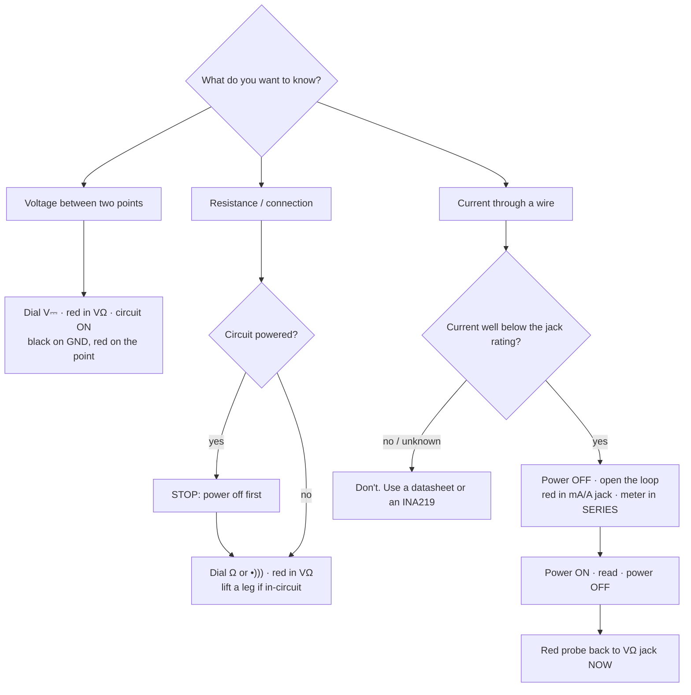

# FE.03 — Using a multimeter safely

<!-- glance:start -->
<!-- generated by tools/build.py from curriculum/syllabus.yaml — edit the syllabus, not this block -->

| | |
|---|---|
| **Track** | Optional foundation |
| **Difficulty** | Beginner |
| **Time** | 45 min |
| **Hardware** | Workbench tools (multimeter, soldering iron, crimper, screwdrivers) (stage 1) |
| **Software** | none |
| **Prerequisites** | [FE.02 Ohm's law, series and parallel, voltage dividers](FE.02-ohms-law-series-parallel.md) |
| **Skip if** | You measure voltage, current and continuity without blowing the meter's fuse. |

<!-- glance:end -->

## What you will learn

- Set up a digital multimeter correctly for DC voltage, resistance, continuity, diode test and DC current.
- Measure voltage *across* and current *through* a circuit without creating a short circuit.
- Explain why the current jack is the dangerous one, and check whether the meter's fuse is blown.
- Use continuity mode to find broken jumpers, wrong breadboard rows and shorts before power-on.
- Read a measurement critically: range, polarity, "OL", tolerance and the meter's own effect on the circuit.

## Why it matters

Robot hardware bugs are invisible. The Pico doesn't say "your GND wire is broken"; the motor just
doesn't move. The multimeter is your debugger for electrons: [01.03 Workbench](../../01-first-robot/01.03-workbench-and-tools.md)
uses it to check the first connections and polarity, [01.07](../../01-first-robot/01.07-power-system.md)
measures the buck converter's output *before* the Raspberry Pi is connected, and
[02.09 Systematic electrical debugging](../../02-robot-electronics/02.09-electrical-debugging-method.md)
is a whole method built on "measure, don't guess".

It is also the tool most likely to cause damage in beginner hands: one probe in the wrong jack across a
Li-ion pack is a dead short. Learn the rules once, here, with 3.3 V from a USB-powered Pico.

<!-- prereqs:start -->
## Prerequisites

You need these first:

- [FE.02 Ohm's law, series and parallel, voltage dividers](FE.02-ohms-law-series-parallel.md)

### Optional prerequisite links

None.

Check your readiness: `python course.py why FE.03`
<!-- prereqs:end -->

## Concept

A multimeter is three instruments in one box, and each one connects to the circuit differently:

- **Voltmeter** — a very high resistance (typically 10 MΩ) placed **across** two points. It "listens"
  without disturbing: almost no current flows through it. You can't hurt anything by measuring voltage
  in the voltage jack, within the meter's rating.
- **Ohmmeter** (and its cousins continuity and diode test) — the meter pushes a small current from its own
  battery and measures the resulting voltage. The circuit must be **unpowered**, otherwise the circuit's
  own voltage confuses the reading.
- **Ammeter** — an almost-zero resistance (a "shunt") that must be placed **in series**, so the current
  flows *through* the meter. You break the circuit open and let the meter close it.

In software terms: the voltmeter is a read-only observer, the ohmmeter is an active probe that must not
run against production, and the ammeter is a proxy you have to put *in the request path*. Put that proxy
*in parallel* with a power source — across the battery — and it becomes a near-zero-ohm short circuit.

> [!TIP]
> **Ask your teacher:** "Quiz me: describe a measurement, and I'll tell you the dial position, which jacks
> the probes go in, and where the probes touch."

## Technical explanation

### Level 1 — The front panel

```text
            ┌──────────────────────────────┐
            │   8.8.8.8     (display)      │
            │                              │
            │      ( rotary dial )         │
            │   V⎓  V~  Ω  •))) ⊳|  A⎓ mA  │
            │                              │
            │  [10A]   [COM]   [VΩmA]      │   ← jacks (names vary by model)
            └──────────────────────────────┘
               red      black    red
            (current   (always  (normal: volts,
             ≥ 200 mA)  here)    ohms, small mA)
```

| Symbol | Mode | Black probe | Red probe | Circuit state |
|---|---|---|---|---|
| V⎓ (V with straight line) | DC voltage | COM | VΩmA | powered |
| V~ | AC voltage (not used on robots; never mains in this course) | COM | VΩmA | — |
| Ω | resistance | COM | VΩmA | **unpowered** |
| •))) | continuity (beeps below a low resistance, often a few tens of Ω) | COM | VΩmA | **unpowered** |
| ⊳\| | diode test (shows forward voltage) | COM | VΩmA | **unpowered** |
| mA / µA ⎓ | small DC current | COM | VΩmA (or a separate mA jack) | powered, meter **in series** |
| A ⎓ | large DC current (up to ~10 A for a limited time) | COM | 10A | powered, meter **in series** |

The **COM** jack takes the black probe, always. The red probe's jack decides what the meter *is*.
Many meters have a separate, fused **mA** jack and a **10A** jack; check the markings next to each jack for
the fuse ratings and the maximum time (e.g. "10A MAX 10 s"). The UNI-T UT33A+ from the course tool list
(`tools`) is a typical example; your model's manual has the exact jack layout.

**Auto-ranging** meters choose the range themselves. Manual-ranging meters show "1" or "OL" (overload) when
the value exceeds the selected range: move the dial to the next higher range. On manual meters, start high.

### Level 2 — The four everyday measurements

**DC voltage** (the one you'll do 90 % of the time): dial to V⎓, black on GND, red on the point. A negative
sign means the probes are swapped — harmless, and useful: it tells you polarity.

Example on karmel: before the Pi ever touches the buck converter, measure its output: expect 5.0–5.2 V. A
reading of 12 V means the converter isn't regulating and would destroy the Pi ([01.07](../../01-first-robot/01.07-power-system.md)).

**Resistance**: power off, and take the component out of the circuit or lift one leg. In a circuit,
parallel paths are measured too. Resistors have a tolerance: a 10 kΩ ±5 % part may read anything from
**9.5 kΩ to 10.5 kΩ**; ±1 % → 9.9–10.1 kΩ. Your fingers on both probe tips add your body resistance in
parallel — noticeable above ~100 kΩ, so don't hold both ends.

**Continuity**: power off; the meter beeps when the two probes are connected through a low resistance. Use
it to verify a jumper wire end to end, find which breadboard holes are connected, check that GND on the Pico
really reaches GND on the sensor, and — most important — check that **+ and GND are *not* connected** on a
new board before you power it.

**Diode test**: the meter pushes a small current and displays the voltage. Across an LED (red probe on the
long leg), you'll see about 1.6–2.0 V for red, and the LED may glow faintly. Reversed: OL. This is how you
find an LED's polarity and whether it's dead.

### Level 3 — Current, burden voltage and the short-circuit trap

To measure current you must **open the loop** and insert the meter:

```text
  Voltage (parallel, safe)              Current (series, loop opened)

   3V3 ──[330 Ω]──┬──▶|── GND            3V3 ──[330 Ω]──(red  METER  black)──▶|── GND
                  │   LED                                 mA jack    COM
              red ┤                                           ▲
            METER │                                 the meter IS the wire here
            black ┴── GND
```

The meter's shunt isn't exactly zero ohms. The voltage it drops is called **burden voltage**, and it steals
from your circuit. Example: the LED circuit from [FE.01](FE.01-voltage-current-resistance-power.md)
(3.3 V, 330 Ω, red LED ≈ 2.0 V) should draw $1.3/330 ≈ 3.94$ mA. If the meter's mA range drops 0.1 V at that
current, the resistor only gets 1.2 V and you read $1.2/330 ≈ 3.64$ mA — 8 % low, because you measured. In
a low-voltage circuit, the error from burden voltage can be large; in a 12 V motor circuit it's small.

**The trap.** Leave the red probe in the **A** or **mA** jack after a current measurement, turn the dial to
volts (or forget to), and touch the probes across the battery. The meter is now a shunt of roughly
0.01–0.1 Ω across the pack. With karmel's 3S pack (12.6 V), pack internal resistance ≈ 0.1 Ω, a 10 A shunt
≈ 0.01 Ω and test leads ≈ 0.05 Ω:

$$I = \frac{12.6}{0.1 + 0.01 + 0.05} ≈ 79\ \text{A}$$

Best case: the meter's fuse blows instantly (that's what it's for). Worst case — a cheap meter with no fuse on
the 10 A range, or a fuse that can't break that current cleanly — the leads get hot, the probe tips arc,
cells are stressed, and you can be burned. On the mA range, the small fuse blows and the meter now reads 0 mA
for *every* future current measurement, which confuses beginners for days.

> [!CAUTION]
> **Safety — the three rules of current measurement:**
> 1. **Never** put the meter in a current range or current jack **across** a voltage source (battery, buck
>    converter output, USB 5 V, any two powered points). Current is measured only in series with a load.
> 2. After a current measurement, **move the red probe back to the VΩ jack immediately** — before you touch
>    anything else.
> 3. Never measure the battery's short-circuit current, a motor's stall current, or anything above the jack's
>    rating. Stall currents are read from datasheets or measured with a proper current sensor (INA219 in
>    [01.14](../../01-first-robot/01.14-battery-monitoring.md)).

### Level 4 — Measuring on a real robot

- **Probe tips slip.** On a Raspberry Pi 5 GPIO header, a probe sliding from pin 2 (5 V) onto pin 1 (3.3 V)
  or a GPIO pin can destroy the Pi. Put a female jumper wire on the pin and probe the jumper's metal end, or
  use hook clips.
- **Measure from the source toward the load.** Battery → after fuse → after switch → buck input → buck
  output → Pi 5 V pin. The first point where the reading is wrong brackets the fault. This is bisection, and
  [02.09](../../02-robot-electronics/02.09-electrical-debugging-method.md) builds the full method on it.
- **Measure voltage *drops*, not only voltages.** Put the probes on both ends of a wire or connector *while
  current flows*. A good connection drops a few millivolts; a bad crimp or thin jumper at 2 A can drop half a
  volt and heat up. This finds problems that continuity mode (which uses tiny current) misses.
- **Balance leads.** If your pack has a balance connector, black on its − pin and red on the others shows
  cumulative cell voltages: about 4.2, 8.4 and 12.6 V when full. Each cell should be within a few hundredths of
  a volt of the others ([FE.13](FE.13-batteries.md)).
- **Meter input resistance loads high-resistance circuits.** Most digital meters are 10 MΩ in DC volts, some
  cheap ones less. Measuring the middle of a 1 MΩ / 1 MΩ divider with a 10 MΩ meter reads about 5 % low.

### Checking the meter's fuse

On most meters: set the dial to Ω, plug a test lead into the **VΩ** jack, and touch its tip to the metal
contact inside the **mA** jack (then the **A** jack). A reading of a few ohms or less means the fuse is intact;
**OL** means it's blown (or that jack is unfused — check the manual). Replace fuses only with the exact type
and rating printed on the meter or in its manual — a fast-acting, high-breaking-capacity ceramic fuse, never
a glass car fuse or a piece of wire.

## Diagram



## Code

The meter needs something known to measure. This MicroPython script makes GP16 a controllable source so you
can practice with predictable values. Set up the Pico as in [01.05](../../01-first-robot/01.05-pico-microcontroller-setup.md)
(MicroPython firmware, `pip install mpremote` on your PC). Save as `fe03_meter_targets.py` and run
`mpremote run fe03_meter_targets.py`.

```python
# FE.03 - give your multimeter known things to measure (MicroPython, Pico 2).
# Wiring: GP16 -> 330 ohm resistor -> LED anode (long leg); LED cathode -> GND.
from machine import Pin
import time

out = Pin(16, Pin.OUT, value=0)

for state, seconds in ((1, 20), (0, 20), (1, 20)):
    out.value(state)
    if state:
        print("GP16 HIGH: measure ~3.3 V GP16->GND, ~1.8-2.2 V across a red LED, ~3-4 mA in series")
    else:
        print("GP16 LOW: measure ~0 V GP16->GND and 0 mA")
    for remaining in range(seconds, 0, -5):
        print("  ", remaining, "s left")
        time.sleep(5)

out.value(0)
print("done, GP16 low")
```

Pico 2 pins used: GP16 = physical pin 21, GND = pin 23 (or 38), 3V3 = pin 36, VBUS = pin 40.

## Exercise

All exercises use `tools` (multimeter, breadboard, jumpers, resistors, a red LED) and, where noted,
`robot-base` (Pico 2 + USB cable). Before starting, check the meter's fuse as described above.

### Exercise FE.03-E1 — Resistors and tolerance `[hardware]`

1. Read the color bands of five resistors from your kit (e.g. 330 Ω, 1 k, 10 k, 22 k, 100 k). Write down the
   nominal value and tolerance band.
2. Measure each out of circuit, without touching both leads with your fingers.
3. Then measure the 100 k while pinching both leads between your fingers. What changes?

### Exercise FE.03-E2 — Voltages on the Pico `[hardware]`

Hardware: `robot-base` + `tools`. Pico powered from USB, nothing else connected.

1. **Predict** each value, then measure between GND (pin 38) and: VBUS (pin 40), VSYS (pin 39), 3V3 (pin 36).
2. Swap the probes on 3V3. What does the display show?
3. Why is VSYS lower than VBUS? (Hint: [the Pico 2 datasheet](https://datasheets.raspberrypi.com/pico/pico-2-datasheet.pdf)
   "Powerchain" section.)

### Exercise FE.03-E3 — Continuity hunt `[hardware]`

Hardware: `tools`.

1. On an unpowered breadboard, find out with continuity mode which holes are connected: one row of five, across
   the center channel, along a power rail — and whether the rail is split in the middle.
2. Test ten jumper wires end to end. Put any that don't beep reliably (wiggle them!) in the trash.
3. Measure an LED in diode mode both ways.

### Exercise FE.03-E4 — Current in series, the safe way `[hardware]`

Hardware: `robot-base` + `tools`.

1. With USB unplugged, wire GP16 (pin 21) → 330 Ω → LED → GND. Run `fe03_meter_targets.py` and measure the
   voltage across the resistor and across the LED while GP16 is high. **Predict** the current from $V_R/330$.
2. Unplug USB. Open the loop between the LED cathode and GND. Red probe to the **mA** jack; dial to mA⎓; red probe
   on the LED cathode, black probe on GND.
3. Plug in USB, run the script again, read the current during a HIGH phase. Unplug USB.
4. **Move the red probe back to the VΩ jack.** Compare the measured current with your prediction.

### Exercise FE.03-E5 — Find the bug `[debugging]`

Hardware: none. For each report, say what went wrong and what to do:
(a) "The meter showed 0.00 mA for everything since yesterday, even for an LED that's clearly on."
(b) "Measuring resistance of a resistor on the robot's board gives 6.8 k, but it's marked 10 k."
(c) "I measured battery voltage with the red lead in the 10A jack and heard a pop."
(d) "Voltage reads −3.29 V."

## Expected result

**FE.03-E1:** each reading within the tolerance band (±5 % gold, ±1 % brown), e.g. 10 k → 9.5–10.5 k. Pinching
the 100 k lowers the reading noticeably (your body adds a parallel path, often hundreds of kΩ to a few MΩ —
typically a reading several % low or more, varying as you squeeze).

**FE.03-E2:** VBUS ≈ **4.9–5.2 V** (your PC's USB port); VSYS a few tenths of a volt lower, ≈ **4.6–4.9 V**,
because of the Schottky diode between VBUS and VSYS; 3V3 ≈ **3.26–3.34 V**. Swapped probes: **−3.3 V**
(the meter is fine; polarity reversed).

**FE.03-E3:** the five holes of each half-row (a–e, f–j) are connected; nothing connects across the center
channel; each rail is one long strip, but on many 830-point boards the rail is split halfway (a gap in the
printed line). Typically one or two jumpers in a cheap pack of 40 are intermittent. LED: ≈ **1.6–2.0 V** one
way (faint glow possible), **OL** the other way.

**FE.03-E4:** $V_R$ ≈ 1.1–1.4 V, $V_{LED}$ ≈ 1.8–2.1 V (sum ≈ 3.2–3.3 V; the GPIO pin itself drops a little at
this current). Predicted current ≈ **3.3–4.2 mA**; the meter reads within about 10 % of your prediction, usually
slightly lower (burden voltage). 0.00 mA means the loop is still open somewhere, or the mA fuse is blown.

**FE.03-E5:** (a) the mA fuse is blown — someone measured across a source in the mA range; check and replace the
fuse with the exact rating. (b) measured in-circuit: another path is in parallel (6.8 k is less than 10 k,
consistent with a parallel path); lift a leg and remeasure. (c) a short circuit through the 10 A shunt; disconnect,
check the fuse and leads for damage, inspect the battery and connector; next time follow the three rules.
(d) probes swapped (red on GND); the magnitude is correct.

## Troubleshooting

### Symptom: the meter reads a voltage that "can't be right"

1. Check the dial: V⎓ not V~ or mV. A DC voltage in AC mode reads near 0 or random.
2. Check the jacks: red in VΩ, black in COM.
3. Check the reference: is the black probe really on GND of *this* circuit? Different boards without a common
   ground give floating, meaningless readings ([FE.16](FE.16-grounding.md)).
4. Check the meter's battery: many meters read wrong (often high) with a weak battery, before showing a low-battery
   symbol. Measure a known source (the Pico's 3V3) as a sanity check.
5. Touching a floating, unconnected pin gives small drifting values (a few hundred mV). That's not a real
   voltage — the node is floating ([FE.06](FE.06-pull-up-pull-down.md)).

### Symptom: current reads 0 but the load clearly works

1. Is the meter actually in series? If the original wire is still there, all current bypasses the meter.
2. Is the red probe in the mA/A jack and the dial on a current range?
3. Test the fuse (Level 4 above). A blown mA fuse is the most common cause.

### Symptom: continuity beeps on a new board between + and GND

Don't power it. Check (a) that no large capacitor is charging (a beep that fades within a second is a capacitor
charging, not a short); (b) solder bridges and breadboard strips with two components' legs; (c) reversed parts.
Remove parts one at a time until the short disappears.

## Common mistakes

- **Leaving the red probe in the current jack.** The next voltage measurement becomes a short circuit. Make
  "red back to VΩ" a reflex.
- **Measuring resistance in a live circuit.** The circuit's voltage corrupts the reading and can damage the meter.
- **Holding both probe tips** while measuring high resistances — you are a parallel resistor.
- **Trusting continuity for power connections.** Continuity uses tiny currents; a bad crimp passes it and still
  drops volts at 2 A. Measure the voltage drop under load.
- **Probing crowded headers with bare tips.** A slipped probe shorts 5 V onto a 3.3 V pin. Use jumpers or clips.
- **Using the meter for mains.** Not in this course. Cheap meters' CAT ratings and fuses are not trustworthy
  for 230 V; certified chargers and supplies only.

## Knowledge check

1. Which jack does the red probe go in to measure the Pico's 3.3 V, and where do the probes touch?
   <details><summary>Answer</summary>

   Red in **VΩ** (voltage) jack, black in COM. Dial to DC volts. Black on a GND pin, red on the 3V3 pin — the
   meter is *across* the two points.
   </details>
2. Why must a circuit be unpowered for resistance and continuity measurements?
   <details><summary>Answer</summary>

   The meter measures resistance by driving its own small current and reading the voltage. The circuit's own
   voltage adds to or subtracts from that, so the reading is wrong, and the meter's low-voltage input can be
   damaged.
   </details>
3. Compute: a meter in the 10 A range (shunt 0.01 Ω, leads 0.05 Ω) is placed across a 12.6 V pack with 0.1 Ω
   internal resistance. What current flows (before the fuse blows)?
   <details><summary>Answer</summary>

   $12.6 / 0.16 ≈$ **79 A**. That's why you never measure current across a voltage source.
   </details>
4. Predict: you measure an LED's current in a 3.3 V circuit and get 3.6 mA; you calculated 3.9 mA. Your meter is
   calibrated. Name the effect.
   <details><summary>Answer</summary>

   **Burden voltage**: the meter's shunt drops some voltage (here about 0.1 V), which reduces the current while
   you measure. In low-voltage circuits this is a visible error.
   </details>
5. Debugging: the meter shows OL when you touch its lead from the VΩ jack to the inside of the mA jack in Ω mode.
   What does that mean?
   <details><summary>Answer</summary>

   The mA fuse is blown (or on some models that jack is unfused — check the manual). Replace with the exact
   fuse type and rating.
   </details>
6. You want to know if the robot's power connector is bad. Continuity beeps fine. What measurement do you do next?
   <details><summary>Answer</summary>

   Measure the **voltage drop across the connector** (probe both sides) while the robot draws real current,
   e.g. motors running with wheels in the air. More than ~0.1 V across a single connector means a poor contact.
   </details>
7. Why probe a jumper wire on a Pi header rather than the pins themselves?
   <details><summary>Answer</summary>

   The pins are 2.54 mm apart; a slipping probe can bridge 5 V to a 3.3 V GPIO pin and kill the Pi.
   </details>

## Practical challenge

Write a **power-on checklist** for karmel's power system and execute it on your breadboard stand-in (Pico on
USB + LED circuit), then on the real robot when you reach [01.07](../../01-first-robot/01.07-power-system.md):

- Before power: continuity + to GND on every rail must **not** beep; GND must beep between every board.
- First power, loads disconnected: measure each rail (battery, buck output, 3V3) against its expected range.
- With loads: measure each rail again, plus the voltage drop across the main connector and the fuse holder.
- Acceptance criteria: a written checklist with expected ranges and actual readings for every step, the meter's
  fuse checked before you start, no current measurement across any source, and at least one intentionally
  introduced fault (e.g. a pulled GND jumper) found by following the checklist rather than by memory.

## You can skip this if…

You answer questions 3, 5 and 6 correctly without looking, you routinely measure DC voltage, continuity and
in-series current, and you've never blown a meter fuse (or you know exactly why you did). Then:
`python course.py skip FE.03 --reason "I use a multimeter safely"`.

## Go deeper

- https://learn.sparkfun.com/tutorials/how-to-use-a-multimeter — SparkFun's illustrated guide, including measuring current and checking fuses.
- https://learn.adafruit.com/multimeters — Adafruit's multimeter guide with many photos of real probing situations.
- https://datasheets.raspberrypi.com/pico/pico-2-datasheet.pdf — what VBUS, VSYS and 3V3 are on the Pico 2 (Powerchain section).
- https://www.allaboutcircuits.com/textbook/ — *Lessons in Electric Circuits*, Vol. I, "Basic Concepts" and meter chapters, for how meters work inside.

## Progress checkpoint

- [ ] I can measure DC voltage, resistance, continuity and a diode's forward voltage.
- [ ] I can measure current in series and I move the red probe back afterwards without thinking.
- [ ] I can check my meter's fuse.
- [ ] I can use continuity and voltage-drop measurements to find wiring faults.

`python course.py complete FE.03` (exercises done) · `python course.py master FE.03` (challenge done) ·
`python course.py struggle FE.03 "what was hard"`.

Next: [FE.04 — Breadboards, jumpers and connectors](FE.04-breadboards-and-connectors.md).
