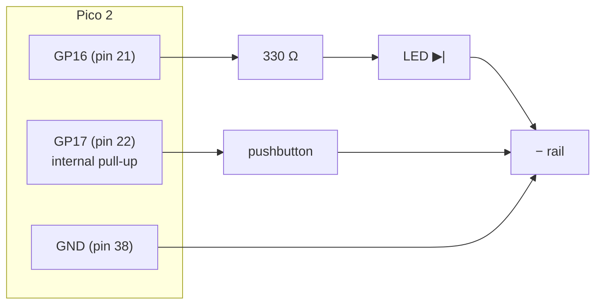

# FE.04 — Breadboards, jumpers and connectors

<!-- glance:start -->
<!-- generated by tools/build.py from curriculum/syllabus.yaml — edit the syllabus, not this block -->

| | |
|---|---|
| **Track** | Optional foundation |
| **Difficulty** | Beginner |
| **Time** | 40 min |
| **Hardware** | Workbench tools (multimeter, soldering iron, crimper, screwdrivers) (stage 1) |
| **Software** | none |
| **Prerequisites** | [FE.01 Voltage, current, resistance and power](FE.01-voltage-current-resistance-power.md) |
| **Skip if** | You prototype on breadboards and know common connector families. |

<!-- glance:end -->

## What you will learn

- Read a breadboard's hidden wiring (strips, center channel, split power rails) and place parts correctly.
- Mount the Pico 2 on a breadboard and wire power rails, an LED and a pushbutton from a pinout.
- Choose jumper types (male/female) and spot the broken or loose ones.
- Recognize the connector families on a small robot — pin headers, JST-XH/PH/SH, XT30/XT60, screw terminals, USB — and know what each is for.
- Know what a breadboard must never carry: battery and motor current.

## Why it matters

Every circuit in this course starts life on a breadboard: the LED and button experiments in
[FE.05](FE.05-digital-analog-gpio.md)–[FE.08](FE.08-adc.md), the first I²C sensor, the battery divider. A
breadboard is fast to change, but a single wire one row off produces bugs that look like software bugs.
Knowing its internal layout by heart saves hours.

Connectors matter the moment the robot moves: vibration shakes loose Dupont jumpers, a reversed unkeyed
battery plug destroys a board, and a thin connector on a motor line heats up. This lesson gives you the
vocabulary and the picture; [02.07 Connectors, crimping and a wiring harness](../../02-robot-electronics/02.07-wiring-harness.md)
turns it into a robot-grade harness, and [FE.17 Soldering](FE.17-soldering.md) makes permanent joints.

<!-- prereqs:start -->
## Prerequisites

You need these first:

- [FE.01 Voltage, current, resistance and power](FE.01-voltage-current-resistance-power.md)

### Optional prerequisite links

None.

Check your readiness: `python course.py why FE.04`
<!-- prereqs:end -->

## Concept

A solderless breadboard is a plastic block with rows of holes; under the holes are **metal spring clips**
that connect groups of holes together. You build a circuit by pushing component legs and wires into holes
that share a clip. No soldering, fully reversible.

Think of it as a patch panel. Each **strip** is one electrical node (one "net", in PCB terms): every hole in
the strip is the same point electrically. Your job is to put the right legs into the same nets and keep the
others apart. Most breadboard bugs are *net bugs*: two legs that should be in one net are in neighboring nets,
or two legs that should be separate share a strip.

Connectors are the same idea made robust: a defined, keyed, latched way to join nets between boards, cables
and the battery. On a robot, a good connector is one you can't plug in backwards and that can't fall out.

> [!TIP]
> **Ask your teacher:** "Describe a breadboard layout for an LED on GP16 and a button on GP17 hole by hole,
> then deliberately put one bug in it and let me find it."

## Technical explanation

### Level 1 — Inside an 830-point breadboard

```text
      +  -                                                           +  -     ← power rails (long strips)
      o  o   a b c d e       f g h i j                               o  o
      o  o   ─────────       ─────────   row 1   ← a–e connected;    o  o
      o  o   ─────────       ─────────   row 2      f–j connected;   o  o
      o  o   ─────────   ║   ─────────   row 3      nothing crosses  o  o
      o  o   ─────────   ║   ─────────   …          the channel ║    o  o
      :  :                                                           :  :
      o  o   ─────────       ─────────   row 30                      o  o
      ( possible split: on some boards the rail breaks here — check with continuity )
      o  o   ─────────       ─────────   row 31                      o  o
      :  :                                                           :  :
      o  o   ─────────       ─────────   row 63                      o  o
```

- **Terminal strips**: each numbered row has two groups of five holes, a–e and f–j. Everything in a–e of row
  12 is one node. Row 12 a–e and row 12 f–j are *not* connected: the **center channel** separates them.
- **The center channel** exists for chips and modules with two rows of pins: straddle it, and each pin gets
  its own strip. The Pico 2 is 0.7" (17.78 mm) between its pin rows, so it straddles the channel of a standard
  breadboard (pins in columns c and h) and leaves two free holes on each side.
- **Power rails**: long strips along both edges, marked + (red) and − (blue/black). Some boards split each
  rail in the middle; a gap in the printed red/blue line is the hint. [FE.03](FE.03-multimeter.md)-E3 checks
  it with continuity.
- **Pitch**: holes are 0.1" = **2.54 mm** apart, the same as standard pin headers.

Limits to respect:
- **Current**: spring contacts have tens of milliohms each and are made for signal-level currents. Keep
  breadboards to low-power circuits (logic, sensors, LEDs — rule of thumb: a few hundred mA at most). Motors,
  battery and the buck converter's 5 V output to the Pi never go through a breadboard.
- **Capacitance and long wires**: adjacent strips have a few pF between them, and jumpers are antennas. Fine for
  I²C at 100–400 kHz and UART; not for fast signals. The Pico 2 datasheet notes that RP2350's digital edges are
  very fast, so long, loose wires can ring — keep signal jumpers short and run a GND wire near them.
- **Wear**: fat legs (e.g. some potentiometers, DC jacks) spread the clips permanently; later thin legs in that
  row make intermittent contact.

### Level 2 — Jumpers and the Pico 2 on a breadboard

**Dupont jumpers** come in male–male (breadboard to breadboard), male–female (breadboard to a header pin) and
female–female (header pin to header pin, e.g. a sensor breakout to the Pi's GPIO). They're crimped 2.54 mm
contacts, thin wire (roughly 26–28 AWG) — fine for signals, and they fail silently: the crimp breaks inside the
housing. Test new packs with continuity and bin the flaky ones.

**Colors are documentation.** A convention used throughout the course: red = + supply (3.3 V or 5 V),
black = GND, yellow/orange/white = signals. On the robot: red/black heavy wire for the battery. Stick to it;
future-you debugging at midnight will read the colors before the pinout.

**Headers**: the Pico 2 needs 2.54 mm male pin headers soldered to its castellated edges to sit in a breadboard.
Buy it with headers pre-soldered or solder them ([FE.17](FE.17-soldering.md)).

Pico 2 pins used in this and the next lessons (the same layout as the original Pico; USB connector at the top,
pin 1 top-left):

| Physical pin | Name | Use in FE lessons |
|---|---|---|
| 1, 2 | GP0, GP1 | UART0 TX/RX loopback ([FE.09](FE.09-uart-i2c-spi.md)) |
| 6, 7 | GP4, GP5 | I2C0 SDA/SCL (`labs/config/karmel.yaml`) |
| 3, 8, 13, 18, 23, 28, 38 | GND | ground |
| 21, 22 | GP16, GP17 | LED, pushbutton |
| 31 | GP26 / ADC0 | potentiometer, battery divider |
| 33 | AGND | analog ground reference for GP26–GP28 (use it for potentiometer and divider grounds) |
| 36 | 3V3 (OUT) | 3.3 V supply for small circuits (keep under 300 mA per the datasheet) |
| 39 | VSYS | system input (1.8–5.5 V) |
| 40 | VBUS | USB 5 V |

### Level 3 — The parts you'll plug in

- **LED**: long leg = anode (+), short leg = cathode (−), flat edge on the rim = cathode side. It must straddle
  two *different* strips, with a resistor in series ([FE.02](FE.02-ohms-law-series-parallel.md)).
- **Resistor**: not polarized. Its two legs must be in different strips (both legs in one strip = shorted
  resistor that does nothing).
- **Tactile pushbutton (4 legs)**: the legs are internally connected in pairs; pressing connects the pairs.
  Place it **across the center channel**: then each pair lands in its own strip and the button switches between
  them. Placed along a strip, it's permanently shorted or never connects, depending on rotation. If unsure,
  check with continuity.
- **Potentiometer (3 legs)**: outer legs are the ends of the resistive track, the middle leg is the wiper.
  It's a variable voltage divider — [FE.05](FE.05-digital-analog-gpio.md) and [FE.08](FE.08-adc.md) use one.

### Level 4 — Connector families on a small robot

| Connector | Pitch / size | Typical use on karmel | Keyed? | Notes |
|---|---|---|---|---|
| 2.54 mm pin headers + Dupont | 2.54 mm | Pico, breakouts, motor-driver logic pins | no | fast to prototype; loosen under vibration; easy to plug one pin off |
| JST-XH | 2.5 mm | Li-ion/LiPo balance leads, small sensor/motor cables | yes | latching-ish friction lock; crimped |
| JST-PH | 2.0 mm | small batteries, many hobby modules | yes | smaller and weaker than XH |
| JST-SH 4-pin (Qwiic / STEMMA QT) | 1.0 mm | plug-and-play I²C: 3.3 V, GND, SDA, SCL | yes | VL53L1X and INA219 breakouts often have them; tiny, not for power |
| XT30 / XT60 | high-current bullets in a keyed housing | battery → fuse → switch → power distribution | yes | the "30"/"60" hint at the current class; solder them, don't crimp by hand |
| Screw terminals | 3.5 / 5.0 mm | motor outputs and power input on driver carriers, buck converters | no | use ferrules or tinned wire; re-tighten after vibration |
| USB micro-B / USB-C | — | Pico 2 (micro-B), Raspberry Pi 5 (USB-C power) | yes | Pi ↔ Pico serial link is a USB cable ([FE.09](FE.09-uart-i2c-spi.md)) |
| Motor encoder cable | usually 6-pin XH/PH | Yahboom 520 motor: M+, M−, encoder VCC, GND, A, B | yes | check the order printed on the motor PCB; colors are not standard |

Rules of thumb for choosing: **keyed** for anything with power, **latched** for anything on a moving robot,
**rated above** the worst-case current (stall current for motors — [FE.01](FE.01-voltage-current-resistance-power.md)),
and **different connector types for different voltages** so the 12 V battery can't plug into a 5 V input.

> [!CAUTION]
> **Safety:** Never plug a Li-ion pack, its balance lead, or the motor supply into a breadboard, and never
> build a breadboard circuit while the battery is connected to anything on it. Wire with power off (USB
> unplugged), check for shorts between + and GND with continuity, then power on. Unmated battery connectors
> must have their exposed contacts covered — XT connectors are designed so the battery side is the female,
> shrouded one.

## Diagram

Breadboard layout for the exercise. The Pico 2 sits in rows 1–20 with its left pins (1–20) in column c and its
right pins (40 down to 21) in column h, USB end at row 1. Only the rows you wire are shown:

```text
          left half  a b c d e      ║      f g h i j  right half
 row  3              · · ● · ·      ║      · · ● · ○   h = pin 38 GND  → j: black jumper → − rail
 row  5              · · ● · ·      ║      · · ● · ○   h = pin 36 3V3  → j: red jumper   → + rail
 row 19              · · ● · ·      ║      · · ● · ○   h = pin 22 GP17 → j: white jumper → row 30 g
 row 20              · · ● · ·      ║      · · ● · ○   h = pin 21 GP16 → j: yellow jumper → row 26 f
 ─────────────── end of the Pico 2 ─║──────────────────────────────────────────────────────
 row 26                             ║      ○ ● · · ·   f: yellow jumper; g: 330 Ω leg 1
 row 27                             ║      · ● ● · ·   g: 330 Ω leg 2;   h: LED anode (long leg)
 row 28                             ║      · · ● · ○   h: LED cathode;   j: black jumper → − rail
 row 30              · · · · ● ═════╬═════ ● ○ · · ·   e, f: button legs (across the channel); g: white jumper from GP17
 row 32              ○ · · · ● ═════╬═════ ● · · · ·   a: black jumper → − rail
```

● = component pin, ○ = jumper end. The button's legs across the channel are connected inside the button;
pressing connects row 30 to row 32.

| From | To | Wire color | Voltage |
|---|---|---|---|
| Pico pin 38 (GND) | breadboard − rail | black | 0 V |
| Pico pin 36 (3V3) | breadboard + rail | red | 3.3 V |
| Pico pin 21 (GP16) | 330 Ω resistor, leg 1 | yellow | 0 / 3.3 V |
| 330 Ω resistor, leg 2 | LED anode (long leg) | — (same strip) | ≈ 2 V when on |
| LED cathode (short leg) | − rail | black | 0 V |
| Pico pin 22 (GP17) | pushbutton, one side | white | 3.3 V idle, 0 V pressed |
| pushbutton, other side | − rail | black | 0 V |



## Code

A wiring check: the LED follows the button, and each press is counted. The internal pull-up and why a pressed
button reads 0 are explained in [FE.06](FE.06-pull-up-pull-down.md); for now, treat it as given. With the Pico
set up as in [01.05](../../01-first-robot/01.05-pico-microcontroller-setup.md), save as
`fe04_breadboard_check.py` and run `mpremote run fe04_breadboard_check.py` (Ctrl+C stops it).

```python
# FE.04 - breadboard wiring check (MicroPython, Pico 2).
# Wiring: GP16 -> 330 ohm -> LED -> GND rail.  Pushbutton between GP17 and the GND rail.
from machine import Pin
import time

led = Pin(16, Pin.OUT, value=0)
button = Pin(17, Pin.IN, Pin.PULL_UP)   # pressed = 0 (explained in FE.06)

presses = 0
last = button.value()
print("press the button; Ctrl+C to stop")
while True:
    now = button.value()
    led.value(1 if now == 0 else 0)      # LED on while pressed
    if last == 1 and now == 0:
        presses += 1
        print("press", presses)
    last = now
    time.sleep_ms(20)                    # 20 ms polling also hides most contact bounce
```

## Exercise

### Exercise FE.04-E1 — Map your breadboard `[hardware]`

Hardware: `tools` (breadboard, multimeter). No-hardware alternative: study the Level 1 drawing and answer
"which holes are connected to row 10, hole c?" for five holes of your choice.

With continuity mode, confirm: (1) a–e in one row are connected; (2) e and f in the same row are not;
(3) rows 10 and 11 are not; (4) whether each power rail runs the full length. Mark any split with a marker pen.

### Exercise FE.04-E2 — Pico, LED and button `[hardware]`

Hardware: `robot-base` (Pico 2 with headers, USB cable), `tools` (breadboard, jumpers, 330 Ω, LED, 4-leg
pushbutton, multimeter).

1. USB unplugged. Place the Pico 2 straddling the channel near one end. Wire the table above.
2. **Before plugging in USB**: continuity check between the + rail and − rail: no beep.
3. Plug in USB. Measure + rail to − rail: about 3.3 V.
4. Run `fe04_breadboard_check.py`. Press the button 5 times.
5. Rotate the button 90° in place (legs along the strips instead of across the channel) and run again. Record what
   happens, then put it back.

### Exercise FE.04-E3 — Find the four bugs `[debugging]`

Hardware: none. A student describes their layout. Find every bug and say what symptom each causes:

- "The Pico's GND pin 38 goes to the − rail on the left side of the board. The LED's cathode goes into the − rail
  on the right side, lower half."
- "GP16 goes to row 40 hole a; the 330 Ω resistor goes from row 40 hole b to row 40 hole e; the LED anode is in
  row 41."
- "The pushbutton sits in rows 50–51, columns c–d, not across the channel."
- "To save wires I pushed the battery's XT60 adapter leads into the + and − rails to test the motor driver."

### Exercise FE.04-E4 — Pick connectors `[predict]`

Hardware: none. For each connection on karmel, choose a connector family from the Level 4 table and justify it in
one line: (a) battery pack to power switch; (b) Pico I²C bus to the VL53L1X breakout; (c) motor wires to the
DRV8874 carrier; (d) motor encoder cable to the Pico board; (e) the Pico to the Raspberry Pi 5.

## Expected result

**FE.04-E1:** continuity beeps for (1), silence for (2) and (3). Rails: either continuous (beep from end to end)
or split near the middle (beep within each half only) — depends on the brand.

**FE.04-E2:** no beep between rails before power; **3.26–3.34 V** after. The LED lights only while the button is
pressed; the terminal prints `press 1` … `press 5` (an occasional double count is contact bounce, see
[FE.06](FE.06-pull-up-pull-down.md)). Rotated 90°, the button is either always "pressed" (LED stays on, one press
counted at start) or never works, depending on which leg pairs now share strips.

**FE.04-E3:**
1. If the rails are split (or the left and right rails aren't joined by a jumper), the LED's cathode isn't on the
   same GND net as the Pico → LED never lights. Fix: bridge the rails / halves with jumpers.
2. Resistor with both legs in row 40 (holes b and e are the same strip) → the resistor is shorted; worse, the LED
   anode in row 41 isn't connected to anything → LED dark. Fix: resistor from row 40 to row 41.
3. Button along the strips → shorted or never switching (see E2 step 5). Fix: straddle the channel.
4. Battery/motor supply into the breadboard → dangerous (high current through thin contacts, shorts to the Pico's
   3.3 V rail). Fix: never; power the driver from the battery harness ([01.07](../../01-first-robot/01.07-power-system.md)).

**FE.04-E4:** (a) **XT30 or XT60** — keyed, high-current, battery side shrouded; (b) **JST-SH Qwiic/STEMMA QT**
if the breakout has one, otherwise female Dupont on headers (glue or a latching housing on the robot); (c) the
carrier's **screw terminals** with ferrules or tinned wire (or solder); (d) the motor's own **keyed JST** cable,
mapped pin-by-pin to the Pico; (e) a **USB cable** (micro-B on the Pico 2) — power and the serial link in one keyed,
shielded connector.

## Troubleshooting

### Symptom: the circuit "should work" but nothing happens

Work from power toward the signal, measuring rather than looking:

1. Measure + rail to − rail near the parts (not near the Pico). 0 V → rail split or the rail jumper is missing.
2. Measure at each component leg: on the LED anode with GP16 high you expect ≈ 2 V; on the cathode ≈ 0 V.
   3.3 V on both ends of the LED = the cathode isn't reaching GND. 0 V on both = the signal isn't arriving.
3. Wiggle each jumper while watching the LED or the meter. Intermittent = broken jumper or worn clip; move to a
   different row.
4. Check the Pico's pin numbers against the silkscreen *on the underside* — it's easy to count from the wrong end.
   GP16 is physical pin 21, not "the 16th pin".

### Symptom: it works, then randomly doesn't

Loose contacts. Suspects in order: jumper crimps, component legs too thin for a worn row, the Pico header not fully
seated, a USB cable that's charge-only or loose. Push everything down firmly, replace suspect jumpers, and use rows
that haven't hosted fat legs.

## Common mistakes

- **Both legs of a part in one strip** — the part is bypassed. Every two-leg part spans two strips.
- **Assuming rails run the full length** — split rails are common. Check once, mark it.
- **Buttons along the strips** — place 4-leg buttons across the channel.
- **Counting Pico pins wrong** — GP numbers aren't physical pin numbers. Use the pinout table and the silkscreen.
- **Wiring with power on** — a stray jumper end touching 3V3 and GND browns out the Pico, or worse on a 5 V rail.
- **Trusting Dupont on a moving robot** — they vibrate loose. Prototype with them; drive with keyed, latching or
  soldered connections ([02.07](../../02-robot-electronics/02.07-wiring-harness.md)).

## Knowledge check

1. On a standard breadboard, are holes 17c and 17h connected? 17c and 18c?
   <details><summary>Answer</summary>

   Neither. 17c (a–e group) and 17h (f–j group) are separated by the center channel; 17c and 18c are different
   rows. 17a–17e are connected.
   </details>
2. Why does a Pico 2 or a DIP chip go *across* the center channel?
   <details><summary>Answer</summary>

   So each of its pins lands in its own strip. Placed along the strips, pins on the same row would be shorted
   together.
   </details>
3. Your 4-leg pushbutton "is always pressed". What's the most likely placement error?
   <details><summary>Answer</summary>

   It's rotated so two internally connected legs are in different strips *and* the switched pair shares one strip
   — i.e. the switch contacts are shorted by the strip. Rotate it 90° and straddle the channel.
   </details>
4. Why is it a bad idea to run the motor supply through a breadboard?
   <details><summary>Answer</summary>

   Motor currents reach amps (3–4 A stall on karmel's motors). The spring contacts and jumpers are made for small
   signal currents: they heat, add voltage drop and can melt; a slip shorts the battery onto the 3.3 V logic.
   </details>
5. Which connector family do Qwiic and STEMMA QT use, and what four signals does it carry?
   <details><summary>Answer</summary>

   JST-SH, 4-pin, 1.0 mm pitch: GND, 3.3 V, SDA, SCL — a plug-and-play I²C bus.
   </details>
6. Debugging: an LED circuit works only while you press on the jumper wire at GP16. What do you do?
   <details><summary>Answer</summary>

   Replace that jumper (broken crimp) and move the connection to a fresh row (worn clip). Confirm with continuity
   while wiggling.
   </details>

## Practical challenge

Build a reusable "Pico test bench" breadboard you'll use for FE.05–FE.09:

- Pico 2 straddling the channel; both rails fed from 3V3 and GND (joined across split rails and across both sides).
- Status LED + 330 Ω on GP16, pushbutton on GP17, 10 kΩ potentiometer with wiper on GP26 (ends to 3V3 and GND).
- A labeled pinout card taped next to the board: which physical pin is which GP number, and your wire colors.
- Acceptance criteria: continuity shows no + to − short with USB unplugged; `fe04_breadboard_check.py` counts 10
  presses correctly; your teacher removes one jumper while you're not looking and you find the fault in under five
  minutes with the meter, following the Troubleshooting procedure.

## You can skip this if…

You answer questions 1, 3 and 5 correctly without looking and you've already built breadboard circuits with a
microcontroller that worked the first time more often than not. Then:
`python course.py skip FE.04 --reason "I prototype on breadboards routinely"`.

## Go deeper

- https://learn.sparkfun.com/tutorials/how-to-use-a-breadboard — SparkFun's breadboard anatomy with photos of the internal clips.
- https://learn.sparkfun.com/tutorials/connector-basics — a tour of connector families, pitches and terminology.
- https://datasheets.raspberrypi.com/pico/pico-2-datasheet.pdf — Pico 2 pinout, mechanical dimensions and pin functions.
- https://docs.micropython.org/en/latest/rp2/quickref.html — MicroPython quick reference for the Pico (Pin basics used here).

## Progress checkpoint

- [ ] I can describe which holes of a breadboard are connected, including split rails.
- [ ] I can place LEDs, resistors, buttons and the Pico 2 correctly on a breadboard.
- [ ] I can find a loose or broken jumper systematically.
- [ ] I can name the connector families on a small robot and pick the right one for power, I²C and motors.

`python course.py complete FE.04` (exercises done) · `python course.py master FE.04` (challenge done) ·
`python course.py struggle FE.04 "what was hard"`.

Next: [FE.05 — Digital vs analog signals and GPIO](FE.05-digital-analog-gpio.md).
