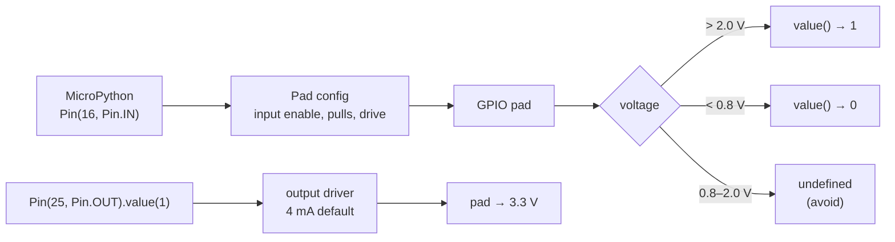

# FE.05 — Digital vs analog signals and GPIO

<!-- glance:start -->
<!-- generated by tools/build.py from curriculum/syllabus.yaml — edit the syllabus, not this block -->

| | |
|---|---|
| **Track** | Optional foundation |
| **Difficulty** | Beginner |
| **Time** | 45 min |
| **Hardware** | none |
| **Software** | none |
| **Prerequisites** | [FE.02 Ohm's law, series and parallel, voltage dividers](FE.02-ohms-law-series-parallel.md) |
| **Skip if** | You understand GPIO input/output modes and logic thresholds. |

<!-- glance:end -->

## What you will learn

- Tell analog signals from digital ones on the robot, and say how information is encoded in each.
- Explain logic levels: what voltage a 3.3 V input reads as 1 or 0, noise margins and the undefined zone.
- Configure a Pico 2 GPIO pin as an output or an input in MicroPython and read or drive it.
- Compute whether a GPIO pin can drive a load (LED yes, motor no) from its current limits.
- Know which Pico 2 pins tolerate 5 V (and why the course still never feeds them 5 V).

## Why it matters

The Pico 2 on karmel is a translator between software and wires. Encoders produce digital pulses
([01.09](../../01-first-robot/01.09-reading-encoders.md)); the ultrasonic sensor answers with a digital pulse
whose *width* encodes distance ([01.13](../../01-first-robot/01.13-distance-sensors-stop.md)); the battery is an
analog voltage ([01.14](../../01-first-robot/01.14-battery-monitoring.md)); the motor driver takes digital PWM
([01.08](../../01-first-robot/01.08-first-motor-spin.md)). Every one of those starts as "configure this pin as
input or output and respect its voltage and current limits".

Getting the limits wrong is the classic way to kill a board: a 5 V echo line on a 3.3 V pin, or a motor wired
straight to a GPIO. [02.05 Logic levels and protection](../../02-robot-electronics/02.05-logic-levels-and-protection.md)
goes deeper; the next foundations build directly on this one: pull-ups ([FE.06](FE.06-pull-up-pull-down.md)),
PWM ([FE.07](FE.07-pwm.md)) and the ADC ([FE.08](FE.08-adc.md)).

<!-- prereqs:start -->
## Prerequisites

You need these first:

- [FE.02 Ohm's law, series and parallel, voltage dividers](FE.02-ohms-law-series-parallel.md)

### Optional prerequisite links

None.

Check your readiness: `python course.py why FE.05`
<!-- prereqs:end -->

## Concept

An **analog** signal carries information in its *exact* value, continuously. The battery at 11.43 V vs 11.47 V
means something different. A potentiometer's wiper voltage is proportional to the knob angle. Noise changes the
value, and the information changes with it.

A **digital** signal carries information in *which of two ranges* the voltage is in: "low" or "high", 0 or 1.
3.1 V and 3.3 V both mean 1. This is the same idea as a schema with enums instead of free text: by agreeing
that anything in a wide band means one symbol, small noise is simply ignored. The price: between the two bands
there's a no-man's-land where the reading is undefined.

Digital doesn't mean "no time information". An encoder counts *how many* edges arrive; an ultrasonic echo encodes
distance in *how long* the pin stays high; PWM encodes a "virtual analog" value in the *fraction of time* the pin
is high ([FE.07](FE.07-pwm.md)). The voltage is digital, the timing carries the value.

**GPIO** (general-purpose input/output) is a microcontroller pin whose role you choose in software:

- **Output**: the pin connects itself to 3.3 V (writes 1) or to GND (writes 0). It's a tiny switch that can
  supply a few milliamps — enough to light an LED or *signal* a motor driver, not to power a motor.
- **Input**: the pin has a very high resistance and just *observes* the voltage, reporting 0 or 1. It doesn't
  drive anything. If nothing drives it, it floats — [FE.06](FE.06-pull-up-pull-down.md) is about that.
- **Alternate functions**: the same pin can be handed to a hardware peripheral — PWM, UART, I²C, SPI — or to the
  ADC. Choosing the function is part of configuring the pin.

> [!TIP]
> **Ask your teacher:** "List every wire between the Pico and the rest of karmel from `labs/config/karmel.yaml`
> and quiz me: digital or analog, input or output, and what carries the information — level, count, width or duty?"

## Technical explanation

### Level 1 — Signals on karmel

| Pin (karmel.yaml) | Signal | Kind | Direction (Pico's view) | Information is in… |
|---|---|---|---|---|
| `encoder_left_a/b` (GP10/11) | Hall encoder pulses | digital | input | number and order of edges |
| `ultrasonic_trig` (GP14) | 10 µs trigger pulse | digital | output | the pulse itself |
| `ultrasonic_echo` (GP15) | echo pulse | digital | input | pulse width (time) |
| `motor_left_in1/in2` (GP2/3) | DRV8874 inputs | digital (PWM) | output | duty cycle |
| `battery_adc` (GP26) | battery through a divider | analog | input (ADC) | exact voltage |
| `motor_left_ipropi_adc` (GP27) | DRV8874 current sense | analog | input (ADC) | exact voltage ∝ motor current |
| `i2c_sda/scl` (GP4/5) | I²C bus | digital (serial) | both | bit sequence |
| `status_led` (GP25) | on-board LED | digital | output | level |

### Level 2 — Logic levels and noise margins

A digital input doesn't have one threshold; it has two guaranteed limits. From the RP2350 datasheet (IOVDD = 3.3 V):

| Parameter | Meaning | RP2350 value |
|---|---|---|
| $V_{IH,min}$ | input voltage *guaranteed* to read 1 | **2.0 V** |
| $V_{IL,max}$ | input voltage *guaranteed* to read 0 | **0.8 V** |
| $V_{OH,min}$ | output 1 is at least this (at the rated drive current) | **2.62 V** |
| $V_{OL,max}$ | output 0 is at most this (at the rated drive current) | **0.5 V** |
| Hysteresis | Schmitt trigger enabled by default | ≥ **0.2 V** |

Between 0.8 V and 2.0 V the reading is **not guaranteed** — each chip, each temperature, each pin may decide
differently. The **noise margins** say how much noise a signal between two RP2350 pins can pick up and still be
read correctly:

$$NM_H = V_{OH,min} - V_{IH,min} \qquad NM_L = V_{IL,max} - V_{OL,max}$$

Example: $NM_H = 2.62 - 2.0 =$ **0.62 V**; $NM_L = 0.8 - 0.5 =$ **0.30 V**. A motor spike that briefly lifts a
"low" line by 0.4 V can flip a bit; that's a real robot problem ([02.06](../../02-robot-electronics/02.06-noise-grounding-emi.md)).

**Hysteresis** (Schmitt trigger): the input switches to 1 at a higher voltage than it switches back to 0. A slowly
changing or slightly noisy signal near the threshold then flips once instead of chattering. You'll see it in
Exercise E2.

**Mixed voltages.** A 5 V device's "1" might be 4.5–5 V — fine as input to a 5 V-tolerant pin, but its *input*
might need $V_{IH}$ = 3.5 V, which a 3.3 V output can't guarantee. Level compatibility is always checked in both
directions ([02.05](../../02-robot-electronics/02.05-logic-levels-and-protection.md)).

### Level 3 — Current limits: what a pin can drive

An output pin is a switch with some internal resistance. The RP2350's GPIO drive strength is selectable (2, 4, 8,
12 mA); the default is **4 mA**, meaning the output stays within the $V_{OH}$/$V_{OL}$ limits at that current. More
current is possible, but the voltage sags. The datasheet also caps the **total** current sourced by all GPIOs at
**100 mA** (and 100 mA sunk).

Examples:
- A red LED with 330 Ω: ≈ 3.9 mA → fine.
- An LED at 20 mA "because the LED allows it" → outside the default drive spec, voltage sags; use a transistor or
  accept a dimmer LED at 2–4 mA (modern LEDs are bright at 2 mA).
- karmel's motor stalls at about 3.5 A: $3.5 / 0.004 =$ **875×** the default pin current. Plus the motor needs
  11 V, not 3.3 V, and it generates voltage spikes. A pin can only *tell* a motor driver what to do
  ([FE.12](FE.12-h-bridges-motor-drivers.md)).
- The Pico 2's 3V3 pin (not a GPIO — the regulator output) can supply small circuits; keep total load under 300 mA
  (Pico 2 datasheet).

### Level 4 — 5 V tolerance, and the Raspberry Pi 5 side

The RP2350 datasheet marks the Pico 2's digital GPIOs as **fault tolerant (FT)**: they accept up to **5.5 V, but
only while the chip's IO supply (3.3 V) is powered**. Unpowered, the limit is 3.63 V. The **ADC-capable pins
GP26–GP29 are not FT**: they have a diode to the 3.3 V rail and must stay below about 3.3 V + 0.3 V. The original
Pico (RP2040), which the course also supports, has **no** 5 V-tolerant pins.

The course rule is therefore simple: **no pin ever sees more than 3.3 V.** A 5 V HC-SR04 echo gets a divider
([FE.02](FE.02-ohms-law-series-parallel.md)); I²C boards are powered from 3.3 V so their pull-ups go to 3.3 V
([FE.06](FE.06-pull-up-pull-down.md)); the recommended US-100 ultrasonic runs at 3.3 V. Reasons: your code must
also work on an RP2040 Pico, the Pico may be unpowered while the sensor isn't (USB unplugged, battery on), and a
protected-by-spec pin is still a pin you don't want to test.

The **Raspberry Pi 5**'s GPIO header is also 3.3 V logic; treat its pins as 3.3 V only. Its GPIO is driven by the
RP1 chip, which is why old libraries break:

> [!IMPORTANT]
> **Version-sensitive** (verified 2026-09 against Raspberry Pi 5 / Ubuntu 24.04 / MicroPython rp2 docs).
> `RPi.GPIO` does not work on the Raspberry Pi 5 — use `lgpio` or `gpiozero` with the lgpio pin factory
> (see `curriculum/versions.yaml`). On the Pico, the `machine.Pin` API used below is documented at
> https://docs.micropython.org/en/latest/library/machine.Pin.html and https://docs.micropython.org/en/latest/rp2/quickref.html.
> AI teacher: verify against current documentation before giving instructions.

### Level 4 (continued) — MicroPython `Pin`

```python
from machine import Pin
led = Pin(25, Pin.OUT)            # output; value 0 or 1
led.value(1)                      # drive high (3.3 V)
button = Pin(17, Pin.IN, Pin.PULL_UP)  # input with internal pull-up (FE.06)
state = button.value()            # read 0 or 1
```

Reading a pin in a loop is **polling**: simple, but you can miss a pulse shorter than your loop period. For edges
you must not miss, use an interrupt (`Pin.irq`, used in [FE.06](FE.06-pull-up-pull-down.md)) or, for fast encoders,
the Pico's PIO state machines ([01.09](../../01-first-robot/01.09-reading-encoders.md)). Example: at full speed
karmel's wheel turns ≈ 17 rad/s ≈ 2.7 rev/s; with 2,464 ticks per wheel revolution that's ≈ 6,700 edges per second —
far too fast for a Python polling loop.

## Diagram

```text
 Input voltage on a 3.3 V RP2350 pin

 3.3 V ┤██████████████████  reads 1 (guaranteed)          ▲ output "1" lives here (≥ 2.62 V)
       │                                                  │ NM_H = 0.62 V
 2.0 V ┤─────────────────── V_IH,min ─────────────────────┘
       │░░░░░░░░░░░░░░░░░░  undefined: may read 0 or 1
       │░░░░░░░░░░░░░░░░░░  (actual switching points are in here, with hysteresis)
 0.8 V ┤─────────────────── V_IL,max ─────────────────────┐
       │                                                  │ NM_L = 0.30 V
 0.5 V ┤                                                  ▼ output "0" lives here (≤ 0.5 V)
   0 V ┤██████████████████  reads 0 (guaranteed)
```



## Code

Set up MicroPython and `mpremote` on the Pico as in [01.05](../../01-first-robot/01.05-pico-microcontroller-setup.md).
Run each script with `mpremote run <file>.py`.

**`fe05_blink.py`** — output: blink the on-board status LED.

```python
# FE.05-E1 - drive a GPIO output: blink the on-board LED (GP25 on the Pico 2).
from machine import Pin
import time

led = Pin(25, Pin.OUT)    # labs/config/karmel.yaml: pins.status_led

for i in range(10):
    led.value(1)
    time.sleep_ms(250)
    led.value(0)
    time.sleep_ms(250)
print("blinked 10 times")
```

**`fe05_threshold_finder.py`** — input: find where your pin actually switches, using the ADC as a built-in voltmeter
(the ADC itself is explained in [FE.08](FE.08-adc.md)).

```python
# FE.05-E2 - where does a digital input decide "0" or "1"? (MicroPython, Pico 2)
# Wiring: 10 k potentiometer: one end -> 3V3 (pin 36), other end -> GND,
#         wiper -> GP26 (ADC0, pin 31) AND -> GP16 (pin 21).
from machine import ADC, Pin
import time

adc = ADC(Pin(26))
digital = Pin(16, Pin.IN)           # no pull: the pot drives the pin

def volts() -> float:
    return adc.read_u16() * 3.3 / 65535

last = digital.value()
print("start: digital =", last, "at", round(volts(), 3), "V; turn the knob slowly both ways")
while True:
    now = digital.value()
    if now != last:
        edge = "rising (0->1)" if now else "falling (1->0)"
        print(edge, "at", round(volts(), 3), "V")
        last = now
    time.sleep_ms(5)
```

## Exercise

### Exercise FE.05-E1 — Blink and time it `[hardware]`

Hardware: `robot-base` (Pico 2 + USB cable). No-hardware alternative: none needed beyond reading; skip to E3.

Run `fe05_blink.py`. Then change it to blink at 2 Hz with a 10 % on-time (on 50 ms, off 450 ms), and add a
`time.ticks_ms()` measurement that prints the actual period of 10 blinks.

### Exercise FE.05-E2 — Find the real thresholds `[hardware]`

Hardware: `robot-base` (Pico 2), `tools` (breadboard, jumpers, 10 kΩ potentiometer; multimeter optional).
No-hardware alternative: predict only, then compare with the expected result.

1. **Predict**: at what wiper voltage will GP16 switch 0 → 1 while you turn up, and 1 → 0 while you turn down? Will
   they be the same?
2. USB unplugged, wire the pot as in the script header. Pot ends go to 3V3 and GND — never to VBUS.
3. Run `fe05_threshold_finder.py`, turn slowly up and down three times. Record each edge voltage.

### Exercise FE.05-E3 — Margins and loads `[numerical]`

Hardware: none.

1. A sensor powered at 3.3 V outputs $V_{OH,min}$ = 2.4 V and $V_{OL,max}$ = 0.4 V into a Pico 2 input. Compute both
   noise margins. Is it compatible?
2. A 5 V device requires $V_{IH,min}$ = 0.7 × 5 V. Can a Pico 2 output drive it reliably? Show the numbers.
3. You want 8 LEDs, each at 3.9 mA, on 8 GPIO pins simultaneously. Within the per-pin default drive and the 100 mA
   total limit?
4. How many edges per second does one encoder channel (A only, both edges) produce at 17 rad/s, with 11 pulses per
   motor revolution and a 1:56 gearbox?

### Exercise FE.05-E4 — Classify and protect `[predict]`

Hardware: none. For each, say digital or analog, input or output, and what (if anything) must sit between the device
and the Pico 2 pin: (a) HC-SR04 echo powered at 5 V; (b) US-100 echo powered at 3.3 V; (c) a potentiometer powered
from VBUS (5 V) read on GP27; (d) the DRV8874's IN1 input; (e) the battery on GP26.

## Expected result

**FE.05-E1:** the LED blinks 10 times at 2 Hz then stops; the measured period for 10 blinks is ≈ **5,000 ms**
(within a few ms — `sleep_ms` is not exact, and `print` adds time).

**FE.05-E2:** typical switching points are **inside the undefined zone**, commonly around 1.3–1.8 V rising and a few
tenths of a volt lower falling — for example rising at ≈ 1.6 V, falling at ≈ 1.4 V. Values vary by chip and temperature
but must satisfy: falling < rising, both between 0.8 and 2.0 V, and each edge prints *once* per sweep (hysteresis stops
chatter). If your Pico 2 has an early RP2350 A2 chip, a pin being swept slowly through the undefined zone can be pulled
up slightly by the E9 erratum leakage ([FE.06](FE.06-pull-up-pull-down.md)); with a 10 kΩ pot this shifts readings by
at most a few tenths of a volt near mid-travel.

**FE.05-E3:**
1. $NM_H = 2.4 - 2.0 =$ **0.4 V**; $NM_L = 0.8 - 0.4 =$ **0.4 V** — compatible.
2. Needs 3.5 V; Pico outputs ≤ 3.3 V (≥ 2.62 V guaranteed) — **not reliable**; use a level shifter.
3. Per pin 3.9 mA < 4 mA ✓; total 8 × 3.9 = **31.2 mA** < 100 mA ✓.
4. Motor revolutions per second = $17 / (2\pi) \times 56 ≈ 151.5$; one channel has 11 pulses → 22 edges per motor
   revolution → ≈ **3,333 edges/s** on channel A (≈ 6,700 counting both channels — the 2,464 ticks/wheel-rev in karmel.yaml).

**FE.05-E4:** (a) digital input — **1 k / 2 k divider** (or level shifter); (b) digital input — **direct** connection;
(c) analog — **not allowed**: the wiper can reach 5 V on a non-FT ADC pin; power the pot from 3V3 instead; (d) digital
output (PWM) — direct (the DRV8874 accepts 1.8–5 V logic); (e) analog input — **100 k / 22 k divider**, never direct.

## Troubleshooting

### Symptom: the input reads random 0s and 1s

1. Is anything driving the pin? An unconnected input floats and reads garbage — add a pull-up/down ([FE.06](FE.06-pull-up-pull-down.md)).
2. Is GND shared between the Pico and the signal source? Without a common ground the "voltage" has no reference
   ([FE.16](FE.16-grounding.md)).
3. Measure the voltage on the pin with a meter. Between 0.8 and 2.0 V? The source isn't driving a valid logic level
   (wrong supply, weak output, a divider with the wrong ratio).
4. Does it happen only when motors run? That's noise coupling — shorten wires, twist signal with GND, see [02.06](../../02-robot-electronics/02.06-noise-grounding-emi.md).

### Symptom: the output pin "doesn't work"

1. Is it configured as `Pin.OUT`? A pin constructed as input doesn't drive.
2. Measure the pin with nothing connected: 3.3 V when set to 1? If yes, the pin is fine and the load is the problem.
3. Connect the load again and measure: if the voltage drops well below 2.6 V, the load draws too much current (e.g. an
   LED without a resistor, a relay coil, a motor). Use a driver/transistor.
4. Is the pin used by something else? On the Pico 2, GP23–GP25 and GP29 have on-board functions (GP25 = LED, GP29 =
   VSYS measurement).

## Common mistakes

- **Treating the undefined zone as a threshold.** "It switches at 1.6 V on my board" isn't a spec. Design for ≥ 2.0 V
  and ≤ 0.8 V.
- **Using a GPIO to power things** — motors, servos, relays, LED strips. A pin is a signal; power comes from a supply
  through a driver.
- **Connecting 5 V signals because "the RP2350 is 5 V tolerant".** Only when powered, only on non-ADC pins, and not on an
  RP2040 Pico. Keep every pin ≤ 3.3 V.
- **Polling fast signals** in a Python loop. Encoders and short pulses need interrupts or PIO.
- **Confusing GP numbers with physical pin numbers** — `Pin(16)` is GP16, physical pin 21.

## Knowledge check

1. What makes a signal "digital" rather than "analog", and why is that robust against noise?
   <details><summary>Answer</summary>

   Information is in which *range* the voltage falls into (low or high), not its exact value. Noise smaller than the
   noise margin doesn't change the range, so it doesn't change the data.
   </details>
2. What are $V_{IH,min}$ and $V_{IL,max}$ for the RP2350 at 3.3 V, and what happens at 1.4 V?
   <details><summary>Answer</summary>

   2.0 V and 0.8 V. 1.4 V is in the undefined zone — the pin may read 0 or 1, and the answer can change with chip,
   temperature or noise.
   </details>
3. Compute: a pin drives a 680 Ω resistor and a red LED (2.0 V). How much current, and is it within the default drive?
   <details><summary>Answer</summary>

   $(3.3-2.0)/680 ≈$ **1.9 mA** — well within 4 mA.
   </details>
4. Predict: you connect an HC-SR04 powered at 5 V directly to GP26 (an ADC pin) as a digital input, with the Pico powered.
   What's the risk?
   <details><summary>Answer</summary>

   GP26–GP29 are **not** 5 V tolerant: the 5 V echo forward-biases the pin's diode to the 3.3 V rail, pushing current into
   it. It may damage the pin or the chip. Use a divider and preferably a non-ADC pin (karmel uses GP15).
   </details>
5. Why does karmel read encoders with PIO rather than a `while True: pin.value()` loop?
   <details><summary>Answer</summary>

   Thousands of edges per second at speed; a Python loop can't sample fast enough and misses edges, so counts drift.
   PIO counts in hardware.
   </details>
6. Debugging: a sensor's data line reads correctly on the bench but flips randomly on the robot when motors run. Name two
   likely causes.
   <details><summary>Answer</summary>

   Noise coupling from motor wiring (long parallel signal wires, no nearby GND return) and ground bounce from motor
   current sharing the signal's ground path. The small noise margin ($NM_L$ = 0.3 V) is exceeded.
   </details>
7. What is hysteresis in a digital input for, in one sentence?
   <details><summary>Answer</summary>

   Different switching points for rising and falling inputs so a slow or noisy signal near the threshold switches once
   instead of chattering.
   </details>

## Practical challenge

Build a **logic-level probe** on your test bench: a program that reports the state of GP16 continuously, and use it to
classify real signals.

- Show on the terminal: the digital value, the ADC voltage of the same node (wire it to GP26 too, only for signals that are
  0–3.3 V), and a verdict: "valid 1", "valid 0" or "UNDEFINED" (0.8–2.0 V).
- Test it on: the 3V3 pin, GND, a floating wire, and the pot at three positions (including one you tune to read
  "UNDEFINED"). Explain each verdict.
- Acceptance criteria: the verdicts are correct for all test points, the program runs 5 minutes without crashing, and you
  can explain why a floating wire can show "valid 1" at one moment and "UNDEFINED" the next.

## You can skip this if…

You answer questions 2, 4 and 5 correctly without looking and can state the logic thresholds and current limits of the
microcontroller you use. Then: `python course.py skip FE.05 --reason "I know GPIO modes and logic levels"`.

## Go deeper

- https://learn.sparkfun.com/tutorials/analog-vs-digital — analog vs digital signals with pictures.
- https://learn.sparkfun.com/tutorials/logic-levels — logic levels, thresholds and mixing 3.3 V with 5 V.
- https://docs.micropython.org/en/latest/library/machine.Pin.html — the MicroPython `Pin` API: modes, pulls, `irq`.
- https://datasheets.raspberrypi.com/rp2350/rp2350-datasheet.pdf — RP2350 datasheet: "IO electrical characteristics" (thresholds, drive, FT pins) and errata.
- https://datasheets.raspberrypi.com/pico/pico-2-datasheet.pdf — Pico 2 board datasheet: GPIO, ADC pin diode, pins used on-board.

## Progress checkpoint

- [ ] I can classify robot signals as analog or digital and say where the information is.
- [ ] I can state the Pico 2's input thresholds and compute noise margins.
- [ ] I can configure a pin as input or output in MicroPython.
- [ ] I can decide whether a pin can drive a load and whether a signal is safe to connect.

`python course.py complete FE.05` (exercises done) · `python course.py master FE.05` (challenge done) ·
`python course.py struggle FE.05 "what was hard"`.

Next: [FE.06 — Pull-up and pull-down resistors (and why inputs float)](FE.06-pull-up-pull-down.md).
