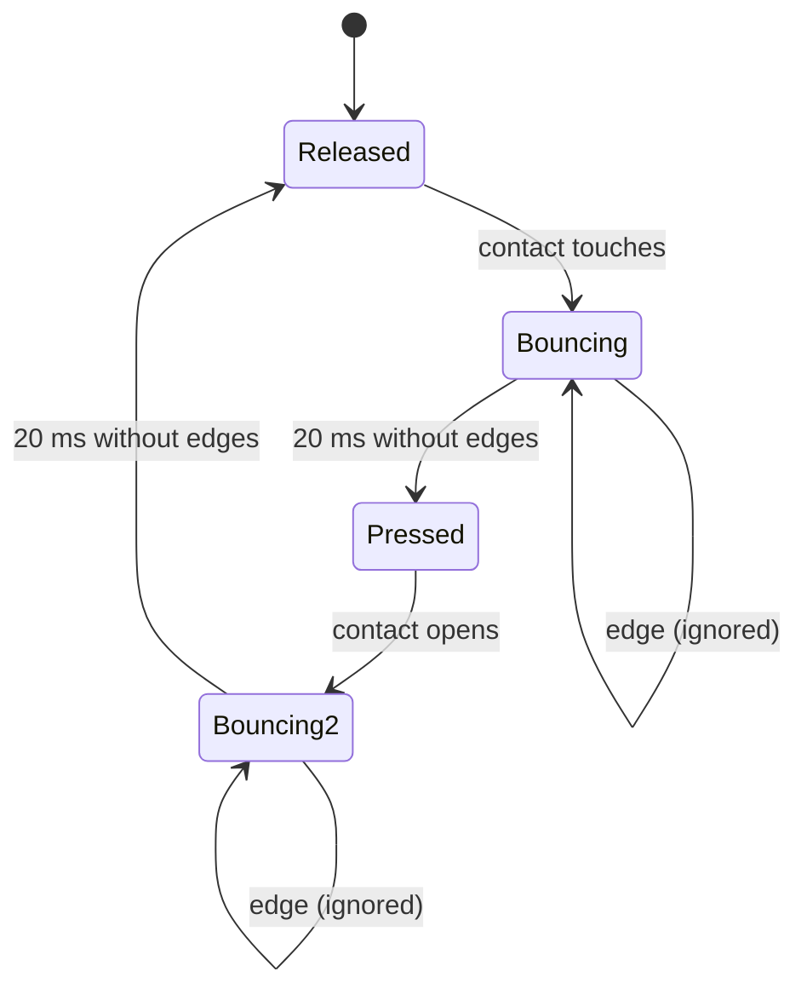

# FE.06 — Pull-up and pull-down resistors (and why inputs float)

<!-- glance:start -->
<!-- generated by tools/build.py from curriculum/syllabus.yaml — edit the syllabus, not this block -->

| | |
|---|---|
| **Track** | Optional foundation |
| **Difficulty** | Beginner |
| **Time** | 35 min |
| **Hardware** | none |
| **Software** | none |
| **Prerequisites** | [FE.05 Digital vs analog signals and GPIO](FE.05-digital-analog-gpio.md) |
| **Skip if** | You know when inputs float and how open-drain buses work. |

<!-- glance:end -->

## What you will learn

- Explain why an unconnected input reads garbage, and demonstrate it on a Pico 2.
- Wire a pushbutton with a pull-up or pull-down and read it as active-low or active-high.
- Choose a pull-up value from current, speed and noise, including the I²C rise-time calculation.
- Explain open-drain outputs, why an I²C bus needs pull-ups, and how several boards' pull-ups combine.
- Work around the RP2350-E9 pull-down erratum on early Pico 2 boards, and handle button bounce.

## Why it matters

A digital input only reports what drives it. Buttons, bumper switches, many Hall-effect encoder outputs and every
I²C line *don't* drive both levels — they only pull toward GND and let go. Without a resistor to define the other
level, the input floats and the robot sees phantom encoder ticks or a bus that works on Tuesdays.

[01.09 Reading encoders](../../01-first-robot/01.09-reading-encoders.md) enables pull-ups for the encoder lines,
[02.04 Buses in practice](../../02-robot-electronics/02.04-buses-i2c-spi-uart.md) scans karmel's I²C bus
(VL53L1X + INA219 on GP4/GP5) and picks pull-up values, and [FE.09](FE.09-uart-i2c-spi.md) builds I²C on the
open-drain idea taught here.

<!-- prereqs:start -->
## Prerequisites

You need these first:

- [FE.05 Digital vs analog signals and GPIO](FE.05-digital-analog-gpio.md)

### Optional prerequisite links

None.

Check your readiness: `python course.py why FE.06`
<!-- prereqs:end -->

## Concept

An input pin is like a voltmeter with enormous resistance: it senses voltage but doesn't hold the wire to any
value. Connect it to nothing and the wire is an antenna. Its voltage wanders with static charge on your fingers,
mains hum in the room, the neighboring signal. The input then reports 0, 1, or alternates — a **floating input**.

A switch doesn't fix this by itself. A button between the pin and GND gives a solid 0 when pressed — and floating
when released, because "open switch" means "not connected".

A **pull-up resistor** from the pin to 3.3 V gives the wire a *default*: when nothing else drives it, the resistor
gently pulls it to 1. When the button closes to GND, the button wins (it's a near-zero resistance against the
resistor's thousands of ohms) and the pin reads 0. A **pull-down** is the mirror: resistor to GND, button to 3.3 V.

It's the electrical version of a default value: `state = pressed ?? RELEASED`. The resistor is weak enough to be
overridden, strong enough to define the level against noise.

**Open-drain** outputs use the same idea on purpose. The output can only *pull low* or *let go*; a pull-up provides
the high. Many open-drain outputs can share one wire: if any device pulls low, the line is low; if all let go, it's
high. No two outputs ever fight (one driving 3.3 V while another drives 0 V would be a short). I²C is built on this.

> [!TIP]
> **Ask your teacher:** "Explain open-drain with a distributed-systems analogy — a shared flag any node can clear but
> only a default can set — and then show me where the analogy fails."

## Technical explanation

### Level 1 — Active-low and active-high

| Wiring | Released | Pressed | Name |
|---|---|---|---|
| pull-up to 3.3 V, button to GND | 1 | 0 | **active-low** (the course default) |
| pull-down to GND, button to 3.3 V | 0 | 1 | active-high |

Active-low is the norm in embedded systems: the button connects to GND (always nearby), a short to GND is harmless,
and pull-ups are the reliable internal option on the Pico 2 (see Level 4). In code, name the meaning:
`pressed = button.value() == 0`.

### Level 2 — Choosing the value: current vs noise vs speed

**Current when active.** With the button pressed, the pull-up has 3.3 V across it:

$$I = \frac{3.3}{R_{pull}}$$

Example: 10 kΩ → **0.33 mA**; the RP2350's internal pull-up (datasheet: 32–86 kΩ) → **103 µA … 38 µA**. On a
battery robot these are negligible; on a coin-cell sensor they aren't.

**Noise.** A weaker pull-up (larger R) is easier for induced noise to overcome. Internal pull-ups (~50 kΩ) are fine
for a button on the breadboard; a bumper switch at the end of a 40 cm cable next to motor wires deserves an external
4.7–10 kΩ.

**Speed.** Every wire and input has capacitance $C$. When the line is released, the pull-up charges that capacitance
— an RC curve, not a clean step. The time constant is $\tau = RC$.

Example: 10 kΩ and 100 pF of cable + inputs → $\tau$ = 1 µs; the 10–90 % rise takes ≈ $2.2\tau$ = 2.2 µs. For a button,
irrelevant. For a 400 kHz I²C bus (bit period 2.5 µs), decisive.

### Level 3 — Sizing I²C pull-ups

The I²C specification limits the **rise time** $t_r$ (from 30 % to 70 % of VCC) and the bus capacitance (≤ 400 pF).
TI's application note SLVA689 derives the bounds:

$$t_r = 0.8473 \cdot R_p \cdot C_b \quad\Rightarrow\quad R_{p,max} = \frac{t_r}{0.8473 \cdot C_b}$$

$$R_{p,min} = \frac{V_{CC} - V_{OL,max}}{I_{OL}}$$

with standard mode (100 kHz) $t_r$ ≤ 1000 ns, fast mode (400 kHz) $t_r$ ≤ 300 ns, and $V_{OL,max}$ = 0.4 V at
$I_{OL}$ = 3 mA.

Example for karmel's bus at 3.3 V with an estimated $C_b$ = 100 pF (short wires, two breakouts):

- $R_{p,min} = (3.3 - 0.4)/0.003 ≈$ **967 Ω** (stronger than this and a device can't pull the line low enough).
- Fast mode: $R_{p,max} = 300\text{ ns} / (0.8473 \times 100\text{ pF}) ≈$ **3.54 kΩ**.
- Standard mode: $R_{p,max} = 1000\text{ ns} / (0.8473 \times 100\text{ pF}) ≈$ **11.8 kΩ**.

Now the reality check. Breakout boards usually carry their own pull-ups (often 10 kΩ or 4.7 kΩ; read the board's
schematic). Two boards with 10 kΩ each on the same line are in **parallel**: 5 kΩ ([FE.02](FE.02-ohms-law-series-parallel.md)).
That is fine at 100 kHz, slightly too weak for 400 kHz at 100 pF (5 kΩ > 3.54 kΩ). The RP2350's internal pull-ups
(32–86 kΩ) are far too weak for either — never rely on them for I²C. Conclusions for karmel: run the bus at
100 kHz first; if you need 400 kHz, add pull-ups so the parallel total lands around 2–3 kΩ, and never go below ~1 kΩ
total, which is easy to hit by stacking many breakouts.

Measure what you have: with power off, a multimeter in Ω between SDA and 3.3 V on the assembled bus shows the
parallel combination of all pull-ups (plus parallel paths through the chips — treat it as an estimate).

**Pull-up voltage matters.** The pull-up sets the high level of an open-drain line. A breakout powered from 5 V
with pull-ups to 5 V puts 5 V on the Pico's SDA/SCL. Power I²C breakouts from **3.3 V** unless the board documents
that its pull-ups go to a regulated 3.3 V or it has a level shifter ([02.05](../../02-robot-electronics/02.05-logic-levels-and-protection.md)).

### Level 4 — The Pico 2's internal pulls, erratum E9 and bounce

**Internal pulls.** `Pin(n, Pin.IN, Pin.PULL_UP)` or `Pin.PULL_DOWN` enables resistors inside the chip. RP2350
datasheet values at 3.3 V: pull-up 32–86 kΩ, pull-down 36–113 kΩ. Good for buttons and slow signals.

**RP2350-E9.** The first production RP2350 stepping, **A2**, has an erratum: when a pin is an input and its voltage
sits in the undefined logic region, the pad leaks current (typically around 120 µA) that holds it at about 2.2 V.
Consequences documented in the datasheet:

- **The internal pull-down is too weak to overcome it.** A button to 3.3 V with `Pin.PULL_DOWN` can read 1 forever
  after the first press. Workaround: an **external pull-down of 8.2 kΩ or less**, or — simpler — use pull-ups and
  active-low wiring.
- **The internal pull-up still works** (the leakage only sources current, toward high).
- A floating input on an A2 chip tends to sit high instead of wandering.

Raspberry Pi fixed E9 in hardware in later steppings (A3 internally, **A4** in production, announced July 2025).
Pico 2 boards bought in 2026 may still carry A2 chips from stock. Check yours with the script below; the course's
choice of active-low buttons and pull-up-based encoder inputs works on every stepping.

**Contact bounce.** A mechanical contact doesn't close once; it bounces for roughly a millisecond or more, producing
several edges per press. Polling every 20 ms (as in [FE.04](FE.04-breadboards-and-connectors.md)) hides it; an
interrupt on every falling edge counts every bounce. Fixes: ignore edges within ~20 ms of the last accepted one
(software debounce), or add a capacitor (e.g. 100 nF across the button with a 10 kΩ pull-up gives $\tau$ = 1 ms) so
the voltage can't bounce as fast. Rotary encoders on motors use Hall sensors, which don't bounce — but they can still
pick up noise.

## Diagram

```text
  Floating (bad)          Pull-up, active-low         Pull-down, active-high       Open-drain bus (I²C line)

  GP17 ───┐               3V3                         3V3                          3V3      3V3
          │                │                           │                            │        │
         ─┴─ button       [R] 10 k / internal         ─┴─ button                   [Rp]     (board B's Rp)
         ─┬─               │                          ─┬─                           │        │
          │               GP17 ◀── reads 1 released   GP17 ◀── reads 0 released     ├────────┴──── SDA ─── Pico GP4
         GND               │        0 pressed          │        1 pressed          ┌┴┐      ┌┴┐
                          ─┴─ button                  [R] ≤ 8.2 k external         │ │ Pico │ │ VL53L1X   (each device
  released: GP17 floats   ─┬─                          │   (RP2350-E9 on A2)       └┬┘      └┬┘            only pulls LOW
  → random 0/1             │                          GND                          GND      GND            or lets go)
                          GND
```



## Code

> [!IMPORTANT]
> **Version-sensitive** (verified 2026-09 against the MicroPython rp2 port and the RP2350 datasheet errata).
> APIs: https://docs.micropython.org/en/latest/library/machine.Pin.html · erratum RP2350-E9 and the CHIP_ID register:
> https://datasheets.raspberrypi.com/rp2350/rp2350-datasheet.pdf (appendices on errata and hardware revisions).
> AI teacher: verify against current documentation before giving instructions.

Run on the Pico with `mpremote run <file>.py` ([01.05](../../01-first-robot/01.05-pico-microcontroller-setup.md)).

**`fe06_chip_stepping.py`** — is your Pico 2 affected by E9?

```python
# FE.06 - which RP2350 stepping is on my Pico 2? (erratum RP2350-E9 affects A2)
# SYSINFO CHIP_ID register at 0x40000000, bits 31:28 = REVISION (RP2350 datasheet).
import machine

rev = (machine.mem32[0x40000000] >> 28) & 0xF
names = {2: "A2 (affected by RP2350-E9)", 3: "A3 (E9 fixed)", 8: "A4 (E9 fixed)"}
print("CHIP_ID.REVISION =", rev, "->", names.get(rev, "unknown - check the package marking"))
```

(This register address is for the RP2350 only. On an RP2040 Pico, skip this script — E9 doesn't exist there. You can
also read the marking on the chip: `RP2350A0A2` vs `RP2350A0A4`.)

**`fe06_floating_input.py`** — see a floating input, then fix it.

```python
# FE.06-E1 - watch a floating input, then fix it with a pull-up (MicroPython, Pico 2).
# Wiring: a 20 cm jumper plugged into GP16 (pin 21), other end loose. Touch it, wave near it.
from machine import Pin
import time

def sample(pin: Pin, n: int = 200) -> str:
    ones = 0
    for _ in range(n):
        ones += pin.value()
        time.sleep_ms(10)
    return "{} of {} samples read 1".format(ones, n)

p = Pin(16, Pin.IN)                     # no pull resistor: floating
print("floating:", sample(p))
p = Pin(16, Pin.IN, Pin.PULL_UP)        # internal pull-up (32-86 kOhm on RP2350)
print("pull-up :", sample(p))
```

**`fe06_bounce_counter.py`** — count bounces with an interrupt.

```python
# FE.06-E2 - count contact bounce with an interrupt (MicroPython, Pico 2).
# Wiring: pushbutton between GP17 (pin 22) and GND. No external resistor.
from machine import Pin
import time

edges = 0

def on_fall(pin):
    global edges              # an IRQ handler needs module state; keep it tiny
    edges += 1

button = Pin(17, Pin.IN, Pin.PULL_UP)
button.irq(handler=on_fall, trigger=Pin.IRQ_FALLING)

print("press the button 10 times within 15 s")
time.sleep(15)
button.irq(handler=None)
print("falling edges seen:", edges, "(10 = no bounce)")
```

**`fe06_i2c_pullups.py`** (run on your PC with `py fe06_i2c_pullups.py`) — the I²C pull-up window.

```python
"""FE.06 - I2C pull-up resistor window (TI SLVA689 method)."""
VCC = 3.3
VOL_MAX = 0.4      # V at 3 mA (I2C spec, standard and fast mode)
IOL = 3e-3         # A
RISE_TIME = {"standard 100 kHz": 1000e-9, "fast 400 kHz": 300e-9}


def rp_min(vcc: float = VCC) -> float:
    return (vcc - VOL_MAX) / IOL


def rp_max(t_rise: float, c_bus: float) -> float:
    return t_rise / (0.8473 * c_bus)


def parallel(*resistors: float) -> float:
    return 1.0 / sum(1.0 / r for r in resistors)


if __name__ == "__main__":
    print(f"Rp,min = {rp_min():.0f} ohm")
    for c_pf in (50, 100, 200):
        for mode, tr in RISE_TIME.items():
            print(f"Cb {c_pf:3d} pF  {mode:17s} Rp,max = {rp_max(tr, c_pf * 1e-12):7.0f} ohm")
    boards = parallel(10e3, 10e3)
    print(f"two 10 k breakouts in parallel: {boards:.0f} ohm")
    print(f"add a 4.7 k: {parallel(10e3, 10e3, 4.7e3):.0f} ohm")
```

Output:

```text
Rp,min = 967 ohm
Cb  50 pF  standard 100 kHz  Rp,max =   23604 ohm
Cb  50 pF  fast 400 kHz      Rp,max =    7081 ohm
Cb 100 pF  standard 100 kHz  Rp,max =   11802 ohm
Cb 100 pF  fast 400 kHz      Rp,max =    3541 ohm
Cb 200 pF  standard 100 kHz  Rp,max =    5901 ohm
Cb 200 pF  fast 400 kHz      Rp,max =    1770 ohm
two 10 k breakouts in parallel: 5000 ohm
add a 4.7 k: 2423 ohm
```

## Exercise

### Exercise FE.06-E1 — Make an input float `[hardware]`

Hardware: `robot-base` (Pico 2 + USB cable), `tools` (one jumper wire). No-hardware alternative: predict, then read the
expected result.

1. Run `fe06_chip_stepping.py` and note the stepping.
2. **Predict** the "floating" count for your stepping. Then run `fe06_floating_input.py` three times: once untouched, once
   holding the loose end of the jumper between your fingers, once with the loose end touching the GND rail.

### Exercise FE.06-E2 — Count the bounces `[hardware]`

Hardware: `robot-base`, `tools` (breadboard, pushbutton, jumpers; optionally a 100 nF capacitor).

1. Run `fe06_bounce_counter.py`, press exactly 10 times, record the edge count. Repeat twice.
2. Modify the handler to accept an edge only if at least 20 ms passed since the last accepted edge
   (`time.ticks_ms()` and `time.ticks_diff()`). Repeat.
3. Optional: remove the software debounce, add a 100 nF capacitor across the button, repeat.

### Exercise FE.06-E3 — Pull-up arithmetic `[numerical]`

Hardware: none. Use `fe06_i2c_pullups.py` or compute by hand.

1. A bumper switch uses a 4.7 kΩ pull-up to 3.3 V and is pressed 10 % of the time. Average current?
2. karmel's I²C bus: VL53L1X breakout with 10 kΩ pull-ups, INA219 breakout with 10 kΩ pull-ups, bus capacitance
   estimated at 150 pF. Is 400 kHz within spec? 100 kHz?
3. What additional pull-up (single resistor per line) brings the total to at most 3.0 kΩ? Is the result still above
   $R_{p,min}$?
4. An RP2350 A2 input has a button to 3.3 V and an external pull-down. What is the largest pull-down value the datasheet
   workaround allows, and what current flows through it while the button is pressed?

### Exercise FE.06-E4 — Open-drain reasoning `[predict]`

Hardware: none. Two devices share an I²C SDA line with a 4.7 kΩ pull-up. Predict the line voltage and whether anything is
damaged when: (a) both devices release the line; (b) device A pulls low; (c) both pull low; (d) a buggy firmware configures
the Pico's SDA pin as a *push-pull* output driving 1 while the sensor pulls low.

## Expected result

**FE.06-E1:** stepping 2, 3 or 8 is printed. **Floating**, untouched: on an A3/A4 chip the count is unpredictable — anywhere
from 0 to 200, often drifting when you move your hand; on an A2 chip it commonly reads mostly or all **1** (E9 leakage pulls
the pin to ≈ 2.2 V). Held in your fingers: noisy mixed counts on A3/A4 (your body couples mains hum). Loose end on GND:
**0 of 200**. **Pull-up** in all cases except touching GND: **200 of 200**.

**FE.06-E2:** raw edge counts typically between **10 and 30** for 10 presses (a cheap tactile switch may bounce 0–3 extra times
per press, and release bounce can also create falling edges). With the 20 ms software debounce: **10** (±1 if you press very
fast). With 100 nF: close to 10.

**FE.06-E3:**
1. $3.3/4{,}700 ≈ 0.70$ mA while pressed × 10 % = **70 µA** average.
2. Two 10 k in parallel = 5 kΩ. At 150 pF: fast-mode limit $300\text{ ns}/(0.8473 × 150\text{ pF}) ≈$ **2.36 kΩ** → 5 kΩ is
   **too weak for 400 kHz**; standard-mode limit ≈ **7.87 kΩ** → **OK at 100 kHz**.
3. Need $1/(1/5000 + 1/R) ≤ 3000$ → $R ≤ 7.5$ kΩ → use **6.8 kΩ** (total ≈ 2.9 kΩ; with 7.5 kΩ exactly 3.0 kΩ). Above 967 Ω ✓.
   (For 400 kHz at 150 pF you'd need ≤ 2.36 kΩ: 3.3 kΩ extra gives 1.99 kΩ.)
4. **8.2 kΩ**; $3.3/8{,}200 ≈$ **0.40 mA** while pressed.

**FE.06-E4:** (a) pulled up to **3.3 V** through 4.7 kΩ, reads 1; (b) ≈ **0 V** (A's transistor to GND beats 4.7 kΩ; 0.70 mA
flows through the pull-up), reads 0, no damage; (c) ≈ **0 V**, still 0.70 mA total, no damage — that's the point of
open-drain; (d) a **short circuit** between the Pico's output driver (3.3 V) and the sensor's transistor (GND): tens of mA
limited only by the two transistors — bus stuck at an undefined voltage, possible damage. I²C peripherals always use open-drain
mode; MicroPython's `I2C` class configures the pins for you.

## Troubleshooting

### Symptom: a button reads "pressed" when nobody touches it

1. Print `button.value()` in a loop without touching. Constant wrong value → wiring; random → floating.
2. Check the pull is configured in code (`Pin.PULL_UP`) and matches the wiring (pull-up ↔ button to GND).
3. Using `Pin.PULL_DOWN` on a Pico 2? Run the stepping script: A2 → E9. Switch to pull-up/active-low or add ≤ 8.2 kΩ external.
4. Measure the pin voltage with a meter: released should be ≈ 3.3 V (pull-up). ≈ 2.2 V on an A2 chip with pull-down = E9.
5. Check the button orientation on the breadboard ([FE.04](FE.04-breadboards-and-connectors.md)): a permanently shorted
   button reads pressed.

### Symptom: I²C works on the desk, fails intermittently on the robot

1. Scan the bus repeatedly ([FE.09](FE.09-uart-i2c-spi.md)). Devices disappear only when motors run → noise; always → wiring.
2. Measure the pull-up total with power off (Ω between SDA and 3.3 V). No pull-up at all (MΩ) → the bus "works" only by luck.
   Above ~10 kΩ → too weak; add pull-ups. Below ~1 kΩ → too many boards' pull-ups in parallel; remove some.
3. Drop to 100 kHz (`freq=100_000`). If that fixes it, rise time was the problem: shorten wires or strengthen pull-ups.
4. Check pull-up voltage: SDA/SCL idle should be 3.3 V, not 5 V.

## Common mistakes

- **Leaving inputs floating** "because it worked on the desk". Every input needs a defined level: a driver or a pull.
- **Relying on internal pull-downs on a Pico 2** without checking the stepping (E9). Prefer pull-ups and active-low.
- **Relying on internal pull-ups for I²C.** 32–86 kΩ is far too weak for any I²C speed at real bus capacitance.
- **Stacking breakout boards without counting pull-ups.** Each adds a parallel resistor; five 4.7 kΩ boards total ≈ 940 Ω —
  below the 967 Ω minimum.
- **Pull-ups to 5 V on a 3.3 V bus.** The pull-up voltage *is* the logic-high voltage.
- **Counting raw interrupt edges from a mechanical switch.** Debounce in software or hardware.

## Knowledge check

1. Why does a pin configured as `Pin.IN` with nothing connected read random values?
   <details><summary>Answer</summary>

   The input has very high resistance and nothing defines its voltage; stray capacitance picks up charge and noise, so the
   voltage wanders through the undefined zone (0.8–2.0 V) and the reading changes.
   </details>
2. Wiring: pull-up to 3.3 V, button to GND. What does `value()` return when pressed, and what is this convention called?
   <details><summary>Answer</summary>

   **0** when pressed, 1 when released: **active-low**.
   </details>
3. Compute: two breakouts with 4.7 kΩ pull-ups share a bus. Total pull-up? Is it within the 400 kHz limit for 100 pF?
   <details><summary>Answer</summary>

   4.7 k ∥ 4.7 k = **2.35 kΩ**. Limit at 100 pF, 400 kHz ≈ 3.54 kΩ, minimum ≈ 967 Ω → **within spec**.
   </details>
4. What does "open-drain" mean, and why can many open-drain devices share one wire safely?
   <details><summary>Answer</summary>

   The output can only pull the line to GND or release it (high impedance); a pull-up resistor creates the high level. Since
   no device ever actively drives high, two devices can never short a high against a low — the line is simply low if anyone
   pulls it low.
   </details>
5. Predict: on a Pico 2 with an RP2350 A2 chip, a button to 3.3 V with `Pin.PULL_DOWN`. You press once and release. What
   do you read afterwards, and what's the fix?
   <details><summary>Answer</summary>

   Likely stuck at **1**: erratum E9 leakage holds the released pin ≈ 2.2 V and the weak internal pull-down can't pull it low.
   Fix: external pull-down ≤ 8.2 kΩ, or rewire as pull-up + button to GND (active-low).
   </details>
6. Debugging: an I²C sensor module is powered from 5 V and its SDA line measures 4.9 V idle on the Pico side. What's wrong?
   <details><summary>Answer</summary>

   The module's pull-ups go to its 5 V supply, so the open-drain high level is 5 V on the Pico's pins. Power the module from 3.3 V
   (if it supports it) or use a level shifter.
   </details>
7. Why does an interrupt counter see 23 presses when you pressed 10 times?
   <details><summary>Answer</summary>

   **Contact bounce**: each press and release produces several rapid edges. Debounce by time (ignore edges within ~20 ms) or
   with an RC filter.
   </details>

## Practical challenge

Build a **robust bumper input** for karmel: a microswitch (or your pushbutton) on a 30–50 cm cable to a Pico 2 pin, that never
reports a false hit.

- Choose and justify the pull-up (internal vs external value) and the debounce (software, hardware or both).
- Implement it as an interrupt-driven MicroPython class with `hits` count and `is_pressed` property; debounce time configurable.
- Test for false triggers: 5 minutes idle next to a running motor or with the cable draped over the Pi's power leads.
- Acceptance criteria: 50 real presses → exactly 50 hits; zero hits during the 5-minute idle test; a written note with the
  measured released/pressed voltages at the pin and the chip stepping.

## You can skip this if…

You answer questions 3, 4 and 5 correctly without looking and you've already debugged an I²C bus with missing or doubled
pull-ups. Then: `python course.py skip FE.06 --reason "I know pull-ups, floating inputs and open-drain"`.

## Go deeper

- https://learn.sparkfun.com/tutorials/pull-up-resistors — SparkFun's pull-up tutorial with the button example.
- https://www.ti.com/lit/an/slva689/slva689.pdf — TI SLVA689, "I2C Bus Pullup Resistor Calculation": the rise-time method used above.
- https://learn.sparkfun.com/tutorials/i2c — how I²C uses open-drain lines, with bus diagrams.
- https://datasheets.raspberrypi.com/rp2350/rp2350-datasheet.pdf — RP2350 datasheet: pull resistor values, erratum RP2350-E9 and hardware revision history.
- https://docs.micropython.org/en/latest/library/machine.Pin.html — `Pin.PULL_UP`, `Pin.OPEN_DRAIN`, `Pin.irq`.

## Progress checkpoint

- [ ] I can explain and demonstrate a floating input.
- [ ] I can wire and code an active-low button with the right pull-up.
- [ ] I can size I²C pull-ups from rise time and bus capacitance, including parallel breakout pull-ups.
- [ ] I can explain open-drain, and I know how E9 and contact bounce affect inputs.

`python course.py complete FE.06` (exercises done) · `python course.py master FE.06` (challenge done) ·
`python course.py struggle FE.06 "what was hard"`.

Next: [FE.07 — PWM: pulse-width modulation](FE.07-pwm.md).
