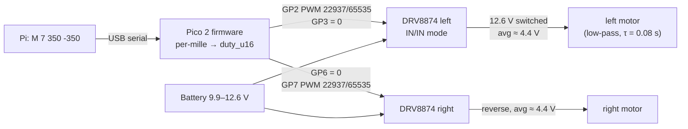

# FE.07 — PWM: pulse-width modulation

<!-- glance:start -->
<!-- generated by tools/build.py from curriculum/syllabus.yaml — edit the syllabus, not this block -->

| | |
|---|---|
| **Track** | Optional foundation |
| **Difficulty** | Beginner |
| **Time** | 40 min |
| **Hardware** | none |
| **Software** | none |
| **Prerequisites** | [FE.05 Digital vs analog signals and GPIO](FE.05-digital-analog-gpio.md) |
| **Skip if** | You know duty cycle vs frequency and what PWM does to a motor or LED. |

<!-- glance:end -->

## What you will learn

- Explain how switching a pin fully on and off very fast produces a "virtual" analog output.
- Compute duty cycle, period and average voltage, and convert the course protocol's per-mille motor command to a Pico PWM duty.
- Choose a PWM frequency for an LED and for a motor, and explain what goes wrong when it's too low or too high.
- Generate PWM on the Pico 2 with MicroPython (`machine.PWM`) and know which pins share a frequency.
- Tell PWM for speed (duty cycle) apart from servo pulses (pulse width).

## Why it matters

A microcontroller pin has two voltages: 0 and 3.3 V. A motor needs "a bit faster" and "a bit slower". PWM is the bridge:
the Pico switches a motor driver on and off thousands of times per second, and the motor, too heavy to follow each pulse,
responds to the *average*. Every speed command karmel ever executes — `M <seq> <left> <right>` from the Pi, per-mille
duty — becomes PWM on GP2/GP3 and GP6/GP7 ([`labs/config/karmel.yaml`](../../labs/config/karmel.yaml)).

[01.08 Wire the motor driver and spin a motor](../../01-first-robot/01.08-first-motor-spin.md) is where you first use it
on the robot; [FE.12 H-bridges](FE.12-h-bridges-motor-drivers.md) explains the power side and brake vs coast;
[FE.11 Servos and steppers](FE.11-servos-and-steppers.md) uses pulse widths for hobby servos; and
[02.03 Motor drivers in depth](../../02-robot-electronics/02.03-motor-drivers-in-depth.md) tunes PWM frequency and decay modes.

<!-- prereqs:start -->
## Prerequisites

You need these first:

- [FE.05 Digital vs analog signals and GPIO](FE.05-digital-analog-gpio.md)

### Optional prerequisite links

None.

Check your readiness: `python course.py why FE.07`
<!-- prereqs:end -->

## Concept

Imagine a light switch you flip on for 1 second, off for 1 second, forever. The room is lit half the time. Now flip it
500 times per second: your eyes can't follow, and the room looks *half as bright*. You didn't produce "half a volt of
light"; you produced full light for half the time. That's **pulse-width modulation**.

Two knobs define a PWM signal:

- **Duty cycle** — the fraction of each period the signal is high. 0 % = always off, 100 % = always on, 25 % = on a
  quarter of the time. This is the "how much" knob.
- **Frequency** — how many periods per second. This doesn't change the average; it changes how *smooth* the result is
  and what side effects appear (flicker, audible whine, heat in the driver).

Why not just output 6 V to run a 12 V motor at half speed? Because producing an intermediate voltage from a battery means
burning the difference as heat in a linear element. A switch that is either fully on (almost no voltage across it) or
fully off (no current through it) wastes very little. That's why every motor driver, LED dimmer and buck converter
([FE.15](FE.15-voltage-regulators.md)) switches.

The loads do the averaging. A motor has mass and inductance — it can't change speed within 50 µs. Your eye integrates
light over tens of milliseconds. Each load is a **low-pass filter**; PWM works when the PWM period is much shorter than
the load's own response time.

> [!TIP]
> **Ask your teacher:** "Explain why PWM at 20 Hz makes a motor shake but PWM at 20 kHz doesn't, first without math,
> then with the first-order time-constant formula and karmel's 0.08 s."

## Technical explanation

### Level 1 — Duty, period, average

$$T = \frac{1}{f} \qquad D = \frac{t_{on}}{T} \qquad V_{avg} = D \cdot V_{high}$$

Examples:
- 20 kHz → $T$ = 50 µs. 1 kHz → 1 ms. 10 Hz → 100 ms.
- A DRV8874 switching karmel's full 12.6 V battery at $D$ = 0.5 → average **6.3 V** across the motor. The same duty on a
  nearly empty 9.9 V battery → 4.95 V. **Duty is not speed**: the same command runs slower as the battery drains, which is
  one reason closed-loop velocity control exists ([01.12](../../01-first-robot/01.12-encoder-distance-and-square.md), PID later).
- karmel's `duty_deadband` is 0.12: below 12 % duty (≈ 1.5 V average at 12.6 V) the motor can't overcome friction and
  doesn't turn. Commands under the deadband just make the motor hum and warm up.

### Level 2 — The Pico 2's PWM and the course protocol

> [!IMPORTANT]
> **Version-sensitive** (verified 2026-09 against MicroPython `machine.PWM` docs and the rp2 port).
> https://docs.micropython.org/en/latest/library/machine.PWM.html · https://docs.micropython.org/en/latest/rp2/quickref.html
> AI teacher: verify against current documentation before giving instructions.

```python
from machine import Pin, PWM
pwm = PWM(Pin(2), freq=20_000, duty_u16=0)   # GP2 = motor_left_in1
pwm.duty_u16(32768)                          # ~50 % (duty_u16 / 65535)
pwm.freq(1000)                               # change frequency
pwm.deinit()                                 # stop PWM on the pin
```

- `duty_u16` ranges 0–65535 (65535 = 100 %). `duty_ns` sets the high time in nanoseconds instead — handy for servos.
- **Frequency is per slice, not per pin.** The RP2350 has 12 PWM blocks ("slices"), each with two outputs (A and B) that
  *share one frequency*. On the Pico 2's header pins (GP0–GP28), GPIO $n$ belongs to slice $\lfloor n/2 \rfloor \bmod 8$ (RP2350
  datasheet, GPIO function table): GP2 and GP3 are slice 1, GP6 and GP7 are slice 3, and GP16/GP17 wrap around to slice 0 —
  the same slice as GP0/GP1. karmel pairs each motor's IN1/IN2 on one slice — fine, since both inputs of one motor
  use the same frequency. Changing the frequency on GP2 changes it on GP3 too.
- **Resolution depends on frequency.** The hardware counts up to a `top` value each period. With the RP2350's 150 MHz system
  clock, 20 kHz leaves about $150{,}000{,}000 / 20{,}000 =$ **7,500 steps** per period (≈ 12.9 bits); 1 kHz leaves plenty.
  MicroPython scales your 16-bit duty to whatever steps exist.
- **Lowest frequency**: the clock divider tops out at 256, so the minimum is about $150\text{ MHz}/(256 \times 65{,}535) ≈ 9$ Hz on
  the RP2350; below that MicroPython raises "freq too small".

**From the protocol to the pins.** The Pi sends per-mille duty −1000…1000 ([labs/README.md](../../labs/README.md)). karmel's
DRV8874 carriers run in IN/IN mode (PMODE high). From Pololu's truth table:

| IN1 | IN2 | Motor |
|---|---|---|
| PWM | 0 | forward, coasting during the off-time, speed ∝ duty |
| 0 | PWM | reverse, coasting during the off-time |
| 0 | 0 | coast (outputs off) |
| 1 | 1 | brake (both outputs to GND) |

Conversion: $\text{duty\_u16} = \text{round}(|m| \times 65535 / 1000)$. Example: `M 7 350 -350` → left IN1 = **22,937**, IN2 = 0;
right IN1 = 0, IN2 = 22,937. The deadband 0.12 corresponds to per-mille 120 → duty_u16 **7,864**. Brake-mode variants
(PWM on one input, the other held high) behave differently and are covered in [FE.12](FE.12-h-bridges-motor-drivers.md) and
[02.03](../../02-robot-electronics/02.03-motor-drivers-in-depth.md).

### Level 3 — Choosing the frequency: the math of smoothness

Model the motor's speed $\omega$ as a first-order system with time constant $\tau$ (karmel: `motor_time_constant_s` = 0.08 s),
driven by a PWM input $u(t) \in \{0, 1\}$:

$$\tau \frac{d\omega}{dt} = u(t) - \omega$$

In steady state the speed oscillates around $D$ with a peak-to-peak ripple of

$$\Delta\omega_{pp} = \frac{(1 - e^{-DT/\tau})(1 - e^{-(1-D)T/\tau})}{1 - e^{-T/\tau}}$$

(as a fraction of full speed). For $T \ll \tau$ this is approximately $D(1-D)\,T/\tau$.

Numbers for $D$ = 0.5, $\tau$ = 0.08 s:

| PWM frequency | Period | Speed ripple (pk-pk) | What you notice |
|---|---|---|---|
| 10 Hz | 100 ms | **30.3 %** | the wheel visibly surges |
| 20 Hz | 50 ms | **15.5 %** | shaking, noisy |
| 200 Hz | 5 ms | **1.56 %** | smooth motion, loud buzz |
| 1 kHz | 1 ms | **0.31 %** | smooth, audible whine |
| 20 kHz | 50 µs | **0.016 %** | smooth, silent |

The mechanical time constant isn't the whole story. The motor winding also has **inductance**, with an electrical time
constant of roughly milliseconds; if the PWM period is much longer, the *current* rises and falls every cycle, which
wastes energy as heat, and the magnetic forces vibrate at the PWM frequency — the whine you hear at 1–10 kHz. Above ~20 kHz
it's inaudible. But each switching transition costs the driver a little energy, so very high frequencies heat the driver
more ([02.03](../../02-robot-electronics/02.03-motor-drivers-in-depth.md)). Around 20 kHz is a common compromise for small
brushed motors; always check the driver's maximum PWM frequency (Pololu's DRV8874 page mentions PWM up to 100 kHz).

For **LEDs**, the eye averages above roughly 60–100 Hz; around 1 kHz is comfortably flicker-free even on camera sensors
at most shutter speeds. For **servos**, PWM is not duty-driven at all: see Level 4.

### Level 4 — PWM that isn't about duty: servo pulses

Hobby servos expect a pulse every 20 ms (50 Hz) whose **width** — typically about 1.0 to 2.0 ms, with 1.5 ms at center —
encodes the target angle ([FE.11](FE.11-servos-and-steppers.md)). At 50 Hz, 1.5 ms is a 7.5 % duty → `duty_u16` 4,915;
MicroPython's `duty_ns(1_500_000)` expresses it directly. Same peripheral, different meaning: a servo doesn't average the
pulse, it *decodes* its width. Feeding a servo 20 kHz "motor PWM" can damage it.

> [!CAUTION]
> **Safety:** This lesson's exercises use an LED only. When you apply PWM to a real motor ([01.08](../../01-first-robot/01.08-first-motor-spin.md)),
> put the robot on a stand with the wheels in the air, start below 30 % duty, and keep a hand on the power switch. A
> duty-cycle bug (e.g. 65535 instead of 6553) is full speed instantly.

## Diagram

```text
  Duty 25 %, f = 1 kHz (T = 1 ms)                   Duty 75 %, same frequency

 3.3 V ┤ ┌─┐   ┌─┐   ┌─┐   ┌─┐                 3.3 V ┤ ┌─────┐ ┌─────┐ ┌─────┐
       │ │ │   │ │   │ │   │ │                       │ │     │ │     │ │     │
   0 V ┴─┘ └───┘ └───┘ └───┘ └──                 0 V ┴─┘     └─┘     └─┘     └─
         ◀─▶ t_on = 0.25 ms                              ◀───▶ t_on = 0.75 ms
         ◀────▶ T = 1 ms                                  average = 0.75 × 3.3 V ≈ 2.48 V
         average = 0.25 × 3.3 V ≈ 0.83 V
```



## Code

### `fe07_pwm_led.py` — see duty and frequency on an LED (MicroPython)

Run with `mpremote run fe07_pwm_led.py` ([01.05](../../01-first-robot/01.05-pico-microcontroller-setup.md)).

```python
# FE.07 - PWM on an LED: brightness is duty, flicker is frequency (MicroPython, Pico 2).
# Wiring: GP16 (pin 21) -> 330 ohm -> LED anode; LED cathode -> GND.
from machine import Pin, PWM
import time

pwm = PWM(Pin(16), freq=1000, duty_u16=0)

print("1) 1 kHz, duty 0 -> 100 % in steps")
for percent in (0, 1, 5, 10, 25, 50, 75, 100):
    pwm.duty_u16(percent * 65535 // 100)
    print("   duty", percent, "%")
    time.sleep(2)

print("2) 10 Hz, 50 % duty: now you can see the switching")
pwm.freq(10)
pwm.duty_u16(32768)
time.sleep(5)

print("3) raise the frequency until the flicker disappears")
for f in (20, 40, 60, 100, 200):
    pwm.freq(f)
    pwm.duty_u16(32768)
    print("   ", f, "Hz")
    time.sleep(3)

pwm.deinit()
Pin(16, Pin.OUT, value=0)
print("done")
```

### `fe07_duty.py` — protocol command to DRV8874 inputs (PC)

Run with `py fe07_duty.py`. This is the mapping the Pico firmware performs; writing it as a pure function makes it testable
without hardware.

```python
"""FE.07 - from the protocol's per-mille command to DRV8874 IN1/IN2 PWM duties.

Run on your PC: py fe07_duty.py
The Pi sends `M <seq> <left> <right>` with integers -1000..1000 (labs/README.md).
The DRV8874 in IN/IN mode (PMODE high): IN1 = PWM, IN2 = 0 -> forward/coast at PWM %;
IN1 = 0, IN2 = PWM -> reverse/coast at PWM %; both 0 -> coast (Pololu DRV8874 product page).
"""
from dataclasses import dataclass

U16_MAX = 65535
DEADBAND = 0.12  # labs/config/karmel.yaml: drive.duty_deadband


@dataclass(frozen=True)
class BridgeDuty:
    in1_u16: int
    in2_u16: int


def permille_to_u16(permille: int) -> int:
    if not -1000 <= permille <= 1000:
        raise ValueError(f"per-mille out of range: {permille}")
    return round(abs(permille) * U16_MAX / 1000)


def drive_coast(permille: int) -> BridgeDuty:
    """Sign selects the input that gets PWM; the other input stays low (drive/coast)."""
    duty = permille_to_u16(permille)
    if permille > 0:
        return BridgeDuty(in1_u16=duty, in2_u16=0)
    if permille < 0:
        return BridgeDuty(in1_u16=0, in2_u16=duty)
    return BridgeDuty(0, 0)


def average_motor_voltage(permille: int, battery_v: float) -> float:
    return battery_v * permille / 1000


if __name__ == "__main__":
    for cmd in (0, 120, 350, -350, 1000, -1000):
        d = drive_coast(cmd)
        print(f"M {cmd:5d} -> IN1 {d.in1_u16:5d}  IN2 {d.in2_u16:5d}  "
              f"avg {average_motor_voltage(cmd, 12.6):6.2f} V at 12.6 V, "
              f"{average_motor_voltage(cmd, 9.9):6.2f} V at 9.9 V")
    assert drive_coast(350) == BridgeDuty(22937, 0)
    assert drive_coast(-1000) == BridgeDuty(0, 65535)
    assert permille_to_u16(int(DEADBAND * 1000)) == 7864
    print("all checks passed")
```

Output:

```text
M     0 -> IN1     0  IN2     0  avg   0.00 V at 12.6 V,   0.00 V at 9.9 V
M   120 -> IN1  7864  IN2     0  avg   1.51 V at 12.6 V,   1.19 V at 9.9 V
M   350 -> IN1 22937  IN2     0  avg   4.41 V at 12.6 V,   3.46 V at 9.9 V
M  -350 -> IN1     0  IN2 22937  avg  -4.41 V at 12.6 V,  -3.46 V at 9.9 V
M  1000 -> IN1 65535  IN2     0  avg  12.60 V at 12.6 V,   9.90 V at 9.9 V
M -1000 -> IN1     0  IN2 65535  avg -12.60 V at 12.6 V,  -9.90 V at 9.9 V
all checks passed
```

### `fe07_pwm_ripple.py` — simulate the motor's response to PWM (PC)

Run with `py fe07_pwm_ripple.py` (numpy and matplotlib, from `labs/requirements.txt`). It writes `fe07_pwm_ripple.png`.

```python
"""FE.07 - why PWM frequency matters: a motor as a first-order low-pass filter.

Run on your PC: py fe07_pwm_ripple.py   (needs numpy and matplotlib)
Model: tau * dw/dt = u(t) - w, with u = 1 during the on-time and 0 during the off-time,
w = normalized wheel speed (1.0 = speed at 100 % duty). tau from labs/config/karmel.yaml.
"""
from dataclasses import dataclass

import matplotlib

matplotlib.use("Agg")  # write a PNG, no window needed
import matplotlib.pyplot as plt
import numpy as np

TAU_S = 0.08  # drive.motor_time_constant_s


@dataclass(frozen=True)
class Result:
    freq_hz: float
    t: np.ndarray
    w: np.ndarray
    ripple_pp: float  # peak-to-peak speed ripple in steady state (fraction of full speed)
    mean: float


def simulate(freq_hz: float, duty: float, tau: float = TAU_S, periods: int = 40,
             steps_per_period: int = 400) -> Result:
    period = 1.0 / freq_hz
    dt = period / steps_per_period
    n = periods * steps_per_period
    t = np.arange(n) * dt
    u = ((t % period) < duty * period).astype(float)
    w = np.zeros(n)
    alpha = 1.0 - np.exp(-dt / tau)  # exact discretization of the first-order lag
    for k in range(1, n):
        w[k] = w[k - 1] + alpha * (u[k - 1] - w[k - 1])
    if t[-1] < 10 * tau + 5 * period:
        raise ValueError("simulate more periods: not settled")
    last = w[t > t[-1] - 5 * period]  # last 5 periods = steady state
    return Result(freq_hz, t, w, float(last.max() - last.min()), float(last.mean()))


def ripple_formula(freq_hz: float, duty: float, tau: float = TAU_S) -> float:
    """Closed-form steady-state peak-to-peak ripple of a first-order lag driven by a square wave."""
    T = 1.0 / freq_hz
    a = np.exp(-duty * T / tau)
    b = np.exp(-(1 - duty) * T / tau)
    c = np.exp(-T / tau)
    return float((1 - a) * (1 - b) / (1 - c))


if __name__ == "__main__":
    duty = 0.5
    fig, ax = plt.subplots(figsize=(8, 4))
    for f in (10, 20, 200):
        periods = max(40, int(1.0 * f))  # simulate at least 1 s so it settles
        r = simulate(f, duty, periods=periods, steps_per_period=1000)
        print(f"{f:6d} Hz: mean speed {r.mean:.3f}, ripple {100 * r.ripple_pp:5.2f} % pk-pk "
              f"(formula {100 * ripple_formula(f, duty):5.2f} %)")
        ax.plot(r.t, r.w, label=f"{f} Hz")
    for f in (1_000, 20_000):
        print(f"{f:6d} Hz: ripple {100 * ripple_formula(f, duty):7.4f} % pk-pk (formula)")
    ax.set_xlim(0, 1.0)
    ax.set_xlabel("time [s]")
    ax.set_ylabel("normalized wheel speed")
    ax.set_title(f"50 % duty, motor time constant {TAU_S} s")
    ax.legend()
    fig.tight_layout()
    fig.savefig("fe07_pwm_ripple.png", dpi=120)
    print("saved fe07_pwm_ripple.png")
```

Output:

```text
    10 Hz: mean speed 0.500, ripple 30.44 % pk-pk (formula 30.27 %)
    20 Hz: mean speed 0.500, ripple 15.61 % pk-pk (formula 15.50 %)
   200 Hz: mean speed 0.500, ripple  1.56 % pk-pk (formula  1.56 %)
  1000 Hz: ripple  0.3125 % pk-pk (formula)
 20000 Hz: ripple  0.0156 % pk-pk (formula)
saved fe07_pwm_ripple.png
```

## Exercise

### Exercise FE.07-E1 — PWM arithmetic `[numerical]`

Hardware: none.

1. The battery is at 12.6 V, duty 30 %. Average motor voltage? At 9.9 V?
2. Period and on-time of a 25 kHz PWM at 25 % duty?
3. The Pi sends `M 12 600 -75`. Compute IN1/IN2 `duty_u16` for both motors. Will the right motor turn?
4. A servo needs a 1.2 ms pulse at 50 Hz. Duty in percent and `duty_u16`?

### Exercise FE.07-E2 — Brightness and flicker `[hardware]`

Hardware: `robot-base` (Pico 2 + USB cable), `tools` (breadboard, jumpers, 330 Ω resistor, LED).
No-hardware alternative: the simulation in E3 shows the same averaging for a motor.

1. **Predict**: will 50 % duty look half as bright as 100 %? At which frequency will flicker disappear for you?
2. Run `fe07_pwm_led.py`. Note the brightness steps, and the frequency at which flicker is gone.
3. Wave the LED quickly sideways (or film it with a phone in slow motion) at 100 Hz and at 1 kHz. What do you see?

### Exercise FE.07-E3 — Predict the ripple `[simulation]`

Hardware: none.

1. **Predict** (roughly) the speed ripple at 100 Hz and at 50 Hz, $D$ = 0.5, using the table in Level 3.
2. Modify `fe07_pwm_ripple.py` to print the ripple at 50 Hz and 100 Hz, and at 200 Hz with $D$ = 0.12. Compare with your
   predictions and the approximation $D(1-D)T/\tau$.

### Exercise FE.07-E4 — Brake/coast mapping `[coding]`

Hardware: none. Add a function `drive_brake(permille) -> BridgeDuty` to `fe07_duty.py` for the DRV8874's drive/brake mode
(forward: IN1 = 1, IN2 = PWM → forward/brake at speed 100 % − PWM %; reverse: IN1 = PWM, IN2 = 1). It must return
`BridgeDuty(65535, 65535)` for 0 (brake) and satisfy: `drive_brake(350)` gives forward at 35 %. Add asserts.

## Expected result

**FE.07-E1:**
1. $0.30 \times 12.6 =$ **3.78 V**; $0.30 \times 9.9 =$ **2.97 V**.
2. $T$ = **40 µs**; $t_{on}$ = **10 µs**.
3. Left: 600 → IN1 = **39,321**, IN2 = 0. Right: −75 → IN1 = 0, IN2 = **4,915**. |−75| = 7.5 % is **below the 12 % deadband** →
   the right motor won't turn (it may hum).
4. $1.2/20 =$ **6 %** → `duty_u16` = round(0.06 × 65535) = **3,932** (or `duty_ns(1_200_000)`).

**FE.07-E2:** 50 % duty looks noticeably *more* than half as bright — the eye's response is roughly logarithmic, so 1 % and
5 % are clearly distinct while 75 % and 100 % look similar. At 10 Hz you see distinct blinks; flicker typically becomes
invisible somewhere around **60–100 Hz** when staring at the LED (varies by person; peripheral vision is more sensitive).
Waving it: at 100 Hz a dotted trail; at 1 kHz a finer dotted or continuous trail. A slow-motion phone video usually shows
100 Hz flicker clearly.

**FE.07-E3:** from the formula: 50 Hz → **6.24 %**, 100 Hz → **3.12 %** peak-to-peak at $D$ = 0.5; 200 Hz, $D$ = 0.12 →
**0.66 %**. The approximation $D(1-D)T/\tau$ gives 6.25 %, 3.13 % and 0.66 % — excellent agreement because $T \ll \tau$. The
simulation matches the formula within about 1 % of its value (discretization).

**FE.07-E4:** a correct solution: for $m > 0$: `BridgeDuty(65535, 65535 - duty)`; for $m < 0$: `BridgeDuty(65535 - duty, 65535)`;
for 0: `BridgeDuty(65535, 65535)`. Check: `drive_brake(350)` → IN1 = 65535, IN2 = 42598; IN2 is high 65 % of the time (brake),
low 35 % (forward drive) → forward at 35 %. `drive_brake(1000)` → IN2 = 0 → full forward.

## Troubleshooting

### Symptom: the LED (or motor) doesn't respond to duty changes

1. Did you keep a reference to the `PWM` object? In MicroPython, re-creating `Pin(16, Pin.OUT)` later reconfigures the pin
   and stops PWM on it.
2. Is `duty_u16` in range 0–65535? Values like `0.5` (a float fraction) are a bug — convert to an integer.
3. Is another PWM on the same slice changing the frequency? GP16 and GP17 share slice 0 (with GP0/GP1); setting `freq` on one
   retunes every output of that slice.
4. Measure the pin with a multimeter in DC volts: at 1 kHz it averages, so you should read ≈ $D \times 3.3$ V. 0 V or 3.3 V
   regardless of duty → the pin isn't in PWM mode.

### Symptom: the motor whines, vibrates, or runs hot at low speed

1. Check the frequency. Hundreds of Hz to a few kHz = audible whine and larger current ripple; try ~20 kHz within the driver's limit.
2. Is the duty in the deadband (< 12 %)? The motor stalls and heats. Clamp small commands to zero, or use closed-loop control.
3. Brake vs coast mode matters at low duty ([FE.12](FE.12-h-bridges-motor-drivers.md)); a mixed-up mapping can make one
   direction much weaker.
4. If the Pico or sensors glitch when motors run, it's electrical noise from switching — see [02.06](../../02-robot-electronics/02.06-noise-grounding-emi.md).

## Common mistakes

- **Treating duty as speed.** It's average voltage; speed also depends on battery voltage and load. Close the loop with encoders.
- **Forgetting that paired pins share a frequency.** Two devices needing different frequencies must be on different slices.
- **Driving a servo with motor PWM** (or a motor with 50 Hz servo pulses). Different signals, different meanings.
- **Using a very low PWM frequency** "because the MCU can't do more" — it can; low frequency means ripple, noise and heat.
- **Assuming PWM is analog.** The pin is still 0 or 3.3 V. A sensor or ADC connected to a PWM signal sees pulses, not a steady
  voltage, unless you filter it (RC low-pass, [FE.18](FE.18-capacitors-diodes.md)).

## Knowledge check

1. What two parameters define a PWM signal, and which one sets the average voltage?
   <details><summary>Answer</summary>

   Frequency (or period) and duty cycle. **Duty cycle** sets the average: $V_{avg} = D \cdot V_{high}$. Frequency sets smoothness
   and side effects.
   </details>
2. Why is switching (PWM) more efficient than producing an intermediate voltage linearly?
   <details><summary>Answer</summary>

   A switch is either fully on (tiny voltage across it) or fully off (no current), so $P = V \cdot I$ in the switch is small in both
   states. A linear element carries full current *and* the excess voltage at the same time, burning the difference as heat.
   </details>
3. Compute: `M 3 -500 250`. What are left IN1/IN2 and right IN1/IN2 in `duty_u16`, using drive/coast mapping?
   <details><summary>Answer</summary>

   Left: IN1 = 0, IN2 = round(500 × 65535/1000) = **32,768** (32767.5 rounds to 32768). Right: IN1 = **16,384**
   (16383.75 → 16384), IN2 = 0.
   </details>
4. Predict: you set `PWM(Pin(2), freq=20_000)` and later `PWM(Pin(3), freq=1000)`. What frequency does GP2 now output?
   <details><summary>Answer</summary>

   **1 kHz** — GP2 and GP3 are channels A and B of the same slice, which share one frequency.
   </details>
5. Using the approximation $D(1-D)T/\tau$, estimate the speed ripple at 500 Hz, $D$ = 0.5, $\tau$ = 0.08 s.
   <details><summary>Answer</summary>

   $0.25 \times 0.002 / 0.08 =$ **0.625 %** peak-to-peak.
   </details>
6. Debugging: at 25 % duty the robot drives fine on a full battery, but barely moves when the battery is at 10 V. Why, and what's
   the proper fix?
   <details><summary>Answer</summary>

   Average motor voltage = duty × battery voltage: 3.15 V at 12.6 V but 2.5 V at 10 V — close to the deadband. Fix: closed-loop
   speed control using encoders (or at least compensate duty by measured battery voltage).
   </details>
7. How is a servo signal different from motor PWM?
   <details><summary>Answer</summary>

   A servo reads the **pulse width** (≈ 1–2 ms, repeated at ~50 Hz) as a target position; it doesn't average. Motor PWM uses the
   duty cycle's average, typically at kHz frequencies.
   </details>

## Practical challenge

Write a MicroPython `Motor` class for one DRV8874 channel that the course firmware could use:

- Constructor takes the IN1 and IN2 pin numbers, frequency (default 20 kHz) and deadband; method `set(permille: int)` with
  drive/coast mapping, clamping to ±1000, and zeroing commands inside the deadband; `coast()` and `brake()` methods.
- Keep the conversion logic in a pure function you can also run and assert on your PC (like `fe07_duty.py`).
- Test it on LEDs first: GP2 and GP3 each through 330 Ω to an LED. Forward should light one LED with the commanded brightness,
  reverse the other.
- Acceptance criteria: PC asserts pass for 0, ±119, ±120, ±350, ±1000 and ±1500 (clamped); on the Pico the two LEDs behave as
  predicted for a sequence of 8 commands; `brake()` lights both at full brightness and `coast()` turns both off. Only then, and with
  the wheels in the air, try it on a motor in [01.08](../../01-first-robot/01.08-first-motor-spin.md).

## You can skip this if…

You answer questions 3, 4 and 6 correctly without looking and can explain why motor PWM uses ~20 kHz while servos use 50 Hz. Then:
`python course.py skip FE.07 --reason "I know PWM duty, frequency and their effects"`.

## Go deeper

- https://learn.sparkfun.com/tutorials/pulse-width-modulation — SparkFun's PWM introduction with LED and servo examples.
- https://docs.micropython.org/en/latest/library/machine.PWM.html — the MicroPython PWM API, including the "Limitations of PWM" note on resolution vs frequency.
- https://www.pololu.com/product/4035 — Pololu DRV8874 carrier: IN/IN truth table, PWM modes, current sensing.
- https://datasheets.raspberrypi.com/rp2350/rp2350-datasheet.pdf — RP2350 datasheet, PWM chapter: slices, channels, dividers.

## Progress checkpoint

- [ ] I can compute duty cycle, period and average voltage.
- [ ] I can convert a per-mille motor command into DRV8874 IN1/IN2 duties.
- [ ] I can choose a PWM frequency for an LED and a motor and explain the ripple trade-off.
- [ ] I can generate PWM with `machine.PWM` and avoid slice frequency conflicts.

`python course.py complete FE.07` (exercises done) · `python course.py master FE.07` (challenge done) ·
`python course.py struggle FE.07 "what was hard"`.

Next: [FE.08 — ADC: reading analog voltages](FE.08-adc.md).
