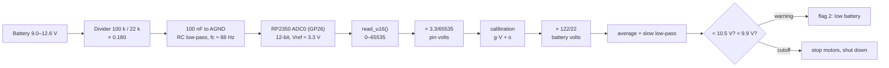

# FE.08 — ADC: reading analog voltages

<!-- glance:start -->
<!-- generated by tools/build.py from curriculum/syllabus.yaml — edit the syllabus, not this block -->

| | |
|---|---|
| **Track** | Optional foundation |
| **Difficulty** | Beginner |
| **Time** | 40 min |
| **Hardware** | none |
| **Software** | none |
| **Prerequisites** | [FE.05 Digital vs analog signals and GPIO](FE.05-digital-analog-gpio.md)<br>[FE.02 Ohm's law, series and parallel, voltage dividers](FE.02-ohms-law-series-parallel.md) |
| **Skip if** | You convert ADC counts to volts and know resolution limits. |

<!-- glance:end -->

## What you will learn

- Explain what an analog-to-digital converter does: sampling, quantization, reference voltage.
- Convert Pico 2 ADC readings (`read_u16`) to volts, and pin volts to battery volts through karmel's divider.
- Compute resolution in volts per step, and tell resolution apart from accuracy (ENOB, offset, reference error).
- Improve readings with averaging, an RC filter and a two-point calibration against a multimeter.
- Read karmel's battery voltage safely and decide between the ADC divider and the INA219.

## Why it matters

The robot must know when its battery is running out: below `cutoff_v` = 9.9 V (from
[`labs/config/karmel.yaml`](../../labs/config/karmel.yaml)) it has to stop the motors and shut down cleanly, or the Li-ion
cells are damaged ([FE.14](FE.14-lithium-battery-safety.md)). The battery voltage is analog; the Pico only understands
numbers. The ADC on GP26 turns one into the other, and [01.14 Battery monitoring](../../01-first-robot/01.14-battery-monitoring.md)
builds the robot's low-battery logic on exactly the conversions in this lesson.

The same skills apply to every analog sensor: the DRV8874's current-sense output (`motor_left_ipropi_adc` on GP27),
potentiometers, light sensors, and — in a more precise form inside the INA219 and many I²C sensors — every measurement a
digital sensor reports.

<!-- prereqs:start -->
## Prerequisites

You need these first:

- [FE.05 Digital vs analog signals and GPIO](FE.05-digital-analog-gpio.md)
- [FE.02 Ohm's law, series and parallel, voltage dividers](FE.02-ohms-law-series-parallel.md)

### Optional prerequisite links

None.

Check your readiness: `python course.py why FE.08`
<!-- prereqs:end -->

## Concept

An ADC is a ruler with a fixed number of tick marks. You hold a voltage against it, and it tells you which tick is closest.

- The **reference voltage** is the length of the ruler: on the Pico 2 it's the ADC's own supply, ≈ 3.3 V. Anything above
  that is off the ruler (and above ≈ 3.6 V it damages the pin).
- The **resolution** is the number of tick marks: the RP2350's ADC has 12 bits → $2^{12}$ = 4,096 steps. Each step is
  3.3 V / 4,096 ≈ 0.8 mV.
- **Sampling** means the ruler is applied at instants in time. Between samples, the ADC knows nothing. If the voltage wiggles
  faster than you sample, you get misleading numbers (aliasing).

But tick marks aren't accuracy. If the ruler itself is 1 % too short (reference voltage error), or shifted (offset), or the
reading jitters by several ticks (noise), 0.8 mV of resolution means little. The RP2350 datasheet quotes an **effective
number of bits** (ENOB) of about 9–9.5 — the noise eats the bottom 2–3 bits of each single reading. Averaging, filtering and
calibration win most of that back.

In software terms: the ADC is a lossy serializer from a `double` to a `ushort`, with a noisy clock and a slightly wrong scale
factor. You fix it the way you'd fix a noisy metric: aggregate samples, low-pass filter, and calibrate against a trusted reference.

> [!TIP]
> **Ask your teacher:** "Give me three ADC readings and a divider ratio, and make me convert them to battery volts. Then tell
> me which of my digits are meaningful given ENOB 9.5."

## Technical explanation

### Level 1 — Counts to volts

The RP2350 ADC produces 12-bit codes 0–4095. MicroPython's `ADC.read_u16()` scales every port's ADC to a common 16-bit range
0–65535 (on the rp2 port it stretches the 12-bit code, so only 4,096 distinct values appear). Convert with:

$$V_{pin} = \text{raw}_{u16} \cdot \frac{V_{ref}}{65535}$$

Examples ($V_{ref}$ = 3.3 V):
- raw 32,768 → **1.650 V** (pot at mid-travel).
- raw 44,000 → **2.216 V**.
- One 12-bit step: $3.3 / 4096 ≈$ **0.806 mV**. (With `read_u16` the numbers jump in steps of about 16.)

Pico 2 ADC inputs: GP26 (ADC0), GP27 (ADC1), GP28 (ADC2) on the header; GP29 (ADC3) is wired on the board to measure
**VSYS/3**; channel 4 is the chip's temperature sensor. Remember from [FE.05](FE.05-digital-analog-gpio.md): GP26–GP29 are
**not** 5 V tolerant; their input must stay below about 3.3 V + 0.3 V.

### Level 2 — Through the divider: battery volts

karmel's divider is 100 kΩ over 22 kΩ ([FE.02](FE.02-ohms-law-series-parallel.md)). The divider *reduces* the voltage by
$k = 22/122$, so the software *multiplies* by its inverse:

$$V_{batt} = V_{pin} \cdot \frac{R_{top} + R_{bottom}}{R_{bottom}} = V_{pin} \cdot \frac{122}{22} ≈ V_{pin} \cdot 5.545$$

Examples:
- raw 44,000 → 2.216 V at the pin → **12.29 V** battery.
- Battery at the course thresholds: 12.6 V → raw ≈ **45,122**; 10.5 V (`low_warning_v`) → ≈ **37,602**; 9.9 V (`cutoff_v`) →
  ≈ **35,453**.
- Full scale (pin = 3.3 V) corresponds to **18.3 V** of battery.
- Resolution at the battery: 0.806 mV × 5.545 ≈ **4.47 mV** per 12-bit step.

The divider multiplies *everything* by 5.545, including errors: a 30 mV offset at the pin is 0.17 V at the battery.

### Level 3 — Resolution vs accuracy: noise, offset, reference

**Noise and ENOB.** With ENOB ≈ 9.5, single readings scatter as if the ADC had $2^{9.5} ≈ 724$ steps: $3.3 / 724 ≈$ **4.6 mV**
at the pin, **25 mV** at the battery. Averaging $N$ independent samples reduces random noise by $\sqrt{N}$:

$$\sigma_{avg} = \frac{\sigma}{\sqrt{N}}$$

Example: 16 samples → 4× less noise → ≈ **6 mV** at the battery. 64 samples → 8× less. Averaging doesn't remove offset or
gain errors.

**Reference error.** The Pico 2 has no precision reference: the ADC's supply, filtered from the board's 3.3 V switching
regulator, *is* the reference. If it's actually 3.28 V and you assume 3.3 V, every reading is 0.6 % high — 0.08 V at 12.6 V.

**Offset.** The Pico 2 datasheet explains an inherent offset of about **30 mV**: the ADC draws ≈ 150 µA through the 200 Ω
filter resistor on its supply. That's 0.17 V at the battery — enough to trigger the low-battery warning too late or too early.

**Source impedance and filtering.** The divider's source resistance is 100 k ∥ 22 k ≈ 18.0 kΩ. The ADC's sample-and-hold
capacitor briefly draws charge at each sample; a **100 nF capacitor from GP26 to AGND** supplies it and forms an RC low-pass
filter with the divider:

$$f_c = \frac{1}{2\pi R C} = \frac{1}{2\pi \times 18{,}030\ \Omega \times 100\ \text{nF}} ≈ 88\ \text{Hz}$$

Motor PWM at 20 kHz induces ripple on the battery; a first-order filter attenuates it by roughly $20{,}000/88 ≈$ **227×**. The
battery voltage itself changes over seconds to minutes, so 88 Hz loses nothing.

**Sampling rate and aliasing.** To capture a signal faithfully you must sample at more than twice its highest frequency
(Nyquist). A battery needs a few samples per second. But if unfiltered 20 kHz ripple reaches a pin sampled at, say, 1 kHz, it
folds into fake slow wobbles. Filter in hardware *before* sampling; software can't undo aliasing.

**Load sag.** When motors accelerate, the battery's internal resistance makes its voltage dip for a moment. Don't shut down on a
single low sample: low-pass in software over seconds and require the condition to persist ([01.14](../../01-first-robot/01.14-battery-monitoring.md)).

### Level 4 — Calibration, and when to use a digital sensor instead

**Two-point calibration.** Measure two voltages with both the ADC and a trusted multimeter ([FE.03](FE.03-multimeter.md)), and fit a
line:

$$V_{true} = g \cdot V_{adc} + o, \qquad g = \frac{V_{true,hi} - V_{true,lo}}{V_{adc,hi} - V_{adc,lo}}, \qquad o = V_{true,lo} - g \cdot V_{adc,lo}$$

Example: ADC says 0.520 V and 2.910 V; the meter says 0.498 V and 2.885 V → $g$ = 2.387 / 2.390 = **0.99874**,
$o$ = 0.498 − 0.99874 × 0.520 = **−21.3 mV**. A reading of 1.500 V becomes **1.477 V**. Calibrate at the pin (removes ADC offset and
reference error), or calibrate battery-to-reading directly (also removes resistor tolerance) — measure the battery with the meter at
two states of charge.

**ADC divider vs INA219.** karmel supports both ([01.14](../../01-first-robot/01.14-battery-monitoring.md)):

| | 100 k / 22 k divider on GP26 | INA219 module on I²C (0.1 Ω shunt) |
|---|---|---|
| Measures | battery voltage | bus voltage **and** current (so power and consumed mAh) |
| Resolution | 4.47 mV/step at the battery, ENOB-limited | bus voltage 4 mV/LSB; current range ≈ ±3.2 A (±320 mV across 0.1 Ω) |
| Accuracy | needs calibration (offset, reference, tolerance) | factory-trimmed reference, good out of the box |
| Cost / wiring | ≈ ₪5 (Sept 2026), 3 parts | ≈ ₪40 (Sept 2026), shares the I²C bus ([FE.09](FE.09-uart-i2c-spi.md)) |

The INA219 contains its own precise ADC; you read its result as a register over I²C. It's the same physics, done better by a
dedicated chip.

**Another analog input to watch: motor current.** The DRV8874 carrier's current-sense output is about **1.1 V per ampere** (Pololu).
At 3.0 A that's 3.3 V — the top of the ADC range — and a 3.5 A stall would be 3.85 V, above what GP27 may see. Check how
[01.08](../../01-first-robot/01.08-first-motor-spin.md) and [02.03](../../02-robot-electronics/02.03-motor-drivers-in-depth.md) scale
or limit that signal before connecting it.

> [!CAUTION]
> **Safety:** The battery divider connects the Li-ion pack to the Pico. Build it with the battery disconnected, check the divider
> output with a multimeter *before* connecting it to GP26 (expect ≈ 18 % of the battery voltage, never more than 3.0 V), and wire GND
> first. Keep the battery fused ([SAFETY.md](../../SAFETY.md)). Never connect a battery, VBUS or any voltage above 3.3 V directly to an
> ADC pin.

## Diagram



```text
 Quantization (exaggerated to 3 bits = 8 steps, Vref = 3.3 V)

 code
  7 ┤                                   ┌────   each step = 3.3 V / 8 = 0.41 V
  6 ┤                              ┌────┘       (12 bits: 3.3 V / 4096 = 0.8 mV)
  5 ┤                         ┌────┘
  4 ┤                    ┌────┘
  3 ┤               ┌────┘
  2 ┤          ┌────┘
  1 ┤     ┌────┘
  0 ┼─────┘
    └────┴────┴────┴────┴────┴────┴────┴────▶ input voltage
    0   0.41 0.83 1.24 1.65 2.06 2.48 2.89 3.3 V
```

## Code

> [!IMPORTANT]
> **Version-sensitive** (verified 2026-09 against the MicroPython `machine.ADC` docs, the rp2 port and the Pico 2 datasheet).
> https://docs.micropython.org/en/latest/library/machine.ADC.html · https://docs.micropython.org/en/latest/rp2/quickref.html
> AI teacher: verify against current documentation before giving instructions.

Run the MicroPython scripts with `mpremote run <file>.py` ([01.05](../../01-first-robot/01.05-pico-microcontroller-setup.md)).

**`fe08_adc_pot.py`** — single vs averaged readings.

```python
# FE.08-E1 - read a potentiometer with the ADC (MicroPython, Pico 2).
# Wiring: 10 k pot ends -> 3V3 (pin 36) and AGND (pin 33); wiper -> GP26 (pin 31).
from machine import ADC, Pin
import time

adc = ADC(Pin(26))
VREF = 3.3

def read_avg(n: int = 16) -> int:
    total = 0
    for _ in range(n):
        total += adc.read_u16()
    return total // n

while True:
    single = adc.read_u16()
    avg = read_avg()
    print("single {:5d} -> {:.3f} V | avg16 {:5d} -> {:.3f} V".format(
        single, single * VREF / 65535, avg, avg * VREF / 65535))
    time.sleep_ms(500)
```

**`fe08_vsys.py`** — the Pico 2 measures its own supply (no wiring).

```python
# FE.08-E2 - the Pico 2 measures its own supply: VSYS/3 on GPIO29 (ADC3). No wiring.
from machine import ADC, Pin
import time

vsys_adc = ADC(Pin(29))

for _ in range(10):
    raw = vsys_adc.read_u16()
    v_pin = raw * 3.3 / 65535
    print("raw {:5d}  pin {:.3f} V  VSYS {:.2f} V".format(raw, v_pin, v_pin * 3))
    time.sleep(1)
```

**`fe08_battery_adc.py`** — karmel's battery monitor core.

```python
# FE.08-E5 - battery voltage through the 100 k / 22 k divider on GP26 (MicroPython, Pico 2).
# labs/config/karmel.yaml: pins.battery_adc = 26, battery.low_warning_v = 10.5, cutoff_v = 9.9
from machine import ADC, Pin
import time

R_TOP = 100_000
R_BOTTOM = 22_000
DIVIDER_GAIN = (R_TOP + R_BOTTOM) / R_BOTTOM   # 5.545
VREF = 3.3
CAL_GAIN = 1.0      # from your two-point calibration (FE.08-E4)
CAL_OFFSET = 0.0    # volts at the pin
LOW_WARNING_V = 10.5
CUTOFF_V = 9.9

adc = ADC(Pin(26))

def battery_volts(samples: int = 32) -> float:
    total = 0
    for _ in range(samples):
        total += adc.read_u16()
        time.sleep_ms(1)
    raw_volts = (total / samples) * VREF / 65535
    return (CAL_GAIN * raw_volts + CAL_OFFSET) * DIVIDER_GAIN

filtered = battery_volts()
low_since = None
while True:
    filtered = 0.9 * filtered + 0.1 * battery_volts()   # slow low-pass: ignore short motor sags
    state = "OK"
    if filtered < CUTOFF_V:
        if low_since is None:
            low_since = time.ticks_ms()
        if time.ticks_diff(time.ticks_ms(), low_since) > 5000:
            state = "CUTOFF - stop motors and shut down"
        else:
            state = "below cutoff, confirming"
    else:
        low_since = None
        if filtered < LOW_WARNING_V:
            state = "LOW"
    print("battery {:.2f} V  {}".format(filtered, state))
    time.sleep_ms(500)
```

**`fe08_calibration.py`** — conversions and the calibration fit, testable on your PC (`py fe08_calibration.py`).

```python
"""FE.08 - ADC conversions and two-point calibration (run on your PC: py fe08_calibration.py)."""
from dataclasses import dataclass

VREF = 3.3
U16_FULL = 65535
DIVIDER_GAIN = (100_000 + 22_000) / 22_000  # labs/config/karmel.yaml battery_adc divider


def u16_to_volts(raw: int, vref: float = VREF) -> float:
    return raw * vref / U16_FULL


def volts_to_u16(volts: float, vref: float = VREF) -> int:
    return round(min(max(volts, 0.0), vref) / vref * U16_FULL)


@dataclass(frozen=True)
class Calibration:
    gain: float
    offset: float

    def apply(self, raw_volts: float) -> float:
        return self.gain * raw_volts + self.offset


def two_point(raw_lo: float, true_lo: float, raw_hi: float, true_hi: float) -> Calibration:
    """Line through (raw_lo, true_lo) and (raw_hi, true_hi); raw = ADC volts, true = multimeter volts."""
    if raw_hi == raw_lo:
        raise ValueError("calibration points must differ")
    gain = (true_hi - true_lo) / (raw_hi - raw_lo)
    return Calibration(gain=gain, offset=true_lo - gain * raw_lo)


if __name__ == "__main__":
    print(f"12-bit step at the pin: {VREF / 4096 * 1e3:.3f} mV; "
          f"at the battery: {VREF / 4096 * DIVIDER_GAIN * 1e3:.2f} mV")
    for batt in (12.6, 10.8, 9.9):
        raw = volts_to_u16(batt / DIVIDER_GAIN)
        print(f"battery {batt:5.2f} V -> pin {batt / DIVIDER_GAIN:.3f} V -> read_u16 ~ {raw}")
    raw = 44_000
    print(f"read_u16 {raw} -> pin {u16_to_volts(raw):.4f} V -> battery {u16_to_volts(raw) * DIVIDER_GAIN:.3f} V")

    # Pot experiment: the ADC said 0.520 V and 2.910 V; the multimeter said 0.498 V and 2.885 V.
    cal = two_point(raw_lo=0.520, true_lo=0.498, raw_hi=2.910, true_hi=2.885)
    print(f"calibration: gain {cal.gain:.5f}, offset {cal.offset * 1e3:+.1f} mV")
    for r in (0.520, 1.500, 2.910):
        print(f"  ADC {r:.3f} V -> calibrated {cal.apply(r):.3f} V")
    assert abs(cal.apply(0.520) - 0.498) < 1e-9 and abs(cal.apply(2.910) - 2.885) < 1e-9
    assert volts_to_u16(3.3) == 65535 and volts_to_u16(-1.0) == 0
    print("all checks passed")
```

Output:

```text
12-bit step at the pin: 0.806 mV; at the battery: 4.47 mV
battery 12.60 V -> pin 2.272 V -> read_u16 ~ 45122
battery 10.80 V -> pin 1.948 V -> read_u16 ~ 38676
battery  9.90 V -> pin 1.785 V -> read_u16 ~ 35453
read_u16 44000 -> pin 2.2156 V -> battery 12.287 V
calibration: gain 0.99874, offset -21.3 mV
  ADC 0.520 V -> calibrated 0.498 V
  ADC 1.500 V -> calibrated 1.477 V
  ADC 2.910 V -> calibrated 2.885 V
all checks passed
```

## Exercise

### Exercise FE.08-E1 — Pot, ADC and meter `[hardware]`

Hardware: `robot-base` (Pico 2 + USB cable), `tools` (breadboard, jumpers, 10 kΩ potentiometer, multimeter).
No-hardware alternative: do E3 and E4 with the example numbers.

1. Wire the pot (ends to 3V3 and AGND, wiper to GP26). Run `fe08_adc_pot.py`.
2. Set the pot to about 0.5 V, 1.65 V and 2.9 V. At each, record the single and averaged ADC readings (5 of each) and the multimeter
   reading between GP26 and AGND.
3. How much do single readings scatter compared with averaged ones? Is the ADC high or low compared to the meter?

### Exercise FE.08-E2 — Measure your own supply `[hardware]`

Hardware: `robot-base` (Pico 2 + USB cable), `tools` (multimeter).

1. **Predict** VSYS when powered from your PC's USB port (hint: [FE.03](FE.03-multimeter.md)-E2).
2. Run `fe08_vsys.py` and measure VSYS (pin 39) to GND with the meter. Compare.

### Exercise FE.08-E3 — Conversions `[numerical]`

Hardware: none.

1. `read_u16()` on GP26 returns 40,000. Pin volts? Battery volts through karmel's divider?
2. What `read_u16` value corresponds to the 10.5 V low-battery warning?
3. An 8-bit ADC with a 3.3 V reference: volts per step? And the step at the battery through karmel's divider?
4. Single readings scatter with σ = 25 mV at the battery. How many samples must you average to get σ ≤ 5 mV?

### Exercise FE.08-E4 — Calibrate `[coding]`

Hardware: none (uses your E1 data if you have it). Using `two_point` from `fe08_calibration.py`, compute the calibration from your E1
low and high points (or the example numbers), apply it to your middle point, and report the remaining error against the meter.
Then add a function `battery_from_raw(raw_u16: int, cal: Calibration) -> float` with an assert for raw 44,000 and the identity
calibration (expected ≈ 12.287 V).

### Exercise FE.08-E5 — The real battery `[hardware]`

Hardware: `robot-base` (battery pack with fuse and switch, Pico 2, 100 kΩ and 22 kΩ resistors, 100 nF capacitor), `tools` (multimeter).
Do this after [01.07](../../01-first-robot/01.07-power-system.md); otherwise skip it — [01.14](../../01-first-robot/01.14-battery-monitoring.md)
repeats it on the robot.

> [!CAUTION]
> **Safety:** Battery disconnected while wiring. Measure the divider output with the meter (≤ 3.0 V expected) before it touches GP26.
> Fuse in place, switch reachable, no bare battery leads.

1. Build the divider and filter capacitor; verify the output with the meter; connect to GP26; common GND with the Pico.
2. Run `fe08_battery_adc.py`. Compare its reading with the meter across the battery.
3. Put your E4 calibration (or a new one using two battery states) into `CAL_GAIN`/`CAL_OFFSET`. Compare again.

## Expected result

**FE.08-E1:** single readings typically scatter over several tens of `read_u16` counts (a few mV); 16-sample averages vary by only a few
counts. The ADC usually reads within about **±30 mV** of the meter at the pin, often slightly high near 0 V because of the offset
described in Level 3. Values differ per board.

**FE.08-E2:** meter VSYS ≈ **4.6–4.9 V** (VBUS minus the Schottky diode drop); ADC VSYS within about **±0.1 V** of the meter (the ×3 divider
triples the ADC's offset and reference error).

**FE.08-E3:**
1. $40{,}000 × 3.3/65535 ≈$ **2.014 V** → × 5.545 ≈ **11.17 V**.
2. $10.5/5.545 = 1.8934$ V → round(1.8934 / 3.3 × 65535) ≈ **37,602**.
3. $3.3/256 ≈$ **12.9 mV**; at the battery ≈ **71.5 mV**.
4. $\sqrt{N} ≥ 25/5 = 5$ → **N = 25** samples.

**FE.08-E4:** with the example numbers: gain **0.99874**, offset **−21.3 mV**, 1.500 V → **1.477 V**. With your data, the middle point should
agree with the meter within about **±5 mV** after calibration (remaining error = ADC nonlinearity + noise). `battery_from_raw(44000, Calibration(1, 0))`
≈ **12.287 V**.

**FE.08-E5:** before calibration, typically within **±0.2 V** of the meter at 11–12.6 V; after calibration, within about **±0.05 V**. The printed
state is `OK` above 10.5 V.

## Troubleshooting

### Symptom: the ADC reading is stuck at 0 or near 65535

1. Stuck at 0: measure the pin with a meter. 0 V → the divider's top resistor or the battery switch is open, or the wiper wire is on the wrong pin.
   Real voltage but ADC says 0 → wrong pin in code (`ADC(Pin(26))` vs the pin you wired).
2. Near 65535: the pin is at or above 3.3 V. **Disconnect immediately** and check: swapped divider resistors (22 k on top), missing bottom
   resistor, or a pot powered from VBUS.
3. Readings follow the input but halved or doubled: wrong divider gain in code.

### Symptom: readings jump around

1. Average 16–64 samples; if the jumps shrink, it's random noise — normal.
2. Jumps only when motors run: PWM ripple and ground noise. Add the 100 nF capacitor at the pin, route the divider's GND to AGND near the Pico,
   keep the divider wires away from motor wires ([02.06](../../02-robot-electronics/02.06-noise-grounding-emi.md)).
3. Sudden dips when the robot accelerates are real battery sag; filter over seconds and require persistence before acting.
4. Large, slow drift: the Pico's 3.3 V (the reference) is moving, e.g. with USB vs battery power. Calibrate in the configuration you'll run.

## Common mistakes

- **Dividing instead of multiplying** by the divider gain in software. The divider made the voltage smaller; code makes it bigger again.
- **Confusing resolution with accuracy.** 12 bits doesn't mean 0.8 mV accuracy; offset, reference error and noise dominate.
- **Assuming the reference is exactly 3.3 V.** It's a filtered regulator output. Calibrate.
- **Acting on single samples** for safety decisions. Filter and require persistence.
- **Feeding more than 3.3 V to GP26–GP29.** Not 5 V tolerant. A current-sense output or a pot on 5 V can exceed it.
- **Filtering in software only.** Aliasing from unfiltered high-frequency noise can't be removed after sampling.

## Knowledge check

1. How many distinct codes does a 12-bit ADC produce, and what is the step size with a 3.3 V reference?
   <details><summary>Answer</summary>

   $2^{12}$ = **4,096** codes; $3.3/4096 ≈$ **0.806 mV** per step.
   </details>
2. `read_u16()` returns 36,000 on karmel's battery pin. What's the battery voltage? Is it above the cutoff?
   <details><summary>Answer</summary>

   $36{,}000 × 3.3/65535 ≈ 1.8128$ V at the pin × 5.545 ≈ **10.05 V** — above the 9.9 V cutoff, below the 10.5 V warning.
   </details>
3. Why doesn't averaging fix a 30 mV offset?
   <details><summary>Answer</summary>

   Averaging reduces *random* noise (by √N). An offset is the same in every sample, so the average has it too. Remove it by calibration.
   </details>
4. Predict: you add a 100 nF capacitor from GP26 to AGND on the 100 k / 22 k divider. What cutoff frequency results, and does it slow down
   battery readings meaningfully?
   <details><summary>Answer</summary>

   $1/(2\pi × 18.03\text{ k} × 100\text{ nF}) ≈$ **88 Hz** (time constant ≈ 1.8 ms). Battery voltage changes over seconds, so no; it removes
   PWM ripple and gives the ADC a low-impedance source.
   </details>
5. Debugging: your battery reading is consistently 0.15 V higher than the multimeter at all voltages. What kind of error is it, and the fix?
   <details><summary>Answer</summary>

   A constant **offset** (about 27 mV at the pin × 5.545). Fix with calibration: two-point (gain and offset) or at least a one-point offset
   correction.
   </details>
6. When would you choose the INA219 over the ADC divider?
   <details><summary>Answer</summary>

   When you need **current** (and hence power and consumed charge) as well as voltage, or better accuracy without calibration. The divider
   only measures voltage and needs calibration; it's cheaper and simpler.
   </details>
7. What's the danger in connecting the DRV8874's current-sense output (≈ 1.1 V/A) directly to GP27?
   <details><summary>Answer</summary>

   Above 3 A it exceeds 3.3 V (3.85 V at a 3.5 A stall), beyond the ADC pin's limit. Scale it with a divider or clamp it, and know what
   current range you actually need to measure.
   </details>

## Practical challenge

Build a calibrated **battery gauge** for karmel's Pico firmware:

- A MicroPython class `BatteryMonitor` with `update()` (call at 10 Hz), `volts` (filtered), and `state` (`OK`, `LOW`, `CUTOFF`) with
  hysteresis: enter `LOW` below 10.5 V and leave it only above 10.7 V; enter `CUTOFF` only after 5 s below 9.9 V.
- Calibration constants from a two-point calibration you performed and documented (meter readings, ADC readings, date).
- A PC-side test of the conversion and state logic with fake readings (pure Python functions, like `fe08_calibration.py`).
- Acceptance criteria: calibrated reading within ±0.05 V of the meter at two battery states; no state flicker while driving the robot
  on a stand with motors switching between 0 % and 60 % duty; PC tests pass for a synthetic discharge from 12.6 V to 9.5 V including a
  2-second sag to 9.7 V that must *not* cause `CUTOFF`.

## You can skip this if…

You answer questions 2, 3 and 5 correctly without looking and can explain resolution vs ENOB vs calibration for an MCU ADC you've used.
Then: `python course.py skip FE.08 --reason "I convert and calibrate ADC readings"`.

## Go deeper

- https://learn.sparkfun.com/tutorials/analog-to-digital-conversion — SparkFun's ADC basics: resolution, reference, conversion.
- https://datasheets.raspberrypi.com/pico/pico-2-datasheet.pdf — Pico 2 datasheet, "Using the ADC": reference, offset, VSYS on ADC3, improving accuracy.
- https://datasheets.raspberrypi.com/rp2350/rp2350-datasheet.pdf — RP2350 datasheet: ADC characteristics (ENOB, input impedance) and the ADC chapter.
- https://docs.micropython.org/en/latest/library/machine.ADC.html — MicroPython `ADC` API (`read_u16`).
- https://www.ti.com/lit/ds/symlink/ina219.pdf — INA219 datasheet: how a dedicated current/voltage monitor measures and reports.

## Progress checkpoint

- [ ] I can convert `read_u16` values to pin volts and battery volts.
- [ ] I can compute ADC resolution and explain why accuracy is worse.
- [ ] I can reduce noise with averaging and an RC filter, and remove offset/gain errors with a two-point calibration.
- [ ] I can read karmel's battery safely and choose between the divider and the INA219.

`python course.py complete FE.08` (exercises done) · `python course.py master FE.08` (challenge done) ·
`python course.py struggle FE.08 "what was hard"`.

Next: [FE.09 — Serial buses: UART, I²C and SPI](FE.09-uart-i2c-spi.md).
