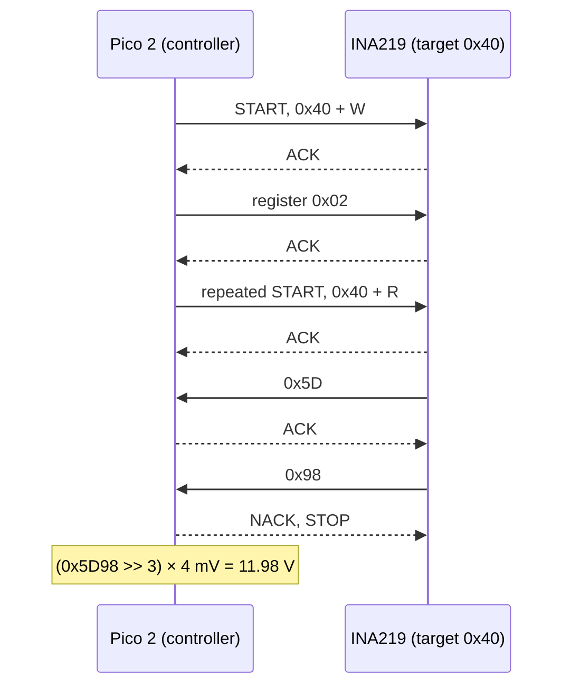

# FE.09 — Serial buses: UART, I²C and SPI

<!-- glance:start -->
<!-- generated by tools/build.py from curriculum/syllabus.yaml — edit the syllabus, not this block -->

| | |
|---|---|
| **Track** | Optional foundation |
| **Difficulty** | Beginner |
| **Time** | 1 h |
| **Hardware** | none |
| **Software** | none |
| **Prerequisites** | [FE.06 Pull-up and pull-down resistors (and why inputs float)](FE.06-pull-up-pull-down.md) |
| **Skip if** | You can explain the wiring and trade-offs of UART, I²C and SPI. |

<!-- glance:end -->

## What you will learn

- Explain why chips talk over serial buses and what "synchronous" vs "asynchronous" means on a wire.
- Wire UART, I²C and SPI correctly (which pin goes to which, pull-ups, common ground) and say what each wire carries.
- Compute baud-rate throughput and check whether karmel's 50 Hz telemetry fits the link.
- Explain I²C addressing and register reads, and read a real register from the INA219.
- Choose between UART, I²C and SPI for a given device from speed, pin count, distance and device count.

## Why it matters

Almost nothing on a modern robot talks with a single analog voltage. karmel's Raspberry Pi 5 and Pico 2 exchange commands and
telemetry over a serial link ([01.10 Pi ↔ Pico protocol](../../01-first-robot/01.10-pi-pico-protocol.md), made robust in
[03.03](../../03-robot-software/03.03-robust-serial-communication.md)). The VL53L1X distance sensor and the INA219 power monitor share
one I²C bus on GP4/GP5 ([01.13](../../01-first-robot/01.13-distance-sensors-stop.md),
[01.14](../../01-first-robot/01.14-battery-monitoring.md)). Later IMUs, displays and LiDARs use I²C, SPI or UART.

When a sensor "isn't detected", the fix is almost always at this level: swapped TX/RX, missing pull-ups, wrong address, no common
ground, mismatched baud. [02.04 Buses in practice](../../02-robot-electronics/02.04-buses-i2c-spi-uart.md) debugs real buses;
[FE.19 CAN bus](FE.19-can-bus-concepts.md) extends the ideas to larger robots.

<!-- prereqs:start -->
## Prerequisites

You need these first:

- [FE.06 Pull-up and pull-down resistors (and why inputs float)](FE.06-pull-up-pull-down.md)

### Optional prerequisite links

None.

Check your readiness: `python course.py why FE.09`
<!-- prereqs:end -->

## Concept

A serial bus sends data **one bit at a time** over a few wires, instead of one wire per bit. Fewer wires, fewer pins, longer
cables — at the cost of needing an agreement on *when* each bit is valid. That agreement is the main difference between the three
buses:

- **UART** (Universal Asynchronous Receiver-Transmitter) — **no clock wire**. Both sides agree in advance on the speed (baud rate)
  and each byte starts with a start bit that lets the receiver synchronize. Point-to-point, two data wires (TX, RX), full duplex.
  Think of two services that agreed on a message format and a heartbeat interval but share no clock.
- **I²C** (Inter-Integrated Circuit) — **two wires, shared by many devices**: a clock (SCL) and data (SDA), both open-drain with
  pull-ups ([FE.06](FE.06-pull-up-pull-down.md)). The controller (the Pico) starts every exchange and addresses one target by a 7-bit
  address. Like an HTTP client talking to many servers on a shared, slow LAN — request/response, addressed, one talker at a time.
- **SPI** (Serial Peripheral Interface) — **a clock plus separate data wires in each direction plus one chip-select wire per device**.
  Push-pull, fast (MHz), full duplex, no addresses: you select a device by pulling its CS line low. Like dedicated point-to-point
  high-throughput links from a controller, with a separate "enable" wire per peer.

All three are digital logic-level signals ([FE.05](FE.05-digital-analog-gpio.md)): 3.3 V on the Pico, and **every device must share
GND** — a bit is a voltage *relative to ground* ([FE.16](FE.16-grounding.md)).

> [!TIP]
> **Ask your teacher:** "Draw the wiring for UART, I²C and SPI between a Pico and two sensors, then remove one wire from each and
> ask me what symptom I'd see."

## Technical explanation

### Level 1 — UART

**Wiring.** TX of one side → RX of the other, and vice versa (crossed), plus GND. Signals idle high (3.3 V).

**Frame.** The common format **8N1**: 1 start bit (0), 8 data bits **least significant bit first**, no parity, 1 stop bit (1) — 10 bits
per byte. Example: the letter `K` = 0x4B = 0b01001011 is sent as line levels `0 | 1 1 0 1 0 0 1 0 | 1`.

**Baud rate** = bits per second. Bit time and throughput:

$$t_{bit} = \frac{1}{\text{baud}} \qquad \text{bytes/s} = \frac{\text{baud}}{10}\ \text{(8N1)}$$

Examples: 115,200 baud → $t_{bit}$ = **8.68 µs**, **11,520 bytes/s**; 9,600 baud → 104 µs, 960 bytes/s. Both sides' clocks must agree
within a few percent, or bits get sampled in the wrong place (garbage characters, "framing errors").

**karmel's link budget.** A telemetry line such as `T 123456 1520 -1498 5230 -5190 11840 523 0*60\n` is **46 bytes**; at
`telemetry_hz` = 50 that's **2,300 bytes/s** — **20 %** of a 115,200 baud UART, but **240 %** of 9,600 baud (the buffer would grow
until data is lost). Always compute this before choosing a baud rate or a telemetry rate.

**USB CDC is "UART-shaped".** On karmel the Pi and the Pico are connected by a USB cable, and the Pico appears on the Pi as
`/dev/ttyACM0` ([`labs/config/karmel.yaml`](../../labs/config/karmel.yaml) `serial.device`). The software API is the same as a UART
(pyserial on the Pi, `sys.stdin`/`sys.stdout` on the Pico), but the bytes travel over USB, whose full-speed data rate is 12 Mbit/s; for
this USB serial link the configured baud rate is a formality rather than a physical bit rate. Real UART pins (Pico UART0 on GP0/GP1,
the Pi's GPIO14/15) are used for GPS modules, some LiDARs and smart servos.

**Levels.** "TTL serial" at 3.3 V is what the Pico speaks. **RS-232** (old PC serial ports, some industrial devices) swings to ±12 V and
destroys a Pico pin; it needs a converter chip. RS-485 is a differential version for long cables ([02.10](../../02-robot-electronics/02.10-can-bus-and-smart-actuators.md)).

### Level 2 — I²C

**Wiring.** SDA to SDA, SCL to SCL (not crossed), 3.3 V, GND, and pull-ups on both lines — usually already on the breakout boards
([FE.06](FE.06-pull-up-pull-down.md)). karmel: I2C0 with SDA = GP4 (pin 6), SCL = GP5 (pin 7).

**Addresses.** Each target has a 7-bit address (0x08–0x77 usable). On karmel's bus:

| Device | Default address | Note |
|---|---|---|
| VL53L1X ToF sensor | **0x29** | changeable in software after boot (XSHUT pin trick for several sensors) |
| INA219 power monitor | **0x40** | set by the A0/A1 solder pads: 0x40–0x4F |

On the wire the address is followed by a read/write bit, so 0x29 appears as the byte 0x52 (write) or 0x53 (read). Datasheets sometimes
quote this 8-bit form — a classic source of "device not found" bugs. MicroPython always uses the **7-bit** form.

**A register read** (the pattern almost every sensor uses): controller sends START, address + W, register number; then a *repeated
START*, address + R, and the target sends the bytes; controller ends with STOP. Every byte is acknowledged (ACK = the receiver pulls SDA
low for one clock). A missing ACK after the address means "nobody with this address" — that's how `scan()` works: it tries every address.

Bit count for reading a 2-byte register: 1 + 9 + 9 + 1 + 9 + 2 × 9 + 1 = **48 bits** → about **0.48 ms** at 100 kHz, **0.12 ms** at 400 kHz.
Reading both karmel sensors at 50 Hz is trivial for the bus.

**Example: INA219 bus voltage.** Register 0x02 holds the voltage in its upper 13 bits, 4 mV per LSB (TI datasheet). If the two bytes read
are 0x5D 0x98 → 0x5D98 → shift right by 3 → 2,995 → × 4 mV = **11.98 V**.

**Limits.** Designed for short on-board distances: total bus capacitance ≤ 400 pF means tens of centimetres of wire in practice, not metres.
Speeds: 100 kHz (standard), 400 kHz (fast). Any device can hold the bus by keeping SDA low (a stuck sensor → the whole bus fails).

### Level 3 — SPI

**Wiring.** Controller SCK → all devices' SCK; controller MOSI (also called COPI/TX/SDO) → devices' MOSI/SDI; devices' MISO (CIPO/RX/SDO) →
controller MISO; **one CS (chip select) line per device**, active low; GND. Only the selected device drives MISO.

**Operation.** The controller toggles SCK; on each clock one bit goes out on MOSI *and* one comes back on MISO — a shift register loop. There
is no address, no ACK, no standard message format; each device's datasheet defines its commands. The **mode** (CPOL, CPHA: clock idle level and
which edge samples data) must match the device; mode 0 is most common.

**Speed.** Push-pull lines, no pull-up rise-time limit: 1–10 MHz is routine on short wires. At 10 MHz SPI moves data **25×** faster than I²C at
400 kHz, before protocol overhead. Used for displays, SD cards, high-rate IMUs and fast ADCs.

**Pico 2 pins.** SPI0 can use SCK = GP18, TX/MOSI = GP19, RX/MISO = GP16 (among other options, see the RP2350 GPIO function table).

### Level 4 — Choosing a bus

| | UART | I²C | SPI |
|---|---|---|---|
| Wires (+ GND) | 2 (TX, RX) | 2 (SDA, SCL) shared | 3 shared + 1 CS per device |
| Devices | 2 (point-to-point) | many (7-bit addresses) | several (one CS each) |
| Clock | none (agreed baud) | SCL from controller | SCK from controller |
| Typical speed | 9.6–1,000 kbit/s | 100–400 kbit/s | 1–10+ Mbit/s |
| Distance | metres (RS-485: much more) | < ~1 m | < ~0.3 m |
| Error detection | optional parity; add checksums yourself | ACK per byte, no data CRC | none |
| On karmel | Pi ↔ Pico (via USB CDC) | VL53L1X, INA219, later an IMU | not used in Stage 1 |

Rules of thumb: **UART** for a device that streams data by itself or for board-to-board links; **I²C** for many slow sensors on few pins;
**SPI** for high data rates or when you need predictable timing. None of them checks your *data* end to end — which is why karmel's protocol
adds a checksum per line ([01.10](../../01-first-robot/01.10-pi-pico-protocol.md)) and 03.03 upgrades it to CRC.

> [!IMPORTANT]
> **Version-sensitive** (verified 2026-09 against the MicroPython rp2 quick reference and `machine.UART` / `machine.I2C` / `machine.SPI` docs).
> https://docs.micropython.org/en/latest/rp2/quickref.html · https://docs.micropython.org/en/latest/library/machine.I2C.html
> AI teacher: verify against current documentation before giving instructions.

## Diagram

```text
 UART (point-to-point, crossed)        I²C (shared, open-drain, addressed)            SPI (shared clock/data, one CS each)

  Pico 2          Other board           3V3 ──[Rp]──┬──────────┬──── SDA              Pico 2                    Device A   Device B
  GP0 TX ───────▶ RX                    3V3 ──[Rp]──┼──┬───────┼──┬─ SCL              GP18 SCK  ──────────┬────▶ SCK ─────▶ SCK
  GP1 RX ◀─────── TX                                │  │       │  │                  GP19 MOSI ──────────┼┬───▶ MOSI ────▶ MOSI
  GND ─────────── GND                    Pico 2 GP4 ┘  │  VL53L1X│  INA219             GP16 MISO ◀─────────┼┼──── MISO ◀──── MISO
                                          (SDA)  GP5 ──┘  0x29   │  0x40               GP17 CS_A ──────────┼┼───▶ CS
  idle ─┐ ┌─┬─┐ ┌─┐   ┌─┐ ┌───── 'K'                       all share GND               GP20 CS_B ──────────┼┼────────────────▶ CS
        └─┘ │ └─┘ └───┘ └─┘                                                            GND ────────────────┴┴──── GND ───── GND
      start 1 1 0 1 0 0 1 0 stop
            LSB first → 0x4B
```



## Code

Run the MicroPython scripts with `mpremote run <file>.py` ([01.05](../../01-first-robot/01.05-pico-microcontroller-setup.md)).

**`fe09_uart_loopback.py`** — one jumper, the Pico talks to itself.

```python
# FE.09-E1 - UART loopback: talk to yourself (MicroPython, Pico 2).
# Wiring: ONE jumper from GP0 (pin 1, UART0 TX) to GP1 (pin 2, UART0 RX).
from machine import UART, Pin
import time

for baud in (9600, 115200):
    uart = UART(0, baudrate=baud, bits=8, parity=None, stop=1, tx=Pin(0), rx=Pin(1))
    uart.read()                                  # discard anything left over
    message = b"H 1*59\n"                        # a protocol-v1 hello line (labs/README.md)
    start = time.ticks_us()
    uart.write(message)
    time.sleep_ms(50)
    echoed = uart.read()
    elapsed = time.ticks_diff(time.ticks_us(), start)
    print(baud, "baud: sent", message, "got", echoed, "in", elapsed, "us (incl. 50 ms wait)")
    uart.deinit()
```

**`fe09_spi_loopback.py`** — MOSI wired to MISO: full duplex made visible.

```python
# FE.09-E2 - SPI loopback: MOSI wired to MISO (MicroPython, Pico 2).
# Wiring: ONE jumper from GP19 (pin 25, SPI0 TX/MOSI) to GP16 (pin 21, SPI0 RX/MISO).
from machine import SPI, Pin

spi = SPI(0, baudrate=1_000_000, polarity=0, phase=0, bits=8,
          sck=Pin(18), mosi=Pin(19), miso=Pin(16))
cs = Pin(17, Pin.OUT, value=1)       # no device here; shown because real devices need it

tx = bytes([0x4B, 0x00, 0xFF, 0xA5])
rx = bytearray(len(tx))
cs.value(0)                          # select the (imaginary) device
spi.write_readinto(tx, rx)           # full duplex: send and receive at the same time
cs.value(1)
print("sent    ", tx)
print("received", bytes(rx), "match" if bytes(rx) == tx else "MISMATCH")
```

**`fe09_i2c_scan.py`** — find karmel's I²C devices and read two registers.

```python
# FE.09-E3 - scan I2C0, read the INA219 bus voltage and the VL53L1X model ID (MicroPython, Pico 2).
# Wiring (labs/config/karmel.yaml): SDA -> GP4 (pin 6), SCL -> GP5 (pin 7), breakouts powered from 3V3, common GND.
from machine import I2C, Pin

KNOWN = {0x29: "VL53L1X ToF", 0x40: "INA219 power monitor"}

i2c = I2C(0, sda=Pin(4), scl=Pin(5), freq=100_000)
found = i2c.scan()
print("found", [hex(a) for a in found])
for addr in found:
    print("  ", hex(addr), KNOWN.get(addr, "unknown device"))

if 0x40 in found:
    raw = int.from_bytes(i2c.readfrom_mem(0x40, 0x02, 2), "big")  # bus voltage register
    print("INA219 bus voltage: {:.3f} V".format((raw >> 3) * 0.004))  # 4 mV per LSB
if 0x29 in found:
    model_id = i2c.readfrom_mem(0x29, 0x010F, 1, addrsize=16)[0]    # VL53L1X uses 16-bit register numbers
    print("VL53L1X model id: 0x{:02X} (expect 0xEA)".format(model_id))
```

**`fe09_bus_budget.py`** — framing, checksum and timing arithmetic on your PC (`py fe09_bus_budget.py`).

```python
"""FE.09 - UART framing, link budget and I2C transaction time (run on your PC: py fe09_bus_budget.py)."""


def nmea_checksum(payload: str) -> str:
    """XOR of all payload bytes as two uppercase hex digits (labs/README.md, protocol v1)."""
    cs = 0
    for b in payload.encode("ascii"):
        cs ^= b
    return f"{cs:02X}"


def frame_line(payload: str) -> bytes:
    return f"{payload}*{nmea_checksum(payload)}\n".encode("ascii")


def uart_bits(byte: int, parity: bool = False, stop_bits: int = 1) -> list[int]:
    """Line levels for one 8N1 (or 8E1) frame: start bit 0, data LSB first, optional even parity, stop bits 1."""
    data = [(byte >> i) & 1 for i in range(8)]
    bits = [0] + data
    if parity:
        bits.append(sum(data) % 2)
    return bits + [1] * stop_bits


def uart_bytes_per_second(baud: int, bits_per_frame: int = 10) -> float:
    return baud / bits_per_frame


def i2c_register_read_bits(n_data_bytes: int) -> int:
    """start + addr(W) + ack + reg + ack + repeated start + addr(R) + ack + data bytes with (N)ACK + stop."""
    return 1 + 9 + 9 + 1 + 9 + 9 * n_data_bytes + 1


if __name__ == "__main__":
    print("frame for 'K' (0x4B), 8N1:", uart_bits(0x4B))
    for baud in (9_600, 115_200):
        print(f"{baud:7d} baud: bit {1e6 / baud:7.2f} us, {uart_bytes_per_second(baud):7.0f} bytes/s")

    hello = frame_line("H 1")
    telemetry = frame_line("T 123456 1520 -1498 5230 -5190 11840 523 0")
    print("hello:", hello)
    print("telemetry:", telemetry, len(telemetry), "bytes")
    need = len(telemetry) * 50  # labs/config/karmel.yaml serial.telemetry_hz
    for baud in (9_600, 115_200):
        print(f"  50 Hz telemetry needs {need} bytes/s = "
              f"{100 * need / uart_bytes_per_second(baud):.0f} % of a {baud} baud link")

    bits = i2c_register_read_bits(2)
    for hz in (100_000, 400_000):
        print(f"I2C read of a 2-byte register at {hz // 1000} kHz: {bits} bits ~ {1e3 * bits / hz:.2f} ms")
    raw = 0x5D98  # INA219 bus-voltage register example from the TI datasheet
    print(f"INA219 0x{raw:04X} -> {(raw >> 3) * 0.004:.2f} V")
    assert nmea_checksum("H 1") == "59"
    assert uart_bits(0x4B) == [0, 1, 1, 0, 1, 0, 0, 1, 0, 1]
    print("all checks passed")
```

Output:

```text
frame for 'K' (0x4B), 8N1: [0, 1, 1, 0, 1, 0, 0, 1, 0, 1]
   9600 baud: bit  104.17 us,     960 bytes/s
 115200 baud: bit    8.68 us,   11520 bytes/s
hello: b'H 1*59\n'
telemetry: b'T 123456 1520 -1498 5230 -5190 11840 523 0*60\n' 46 bytes
  50 Hz telemetry needs 2300 bytes/s = 240 % of a 9600 baud link
  50 Hz telemetry needs 2300 bytes/s = 20 % of a 115200 baud link
I2C read of a 2-byte register at 100 kHz: 48 bits ~ 0.48 ms
I2C read of a 2-byte register at 400 kHz: 48 bits ~ 0.12 ms
INA219 0x5D98 -> 11.98 V
all checks passed
```

## Exercise

### Exercise FE.09-E1 — UART loopback `[hardware]`

Hardware: `robot-base` (Pico 2 + USB cable), `tools` (one jumper). No-hardware alternative: run `fe09_bus_budget.py` and predict the loopback
output.

1. **Predict** what `uart.read()` returns with the jumper, and without it.
2. Run `fe09_uart_loopback.py` with the jumper GP0 → GP1. Then remove the jumper and run again.
3. Change only the receiver to a different baud rate: create a second `UART(1, baudrate=9600, tx=Pin(8), rx=Pin(9))` receiving from UART0
   sending at 115,200 on GP0 (jumper GP0 → GP9). What arrives?

### Exercise FE.09-E2 — SPI loopback `[hardware]`

Hardware: `robot-base`, `tools` (one jumper). Run `fe09_spi_loopback.py` with the jumper GP19 → GP16, then without it. Explain both results
using the shift-register picture.

### Exercise FE.09-E3 — Scan karmel's I²C bus `[hardware]`

Hardware: `robot-base` (Pico 2, VL53L1X and INA219 breakouts), `tools` (breadboard, jumpers, multimeter).
No-hardware alternative: answer the predictions only and compare with the expected result.

> [!CAUTION]
> **Safety:** Power the breakouts from the Pico's 3V3 pin, not from 5 V, so their pull-ups keep SDA/SCL at 3.3 V. The INA219 reads the voltage
> on its VIN± terminals; for this exercise leave them unconnected or connect them only to the Pico's 3V3 — the battery wiring comes in
> [01.14](../../01-first-robot/01.14-battery-monitoring.md) with its own safety steps.

1. **Predict** the output of `scan()`, then wire both boards (SDA, SCL, 3V3, GND) and run `fe09_i2c_scan.py`.
2. With USB unplugged, measure resistance between SDA and 3V3. Does it match the parallel pull-ups you expect ([FE.06](FE.06-pull-up-pull-down.md))?
3. Unplug the INA219's GND wire only and run again. Then swap SDA and SCL and run again. Record each symptom.

### Exercise FE.09-E4 — Bus arithmetic `[numerical]`

Hardware: none.

1. Write the 10 line levels (8N1) for the byte 0x0A (`\n`).
2. The Pi sends `M <seq> <left> <right>` lines of about 20 bytes at 20 Hz and receives 46-byte telemetry at 50 Hz over a real 115,200-baud UART.
   What fraction of each direction's capacity is used?
3. How long does an I²C read of a 6-byte register (e.g. a 3-axis IMU sample) take at 400 kHz? How many such reads fit into 1 s?
4. Compute the protocol checksum of `M 7 350 -350`.
5. Choose a bus and justify: (a) a 1 kHz IMU streaming 12 bytes per sample; (b) a GPS module reporting 1 line per second; (c) a third
   slow temperature sensor next to the INA219.

## Expected result

**FE.09-E1:** with the jumper: `9600 baud: sent b'H 1*59\n' got b'H 1*59\n' in ~50000 us` and the same at 115,200. Without the jumper: `got None`
(nothing received; occasionally a stray byte if the unconnected RX pin picks up noise). Mismatched baud: garbage bytes or `None` — e.g. a few bytes with random values; the receiver samples bits at the wrong times.
The bit count and content no longer match.

**FE.09-E2:** with the jumper: `received b'K\x00\xff\xa5' match` (MicroPython may print 0x4B as `K`). Without the jumper: `MISMATCH`; the received bytes
are typically all `\x00` or `\xff` (or random), because nothing drives MISO — a floating input ([FE.06](FE.06-pull-up-pull-down.md)).

**FE.09-E3:** `found ['0x29', '0x40']` with the two device names; INA219 bus voltage near **0 V** with VIN unconnected (≈ 3.3 V if VIN+ is on 3V3);
VL53L1X model id **0xEA**. SDA to 3V3 with two 10 kΩ boards: about **5 kΩ** (your boards may differ; see their schematics). Without the INA219's GND:
typically only `0x29` is found, or the scan hangs/returns nothing if the unpowered board drags the lines down. SDA/SCL swapped: `found []`.

**FE.09-E4:**
1. 0x0A = 0b00001010, LSB first → `0 | 0 1 0 1 0 0 0 0 | 1`.
2. Commands: 20 × 20 = 400 bytes/s = **3.5 %**; telemetry: 2,300 bytes/s = **20 %**.
3. Bits = 1 + 9 + 9 + 1 + 9 + 6 × 9 + 1 = **84 bits** → 84 / 400,000 = **0.21 ms**; ≈ **4,760** reads per second (bus time only).
4. `M 7 350 -350` → XOR = **0x77** → line `M 7 350 -350*77`.
5. (a) **SPI** (or fast I²C if the IMU only has I²C — 12 kbytes/s is too much for 100 kHz I²C: 1,000 × 12 bytes × ~9 bits ≈ 108 kbit/s plus overhead);
   (b) **UART** — GPS modules stream NMEA text; (c) **I²C** — add it to the existing bus if its address doesn't collide and the pull-up total stays in range.

## Troubleshooting

### Symptom: `i2c.scan()` returns `[]`

Work from electrical to logical:

1. Power: measure 3.3 V between VCC and GND *on the breakout*.
2. Common ground: continuity from the breakout's GND to the Pico's GND.
3. Lines: SDA to GP4, SCL to GP5 (not crossed, not swapped). Right bus: `I2C(0, sda=Pin(4), scl=Pin(5))`.
4. Pull-ups: with power off, SDA to 3V3 should be a few kΩ. MΩ → no pull-ups; add 4.7 kΩ to each line.
5. Idle voltage with power on: SDA and SCL ≈ 3.3 V. Stuck near 0 V → a device or short holds the line low; disconnect devices one by one.
6. Slow down to `freq=100_000` and shorten wires.

### Symptom: `scan()` finds the device, but reads fail or return nonsense

1. Is the address the 7-bit one? (0x29, not 0x52.)
2. Register size: the VL53L1X needs `addrsize=16`; most sensors use 8-bit registers.
3. Byte order: `"big"` vs `"little"` — check the datasheet.
4. Does the device need initialization (power-on delay, configuration register) before data is valid?
5. Intermittent `OSError: [Errno 5] EIO` only when motors run → noise and pull-up strength ([FE.06](FE.06-pull-up-pull-down.md), [02.06](../../02-robot-electronics/02.06-noise-grounding-emi.md)).

### Symptom: UART receives garbage or nothing

1. TX → RX crossed? A straight TX-to-TX connection receives nothing.
2. Same baud, bits, parity, stop bits on both sides?
3. Common GND?
4. Voltage levels: 3.3 V TTL on both sides? An RS-232 device needs a converter.
5. Receive buffer overflow: are you reading fast enough? Compute the link budget.

## Common mistakes

- **Wiring TX to TX** on UART, or crossing SDA/SCL on I²C. UART crosses, I²C doesn't.
- **Forgetting the common ground** — the most frequent "it works on the bench, not on the robot" bus bug.
- **Using 8-bit I²C addresses** from a datasheet in MicroPython, which expects 7-bit.
- **Two devices with the same I²C address** on one bus: they both answer, data corrupts. Change one's address (solder pads, software) or use the second bus.
- **Powering breakouts from 5 V** so their pull-ups put 5 V on the Pico's I²C pins.
- **Assuming the bus guarantees data integrity.** Add checksums/CRC at the protocol level.
- **Long I²C cables** across the chassis next to motor wires. Keep I²C short; for distance use UART/RS-485 or CAN.

## Knowledge check

1. Why does UART need both sides to agree on the baud rate, while I²C and SPI don't?
   <details><summary>Answer</summary>

   UART has no clock wire: the receiver times each bit from the start bit using its own clock at the agreed rate. I²C and SPI send a clock line
   (SCL/SCK) from the controller, and the receiver samples on its edges.
   </details>
2. Compute: at 57,600 baud, 8N1, how many bytes per second, and does 50 Hz × 46-byte telemetry fit?
   <details><summary>Answer</summary>

   57,600 / 10 = **5,760 bytes/s**. Telemetry needs 2,300 bytes/s ≈ **40 %** — it fits, with less headroom than at 115,200.
   </details>
3. What are the default I²C addresses of karmel's VL53L1X and INA219, and what does `scan()` print for them?
   <details><summary>Answer</summary>

   0x29 and 0x40. `scan()` returns decimal integers: `[41, 64]` (printed as hex with `hex()`: `0x29`, `0x40`).
   </details>
4. Why can many I²C devices share SDA without damaging each other, while two SPI devices must not drive MISO at the same time?
   <details><summary>Answer</summary>

   I²C lines are open-drain with pull-ups: devices only pull low, so there's never a high-vs-low fight. SPI lines are push-pull: two devices driving
   MISO to different levels short each other. Chip select ensures only the selected device drives MISO.
   </details>
5. Predict: INA219 register 0x02 returns bytes 0x57, 0x30. What bus voltage does it report?
   <details><summary>Answer</summary>

   0x5730 >> 3 = 2,790 → × 4 mV = **11.16 V**.
   </details>
6. Debugging: an I²C scan finds a device at 0x40 on the bench, but on the robot the bus sometimes returns EIO when the motors start. Name two likely causes
   and a quick test.
   <details><summary>Answer</summary>

   Electrical noise from the motors coupling into long I²C wires, and weak pull-ups (slow edges) or ground bounce from shared motor ground paths. Test:
   drop to 100 kHz, shorten/twist wires with GND, add stronger pull-ups, and see if errors disappear with the motors running.
   </details>
7. You need to add a 1 kHz IMU and a GPS module to karmel. Which buses do you use and why?
   <details><summary>Answer</summary>

   IMU on **SPI** (high, steady data rate; I²C at 400 kHz may work but with little headroom and more jitter); GPS on **UART** (it streams text lines on
   its own at a fixed baud). Keep the slow sensors on the existing I²C bus.
   </details>

## Practical challenge

Write a MicroPython **bus health check** that the Pico firmware can run at boot and report to the Pi:

- Scans I2C0, checks that exactly the expected devices from a table (`0x29`, `0x40`) are present, and reads an identity register from each (VL53L1X model
  id 0xEA; for the INA219, read the configuration register 0x00 and compare with its power-on default from the TI datasheet).
- Retries each read up to 3 times, counts failures, and prints one protocol-style line with a checksum, e.g. `B 2 0 0*hh` (devices found, missing, failed reads).
- A PC-side pure-Python function that parses and validates that line (checksum, field count), with asserts.
- Acceptance criteria: with both sensors connected the line reports 2 found, 0 missing, 0 failures across 20 boots; unplugging either sensor's SDA wire is
  reported as missing (not as a crash); the PC parser rejects a line with one flipped character.

## You can skip this if…

You answer questions 1, 4 and 6 correctly without looking and you have wired and debugged at least two of UART, I²C and SPI on a microcontroller. Then:
`python course.py skip FE.09 --reason "I know UART, I2C and SPI wiring and trade-offs"`.

## Go deeper

- https://learn.sparkfun.com/tutorials/serial-communication — UART framing, baud rates and common pitfalls.
- https://learn.sparkfun.com/tutorials/i2c — I²C addressing, ACKs, pull-ups and repeated starts, with diagrams.
- https://learn.sparkfun.com/tutorials/serial-peripheral-interface-spi — SPI wiring, chip select and modes.
- https://learn.adafruit.com/i2c-addresses — Adafruit's I²C address list and how to resolve collisions.
- https://docs.micropython.org/en/latest/library/machine.I2C.html — MicroPython I²C API (`scan`, `readfrom_mem`, `addrsize`); UART and SPI pages sit alongside it.
- https://www.ti.com/lit/ds/symlink/ina219.pdf — INA219 datasheet: register map and the bus-voltage example used above.

## Progress checkpoint

- [ ] I can wire UART, I²C and SPI correctly, including pull-ups and common ground.
- [ ] I can compute a UART link budget for karmel's telemetry.
- [ ] I can scan an I²C bus and read a register with the right address and register size.
- [ ] I can choose a bus for a new device and justify it.

`python course.py complete FE.09` (exercises done) · `python course.py master FE.09` (challenge done) ·
`python course.py struggle FE.09 "what was hard"`.

Next: [FE.10 — DC motors: brushed vs brushless, gearboxes, stall current](FE.10-dc-motors.md).
