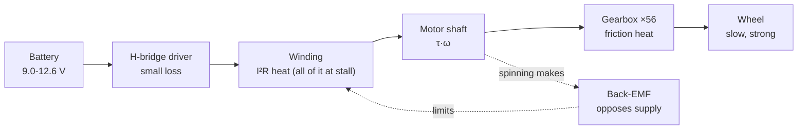

# FE.10 — DC motors: brushed vs brushless, gearboxes, stall current

<!-- glance:start -->
<!-- generated by tools/build.py from curriculum/syllabus.yaml — edit the syllabus, not this block -->

| | |
|---|---|
| **Track** | Optional foundation |
| **Difficulty** | Beginner |
| **Time** | 50 min |
| **Hardware** | none |
| **Software** | none |
| **Prerequisites** | [FE.01 Voltage, current, resistance and power](FE.01-voltage-current-resistance-power.md) |
| **Optional prerequisites** | [FP.04 Torque, gears and wheels — sizing motors](../physics/FP.04-torque-gears-wheels.md) |
| **Skip if** | You can read a motor spec sheet and know brushed vs BLDC trade-offs. |

<!-- glance:end -->

## What you will learn

- Read a motor spec table and pull out what matters: voltage, no-load speed, stall current, gear ratio.
- Predict how much current a motor draws when it starts, runs or stalls, and why stall current sizes your driver, fuse and battery.
- Explain back-EMF and use it to build a simple model of a motor from two measurements.
- Compute output speed and torque through a gearbox, including the losses.
- Choose between a brushed gear motor and a brushless (BLDC) motor for a robot, and read a Kv rating.

## Why it matters

karmel's wheels are driven by two 12 V brushed gear motors with Hall encoders (Yahboom 520 / JGB37-520 class, 1:56 gearbox, 205 RPM). Almost every electrical decision around them comes from one number that is not on the front of the listing: **stall current**. When the robot starts from rest, pushes against a wall, or a wheel gets stuck under a sofa, each motor briefly draws 3–4 A instead of the 0.1–0.3 A you see when the wheels spin freely. That number decides which motor driver you can use ([FE.12](FE.12-h-bridges-motor-drivers.md), [01.08](../../01-first-robot/01.08-first-motor-spin.md)), the fuse and wire gauge ([01.07](../../01-first-robot/01.07-power-system.md)), and why the Raspberry Pi reboots when the motors start ([02.02](../../02-robot-electronics/02.02-power-budget.md)).

Back-EMF is also why a motor's speed follows the voltage you give it. That makes PWM speed control work ([FE.07](FE.07-pwm.md)), and it is the physics behind the step response you measure in [08.02](../../08-control/08.02-motor-step-response.md). Later, the LiDAR's spinning head uses a small brushless motor, and bigger robots and quadrupeds use brushless actuators, so you need to know what "Kv" means.

<!-- prereqs:start -->
## Prerequisites

You need these first:

- [FE.01 Voltage, current, resistance and power](FE.01-voltage-current-resistance-power.md)

### Optional prerequisite links

New to any of these? Take the foundation lesson first; skip it if you already know it.

- [FP.04 Torque, gears and wheels — sizing motors](../physics/FP.04-torque-gears-wheels.md)

Check your readiness: `python course.py why FE.10`
<!-- prereqs:end -->

## Concept

A DC motor is a coil of wire in a magnetic field. Current through the coil makes a force, and the force turns the shaft. That part is intuitive. The part people miss: **a spinning motor is also a generator.** When the coil moves through the magnets, it generates a voltage that opposes the supply. This is called **back-EMF** (electromotive force).

Think of a water pump in a pipe loop, where the pipe has a turbine in it. At standstill nothing pushes back, and a lot of water rushes through, limited only by the narrow pipe (the winding resistance). As the turbine speeds up, it pushes back harder, and the flow drops. At full speed it pushes back almost as hard as the pump, and only a trickle flows, just enough to overcome friction.

So:

- **Stalled (speed 0):** no back-EMF. Current = voltage ÷ winding resistance. This is the maximum current, and the motor makes its maximum torque. All the electrical power becomes heat in the winding.
- **Free-running (no load):** back-EMF almost equals the supply voltage. The current is small, just enough to overcome friction.
- **In between:** the heavier the load, the slower the motor turns, and the more current it draws.

Every start is a brief stall. At the instant you apply voltage the motor is not moving yet, so for a few milliseconds it draws stall current. A robot that starts both motors at full duty from rest asks the battery for the stall current of two motors at once.

A **brushed** motor switches the current between coils mechanically. Carbon brushes rub on a segmented ring (the commutator) on the shaft. It is simple: apply DC and it spins, and reversing the polarity reverses it. The brushes wear out and make electrical noise.

A **brushless** motor (BLDC) has no brushes. The magnets spin and the coils stay still. Something must switch the coils in the right order at the right moment. That is an electronic controller (an ESC, or a field-oriented control driver) that knows the rotor position from Hall sensors, an encoder, or back-EMF. You cannot run a BLDC by connecting it to a battery.

A **gearbox** trades speed for torque. The small motor inside karmel's gear motor spins at about 11,500 RPM. A 1:56 gearbox turns that into 205 RPM at the wheel, with (almost) 56 times the torque. Small motors are fast and weak. Wheels need slow and strong.

> [!TIP]
> **Ask your teacher:** "Explain back-EMF with the pump-and-turbine analogy, then tell me what happens to the current when I grab a spinning wheel."

## Technical explanation

### Level 1 — Reading a gear motor spec table

This is the spec table Yahboom publishes for the 520 motor family (12 V versions). Cheap motors are sold under many names (JGB37-520, MD520, "37 mm encoder gear motor"). **Check your motor's own datasheet or listing**, because the same case can hold a different winding.

| Parameter | 1:19 | 1:30 | **1:56 (karmel)** |
|---|---|---|---|
| Rated voltage | 12 V | 12 V | 12 V |
| Output speed (no load) | 550 RPM | 333 RPM | **205 RPM** |
| Rated current | 0.3 A | 0.3 A | 0.3 A |
| Stall current | 3 A | 3 A | **4 A** |
| Stall torque | 3.1 kg·cm | 4.8 kg·cm | 8.3 kg·cm |
| Encoder | 11-pulse Hall, A/B | same | same |

What each line means for you:

- **Rated voltage** is where the numbers were measured, not a hard limit. On a 3S Li-ion pack the motor sees 9.0–12.6 V. Speed and stall current scale roughly with voltage.
- **No-load speed** is the ceiling. Under load and on a half-empty battery you get less. With 90 mm wheels, 205 RPM is about 0.97 m/s at the rim, far more than an indoor robot needs.
- **Rated current** is a comfortable continuous operating point. It is not the maximum.
- **Stall current** is what you design the power system for.
- **Torque in kg·cm** is a hobby unit: the weight in kg the shaft can hold on a 1 cm lever. Convert with $1\ \text{kg·cm} = 0.0981\ \text{N·m}$. So 8.3 kg·cm is 0.81 N·m.

Cheap listings are often internally inconsistent. The stall current and the no-load speed are usually the most trustworthy lines, and you can check both yourself with a multimeter and a phone stopwatch.

### Level 2 — Stall current is the design number

Stall current appears in four situations:

1. **Every start from rest**, for tens of milliseconds, unless you ramp the duty cycle up.
2. **Reversing at speed.** Back-EMF now *adds* to the supply for a moment, so the current can briefly exceed stall current.
3. **A blocked wheel**: pushing a wall, stuck on a cable, or the robot held in your hand.
4. **A bug**: a control loop saturates at 100 % duty while the wheel can't move.

Design rules that follow:

- **Motor driver:** its *peak* rating must survive stall current, and its *continuous* rating must cover your normal running current. Better drivers limit current actively, which turns a stall into a controlled situation instead of a burnt chip ([FE.12](FE.12-h-bridges-motor-drivers.md)).
- **Battery and wiring:** plan for both motors stalling at the same time (8 A or more for karmel at full charge).
- **Fuse:** above normal peaks, below what the wiring can take. [01.07](../../01-first-robot/01.07-power-system.md) uses a 10 A fuse.
- **Software:** ramp the commanded duty, and stop the motor if the encoder says the wheel isn't moving while the duty is high. [01.10](../../01-first-robot/01.10-pi-pico-protocol.md) adds a watchdog for the related case of lost commands.

> [!NOTE]
> The winding gets hot at stall. All the electrical power, $V \cdot I = 12 \times 4 = 48$ W, becomes heat in a motor the size of a thumb. A few seconds are fine. A minute can melt the winding insulation or demagnetize the magnets.

### Level 3 — The math: a two-parameter motor model

A brushed DC motor, ignoring inductance (fine for anything slower than a few milliseconds), is two equations:

$$V = I R + k\,\omega \qquad \tau = k\,(I - I_0)$$

- $V$ is the applied voltage (V), $I$ the current (A), $R$ the winding resistance (Ω).
- $\omega$ is the **motor** shaft speed in rad/s, and $k\,\omega$ is the back-EMF.
- $k$ is the motor constant. In SI units the back-EMF constant (V·s/rad) and the torque constant (N·m/A) are **the same number**.
- $I_0$ is the no-load current: the part of the current spent on friction.

From the first equation:

$$I_\text{stall} = \frac{V}{R} \qquad \omega_\text{no-load} \approx \frac{V - I_0 R}{k}$$

**Numerical example (karmel's 1:56 motor).** The table says 4 A stall at 12 V, so $R = 12/4 = 3.0\ \Omega$. Output no-load speed 205 RPM means motor speed $205 \times 56 = 11{,}480$ RPM $= 11480 \cdot 2\pi/60 = 1202$ rad/s. Assume you measured $I_0 = 0.10$ A with the wheel in the air. Then

$$k = \frac{12 - 0.10 \times 3.0}{1202} = 0.00973\ \text{V·s/rad}$$

Now you can predict anything. Halfway to no-load speed ($\omega = 601$ rad/s): $I = (12 - 0.00973 \times 601)/3 = 2.05$ A.

**Torque-speed line.** Substituting, torque falls linearly from stall torque at $\omega = 0$ to zero at no-load speed. Mechanical power $P = \tau\,\omega$ is zero at both ends and **peaks at half the no-load speed**. You never want to run there continuously on a small motor, because the current is half the stall current. Real robots cruise near no-load speed with light torque.

**Gearbox.** With gear ratio $N$ (motor turns per output turn) and efficiency $\eta$:

$$\omega_\text{out} = \frac{\omega_\text{motor}}{N} \qquad \tau_\text{out} = \tau_\text{motor} \cdot N \cdot \eta$$

With ideal gears the motor model gives stall torque $0.00973 \times (4.0 - 0.1) \times 56 = 2.13$ N·m. The sheet says 0.81 N·m, which implies an effective efficiency of about 38 %. Small spur gearboxes are typically 50–80 % efficient, and at stall they are worse. Treat torque ratings as rough, and size the drivetrain with margin ([FP.04](../physics/FP.04-torque-gears-wheels.md) does the wheel-force math).

**Voltage scaling.** Stall current is $V/R$, so on a full 3S pack (12.6 V) it is $12.6/3.0 = 4.2$ A per motor, or **8.4 A for both**. On an almost-empty pack (9.0 V) it is 3.0 A per motor, and the top speed falls by the same ratio.

### Level 4 — Brushed vs brushless in practice

| | Brushed DC gear motor | Brushless (BLDC) |
|---|---|---|
| How it is driven | Apply DC; an H-bridge for direction and PWM for speed | Needs a 3-phase controller (ESC or FOC driver) |
| Cost and complexity | Low. The driver is a ₪30–60 board | Higher. The controller is the hard part |
| Efficiency | 50–80 % | 80–90 %+ |
| Lifetime | Brushes wear (hundreds to a few thousand hours) | Bearings only |
| Electrical noise | High (brush sparking) | Low |
| Low-speed control | Easy with a gearbox and encoder | Needs sensors plus FOC for smooth low speed |
| Where you see it | karmel's wheels, servos, toys | Drones, LiDAR spin motors, e-bikes, hoverboard wheels, quadruped and arm actuators |

**Kv rating.** BLDC motors are specified by Kv, the no-load RPM per volt. A 1000 Kv motor on a 3S *LiPo* pack (11.1 V — LiPo datasheets count 3.7 V per cell, where karmel's 3S Li-ion pack counts 3.6 V and so is 10.8 V) spins at about $1000 \times 11.1 = 11{,}100$ RPM without load. Kv is the inverse of the motor constant:

$$k_t = \frac{60}{2\pi\,K_v}\ \text{N·m/A}$$

For 1000 Kv, $k_t = 60/(2\pi \times 1000) = 0.00955$ N·m/A. High Kv means fast and weak per amp (drone propellers). Low Kv means slow and strong per amp (gimbals, robot joints). Robot actuators such as the ones in quadrupeds use low-Kv "pancake" BLDC motors with a small planetary gearbox and FOC drivers. That is a Stage-6+ topic ([02.10](../../02-robot-electronics/02.10-can-bus-and-smart-actuators.md) shows how they are commanded).

**Why karmel uses brushed gear motors:** one cheap H-bridge per motor, a gearbox that gives low speed and high torque directly, an encoder already on the shaft, and simple PWM control from a Pico. Nothing about indoor navigation needs BLDC efficiency.

## Diagram

The electrical model of a brushed motor and the resulting curves:

```text
   supply V                              torque τ, current I
     +──────┐                               │
            │                         stall │●  I_stall = V/R
          ┌─┴─┐                             │ ╲
          │ R │  winding resistance         │   ╲  current and torque fall
          └─┬─┘                             │     ╲  linearly with speed
          ┌─┴─┐                             │       ╲
          │ E │  back-EMF  E = k·ω          │  power ╲___ P = τ·ω peaks at half speed
          └─┬─┘                             │ ___----╲---___
     -──────┘                               │/          ╲    ╲
                                            └──────────────●──── speed ω
                                            0          no-load speed ≈ V/k
```

Where the energy goes in a gear motor:



## Code

`fe10_motor_model.py` builds the Level 3 model from the spec sheet plus one assumed measurement, prints the torque-speed table, and shows how stall current changes with battery voltage. Save it anywhere and run `python fe10_motor_model.py` (Python 3.10+, no packages needed).

```python
"""FE.10 — brushed DC motor model from a spec sheet plus two multimeter measurements.

Run:  python fe10_motor_model.py
"""
from __future__ import annotations

import math
from dataclasses import dataclass

G = 9.81  # m/s^2, to convert kg·cm to N·m


@dataclass(frozen=True)
class GearMotor:
    voltage_v: float          # test/rated voltage
    resistance_ohm: float     # winding resistance (measure it, or V / I_stall)
    no_load_current_a: float  # measured with the wheel in the air
    no_load_rpm_out: float    # output shaft speed at no load
    gear_ratio: float         # motor revolutions per output revolution

    @property
    def stall_current_a(self) -> float:
        return self.voltage_v / self.resistance_ohm

    @property
    def omega_motor_no_load(self) -> float:
        return self.no_load_rpm_out * self.gear_ratio * 2 * math.pi / 60

    @property
    def k(self) -> float:
        """Back-EMF constant (V·s/rad) == torque constant (N·m/A) in SI units."""
        back_emf = self.voltage_v - self.no_load_current_a * self.resistance_ohm
        return back_emf / self.omega_motor_no_load

    def current_at(self, omega_motor: float) -> float:
        return (self.voltage_v - self.k * omega_motor) / self.resistance_ohm

    def output_torque_nm(self, omega_motor: float, gear_efficiency: float) -> float:
        motor_torque = self.k * (self.current_at(omega_motor) - self.no_load_current_a)
        return motor_torque * self.gear_ratio * gear_efficiency


def kg_cm_to_nm(kg_cm: float) -> float:
    return kg_cm * G / 100


def main() -> None:
    # Yahboom 520 (JGB37-520 class), 1:56, 12 V. Stall 4 A and 205 RPM from the spec table;
    # the no-load current is an assumption — measure yours.
    m = GearMotor(voltage_v=12.0, resistance_ohm=12.0 / 4.0, no_load_current_a=0.10,
                  no_load_rpm_out=205.0, gear_ratio=56.0)
    print(f"winding resistance      R  = {m.resistance_ohm:.2f} ohm")
    print(f"stall current (12 V)       = {m.stall_current_a:.2f} A")
    print(f"motor no-load speed        = {m.omega_motor_no_load:.0f} rad/s "
          f"({m.no_load_rpm_out * m.gear_ratio:.0f} RPM)")
    print(f"motor constant          k  = {m.k:.5f} V*s/rad = N*m/A")

    stall_nm_ideal = m.output_torque_nm(0.0, gear_efficiency=1.0)
    stall_nm_sheet = kg_cm_to_nm(8.3)
    print(f"stall torque, ideal gears  = {stall_nm_ideal:.2f} N*m")
    print(f"stall torque, spec sheet   = {stall_nm_sheet:.2f} N*m (8.3 kg*cm)")
    print(f"implied gearbox efficiency = {stall_nm_sheet / stall_nm_ideal:.0%}")

    print("\n  wheel RPM | current A | torque N*m (eff 0.6) | power out W")
    for frac in (0.0, 0.25, 0.5, 0.75, 1.0):
        w_motor = frac * m.omega_motor_no_load
        tau = m.output_torque_nm(w_motor, gear_efficiency=0.6)
        w_out = w_motor / m.gear_ratio
        print(f"  {w_out * 60 / (2 * math.pi):9.0f} | {m.current_at(w_motor):9.2f} | "
              f"{tau:20.2f} | {tau * w_out:11.2f}")

    # Same motor on a full and on an almost-empty 3S pack: stall current scales with voltage.
    for pack_v in (12.6, 10.8, 9.0):
        print(f"stall current at {pack_v:4.1f} V = {pack_v / m.resistance_ohm:.2f} A per motor, "
              f"{2 * pack_v / m.resistance_ohm:.1f} A for both")

    # Top speed of karmel with 90 mm wheels, no load
    r_wheel = 0.045
    v = m.no_load_rpm_out * 2 * math.pi / 60 * r_wheel
    print(f"no-load rim speed (90 mm wheel) = {v:.2f} m/s")

    # Brushless Kv example: 1000 Kv on a 3S LiPo (3.7 V/cell), not karmel's 10.8 V Li-ion pack
    kv, volts = 1000, 11.1
    kt = 60 / (2 * math.pi * kv)
    print(f"1000 Kv on a 3S LiPo (11.1 V): {kv * volts:.0f} RPM no-load, Kt = {kt:.5f} N*m/A")


if __name__ == "__main__":
    main()
```

Output:

```text
winding resistance      R  = 3.00 ohm
stall current (12 V)       = 4.00 A
motor no-load speed        = 1202 rad/s (11480 RPM)
motor constant          k  = 0.00973 V*s/rad = N*m/A
stall torque, ideal gears  = 2.13 N*m
stall torque, spec sheet   = 0.81 N*m (8.3 kg*cm)
implied gearbox efficiency = 38%

  wheel RPM | current A | torque N*m (eff 0.6) | power out W
          0 |      4.00 |                 1.28 |        0.00
         51 |      3.02 |                 0.96 |        5.13
        102 |      2.05 |                 0.64 |        6.84
        154 |      1.08 |                 0.32 |        5.13
        205 |      0.10 |                 0.00 |        0.00
stall current at 12.6 V = 4.20 A per motor, 8.4 A for both
stall current at 10.8 V = 3.60 A per motor, 7.2 A for both
stall current at  9.0 V = 3.00 A per motor, 6.0 A for both
no-load rim speed (90 mm wheel) = 0.97 m/s
1000 Kv on a 3S LiPo (11.1 V): 11100 RPM no-load, Kt = 0.00955 N*m/A
```

## Exercise

### Exercise FE.10-E1 — Stall current from a resistance measurement `[numerical]`

Hardware: none (use the numbers given).

You measured a motor's winding resistance with a multimeter at several shaft positions and got an average of 3.4 Ω. Using the model:

1. What is the stall current on a fully charged 3S pack (12.6 V)?
2. What do both motors draw together if the robot starts at 100 % duty from rest?
3. A TB6612FNG driver is rated 1.2 A continuous and 3.2 A peak per channel. Is it safe for this motor at full charge? What must the firmware do?

### Exercise FE.10-E2 — The motor as a generator `[hardware]`

Hardware: `robot-base` (one wheel motor, **disconnected** from the driver), `tools` (multimeter).

> [!CAUTION]
> **Safety:** Disconnect the motor's two power wires from the motor driver first. Spinning a connected motor by hand pushes voltage back into the driver. Keep fingers clear of the gearbox output and wheel spokes.

1. Set the multimeter to DC volts (20 V range) and connect the probes to the motor's two power wires (on the 6-pin PH2.0 cable these are usually labeled M1/M2 or motor+/motor−, not the encoder pins; check your motor's pinout).
2. **Before spinning, predict** the voltage if you turn the wheel at 1 revolution per second, using $k = 0.00973$ V·s/rad and the 1:56 gearbox.
3. Spin the wheel steadily at about one turn per second, then two. Note the readings and the sign when you reverse direction.
4. Measure the winding resistance at five shaft positions (turn the wheel a little between readings). Compute the stall current at 12.6 V from the average.

No motor? Use the model: compute the voltage for 0.5, 1, 2 and 3 wheel revolutions per second.

### Exercise FE.10-E3 — Predict the current when you grab the wheel `[predict]`

Hardware: none for the prediction. The optional check needs `robot-base` on a stand after [01.08](../../01-first-robot/01.08-first-motor-spin.md) and a current reading (an INA219 from [01.14](../../01-first-robot/01.14-battery-monitoring.md) or the driver's current-sense output).

The wheel spins freely at 50 % duty on a 12 V supply. You slowly squeeze the tire with your fingers until the wheel stops. **Predict** how the current changes (sketch it against time) and what the current is at the moment the wheel stops. Then explain why a small increase in load can make a big increase in current.

> [!CAUTION]
> **Safety:** If you check this on the real robot, the robot sits on a stand with wheels in the air, use 30 % duty or less, hold the tire for at most two seconds, and keep hair, sleeves and cables away from the wheel.

### Exercise FE.10-E4 — Read a brushless motor `[numerical]`

Hardware: none.

A small BLDC motor is labeled 2300 Kv and runs on a 3S LiPo at 12.6 V.

1. What is its approximate no-load speed in RPM?
2. What is its torque constant $k_t$ in N·m/A?
3. You need 0.2 N·m at a robot joint. How much current does this motor need without a gearbox? With a 10:1 planetary gearbox at 90 % efficiency?
4. Why would you choose a lower-Kv motor for a robot joint?

## Expected result

- **FE.10-E1:** (1) $12.6/3.4 = $ **3.7 A** per motor. (2) **≈ 7.4 A** for both. (3) The peak rating of 3.2 A is **below** the stall current, so a hard start or a stuck wheel can trip the TB6612's thermal shutdown or damage it. The firmware must ramp the duty (for example 0 → 100 % over 200–300 ms), and it should cut the motor when the duty is high but the encoder shows no motion. A driver with current limiting (DRV8874) is the robust fix.
- **FE.10-E2:** Prediction: 1 wheel rev/s = 56 motor rev/s = 351.9 rad/s, so $E = 0.00973 \times 351.9 = $ **≈ 3.4 V**, and **≈ 6.8 V** at 2 rev/s. Real readings of 2.5–4.5 V at "about one turn per second" are normal, since hand speed is imprecise. The sign flips when you reverse. Resistance readings typically vary by ±10–20 % with shaft position. A 2.8–3.5 Ω average gives 3.6–4.5 A stall at 12.6 V. If your values are far off (for example 30 Ω), you are probably measuring encoder wires.
- **FE.10-E3:** The current rises smoothly as the wheel slows: the load increases, speed drops, back-EMF drops, and more current flows. At the moment it stops, current is the stall current **at the effective voltage**. At 50 % duty on 12 V that is about $6/3 = 2$ A. The relationship is steep because the current depends on the *difference* $V - k\omega$, which is small when the motor spins freely. At 50 % duty (about 6 V effective), a 10 % drop from no-load speed raises the current by about $0.1 \times 5.85/3 = 0.2$ A, twice the 0.1 A no-load current.
- **FE.10-E4:** (1) $2300 \times 12.6 = $ **≈ 29,000 RPM**. (2) $k_t = 60/(2\pi \times 2300) = $ **0.00415 N·m/A**. (3) Direct: $0.2/0.00415 = $ **48 A**, which is unrealistic for a small motor. With 10:1 at 90 %: $0.2/(10 \times 0.9) = 0.0222$ N·m at the motor, so **5.4 A**. (4) Low Kv means more torque per amp, so less current, less $I^2R$ heat, and a smaller gearbox (less backlash).

## Troubleshooting

### Symptom: the motor hums but doesn't turn

1. **Measure the voltage at the motor terminals** while commanding it. Much lower than the battery voltage? The driver or the wiring is dropping it. Go to [FE.12](FE.12-h-bridges-motor-drivers.md) (an L298N drops 2–3 V) or check for thin wires and loose screw terminals.
2. **Is the duty cycle below the deadband?** Small motors need about 10–15 % duty just to overcome friction in the gearbox. Try 30 %.
3. **Turn the wheel by hand with power off.** Stiff or gritty? The gearbox is jammed or the wheel rubs on the chassis.
4. **Is the driver in current limit or thermal shutdown?** A stalled motor makes the driver chop the current. Check the driver's fault pin or feel for a hot chip (carefully).

### Symptom: the Pi or Pico resets when the motors start

This is almost always stall current at startup pulling the battery voltage down. Measure the battery voltage at the moment of starting (a multimeter's min/max mode helps). If it dips by more than 1 V, ramp the duty in firmware, check the battery's charge and wiring, and read [02.02](../../02-robot-electronics/02.02-power-budget.md).

### Symptom: one motor is noticeably slower than the other at the same duty

1. Swap the motors' connections at the driver. Does the slowness follow the motor or the driver channel?
2. **Follows the motor:** compare the no-load current of both. A higher current means more friction (gearbox or wheel rubbing). A slightly different speed (±5 %) is normal manufacturing spread. Closed-loop speed control ([08.04](../../08-control/08.04-proportional-control.md)) removes it.
3. **Follows the channel:** check the PWM frequency and duty of both channels and the connector.

## Common mistakes

- **Sizing the driver by the "rated current".** 0.3 A rated means nothing when the motor stalls at 4 A. Use stall current for peak ratings and protection.
- **Ignoring the battery voltage range.** Numbers at 12 V become 5 % higher at 12.6 V and 25 % lower at 9 V. Speed control that works on a full battery can fail on an empty one without feedback.
- **Stalling motors for long periods.** A robot pushing against a wall at full duty cooks the motor and the driver. Add stall detection.
- **Reversing at full speed.** Current can briefly exceed stall current. Ramp through zero.
- **Buying a faster gearbox "for more speed".** A 1:19 motor at 550 RPM gives too little torque at low speed and makes precise indoor control harder. Speed is cheap and torque at low speed is what you need.
- **Trying to run a BLDC from an H-bridge.** A three-wire brushless motor needs a three-phase controller.
- **Confusing encoder wires with motor wires.** The encoder runs at 3.3–5 V. Putting 12 V on it destroys the Hall sensors.

## Knowledge check

1. Why does a DC motor draw far more current when stalled than when spinning freely?
   <details><summary>Answer</summary>

   A spinning motor generates back-EMF $k\omega$ that opposes the supply, so the current is $(V - k\omega)/R$. At stall $\omega = 0$, nothing opposes the supply, and $I = V/R$, limited only by the small winding resistance.
   </details>

2. A 12 V motor has a 2.4 Ω winding. What is its stall current on a 3S pack at 12.6 V, and what is the heat in the winding at stall?
   <details><summary>Answer</summary>

   $I = 12.6/2.4 = 5.25$ A. Heat $= I^2 R = 5.25^2 \times 2.4 = 66$ W (equivalently $V \cdot I = 12.6 \times 5.25$). A small motor can't dissipate that for long.
   </details>

3. A motor spins at 9,000 RPM at no load. It drives a 1:30 gearbox with 70 % efficiency, and its motor-side torque is 0.02 N·m. What are the output speed and torque?
   <details><summary>Answer</summary>

   Speed $9000/30 = 300$ RPM. Torque $0.02 \times 30 \times 0.7 = 0.42$ N·m.
   </details>

4. Predict: you connect a 12 V brushed motor directly to a 12 V battery, then swap the two wires. What happens? What happens if you do the same with a three-wire BLDC motor?
   <details><summary>Answer</summary>

   The brushed motor reverses direction, since the commutator does the switching. The BLDC motor doesn't spin at all with DC on two of its wires (at most it jerks to one position and heats up). It needs a controller that sequences its three phases.
   </details>

5. What does "Kv = 800" mean, and what is the motor's torque constant in SI units?
   <details><summary>Answer</summary>

   It spins at about 800 RPM per volt at no load. $k_t = 60/(2\pi \times 800) = 0.0119$ N·m/A.
   </details>

6. Debugging: the robot drives fine on a full battery, but in the last 20 minutes it can't climb the doorway threshold. Why?
   <details><summary>Answer</summary>

   Stall torque is proportional to stall current, which is $V/R$. At 9–10 V instead of 12.6 V the motors make about 25 % less maximum torque, and the battery's internal resistance sags the voltage further under load. The fix is enough torque margin (gear ratio), speed ramps, or not running the pack that low.
   </details>

7. Why does karmel use brushed gear motors instead of brushless motors?
   <details><summary>Answer</summary>

   Brushed gear motors run from a simple, cheap H-bridge with PWM, the gearbox gives the slow speed and high torque wheels need, and the encoder is built in. Brushless efficiency and lifetime don't matter for a small indoor robot, and BLDC needs a more complex controller.
   </details>

## Practical challenge

Characterize one of your wheel motors and build its model.

1. With the robot on a stand, measure at 100 % duty on a known supply voltage: the no-load current (INA219 or driver current sense) and the no-load wheel speed (encoder counts over 5 s, or 10 turns timed by phone).
2. With power off, measure the winding resistance at 5 shaft positions.
3. Compute $R$, $k$, $I_\text{stall}$ and the no-load speed at 9.0, 10.8 and 12.6 V using `fe10_motor_model.py`.
4. Verify one prediction: command 50 % duty and compare the measured speed and current with the model's prediction for half the voltage.

**Acceptance criteria:** a table with measured and predicted values for both motors. The 50 % speed prediction is within 15 %. You can state the worst-case current for both motors at full charge, and you have checked it against your driver's peak rating and your fuse.

## You can skip this if…

You answer knowledge-check questions 1, 2, 4 and 6 correctly without looking, and you can explain from a spec table which number sizes the motor driver and why.

`python course.py skip FE.10 --reason "I read motor specs and know stall current and BLDC vs brushed"`

## Go deeper

- Adafruit, Motor Selection Guide: https://learn.adafruit.com/adafruit-motor-selection-guide — DC vs servo vs stepper, and which driver each needs.
- Pololu, 37D metal gearmotors: https://www.pololu.com/category/116/37d-metal-gearmotors — the well-documented relative of the JGB37-520 class, with honest stall current, speed and torque tables and performance graphs per voltage.
- Yahboom, 520 motor introduction and usage: https://www.yahboom.net/public/upload/upload-html/1740736196/0.%20Motor%20introduction%20and%20usage.html — the spec table and encoder pinout for the course's motor family.
- Pololu, brushed DC motor drivers: https://www.pololu.com/category/11/brushed-dc-motor-drivers — every product page lists continuous vs peak current, which you now know how to read against stall current.
- All About Circuits textbook (Kuphaldt, *Lessons in Electric Circuits*): https://www.allaboutcircuits.com/textbook/ — deeper background on magnetism, inductance and motors when you want the theory.

## Progress checkpoint

- [ ] I can read a gear motor spec table and say which numbers size the driver, fuse and battery.
- [ ] I can compute stall current from winding resistance and voltage, and explain back-EMF.
- [ ] I can compute output speed and torque through a gearbox with losses.
- [ ] I can explain brushed vs brushless and convert a Kv rating to a torque constant.

`python course.py complete FE.10` (exercises done) · `python course.py master FE.10` (challenge done) · `python course.py struggle FE.10 "what was hard"`

Next: [FE.11 — Servo motors and stepper motors](FE.11-servos-and-steppers.md), or back to [01.08](../../01-first-robot/01.08-first-motor-spin.md) if you came from there.
