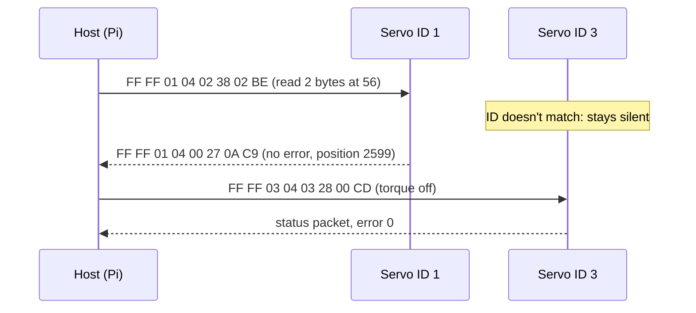

# FE.11 — Servo motors and stepper motors

<!-- glance:start -->
<!-- generated by tools/build.py from curriculum/syllabus.yaml — edit the syllabus, not this block -->

| | |
|---|---|
| **Track** | Optional foundation |
| **Difficulty** | Beginner |
| **Time** | 45 min |
| **Hardware** | none |
| **Software** | none |
| **Prerequisites** | [FE.07 PWM — pulse-width modulation](FE.07-pwm.md)<br>[FE.10 DC motors: brushed vs brushless, gearboxes, stall current](FE.10-dc-motors.md) |
| **Skip if** | You know hobby servos vs bus servos vs steppers. |

<!-- glance:end -->

## What you will learn

- Explain what is inside a hobby servo and command one with a PWM pulse width.
- Explain how a serial bus servo (Feetech STS3215, used on the SO-101 arm) differs: IDs, a shared data line, position/load/temperature feedback.
- Build and check a bus-servo packet by hand and in Python, including its checksum.
- Size the power supply for a six-servo arm from stall current.
- Explain how a stepper motor moves in steps, what microstepping does, and why steppers can lose steps silently.
- Choose between a DC gear motor, a hobby servo, a bus servo and a stepper for a given job.

## Why it matters

karmel's wheels use DC gear motors with encoders ([FE.10](FE.10-dc-motors.md)), because wheels spin continuously and need speed control. The arm you add in module 14 is different: every joint must go to an **angle** and hold it against gravity. The SO-101 arm does that with six Feetech STS3215 **serial bus servos**, each a small gear motor with a magnetic encoder and its own controller, all sharing one three-wire cable. [14.02](../../14-robotic-arm/14.02-buying-and-assembling-the-arm.md) sets their IDs and [14.03](../../14-robotic-arm/14.03-controlling-servos.md) commands positions, speeds and torque limits. Both assume you know what an ID, a control table and torque enable are, and why the arm needs a 5 A power supply.

Hobby PWM servos show up in pan-tilt camera mounts and grippers, and they are the simplest example of closed-loop position control. Steppers are the motors in your 3D printer ([F3D.01](../3d-printing-and-cad/F3D.01-why-3d-printing.md)) and in many linear stages. You won't use them on karmel, but you should know why.

<!-- prereqs:start -->
## Prerequisites

You need these first:

- [FE.07 PWM — pulse-width modulation](FE.07-pwm.md)
- [FE.10 DC motors: brushed vs brushless, gearboxes, stall current](FE.10-dc-motors.md)

### Optional prerequisite links

None.

Check your readiness: `python course.py why FE.11`
<!-- prereqs:end -->

## Concept

All three motor types in this lesson answer one question: **"How do I make a shaft go to an angle and stay there?"**

A **hobby servo** is a DC motor, a gearbox, a potentiometer (an angle sensor) on the output shaft, and a tiny control board, all in one plastic box with three wires: ground, power, signal. You send it a pulse every 20 ms. The **width** of the pulse is the target angle: about 1.5 ms means "center". The board compares the target with the potentiometer and drives the motor until they match. That is a closed control loop inside the box. It tells you nothing back.

A **serial bus servo** is the grown-up version. Inside: a DC motor, a gearbox, a 12-bit magnetic encoder, and a microcontroller. Instead of a pulse, it listens on a shared serial line. Every servo has an **ID**, like a network address. You send "ID 3: go to position 2048", and only servo 3 acts. You can also ask "ID 3: what is your position, load and temperature?" and it answers. All servos are daisy-chained on the same three wires. For a software engineer: a hobby servo is a fire-and-forget UDP datagram on a dedicated wire, and a bus servo is a request/response protocol on a shared bus with addressing and checksums.

A **stepper motor** has no sensor and no internal loop. Its rotor has many teeth, and its two coils are energized in a sequence. Each change in the sequence pulls the rotor exactly one step, typically 1.8° (200 steps per turn). Count the steps you sent and you know the angle, **as long as the motor never slipped**. If the load is too high or you accelerate too fast, it skips steps and nothing tells you. 3D printers accept that risk because their loads are predictable.

> [!TIP]
> **Ask your teacher:** "Compare a hobby servo, a bus servo and a stepper as if they were three ways to call a remote service: which ones are fire-and-forget, which return a status, and what happens on failure?"

## Technical explanation

### Level 1 — Hobby PWM servos

The control signal is a pulse repeated every 20 ms (50 Hz):

```text
 3.3 V ┌─┐                   ┌──┐                  ┌───┐
       │ │                   │  │                  │   │
 0 V ──┘ └───────────────────┘  └──────────────────┘   └──────
       1.0 ms                1.5 ms                2.0 ms
       ← one end             center                other end →
       |←──────── 20 ms period ────────→|
```

- The standard range is 1.0–2.0 ms for about ±45°–60°. Many servos accept 0.5–2.5 ms for their full 180°. **Check your servo's range**, and start with small moves: pushing a servo beyond its mechanical stop makes it stall and heat.
- The PWM frequency is not critical (40–60 Hz works). The pulse width is what matters. This is PWM used as a *message*, not to set average power ([FE.07](FE.07-pwm.md)).
- A 3.3 V signal from the Pico is enough for almost all servos.
- **Power does not come from the Pico.** A micro servo can pull around 0.5–1 A when it starts or stalls, and a standard-size servo 1–3 A. Use a separate 5–6 V supply (or the robot's 5 V rail if it has headroom), and connect its ground to the Pico's ground ([FE.16](FE.16-grounding.md)).
- **Continuous-rotation servos** use the same signal as a speed command: 1.5 ms stops, longer or shorter pulses spin one way or the other.

### Level 2 — Serial bus servos (Feetech STS3215)

The SO-101 follower arm uses six STS3215 servos with a 1:345 gearbox. The leader arm mixes 1:191, 1:345 and 1:147 versions, which are easier to move by hand.

| Property | STS3215 (check your version's label and seller page) |
|---|---|
| Voltage versions | "7.4 V" (the SO-ARM100 README powers it from a 5 V supply; about 16.5–19.5 kg·cm stall depending on voltage and source) and "12 V" (about 30 kg·cm stall) |
| Stall current | about 2.7 A listed for the 12 V version |
| Position sensor | 12-bit magnetic encoder: 4096 ticks per turn, 0.088° per tick |
| Bus | half-duplex TTL serial, one data wire, default **1,000,000 baud** |
| Connector | 3 pins: GND, V+, DATA. Each servo has two sockets, so they daisy-chain |
| Feedback | position, speed, load, voltage, temperature, current |

**Half-duplex** means one wire carries data in both directions, and only one device talks at a time. Your computer can't drive that wire directly. A **bus adapter** (the Waveshare board in the SO-101 kit, or Feetech's FE-URT-1) converts USB to the single-wire bus and injects the servo power into the same cable.

**The control table.** Each servo exposes numbered memory addresses, like registers:

| Address | Name | Size | Notes |
|---|---|---|---|
| 5 | ID | 1 | EEPROM: survives power-off |
| 6 | Baud rate | 1 | EEPROM |
| 9 / 11 | Min / max position limit | 2 / 2 | EEPROM: software joint limits inside the servo |
| 16 | Max torque limit | 2 | EEPROM |
| 40 | Torque enable | 1 | RAM: 0 = limp, 1 = holds position |
| 42 | Goal position | 2 | RAM: 0–4095 |
| 56 | Present position | 2 | read-only |
| 60 | Present load | 2 | read-only |
| 62 | Present voltage | 1 | read-only, 0.1 V per unit |
| 63 | Present temperature | 1 | read-only, °C |

**The packet.** Feetech uses the same framing as the older Dynamixel protocol 1.0:

```text
FF FF | ID | LEN | INSTR | PARAM 1 … PARAM n | CHK
LEN = n + 2        CHK = ~(ID + LEN + INSTR + PARAMS) & 0xFF
INSTR: 0x01 ping, 0x02 read, 0x03 write, 0x83 sync write (many servos, one packet)
```

The STS series stores 2-byte values **low byte first** (little-endian).

**Worked example.** "Servo 1, go to position 2048" (the middle of a turn):

- Params: address 42 = `0x2A`, then 2048 = `0x0800` as low, high = `00 08`.
- LEN = 3 params + 2 = `05`. INSTR = write = `03`.
- Sum = `01 + 05 + 03 + 2A + 00 + 08` = `0x3B`. Checksum = `~0x3B & 0xFF` = `0xC4`.
- On the wire: `FF FF 01 05 03 2A 00 08 C4`.

The servo answers with a **status packet** `FF FF ID LEN ERROR PARAMS CHK`. The error byte flags overload, overheating, voltage and angle problems. A broadcast ID of `0xFE` addresses all servos, and they don't reply, to avoid collisions on the shared wire.

Why two servos must never share an ID: both answer at once, the replies collide on the single wire, and you read garbage checksums. That is why [14.02](../../14-robotic-arm/14.02-buying-and-assembling-the-arm.md) connects the servos **one at a time** to assign IDs (new servos all ship as ID 1).

**Torque enable** is a safety switch. With torque off, the joint is limp and you can move it by hand (useful for calibration and teaching). Writing 1 makes the servo hold **the current goal position immediately**. If the stored goal differs from where the arm is now, the arm snaps there at full speed.

> [!CAUTION]
> **Safety (arm):** Before you enable torque, read the present position and write it as the goal position, set a low torque limit and a low speed, and keep your hands and face out of the arm's reach. Unplug the servo power to stop the arm. Don't count on Ctrl+C: the servos keep holding their last command.

### Level 3 — Power for a servo arm

Servos draw little current when idle and a lot when they accelerate or hold a load against gravity. Size the supply from the worst realistic case.

**Worked example (SO-101 follower, 12 V servos).** Stall current is about 2.7 A per servo.

- All six stalled: $6 \times 2.7 = 16.2$ A. That doesn't happen in normal use, but a collision can stall several joints.
- Realistic heavy moment: shoulder and elbow near stall while lifting, four other joints holding at about 0.3 A: $2 \times 2.7 + 4 \times 0.3 = 6.6$ A.

A 12 V 5 A supply (what the SO-ARM100 README asks for) covers normal motion. In a heavy moment it hits its current limit and its voltage dips. The servos report voltage errors and may reset. Symptoms: the arm "sags" or twitches during fast lifts. Software fixes: lower acceleration, lower torque limits, don't move shoulder and elbow at full speed together.

**Match the voltage version to the supply.** Don't feed 7.4 V servos from a 3S pack (up to 12.6 V). If the arm will run from karmel's battery, buy the 12 V version, as [14.02](../../14-robotic-arm/14.02-buying-and-assembling-the-arm.md) recommends.

### Level 4 — Stepper motors

A common "NEMA 17" stepper has 200 full steps per revolution (1.8°) and two coils (phases). A **stepper driver** (A4988, DRV8825, TMC2209 class) takes two logic signals, STEP and DIR. Each STEP pulse moves one step (or one microstep). The driver regulates the coil **current**, and you set that current with a small potentiometer or over UART.

**Microstepping.** The driver shares the current between the two coils in sine-shaped proportions, placing the rotor between full steps. At 1/16 microstepping there are $200 \times 16 = 3200$ microsteps per turn. Motion gets smoother and quieter. Positioning accuracy does not improve by 16 times, because the torque per microstep is small and the load shifts the rotor.

**Converting to linear motion:**

$$\text{steps per mm} = \frac{\text{full steps per turn} \times \text{microsteps}}{\text{mm per turn}}$$

- GT2 belt (2 mm pitch) on a 20-tooth pulley: 40 mm per turn, so $3200/40 = 80$ steps/mm.
- T8 lead screw with 8 mm lead: $3200/8 = 400$ steps/mm.
- Moving a belt axis at 100 mm/s needs $100 \times 80 = 8000$ step pulses per second.

**Steppers draw current even when standing still.** Holding position needs coil current. A motor with 1.5 Ω per phase at 1.2 A dissipates $2 \times 1.2^2 \times 1.5 = 4.3$ W at rest with both phases energized. That is fine on a printer plugged into the wall. On a battery robot it is wasted energy.

**Choosing:**

| Need | Pick | Why |
|---|---|---|
| Wheels: continuous rotation, speed control | DC gear motor + encoder | Efficient, cheap, feedback from the encoder |
| Simple pan/tilt, a gripper open/close | Hobby PWM servo | One wire, no feedback needed |
| Arm joints with feedback, many actuators | Serial bus servo | Position/load feedback, one shared cable, IDs |
| Precise linear axis, predictable load, wall power | Stepper + driver | Open-loop positioning without an encoder |
| High-performance legs or arms | BLDC actuator + FOC (CAN bus) | Torque control, backdrivable ([FE.19](FE.19-can-bus-concepts.md)) |

## Diagram

The SO-101 bus: one adapter, six servos in a chain, each with its own ID.

```text
 Pi / laptop              bus adapter                     daisy chain (3-wire cable)
┌──────────┐  USB   ┌────────────────────┐   GND ──┬─────────┬─────────┬── … ──┐
│  lerobot │───────►│ USB ↔ half-duplex  │   V+  ──┼─────────┼─────────┼── … ──┤
│  / ROS 2 │        │ TTL, power inject  │   DATA──┼─────────┼─────────┼── … ──┤
└──────────┘        └─────────▲──────────┘         │         │         │       │
                              │                 ┌──┴──┐   ┌──┴──┐   ┌──┴──┐ ┌──┴──┐
                    12 V 5 A supply (or 5 V     │ ID 1│   │ ID 2│   │ ID 3│ │ ID 6│
                    for 7.4 V servos)           │ pan │   │lift │   │elbow│ │grip │
                                                └─────┘   └─────┘   └─────┘ └─────┘
```

| From | To | Signal | Voltage |
|---|---|---|---|
| Adapter GND | every servo GND (through the chain) | ground | 0 V |
| Adapter V+ | every servo V+ | servo power | 5 V or 12 V, matching the servo version |
| Adapter DATA | every servo DATA | half-duplex serial, 1 Mbaud | logic level (3.3–5 V) |
| Pi USB | adapter USB | USB CDC serial (`/dev/ttyACM0`) | 5 V USB |

A request/response exchange on the shared line:



## Code

### Build and parse bus-servo packets

`feetech_packets.py` runs on any computer (no hardware). It encodes commands, decodes replies and shows the checksum catching a corrupted byte. Run `python feetech_packets.py`.

```python
"""FE.11 — build and parse Feetech STS (SCS-style) bus-servo packets.

Packet on the wire:  FF FF | ID | LEN | INSTR | PARAMS... | CHK
  LEN = number of params + 2
  CHK = ~(ID + LEN + INSTR + sum(PARAMS)) & 0xFF
STS servos store 2-byte values little-endian (low byte first).

Run:  python feetech_packets.py
"""
from __future__ import annotations

from dataclasses import dataclass

PING, READ, WRITE, SYNC_WRITE = 0x01, 0x02, 0x03, 0x83
BROADCAST_ID = 0xFE

# STS3215 control table (addresses from the LeRobot Feetech tables)
TORQUE_ENABLE = 40
GOAL_POSITION = 42      # 2 bytes, 0..4095 = one full turn
PRESENT_POSITION = 56   # 2 bytes
PRESENT_LOAD = 60       # 2 bytes
PRESENT_VOLTAGE = 62    # 1 byte, units of 0.1 V
PRESENT_TEMPERATURE = 63


def checksum(body: bytes) -> int:
    return (~sum(body)) & 0xFF


def packet(servo_id: int, instruction: int, params: bytes = b"") -> bytes:
    if not 0 <= servo_id <= 0xFE:
        raise ValueError("servo id must be 0..254")
    body = bytes([servo_id, len(params) + 2, instruction]) + params
    return b"\xff\xff" + body + bytes([checksum(body)])


def write_goal_position(servo_id: int, ticks: int) -> bytes:
    if not 0 <= ticks <= 4095:
        raise ValueError("position must be 0..4095")
    return packet(servo_id, WRITE, bytes([GOAL_POSITION, ticks & 0xFF, ticks >> 8]))


def read_present_position(servo_id: int) -> bytes:
    return packet(servo_id, READ, bytes([PRESENT_POSITION, 2]))


@dataclass(frozen=True)
class Status:
    servo_id: int
    error: int
    params: bytes


def parse_status(raw: bytes) -> Status:
    if len(raw) < 6 or raw[:2] != b"\xff\xff":
        raise ValueError("no header")
    servo_id, length, error = raw[2], raw[3], raw[4]
    if len(raw) != length + 4:
        raise ValueError("length mismatch")
    if checksum(raw[2:-1]) != raw[-1]:
        raise ValueError("bad checksum")
    return Status(servo_id, error, raw[5:-1])


def ticks_to_degrees(ticks: int) -> float:
    return ticks * 360.0 / 4096


def main() -> None:
    pkt = write_goal_position(1, 2048)
    print("goal 2048 -> id 1 :", pkt.hex(" ").upper())
    print("read position id 1:", read_present_position(1).hex(" ").upper())
    print("torque off id 3   :", packet(3, WRITE, bytes([TORQUE_ENABLE, 0])).hex(" ").upper())

    # A reply a servo might send: id 1, no error, position 0x0A27 = 2599 ticks
    body = bytes([0x01, 0x04, 0x00, 0x27, 0x0A])
    reply = b"\xff\xff" + body + bytes([checksum(body)])
    st = parse_status(reply)
    ticks = st.params[0] | st.params[1] << 8
    print("reply             :", reply.hex(" ").upper())
    print(f"position          : {ticks} ticks = {ticks_to_degrees(ticks):.1f} deg, error=0x{st.error:02X}")
    print(f"resolution        : {360 / 4096:.4f} deg per tick")

    # Corrupt one bit and show the checksum catching it
    bad = bytearray(reply)
    bad[5] ^= 0x01
    try:
        parse_status(bytes(bad))
    except ValueError as e:
        print("corrupted reply   :", e)


if __name__ == "__main__":
    main()
```

Output:

```text
goal 2048 -> id 1 : FF FF 01 05 03 2A 00 08 C4
read position id 1: FF FF 01 04 02 38 02 BE
torque off id 3   : FF FF 03 04 03 28 00 CD
reply             : FF FF 01 04 00 27 0A C9
position          : 2599 ticks = 228.4 deg, error=0x00
resolution        : 0.0879 deg per tick
corrupted reply   : bad checksum
```

In the real course you don't hand-roll this: LeRobot's Feetech driver ([14.03](../../14-robotic-arm/14.03-controlling-servos.md)) and the ROS 2 `feetech_ros2_driver` do it. Knowing the bytes makes debugging a silent servo possible.

### Read one joint of the arm

`read_joint.py` uses the module above and pyserial. It only **reads**, so torque stays as it is. It handles adapters that echo the request back.

```python
"""FE.11-E5 — read one STS3215's position over the bus adapter (arm).

Run on the machine the arm's USB adapter is plugged into:
    python read_joint.py /dev/ttyACM0 1
"""
from __future__ import annotations

import sys
import time

import serial  # pip install pyserial

from feetech_packets import parse_status, read_present_position, ticks_to_degrees


def read_position(port: serial.Serial, servo_id: int) -> int:
    request = read_present_position(servo_id)
    port.reset_input_buffer()
    port.write(request)
    raw = port.read(len(request) + 8)          # some adapters echo what we sent
    if raw.startswith(request):
        raw = raw[len(request):]
    status = parse_status(raw[:8])             # reply: FF FF id 04 err lo hi chk
    if status.servo_id != servo_id:
        raise ValueError(f"reply from id {status.servo_id}, expected {servo_id}")
    return status.params[0] | status.params[1] << 8


def main() -> None:
    device, servo_id = sys.argv[1], int(sys.argv[2])
    with serial.Serial(device, 1_000_000, timeout=0.05) as port:
        for _ in range(50):                     # 5 seconds at 10 Hz
            ticks = read_position(port, servo_id)
            print(f"id {servo_id}: {ticks:4d} ticks  {ticks_to_degrees(ticks):6.1f} deg")
            time.sleep(0.1)


if __name__ == "__main__":
    main()
```

### A hobby servo on the Pico (MicroPython)

`hobby_servo.py`, for reference and for E1. Copy it to the Pico with `mpremote cp hobby_servo.py :` and run it with `mpremote run hobby_servo.py` ([FC.02](../cpp-and-embedded/FC.02-micropython-on-pico.md)).

```python
"""FE.11 — drive a hobby PWM servo from a Pico 2 (MicroPython).

Copy to the Pico:  mpremote cp hobby_servo.py :  then  mpremote run hobby_servo.py
Wiring: servo signal -> GP16, servo GND -> Pico GND AND the servo supply's GND,
servo V+ -> a separate 5-6 V supply (never the Pico's 3V3 pin).
"""
import time

from machine import PWM, Pin


class HobbyServo:
    def __init__(self, pin, min_us=500, max_us=2500, range_deg=180.0):
        self._pwm = PWM(Pin(pin))
        self._pwm.freq(50)                 # one pulse every 20 ms
        self._min_us = min_us
        self._max_us = max_us
        self._range_deg = range_deg

    def pulse_us_for(self, deg):
        deg = max(0.0, min(self._range_deg, deg))
        return int(self._min_us + (self._max_us - self._min_us) * deg / self._range_deg)

    def angle(self, deg):
        self._pwm.duty_ns(self.pulse_us_for(deg) * 1000)

    def release(self):
        self._pwm.duty_ns(0)               # no pulses: most servos go limp


def main():
    servo = HobbyServo(16)
    for deg in (90, 45, 135, 90):
        print("angle", deg, "pulse", servo.pulse_us_for(deg), "us")
        servo.angle(deg)
        time.sleep(1.0)
    servo.release()


main()
```

## Exercise

### Exercise FE.11-E1 — Pulse widths for a pan servo `[coding]`

Hardware: none. (A hobby servo is not part of the course kit. If you own one, you can try the result on GP16 with a separate 5 V supply.)

A camera pan servo accepts 600–2400 µs for 0–180°. Without running anything, compute the pulse widths for 0°, 45°, 90° and 180°, and the `duty_u16` value (0–65535 over a 20 ms period) for 90°. Then change `HobbyServo` so it refuses to move faster than 60°/s: `angle()` must step toward the target in small increments. Test the step logic in CPython by replacing `PWM` with a fake that records the pulse widths.

### Exercise FE.11-E2 — Encode packets by hand `[numerical]`

Hardware: none.

By hand (a calculator for hex is fine), write the full byte sequence for:

1. Servo ID 4, write goal position 1024.
2. Servo ID 6 (gripper), torque enable = 1.
3. Check your answers with `packet()` from `feetech_packets.py`.
4. You receive `FF FF 02 04 20 00 08 D1`. Is the checksum valid? What does the error byte `0x20` suggest (hint: in Feetech's status byte, bit 5 is overload)? What position does it report?

### Exercise FE.11-E3 — Power the arm `[numerical]`

Hardware: none.

A 12 V SO-101 follower arm: six servos, about 2.7 A stall each, about 0.3 A holding a pose.

1. Compute the current for: all joints holding; one joint stalled against an obstacle; shoulder and elbow near stall while lifting.
2. You power the arm from karmel's 3S pack through a 10 A fuse, and the wheel motors can take 8.4 A at the same moment ([FE.10](FE.10-dc-motors.md)). What is the worst case, and does the fuse blow?
3. Name two software settings from the control table that reduce the worst case.

### Exercise FE.11-E4 — Stepper arithmetic `[numerical]`

Hardware: none.

A 1.8° stepper at 1/8 microstepping drives a T8 lead screw with a 2 mm lead (a different screw from the lesson).

1. Steps per mm?
2. Step rate for 5 mm/s?
3. The printer firmware commands 1000 steps. The load jammed for part of the move. How far did the nut move, and how does the firmware find out?

### Exercise FE.11-E5 — Read a joint while you move it `[hardware]`

Hardware: `arm` (SO-101 follower, assembled with IDs set in [14.02](../../14-robotic-arm/14.02-buying-and-assembling-the-arm.md)).

> [!CAUTION]
> **Safety:** This exercise only reads. Make sure torque is **disabled** (the joints feel limp when the power is on). If a joint holds stiffly, unplug the servo power, close any other program using the port, and replug. Keep the arm clamped to the table.

1. Plug in the adapter and power. Find the port (`lerobot-find-port`, or `ls /dev/ttyACM*`).
2. Run `python read_joint.py /dev/ttyACM0 3` (the elbow).
3. Slowly move the elbow through its range by hand. Note the tick values at both ends and at the middle.
4. Convert the range to degrees. Predict the reading if you rotate exactly 90° from the middle.

No arm yet? Use the `FakePort` idea: write a fake serial class that returns a valid status packet, and check that `read_position()` decodes 2599 ticks, with and without an echo.

## Expected result

- **FE.11-E1:** 0° → **600 µs**, 45° → **1050 µs**, 90° → **1500 µs**, 180° → **2400 µs**. `duty_u16` for 1500 µs = $1.5/20 \times 65535 = $ **4915**. The rate-limited version sends a sequence of pulse widths that change by at most 60°/s × update period (for example 3° per 50 ms step = 30 µs), and the fake records a ramp, not a jump.
- **FE.11-E2:** (1) 1024 = `0x0400` → `FF FF 04 05 03 2A 00 04 C5`. (2) `FF FF 06 04 03 28 01 C9`. (3) `packet()` returns the same bytes. (4) Sum = `02+04+20+00+08 = 0x2E`, `~0x2E & 0xFF = 0xD1`, so the checksum is **valid**. The servo reports an **overload** (bit 5) at position `0x0800` = **2048 ticks** (180°). Reduce the load or the torque limit and check for a mechanical block.
- **FE.11-E3:** (1) Holding: $6 \times 0.3 = $ **1.8 A**. One stalled: $2.7 + 5 \times 0.3 = $ **4.2 A**. Lifting: **6.6 A**. (2) Worst realistic: $6.6 + 8.4 = $ **15 A**, which blows a 10 A fuse if it lasts long enough (fuses react in fractions of a second to seconds at 1.5× rating). Arm and base must not stall together, so plan a separate fused branch per load ([02.02](../../02-robot-electronics/02.02-power-budget.md)). (3) Max torque limit (address 16) and acceleration/goal speed (addresses 41, 46), plus position limits (9, 11) to avoid driving into the table.
- **FE.11-E4:** (1) $200 \times 8 / 2 = $ **800 steps/mm**. (2) **4000 steps/s**. (3) Less than $1000/800 = 1.25$ mm, by an unknown amount. The firmware **does not find out**: there is no feedback. It only notices if a limit switch or a camera shows a wrong position later.
- **FE.11-E5:** Readings change smoothly as you move the joint, 0–4095 ticks per full turn (a joint uses only part of that, for example 1000–3100 for the elbow). Ticks to degrees: $\text{ticks} \times 360/4096$. A 90° move changes the reading by **1024 ticks** (±20 with your hand accuracy). The simulated version returns **2599** in both the echo and no-echo cases.

## Troubleshooting

### Symptom: a bus servo doesn't answer

1. **Is the servo powered?** The USB cable powers the adapter's logic, not the servos. Check the supply's LED and measure V+ at the servo connector.
2. **Is only one program using the port?** A running LeRobot or ROS 2 process holds `/dev/ttyACM0`. Close it.
3. **Right ID and baud rate?** New servos are ID 1 at 1,000,000 baud. Ping ID 1 with only that servo connected. If it answers, the ID was never set.
4. **Duplicate IDs?** Garbled replies or checksum errors only with several servos connected mean two share an ID. Connect them one at a time.
5. **Adapter jumpers** (Waveshare board): both jumpers must be on the USB (B) side, per the LeRobot SO-101 guide.
6. **Cable:** a cracked 3-pin connector breaks the chain for every servo after it. Find the first servo in the chain that doesn't answer.

### Symptom: the arm twitches or sags during fast moves, and servos report voltage errors

The supply is current-limiting. Measure the supply voltage at the adapter during the move. If it dips more than 10 %, reduce acceleration and torque limits, shorten or thicken the power leads, or use a supply with more current.

### Symptom: a hobby servo jitters around its target

Check that the servo supply and the Pico share ground. Power the servo from a separate supply, not the Pico. Add a 470 µF capacitor across the servo power near the servo ([FE.18](FE.18-capacitors-diodes.md)). Cheap servos also jitter because of a worn potentiometer, and swapping the servo confirms it.

### Symptom: a stepper vibrates but doesn't turn

The step rate is too high for a start from standstill (add acceleration), the coil pairs are wired wrong (find the two coil pairs with a multimeter's continuity test), or the driver's current is set too low.

## Common mistakes

- **Powering servos from the Pico's 3V3 pin or the Pi's 5 V pin.** Servo current spikes brown out the controller. Use a separate rail and a common ground.
- **Enabling torque without setting the goal to the present position.** The arm snaps to an old goal.
- **Connecting all new servos at once to set IDs.** They all answer as ID 1, and you reprogram all of them to the same new ID.
- **Mixing voltage versions** on one bus, or feeding 7.4 V servos from 12.6 V.
- **Trusting a stepper's position after a crash.** Re-home against a switch.
- **Assuming 1.0–2.0 ms is the full range of every hobby servo.** Find the range with small steps, and stop before the servo buzzes at an end stop.
- **Reading position values as big-endian.** STS values are low byte first.

## Knowledge check

1. What is inside a hobby servo, and where is the control loop?
   <details><summary>Answer</summary>

   A DC motor, a gearbox, a potentiometer on the output, and a control board. The loop runs on that board: it compares the pulse width (target) with the potentiometer (measurement) and drives the motor. The host gets no feedback.
   </details>

2. Why can six bus servos share one data wire, and what breaks if two have the same ID?
   <details><summary>Answer</summary>

   Every packet carries an ID, and only the matching servo acts and replies, one at a time (request/response on a half-duplex bus). With duplicate IDs both reply at once, the replies collide on the wire, and the host sees checksum errors or garbage.
   </details>

3. Compute the checksum for `FF FF 02 04 03 28 01 ??`.
   <details><summary>Answer</summary>

   Sum = `02+04+03+28+01` = `0x32`. `~0x32 & 0xFF` = `0xCD`.
   </details>

4. Predict: yesterday's script left goal position 0 in a servo that has stayed powered. Today you disabled torque, moved the limp joint by hand to 90°, and now a new script writes torque enable = 1 and nothing else. What happens?
   <details><summary>Answer</summary>

   The servo drives back toward the stored goal (0) the moment torque is enabled, at whatever speed and acceleration limits are set, often fast. That is why you always read present position and write it as the goal position before enabling torque.
   </details>

5. A 5 V 3 A supply powers a 7.4 V SO-101 arm. Moving quickly, the servos reset. Why, and what are two fixes?
   <details><summary>Answer</summary>

   Several servos accelerating together exceed 3 A. The supply's voltage collapses and the servos' electronics brown out. Fixes: a higher-current supply, lower acceleration/speed/torque limits in software, and short thick power leads.
   </details>

6. What is microstepping, and does 1/16 microstepping make positioning 16 times more accurate?
   <details><summary>Answer</summary>

   The driver sets proportional currents in both coils so the rotor sits between full steps. It makes motion smoother and quieter, but accuracy doesn't improve by 16×, because the holding torque of one microstep is small and any load shifts the rotor.
   </details>

7. Why is a stepper a poor choice for karmel's wheels?
   <details><summary>Answer</summary>

   It draws current even when stopped (battery waste), it loses steps silently under unexpected load (bumps, slopes), and it has low torque at high speed. A DC gear motor with an encoder is efficient and reports its real motion.
   </details>

## Practical challenge

Write `servo_scan.py` for the SO-101 bus: ping IDs 1–10, and for every servo that answers, read present position, voltage and temperature, and print a table. Then add a safe `enable_torque(port, servo_id)` that reads the present position, writes it as goal position, writes torque enable = 1, and reads the position again.

**Acceptance criteria:** the scan finds exactly the six follower servos with the right IDs. Voltage is within 10 % of your supply voltage, and temperature is at room temperature (20–35 °C). After `enable_torque`, the joint holds its pose without moving more than 20 ticks. Your pytest tests (with a fake port, as in E5) cover a missing servo, a bad checksum and an echoing adapter.

## You can skip this if…

You answer knowledge-check questions 2, 3, 4 and 6 correctly without looking, and you can explain why the SO-101 needs a 5 A supply and what torque enable does.

`python course.py skip FE.11 --reason "I know hobby servos, bus servos and steppers"`

## Go deeper

- LeRobot, SO-101 guide: https://huggingface.co/docs/lerobot/so101 — setting motor IDs and baud rates one servo at a time, and calibration.
- TheRobotStudio, SO-ARM100/101 repository: https://github.com/TheRobotStudio/SO-ARM100 — bill of materials, and the 7.4 V vs 12 V servo versions and power supplies.
- LeRobot Feetech control tables: https://github.com/huggingface/lerobot/blob/main/src/lerobot/motors/feetech/tables.py — the address map used in this lesson, straight from working code.
- SparkFun, Hobby Servo Tutorial: https://learn.sparkfun.com/tutorials/hobby-servo-tutorial — inside a hobby servo, pulse widths and continuous-rotation servos.
- Adafruit, All About Stepper Motors: https://learn.adafruit.com/all-about-stepper-motors — step sequences, bipolar vs unipolar, and wiring.
- Pololu, stepper motor drivers: https://www.pololu.com/category/120/stepper-motor-drivers — current setting and microstepping explained on each driver page.

## Progress checkpoint

- [ ] I can command a hobby servo angle with a pulse width and power it safely.
- [ ] I can explain IDs, the control table and torque enable on a bus servo.
- [ ] I can encode and check a Feetech packet, including its checksum.
- [ ] I can size a power supply for a six-servo arm.
- [ ] I can explain steps, microstepping and missed steps, and choose the right actuator for a job.

`python course.py complete FE.11` (exercises done) · `python course.py master FE.11` (challenge done) · `python course.py struggle FE.11 "what was hard"`

Next: [FE.12 — H-bridges and motor drivers](FE.12-h-bridges-motor-drivers.md), or back to [14.03](../../14-robotic-arm/14.03-controlling-servos.md) if you came from there.
